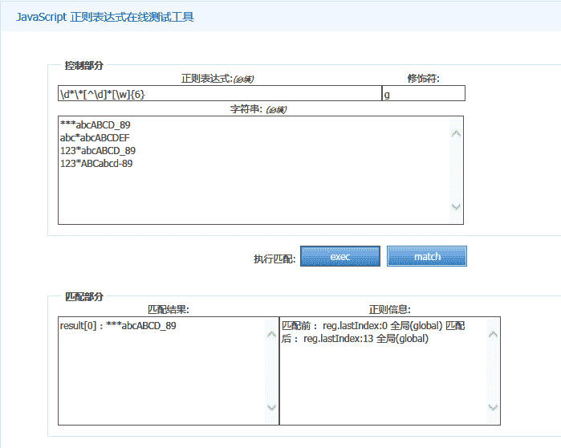

# 搜狗 2015 前端工程师笔试题

## 1

下列描述错误的是（）

正确答案: D   你的答案: 空 (错误)

```cpp
HTTP 状态码 302 表示暂时性转移
```

```cpp
domContentLoaded 事件早于 onload 事件
```

```cpp
IE6/7/8 不支持事件捕获
```

```cpp
localStorage 存储的数据，在刷新页面后会消失
```

本题知识点

HTML 前端工程师 安卓工程师 搜狗 2015

讨论

[牛客-007](https://www.nowcoder.com/profile/394118)

  查看全部)

编辑于 2015-01-28 10:17:29

* * *

[不眠的风云](https://www.nowcoder.com/profile/562396)

DHTTP 状态码 302 表示被请求的资源暂时转移(Moved temporatily)，然后会给出一个转移后的 URL，而浏览器在处理服务器返回的 302 错误时，原则上会重新建立一个 TCP 连接，然后再取重定向后的 URL 的页面；但是如果页面存在于缓存中，则不重新获取；onload 事件触发时，页面上所有的 DOM，样式表，脚本，图片，flash 都已经加载完成了，domContentLoaded 事件触发时，仅当 DOM 加载完成，不包括样式表，图片，flash。C 正确，故选 D

发表于 2015-01-20 16:43:48

* * *

[转型小咖](https://www.nowcoder.com/profile/7438875)

一些常见的状态码为：

200 - 服务器成功返回网页 
404 - 请求的网页不存在 
503 - 服务不可用 
详细分解：

1xx（临时响应） 
表示临时响应并需要请求者继续执行操作的状态代码。

代码 说明 
100 （继续） 请求者应当继续提出请求。服务器返回此代码表示已收到请求的第一部分，正在等待其余部分。 
101 （切换协议） 请求者已要求服务器切换协议，服务器已确认并准备切换。

2xx （成功） 
表示成功处理了请求的状态代码。

代码 说明 
200 （成功） 服务器已成功处理了请求。通常，这表示服务器提供了请求的网页。 
201 （已创建） 请求成功并且服务器创建了新的资源。 
202 （已接受） 服务器已接受请求，但尚未处理。 
203 （非授权信息） 服务器已成功处理了请求，但返回的信息可能来自另一来源。 
204 （无内容） 服务器成功处理了请求，但没有返回任何内容。 
205 （重置内容） 服务器成功处理了请求，但没有返回任何内容。 
206 （部分内容） 服务器成功处理了部分 GET 请求。

3xx （重定向） 
表示要完成请求，需要进一步操作。 通常，这些状态代码用来重定向。

代码 说明 
300 （多种选择） 针对请求，服务器可执行多种操作。服务器可根据请求者 (user agent) 选择一项操作，或提供操作列表供请求者选择。 
301 （永久移动） 请求的网页已永久移动到新位置。服务器返回此响应（对 GET 或 HEAD 请求的响应）时，会自动将请求者转到新位置。 
302 （临时移动） 服务器目前从不同位置的网页响应请求，但请求者应继续使用原有位置来进行以后的请求。 
303 （查看其他位置） 请求者应当对不同的位置使用单独的 GET 请求来检索响应时，服务器返回此代码。 
304 （未修改） 自从上次请求后，请求的网页未修改过。服务器返回此响应时，不会返回网页内容。 
305 （使用***） 请求者只能使用***访问请求的网页。如果服务器返回此响应，还表示请求者应使用***。 
307 （临时重定向） 服务器目前从不同位置的网页响应请求，但请求者应继续使用原有位置来进行以后的请求。

4xx（请求错误） 
这些状态代码表示请求可能出错，妨碍了服务器的处理。

代码 说明 
400 （错误请求） 服务器不理解请求的语法。 
401 （未授权） 请求要求身份验证。 对于需要登录的网页，服务器可能返回此响应。 
403 （禁止） 服务器拒绝请求。 
404 （未找到） 服务器找不到请求的网页。 
405 （方法禁用） 禁用请求中指定的方法。 
406 （不接受） 无法使用请求的内容特性响应请求的网页。 
407 （需要***授权） 此状态代码与 401（未授权）类似，但指定请求者应当授权使用***。 
408 （请求超时） 服务器等候请求时发生超时。 
409 （冲突） 服务器在完成请求时发生冲突。服务器必须在响应中包含有关冲突的信息。 
410 （已删除） 如果请求的资源已永久删除，服务器就会返回此响应。 
411 （需要有效长度） 服务器不接受不含有效内容长度标头字段的请求。 
412 （未满足前提条件） 服务器未满足请求者在请求中设置的其中一个前提条件。 
413 （请求实体过大） 服务器无法处理请求，因为请求实体过大，超出服务器的处理能力。 
414 （请求的 URI 过长） 请求的 URI（通常为网址）过长，服务器无法处理。 
415 （不支持的媒体类型） 请求的格式不受请求页面的支持。 
416 （请求范围不符合要求） 如果页面无法提供请求的范围，则服务器会返回此状态代码。 
417 （未满足期望值） 服务器未满足”期望”请求标头字段的要求。

5xx（服务器错误） 
这些状态代码表示服务器在尝试处理请求时发生内部错误。 这些错误可能是服务器本身的错误，而不是请求出错。

代码 说明 
500 （服务器内部错误） 服务器遇到错误，无法完成请求。 
501 （尚未实施） 服务器不具备完成请求的功能。例如，服务器无法识别请求方法时可能会返回此代码。 
502 （错误网关） 服务器作为网关或***，从上游服务器收到无效响应。 
503 （服务不可用） 服务器目前无法使用（由于超载或停机维护）。通常，这只是暂时状态。 
504 （网关超时） 服务器作为网关或***，但是没有及时从上游服务器收到请求。 
505 （HTTP 版本不受支持） 服务器不支持请求中所用的 HTTP 协议版本。

HttpWatch 状态码 Result is

200 - 服务器成功返回网页，客户端请求已成功。 
302 - 对象临时移动。服务器目前从不同位置的网页响应请求，但请求者应继续使用原有位置来进行以后的请求。 
304 - 属于重定向。自上次请求后，请求的网页未修改过。服务器返回此响应时，不会返回网页内容。 
401 - 未授权。请求要求身份验证。 对于需要登录的网页，服务器可能返回此响应。 
404 - 未找到。服务器找不到请求的网页。 
2xx - 成功。表示服务器成功地接受了客户端请求。 
3xx - 重定向。表示要完成请求，需要进一步操作。客户端浏览器必须采取更多操作来实现请求。例如，浏览器可能不得不请求服务器上的不同的页面，或通过***服务器重复该请求。 
4xx - 请求错误。这些状态代码表示请求可能出错，妨碍了服务器的处理。 
5xx - 服务器错误。表示服务器在尝试处理请求时发生内部错误。 这些错误可能是服务器本身的错误，而不是请求出错。

发表于 2017-09-15 11:42:27

* * *

## 2

以下这段 JavaScript 程序的输出是什么？

```cpp
<SCRIPT LANGUAGE="JavaScript">
    var a="undefined";
    var b="false";
    var c="";
    function assert(aVar){
        if(aVar)      
            alert(true);
        else  
            alert(false);
    }
    assert(a);
    assert(b);
    assert(c);
</SCRIPT>
```

正确答案: B   你的答案: 空 (错误)

```cpp
true，true，true
```

```cpp
true，true，false
```

```cpp
false，false，true
```

```cpp
false，false，false
```

本题知识点

Javascript 前端工程师 安卓工程师 搜狗 2015

讨论

[速效扎心丸](https://www.nowcoder.com/profile/801565)

选 B 变量 abc 都是字符  查看全部)

编辑于 2015-01-28 10:11:55

* * *

[阿琛 Bonnie](https://www.nowcoder.com/profile/737314)

```cpp
var a="undefined", b="false", c="null", d="",e="0";
var f=undefined,g=false,h=null,i=0;
function assert(x) {
    if (x) {
        console.log("true");
    }
    else{
        console.log("false");
    }
}
console.log(assert(a));//true
console.log(assert(b));//true
console.log(assert(c));//true
console.log(assert(d));//false
console.log(assert(e));//true
console.log(assert(f));//false
console.log(assert(g));//false
console.log(assert(h));//false
console.log(assert(i));//false
console.log(assert(j));//false 
```

if（condition）的 condition 求值结果若非布尔值，ECMAScript 会自动调用 Boolean()转换函数将结果转换为布尔值。转换规则为：数据类型        转换为 true 的        转换为 false 的 String        任何非空字符串          “”（空字符串）Number    任何非零数值（包括无穷大）        0 和 NaNObject        任何对象        nullundefined        --        undefined        

发表于 2016-02-09 19:12:43

* * *

[happy_ 千千结](https://www.nowcoder.com/profile/461444)

| 数据类型 | 转换为 true | 转换为 false |
| boolean | true | false |
| String | 任何非空字符串 | 空字符串 |
| Number | 任何非零数字值 | 0 和 NaN |
| Object | 任何对象 | null |
| Undefined | n/a | undefined |

发表于 2015-11-18 12:17:23

* * *

## 3

正则表达式/^\d*\*[^\d]*[\w]{6}$/,下面的字符串中哪个能正确匹配？

正确答案: A C   你的答案: 空 (错误)

```cpp
***abcABCD_89
```

```cpp
abc*abcABCDEF
```

```cpp
123*abcABCD_89
```

```cpp
123*ABCabcd-89
```

本题知识点

正则表达式 前端工程师 安卓工程师 搜狗 2015

讨论

[Pandora](https://www.nowcoder.com/profile/266279)

感谢[Keystion](http://www.nowcoder.com/profile/738944)的评论，再次看回这道题。个人认为答案是 A,C，大家可以由工具测试。-----------------------------------https://msdn.microsoft.com/zh-cn/library/ae5bf541(VS.80).aspx/^表示匹配输入字符串开始的位置， \d*表示零次或多次数字， \*是转义字符*，[^\d]*表示 零次或多次非数字，[\w]{6}表示所有字符 6 次,$/表示匹配输入字符串结尾的位置。 B 的*之前一定是数字，排除；D 有连字符-，排除。A 其匹配\d*为零次，再匹配一个*，[^\d]*表示 零次或多次**非数字** ，这里匹配**abcA， [\w]{6}匹配 BCD_89；第一次将 A 排除，完全是因为没有将*当作“非数字”。感谢[Keystion](http://www.nowcoder.com/profile/738944)。http://tools.jb51.net/tools/regex.asp

编辑于 2015-08-10 11:05:17

* * *

[Mr.Apple](https://www.nowcoder.com/profile/213669)

**/**  **^    ** **\d***  **\***  **[^\d]***  **[\w]{6}**  **$**  **/**

| ^ | 匹配输入字符串的开始位置。 |

| \d | 匹配一个数字字符。等价于 [0-9]。  |

| * | 匹配前面的子表达式零次或多次。 |

| \ | 将下一个字符标记为一个特殊字符、或一个原义字符、或一个 向后引用、或一个八进制转义符。 |

| [^a-z] | 负值字符范围。匹配任何不在指定范围内的任意字符。 |

| [^xyz] | 负值字符集合。匹配未包含的任意字符。 |

| \w | 匹配包括下划线的任何单词字符。等价于'[A-Za-z0-9_]'。 |

| {n} | n 是一个非负整数。匹配确定的 n 次。 |

| $ | 匹配输入字符串的结束位置。 |

发表于 2016-07-29 10:48:27

* * *

[zackH](https://www.nowcoder.com/profile/458886)

推荐答案说得很对呃。 **/^\d*\*[^\d]*[\w]{6}$/ ** 首先/regex/前后的斜杠只是表示里面是正则表达式，其次的前后的^和$表示正则头尾，\d*表示数字 0 个或多个，\*表示一个*，那开头需要是*或者数字*，[^\d]*表示非数字 0 个或多个，[\w]{6}表示字母或者数字或者下划线 6 个。

发表于 2016-08-23 22:35:42

* * *

## 4

```cpp
function Foo(){
     var i=0;
     return function(){
         document.write(i++);
     }
}
var f1=Foo(),
f2=Foo();
f1();
f1();
f2();
```

请问以上程序的输出是

正确答案: A   你的答案: 空 (错误)

```cpp
010
```

```cpp
012
```

```cpp
000
```

```cpp
011
```

本题知识点

Javascript 前端工程师 安卓工程师 搜狗 2015

讨论

[牛客-007](https://www.nowcoder.com/profile/394118)

  查看全部)

编辑于 2015-01-28 10:08:55

* * *

[醒醒鱼](https://www.nowcoder.com/profile/793318)

1.当函数被创建时，内部[scope]属性被存储，在这个属性中保存一个包含全局变量对象的作用域链。2.当函数被调用时，会创建一个执行环境及相应的作用域链，argument 和实参为其进行初始化。这里 f1()函数和 f2()函数在调用时会创建两个执行环境，保存各自的变量对象，结果是没有关系的。而同一个函数在多次调用时返回值会被保存在同一个变量对象中。

发表于 2015-07-21 09:06:28

* * *

[千寻 0409](https://www.nowcoder.com/profile/295167)

f1(),f2()分别创建了自己的执行环境，所以它们两个是相互独立的，执行之后都会返回一个匿名函数，这个匿名函数的作用域链被初始化为其包含函数的活动对象(这里也就是 i)和全局变量对象，f1 执行之后 i 并不会销毁，因为返回的匿名函数还要引用 i，i 仍然在内存中，所以执行两次之后 i 的值变成了 1，而 f2 执行之后 i 为 0

发表于 2016-07-26 17:24:38

* * *

## 5

以下哪个选项不是块级元素（）

正确答案: B   你的答案: 空 (错误)

```cpp
div
```

```cpp
span
```

```cpp
p
```

```cpp
h1
```

本题知识点

HTML 前端工程师 安卓工程师 搜狗 2015 前端工程师 搜狗 2015

讨论

[MyGoodHelper](https://www.nowcoder.com/profile/644326)

B 大多数 HTML 元  查看全部)

编辑于 2015-01-19 21:17:42

* * *

[雯子姐姐](https://www.nowcoder.com/profile/2779354)

常见的内联元素：<a>、<b>、<span>、<i>、<em>、<strong>、<label>、<q>、<var>、<cite>、<code>常见的块级元素：<div>、<p>、<hx>、<ol>、<ul>、<dl>、<tabel>、<address>、<blockquote>、<form>常见的内联块级元素：、<input>

发表于 2016-08-12 22:55:53

* * *

[WHROC21](https://www.nowcoder.com/profile/258941)

行内元素有：a b span img input select strong（强调的语气） 块级元素有：div ul ol li dl dt dd h1 h2 h3 h4…p

发表于 2015-09-06 14:40:47

* * *

## 6

以下哪一个选项是 html5 的 DTD？

正确答案: A   你的答案: 空 (错误)

```cpp
<!DOCTYPE html>
```

```cpp
<!DOCTYPE HTML PUBLIC>
```

```cpp
<!DOCTYPE xhtml>
```

```cpp
<!DOCTYPE HTML5>
```

本题知识点

HTML 前端工程师 安卓工程师 搜狗 2015

讨论

[MyGoodHelper](https://www.nowcoder.com/profile/644326)

A<!DOCTYPE>  查看全部)

编辑于 2015-01-24 17:41:07

* * *

[啊哈啊哈啊哈](https://www.nowcoder.com/profile/173599)

在 HTML 4.01 中， 声明引用 DTD，因为 HTML 4.01 基于 SGML。DTD 规定了标记语言的规则，这样浏览器才能正确地呈现内容。 HTML5 不基于 SGML，所以不需要引用 DTD。 在 HTML 4.01 中有三种 声明。在 HTML5 中只有一种：

发表于 2016-03-24 10:45:35

* * *

[最讨厌晚上 9 点半，钉钉响起的声音](https://www.nowcoder.com/profile/303433)

dtd  文档类型声明/定义。

发表于 2017-03-29 22:39:53

* * *

## 7

现有如下 html 结构

```cpp
<ul>
 <li>click me</li>
 <li>click me</li>
 <li>click me</li>
 <li>click me</li>
</ul>
```

运行如下代码：

```cpp
var elements=document.getElementsByTagName('li');
var length=elements.length;
for(var i=0;i<length;i++){
    elements[i].onclick=function() {
        alert(i);
    }
}
```

依次点击 4 个 li 标签，哪一个选项是正确的运行结果?

正确答案: D   你的答案: 空 (错误)

```cpp
依次弹出 1，2，3，4
```

```cpp
依次弹出 0，1，2，3
```

```cpp
依次弹出 3，3，3，3
```

```cpp
依次弹出 4，4，4，4
```

本题知识点

HTML Javascript 前端工程师 安卓工程师 搜狗 2015

讨论

[雄起的小巨人](https://www.nowcoder.com/profile/735833)

```cpp
//权威解答——来自 javascript 语言精粹
var elements=document.getElementsByTagName('li');
    var length=elements.length;
    for(var i=0;i<length;i++){
        elements[i].onclick=function(){
        alert(i);
    }
 }
```

解答：这里的事件，绑定的并非是 i 的值，而是 i 本身（alert 里的 i），所以当程序执行完，i 的值变为 4，去执行 onclick 事件时，执行 alert(i) ,自动查找 i，值为 4，所以依次弹出 4。

改正：

```cpp
var elements=document.getElementsByTagName('li');
    var length=elements.length;
    var handler = function(i){
        return fucntion(){
            alert(i);
        }
    }
    for(var i=0;i<length;i++){
        elements[i].onclick= handler(i);
 }
```

避免在循环中创建函数，可以在循环之外创建一个辅助函数，让这个辅助函数返回一个绑定了当前 i 值得函数，避免混淆

* * *

2020-05-02 更新
今天恰好遇到使用 async 来解决这个问题的办法，顺便更新几个解决办法。
有代码如下：

```cpp
for(var i=0; i < 10; i++) {                
    setTimeout(function() {
    console.log(i);
    }, 1000);
} 
```

可以猜到代码执行 1s 后，依次打印 10 个"10".
解决办法：

1.  利用块级作用域(最简单，推荐)

    ```cpp
    for(let i=0; i < 10; i++) {                
     setTimeout(function() {
     console.log(i);
     }, 1000);
    } 
    // 依次打印 0 - 9
    ```

2.  利用自执行函数，将 i 作为参数传入

    ```cpp
    for(var i=0; i < 10; i++) {
     (function(i) {
         setTimeout(function() {
             console.log(i);
     }, 1000);
     })(i);        
    }
    ```

3.  利用 setTimeout 的第三个参数，将 i 作为参数传入 function

    ```cpp
    for(var i=0; i < 10; i++) {
     setTimeout(function(j) {
     console.log(j);
     }, 1000, i);
    }
    ```

4.  利用 promise（使用 promise 的办法，是为了更好地理解 promise）

    ```cpp
    for(var i=0; i < 10; i++) {
     new Promise((resolve, reject) => {
     var j = i;
     setTimeout(function() {
         console.log(j)
     }, 1000);
     })
    }
    ```

5.  利用 async 函数（为了理解 async 函数）

    ```cpp
    async function foo() {
     for(var i=0; i < 10; i++) {
     let result = await new Promise((resolve, reject) => {
         setTimeout(function() {
         resolve(i);
             }, 1000);
     });
     console.log(result);
     }
    }
    foo(); 
    // 每隔 1s 打印数字 0 - 9
    ```

编辑于 2020-05-02 20:10:53

* * *

[木吉他的夏天](https://www.nowcoder.com/profile/981243)

我的理解是：每个 li 标签的 onclick 事件执行时，本身 onclick 绑定的 function 的作用域中没有变量 i，i 为 undefined,则解析引擎会寻找父级作用域，发现父级作用域中有 i，且 for 循环绑定事件结束后，i 已经赋值为 4，所以每个 li 标签的 onclick 事件执行时，alert 的都是父作用域中的 i，也就是 4。这是作用域的问题。

编辑于 2015-08-20 21:48:27

* * *

[街角的守望者](https://www.nowcoder.com/profile/3022270)


编辑于 2016-08-28 15:48:14

* * *

## 8

下面列出的浏览器，无 webkit 内核的是（）

正确答案: D   你的答案: 空 (错误)

```cpp
chrome
```

```cpp
Safari
```

```cpp
搜狗浏览器
```

```cpp
firefox
```

本题知识点

HTML 前端工程师 安卓工程师 搜狗 2015 前端工程师 搜狗 2015

讨论

[MyGoodHelper](https://www.nowcoder.com/profile/644326)

DWekbit 是一个开  查看全部)

编辑于 2015-01-14 10:40:18

* * *

[牛客 864832 号](https://www.nowcoder.com/profile/864832)

D。[浏览器](http://baike.baidu.com/view/7718.htm) 的内核引擎，基本上是四分天下：1）Trident: IE 以 Trident 作为内核引擎；2)Gecko: Firefox 是基于 Gecko 开发；3）WebKit: Safari, Google Chrome,傲游 3,猎豹浏览器,百度浏览器 opera 浏览器；4）Presto: Opera 的内核，但由于市场选择问题，主要应用在手机平台--Opera mini 注：2013 年 2 月 Opera 宣布转向 WebKit 引擎注：2013 年 4 月 Opera 宣布放弃 WEBKIT，跟随 GOOGLE 的新开发的[blink 引擎](http://baike.baidu.com/view/10399127.htm)

发表于 2015-03-02 17:22:34

* * *

[蒟蒻的菜鸡](https://www.nowcoder.com/profile/779405)

1.  一、Trident 内核代表产品 Internet Explorer，又称其为 IE 内核。Trident（又称为 MSHTML），是微软开发的一种排版引擎。使用 Trident 渲染引擎的浏览器包括：IE、傲游、世界之窗浏览器、Avant、腾讯 TT、Netscape 8、NetCaptor、Sleipnir、GOSURF、GreenBrowser 和 KKman 等。

2.  二、Gecko 内核代表作品 Mozilla FirefoxGecko 是一套开放源代码的、以 C++编写的网页排版引擎。Gecko 是最流行的排版引擎之一，仅次于 Trident。使用它的最著名浏览器有 Firefox、Netscape6 至 9。

3.  三、WebKit 内核代表作品 Safari、Chromewebkit 是一个开源项目，包含了来自 KDE 项目和苹果公司的一些组件，主要用于 Mac OS 系统，它的特点在于源码结构清晰、渲染速度极快。缺点是对网页代码的兼容性不高，导致一些编写不标准的网页无法正常显示。主要代表作品有 Safari 和 Google 的浏览器 Chrome。

4.  四、Presto 内核代表作品 OperaPresto 是由 Opera Software 开发的浏览器排版引擎，供 Opera 7.0 及以上使用。它取代了旧版 Opera 4 至 6 版本使用的 Elektra 排版引擎，包括加入动态功能，例如网页或其部分可随着 DOM 及 Script 语法的事件而重新排版。

发表于 2017-03-27 21:27:42

* * *