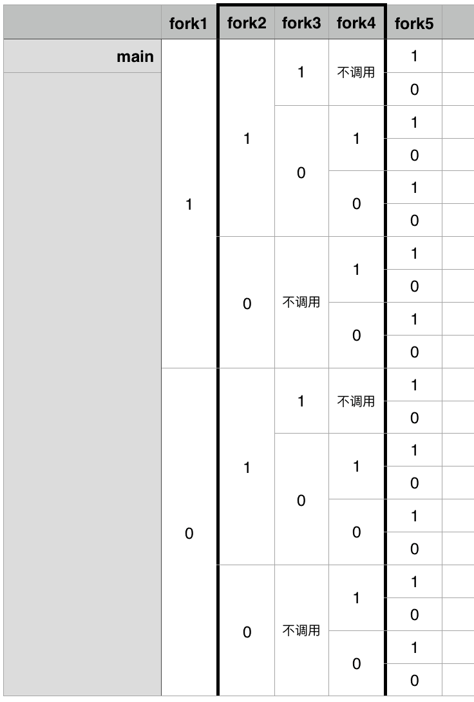
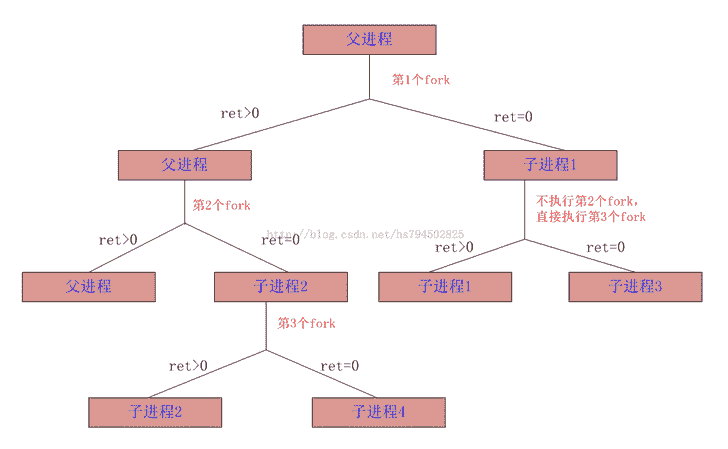
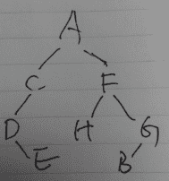
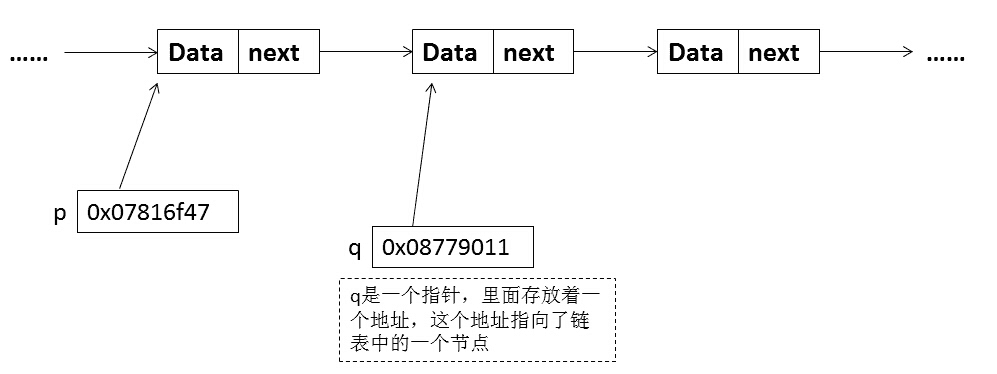

# 阿里巴巴 2015 校招研发在线笔试题

## 1

下面代码不算 main 这个进程，一共创建了多少个进程（）

```cpp
int main(int argc, char* argv[])
{
   fork();
   fork() && fork() || fork();
   fork();
}
```

正确答案: B   你的答案: 空 (错误)

```cpp
18
```

```cpp
19
```

```cpp
20
```

```cpp
21
```

本题知识点

Linux 人人网

讨论

[karonl](https://www.nowcoder.com/profile/749144)



发表于 2016-03-05 16:52:43

* * *

[CvCapture](https://www.nowcoder.com/profile/542107)

考查两个点 1、A&&B||CA 为假，跳过 B，判断 CA 为真，判断 B，若 B 为真，跳过 C                          若 B 为假，判断 C2、fork（）函数父进程返回子进程 ID；子进程返回 0 第一条语句新增 1 个第二条语句新增 4*2 个第三条语句，此时已有进程 1+1+4*2 个，所以新增 10 个

发表于 2015-07-21 22:37:15

* * *

[ali_john](https://www.nowcoder.com/profile/837208)

此题考查两个知识点：1.fork()是一个分叉函数，返回值： 若成功调用一次则返回两个值，子进程返回 0， [父进程](http://baike.baidu.com/view/8507578.htm) 返回子进程标记；否则，出错返回-1。2.  A&& B|| C 的考查，  A&&B，如果 A=0，就没有必要继续执行&&B 了；A 非 0，就需要继续执行&&B。      A||B，如果 A 非 0，就没有必要继续执行||B 了，A=0，就需要继续执行||B。  所以，第一次 fork()之后，进程数为 2，第二条，A&& B|| CA 执行后，返回两个分别为 0，和非 0，按照上面 2 的规则，执行情况一共是 5 条路径，所以结束后共有进程数 2*5，最后一条执行完毕，再次加倍，2*5*2=20，减去 main()主进程，共有 19 个

发表于 2015-08-13 20:31:41

* * *

## 2

在一个童话世界里，任意两个人之间要么是朋友关系，要么是敌人关系，不存在其他关系及没有关系的情况。并且，如果 A 和 B 是朋友关系，B 和 C 是朋友关系，那么 A 和 C 必然是朋友关系。那么关于这个童话世界中的人群的说法错误的是：______？

正确答案: D   你的答案: 空 (错误)

```cpp
可能只有 1 个人群，这个人群内部是朋友关系。
```

```cpp
可能有 2 个人群，人群内部是朋友关系，人群之间是敌人关系。
```

```cpp
可能有 3 个及以上个人群，人群内部是朋友关系，人群之间是敌人关系。
```

```cpp
如果存在多个人群，并且人群内部是朋友关系，人群之间是敌人关系，那么这些人群必然是差不多大小的。
```

本题知识点

判断推理

讨论

[VDreamS_Right](https://www.nowcoder.com/profile/955572)

如同楚汉或者三国，但是国家有大小强弱之分，所以 D 错误！

发表于 2015-08-20 22:29:51

* * *

[停停走走 _123](https://www.nowcoder.com/profile/424739)

感觉可以举例说明，这边一群相互认识是朋友，那边一群是朋友，而两群又相互是敌人，为什么大小要差不多呢

发表于 2015-08-21 09:31:56

* * *

[OOACMer](https://www.nowcoder.com/profile/632326)

答案 D:朋友的朋友是朋友，敌人的敌人不一定是朋友，题中未涉及人群的大小问题所以选 D

发表于 2015-08-09 18:59:23

* * *

## 3

下面的函数哪个是系统调用而不是库函数()？

正确答案: D   你的答案: 空 (错误)

```cpp
printf
```

```cpp
scanf
```

```cpp
fgetc
```

```cpp
read
```

```cpp
print_s
```

```cpp
scan_s
```

本题知识点

Linux C++ 阿里巴巴

讨论

[牛客-007](https://www.nowcoder.com/profile/394118)

  查看全部)

编辑于 2015-01-30 16:02:44

* * *

[半纸流年](https://www.nowcoder.com/profile/710504)

系统调用实际上就是指最底层的一个调用，在 linux 程序设计里面就是底层调用的意思。面向的是硬件。而库函数调用则面向的是应用开发的，相当于应用程序的 api。

发表于 2016-02-18 20:46:13

* * *

[心清](https://www.nowcoder.com/profile/158614)

很容易判断，那些什么 print 和 scan 都是 C 库函数，只有 read，这是一个 linux 下的系统函数，C 库函数相应的函数是 fread。

发表于 2015-08-22 20:42:32

* * *

## 4

一条很长的河，河水的流速是 1m/s，一个皮划艇逆流滑行的速度是 2m/s。某一刻皮划艇运动员发现丢失了一只漂流瓶，然后调头顺流以相同的节奏划船，经过半小时后发现了漂流瓶。请问船调头时距离漂流瓶多远（）？

正确答案: A   你的答案: 空 (错误)

```cpp
5400m
```

```cpp
3600m
```

```cpp
7200m
```

```cpp
1800m
```

```cpp
9000m
```

```cpp
无法判断
```

本题知识点

数学运算

讨论

[大爱冷色调](https://www.nowcoder.com/profile/398773)

  查看全部)

编辑于 2015-01-30 16:01:58

* * *

[sucre](https://www.nowcoder.com/profile/554740)

以流动的河水为参考系，在此参考系中，帽子是静止的，皮划艇的速度是 2+1=3。找回静止的帽子只需原路返回 3*（30*60）=5400。

发表于 2015-03-29 11:45:27

* * *

[Zhupipi](https://www.nowcoder.com/profile/402785)

A 皮艇逆行速度是 2，则在静水中速度是 2+1=3，顺水速度是 3+1=4，半个小时行进 7200m，同时瓶子漂流速度是 1，半个小时行进 1800m，7200-1800

发表于 2015-03-25 22:11:20

* * *

## 5

某二维平面上有 12 个位置不同的点，通过连接其中任意两点，可以画出 59 条不同的直线。那么，在 59 条直线中，经过 3 个或 3 个以上的点的直线有（）条。

正确答案: C   你的答案: 空 (错误)

```cpp
0
```

```cpp
1
```

```cpp
2
```

```cpp
3
```

```cpp
5
```

```cpp
7
```

本题知识点

智力题 阿里巴巴

讨论

[飞云](https://www.nowcoder.com/profile/819467)

答案：C12 个点，任意  查看全部)

编辑于 2015-01-30 15:57:47

* * *

[牛客-007](https://www.nowcoder.com/profile/394118)

答案：C
如果 12 个点中不存在任意三点共线的话，一共有 C（12,2）=66 条直线
题目说有 59 条直线，则一定存在三点或者三点以上共线的情况。
3 点不共线，有 C（3,2）=3 条直线，3 点共线有 1 条
4 点不共线，有 C（4,2）=6 条直线，4 点共线有 1 条
5 点不共线，有 C（5,2）=10 条直线，5 点共线有 1 条
如果存在 5 点共线的情况，则 12 个点至多有 66-10+1=57 条直线，所以不存在 5 点共线的情况
如果存在 4 点共线的情况，则 12 个点至多有 66-6+1=61 条直线，所以可能存在这种情况
如果存在 3 点共线的情况，则 12 个点至多有 66-3+1=64 条直线，所以可能存在这种情况
如果 3 点共线和 4 点共线情况都存在，则有 66-6+1-3+1=59 条直线
所以这些点中有一个 3 点共线的，有一个 4 点共线的。
所以穿过 3 个或三个以上的点直线有 2 条

发表于 2015-01-29 17:06:18

* * *

[奋斗的小鸟](https://www.nowcoder.com/profile/337144)

3 点一线,会减少 2 条 4 点一线,会在 3 点一线的基础上再减少 3 条,也就是 5 条题目中 c(12,2)  -59 = 66 - 59 = 7 答案为 2

发表于 2015-07-08 00:25:34

* * *

## 6

某航空公司有 M 个城市之间的全连通运营线路，最近业务扩张，新增了 N（>1)个城市。为了保持其全连通运营的特色，公司新增了 58 种单程票（往与返各算一种单程票，没有联程票）；那么扩张后，该航空公司有（）个城市间的运营能力。

正确答案: D   你的答案: 空 (错误)

```cpp
13
```

```cpp
14
```

```cpp
15
```

```cpp
16
```

```cpp
17
```

```cpp
18
```

本题知识点

数学运算

讨论

[eagle](https://www.nowcoder.com/profile/603476)

D 对于 x 个城市，  查看全部)

编辑于 2015-01-30 16:16:34

* * *

[牛客-007](https://www.nowcoder.com/profile/394118)

答：D
原来 M 个城市需要 C（M,2）条航线。往返票需要 2*C（M,2）
增加 N 个城市后需要 C（M+N，2）条航线。往返票需要 2*C（M+N,2）
2*(C（M+N，2）-C（M,2)）=58；
M，N 都是正整数，且 N>1
解得 M=14,N=2
M+N=16;

发表于 2015-01-29 16:58:17

* * *

[Lime 丶](https://www.nowcoder.com/profile/274664)

增加 1 个城市，则增加 M 条往返程票；增加 2 个，则增加 M+(M+1)条往返程；增加 N 个，则增加 M+(M+1)+...+(M+N-1) 条(即 29 条)往返程；易得 14+15=29，即 N=2，M=14 故 共 16 个城市全联通选 D。

发表于 2015-07-03 23:49:37

* * *

## 7

下列不属于 hash 碰撞解决方法的是（）。

正确答案: B   你的答案: 空 (错误)

```cpp
线性探测
```

```cpp
单旋转法
```

```cpp
二次探测
```

```cpp
拉链法
```

```cpp
双重散列
```

```cpp
多重散列
```

本题知识点

哈希 *阿里巴巴 Java 工程师 C++工程师 PHP 工程师 golang 工程师 前端工程师 安卓工程师 iOS 工程师 算法工程师 大数据开发工程师 运维工程师 安全工程师 数据库工程师 游戏研发工程师 测试开发工程师 测试工程师 2021 远景能源有限公司* *讨论

[牛客-007](https://www.nowcoder.com/profile/394118)

答案：B 旋转法是将数据  查看全部)

编辑于 2015-01-30 15:56:26

* * *

[转角遇到你](https://www.nowcoder.com/profile/214168)

常见哈希冲突解决办法：1.开放地址法 2.线性探测法 3.链地址法（拉链法） 4.二次探测法 5.伪随机探测法 6.再散列（双重散列，多重散列） 7.建立一个公共溢出区单旋转法是建立散列函数的一种方法， ，将最后一位数，旋转放置到第一位常见的散列函数有，直接定址法，数字分析法，平法取中法，取余法，折叠法，随机法

发表于 2015-08-22 10:42:00

* * *

[JNYM](https://www.nowcoder.com/profile/397040)

单旋转法是一种 hash 函数的构造方法，将最后一位数，旋转放置到第一位，其余的往右移。如 5062101 旋转之后得到 1506210，

编辑于 2015-08-17 17:17:37

* * *

## 8

针对外部存储器（如磁盘）上存放的程序和数据，说法正确的是（）。

正确答案: B   你的答案: 空 (错误)

```cpp
可由 CPU 直接进行读取写入操作
```

```cpp
须在 CPU 访问之前移入内存
```

```cpp
必须由文件系统管理的
```

```cpp
必须由进程调度程序管理
```

```cpp
程序和数据必须为只读
```

```cpp
程序和数据只能被一个进程独占
```

本题知识点

操作系统 阿里巴巴

讨论

[Geek_Paul](https://www.nowcoder.com/profile/805693)

  查看全部)

编辑于 2015-01-30 15:55:49

* * *

[StrongYoung](https://www.nowcoder.com/profile/649626)

这题好像 B 和 C 有些争议，谈一下我的看法。A.  可由 CPU 直接进行读取写入操作 //错误，CPU 不能直接读取磁盘上的数据，如果可以，那还要内存干嘛，何况 CPU 与磁盘的速度差距太大，如果真要直接访问磁盘的数据的话，那 CPU 的效率也太差了。**B. ** **须在 CPU 访问之前移入内存  //这个有争议，看怎么理解。如果理解成：CPU 访问的数据，需要先调入内存，然后再访问，那么就正确，如果理解成：CPU 要访问的数据，必须先在内存，那就错了，因为也许在内存中找不到数据，发生缺页，然后再调入内存。不过，我更趋于前者。** **毕竟，不管有没有发生缺页，在 CPU 访问数据之前，数据都是要先调入内存的。****C. ** **必须由文件系统管理的 //我在想，有没有什么设备可以存储数据，但又没文件系统呢？我的理解是，把数据和文件嵌入到硬件里了。那么这个时候，是不需要文件系统管理的。**D. 必须由进程调度程序管理  //错误，由文件系统管理
E.  程序和数据必须为只读  //错误，肯定可以修改的了。
F.  程序和数据只能被一个进程独占  //错误，数据和程序是可以共享的。综上所述，还是选 B 靠谱一点。

编辑于 2015-08-18 17:57:44

* * *

[半纸流年](https://www.nowcoder.com/profile/710504)

[内存](http://baike.baidu.com/view/1082.htm)是计算机中重要的部件之一，它是与 CPU 进行沟通的桥梁。计算机中所有程序的运行都是在[内存](http://baike.baidu.com/view/1082.htm)中进行的。
另一方面，硬盘的读写性能较差，CPU 读写性能强。这样会导致性能浪费。将需要的数据提前加载到内存中。将数据的处理都放在内存上操作，提高了整个电脑的性能。

发表于 2016-02-20 10:09:29

* * *

## 9

在 32 位操作系统中，下列类型占用 8 个字节的为（）。

正确答案: D   你的答案: 空 (错误)

```cpp
short int
```

```cpp
int C long
```

```cpp
unsigned int
```

```cpp
long long
```

```cpp
char
```

```cpp
int
```

本题知识点

编程基础 *阿里巴巴* *讨论

[牛客-007](https://www.nowcoder.com/profile/394118)

答案：D 32 位系统中  查看全部)

编辑于 2015-01-30 15:54:56

* * *

[炫](https://www.nowcoder.com/profile/376795)

32 位操作系统

char ：1 个字节(固定)

*(即指针变量): 4 个字节(32 位机的寻址空间是 4 个字节。同理 64 位编译器)(变化*)

short int : 2 个字节(固定)

int： 4 个字节(固定)

unsigned int : 4 个字节(固定)

float: 4 个字节(固定)

double: 8 个字节(固定)

long: 4 个字节

unsigned long: 4 个字节(变化*,其实就是寻址控件的地址长度数值)

long long: 8 个字节(固定)

**参考：http://blog.csdn.net/huyisu/article/details/17604983**

发表于 2016-04-03 12:50:19

* * *

[夏雨天](https://www.nowcoder.com/profile/710633)

选择 D：可以用 sizeof(int ),sizeof(float )等来测试。在 32 位系统中 short 占 2 字节，int 、float、long 都占 4 字节，double 和 long long 占 8 

发表于 2015-06-30 22:03:57

* * *

## 10

村长带着 4 对父子参加爸爸去哪儿第三季第二站某村庄的拍摄。村里为了保护小孩不被拐走有个前年的规矩，那就是吃饭时候小孩左右只能是其他小孩或自己的父母，那么 4 对父子在圆桌上共有多少种坐法。(旋转一下，每个人面对方向变更后算是一种新的坐法)

正确答案: D   你的答案: 空 (错误)

```cpp
144
```

```cpp
240
```

```cpp
288
```

```cpp
480
```

```cpp
576
```

```cpp
960
```

本题知识点

组合数学 *阿里巴巴* *讨论

[麻花儿](https://www.nowcoder.com/profile/377610)

答案是 480 问题的关键  查看全部)

编辑于 2015-06-19 20:54:27

* * *

[Alpha.Tan](https://www.nowcoder.com/profile/609489)

答案：D 有两种分配方案

1.  四个爸爸坐一半：4 个爸爸任意排列即 4!，与爸爸相邻的孩子被确定，所以只有两个孩子任意排列即 2!。再加上旋转一圈即 4! * 2! * 8 = 384
2.  两个爸爸两个儿子交替：4 个爸爸在两个二连中任意分配即 A[4] ² * A[2] ²。儿子根据爸爸的位置确定。旋转一圈导致出现一半会与之前的重复即[4] ²  * A [2] ² * 4 = 96

总共 384 + 96 = 480 种坐法

发表于 2015-04-02 09:00:45

* * *

[废材大叔](https://www.nowcoder.com/profile/584096)

添加一种思路，选 e 的建议看一看，我一开始就是错在 e 上了。四娃连坐的很简单了，A44 确定娃的顺序，因为 4 个娃的顺序定了，两边的爹就定了，还剩两个爹 A22，旋转，最后再乘以 8\.爹娃连坐，可以想象把爹和娃绑在了一起，8 个元素变成 4 个了，虽然两个爹必须背靠背做，但是不影响排列组合，A44，排序，但是这次旋转是乘以 4，不是 8 了，因为已经看成 4 个元素了，所以就选 D 了

编辑于 2015-08-20 20:23:16

* * *

## 11

已知一个二叉树的前序遍历结果是（ACDEFHGB） ，中序遍历结果是（DECAHFBG）,请问后续遍历结果是（）。

正确答案: B   你的答案: 空 (错误)

```cpp
HGFEDCBA
```

```cpp
EDCHBGFA
```

```cpp
BGFHEDCA
```

```cpp
EDCBGHFA
```

```cpp
BEGHDFCA
```

```cpp
BGHFEDCA
```

本题知识点

树 阿里巴巴

讨论

[牛客-007](https://www.nowcoder.com/profile/394118)

答案：B 根据前序遍历可  查看全部)

编辑于 2015-01-30 15:52:40

* * *

[大明白](https://www.nowcoder.com/profile/706564)

选 B 根据已知条件得到树结构如下：

发表于 2015-03-11 16:50:59

* * *

[Lime 丶](https://www.nowcoder.com/profile/274664)

前序为根左右，中序为左根右，后序为左右根（可以根据根的位置进行记忆）在前序中可得根，将中序分为左子树(DEC)根(A)右子树(HFBG)左子树(DEC)中由前序可得 C 为根，DE 是左子树；同理可得其它结果为 B

编辑于 2015-07-04 00:05:36

* * *

## 12

并发进程执行的相对速度是（）。

正确答案: D   你的答案: 空 (错误)

```cpp
由进程的程序结构决定
```

```cpp
由进程本身来控制
```

```cpp
进程被创建时决定
```

```cpp
与进程调度策略有关
```

```cpp
与进程销毁时间有关
```

```cpp
由内存分配策略决定
```

本题知识点

操作系统 阿里巴巴

讨论

[牛客 444334 号](https://www.nowcoder.com/profile/444334)

D
一个进程运行时由于自身或  查看全部)

编辑于 2015-01-30 15:53:38

* * *

[跳腾的咸鱼](https://www.nowcoder.com/profile/5507379)

进程调度里，有阻塞态，运行态，就绪态。而调度就是为了更充分的利用计算机 CPU,RAM 资源，使总体的进程更快

发表于 2018-03-01 06:59:21

* * *

[🔍搜索 offer 中](https://www.nowcoder.com/profile/7482002)

操作系统为了提高计算机运行效率和充分利用系统资源，会以进程调度策略来管理各进程

发表于 2016-10-08 08:07:54

* * *

## 13

有两个 32bit 的数 A、B，使用下面方式得到 32bit 的数 C、D。哪一种可以使用 C、D 得到 A、B 的值？

正确答案: C   你的答案: 空 (错误)

```cpp
C=（int32）(A+B)，D=(int32)(A-B)
```

```cpp
C=（int32）(A+B)，D=(int32)((A-B)>>1)
```

```cpp
C=（int32）(A+B)，D=B
```

```cpp
C=（int32）(A+B)，D=(int32)(A+2*B)
```

```cpp
C=（int32）(A*B)，D=(int32)(A/B)
```

```cpp
都不可以，可能溢出
```

本题知识点

编程基础 *阿里巴巴* *讨论

[。](https://www.nowcoder.com/profile/311901)

C 第一项：A=(C+D  查看全部)

编辑于 2015-06-19 20:55:25

* * *

[Simple11111](https://www.nowcoder.com/profile/236217)

选 C：当 A+B 未溢出时，A=C-D；当 A+B 溢出时，A=C+2³²-D; 因为溢出相当于减去了 2³²。所以合起来的计算公式为：  A=（C+2³²-D）%2³² （取余数）当 A：INT_MAX B：INT_MAX，验证正确。

发表于 2015-03-25 21:51:44

* * *

[刃心 1991](https://www.nowcoder.com/profile/818801)

溢出不影响减法，但是影响除法

发表于 2015-08-20 01:14:33

* * *

## 14

在一个单链表中，q 的前一个节点为 p，删除 q 所指向节点，则执行（）。

正确答案: D   你的答案: 空 (错误)

```cpp
delete q
```

```cpp
q->next=p->next;delete p;
```

```cpp
p->next=q->next;delete p;
```

```cpp
p->next=q->next;delete q;
```

```cpp
delete p;
```

```cpp
q->next=p->next;delete q
```

本题知识点

链表 *阿里巴巴* *讨论

[牛客-007](https://www.nowcoder.com/profile/394118)

答案：D 单链表中删除节  查看全部)

编辑于 2015-01-30 15:16:56

* * *

[Koen](https://www.nowcoder.com/profile/251933)

看到有好几位朋友不理解为什么删除 q 所指向的节点不是删除 q 的下一个节点，看看下图应该就比较清楚了，q 所指向的节点。

编辑于 2015-08-19 13:32:55

* * *

[茕兔绵绵丶楠](https://www.nowcoder.com/profile/3036874)

d！ 先连接，再删除

发表于 2017-05-21 10:41:59

* * *

## 15

关于引用以下说法错误的是（）。

正确答案: E   你的答案: 空 (错误)

```cpp
引用必须初始化，指针可以不初始化
```

```cpp
引用初始化以后不能被改变，而指针可以改变指向
```

```cpp
不存在指向空值的引用，但是存在指向空值的指针
```

```cpp
一个引用可以看作是某个变量的一个“别名”
```

```cpp
引用传值，指针传地址
```

```cpp
函数参数可以声明为引用或指针类型
```

本题知识点

C++ 阿里巴巴 C 语言

讨论

[sullivan](https://www.nowcoder.com/profile/496240)

首先，E 明显是不对的。引用也是传递的地址，否则你在函数内部操作的就不可能是实参，而只能是形参。实参的内容是不会改变的。其次 B 项说法不明确，“引用初始化以后不能被改变 ”有歧义。如果已有&a = b; 则不能再有&a = c;  若 b = 2; &a = b; a = 5;则是可以的，b 的值也将被赋为 5。考虑到 B 项后面又说：“指针可以改变所指的对象 ”，该题考察的应该是前一种意思。综上所诉，选 E

编辑于 2017-03-27 20:26:09

* * *

[琼华](https://www.nowcoder.com/profile/188677)

引用是一个对象的别名，主要用于函数参数和返回值类型，符号 X&表示 X 类型的引用 1.首先，引用不可以为空，但指针可以为空。前面也说过了引用是对象的别名，引用为空——对象都不存在，怎么可能有别名！故定义一个引用的时候，必须初始化。因此如果你有一个变量是用于指向另一个对象，但是它可能为空，这时你应该使用指针；如果变量总是指向一个对象，i.e.，你的设计不允许变量为空 2.其次，引用不可以改变指向，对一个对象"至死不渝"；但是指针可以改变指向，而指向其它对象。说明：虽然引用不可以改变指向，但是可以改变初始化对象的内容。3.再次，引用的大小是所指向的变量的大小，因为引用只是一个别名而已；指针是指针本身的大小，4 个字节。

发表于 2015-08-20 08:57:10

* * *

[ronincccc](https://www.nowcoder.com/profile/30800095)

垃圾题

发表于 2019-06-18 15:52:14

* * *

## 16

下列关于线程调度的叙述中，错误的是（）。

正确答案: B C E   你的答案: 空 (错误)

```cpp
调用线程的 sleep()方法，可以使比当前线程优先级低的线程获得运行机会
```

```cpp
调用线程的 yeild()方法，只会使与当前线程相同优先级的线程获得运行机会
```

```cpp
当有比当前线程的优先级高的线程出现时，高优先级线程将抢占 CPU 并运行
```

```cpp
一个线程由于某些原因进入阻塞状态，会放弃 CPU
```

```cpp
具有相同优先级的多个线程的调度一定是分时的
```

```cpp
分时调度模型是让所有线程轮流获得 CPU 使用权
```

本题知识点

操作系统 阿里巴巴

讨论

[之行](https://www.nowcoder.com/profile/139843)

其他的大家都分析了，说说 C 选项。当有比当前线程的优先级高的线程出现时，高优先级线程将抢占 CPU 并运行。这个在没有基于优先级抢占的系统里面是错误的，因为不存在抢占。在有基于优先级抢占的系统里面是对的。但是现在的系统基本都是有基于优先级抢占的，不抢占的那只是出现在课本里。

发表于 2015-07-27 20:29:36

* * *

[牛客-007](https://www.nowcoder.com/profile/394118)

答：E
yield（）暂时交出 cpu 控制权，从 running 状态转为 runnalbe 状态，但是仍有 可能被调度，sleep（）线程指定休眠一段时间，wait（）在其他线程调用此对 象的 notify（）或 notifyAll（）方法时才能继续执行 线程中 sleep()方法和 yeild()方法的主要区别: 1.sleep()方***给其他线程运行的机会,而不管其他线程的优先级,因此会给较 低优先级的线程运行的机会;yeild()方法只会给优先 级相同的或者比自己高的线程运行的机会. 2.sleep()方法声明抛出 InterruptionException 异常,而 yeild()方法没有声明 抛出任何异常. 3.sleep()方法比 yeild()方法具有更高的可移植性. 
4.sleep()方法使线程进入阻塞状态,而 yeild()方法使线程进入就绪状态. 当前运行的线程可以调用另一个线程的 join()方法,当前运行的线程将转到阻 塞状态,直到另一个线程运行结束,它才会恢复运行. join()有两种形式:public void join()和 public void join(long timeout)可 以设置阻塞的时间

编辑于 2015-04-01 17:51:41

* * *

[Alpha.Tan](https://www.nowcoder.com/profile/609489)

答案：BE 不明白单选为啥有两个错。B    yeild()会给优先 级相同的或者比自己高的线程运行的机会。E    在批处理操作系统中并不存在分时调度。

编辑于 2017-08-16 14:41:38

* * *

## 17

天猫双十一有个积分换墨盒的活动，总共有 50 万台天猫魔盒（box），每个用户（user）可以用 99 个天猫积分（point）兑换一台魔盒，且每人限换一台。 请设计一套 java 接口并实现下单（order）逻辑。 参考（但不局限于）下面的下单逻辑： 
1、创建订单  
2、扣减用户积分 
3、扣减魔盒库存 
4、下单成功 
同时请回答：  
1、数据库表结构如何设计，有哪些表，分别有什么作用？ 
2、下单过程中哪些地方可能成为瓶颈？如何解决或改善？  
3、是否会用到数据库事务，哪些地方会用到？如果不用数据库事务，如何保证数据的一致性？

你的答案

本题知识点

数据库 阿里巴巴

讨论

[peterchou139](https://www.nowcoder.com/profile/103304)

下单逻辑就不写了，感觉有点麻  查看全部)

编辑于 2016-04-13 20:47:28

* * *

[sainty_yu](https://www.nowcoder.com/profile/590698)

看了楼上的回答，感觉都挺不错，不过个人觉得 user 表中不应该有魔盒数这个字段吧？我们试想一下，淘宝有那么多产品，然后很多产品可能都有这样类似的限制，但不可能将这些字段都加到 user 表中吧？

发表于 2015-08-17 18:22:14

* * *

[zhuomuniao](https://www.nowcoder.com/profile/327643)

1、表的设计：    ①用户表 usertable ，字段 id,name,point,以及记录该用户是否曾经兑换过魔盒的标志字段 hasdown,用 0 表示没有下过，1 表示下过    ②魔盒表 boxtable,字段 allnumber 表示总数，remainnumber 表示所省的魔盒数量
    ③订单表 ordertable,字段 id,userid,ordertime 表示下单时间
2、并发过程，当所有用户同时访问数据库，操作魔盒表和用户表时为了保证事务的一致性，有必要在业务逻辑处理的地方，即更改魔盒表中魔盒数量的代码块或接口和对用户表信息的处理地方处都要加上同步机制，事务回滚等措施 3、用到的事务    判断用户信息：积分是否大于 99，是否曾经兑换过魔盒（hasdown 是否为 0），如果积分够又没兑换过，那么在兑换时用户表里的积分数要减去 99，并且置 hasdown 为 1
    操作魔盒表：判断魔盒剩余数是否大于 0，如果大于 0 就进行兑换，并使魔盒数减 1，
    订单表：当以上两个事务均完成时再向订单表里插入一条记录，包括用户 id，下单时间
附：接口 Public void order(User user, Box box);

发表于 2015-08-12 15:00:30

* * *

## 18

A 公司打算搭建一个 Android App 下载的 Web 站点，计划将目前常见的手机 APP 都放到这个网站上提供下载。因为业务开展初期下载量很小，技术部门就用了 1 台服务器，给服务器配置了一个公网 IP 对外进行服务。随着销售部门的推广到位，用户量和下载量呈指数级上载，要求技术部门马上进行改造。如果你是技术部门经理，你会怎么改造这个站点，以满足高负载的需求。
提示：短时间修改网站的代码不现实，其他方面的各种改造建议都可以，建议越多越好。

你的答案

本题知识点

系统设计 阿里巴巴

讨论

[黑木爷 Charlie](https://www.nowcoder.com/profile/108116)

主要用到重定向的方法 1  查看全部)

编辑于 2015-07-09 23:52:38

* * *

[JackXu](https://www.nowcoder.com/profile/400733)

我觉得瓶颈主要有两点个：1.网络带宽不足 2.磁盘的性能不足网络带宽不足可以增加带宽；磁盘性能不足可以 1.负载均衡，用 nginx 做一个简单的负载均衡，将下载的内容分发到几个服务器，减少每个服务器的负载；2.将硬盘换成固态硬盘；3.购买 CDN 服务；4.将文件缓存在内存中间

编辑于 2015-04-30 10:22:26

* * *

[小鱼也要飞](https://www.nowcoder.com/profile/898983)

1，应用服务器与数据库分离 2，使用缓存改善性能，缓存分为两种，缓存在应用服务器上的本地缓存，缓存在专门分布式缓存上的运程缓存 3，使用应用服务器集群，增加服务器数量，使用负载均衡调度服务器 4，使用反向***和 CDN 服务，购买网络商的缓存服务 5，使用分布式文件系统，将数据站点做成分布式架构，如后台数据库

发表于 2015-08-17 21:44:18

* * ******