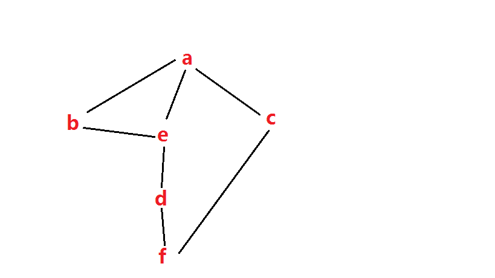
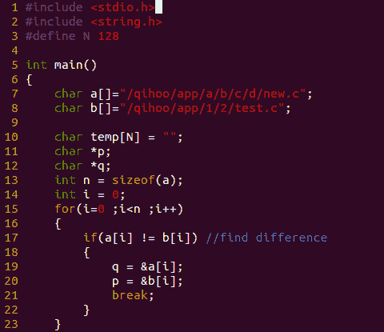
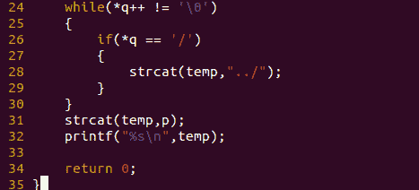

# 三百六十、公司 2015 校招研发在线笔试题

## 1

上高中的小明暗恋女神三年，高考结束后，小明决定向女神表白。这天，小明来到女神楼下等待女神的出现，时间一分一秒的流逝，两个多小时过去了，女神还没有出现，小明看了下表，时针和分针的位置正好跟开始等的时候互换，请问小明一共等了女神多少分钟（）

正确答案: B   你的答案: 空 (错误)

```cpp
172
```

```cpp
166
```

```cpp
165
```

```cpp
150
```

本题知识点

数学运算

讨论

[Chaosky](https://www.nowcoder.com/profile/584)

B，根据题意‘两个多小时’，  查看全部)

编辑于 2015-01-26 16:21:12

* * *

[H__ack](https://www.nowcoder.com/profile/970054)

超简单的思路 设一圈为 1 设**时针和分针距离 x（时针顺时针走 x 圈到分针位置）**，则分针走了**3-x**圈，时针走了**x**圈因为分针移动 60 格时针移动 5 格，两针的**速度比是分针:时针=12:1**所以**3-x=12x**，x=3/13 所以分针走了 36/13 圈，每圈 60min,总时为**166.1538**

编辑于 2015-05-03 11:20:37

* * *

[bitxia](https://www.nowcoder.com/profile/229587)

共走了 3 圈。3*360=1080°分针 1 分钟走 6°时针 1 分钟走 0.5°总时间为 1080/6.5° = 166.153 分钟

发表于 2016-03-24 20:19:45

* * *

## 2

有 A,B,C 三个学生，一个出生在北京，一个出生在上海，一个出生在广州。他们中一个学物理专业，一个学数学专业，一个学计算机。其中（1）A 不是学物理的，B 不是学计算机的；（2）学物理的不出生在上海；（3）学计算机的出生在北京；（4）B 不出生在广州。请根据上述条件，判断 A 的专业（）。

正确答案: C   你的答案: 空 (错误)

```cpp
物理
```

```cpp
数学
```

```cpp
计算机
```

```cpp
3 种专业都可能
```

本题知识点

判断推理

讨论

[Chaosky](https://www.nowcoder.com/profile/584)

C

1.  计算机在北京，物

  查看全部)

编辑于 2015-01-26 16:22:50

* * *

[牛客-007](https://www.nowcoder.com/profile/394118)

答案：C 学计算机的出生在北京,
学物理的不出生在上海,那必然出生在广州
所以学数学的出生在上海 B 不是学计算机的，所以 B 不出生在北京
B 不出生在广州，所以 B 出生在上海，所以 B 是学数学的
A 不是学物理的，已经判断 B 是学数学的了，所以 A 只能学计算机

发表于 2015-01-12 22:28:02

* * *

[大明白](https://www.nowcoder.com/profile/706564)

选 C：B: 上海 数学 C：广州 物理 A: 北京 计算机

发表于 2015-03-09 17:24:07

* * *

## 3

一个不透明的箱子里共有红，黄，蓝，绿，白五种颜色的小球，每种颜色的小球大小相同，质量相等，数量充足。每个人从篮子里抽出两个小球，请问至少需要多少个人抽球，才能保证有两个人抽到的小球颜色相同？

正确答案: D   你的答案: 空 (错误)

```cpp
6 个
```

```cpp
11 个
```

```cpp
13 个
```

```cpp
16 个
```

本题知识点

数学运算

讨论

[飞云](https://www.nowcoder.com/profile/819467)

答案：D 每个人要从敏感  查看全部)

编辑于 2015-01-26 15:03:39

* * *

[黑，，，？？?](https://www.nowcoder.com/profile/663723)

采用最不利原则，任意的两个人取出颜色不相同的颜色有 15 种。接着在来一个人随意的取出两个球的颜色有刚才 15 种的其中一种。所以，至少有 16 个人。

发表于 2015-08-15 19:30:14

* * *

[my_adu](https://www.nowcoder.com/profile/982860)

D 选 A 和选 D 的应该对题意的理解不同先列出 15 种情况 1.红 红 2.黄 黄 3.蓝 蓝 4.绿 绿 5.白 白 6.红 黄    (1 和 6 都抽到了红色的，但是， 两个人抽到的小球颜色 依然是不同的)后面的情况与 6 类似(都列出来吧，直观一点)7.红 蓝 8.红 绿 9.红 白 10.黄 蓝 11.黄 绿 12.黄 白 13.蓝 绿 14.蓝 白 15.绿 白第 16 种必然和前面出现过的 15 种中的一种相同

发表于 2015-05-12 10:38:53

* * *

## 4

平面内有 11 个点，由它们连成 48 条不同的直线，由这些点可连成多少个三角形？

正确答案: B   你的答案: 空 (错误)

```cpp
158
```

```cpp
160
```

```cpp
162
```

```cpp
165
```

本题知识点

数学运算

讨论

[飞云](https://www.nowcoder.com/profile/819467)

答案为：B 平面内有 11  查看全部)

编辑于 2015-01-26 19:55:35

* * *

[丁小玲](https://www.nowcoder.com/profile/458383)

160   11 个点可以连接成 55 条线，这里只有 48 条，所以有一组三个点共线有一组四个点共线，所以三角形个数为 C³ [11 ] -C³ [3] -C³ [4] =160 个三角形。缺的线 55-48=7 条 三个点共线缺两条，四个点共线缺五条。

发表于 2015-07-21 21:22:08

* * *

[TwinkleZheng](https://www.nowcoder.com/profile/1566497)

答案为：B 平面内有 11 个点，如果没有多个点在一条线上，最多可以有 C11 2=11*10/2=55 而目前只连成 48 条直线，说明有多个点在一条线上。55-48=7 条而三个点在一条直线上，减少 C3 2 - 1 = 2 条线四个点在一条线上，减少 C4 2 - 1 = 5 条五个点在一条线上，减少 C5 2 - 1 = 9 条所以所以有一组三个点共线有一组四个点共线如果没有 3 个或 3 个以上的点在一条直线上，则可以连上 C11 3=165 三个点共线会减少的三角数为 C3 3 = 1 四个点共线会减少的三角数为  C 4 3  = 4 所以 最终可连接的个数为 165 -1 - 5 =160

发表于 2018-07-16 22:14:06

* * *

## 5

8,8,12,24,60（）

正确答案: C   你的答案: 空 (错误)

```cpp
90
```

```cpp
120
```

```cpp
180
```

```cpp
240
```

本题知识点

智力题

讨论

[飞云](https://www.nowcoder.com/profile/819467)

正确答案：C 从左到右，  查看全部)

编辑于 2015-06-19 17:52:55

* * *

[牛客 792740 号](https://www.nowcoder.com/profile/792740)

c8*1=88*1.5=1212*2=2424*2.5=6060*3=180

发表于 2015-03-20 20:03:27

* * *

[牛客 785175 号](https://www.nowcoder.com/profile/785175)

c ｛an/an-1｝是一个 d=0.5 的等差数列

发表于 2015-03-31 20:09:05

* * *

## 6

假定 x=65530，下面函数的返回值是多少？（）

```cpp
int func(x){
    int countx = 0;
    while (x){
        countx++；
        x = x & (x - 1);
    }
    return countx;
}

```

正确答案: B   你的答案: 空 (错误)

```cpp
100
```

```cpp
14
```

```cpp
20
```

```cpp
16
```

本题知识点

C++

讨论

[牛客-007](https://www.nowcoder.com/profile/394118)

  查看全部)

编辑于 2016-11-06 10:40:54

* * *

[飞云](https://www.nowcoder.com/profile/819467)

答案：B 因为 65530 对应的二进制为：1111 1111 1111 1010 而 x=x&(x-1)的作用是不断的与 x 小 1 的数进行与运算，实际它的作用是计算一个数中二进制的 1 的个数例如：1111 1111 1111 1010 & 1111 1111 1111 1001  = 1111 1111 1111 10001111 1111 1111 1000 & 1111 1111 1111 0111  = 1111 1111 1111 0000 ...所以最终 65530 对应的二进制中有 14 个 1,所以答案为 14，选 B

发表于 2015-01-14 16:10:17

* * *

[StrongYoung](https://www.nowcoder.com/profile/649626)

做对此题有两个关键点：1、知道函数的功能是求 1 的个数 2、能够快速将 65530 换算成二进制 65535 是 16 个 1，65530=65535-5，5 是 101，有 2 个 1，则 65530 有 14 个 1。

发表于 2015-08-11 11:29:33

* * *

## 7

用某种排序方法对关键字序列（25,84,21,47,15,27,68,35,20）进行排序，序列的变化情况采样如下：
20,15,21,25,47,27,68,35,84
15,20,21,25,35,27,47,68,84
15,20,21,25,27,35,47,68,84
请问采用的是以下哪种排序算法（）

正确答案: D   你的答案: 空 (错误)

```cpp
选择排序
```

```cpp
希尔排序
```

```cpp
归并排序
```

```cpp
快速排序
```

本题知识点

排序 *讨论

[牛客-007](https://www.nowcoder.com/profile/394118)

答案：D 首先第一步以 2  查看全部)

编辑于 2015-01-12 21:33:57

* * *

[VagrantYang](https://www.nowcoder.com/profile/6863719)

这题好猥琐，我直接看最后数，每次都会增加一个剩余数中的最大值，就直接选了选择排序。。。还有这里的快速排序的其中一种方法吧，我采用的是另一种快排方法，得到第一次快排后的序列为 15,20,21,25,47,27,68,35,84\.一般出题的人是用的什么快排啊

编辑于 2017-09-22 09:25:56

* * *

[牛客 9357329 号](https://www.nowcoder.com/profile/9357329)

我怎么觉得不对啊，快速排序的时候，第一轮 21 应该在 15 的左边才对吧，所以感觉题目有问题～～

发表于 2017-10-28 16:26:20

* * *

## 8

设某颗二叉树中有 360 个结点，则该二叉树的最小高度是？(根节点高度为 1)

正确答案: B   你的答案: 空 (错误)

```cpp
10
```

```cpp
9
```

```cpp
8
```

```cpp
7
```

本题知识点

树

讨论

[若水/爆米花](https://www.nowcoder.com/profile/437715)

B
深度为 h 的二叉树最多有 2^h-1 个节点，因此 h 最小取 9

发表于 2015-04-15 22:22:47

* * *

[奋斗的小鸟](https://www.nowcoder.com/profile/337144)

根据算法导论上树的高度描述,以下面这个树为例.                                                       1                                                      /  \                                                     2    3                                                   /   \   /  \                                                 4    5  6   7 树的高度为 2,不是 3.    因此,n 个节点的完全二叉树的高度为|-log2(n+1)-| - 1\.|-log2(n+1)-| 表示 log2(n+1)向上取整.所以答案为: 2⁹ = 512 > 361> 2^ 8 = 256\.   log2(361)向上取整为 9,所以答案为 8\.

发表于 2015-08-06 20:53:44

* * *

[~Just@Joke~](https://www.nowcoder.com/profile/130959)

《严蔚敏数据结构 C 语言版》第 120 页：结点的层次从根开始定义起，根为第一层，根的孩子为第二层。。。。。。树中结点的最大层次称为树的深度或高度。第 124 页：性质 4:具有 n 个结点的完全二叉树的深度为㏒2（n）向下取整 +1。

发表于 2015-08-28 22:10:17

* * *

## 9

下列哪个算法是对一个 list 排序的最快方法（）

正确答案: A   你的答案: 空 (错误)

```cpp
快速排序
```

```cpp
冒泡排序
```

```cpp
二分插入排序
```

```cpp
线性排序
```

本题知识点

排序 *讨论

[牛客 874504 号](https://www.nowcoder.com/profile/874504)

A"list 采用链式  查看全部)

编辑于 2016-02-23 14:35:19

* * *

[啥](https://www.nowcoder.com/profile/811262)

后来发现即使是单链表，也可以使用快排从左向右扫，两个指针，一个为扫描指针，一个为分隔指针，扫到小于指标值时与分隔指针的值进行交换即可

发表于 2015-08-15 15:31:34

* * *

[go8](https://www.nowcoder.com/profile/9339803)

二分插入排序不行。因为 list 是链表，链表只能顺序访问，不能直接访问中间节点。

发表于 2017-02-28 16:26:26

* * *

## 10

应用程序 PING 发出的是什么报文（）

正确答案: C   你的答案: 空 (错误)

```cpp
TCP 请求报文
```

```cpp
TCP 应答报文
```

```cpp
ICMP 请求报文
```

```cpp
ICMP 应答报文
```

本题知识点

网络基础

讨论

[MyGoodHelper](https://www.nowcoder.com/profile/644326)

CPing 程序一般用来  查看全部)

编辑于 2015-04-20 10:59:53

* * *

[挣钱买包包](https://www.nowcoder.com/profile/703858)

ICMP 是（Internet Control Message Protocol）Internet 控制[报文](http://baike.baidu.com/view/175122.htm) 协议。它是[TCP/IP 协议族](http://baike.baidu.com/view/2221037.htm) 的一个子协议，用于在 IP[主机](http://baike.baidu.com/view/23880.htm) 、[路由](http://baike.baidu.com/view/18655.htm) 器之间传递控制消息。控制消息是指[网络通](http://baike.baidu.com/view/8079702.htm) 不通、[主机](http://baike.baidu.com/view/23880.htm) 是否可达、[路由](http://baike.baidu.com/view/18655.htm) 是否可用等网络本身的消息。这些控制消息虽然并不传输用户数据，但是对于用户数据的传递起着重要的作用。

发表于 2016-08-31 11:42:39

* * *

[_qx_](https://www.nowcoder.com/profile/595490416)

     Ping 是 Windows、Unix 和 Linux 系统下的一个命令。ping 也属于一个通信协议，是 TCP/IP 协议的一部分。利用“ping”命令可以检查网络是否连通，可以很好地帮助我们分析和判定网络故障。ICMP 是（Internet Control Message Protocol）Internet 控制[报文](http://baike.baidu.com/view/175122.htm) 协议。它是[TCP/IP 协议族](http://baike.baidu.com/view/2221037.htm) 的一个子协议，用于在 IP[主机](http://baike.baidu.com/view/23880.htm) 、[路由](http://baike.baidu.com/view/18655.htm) 器之间传递控制消息。控制消息是指[网络通](http://baike.baidu.com/view/8079702.htm) 不通、[主机](http://baike.baidu.com/view/23880.htm) 是否可达、[路由](http://baike.baidu.com/view/18655.htm) 是否可用等网络本身的消息。这些控制消息虽然并不传输用户数据，但是对于用户数据的传递起着重要的作用。      程序 Ping 发送的是[ICMP](https://www.baidu.com/s?wd=ICMP&tn=SE_PcZhidaonwhc_ngpagmjz&rsv_dl=gh_pc_zhidao)请求报文，路由发回[ICMP](https://www.baidu.com/s?wd=ICMP&tn=SE_PcZhidaonwhc_ngpagmjz&rsv_dl=gh_pc_zhidao)应答报文，并被程序接收

编辑于 2019-05-22 15:18:08

* * *

## 11

digit ->0|1|...|9
digits ->digit digit*
optionalFraction ->.digits|∈
optionalExponent ->(E+|-|∈)digits|∈
number -> digits optionalPraction option|Exponent
上面给出的正则规约的描述中，下面的无符号数哪个不符合规约的要求：

正确答案: D   你的答案: 空 (错误)

```cpp
5280
```

```cpp
1
```

```cpp
2.0
```

```cpp
336E4
```

本题知识点

正则表达式

讨论

[Teeworlds](https://www.nowcoder.com/profile/476643)

D 336E4 改成 336E+4 或者 336E-4 就正确了。

发表于 2015-05-24 23:48:11

* * *

[666 的佩奇爸爸](https://www.nowcoder.com/profile/7670357)

答案：D。

正则表达式又称正规表示法、常规表示法（Regular Expression，在代码中常简写为 regex、regexp 或 RE），它是计算机科学的一个概念。正则表达式使用单个字符串来描述、匹配一系列符合某个句法规则的字符串。*表示匹配前面的子表达式零次或多次(大于等于 0 次)。例如，zo*能匹配“z”，“zo”以及“zoo”。*等价于{0,}。对于选项 A 和选项 B，在正则表达式 number -> digits optionalFraction optionlExponent 中，只匹配 digits 就可以了，optionalFraction 和 optionlExponent 都匹配即可。所以，选项 A 与选项 B 都是正确的。对于选项 C，在正则表达式 number->digits optionalFraction optionlExponent 中，只匹配 digits 和 optionalFraction，digits 匹配为 2；optionalFraction->.digits|匹配.digits，这个 digits 匹配为 0。所以，选项 C 正确。对于选项 D，字符 E 后面必须要跟一个 digits 才可以，即 E 不可能为结束字符。所以，选项 D 不正确。

发表于 2018-07-07 17:10:11

* * *

[黑，，，？？?](https://www.nowcoder.com/profile/663723)

D 解析：利用题中给的规约规则将 ABCD 的每个句子进行规约。AB 都是同理，    digits ->digit digit* number -> digits optionalPraction option|Exponent《   optionalPraction 和 option|Exponent 都是空的时候 》C 中                     digits ->digit digit*                          optionalFraction ->.digits|∈而 D 却规约不了。

发表于 2015-08-15 20:44:16

* * *

## 12

语法分析器可以用于（）

正确答案: C   你的答案: 空 (错误)

```cpp
识别语义错误
```

```cpp
识别语法和语义错误
```

```cpp
识别语法错误
```

```cpp
识别并修正语法，语义错误
```

本题知识点

编译和体系结构

讨论

[牛客-007](https://www.nowcoder.com/profile/394118)

  查看全部)

编辑于 2015-01-31 15:25:27

* * *

[MyGoodHelper](https://www.nowcoder.com/profile/644326)

C 通常是作为编译器或解释器的组件出现的,它的作用是进行语法检查、并构建由输入的单片语成的资料结构

发表于 2015-01-18 20:44:30

* * *

[琼华](https://www.nowcoder.com/profile/188677)

语法分析 是 编译 过程的核心部分，其基本任务是根据语言的语法规则进行语法分析，如果不存在语法错误即给出正确的语法结果，并为 语义分析 和 代码生成 做准备。语义分析 是 编译 过程的一个逻辑阶段， 语义分析的任务是对结构上正确的 源程序 进行上下文有关性质的审查，进行类型审查。语义分析是审查 源程序 有无语义错误，为 代码生成 阶段收集类型信息。

发表于 2015-08-22 22:15:27

* * *

## 13

IPV6 地址包含多少位（）

正确答案: D   你的答案: 空 (错误)

```cpp
16
```

```cpp
32
```

```cpp
64
```

```cpp
128
```

本题知识点

网络基础

讨论

[牛客-007](https://www.nowcoder.com/profile/394118)

答案：DIPV6 地址有  查看全部)

编辑于 2015-01-31 15:24:52

* * *

[崔洪振 367](https://www.nowcoder.com/profile/606942)

选：DIPv6 的 128 位地址通常写成 8 组，每组由四个十六进制数组成。例如： 2001:fecd:ba23:cd1f:dcb1:1010:9234:4088，其中对于每一个十六进制的数是有 4 个二进制的数构成，因此，每一组有 4*4=16 位，所有的位数：16*8=128。故选 D。

发表于 2017-02-27 19:10:42

* * *

[karaysn](https://www.nowcoder.com/profile/7759354)

IPV6 是 IPV4 字节的四倍，IPV4 是四个字节

发表于 2017-12-02 15:55:12

* * *

## 14

如果在一个建立了 TCP 连接的 socket 上调用 recv 函数，返回值为 0，则表示（）

正确答案: B   你的答案: 空 (错误)

```cpp
对端发送了一段长度为 0 的数据
```

```cpp
对端关闭了连接
```

```cpp
还没有收到对端数据
```

```cpp
连接发生错误
```

本题知识点

网络基础

讨论

[有 pp 才有真相](https://www.nowcoder.com/profile/149394)

表示关闭连接，选择 B  查看全部)

编辑于 2015-01-31 15:23:43

* * *

[牛客-007](https://www.nowcoder.com/profile/394118)

答案：B
如果 recv 函数在等待协议接收数据时网络中断了，那么它返回 0。默认 socket 是阻塞的。阻塞与非阻塞 recv 返回值没有区分，都是 <0 出错 =0 连接关闭 >0 接收到数据大小

发表于 2015-01-28 11:54:16

* * *

[﹎.](https://www.nowcoder.com/profile/708360)

那当调用非阻塞 recv 时，且目前没有收到数据，那么返回值是？？？

发表于 2015-11-11 21:06:06

* * *

## 15

以下哪些不是内核对象（）

正确答案: D   你的答案: 空 (错误)

```cpp
进程
```

```cpp
线程
```

```cpp
互斥器
```

```cpp
临界区
```

本题知识点

操作系统

讨论

[牛客-007](https://www.nowcoder.com/profile/394118)

答案：D 临界区是资源对  查看全部)

编辑于 2015-01-31 15:12:09

* * *

[anybody](https://www.nowcoder.com/profile/126520)

临界区是非内核对象,只在用户态进行锁操作。内核对象有：存取符号对象、事件对象、文件对象、文件映射对象、I / O 完成端口对象、作业对象、信箱对象、互斥对象、管道对象、进程对象、信标对象、线程对象和等待计时器对象等。这些对象都是通过调用函数来创建的。

编辑于 2016-08-03 11:11:23

* * *

[ゝ少年の幻想ゝ](https://www.nowcoder.com/profile/595882)

1、什么是临界区？
答：每个进程中访问临界资源的那段程序称为临界区（临界资源是一次仅允许一个进程使用的共享资源）。每次只准许一个进程进入临界区，进入后不允许其他进程进入。

2、进程进入临界区的调度原则是：
①如果有若干进程要求进入空闲的临界区，一次仅允许一个进程进入。②任何时候，处于临界区内的进程不可多于一个。如已有进程进入自己的临界区，则其它所有试图进入临界区的进程必须等待。③进入临界区的进程要在有限时间内退出，以便其它进程能及时进入自己的临界区。④如果进程不能进入自己的临界区，则应让出 CPU，避免进程出现“忙等”现象。

发表于 2015-07-23 23:05:24

* * *

## 16

同一进程下的多个线程可以共享哪一种资源（）

正确答案: B   你的答案: 空 (错误)

```cpp
stack
```

```cpp
data section
```

```cpp
register set
```

```cpp
thread ID
```

本题知识点

操作系统

讨论

[MyGoodHelper](https://www.nowcoder.com/profile/644326)

B 线程共享的环境包括：  查看全部)

编辑于 2015-01-31 15:09:21

* * *

[从小爱吃鱼](https://www.nowcoder.com/profile/412638)

同一个进程的多个线程有自己独立的堆栈和局部变量

发表于 2016-06-09 08:37:55

* * *

[墨儿](https://www.nowcoder.com/profile/717983)

答案 B 线程共享的环境包括：进程代码段、进程的公有数据(利用这些共享的数据，线程很容易的实现相互之间的通讯)、进程打开的文件描述符、信号的处理器、进程的当前目录和进程用户 ID 与进程组 ID。

发表于 2015-01-14 14:37:02

* * *

## 17

优异虚拟存储系统，若进程在内存中占 3 页（开始时内存为空），若采用先进先出（FIFO）页面淘汰算法，当执行以下访问页号序列后 1,3,4,2,1,3,5,1,2,5,4,2，会产生多少次缺页（）

正确答案: C   你的答案: 空 (错误)

```cpp
7
```

```cpp
8
```

```cpp
9
```

```cpp
10
```

本题知识点

操作系统

讨论

[罗卫平](https://www.nowcoder.com/profile/162736)

选 C 缺页定义为所有内存  查看全部)

编辑于 2015-01-31 15:08:21

* * *

[牛客-007](https://www.nowcoder.com/profile/394118)

答案：C
刚开始内存为空也算缺页。
输入：1,3,4,2,1,3,5,1,2,5,4,2 
先进先出，就是保存最近 3 个访问的记录在内存中
, , <—1     中断 1 次
,  ,1<—3    中断 1 次
, 1,3<—4     中断 1 次
1,3,4 <—2    中断 1 次
3,4,2 <—1    中断 1 次
4,2 ,1<—3    中断 1 次
2,1,3<—5     中断 1 次
1,3,5<—1     命中，不中断  
3,5,1 <—2     中断 1 次
5,1,2<—5    命中，不中断
1,2,5 <—4    中断 1 次
2,5,4 <—2    命中，不中断
5,4,2
累计中断 9 次

发表于 2015-01-28 11:48:55

* * *

[CLAN](https://www.nowcoder.com/profile/683397)

内存里边存三个，每次出来一个，每次比较下一个是不是在内存中，在则命中，不在则缺页。

发表于 2015-07-28 15:48:10

* * *

## 18

下述哪种情况会提出中断请求（）

正确答案: A   你的答案: 空 (错误)

```cpp
在键盘输入过程中，每按一次键
```

```cpp
两数相加结果为零
```

```cpp
计算结果溢出
```

```cpp
一条系统汇编指令执行完成
```

本题知识点

操作系统

讨论

[牛客-007](https://www.nowcoder.com/profile/394118)

答案：A

每按键一次，

  查看全部)

编辑于 2015-01-26 20:19:37

* * *

[达芬奇伯爵](https://www.nowcoder.com/profile/378400)

A.  I/O 设备发出 I/O 中断请求是外中断 C. 应该属于运算结果溢出那就是内中断也就是异常（感觉是玩文字游戏，这里可能认为中断请求只能是外中断）

编辑于 2016-09-13 13:57:14

* * *

[我也支持](https://www.nowcoder.com/profile/6206174)

```cpp
按一次键盘点一次鼠标都要产生一次中断。
玩一把 LOL 得产生多少中断，电脑真辛苦。
```

发表于 2017-07-26 13:05:43

* * *

## 19

单任务系统中两个程序 A 和 B，其中
A 程序：CPU:10s -> 设备 1:5s -> CPU:5s ->设备 2:10s ->CPU:10s；
B 程序：设备 1:10s-> CPU:10s -> 设备 2:5s ->CPU:5s ->设备 2:10s；
执行顺序为 A->B，那么 CPU 的利用率是（）

正确答案: C   你的答案: 空 (错误)

```cpp
30%
```

```cpp
40%
```

```cpp
50%
```

```cpp
60%
```

本题知识点

操作系统

讨论

[牛客 444334 号](https://www.nowcoder.com/profile/444334)

C

A 程序，CPU 时间为 1  查看全部)

编辑于 2015-01-31 15:04:44

* * *

[牛客-007](https://www.nowcoder.com/profile/394118)

答案：C
注意顺序执行不是并发执行，也就是程序 A 不能在程序 B 使用设备的时间去使用 CPU，也就是进程 A 执行完毕再去执行进程 B。
两个进程总的 CPU 时间为 40s，运行总时间为 80s，利用率为 50%

发表于 2015-01-28 11:43:12

* * *

[大星星和小猩猩](https://www.nowcoder.com/profile/9374535)

**单任务系统**，注意是**单任务**！既然是单任务系统那么问题就好办了~

发表于 2018-04-06 10:41:27

* * *

## 20

```cpp
for (int i = 0; i < 2; i++)
{
    fork();
    printf("-\n");
}

```

会打印出多少个"-"?

正确答案: C   你的答案: 空 (错误)

```cpp
4
```

```cpp
5
```

```cpp
6
```

```cpp
8
```

本题知识点

C++

讨论

[牛客-007](https://www.nowcoder.com/profile/394118)

  查看全部)

编辑于 2015-01-31 14:59:00

* * *

[jo_ryan](https://www.nowcoder.com/profile/212457)

先看这段代码： 

```cpp
int main(void)
{
   int i;
   for(i=0; i<2; i++){
      fork();
      printf("-");
   }

   wait(NULL);
   wait(NULL);

   return 0;
}
```

1.fork()系统调用是 Unix 下以自身进程创建子进程的系统调用，一次调用，两次返回，如果返回是 0，则是子进程，如果返回值>0，则是父进程（返回值是子进程的 pid），这是众为周知的。2.还有一个很重要的东西是，在 fork()的调用处，整个父进程空间会原模原样地复制到子进程中，包括指令，变量值，程序调用栈，环境变量，缓冲区，等等。所以，上面的那个程序为什么会输入 8 个“-”，这是因为 printf(“-“);语句有 buffer，所以，对于上述程序，printf(“-“);把“-”放到了缓存中，并没有真正的输出，在 fork 的时候，缓存被复制到了子进程空间，所以，就多了两个，就成了 8 个，而不是 6 个。而本题 printf("-\n");程序遇到“\n”，或是 EOF，或是缓中区满，或是文件描述符关闭，或是主动 flush，或是程序退出，就会把数据刷出缓冲区。需要注意的是，标准输出是行缓冲，所以遇到“\n”的时候会刷出缓冲区，但对于磁盘这个块设备来说，“\n”并不会引起缓冲区刷出的动作，那是全缓冲，你可以使用 setvbuf 来设置缓冲区大小，或是用 fflush 刷缓存。

发表于 2015-08-21 14:02:00

* * *

[编号 2015](https://www.nowcoder.com/profile/408620)

C 对于这种 N 次循环的情况，执行 printf 函数的次数为 2*（1+2+4+……+2^(N-1) ）次，创建的子进程数为 1+2+4+……+2^(N-1) 个。

发表于 2015-01-19 19:22:23

* * *

## 21

以下说法不正确的是（）

正确答案: A   你的答案: 空 (错误)

```cpp
进程调度中"可抢占"和"非抢占"两种方式，后者引起系统的开销更大
```

```cpp
每个进程都有自己的文件描述符表，所有进程共享同一打开文件表和 v-node 表
```

```cpp
基本的存储技术包括 RAM，ROM，磁盘以及 SSD，其中访问速度最慢的是磁盘，CPU 的高速缓存一般是由 RAM 组成的
```

```cpp
多个进程竞争源出现了循环等待可能造成系统死锁
```

本题知识点

操作系统

讨论

[念润](https://www.nowcoder.com/profile/671472)

A 抢占式会引起系统的开销更  查看全部)

编辑于 2015-01-31 14:57:35

* * *

[大明白](https://www.nowcoder.com/profile/706564)

A 抢占式与非抢占式的对比：   
非抢占式（Nonpreemptive）   让进程运行直到结束或阻塞的调度方式（容易实现，适合专用系统，不适合通用系统） 
抢占式（Preemptive）   允许将逻辑上可继续运行的在运行过程暂停的调度方式，可防止单一进程长时间独占 CPU（系统开销大）

发表于 2015-03-10 11:05:01

* * *

[雪臧 1050](https://www.nowcoder.com/profile/244439)

抢占式需要为被强占的进程保存现状，需要更大的系统开销。

发表于 2015-08-31 11:40:19

* * *

## 22

对于 Linux 说法，下列说法正确的是（）

正确答案: A   你的答案: 空 (错误)

```cpp
线性访问内存非法时，当前线程会进入信号处理函数
```

```cpp
用 mv 命令移动文件时，文件的修改时间会发生变化
```

```cpp
ulimit -c 设置的是函数调用栈的大小
```

```cpp
malloc 函数是操作系统最底层申请内存的接口
```

本题知识点

操作系统 Linux

讨论

[MyGoodHelper](https://www.nowcoder.com/profile/644326)

AB：不会变化 C  查看全部)

编辑于 2015-04-01 15:16:58

* * *

[wentguo](https://www.nowcoder.com/profile/803846)

malloc 是库函数，"操作系统申请内存的接口 "指的是系统调用，库函数中封装了系统调用，库函数与系统调用是两个不同的概念。所以 D 选项错误。

发表于 2016-07-04 11:36:21

* * *

[SPACELAN](https://www.nowcoder.com/profile/419497)

malloc 是 glibc 里的库函数，它封装了一些向系统申请内存的系统调用，而且并不是每次使用 malloc 的时候都会向系统申请新的内存，所以 D 是错的

发表于 2015-08-05 11:52:47

* * *

## 23

X86 体系结构在保护模式下中有三种地址，请问一下那种说法是正确的？

正确答案: A   你的答案: 空 (错误)

```cpp
虚拟地址先经过分段机制映射到线性地址，然后线性地址通过分页机制映射到物理地址
```

```cpp
线性地址先经过分段机制映射到虚拟地址，然后虚拟地址通过分页机制映射到物理地址
```

```cpp
虚拟地址先经过分页机制映射到线性地址，然后线性地址通过分段机制映射到物理地址
```

```cpp
线性地址先经过分页机制映射到虚拟地址，然后虚拟地址通过分段机制映射到物理地址
```

本题知识点

操作系统 编译和体系结构

讨论

[牛客-007](https://www.nowcoder.com/profile/394118)

**答案：** **A**

分段

  查看全部)

编辑于 2015-01-27 17:18:51

* * *

[舒意意 123](https://www.nowcoder.com/profile/1973064)

**答案：** **A**

分段机制就是把虚拟地址空间中的虚拟内存组织成一些长度可变的称为段的内存块单元

分页机制把线性地址空间和物理地址空间分别划分为大小相同的块。这样的块称之为页。通过在线性地址空间的页与物理地址空间的页之间建立的映射，分页机制实现线性地址到物理地址的转换

发表于 2017-04-23 14:27:04

* * *

[细雨湿身](https://www.nowcoder.com/profile/736416)

先分段再分页

发表于 2016-09-06 18:55:02

* * *

## 24

当需要对文件进行随机存取时，下列哪一种文件物理结构不适用于上述应用场景？

正确答案: C   你的答案: 空 (错误)

```cpp
顺序文件
```

```cpp
索引文件
```

```cpp
链接文件
```

```cpp
Hash 文件
```

本题知识点

操作系统

讨论

[牛客-007](https://www.nowcoder.com/profile/394118)

答案：C

链式存储只能顺序访问，不能随机访问。如果要随机访问的话只能顺序查找，效率低下

发表于 2015-01-26 10:41:43

* * *

[huixieqingchun](https://www.nowcoder.com/profile/551201)

**链接文件就像数据结构中的链表，只能顺序访问；****顺序存储的文件可以随机访问；**

发表于 2016-07-08 20:34:56

* * *

[阿 Q*](https://www.nowcoder.com/profile/363863)

链式文件-适于顺序访问顺序文件-适于随机访问

发表于 2016-06-26 15:16:20

* * *

## 25

```cpp
#include<iostream>
using namespace std;
class MyClass
{
public:
    MyClass(int i = 0)
    {
        cout << i;
    }
    MyClass(const MyClass &x)
    {
        cout << 2;
    }
    MyClass &operator=(const MyClass &x)
    {
        cout << 3;
        return *this;
    }
    ~MyClass()
    {
        cout << 4;
    }
};
int main()
{
    MyClass obj1(1), obj2(2);
    MyClass obj3 = obj1;
    return 0;
}

```

运行时的输出结果是（）

正确答案: C   你的答案: 空 (错误)

```cpp
11214444
```

```cpp
11314444
```

```cpp
122444
```

```cpp
123444
```

本题知识点

C++

讨论

[江山如画君](https://www.nowcoder.com/profile/408769)

C D 辨析：关  查看全部)

编辑于 2016-02-23 17:46:59

* * *

[todd_nk](https://www.nowcoder.com/profile/878237)

```cpp
C MyClass obj3 = obj1; 
obj3 还不存在，所以调用拷贝构造函数输出 2，
如果 obj3 存在，obj3=obj，则调用复制运算符重载函数，输出 3 
```

编辑于 2016-02-23 17:46:59

* * *

[咩咩 jiang](https://www.nowcoder.com/profile/192084)

拷贝构造函数发生在对象还没有创建，需要创建时，如 obj3；赋值操作符重载仅发生在对象已经执行过构造函数，即已经创建的情况下前两个对象构造时分别输出 1,2
第三个对象是这样构造的 MyClass obj3 = obj1，之前没有执行过构造函数创建对象，所以这里会调用拷贝构造函数，输出 2
然后三个对象依次析构，输出 444
所以最终输出 122444

发表于 2015-08-06 15:25:06

* * *

## 26

在一个 64 位的操作系统中定义如下结构体：

```cpp
struct st_task
{
    uint16_t id;
    uint32_t value;
    uint64_t timestamp;
};

```

同时定义 fool 函数如下：

```cpp
void fool()
{
    st_task task = {};
    uint64_t a = 0x00010001;
    memcpy(&task, &a, sizeof(uint64_t));
    printf("%11u,%11u,%11u", task.id, task.value, task.timestamp);
}

```

上述 fool()程序的执行结果为（）

正确答案: A   你的答案: 空 (错误)

```cpp
1，0，0
```

```cpp
1，1，0
```

```cpp
0，1，1
```

```cpp
0，0，1
```

本题知识点

C 语言

讨论

[yahito](https://www.nowcoder.com/profile/470982)

```cpp
st_task:
id        value     timestamp
0000|0000|0000 0000|0000 0000 0000 0000 (physical)

a: 
0000 0000 0001 0001   (logic)
0001 0001 0000 0000   (physical)

st_task:
id        value     timestamp
0001|0001|0000 0000|0000 0000 0000 0000
1        |0        |0
```

发表于 2015-09-10 10:36:45

* * *

[薛定谔的猫猫咪](https://www.nowcoder.com/profile/131611)

答案：A 考点：字节对齐，低地址到高地址    因为字节对齐的原因，所以 id 占用 4 个字节，value 和 timestamp 分别是 4 个字节、8 个字节。虽然 id 占用四个字节的地址，但是只有低两位地址的数值有效（字节对齐的机制，即 value 存储时的地址对 4（自身对齐值）求余应为 0）。所以 id 为 0001 0001，高四位无效，所以为 0001，value 与 timestamp 分别为 0\.    比如：地址从 0x0000 开始，id 存储地址本来为 0x0000-0x0001，但 value 存储地址要从 0x0004 开始，因为 0x0004%4==0，所以 id 存储地址为 0x0000-0x0003, value 存储地址为 0x0004-0x0007, timestamp 存储地址为 0x0008-0x000F. 所以 id == 0x00010001，去掉高 4 位，id=0x0001，其余为 0\.

编辑于 2015-08-10 20:09:44

* * *

[像我这么吊的下水道还有六个](https://www.nowcoder.com/profile/127796)

答案是：A 前面解释的都有些问题。看如下：输出的是 1，0，0 和 10001。

```cpp
uint64_t 占用 8 字节，那么 a 可以表示为 0x0000000000010001。而在注意的是，在 task 是字节对齐的。所以对于前四个字节，分别是是 01000100 00000000 0000000000000000，而 id 对应前两个字节所以是 1，而 value 对应四个字节是 00000000，后面的也是如此，也就是 0100 之后的 0100 只是起了填充的作用，所以当你打出 task 时会输出 0x10001。
```

```cpp
    typedef short uint16_t;
    typedef int uint32_t;
    typedef long long uint64_t;
    struct st_task
    {
        uint16_t id;
        uint32_t value;
        uint64_t timestamp;
    };
    st_task task = {};
    uint64_t a = 0x00010001;
    memcpy(&task, &a, sizeof(uint64_t));
    printf("%11u,%11u,%11u \n", task.id, task.value, task.timestamp);
    printf("0x%x\n", task);
```

发表于 2015-07-03 10:59:39

* * *

## 27

下面代码会输出什么（）

```cpp
int main(int argc, char **argv)
{
    int a[4] = {1, 2, 3, 4};
    int *ptr = (int *)(&a + 1);
    printf("%d", *(ptr - 1));
}

```

正确答案: D   你的答案: 空 (错误)

```cpp
1
```

```cpp
2
```

```cpp
3
```

```cpp
4
```

本题知识点

C 语言

讨论

[香蕉牛奶](https://www.nowcoder.com/profile/217925)

D&a 是数组指针，其类  查看全部)

编辑于 2015-01-26 18:19:27

* * *

[牛客-007](https://www.nowcoder.com/profile/394118)

答案：D
其实测试可以发现，a 和 &a 是同一个地址，printf("%d", a),printf("%d", &a)结果是相同的。
但是其代表的含义不同，*(a+1)代表从 a 数组首地址跳跃一个 int 的长度，*（&a+1）表示从 a 数组首地址跳跃一个数组的长度，也就是指向 a 数组最后一个元素的下一个位置，因此*(ptr - 1)表示 a 数组的最后一个元素。

发表于 2015-01-28 11:26:33

* * *

[小牛快跑 233](https://www.nowcoder.com/profile/414929)

**这边主要考察的是数组指针和数组首地址的问题。****&a 是数组指针，a 是数组首地址。**而指针的+1，增加的是 1 个指针类型的长度。比如&a 是数组指针，**(&a + 1)增加的是 1 数组的长度**。所以题目中第四步的 ptr 指向的是 a[4]的位置。而**（ptr - 1）减少的是 1 个数据元素的长度**。第五步 ptr 指向的是 a[3]，页就是 4

发表于 2016-09-05 20:54:47

* * *

## 28

```cpp
int fun(int a)
{
    a = (1 << 5) - 1; 
    return a; 
} 
```

fun(21)结果是（）

正确答案: D   你的答案: 空 (错误)

```cpp
10
```

```cpp
8
```

```cpp
5
```

```cpp
31
```

本题知识点

C 语言

讨论

[牛客-007](https://www.nowcoder.com/profile/394118)

答案：D1<<5，这里  查看全部)

编辑于 2015-01-31 12:07:16

* * *

[Eastmount](https://www.nowcoder.com/profile/999794)

原题代码为：
int fun(int a) {
     a^=(1<<5)-1;
return a; }
fun(21)求解方法： 首先(1<<5)表示左移 5 位，相当于 1 乘以 2 的 5 次方，即 100000=32。此题答案为 31。而原题需要异或运算，即异或运算： 21=010101   ^     31=011111     =》    001010=10，结果应该为 10。

编辑于 2015-10-16 00:12:41

* * *

[huixieqingchun](https://www.nowcoder.com/profile/551201)

**注意<<左移运算符的运用。左移的位数写在右边。注意理解。****另外，左移一位相当于数字乘以 2，右移一位相当于数字除以 2.**

发表于 2016-05-20 12:38:03

* * *

## 29

下面哪一个是 sort 的 template 的正确写法

正确答案: D   你的答案: 空 (错误)

```cpp
void sort(class A first，class A last，class B pred)
```

```cpp
void template(class A，class B)sort(A first，A last，B pred)
```

```cpp
template<class A><class B> void sort(A first，A last，B pred)
```

```cpp
template<class A，class B> void sort(A first，A last，B pred)
```

本题知识点

C++

讨论

[牛客-007](https://www.nowcoder.com/profile/394118)

  查看全部)

编辑于 2015-01-31 12:04:10

* * *

[墨儿](https://www.nowcoder.com/profile/717983)

答案  D 

**函数模板的声明**

函数模板可以用来创建一个通用的函数，以支持多种不同的形参，避免重载函数的函数体重复设计。它的最大特点是把函数使用的数据类型作为参数。

函数模板的声明形式为：

**template<typename 数据类型参数标识符>**

**<返回类型><函数名>(参数表)**

**{**

**    函数体**

**}**

发表于 2015-01-13 16:38:37

* * *

[666 的佩奇爸爸](https://www.nowcoder.com/profile/7670357)

答案：D。

MSDN 中对模板的定义如下：

template<class RanIt>    void sort(RanIt first, RanIt last);

template<class RanIt, class Pred>    void sort(RanIt first, RanIt last, Pred pr);

模板函数格式是先声明模板类型，然后才能使用。

格式是 template<class T1, class T2, ...>返回值函数名（参数列表），从模板函数的格式可以看出，只有选项 D 的写法满足这个格式。所以，选项 D 正确。

编辑于 2018-07-13 16:33:11

* * *

## 30

在 c++中，

```cpp
const int i = 0; 
int *j = (int *) &i; 
*j = 1; 
printf("%d,%d", i, *j)

```

输出是多少？

正确答案: A   你的答案: 空 (错误)

```cpp
0，1
```

```cpp
1，1
```

```cpp
1，0
```

```cpp
0，0
```

本题知识点

编程基础 *C++* *讨论

[kuring](https://www.nowcoder.com/profile/462306)

  查看全部)

编辑于 2015-01-31 12:02:52

* * *

[wenyanliu](https://www.nowcoder.com/profile/425767)

```cpp
const 修饰符表示 i 为常量，值不可改变，但是通过指针可以改变内存中 i 所在地址中的值，所以输出*j 的值变为 1。但是通过编译器优化，i 的值不再是每次都在内存中读取，而是见到 i 编译器就可自动赋值为最初的值 0，所以输出 i 的值时为 0，答案为 A 0,1。
```

编辑于 2015-08-06 15:01:03

* * *

[老班长](https://www.nowcoder.com/profile/489019)

和编译器有关，大家可以看看这个回答。http://www.zhihu.com/question/21792567

发表于 2015-05-19 20:25:02

* * *

## 31

如下代码输出结果是什么？

```cpp
#include<stdio.h>
char *myString()
{
    char buffer[6] = {0};
    char *s = "Hello World!";
    for (int i = 0; i < sizeof(buffer) - 1; i++)
    {
        buffer[i] = *(s + i);
    }
    return buffer;
}
int main(int argc, char **argv)
{
    printf("%s\n", myString());
    return 0;
}
```

正确答案: D   你的答案: 空 (错误)

```cpp
Hello
```

```cpp
Hello World!
```

```cpp
Well
```

```cpp
以上全部不正确
```

本题知识点

编程基础 *字符串 *C++** **讨论

[牛客-007](https://www.nowcoder.com/profile/394118)

答案：D 函数 char  查看全部)

编辑于 2015-01-31 12:00:30

* * *

[逍遥界](https://www.nowcoder.com/profile/132477)

理解函数返回变量，指针，数组；当函数返回值之后，其函数内部的栈空间均会被销毁；在函数内部，若程序员没有为指针分配空间，则函数退出时，其栈空间也就不存在了；因此，使用数组时，不能返回一个数组；

编辑于 2015-07-07 17:33:51

* * *

[virjar](https://www.nowcoder.com/profile/755120)

这题应该不是 D，什么***作系统回收，那是逻辑上的概念而已，只能说在 c 语言层面上，地址空间的值随时可能被覆盖。被覆盖的原因也是这玩意儿在栈空间，而且栈底指针已经向高地址偏移了，那么这片空间在下一个函数执行时，如果有局部变量，将会对应到下一个函数的局部变量上面。下一个函数是啥？printf，所以关键是看 printf 有没有申请局部变量，并且修改局部变量的值。被调函数返回局部数组是允许的。

发表于 2015-09-13 12:06:17

* * *

## 32

不能把字符串"HELLO!"赋给数组 b 的语句是（）

正确答案: B   你的答案: 空 (错误)

```cpp
char b[10]={'H'，'E'，'L'，'L'，'O'，'!'，'\0'};
```

```cpp
char b[10];b="HELLO!";
```

```cpp
char b[10];strcpy(b，"HELLO!");
```

```cpp
char b[10]="HELLO!";
```

本题知识点

编程基础 *字符串 *C++** **讨论

[kuring](https://www.nowcoder.com/profile/462306)

没有将字符串常量直接赋值给 c  查看全部)

编辑于 2015-01-28 16:07:06

* * *

[小试牛刀-被占用](https://www.nowcoder.com/profile/554442)

字符数组初始化有两种方法：一种是逐个字符赋值，另一种是用字符常量对整个数组赋值。 A 是第一种，D 是第二种。显然第一种比第二种繁琐复杂。 C 是字符串拷贝函数。 函数格式： char *strcpy (char *s1, const char *s2); 功能： 将 S2 所指的字符串拷贝到 S1 所指的字符串中。 说明： （1）参数 S1S2 都是指向字符串的指针。S1 可以是字符数组名或字符指针，但不能是字符型常量，S2 可以是字符串常量、字符数组或字符指针。 （2）将 S2 所指的字符串拷贝到 S1 所指的字符串中，用赋值语句 S1=S2;是不行的，赋值语句要求左边是左值，S1 是常量。 （3）要保证 S1 的长度足够大，以便能容纳下 S2 所指的字符串，否则引起错误。 C 对于非 strtic 型数组不初始化，其元素值不能确定。对 strtic 数组元素不赋初值，系统会自动赋以 0 值。（参考）

发表于 2015-03-28 17:00:15

* * *

[牛客-007](https://www.nowcoder.com/profile/394118)

答案：B
选项 B 并没有将数组 b 赋值为 hello！ 因子 b 是数组的首地址，b="HELLO!";是改变了这个指针的指向，是错误的。

发表于 2015-01-28 11:14:26

* * *

## 33

```cpp
struct Date
{
    char a;
    int b;
    int64_t c;
    char d;
};
Date data[2][10];

```

在 64 位系统上，如果 Data 的地址是 x，那么 data[1][5].c 的地址是（）

正确答案: C   你的答案: 空 (错误)

```cpp
X+195
```

```cpp
X+365
```

```cpp
X+368
```

```cpp
X+215
```

本题知识点

C 语言

讨论

[编号 2015](https://www.nowcoder.com/profile/408620)

我觉得 C

结构体成员地址  查看全部)

编辑于 2015-01-26 21:11:14

* * *

[豆苗呀豆苗😍](https://www.nowcoder.com/profile/3266816)

1、结构体所占的内存大小：a.整体所占的内存大小应该是结构中成员类型最大的整数倍，此处最大的类型是 int_64t，占 8 个字节。。即最后所占字节的总数应该是 8 的倍数，不足的补足；b.数据对齐原则-内存按结构体成员的先后顺序排列，当排到该成员变量时，其前面所有成员已经占用的空间大小必须是该成员类型大小的整数倍，如果不够，则前面的成员占用的空间要补齐，使之成为当前成员类型的整数倍。假设是地址是从 0 开始，结构体中第一个成员类型 char 型占一个字节，则内存地址 0-1，第二个成员从 2 开始，int 型所占内存 4 个字节，根据原则 b，第一个成员所占内存补齐 4 的倍数，故第一个成员所占内存：1 + 3 = 4； 第二个成员占 5-8\. 第三个成员占 8 个字节，满足原则 b，不需要补齐，占 9-16\.  第四个成员占一个字节，占 17\. 故总内存为 1 + 3 + 4 + 8 + 1 = 17 个字节，但根据原则 a，总字节数需是 8 的倍数，需将 17 补齐到 24\.  故此结构体总字节数为：24 字节 2、计算 data[1][5]，意思是前面有 15 个元素。则第 15 个元素的起始地址为： 24 * 15 = 360， 即 X + 360 则 data[1][5].c 的地址为： 360 + 1 + 3 + 4 = 368，即 X + 368

发表于 2017-08-08 22:24:43

* * *

[wenyanliu](https://www.nowcoder.com/profile/425767)

按 8 位对齐，(a+b)=5+(3)->8，d=1+(7)->8,所以结构体的大小为 8+8+8=24，data[1][5]=x+15*24，data[1][5].c=x+15*24+5+(3)=x+368.

编辑于 2015-07-03 16:07:33

* * *

## 34

如何定义一个 int 类型的指针数组，数组元素个数为 10 个：

正确答案: C   你的答案: 空 (错误)

```cpp
int a[10];
```

```cpp
int (*a)[10];
```

```cpp
int *a[10];
```

```cpp
int (*a[10])(int);
```

本题知识点

C 语言

讨论

[牛客 444334 号](https://www.nowcoder.com/profile/444334)

C

“[]”的优先级比“*  查看全部)

编辑于 2015-01-22 14:33:35

* * *

[kuring](https://www.nowcoder.com/profile/462306)

A 为 int 类型的数组
B 为 int 类型的数组的指针
C 为 int 类型的指针的数组
D 为函数指针的数组，[]有限级高于*，说明 a 是一个数组，数组元素的类型为函数指针

选 C

发表于 2015-01-20 10:53:43

* * *

[weikai](https://www.nowcoder.com/profile/658104)

```cpp
A:一个长度为 10 的数组，数组内部放着 10 个 int 数据
C：一个长度为 10 的数组，数组内部放着 10 个 int*数据，就是 A 中数组内部存储的不是数据而是指针就是地址
B：a 是指向一个长度为 10 的数组整体的指针，a 的指针步长就是这个数组的长度
D:首先 *a[10]为一个和 C 一样的数组里面存储了 10 个指针数据，只是这里的这些指针数据是一个返回值为 int,参数为 int 的的函数的入口地址，总共是 10 个函数的地址存储在数组中
```

发表于 2015-07-14 10:34:49

* * *

## 35

将一颗有 100 个结点的完全二叉树从根这一层开始，进行广度遍历编号(从 1 开始编号)，那么编号最小的叶节点的编号是（）

正确答案: C   你的答案: 空 (错误)

```cpp
49
```

```cpp
50
```

```cpp
51
```

```cpp
52
```

本题知识点

树

讨论

[牛客-007](https://www.nowcoder.com/profile/394118)

  查看全部)

编辑于 2015-04-01 15:11:19

* * *

[陋室](https://www.nowcoder.com/profile/716156)

其实，完全二叉树有这样的性质：最后结点的编号/2 就是其父节点的编号，即此题父节点编号为 50，而此父节点必然是最后一个父节点，则他的下一个结点就是第一个叶子节点，即 51，这样比较方便。

发表于 2015-08-01 22:34:49

* * *

[大明白](https://www.nowcoder.com/profile/706564)

C 不理解广度优先是 51，深度优先应该是 7 啊 100 个节点时 二叉树高度为 7①7 层包含数据 100-(2⁶-1)=37②6 层包含数据为 32--63,6 层中前 19 个数据包含子树（37/2=18.5），故最小的叶节点应该为 32+19 = 51

发表于 2015-03-10 17:21:40

* * *

## 36

解析 XML 时，需要校验节点是否闭合，如必须有与之对应，用（）数据结构实现比较好

正确答案: D   你的答案: 空 (错误)

```cpp
链表
```

```cpp
树
```

```cpp
队列
```

```cpp
栈
```

本题知识点

高级结构 链表 *栈 *队列 *树*** ***讨论

[牛客-007](https://www.nowcoder.com/profile/394118)

答案：D 栈是解决封闭对  查看全部)

编辑于 2015-01-31 11:47:42

* * *

[TracyDragon](https://www.nowcoder.com/profile/5168521)

栈的应用：    1、符号匹配；    2、表达式求值；
    3、实现函数调用

发表于 2017-03-10 21:59:57

* * *

[墨裳花开](https://www.nowcoder.com/profile/994851)

鉴于 XML 的标签是成对出现的，所以为了检验成对性，需要与后一个相比较，那也就是数据结构中所谓的：后进先出，也就是栈

发表于 2015-10-13 23:36:11

* * *

## 37

快速排序算法在序列已经有序的情况下的时间复杂度为（）

正确答案: B   你的答案: 空 (错误)

```cpp
O(nlog(n))
```

```cpp
O(n²)
```

```cpp
O(n)
```

```cpp
O((n²)*log(n))
```

本题知识点

排序 *复杂度* *讨论

[牛客-007](https://www.nowcoder.com/profile/394118)

  查看全部)

编辑于 2015-01-31 11:45:01

* * *

[牛客 874504 号](https://www.nowcoder.com/profile/874504)

B 快排 1.在完全无序的情况下效果**最好**，时间复杂度为 O（nlogn）2.在有序情况下效果**最差**，时间复杂度为 O(n²)

发表于 2015-03-31 22:57:23

* * *

[gulu](https://www.nowcoder.com/profile/372462)

扯淡 也不说 pivot 怎么选 从小到大有序 均匀划分肯定是 nlogn 啊

发表于 2015-08-11 11:29:42

* * *

## 38

无向图 G=（V E），其中 V={a,b,c,d,e,f},E={,,,**,<c>,<f>,<e>}对该图进行深度优先排序，得到的顶点序列正确的是（）

正确答案: D   你的答案: 空 (错误)

```cpp
a，b，e，c，d，f
```

```cpp
a，c，f，e，b，d
```

```cpp
a，e，b，c，f，d
```

```cpp
a，e，d，f，c，b
```</e></f></c>**  **本题知识点

讨论**  **[luck](https://www.nowcoder.com/profile/816707)

正确答案是 D。DFS 算  查看全部)

编辑于 2016-02-23 13:03:28

* * *

[山高太太](https://www.nowcoder.com/profile/949090)

DFS 深度优先遍历从一个顶点出发：依次对访问过的顶点做标记，并寻找没有访问过的相邻顶点，找直接相连的点，依次找，找到尽头时，再往回溯。
ABC 正确答案应为：A:abedfcB:acfdebC:aebdfc

发表于 2015-09-29 10:11:21

* * *

[bitcoffee](https://www.nowcoder.com/profile/513384)

访问图的时候从根节点开始，依次将节点压入栈，当某个节点不存在没有访问过的相邻节点时开始回溯，所以 ABC 都不行，C 错在访问完 b 后，应该回溯至 e，接着从 e 进行遍历，而它回溯到 a 去了，C 正确的应该是 aebdfc 或者 aebdcf

发表于 2015-08-12 20:48:44

* * *

## 39

在写一个函数，根据两文件的绝对路径算出相对路径。如 a="/qihoo/app/a/b/c/d/new.c",b="/qihoo/app/1/2/test.c'，那么 b 相对于 a 的相对路径是"../../../../1/2/test.c"

你的答案**  **本题知识点

编程基础 *字符串* **讨论

[牛客-007](https://www.nowcoder.com/profile/394118)

```cpp
public class Pa
```

  查看全部)

编辑于 2015-01-31 15:46:45

* * *

[牛客 456295 号](https://www.nowcoder.com/profile/456295)

```cpp
string fun(string str1, string str2)
{
    string temp = "";
    bool flag = false;
    int j;
    for (int i = 0; i < str1.size(); i++)
    {
        if (!flag && str1[i] != str2[i])
        {
            flag = true;
            j = i;
        }
        if (flag && str1[i] == '/')
        {
            temp += "../";
        }
    }
    if (temp == "") temp += '/';
    temp += str2.substr(j);
    return temp;
}

```

发表于 2015-08-11 14:07:48

* * *

[牛客 559309 号](https://www.nowcoder.com/profile/559309)

```cpp
源码：
```

运行结果：

发表于 2016-03-29 18:00:48

* * ***** **排序 *图**************