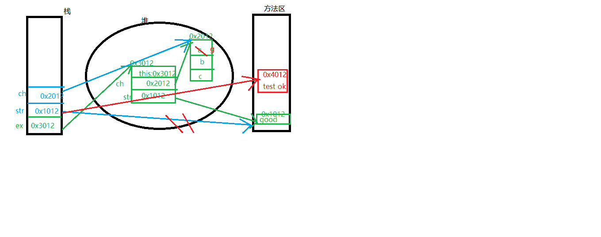
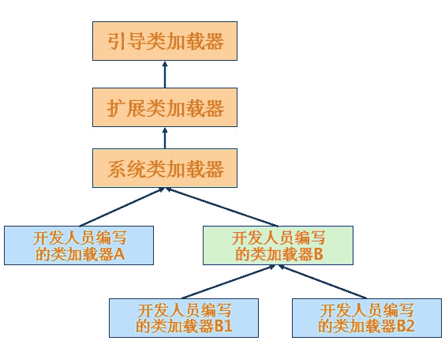
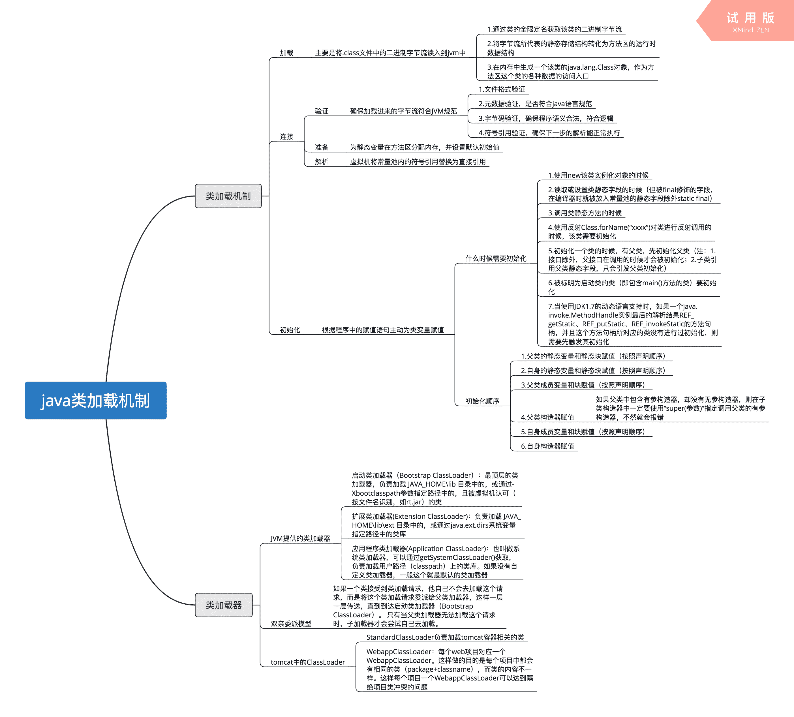
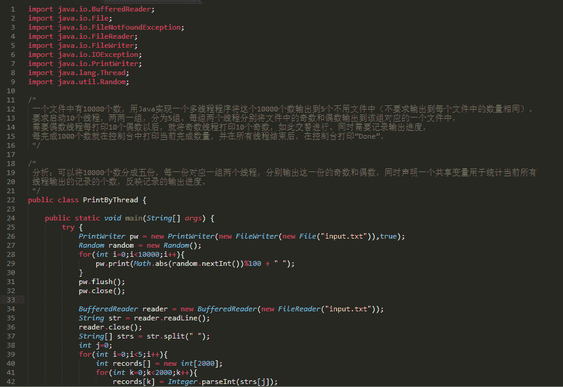
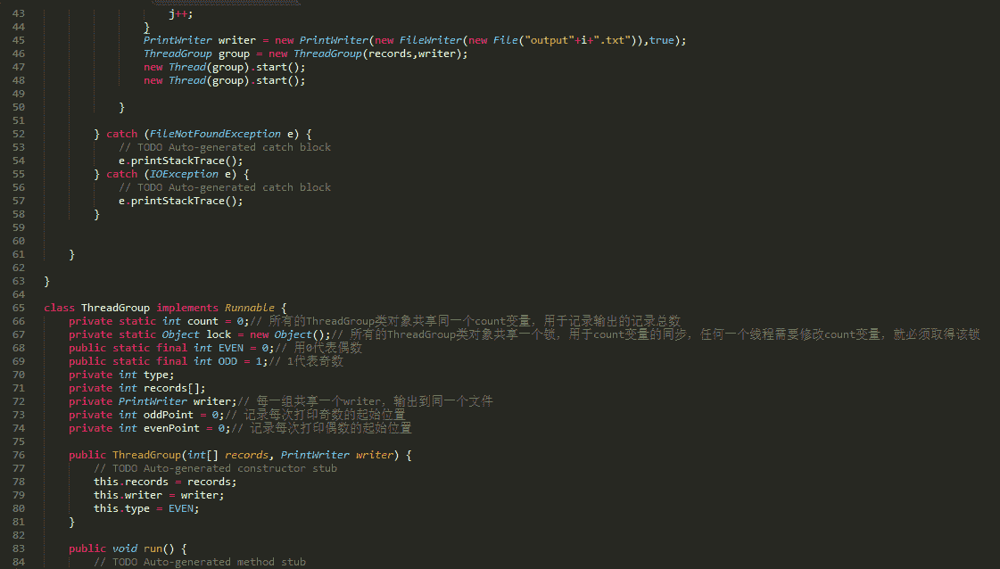
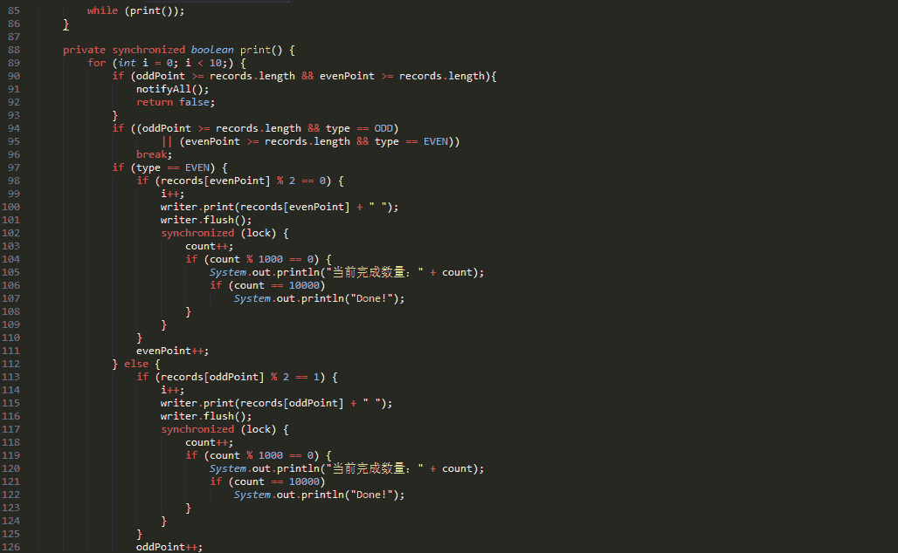
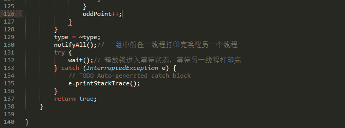
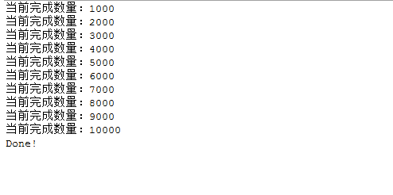
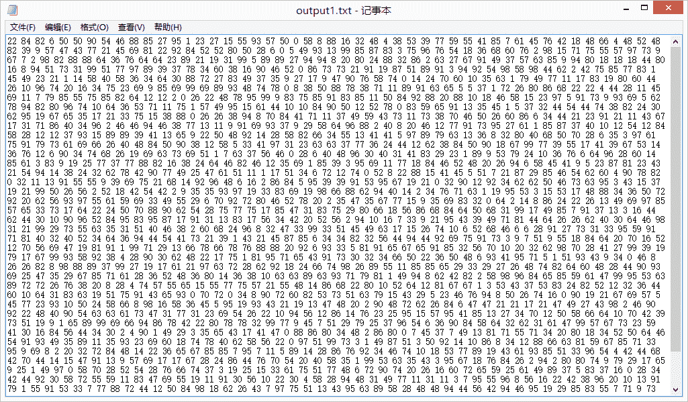
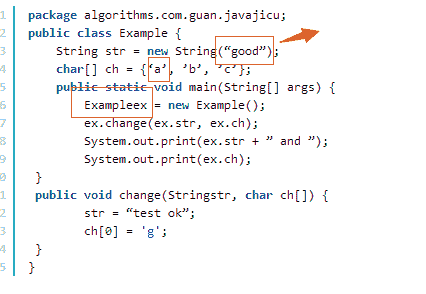

# 网易 2015 校招 JAVA 工程师笔试题

## 1

下列关于 Spring 特性中 IoC 描述错误的是：  

正确答案: A   你的答案: 空 (错误)

```cpp
IoC 就是指程序之间的关系由程序代码直接操控
```

```cpp
所谓“控制反转”是指控制权由应用代码转到外部容器，即控制权的转移
```

```cpp
IoC 将控制创建的职责搬进了框架中，从应用代码脱离开来
```

```cpp
使用 Spring 的 IoC 容器时只需指出组件需要的对象，在运行时 Spring 的 IoC 容器会根据 XML 配置数据提供给它
```

本题知识点

Spring Java 工程师 网易 2015

讨论

[MyGoodHelper](https://www.nowcoder.com/profile/644326)

A 控制反转即 IoC (  查看全部)

编辑于 2015-01-09 10:01:33

* * *

[Vanilla_](https://www.nowcoder.com/profile/915898)

所谓依赖注入就是指：在运行期，由外部容器动态地将依赖对象注入到组件中。当 spring 容器启动后，spring 容器初始化，创建并管理 bean 对象，以及销毁它。所以我们只需从容器直接获取 Bean 对象就行，而不用编写一句代码来创建 bean 对象。这种现象就称作控制反转，即应用本身不负责依赖对象的创建及维护，依赖对象的创建及维护是由外部容器负责的。这样控制权就由应用转移到了外部容器，控制权的转移就是所谓反转。虽然平时只需要按要求将 bean 配置到配置文件中，但是了解其实现过程对理解 spring 的实现原理是有好处的

发表于 2014-11-22 10:40:42

* * *

[圣斗士](https://www.nowcoder.com/profile/294712)

AIoc 是控制反转，将对象的创建和初始化，销毁就给容器来完成

发表于 2015-12-22 09:58:33

* * *

## 2

下面有关 JAVA 异常类的描述，说法错误的是？

正确答案: D   你的答案: 空 (错误)

```cpp
异常的继承结构：基类为 Throwable，Error 和 Exception 继承 Throwable，RuntimeException 和 IOException 等继承 Exception
```

```cpp
非 RuntimeException 一般是外部错误(非 Error)，其一般被 try{}catch 语句块所捕获
```

```cpp
Error 类体系描述了 Java 运行系统中的内部错误以及资源耗尽的情形，Error 不需要捕捉
```

```cpp
RuntimeException 体系包括错误的类型转换、数组越界访问和试图访问空指针等等，必须被 try{}catch 语句块所捕获
```

本题知识点

Java 网易

讨论

[牛客 554915 号](https://www.nowcoder.com/profile/554915)

运行时异常故名思议就是程序在运行的时候出现异常，隐含的一个前提就是程序在编译时是检测不到异常的存在，作者本人也并不知道是否自己的代码中含有运行时异常，所以根本也不可能提前使用 try{}catch{}捕获．

发表于 2016-03-20 00:39:46

* * *

[杀猪刀](https://www.nowcoder.com/profile/284466)

异常是指程序运行时（非编译）所发生的非正常情况或错误，当程序违反了语音规则，jvm 就会将出现的错误表示一个异常抛出。异常也是 java 的对象，定义了基类 java。lang。throwable 作为异常父类。 这些异常类又包括 error 和 exception。两大类 error 类异常主要是运行时逻辑错误导致，一个正确程序中是不应该出现 error 的。当出现 error 一般 jvm 会终止。exception 表示可恢复异常，包括检查异常和运行时异常。 检查异常是最常见异常比如 io 异常 sql 异常，都发生在编译阶段。这类通过 try、catch 捕捉而运行时异常，编译器没有强制对其进行捕捉和处理。一般都会把异常向上抛出，直到遇到处理代码位置，若没有处理块就会抛到最上层，多线程用 thread。run（）抛出，单线程用 main（）抛出。常见的运行异常包括 空指针异常 类型转换异常 数组月结异常 数组存储异常 缓冲区溢出异常 算术异常等，

发表于 2016-03-22 09:32:24

* * *

[hanking](https://www.nowcoder.com/profile/3849729)

注意：异常和错误的区别：异常能被程序本身可以处理，错误是无法处理。

通常，Java 的异常(包括 Exception 和 Error)分为 **可查的异常（checked exceptions）和不可查的异常（unchecked exceptions）** 。
可查异常（编译器要求必须处置的异常）： 正确的程序在运行中，很容易出现的、情理可容的异常状况 。 可查异常虽然是异常状况，但在一定程度上它的发生是可以预计的，而且一旦发生这种异常 状况，就必须采取某种方式进行处理。

除了 RuntimeException 及其子类以外，其他的 Exception 类及其子类都属于可查异常。这种异常的特点是 Java 编译器会检查它，也就是说，当程序中可能出现这类异常，要么用 try-catch 语句捕获它，要么用 throws 子句声明抛出它，否则编译不会通过。

不可查异常(编译器不要求强制处置的异常):包括运行时异常（RuntimeException 与其子类）和错误（Error）。

Exception 这种异常分两大类运行时异常和非运行时异常(编译异常)。程序中应当尽可能去处理这些异常。

**运行时异常：** 都是 RuntimeException 类及其子类异常，如 NullPointerException(空指针异常)、IndexOutOfBoundsException(下标越界异常)等，这些异常是不检查异常，程序中可以选择捕获处理，也可以不处理。这些异常一般是由程序逻辑错误引起的，程序应该从逻辑角度尽可能避免这类异常的发生。

运行时异常的特点是 Java 编译器不会检查它，也就是说，当程序中可能出现这类异常，即使没有用 try-catch 语句捕获它，也没有用 throws 子句声明抛出它，也会编译通过。 

**非运行时异常 （编译异常）：** 是 RuntimeException 以外的异常，类型上都属于 Exception 类及其子类。从程序语法角度讲是必须进行处理的异常，如果不处理，程序就不能编译通过。如 IOException、SQLException 等以及用户自定义的 Exception 异常，一般情况下不自定义检查异常。**csdn:[`blog.csdn.net/u013309870`](https://blog.csdn.net/u013309870)**

编辑于 2019-01-15 22:13:46

* * *

## 3

检查程序，是否存在问题，如果存在指出问题所在，如果不存在，说明输出结果。

```cpp
public class HelloB extends HelloA 
{
 public HelloB()
 {
 }
 {
     System.out.println("I’m B class");
 }
 static
 {
     System.out.println("static B");
 }
 public static void main(String[] args)
 {
     new HelloB();
 }
}
class HelloA
{
 public HelloA()
 {
 }
 {
     System.out.println("I’m A class");
 }
 static
 {
     System.out.println("static A");
 }
}
```

正确答案: C   你的答案: 空 (错误)

```cpp
static A
I’m A class
static B
I’m B class
```

```cpp
I’m A class
I’m B class
static A
static B
```

```cpp
static A
static B
I’m A class
I’m B class
```

```cpp
I’m A class
static A
I’m B class
static B
```

本题知识点

Java 百度 Java 工程师 网易 2015

讨论

[luulsj](https://www.nowcoder.com/profile/246726)

其中涉及：静态初始化代码块、  查看全部)

编辑于 2015-02-02 14:50:41

* * *

[宋常华](https://www.nowcoder.com/profile/979651)

1.静态代码块 2.构造代码块 3.构造方法的执行顺序是 1>2>3;明白他们是干嘛的就理解了。
1.静态代码块：是在类的加载过程的第三步初始化的时候进行的，主要目的是给类变量赋予初始值。
2.构造代码块：是独立的，必须依附载体才能运行，Java 会把构造代码块放到每种构造方法的前面，用于实例化一些共有的实例变量，减少代码量。
3.构造方法：用于实例化变量。
1 是类级别的，2、3 是实例级别的，自然 1 要优先 23.
在就明白一点：对子类得主动使用会导致对其父类得主动使用，所以尽管实例化的是子类，但也会导致父类的初始化和实例化，且优于子类执行。

发表于 2015-08-10 16:29:50

* * *

[yayamma](https://www.nowcoder.com/profile/270051)

Java 程序初始化工作可以在许多不同的代码块中来完成，它们的执行顺序如下：
**父类**的静态变量、父类的静态代码块、**子类**的静态变量、子类的静态代码块、
父类的**非静态**变量、父类的非静态代码块、**父类的构造函数**、
子类的非静态变量、子类的非静态代码块、子类的构造函数。

发表于 2015-09-16 15:52:54

* * *

## 4

检查程序，是否存在问题，如果存在指出问题所在，如果不存在，说明输出结果。

```cpp
package algorithms.com.guan.javajicu;  
public class Inc {  
    public static void main(String[] args) {  
       Inc inc = new Inc();  
       int i = 0;  
       inc.fermin(i);  
       i= i ++;  
       System.out.println(i); 

    }  
    void fermin(int i){  
       i++;  
    }  
}  
```

正确答案: A   你的答案: 空 (错误)

```cpp
0
```

```cpp
1
```

```cpp
2
```

```cpp
3
```

本题知识点

Java 百度 Java 工程师 网易 2015

讨论

[紫月](https://www.nowcoder.com/profile/371702)

如果你理解 JVM 的内存模型，  查看全部)

编辑于 2017-06-26 10:07:31

* * *

[紫色流星](https://www.nowcoder.com/profile/367905)

调用前 i 的地址值是 0，调用 fermin()方法时，因为 i 是基本数据类型，参数是按值传递的，此时会创建一个 i 的副本，该副本与 i 有相同的值，把这个副本作为参数进行 i++。 但是修改后的参数 i 与 i 没有关系的。所以 i++，i=0.。在此说明一下值传递的含义就是形参只是用实参的值初始化一个临时的存储单元，与实参有着相同的值，但是却有着不同的存储单元，因此对形参的改变不会影响实参的值。

编辑于 2016-04-25 20:20:40

* * *

[宋常华](https://www.nowcoder.com/profile/979651)

Java 使用了中间缓存变量机制：
i=i++;等同于：
temp=i； (等号右边的 i)
i=i+1;      (等号右边的 i)
i=temp;   (等号左边的 i)
而 i=++i;则等同于：
i=i+1;
temp=i;
i=temp;
但是那些说将 i++表达式的结果赋给 i 的答案，本人表示不理解。

发表于 2015-08-10 17:02:16

* * *

## 5

检查程序，是否存在问题，如果存在指出问题所在，如果不存在，说明输出结果。

```cpp
public class Example {  
  String str = new String("good");  
  char[] ch = {'a','b','c'};  
  public static void main(String[] args) {  
     Example ex = new Example();  
     ex.change(ex.str, ex.ch);  
     System.out.print(ex.str +"and");  
     System.out.print(ex.ch);   
  }  

  public void change(String str, char ch[]){  
     str= "test ok";  
     ch[0]= 'g';  
  }  
}  

```

正确答案: D   你的答案: 空 (错误)

```cpp
test okandabc
```

```cpp
test okandgbc
```

```cpp
goodandabc
```

```cpp
goodandgbc
```

本题知识点

Java 网易 2015

讨论

[JamesNiu](https://www.nowcoder.com/profile/592554)

java 中 String 是  查看全部)

编辑于 2016-01-17 20:49:58

* * *

[怕哒你](https://www.nowcoder.com/profile/3963334)

用内存图说明：字符常量是存储在方法区的，只有一份，执行方法改变了数组中元素的值，所以当方法结束的时候数组改变，而字符串没改变

发表于 2016-09-26 19:36:01

* * *

[半盏](https://www.nowcoder.com/profile/5107424)

别闹了，java 只有值传递。所谓的引用传递，不过是传递非基础类型的地址罢了，虽然能达到引用传递的效果，不过本质还是值传递。

发表于 2016-09-07 08:26:29

* * *

## 6

在服务器的网络编程中，解决会话跟踪的方法有?

正确答案: A B C D   你的答案: 空 (错误)

```cpp
使用 Cookie
```

```cpp
使用 URL 重写
```

```cpp
使用隐藏的表单域
```

```cpp
以上方法可以配合 Session 一起使用
```

本题知识点

网络基础 微博 Java 工程师 网易 2015

讨论

[像我这么吊的下水道还有六个](https://www.nowcoder.com/profile/127796)

**一个用户的所有请求操作都应该属于同一个会话，而另一个用户的所有请求操作则应该属于另一个会话，二者不能混淆。而** **Web** **应用程序是使用** **HTTP** **协议传输数据的。** **HTTP** **协议是** **无状态** **的协议。一旦数据交换完毕，客户端与服务器端的连接就会关闭，再次交换数据需要建立新的连接。这就意味着服务器无法从连接上跟踪会话。要跟踪该会话，必须引入一种机制。** **Cookie** **和** **Session** **就是这样的一种机制**

发表于 2015-07-17 09:03:13

* * *

[半纸流年](https://www.nowcoder.com/profile/710504)

解决回话跟踪技术。其实叫实现回话跟踪技术更好一些。
1，使用 cookie
2，隐藏表单域
3，URL 重写
4，session

发表于 2016-02-05 15:16:43

* * *

[guanjian](https://www.nowcoder.com/profile/564796)

[URL](http://baike.baidu.com/view/1496.htm)重写就是首先获得一个进入的 URL 请求然后把它重新写成网站可以处理的另一个 URL 的过程。举个例子来说，如果通过浏览器进来的 URL 是“UserProfile.aspx?ID=1”那么它可以被重写成 “UserProfile/1.aspx”，这样的 URL，这样的网址可以更好的被网站所阅读。如果浏览器不支持 Cookie 或用户阻止了所有 Cookie，可以把会话 ID 附加在 HTML 页面中所有的 URL 上，这些页面作为响应发送给客户。这样，当用户单击 URL 时，会话 ID 被自动作为请求行的一部分而不是作为头行发送回服务器。这种方法称为 URL 重写(URL rewriting)。

发表于 2015-09-23 19:39:31

* * *

## 7

下面有关 java 类加载器，说法正确的是？

正确答案: A B C D   你的答案: 空 (错误)

```cpp
引导类加载器（bootstrap class loader）：它用来加载 Java 的核心库，是用原生代码来实现的
```

```cpp
扩展类加载器（extensions class loader）：它用来加载 Java 的扩展库。
```

```cpp
系统类加载器（system class loader）：它根据 Java 应用的类路径（CLASSPATH）来加载 Java 类
```

```cpp
tomcat 为每个 App 创建一个 Loader，里面保存着此 WebApp 的 ClassLoader。需要加载 WebApp 下的类时，就取出 ClassLoader 来使用
```

本题知识点

Java 百度 Java 工程师 网易 2015

讨论

[额头上有疤](https://www.nowcoder.com/profile/290411)

jvm classLoa

  查看全部)

编辑于 2015-02-02 14:58:39

* * *

[清风随我心](https://www.nowcoder.com/profile/7172803)

Java 中的类加载器

Java 中的类加载器大致可以分成两类，一类是系统提供的，另外一类则是由 Java 应用开发人员编写的。系统提供的类加载器主要有下面三个：

* * *

引导类加载器（bootstrap class loader）：

它用来加载 Java 的核心库，是用原生代码来实现的，并不继承自 java.lang.ClassLoader。主要负责 jdk_home/lib 目录下的核心 api 或 -Xbootclasspath 选项指定的 jar 包装入工作（其中的 jdk_home 是指配置 jdk 环境变量是 java_home 的配置路径，一般是 jdk/jre 所在目录）。

扩展类加载器（extensions class loader）：

它用来加载 Java 的扩展库。Java 虚拟机的实现会提供一个扩展库目录，扩展类加载器在此目录里面查找并加载 Java 类，主要负责 jdk_home/lib/ext 目录下的 jar 包或 -Djava.ext.dirs 指定目录下的 jar 包装入工作。

系统类加载器（system class loader）：

它根据 Java 应用的类路径（CLASSPATH）来加载 Java 类。一般来说，Java 应用的类都是由它来完成加载的。可以通过 ClassLoader.getSystemClassLoader()来获取它。主要负责 CLASSPATH/-Djava.class.path 所指的目录下的类与 jar 包装入工作.

* * *

除了系统提供的类加载器以外，开发人员可以通过继承 java.lang.ClassLoader 类的方式实现自己的类加载器，从而进行动态加载 class 文件，以满足一些特殊的需求，这体现 java 动态实时类装入特性。

除了引导类加载器之外，所有的类加载器都有一个父类加载器，通过 getParent()方法可以得到。对于系统提供的类加载器来说，系统类加载器的父类加载器是扩展类加载器，而扩展类加载器的父类加载器是引导类加载器；对于开发人员编写的类加载器来说，其父类加载器是加载此类加载器 Java 类的类加载器。因为类加载器 Java 类如同其它的 Java 类一样，也是要由类加载器来加载的。一般来说，开发人员编写的类加载器的父类加载器是系统类加载器。类加载器通过这种方式组织起来，形成树状结构。树的根节点就是引导类加载器。下图中给出了一个典型的类加载器树状组织结构示意图，其中的箭头指向的是父类加载器。



编辑于 2017-11-11 17:03:50

* * *

[程序猿 Go 师傅](https://www.nowcoder.com/profile/242025553)



编辑于 2019-10-21 21:33:28

* * *

## 8

任意 2n 个整数，从其中选出 n 个整数，使得选出的 n 个整数和同剩下的 n 个整数之和的差最小。

你的答案

本题知识点

贪心 百度 网易 Java 工程师 2015

讨论

[牛客 733423 号](https://www.nowcoder.com/profile/733423)

```cpp
int solve() { i
```

  查看全部)

编辑于 2015-07-16 17:26:29

* * *

[JamesNiu](https://www.nowcoder.com/profile/592554)

这题其实难度相当大，看了很多朋友的答案，都想的太简单了。排序啊，首尾取啊，不妨多几个测试用例想下，都是有错的。编程之美上的题，《数组分割》：假设数组 A[1..2N]所有元素的和是 SUM。

模仿动态规划解 0-1 背包问题的策略，令 S(k, i)表示前 k 个元素中任意 i 个元素的和的集合。

显然：

S(k, 1) = {A[i] | 1<= i <= k}

S(k, k) = {A[1]+A[2]+…+A[k]}

S(k, i) = S(k-1, i) U {A[k] + x | x 属于 S(k-1, i-1) }

按照这个递推公式来计算，最后找出集合 S(2N, N)中与 SUM 最接近的那个和，这便是答案。

**[java]** [view plain](http://blog.csdn.net/imzoer/article/details/7436323#)[copy](http://blog.csdn.net/imzoer/article/details/7436323#)

1.  public   class  Main {  

3.  public   static   void  main(String[] args) {  
4.  int  A[] = {  1 ,  2 ,  3 ,  5 ,  7 ,  8 ,  9  };  
5.  // int A[] = { 1, 5, 7, 8, 9, 6, 3, 11, 20, 17 };   
6.  func(A);  
7.  }  

9.  static   void  func( int  A[]) {  
10.  int  i;  
11.  int  j;  

13.  int  n2 = A.length;  
14.  int  n = n2 /  2 ;  
15.  int  sum =  0 ;  
16.  for  (i =  0 ; i < A.length; i++) {  
17.  sum += A[i];  
18.  }  

20.  /** 
21.  * flag[i][j]:任意 i 个数组元素之和是 j,则 flag[i][j]为 true 
22.  */   
23.  boolean  flag[][] =  new   boolean [A.length +  1 ][sum /  2  +  1 ];  
24.  for  (i =  0 ; i < A.length; i++)  
25.  for  (j =  0 ; j < sum /  2  +  1 ; j++)  
26.  flag[i][j] = false ;  

28.  flag[0 ][ 0 ] =  true ;  

30.  for  ( int  k =  0 ; k < n2; k++) {  
31.  for  (i = k > n ? n : k; i >=  1 ; i--) {  
32.  // 两层外循环是遍历集合 S(k,i)   
33.  for  (j =  0 ; j <= sum /  2 ; j++) {  
34.  if  (j >= A[k] && flag[i -  1 ][j - A[k]])  
35.  flag[i][j] = true ;  
36.  }  
37.  }  
38.  }  
39.  for  (i = sum /  2 ; i >=  0 ; i--) {  
40.  if  (flag[n][i]) {  
41.  System.out.println("sum is "  + sum);  
42.  System.out.println("sum/2 is "  + sum /  2 );  
43.  System.out.println("i is "  + i);  
44.  System.out.println("minimum delta is "  + Math.abs( 2  * i - sum));  
45.  break ;  
46.  }  
47.  }  
48.  }  
49.  }  

题目是这样的：

有一个没有排序，元素个数为 2N 的正整数数组。要求把它分割为元素个数为 N 的两个数组，并使两个子数组的和最接近。

思路书上都有。

这个 if 判断，if (j >= A[k] && flag[i - 1][j - A[k]])，j >= A[k]条件是为了让 flag 数组的第二维不越界。

参考了这个地址：

[`www.cppblog.com/baby-fly/archive/2009/09/24/92392.html`](http://www.cppblog.com/baby-fly/archive/2009/09/24/92392.html)

编辑于 2015-08-16 22:00:49

* * *

[Maybe.](https://www.nowcoder.com/profile/337833)

或者可以换一个思路，从 2n 个数里面取 n 个数，满足其大小最接近所有数总和的一半~

发表于 2015-10-09 16:43:55

* * *

## 9

有两个有序的集合，集合的每个元素都是一段范围，求其交集，例如集合{[4,8],[9,13]}和{[6,12]}的交集为{[6,8],[9,12]}

你的答案

本题知识点

排序 *数组 百度 网易 Java 工程师 2015* *讨论

[Scheaven](https://www.nowcoder.com/profile/2065035)

```cpp
/*
*比猫画虎，不成敬意。我测试了几次都可以哦！
*/
package number.action;

import java.util.ArrayList;
import java.util.List;

/*
 * @author snow
 * @time 2016_08_01 20:26
 * @questions 有两个有序的集合，集合的每个元素都是一段范围，求其交集，
 * 例如集合{[4,8],[9,13]}和{[6,12]}的交集为{[6,8],[9,12]}
 */
public class NumberIntersection_010 {
	public static void main(String args[]){
		Section section1 = new Section(2, 4);
		Section section2 = new Section(8,11);
		Section section3 = new Section(6,10);
		Section section4 = new Section(11,13);
		List<Section> aList = new ArrayList<Section>();
		List<Section> bList = new ArrayList<Section>();
		aList.add(section1);
		aList.add(section2);
		bList.add(section3);
		bList.add(section4);

		List<Section> result = getInterSection(aList,bList);
		System.out.println("两个集合的的交集是");
		for(Section sect:result){
			System.out.println(sect.getSection());
		}
	}

	private static List<Section> getInterSection(List<Section> aList,List<Section> bList) {
		int i = 0 , j = 0;
		List<Section> interSection = new ArrayList<Section>();
		while(i<aList.size()&&j<bList.size()){
			Section a = aList.get(i);
			Section b = bList.get(j);
			int aLeft = a.getLefe();
			int aRight = a.getRight();
			int bLeft = b.getLefe();
			int bRight = b.getRight();
			if(aLeft>bRight){
				j++;
			}else if(aRight<bLeft){
				i++;
			}else if(aLeft>bLeft){
				if(aRight<bRight){
					interSection.add(a);
					i++;
				}else{
					Section temp = new Section(aLeft,bRight);
					interSection.add(temp);
					j++;
				}
			}else{
				if(bRight<aRight){
					interSection.add(b);
					j++;
				}else{
					Section temp = new Section(bLeft,aRight);
					interSection.add(temp);
					i++;
				}
			}
		}
		return interSection;
	}
}

class Section{
	int lefe,right;
	public Section(int l,int r){
		lefe = l;
		right =r;
	}

	public int getLefe() {
		return lefe;
	}
	public int getRight() {
		return right;
	}

	public String getSection(){
		return "["+lefe + "," + right +"]";
	}
}
```

发表于 2016-08-01 21:51:29

* * *

[oopscooper](https://www.nowcoder.com/profile/398942)

```cpp
import java.util.ArrayList;

public class RangeTest {

	public static void main(String[] args) {

		Range r1=new Range(4, 8);
		Range r2=new Range(9, 13);
		Range r3=new Range(6, 12);
		Range r4=new Range(7, 10);
		Range[] aR=new Range[]{r1,r2};
		Range[] bR=new Range[]{r3,r4};
		ArrayList<Range> result=getRangeSet(aR, bR);
		for(int i=0;i<result.size();i++){
			System.out.println(result.get(i));
		}

	}
	public static ArrayList<Range> getRangeSet(Range[] aR, Range[] bR){
		ArrayList<Range> ranges=new ArrayList<Range>();
		for(int i=0;i<bR.length;i++){
			for(int j=0;j<aR.length;j++){
				if(aR[j].right<bR[i].left){
					break;  //无交集
				}else if(aR[j].right>bR[i].left){
					int left=aR[j].left>bR[i].left ? aR[j].left:bR[i].left;   //选大的那个
					int right=aR[j].right<bR[i].right ? aR[j].right:bR[i].right;   //选小的那个
					Range range=new Range(left, right);
					ranges.add(range);
				}
			}
		}
		return ranges;
	}
}
class Range{
	int left;
	int right;
	public Range(int num1, int num2){
		left=num1;
		right=num2;
	}
	@Override
	public String toString() {
		return " [left=" + left + ", right=" + right + "]";
	}

}
```

发表于 2015-08-22 21:10:07

* * *

[Cari](https://www.nowcoder.com/profile/251594)

首先每个集合的元素数应该一致。需要一个额外的辅助空间。2 个集合的第一个元素，第一个数字，取上限，第二个取下限。

发表于 2015-08-11 13:48:18

* * *

## 10

一个文件中有 10000 个数，用 Java 实现一个多线程程序将这个 10000 个数输出到 5 个不用文件中（不要求输出到每个文件中的数量相同）。要求启动 10 个线程，两两一组，分为 5 组。每组两个线程分别将文件中的奇数和偶数输出到该组对应的一个文件中，需要偶数线程每打印 10 个偶数以后，就将奇数线程打印 10 个奇数，如此交替进行。同时需要记录输出进度，每完成 1000 个数就在控制台中打印当前完成数量，并在所有线程结束后，在控制台打印”Done”.

你的答案

本题知识点

操作系统 并发 Java 百度 网易 Java 工程师 2015

讨论

[notlie](https://www.nowcoder.com/profile/846667)




运行结果：


编辑于 2015-07-16 17:20:57

* * *

[dlmufei](https://www.nowcoder.com/profile/391327)

自己重写了一下推荐答案，加了些注释方便理解

```cpp
package threadpackage;

import java.io.BufferedReader;
import java.io.File;
import java.io.FileReader;
import java.io.FileWriter;
import java.io.PrintWriter;
import java.util.Random;

/*
 一个文件中有 10000 个数，用 Java 实现一个多线程程序将这个 10000 个数输出到 5 个不用文件中（不要求输出到每个文件中的数量相同）。
 要求启动 10 个线程，两两一组，分为 5 组。
 每组两个线程分别将文件中的奇数和偶数输出到该组对应的一个文件中，
 需要偶数线程每打印 10 个偶数以后，就将奇数线程打印 10 个奇数，如此交替进行。
 同时需要记录输出进度，每完成 1000 个数就在控制台中打印当前完成数量，并在所有线程结束后，在控制台打印”Done”.
 */
/**
 * 分析：可以将 10000 个数分成 5 份，每一份（2000 个数）对应一组，即两个线程，来分别输出这一份的奇数和偶数，
 * 同时声明一个共享变量，用于统计当前所有线程输出的个数，反映记录的输出进度
 */
public class PrintByThread {

	public static void main(String[] args) {
		try {
			//创建一个包含 10000 数字的输入文件
			PrintWriter pw=new PrintWriter(new FileWriter(new File("input.txt")),true);
			Random random=new Random();
			for (int i = 0; i < 10000; i++) {
				pw.print(Math.abs(random.nextInt())%100+",");
			}
			pw.flush();
			pw.close();
			//读取文件中的数字，分 5 次读取，每次读取 2000 个
			BufferedReader reader=new BufferedReader(new FileReader("input.txt"));
			String str=reader.readLine();
			reader.close();
			String[] strs=str.split(",");//将一行字符串全部解析为 10000 个数字
			int j=0;//10000 个数的索引计数
			for (int i = 0; i < 5; i++) {
				int records[]=new int[2000];
				for (int k = 0; k < 2000; k++) {
					records[k]=Integer.parseInt(strs[j]);
					j++;
				}
				//定义输出文件
				PrintWriter writer =new PrintWriter(new FileWriter(new File("output"+i+".txt")),true);
				//定义实现的方法
				ThreadGroup group=new ThreadGroup(records, writer);
				//开启一对儿线程
				new Thread(group).start();
				new Thread(group).start();				
			}			

		} catch (Exception e) {
			// TODO: handle exception
		}		
	}	
}  
```

```cpp
package threadpackage;

import java.io.PrintWriter;

class ThreadGroup implements Runnable{
	//所有类对象共享的同一个计数器 count，记录总共输出的记录总数
	private static int count=0;
	//所有的 ThreadGroup 类对象共享一个锁，用于 count 变量的同步，任何一个线程需要修改 count 变量，必须取得该锁
	private static Object lock=new Object();
	public static final int EVEN=0;//代表偶数
	public static final int ODD=1;//代表奇数

	//*********以上静态变量，属于整个类所有***********
	private int type;
	private int records[];
	private PrintWriter writer;//每组共享一个 writer，输出到同一个文件
	private int oddPoint=0;//记录每次打印奇数的起始位置
	private int evenPoint=0;//记录每次打印偶数的起始位置

	public ThreadGroup(int[] records,PrintWriter writer){
		this.records=records;
		this.writer=writer;
		this.type=EVEN;
	}

	//线程方法实现
	public void run() {
		while(print());

	}

	private synchronized boolean print(){
		for(int i=0;i<10;){
			//如果奇数和偶数都打印完成以后，就直接停止打印循环，等待该线程自己结束
			if (oddPoint>=records.length&&evenPoint>=records.length) {
				notifyAll();
				return false;
			}
			//如果该线程该打印奇数，但奇数已经打印晚了，就直接停止本次 10 个数的打印，
			//同理偶数，等下次切换打印类型后，再开始打印另外一种类型
			if ((oddPoint>=records.length&&type==ODD)||(evenPoint>=records.length&&type==EVEN)) {
				break;
			}
			//判断开始打印偶数
			if (type==EVEN) {
				if (records[evenPoint]%2==0) {
					i++;
					writer.print(records[evenPoint]+",");
					writer.flush();
					//锁定全局变量方便线程输出后计数
					synchronized (lock) {
						count++;
						if (count%1000==0) {
							System.out.println("当前完成数量："+count);
							if (count==10000) {
								System.out.println("Done!");
							}
						}
					}
				}
				//无论是否是偶数，打印成功一个后，偶数的起始位置都要后移
				evenPoint++;
			}else {
				//打印奇数
				if (records[oddPoint]%2==1) {
					i++;
					writer.print(records[oddPoint]+",");
					writer.flush();
					//锁定全局变量方便线程输出后计数
					synchronized (lock) {
						count++;
						if (count%1000==0) {
							System.out.println("当前完成数量："+count);
							if (count==10000) {
								System.out.println("Done!");
							}
						}
					}
				}
				//无论是否是奇数，打印成功一个后，偶数的起始位置都要后移
				oddPoint++;
			}

		}
		type=~type;//切换打印类型
		notifyAll();//一组中的任一线程打印完后唤醒另一个线程
		try {
			wait();//释放锁进入等待状态，等待另一线程打印
		} catch (Exception e) {
			// TODO: handle exception
		}
		return false;
	}
}  
```

发表于 2016-03-19 00:04:25

* * *

[牛客 881977 号](https://www.nowcoder.com/profile/881977)

网易笔试估计过不去了。。。

发表于 2016-03-21 19:05:04

* * *

## 11

检查程序，是否存在问题，如果存在指出问题所在，如果不存在，说明输出结果。

```cpp
package algorithms.com.guan.javajicu;
public class Example {
    String str = new String(“good”);
    char[] ch = {‘a’, ’b’, ’c’};
    public static void main(String[] args) {
        Exampleex = new Example();
        ex.change(ex.str, ex.ch);
        System.out.print(ex.str + ” and ”);
        System.out.print(ex.ch);
 }
 public void change(Stringstr, char ch[]) {
        str = “test ok”;
        ch[0] = 'g';
 }
}
```

你的答案

本题知识点

字符串 *Java 网易 Java 工程师 2015* *讨论

[oopscooper](https://www.nowcoder.com/profile/398942)

除去格式上的错误，姑且认为是排版有错误吧。结果是：good  and gbc。java 中方法接收的参数都是值传递。对于这个题目：change 方法接收了两个参数，分别是：str 和 ch，方法体内部又创建出两个局部变量分别等于这两个参数，即是：str‘=str，ch’=ch，此时 str‘指向的是堆中的“good”，ch’指向的是堆中的 char[]，内容是{‘a’，‘b‘，’c‘}。str 的类型是 string，这种类型在 java 中是不能修改的，当 str’要重新赋值的时候，其实是又实例化了一个新的 string，值是“test ok”，原来的 str（“good”）是没有变化的；ch‘[0]=‘g’时，也就是修改了 ch‘所指向的堆中的 ch[],所以内容修改了，变成{‘g’，‘b’，‘c’}。

发表于 2015-08-22 17:55:28

* * *

[ノ往事成空、](https://www.nowcoder.com/profile/674486)

输出结果为：good and gbcJava 的值传递和引用传递 String 类型作为 char[]的包装类，在作为方法参数传递时，体现的是非对象的特性，是值传递，不会改变实际参数的值 char[]数组是引用数据类型，是引用传递，当没有改变地址时，能够改变实际参数的值

发表于 2015-07-17 10:28:39

* * *

[nanama](https://www.nowcoder.com/profile/442975)

这个程序不是本身就有问题吗？怎么都说没问题呢

发表于 2015-08-03 15:26:19

* * ***