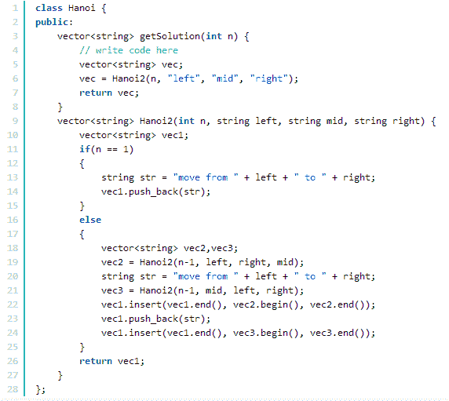

# 面试常考算法题(七)-汉诺塔问题

## 1

我们有由底至上为从大到小放置的 n 个圆盘，和三个柱子（分别为左/中/右即 left/mid/right），开始时所有圆盘都放在左边的柱子上，按照汉诺塔游戏的要求我们要把所有的圆盘都移到右边的柱子上，要求一次只能移动一个圆盘，而且大的圆盘不可以放到小的上面。

请实现一个函数打印最优移动轨迹。

给定一个 **`int n`** ，表示有 n 个圆盘。请返回一个 **`string`** 数组，其中的元素依次为每次移动的描述。描述格式为： **`move from [left/mid/right] to [left/mid/right]`**。

数据范围：要求：时间复杂度  ， 空间复杂度 

本题知识点

递归 动态规划

讨论

[JacobGo！](https://www.nowcoder.com/profile/6196880)

递归求解假设有 from 柱子，mid 柱子和 to 柱子，都在 from 的圆盘上完全移动到 to，最优过程为：1.1~i-1 的圆盘从 from 移动到 mid；2.单独的圆盘从 from 移动到 to；3.把圆盘 1~i-1 从 mid 移动到 to。如果圆盘只有一个，直接把这个圆盘从 from 移动到 to 即可。

```cpp
import java.util.*;

public class Solution {
    ArrayList<String> res=null;
    public ArrayList<String> getSolution(int n) {
        if(n<=0)
            return null;
        res=new ArrayList<String>();
        func(n,"left","mid","right");

        return res;
    }
    /*
     * 把 n 个盘子从 from 移动到 to
     */
    private void func(int n, String from, String mid, String to) {
        if(n==1)
            res.add("move from "+from+" to "+to);
        else{
            func(n-1,from,to,mid);
            func(1,from,mid,to);
            func(n-1,mid,from,to);
        }

    }
}

```

编辑于 2017-12-16 10:33:25

* * *

[不知 Andy](https://www.nowcoder.com/profile/310250)

```cpp
import java.util.*;

public class Solution {
    private String[] pos = {"left", "mid", "right"};
    public ArrayList<String> getSolution(int n) {      
        return getSolution(n, 0, 2);
    }
    public ArrayList<String> getSolution(int n, int from, int to) {       
        if(n==0) return new ArrayList<String>();
        ArrayList<String> list = getSolution(n-1, from, 3-from-to);
        list.add("move from "+pos[from]+" to "+pos[to]);
        list.addAll(getSolution(n-1, 3-from-to, to));
        return list;
    }
}

```

先把三个柱子编码 0，1，2。假设我们从柱子 x 向柱子 y 移动 n 个盘，由于大的不能放小的上面，所以移动最下面一个的时候前面 n-1 个一定按顺序排在第三个柱子（编码为 3-x-y）上，将最后一个从 x 移到 y，再把 3-x-y 上的全移动到 y。递归得到答案。

发表于 2016-09-06 14:01:37

* * *

[啥](https://www.nowcoder.com/profile/811262)



发表于 2015-08-13 11:37:10

* * *

## 2

有一个 int 数组 arr 其中只含有 1、2 和 3，分别代表所有圆盘目前的状态，1 代表左柱，2 代表中柱，3 代表右柱，arr[i]的值代表第 i+1 个圆盘的位置。比如，arr=[3,3,2,1]，代表第 1 个圆盘在右柱上、第 2 个圆盘在右柱上、第 3 个圆盘在中柱上、第 4 个圆盘在左柱上。如果 arr 代表的状态是最优移动轨迹过程中出现的状态，返回 arr 这种状态是最优移动轨迹中的第几个状态。如果 arr 代表的状态不是最优移动轨迹过程中出现的状态，则返回-1。

给定一个 int 数组**arr**及数组的大小**n**，含义如题所述，请返回一个 int，代表所求的结果。

测试样例：

```cpp
[3,3]
```

```cpp
返回：3
```

本题知识点

递归 动态规划

讨论

[watChen](https://www.nowcoder.com/profile/600789)

```cpp
class Hanoi { p
```

  查看全部)

编辑于 2015-07-26 22:08:41

* * *

[有机物](https://www.nowcoder.com/profile/5818930)

    int chkStep(vector<int> arr, int n)     {        int sum=0,cur=arr.size()-1,start=1,target=3,bypass=2;        for(;cur>=0&&arr[cur]!=bypass;cur--)            if(arr[cur]==start)               swap(bypass,target);            else               sum+=1<<cur,swap(bypass,start);        return cur>=0?-1:sum;    }//注意到题中认为标号大的块就是体积更大的块，则从最大的块或最大标号处开始。//如果最大的块还在 start 处，则计算子问题，如果放在了 target 处，则前面的一个子问题已经完成，2^n-1,再加上当前块本身的一次移动，然后再加上子问题的需要步数。

发表于 2016-10-02 17:17:21

* * *

[JacobGo！](https://www.nowcoder.com/profile/6196880)

```cpp
package go.jacob.day1216;

import org.junit.Test;

public class Demo2 {
    @Test
    public void test() {
        int[] arr = { 2, 1, 1, 1, 3, 2, 2, 3 };
        System.out.println(chkStep(arr, arr.length));
    }

    public int chkStep(int[] arr, int n) {
        if (arr == null || arr.length == 0 || arr.length != n)
            return -1;
        return process(arr, n-1, 1, 2, 3);
    }

    private int process(int[] arr, int i, int from, int mid, int to) {
        if (i == -1)
            return 0;
        if (arr[i] == mid)
            return -1;
        if (arr[i] == from)// 说明当前轮次的最大环还在最左边的柱子上
            return process(arr, i - 1, from, to, mid);
        else {// 在最右柱子上
            int tmp = process(arr, i - 1, mid, from, to);
            if (tmp == -1)
                return -1;
            return (1 << i) + tmp;
        }
    }
}

```

发表于 2017-12-16 11:30:15

* * *