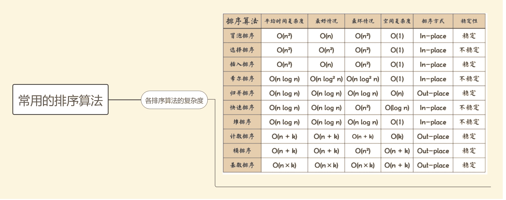
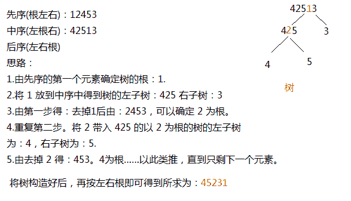
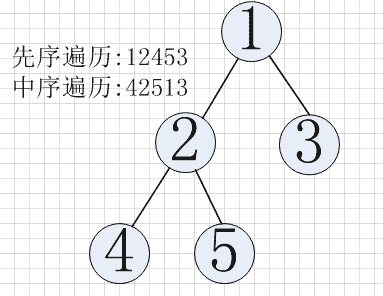

# 阿里巴巴 2015 实习生笔试题

## 1

下列叙述中正确的是？

正确答案: D   你的答案: 空 (错误)

```cpp
循环队列有队头和队尾两个指针，因此，循环队列是非线性结构
```

```cpp
在循环队列中，只需要队头指针就能反映队列中元素的动态变化情况
```

```cpp
在循环队列中，只需要队尾指针就能反映队列中元素的动态变化情况
```

```cpp
循环队列中元素的个数是有队头指针和队尾指针共同决定
```

本题知识点

链表 *阿里巴巴* *讨论

[MyGoodHelper](https://www.nowcoder.com/profile/644326)

D 队列(Queue)也  查看全部)

编辑于 2015-02-04 14:36:22

* * *

[kmust_XiaQing](https://www.nowcoder.com/profile/439185)

D.循环队列有对头指针和对尾指针，但是循环队列也是线性结构的在循环队列中，元素的动态变化是通过对头指针和对尾指针共同决定的

发表于 2015-08-12 16:30:42

* * *

[木子鸟](https://www.nowcoder.com/profile/264686)

循环队列元素个数：n=(rear-front+MAXSIZE)mod MAXSIZE 其中 rear 表示队尾，front 表示队首，MAXSIZE 表示队列长度

发表于 2015-08-23 00:07:29

* * *

## 2

以下指令集架构属于复杂指令集架构的是？

正确答案: D   你的答案: 空 (错误)

```cpp
ARM
```

```cpp
MIPS
```

```cpp
SPARC
```

```cpp
以上皆不是
```

本题知识点

编译和体系结构 阿里巴巴

讨论

[MyGoodHelper](https://www.nowcoder.com/profile/644326)

D 都属于精简指令集

编辑于 2015-02-04 16:21:58

* * *

[切克挠挠](https://www.nowcoder.com/profile/291528)

常用的精简指令集 RISC 微处理器包括 DECAlpha 、 ARC 、 ARM 、 AVR 、 MIPS 、 PA-RISC 、 PowerArchitecture( 包括 PowerPC) 和 SPARC 等。 复杂指令 CISC 如 X86。

发表于 2015-08-14 10:23:03

* * *

[百度高级测试开发工程师](https://www.nowcoder.com/profile/921406)

D：MIPS 是世界上很流行的一种 RISC 处理器。

1987 年，SUN 和 TI 公司合作开发了 RISC 微处理器——SPARC。

ARM 处理器是 Acorn 计算机有限公司面向低预算市场设计的第一款 RISC 微处理器。

发表于 2016-01-17 00:15:20

* * *

## 3

设栈 S 初始状态为空。元素 a,b,c,d,e,f 依次通过栈 S，若出栈的顺序为 c,f,e,d,b,a，则栈 S 的容量至少应该为？

正确答案: C   你的答案: 空 (错误)

```cpp
3
```

```cpp
4
```

```cpp
5
```

```cpp
6
```

本题知识点

栈 *阿里巴巴* *讨论

[速效扎心丸](https://www.nowcoder.com/profile/801565)

C 栈内情况：A  查看全部)

编辑于 2015-02-04 16:18:51

* * *

[kmust_XiaQing](https://www.nowcoder.com/profile/439185)

C.step1：A，B，C 入栈 step2:C 出栈 step3：D,E,F 入栈 step4:F,E,D,B,A 出栈栈内最多有 5 个元素同时存在

发表于 2015-08-12 16:36:57

* * *

[牛牛 Coder](https://www.nowcoder.com/profile/367024)

C 出站了

发表于 2015-08-22 16:34:34

* * *

## 4

在二进制数据中，小数点向右移一位，则数据

正确答案: C   你的答案: 空 (错误)

```cpp
除以 10
```

```cpp
除以 2
```

```cpp
乘以 2
```

```cpp
乘以 10
```

本题知识点

编译和体系结构

讨论

[kok](https://www.nowcoder.com/profile/194)

  查看全部)

编辑于 2015-02-04 14:40:31

* * *

[Coding](https://www.nowcoder.com/profile/187747)

小数点右移，就是数字左移，乘以 2

发表于 2015-07-27 22:02:16

* * *

[kmust_XiaQing](https://www.nowcoder.com/profile/439185)

C.十进制数据右移 n 位，乘以 10^n,左移 n 位，除以 10^n 二进制数据右移 n 位，乘以 2^n,左移 n 位，除以 2^n(右移数据变大，乘操作，左移数据变小，除操作)

发表于 2015-08-12 16:40:10

* * *

## 5

有两个 N*N 的矩阵 A 和 B，想要在 PC 上按矩阵乘法基本算法编程实现计算 A*B。假设 N 较大，本机内存也很大，可以存下 A、B 和结果矩阵。那么，为了计算速度，A 和 B 在内存中应该如何存储（按行存指先存储第一行，再第二行，直到最后一行；按列存指先存储第一列，再第二列，直到最后一列）？

正确答案: B   你的答案: 空 (错误)

```cpp
A 按行存，B 按行存。
```

```cpp
A 按行存，B 按列存。
```

```cpp
A 按列存，B 按行存。
```

```cpp
A 按列存，B 按列存。
```

本题知识点

操作系统 阿里巴巴

讨论

[notlie](https://www.nowcoder.com/profile/846667)

我们来看看传统的分块矩阵相乘：


很明显依然是行乘以列的方式。再来看看 Strassen 矩阵相乘：同样是分块，只是计算方式不同
很明显，涉及到行的加法(a+b,c+d,e+f,g+h)，列的减法(f-h,g-e,b-d,a-c)，对角线的加法(a+d,e+h)以及行列的乘法，所以无论是

*   A 按行存，B 按行存。
*   A 按行存，B 按列存。

计算速度都是差不多的。而如果用的是传统矩阵相乘法，按 B 选项的方式存储计算速度更快。综上所述，我觉得答案应该选 B。

编辑于 2015-08-17 17:35:17

* * *

[wenyanliu](https://www.nowcoder.com/profile/425767)

这个题最开始我选的是 B，想到的是传统矩阵相乘的方法，时间复杂度为 O（n³ ），但是这不是最优的方法，最优方法为 Strassen 矩阵相乘发，时间复杂度降低为 O（n^(2.81)），用分治的思想将矩阵分块计算，在这个算法中按行存储更有利。所以正确答案为 A。

编辑于 2015-07-24 09:56:01

* * *

[stephen.D.C](https://www.nowcoder.com/profile/286408)

楼下的看到题目中“按矩阵乘法基本算法编程实现计算 A*B ”了么？

发表于 2015-08-12 17:09:46

* * *

## 6

IP 数据报头采用（）字节序，在此字节序下从低地址到高地址 0x1234 的表示形式为 （） 。

正确答案: C   你的答案: 空 (错误)

```cpp
big_endian,0x12 0x34 0 0
```

```cpp
little_endian,0x34 0x12 0 0
```

```cpp
big_endian,0 0 0x12 0x34
```

```cpp
little_endian, 0 0 0x34 0x12
```

本题知识点

网络基础 阿里巴巴

讨论

[Un-Infinite](https://www.nowcoder.com/profile/692362)

其实 big endian 是指低地址存放最高有效字节（ MSB ），而 little endian 则是低地址存放最低有效字节（ LSB ）。 所有网络协议也都是采用 big endian 的方式来传输数据的。所以有时我们也会把 big endian 方式称之为网络字节序。当两台采用不同字节序的主机通信时，在发送数据之前都必须经过字节序的转换成为网络字节序后再进 行传输。

发表于 2015-08-12 16:02:27

* * *

[buxizhizhou](https://www.nowcoder.com/profile/670901)

0x1234 其实是 0x00001234，不要当成了 0x12340000 了，不然就选成了 A。。。

发表于 2015-08-22 23:06:08

* * *

[菩提旭光](https://www.nowcoder.com/profile/837579)

  其实 big endian 是指低地址存放最高有效字节（ MSB ），而 little endian 则是低地址存放最低有效字节（ LSB ）。比如数字 0x12345678 在两种不同字节序 CPU 中的存储顺序如下所示：

**Big Endian**

```cpp
   低地址                                            高地址
    ----------------------------------------->
    +-+-+-+-+-+-+-+-+-+-+-+-+-+-+-+-+-+-+
    |     12     |      34    |     56      |     78    |
    +-+-+-+-+-+-+-+-+-+-+-+-+-+-+-+-+-+-+

 Little Endian
```

   ----------------------------------------->
   +-+-+-+-+-+-+-+-+-+-+-+-+-+-+-+-+-+-+
   |     12     |      34    |     56      |     78    |
   +-+-+-+-+-+-+-+-+-+-+-+-+-+-+-+-+-+-+

**Little Endian**

   低地址                                            高地址
   ----------------------------------------->
   +-+-+-+-+-+-+-+-+-+-+-+-+-+-+-+-+-+-+
   |     78     |      56    |     34      |     12    |
   +-+-+-+-+-+-+-+-+-+-+-+-+-+-+-+-+-+-+

     从上面两图可以看出，采用 big endian 方式存储数据是符合我们人类的思维习惯的。而 little endian，!@#$%^&*，见鬼去吧 -_-|||

编辑于 2015-08-22 16:34:53

* * *

## 7

```cpp
struct T {
    char a;
    int *d;
    int b;
    int c:16;
    double e;
};
T *p;

```

在 64 位系统以及 64 位编译器下，以下描述正确的是

正确答案: C   你的答案: 空 (错误)

```cpp
sizeof(p) == 24
```

```cpp
sizeof(*p) == 24
```

```cpp
sizeof(p->a) == 1
```

```cpp
sizeof(p->e) == 4
```

本题知识点

编译和体系结构 C++ 阿里巴巴 C 语言

讨论

[VDreamS_Right](https://www.nowcoder.com/profile/955572)

字节对齐的三个准则：1)   查看全部)

编辑于 2015-12-25 17:07:49

* * *

[StrongYoung](https://www.nowcoder.com/profile/649626)

也许很多同学选择了 B，其实，我也选了这个。但是，看了解析，我才发现，原来自己大意了。因为，**在 64 位系统下，地址占 64 位**，即指针占 64 位，8 个字节所以，*p 所占的内存是这要的：a：本身占 1 个字节，字节对齐占 7 个字节，共 8 个字节 d：64 位指针，占 8 字节 b：占 32 位，4 个字节 c:16 ：占 16 位，2 个字节，字节对齐占 2 个字节，共 4 个字节 e：64 位，8 个字节 8 + 8 + 4 + 4 + 8 = 32

发表于 2015-08-15 22:03:55

* * *

[zezedi](https://www.nowcoder.com/profile/143527)

sizeof(p) == 8  P 为指针，64 位系统地址占 8 个字节 sizeof(*p) == 24 根据内存对齐  32 字节  a_ _ _ _ _ _ _ | * d  8 字节|  | b4 字节|  |c2 字节|_ _ |e8 字节|sizeof(p->a) == 1 正确 sizeof(p->e) == 8  double

编辑于 2015-07-29 14:47:55

* * *

## 8

平均速度最快的排序算法是？

正确答案: B   你的答案: 空 (错误)

```cpp
Shell 排序
```

```cpp
快速排序
```

```cpp
冒泡排序
```

```cpp
插入排序
```

本题知识点

复杂度 排序 *阿里巴巴* *讨论

[super1Angle](https://www.nowcoder.com/profile/800948)

shell 排序的平均复杂度是 O(nlogn)~O(n2)，最好的情况 O(n1.3)，最坏的情况 O(n2)快速排序的平均复杂度是 O(nlogn)，           最好的情况 O(nlogn)，最坏的情况 O(n2)直接插入排序的平均复杂度是 O(n2)，         最好的情况 O(n)，      最坏的情况 O(n2)冒泡排序的平均复杂度是 O(n2),                   最好的情况 O(n),        最坏的情况 O(n2)

发表于 2015-08-05 10:56:11

* * *

[wenyanliu](https://www.nowcoder.com/profile/425767)

shell 排序的时间复杂度依赖于步长的划分，大致在 O(nlogn)-O(n² )，快排的平均时间复杂度为 O(nlogn)，最坏的情况下是 O(n² )，冒泡和插入排序的时间复杂度都是 O(n² )。所以答案为 B

发表于 2015-07-24 10:36:58

* * *

[程序猿 Go 师傅](https://www.nowcoder.com/profile/242025553)



编辑于 2019-10-21 20:56:32

* * *

## 9

在 N 个乱序数字中查找第 k 大的数字，最优时间复杂度可以为

正确答案: B   你的答案: 空 (错误)

```cpp
O(N*logN)
```

```cpp
O(N)
```

```cpp
O(1)
```

```cpp
O(N²)
```

本题知识点

复杂度 阿里巴巴

讨论

[BrainerGao](https://www.nowcoder.com/profile/516342)

**BFPRT 算法**解决的问题十分经典，即从某 n 个元素的序列中选出第 k 大（第 k 小）的元素，通过巧妙的分 析，BFPRT 可以保证在最坏情况下仍为线性时间复杂度。该算法的思想与快速排序思想相似，当然，为使得算法在最坏情况下，依然能达到 o(n)的时间复杂 度，五位算法作者做了精妙的处理。

**算法步骤：**

1. 将 n 个元素每 5 个一组，分成 n/5(上界)组。

2. 取出每一组的中位数，任意排序方法，比如插入排序。

3. 递归的调用 selection 算法查找上一步中所有中位数的中位数，设为 x，偶数个中位数的情况下设定为选取中间小的一个。

4. 用 x 来分割数组，设小于等于 x 的个数为 k，大于 x 的个数即为 n-k。

5. 若 i==k，返回 x；若 i<k，在小于 x 的元素中递归查找第 i 小的元素；若 i>k，在大于 x 的元素中递归查找第 i-k 小的元素。

终止条件：n=1 时，返回的即是 i 小元素。

发表于 2016-03-06 21:41:37

* * *

[百度高级测试开发工程师](https://www.nowcoder.com/profile/921406)

答案解析：解法 1：我们可以对这个乱序数组按照从大到小先行排序，然后取出前 k 大，总的时间复杂度为 O(n*logn + k)。

     解法 2：利用选择排序或交互排序，K 次选择后即可得到第 k 大的数。总的时间复杂度为 O(n*k)

     解法 3：利用快速排序的思想，从数组 S 中随机找出一个元素 X，把数组分为两部分 Sa 和 Sb。Sa 中的元素大于等于 X，Sb 中元素小于 X。这时有两种情况：

      1\. Sa 中元素的个数小于 k，则 Sb 中的第 k-|Sa|个元素即为第 k 大数；

      2\. Sa 中元素的个数大于等于 k，则返回 Sa 中的第 k 大数。时间复杂度近似为 O(n)

     解法 4：二分[Smin,Smax]查找结果 X，统计 X 在数组中出现，且整个数组中比 X 大的数目为 k-1 的数即为第 k 大数。时间复杂度平均情况为 O(n*logn)

     解法 5：用 O(4*n)的方法对原数组建最大堆，然后 pop 出 k 次即可。时间复杂度为 O(4*n + k*logn)

     解法 6：维护一个 k 大小的最小堆，对于数组中的每一个元素判断与堆顶的大小，若堆顶较大，则不管，否则，弹出堆顶，将当前值插入到堆中。时间复杂度 O(n * logk)

     解法 7：利用 hash 保存数组中元素 Si 出现的次数，利用计数排序的思想，线性从大到小扫描过程中，前面有 k-1 个数则为第 k 大数，平均情况下时间复杂度 O(n)

发表于 2016-01-17 00:16:43

* * *

[wenyanliu](https://www.nowcoder.com/profile/425767)

这是一个顺序统计量问题，在算法导论 9.3 章有讲到，用基数排序和桶排序均可做到 O(n)

发表于 2015-07-24 10:56:12

* * *

## 10

设集合 A={1,2,3},A 上的关系 R＝{(1,1),(2,2),(2,3),(3,2),(3,3)}，则 R 不具备 ()?

正确答案: D   你的答案: 空 (错误)

```cpp
自反性
```

```cpp
传递性
```

```cpp
对称性
```

```cpp
反对称性
```

本题知识点

组合数学 *阿里巴巴* *讨论

[月夜另风](https://www.nowcoder.com/profile/567875)

D 假设集合 A，以及基于  查看全部)

编辑于 2016-01-27 17:52:49

* * *

[Coding](https://www.nowcoder.com/profile/187747)

假设集合 A，以及基于 A 上的关系 R  
自反： 如果 a 是 A 的元素，那么<a,a>是 R 的元素  
反自反： 如果 a 是 A 的元素，那么<a,a>不是 R 的元素  
对称：如果<a,b>是 R 的元素，那么<b,a>是 R 的元素  
反对称：如果<a,b>，<b,a>是 R 的元素，那么 a,b 相等  
传递：如果<a,b>，<b,c>是 R 的元素，那么<a,c>是 R 的元素

发表于 2015-07-27 21:25:55

* * *

[yeranc137](https://www.nowcoder.com/profile/887884932)

选 d

发表于 2020-12-12 15:08:33

* * *

## 11

小数值 1.5625 的二进制表示是？

正确答案: D   你的答案: 空 (错误)

```cpp
101.1001
```

```cpp
0.001
```

```cpp
101.111
```

```cpp
1.1001
```

本题知识点

编译和体系结构

讨论

[NOWCODER 我最帅](https://www.nowcoder.com/profile/747034)

小数点左侧：1 二进制还是 1  查看全部)

编辑于 2014-12-30 20:06:33

* * *

[牛客 163458658 号](https://www.nowcoder.com/profile/163458658)

1.5625               取整数部分**1**0.5625*2=1.125 取整数部分**1**0.125*2=0.25     取整数部分**0**0.25*2=0.5         取整数部分**0**0.5*2=1.0           取整数部分**1****答案为 1.1001**

发表于 2021-03-31 08:42:22

* * *

[鲤鱼敲门](https://www.nowcoder.com/profile/676862)

只看小数点左侧整数就行了，选择题，就是要快速选择

发表于 2015-08-14 19:10:04

* * *

## 12

无锁化编程有哪些常见方法？

正确答案: A B C D   你的答案: 空 (错误)

```cpp
针对计数器，可以使用原子加
```

```cpp
只有一个生产者和一个消费者，那么就可以做到免锁访问环形缓冲区（Ring Buffer）
```

```cpp
RCU（Read-Copy-Update），新旧副本切换机制，对于旧副本可以采用延迟释放的做法
```

```cpp
CAS（Compare-and-Swap），如无锁栈，无锁队列等待
```

本题知识点

并发 阿里巴巴

讨论

[牛客 322419 号](https://www.nowcoder.com/profile/322419)

这阿里的题目真不白给。。都不知道四个选项说的是啥

发表于 2016-06-11 23:02:09

* * *

[码狗](https://www.nowcoder.com/profile/3990869)

A 原子操作是汇编级别支持的指令 lock xadd，如 c++中的 interlockIncrement，java 中有 AutomicInteger 都是对其的封装。简单变量的线程同步用这种方式效率最高。B 多个生产者和多个消费者，一样可以做到免锁访问，但要使用原子操作。这里的意思应该是不用原子操作级别的免锁，理由也很简单，生产者和消费者需要修改的位置是分开的（生产者加在尾部，消费者从头部消费），且只有一个读一个写，不会发生冲突。所以只有一点需要关注，就是尾部指针和头部指针每次需要比较以避免生产溢出或者过度消费，而简单变量的读操作都是原子的。C 类似的一个概念叫 CopyOnWrite，复制一份，修改完后，替换回去时只需替换一个指针或引用，锁住的粒度非常小。但有可能还有线程持有的是旧的指针，因此旧的副本需要延迟释放。D 汇编级别支持的指令 cmpxchg，锁定内存地址，比较地址中修改前的内容是否与修改时的值一致，如果不一致就说明有其他线程改动，需要重新做。如，内存地址 0x123456 中原来存放的是 10101010，但 CPU 执行到 cmpxchg 指令时，发现内存中变成了 11111111，那么就认为其他线程已经修改了这个地址的值，需要重新读取 0x123456 中的值 11111111，再做一次 cmpxchg，如果这次发现内存中仍然是 11111111，那么 cmpxchg 就会把新的值写入到 0x123456 中去。这里面有个 ABA 问题，就是有线程改了 2 次从 11111111 -> 10111111 -> 11111111，那么 CAS 操作是识别不了的，需要从业务层去避免，如果直接在 0x123456 再放一个地址值，而地址值如果不先释放再重新申请内存，就不会出现重复值。

编辑于 2018-04-04 00:00:13

* * *

[等待复活](https://www.nowcoder.com/profile/569650)

ABCDJAVA 对应：A：AtomicIntegerB：[`ifeve.com/the-disruptor-lock-free-publishing/`](http://ifeve.com/the-disruptor-lock-free-publishing/)C：CopyOnWriteArrayListD：Unsafe

发表于 2017-03-17 11:33:30

* * *

## 13

主机甲和主机乙间已建立一个 TCP 连接，主机甲向主机乙发送了两个连续的 TCP 段，分别包含 300 字节和 500 字节的有效载荷，第一个段的序列号为 200，主机乙正确接收到两个段后，发送给主机甲的确认序列号是？

正确答案: D   你的答案: 空 (错误)

```cpp
500
```

```cpp
700
```

```cpp
800
```

```cpp
1000
```

本题知识点

网络基础 阿里巴巴

讨论

[wenyanliu](https://www.nowcoder.com/profile/425767)

  查看全部)

编辑于 2016-11-21 12:03:08

* * *

[smartleon](https://www.nowcoder.com/profile/485266)

【解答】选 D。主机乙正确接收到两个段，共 300 字节加 500 字节共 800 个字节，第一个段的序列号为 200，则表明确认号为 800+200=1000。

【考查知识点】TCP 报文的首部格式中确认号的计算；确认号是期望收到对方下一个报文段的第一个数据字节的序号。序列号等于前一个报文段的序列号与前一个报文段中数据字节的数量之和。例如，假设源主机发送 3 个报文段，每个报文段有 100 字节数据，且第一个报文段的序列号是 1000，那么接收到第一个报文段后，目的主机返回含确认号 1100 的报头。接收到第二个报文段（其序号为 1100）后，目的主机返回确认号 1200，接收到第三个报文段后，目的主机返回确认号 1300。

发表于 2015-08-10 18:23:06

* * *

[Blz.Galaxy](https://www.nowcoder.com/profile/981355)

其实是 1001，但是其他差距太远了，勉强选 D 吧 TCP 的报文到达确认（ACK），是对接收到的数据的最高序列号的确认，并向发送端返回一个下次接收时期望的 TCP 数据包的序列号（Ack Number）。例如，主机 A 发送的当前数据序号是 400，数据长度是 100，则接收端收到后会返回一个确认号是 501 的确认号给主机 A。

发表于 2015-08-15 20:53:41

* * *

## 14

以下措施中，不可能改进分布式系统读写(IO)性能的有 ____。

正确答案: D   你的答案: 空 (错误)

```cpp
网络从千兆网升级为万兆网
```

```cpp
优化调度系统，尽量做到任务与数据相近（Locality）
```

```cpp
数据预取机制
```

```cpp
实现异步读写机制
```

本题知识点

系统设计 阿里巴巴

讨论

[半纸流年](https://www.nowcoder.com/profile/710504)

    **找到的一点资料，希望对大家有帮助。**
异步 IO 就是调用系统 IO 来完成实际的 IO 操作，而不需要应用程序自己写代码完成 IO，每次系统 IO 完成后给应用程序返回一个 IO 完成的信号，从而实现应 用程序真的的异步无阻塞式的 IO，异步 IO 可以提高应用程序的性能，而对操作系统 IO 没什么影响。影响分布式系统读写(IO)性能的关键因素应该是请求数 据，而数据可能在别的机器上，所以 ABC 都能明显改善性能。至于 D，感觉在非分布式系统上都已经出现了，貌似对 分布式系统读写(IO)性能的影响不大。

发表于 2016-02-11 15:18:47

* * *

[明月](https://www.nowcoder.com/profile/901582)

异步 I/O 不但不能提高 i/O 性能，有时反而有损 I/O 性能，因为 Linux 内核级别异步 I/O 不支持缓存操作，每次都必须从硬盘读取数据。与同步非阻塞 I/O 相比的优点在于：将异步 I/O 提交到内核后，内核会通知 I/O 设备独立的执行操作，这样服务进程可以继续充分占有 CPU，而且，当大量读操作堆积到 I/O 设备的队列中，将会发挥内核的“电梯算法”优势，从而降低读磁盘成本。所以一般在读取文件时才使用异步 I/O。

发表于 2015-08-31 13:50:41

* * *

[sundial](https://www.nowcoder.com/profile/832172)

能不能别乱发答案，要发就来个确定的准确的，免得误导他人

发表于 2015-07-26 15:24:45

* * *

## 15

在一个元素个数为 N 的数组里，找到升序排在 N/5 位置的元素的最优算法时间复杂度是

正确答案: A   你的答案: 空 (错误)

```cpp
O(n)
```

```cpp
O(n log n)
```

```cpp
O(n (log n)2)
```

```cpp
O(n 3/2)
```

本题知识点

复杂度 排序 *数组 阿里巴巴* *讨论

[wenyanliu](https://www.nowcoder.com/profile/425767)

  查看全部)

编辑于 2016-02-23 15:24:45

* * *

[BrainerGao](https://www.nowcoder.com/profile/516342)

**BFPRT 算法**解决的问题十分经典，即从某 n 个元素的序列中选出第 k 大（第 k 小）的元素，通过巧妙的分 析，BFPRT 可以保证在最坏情况下仍为线性时间复杂度。该算法的思想与快速排序思想相似，当然，为使得算法在最坏情况下，依然能达到 o(n)的时间复杂 度，五位算法作者做了精妙的处理。

**算法步骤：**

1. 将 n 个元素每 5 个一组，分成 n/5(上界)组。

2. 取出每一组的中位数，任意排序方法，比如插入排序。

3. 递归的调用 selection 算法查找上一步中所有中位数的中位数，设为 x，偶数个中位数的情况下设定为选取中间小的一个。

4. 用 x 来分割数组，设小于等于 x 的个数为 k，大于 x 的个数即为 n-k。

5. 若 i==k，返回 x；若 i<k，在小于 x 的元素中递归查找第 i 小的元素；若 i>k，在大于 x 的元素中递归查找第 i-k 小的元素。

终止条件：n=1 时，返回的即是 i 小元素。

发表于 2016-03-06 21:47:56

* * *

[美团到店招聘](https://www.nowcoder.com/profile/3472441)

**题目又没说要考虑空间复杂度！那就基数排序或者计数排序搞一搞，时间复杂度 O(n)。****然后数一数，第 N/5 个数，不就行了噻！**

发表于 2017-02-19 16:20:20

* * *

## 16

将一个从大到小的数组，用以下排序方法排序成从小到大的，（）最快。

正确答案: D   你的答案: 空 (错误)

```cpp
插入排序
```

```cpp
冒泡排序
```

```cpp
快速排序
```

```cpp
堆排序
```

本题知识点

复杂度 排序 *阿里巴巴* *讨论

[牛客-007](https://www.nowcoder.com/profile/394118)

答案：DA 和 B 的时间复  查看全部)

编辑于 2015-02-04 14:33:07

* * *

[Un-Infinite](https://www.nowcoder.com/profile/692362)

排序方法        平均情况        最好情况        最坏情况        辅助空间        稳定性冒泡排序         O(n²)           O(n)              O(n²)            O(1)                稳定选择排序         O(n²)          O(n²)            O(n²)            O(1)              不稳定插入排序         O(n²)           O(n)              O(n²)            O(1)                稳定希尔排序 O(n*log(n))~O(n²) O(n¹.3)       O(n²)            O(1)              不稳定堆排序          O(n*log(n))     O(n*log(n))    O(n*log(n))       O(1)              不稳定归并排序       O(n*log(n))     O(n*log(n))    O(n*log(n))       O(n)                稳定快速排序       O(n*log(n))     O(n*log(n))      O(n²)            O(1)              不稳定冒泡排序经过优化以后，最好时间复杂度可以达到 O(n)。设置一个标志位，如果有一趟比较中没有发生任何交换，可提前结束，因此在正序情况下，时间复杂度为 O(n)。选择排序在最坏和最好情况下，都必须在剩余的序列中选择最小（大）的数，与已排好序的序列后一个位置元素做交换，依次最好和最坏时间复杂度均为 O(n²)。插入排序是在把已排好序的序列的后一个元素插入到前面已排好序(需要选择合适的位置)的序列中，在正序情况下时间复杂度为 O(n)。堆是完全二叉树，因此树的深度一定是 log(n)+1，最好和最坏时间复杂度均为 O(n*log(n))。归并排序是将大数组分为两个小数组，依次递归，相当于二叉树，深度为 log(n)+1，因此最好和最坏时间复杂度都是 O(n*log(n))。快速排序在正序或逆序情况下，每次划分只得到比上一次划分少一个记录的子序列，用递归树画出来，是一棵斜树，此时需要 n-1 次递归，且第 i 次划分要经过 n-i 次关键字比较才能找到第 i 个记录，因此时间复杂度是\sum_{i=1}^{n-1}(n-i)=n(n-1)/2，即 O(n²)。

编辑于 2015-08-19 18:10:16

* * *

[liuwu265](https://www.nowcoder.com/profile/920397)

有人觉得插入排序是 O(n)，现在我来分析一下插入排序，假设原来数组为 5,4,3,2,1。第一遍后：4,5,3,2,1。将元素 5 的位置后移一位然后将元素 4 插入到前面。第二遍后：3,4,5,2,1。将前面的 4,5 都向后面移动一位，再在最前面插入 3\.第三遍后：2,3,4,5,1。将 2 前面的所有元素后移一位，再在最前面插入 2\.第四遍后：1,2,3,4,5。将 2,3,4,5 都向后移动一位，再在最前面插入 1\.所以，在这种情况下，插入排序需要移动的次数的最多的，时间复杂度为 O(n2)，所以速度不可能是最快的！

发表于 2015-08-22 12:21:36

* * *

## 17

有一台带一个千兆网卡的服务器 A，会把接收到的消息转发给另外两台带一个千兆网卡的服务器 B 和 C，B 和 C 上面的一个服务进程处理一条 10K 字节的消息需要 2 毫秒。如果在 B 和 C 上面各跑 80 个服务进程，在不考虑 CPU 负载和进程切换、内存占用、传输损耗和交互损耗的情况下，B 和 C 服务器每秒一共大约可以处理 ______ 条 10K 字节的消息。

正确答案: A   你的答案: 空 (错误)

```cpp
12500
```

```cpp
60000
```

```cpp
70000
```

```cpp
80000
```

本题知识点

系统设计 阿里巴巴

讨论

[小杨 vita](https://www.nowcoder.com/profile/576504)

你们是不是忘了千兆网卡的单位是 bit，也就是每秒只能发 125000KB，最多处理 12500 条

发表于 2015-08-02 17:07:37

* * *

[牛客 230154 号](https://www.nowcoder.com/profile/230154)

千兆网卡每秒最多处理数据是 1000/8=125Mb=125000kb=12500 个 10k

发表于 2016-04-13 15:02:51

* * *

[陋室](https://www.nowcoder.com/profile/716156)

我的理解 D
"一个服务进程处理一条 10K 字节的消息需要 2 毫秒",则一进程 500*10K/S，现在有 2*80 个进程，则最终处理 160*500*10k/S，所以结果 80000。

发表于 2015-07-26 22:40:14

* * *

## 18

某二叉树的先序遍历是 12453，中序遍历是 42513，那么其后续遍历是？

正确答案: A   你的答案: 空 (错误)

```cpp
45231
```

```cpp
42351
```

```cpp
12345
```

```cpp
54321
```

本题知识点

树 阿里巴巴

讨论

[smartleon](https://www.nowcoder.com/profile/485266)



发表于 2015-08-10 19:06:09

* * *

[InGodWeTrust](https://www.nowcoder.com/profile/2178882)



发表于 2017-04-06 14:59:39

* * *

[Un-Infinite](https://www.nowcoder.com/profile/692362)

已知前序和中序遍历，或者已知后序和中序遍历，可以唯一的确定一课二叉树。但是已知前序和后序遍历就不一定能确定。

发表于 2015-08-12 17:05:53

* * *

## 19

设一棵二叉树中有 3 个叶子节点，有 8 个度为 1 的节点，则该二叉树中总的节点数为？

正确答案: B   你的答案: 空 (错误)

```cpp
12
```

```cpp
13
```

```cpp
14
```

```cpp
15
```

本题知识点

树 阿里巴巴

讨论

[叶小鱼](https://www.nowcoder.com/profile/51)

  查看全部)

编辑于 2014-12-15 22:41:56

* * *

[雪臧 1050](https://www.nowcoder.com/profile/244439)

度分为入度和出度，这是在有向图中的概念，入度表示箭头指向当前结点的总和，出度表示从当前结点出发的的边的总和，度为入度和出度的总和。在二叉树中，度是与当前结点有关的边的总和，并且只记录一次，从直观上可以理解为当前结点下方的边的总和，二叉树中结点的度分为 0，1，2，三叉树分为 0，1，2，3，以此类推。。。本题中叶结点为 3，则度为 2 的结点树 3-1=2。度的实质就是二叉树的边，假设有 n 个结点，则共有 n-1 条边（因为剔除了根节点），1 度结点有 x，2 度有 y，0 度为 z，则 x+2y=n-1;x+y+z=n;两个式子一结合，则 y=z-1,即 2 度的结点是 0 度的结点减 1。所以本题共有 8+2+3=13 个结点（本人拙见）

发表于 2015-08-22 10:57:07

* * *

[敬爱的勇哥](https://www.nowcoder.com/profile/539687)

有公式：N2=N0-1，度为 2 的节点个数是度为 0 的节点个数减一，所以 N0=3，则 N2=2，再加上 N1=8，总的是 13

发表于 2015-07-30 15:04:03

* * *

## 20

10 个相同的糖果，分给三个人，每个人至少要得一个。有()种不同分法

正确答案: D   你的答案: 空 (错误)

```cpp
33
```

```cpp
34
```

```cpp
35
```

```cpp
36
```

本题知识点

组合数学 *google* *讨论

[旗戾](https://www.nowcoder.com/profile/554488)

  查看全部)

编辑于 2015-02-10 12:05:08

* * *

[smartleon](https://www.nowcoder.com/profile/485266)

10 个糖果依次排开，中间有 9 个**空挡** ，依次编号为空挡 1-9，从这 9 个空挡中任意取出**2** 个作为分割点 ，正好能把糖果分为 3 份，并且保证每一份中至少有一个糖果。因为分割点并没有顺序，所以可以使用组合公式 C(9,2)计算。

发表于 2015-08-10 19:10:54

* * *

[永远的好友](https://www.nowcoder.com/profile/669049)

一共这么几种情况：
118,127,136,145;
226,235,244;
334;
然后有数字重复的算 3 种排列，不重复的算 6 种排列，共计 4×3+4×6=36 种。

编辑于 2014-11-11 21:03:40

* * *

## 21

假定 x=500，求下面函数的返回值 ______ 。

```cpp
int fun(int x)
{
    int countx = 0;
    while (x)
    {
        countx++;
        x = x & (x – 1);
    }
    return countx;
｝

```

正确答案: D   你的答案: 空 (错误)

```cpp
2
```

```cpp
3
```

```cpp
5
```

```cpp
6
```

本题知识点

C 语言

讨论

[kevin_song](https://www.nowcoder.com/profile/839552)

你好，答案是 D. 6   查看全部)

编辑于 2015-02-04 16:08:15

* * *

[ABCD](https://www.nowcoder.com/profile/101663)

500=(111110100)b    111110100&   111110011-------------------------    111110000    第一次
&   111101111-------------------------    111100000    第二次
&   111011111-------------------------    111000000    第三次
&   110111111-------------------------    110000000    第四次
&   101111111-------------------------    100000000    第五次
&   011111111-------------------------    000000000    第六次

发表于 2015-06-09 16:53:52

* * *

[StrongYoung](https://www.nowcoder.com/profile/649626)

函数是求 1 的个数。那么怎么快速求得 500 的二进制有多少个 1 呢？我们知道，512=2⁹⁵⁰⁰ = 511 - 11  511 = 0001 1111 1111-   11 = 0000 0000 1011---------------------------------  500 = 0001 1111 0100511 和 11 的二进制，相信大家都可以秒算吧？哈哈

发表于 2015-08-15 22:21:58

* * *

## 22

下面所述步骤中，不是创建进程所必须的步骤是？

正确答案: A   你的答案: 空 (错误)

```cpp
由调度程序为进程分配 CPU
```

```cpp
建立一个进程控制块
```

```cpp
为进程分配内存
```

```cpp
将进程控制块链入就绪队列
```

本题知识点

操作系统 阿里巴巴

讨论

[月夜另风](https://www.nowcoder.com/profile/567875)

```cpp
1,申请空白 PCB（进程控制块
```

  查看全部)

编辑于 2015-11-24 10:17:03

* * *

[lkmeta](https://www.nowcoder.com/profile/771173)

运行时才分配 cpu 吧

发表于 2015-08-22 10:51:25

* * *

[陈 yg](https://www.nowcoder.com/profile/976335255)

进程的创建１. 申请空白进程控制块（PCB）2\. 为进程分配资源（CPU 时间，内存，Ｉ/Ｏ等）３. 初始化进程控制块（PCB）4\. 如果进程就绪队列还能够接纳新进程，便将新进程插入就绪队列

编辑于 2018-12-31 15:43:43

* * *

## 23

已有变量定义和函数调用语句，

```cpp
int a=25;
print_value(&a);
```

则下面函数的正确输出结果是 ______。

```cpp
void print_value(int* x)
{
    printf(“%x\n”,++*x);
}

```

正确答案: D   你的答案: 空 (错误)

```cpp
25
```

```cpp
26
```

```cpp
19
```

```cpp
1a
```

本题知识点

C++ 阿里巴巴 C 语言

讨论

[墨儿](https://www.nowcoder.com/profile/717983)

答案：D 解释：

```cpp
pri
```

  查看全部)

编辑于 2015-01-07 21:25:29

* * *

[大秦谪仙](https://www.nowcoder.com/profile/423995)

选 D。

%x 是按十六进制输出，++*x = 26 = 0x1a

发表于 2015-07-24 13:52:54

* * *

[湾仔秋秋糖](https://www.nowcoder.com/profile/797549)

1 考察运算符的优先级，* 的优先级要比++高，*x = 25；之后由于是先++ 再输出，所以应该输出十进制的 26。2 考察 printf 的输出格式问题，好多时候习惯性输出十进制，但是这道题中很明显是“%x”,即十六进制，所以是 【1a】。假如题目中变为  printf(“%x\n”,*x++); 应该输出 【19】，也就是十进制【25】类似问题可以改成：已有变量定义和函数调用语句，

| 12 | inta=25;int b=9;print_value(&a); |

则下面函数的正确输出结果是 __【9】____。

| 1234 | voidprint_value(int* x){    printf(“%x\n”,*(++x));} |

编辑于 2015-08-21 15:54:31

* * ********