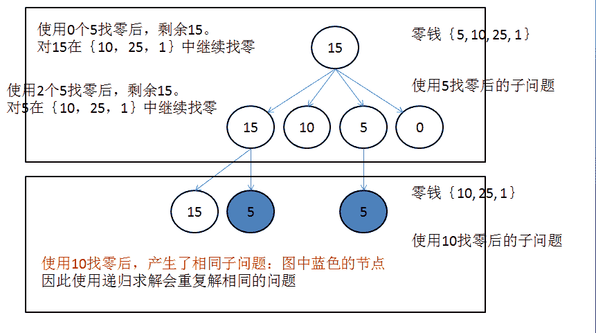

# 面试常考算法题(八)-斐波那契数列

## 1

对于斐波拉契经典问题，我们都非常熟悉，通过递推公式**F(n) = F(n - 1) + F(n - 2)**，我们可以在线性时间内求出第 n 项**F(n)**，现在考虑斐波拉契的加强版，我们要求的项数 n 的范围为 int 范围内的非负整数，请设计一个高效算法，计算第 n 项 F(n-1)。第一个斐波拉契数为 F(0) = 1。

给定一个非负整数，请返回斐波拉契数列的第 n 项，为了防止溢出，请将结果 Mod 1000000007。

测试样例：

```cpp
3
```

```cpp
返回：2
```

本题知识点

递归

讨论

[蓝魔 4](https://www.nowcoder.com/profile/4213178)

```cpp
参考大佬的代码！
class Fibonacci {
public:
    void MultMetri(long long base1[2][2],long long base2[2][2])
    {
        long long tmp[2][2]={0};
        for(int i=0;i<2;i++)
        {
            for(int j=0;j<2;j++)
                tmp[i][j]=(base1[i][0]*base2[0][j]+base1[i][1]*base2[1][j])%1000000007;
        }
        for(int i=0;i<2;i++)
        {
            for(int j=0;j<2;j++)
             	base1[i][j]=tmp[i][j];
        }
    }
    int getNthNumber(int n) {
       long long base[2][2]={{1,1},{1,0}};
       long long ret[2][2]={{1,0},{1,0}};
        while(n)
        {
            if(n%2)
                MultMetri(ret,base);
            MultMetri(base,base);
            n=n/2;
        }
        return (int)(ret[0][0]);
    }
};
```

发表于 2017-07-17 21:25:04

* * *

[瑰意骑行](https://www.nowcoder.com/profile/287053)

简洁、高效 的 递归解法，目前没有发现比我这个更简洁的代码了，50 ms，1238K

思路 ：找规律，可用数学归纳法证明；
初始值：f(0) = 1, f(1) = 1, f(2) = 2, f(3) = 3, f(4) = 5...

以 f(10)为例子找规律：

f(10)

= f(9)+ f(8)  = f(1)f(9)+f(0)f(8)

=2f(8)+ f(7) = f(2)f(8)+f(1)f(7)

=3f(7)+2f(6)= f(3)f(7)+f(2)f(6)

=5f(6)+3f(5)= f(4)f(6)+f(3)f(5)...发现规律：F(n) = F(k)F(n-k) + F(k-1)F(n-k-1), k>=1
推导出如下公式:
F(2n) = F(n) F(n) + F(n-1) F(n-1), n>=1
F(2n+1) = F(n+1) F(n) + F(n) F(n-1), n>=1

```cpp
Map<Integer,Integer> mp = new HashMap<Integer, Integer>();
public int getNthNumber(int n) {
    if (n==1||n==0)return 1;
    if (n==2)return 2;
    if (mp.containsKey(n))return mp.get(n);//避免重复计算

    long fn1=getNthNumber(n/2+1); // f(n+1)
    long fn_1=getNthNumber(n/2-1); // f(n-1)    
    long fn=getNthNumber(n/2); // f(n)

    if (n%2==1) // F(2n+1) = F(n+1) F(n) + F(n) F(n-1), n>=1
        mp.put(n,(int)((fn*fn1+fn*fn_1)%1000000007));
    else // F(2n) = F(n) F(n) + F(n-1) F(n-1), n>=1 
        mp.put(n,(int)((fn*fn+fn_1*fn_1)%1000000007));

    return mp.get(n);
}
```

编辑于 2019-11-06 21:51:25

* * *

[//](https://www.nowcoder.com/profile/946484)

```cpp
参考的程云老师的课程（第 9 次课）。
class Fibonacci {
public:
 static const long long MOD =1000000007; 
    int getNthNumber(int n) {
        // write code here
        int a=1,b=1;
        vector< vector<long long> > matrix(2);
        vector< vector<long long> > res(2);
        res[0].resize(2);
        res[1].resize(2);
        const int m[2][2]={{1,1},{1,0}};
        for( int i=0; i<2; ++i )
         for( int j=0; j<2; ++j )
          matrix[i].push_back(m[i][j]);
        res[0][0]=res[1][1]=1;
        res[0][1]=res[1][0]=0;
        while( n )
        {
         if( n&1 )    res=multiply(res,matrix);
         matrix=multiply(matrix,matrix);
         n >>= 1;
        }
  return (res[1][0]%MOD+res[1][1]%MOD)%MOD;
    } 
private:
    vector< vector<long long> > multiply ( vector< vector<long long> >& a, vector< vector<long long> >& b )
    {
  vector< vector<long long> > temp(2);
  for( int i=0; i<2; i++ )
   temp[i].resize(2);
  for( int i=0; i<2; i++ )
     {
      for( int j=0; j<2; j++ )
      {
       temp[i][j] = ((a[i][0]%MOD * b[0][j]%MOD )%MOD + (a[i][1]%MOD * b[1][j]%MOD )%MOD)%MOD;
   }
  }
  return temp; 
 }
};
```

编辑于 2015-08-09 23:18:21

* * *

## 2

现在有一栋高楼，但是电梯却出了故障，无奈的你只能走楼梯上楼，根据你的腿长，你一次能走 1 级或 2 级楼梯，已知你要走 n 级楼梯才能走到你的目的楼层，请计算你走到目的楼层的方案数，由于楼很高，所以 n 的范围为 int 范围内的正整数。

给定楼梯总数**n**，请返回方案数。为了防止溢出，请返回结果 Mod 1000000007 的值。

测试样例：

```cpp
3
```

```cpp
返回：3
```

本题知识点

递归

讨论

[yayamma](https://www.nowcoder.com/profile/270051)

之前也是一直超时，知道这个题  查看全部)

编辑于 2015-08-18 16:44:55

* * *

[Madstorm](https://www.nowcoder.com/profile/760107)

递推关系的题型都是基于 Fibonacci 序列的变种，这个题我们很容易发现它其实就是 Fibonacci 序列 Fibonacci 序列的快速幂乘求解过程的基本思路是这样的递推关系[a,b]=[b,a+b]相当于[a,b]*[[0,1],[1, 1]]=[b,a+b],将 [[0,1],[1, 1]]设为 base matrix 如果初始项为 F(0)=[1 2]，F(n)=F(0)*base^n，此式即为 Fibonacci 通项的矩阵算法对于快速幂乘，举个例子 2²⁰=4¹⁰=16⁵=16*16⁴=16*256²矩阵的快速幂乘就是将基数不断自乘，以减少矩阵相乘次数。由于指数是 log(N)递减的，每次需要常数时间，所以其复杂度是 O(logN)：附上通过的代码：class GoUpstairs:    def countWays(self, n):        res=base=[[1,1],[1,0]]        surplus=[[1,0],[0,1]]        while(n>=2):            if n&1:                surplus=self.mutiply(surplus,res)            res=self.mutiply(res,res)            n=n>>1        res=self.mutiply(res, surplus)        return res[0][0]%1000000007    def mutiply(self,a,b):        temp=[[0,0],[0,0]]        for i in range(len(a)):            for j in range(len(b)):                for k in range(len(temp)):                    temp[i][j]+=a[i][k]*b[k][j]%1000000007        return temp

发表于 2015-08-26 22:19:56

* * *

[nbgao](https://www.nowcoder.com/profile/211289)

```cpp
class GoUpstairs {
public:     void mul(long a[2][2], long b[2][2])     {         long t[2][2],mod=1e9+7;         t[0][0] = (a[0][0]*b[0][0]+a[0][1]*b[1][0])%mod;         t[0][1] = (a[0][0]*b[0][1]+a[0][1]*b[1][1])%mod;         t[1][0] = (a[1][0]*b[0][0]+a[1][1]*b[1][0])%mod;         t[1][1] = (a[1][0]*b[0][1]+a[1][1]*b[1][1])%mod;         memcpy(a, t, sizeof(long)*4);     }
    int countWays(int n) {
        long m[2][2] = {1,1,1,0}, e[2][2] = {1,0,0,1};

        while(n>1)
        {
            if(n&1)
                mul(e,m);
            mul(m,m);
            n>>=1;         }         mul(m,e);         return m[0][0];
    }
};

```

发表于 2017-12-14 01:35:32

* * *

## 3

在农场中，奶牛家族是一个非常庞大的家族，对于家族中的母牛，从它出生那年算起，第三年便能成熟，成熟的母牛每年可以生出一只小母牛。即母牛从出生开始的第三年便能做妈妈。最开始农场只有一只母牛，它从第二年开始生小母牛。请设计一个高效算法，返回第 n 年的母牛总数，已知 n 的范围为 int 范围内的正整数。

给定一个正整数**n**，请返回第**n**年的母牛总数，为了防止溢出，请将结果 Mod 1000000007。

测试样例：

```cpp
6
```

```cpp
返回：9
```

本题知识点

递归

讨论

[老子是帮主](https://www.nowcoder.com/profile/284321)

```cpp
//这个题目 O(N)时间复杂度的做法是过不了的，测试用例是大数，只有使用 O(logN)时间复杂
//度的矩阵快速幂的思路才能通过。(Cn, Cn-1, Cn-2) = (Cn-1, Cn-2, Cn-3) × {{1,1,0},
//{0,0,1},{1,0,0}} = ......= (C3, C2, C1)×{{1,1,0},{0,0,1},{1,0,0}}的 n-3 次幂，
//注意这个矩阵{{1,1,0},{0,0,1},{1,0,0}}是可以通过解方程求出来的，9 个未知数需要 9 个
//方程，所以多列出数列的前几项才能求出来。接下来问题就转变成了求解矩阵的 n 次幂问题
//了，如果 n=8,我们只需要求出矩阵的 4 次幂就可以,要想求出 4 次幂，只需要求出 2 次幂就可以
//所以这个实际上就对应着 n 的二进制中等于 1 的进制位的数字依次相乘，结果就得到了矩阵
//的 n 次幂的 O(logN)复杂度解法。还要提醒定义成 int 类型是过不了的，只有 long long 类型
//才能通过。涉及到大数运算，勿忘取模。
class Cows {
public:
    vector<vector<long long>> matrixPower(vector<vector<long long>> m, int p){
        int i = 0;
        int row = m.size();
        int col = m[0].size();
        //定义单位阵
        vector<vector<long long>> res(row, vector<long long>(col));
        for(i = 0;i < row;i++)
            res[i][i] = 1;

        vector<vector<long long>> temp = m;
        while(p){
            if(p & 1 == 1){
                res = multiMatrix(res, temp);
            }
            temp = multiMatrix(temp, temp);
            p = p >> 1;
        }
        return res;
    }

    vector<vector<long long>> multiMatrix(vector<vector<long long>> A, 
                                          vector<vector<long long>> B){
	vector<vector<long long>> result(A.size(), vector<long long>(B[0].size()));
        for (int i = 0; i < result.size(); i++){
            for (int j = 0; j < result[i].size(); j++){			
                for (int k = 0; k < A[0].size(); k++){
                    result[i][j] += (A[i][k] * B[k][j]) % 1000000007;
                    result[i][j] %= 1000000007;
                }
            }
        }
        return result;
	}

    int countSum(int n) {
        // write code here
        if(n < 1)
            return 0;
        else if(n == 1 || n == 2 || n == 3)
            return n;

        vector<vector<long long>> base = {{1, 1, 0}, {0, 0, 1}, {1, 0, 0}};
        vector<vector<long long>> res = matrixPower(base, n - 3);
        return (3 * res[0][0] + 2 * res[1][0] + res[2][0]) % 1000000007;
    }
};

```

编辑于 2017-07-23 17:50:54

* * *

[Madstorm](https://www.nowcoder.com/profile/760107)

```cpp
首先递推公式：F(n)=F(n-1)+F(n-3)
快速幂乘矩阵算法

class Cows:
    def countSum(self, n):
        res=base=[[0,0,1],[1,0,0],[0,1,1]]
        surplus=[[1,0,0],[0,1,0],[0,0,1]]
        while(n>1):
            if n&1:
                surplus=self.mutiply(surplus,res)
            res=self.mutiply(res,res)
            n=n>>1
        res=self.mutiply(res, surplus)
        return (res[0][1]+res[1][1]+res[2][1])%1000000007
    def mutiply(self,a,b):#矩阵乘法
        temp=[[0,0,0],[0,0,0],[0,0,0]]
        for i in range(len(a)):
            for j in range(len(b)):
                for k in range(len(temp)):
                    temp[i][j]+=a[i][k]*b[k][j]%1000000007

        return temp
```

发表于 2015-08-26 21:17:45

* * *

[牛客 707439 号](https://www.nowcoder.com/profile/707439)

按这题意还是 F(n)=F(n-1)+F(n-2)，n-2 年的母牛在同年就生小牛啊，经过 n-2、n-1 两年，到今年第 n 年刚好是第三年成为母牛啊！只是题中第一只母牛比较奇怪，非要拖到第二年才生而已啊。

发表于 2016-08-11 11:58:48

* * *

## 4

有一个数组 changes，changes 中所有的值都为正数且不重复。每个值代表一种面值的货币，每种面值的货币可以使用任意张，对于一个给定值 x，请设计一个高效算法，计算组成这个值的方案数。

给定一个 int 数组**changes**，代表所有零钱，同时给定它的大小**n**，另外给定一个正整数**x**，请返回组成**x**的方案数，保证**n**小于等于 100 且**x**小于等于 10000。

测试样例：

```cpp
[5,10,25,1],4,15
```

```cpp
返回：6
```

测试样例：

```cpp
[5,10,25,1],4,0
```

```cpp
返回：1
```

本题知识点

动态规划

讨论

[潇湘缘](https://www.nowcoder.com/profile/345390)

```cpp
import java.util.*;

public class Exchange {
    public int countWays(int[] changes, int n, int x) {
        // write code here
        //dp[i][j]表示使用 changes[0~i]的钱币组成金额 j 的方法数
        int[][] dp=new int[n][x+1];
        //第一列全为 1，因为组成 0 元就只有一种方法
        for(int i=0;i<n;i++)
            dp[i][0]=1;
        //第一行只有 changes[0]的整数倍的金额才能有 1 种方法
        for(int j=0;j*changes[0]<=x;j++){
            dp[0][j*changes[0]]=1;
        }
        //从位置(1,1)开始遍历
        for(int i=1;i<n;i++){
            for(int j=1;j<=x;j++){
                //关键：使用 0~i 的钱币组成 j-changes[i]金额的方法数+使用 0~i-1 钱币组成 j 的方法数
                dp[i][j]=dp[i-1][j]+(j-changes[i]>=0?dp[i][j-changes[i]]:0);
            }
        }

        return dp[n-1][x];
    }
}
```

发表于 2016-04-01 15:39:01

* * *

[JustYoung](https://www.nowcoder.com/profile/810369)

```cpp
import java.util.*;

public class Exchange {
    public int countWays(int[] changes, int n, int x) {
        // write code here
        int[] dp = new int[x + 1];
		dp[0] = 1;
		for (int change : changes) {
			for (int i = 0; i + change <= x; ++i) {
				dp[i + change] += dp[i];
			}
		}
		return dp[x];
    }
}
```

发表于 2016-09-05 23:24:14

* * *

[orgcheng](https://www.nowcoder.com/profile/277064)

对于找零问题有两个版本，一个是求找零后零钱的数量最少；另一个就是本题，求找零的方案数。
求解思路：
使用 0 个｛5｝时，求解子问题 X - 0 * 5 在 ｛10，25，1｝的方案数
使用 1 个｛5｝时，求解子问题 X - 1 * 5 在 ｛10，25，1｝的方案数
使用 2 个｛5｝时，求解子问题 X - 2 * 5 在 ｛10，25，1｝的方案数
……
把上面的方案是加起来就是所求的结果了，但是注意边界: 对 0 找零的方案数为 1。

使用递归求解比较简单，但是效率不高，因为会重复求解。



如果考虑使用迭代，需要申请辅助空间，存储计算的值。
而且还要重新需找求解过程，比较纠结。。。。。。我找了老半天，而且也不好解释，
关键是理解递归的过程。
下面是代码：

```cpp
import java.util.*;

public class Exchange {
	public int countWays(int[] changes, int n, int x) {
		// 方法一：递归
		// return recursion(changes,0,n-1,x);

		// 方法二：迭代
		int[] arr = new int[x + 1];
		arr[0] = 1;

		int i = 0, j = 0;
		for (i = 0; i < n; ++i) {
			for (j = 0; j+changes[i] <= x; j++) {
				arr[j+changes[i]]+=arr[j];
			}
		}
		return arr[x];
	}

	public int recursion(int[] changes, int begin, int end, int target) {
		// 边界条件
		if (target == 0)
			return 1;
		if (begin > end || target < 0)
			return 0;

		int count = 0;
		int times = 0;

		// 找零的过程中使用了 times 次 changes[begin]
		// 在后续的找零中，不再使用 changes[begin]
		while (times * changes[begin] <= target) {
			count += recursion(changes, begin + 1, end, target - times * changes[begin]);
			++times;
		}
		return count;
	}
}

```

编辑于 2015-08-10 18:01:34

* * *