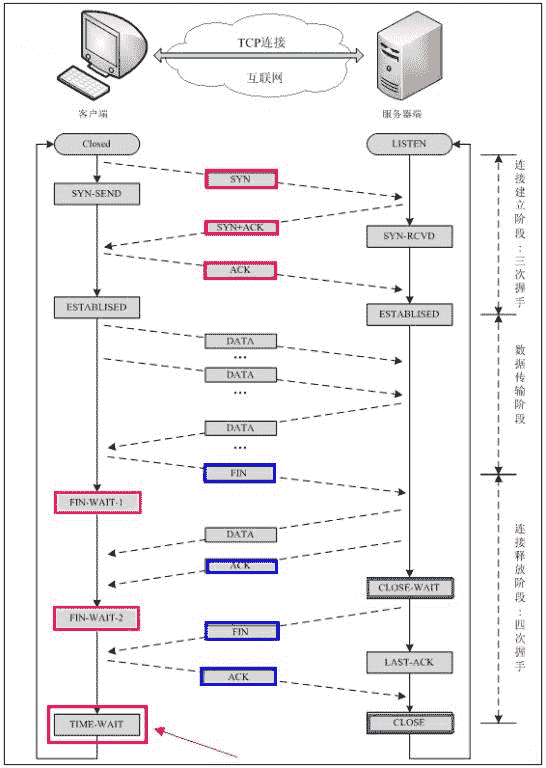
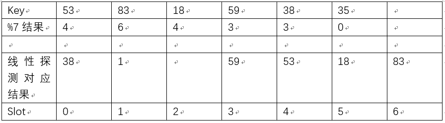

# 二千零一十五、网易互娱校园招聘笔试题游戏插件研发岗

## 1

有 B+Tree/Hash_Map/STL Map 三种数据结构。对于内存中数据，查找性能较好的数据结构是（），对于磁盘中数据，查找性能较好的数据结构是（）。

正确答案: A   你的答案: 空 (错误)

```cpp
Hash_Map/B+Tree
```

```cpp
STL_Map/B+Tree
```

```cpp
STL_Map/Hash_Map
```

```cpp
B+Tree/Hash_Map
```

本题知识点

哈希 *网易 游戏研发工程师 网易互娱 2015* *讨论

[牛客-007](https://www.nowcoder.com/profile/394118)

答案：A
Hash 操作能根据散列值直接定位数据的存储地址，设计良好的 hash 表能在常数级时间下找到需要的数据，但是更适合于内存中的查找。
B+树是一种是一种树状的数据结构，适合做索引，对磁盘数据来说，索引查找是比较高效的
STL_Map 的内部实现是一颗红黑树，但是只是一颗在内存中建立二叉树树，不能用于磁盘操作，而其内存查找性能也比不上 Hash 查找。
因此对于内存中数据，查找性能较好的数据结构是 Hash_Map，对于磁盘中数据，查找性能较好的数据结构是 B+Tree。

编辑于 2015-01-30 12:07:10

* * *

[sunlight_run](https://www.nowcoder.com/profile/6428287)

Hash_Map 适合内存中查找，设计的好能在常数级时间下找到需要的数据 B+树是树状数据结构，对磁盘来讲，索引查找比较高效 STL_Map 是红黑树，建立在内存中，其查找性能不如 Hash 查找

发表于 2017-06-17 17:55:10

* * *

[Appin](https://www.nowcoder.com/profile/822112637)

**STL_Map 有啥用呢**

发表于 2021-04-28 10:51:18

* * *

## 2

tcp 三次握手创建连接，双方交互的报文中 SYN 和 ACK 的序列是什么样的（）

正确答案: A   你的答案: 空 (错误)

```cpp
SYN，SYN+ACK，ACK
```

```cpp
SYN，ACK，SYN，ACK
```

```cpp
SYN+ACK，ACK，SYN
```

```cpp
SYN，SYN，ACK
```

本题知识点

网络基础 网易 游戏研发工程师 网易互娱 2015

讨论

[Geek_Paul](https://www.nowcoder.com/profile/805693)

  查看全部)

编辑于 2015-01-30 12:03:04

* * *

[yayamma](https://www.nowcoder.com/profile/270051)

    TCP 建立连接需要三次握手才能建立，而断开连接则需要四次握手。


发表于 2015-09-14 09:58:14

* * *

[牛客-007](https://www.nowcoder.com/profile/394118)

答案：A
TCP 的三次握手是这样进行的：发送端发送一个 SYN=1，ACK=0 标志的数据包给接收端，请求进行连接，这是第一次握手；接收端收到请求并且允许连接的话，就会发送一个 SYN=1，ACK=1 标志的数据包给发送端，告诉它，可以通讯了，并且让发送端发送一个确认数据包，这是第二次握手；最后，发送端发送一个 SYN=0，ACK=1 的数据包给接收端，告诉它连接已被确认，这就是第三次握手。之后，一个 TCP 连接建立，开始通讯。

发表于 2015-01-28 14:07:08

* * *

## 3

函数参数使用的空间是在（）中申请的，malloc 或 new 是在（）中申请空间的？

正确答案: B   你的答案: 空 (错误)

```cpp
堆，栈
```

```cpp
栈，堆
```

```cpp
栈，栈
```

```cpp
堆，堆
```

本题知识点

C++ 网易 游戏研发工程师 网易互娱 2015

讨论

[牛客-007](https://www.nowcoder.com/profile/394118)

答案：B 函数内局部变量  查看全部)

编辑于 2015-01-26 18:04:40

* * *

[啥](https://www.nowcoder.com/profile/811262)

栈        系统维护堆        自己申请释放传参是系统操作的，故栈 malloc 和 new 是由自己申请的，故堆

发表于 2016-03-07 09:39:38

* * *

[中汇信息技术最牛逼](https://www.nowcoder.com/profile/208244)

new -> malloc -> HeapAlloc 还以为挺简单呢，都选了堆。结果没看到人家前面还有个空。。。

发表于 2015-09-05 13:31:52

* * *

## 4

由源代码生成可执行文件需要经过预编译，编译，汇编，链接等阶段，错误：unresolved external symbol BeginScene 属于()阶段错误。

正确答案: D   你的答案: 空 (错误)

```cpp
预编译
```

```cpp
编译
```

```cpp
汇编
```

```cpp
链接
```

本题知识点

编译和体系结构 网易 游戏研发工程师 网易互娱 2015

讨论

[MyGoodHelper](https://www.nowcoder.com/profile/644326)

D 属于链接错误

编辑于 2015-01-30 11:54:03

* * *

[watermaker](https://www.nowcoder.com/profile/359326)

无法解析的外部符号，说明单个文件已经编译通过，在链接时，查找外部符号没有找到，无法解析，所以是发生在链接阶段。

发表于 2015-09-04 16:11:37

* * *

[smartada](https://www.nowcoder.com/profile/391812)

D   详细解析看 watermaker 回答的。

发表于 2016-03-21 22:06:45

* * *

## 5

下面属于进程间通信的有？

正确答案: A B C D   你的答案: 空 (错误)

```cpp
管道
```

```cpp
消息队列
```

```cpp
内存共享
```

```cpp
套接字
```

本题知识点

操作系统 百度 游戏研发工程师 网易互娱 2015

讨论

[yayamma](https://www.nowcoder.com/profile/270051)

 **管道：**  管道中还有命名管道和非命名管道之分， **非命名管道**只能用于父子进程通讯，**命名管道**可用于非父子进程，命名管道就是 FIFO，管道是先进先出的通讯方式。FIFO 是一种先进先出的队列。它类似于一个管道，只允许数据的单向流动。每个 FIFO 都有一个名字，允许不相关的进程访问同一个 FIFO，因此也成为命名管。

**    消息队列：** 是用于两个进程之间的通讯，首先在一个进程中创建一个消息队列，然后再往消息队列中写数据，而另一个进程则从那个消息队列中取数据。需要注意的是，消息队列是用创建文件的方式建立的，如果一个进程向某个消息队列中写入了数据之后，另一个进程并没有取出数据，即使向消息队列中写数据的进程已经结束，保存在消息队列中的数据并没有消失，也就是说下次再从这个消息队列读数据的时候，就是上次的数据！！！

**    信号量：** 不能传递复杂消息，只能用来同步

**    共享内存：** 只要首先创建一个共享内存区，其它进程按照一定的步骤就能访问到这个共享内存区中的数据，当然可读可写；

发表于 2015-09-16 14:23:54

* * *

[浩劫风浪](https://www.nowcoder.com/profile/6360212)

[1、几种进程间的通信方式](https://www.cnblogs.com/mydomain/archive/2010/09/23/1833369.html)         

# 管道( pipe )：管道是一种半双工的通信方式，数据只能单向流动，而且只能在具有亲缘关系的进程间使用。进程的亲缘关系通常是指父子进程关系。
# 有名管道 (named pipe) ： 有名管道也是半双工的通信方式，但是它允许无亲缘关系进程间的通信。
# 信号量( semophore ) ： 信号量是一个计数器，可以用来控制多个进程对共享资源的访问。它常作为一种锁机制，防止某进程正在访问共享资源时，其他进程也访问该资源。因此，主要作为进程间以及同一进程内不同线程之间的同步手段。
# 消息队列( message queue ) ： 消息队列是由消息的链表，存放在内核中并由消息队列标识符标识。消息队列克服了信号传递信息少、管道只能承载无格式字节流以及缓冲区大小受限等缺点。
# 信号 ( sinal ) ： 信号是一种比较复杂的通信方式，用于通知接收进程某个事件已经发生。
# 共享内存( shared memory ) ：共享内存就是映射一段能被其他进程所访问的内存，这段共享内存由一个进程创建，但多个进程都可以访问。共享内存是最快的 IPC 方式，它是针对其他进程间通信方式运行效率低而专门设计的。它往往与其他通信机制，如信号两，配合使用，来实现进程间的同步和通信。
# 套接字( socket ) ： 套解口也是一种进程间通信机制，与其他通信机制不同的是，它可用于不同及其间的进程通信。

发表于 2018-06-08 22:08:46

* * *

[Running_go](https://www.nowcoder.com/profile/117087)

ABCD

发表于 2015-07-09 20:07:51

* * *

## 6

下面关于 ISO 网络参考模型分层及每一层功能描述错误的有？

正确答案: A B   你的答案: 空 (错误)

```cpp
物理层，在此层将数据分帧，并处理流控制
```

```cpp
数据链路层，为物理层提供连接，以便透明的传送比特流
```

```cpp
网络层，本层通过寻址来建立两个节点之间的连接，为源端的运输层送来的分组，选择合适的路由和交换节点
```

```cpp
运输层，常规数据递送－面向连接或无连接
```

```cpp
会话层，建立、管理和终止会话。
```

```cpp
表示层，主要用于处理两个通信系统中交换信息的表示方式。
```

本题知识点

网络基础 Java 工程师

讨论

[牛客-007](https://www.nowcoder.com/profile/394118)

  查看全部)

编辑于 2015-01-26 15:40:54

* * *

[yayamma](https://www.nowcoder.com/profile/270051)

**    物理层：**通过媒介传输比特,确定机械及电气规范（比特 Bit）

**    数据链路层**：将比特组装成帧和点到点的传递（帧 Frame）

**    网络层**：负责数据包从源到宿的传递和网际互连（包 PackeT）

**    传输层**：提供端到端的可靠报文传递和错误恢复（段 Segment）

**    会话层**：建立、管理和终止会话（会话协议数据单元 SPDU）

**    表示层**：对数据进行翻译、加密和压缩（表示协议数据单元 PPDU）

**    应用层**：允许访问 OSI 环境的手段（应用协议数据单元 APDU）

发表于 2015-09-16 14:26:40

* * *

[sweetsmile225](https://www.nowcoder.com/profile/4591450)

D 不对啊，OSI 在传输层提供的只有面向连接的服务，TCP/IP 模型在传输层才提供了两种

发表于 2018-04-05 15:04:01

* * *

## 7

用命令（）可以查看 mysql 数据库中 user 表的表结构？

正确答案: A B D   你的答案: 空 (错误)

```cpp
desc user;
```

```cpp
show create table user;
```

```cpp
show columns for user;
```

```cpp
describe user;
```

本题知识点

数据库 网易 游戏研发工程师 网易互娱 2015

讨论

[MyGoodHelper](https://www.nowcoder.com/profile/644326)

ABD 查看 Mysql 表  查看全部)

编辑于 2015-01-30 12:06:12

* * *

[牛客 747152 号](https://www.nowcoder.com/profile/747152)

C：正确的形式：show columns from 表名

发表于 2016-05-31 17:50:52

* * *

[sunshina 黑白格](https://www.nowcoder.com/profile/9012463)

说了是多选吗？

发表于 2018-03-10 17:09:36

* * *

## 8

```cpp
char *p1;int64 *p2;
p1=(char *)0x800000;
p2=(int64 *)0x800000;
char *a=p1+2
int64_t *b=p2+2
```

那么 a=1,b=2

你的答案 (错误)

12 参考答案 (1) 0x800002
(2) 0x800010

本题知识点

C++ 网易 游戏研发工程师 网易互娱 2015

讨论

[牛客-007](https://www.nowcoder.com/profile/394118)

  查看全部)

编辑于 2015-01-30 11:59:35

* * *

[wellwang](https://www.nowcoder.com/profile/820709)

指针里面存的是地址，所以指针的加减也是为了求得变化后的地址，即假设指针的类型是 T,那么新的地址应该就是原地址+sizeof(T)个字节后得到的地址，也就是说它加的实质还是相应的字节数，而这个字节数是多少得看指针的类型，本题中第一个是 char 类型，那么加 2 就是俩个字节，第二个是 64 位的 int,那么相应的指针类型就是 8 字节,因为指针就是为了寻地址的，与 cpu 的位数有关，一个字节 8 位，因此它加 2 就是加 2*sizeof(int64)，转 16 进制为 0x1

发表于 2015-08-20 21:55:31

* * *

[学习三分之二输出三分之一](https://www.nowcoder.com/profile/642919)

tian na ,yuan lai shi jia de zhizhen,,,,,…^-^

发表于 2015-11-24 06:59:37

* * *

## 9

有一个数组（53,83,18,59,38,35），依次将其存储在 hash 表中，其中哈希函数为 h(k)=k%7,如采用线性探测（每次向后查找 1 位）的方式解决冲突，则该 hash 表上查找 38,35,53 访问 hash 表的表项次数分别为 1，2，3。

你的答案 (错误)

123 参考答案 (1) 5
(2) 2
(3) 1

本题知识点

哈希 *网易 游戏研发工程师 网易互娱 2015* *讨论

[reakingf](https://www.nowcoder.com/profile/151746)

%7 的结果即对应在 hash 表中的位置如下：53 --> 4      没有冲突，所以对应位置为 483 --> 6      没有冲突，所以位置为 618 --> 4      与 53 冲突，向后线性探测，位置 5 为空，可以放，位置为 559 --> 3      无冲突，位置为 338 --> 3      与 59 冲突，向后线性探测，直到位置 0 为空，所以位置为 035 --> 0      与 38 冲突，向后线性探测，位置 1 位空，所以位置为 1 结果如下 所以，查找 38 时，先查找位置 3，没找到，往后直到位置 0 才找到，从位置 3 到位置 0 总共查找了 5 次；查找 35，从 0 到 1，查找了 2 次；查找 53，直接找到，1 次。

编辑于 2016-09-11 11:36:02

* * *

[牛客-007](https://www.nowcoder.com/profile/394118)

答：5,1,1
先求出其哈希值
53 % 7 = 4 83 % 7 = 6  18 % 7 = 4
59 % 7 = 3 38 % 7 = 3 35 % 7 = 0
则存储位置如下：
53->4, 83->6, 18->5(本来是 4，由于冲突向后一位)
59->3, 38->7(本来是 3，由于冲突，第四位也已经被占用，继续向后移动至到遇到空位存放)
35->0
查找 38，从第 3 个位置找起，直道第 7 个位置找到，访问 5 次
查找 35，从第 0 个位置找起，访问 1 次找到
查找 53，从第 4 个位置找起，访问 1 次找到

编辑于 2015-07-30 21:50:23

* * *

[奋斗的小鸟](https://www.nowcoder.com/profile/337144)

因为 hash 函数是%7,因此 hash 的 slot 是 0-6 编号的 0---->381---->352---->3---->594---->535---->186---->83 答案:应该是 5 2 1

发表于 2015-07-30 20:16:26

* * *

## 10

32 位系统上

```cpp
char c1[]={'a','b','\0','d','e'};
char c2[]="hello";
```

sizeof(c1),strlen(c1),sizeof(c2),strlen(c2)值分别是 1234。

你的答案 (错误)

1234 参考答案 (1) 5
(2) 2
(3) 6
(4) 5

本题知识点

C++ 网易 游戏研发工程师 网易互娱 2015

讨论

[牛客-007](https://www.nowcoder.com/profile/394118)

  查看全部)

编辑于 2015-01-28 17:54:31

* * *

[阿里小新](https://www.nowcoder.com/profile/901176)

**对字符数组，有以下几种定义方法：**

1)        char str[]="12345";

或给字符串加上大括号：char str[]={"12345"};

这种方法定义时，**系统会自动在字符串的末尾加上字符串结束符**，即 ‘\0’,

2)        char str[10]={'1','2','3','4','5'};

这种方法定义时，**系统会自动从未初始化的元素开始，将之后的元素赋为\0**，如上面的数组 str 中的元素实际上是：'1','2','3','4','5','\0','\0','\0','\0','\0'

3)        char str[]={'1','2','3','4','5'};

这种方法定义时，**系统不会自动在字符串的末尾加上字符串结束符**;

此时用 sizeof()函数可以正确求出其所占的内存大小；但**用 strlen()函数不能正确求出其长度，因为 strlen 是通过\0 判断字符串结束的。****所以第 1 空应该为 5.****文章来源：** **http://blog.sina.com.cn/s/blog_a2e509c101014wjw.html**

编辑于 2015-08-15 21:34:59

* * *

[a 我心飞扬 a](https://www.nowcoder.com/profile/879125)

```cpp
对字符数组，有以下几种定义方法：
1)        char str[]="12345";
或给字符串加上大括号：char str[]={"12345"};
这种方法定义时，系统会自动在字符串的末尾加上字符串结束符，即 ‘\0’,
2)        char str[10]={'1','2','3','4','5'};
这种方法定义时，系统会自动从未初始化的元素开始，将之后的元素赋为\0，如上面的数组 str 中的元素实际上是：'1','2','3','4','5','\0','\0','\0','\0','\0'
3)        char str[]={'1','2','3','4','5'};
这种方法定义时，系统不会自动在字符串的末尾加上字符串结束符;

Sizeof 计算的是占用内存的大小，c1 占 5 个字节，c2 还隐含一个’\0’,占 6 字节
Strlen 是计算字符串长度，遇到’\0’结束。c1 的\0 前面有两个字符，c2 的\0 前面就是 hello，占 5 个字节
```

发表于 2016-03-22 15:06:04

* * *

## 11

请找出下面用于拷贝内存的代码中的逻辑错误，并修正。

```cpp
void memcpy(const char* src,char* dest){
    int len=strlen(src);
    dest=(char*)malloc(len);
    char* d=dest;
    char* s=src;
    while(len--!=0){
        *d=*s;
        d++;
        s++;
    }
}
```

你的答案

本题知识点

C++ 网易 游戏研发工程师 网易互娱 2015

讨论

[牛客-007](https://www.nowcoder.com/profile/394118)

答案：主要两个问题，一  查看全部)

编辑于 2015-01-30 11:03:59

* * *

[Tommyzt](https://www.nowcoder.com/profile/632813)

void memcpy(const char* src,char* dest){    int len=strlen(src)+1;    //dest=(char*)malloc(len);    char* d=dest;    const char* s=src;    while(len--!=0){        *d=*s;        d++;        s++;    }    *d ='\0';}

发表于 2015-08-06 16:23:39

* * *

[a 我心飞扬 a](https://www.nowcoder.com/profile/879125)

```cpp
char* memcpy(const char* src,char* dest){
	if(*src==NULL)
	{
		return NULL;
	}

	char *temp=dest;

	while(*src!='\0')
	{
		*dest=*src;
		src++;
		dest++;
	}
	*dest='\0';
	return temp;	
}
```

发表于 2016-03-22 16:01:00

* * *

## 12

现有/home/script/check.sh 脚本，要求每周一到周五 14 点内每三分钟运行一次，相应的 crontab 配置是()

你的答案

本题知识点

Linux 网易 游戏研发工程师 网易互娱 2015

讨论

[MyGoodHelper](https://www.nowcoder.com/profile/644326)

*/3 14-15 * *  查看全部)

编辑于 2015-01-12 14:50:37

* * *

[恭喜你通过面试获得 offer](https://www.nowcoder.com/profile/7165145)

*/3 14-15 * * 1-5 sh /home/script/check.sh

发表于 2017-08-03 23:02:51

* * *

[陈止风](https://www.nowcoder.com/profile/7020477)

*/3 14 * * mon-fri /home/script/check.sh

发表于 2017-03-24 20:11:50

* * *

## 13

http 状态码中，()表示访问成功，()表示坏请求，()表示服务不可用

你的答案

本题知识点

网络基础 网易 游戏研发工程师 网易互娱 2015

讨论

[MyGoodHelper](https://www.nowcoder.com/profile/644326)

2xx 4xx 5xx  查看全部)

编辑于 2015-01-12 15:25:59

* * *

[幻影迷风](https://www.nowcoder.com/profile/754550)

200 表示成功 400 表示坏请求 503 表示服务不可用

编辑于 2015-10-08 21:16:35

* * *

[牛客-007](https://www.nowcoder.com/profile/394118)

http 状态码中 2 开头的表示成功，200 表示访问成功 3 开头的表示重定向 4 开头的表示请求有误，400 表示坏请求 5 开头的表示服务器问题，500 表示服务不可用

发表于 2015-01-11 14:40:47

* * *

## 14

在 SQL 中，一个表的定义如下：

```cpp
CREATE TABLE t_account(
     account varchar(100),
     account_type TINYTEXT,
     PRIMARY KEY (account),
};
```

account 为账号，account_type 为该账号的类型，写出一个 sql，统计账号数累计超过 5000 个账号类型，并显示对应的账号数，即结果中每行是（账号类型，账号数）

你的答案

本题知识点

数据库 网易 游戏研发工程师 网易互娱 2015

讨论

[咨诹善道](https://www.nowcoder.com/profile/167023)

SELECT  account  查看全部)

编辑于 2015-04-25 23:05:19

* * *

[虾小姐与娃哈哈](https://www.nowcoder.com/profile/438816)

select account_type as 账号类型，count(account) as 账号数 from t_account group by account_type having count(account)>5000

发表于 2015-06-25 14:27:58

* * *

[allinallin](https://www.nowcoder.com/profile/271544)

select account_type, count(*)from t_accountgroup by account_typehaving count(*)>5000

发表于 2016-03-22 16:15:20

* * *

## 15

使用 C/C++语言写一个函数，实现字符串的反转，要求不能用任何系统函数，且时间复杂度最小。函数原型是：char *reverse_str(char *str)

你的答案

本题知识点

字符串 *C++ 百度 游戏研发工程师 网易互娱 2015* *讨论

[混色天空 Ro](https://www.nowcoder.com/profile/959669)

```cpp
/*实现字符串翻转*/ cha
```

  查看全部)

编辑于 2015-02-09 17:42:25

* * *

[陈止风](https://www.nowcoder.com/profile/7020477)

```cpp
char *reverse_str(char *str){
    char *p1 = str, *p2 = str;
    while (*p2) p2++;p2--;
    for (; p1 < p2; p1++, p2--){
        char t = *p1;
        *p1 = *p2;
        *p2 = t;
    }
    return str;
}

```

发表于 2017-03-24 20:26:36

* * *

[luuuyi](https://www.nowcoder.com/profile/3201275)

如果数据结构不算系统函数，提供一个最直观的思路，但不代表最优

```cpp
#include <iostream>
#include <stack>

char *reverse_str(char *str){
	if (str==NULL)
	{
		return str;
	}
	int lens = 0;
	std::stack<char> stk;
	while (*str != '\0'){
		stk.push(*str);
		++lens;
		++str;
	}

	char *dest_org = (char*)malloc(lens + 1);
	char *dest = dest_org;
#if 1
	for (size_t i = 0; i < lens; i++)
	{
		*dest = stk.top();
		stk.pop();
		++dest;
	}
#else
	while (!stk.empty()){
		*dest = stk.top();
		stk.pop();
		++dest;
	}
#endif
	*dest = '\0';
	return dest_org;
}

int main(){
	char str[] = "1234567";
	char *dest = reverse_str(str);
	printf("%s\n", dest);
	system("pause");
	return 0;
}

```

发表于 2017-02-14 15:19:35

* * *

## 16

有 pqueue.h 如下

```cpp
#ifndef HEADER_PQUEUE_H
#define HEADER_PQUEUE_H
typedef struct_pqueue{
    pitem *items;
     int count;
}pqueue_s;
typedef struct_pqueue *pqueue;
typedef struct_pitem{
    unsigned char priority[8];
    void *data;
    struct_pitem *next;
}pitem;
typedef struct_pitem *piterator;
pitem *pitem_new(unsigned char *prio64be,void *data);
void pitem_free(pitem *item);

pqueue pqueue_new(void);
void pqueue_free(pqueue pq);
pitem *pqueue_insert(pqueue pq,pitem *item);
pitem *pqueue_peek(pqueue pq);
pitem *pqueue_pop(pqueue pq);
pitem *pqueue_find(pqueue pq,unsigned char *prio64be);
pitem *pqueue_iterator(pqueue pq);
pitem *pqueue_next(piterator *iter);
int pqueue_size(pqueue pq);
#endif /*! HEADER_PQUEUE_H */
```

pq_test.c 如下：

```cpp
#include<stdlib.h>
#include<string.h>
#include"pqueue.h"
/*remember to change expected.txt if you change there values*/
unsigned char prio1[8]="supercal";
unsigned char prio2[8]="ifragili";
unsigned char prio3[8]="sticexpi";
static void
pqueue_print(pqueue pq)
{
     pitem *iter,*item;
     iter=pqueue_iterator(pq);
     for(item=pqueue_next(&iter);item!=NULL;
         item=pqueue_next(&iter)){
         printf("item\t%02x%02x%02x%02x%02x%02x%02x%02x\n",
             item ->priority[0],item->priority[1],
             item ->priority[2],item->priority[3],
             item ->priority[4],item->priority[5],
             item ->priority[6],item->priority[7],
         }
}
int main(void)
{
     pitem *item;
     pqueue pq;
     pq=pqueue_new();
     item=pitem_new(prio3,NULL);
     pqueue_insert(pq,item);

     item=pitem_new(prio1,NULL);
     pqueue_insert(pq,item);

     item=pitem_new(prio2,NULL);
     pqueue_insert(pq,item);
     item=pqueue_find(pq,prio1);
     fprintf(stderr,"found %p\n",item->priority);
     item=pqueue_find(pq,prio2);
     fprintf(stderr,"found %p\n",item->priority);

     item=pqueue_find(pq,prio3);
     fprintf(stderr,"found %p\n",item->priority);

     pqueue_print(pq);
     for(item=pqueue_pop(pq);item!=NULL;item=pqueue_pop(pq))
     pitem_free(item);

     pqueue_free(pq);
     return 0;
}
```

pq_test.sh 如下：

```cpp
#!/bin/sh
set -e
./pq_test | cmp $srcdir/pq_expected.txt-
```

pq_expected.txt 如下：

> item 6966726167696c69item 7374696365787069item 737570657263616c

1.根据测试代码描述 pqueue 的工作原理。2.请实现 pitem *pqueue_insert(pqueue pq,pitem *item);

你的答案

本题知识点

C++ 队列 *网易 游戏研发工程师 网易互娱 2015 算法工程师 腾讯* *讨论

[kuring](https://www.nowcoder.com/profile/462306)

  查看全部)

编辑于 2015-01-30 11:29:30

* * *

[追梦 _ 吹吹风](https://www.nowcoder.com/profile/279124)

pqueue 是一个带有一个 pitem 哑结点的优先级队列 pitem *pqueue_insert(pqueue pq,pitem *item){if(item==NULL)        return NULL;pitem *itbefore,*itcurr,*iter; iter=pqueue_iterator(pq);//由 pqueue_print(pqueue pq)函数可知，此时的 itbefore 为 pq 中默认的一个哑结点 itbefore=iter;  for(itcurr=pqueue_next(&iter);itcurr!=NULL;itcurr=pqueue_next(&iter)) {      if(strcmp(item->priority,itcurr->priority)<=0)       {      break;      }       itbefore=itcurr; } item->next=itbefore->next; itbefore->next=item; pq->count++; return item;}

编辑于 2015-09-05 14:10:56

* * *

[岩流佐佐木小次郎](https://www.nowcoder.com/profile/1806554)

队列 先入先出  比自己字符小的放前面比自己字符大的放后面 pitem *pqueue_insert(pqueue pq,pitem *item);
{    if(pq==NULL||item==NULL)
    {        return NULL;
    }
   if( pq->items->priority[0]>=item->priority[0])    {        item->next = pq->items->next;        pq->items->next = item;
    }
    else
    {        item->next =  pq->items;        pq->items = item;
    }
return item;}

发表于 2018-03-28 16:13:12

* * *****