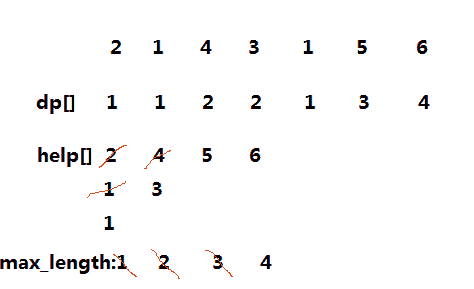
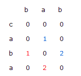

# 面试常考算法题(九)-经典动态规划 1

## 1

对于一个数字序列，请设计一个复杂度为 O(nlogn)的算法，返回该序列的最长上升子序列的长度，这里的子序列定义为这样一个序列 U1，U2...，其中 Ui < Ui+1，且 A[Ui] < A[Ui+1]。

给定一个数字序列**A**及序列的长度**n**，请返回最长上升子序列的长度。

测试样例：

```cpp
[2,1,4,3,1,5,6],7
```

```cpp
返回：4
```

本题知识点

查找 *动态规划* *讨论

[披萨大叔](https://www.nowcoder.com/profile/841505)

LIS 问题，**O(N** ^(**2**) **)**解法就不说了，下面说下**O(NlogN)**的解法：假设存在一个序列 A[0..8] = 2 1 5 3 6 4 8 9 7，可以看出来它的 LIS 长度为 5。
下面一步一步试着找出它。
我们定义一个序列 B，然后令 i = 0 到 8 逐个考察这个序列。
此外，我们用一个变量**end**来记录 B 中最后一个数的下标。
首先，令 B[0] = A[0] = 2，就是说当只有 1 一个数字 2 的时候，长度为 1 的 LIS 的最小末尾是 2，这时 end=0。
然后，把 A[2]有序地放到 B 里，令 B[0] = 1，就是说长度为 1 的 LIS 的最小末尾是 1，B[0]=2 已经被淘汰了，这时 end =1。
接着，A[2] = 5，A[2]>B[0]，所以令 B[1]=A[2]=5，就是说长度为 2 的 LIS 的最小末尾是 5，很容易理解吧。这时候 B[0..1] = 1, 5， end ＝1。

再来，A[3] = 3，它正好加在 1,5 之间，放在 1 的位置显然不合适，因为 1 小于 3，长度为 1 的 LIS 最小末尾应该是 1，这样很容易推知，长度为 2 的 LIS 最小末尾是 3，于是可以把 5 淘汰掉，这时候 B[0..1] = 1, 3， end = 2。

继续，A[4] = 6，比 B 中最大的数 3 还要大 ，于是很容易可以推知 B[2] = 6, 这时 B[0..2] = 1, 3, 6， end = 2。

A[5] = 4，它在 3 和 6 之间，于是我们就要把 6 替换掉，得到 B[2] = 4，B[0..2] = 1, 3, 4， end 继续等于 2。

A[6] = 8，它很大，比 4 大。于是继续往 B 中追加，B[3] = 8， end 变成 3 了。

A[7] = 9，得到 B[4] = 9，此时 B 是 1,3,4,8,9，end 是 4。

最后一个, A[8] = 7，它在 4 和 8 之间，所以我们知道，最新的 B[3] =7，B[0..4] = 1, 3, 4, 7, 9， end = 4。

于是我们知道了 LIS 的长度为 end+1 = 5 。

**注意：** **这个 1,3,4,7,9 不是 LIS 字符串，比如本题例的 LIS 应该是 1,3,4,8,9，7 代表的意思是存储 4 位长度 LIS 的最小末尾是 7，** **所以我们的 B 数组，是存储对应长度 LIS 的最小末尾**。有了这个末尾，我们就可以一个一个地插入数据。虽然最后一个 A[8] = 7 更新进去对于这组数据没有什么意义，但是如果后面再出现两个数字 8 和 9，那么就可以把 8 更新到 B[4], 9 更新到 B[5]，得出 LIS 的长度为 6。

然后应该发现一件事情了：在 B 中插入数据是有序的，而且是进行替换而不需要挪动——也就是说，**我们可以使用** **二分查找** **，将每一个数字的插入时间优化到** **O(logN)**，于是算法的时间复杂度就降低到了**O(NlogN)。**下面给出 java 代码：

```cpp
public class AscentSequence {
    public int findLongest(int[] A, int n) {
        int length = A.length;
        int[] B = new int[length];
        B[0] = A[0];
        int end = 0;
        for (int i = 1; i < length; ++i) {
            // 如果当前数比 B 中最后一个数还大，直接添加
            if (A[i] >= B[end]) { B[++end] = A[i]; continue;
            } 
            // 否则，需要先找到替换位置
            int pos = findInsertPos(B, A[i], 0, end); B[pos] = A[i];
        }
        for (int i = 0; i < B.length; ++i) {
            System.out.println(B[i]);
        }
        return end+ 1; }
    /**
     * 二分查找第一个大于等于 n 的位置
     */
    private int findInsertPos(int[] B, int n, int start, int end) {
        while (start < end) {
            int mid = start + (end - start) / 2;// 直接使用(high + low) / 2 可能导致溢出
            if (B[mid] < n) {
                start = mid + 1;
            } else if (B[mid] > n) {
                end = mid ;
            } else {
                return mid;
            }
        }
        return start;
    }
}
```

编辑于 2016-08-20 12:01:29

* * *

[Coder_ZF](https://www.nowcoder.com/profile/221101)

采用两个辅助数组 dp[],help[]，数组长度均为 n.max_length 表示最长递增子序列的长度。
dp[i]表示必须以 A[i]结尾的最长递增子序列的长度，help[i]表示递增子序列长度为 i+1 的所有序列中结尾最小的值。其中 dp[0]=1,help[0]=A[0].遍历数字序列 A，更改 dp[],help[]的值，若 dp[i]>max_length,更新 max_length 的值。最后返回 max_length。因为 help[]是排好序的，所以在更新 help[]时查找 A[i]的位置时采用二分搜索。遍历数组+二分搜索更新，所以时间复杂度是 O(nlogn)
例子：其中红线部分表示更新过程,当插入 A[1]=1 时，help[0]为 2，比 1 大，所以更新为 help[0]=1;当插入 A[2]=4 时，help[0]=1,比 4 小，所以更新 help[1]=4.重复至遍历数字序列完成。


代码：
class AscentSequence {
public:
    int findLongest(vector<int> A, int n) {
        // write code here
        int dp[n];
        int help[n];
        int max_length=0,count=0;
        dp[0]=1;help[0]=A[0];
        for(int i=1;i<n;i++)                             //遍历数字序列
            {
            int right=count,left=0,middle;
            while(left<=right){ //   查找 A[i]更新 help[]时的位置
                middle=(left+right)/2;
                if(A[i]>=help[middle]){
                    left=middle+1;
                }else{
                    right=middle-1;
                }
            }
            help[left]=A[i];                        //更新 help[]的值
            if(left>count)
                count=left;
            dp[i]=left+1;                     //更新 dp[]的值
            if(dp[i]>max_length)       //更新最长递增子序列的长度
                max_length=dp[i];
        }
        return max_length;
    }

发表于 2015-08-07 13:03:08

* * *

[scut_huajian](https://www.nowcoder.com/profile/234048)

寻找最长递增子序列，只需要维护一个递增序列即可，   该序列代表的 size 表示扫描到元素 i 为止最长的递增序列长度。对于原数组中的每个元素的处理，我们用二分搜索找到它在该递增序列所处的合适位置，对递增序列进行更新。可以看下注释。int findLongest(vector<int> A, int n) {// write code hereif(n==0)return 0;vector<int> up;up.push_back(A[0]);for(int i=1;i<n;i++){int low=0,high=up.size()-1;int mid;while(low<=high){mid=low+(high-low)/2;if(A[i]<up[mid])high=mid-1;if(A[i]==up[mid])break;    //A[i]=up[mid]时，不用更新 if(A[i]>up[mid])low=mid+1;}                //比序列中所有元素都小
if(high<0)up[0]=A[i];                //比序列中所有元素都大时
else if(low>=up.size())up.push_back(A[i]);                //位于序列元素最大值与最小值之间时，low 的值是 i 元素的在递增序列中的合适位置，我们对这个位置的值进行更新（因为更新前 A[i]<up[low]  但是 A[i]>up[low-1]），保证递增序列中每个元素的值都是对应长度的最小值。
else if(up[mid]!=A[i])    up[low]=A[i];}return up.size();}

编辑于 2015-08-11 16:08:13

* * *

## 2

对于两个字符串，请设计一个高效算法，求他们的最长公共子序列的长度，这里的最长公共子序列定义为有两个序列 U1,U2,U3...Un 和 V1,V2,V3...Vn,其中 Ui&ltUi+1，Vi&ltVi+1。且 A[Ui] == B[Vi]。

给定两个字符串**A**和**B**，同时给定两个串的长度**n**和**m**，请返回最长公共子序列的长度。保证两串长度均小于等于 300。

测试样例：

```cpp
"1A2C3D4B56",10,"B1D23CA45B6A",12
```

```cpp
返回：6
```

本题知识点

贪心 动态规划

讨论

[wudan3551](https://www.nowcoder.com/profile/548983)

解题报告：    这是  查看全部)

编辑于 2015-08-18 09:32:02

* * *

[JacobGo！](https://www.nowcoder.com/profile/6196880)

最近帮师兄做各公司的笔试题，各种动态规划。所以来复习一下

```cpp
import java.util.*;

public class LCS {
    public int findLCS(String A, int n, String B, int m) {
        int len1=n,len2=m;
		 int[][] res=new int[len1+1][len2+1];

		 for(int i=0;i<len1;i++){
			 for(int j=0;j<len2;j++){
				 int cur=0;
				 if(A.charAt(i)==B.charAt(j))
					 cur++;

				 res[i+1][j+1]=maxNum(res[i][j]+cur,res[i][j+1],res[i+1][j]);

			 }
		 }
		 return res[len1][len2];
	 }
    /*
	 * 返回三者最大值
	 */
	private int maxNum(int i, int j, int k) {
		int max = i;
		max = j > max ? j : max;
		max = k > max ? k : max;
		return max;
	}
}
```

发表于 2017-09-11 11:15:24

* * *

[王小叶](https://www.nowcoder.com/profile/840383)

```cpp
//第一次做这个题，不过看思路懂了。自己也做出来了
/*
	0 1 2 3 4 5 j
 i0 
  1
  2
  3
  4
  i=j=0 时，dp[i][j]=0
  A[i]=B[j]时(从 1 计数)，dp[i][j]=dp[i-1][j-1]+1
  A[i]!=B[j]时，dp[i][j]=max(dp[i][j-1],dp[i-1][j])
*/
import java.util.*;

public class LCS {
    public int findLCS(String A, int n, String B, int m) {
        // 行对应 A，比 A 长 1，原因是 0 作为初始化。列同理。dp[n][m]指 A[n-1],B[m-1]
        int[][] dp = new int[n+1][m+1];
        for(int i=0;i<dp.length;i++){
            dp[i][0]=0;
        }
        for(int i=0;i<dp[0].length;i++){
            dp[0][i]=0;
        }
        //事实上，数组默认也是 0
        for(int i=1;i<dp.length;i++){
            for(int j=1;j<dp[0].length;j++){
                //如果是字符串，用 equals，由于 charAt()是字符，可以运算，故可以用==
                if(A.charAt(i-1)==B.charAt(j-1)){//A[0]==B[0],对应 dp[1][1]
                    dp[i][j]=dp[i-1][j-1]+1;
                }else{
                    dp[i][j]=Math.max(dp[i][j-1],dp[i-1][j]);
                }
            }
        }
        return dp[n][m];
    }
}
```

发表于 2017-03-15 20:35:10

* * *

## 3

对于两个字符串，请设计一个时间复杂度为 O(m*n)的算法(这里的 m 和 n 为两串的长度)，求出两串的最长公共子串的长度。这里的最长公共子串的定义为两个序列 U1,U2,..Un 和 V1,V2,...Vn，其中 Ui + 1 == Ui+1,Vi + 1 == Vi+1，同时 Ui == Vi。

给定两个字符串**A**和**B**，同时给定两串的长度**n**和**m**。

测试样例：

```cpp
"1AB2345CD",9,"12345EF",7
```

```cpp
返回：4
```

本题知识点

贪心 动态规划

讨论

[还有多远](https://www.nowcoder.com/profile/954)

注意，这里要求的是最长公共子  查看全部)

编辑于 2015-08-18 09:55:14

* * *

[周星星 _](https://www.nowcoder.com/profile/537870)

补充一下[披萨大叔](http://www.nowcoder.com/profile/841505)的思路。题目要求公共子串的元素必须相邻， dp 矩阵是按照这样的思路想出来的：**首先：**用一个矩阵来记录两个字符串中所有位置的两个字符之间的匹配情况，若是匹配则为 1，否则为 0。然后求出对角线最长的 1 序列，其对应的位置就是最长匹配子串的位置.

下面是字符串 21232523311324 和字符串 312123223445 的匹配矩阵，前者为 X 方向的，后者为 Y 方向的。不难找到，红色部分是最长的匹配子串。通过查找位置我们得到最长的匹配子串为：21232

0 0 0 1 0 0 0 1 1 0 0 1 0 0 0
0 1 0 0 0 0 0 0 0 1 1 0 0 0 0
1 0 1 0 1 0 1 0 0 0 0 0 1 0 0
0 1 0 0 0 0 0 0 0 1 1 0 0 0 0
1 0 1 0 1 0 1 0 0 0 0 0 1 0 0
0 0 0 1 0 0 0 1 1 0 0 1 0 0 0
1 0 1 0 1 0 1 0 0 0 0 0 1 0 0
1 0 1 0 1 0 1 0 0 0 0 0 1 0 0
0 0 0 1 0 0 0 1 1 0 0 1 0 0 0
0 0 0 0 0 0 0 0 0 0 0 0 0 1 0
0 0 0 0 0 0 0 0 0 0 0 0 0 1 0
0 0 0 0 0 1 0 0 0 0 0 0 0 0 0
0 0 0 0 0 0 0 0 0 0 0 0 0 0 0

但是在 0 和 1 的矩阵中找最长的 1 对角线序列又要花去一定的时间。通过改进矩阵的生成方式和设置标记变量，可以省去这部分时间。

**优化：**

0 0 0 1 0 0 0 1 1 0 0 1 0 0 0
0 1 0 0 0 0 0 0 0 2 1 0 0 0 0
1 0 2 0 1 0 1 0 0 0 0 0 1 0 0
0 2 0 0 0 0 0 0 0 1 1 0 0 0 0
1 0 3 0 1 0 1 0 0 0 0 0 1 0 0
0 0 0 4 0 0 0 2 1 0 0 1 0 0 0
1 0 1 0 5 0 1 0 0 0 0 0 2 0 0
1 0 1 0 1 0 1 0 0 0 0 0 1 0 0
0 0 0 2 0 0 0 2 1 0 0 1 0 0 0
0 0 0 0 0 0 0 0 0 0 0 0 0 1 0
0 0 0 0 0 0 0 0 0 0 0 0 0 1 0
0 0 0 0 0 1 0 0 0 0 0 0 0 0 0
0 0 0 0 0 0 0 0 0 0 0 0 0 0 0

当字符匹配的时候，我们并不是简单的给相应元素赋上 1，而是赋上其左上角元素的值加一。我们用两个标记变量来标记矩阵中值最大的元素的位置，在矩阵生成的过程中来判断当前生成的元素的值是不是最大的，据此来改变标记变量的值，那么到矩阵完成的时候，最长匹配子串的位置和长度就已经出来了。

ref：http://www.cnblogs.com/dartagnan/archive/2011/10/06/2199764.html

编辑于 2016-12-11 16:52:28

* * *

[披萨大叔](https://www.nowcoder.com/profile/841505)

**首先，所求是最大子串，不是子序列，说明是连续的。****LS 问题，用动态规划思想，把大问题分解成若干小问题，用矩阵记录状态结果**：若 s 是两个字符串 s1 和 s2 敏感词有的字符，s1 中 s 左侧的字符串为 s1'，s2 中 s 左侧的字符串为 s2'，那么截止到 s 为止，**LS(s1, s2) = LS(s1', s2')+1**，用矩阵记录结果，例如**bab**和**c** **aba**，矩阵如下：
我们用全局变量 max 记录最大值，同时可以记录最后一次+1 时的行号或列号，结合 max 可以推算出子串。

```cpp
public class LongestSubstring {
    public int findLongest(String A, int n, String B, int m) {
        if(n == 0 || m == 0){
            return 0;
        }
        //初始化状态矩阵
        int[][] matrix = new int[n][m];
        for(int i = 0; i < n; i++){
            for(int j = 0; j < m; j++){
                matrix[i][j] = 0;
            }
        }
        int max = 0;
        for(int i = 0; i < n; i++){
            for(int j = 0; j < m; j++){
                if(A.charAt(i) == B.charAt(j)){
                    if(i == 0 || j == 0){
                        matrix[i][j] = 1;
                    }else{
                        matrix[i][j] = matrix[i-1][j-1] + 1;
                    }
                    max = (max > matrix[i][j] ? max : matrix[i][j]);
                }
            }
        }
        return max;
    }
}
```

编辑于 2016-08-19 16:15:48

* * *

## 4

对于两个字符串 A 和 B，我们需要进行插入、删除和修改操作将 A 串变为 B 串，定义 c0，c1，c2 分别为三种操作的代价，请设计一个高效算法，求出将 A 串变为 B 串所需要的最少代价。

给定两个字符串**A**和**B**，及它们的长度和三种操作代价，请返回将 A 串变为 B 串所需要的最小代价。保证两串长度均小于等于 300，且三种代价值均小于等于 100。

测试样例：

```cpp
"abc",3,"adc",3,5,3,100
```

```cpp
返回：8
```

本题知识点

动态规划

讨论

[琼华](https://www.nowcoder.com/profile/188677)

```cpp
public static i
```

  查看全部)

编辑于 2015-08-18 14:12:54

* * *

[牛客 3897179 号](https://www.nowcoder.com/profile/3897179)

```cpp
/*
    分析：
	dp[i][j]代表用 str1[0~i-1]编辑乘 str2[0~j-1]的最小代价
分析简单情况：
	dp[0][j]:即把一个空串编辑乘 str2[0~j-1]的代价则即将 j 个字符全部插入即
		dp[0][j] = j*c0;
	dp[i][0]:即把 str1[0~i-1]编辑乘空串的代价,即将 i 个字符全部删除即
		dp[i][0] = i*c1
	dp[i][j]:分四种情况：
	1) 先把 str1[0~i-1]编辑成 str1[0~i-2],在把 str1[0~i-2]编辑成 str2[0~j-1]
		dp[i][j] = dp[i-1][j] + c1;
	2) 先把 str1[0~i-1]编辑成 str2[0~j-2],在把 str2[0~j-2]编辑成 str2[0~j-1]
		dp[i][j] = dp[i][j-1] + c0;
	3) 如果 str1[i-1] != str2[j-1],则可以先将 str1[0~i-2]编辑成 str2[0~j-2],然后进行替换
		dp[i][j] = dp[i-1][j-1] + c2;
	4) 如果 str1[i-1] == str2[j-1],则直接将 str1[0~i-2]编辑成 str2[0~j-2]
		dp[i][j] = dp[i-1][j-1]
	从以上情况中选择代价最小的一种情况
*/
    int findMinCost(string A, int n, string B, int m, int c0, int c1, int c2) 
    {
        vector<vector<int>> dp(n + 1, vector<int>(m + 1));
        //初始化 dp[0][j]
        for (int j = 0; j <= m; j++)
        {
            dp[0][j] = j*c0;
        }
        //初始化 dp[i][0]
        for (int i = 0;i <= n; i++)
        {
            dp[i][0] = i*c1;
        }
        //其他情况
        for (int i = 1; i <= n; i++)
        {
            for (int j = 1; j <= m; j++)
            {
                dp[i][j] = min(dp[i-1][j] + c1, dp[i][j-1] + c0);
                if (A[i-1] == B[j-1])
                    dp[i][j] = min(dp[i-1][j-1], dp[i][j]);
                else
                    dp[i][j] = min(dp[i-1][j-1] + c2, dp[i][j]);
            }
        }
        return dp[n][m];
    }
```

发表于 2017-09-02 14:15:29

* * *

[Alex-大伟](https://www.nowcoder.com/profile/521033)

```cpp
package alex.suda.dp;

import java.util.Scanner;

public class test4 {

	public static void main(String[] args) {
		// TODO Auto-generated method stub
		Scanner scanner = new Scanner(System.in);
		while (scanner.hasNext()) {
			int n = scanner.nextInt();
			String A = scanner.next();
			int m = scanner.nextInt();
			String B = scanner.next();
			int c0 = scanner.nextInt();
			int c1 = scanner.nextInt();
			int c2 = scanner.nextInt();
			System.out.print(findMinCost(A, n, B, m, c0, c1, c2));
		}
	}

	public static int findMinCost(String A, int n, String B, int m, int c0, int c1, int c2) {
		// 设 d[i][j]为将字符串 A 的 1~i 位和 B 的 1~j 位变为相同时的操作代价
		// 注意题目是：A 串变为 B 串 而不是将两个字符串变为相等
		// d[i][j] = d[i-1][j-1]， 如果 A[i] = A[j]
		// 否则可以： 1\. A 的末端插入 B 的最后一位
		// 2.删除 A 的末端
		// 3.修改 A 的末端为 B 的末端 
		int[][] d = new int[n + 1][m + 1];
		// 初始化
		for (int i = 0; i <= n; i++) {
			d[i][0] = i * c1;
		}
		for (int j = 0; j <= m; j++) {
			d[0][j] = j * c0;
		}
		for (int i = 1; i <= n; i++) {
			for (int j = 1; j <= m; j++) {
				if (A.charAt(i - 1) == B.charAt(j - 1)) {
					d[i][j] = d[i - 1][j - 1];
				} else {
					int cost1 = d[i][j - 1] + c0;// 插入时的代价
					int cost2 = d[i - 1][j] + c1;// 删除的代价
					int cost3 = d[i - 1][j - 1] + c2;//修改的代价
					d[i][j] = Math.min(cost1, Math.min(cost2, cost3));
				}
			}
		}
		return d[n][m];
	}
}

```

发表于 2016-10-05 22:12:48

* * *

## 5

对于三个字符串 A，B，C。我们称 C 由 A 和 B 交错组成当且仅当 C 包含且仅包含 A，B 中所有字符，且对应的顺序不改变。请编写一个高效算法，判断 C 串是否由 A 和 B 交错组成。

给定三个字符串**A**,**B**和**C**，及他们的长度。请返回一个 bool 值，代表 C 是否由 A 和 B 交错组成。保证三个串的长度均小于等于 100。

测试样例：

```cpp
"ABC",3,"12C",3,"A12BCC",6
```

```cpp
返回：true
```

本题知识点

动态规划

讨论

[华科平凡](https://www.nowcoder.com/profile/4939096)

python 递归解法，通过了所有测试，不过还是不如 DP 解法。。先放上去，大家可以参考一下：

```cpp
class Mixture:
    def chkMixture(self, A, n, B, m, C, v):
        # write code here
        if not n+m==v:
            return False
        self.canForm=False
        self.dfs(A,B,C)
        return self.canForm

    def dfs(self, s1, s2, s3):
        if self.canForm:
            return
        if s3 == "":
            self.canForm = True

            return
        if s1 and s1[0] == s3[0]:
            self.dfs(s1[1:], s2, s3[1:])
        if s2 and s2[0] == s3[0]:
            self.dfs(s1, s2[1:], s3[1:])
```

编辑于 2017-09-16 12:24:48

* * *

[JacobGo！](https://www.nowcoder.com/profile/6196880)

动态规划：dp[i][j]表示 aim[0...i+j-1]能否用 str1[0...i-1]和 str2[0...j-1]组成

```cpp
public boolean chkMixture(String str1, int n, String str2, int m, String aim, int v) {
        if (str1 == null || str2 == null || aim == null)
            return false;
        char[] ch1 = str1.toCharArray();
        char[] ch2 = str2.toCharArray();
        char[] chaim = aim.toCharArray();
        if (m + n != v)
            return false;
        boolean[][] dp = new boolean[n + 1][m + 1];
        dp[0][0] = true;
        for (int i = 1; i <= n; i++) {
            if (dp[i - 1][0] && ch1[i - 1] == chaim[i - 1])
                dp[i][0] = true;
        }
        for (int j = 1; j <= m; j++) {
            if (dp[0][j-1] && ch2[j - 1] == chaim[j - 1])
                dp[0][j] = true;
        }
        for (int i = 1; i <= n; i++) {
            for (int j = 1; j <= m; j++) {
                if ((dp[i - 1][j] && ch1[i - 1] == chaim[i + j - 1])
                        || (dp[i][j - 1] && ch2[j - 1] == chaim[i + j - 1]))
                    dp[i][j] = true;
            }
        }
        return dp[n][m];
    }

```

发表于 2017-12-24 21:15:47

* * *

[詆調壹點](https://www.nowcoder.com/profile/7417896)

```cpp
import java.util.*;
public class Mixture {
   public boolean chkMixture(String A, int n, String B, int m, String C, int v) {
		if(n + m != v) return false;
		boolean[][] dp = new boolean[n + 1][m + 1];
		dp[0][0] = true;
		for (int i = 1; i <= n; i ++) {
			if(A.charAt(i - 1) == C.charAt(i - 1)) dp[i][0] = true;
			else break;
		}
		for (int j = 1; j <= m; j ++) {
			if(B.charAt(j - 1) == C.charAt(j - 1)) dp[0][j] = true;
			else break;
		}
		for (int i = 1; i <= n; i ++) {
			for (int j = 1; j <= m; j ++) {
				dp[i][j] = (A.charAt(i - 1) == C.charAt(i + j - 1) && dp[i - 1][j]) || (B.charAt(j - 1) == C.charAt(i + j - 1) && dp[i][j - 1]);
			}
		}
		return dp[n][m];
	}
}
```

编辑于 2017-03-16 22:24:40

* * **