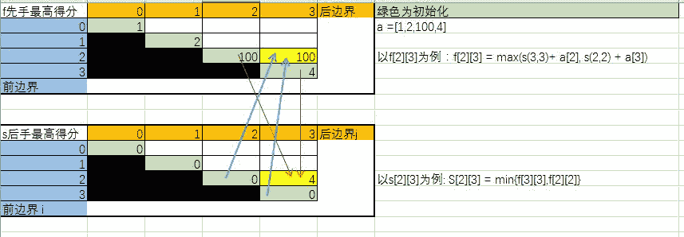

# 面试常考算法题(十)-经典动态规划 2

## 1

A、B 和 C。如果 C 包含且仅包含来自 A 和 B 的所有字符，而且在 C 中属于 A 的字符之间保持原来在 A 中的顺序，属于 B 的字符之间保持原来在 B 中的顺序，那么称 C 是 A 和 B 的混编。实现一个函数，判断 C 是否是 A 和 B 的混编。

给定三个字符串**A**,**B**和**C**，及他们的长度。请返回一个 bool 值，代表 C 是否是 A 和 B 的混编。保证三个串的长度均小于等于 100。

测试样例：

```cpp
"ABC",3,"12C",3,"A12BCC",6
```

```cpp
返回：true
```

本题知识点

动态规划

讨论

[orgcheng](https://www.nowcoder.com/profile/277064)

  查看全部)

编辑于 2015-08-11 15:12:54

* * *

[华科平凡](https://www.nowcoder.com/profile/4939096)

python 递归解法竟然也能通过。。

```cpp
 class Mixture:
    def chkMixture(self, A, n, B, m, C, v):
        # write code here
        if not n+m==v:
            return False
        self.canForm=False
        self.dfs(A,B,C)
        return self.canForm
    def dfs(self,s1,s2,s3):
        if self.canForm:
            return
        if s3 == "":
            self.canForm = True
            return
        if s1 and s1[0] == s3[0]:
            self.dfs(s1[1:], s2, s3[1:])
        if s2 and s2[0] == s3[0]:
            self.dfs(s1, s2[1:], s3[1:]) 
```

发表于 2017-09-16 12:32:01

* * *

[OOACMer](https://www.nowcoder.com/profile/632326)

```cpp
classMixture {
public:
    bool chkMixture(string A, intn, string B, intm, string C, intv) {
        // write code here
        if(n+m!=v)returnfalse;

        if(v == 0)returntrue;

        if(A[0] == C[0] && B[0] != C[0]){
                returnchkMixture(&A[1],n-1,B,m,&C[1],v-1);
            }
        if(A[0] != C[0] && B[0] == C[0]){
                returnchkMixture(A,n,&B[1],m-1,&C[1],v-1);
            }
        if(A[0] == C[0] && B[0] == C[0]){
                returnchkMixture(&A[1],n-1,B,m,&C[1],v-1)||chkMixture(A,n,&B[1],m-1,&C[1],v-1);
            }
            returnfalse;

    }
};
```

前两个判断条件很好理解；关键在于第三个怎么写 return，看明白就好，我就不多说了

编辑于 2015-08-06 12:02:55

* * *

## 2

对于一个只由 0(假)、1(真)、&(逻辑与)、|(逻辑或)和^(异或)五种字符组成的逻辑表达式，再给定一个结果值。现在可以对这个没有括号的表达式任意加合法的括号，返回得到能有多少种加括号的方式，可以达到这个结果。

给定一个字符串表达式**exp**及它的长度**len**，同时给定结果值**ret**,请返回方案数。保证表达式长度小于等于 300。为了防止溢出，请返回答案 Mod 10007 的值。

测试样例：

```cpp
"1⁰|0|1",7,0
```

```cpp
返回：2
```

本题知识点

动态规划

讨论

[VOODOO](https://www.nowcoder.com/profile/953892)

```cpp
/**
可以运用区间 DP 的思想
对于一个区间[L,R]来说 我们把它以 K 为中点分为两份

设该表达式为最后算的一个表达式
也就是现在要算的表达式为[L,k][k+1,k+1][k+2,R]有多少种方案为 ret。

先讨论符号  例如 exp[k-1]='^'
那么我们有真值表
[L,k]	[k+2,R]	[L,R]
0	0	0
0	1	1
1	0	1
1	1	0

那么[L,R]中 0 的方案数=[L,k]中 0 的方案数*[k+2,R]中 0 的方案数+[L,k]中 1 的方案数*[k+2,R]中 1 的方案数
这样我们就能求出[L,R]的以 K 分组的方案数了
注意  我这里说的是以 K 分组
那求[L,R]的方案数就是分别以 L,L+2...R-2 分组的方案数之和
这就是区间 DP 的思想
其他运算符以此类推
*/

class Expression {
    string str;
    int DP[333][333][2];
    int n;
    int MOD;
///这里 DP 采用打表的方法
///其实也可用记忆化搜索  可以理解理解区间 DP
    void dp()
    {
        ///枚举长度
        for(int len=0;len<n;len+=2)
            ///枚举起始点
            for(int i=0;i+len<n;i+=2)
            {
                ///v 是当前区间 ret=0 的和 与 ret=1 的和
                int v[2]={0,0};
                ///len==0 时说明现在区间为[i,i] 应初始化为 str 的值
                if(len==0)
                {

                    int c=str[i]-'0';
                    DP[i][i+len][c]=1;
                    DP[i][i+len][c¹]=0;
                    continue;
                }
                ///j 为枚举 k 点
                for(int j=i;j<i+len;j+=2)
                {
                    ///t 为真值表中左右两个区间对应的方案数
                    ///t[0]为    0   0
                    ///t[1]为    0   1   *   0   1
                    ///t[2]为    1   1
                    int t[3]=
                    {
                        (DP[i][j][0]%MOD)*(DP[j+2][i+len][0]%MOD),
                        (DP[i][j][0]%MOD)*(DP[j+2][i+len][1]%MOD)+(DP[i][j][1]%MOD)*(DP[j+2][i+len][0]%MOD),
                        (DP[i][j][1]%MOD)*(DP[j+2][i+len][1]%MOD)
                    };
                    t[0]%=MOD;
                    t[1]%=MOD;
                    t[2]%=MOD;
                    ///处理运算符
                    switch (str[j+1])
                    {
                        case '|':
                            v[0]+=t[0];
                            v[1]+=t[1]+t[2];
                            break;
                        case '&':
                            v[0]+=t[0]+t[1];
                            v[1]+=t[2];
                            break;
                        case '^':
                            v[0]+=t[0]+t[2];
                            v[1]+=t[1];
                            break;
                    }
                    v[0]%=MOD;
                    v[1]%=MOD;
                }
                ///为区间赋值
                DP[i][i+len][0]=v[0];
                DP[i][i+len][1]=v[1];
            }
    }
public:
    int countWays(string exp, int len, int ret)
    {
        str=exp;
        n=len;
        MOD=1e4+7;
        dp();
        return DP[0][n-1][ret];
        // write code here
    }
};

```

发表于 2015-08-19 21:40:51

* * *

[JustYoung](https://www.nowcoder.com/profile/810369)

这题切记要对每一步计算加上取余数的操作 % 10007，否则过不了。思路：构造三维 dp 矩阵 dp[i][j][z]，表示从 i 到 j 计算结果为 z 的所有方法总和，这里 z 的取值只有 0 和 1 两种。构造 dp[i][j][z]的方法为对 dp[i][k][z]*dp[k+1][j][z]求和，k 取值范围从 i 到 j-1。从矩阵的对角线开始，向右上方计算，和矩阵连乘求乘法次数最少的加括号方式类似。

```cpp
import java.util.*;

public class Expression {
    public int cal(int d1, int d2, char op) {

        if (op == '&') {
            return d1 & d2;
        } else if (op == '|') {
            return d1 | d2;
        } else {
            return d1 ^ d2;
        }
    }

    public int count(int[] digits, char[] ops, int des) {

        int n = digits.length;

        int[][][] dp = new int[n][n][2];

        for (int i = 0; i < n; ++i) {
            if (digits[i] == 1) {
                ++dp[i][i][1];
            } else {
                ++dp[i][i][0];
            }
        }

        for (int x = 1; x < digits.length; ++x) {
            for (int i = 0; i < digits.length - x; ++i) {
                int j = i + 1 + x - 1;
                for (int k = i; k < j; ++k) {
                    if (dp[i][k][0] != 0 && dp[k + 1][j][0] != 0) {
                        int num = cal(0, 0, ops[k]);
                        dp[i][j][num] = (dp[i][j][num] + dp[i][k][0] * dp[k + 1][j][0]) % 10007;
                    }
                    if (dp[i][k][0] != 0 && dp[k + 1][j][1] != 0) {
                        int num = cal(0, 1, ops[k]);
                        dp[i][j][num] = (dp[i][j][num] + dp[i][k][0] * dp[k + 1][j][1]) % 10007;
                    }
                    if (dp[i][k][1] != 0 && dp[k + 1][j][0] != 0) {
                        int num = cal(1, 0, ops[k]);
                        dp[i][j][num] = (dp[i][j][num] + dp[i][k][1] * dp[k + 1][j][0]) % 10007;
                    }
                    if (dp[i][k][1] != 0 && dp[k + 1][j][1] != 0) {
                        int num = cal(1, 1, ops[k]);
                        dp[i][j][num] = (dp[i][j][num] + dp[i][k][1] * dp[k + 1][j][1]) % 10007;
                    }
                }
            }
        }

        return dp[0][n - 1][des];
    }

    public int countWays(String exp, int len, int ret) {
        // write code here
        char[] exps = exp.toCharArray();
        int[] digits = new int[(exps.length + 1) / 2];
        char[] ops = new char[(exps.length - 1) / 2];
        for (int i = 0; i < exps.length; ++i) {
            if (i % 2 == 0) {
                digits[i / 2] = Integer.valueOf(exps[i] - '0');
            } else {
                ops[i / 2] = exps[i];
            }
        }
        return count(digits, ops, ret) % 10007;
    }
}
```

发表于 2016-08-30 19:26:03

* * *

[nbgao](https://www.nowcoder.com/profile/211289)

```cpp
class Expression {     string str;     int DP[333][333][2];     int n;     int MOD;     void dp()     {         for(int l=0;l<n;l+=2)         {             for(int i=0;i+l<n;i+=2)             {                 int v[2] = {0,0};                 if(l==0)                 {                     int c = str[i] - '0';                     DP[i][i+l][c] = 1;                     DP[i][i+l][c¹] = 0;                     continue;                 }                 for(int j=i;j<i+l;j+=2)                 {                     int t[3] = {                         (DP[i][j][0]%MOD)*(DP[j+2][i+l][0]%MOD),                         (DP[i][j][0]%MOD)*(DP[j+2][i+l][1]%MOD)+(DP[i][j][1]%MOD)*(DP[j+2][i+l][0]%MOD),                         (DP[i][j][1]%MOD)*(DP[j+2][i+l][1]%MOD)                     };                     t[0] %= MOD;                     t[1] %= MOD;                     t[2] %= MOD;                     switch (str[j+1])                     {                         case '|':                             v[0] += t[0];                             v[1] += t[1] + t[2];                             break;                         case '&':                             v[0] += t[0] + t[1];                             v[1] += t[2];                             break;                         case '^':                             v[0] += t[0] + t[2];                             v[1] += t[1];                             break;                     }                     v[0] %= MOD;                     v[1] %= MOD;                 }                 DP[i][i+l][0] = v[0];                 DP[i][i+l][1] = v[1];             }         }     }
public:
    int countWays(string exp, int len, int ret) {
        str = exp;
        n = len;
        MOD = 1e4+7;         dp();         return DP[0][n-1][ret];
    }
};

```

发表于 2017-12-27 03:26:27

* * *

## 3

有一个整型数组 A，代表数值不同的纸牌排成一条线。玩家 a 和玩家 b 依次拿走每张纸牌，规定玩家 a 先拿，玩家 B 后拿，但是每个玩家每次只能拿走最左或最右的纸牌，玩家 a 和玩家 b 都绝顶聪明，他们总会采用最优策略。请返回最后获胜者的分数。

给定纸牌序列**A**及序列的大小**n**，请返回最后分数较高者得分数(相同则返回任意一个分数)。保证 A 中的元素均小于等于 1000。且 A 的大小小于等于 300。

测试样例：

```cpp
[1,2,100,4],4
```

```cpp
返回：101
```

本题知识点

动态规划

讨论

[一个菜鸡的自我修养](https://www.nowcoder.com/profile/1354712)

```cpp
import java.util.*;
/*这是一道很明显的动态规划题
用 F[l][r]表示先选的人能拿到的最高分
用 S[l][r]来表示后选的人能拿到的最高分
如对于一组从 0,1,2，...,n-1 的数
对于先选者，他有两种选法
若先选者选 A[0],则对于后面的 1，...,n-1 数组，他就变成了后选者，此时能拿到的分为 A[0]+S[1][n-1]
若先选者选 A[n-1],则对于前面的数组 0，...，n-2,同样变为后选者，此时能拿到得分为 A[n-1]+S[0][n-2];
所以 F[0][n-1]=max(A[0]+S[1][n-1],A[n-1]+S[0][n-2])
对于后选者，他能能到的最高分是受先选者控制的，即他只能选到先选者留给他的最小值，将其转化为数学形式就是
S[l][r]=min(F[l+1][r],F[l][r-1]);
这里的最小值是先选者留给他的，他只能拿到最小值，打个比方，我是先选者，我若选 A[0]，剩下的留给你选，这个时候主动权在你
所以你能得到的最大分必为 F[1][n-1],我若选 A[n-1]，剩下的留给你选，这个时候主动权在你
所以你能得到的分必为 F[0][n-2],我肯定是要把能得到的分少的那个留给你，所以你只能得到 Min(F[1][n-1],F[0][n-2]);
*/
public class Cards {
    public int cardGame(int[] A, int n) {
        int[][]F=new int [n][n];
        int [][]S=new int [n][n];
        for(int r=0;r<n;r++){
            F[r][r]=A[r];
            S[r][r]=0;
            for(int l=r-1;l>=0;l--){
                F[l][r]=Math.max(A[l]+S[l+1][r],A[r]+S[l][r-1]);
                S[l][r]=Math.min(F[l+1][r],F[l][r-1]);
            }
        }
        return Math.max(F[0][n-1],S[0][n-1]);
    }
}

```

发表于 2018-04-16 18:15:08

* * *

[我的 Offer 呢！](https://www.nowcoder.com/profile/3988956)

```cpp
	public static int cardGame(int[] A, int n) {
		int[][] f = new int[n][n];
		int[][] s = new int[n][n];
		for (int i = 0; i < n; ++i) {
			f[i][i] = A[i];
		}
		f[A.length - 2][A.length - 1] = Math.max(A[A.length - 2], A[A.length - 1]);
		for (int i = f.length - 2; i >= 0; i--)
			for (int j = i + 1; j <= f.length - 1; ++j) {
				s[i][j] = Math.min(f[i + 1][j], f[i][j - 1]);
				f[i][j] = Math.max(A[i] + s[i + 1][j], A[j] + s[i][j - 1]);
			}
		return Math.max(f[0][n - 1], s[0][n - 1]);
	}
      //递归版本简单，但会超时
	public static int cardGame(int[] A, int n) {
		int scorA = F(A, 0, n - 1);
		int scorB = S(A, 0, n - 1);
		return Math.max(scorA, scorB);
	}

	public static int F(int[] arr, int l, int r) {
		if (l == r)
			return arr[l];
		return Math.max(S(arr, l + 1, r) + arr[l], S(arr, l, r - 1) + arr[r]);
	}

	public static int S(int[] arr, int l, int r) {
		if (l == r)
			return 0;
		return Math.min(F(arr, l + 1, r), F(arr, l, r - 1));
	}
```

a 和 b 都是绝顶聪明，他们每次拿元素时，肯定是按对自己最有力的方式拿。该题目先由最普通的递归解法，然后进行优化，到动态规划。

递归方式，对数组 arr，元素数为 n。

F(arr, l , r)表示对于数组 arr，元素从 l 到 r，先拿可以达到的最大分数；

S(arr, l, r)表示对于数组 arr, 元素从 l 到 r，后拿可以达到的最大分数。

对于 F(arr, l, r)，先拿时，有两种拿法，拿第一个 arr[l]，或最后一个 arr[r]；如果拿 arr[l]，那么剩余的 arr[l+1,....r]能拿到的最大分数为 S(arr, l+1, r)，分数为 arr[l] +S(arr, l+1, r)； 如果拿 arr[r]，剩余的 arr[l, ...r-1]能拿到的最大分数为 S(arr, l, r-1)，分数为 arr[r] + S(arr, l, r-1)，因为对于先拿后剩余的数组，当前人再拿的话是后拿的，然后取这两种拿法较大的分数。

对于 S(arr, l, r)，如果前一个人先拿了 arr[l]，则后拿的分数为 F(arr, l+1, r)，如果前一个人先拿了 arr[r]，则后拿的分数为 F(arr, l, r-1)，因为对于剩余的元素来说，你是先拿的，取两种方式的较小值才是 S 的值。（为什么取较小值，而不是较大值？因为 a 和 b 都是绝顶聪明人，你是在另一个绝顶聪明人之后才拿的，他给你剩下的肯定是较坏的情况）函数关系为 F(arr, l , r) = max { S(arr,l+1,r)+ arr[l] , S(arr,l,r+1)+arr[r] }S(arr, l, r ) = min{F(arr,l+1,r),F(arr,l,r+1)}初始值 F(arr, i, i)  = arr[i]S(arr,i,i) = 0;动态规划，更新过程如下图所示 

编辑于 2017-06-27 23:55:44

* * *

[Alex-大伟](https://www.nowcoder.com/profile/521033)

```cpp
import java.util.Scanner;

public class Cards {

	/**
	 * @param args
	 */
	public static void main(String[] args) {
		// TODO Auto-generated method stub
		Scanner scanner = new Scanner(System.in);
		while (scanner.hasNext()) {
			int n = scanner.nextInt();
			int[] A = new int[n];
			for (int i = 0; i < n; i++) {
				A[i] = scanner.nextInt();
			}
			System.out.println(cardGame(A, n));
		}
	}

	public static int cardGame(int[] A, int n) {
		// f[i][j]表示在牌[i...j]下，先选能获得的最大分数
		// s[i][j]表示在牌[i...j]下，后选能获得的最大分数
		int[][] f = new int[n][n];
		int[][] s = new int[n][n];
		for (int j = 0; j < n; j++) {
			f[j][j] = A[j];
			for (int i = j - 1; i >= 0; i--) {
				// 有两种拿法：1.先手拿最左边的。那么下一次拿的时候只能后选 2.先手拿最右边的。那么下一次拿的时候只能先选
				f[i][j] = Math.max(A[i] + s[i + 1][j], A[j] + s[i][j - 1]);
				s[i][j] = Math.min(f[i + 1][j], f[i][j - 1]); // 后手只能获得较小的分数（双方都很聪明，后选当然只能获得较少的分数）
			}
		}
		return Math.max(f[0][n - 1], s[0][n - 1]);
	}
}

```

编辑于 2016-10-08 17:17:54

* * *

## 4

对于字符串 A，其中绝对不含有字符’.’和’*’。再给定字符串 B，其中可以含有’.’或’*’，’*’字符不能是 B 的首字符，并且任意两个’*’字符不相邻。exp 中的’.’代表任何一个字符，B 中的’*’表示’*’的前一个字符可以有 0 个或者多个。请写一个函数，判断 A 是否能被 B 匹配。

给定两个字符串**A**和**B**,同时给定两个串的长度**lena**和**lenb**，请返回一个 bool 值代表能否匹配。保证两串的长度均小于等于 300。

测试样例：

```cpp
"abcd",4,".*",2
```

```cpp
返回：true
```

本题知识点

动态规划

讨论

[华科平凡](https://www.nowcoder.com/profile/4939096)

python 解法，使用 re 模块：

```cpp
import re
class WildMatch:
    def chkWildMatch(self, A, lena, B, lenb):
        def fullmatch(regex, string, flags=0):
            return re.match("(?:" + regex + r")\Z", string, flags=flags)
        if fullmatch(B,A):
            return True
        return False
```

编辑于 2017-09-12 14:18:46

* * *

[牛客 3897179 号](https://www.nowcoder.com/profile/3897179)

```cpp
/*
分析：
	采用动态规划
	dp[i][j] 代表 str1[0~i-1]和 str2[0~j-1]是否匹配
首先考虑特殊情况：
	dp[0][0]:空串和空串认为是匹配的 
		dp[0][0] = true;
	dp[0][j] = false;
	dp[i][0] = false;
一般情况：
	dp[i][j]有如下情况
	1） 如果 str2[j-1] == '*'
		dp[i][j] = dp[i-1][j] || dp[i][j-1] || dp[i-1][j-1]
	2)  如果 str2[j-1] == '.'
		dp[i][j] = dp[i-1][j-1];
	3)	如果 str2[j-1]为其他值
		dp[i][j] = dp[i-1][j-1] && str1[i-1] == str2[j-1]
*/
bool chkWildMatch(string A, int lena, string B, int lenb)
{
    // write code here
	vector<vector<bool>> dp(lena + 1, vector<bool>(lenb + 1));
	//初始化
	dp[0][0] = true;
	//一般情况
	for (int i = 1; i <= lena; i++)
	{
		for (int j = 1; j <= lenb; j++)
		{
			if (B[j-1] == '*')
				dp[i][j] = dp[i-1][j] || dp[i][j-1] || dp[i-1][j-1];
			else if (B[j-1] == '.')
				dp[i][j] = dp[i-1][j-1];
			else
				dp[i][j] = dp[i-1][j-1] && (A[i-1] == B[j-1]);
		}
	}
	return dp[lena][lenb];
}
```

发表于 2017-09-03 15:54:31

* * *

[Alex-大伟](https://www.nowcoder.com/profile/521033)

```cpp
package alex.suda.dp;

import java.util.Scanner;

public class test8 {

	public static void main(String[] args) {
		Scanner scanner = new Scanner(System.in);
		while (scanner.hasNext()) {
			int n = scanner.nextInt();
			String A = scanner.next();
			int m = scanner.nextInt();
			String B = scanner.next();
			System.out.println(chkWildMatch(A, n, B, m));
		}
	}

	public static boolean chkWildMatch(String A, int lena, String B, int lenb) {
		// d[i][j]表示 A 中的 1~i 位可以匹配 B 中的 1~j 位
		boolean[][] d = new boolean[lena + 1][lenb + 1];
		// 初始化
		d[0][0] = true;
		for (int i = 1; i <= lena; i++) {
			for (int j = 1; j <= lenb; j++) {
				if (B.charAt(j - 1) == '*') {
					d[i][j] = d[i - 1][j] || d[i][j - 1];
				} else if (B.charAt(j - 1) == '.') {
					d[i][j] = d[i - 1][j - 1];
				} else {
					d[i][j] = d[i - 1][j - 1] && A.charAt(i - 1) == B.charAt(j - 1);
				}
			}
		}
		return d[lena][lenb];
	}
}

```

发表于 2016-10-08 20:05:58

* * *