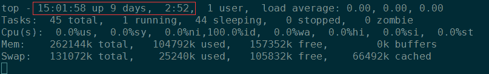

# 二千零一十五、网易互娱校园招聘运维开发岗笔试题

## 1

以下哪些命令可以查看当前系统的启动时间（）

正确答案: A B D   你的答案: 空 (错误)

```cpp
w
```

```cpp
top
```

```cpp
ps
```

```cpp
uptime
```

本题知识点

Linux 网易 运维工程师 网易互娱 2015

讨论

[rppp](https://www.nowcoder.com/profile/9542322)

ps   查看当前系统中的进程 who -b   查看当前系统的启动时间 last reboot   查看当前系统的启动时间 w    查看当前系统的启动时间 top   查看当前系统的启动时间 uptime    查看当前系统的启动时间

发表于 2017-07-24 11:00:56

* * *

[牛客爱刷题](https://www.nowcoder.com/profile/632905)

这个确实有多个答案，可以利用:who -blast reboottopwuptime

发表于 2015-08-20 15:35:20

* * *

[ChowRex](https://www.nowcoder.com/profile/5307310)



事实证明 ABD 全对

发表于 2016-06-29 15:03:11

* * *

## 2

以下哪些命令可以打印文件（demo.log）中包含 ERP 的行到标准输出（）

正确答案: D   你的答案: 空 (错误)

```cpp
sed '/ERR/a\' demo.log
```

```cpp
sed '/ERP/p' demo.log
```

```cpp
sed '/ERP/d' demo.log
```

```cpp
sed -n '/ERP/p' demo.log
```

本题知识点

Linux 网易 运维工程师 网易互娱 2015

讨论

[MyGoodHelper](https://www.nowcoder.com/profile/644326)

Dsed 命令用于行的新  查看全部)

编辑于 2015-01-30 10:19:09

* * *

[牛客-007](https://www.nowcoder.com/profile/394118)

答案：D
sed 是非交互式的编辑器。它不会修改文件，除非使用 shell 重定向来保存结果。默认情况下，所有的输出行都被打印到屏幕上
sed 编辑器逐行处理文件（或输入），并将结果发送到屏幕。具体过程如下：首先 sed 把当前正在处理的行保存在一个临时缓存区中（也称为模式空间），然后处理临时缓冲区中的行，完成后把该行发送到屏幕上。sed 每处理完一行就将其从临时缓冲区删除，然后将下一行读入，进行处理和显示。处理完输入文件的最后一行后，sed 便结束运行。sed 把每一行都存在临时缓冲区中，对这个副本进行编辑，所以不会修改原文件。
然后回到本题中，
 -n 取消默认的输出，从而重定向为 ERP 输出
-p 打印行
最后是 filename 文件名

发表于 2015-01-28 13:28:49

* * *

[￥shell](https://www.nowcoder.com/profile/5026412)

**sed -n ：只显示 sed 匹配到的行。其余行不显示
p 代表是打印行
综合以上两个条件，答案 D** 

发表于 2016-06-20 20:24:40

* * *

## 3

使用 dpkg 命令安装的软件为？

正确答案: D   你的答案: 空 (错误)

```cpp
.rpm
```

```cpp
.tar.gz
```

```cpp
.tar.bz2
```

```cpp
.deb
```

本题知识点

Linux 网易 运维工程师 网易互娱 2015

讨论

[MyGoodHelper](https://www.nowcoder.com/profile/644326)

Ddpkg 是一个 Deb  查看全部)

编辑于 2015-01-30 10:14:25

* * *

[zhogjiane](https://www.nowcoder.com/profile/255365)

dpkg  ---- debyum   -----rpmapt-get --- debtar ----- bz2unzip ------ zip

编辑于 2018-03-19 14:59:04

* * *

[牛客-007](https://www.nowcoder.com/profile/394118)

答案：D
“dpkg ”是“Debian Packager ”的简写。为 “Debian” 专门开发的套件管理系统，方便软件的安装、更新及移除。所有源自“Debian”的“Linux ”发行版都使用 “dpkg”，例如 “Ubuntu”、“Knoppix ”等。示例：dpkg -i avg71flm_r28-1_i386.deb

发表于 2015-01-28 13:20:42

* * *

## 4

链表要求元素的存储地址（）

正确答案: D   你的答案: 空 (错误)

```cpp
必需连续
```

```cpp
部分连续
```

```cpp
必需不连续
```

```cpp
连续与否均可
```

本题知识点

链表 *网易 运维工程师 网易互娱 2015* *讨论

[MyGoodHelper](https://www.nowcoder.com/profile/644326)

D 链表是一种物理 存储单  查看全部)

编辑于 2015-02-02 11:24:42

* * *

[天尊墨宇](https://www.nowcoder.com/profile/667959477)

选 D 链表是一种物理[存储单元](http://baike.baidu.com/view/1223079.htm)上非连续、非顺序的[存储结构](http://baike.baidu.com/view/2820182.htm)，[数据元素](http://baike.baidu.com/view/38785.htm)的逻辑顺序是通过链表中的[指针](http://baike.baidu.com/view/159417.htm)链接次序实现的。链表由一系列结点（链表中每一个元素称为结点）组成，结点可以在运行时动态生成。每个结点包括两个部分：一个是存储[数据元素](http://baike.baidu.com/view/38785.htm)的数据域，另一个是存储下一个结点地址的[指针](http://baike.baidu.com/view/159417.htm)域。 

发表于 2020-06-26 15:52:27

* * *

[dangdang2011](https://www.nowcoder.com/profile/7069127)

D

发表于 2018-03-11 21:32:25

* * *

## 5

采用哈希表组织 100 万条记录，以支持字段 A 快速查找，则（）

正确答案: C   你的答案: 空 (错误)

```cpp
理论上可以在常数时间内找到特定记录
```

```cpp
所有记录必须存在内存中
```

```cpp
拉链式哈希曼最坏查找时间复杂度是 O（n）
```

```cpp
哈希函数的选择跟 A 无关
```

本题知识点

哈希 *网易 运维工程师 网易互娱 2015* *讨论

[牛客-007](https://www.nowcoder.com/profile/394118)

  查看全部)

编辑于 2015-02-02 11:23:09

* * *

[Rachy](https://www.nowcoder.com/profile/9395030)

A，记录共有 100 万条，一般的哈希表长度不可能做这么长，因此要解决散列冲突问题，因此一般不能再常数时间内找到记录
B，哈希查找可以在外存中查找，可以用哈希表映射到文件，分级查找
C，最坏情况是所有记录的散列值都冲突，这样就退化为线性查找，时间复杂度为 O（n）
D，哈希函数的选择跟 A 关系密切，跟 A 的字段类型有关，哈希函数设计的好坏也影响着查找的速度

发表于 2016-11-03 13:53:11

* * *

[xxxxxxxxxxxxxxxa](https://www.nowcoder.com/profile/4397117)

C 选项 拉链式哈希曼 我一下子懵逼了，不知道是什么高深的算法，结果发现就是 open hash，开放哈希表，冲突解决方式中的链式解决方法。顿时 MMP

发表于 2018-06-19 10:37:22

* * *

## 6

Mysql 查询时，只有满足联接条件的记录才包含在查询结果，这种联接是（）。

正确答案: C   你的答案: 空 (错误)

```cpp
左联接
```

```cpp
右联接
```

```cpp
内联接
```

```cpp
全联接
```

本题知识点

数据库 网易 运维工程师 网易互娱 2015

讨论

[牛客-007](https://www.nowcoder.com/profile/394118)

  查看全部)

编辑于 2015-02-02 11:14:37

* * *

[墨裳花开](https://www.nowcoder.com/profile/994851)

c 连接分为内链接、左外连接、右外连接（INNER JOIN、LEFT JOIN、RIGHT JOIN）;内链接：取两个表的交集，仅显示符合连接条件的记录；左外连接：显示左表的全部记录及右表符合连接条件的记录；右外连接：显示右表的全部记录及左表符合连接条件的记录。

发表于 2015-07-15 21:53:18

* * *

[huixieqingchun](https://www.nowcoder.com/profile/551201)

**连接分为内链接、左外连接、右外连接（INNER JOIN、LEFT JOIN、RIGHT JOIN）;****内链接：取两个表的交集，仅显示符合连接条件的记录；****左外连接：显示左表的全部记录及右表符合连接条件的记录；****右外连接：显示右表的全部记录及左表符合连接条件的记录。**

发表于 2016-06-05 12:55:18

* * *

## 7

对于一棵排序二叉树：（）遍历可以得到有序序列。

正确答案: B   你的答案: 空 (错误)

```cpp
前序
```

```cpp
中序
```

```cpp
后序
```

```cpp
都可以
```

本题知识点

树 网易 运维工程师 网易互娱 2015

讨论

[牛客-007](https://www.nowcoder.com/profile/394118)

答案：B 假设排序二叉树  查看全部)

编辑于 2015-02-02 10:38:21

* * *

[InGodWeTrust](https://www.nowcoder.com/profile/2178882)

排序二叉树的顺序为：左->中->右

发表于 2017-04-06 16:34:23

* * *

[yayamma](https://www.nowcoder.com/profile/270051)

二叉排序树或者是一棵空树，或者是具有下列性质的二叉树：
（1）若左子树不空，则左子树上所有结点的值**均小于** 它的根结点的值；
（2）若右子树不空，则右子树上所有结点的值**均大于或等于** 它的根结点的值；
（3）左、右子树也分别为二叉排序树；
（4）没有键值相等的节点。

发表于 2015-09-16 14:52:02

* * *

## 8

JavaScript 中定义 var a="40",var b=7,则执行 a%b 会得到？

正确答案: A   你的答案: 空 (错误)

```cpp
5
```

```cpp
"5"
```

```cpp
undefined
```

```cpp
null
```

本题知识点

Javascript 网易 运维工程师 网易互娱 2015

讨论

[牛客-007](https://www.nowcoder.com/profile/394118)

  查看全部)

编辑于 2015-02-02 10:35:23

* * *

[若川](https://www.nowcoder.com/profile/995429)

运算中，+号，数字隐式转换成字符串。其余的运算符号是字符串隐式转换成数字。

发表于 2016-04-20 00:24:49

* * *

[Web 前端开发](https://www.nowcoder.com/profile/1912086)

在进行算术运算时会做，+号，数字隐式转换成字符串。其余的运算符号是字符串隐式转换成数字。

发表于 2016-10-21 23:40:13

* * *

## 9

下面有关 CSS sprites 说法错误的是？

正确答案: C   你的答案: 空 (错误)

```cpp
允许你将一个页面涉及到的所有零星图片都包含到一张大图中去
```

```cpp
利用 CSS 的 “background-image”，“background-repeat”，“background-position” 的组合进行背景定位
```

```cpp
CSS Sprites 虽然增加了总的图片的字节，但是很好地减少网页的 http 请求，从而大大的提高页面的性能
```

```cpp
CSS Sprites 整理起来更为方便，同一个按钮不同状态的图片也不需要一个个切割出来并个别命名
```

本题知识点

网易 运维工程师 网易互娱 2015 CSS

讨论

[牛客 444334 号](https://www.nowcoder.com/profile/444334)

C

CSS Sprites  查看全部)

编辑于 2015-01-12 21:41:57

* * *

[Mr.Apple](https://www.nowcoder.com/profile/213669)

CSS Sprites

1.简介 CSS Sprites 在国内很多人叫 css 精灵，是一种网页图片应用处理方式。它允许将一个页面涉及到的所有零星图片都包含到一张大图中， 利用 CSS 的“background-image”，“background- repeat”，“background-position”的组合进行背景定位， 访问页面时避免图片载入缓慢的现象。2.优点（1）CSS Sprites 能很好地减少网页的 http 请求，从而大大的提高页面的性能，这是 CSS Sprites 最大的优点，也是其被广泛传播和应用的主要原因；（2）CSS Sprites 能减少图片的字节；（3）CSS Sprites 解决了网页设计师在图片命名上的困扰，只需对一张集合的图片命名，不需要对每一个小图片进行命名，从而提高了网页制作效率。（4）CSS Sprites 只需要修改一张或少张图片的颜色或样式来改变整个网页的风格。3.缺点（1）图片合并麻烦：图片合并时，需要把多张图片有序的合理的合并成一张图片，并留好足够的空间防止版块出现不必要的背景。（2）图片适应性差：在高分辨的屏幕下自适应页面，若图片不够宽会出现背景断裂。（3）图片定位繁琐：开发时需要通过工具测量计算每个背景单元的精确位置。（4）可维护性差：页面背景需要少许改动，可能要修改部分或整张已合并的图片，进而要改动 css。在避免改动图片的前提下，又只能（最好）往下追加图片，但这样增加了图片字节。

发表于 2016-05-03 16:58:00

* * *

[独行冰海](https://www.nowcoder.com/profile/781283)

第一个更不对啊，怎么可能所有的图片都压进去，那要是普通的数据图，也是零星图片呢？明显说的不够严谨

发表于 2015-01-30 18:43:45

* * *

## 10

下列关于视图与基本表的对比正确的是()

正确答案: A   你的答案: 空 (错误)

```cpp
视图的定义功能强于基本表
```

```cpp
视图的操作功能强于基本表
```

```cpp
视图的数据控制功能弱于基本表
```

```cpp
上面提到的三种功能二者均相当
```

本题知识点

数据库 网易 运维工程师 网易互娱 2015

讨论

[nwhasd](https://www.nowcoder.com/profile/181639)

选择 A。视图可以定义在多张表上，因此定义功能比表强。视图中数据更新受到诸多限制，例如不能有聚集函数，不能是定义在多张表上等，因此操作功能弱于表。视图的数据控制功能和表的数据控制功能相当，都有 GRANT、REVOKE。

发表于 2015-10-04 14:48:35

* * *

[炫](https://www.nowcoder.com/profile/376795)

1.视图是数据库数据的特定子集。可以禁止所有用户访问数据库表，而要求用户只能通过视图操作数据，这种方法可以保护用户和应用程序不受某些数据库修改的影响。2.视图是抽象的，他在使用时，从表里提取出数据，形成虚的表。  不过对他的操作有很多的限制  。
3\. 而且视图是永远不会自己消失的除非你删除它。 
  视图有时会对提高效率有帮助。临时表几乎是不会对性能有帮助，是资源消耗者。 
  视图一般随该数据库存放在一起，临时表永远都是在 tempdb 里的。 
4.视图适合于多表连接浏览时使用!不适合增、删、改.，存储过程适合于使用较频繁的 SQL 语句，这样可以提高  执行效率! 
**视图和表的区别和联系**
区别：1、视图是已经编译好的 sql 语句。而表不是 
      2、视图没有实际的物理记录。而表有。
      3、表是内容，视图是窗口
      4、表只用物理空间而视图不占用物理空间，视图只是逻辑概念的存在，表可以及时对它进行修改，但视图只能有创建的语句来修改
      5、表是内模式，视图是外模式
      6、视图是查看数据表的一种方法，可以查询数据表中某些字段构成的数据，只是一些 SQL 语句的集合。从安全的角度说，视图可以不给用户接触数据表，从而不知道表结构。
      7、表属于全局模式中的表，是实表；视图属于局部模式的表，是虚表。
      8、视图的建立和删除只影响视图本身，不影响对应的基本表。
**联系：** 视图（view）是在基本表之上建立的表，它的结构（即所定义的列）和内容（即所有数据行）都来自基本表，它依据基本表存在而存在。一个视图可以对应一个基本表，也可以对应多个基本表。视图是基本表的抽象和在逻辑意义上建立的新关系。

发表于 2016-05-11 13:44:33

* * *

[舒意意 123](https://www.nowcoder.com/profile/1973064)

视图的数据定义功能大于表；
数据操作功能弱于表；
数据控制功能与表相当；

发表于 2017-03-16 15:12:19

* * *

## 11

一个关系模式为 Y（X1，X2，X3，X4），假定该关系存在着如下函数依赖：（X1，X2）→X3，X2→X4，则该关系属于（  ）

正确答案: A   你的答案: 空 (错误)

```cpp
第一范式
```

```cpp
第二范式
```

```cpp
第三范式
```

```cpp
第四范式
```

本题知识点

数据库 网易 运维工程师 网易互娱 2015

讨论

[mirror](https://www.nowcoder.com/profile/153261)

此关系模式的候选键为 {X1,  查看全部)

编辑于 2015-08-07 10:15:40

* * *

[Heap](https://www.nowcoder.com/profile/627242)

上面对范式的解释不够详细。我补充两点。1NF  2NF 3NF BCNF 是一级包含一级的关系。也就是说必须先满足第一范式，在看是否满足第二范式。跳过含义，我们直接解释一下各个范式的意义：拿最常见的学生成绩管理数据库来举例：1NF，表示属性值是不可分割。比如学生信息表学生标示符 201328 Heap                       ===                      左侧不满足第一范式。因为该属性值可以再分割变为：学号      姓名 201328      heap2NF，表示非主要的属性，必须完全依赖主要的属性，不能部分依赖：比如选课信息表选课人      课程           上课老师           教材                      老师职称 heap         数据库       heap           《数据库原理》        副教授======= （选课人、课程）才能确定这张表的唯一行。所以他是主属性。但是教材只与课程有关。教材并不依赖选课人。这样带来的问题是，假设 1 万个选课行，那么教材发生修改就需要修改这 1 万行。而且如果某一门课，没人选，那如何插入呢？所以这不符合第 2 范式。题目中正是这样的论述。（x1，X2）可以当做主属性，但是 X4 却不是完全依赖（X1，X2），而只是依赖一部分。3NF，表示非主属性不要依赖于其他非主属性。还以上述选课表为例。选课人      课程           上课老师        老师职称 heap         数据库       heap                 副教授同样，主属性是（选课人，课程），但是老师支持跟选课人没关系。只和上课老师相关。所以这就是非主属性依赖其他非主属性。不满足第三范式。

发表于 2015-09-10 11:09:10

* * *

[曾志群](https://www.nowcoder.com/profile/201624)

参见 http://www.zhihu.com/question/24696366

发表于 2015-09-19 09:13:44

* * *

## 12

在 bash 中，下列哪些语句是赋值语句？（）

正确答案: C   你的答案: 空 (错误)

```cpp
a$="test"
```

```cpp
$a$="test"
```

```cpp
a="test"
```

```cpp
$a="test"
```

本题知识点

Linux 网易 运维工程师 网易互娱 2015

讨论

[MyGoodHelper](https://www.nowcoder.com/profile/644326)

Cbash 中有两个内置  查看全部)

编辑于 2015-01-30 10:19:36

* * *

[启程！](https://www.nowcoder.com/profile/3545562)

看了好久竟然没有看出 A、C 的区别，空格。。。。

发表于 2017-06-24 15:48:53

* * *

[tapakkur](https://www.nowcoder.com/profile/3154080)

只能说运气好了 😐 注意空格啦各位 😝😝

发表于 2017-11-30 23:27:04

* * *

## 13

最佳二叉搜索树是？

正确答案: B   你的答案: 空 (错误)

```cpp
关键码个数最少的二叉搜索树
```

```cpp
搜索时平均比较次数最少的二叉搜索树
```

```cpp
所有结点的左子树都为空的二叉搜索树
```

```cpp
所有结点的右子树都为空的二叉搜索树
```

本题知识点

树 网易 运维工程师 网易互娱 2015

讨论

[牛客-007](https://www.nowcoder.com/profile/394118)

答案：B 二叉搜索树上面  查看全部)

编辑于 2015-02-02 10:20:50

* * *

[MyGoodHelper](https://www.nowcoder.com/profile/644326)

B.搜索时平均比较次数最少的二叉搜索树

最优二叉查找树：

给定 n 个互异的关键字组成的序列 K=<k1,k2,...,kn>，且关键字有序（k1<k2<...<kn），我们想从这些关键字中构造一棵二叉查找树。对每个关键字 ki，一次搜索搜索到的概率为 pi。可能有一些搜索的值不在 K 内，因此还有 n+1 个“虚拟键”d0,d1,...,dn，他们代表不在 K 内的值。具体：d0 代表所有小于 k1 的值，dn 代表所有大于 kn 的值。而对于 i = 1,2,...,n-1,虚拟键 di 代表所有位于 ki 和 ki+1 之间的值。对于每个虚拟键，一次搜索对应于 di 的概率为 qi。要使得查找一个节点的期望代价（代价可以定义为：比如从根节点到目标节点的路径上节点数目）最小，就需要建立一棵最优二叉查找树。

发表于 2015-01-18 15:33:16

* * *

[美团到店招聘](https://www.nowcoder.com/profile/3472441)

最佳二叉搜索树指的是平均搜索次数最少的二叉搜索树。所有结点都为左子树或者右子数是搜索效果最差的二叉搜索树，已经退化成链表了。

发表于 2017-02-15 15:14:35

* * *

## 14

下列关于地址转换的描述，错误的是（）

正确答案: B   你的答案: 空 (错误)

```cpp
地址转换解决了因特网地址短缺所面临问题
```

```cpp
地址转换实现了对用户透明的网络外部地址的分配
```

```cpp
使用地址转换后，对"IP 包加长"，"快速转发"不会造成什么影响
```

```cpp
地址转换内部主机提供一定的”隐私”
```

本题知识点

网络基础 网易 运维工程师 网易互娱 2015

讨论

[牛客-007](https://www.nowcoder.com/profile/394118)

答案：B（NAT）地址  查看全部)

编辑于 2015-01-30 10:57:50

* * *

[格子灰](https://www.nowcoder.com/profile/822665)

这题我表示质疑，B 这句话是对的，因为局域网客户端主机打出数据帧的目的地址是内部私有地址，经过 NAT 路由器后，才会进行外部地址更换（实际上是封装），那么这就对于用户是透明的，因为用户不需要关心外部 IP。C 选项 IP 包一旦变长，那么时延也会变长，路由器的性能急剧下降，所以快速转发很难实现。这题错误选项选 C

发表于 2016-05-18 11:25:44

* * *

[DukeZY](https://www.nowcoder.com/profile/669743)

NAT 只能说是缓解了 ipv4 地址短缺的问题，真正解决是 ipv6 的实行，A 太绝对了

发表于 2016-02-12 18:18:56

* * *

## 15

PING 命令使用 ICMP 的哪一种 code 类型（）

正确答案: B   你的答案: 空 (错误)

```cpp
重定向
```

```cpp
Echo 回响
```

```cpp
源印制
```

```cpp
目标不可达
```

本题知识点

网络基础 网易 运维工程师 网易互娱 2015

讨论

[墨儿](https://www.nowcoder.com/profile/717983)

```cpp
答案 B ping 命令采用了 
```

  查看全部)

编辑于 2015-01-30 10:52:49

* * *

[牛客-007](https://www.nowcoder.com/profile/394118)

答案：B
Ping 是 Windows 下的一个命令,在 Unix 和 Linux 下也有这个命令。ping 也属于一个通信协议，是 TCP/IP 协议的一部分。利用“ping”命令可以检查网络是否连通，可以很好地帮助我们分析和判定网络故障。应用格式：Ping 空格 IP 地址。该命令还可以加许多参数使用，具体是键入 Ping 按回车即可看到详细说明。
Ping 实际上利用的就是 ICMP ECHO 和 ICMP ECHO REPLY 包来探测主机是否存在，所以 Ping 程序的流程十分简单：发送 ICMP 　　　ECHO 包---- > 接收 ICMP ECHO REPLY 包
发送 ICMP ECHO 包时填充 Identifier 为进程 ID，　Sequence Number 为从 0 递增计数，data 填充为发送时间
接收 ICMP ECHO REPLY 包时检查 Identifier, Sequence Number 是否正确，通过 IP 报头的源地址字段获得回送报文的主机地址是否正确

发表于 2015-01-28 13:38:28

* * *

[校歌](https://www.nowcoder.com/profile/2033403)

**PING 使用了 ICMP 回送请求与回送回答报文** 。PING 是应用层直接使用网络层的一个例子，它没有通过传输层的 TCP 和 UDP。

发表于 2017-01-17 20:47:05

* * *

## 16

在 Linux 文件系统中，如果系统的 umask 设置为 244，则创建一个新文件它的权限将会是（）

正确答案: C   你的答案: 空 (错误)

```cpp
--w-r--r--
```

```cpp
-r-xr--r--
```

```cpp
-r---w--w-
```

```cpp
-r-x-wx-wx
```

本题知识点

操作系统 Linux 网易 运维工程师 网易互娱 2015

讨论

[ahuangliang](https://www.nowcoder.com/profile/505180)

umask 是从权限中“拿走”相应的位,且文件创建时不能赋予执行权限.创建时，文件 默认 666，目录默认 777，减去 umask 的位就是结果。

发表于 2015-08-13 22:18:29

* * *

[牛客-007](https://www.nowcoder.com/profile/394118)

答案：C
Linux 中的权限有 r(读) w(写) x(执行)，分别用数字 4,2,1 代表。
Umask 是设置系统创建文件时的默认权限，是创建文件权限补码，对文件来说最大值是 6
Umask 设为为 244，则创建的文件默认权限是 422，文件的第一位是‘-’也就是-r---w--w-

编辑于 2021-12-22 09:44:28

* * *

[MyGoodHelper](https://www.nowcoder.com/profile/644326)

Cumask 功能说明：指定在建立文件时预设的权限掩码。语　　法：umask [-S][权限掩码]
补充说明：umask 可用来设定[权限掩码]。[权限掩码]是由 3 个八进制的数字所组成，将现有的存取权限减掉权限掩码后，即可产生建立文件时预设的权限。umask 命令允许你设定文件创建时的缺省模式，对应每一类用户(文件属主、同组用户、其他用户)存在一个相应的 umask 值中的数字。对于文件来说，这一数字的最 大值分别是 6。系统不允许你在创建一个文本文件时就赋予它执行权限，必须在创建后用 chmod 命令增加这一权限。目录则允许设置执行权限，这样针对目录来 说，umask 中各个数字最大可以到 7。对于新建文件 权限 666-244 得到 422  linux 系统中权限 rwx 对应数值为 421，故文件权限为 r-- -w- -w-

发表于 2015-01-17 19:16:49

* * *

## 17

下列哪些功能使 TCP 准确可靠地从源设备到目地设备传输数据（）

正确答案: D   你的答案: 空 (错误)

```cpp
封装
```

```cpp
流量控制
```

```cpp
无连接服务
```

```cpp
编号和定序
```

本题知识点

网络基础 网易 运维工程师 网易互娱 2015

讨论

[牛客-007](https://www.nowcoder.com/profile/394118)

  查看全部)

编辑于 2015-01-30 10:47:35

* * *

[江左梅郎](https://www.nowcoder.com/profile/448702)

B，D 应该都有，TCP 提供流量控制，Tcp 链接每一方都有固定大小的缓冲空间，Tcp 接收端只允许另一端发送接收端缓冲区所能接纳的数据，这将防止较快主机致使较慢主机缓冲区溢出。（而 D 的的话其实勉强算对吧，并不在于编号与定序，而是计时器与 ACK 确认起到重要作用。个人理解还望指正。）

发表于 2015-09-08 01:03:37

* * *

[我不是董皓宇。](https://www.nowcoder.com/profile/481329531)

我个人认为，题干问的是如何**准确的从原设备到目的设备**进行通讯，编号和定序保证了数据包不混乱；流量控制保证了目的设备能够接收完原设备发来的的信息。主要准确传输的还是面向连接的，有了连接即可准确传输。在 BD 中选的话，还是选 D，毕竟 ACK 也是三次握手中的重要部分

发表于 2020-03-13 21:13:28

* * *

## 18

Linux 下的进程有哪三种状态（）

正确答案: B   你的答案: 空 (错误)

```cpp
精确态，模糊态和随机态
```

```cpp
运行态，就绪态和等待态
```

```cpp
准备态，执行态和退出态
```

```cpp
手动态，自动态和自由态
```

本题知识点

Linux 操作系统 网易 运维工程师 网易互娱 2015

讨论

[牛客-007](https://www.nowcoder.com/profile/394118)

答案：B

Linux 的进程三种状态分别是：

运行状态：这个不用解释了吧，就是正在运行

就绪状态：这个状态等待 CPU 时间片的状态，一切准备就绪，随时可以执行，等 CPU 切换到该进程，该进程就会由就绪状态变为运行状态

等待状态：其实就是未就绪状态，还有做一些准备工作或者等待资源

编辑于 2021-12-18 13:24:46

* * *

[后劲好大](https://www.nowcoder.com/profile/4013442)

*   **运行态** (Running) ：              占有 CPU，并在 CPU 上运行
*   **就绪态** (Ready)：                  已经具备运行条件，但由于没有空闲 CPU，而暂时不能运行
*   **等待态** (Waiting/Blocked)：   因等待某一事件而暂时不能运行：如等待读盘结果

发表于 2017-06-08 20:23:06

* * *

[江南消夏](https://www.nowcoder.com/profile/8611799)

进程的三种基本状态

*   **运行态** (Running) ：              占有 CPU，并在 CPU 上运行
*   **就绪态** (Ready)：                  已经具备运行条件，但由于没有空闲 CPU，而暂时不能运行
*   **等待态** (Waiting/Blocked)：   因等待某一事件而暂时不能运行：如等待读盘结果

编辑于 2017-03-28 22:41:46

* * *

## 19

下面哪个不是进程和程序的区别()

正确答案: B   你的答案: 空 (错误)

```cpp
程序是一组有序的静态指令，进程是一次程序的执行过程
```

```cpp
程序只能在前台运行，而进程可以在前台或后台运行
```

```cpp
程序可以长期保存，进程是暂时的
```

```cpp
程序没有状态，而进程是有有状态的
```

本题知识点

操作系统 网易 运维工程师 网易互娱 2015

讨论

[MyGoodHelper](https://www.nowcoder.com/profile/644326)

BA：程序是指令的有序  查看全部)

编辑于 2015-01-12 16:01:01

* * *

[henry_dai](https://www.nowcoder.com/profile/116361517)

别问我为什么选了 ACD

发表于 2019-09-04 23:22:43

* * *

[huixieqingchun](https://www.nowcoder.com/profile/551201)

**要看清楚题目，是问不是两者区别的。****程序是无状态的，进程是有状态的，即就绪状态、运行状态、等待状态等。**

发表于 2016-07-08 10:24:47

* * *

## 20

在 Linux 系统，关于硬链接的描述正确的是（）

正确答案: B D   你的答案: 空 (错误)

```cpp
跨文件系统
```

```cpp
不可以跨文件系统
```

```cpp
为链接文件创建新的 i 节点
```

```cpp
链接文件的 i 节点与被链接文件的 i 节点相同
```

本题知识点

Linux

讨论

[牛客-007](https://www.nowcoder.com/profile/394118)

  查看全部)

编辑于 2015-01-30 11:01:08

* * *

[知莫若行](https://www.nowcoder.com/profile/846467)

硬链接与软链接的区别  From: http://baike.baidu.com/view/4328569.htm 在 Linux 的文件系统中，保存在磁盘分区中的文件不管是什么类型都给它分配一个编号，称为索引节点号 inode 。**软连接，其实就是新建立一个文件**，这个文件就是专门用来指向别的文件的（那就和 windows 下的快捷方式的那个文件有很接近的意味）。软链接产生的是一个新的文件，但这个文件的作用就是专门指向某个文件的，删了这个软连接文件，那就等于不需要这个连接，和原来的存在的实体原文件没有任何关系，但删除原来的文件，则相应的软连接不可用（cat 那个软链接文件，则提示“没有该文件或目录“）**硬连接是不会建立 inode 的**，他只是在文件原来的 inode link count 域再增加 1 而已，也因此**硬链接是不可以跨越文件系统的**。相反都是软连接会重新建立一个 inode，当然 inode 的结构跟其他的不一样，他只是一个指明源文件的字符串信息。一旦删除源文件，那么软连接将变得毫无意义。而硬链接删除的时候，系统调用会检查 inode link count 的数值，如果他大于等于 1，那么 inode 不会被回收。因此文件的内容不会被删除。**硬链接实际上是为文件建一个别名**，链接文件和原文件实际上是同一个文件。可以通过 ls -i 来查看一下，这**两个文件的 inode 号是同一个**，说明它们是同一个文件；而软链接建立的是一个指向，即链接文件内的内容是指向原文件的指针，它们是两个文件。软链接可以跨文件系统，硬链接不可以；软链接可以对一个不存在的文件名(filename)进行链接（当然此时如果你 vi 这个软链接文件，linux 会自动新建一个文件名为 filename 的文件）,硬链接不可以（其文件必须存在，inode 必须存在）；软链接可以对目录进行连接，硬链接不可以。两种链接都可以通过命令 ln 来创建。ln 默认创建的是硬链接。使用 -s 开关可以创建软链接。

发表于 2015-09-15 17:48:29

* * *

[路人甲要找到好工作](https://www.nowcoder.com/profile/955706)

B 和 D。 硬连接实际上是为文件建一个别名，链接文件和源文件实际上同一个文件。使用 ls -i 就可以得到两个文件的 inode 号是同一个。

发表于 2015-01-22 13:39:58

* * *

## 21

关于 Web 站点，以下理解正确的有（）

正确答案: B   你的答案: 空 (错误)

```cpp
静态网络是指这个网站的内容无法更改
```

```cpp
可以使用同一个网址访问不同的 Web 服务器
```

```cpp
使用 127.0.0.1 不能访问本地站点
```

```cpp
DDos，缓存溢出，XSS，AJAX 都属于 Web 站点的入侵方式
```

本题知识点

网络基础 网易 运维工程师 网易互娱 2015

讨论

[huixieqingchun](https://www.nowcoder.com/profile/551201)

**注意 D 选项，AJAX 是一种网页技术，而不是入侵方式。****B 选项中的问题，目前各大公司都有使用，即 CDN-内容分发网络技术，通过访问一个站点，可以访问不同地区的服务器。**

编辑于 2016-06-26 11:10:25

* * *

[牛客-007](https://www.nowcoder.com/profile/394118)

答案：BD
A，静态网站指网页是固定的，而不是在用户访问的时候动态生成的
B，可以使用同一个网址访问不同的 Web 服务器，CDN 网络就是这样。比如你在不同的确访问 www.baidu.com，指向的服务器 ip 地址也不同
C，127.0.0.1 是本机回环测试地址，等价于 localhost，可以访问本地站点
D，这些都是 Web 站点入侵方式。

编辑于 2015-09-11 10:19:33

* * *

[HTS](https://www.nowcoder.com/profile/911745)

你们竟然把 D 包括进去,   AJAX 是指一种创建交互式网页应用的网页开发技术...

发表于 2016-04-02 00:36:14

* * *

## 22

有关聚集索引的描述，说法正确的是？

正确答案: A C E   你的答案: 空 (错误)

```cpp
有存储实际数据
```

```cpp
没有存储实际数据
```

```cpp
物理上连续
```

```cpp
逻辑上连续
```

```cpp
可以用 B 树实现
```

```cpp
可以用二叉排序树实现
```

本题知识点

数据库 网易 运维工程师 网易互娱 2015

讨论

[Lyan](https://www.nowcoder.com/profile/515373)

E 也是对的吧，答案是 ACE E 的解释见 http://www.cnblogs.com/lwzz/archive/2012/08/05/2620824.html

发表于 2015-07-10 10:23:39

* * *

[MyGoodHelper](https://www.nowcoder.com/profile/644326)

AC 聚集索引是一种索引，该索引中键值的[逻辑顺序](http://baike.baidu.com/view/869200.htm)决定了表中相应行的物理顺序。聚集索引确定表中数据的物理顺序。聚集索引类似于电话簿，按姓氏排列数据。由于聚集索引规定数据在表中的物理存储顺序，因此一个表只能包含一个聚集索引。但该索引可以包含多个列（组合索引），就像电话簿按姓氏和名字进行组织一样。聚集索引对于那些经常要搜索范围值的列特别有效。使用聚集索引找到包含第一个值的行后，便可以确保包含后续索引值的行在物理相邻。例如，如果应用程序执行的一个查询经常检索某一日期范围内的记录，则使用聚集索引可以迅速找到包含开始日期的行，然后检索表中所有相邻的行，直到到达结束日期。这样有助于提高此类查询的性能。同样，如果对从表中检索的数据进行排序时经常要用到某一列，则可以将该表在该列上聚集（物理排序），避免每次查询该列时都进行排序，从而节省成本。当索引值[唯一](http://baike.baidu.com/view/123846.htm)时，使用聚集索引查找特定的行也很有[效率](http://baike.baidu.com/view/47610.htm)。例如，使用[唯一](http://baike.baidu.com/view/123846.htm)雇员 ID 列 emp_id 查找特定雇员的最快速的方法，是在 emp_id 列上创建聚集索引或 PRIMARY KEY 约束。

编辑于 2016-06-21 17:47:26

* * *

[Adalia](https://www.nowcoder.com/profile/756485)

AC
在 RDBMS 中索引一般采用 B+树、HASH 索引来实现。（参照《数据库系统概论 第四版 王珊 P90）

发表于 2015-09-07 15:45:26

* * *

## 23

请从下列给定地址中找出与 192.168.1.110/27 属于同一个子网的主机地址（）

正确答案: C D   你的答案: 空 (错误)

```cpp
192.168.1.94
```

```cpp
192.168.1.96
```

```cpp
192.168.1.124
```

```cpp
192.168.1.126
```

本题知识点

网络基础 网易 运维工程师 网易互娱 2015

讨论

[牛客-007](https://www.nowcoder.com/profile/394118)

  查看全部)

编辑于 2015-01-30 10:55:50

* * *

[牛客 444334 号](https://www.nowcoder.com/profile/444334)

CD

27 位的子网掩码，用 2 进制表示就是：
11111111.11111111.11111111.11100000
192.168.1.110,最后 8 位用用 2 进制表示为：
01101110.
因此，和它同一个子网的主机地址最后 8 位中的前三位应该相同。
01100000 的 10 进制为 96，也就是说最后 8 位最小应该为 97，因为不能全 0 和全 1.
94 和 96 不满足条件。
最大值为 01111110，即 126.
因此 CD 满足条件。

发表于 2015-01-12 18:51:37

* * *

[听我 ViVi 道来](https://www.nowcoder.com/profile/426198)

妈蛋，B 是网络地址，粗心了

发表于 2016-04-18 21:37:52

* * *

## 24

在 Bash 中，以下哪些说法是正确的（）

正确答案: A D   你的答案: 空 (错误)

```cpp
$#表示参数的数量
```

```cpp
$$表示当前进程的名字
```

```cpp
$@表示当前进程的 pid
```

```cpp
$?表示前一个命令的返回值
```

本题知识点

操作系统 网易 运维工程师 网易互娱 2015

讨论

[听我 ViVi 道来](https://www.nowcoder.com/profile/426198)

```cpp
$# 是传给脚本的参数个数 $
```

  查看全部)

编辑于 2016-04-28 11:14:58

* * *

[牛客 444334 号](https://www.nowcoder.com/profile/444334)

AD

$#  参数的个数，不包括命令本身.
$$  目前 bash shell 的进程编号
$@  参数本身的列表，也不包括命令本身
$?  上一个命令执行结束后传回值
$* ：和$@相同，但"$*" 和 "$@"(加引号)并不同，"$*"将所有的参数解释成一个字符串，而"$@"是一个参数数组

参考：http://www.acyoo.com/archives/2694.html

编辑于 2016-04-28 11:14:47

* * *

[细雨湿身](https://www.nowcoder.com/profile/736416)

$# 是传给脚本的参数个数$0 是脚本本身的名字$1 是传递给该 shell 脚本的第一个参数$2 是传递给该 shell 脚本的第二个参数$@ 是传给脚本的所有参数的列表$* 是以一个单字符串显示所有向脚本传递的参数，与位置变量不同，参数可超过 9 个$$ 是脚本运行的当前进程 ID 号$? 是显示最后命令的退出状态，0 表示没有错误，其他表示有错误

发表于 2016-09-05 21:32:56

* * *

## 25

正则表达式 A*B 可以匹配（）

正确答案: C D   你的答案: 空 (错误)

```cpp
A
```

```cpp
ACB
```

```cpp
AB
```

```cpp
AAB
```

本题知识点

正则表达式 网易 运维工程师 网易互娱 2015

讨论

[MyGoodHelper](https://www.nowcoder.com/profile/644326)

CD*：零次或多次匹配  查看全部)

编辑于 2015-01-30 10:16:24

* * *

[牛客-007](https://www.nowcoder.com/profile/394118)

答案：CD 正则表达式中*代表 0 个或多个，也就是 0 个或多个 A，后面是 B

编辑于 2015-05-27 16:10:00

* * *

[yayamma](https://www.nowcoder.com/profile/270051)

| * | 匹配前面的子表达式**任意次**。例如，zo*能匹配“z”，“zo”以及“zoo”。*等价于{0,}。 |
| + | 匹配前面的子表达式**一次或多次(**大于等于 1 次）。例如，“zo+”能匹配“zo”以及“zoo”，但不能匹配“z”。+等价于{1,}。 |
| ? | 匹配前面的子表达式**零次或一次**。例如，“do(es)?”可以匹配“do”或“does”中的“do”。?等价于{0,1}。 |

发表于 2015-09-16 15:35:55

* * *

## 26

以下关于传输层协议 UDP 的叙述中正确的（）

正确答案: A C   你的答案: 空 (错误)

```cpp
比较合适传输小的数据文件
```

```cpp
提供了高的可靠性
```

```cpp
提供了高的传输效率
```

```cpp
使用窗口机制来实现流量控制
```

本题知识点

网络基础 网易 运维工程师 网易互娱 2015

讨论

[Fōr、evěr](https://www.nowcoder.com/profile/433591)

正确答案  A,CA.  查看全部)

编辑于 2015-08-07 10:12:27

* * *

[牛客-007](https://www.nowcoder.com/profile/394118)

答案：CA，UDP 协议是无连接的，传输效率高，适合传输视频流媒体等大的数据文件 B，UDP 无连接特性是降低了可靠性，提高了效率 D，采用窗口机制的协议是 TCP

发表于 2015-01-13 13:20:27

* * *

[格子灰](https://www.nowcoder.com/profile/822665)

这他妈谁给的答案，又错了！UDP 适合传输视频、语音数据流，你特么跟我说适合传输小的数据文件。。。

发表于 2016-05-18 11:34:26

* * *

## 27

bash 中，需要将脚本 demo.sh 的标准输出和标准错误输出重定向至文件 demo.log，以下哪些用法是正确的（)

正确答案: A B C   你的答案: 空 (错误)

```cpp
bash demo.sh &>demo.log
```

```cpp
bash demo.sh >& demo.log
```

```cpp
bash demo.sh >demo.log 2>&1
```

```cpp
bash demo.sh 2>demo.log 1>demo.log
```

本题知识点

Linux 网易 运维工程师 网易互娱 2015

讨论

[ChowRex](https://www.nowcoder.com/profile/5307310)

实践出真知 A 结果B 结果
C 结果

D 结果
结果来自 CentOS 6.5Final 综上所述,只有 D 是错误的,确实如果使用>是会覆盖掉原本标准输出内容的.我个人理解.A 将上述脚本放置后台运行,并将所有结果输出到 demo.log 文件 B 感觉语法好像不对,具体为什么对还得请大神解释清楚 C 非常常用的重定向使用方法,将 2 也就是错误输出也重定向到标准输出,个人认为 linux 判断标准与错误的时候是相当于一条自来水管一条污水管,只是蓄水池你可以分别指定.D 就如我上面举得例子,先放进去了自来水 又用污水覆盖,反之例子可能不太合适.总之是覆盖的关系欢迎大神指点迷津

发表于 2016-06-29 15:52:47

* * *

[啊哈哈](https://www.nowcoder.com/profile/246552)

该题考察 Linux 下的输入/输出重定向。在 Linux 中，每个打开的文件被赋予一个文件描述符(file descriptor)，包括标准输入（stdin），标准输出（stdout）和标准错误输出（stderr），由 0,1,2 分别描述。

    A 选项，command &> file 表示将标准输出（stdout）和标准错误输出（stderr）重定向至指定的文件 file 中。 

    B 选项，语法错误。正确的语法是 M >& N，M 和 N 都是文件描述符，M 在不指定的情况下默认是文件描述符 1。

    C 选项，command > file 2>&1，是由两部分组成。首先 command>file 表示将标准输出（stdout）重定向到文件 file 中。接下来的 2>&1 表示将标准错误输出（stderr）输出到文件描述符 1 指定的位置，即标准输出（stdout）的位置，由于标准输出已经冲定向到文件 file 中，所以标准错误输出也会重定向到文件 file 中。

    D 选项，command 2> file 1> file，也可看成是由两部分组成。首先 command 2> file，表示将标准错误输出（stderr）重定向到文件 file 中；1> file，表示将标准输出（stdout）重定向到文件 file 中。 最终的 file 中不会包含标准错误输出（stderr）的信息，因为会被之后的标准输出（stdout）覆盖。

编辑于 2016-01-11 09:55:43

* * *

[qwer_boo](https://www.nowcoder.com/profile/595250)

cmd >a 2>a ：stdout 和 stderr 都直接送往文件 a ，a 文件会被打开两遍，由此导致 stdout 和 stderr 互相覆盖。

发表于 2015-08-22 16:12:11

* * *

## 28

以下是行内元素的是（）

正确答案: A B   你的答案: 空 (错误)

```cpp
span
```

```cpp
input
```

```cpp
ul
```

```cpp
p
```

本题知识点

HTML 网易 安卓工程师 腾讯 2015 运维工程师 网易互娱 前端工程师

讨论

[Mr.Apple](https://www.nowcoder.com/profile/213669)

1.块级元素 2.行内元素 3.块级元素与行内元素的区别（1）块级元素会独占一行，其宽度自动填满其父元素宽度；行内元素不会独占一行，相邻的行内元素会排列在同一行，直至一行排不下才会换行，其宽度随元素的内容而变化。（2）块级元素可以包含行内元素和块级元素；行内元素不能包含块级元素。（3）行内元素设置 width、height、margin-top、margin-bottom、padding-top、padding-bottom 无效。4. 块级元素与行内元素的转换 display:inline-block;display:inline;display:block;5.可变元素 

编辑于 2016-09-06 11:22:56

* * *

[影子 49](https://www.nowcoder.com/profile/4350679)

input 元素是行类块元素，这题不严谨！

发表于 2017-02-16 09:10:17

* * *

[速效扎心丸](https://www.nowcoder.com/profile/801565)

AB 判断行内元素和块级元素的快捷方法就是判断是否能并列 ul 和 p 标签是块级元素 span 和 input 为行内元素

发表于 2015-01-12 19:03:45

* * *

## 29

以下关于 Cookie 的描述不对的是（）

正确答案: A C   你的答案: 空 (错误)

```cpp
根域名可以访问子域的 Cookie
```

```cpp
浏览器禁用 Cookie 时可以用 URL 重写与服务端保持状态
```

```cpp
Cookie 没有大小限制
```

```cpp
Cookie 中保存的是字符串
```

本题知识点

网络基础 网易 运维工程师 网易互娱 2015

讨论

[牛客 758517 号](https://www.nowcoder.com/profile/758517)

答案： A C 子  查看全部)

编辑于 2015-12-14 10:19:29

* * *

[huixieqingchun](https://www.nowcoder.com/profile/551201)

**子域名可以访问根域名的 cookie，反之则不可以。cookie，对于不同的浏览器有不同的大小限制。**

发表于 2016-06-26 11:20:00

* * *

[从头再来 1](https://www.nowcoder.com/profile/9817933)

[Cookie/Session 机制详解 http://blog.csdn.net/fangaoxin/article/details/6952954/](http://blog.csdn.net/fangaoxin/article/details/6952954)

发表于 2016-08-16 09:17:05

* * *

## 30

写出表达式((A+B)*C-(D-E)*(F+G))的前缀表达式 1。

你的答案 (错误)

1 参考答案 (1) -*+ABC*-DE+FG

本题知识点

编译和体系结构 网易 运维工程师 网易互娱 2015

讨论

[牛客-007](https://www.nowcoder.com/profile/394118)

  查看全部)

编辑于 2015-02-02 10:37:24

* * *

[新手 _ 新手](https://www.nowcoder.com/profile/660646)


发表于 2015-09-07 10:59:40

* * *

[Eleven_Lover_Zeng](https://www.nowcoder.com/profile/761036)

首先构造一颗树，该树的结构中序遍历：A+B*C-D-E*F+G 后续遍历：AB+C*DE-FG+*-前序遍历：-* +ABC*-DE+FG

发表于 2015-08-24 18:17:37

* * *

## 31

把 4000 个节点组成一棵二叉树，最小高度是 1。

你的答案 (错误)

1 参考答案 (1) 12

本题知识点

树 网易 运维工程师 网易互娱 2015

讨论

[eagle](https://www.nowcoder.com/profile/603476)

12 尽量把每一层  查看全部)

编辑于 2015-01-29 17:03:20

* * *

[henghengbiang](https://www.nowcoder.com/profile/138230)

根节点算高度为 1，则答案为 12；根节点算高度为 0，则答案为 11；

发表于 2015-08-16 15:12:48

* * *

[牛客-007](https://www.nowcoder.com/profile/394118)

答案：12
高度为 k 的二叉树最多有 2^k-1 个节点。
2^k-1>=4000
2^(k-1)-1<4000
所以 k=12 也就是树的高度最小为 12

发表于 2015-01-28 12:58:55

* * *

## 32

一个具有 3 个节点的二叉树可以有 1 种形态。

你的答案 (错误)

1 参考答案 (1) 5

本题知识点

树 网易 运维工程师 网易互娱 2015

讨论

[牛客-007](https://www.nowcoder.com/profile/394118)

答案：5 这里将三个节点  查看全部)

编辑于 2015-02-02 11:24:18

* * *

[王俊超](https://www.nowcoder.com/profile/317978)

**答案：5**求卡特兰数：h(n)=C(n, 2n)/(n+1)，代入 3 解得 h(3)=5

发表于 2015-08-03 16:32:21

* * *

[Jemmy](https://www.nowcoder.com/profile/3669004)

**Catalan 数**

发表于 2016-08-17 22:35:05

* * ***