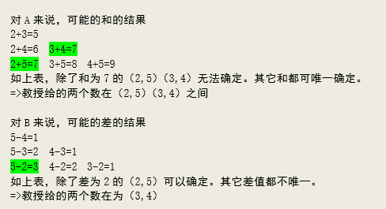
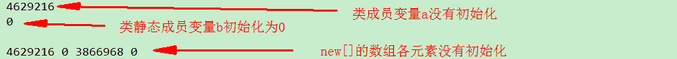
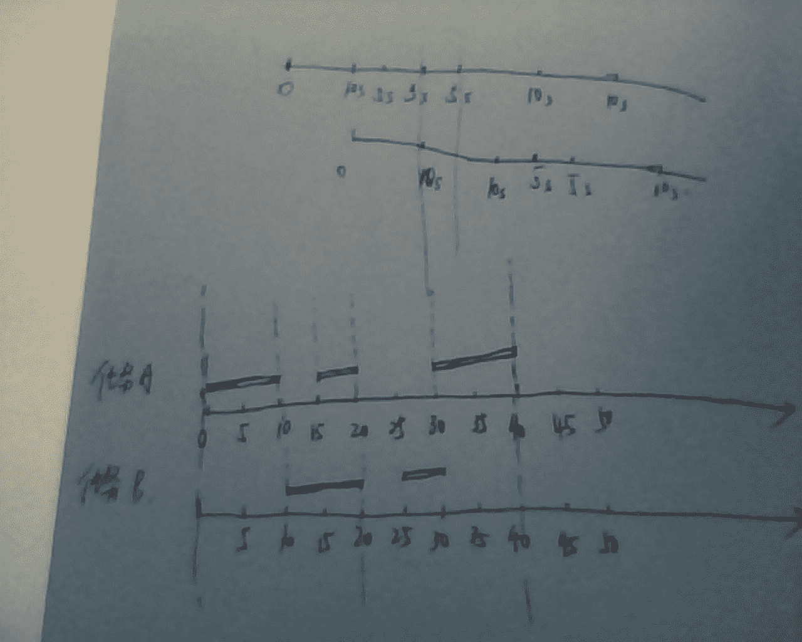
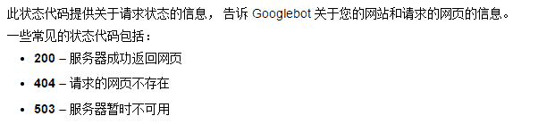
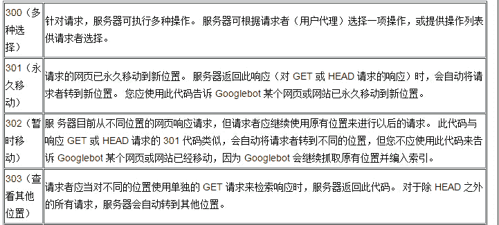
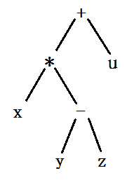

# 三百六十、公司 2015 软件测试工程师笔试题

## 1

优异虚拟存储系统，若进程在内存中占 3 页（开始时内存为空），若采用先进先出（FIFO）页面淘汰算法，当执行以下访问页号序列后 1,3,4,2,1,3,5,1,2,5,4,2，会产生多少次缺页（）

正确答案: C   你的答案: 空 (错误)

```cpp
7
```

```cpp
8
```

```cpp
9
```

```cpp
10
```

本题知识点

操作系统

讨论

[罗卫平](https://www.nowcoder.com/profile/162736)

选 C 缺页定义为所有内存  查看全部)

编辑于 2015-01-31 15:08:21

* * *

[牛客-007](https://www.nowcoder.com/profile/394118)

答案：C
刚开始内存为空也算缺页。
输入：1,3,4,2,1,3,5,1,2,5,4,2 
先进先出，就是保存最近 3 个访问的记录在内存中
, , <—1     中断 1 次
,  ,1<—3    中断 1 次
, 1,3<—4     中断 1 次
1,3,4 <—2    中断 1 次
3,4,2 <—1    中断 1 次
4,2 ,1<—3    中断 1 次
2,1,3<—5     中断 1 次
1,3,5<—1     命中，不中断  
3,5,1 <—2     中断 1 次
5,1,2<—5    命中，不中断
1,2,5 <—4    中断 1 次
2,5,4 <—2    命中，不中断
5,4,2
累计中断 9 次

发表于 2015-01-28 11:48:55

* * *

[CLAN](https://www.nowcoder.com/profile/683397)

内存里边存三个，每次出来一个，每次比较下一个是不是在内存中，在则命中，不在则缺页。

发表于 2015-07-28 15:48:10

* * *

## 2

假设用户今天是否使用 360 搜索与前一日用户是否使用 360 搜索有关，用户今日使用 360 搜索，则明日使用的概率为 0.8；今日不使用，则明日使用的概率为 0.5；那么用户如果周二使用了 360 搜索，则周四继续使用的概率为：

正确答案: C   你的答案: 空 (错误)

```cpp
0.5
```

```cpp
0.64
```

```cpp
0.74
```

```cpp
0.82
```

本题知识点

概率统计 *概率论与数理统计* *讨论

[scanf～～～～](https://www.nowcoder.com/profile/488307)

因为周二已经使用了，所以　周三　可能使用，也可能不使用。若周三使用，其概率 是 **0.8** **,** 则周四使用的概率是 0.8, 　　0.8*0.8 = 0.64 若周三不使用, 其概率是 0.2, 则周四使用概率是 0.2 * 0.5 = 0.1 所以加起来是　0.74

发表于 2015-08-08 13:34:06

* * *

[pmby](https://www.nowcoder.com/profile/615191)

这道题可以接着推广一下，就和阿里的一道题类似了：第一天是 1，第十万天使用的概率是多少？可以看到 T(n)=0.5+0.3*T(n-1)，之后用递推公式求解……阿里的那道题把我坑了，果然这种题还是得找规律，总一个个计算，还是容易悲剧呀 ToT

发表于 2015-08-26 15:20:46

* * *

[AndyJee](https://www.nowcoder.com/profile/350358)

P(use_4|use_2)=P(use_4|use_3)*P(use_3|use_2)+P(use_4|notuse_3)|P(notuse_3|use_2)=0.8*08+0.5*0.2=0.74

发表于 2015-08-09 09:34:05

* * *

## 3

下面代码会输出什么

```cpp
int main(int argc,char**argv){
    int a[4]={1,2,3,4};
    int*ptr=(int*)(&a+1);
    printf(“%d”,*(ptr-1));
}
```

正确答案: D   你的答案: 空 (错误)

```cpp
1
```

```cpp
2
```

```cpp
3
```

```cpp
4
```

本题知识点

C++

讨论

[watermaker](https://www.nowcoder.com/profile/359326)

D 指针的实质为：地址+  查看全部)

编辑于 2015-12-21 11:28:20

* * *

[ゞ仰琞ヨ☉°](https://www.nowcoder.com/profile/378179)

a 的类型是 int *&a 的类型是 int **&a+1,移动四个位置，指向了 4 的下一个位置，ptr 也指向 4 的下一个位置，ptr 是 int *，ptr-1 移动一个位置，指向了 4

发表于 2015-08-07 20:46:54

* * *

[huixieqingchun](https://www.nowcoder.com/profile/551201)

**&a+1=a+sizeof(a);****a+1=a+sizeof(a[0])**

发表于 2016-05-24 18:36:13

* * *

## 4

若某线性表最常用得操作是存取任一指定序号的元素和在最后进行插入和删除运算，则利用哪种存储方式最节省时间？

正确答案: A   你的答案: 空 (错误)

```cpp
顺序表
```

```cpp
双链表
```

```cpp
带头结点的双循环链表
```

```cpp
单循环链表
```

本题知识点

数组 链表 *讨论

[星陨无痕](https://www.nowcoder.com/profile/436939)

线性表最常用得操作是存取任一指定序号的元素和在最后进行插入和删除运算；进行任意位置存取，这个最省时省力的就是数组了，也就是顺序表。而且元素是在最后的位置进行插入和删除运算，也就不涉及其他元素进行位移的额外操作，最多涉及的就是去扩展空间了。所以答案选择 A 顺序表

发表于 2015-09-30 16:46:23

* * *

[炫](https://www.nowcoder.com/profile/376795)

简直就是在说**数组**

发表于 2016-06-20 19:20:05

* * *

[onehuang](https://www.nowcoder.com/profile/682849)

存取，应该包括插入吧！这样的话顺序表慢了

发表于 2015-09-17 02:00:19

* * *

## 5

假设寄存器为 8 位，用补码形式存储机器数，包括一位符号位，那么十进制数-25 在寄存器表示为：

正确答案: D   你的答案: 空 (错误)

```cpp
67H
```

```cpp
99H
```

```cpp
E6H
```

```cpp
E7H
```

本题知识点

编译和体系结构

讨论

[快乐一生](https://www.nowcoder.com/profile/300051)

正数的原码，反码和补码相同，负数的补码是符号位是 1，其他位取反，最后加 1，-25 的原码是 1001 1001，取反之后是（符号位不变）1110 0110，末位加 1 则为 1110 0111，即 E7H

发表于 2015-08-09 09:42:45

* * *

[Nearby36](https://www.nowcoder.com/profile/566141)

之前一直对原码 补码 反码这些没搞清楚，通过这道题又搜了相关内容，总算会算还大概了解了其他的扩展理解。。原码：符号位+真值，第一位是符号位，0 为正，1 为负，后面的位是真值，也就是数的绝对值。            8 位二进制的+1 原码表示为 0000 0001            8 位二进制的-1 原码表示为 1000 0001
反码：正数反码为原码本身，负数反码为 符号位 + 后面位取反            +1 反码 0000 0001
            -1 反码 1111 1110
补码：正数补码为原码本身，负数补码为 符号位 + 后面位取反 再加 1，即反码加 1            +1 补码 0000 0001
            -1 补码 1111 1111
更多还可看这篇好文 http://www.cnblogs.com/zhangziqiu/archive/2011/03/30/computercode.html

发表于 2015-08-21 10:00:33

* * *

[Dishuai](https://www.nowcoder.com/profile/276064303)

1）正数的原码与补码相同，符号位为 0；2）负数：符号位为 1；补码形式：符号位不变，原码其他位取反，然后最后位+13）-25 的原码为：1001 1001 -25 的补码为：1110 0110+1=1110 0111=》E7H(4 对 1，转为 16 进制）

发表于 2021-03-01 10:02:59

* * *

## 6

32 位处理器的最大虚拟地址空间为

正确答案: B   你的答案: 空 (错误)

```cpp
2GB
```

```cpp
4GB
```

```cpp
8GB
```

```cpp
16GB
```

本题知识点

编译和体系结构

讨论

[watermaker](https://www.nowcoder.com/profile/359326)

2²* 2¹⁰ * 2¹⁰ * 2¹⁰ Byte = 4GB

发表于 2015-08-09 11:47:19

* * *

[一剑风徽](https://www.nowcoder.com/profile/2536555)

2³²bit=4G,所以 32 位系统最高只支持 4G 内存

发表于 2018-08-31 21:42:19

* * *

[牛客 410645 号](https://www.nowcoder.com/profile/410645)

1G=2¹⁰M 1M=2¹⁰KB 1KB=2¹⁰B 32 位=2³²B

发表于 2016-02-28 22:06:31

* * *

## 7

4  2  12  28  80  (  )

正确答案: C   你的答案: 空 (错误)

```cpp
124
```

```cpp
96
```

```cpp
216
```

```cpp
348
```

本题知识点

智力题

讨论

[这名字有人用吗](https://www.nowcoder.com/profile/659658)

选择 C12 = （2+4） * 2；28 = （12 + 2 ） * 2；80 = （ 28 + 12 ） * 2；下一个数 = （80 + 28 ) * 2 = 216;

发表于 2015-08-07 16:23:16

* * *

[火盒儿](https://www.nowcoder.com/profile/285158)

虽然我蒙对了，但感觉自己智力有点不足了

发表于 2017-08-31 12:16:21

* * *

[菩提旭光](https://www.nowcoder.com/profile/837579)

4  2  12  28  80  (  )1.约分： 2 1 6 14 40  因为有公约数 2\. 因为不是递增或递减

发表于 2015-08-12 22:38:21

* * *

## 8

在因特网中，下列哪个不是 IP 层所需解决的问题

正确答案: A   你的答案: 空 (错误)

```cpp
流量控制
```

```cpp
路径选择
```

```cpp
寻址
```

```cpp
分段和重新组装
```

本题知识点

网络基础

讨论

[丹江君兰](https://www.nowcoder.com/profile/770970)

数据链路层层：差错控制网络层：网络互连、路由选择、拥塞控制，通过寻址建立节点间连接（网络层协议能补偿数据发送、传输以及接收的设备能力的不平衡性。分段和重组是指当数据从一个能处理较大数据单元的网络段传送到仅能处理较小数据单元的网络段时，网络层对数据包进行分段和重组，减小数据单元的大小）

传输层：流量控制

发表于 2015-08-10 17:33:44

* * *

[这名字有人用吗](https://www.nowcoder.com/profile/659658)

选 A 流量控制由 TCP 负责。

发表于 2015-08-07 16:23:56

* * *

[Forever@Love](https://www.nowcoder.com/profile/301233)

IP 不提供可靠的传输服务，它不提供端到端的或（路由）结点到（路由）结点的确认，对数据没有差错控制，它只使用报头的校验码，它不提供重发和流量控制。

发表于 2015-08-28 11:00:13

* * *

## 9

在多级存储体系中，“cache——主存”结构的作用是解决什么问题

正确答案: D   你的答案: 空 (错误)

```cpp
主存容量不足
```

```cpp
主存与辅存速度不匹配
```

```cpp
辅存与 CPU 速度不匹配
```

```cpp
主存与 CPU 速度不匹配
```

本题知识点

编译和体系结构

讨论

[watermaker](https://www.nowcoder.com/profile/359326)

 “***-主存”指 在 CPU 和主存之间增加一级速度快、但容量较小且每位价格较高的高速缓冲存储 Cache)。借助于辅助软硬件，它与主存构成一个有机的整体，以弥补主存速度的不足。这个层次的工作主要由硬件实现。
“主存-辅存”层次的目的是为了弥补主存容量的不足。它是在主存外面增加一个容量更大、每位价格更低、但速度更慢的存储器(称为辅存，一般是硬盘)。它们依靠辅助软硬件的作用，构成一个整体。“主存-辅存”层次常被用来实现虚拟存储器，向编程人员提供大量的程序空间。

发表于 2015-08-09 12:15:57

* * *

[停停走走 _123](https://www.nowcoder.com/profile/424739)

数据可以放在 CPU 上或者内存中。CPU 处理速度快，但是容量少，内存容量大，但是转交给 CPU 处理的速度慢，为此需要 Cache 缓存做一个折中

发表于 2015-08-08 12:17:34

* * *

## 10

下列关于 C/C++的宏定义的说法中，不正确的是：

正确答案: A   你的答案: 空 (错误)

```cpp
宏定义的常量更容易理解，如果可以使用宏定义常量的话，要避免使用 const 常量
```

```cpp
宏的嵌套定义过多会影响程序的可读性，而且很容易出错
```

```cpp
相对于函数调用，宏定义可以提高程序的运行效率
```

```cpp
宏定义不检查参数正确性，这样会有安全隐患
```

本题知识点

C++ C 语言

讨论

[dirty-life](https://www.nowcoder.com/profile/554890)

A 宏定义由预编译器来  查看全部)

编辑于 2016-11-06 10:29:31

* * *

[大海真大](https://www.nowcoder.com/profile/732046)

根据 effective C++ 中条款 03 中，尽可能使用 Const ，将某些东西声明为 const 可帮助编译器侦测出错误方法，const 可以被施加于任何作用于内的对象，函数参数，函数返回类型，成员函数本体。另外：宏定义的常量是在预处理阶段展开，const 常量是在编译运行阶段使用宏定义的常量没有类型，不做任何类型检查;const 常量是有具体类型的，在编译运行阶段会做类型检查.为了代码健壮性起见，还是尽量使用 const,故 A 是错的

编辑于 2016-10-29 15:36:58

* * *

[L.K.](https://www.nowcoder.com/profile/217196)

宏定义没有进行语法检查，单纯地在编译的时候进行替换，很容易出错。

发表于 2015-08-12 11:38:17

* * *

## 11

以下哪种介质访问控制机制不能完全避免冲突：

正确答案: D   你的答案: 空 (错误)

```cpp
令牌环
```

```cpp
TDMA
```

```cpp
FDDI
```

```cpp
CSMA/CD
```

本题知识点

网络基础

讨论

[奋进](https://www.nowcoder.com/profile/606735)

[局域网](http://baike.baidu.com/view/788.htm)中目前广泛采用的两种[介质访问控制方法](http://baike.baidu.com/view/4043055.htm)，分别是：1 争用型介质访问控制，又称随机型的介质访问控制协议，如 CSMA/CD 方式。2 确定型介质访问控制，又称有序的访问控制协议，如 Token(令牌）方式 CSMA/CD 可以发现冲突，但是没有先知的冲突检测和阻止功能。

发表于 2015-08-20 22:34:53

* * *

[willys](https://www.nowcoder.com/profile/467888)

CSMA/CD 并不能完全避免冲突，只是发生冲突之后，会检测到冲突的存在，于是在一定时间之后再继续冲突检测，再次发送！

发表于 2015-08-08 22:49:08

* * *

[fqbrighter](https://www.nowcoder.com/profile/313072)

FDDI 协议基于 [令牌环](http://baike.baidu.com/view/54261.htm) 协议  TDMA 时分多址

发表于 2016-04-02 12:02:59

* * *

## 12

以下函数用法正确的个数是：

```cpp
void test1(){
    unsigned char array[MAX_CHAR+1],i;
    for(i = 0;i <= MAX_CHAR;i++){
        array[i] = i;
    }
}
char*test2(){
    char p[] = "hello world";
    return p;
}
char *p = test2();
void test3(){
    char str[10];
    str++;
    *str = '0';
}
```

正确答案: A   你的答案: 空 (错误)

```cpp
0
```

```cpp
1
```

```cpp
2
```

```cpp
3
```

本题知识点

C++ C 语言

讨论

[wuiiao233](https://www.nowcoder.com/profile/788072)

第一个问题：重点不在于  查看全部)

编辑于 2016-02-18 16:09:01

* * *

[湾仔秋秋糖](https://www.nowcoder.com/profile/797549)

    char  str[10];    str++;是错误的。因为这里的 str 是一个常量指针，不能进行左值操作。【但是可以使用 sizeof】对比 char* str1 = "hello";    char  str2[] = "hello";str1 是指向首元素的指针，可以修改；str2 是一个指向数组的常量指针；

编辑于 2015-08-11 12:03:02

* * *

[字节跳动内推小天才](https://www.nowcoder.com/profile/3859185)

贴一个百度知道的回答，我觉得讲的还不错。[`zhidao.baidu.com/question/514194472.html`](https://zhidao.baidu.com/question/514194472.html)

c 语言 char *str 与 char str[] 这俩种定义字符串到底有什么区别

```cpp
楼上说的都有道理，但是没解释出本质区别。
区别就在于两个定义中 str 的类型不同。

第一个，在
char * str;
中，明显 str 的类型是 char*。这没什么特殊的，只是一个简单的 char 指针。

第二个，char str[];是不能这样定义的，所以假定用
char str[6] = "abcde";
那么这里 str 的类型是 char[6]（6 个，不是 5 个，因为最后有个 0） ，而这种定义语句也是定义一个 char[6]类型的唯一方法。char[6]是什么意思呢？他不是 char*，也不是 char* const （以下讨论这个），而是一个特殊的类。这个类的大小是 6 字节(比如 sizeof(str)返回 6)，它可以用[ ]来返回一个 char&（比如 str[3]的类型是 char&)，但是自身不能直接被修改，比如 str ="abcde";就不可以。

我刚才说 char[6]很像 char* const。这是因为，假如有
char* const str2 = "abcde";
那么 str 和 str 基本有同样的行为，比如 str2[3]也是一个 char&，而且 str2 = "abcde"也不可以用，但是 char* const 和 char[6]有本质的不同。前者只是一个指针。什么意思呢，就是 str2 的值是"abcde"的地址（而"abcde"被存在其他的地方），而 str 的内存值直接就是 6 个字节，"abcde"。所以两者还是截然不同的类型。比如，sizeof(str2)是 4（32 位操作系统）或 8（64 位），而 sizeof(str)是 6\.  

char[6]可以被直接转换为 char*。转换的时候，得到的结果是一个指向第一个元素的指针。反过来，char*也可以转换为 char[6]，转换的结果是一个变量指向 char*所指向的那个内存区域。

楼上说的 str++可以在 char* str 时用而不能在 char str[6]时用，这是因为数组类型 char[6]不能用作一个左值。

楼上还有说 char * str 可以指向任何字符串常量。这个是无必要的。char *可以指向任何内存区域，不一定必须是字符串常量。当然，如果指向一个无效内存，用的时候会出问题。

另外楼上说一个"Hello World!"放在常量储存区，一个"Hello World!"放在线程堆栈区，这也是不对的。事实上，无论如何，"Hello World!"本身都在常量储存区。而：
char *str = "Hello World!";
会在堆栈上储存一个 4 个字节（假定 32 位系统）的指针指向储存"Hello World!"的区域。
而
char str[] = "Hello World!";
会首先在堆栈上先分配一个 13 字节的 char 数组，然后把常量储存区的那个"Hello World!"复制过来。
```

发表于 2018-07-05 12:34:02

* * *

## 13

如下代码输出结果是什么？

```cpp
#include <stdio.h>
char buffer[6] = {0};
char *mystring() {
    char *s = "Hello world";
    for (int i = 0; i < (sizeof(buffer) - 1); i++) {
        buffer[i] = *(s + i);
    }
    return buffer;
}
int main(int args, char **argv) {
    printf("%s\n", mystring());
    return 0;
}

```

正确答案: A   你的答案: 空 (错误)

```cpp
Hello
```

```cpp
Hello World!
```

```cpp
Hell
```

```cpp
以上全都不正确
```

本题知识点

C 语言

讨论

[高山羊](https://www.nowcoder.com/profile/346359)

```cpp
0 == '\0'
```

发表于 2016-08-19 16:30:01

* * *

[欧阳](https://www.nowcoder.com/profile/1620)

1、首先 buffer 是全局的并且数组每个元素初始化为 02、buffer 的前 5 个元素分别为 h e l l o，但因为之前第六个元素为 0，所有也算以'\0'结尾的字符串

发表于 2015-08-29 21:29:51

* * *

[starnight_cyber](https://www.nowcoder.com/profile/184125)

A:Hello
拷贝字符串 s 前五个字符到字符数组 buffer 中，输出结果是"Hello"

| buffer（拷贝前）  | '\0'  | '\0'  | '\0'  | '\0'  | '\0'  | '\0'  |
| buffer（拷贝后）  | 'H'  | 'e'  | 'l'  | ‘l’  | 'o'  | '\0'  |

发表于 2016-08-19 14:58:45

* * *

## 14

请问下面的程序最后会产生多少个进程：

```cpp
#include<stdio.h>
#include<unistd.h>
Int main(　）
{
    int i;
    for(i = 0; i<5;i++){
        int pid = fork();
        if(pid == 0){
            //do something
        } else {
            //do something
        }
    }
// do somthing,sleep
return 0;
}
```

正确答案: D   你的答案: 空 (错误)

```cpp
5
```

```cpp
10
```

```cpp
15
```

```cpp
32
```

本题知识点

Linux

讨论

[Ccola](https://www.nowcoder.com/profile/825067)

i = 0 时，生成两个进程 i = 1 时，两个进程各生成两个进程 i = 2 时，4 个进程各生成两个进程 i = 3 时，8 个进程各生成两个进程 i = 4 时，16 个进程各生成两个进程，总共 32 个

发表于 2016-07-26 15:49:59

* * *

[L.K.](https://www.nowcoder.com/profile/217196)

2⁵=32。每一个 fork()出来的新进程，和父进程使用相同的代码段，复制父进程的数据段和堆栈段，不过有“逻辑”复制和“物理”复制之分，在本题没有影响。也就是说每一个 fork()出的新进程和父进程有相同大小的 i，并且执行位置也是一样的。

发表于 2015-08-12 12:25:59

* * *

[指上弹兵赵小括](https://www.nowcoder.com/profile/940062)

i=4 fork 生成 f(4) = 1+2*0 = 1i=3 fork 生成 f(3) = 1+2*f(4) = 1+2=3i=2 fork 生成 f(2) = 1+2*f(3) = 1+6=7i=1 fork 生成 f(1) = 1+2*f(2) = 1+14=15i=0 fork 生成 f(0) = 1+2*f(1) = 1+30=31 再加上 main=32 当然根据规律也可以得出总的进程个数 2⁵

编辑于 2015-08-21 10:48:28

* * *

## 15

教授选出两个从２到５的数字（假设第一个数字比第二个大），分别把它们的和告诉学生Ａ，把它们的差告诉学生Ｂ。结果学生Ａ和Ｂ都无法正确推导出数字是多少。又假设学生Ａ和Ｂ的结论是正确的，则这两个数字是：

正确答案: A   你的答案: 空 (错误)

```cpp
４和３
```

```cpp
５和２
```

```cpp
４和 2
```

```cpp
3 和 2
```

本题知识点

判断推理

讨论

[Erya_ 尔雅](https://www.nowcoder.com/profile/412110)



发表于 2016-10-18 09:27:06

* * *

[慢乌龟](https://www.nowcoder.com/profile/6633822)

其实题目有点问题，就算是 34 两个数，B 知道差为 1，那么就是 23，34，45 三种情况，可是知道和的 A 没有给出答案，不就说明只有 34 了么？关键在于 AB 是否知道对方得到的和自己的信息不一样，不然反推没有什么是不知道的

发表于 2017-10-03 01:26:32

* * *

[空空以空空](https://www.nowcoder.com/profile/479441)

我没整明白题意。。。我以为 A 会把和告诉 B 一起算。。。。

发表于 2017-03-24 11:22:36

* * *

## 16

由权值为 3,6,7,2,5,1 的叶子结点生成一棵哈夫曼树，它的带权路径长度为：

正确答案: A   你的答案: 空 (错误)

```cpp
57
```

```cpp
72
```

```cpp
61
```

```cpp
48
```

本题知识点

树

讨论

[冰诺](https://www.nowcoder.com/profile/120176)

  查看全部)

编辑于 2016-05-07 15:54:55

* * *

[牛客 142721 号](https://www.nowcoder.com/profile/142721)

答案为 61 的忽略了一点，要把新合成的值放回序列，再在序列中找最小的两个数

发表于 2017-04-06 11:45:59

* * *

[大胞](https://www.nowcoder.com/profile/941212)

构造哈夫曼树步骤是，选择两个权值最小的点构造树，新树根权值为左右子树权值之和，新的权值放回到序列中，继续按照上述不走构造树，直到只有一颗树为止。 树带权路径长度 就是每个叶子结点的权值*高度之和。所以 （5+ 6+ 7）*2+3*3+（1+2）*4=57

发表于 2015-08-09 19:47:16

* * *

## 17

TCP 建立连接的过程采用三次握手，已知第三次握手报文的发送序列号为 1000，确认序列号为 2000，请问第二次握手报文的发送序列号和确认序列号分别为

正确答案: B   你的答案: 空 (错误)

```cpp
1999，999
```

```cpp
1999，1000
```

```cpp
999，2000
```

```cpp
999，1999
```

本题知识点

网络基础

讨论

[smartleon](https://www.nowcoder.com/profile/485266)

一般是客户端先向服务器发送  查看全部)

编辑于 2016-05-01 11:33:13

* * *

[山高太太](https://www.nowcoder.com/profile/949090)

                                  发送                  确认第一次：SYN=1       SEQ=X               ACK=0（客）第二次：SYN=1       SEQ=Y              ACK=X+1（服）第三次：                  SEQ=X+1          ACK=Y+1（客）SYN 同步位

发表于 2015-08-18 11:19:56

* * *

[Top_bo](https://www.nowcoder.com/profile/185506)

**这题选择 B**

从一篇博客上看的 TCP 三次握手的解析分享给大家：

在 TCP/IP 协议中，TCP 协议提供可靠的连接服务，采用三次握手建立一个连接。第一次握手：建立连接时，客户端发送 syn 包(syn=j)到服务器，并进入 SYN_SEND 状态，等待服务器确认；
第二次握手：服务器收到 syn 包，必须确认客户的 SYN（ack=j+1），同时自己也发送一个 SYN 包（syn=k），即 SYN+ACK 包，此时服务器 进入 SYN_RECV 状态； 第三次握手：客户端收到服务器的 SYN＋ACK 包，向服务器发送确认包 ACK(ack=k+1)，此包发送完毕，客户端和服务器进入 ESTABLISHED 状态，完成三次握手。 完成三次握手，客户端与服务器开始传送数据.

实例:

IP 192.168.1.11 敏感词 37 > 192.168.1.123.7788: S 3626544836:3626544836
IP 192.168.1.123.7788 > 192.168.1.11 敏感词 37: S 1739326486:1739326486 ack 3626544837
IP 192.168.1.11 敏感词 37 > 192.168.1.123.7788: ack 1739326487,ack 1

第一次握手：192.168.1.116 发送位码 syn＝1,随机产生 seq number=3626544836 的数据包到 192.168.1.123,192.168.1.123 由 SYN=1 知道 192.168.1.116 要求建立联机;

第二次握手：192.168.1.123 收到请求后要确认联机信息，向 192.168.1.116 发送 ack number=3626544837,syn=1,ack=1,随机产生 seq=1739326486 的包;

第三次握手：192.168.1.116 收到后检查 ack number 是否正确，即第一次发送的 seq number+1,以及位码 ack 是否为 1，若正确，192.168.1.116 会再发送 ack number=1739326487,ack=1，192.168.1.123 收到后确认 seq=seq+1,ack=1 则连接建立成功。

即：第三次发送的**序列号**是第二次发的**确认号**，第三次发送的**确认号**是第二次发送**序列号+1**；

编辑于 2015-08-16 22:43:20

* * *

## 18

一个 n 个顶点的连通无向图，其边的个数至少为：

正确答案: A   你的答案: 空 (错误)

```cpp
n-1
```

```cpp
n
```

```cpp
n+1
```

```cpp
nlogn
```

本题知识点

图

讨论

[牛在牛客](https://www.nowcoder.com/profile/507632)

对图中任意顶点 u,v,都存在路径使 u、v 连通。由于是无向图故为 n-1，若是有向图为 n

发表于 2015-08-20 12:43:25

* * *

[豆敏敏 ing](https://www.nowcoder.com/profile/242464)

最小生成树

发表于 2016-04-29 12:46:25

* * *

[exat](https://www.nowcoder.com/profile/729033)

中间一个点，和剩下 n-1 个点相连，这样就是 n-1 条边了

发表于 2015-08-11 15:47:11

* * *

## 19

下面哪种 C/C++ 分配内存的方法会将分配的空间初始化为 0

正确答案: B   你的答案: 空 (错误)

```cpp
malloc()
```

```cpp
calloc()
```

```cpp
realloc()
```

```cpp
new[ ]
```

本题知识点

C++ C 语言

讨论

[Coder_ZF](https://www.nowcoder.com/profile/221101)

1) malloc 函数： void *malloc(unsigned int size)

     在内存的动态分配区域中分配一个长度为 size 的连续空间，如果分配成功，则返回所分配内存空间的首地址，否则返回 NULL，申请的内存不会进行初始化。

2）calloc 函数： void *calloc(unsigned int num, unsigned int size)

     按照所给的数据个数和数据类型所占字节数，分配一个 num * size 连续的空间。

    calloc 申请内存空间后，会自动初始化内存空间为 0，但是 malloc 不会进行初始化，其内存空间存储的是一些随机数据。 3）realloc 函数： void *realloc(void *ptr, unsigned int size)

    动态分配一个长度为 size 的内存空间，并把内存空间的首地址赋值给 ptr，把 ptr 内存空间调整为 size。

申请的内存空间不会进行初始化。 4）new 是动态分配内存的运算符，自动计算需要分配的空间，在分配类类型的内存空间时，同时调用类的构造函数，对内存空间进行初始化，即完成类的初始化工作。动态分配内置类型是否自动初始化取决于变量定义的位置，在函数体外定义的变量都初始化为 0，在函数体内定义的内置类型变量都不进行初始化。

发表于 2015-08-08 15:47:25

* * *

[已注销](https://www.nowcoder.com/profile/2862122)

这里仅针对 new[]说明一下。#include <iostream>#include <cstring>using  namespace std;class A {public:    int a;    static  int b;};int A::b;int main(int argc ,char* argv[]){    A *test = new A;    cout << test->a << endl << test->b << endl<< endl;    int *a = new int[4];    for (int i = 0; i < 4; ++i)        cout << *a++ << ' ';    return 0;}我们看看输出：选项 D，是 new 数组的形式。但是， **new[]（new 的数组版）要求元素对象的类型必须具有默认构造函数（内建类型的“默认构造函数”是什么也不做），否则将不能使用 new[]。**不过，C++11 中已经不提倡用 c array。更多的是用 vector 代替

编辑于 2016-08-26 16:47:30

* * *

[hhhdccc](https://www.nowcoder.com/profile/147533862)

malloc（）函数只是申请了连续的空间，但 calloc（）函数还将其初始化为 0

发表于 2018-11-21 08:01:19

* * *

## 20

29 只青蛙 29 分钟能抓 29 只蚊子。87 只青蛙抓 87 只蚊子需要多长时间?

正确答案: B   你的答案: 空 (错误)

```cpp
87
```

```cpp
29
```

```cpp
116
```

```cpp
58
```

本题知识点

数学运算

讨论

[smartleon](https://www.nowcoder.com/profile/485266)

87 只青蛙被分成 3 组，每组 29 只；87 只蚊子被分成 3 组，每组 29 只；每组青蛙 29 分钟吃 29 只蚊子；3 组青蛙 29 分钟吃了 87 只蚊子。故答案：29 分钟

发表于 2015-08-10 16:41:39

* * *

[Haobelief](https://www.nowcoder.com/profile/942488)

29 只青蛙 29 分钟抓 29 只蚊子。所以，1 只青蛙 29 分钟抓 1 只蚊子。所以，89 只青蛙 29 蚊子抓 87 只蚊子。

发表于 2015-08-11 09:56:23

* * *

[★☆](https://www.nowcoder.com/profile/470551)

蒸一个包子需要 10 分钟的时间，蒸 5 个包子需要多长时间？

发表于 2016-07-26 12:07:51

* * *

## 21

下面说法哪个正确的：

正确答案: D   你的答案: 空 (错误)

```cpp
各个线程拥有相同的堆栈
```

```cpp
i++是线程安全的，不需要同步
```

```cpp
x=y 是线程安全的，不需要同步
```

```cpp
对进程来说，其虚拟内存的大小不受物理内存大小的限制
```

本题知识点

编译和体系结构 Linux

讨论

[Coder_ZF](https://www.nowcoder.com/profile/221101)

D
线程有自己的栈，但没有堆所以 A 错。普通整数的一般赋值、增量和减量语句会产生多条机器指令，操作均不具有原子性，需要同步，BC 错。虚拟存储器具有请求调入和置换功能，所以虚拟内存的大小不受物理内存大小的限制。D 对

发表于 2015-08-08 16:01:10

* * *

[L.K.](https://www.nowcoder.com/profile/217196)

**D。**进程的虚拟内存大小并不受物理内存大小的限制，例 32 位处理器虚拟内存空间可能是 4G，但物理内存实际是小于 4G 的，部分地址空间分配给了 ROM、外设等。A，各个线程有自己的堆和栈，并不相同。B，i++操作不一定是原子性操作，CPU 在执行时可能需要几条指令才能完成，包括读内存内容到寄存器，操作寄存器，从寄存器写回内存。C，同 B。

发表于 2015-08-12 14:58:53

* * *

[FightingY](https://www.nowcoder.com/profile/679411)

A 每个线程都有自己的栈 然后共同访问同一个堆 BC 整数操作会产生多条机器指令 不具原子性

发表于 2015-09-15 16:40:20

* * *

## 22

单任务系统中两个程序 A 和 B，其中 A 程序：CPU：10s  ->  设备 1：5s -> CPU: 5s -> 设备 2:10s -> CPU：10s； B 程序：设备 1:10s -> CPU：10s -> 设备 2：5s  -> CPU: 5S -> 设备 2： 10s；执行顺序为 A ->B,那么 CPU 的利用率为（ ）

正确答案: C   你的答案: 空 (错误)

```cpp
30%
```

```cpp
40%
```

```cpp
50%
```

```cpp
60%
```

本题知识点

编译和体系结构 Linux

讨论

[Xaut_Yolanda](https://www.nowcoder.com/profile/705402)

两个任务执行完成所需要时间为  查看全部)

编辑于 2016-08-14 20:27:10

* * *

[中国城管头儿](https://www.nowcoder.com/profile/3328825)

上图为多任务系统的运行     只有在 20~25 之间 CPU 是空闲的，所以利用率就是 35/40

发表于 2017-06-02 21:34:01

* * *

[活力雪涵](https://www.nowcoder.com/profile/821649)

单任务啊，做多任务的习惯了画图，这次错了。

发表于 2015-09-12 11:34:18

* * *

## 23

下面程序会输出什么：

```cpp
#include <stdio.h>
#include <string.h>
static int a = 1;
void fun1(void) { a = 2; }
void fun2(void) { int a = 3; }
void fun3(void) { static int a = 4; }
int main() {
    printf("%d", a);
    fun1();
    printf("%d", a);
    fun2();
  printf("%d", a); 

  fun3( );

  printf("%d", a);
}
```

正确答案: B   你的答案: 空 (错误)

```cpp
1 2 3 4
```

```cpp
1 2 2 2
```

```cpp
1 2 2 4
```

```cpp
1 1 1 4
```

本题知识点

C 语言

讨论

[linko 解万](https://www.nowcoder.com/profile/225090)

首先声明了一个静态全局变量 i，首次输出我就不说了，妥妥的 1。第二次输出，访问到了早已定义的全局变量 i，并改写值，第二次为 2。第三次输出，内部定义了一个同名的变量， 它并没有返回值或者被该次执行程序以外任何程序读取 a 值，所以第三次输出仍然是 a。第四次输出，定义了一个静态的局部变量，静态局部变量在函数调用结束后仍然存在，及它的内存空间不会被释放，但其他函数是不能引用它的，所以，两个静态变量虽然同名，但是并不是一样的东西，为 2。答案是 B

发表于 2015-08-10 11:53:31

* * *

[L.K.](https://www.nowcoder.com/profile/217196)

**B。**第一个 printf 打印静态全局变量 a 的值，为 1。fun1()对全局变量 a 重新赋值为 2，因此第二个打印为 2。fun2()在函数内部重新声明了一个变量 a，然后对该变量 a 赋值，该函数的作用域是本函数，并不影响全局变量 a，因此第三个 printf 仍然为 2。fun3()在函数内部声明了一个静态变量 a，并将其赋值为 4，虽然该变量在函数执行结束后并不回收，但是其作用域仅限于本函数内部，printf 同样不时，仍然是外部的全局变量 a 的值。

发表于 2015-08-12 15:03:32

* * *

[Ctrlturtle](https://www.nowcoder.com/profile/7141476)

这点其实最关键的考点是:静态局部变量和全局变量的区别(也就是最后一次为何输出 2) 静态局部变量虽然和全局变量都存放在全局数据区，延长了生命周期，但是作用域不同！作用域不同！作用域不同！重要的事情说三遍，静态局部变量仍然是个局部变量，只对函数内可见。

发表于 2016-10-03 13:27:55

* * *

## 24

语言中哪一种形式声明了一个指向 char 类型变量的指针 p，p 的值不可修改，但 p 指向的变量值可修改？

正确答案: C   你的答案: 空 (错误)

```cpp
const char *p
```

```cpp
char const *p
```

```cpp
char*const p
```

```cpp
const char *const p
```

本题知识点

C++ C 语言

讨论

[牛客职导官方账号](https://www.nowcoder.com/profile/897353)

【正确答案】C
【解析】con  查看全部)

编辑于 2021-11-18 08:34:06

* * *

[AndyJee](https://www.nowcoder.com/profile/350358)

Cconst 出现在*左边，如 const char* p，表示 p 所指向的变量内容不可变，指针指向可以改变；const 出现在*右边，如 char* const p，表示 p 是个常量指针，即不能指向其他变量，而指向的变量内容可变；const 出现在*左边和右边，如 const char* const p，表示 p 的指向不能改变，指向的变量内容也不能改变。

编辑于 2021-11-18 08:34:06

* * *

[Andy10086](https://www.nowcoder.com/profile/467376)

**由于没有** **const *的运算，若出现 const * 的形式，则 const 实际上是修饰前面的。因此 char const*p 等价于 const char*p。**

编辑于 2015-08-10 23:24:28

* * *

## 25

解析 XML 时，需要校验节点是否闭合，如必须有与之对应，用（）数据结构实现比较好

正确答案: D   你的答案: 空 (错误)

```cpp
链表
```

```cpp
树
```

```cpp
队列
```

```cpp
栈
```

本题知识点

链表 *栈 *队列 *树*** ***讨论

[bat-pass](https://www.nowcoder.com/profile/949764)

栈的常见应用：浏览器历史纪录，Android 中的最近任务，Activity 的启动模式，CPU 中栈的实现，Word 自动保存，解析计算式，解析 xml/json

发表于 2015-08-08 15:06:51

* * *

[L.K.](https://www.nowcoder.com/profile/217196)

D。节点闭合的话，有头尾符号相对应，遇到头符号将其放入栈中，遇到尾符号时，弹出栈的内容，看是否有与之对应的头符号，栈的特性刚好符合符号匹配的就近原则。

发表于 2015-08-12 15:05:48

* * *

[能发光的黛 _Funny](https://www.nowcoder.com/profile/955330)

刚开始没懂 XML 的节点闭合是什么意思，其实应该就是{}括号成对的问题吧。用栈

发表于 2015-09-07 20:29:14

* * *

## 26

下列叙述中，正确的是（）

正确答案: D   你的答案: 空 (错误)

```cpp
线性链表中的各元素在存储空间中的位置必须是连续的
```

```cpp
线性链表中的表头元素一定存储在其他元素的前面
```

```cpp
线性链表中的各元素在存储空间中的位置不一定是连续的，但表头元素一定存储在其他元素的前面
```

```cpp
线性链表中的各元素在存储空间中的位置不一定是连续的，且各元素的存储顺序也是任意的
```

本题知识点

链表 *讨论

[watermaker](https://www.nowcoder.com/profile/359326)

线性链表只要要求逻辑上是线性的就行了，至于物理存储位置，不用关心，这是链表啊。哈哈

发表于 2015-08-09 17:25:42

* * *

[Prokias](https://www.nowcoder.com/profile/290538)

我选的 D

发表于 2015-08-07 17:38:25

* * *

[阿忠 3](https://www.nowcoder.com/profile/4440912)

线性链表只要求逻辑上的线性就可以了，至于物理上的，不要太纠结

发表于 2017-05-25 21:19:55

* * *

## 27

将一棵有 100 个结点的完全二叉树从根这一层开始，开始进行层次遍历编号，那么编号最小的叶节点的编号为（根节点为 1）

正确答案: C   你的答案: 空 (错误)

```cpp
49
```

```cpp
50
```

```cpp
51
```

```cpp
52
```

本题知识点

树

讨论

[sharpdeep](https://www.nowcoder.com/profile/271365)

C 最小编号的叶子一定是  查看全部)

编辑于 2015-12-10 13:17:04

* * *

[Xaut_Yolanda](https://www.nowcoder.com/profile/705402)

深度为 6 的满二叉树的节点数为 2⁶ - 1 = 63；深度为 7 的满二叉书的节点数为 2⁷ - 1 = 127;因此含有 100 个节点的完全二叉树的深度为 7，叶子节点分布在第 6 层和第 7 层。第七层叶子节点数为：100 - 63 = 37；37 / 2 = 18 余 1；因此，第 6 层的前 18 个节点是 2 度节点，第 19 个节点是 1 度节点即只有左子树，没有右子树，即第 6 层前 19 个节点为非叶子节点，之后为叶子节点。因此编号最小的叶子节点编号为：2 ⁵ - 1 + 19 + 1 = 51\.其中，2⁵ - 1 位前 5 层非叶子节点数（由满二叉树的节点计算公式得出）。

发表于 2015-08-22 12:09:17

* * *

[fanying598](https://www.nowcoder.com/profile/539318)

完全二叉树中，对于编号为 i 的父结点，左孩子编号为 2*i'，右孩子编号为 2*i+1；编号为 100 的节点对应的父节点编号为 50，故最小叶子节点编号为 51

发表于 2015-08-09 21:18:29

* * *

## 28

关于“深拷贝”，下列说法正确的是：

正确答案: A   你的答案: 空 (错误)

```cpp
会拷贝动态分配的成员对象
```

```cpp
会拷贝成员数据的值
```

```cpp
会拷贝静态分配的成员对象
```

```cpp
B 和 C 都对
```

本题知识点

C++

讨论

[MonsieurWilson](https://www.nowcoder.com/profile/275180)

选 A。B 和 C 都算错在了  查看全部)

编辑于 2016-01-13 12:30:08

* * *

[hustcoder](https://www.nowcoder.com/profile/787087)

深拷贝是指源对象与拷贝对象互相独立，其中任何一个对象的改动都不会对另外一个对象造成影响。浅拷贝是指源对象与拷贝对象共用一份实体，仅仅是引用的变量不同（名称不同）。对其中任何一个对象的改动都会影响另外一个对象。

发表于 2015-08-11 11:06:20

* * *

[Rachy](https://www.nowcoder.com/profile/9395030)

拷贝分为浅拷贝和深拷贝。浅拷贝只是建立原来对象的引用，并不拷贝数据；深拷贝是新建一个对象，把原来对象的数据复制过来。但是有一点要注意，对含有静态成员数据的对象，静态成员属于类，被所有对象共享，所以深拷贝也不会拷贝这一份数据。只会拷贝非静态成员数据。

发表于 2017-03-22 22:34:52

* * *

## 29

HTTP 协议中，如果要告知所请求的网页已经永久跳转到了另一个地址，应该返回哪个状态码：

正确答案: A   你的答案: 空 (错误)

```cpp
301
```

```cpp
302
```

```cpp
404
```

```cpp
503
```

本题知识点

网络基础

讨论

[湾仔秋秋糖](https://www.nowcoder.com/profile/797549)

A~1xx（临时响应）2xx（成功）3xx（已重定向）    301 永久重定向    302 临时重定向 4xx（请求错误）    404 找不到网页    403 已禁止    401 未授权    400 请求失败；服务器不理解请求语法

发表于 2015-08-11 14:42:46

* * *

[筱沫](https://www.nowcoder.com/profile/534963)

答案选 A：301 

发表于 2015-08-07 19:26:12

* * *

[seekerjie](https://www.nowcoder.com/profile/272412)

302：临时转移 404：找不到资源 503：服务器目前不能为请求提供服务

发表于 2015-08-14 09:52:24

* * *

## 30

在 Linux 系统中，在运行一个程序时，程序中未初始化的全局变量会被加载到以下哪个内存段中?

正确答案: A   你的答案: 空 (错误)

```cpp
BSS
```

```cpp
TEXT
```

```cpp
DATA
```

```cpp
STACK
```

本题知识点

Linux

讨论

[weikai](https://www.nowcoder.com/profile/658104)

  查看全部)

编辑于 2016-10-21 10:45:02

* * *

[jokie](https://www.nowcoder.com/profile/868434)

BSS（Block Started by Symbol）通常是指用来存放程序中未初始化的全局变量和静态变量的一块内存区域。特点是:可读写的，在程序执行之前 BSS 段会自动清 0。所以，未初始的全局变量在程序执行之前已经成 0 了。

数据段：数据段（data segment）通常是指用来存放程序中已初始化的全局变量的一块内存区域。数据段属于静态内存分配。

代码段：代码段（code segment/text segment）通常是指用来存放程序执行代码的一块内存区域。这部分区域的大小在程序运行前就已经确定，并且内存区域通常属于只读, 某些架构也允许代码段为可写，即允许修改程序。在代码段中，也有可能包含一些只读的常数变量，例如字符串常量等。

堆（heap）：堆是用于存放进程运行中被动态分配的内存段，它的大小并不固定，可动态扩张或缩减。当进程调用 malloc 等函数分配内存时，新分配的内存就被动态添加到堆上（堆被扩张）；当利用 free 等函数释放内存时，被释放的内存从堆中被剔除（堆被缩减）

栈(stack)：栈又称堆栈， 是用户存放程序临时创建的局部变量，也就是说我们函数括弧“{}”中定义的变量（但不包括 static 声明的变量，static 意味着在数据段中存放变量）。除此以外，在函数被调用时，其参数也会被压入发起调用的进程栈中，并且待到调用结束后，函数的返回值也会被存放回栈中。由于栈的先进先出特点，所以栈特别方便用来保存/恢复调用现场。从这个意义上讲，我们可以把堆栈看成一个寄存、交换临时数据的内存区

发表于 2015-11-23 23:14:52

* * *

[quiet2015](https://www.nowcoder.com/profile/685652)

全局的未初始化变量存在于.bss 段中，具体体现为一个占位符；全局的已初始化变量存于.data 段中；而函数内的自动变量都在栈上分配空间。.bss 是不占用.exe 文件空间的，其内容由操作系统初始化（清零）；而.data 却需要占用，其内容由程序初始化，因此造成了上述情况。

bss 段（未手动初始化的数据）并不给该段的数据分配空间，只是记录数据所需空间的大小。
data（已手动初始化的数据）段则为数据分配空间，数据保存在目标文件中。 数据段包含经过初始化的全局变量以及它们的值。BSS 段的大小从可执行文件中得到 ，然后链接器得到这个大小的内存块，紧跟在数据段后面。当这个内存区进入程序的地址空间后全部清零。包含数据段和 BSS 段的整个区段此时通常称为数据区。

发表于 2015-10-03 11:12:42

* * *

## 31

同一进程下的多个线程可以共享哪一种资源：

正确答案: B   你的答案: 空 (错误)

```cpp
stack
```

```cpp
data section
```

```cpp
register set
```

```cpp
thread ID
```

本题知识点

操作系统

讨论

[wangtingkui](https://www.nowcoder.com/profile/659634)

  线程共享的内容包括：

1.  进程 代码段
2.  进程 数据段
3.  进程打开的文件描述符、
4.  信号的处理器、
5.  进程的当前目录和
6.  进程用户 ID 与进程组 ID    

      线程独有的内容包括：

1.  线程 ID
2.  寄存器组的值
3.  线程的堆栈
4.  错误返回码
5.  线程的信号屏蔽码

发表于 2015-08-07 21:50:59

* * *

[L.K.](https://www.nowcoder.com/profile/217196)

选 B。同一个进程中的线程是共享数据段的，进程是操作系统分配资源的单位，而线程是操作系统真正调度的单位，创建线程时并不会对数据线程进行重新分配。线程有自己的 threadID、栈和寄存器集合的值，这些在线程上下文切换时，操作系统都会做好相应的保存后才能切换，栈和寄存器的值以及程序计数器的值表明了当前线程的执行过程，对这些进行保存就能保存好执行的现场，以便下次返回时继续执行。

发表于 2015-08-08 11:15:56

* * *

[柳小白](https://www.nowcoder.com/profile/375210551)

线程共享的内容包括： 进程 代码段 进程 数据段 进程打开的文件描述符、 信号的处理器、 进程的当前目录和 进程用户 ID 与进程组 ID 线程独有的内容包括： 线程 ID 寄存器组的值 线程的堆栈 错误返回码 线程的信号屏蔽码

发表于 2019-03-13 08:24:15

* * *

## 32

下面这段代码的输出结果为：

```cpp
#include<stdio.h>
void change(int*a, int&b, int c)
{
      c=*a;
      b=30;
      *a=20;
}
int main ( )
{
      int a=10, b=20, c=30;
      change(&a,b,c);
      printf(“%d,%d,%d,”,a,b,c)；
      return 0；
 }
```

正确答案: A   你的答案: 空 (错误)

```cpp
20，30，30
```

```cpp
10，20，30
```

```cpp
20,30，10
```

```cpp
10,30，30
```

本题知识点

C++

讨论

[L.K.](https://www.nowcoder.com/profile/217196)

选 A。a 为指针传递，b 为引用传递，c 为值传递。*a = 20; b = 30; a 和 b 的值确实发生了修改。而 c 只是将值复制到形参，在函数内的操作并不会影响 c 的实际值，因此 c 还是为原来的 30\.

发表于 2015-08-08 11:11:44

* * *

[huikong](https://www.nowcoder.com/profile/4480416)

该题考察函数传参问题。1，指针传参    -> 将变量的地址直接传入函数，函数中可以对其值进行修改。2，引用传参    -> 将变量的引用传入函数，效果和指针相同。3，值传参        -> 在传参过程中，首先将 c 的值复制给函数 c 变量，然后在函数中修改的即是函数的 c 变量，然后函数返回时，系统自动释放变量 c。而对 main 函数的 c 没有影响

发表于 2017-02-20 21:22:14

* * *

[牛客 678514 号](https://www.nowcoder.com/profile/678514)

用 c++编译是答案 A，用 c 编译会报错，c++有引用这东西

发表于 2015-08-11 10:38:10

* * *

## 33

应用程序 PING 发出的是什么报文

正确答案: C   你的答案: 空 (错误)

```cpp
TCP 请求报文
```

```cpp
TCP 应答报文
```

```cpp
ICMP 请求报文
```

```cpp
ICMP 应答报文
```

本题知识点

网络基础

讨论

[TJU-Wayne](https://www.nowcoder.com/profile/888481)

CPing 程序的实现  查看全部)

编辑于 2016-08-18 08:57:01

* * *

[hustcoder](https://www.nowcoder.com/profile/787087)

**ping** 使用的是 ICMP 协议，它发送 icmp 回送请求消息给目的主机。ICMP 协议规定：目的主机必须返回 ICMP 回送应答消息给源主机。如果源主机在一定时间内收到应答，则认为主机可达。

发表于 2015-08-11 11:12:01

* * *

[武培轩](https://www.nowcoder.com/profile/5033606)

正确答案 D 答案解析 Ping 命令是通过向计算机发送 ICMP 应答报文并且监听回应报文的返回，以校验与远程计算机或本地计算机的连接。

发表于 2018-09-11 16:03:14

* * *

## 34

在 x86 的机器上执行：

```cpp
int a = 0xabcd1234; 
char b = ((char*)&a)[0];
```

请问 b 是多少

正确答案: D   你的答案: 空 (错误)

```cpp
0xa
```

```cpp
0x4
```

```cpp
0xab
```

```cpp
0x34
```

本题知识点

C++ C 语言

讨论

[L.K.](https://www.nowcoder.com/profile/217196)

D。x86 是小端存储，  查看全部)

编辑于 2016-04-27 10:48:40

* * *

[活力雪涵](https://www.nowcoder.com/profile/821649)

主要是因为 x86 是小端存储，即高位存储在高地址，低位存储在低地址。x86 位 16 位系统，内存中是 2 字节对齐。

| 3 | 4 |
| 1 | 2 |
| c | d |
| a | b | 以上为内存中由低到高依次分布。

编辑于 2015-09-15 17:16:43

* * *

[weikai](https://www.nowcoder.com/profile/658104)

重点在于 X86 是小端机器   char 只能读取 int 的一个字节,在加上 16 进制
在小端机上是低位 0x34
大端机上读取的是高位 0xab

发表于 2015-08-07 19:54:13

* * *

## 35

32 位的机器上，如果要用位图来保存 65536 个不重复的无符号整型值，最小需要为位图分配多大的内存

正确答案: B   你的答案: 空 (错误)

```cpp
64K byte
```

```cpp
8K byte
```

```cpp
4G byte
```

```cpp
512M byte
```

本题知识点

操作系统

讨论

[L.K.](https://www.nowcoder.com/profile/217196)

位图表示法，指明该无符号整数  查看全部)

编辑于 2016-03-26 19:39:04

* * *

[SunShine201901](https://www.nowcoder.com/profile/389233498)

位图只指明某数存在或不存在，1 位（bit）即可表示。现有 65536（2¹⁶ 次方）个数，那么需要 65536 个 bit 位，因此答案是 65536bit。由于答案给出的是 KB、GB，所以接下来换算单位，先知道 1B（1byte）= 8bit ，65536bit = 65536bit/8bit = [(2¹⁶)/(2³)]B = 2¹³B = [2³ * 2¹⁰ ]B= 2³KB = 8KB

发表于 2019-01-06 18:44:15

* * *

[活力雪涵](https://www.nowcoder.com/profile/821649)

位图只存数在不在，而不存具体数值。 对于 65536 个不重复的整数，最少需要 65536 位来表示，65536 bit = (2 16  / 2 3 )byte = 2 13  byte = 8k byte.

发表于 2015-09-12 16:07:14

* * *

## 36

若有定义 int（*pt）[3]；则下列说法正确的是：

正确答案: D   你的答案: 空 (错误)

```cpp
定义了基类型为 int 的三个指针变量
```

```cpp
定义了基类型为 int 的具有三个元素的指针数组 pt
```

```cpp
定义了一个名为*pt、具有三个元素的整型数组
```

```cpp
定义了一个名为 pt 的指针变量，它可以指向每行有三个整数元素的二维数组
```

本题知识点

C++

讨论

[L.K.](https://www.nowcoder.com/profile/217196)

选 D。int (*pt  查看全部)

编辑于 2016-03-01 23:32:03

* * *

[weikai](https://www.nowcoder.com/profile/658104)

pt 是一个数组指针指向一个有三个元素的整型数组

int*  pt[3] 这才是一个存有 3 个的整型指针数组

发表于 2015-08-07 19:48:12

* * *

[wentguo](https://www.nowcoder.com/profile/803846)

D 选项的后半句表达的不是很清楚，很容易理解为直接指向二维数组，应该是指向二维数组的某一行，这一行有三个整数元素。

编辑于 2015-10-18 16:36:33

* * *

## 37

下列 TCP 连接建立过程描述正确的是：

正确答案: C   你的答案: 空 (错误)

```cpp
服务端收到客户端的 SYN 包后等待 2*ml 时间后就会进入 SYN_SENT 状态
```

```cpp
服务端收到客户端的 ACK 包后会进入 SYN_RCVD 状态
```

```cpp
当客户端处于 ESTABLISHED 状态时，服务端可能仍然处于 SYN_RCVD 状态
```

```cpp
服务端未收到客户端确认包，等待 2*ml 时间后会直接关闭连接
```

本题知识点

网络基础

讨论

[冰诺](https://www.nowcoder.com/profile/120176)

```cpp
在 TCP/IP 协议中，TCP 协议提供可靠的连接服务，采用三次握手建立一个连接。 
第一次握手：建立连接时，客户端发送 syn 包(syn=j)到服务器，并进入 SYN_SEND 状态，等待服务器确认； 
第二次握手：服务器收到 syn 包，必须确认客户的 SYN（ack=j+1），同时自己也发送一个 SYN 包（syn=k），即 SYN+ACK 包，此时服务器进入 SYN_RECV 状态； 
第三次握手：客户端收到服务器的 SYN＋ACK 包，向服务器发送确认包 ACK(ack=k+1)，此包发送完毕，客户端和服务器进入 ESTABLISHED 状态，完成三次握手。 
因此，根据第二次握手，A、B 错误。
D、服务器发送完 SYN－ACK 包，如果未收到客户确认包，服务器进行首次重传，等待一段时间仍未收到客户确认包，进行第二次重传，如果重传次数超过系统规定的最大重传次数，系统将该连接信息从半连接队列中删除。注意，每次重传等待的时间不一定相同。所以 D 错误。 
```

编辑于 2015-08-09 17:58:22

* * *

[StrongYoung](https://www.nowcoder.com/profile/649626)

此题主要考察 TCP 三次握手，四次挥手的状态变化，对着图看吧，加深印象。三次握手如下：
（此图第三次握手的 ack 应该等于 y+1，而不是 y，但不影响解这题）四次挥手如下：

发表于 2015-08-13 15:20:14

* * *

[youloveme](https://www.nowcoder.com/profile/706834)

 服务器端首先执行 LISTEN 原语进入被动打开状态（ LISTEN ），等待客户端连接；

·         当客户端的一个应用程序发出 CONNECT 命令后，本地的 TCP 实体为其创建一个连接记录并标记为 SYN SENT 状态，然后给服务器发送一个 SYN 报文段；

·         服务器收到一个 SYN 报文段，其 TCP 实体给客户端发送确认 ACK 报文段同时发送一个 SYN 信号，进入 SYN RCVD 状态；

·         客户端收到 SYN + ACK 报文段，其 TCP 实体给服务器端发送出三次握手的最后一个 ACK 报文段，并转换为 ESTABLISHED 状态；

·         服务器端收到确认的 ACK 报文段，完成了三次握手，于是也进入 ESTABLISHED 状态。

  在此状态下，双方可以自由传输数据。当一个应用程序完成数据传输任务后，它需要关闭 TCP 连接。假设仍由客户端发起主动关闭连接。

·         客户端执行 CLOSE 原语，本地的 TCP 实体发送一个 FIN 报文段并等待响应的确认（进入状态 FIN WAIT 1 ）；

·         服务器收到一个 FIN 报文段，它确认客户端的请求发回一个 ACK 报文段，进入 CLOSE WAIT 状态；

·         客户端收到确认 ACK 报文段，就转移到 FIN WAIT 2 状态，此时连接在一个方向上就断开了；

·         服务器端应用得到通告后，也执行 CLOSE 原语关闭另一个方向的连接，其本地 TCP 实体向客户端发送一个 FIN 报文段，并进入 LAST ACK 状态，等待最后一个 ACK 确认报文段；

·         客户端收到 FIN 报文段并确认，进入 TIMED WAIT 状态，此时双方连接均已经断开，但 TCP 要等待一个 2 倍报文段最大生存时间 MSL （ Maximum Segment Lifetime ），确保该连接的所有分组全部消失，以防止出现确认丢失的情况。当定时器超时后， TCP 删除该连接记录，返回到初始状态（ CLOSED ）。

·         服务器收到最后一个确认 ACK 报文段，其 TCP 实体便释放该连接，并删除连接记录，返回到初始状态（ CLOSED ）。        SYN 攻击:            属于 DDoS 攻击的一种，它利用 [TCP 协议](http://baike.baidu.com/view/1240122.htm) 缺陷，通过发送大量的半连接请求，耗费 [CPU](http://baike.baidu.com/view/2089.htm) 和内存资源。SYN 攻击除了能影响 [主机](http://baike.baidu.com/view/23880.htm) 外，还可以危害 [路由器](http://baike.baidu.com/view/1360.htm) 、 [防火墙](http://baike.baidu.com/view/3067.htm) 等网络系统，事实上 SYN 攻击并不管目标是什么系统，只要这些系统打开 TCP 服务就可以实施。 [服务器](http://baike.baidu.com/view/899.htm) 接收到连接请求（syn= j），将此信息加入未连接队列，并发送请求包给客户（syn=k, [ack](http://baike.baidu.com/view/204040.htm) =j+1），此时进入 [SYN_RECV](http://baike.baidu.com/view/1520054.htm) 状态。当服务器未收到客户端的确认包时，重发请求包，一直到超时，才将此条目从未连接队列删除。配合 IP 欺骗，SYN 攻击能达到很好的效果，通常，客户端在短时间内伪造大量不存在的 IP 地址，向服务器不断地发送 syn 包，服务器回复确认包，并等待客户的确认，由于源地址是不存在的，服务器需要不断的重发直至超时，这些伪造的 SYN 包将长时间占用未连接队列，正常的 SYN 请求被丢弃，目标系统运行缓慢，严重者引起网络堵塞甚至系统瘫痪。检测 SYN 攻击非常的方便，当你在[服务器](http://baike.baidu.com/view/899.htm)上看到大量的半连接状态时，特别是源 IP 地址是随机的，基本上可以断定这是一次 SYN 攻击。我们使用系统自带的 netstat 工具来检测 SYN 攻击：# netstat -n -p TCPMSL 是 Maximum Segment Lifetime 英文的缩写，中文可以译为“报文最大生存时间”，他是任何报文在网络上存在的最长时间，超过这个时间报文将被丢弃。2MSL 即两倍的 MSL，TCP 的 TIME_WAIT 状态也称为 2MSL 等待状态，当 TCP 的一端发起主动关闭，在发出最后一个 ACK 包后，即第 3 次握 手完成后发送了第四次握手的 ACK 包后就进入了 TIME_WAIT 状态，必须在此状态上停留两倍的 MSL 时间，等待 2MSL 时间主要目的是怕最后一个 ACK 包对方没收到，那么对方在超时后将重发第三次握手的 FIN 包，主动关闭端接到重发的 FIN 包后可以再发一个 ACK 应答包。在 TIME_WAIT 状态 时两端的端口不能使用，要等到 2MSL 时间结束才可继续使用。当连接处于 2MSL 等待阶段时任何迟到的报文段都将被丢弃。不过在实际应用中可以通过设置 SO_REUSEADDR 选项达到不必等待 2MSL 时间结束再使用此端口

编辑于 2015-11-30 15:56:57

* * *

## 38

表达式 x*（y-z）+u 的逆波兰表示是

正确答案: C   你的答案: 空 (错误)

```cpp
xyzu*—+
```

```cpp
xyz*—u+
```

```cpp
xyz—*u+
```

```cpp
+—*xyzu
```

本题知识点

模拟

讨论

[牛客 000001 号](https://www.nowcoder.com/profile/717159)

逆波兰式：每一运算符都置于其运算对象之后后序遍历表达式： xyz-*u+

发表于 2015-08-22 11:15:13

* * *

[L.K.](https://www.nowcoder.com/profile/217196)

答案为 C。该题目是将中序表达式转变为后序表达式。进行中缀转后缀操作，使用符号栈存储遍历过程中遇到的符号。从左到右遍历中缀表达式，遇到数字直接输出，遇到符号准备将其放入符号栈：

1.  若符号栈为空，直接放入。
2.  若当前符号大于栈顶符号优先级，直接放入。
3.  如果小于等于栈顶符号优先级，将栈顶符号弹出，直到栈顶符号小于当前符号，再将当前符号入栈。
4.  如果当前符号为“（”，直接入栈。
5.  如果当前符号为“）”，依次将符号栈的符号弹出，直到找到“（”。

按此规则进行遍历，最后如果符号栈仍有符号，弹出即可。

发表于 2015-08-08 10:56:40

* * *

[Caramel2Macchiato](https://www.nowcoder.com/profile/915006)

按照规则：遇到字母直接输出，首先输出 x，遇到符号*，此时栈为空，符号*入栈，接着左括号“（” 入栈，遇到 y 直接输出 y，遇到减号，减号优先级高于左括号，则减号入栈；遇到 z 直接输出 z，遇到右括号，依次将符号栈的符号弹出，直到找到“（”，此时出栈顺序为：—，（，栈内还剩余符号*，接下来遇到“+”号，“+”号优先级小于“*”号，所以弹出符号“*”，“+”号入栈，接着输出字母 u，最后弹出符号栈里面的符号“+”，故后序表达式为：xyz-*u+

发表于 2015-08-14 18:52:55

* * *

## 39

以下对 C 语言的”指针“描述不正确的是：

正确答案: D   你的答案: 空 (错误)

```cpp
32 位系统下任何类型指针的长度都是 4 个字节
```

```cpp
指针的数据类型声明的是指针实际指向内容的数据类型
```

```cpp
野指针是指向未分配或者已释放的内存地址
```

```cpp
当使用 free 释放掉一个指针内容后，指针变量的值被置为 NULL
```

本题知识点

C 语言

讨论

[流浪诗人](https://www.nowcoder.com/profile/843918)

**答案选择 D，原因如下：****free 之后的指针仍然指向原来的堆地址，即仍然可以继续使用，但很危险。**因为操作系统已经认为这块内存可以使用，它会毫不考虑的将他分配给其他程序，于是你下次不小心使用到该指针（野指针）时，如果操作系统及时制止了这种行为，报错（非法操作），然后将你的程序杀掉，给你很容易改正错误的机会，这还算比较好的结果！如果操作系统没有制止这种行为，那么产生的后果可就说不准了，说不定整个操作系统会崩溃，那么你再来改正这个错误，就不容易发现咯！所以，最好 free 了以后再置空，即令指针 = NULL;，表示 本程序已经放弃再使用该指针。

编辑于 2016-01-13 19:56:58

* * *

[AndyJee](https://www.nowcoder.com/profile/350358)

Dfree 指的是释放该指针所指向的内存资源，指针值没有变化，为了防止指针成为野指针，需要在 free 后将指针置为 NULL。

发表于 2015-08-09 09:36:10

* * *

[夏雨天](https://www.nowcoder.com/profile/710633)

选择 D：编译器不会自动置 NULL，需要程序员手动置 NULL，否则 free 会产生野指针。

发表于 2015-09-04 22:36:45

* * *

## 40

无向图 G=（V E），其中 V={a,b,c,d,e,f},E={,,,**,<c>,<f>,<e>}对该图进行深度优先排序，得到的顶点序列正确的是（）

正确答案: D   你的答案: 空 (错误)

```cpp
a，b，e，c，d，f
```

```cpp
a，c，f，e，b，d
```

```cpp
a，e，b，c，f，d
```

```cpp
a，e，d，f，c，b
```</e></f></c>**  **本题知识点

讨论**  **[luck](https://www.nowcoder.com/profile/816707)

正确答案是 D。DFS 算  查看全部)

编辑于 2016-02-23 13:03:28

* * *

[山高太太](https://www.nowcoder.com/profile/949090)

DFS 深度优先遍历从一个顶点出发：依次对访问过的顶点做标记，并寻找没有访问过的相邻顶点，找直接相连的点，依次找，找到尽头时，再往回溯。
ABC 正确答案应为：A:abedfcB:acfdebC:aebdfc

发表于 2015-09-29 10:11:21

* * *

[bitcoffee](https://www.nowcoder.com/profile/513384)

访问图的时候从根节点开始，依次将节点压入栈，当某个节点不存在没有访问过的相邻节点时开始回溯，所以 ABC 都不行，C 错在访问完 b 后，应该回溯至 e，接着从 e 进行遍历，而它回溯到 a 去了，C 正确的应该是 aebdfc 或者 aebdcf

发表于 2015-08-12 20:48:44

* * *** 排序 *图*******