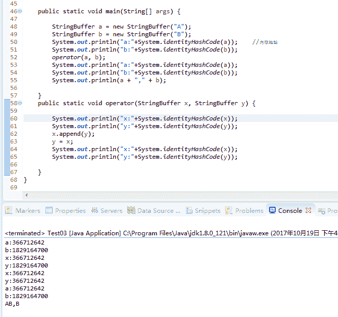
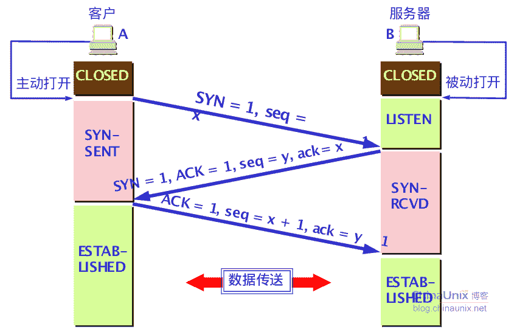
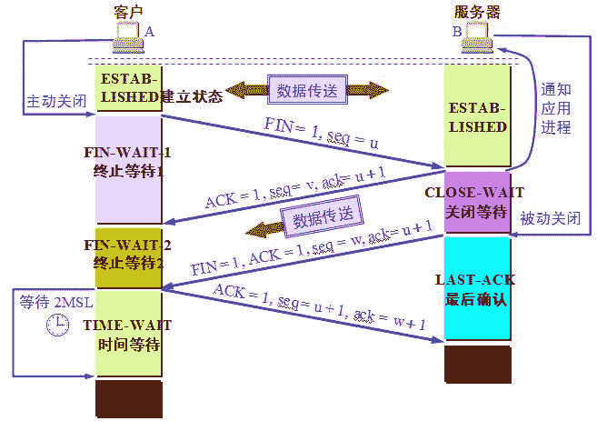
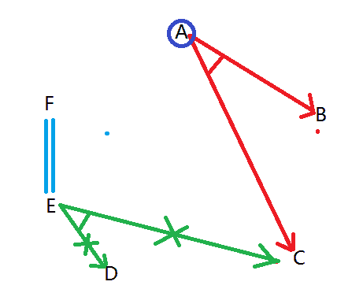

# 三百六十、公司 2016JAVA 研发工程师内推笔试题

## 1

执行以下程序后的输出结果是（）

```cpp
public class Test {
    public static void main(String[] args) {
        StringBuffer a = new StringBuffer("A"); 
        StringBuffer b = new StringBuffer("B"); 
        operator(a, b); 
        System.out.println(a + "," + b); 
    } 
    public static void operator(StringBuffer x, StringBuffer y) { 
        x.append(y); y = x; 
    }
}

```

正确答案: D   你的答案: 空 (错误)

```cpp
A,A
```

```cpp
A,B
```

```cpp
B,B
```

```cpp
AB,B
```

本题知识点

Java Java 工程师 360 公司 2016

讨论

[菜鸟葫芦娃](https://www.nowcoder.com/profile/415611)

 StringBuffer  查看全部)

编辑于 2015-08-15 22:08:37

* * *

[wuxt](https://www.nowcoder.com/profile/2895528)

a 和 x 是同个地址，b 和 y 是同个地址，然后执行 x.append(y)就把 y 的值放在 x 的地址里面此时 a 地址和 x 是同一个所以 a 就是 AB 了，接着执行 y=x 是把 x 的地址给 y，这时候 axy 属于同一个地址。
所以 y=x 只是改变了 y 的地址没改变 b 的地址，所以 b 还是 B。

发表于 2017-10-19 16:23:57

* * *

[牛客 3212507 号](https://www.nowcoder.com/profile/3212507)

Java 参数，不管是原始类型还是引用类型，传递的都是副本(有另外一种说法是传值，但是说传副本更好理解吧，传值通常是相对传址而言)。 如果参数类型是原始类型，那么传过来的就是这个参数的一个副本，也就是这个原始参数的值，这个跟之前所谈的传值是一样的。如果在函数中改变了副本的 值不会改变原始的值. 如果参数类型是引用类型，那么传过来的就是这个引用参数的副本，这个副本存放的是参数的地址。如果在函数中没有改变这个副本的地址，而是改变了地址中的 值，那么在函数内的改变会影响到传入的参数。如果在函数中改变了副本的地址，如 new 一个，那么副本就指向了一个新的地址，此时传入的参数还是指向原来的 地址，所以不会改变参数的值。

发表于 2016-09-03 15:01:57

* * *

## 2

结构型模式中最体现扩展性的模式是（）

正确答案: A   你的答案: 空 (错误)

```cpp
装饰模式
```

```cpp
合成模式
```

```cpp
桥接模式
```

```cpp
适配器
```

本题知识点

Java 工程师 360 公司 2016 设计模式

讨论

[蜗牛小小影](https://www.nowcoder.com/profile/474521)

A 结构型模式是描述如何  查看全部)

编辑于 2015-12-10 12:04:45

* * *

[王建华 love](https://www.nowcoder.com/profile/741114)

好难

发表于 2015-10-16 22:50:03

* * *

[溜卡西](https://www.nowcoder.com/profile/572138)

*   A 装饰模式

定义：动态给一个对象添加一些额外的职责,就象在墙上刷油漆.使用 Decorator 模式相比用生成子类方式达到功能的扩充显得更为灵活。设计初衷：通常可以使用继承来实现功能的拓展,如果这些需要拓展的功能的种类很繁多,那么势必生成很多子类,增加系统的复杂性,同时,使用继承实现功能拓展,我们必须可预见这些拓展功能,这些功能是编译时就确定了,是静态的。

编辑于 2015-08-19 16:35:04

* * *

## 3

在 Linux 中,对 file.sh 文件执行#chmod 645 file.sh 中,该文件的权限是()

正确答案: D   你的答案: 空 (错误)

```cpp
-rw-r--r--
```

```cpp
-rw-r--rx-
```

```cpp
-rw-r--rw-
```

```cpp
-rw-r--r-x
```

本题知识点

Linux Java 工程师 360 公司 2016

讨论

[美团校招内推直达](https://www.nowcoder.com/profile/458054)

文件和目录的权限表示，是用 rwx 这三个字符来代表所有者、用户组和其他用户的权限。有时候，字符似乎过于麻烦，因此还有另外一种方法是以数字来表示权限，而且仅需三个数字。  r: 对应数值 4  w: 对应数值 2  x：对应数值 1  －：对应数值 0  数字设定的关键是 mode 的取值，一开始许多初学者会被搞糊涂，其实很简单，我们将 rwx 看成二进制数，如果有则有 1 表示，没有则有 0 表示，那么-rw- r--r-x 则可以表示成为：  110 100 101  再将其每三位转换成为一个十进制数，就是 645。  

发表于 2015-09-14 10:05:55

* * *

[StrongYoung](https://www.nowcoder.com/profile/649626)

Linux 下权限对应的数字为：r =4, w =2, x =1 所以，6 就是 rw-4 就是 r--5 就是 r-x 所以，选 D

发表于 2015-08-13 13:21:16

* * *

[Hank_Zhang](https://www.nowcoder.com/profile/583801)

r-w-x1-1-1 所以 6 为 110，为 rw；4 为 100，r；5 为 101，r-x

发表于 2015-08-16 08:14:13

* * *

## 4

TCP 建立连接的过程采用三次握手，已知第三次握手报文的发送序列号为 1000，确认序列号为 2000，请问第二次握手报文的发送序列号和确认序列号分别为

正确答案: B   你的答案: 空 (错误)

```cpp
1999，999
```

```cpp
1999，1000
```

```cpp
999，2000
```

```cpp
999，1999
```

本题知识点

网络基础 Java 工程师 360 公司 2016

讨论

[ahuangliang](https://www.nowcoder.com/profile/505180)

简化一下，其实有两个序列，客  查看全部)

编辑于 2016-03-15 11:15:27

* * *

[StrongYoung](https://www.nowcoder.com/profile/649626)

答案有误应该选 B 发送序列是自己发送报文的序列号，当前发送序列号是上一次发送序列号+1 确认序列号是从对方接收到的发送序列号+1 第三次握手发送的序列号是 1000，那说明第一次握手发送的序列号是 999，**注意**：这里是握手，因此，**第二次握手的确认序列号是 1000**，即确认序列号是从对方接收到的发送序列号+1。第三次握手发送的确认号是 2000，**说明第二次握手的发送序列号是 1999**。所以，选 B

编辑于 2015-08-13 14:33:21

* * *

[代码王子](https://www.nowcoder.com/profile/592556)

答案：B 这里主要是 TCP 三次握手期间的发送序号和确认序号。TCP 第一次握手期间：客户机向服务器发送请求报文段，发送序号为 xTCP 第二次握手期间：服务器向客户机发送请求+确认报文段，发送序号为 y，确认报文段为 x+1TCP 第三次握手期间：客户机向服务器发送确认报文段，发送序号为 x+1，确认序号为 y+1 这里第三次握手报文的发送序列号为 1000，确认序列号为 2000，可以退出第二次握手发送序号为 1999，确认序号为 1000.

发表于 2015-08-28 20:51:22

* * *

## 5

下列 TCP 连接建立过程描述正确的是：

正确答案: C   你的答案: 空 (错误)

```cpp
服务端收到客户端的 SYN 包后等待 2*ml 时间后就会进入 SYN_SENT 状态
```

```cpp
服务端收到客户端的 ACK 包后会进入 SYN_RCVD 状态
```

```cpp
当客户端处于 ESTABLISHED 状态时，服务端可能仍然处于 SYN_RCVD 状态
```

```cpp
服务端未收到客户端确认包，等待 2*ml 时间后会直接关闭连接
```

本题知识点

网络基础 Java 工程师 360 公司 2016

讨论

[黄小斜](https://www.nowcoder.com/profile/3539721)

此题主要考察 TCP 三次握手，四次挥手的状态变化，对着图看吧，加深印象。三次握手如下：
（此图第三次握手的 ack 应该等于 y+1，而不是 y，上面看不太清楚，但不影响解这题）四次挥手如下：A：SYN_SENT 是客户端发送 SYN 包之后的立即进入的状态，不用等待 2mlB：服务端收到客户端的 SYN 包后会进入 SYN_RCVD 状态，服务端收到 ACK 包后会进入 established 状态。C： 当客户端处于 ESTABLISHED 状态时，服务端等待接收客户端的 ACK，所以可能处于 SYN_RCVD 状态。D： 客户端收到服务端确认包后，等待 2*ml 时间后会直接关闭连接。若没有收到，则不会关闭连接。

编辑于 2017-02-19 10:09:09

* * *

[StrongYoung](https://www.nowcoder.com/profile/649626)

此题主要考察 TCP 三次握手，四次挥手的状态变化，对着图看吧，加深印象。三次握手如下：
（此图第三次握手的 ack 应该等于 y+1，而不是 y，上面看不太清楚，但不影响解这题）四次挥手如下：

编辑于 2015-08-24 15:25:57

* * *

[hellowww](https://www.nowcoder.com/profile/924580)

A：SYN_SENT 是客户端发送 SYN 包之后的立即进入的状态 B：服务端收到客户端的 SYN 包后会进入 SYN_RCVD 状态 C： 当客户端处于 ESTABLISHED 状态时，服务端等待接收客户端的 ACK，所以处于 SYN_RCVD 状态 D： 客户端收到服务端确认包后，等待 2*ml 时间后会直接关闭连接

发表于 2015-10-13 19:41:42

* * *

## 6

属于网络 112.10.200.0/21 的地址是()

正确答案: A   你的答案: 空 (错误)

```cpp
112.10.206.0
```

```cpp
112.10.217.0
```

```cpp
112.10.224.0
```

```cpp
112.10.198.0
```

本题知识点

网络基础 Java 工程师 360 公司 2016

讨论

[huangzhen](https://www.nowcoder.com/profile/977457)

前 21 位为网络地址，后 12 位  查看全部)

编辑于 2016-10-21 11:11:40

* * *

[牛客 221496 号](https://www.nowcoder.com/profile/221496)

前 21 位为网络地址，不可改变，后 11 位为主机号，可以改变，由 A,B,C,D 四个选项可以看出，主机号的后 8 位为 0，所以主要是看前 3 位，即 112.10.200.0 中的 200 中。200 的二进制为 1100 1000，后三位可改变，范围为 1100 1000 到 1100 1111，即就是 200 到 207，所以 BCD 均可排除

发表于 2015-08-16 16:22:10

* * *

[YatesXu](https://www.nowcoder.com/profile/569283)

无分类编址，即**无类别域间路由 CIDR**，可变大小的方式分配 IP。地址斜线后面的数字表示前缀位数，前缀代替了网络号、子网号。相同的前缀表示一个 CIDR 地址块。此题中的前缀位数为 21，可计算出属于该 CIDR 地址块的地址为 112.10.200.0/21 到 112.10.207.255/21。

发表于 2016-03-29 10:10:33

* * *

## 7

以下 java 程序代码，执行后的结果是（）

```cpp
java.util.HashMap map=new java.util.HashMap();	
map.put("name",null);		
map.put("name","Jack");	
System.out.println(map.size());
```

正确答案: C   你的答案: 空 (错误)

```cpp
0
```

```cpp
null
```

```cpp
1
```

```cpp
2
```

本题知识点

Java Java 工程师 360 公司 2016

讨论

[StrongYoung](https://www.nowcoder.com/profile/649626)

HashMap 可以插入 nul  查看全部)

编辑于 2016-05-29 19:49:13

* * *

[半纸流年](https://www.nowcoder.com/profile/710504)

key-value 对，键值对，相同键值会放在一处，后一个会覆盖前一个的数值。

发表于 2015-11-08 20:51:54

* * *

[MIT_HIT](https://www.nowcoder.com/profile/469048)

HashMap 可以插入 null 的 key 或 value，插入的时候，检查是否已经存在相同的 key，如果不存在，则直接插入，如果存在，则用新的 value 替换旧的 value，第一条 put 语句，会将 key/value 对插入 HashMap，第二条 put 语句，要替换为（name，jack）。所以，size 为 1\.

发表于 2015-11-04 17:17:31

* * *

## 8

以下 java 程序代码，执行后的结果是（）

```cpp
public class Test {	
    public static void main(String[] args) {	
        Object o = new Object() {	
             public boolean equals(Object obj) {	
                 return true;	
         }	
     };	
     System.out.println(o.equals("Fred"));
     }
}
```

正确答案: B   你的答案: 空 (错误)

```cpp
Fred
```

```cpp
true
```

```cpp
编译错误
```

```cpp
运行时抛出异常
```

本题知识点

Java Java 工程师 360 公司 2016

讨论

[史上最强的弟子](https://www.nowcoder.com/profile/694964)

B: 重写了 object 的 equals 的方法，使他怎么输出都是 tue

发表于 2016-02-16 16:57:14

* * *

[八岛栗子](https://www.nowcoder.com/profile/887525)

public static void main(String[] args) {           Object o = new Object() {         //重写 object 的 equals().返回值为 true.             public boolean equals(Object obj) {                   return true;          }     };      //无论传入什么值都是 true。     System.out.println(o.equals("Fred"));//true     System.out.println(o.equals(0));//true     System.out.println(o.equals(null));//true

```cpp
}
```

发表于 2016-06-23 11:14:47

* * *

[QuanwuZheng](https://www.nowcoder.com/profile/728845)

1、使用了匿名内部类，并重写了 Object 中的重写了 equals()方法 2.o 对象调用了 equals 方法

发表于 2015-08-28 10:19:07

* * *

## 9

代码片段：

```cpp
byte b1=1,b2=2,b3,b6;  
final byte b4=4,b5=6;  
b6=b4+b5;  
b3=(b1+b2);  
System.out.println(b3+b6);
```

关于上面代码片段叙述正确的是（）

正确答案: C   你的答案: 空 (错误)

```cpp
输出结果：13
```

```cpp
语句：b6=b4+b5 编译出错
```

```cpp
语句：b3=b1+b2 编译出错
```

```cpp
运行期抛出异常
```

本题知识点

Java Java 工程师 360 公司 2016

讨论

[kmust_XiaQing](https://www.nowcoder.com/profile/439185)

C.被 final 修饰的  查看全部)

编辑于 2015-12-02 19:45:52

* * *

[notlie](https://www.nowcoder.com/profile/846667)

没有 final 修饰的变量相加后会被自动提升为 int 型，与目标类型 byte 不相容，需要强制转换（向下转型）。

发表于 2015-08-14 15:28:14

* * *

[「Smiling/衰](https://www.nowcoder.com/profile/356707)

表达式的数据类型自动提升, 关于类型的自动提升，注意下面的规则。

①所有的 byte,short,char 型的值将被提升为 int 型；

②如果有一个操作数是 long 型，计算结果是 long 型；

③如果有一个操作数是 float 型，计算结果是 float 型；

④如果有一个操作数是 double 型，计算结果是 double 型；而声明为 final 的变量会被 JVM 优化，第 6 行相当于 b6 = 10 若有不对，请指正

发表于 2015-08-13 14:14:49

* * *

## 10

下面代码运行结果是（）

```cpp
public class Test{	
    public int add(int a,int b){	
         try {	
             return a+b;		
         } 
        catch (Exception e) {	
            System.out.println("catch 语句块");	
         }	
         finally{	
             System.out.println("finally 语句块");	
         }	
         return 0;	
    } 
     public static void main(String argv[]){ 
         Test test =new Test(); 
         System.out.println("和是："+test.add(9, 34)); 
     }
}
```

正确答案: C   你的答案: 空 (错误)

```cpp
catch 语句块
和是：43
```

```cpp
编译异常
```

```cpp
finally 语句块
和是：43
```

```cpp
和是：43
finally 语句块
```

本题知识点

Java Java 工程师 360 公司 2016

讨论

[贱贱的梦想](https://www.nowcoder.com/profile/954678)

 先来看一段代码：

```cpp
public abstract class Test {
    public static void main(String[] args) {
        System.out.println(beforeFinally());
    }

    public static int beforeFinally(){
        int a = 0;
        try{
            a = 1;
            return a;
        }finally{
            a = 2;
        }
    }
}
/**output:
1
*/
```

从结果上看，貌似`finally` 里的语句是在`return` 之后执行的，其实不然，实际上`finally` 里的语句是在在`return` 之前执行的。那么问题来了，既然是在之前执行，那为什么`a` 的值没有被覆盖了？
实际过程是这样的：当程序执行到 try{}语句中的 return 方法时，它会干这么一件事，将要返回的结果存储到一个临时栈中，然后程序不会立即返回，而是去执行 finally{}中的程序， **在执行`a = 2`时，程序仅仅是覆盖了 a 的值，但不会去更新临时栈中的那个要返回的值** 。执行完之后，就会通知主程序“finally 的程序执行完毕，可以请求返回了”，这时，就会将临时栈中的值取出来返回。这下应该清楚了，要返回的值是保存至临时栈中的。
再来看一个例子,稍微改下上面的程序：

```cpp
public abstract class Test {
    public static void main(String[] args) {
        System.out.println(beforeFinally());
    }

    public static int beforeFinally(){
        int a = 0;
        try{
            a = 1;
            return a;
        }finally{
            a = 2;
            return a;
        }
    }
}
/**output:
2
*/
```

在这里，finally{}里也有一个 return，那么在执行这个 return 时，就会更新临时栈中的值。同样，在执行完 finally 之后，就会通知主程序请求返回了，即将临时栈中的值取出来返回。故返回值是 2.

编辑于 2016-07-16 16:24:16

* * *

[离人煮酒](https://www.nowcoder.com/profile/1540675)

为什么不是先输出：和是 finally 块 43 的原因。System.out.println("和是："+test.add(9, 34)); 这是进行字符串拼接是一个整体，所以首先是进入 add 方法中，进去之后先把先不运算 result，而是输出 finally 块。注意：此时 finally 块输出结果是：finally 语句块，这句话首先打印到控制台中。打印完后返回来执行 try 中的 return 得到 43，所以此时再将结果与"和是："进行拼接-->输出：和是 43。所以此时控制台又多了一句话：和是 43。加上之前 finally 先在控制台上的输出，所以结果为：finally 语句块 和是 43.如果还没看懂的话可以 4 行和 15 行这里打断点进行调试，你将一目了然。看博客 http://www.cnblogs.com/lirenzhujiu/p/5754267.html

编辑于 2016-08-09 18:30:47

* * *

[牛客 3212507 号](https://www.nowcoder.com/profile/3212507)

***结论：
1、不管有木有出现异常，finally 块中代码都会执行；
2、当 try 和 catch 中有 return 时，finally 仍然会执行；
3、finally 是在 return 后面的表达式运算后执行的（此时并没有返回运算后的值，而是先把要返回的值保存起来，管 finally 中的代码怎么样，返回的值都不会改变，任然是之前保存的值），所以函数返回值是在 finally 执行前确定的；
4、finally 中最好不要包含 return，否则程序会提前退出，返回值不是 try 或 catch 中保存的返回值。
举例：*** *情况 1* ：try{} catch(){}finally{} return;
            显然程序按顺序执行。
*情况 2* :try{ return; }catch(){} finally{} return;
          程序执行 try 块中 return 之前（包括 return 语句中的表达式运算）代码；
         再执行 finally 块，最后执行 try 中 return;
         finally 块之后的语句 return，因为程序在 try 中已经 return 所以不再执行。
*情况 3* :try{ } catch(){return;} finally{} return;
         程序先执行 try，如果遇到异常执行 catch 块，
         有异常：则执行 catch 中 return 之前（包括 return 语句中的表达式运算）代码，再执行 finally 语句中全部代码，
                     最后执行 catch 块中 return. finally 之后也就是 4 处的代码不再执行。
         无异常：执行完 try 再 finally 再 return.
*情况 4* :try{ return; }catch(){} finally{return;}
          程序执行 try 块中 return 之前（包括 return 语句中的表达式运算）代码；
          再执行 finally 块，因为 finally 块中有 return 所以提前退出。
*情况 5* :try{} catch(){return;}finally{return;}
          程序执行 catch 块中 return 之前（包括 return 语句中的表达式运算）代码；
          再执行 finally 块，因为 finally 块中有 return 所以提前退出。
*情况 6* :try{ return;}catch(){return;} finally{return;}
          程序执行 try 块中 return 之前（包括 return 语句中的表达式运算）代码；
          有异常：执行 catch 块中 return 之前（包括 return 语句中的表达式运算）代码；
                       则再执行 finally 块，因为 finally 块中有 return 所以提前退出。
          无异常：则再执行 finally 块，因为 finally 块中有 return 所以提前退出。

***最终结论*** ：任何执行 try 或者 catch 中的 return 语句之前，都会先执行 finally 语句，如果 finally 存在的话。
                  如果 finally 中有 return 语句，那么程序就 return 了，所以 finally 中的 return 是一定会被 return 的，
                  编译器把 finally 中的 return 实现为一个 warning。

发表于 2016-09-05 22:10:06

* * *

## 11

以下情况下不一定出现 TCP 分节 RST 的情况是：

正确答案: C   你的答案: 空 (错误)

```cpp
服务器端端口未打开而客户端来连接时
```

```cpp
SO_RCVTIMEO 选项设置了超时时间并超时
```

```cpp
服务器主机崩溃后重启
```

```cpp
在一个已关闭的 socket 上收到数据
```

本题知识点

网络基础 Java 工程师 360 公司 2016

讨论

[peter_rui](https://www.nowcoder.com/profile/231012)

四种情况会发送 RST 包：
1、端口未打开
2、请求超时
3、提前关闭
4、在一个已关闭的 socket 上收到数据

发表于 2015-08-13 20:32:55

* * *

[牛客 775203 号](https://www.nowcoder.com/profile/775203)

C 选项的意思应该是，服务器主机崩溃后重启，它的 TCP 丢失了崩溃前的所有连接信息，若服务器 TCP 收到来自客户的数据分节，就会响应一个 RST。但如果客户机在服务器崩溃后并没有发送任何数据分节，那服务器重启后也就不会产生 RST。

发表于 2015-09-10 11:27:39

* * *

[雪臧 1050](https://www.nowcoder.com/profile/244439)

TCP 首部有 6 个标志比特，也叫标志位，分别是 URG(紧急指针有效)、ACK(确认序号有效)、PSH(接收方应该尽快将这个报文段交给应用层)、RST(重置连接、复位连接)、SYN(同步序号用来发起一个连接)、FIN(发送端完成发送任务)。一般来说，无论何时一个报文段发往基准的连接（由目的 IP 地址和目的端口号以及源 IP 地址和源端口号指明的连接）出现错误，TCP 都会发出一个复位报文段。一般出现 RST 的集中场景：1.访问不存在的端口连接请求；2.异常终止一个连接；3.检查半打开连接。

发表于 2015-09-06 15:59:47

* * *

## 12

一个数据库中现有 A,B,C,D,E,F 六个语句但目前这个数据库是不协调的，必须删除某些语句才能恢复数据库的协调性。已知：（1）如果保留语句 A，那么必须保留语句 B 和 C。（2）如果保留语句 E，则必须同时删除语句 D 和语句 C。（3）只有保留语句 E，才能保留语句 F。（4）语句 A 是重要的信息，不能删除。以上各项如果为真，则以下哪项一定为真？

正确答案: D   你的答案: 空 (错误)

```cpp
保留语句 E 并且删除语句 D
```

```cpp
保留语句 E 并且删除语句 C
```

```cpp
同时保留语句 C 和语句 D
```

```cpp
同时删除语句 E 和语句 F
```

本题知识点

360 公司 2016 判断推理

讨论

[norshtein](https://www.nowcoder.com/profile/1272374)

请容我喷一句，这是道逻辑题，和数据库有 p 关系？

发表于 2017-01-19 17:24:41

* * *

[Myworld](https://www.nowcoder.com/profile/853456)

根据（4），A 必须有；再根据（1），B，C 必须有，此时一定有 ABC 根据（2），因为有 C，所以一定没有 E 根据（3），因为没有 E，所以一定没有 F 综上，ABC 一定有，EF 一定没有，D 不确定

发表于 2015-08-13 16:10:11

* * *

[时间妖](https://www.nowcoder.com/profile/464952)



发表于 2017-03-18 17:25:08

* * *

## 13

下列关于静态工厂和工厂方法表述错误的是：（）

正确答案: D   你的答案: 空 (错误)

```cpp
在工厂方法模式中，对于存在继承等级结构的产品树，产品的创建是通过相应等级结构的工厂创建的
```

```cpp
不能形成静态工厂的继承结构
```

```cpp
静态工厂对具体产品的创建类别和创建时机的判断是混和在一起的，这点在工厂方法中
```

```cpp
二者都满足开闭原则：静态工厂以 if else 方式创建对象，增加需求的时候会修改源代码
```

本题知识点

软件工程 Java 工程师 360 公司 2016

讨论

[Myworld](https://www.nowcoder.com/profile/853456)

选 D，开闭原则：对扩展开放，对修改封闭。静态工厂增加需要是修改源代码，对修改不封闭，不符合开闭原则。

发表于 2015-08-13 15:24:58

* * *

[revivedSuN](https://www.nowcoder.com/profile/141075)

静态工厂也叫简单工厂，知道这个就明白了。

发表于 2015-08-16 21:53:21

* * *

[huangqinjian](https://www.nowcoder.com/profile/5755316)

详情可戳[`blog.csdn.net/sinat_35512245/article/details/54890711`](http://blog.csdn.net/sinat_35512245/article/details/54890711)

发表于 2017-02-06 11:32:00

* * *

## 14

设有一个用数组 Q[1..m]表示的环形队列，约定 f 为当前队头元素在数组中的位置，r 为队尾元素的后一位置(按顺时针方向),若队列非空，则计算队列中元素个数的公式应为()

正确答案: A   你的答案: 空 (错误)

```cpp
(m+r-f)mod m
```

```cpp
r-f
```

```cpp
(m-r-f)mod m
```

```cpp
(m-r+f)mod m
```

本题知识点

队列 *Java 工程师 360 公司 2016* *讨论

[風雨兼程](https://www.nowcoder.com/profile/6168883)

循环队列的相关条件和公式： 
队尾指针是 rear，队头是 front，循环队列的长度为 m
1\. 队空：rear == front 
2\. 队满：(rear + 1) % m == front 
3\. 当前队列长度：（rear - front + m）% m
4\. 入队列：（rear + 1）% m
5\. 出队列：（front + 1）% m

发表于 2017-09-09 22:38:16

* * *

[小鱼也要飞](https://www.nowcoder.com/profile/898983)

严版数据结构 第  64 页 最后代码 int QueueLength(SqQueue Q){return (Q.rear- Q.front + MAXSIZE)%MAXSIZE;}用尾减去头 ，加上 MAXSIZe 是为了防止 头的地址大于尾

发表于 2015-08-13 17:53:21

* * *

[fensemengsiyu](https://www.nowcoder.com/profile/147819)

如果队列是满队列呢？我觉得有问题啊

发表于 2015-08-19 20:42:00

* * *

## 15

以下程序是用辗转相除法来计算两个非负数之间的最大公约数：

```cpp
long long gcd(long long x,long long y){ 
     if(y==0) 
        return x; 
     else return gcd(y,x%y);
}
```

我们假设 x,y 中最大的那个数的长度为 n，基本基本运算时间复杂度是 O(1),那么该程序的时间复杂度为（）

正确答案: A   你的答案: 空 (错误)

```cpp
O(logn)
```

```cpp
O(1)
```

```cpp
O(n²)
```

```cpp
O(n)
```

本题知识点

编程基础 *Java 工程师 360 公司 2016* *讨论

[zephyr0703](https://www.nowcoder.com/profile/9885763)

每两次调用 gcd，答案其中一个数必然减少一半以上，比如若 x > y，则 x%y， x 减少一半以上 （一次调用）若 x < y，则相当于再次调用 gcd（y，x），也会减少一半以上（两次调用）所以，选 A

编辑于 2016-08-06 19:32:25

* * *

[toraoh](https://www.nowcoder.com/profile/364093)

快速的思路是排除法，不是与固定几个值计算，所以不是 O(1)的，当然也不会把每个数都遍历个遍来确定，不是 O(n)和 O(n²)的，于是选择 A。当然如果感兴趣的话，可以做一个实验：在 10000 以内两两辗转相除法，运算次数最多的是哪两个数呢？6765 和 4181 如果把上界再缩小或扩大，你会发现，出现的数都是斐波那契数列中的数，都是相邻的两项。因为斐波那契数列相邻两项在做 gcd 的时候，每次 mod 只相当于做了一次 a-b，退化成更相减损术了，而没有起到 mod 的加速效果。而斐波那契数列有通项公式，第 n 项的值是与某两个无理数的 n 次相关的。所以，是 logn 了（当然这个证明还是很不科学的）

发表于 2015-08-13 21:47:17

* * *

[zffloveroflife](https://www.nowcoder.com/profile/402074)

A

发表于 2015-09-03 00:03:08

* * *

## 16

计算斐波那契数列第 n 项的函数定义如下：

```cpp
int fib(int n) {
    if (n == 0)
        return 1;
    else if (n == 1)
        return 2;
    else
        return fib(n - 1) + fib(n - 2);
}
```

若执行函数调用表达式 fib(10),函数 fib 被调用的次数是：

正确答案: D   你的答案: 空 (错误)

```cpp
117
```

```cpp
137
```

```cpp
157
```

```cpp
177
```

本题知识点

复杂度

讨论

[yayamma](https://www.nowcoder.com/profile/270051)

若 C(n) 表示计算次数，则  查看全部)

编辑于 2016-02-26 15:06:27

* * *

[Icebins](https://www.nowcoder.com/profile/178778)

这题相当于再求一次费波那奇数列。定义 g(n)函数表示计算 fib(n)而调用的 fib 函数的次数则 g(10) = g(9) + g(8) + 1(1 是调用 fib(10)需要执行一次 fib 函数)。。。。g(2) = g(1) + g(0) + 1g(1) = 1g(0) = 1 可以求得 g(10) = 177

发表于 2015-08-13 14:30:52

* * *

[牛客 224540 号](https://www.nowcoder.com/profile/224540)

这道题可以这样来分析：设 f(n) 表示执行 fib(n)函数的次数，那么显然地推公式： f(n) = f(n-1) + f(n-2) + 1 （1 表示执行到了 fib（n）的时候执行了一次 fib 函数）f(10) = f(9) + f(8) + 1。。。f(0) = 1f(1) = 1f(2) = 3f(3) = 5
f(4) = 9f(5) = 15f(6) = 25f(7) = 41f(8) = 67f(9) = 109f(10) = 177 问题就转化成求类斐波那契额数列的 n 项，直接手写都可以写的出来，没多少

发表于 2015-08-22 16:09:45

* * *

## 17

设图 G 的相邻矩阵如下图：则 G 的顶点数和边数分别为：

> 0 1 1 1 11 0 1 0 01 1 0 1 11 0 1 0 11 0 1 1 0

正确答案: D   你的答案: 空 (错误)

```cpp
4,5
```

```cpp
4,10
```

```cpp
5,6
```

```cpp
5,8
```

本题知识点

图 Java 工程师 360 公司 2016

讨论

[wayne_jing](https://www.nowcoder.com/profile/917509)

矩阵为 5*5，则有五个顶点；关于主对角线对称，则为无向图；无向图中，边数目等于上/下三角矩阵中的非零元素数目。

发表于 2015-08-16 23:06:47

* * *

[LuckyBug](https://www.nowcoder.com/profile/826451)

笨方法：把图按照相邻矩阵画出来；简单方法：只计算主对角线的上三角或下三角有多少个 1 即可。

发表于 2015-08-13 20:30:01

* * *

[BrainerGao](https://www.nowcoder.com/profile/516342)

5 个顶点显而易见，一共有 8 对 1，所以有 8 个边

发表于 2016-09-12 21:54:31

* * ***