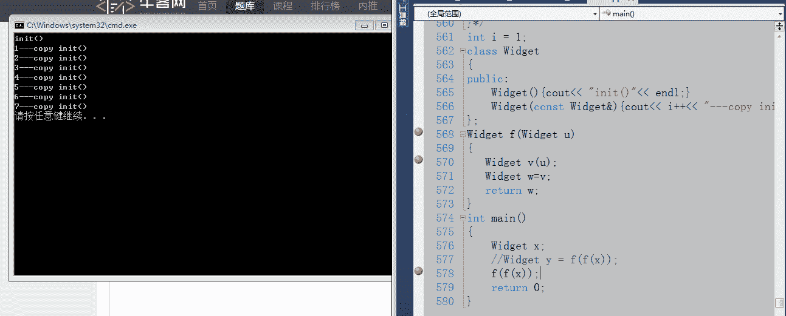

# 三百六十、公司 2016C 研发工程师内推笔试题

## 1

x 是一个行列数均为 1000 二维数组，下面代码效率执行最高的是（）

正确答案: D   你的答案: 空 (错误)

```cpp
for(int j=0;j<1000;j++) for(int i=0;i<1000;i++) x[i][j]+=x[j][i];
```

```cpp
for(int i=0;i<1000;i++) for(int j=0;j<1000;j++) x[i][j]+=x[j][i];
```

```cpp
for(int i=0;i<1000;i++) for(int j=0;j<1000;j++) x[j][i]+=x[j][i];
```

```cpp
for(int i=0;i<1000;i++) for(int j=0;j<1000;j++) x[i][j]+=x[i][j];
```

本题知识点

C++ C++工程师 360 公司 2016 C 语言

讨论

[L.K.](https://www.nowcoder.com/profile/217196)

选 D.主要是考察了 CP  查看全部)

编辑于 2016-04-13 20:58:37

* * *

[大星星和小猩猩](https://www.nowcoder.com/profile/9374535)

我觉得这道题考的是操作系统课里的知识，关于内存管理策略，页表，那部分的知识。 内存是分成很多个页来管理的，1000x1000 的数组相当的大，要用很多页来存储，假设一个页占的内存大小为，1000×4 字节＝4000 字节，那么共需要 1000 页。而数组存储是先存储按照一行一行来存储数据的，所以，同一行的在同一页，不同行的太不同页。 这样一样，ABC，每存一个数，就得换一个页，不停的查询页表找地址，因而效率贼低。

发表于 2018-01-22 16:30:16

* * *

[洛基](https://www.nowcoder.com/profile/238057)

不要在意是不是死循环的问题我觉得 只有 D 寻址时间比较少，因为 D 的寻址是顺序的其他选项寻址需要“跳”，来找到对应地址  最佳答案说的不错 肯定是顺序寻址消耗时间最少的

发表于 2015-09-06 12:52:16

* * *

## 2

不能把字符串"HELLO!"赋给数组 b 的语句是（）

正确答案: B   你的答案: 空 (错误)

```cpp
char b[10] = {'H'，'E'，'L'，'L'，'O'，'!'，'\0'};
```

```cpp
char b[10];b = "HELLO!";
```

```cpp
char b[10];strcpy(b，"HELLO!");
```

```cpp
char b[10] = "HELLO!";
```

本题知识点

C++ C++工程师 360 公司 2016 C 语言

讨论

[北窗](https://www.nowcoder.com/profile/164635)

B 选项是错误的，连编译都不会通过，因为数组名属于常性指针，现在要改变这个常性指针的指向，这是不会编译通过的，再说 B 选项的本意是将 Hello 拷贝到 b 指向的空间中，但实际却是将 b 指向了在常量区的 Hellow 字符串（虽然编译不会通过）。

发表于 2015-08-13 20:43:39

* * *

[Regin](https://www.nowcoder.com/profile/594239)

Bb 是表示数组的首地址，不能赋值

发表于 2015-08-14 20:26:15

* * *

[watermaker](https://www.nowcoder.com/profile/359326)

要将字符串赋值给数组，需要在初始化的时候定义，要不然，两个常量，怎么赋值。。哈哈哈

发表于 2015-08-18 14:28:31

* * *

## 3

假设寄存器为 8 位，用补码形式存储机器数，包括一位符号位，那么十进制数-25 在寄存器表示为：

正确答案: D   你的答案: 空 (错误)

```cpp
67H
```

```cpp
99H
```

```cpp
E6H
```

```cpp
E7H
```

本题知识点

C++ C++工程师 360 公司 2016

讨论

[fcxjluo](https://www.nowcoder.com/profile/698878)

  查看全部)

编辑于 2016-11-23 23:38:49

* * *

[刘惠森](https://www.nowcoder.com/profile/9821449)

《深入理解计算机系统》这本书上提供了一个思路。正数的反码为其本身，负数和零的反码计算方式为：(2^n-x)，其中 n 指代表示的数的二进制位数，x 指的是数本身的值的绝对值。这也是反码英文 one‘s complement 的来源，即(2^n-x)还可以写成([10...0]-x)，这里面的 1 只有一个。运用在上面的题目上过程就是：2⁸-25=231\. 231 的十六进制表示为 E7\.

发表于 2017-03-13 22:09:44

* * *

[好学上进](https://www.nowcoder.com/profile/708096)

25=0001 1001B(就是将 25 写成二进制形式)
变成-25 的方法是：将上面的数从右往左看，从第一个不为 1 的数字起（包括该数字）往左，全部取反。
对 0001 1001B，从右往左看，第一位是 1，不变；第二位是 0，不为 1，于是，从这一位起（包括该位）往左，全部取反，就变成了
1110 0111B，即 E7H。

发表于 2016-03-29 11:17:17

* * *

## 4

下面程序会输出什么：

```cpp
static int a=1;
void fun1(void){    a=2;  }
void fun2(void){    int a=3;  }
void fun3(void){   static int a=4;  }
int main(int argc,char** args){ 
     printf(“%d”,a); 
     fun1( ); 
     printf(“%d”,a); 
     fun2( ); 
     printf(“%d”，a);
     fun3( );
      printf(“%d”,a); 
}
```

正确答案: B   你的答案: 空 (错误)

```cpp
1 2 3 4
```

```cpp
1 2 2 2
```

```cpp
1 2 2 4
```

```cpp
1 1 1 4
```

本题知识点

C++ C++工程师 360 公司 2016

讨论

[monkeyY](https://www.nowcoder.com/profile/524296)

静态局部变量只对定义它的函数体始终可见，函数体执行完过后虽然还存在，但是无法被其他的使用了

发表于 2015-08-13 20:16:58

* * *

[木三](https://www.nowcoder.com/profile/488933)

选 B   printf(“%d”,a); //输出全局静态变量，所以输出 1     fun1( );     //a=2 所以会修改全局静态变量，输出 2     printf(“%d”,a);      fun2( );     //int a=3 是在 func2 里的局部变量，所以调用结束就释放了，不影响全局的 a 值，所以输出 2     printf(“%d”，a);     fun3( );    //也是局部变量，虽然是静态的但是不会影响全局 a 的值，仍然输出 2    printf(“%d”,a); 

发表于 2015-08-14 16:54:33

* * *

[MIT_HIT](https://www.nowcoder.com/profile/469048)

  考察知识点：静态局部变量只对定义它的函数体始终可见，函数体执行完过后虽然还存在，但是无法被其他的使用了 printf(“%d”,a); //输出全局静态变量，所以输出 1     fun1( );     //a=2 所以会修改全局静态变量，输出 2     printf(“%d”,a);      fun2( );     //int a=3 是在 func2 里的局部变量，所以调用结束就释放了，不影响全局的 a 值，所以输出 2     printf(“%d”，a);     fun3( );    //也是局部变量，虽然是静态的但是不会影响全局 a 的值，仍然输出 2    printf(“%d”,a); 

发表于 2015-11-03 16:07:15

* * *

## 5

下面这段代码的输出结果为：

```cpp
void change(int*a, int&b, int c){ 
    c=*a; 
    b=30; 
    *a=20;
}
int main ( ){ 
     int a=10, b=20, c=30; 
     change(&a,b,c); 
     printf(“%d,%d,%d,”,a,b,c)； 
     return 0；
}
```

正确答案: A   你的答案: 空 (错误)

```cpp
20，30，30
```

```cpp
10，20，30
```

```cpp
20,30，10
```

```cpp
10,30，30
```

本题知识点

C++ C++工程师 360 公司 2016

讨论

[wenyanliu](https://www.nowcoder.com/profile/425767)

这个题目考的是函数传参的形式  查看全部)

编辑于 2015-12-09 16:22:42

* * *

[琼华](https://www.nowcoder.com/profile/188677)

a 是指针，函数内的修改会传递出来，b 是引用，类似指针，修改之后也传递出来形参，修改对外部不影响

发表于 2015-08-21 16:57:14

* * *

[Tony-Master](https://www.nowcoder.com/profile/917762871)

传指针和引用都会改变变量值，而传值不会改变变量。仍为原来值

发表于 2019-06-10 22:37:53

* * *

## 6

在 c++中，

```cpp
const int i = 0; 
int *j = (int *) &i; 
*j = 1; 
printf("%d,%d", i, *j)
```

输出是多少?

正确答案: A   你的答案: 空 (错误)

```cpp
0，1
```

```cpp
1，1
```

```cpp
1，0
```

```cpp
0，0
```

本题知识点

C++ C++工程师 360 公司 2016

讨论

[牛客 133600 号](https://www.nowcoder.com/profile/133600)

唔，感觉都没有说到重点。这跟编译器的优化编译有关。[C++中的常量折叠](http://baike.baidu.com/view/3721621.htm)：指 const 变量（即常量）值 **放在编译器的符号表中** ，计算时编译器直接从表中取值，省去了访问内存的时间，从而达到了优化。具体可以看这个：http://blog.csdn.net/heyabo/article/details/8745942

发表于 2015-08-18 17:16:51

* * *

[风拔萝卜](https://www.nowcoder.com/profile/7023473)

c 语言中 const 只是指定这个变量是只读的，并非真正意义上的常量，并且可以通过指针修改。c++中常量都会有一张常量表，任何对常量的读取都是从这个表里直接读取，而通过指针进行修改，修改的是常量在栈上对应地址空间的内容，本身常量表里的内容不会被改变

发表于 2016-10-04 17:26:32

* * *

[watermaker](https://www.nowcoder.com/profile/359326)

这个题一定要注意是在 C++中的运行结果。在 C 语言中

```cpp
void main(){
	const int i = 0;
	int *j = (int *)&i;
	*j = 1;
	printf("%d,%d", i, *j);
	system("pause");
}
```

结果输出为 1,1 在 C++中

```cpp
#include<iostream>
using namespace std;
int main(void){
	const int i=0;
	int *j = (int *)&i;
	*j = 1;
	printf("%d,%d", i, *j);
	system("pause");
	return 0;
}
```

结果输出为 0,1 分析：C 语言中的 const 是运行时 const，编译时只是定义，在运行才会初始化。C 语言中 const 变量不能用于成为数组长度等作为编译时常量的情况，原因就在此。C 语言 const 变量在运行时改变了是可以再次读出改变后的值的。C++中，const 变量是编译时的常量，可以向#define 定义的常量一样使用。故 C++中 const 变量的值在编译时就已经确定了，直接对 cosnt 变量进行了值的替换，因此当 const 变量的值改变时，const 的变量值是不会得到更新的。这几行代码在 C 和 C++中都会改变 const 变量的值，只不过 C++中 const 变量在编译的时候已经确定了，而 C 中的 const 变量可以在运行时改变后再次读取。以下代码核实了 C++中的 const 变量确实被改变了。

```cpp
#include<stdio.h>
#include<iostream>
using namespace std;
int main(void){
	const int i=0;
	int *j = (int *)&i;
	*j = 1;

	printf("%d,%d\n", i, *j);
	cout << "i address"<<&i << endl;
	cout << "j address"<<j << endl;

	return 0;
}
```

同一个地址，即同一个变量。C++中 const 变量确实别改变了。i 的值没有更新而已。

发表于 2015-08-14 22:09:31

* * *

## 7

请问下面的程序最后会产生多少个进程：

```cpp
int main(　){ 
     int i; 
     for(i = 0; i < 5;i++){ 
        int pid = fork(); 
        if(pid == 0){ 
            //do something 
        } else { 
        //do something 
        } 
    }
    // do somthing,sleep
    return 0;
}
```

正确答案: D   你的答案: 空 (错误)

```cpp
5
```

```cpp
10
```

```cpp
15
```

```cpp
32
```

本题知识点

C++ C++工程师 360 公司 2016 C 语言

讨论

[涛声依旧 IT](https://www.nowcoder.com/profile/525942)

i=0 时，共有两个进程: 主进程和主进程创建的第一个进程 i=1 时，以上两个进程分别创建新的进程，此时共有四个进程 i=2 时，以上四个进程分别创建新的进程，此时共有 8 个进程....依次类推, 当 i=n 时，共创建 2^(n+1)个进程

发表于 2015-08-15 17:13:20

* * *

[小老鼠](https://www.nowcoder.com/profile/772743)

[`blog.csdn.net/jason314/article/details/5640969`](http://blog.csdn.net/jason314/article/details/5640969)
菜鸟级可以看，讲的很好

发表于 2015-08-21 16:16:37

* * *

[L.K.](https://www.nowcoder.com/profile/217196)

2⁵=32。每一个 fork()出来的新进程，和父进程使用相同的代码段，复制父进程的数据段和堆栈段，不过有“逻辑”复制和“物理”复制之分，在本题没有影响。也就是说每一个 fork()出的新进程和父进程有相同大小的 i，并且执行位置也是一样的

编辑于 2015-08-17 21:52:18

* * *

## 8

下面代码不能正确输出 hello 的选项为（）

```cpp
#include<stdio.h>
struct str_t{
   long long len;
   char data[32];
};
struct data1_t{
   long long len;
   int data[2];
};
struct data2_t{
   long long len;
   char *data[1];
};
struct data3_t{
   long long len;
   void *data[];
};
int main(void)
{
   struct str_t str;
   memset((void*)&str,0,sizeof(struct str_t));
   str.len=sizeof(struct str_t)-sizeof(int);
   snprintf(str.data,str.len,"hello");//VS 下为 _snprintf
   ____________________________________;
   ____________________________________;
   return 0;
}
```

正确答案: B   你的答案: 空 (错误)

```cpp
struct data3_t *pData = (struct data3_t*) &str;
printf("data:%s%s\n", str.data, (char*) (&(pData->data[0])));
```

```cpp
struct data2_t *pData = (struct data2_t*) &str;
printf("data:%s%s\n", str.data, (char*) (pData->data[0]));
```

```cpp
struct data1_t *pData = (struct data1_t*) &str;
printf("data:%s%s\n", str.data, (char*) (pData->data));
```

```cpp
struct str_t *pData = (struct str_t*) &str;
printf("data:%s%s\n", str.data, (char*) (pData->data));
```

本题知识点

C++ C++工程师 360 公司 2016 C 语言

讨论

[包原隰险阻](https://www.nowcoder.com/profile/569118)

一张图说明问题。

编辑于 2016-05-08 13:14:38

* * *

[天蝎云月](https://www.nowcoder.com/profile/143055)

主要是因为 C++ 中定义了箭头运算符，箭头运算符把解引用和成员访问两个操作结合在一起，也就是说 it->men 和 (*it).men 表达的含义相同，那么也就是说 pData->data[0]实际上指的是数组首元素而不是地址

发表于 2015-08-15 11:25:56

* * *

[jsyc123](https://www.nowcoder.com/profile/386368)

选项 A 和 B 中的 pData->data[0]不是数组的地址，而是数组的首元素，相当于是原结构体里面的 char，因此必须取地址之后再强制转换成 char *类型。 

发表于 2015-08-14 10:50:17

* * *

## 9

下面代码段输出为（）

```cpp
#include <stdio.h>
int i;
int main(){
  for(i = 0;i < 3;i++){
    switch(i){
    case 0: printf("%d", i);
    case 2: printf("%d", i);
    default: printf("%d", i);
    }
  }
}
```

正确答案: D   你的答案: 空 (错误)

```cpp
000111
```

```cpp
000020
```

```cpp
000102
```

```cpp
000122
```

本题知识点

C++ C++工程师 360 公司 2016 C 语言

讨论

[elives-GM](https://www.nowcoder.com/profile/165170)

case 后面的常量表达式实际上只起语句标号作用 , 而不起条件判断作用 , 即 " 只是开始执行处的入口标号 ".  因此 , 一旦与 switch 后面圆括号中表达式的值匹配 , 就从此标号处开始执行 , 而且执行完一个 case 后面的语句后 , 若没遇到 break 语句 , 就自动进入 下一个 case 继续执行 , 而不在判断是否与之匹配 , 直到遇到 break 语句才停止执行 , 退出 break 语句 . 因此 , 若想执行一个 case 分之后立即跳出  switch 语句 , 就必须在此分支的最后添加一个 break 语句 .#include <stdio.h>

int main()

{

 char x = 'B';

 switch (x){

   case 'A':printf("A");

   case 'B':printf("B");

   case 'C':printf("C");

   default: printf("D");

 }

}

**result: BCD**

发表于 2015-08-22 17:09:41

* * *

[为明天加油](https://www.nowcoder.com/profile/782977)

i=0;执行 case0,case2,default;i=1,执行 default；i=2,执行 case2,default;i=3 循环结束。

发表于 2016-06-20 11:26:04

* * *

[学习一下吧](https://www.nowcoder.com/profile/236009)

case 语句如果分支中没有 break，接下来的代码都会依次执行；当 i=0 时，执行 case 0，由于没有 break，则 case 2 和 default 均会被执行

发表于 2015-08-13 13:52:49

* * *

## 10

```cpp
int Function(unsigned int n) {	
		n = (n & 0x55555555) + ((n >> 1) & 0x55555555);
		n = (n & 0x33333333) + ((n >> 2) & 0x33333333);
		n = (n & 0x0f0f0f0f) + ((n >> 4) & 0x0f0f0f0f);
		n = (n & 0x00ff00ff) + ((n >> 8) & 0x00ff00ff);
		n = (n & 0x0000ffff) + ((n >> 16) & 0x0000ffff);
		return n;
}

```

输入参数为 197 时，函数返回多少？

正确答案: C   你的答案: 空 (错误)

```cpp
2
```

```cpp
3
```

```cpp
4
```

```cpp
5
```

本题知识点

C++ C++工程师 360 公司 2016 C 语言

讨论

[leobuzhi](https://www.nowcoder.com/profile/932073)

计算二进制的一的个数，这个算法叫做平行算法。int BitCount(unsigned int n){    n = (n &0x55555555) + ((n >>1) &0x55555555) ;    n = (n &0x33333333) + ((n >>2) &0x33333333) ;    n = (n &0x0f0f0f0f) + ((n >>4) &0x0f0f0f0f) ;    n = (n &0x00ff00ff) + ((n >>8) &0x00ff00ff) ;    n = (n &0x0000ffff) + ((n >>16) &0x0000ffff) ;    return n ;}速度不一定最快，但是想法绝对巧妙。 说一下其中奥妙，其实很简单，先将 n 写成二进制形式，然后相邻位相加，重复这个过程，直到只剩下一位。以 217（11011001）为例，有图有真相，下面的图足以说明一切了。217 的二进制表示中有 5 个 1

编辑于 2016-01-26 22:53:28

* * *

[lijiayu2011](https://www.nowcoder.com/profile/3390014)

int func(unsigned int i){    unsigned int temp = i;    temp = (temp & 0x55555555) + ((temp>> 1) & 0x55555555);  //temp 相邻位相加      temp = (temp & 0x33333333) + ((temp >> 2) & 0x33333333);  //temp 相邻（以 2 为单位）相加    temp = (temp & 0x0f0f0f0f) + ((temp>> 4) & 0x0f0f0f0f);    //temp 相邻（以 4 为单位）相加    temp = (temp & 0xff00ff) + ((temp>> 8) & 0xff00ff);       //temp 相邻（以 8 为单位）相加    temp = (temp & 0xffff) + ((temp>> 16) & 0xffff) ;          //temp 相邻（以 16 为单位）相加    return temp;}temp 相邻位相加：相加原理若相邻的两个数为 00 则结果为 00， 相邻的两个数为 01 或 10 则结果为 01，相邻两个数为 11 则结果为 10，也就是先小范围统计每两位中 1 的个数，后面的步骤在累计有多少个 1.0x11530828 的二进制表示如下：0001  0001 1001 0011 0000 1000 0010 1000；0  1    0  1   1  1   0  2   0  0   1  0   0  1   1  0；  1         1       2      2        0      1        1      1；        2                 4                1                    2                   6                                    3                                    9

发表于 2017-03-31 08:58:12

* * *

[Jeffdon](https://www.nowcoder.com/profile/798998)

这里运用了分治法计算二进制数中 1 的个数(n & 0x55555555) + ((n >> 1) & 0x55555555)  计算每对相邻的 2 位中有几个 1(n & 0x33333333) + ((n >> 2) & 0x33333333)  计算每相邻的 4 位中有几个 1 接下来 8 位，16 位，32 位，对于 32 位的机器，5 条位运算语句就够了。

发表于 2015-11-02 20:35:09

* * *

## 11

下面程序的输出是：

```cpp
#define f(x) x*x
#include<stdio.h>
main (){
  int a = 6, b = 2, c;
  c = f(a) / f(b);
  printf("%d", c); }
```

正确答案: C   你的答案: 空 (错误)

```cpp
3
```

```cpp
18
```

```cpp
36
```

```cpp
9
```

本题知识点

C++ C++工程师 360 公司 2016 C 语言

讨论

[DeadFlower](https://www.nowcoder.com/profile/192873)

代码在遇到#define 的定义时，是直接把#define 定义的内容替换掉源代码里的内容，这里 c=f(a)/f(b) 相当于用 a*a 替换 f(a)，b*b 替换 f(b)，并不是直接先运算 a*a 和 b*b，而是相当于运算 c=a*a/b*b；这样 c=6*6/2*2=36 了。

发表于 2015-09-04 15:22:26

* * *

[vonmax007](https://www.nowcoder.com/profile/6810626)

玛德脑抽 c=6*6/2*2 直接想成 36 / 4 了

发表于 2017-08-03 23:17:03

* * *

[L.K.](https://www.nowcoder.com/profile/217196)

C。将宏表达式展开：c = 6*6/2*2=36\.

发表于 2015-08-13 13:57:41

* * *

## 12

在 64 位操作系统上，如下数据结构占用的存储空间大小为多少字节

```cpp
struct A{
   unsigned int a;
   char b[2];
   double c;
   short d;
}
```

正确答案: B   你的答案: 空 (错误)

```cpp
12
```

```cpp
24
```

```cpp
20
```

```cpp
16
```

本题知识点

C++ C++工程师 360 公司 2016 C 语言

讨论

[fanying598](https://www.nowcoder.com/profile/539318)

64 位操作系统，不同类型变量对应的字节数为：（红色的表示与 32 位系统不同之处）        char ：1 个字节 
char*(即指针变量): 8 个字节       short int : 2 个字节 
      int：  4 个字节 
      unsigned int : 4 个字节 
      float:  4 个字节 
      double:    8 个字节 
long:   8 个字节       long long:  8 个字节 
      unsigned long:  8 个字节 64 位系统在内存管理方面遵循 8 字节对齐，原则：在 8 字节对齐的情况下，按 8 个字节为单位分配存储空间，如果不足，会自动补充，本次分配不足以存放下面的变量时，会重新分配空间。 structA{   unsigned int a; //对于开始连续的第一个 8 字节内存，a 占 4 字节    char b[2];      //b[]占 1*2 字节，在 a 后的连续 2 字节内存放，还剩 2 个字节，   double c;       //c 占 8 字节，第一个 8 字节还剩 2 字节不足以存放 c,自动补充该 2 字节。并同时开辟第二个 8 字节内存存放 c   short d;        //d 占 2 字节，开辟第三个 8 字节，存放 d。剩余的 6 个字节补齐。故总共开辟了 8*3=24 字节存放该数据结构}

编辑于 2015-08-16 15:20:13

* * *

[networkcpx](https://www.nowcoder.com/profile/246646)

| 字节大小 | 32 位系统 | 64 位系统 |
| char | 1 | 1 |
| short | 2 | 2 |
| int | 4 | 4 |
| **指针** | 4 | **8** |
| **long** | 4 | **8** |
| float | 4 | 4 |
| double | 8 | 8 |
| long long | 8 | 8 |

注意指针和 long 都会从 4 字节变成 8 字节

编辑于 2017-03-31 15:48:59

* * *

[松华皮蛋 me](https://www.nowcoder.com/profile/240565)

**C++结构体字节对齐**

## 前言 ##
> 在计算机中数据存储和传输以位(bit)为单位，每 8 个位 bit 组成 1 个字节(Byte)。32 位计算机的字长为 32 位，即 4 个字节；对应的，64 位计算机的字长为 64 位，即 8 个字节。计算机系统对基本类型数据在内存中存放的位置有限制，要求这些数据的起始地址的值是某个数 k 的倍数，这就是所谓的内存对齐，而这个 k 则被称为该数据类型的对齐模数(alignment modulus)。

## 结构的存储分配 ##

编译器按照结构体成员列表的顺序为每个成员分配内存，当存储成员时需要满足正确地边界对齐要求时，成员之间可能出现用于填充地额外内存空间。32 位系统每次分配字节数最多为 4 个字节,64 位系统分配字节数最多为 8 个字节。
以下图表是在不同系统中基本类型数据内存大小和默认对齐模数:

    注：此外指针所占内存的长度由系统决定，在 32 位系统下为 32 位（即 4 个字节），64 位系统下则为 64 位（即 8 个字节）.

## 没有#pragma pack 宏的对齐 ##

**对齐规则** :

 1.  结构体的起始存储位置必须是能够被该结构体中最大的数据类型所整除。
1.  每个数据成员存储的起始位置是自身大小的整数倍(比如 int 在 32 位机为 4 字节，则 int 型成员要从 4 的整数倍地址开始存储)。
1.  结构体总大小（也就是 sizeof 的结果），必须是该结构体成员中最大的对齐模数的整数倍。若不满足，会根据需要自动填充空缺的字节。
1.  结构体包含另一个结构体成员，则被包含的结构体成员要从其原始结构体内部最大对齐模数的整数倍地址开始存储。(比如 struct a 里存有 struct b，b 里有 char,int,double 等元素,那 b 应该从 8 的整数倍开始存储。)
1.  结构体包含数组成员，比如 char a[3],它的对齐方式和分别写 3 个 char 是一样的，也就是说它还是按一个字节对齐。如果写：typedef char Array[3],Array 这种类型的对齐方式还是按一个字节对齐，而不是按它的长度 3 对齐。
1.  结构体包含共用体成员，则该共用体成员要从其原始共用体内部最大对齐模数的整数倍地址开始存储。

现在给出一个结构体，我们针对 win-32 和 Linux-32 进行分析,例 1：

    struct MyStruct
    {
      char a;
      int b;
      long double c;
    };

**解答** ：<br/>
**win-32 位系统下** ：<br/>
由上图可知该结构体的最大对齐模数为 sizeof(long double)=8；假设 MyStruct 从地址空间 0x0000 开始存放。char 为 1 个字节，所以 a 存放于 0x0000 中；int 为 4 个字节，根据规则，b 存储的起始地址必须为其对齐模数 4 的整数倍，所以 a 后面自动填充空缺字节空间 0x0001-0x0003，因此 b 存放于 0x0004-0x0007 中。long double 是 8 个字节，由于 32 位系统每次最多分配 4 个字节，则首先分配 0x0008-0x000B，由于不够存储空间，则继续分配 0x000C-0x000F,所以 c 存储在 0x0008-0x000F 中，由于此时总存储空间为 4+4+8=16；则 16 满足最大对齐模数 sizeof(long double)=8 的整数倍；因此，sizeof(MyStruct)=16 个字节。<br/>
**Linux-32 位系统下：** <br/>

由上图可知该结构体的最大对齐模数为 4；假设 MyStruct 从地址空间 0x0000 开始存放。char 为 1 个字节，所以 a 存放于 0x0000 中；int 为 4 个字节，根据规则，b 存储的起始地址必须为其对齐模数 4 的整数倍，所以 a 后面自动填充空缺字节空间 0x0001-0x0003，因此 b 存放于 0x0004-0x0007 中。long double 是 12 个字节，由于 32 位系统每次最多分配 4 个字节，则首先分配 0x0008-0x000B，由于不够存储空间，则继续分配 0x000C-0x000F,仍然不满足存储 c，则继续分配 0x0010-0x0013，所以 c 存储在 0x0008-0x0013 中，由于此时总存储空间为 4+4+12=20；则 20 满足最大对齐模数 4 的整数倍；因此，sizeof(MyStruct)=20 个字节。<br/>

>  注：以下的所有例子都是在 win-32 下实现

例 2：

    struct B{  
      char a;  
      int b;  
      char c;  
    };

由上图可知该结构体的最大对齐模数为 sizeof(int)=4；假设 B 从地址空间 0x0000 开始存放。char 为 1 个字节，所以 a 存放于 0x0000 中；int 为 4 个字节，根据规则，b 存储的起始地址必须为其对齐模数 4 的整数倍，所以 a 后面自动填充空缺字节空间 0x0001-0x0003，因此 b 存放于 0x0004-0x0007 中。c 也是 char 类型，所以 c 存放在 0x0008 中；此时结构体 B 总的大小为 4+4+1=9 个字节；则 9 不能满足最大对齐模数 4 的整数倍；因此在 c 的后面自动填充空间 0x0009-0x000B，使其满足最大对齐模数的倍数，最终结构体 B 的存储空间为 0x0000-0x000B；则 sizeof(B)=12 个字节。<br/>
**例 3：空结构体**

    struct C{  
    };

sizeof(C) = 0 或 sizeof(C);C 为空结构体，在 C 语言中占 0 字节，在 C++中占 1 字节。

**例 4：结构体有静态成员**

    struct D{  
       char a;  
       int b;  
       static double c; //静态成员  
    };

静态成员变量存放在全局数据区内，在编译的时候已经分配好内存空间，所以对结构体的总内存大小不做任何贡献；因此，sizeof(D)=4+4=8 个字节

**例 5：结构体中包含结构体**

    struct E{  
      int a;  
      double b;  
      float c;  
    };  
    struct F{  
      char e[2];  
      int f;  
      short h;  
      struct E i;  
    };

在结构体 E 中最大对齐模数是 sizeof(double)=8；且 sizeof(E)=8+8+8=24 个字节；在结构体 F 中，除了结构体成员 E 之外，其他的最大对齐模数是 sizeof(int)=4；又因为结构体 E 中最大对齐模数是 sizeof(double)=8；所以结构体 F 的最大对齐模数取 E 的最大对齐模数 8；因此，sizeof(F)=4+4+8+24=40 个字节。

**例 6：结构体包含共用体**

    union union1  
    {  
      long a;  
      double b;  
      char name[9];  
      int c[2];  
    };  
    struct E{  
      int a;  
      double b;  
      float c;  
      union1 MyUnion;  
    };

共用体中的最大对齐模式是 sizeof(double)=8；则 sizeof(union1)=16；结构体 E 的最大对齐模数也是 8；则 sizeof(E)=8+8+8+16=40 个字节。

**例 7：结构体包含指针成员**

    typedef  struct A{  
        char a;  
        int b;  
        float c;  
        double d;  
        int *p;  
        char *pc;  
        short e;  
    }A;

结构体包含的指针成员的大小根据系统类型决定，由于这里是在 win-32 位系统下分析，则指针大小为 4 个字节；因此，结构体 A 的最大对齐模数为 sizeof(double)=8；则 sizeof(A)=4+4+8+8+4+4+8=40 个字节。
**存在#pragma pack 宏的对齐**

    #pragma pack (n)//编译器将按照 n 个字节对齐  
    #pragma pack () //取消自定义字节对齐方式

**对齐规则**
结构，联合，或者类的数据成员，第一个放在偏移为 0 的地方，以后每个数据成员的对齐，按照#pragma pack 指定的数值和自身对齐模数中较小的那个。

**例 8：按指定的对齐模数**

     #pragma pack (2) /*指定按 2 字节对齐*/  
    struct G{  
        char b;  
        int a;  
        double d;  
        short c;  
    };  
     #pragma pack () /*取消指定对齐，恢复缺省对齐*/

在结构体 G 中成员变量的最大对齐模数是 sizeof(double)=8；又因为指定对齐模数是 2；所以取其较小者 2 为结构体 G 的最大对齐模数；则 sizeof(G)=2+4+8+2=16；由于 16 是 2 的整数倍，则不需要填充。
## 总结 ##

在分析结构体字节对齐时，首先确定有没有利用#pragma pack()宏定义指定对齐模数；根据情况对应上面进行两种情况分析，针对不同的系统会得到不同的结果。

## 补充： ##
在 Visual C++下可以用 __declspec(align(#))声明数据按#字节对齐<br/>
GUN C 下可以使用以下命令:<br/>
__attribute__((aligned (n)))，让所作用的结构成员对齐在 n 字节自然边界上。如果结构中有成员的长度大于 n，则按照最大成员的长度来对齐<br/>
 __attribute__((__packed__))，取消结构在编译过程中的优化对齐，按照实际占用字节数进行对齐。<br/>
C++11 新加关键字 alignas(n)<br/>

**原文链接** ：http://blog.csdn.net/chenhanzhun/article/details/39641489

发表于 2016-05-09 18:29:23

* * *

## 13

在 C++语言中，下列说法正确的是：

正确答案: D   你的答案: 空 (错误)

```cpp
编译器会将 inline 修饰的函数的函数体直接插入到调用此函数的地方，以此加快程序的运行速度
```

```cpp
局部变量和全局变量不能重名
```

```cpp
静态局部变量内存是在运行期分配的，存储在静态区
```

```cpp
C++不是类型安全的语言
```

本题知识点

C++ C++工程师 360 公司 2016

讨论

[周添杰 LED](https://www.nowcoder.com/profile/825905)

  查看全部)

编辑于 2015-12-10 11:54:16

* * *

[天真的德鲁伊](https://www.nowcoder.com/profile/787744)

针对内联函数（以下语句来自 C++ primer 5th）：

```cpp
内联说明只是向编译器发出的一个请求，编译器可以选择忽略这个请求。
```

一般来说，内联机制用于优化规模较小、流程直接、频繁调用的函数。

发表于 2015-12-09 16:53:33

* * *

[L.K.](https://www.nowcoder.com/profile/217196)

D。A，如果内联函数定义在调用函数的后面，则编译器会将其当作普通函数调用来看，并不会直接插入到调用处。B，可以重名。C，局部全局变量存储在全局区，而不是堆栈区。

发表于 2015-08-13 14:08:01

* * *

## 14

```cpp
void swap_int(int *a, int *b){
  *a = *a + *b;
  *b = *a - *b;
  *a = *a - *b;
}

int m = 2112340000, n = 2100001234;
swap_int(&m, &n);
```

以下说法正确的是：

正确答案: B   你的答案: 空 (错误)

```cpp
结果不正确，因为会溢出，用位与的方式就没问题
```

```cpp
结果正确，即使会溢出
```

```cpp
结果正确，不会溢出
```

```cpp
其他选项都不对
```

本题知识点

C++ C++工程师 360 公司 2016 C 语言

讨论

[已注销](https://www.nowcoder.com/profile/2862122)

举个栗子交换-5， -7。 以 4bit 为例。-5 = 1011 （补码）    -7 = 1001 （补码）（-5）+ （-7）= 10100=0100=4 （溢出后为 4）4-（-7）= 4 +７＝0100 + 0111 = 1011 = -5 的补码 4-（-5）= 4 + 5 = 0100 + 0101 = 1001 = -7 的补码

发表于 2016-08-25 18:04:48

* * *

[包原隰险阻](https://www.nowcoder.com/profile/569118)

设整形变量*a、*b 的位表示为*a = n[31]n[30] ··· n[0]*b = m[31]m[30] ··· m[0]只有当*a > 0 && *b > 0 或 *a < 0 && *b < 0 时才会发生溢出。两者类似，只证明均大于 0 时的情况。必须扩展额外一位才能够容纳正确的结果，'|'左边为扩展位。*a = 0|0n[30] ··· n[0 ]= n[30]*2³⁰ +  n[29]*2^(29 )+ ··· + n[0]*2⁰ = N*b = 0|0m[30] ··· m[0 = ]m[30]*2³⁰ +  m[29]*2^(29 )+ ··· + m[0]*2⁰ = M 若和溢出，则 33 位表示必为*a + *b = 0|1b[30] ··· b[0 ]= -2³¹ + b[30]*2³⁰ +  b[29]*2^(29 )+ ··· + b[0]*2^(0 )=  **2** ^(**31**) **+ B** **①** 计算机将得到的 33 位结果 truncate 回原来的 32 位，即丢弃第 33 位(0)变为：*a + *b =    1b[30] ··· b[0 ]= -2³¹ + b[30]*2³⁰ +  b[29]*2^(29 )+ ··· + b[0]*2⁰ = -**2**  ^(**31**) ** + B ②**正确的真实值是①，溢出结果为②，可见**溢出结果=真实值-2** ^(**32**)
则*b = *a - *b = ② - *b =  ① - 2³² - *b = *a + *b - 2³² - *b = -2³² + *a 最后一步，来看 -2³² + *a  == *a 成立否？0 < *a < 2³¹, 则 -2³² < -2³² + *a < -2³¹，和仍需要扩展 1 位方能表示：*a    = 0|0n[30] ··· n[0 ]= n[30]*2³⁰ +  n[29]*2^(29 )+ ··· + n[0]*2⁰ = N-2³² = 1|0000 ··· 00 和的位表示为-2³² + *a = 1|0n[30] ··· n[0 ]= n[30]*2³⁰ +  n[29]*2^(29 )+ ··· + n[0]*2⁰同样，计算机把 33 位结果 truncate 回 32 位（丢弃第 33 位）得到：-2³² + *a =  0n[30] ··· n[0 ]= n[30]*2³⁰ +  n[29]*2^(29 )+ ··· + n[0]*2⁰ = *a 可见-2³² + *a  == *a 是成立的。因此尽管溢出了，但仍能正确交换。---分隔线---写的比较繁琐，见谅。

编辑于 2015-08-20 15:09:00

* * *

[SIDNEY](https://www.nowcoder.com/profile/350417)

这道题首先得保证输入的两个参数不是指向同一个地址，否则，无论两个数如何，交换后的结果都将变为零，题目中没说明这一点。

发表于 2015-08-16 10:21:32

* * *

## 15

以下程序的运行结果是：

```cpp
#include <iostream>
using namespace std;
int main(void) {
    int m = 5;
    if (m++ > 5)
        cout << m << endl;
    else
        cout << --m;
    return 0;
}

```

正确答案: B   你的答案: 空 (错误)

```cpp
4
```

```cpp
5
```

```cpp
7
```

```cpp
6
```

本题知识点

C++ C++工程师 360 公司 2016 C 语言

讨论

[L.K.](https://www.nowcoder.com/profile/217196)

B。m=5，if(m+  查看全部)

编辑于 2016-11-03 08:05:22

* * *

[huixieqingchun](https://www.nowcoder.com/profile/551201)

**注意条件判断，做题一定要注意。if 与 else 的组合时，根据条件判断要执行哪一个分支。****m=5，if(m++)>5 判断时，++在判断后执行，因此判断为 false，之后 m 自增为 6；然后执行 cout << --m，自减操作在输出前执行，因此输出 5.****C++ primer 解释前缀和后缀，用顺序点和副作用，解释的很清楚。**

发表于 2016-05-21 13:13:32

* * *

[牛客 538393 号](https://www.nowcoder.com/profile/538393)

C++对前缀和后缀有个副作用和顺序点，所以 if（m++）>5,不是一个完整的表达式，完整的顺序点，整的顺序点一般以；号结尾。是先用原值比较值再加一，所以 if 并没有通过，执行 else，到 else 里的时候，m 的值才会变成 6，这时，cout 语句是一个完整的表达式，所以 m 的值会--，打印出 5\.在 C++ primer 解释前缀和后缀，用顺序点和副作用，解释的很清楚。

发表于 2015-08-26 09:42:01

* * *

## 16

对两个字符 a 和 b 进行初始化:char a[]="ABCDEF";char b[]={'A','B','C','D','E','F'};则以下叙述正确的是：

正确答案: A   你的答案: 空 (错误)

```cpp
a 数组比 b 数组长度长
```

```cpp
a 与 b 用 sizeof 取长度值相同
```

```cpp
a 与 b 数组完全相同
```

```cpp
a 和 b 中都存放字符串
```

本题知识点

C++ C++工程师 360 公司 2016 C 语言

讨论

[牛客职导官方账号](https://www.nowcoder.com/profile/897353)

【正确答案】A
【解析】a 是  查看全部)

编辑于 2021-11-17 15:53:07

* * *

[学习一下吧](https://www.nowcoder.com/profile/236009)

用字符串方式赋值比用字符逐个赋值要多占一个 [字节](http://baike.haosou.com/doc/1114609-1179328.html) ， 用于存放字符串结束标志'\0'

发表于 2015-08-13 13:55:44

* * *

[李冰](https://www.nowcoder.com/profile/642631)

```cpp
题目说的是长度，应该是 strlen(),对 a 求长度为 6，但是对 b 求长度是一个未知的大小，应该 strlen()知道遇到'\0'才停止，所以 a,b 之间的长度不能比较，sizeof 是大小，sizeof(a)=7，sizeof(b)=6，应该把题目的长度换成大小
```

发表于 2015-09-19 10:17:57

* * *

## 17

在一个 64 位的操作系统中定义如下结构体：

```cpp
struct st_task
{
    uint16_t id;
    uint32_t value;
    uint64_t timestamp;
};
```

同时定义 fool 函数如下：

```cpp
void fool()
{
    st_task task = {};
    uint64_t a = 0x00010001;
    memcpy(&task, &a, sizeof(uint64_t));
    printf("%11u,%11u,%11u", task.id, task.value, task.timestamp);
}
```

上述 fool()程序的执行结果为（）

正确答案: A   你的答案: 空 (错误)

```cpp
1，0，0
```

```cpp
1，1，0
```

```cpp
0，1，1
```

```cpp
0，0，1
```

本题知识点

C++ C++工程师 360 公司 2016

讨论

[包原隰险阻](https://www.nowcoder.com/profile/569118)

一张图说明问题。

发表于 2015-08-20 20:45:56

* * *

[striver_zhu](https://www.nowcoder.com/profile/438399)

uint16_t id;//两个字节，16 位 uint32_t value;//4 个字节，32 位 uint64_t timestamp;//8 个字节，64 位 0x00010001 十六进制，共 32 位 id(16bits)+16bits+value(32bits)=64 位，字节对齐需要按照低位存储：则 id(16bits)+16bits 会占据掉 32bits 的 0x00010001，id 占据掉 Ox0001，因此为 1

发表于 2015-08-22 10:55:48

* * *

[Shael.Lancelot](https://www.nowcoder.com/profile/389771)

结构体每个成员相对结构体首地址的偏移量(offset)都是每个成员本身大小的整数倍

发表于 2015-08-15 17:39:51

* * *

## 18

定义 char dog[]="wang\0miao";那么 sizeof(dog)与 strlen(dog)分别是多少：

正确答案: A   你的答案: 空 (错误)

```cpp
10,4
```

```cpp
4,4
```

```cpp
9,9
```

```cpp
9,4
```

本题知识点

C++ C++工程师 360 公司 2016 C 语言

讨论

[L.K.](https://www.nowcoder.com/profile/217196)

A。sizeof 返回数组所占的字节数，'wang' 'miao'共占 8 字节，显式'\0'占 1 字节，字符串末尾隐式'\0'占 1 字节，共 10 字节。strlen 返回字符串的长度，以遇到'\0'结束符为准，因此为 4。

发表于 2015-08-13 14:11:39

* * *

[MichaelTim](https://www.nowcoder.com/profile/742754)

```cpp

  **对于指针，sizeof 操作符返回这个指针占的空间，一般是 4 个字节；而对于一个数组，sizeof 返回这个数组所有元素占的总空间,包括结束符'\0**
  。char*与 char[]容易混淆，一定要分清.

  **strlen 不区分是数组还是指针，就读到\0 为止返回长度。而且 strlen 是不把\0 计入字符串的长度的**
  。

            发表于 2016-04-22 10:23:47

            [MIT_HIT](https://www.nowcoder.com/profile/469048)

  **sizeof 返回数组所占的字节数**，'wang'
  'miao'共占 8 字节，显式**'\0'**占 1 字节，字符串**末尾隐式'\0'**占 1 字节，共 10 字节。 

  **strlen 返回字符串的长度，以遇到'\0'结束符为准**，因此为 4。 

            发表于 2015-11-04 10:35:41

        19
        C++中以下关于函数调用的说法哪个是正确的？

    正确答案:
                                                                                   D
                       你的答案:

                  空
                             (错误)

```
传地址后实参和形参指向不同的对象
```cpp

```
传引用后实参和形参是不同的对象
```cpp

```
传值后对形参的修改会改变实参的值
```cpp

```
其他三项都不对
```cpp

本题知识点

                                                            C++ 
                                                C++工程师 
                                                360 公司 
                                                2016 

讨论

[huixieqingchun](https://www.nowcoder.com/profile/551201)

  **传地址或者引用时，形参与实参都有相同的地址；**

  **传值调用时，只是将数据进行了复制，不会改变实参的值。**

发表于 2016-05-16 21:31:17

* * *

[青山崖野](https://www.nowcoder.com/profile/7614806)

  **指针，传地址，对形参的操作就是对实参的操作；**

  **引用，形参作为实参的别名，实质也是对实参的操作；**

  **传值，若没有返回操作，对形参的操作不会引起实参的变化。**

发表于 2017-04-17 21:28:53

* * *

[MIT_HIT](https://www.nowcoder.com/profile/469048)

                                                                      传值只是原对象值的 copy,形参值的更改不会修改实参。 
  传地址和传引用时，形参和实参都指向相同的地址，因此也指向相同的对象， 

发表于 2015-11-04 10:37:02

* * *

## 20

        以下系统中，int 类型占几个字节，指针占几个字节，操作系统可以使用的最大内存空间是多大：

正确答案:
                                                                  C
                                        你的答案:

                  空
                             (错误)

```
32 位下：4,4,2³²     64 位下：8,8,2⁶⁴
```cpp

```
32 位下：4,4,不限制   64 位下：4,8,不限制
```cpp

```
32 位下：4,4,2³²     64 位下：4,8,2⁶⁴
```cpp

```
32 位下：4,4,2³²     64 位下：4,4,2⁶⁴
```cpp

本题知识点

                                                            C++ 
                                                C++工程师 
                                                360 公司 
                                                2016 
                                                C 语言 

讨论

[牛客 474535 号](https://www.nowcoder.com/profile/474535)

                                                                      特别是 int 相关的类型在不同位数机器的平台下长度不同。C99 标准并不规定具体数据类型的长度大小，只规定级别。作下比较：   
  （1）16 位平台   

  char         1 个字节 8 位 

  short        2 个字节 16 位 

  int             2 个字节 16 位 

  long         4 个字节 32 位 

  指针         2 个字节 16 位 
  （2）32 位平台   

  char         1 个字节 8 位 

  short        2 个字节 16 位 

  int             4 个字节 32 位 

  long         **4 个字节 32 位** 

  long long    8 个字节 64 位 

  指针         **4 个字节 32 位** 
  （3）64 位平台   

  char 1 个字节 

  short 2 个字节 
   int                 4 个字节 

  long             **8 个字节（区别）** 

  long long    8 个字节 

  指针             **8 个字节（区别）** 

发表于 2015-08-31 15:06:26

* * *

[校歌](https://www.nowcoder.com/profile/2033403)

                                                                    系统支持的最大内存只与硬件有关，即地址线的数目。32 位就是有 32 根地址线，那么它的寻址能力就是 2 的 32 次方，64 位就是有 64 根地址线，寻址能力就是 2 的 64 次方。当然，这都是理论值，64 位实际最大支持 128G。

发表于 2016-10-30 17:15:18

* * *

[Chen7006](https://www.nowcoder.com/profile/233010047)

                                                                     32 位编译器：

       char ：1 个字节
       char*（即指针变量）: 4 个字节（32 位的寻址空间是 2³², 即 32 个 bit，也就是 4 个字节。同理 64 位编译器）
       short int : 2 个字节
       int：  4 个字节
       unsigned int : 4 个字节
       float:  4 个字节
       double:   8 个字节
       long:   4 个字节
       long long:  8 个字节
       unsigned long:  4 个字节

   64 位编译器：

       char ：1 个字节
       char*(即指针变量): 8 个字节
       short int : 2 个字节
       int：  4 个字节
       unsigned int : 4 个字节
       float:  4 个字节
       double:   8 个字节
       long:   8 个字节
       long long:  8 个字节
       unsigned long:  8 个字节 

发表于 2019-02-27 18:01:19

* * *

## 21

        C++中关于堆和栈的说法，哪个是错误的:

正确答案:
                                                                  C
                                        你的答案:

                  空
                             (错误)

```
堆的大小仅受操作系统的限制，栈的大小一般一般较小
```cpp

```
在堆上频繁的调用 new/delete 容易产生内存碎片，栈没有这个问题
```cpp

```
堆和栈都可以静态分配
```cpp

```
堆和栈都可以动态分配
```cpp

本题知识点

                                                            C++ 
                                                C++工程师 
                                                360 公司 
                                                2016 

讨论

[L.K.](https://www.nowcoder.com/profile/217196)

  选 C，静态分配是指在编译阶段

  查看全部)

编辑于 2016-11-21 15:02:01

* * *

[牛妹啊](https://www.nowcoder.com/profile/8729039)

    **有关动态分配和静态分配：** 

    所谓动态内存分配就是指在程序执行的过程中动态地分配或者回收存储空间的分配内存的方法。动态内存分配不象数组等静态内存分配方法那样需要预先分配存储空间，而是由系统根据程序的需要即时分配，且分配的大小就是程序要求的大小。例如我们定义一个 float 型数组：float
      score[100]; 但是，在使用数组的时候，总有一个问题困扰着我们：数组应该有多大？在很多的情况下，你并不能确定要使用多大的数组，比如上例，你可能并不知道我们要定义的这个数组到底有多大，那么你就要把数组定义得足够大。这样，你的程序在运行时就申请了固定大小的你认为足够大的内存空间。即使你知道你想利用的空间大小，但是如果因为某种特殊原因空间利用的大小有增加或者减少，你又必须重新去修改程序，扩大数组的存储范围。这种分配固定大小的内存分配方法称之为静态内存分配。但是这种内存分配的方法存在比较严重的缺陷，特别是处理某些问题时：在大多数情况下会浪费大量的内存空间，在少数情况下，当你定义的数组不够大时，可能引起下标越界错误，甚至导致严重后果。

  我们用动态内存分配就可以解决上面的问题. 所谓动态内存分配就是指在程序执行的过程中动态地分配或者回收存储空间的分配内存的方法。动态内存分配不象数组等静态内存分配方法那样需要预先分配存储空间，而是由系统根据程序的需要即时分配，且分配的大小就是程序要求的大小。从以上动、静态内存分配比较可以知道动态内存分配相对于静态内存分配的特点：

   1、不需要预先分配存储空间；

   2、分配的空间可以根据程序的需要扩大或缩小。

      **说白了，内存的静态分配和动态分配的区别主要是两个：** 

             一是时间不同。静态分配发生在程序编译和连接的时候。动态分配则发生在程序调入和执行的时候。

            二是空间不同。**堆都是动态分配的，没有静态分配的堆**。栈有 2 种分配方式：静态分配和动态分配。静态分配是编译器完成的，比如局部变量的分配。动态分配由函数 alloca（）进行分配。**不过栈的动态分配和堆不同，他的动态分配是由编译器进行释放，无需我们手工实现。**    

             对于一个进程的内存空间而言，可以在逻辑上分成 3 个部份：代码区，静态数据区和动态数据区。动态数据区一般就是“堆栈”。“栈(stack)”和“堆(heap)”是两种不同的动态数据区，栈是一种线性结构，堆是一种链式结构。进程的每个线程都有私有的“栈”，所以每个线程虽然代码一样，但本地变量的数据都是互不干扰。一个堆栈可以通过“基地址”和“栈顶”地址来描述。全局变量和静态变量分配在静态数据区，本地变量分配在动态数据区，即堆栈中。程序通过堆栈的基地址和偏移量来访问本地变量。

              一般，用 static 修饰的变量，全局变量位于静态数据区。函数调用过程中的参数，返回地址，EBP 和局部变量都采用栈的方式存放。

编辑于 2017-03-01 10:29:15

* * *

[huixieqingchun](https://www.nowcoder.com/profile/551201)

  **静态分配是在编译阶段就确定大小的，堆不能进行静态分配，堆是在运行过程中分配的。**

  **栈也可以通过函数进行动态分配，释放时由编译器自己自动释放 。**

发表于 2016-05-24 21:38:08

* * *

## 22

          Linux 中，执行下面代码将打印多少个 "-" （） 

```
int main(void){
	int i;
	for(i=0;i<4;i++){
		fork();
		printf("-\n");
	}
	return 0;
}
```cpp

正确答案:
                                                 B
                                                         你的答案:

                  空
                             (错误)

```
16
```cpp

```
30
```cpp

```
32
```cpp

```
15
```cpp

本题知识点

                                                            Linux 
                                                C++工程师 
                                                360 公司 
                                                2016 

讨论

[涛声依旧 IT](https://www.nowcoder.com/profile/525942)

                                                                      i=0 时，主进程和其创建的子进程分别打印'-',  打印 2 个 
  i=1 时，之前两个进程打印'-', 每个进程又创建新的子进程， 共打印 4 个'-' 
  i=2 时，之前的四个进程分别打印'-', 并创建新的子进程, 故共打印 8 个'-' 
  i=3 时，之前的 8 个进程分别打印'-', 并创建新的子进程,故共打印 16 个'-' 
  综上所述, 共打印 2+4+8+16=30 个 

发表于 2015-08-15 17:18:08

* * *

[ahuangliang](https://www.nowcoder.com/profile/505180)

     fork 的题可以按以下公式来算。  

     主进程 1 分为 2，每个子进程 1 分为 2，构成一个二叉树，树高等于循环的次数 n。  
     最后一层是最后得到的子进程数，它是偶数，等于 2^n，前面有一题，循环 5 次有 32 个进程。  

  本题是求 fork 了多少次，即二叉数的节点数，它等于 2^(n+1)-1，注意第一次 fork 后就会打印 2 个模杠，实际上没有第 0 次。 
  所以是 2^(n+1) - 1 -1 当 n=4 时，得 30\. 

发表于 2015-08-13 21:52:22

* * *

[包原隰险阻](https://www.nowcoder.com/profile/569118)

                                                                      感觉这样看能简单点： 
  fork();        //执行后有 2 个进程 
  printf("-\n");  //打印 2 次 

     fork();        //2 翻倍为 4  
     printf("-\n");  //打印 4 次  

     fork();        //4 翻倍为 8  
     printf("-\n");  //打印 8 次  

     fork();        //8 翻倍为 16  
     printf("-\n");  //打印 16 次  

  2+4+8+16 = 30 

编辑于 2015-08-20 12:19:07

* * *

## 23

        代码生成阶段的主要任务是：

正确答案:
                                                                  C
                                        你的答案:

                  空
                             (错误)

```
把高级语言翻译成机器语言
```cpp

```
把高级语言翻译成汇编语言
```cpp

```
把中间代码变换成依赖具体机器的目标代码
```cpp

```
把汇编语言翻译成机器语言
```cpp

本题知识点

                                                            C++ 
                                                C++工程师 
                                                360 公司 
                                                2016 

讨论

[华为？狗一条](https://www.nowcoder.com/profile/268404)

                                                                    源码 ->（扫描）-> 标记 ->（语法分析）-> 语法树 ->（语义分析）-> 标识语义后的语法树
->（源码优化）-> 中间代码 ->（代码生成）-> 目标机器代码 ->（目标代码优化）-> 最终目标代码

发表于 2015-08-18 21:28:13

* * *

[K_i_s_s](https://www.nowcoder.com/profile/807370)

  **源代码－－>预处理－－>编译－－>优化－－>汇编－－>链接-->可执行文件** 

  **汇编阶段把 汇编语言代码/中间代码 翻译成目标机器指令。对于被翻译系统处理的每一个 C 语言源程序，都将最终经过这一处理而得到相应的目标文件。（代码生成阶段）** 

  **http://blog.csdn.net/yxc135/article/details/7564060** 

发表于 2016-07-10 10:28:42

* * *

[寻寻寻~](https://www.nowcoder.com/profile/3795869)

                                                                      根据 K_i_s_s 同学的再整理了一下： 

   **源代码－－****>****预处理－－****>****编译－－****>****优化－－****>****汇编－－****>****链接****-->****可执行文件**  

   **编译预处理：**读取 c 源程序，对其中的伪指令（以#开头的指令）和特殊符号进行处理  

   **编译阶段：**  

   预编译程序所要作得工作就是通过词法分析和语法分析，在确认所有的指令都符合语法规则之后，将其翻译成等价的中间代码表示或汇编代码。  

   **优化阶段：**  

   优化一部分是对中间代码的优化。这种优化不依赖于具体的计算机。另一种优化则主要针对目标代码的生成而进行的。上图中，我们将优化阶段放在编译程序的后面，这是一种比较笼统的表示。  

   **汇编过程：**  

   汇编过程实际上指把汇编语言代码翻译成目标机器指令的过程。  

   **链接程序：**
 链接程序的主要工作就是将有关的目标文件彼此相连接，也即将在一个文件中引用的符号同该符号在另外一个文件中的定义连接起来，使得所有的这些目标文件成为一个能够诶操作系统装入执行的统一整体。  

发表于 2018-07-23 10:56:33

* * *

## 24

          下面代码的执行结果是什么： 

```
char ccString1[]="Is Page Fault??";
char ccString2[]="No Page Fault??";
strcpy(ccString1,"No");
if(strcmp(ccString1,ccString2)==0)
   cout<<ccString2;
else
   cout<<ccString1;
```cpp

正确答案:
                                A
                                                                          你的答案:

                  空
                             (错误)

```
No
```cpp

```
No Page Fault??
```cpp

```
Is Page Fault??
```cpp

```
其他三项都错
```cpp

本题知识点

                                                            C++ 
                                                C++工程师 
                                                360 公司 
                                                2016 

讨论

[L.K.](https://www.nowcoder.com/profile/217196)

  A。 

  执行 strcpy(

  查看全部)

编辑于 2016-11-23 23:33:38

* * *

[sam_zhu](https://www.nowcoder.com/profile/548965)

                                                                      C/C++函数，比较两个字符串，设这两个字符串为 str1，str2，

  若 str1==str2，则返回零； 
  若 str1>str2，则返回正数； 
  若 str1<str2，则返回负数。 

发表于 2015-08-21 17:25:32

* * *

[wenyanliu](https://www.nowcoder.com/profile/425767)

                                                                    strcpy 执行时，会自动在复制后的字符串上添加‘\0’，所以复制完成之后 ccString1 变为 No，两个字符串不相等，所以输出 No。

发表于 2015-08-26 22:32:40

* * *

## 25

          以下代码共调用多少次拷贝构造函数： 

```
Widget f(Widget u){  
   Widget v(u);
   Widget w = v;
   return w;
}
main(){
    Widget x;
    Widget y = f(f(x));
}
```cpp

正确答案:
                                                                                   D
                       你的答案:

                  空
                             (错误)

```
9
```cpp

```
3
```cpp

```
5
```cpp

```
7
```cpp

本题知识点

                                                            C++ 
                                                C++工程师 
                                                360 公司 
                                                2016 
                                                C 语言 

讨论

[啥](https://www.nowcoder.com/profile/811262)

  答案为
  D
  。

  y=f(f(x))
  有两层
  f()
  ，为了说明过程，把里面的一层标明为
  f_1
  ，外面一层标明为
  f_2
  。则
  7
  次调用分别是：

                                x  ->  f_1
  的
  u

  f_1
  的
  u  ->  f_1
  的
  v

  f_1
  的
  v  ->  f_1
  的
  w

  f_1
  的
  w  ->  f_2
  的
  u

  f_2
  的
  u  ->  f_2
  的
  v

  f_2
  的
  v  ->  f_2
  的
  w

  f_2
  的
  w  ->  y

编辑于 2015-08-13 15:57:24

* * *

[FFF 乔碧罗](https://www.nowcoder.com/profile/562077)

                                                                      这道题目咋一看，觉得是调用了 9 次，而不是 7 次。可是实际运行发现确实只调用了 7 次。为什么呢？ 

  

  我理解 9 次的原因在这里：形参 u，局部变量 v 和 w，return 返回 w 这里还是有一次拷贝构造函数的调用的。你想，函数返回之后局部变量要被销毁，所以在返回之前必定有会新建一个临时对象出来，这时必然会再调用一次拷贝构造函数，这样分析，这个一个 f（）函数就调用了 4 次拷贝构造函数，2 次调用再加上主函数中给 y 的实例化，一共是 9 次才对！ 

  从结果可以看出。我的分析肯定是错误的，错误发生在什么地方呢，我把主函数的调用注释掉，换一个写法，看结果再分析，再看这个运行图。 

  

  结果是一样的，都调用了 7 次。按上面的分析应该少 1 次（给 y 实例化的那一次调用），这个问题的关键 

  就是出在这个 return 返回局部对象这里。通过单步调试，我发现是这么一回事：return 之后一定会调用拷贝构造函数，这个返回的局部变量估计是编辑器直接优化给 y 了，和下一次的调用形参 u。所以这里少了两次。（单步调试可以看得很清楚。） 

  拷贝构造函数调用的时机： 

  1、当用类的一个对象初始化该类的另一个对象时

  2、 如果函数的形参是类的对象,调用函数时,进行形参和实参结合时. 

  3、如果函数的返回值是类的对象,函数执行完成返回调用者时. 

  4、需要产生一个临时类对象时

发表于 2015-08-19 22:25:25

* * *

[everett1224](https://www.nowcoder.com/profile/347752)

                                                                    出这种题的意义不大，可以在 g++下做个试验 ，十有***要小于 7 次， 因为现在编译器几乎都会对 return object 做优化处理， Return
Value Optimize

发表于 2015-08-13 22:03:41

* * *

## 26

          下面 C 程序的输出结果: 

```
int i=0,a=1,b=2,c=3;
i=++a||++b||++c;
printf("%d %d %d %d",i,a,b,c);
```cpp

正确答案:
                                A
                                                                          你的答案:

                  空
                             (错误)

```
1 2 2 3
```cpp

```
1 2 3 4
```cpp

```
3 2 3 4
```cpp

```
3 3 3 4
```cpp

本题知识点

                                                            C++ 
                                                C++工程师 
                                                360 公司 
                                                2016 

讨论

[L.K.](https://www.nowcoder.com/profile/217196)

 A。 

 i=++a||++

  查看全部)

编辑于 2015-12-25 13:11:34

* * *

[蒲公英的半海](https://www.nowcoder.com/profile/809152)

                                                                    逻辑与的话第一个条件为假就不会再判断第二个条件，逻辑或第一个条件为真也就不会再判断第二个条件

发表于 2016-08-14 21:43:00

* * *

[Forsure](https://www.nowcoder.com/profile/638908)

                                                                    我开始认为 i 最后的值应该为 2。后来明白了|| 的优先级比=高，所以最后赋给 i 的值是++a||++b||++c 这个逻辑表达式的结果，为 1，而不是++a 的值，为 2。

发表于 2016-10-24 16:52:02

* * *

```