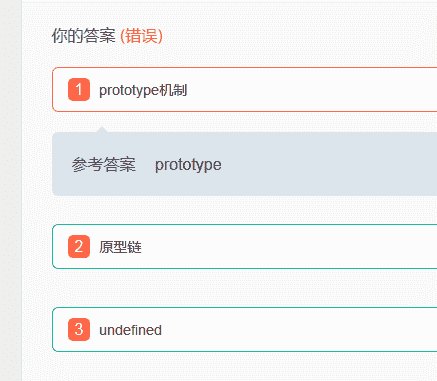
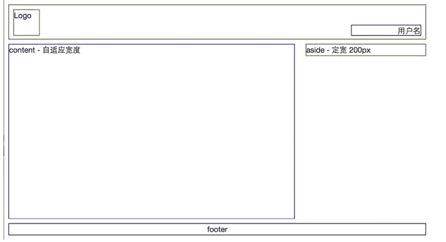

# 阿里巴巴 2016 前端开发工程师笔试(一)

## 1

下列事件哪个不是由鼠标触发的事件（）

正确答案: D   你的答案: 空 (错误)

```cpp
click
```

```cpp
contextmenu
```

```cpp
mouseout
```

```cpp
keydown
```

本题知识点

Javascript 安卓工程师 阿里巴巴 2016 前端工程师

讨论

[sherry_yoonjae](https://www.nowcoder.com/profile/127056)

Dclick 是鼠标点击  查看全部)

编辑于 2016-02-26 12:42:21

* * *

[PrinceCheng](https://www.nowcoder.com/profile/92255114)

常见的事件：    1\. 点击事件：
        1\. onclick：单击事件
        2\. ondblclick：双击事件
    2\. 焦点事件
        1\. onblur：失去焦点
        2\. onfocus:元素获得焦点。

    3\. 加载事件：
        1\. onload：一张页面或一幅图像完成加载。

    4\. 鼠标事件：
        1\. onmousedown    鼠标按钮被按下。
        2\. onmouseup    鼠标按键被松开。
        3\. onmousemove    鼠标被移动。
        4\. onmouseover    鼠标移到某元素之上。
        5\. onmouseout    鼠标从某元素移开。
    5\. 键盘事件：
        1\. onkeydown    某个键盘按键被按下。    
        2\. onkeyup        某个键盘按键被松开。
        3\. onkeypress    某个键盘按键被按下并松开。

    6\. 选择和改变
        1\. onchange    域的内容被改变。
        2\. onselect    文本被选中。

    7\. 表单事件：
        1\. onsubmit    确认按钮被点击。
        2\. onreset    重置按钮被点击。

发表于 2019-03-17 08:57:03

* * *

[Amour1018](https://www.nowcoder.com/profile/306342)

contextmenu   是当浏览者按下鼠标右键出现菜单时或者通过键盘的按键触发页面菜单时触发的事件   [   试试在页面中的 <body>   中加入   onContentMenu="return false"   就可禁止使用鼠标右键了  

发表于 2015-09-20 15:11:50

* * *

## 2

当设置 box-sizing 为 content-box 时，下面关于 CSS 布局的描述，不正确的是？

正确答案: D   你的答案: 空 (错误)

```cpp
块级元素实际占用的宽度与它的 width 属性有关；
```

```cpp
块级元素实际占用的宽度与它的 border 属性有关；
```

```cpp
块级元素实际占用的宽度与它的 padding 属性有关；
```

```cpp
块级元素实际占用的宽度与它的 background 属性有关。
```

本题知识点

阿里巴巴 2016 前端工程师 CSS

讨论

[Mr~](https://www.nowcoder.com/profile/5046346)

注意是不正确的是！！！

发表于 2017-09-23 10:41:50

* * *

[千寻 0409](https://www.nowcoder.com/profile/295167)

块级元素的总的宽度=左右 padding+左右 border+内容区的 width，我们实际设置的 width 指的就是内容区的 width，所以当改变 padding、border、width 中的任一项的时候，块元素的总宽度都会发生变化。

发表于 2016-04-23 22:07:14

* * *

[牛客 720985 号](https://www.nowcoder.com/profile/720985)

最后一个只是对块级元素的背景做修饰，并不能改变大小

发表于 2015-08-18 08:29:26

* * *

## 3

下面有关 html 的描述，不推荐的是？

正确答案: B   你的答案: 空 (错误)

```cpp
在页面顶部添加 doctype 声明；
```

```cpp
在 </head> … <body> 中间插入 HTML 代码；
```

```cpp
避免使用 <font> 标签；
```

```cpp
使用 <table> 元素展现学生成绩表等数据。
```

本题知识点

HTML Javascript 安卓工程师 阿里巴巴 2016 前端工程师

讨论

[千寻 0409](https://www.nowcoder.com/profile/295167)

HTML 代码是插入在..之间，因为 body 是页面的主体部分，我们浏览网页的时候除了标题之外的东西都是在 body 中呈现的

发表于 2016-04-23 22:11:44

* * *

[长腿蟀欧巴](https://www.nowcoder.com/profile/719686)

```cpp
建议使用 CSS 样式（代替 <font>）来定义文本的字体、字体颜色、字体尺寸。
```

发表于 2016-08-06 11:05:53

* * *

[南城夏季](https://www.nowcoder.com/profile/8410240)

C 说的是避免使用，而题干说的是不推荐，即负负得正，推荐使用，那肯定错了啊

发表于 2018-05-31 08:34:41

* * *

## 4

浏览器在一次 HTTP 请求中，需要传输一个 4097 字节的文本数据给服务端，可以采用那些方式?

正确答案: E   你的答案: 空 (错误)

```cpp
存入 IndexdDB
```

```cpp
写入 COOKIE
```

```cpp
放在 URL 参数
```

```cpp
写入 Session
```

```cpp
使用 POST
```

```cpp
放在 Local Storage
```

本题知识点

HTML 安卓工程师 阿里巴巴 2016 前端工程师

讨论

[唱歌去旅行 8](https://www.nowcoder.com/profile/697839)

EIndexdDB 是  查看全部)

编辑于 2015-12-08 14:18:12

* * *

[Amour1018](https://www.nowcoder.com/profile/306342)

IndexdDB 是 HTML5 的本地存储，把一些数据存储到浏览器（客户端）中，当与网络断开时，可以从浏览器中读取数据，用来做一些离线应用。

Cookie 通过在客户端 ( 浏览器 ) 记录信息确定用户身份，最大为 4 kb 。

url 参数用的是 get 方法，从服务器上获取数据，大小不能大于 2 kb 。

Session 是服务器端使用的一种记录客户端状态的机制 。

post 是向服务器传送数据，数据量较大。

local Storage 也是 HTML5 的本地存储，将数据保存在客户端中（一般是永久的）。

发表于 2015-08-31 21:53:14

* * *

[齐冻冻](https://www.nowcoder.com/profile/9030517)

客户端的本地存储：

local Storage 持久性存储，需要手动清除数据

sessionStorage 会话级存储，当网页会话关闭，存储内容被销毁

IndexdDB 离线存储,  当与网络断开时，可以从浏览器中读取数据，用来做一些离线应用。

Cookie 存储用户信息，通过在客户端记录信息确定用户身份，最大为 4 kb 。

传送数据：post 是向服务器传送数据，数据量较大。get  url 参数用的是 get 方法，从服务器上获取数据，大小不能大于 2 kb 。
服务端：Session 服务器端 一种记录客户端状态的机制 。

发表于 2018-12-25 09:33:43

* * *

## 5

下面哪个属性不会让 div 脱离文档流（normal flow）？

正确答案: C   你的答案: 空 (错误)

```cpp
position: absolute;
```

```cpp
position: fixed;
```

```cpp
position: relative;
```

```cpp
float: left;
```

本题知识点

HTML 安卓工程师 阿里巴巴 2016 前端工程师 阿里巴巴 2016

讨论

[星陨无痕](https://www.nowcoder.com/profile/436939)

第一次答的时候就不知道什么是  查看全部)

编辑于 2016-11-06 10:56:45

* * *

[EMO](https://www.nowcoder.com/profile/482955)

补充一下 1 楼没说清楚的地方：所谓的文档流，指的是元素排版布局过程中，元素会自动从左往右，从上往下的流式排列。并最终窗体自上而下分成一行行, 并在每行中按从左至右的顺序排放元素。【 脱离文档流即是元素打乱了这个排列】 ， **或是从排版中拿走** **。**所以我们可以知道，除了 position: absolute;和 position: fixed;会直接将元素从排版中拿走从而脱离文档流之外，设置 float 对象也会 **“打乱这个排列”**从而也被称为脱离文档流。float：right 显然就打乱了从左到右的文档流排列，而为什么说 float：left 也会脱离文档流呢？我的理解是当子元素设置了 float 属性而父元素没有设置（或保持默认的 position:static ），则子元素会从父元素中溢出（即父元素不会根据子元素的大小进行扩大），因为当元素设置了 float 属性之后，其他没有设置 float 属性的盒子会**无视这个元素**，即文档流下面的没有设置浮动的元素会何其进行叠加。即可以当作其脱离了文档流，但需要注意的是，其与 position：absolute 不同的是，其他盒子元素内的文本依然会为 float 元素让出位置，围绕在周围，所以不会看到文本相互叠加的情况，而 absolute 定位的元素则会出现文本叠加。所以亦可以理解为脱离了文档流，这种情况通常**消除浮动**就可以解决。

编辑于 2016-09-06 22:45:21

* * *

[未忆 wy](https://www.nowcoder.com/profile/582478779)

文档流，指的是元素排版布局过程中，元素会自动从左往右，从上往下的流式排列，并最终窗体自上而下分成一行行, 并在每行中按从左至右的顺序排放元素。【脱离文档流即是元素打乱了这个排列】，或是从排版中拿走**。**

css 的定位机制有三种：分别是文档流；浮动(float)；定位(position)。

A: position: absolute 生成绝对定位的元素，相对于 static 定位以外的第一个父元素进行定位；由于绝对定位，脱离了文档流。

B: position: fixed 生成绝对定位的元素，相对于浏览器窗口进行定位，和正常顺序排下来无关。

C: position: relative 生成相对定位的元素，相对于其正常位置进行定位。没有能脱离文档流。

D: float: left 浮动出去，无法保持原位置。

发表于 2019-03-11 17:04:08

* * *

## 6

javascript 语言特性中，有很多方面和我们接触的其他编程语言不太一样，比如说，javascript 语言实现继承机制的核心就是 1，而不是 Java 语言那样的类式继承。Javascript 解析引擎在读取一个 Object 的属性的值时，会沿着 2 向上寻找，如果最终没有找到，则该属性值为 3； 如果最终找到该属性的值，则返回结果。与这个过程不同的是，当 javascript 解析引擎执行“给一个 Object 的某个属性赋值”的时候，如果当前 Object 存在该属性，则改写该属性的值，如果当前的 Object 本身并不存在该属性，则赋值该属性的值 。

你的答案 (错误)

123 参考答案 (1) prototype
(2) 原型链
(3) undefined

本题知识点

Javascript 安卓工程师 阿里巴巴 2016 前端工程师

讨论

[牛客 729291 号](https://www.nowcoder.com/profile/729291)

感觉答案不太对，1 和 2 顺序是不是反了？
“javascript 语言实现继承机制的核心就是 prototype（原型）。”
“会沿着 prototype chain（原型链）向上寻找”
这样感觉更顺一些啊。。。

发表于 2015-08-19 19:53:35

* * *

[七哥陛下](https://www.nowcoder.com/profile/680105)

 这也算错啊，我晕啊，说我排名前 100%是什么意思？没人超过我的分数？

发表于 2015-11-24 19:20:49

* * *

[蒟蒻的菜鸡](https://www.nowcoder.com/profile/779405)

许多 OO 语言都支持两种支持方式：接口继承和实现继承。接口继承只继承方法签名，而实现继承则继承实际方法。由于函数没有签名，在 JS 中无法实现接口继承。JS 只支持实现继承，而且其实现继承主要是依靠原型链来实现.

发表于 2017-04-10 10:24:58

* * *

## 7

填写内容让下面代码支持 a.name = “name1”; b.name = “name2”;function obj(name){    1
}obj.2= "name2";var a = obj("name1");var b = new obj;

你的答案 (错误)

12 参考答案 (1) if(name){ this.name = name;}return this;
(2) prototype.name

本题知识点

Javascript 安卓工程师 阿里巴巴 2016 前端工程师

讨论

[imwtr](https://www.nowcoder.com/profile/379461)

```cpp
// 我讲得好啰嗦.. fun
```

  查看全部)

编辑于 2015-12-15 11:01:58

* * *

[牛客 841725 号](https://www.nowcoder.com/profile/841725)

答案不完美。var a = obj("name1");不通过 new 操作符调用函数时，函数里面的 this 就指向全局对象了（浏览器环境下就是 window）,所以 a、window 指向的都是同一个全局对象。如果 var c = obj("name3")时，a 的值会改变成 name3.因为此时 a、c 都指向 window 对象。提供另一种方式：function obj(name){if (name) {var obj = {};obj.name = name;return obj;}}obj.prototype.name = "name2";var a = obj("name1");var b = new obj;

发表于 2016-05-13 15:35:07

* * *

[Mr.Apple](https://www.nowcoder.com/profile/213669)

1.thisthis 对象 引用的是函数据以执行的环境对象。在全局作用域中调用函数，this 指向 window；当函数被作为某个对象的方法调用时，this 指向 此对象； 匿名函数的执行环境具有全局性，其 this 对象通常指向 window。通过将外部作用域的 this 对象保存到一个闭包可以访问的变量里 闭包，可以让闭包访问非全局变量的值。call()、apply()可改变函数执行环境，从而改变 this 指向。2.prototype（1）原型对象、构造函数、对象实例之间的关系：创建新函数，会根据一组特定的规则为该函数创建一个 prototype 属性，该属性指向函数的原型对象；默认情况下，所有原型对象会自己动获取一个 constructor 属性，该属性指向 prototype 属性所在函数；调用构造函数创建新实例，该实例内部包含一个内部属性[[Prototype]]指向构造函数的原型对象。注意：连接存在于实例与构造函数的原型对象之间，而不是存在于实例与构造函数之间。（2）属性搜索每当代码读取某个对象的的某个属性的时候，都会执行一次搜索，目标是具有给定名字的属性。搜索首先从对象实例本身开始，若找到则返回该属性的值，若找不到则继续搜索指针指向的原型对象。（3）属性 设置设置原型对象属性：Object.prototype.prototypeName=prototypeValue;为对象实例添加 属性：Object.propertyName=propertyValue;为对象实例添加一个属性时，这个属性会屏蔽原型对象中保存的同名属性。3.使用 new 操作符调用函数创建实例的执行步骤（1）创建一个新对象；（2）将函数的作用域赋给新对象（this 指向新对象）；（3）执行函数中的代码；（4）返回新对象。4.代码解析

```cpp
//创建全局函数
function obj(name){
    if(name){
        this.name = name;
    }
    return this;//返回 this 引用
}
obj.prototype.name = "name2";//设置原型对象
var a = obj("name1");//直接调用函数，this 等于 window，a 等于 window。
var b = new obj;//等价于 var b = new obj();调用函数实例化对象，this 指向 obj。
```

编辑于 2016-07-26 16:39:14

* * *

## 8

输出对象中值大于 2 的 key 的数组 var data = {a: 1, b: 2, c: 3, d: 4};Object.keys(data).filter(function(x) { return 1;})期待输出：[“c”,”d”]

你的答案 (错误)

1 参考答案 (1) data[x]>2

本题知识点

Javascript 安卓工程师 阿里巴巴 2016 前端工程师

讨论

[Mr.Apple](https://www.nowcoder.com/profile/213669)

Object.keys(Object)Array.filter(function)Object 是包含属性和方法的对象， 可以是创建的对象或现有文档对象模型 (DOM) 对象。Object.keys(object)的返回值是 一个数组，其中包含对象的可枚举属性和方法的名称。Array.filter(function)对数组进行过滤返回符合条件的数组。Object.keys(data)的返回值为数组["a","b","c","d"]，经过 filter(function(x) { return ; })过滤，返回值大于 2 的 key 的数组。x 为返回数组的属性名称即“a"、"b"、"c"、“d”，则对应的属性值为 data[x]，比较语句为 data[x]>2。 编辑于 2016-07-25 21:35:52

* * *

[冉客](https://www.nowcoder.com/profile/221684)

 x>"b"不对吗

发表于 2015-09-03 17:50:51

* * *

[最讨厌晚上 9 点半，钉钉响起的声音](https://www.nowcoder.com/profile/303433)

1）filter 属于数组的迭代方法。而 data 是对象,对象无法调用数组的方法。keys 方法可以取得所有可以“枚举的”的“实例属性”。console.log(Object.keys(data)) = ["a", "b", "c", "d"]；  //对象 data 的可枚举实例属性的集合。2）此时式子变成了下面这样：console.log(["a", "b", "c", "d"].filter(function(x) { return x > 2;})) //输出空  ，因为字母字符串与数值比较，还会被转化成 NaN，此时应该通过最开始的对象 data 结合对象的属性数组，取对象的值。 x 是当前元素的值:        x = "a"   data["a"] = 1,         x = "b"   data["b"] = 2,         x = "c"   data["c"] = 3,         x = "d"   data["d"] = 4,ps：filter 方法的用法：http://www.runoob.com/jsref/jsref-filter.html3）总结过程如下：①对象的属性组成数组                              ②通过对象的属性数组，去调用对象的值 4)套路套路套路，全是套路。

发表于 2017-03-23 00:55:14

* * *

## 9

请实现一个 fibonacci 函数，要求其参数和返回值如下所示：

```cpp
/**
 *@desc: fibonacci
 *@param: count {Number}
 *@return: result {Number} 第 count 个 fibonacci 值，计数从 0 开始
  fibonacci 数列为：[1, 1, 2, 3, 5, 8, 13, 21, 34 …]
  则 getNthFibonacci(0)返回值为 1
  则 getNthFibonacci(4)返回值为 5
 */
function getNthFibonacci(count) {
}
```

你的答案

本题知识点

Javascript 安卓工程师 阿里巴巴 2016 前端工程师

讨论

[绯想天灬炽](https://www.nowcoder.com/profile/207911)

此题应该避免使用递归的方法，  查看全部)

编辑于 2015-12-02 19:38:54

* * *

[Dophin](https://www.nowcoder.com/profile/956409)

这道题核心是递归，看大家都能做，不过有些细节可能没考虑到，比如说参数的判断：

```cpp
function fib(count) {
    //参数判断
    var count = parseInt(count);
    if (isNaN(count) || count < 0) {
        return 0;
    }

    function f(count) {
        if (count <= 1)
            return 1;
        return arguments.callee(count - 1) + arguments.callee(count - 2);    //callee 是装逼用的，直接用 f 也行
    }
    return f(count);
}

```

编辑于 2015-08-18 15:11:20

* * *

[小磊哥 er](https://www.nowcoder.com/profile/582304)

```cpp
function getNthFibonacci(count){
    if(count < 2){
        return 1;
    }else{
        return getNthFibonacci(count - 1) + getNthFibonacci(count -2)
    }
}
```

Fibonacci 数列的数学表达式就是：F(n) = F(n-1) + F(n-2)F(1) = 1F(2) = 1

发表于 2015-09-06 16:42:19

* * *

## 10

实现如下页面布局。核心区域左侧自适应，右侧固定宽度 200px

你的答案

本题知识点

HTML 安卓工程师 阿里巴巴 2016 前端工程师

讨论

[幻狐岚](https://www.nowcoder.com/profile/547589)

```cpp
<!DOCTYPE html>
<meta charset=utf-8>
<html>
<head>
	<title>alibaba</title>
	<style type="text/css">
		.header{
			overflow: hidden;
			margin: 5px;
			border: 1px solid #000;
			height: 70px;
		}
		.main{
			margin: 5px;
			overflow: hidden;
/*			border: 1px solid #000;*/
		}
		.footer{
			text-align: center;
			margin: 5px;
			border: 1px solid #000;
		}
		.logo{
			width: 50px;
			height: 50px;
			float: left;
			margin: 10px;
			border: 1px solid #000;
		}
		.username{
			border: 1px solid #000;
			float: right;
			width: 140px;
			height: 20px;
			margin-top: 40px;
			margin-right: 10px;
			text-align: right;
		}
		.column{
			border: 1px solid #000;
		}
		.left{
			float: left;
			width: 100%;

		}
		.right{
			float: left;
			width: 200px;
			margin-left: -204px;
		}
		.real{
			margin-right: 210px;
			border: 1px solid blue;
			height: 300px;
		}
	</style>
</head>
<body>
	<div class="header">
		<div class="logo">logo</div>
		<div class="username">用户名</div>
	</div>
	<div class="main">
		<div class="left column">
			<div class="real">content - 自适应宽度</div>
		</div>
		<dis class="right column">aside - 定宽 200px</div>
	</div>
	<div class="footer">footer</div>
</body>
</html>

```

参考了淘宝的双飞翼布局，column 类均左浮动，侧边栏 aside 通过负值左外边距得以和 left column 共处一行，而真正的自适应内容则放置在 left column 的内部，使用右外边距得以和 right column 保持固定距离

编辑于 2015-09-15 16:15:54

* * *

[汉堡鸡肉卷鸡腿鸡翅](https://www.nowcoder.com/profile/502086)

```cpp
<!DOCTYPE html>
<html lang="en">
<head>
	<meta charset="UTF-8">
	<title>Document</title>
	<style>
		header footer div{
			border: 1px solid red;
		}
		header{
			width: 100%;
			height: auto;
			border: 1px solid red;
			margin-bottom: 10px;
			position: relative;
		}
		.content{
			border: 1px solid blue;
		}
		.logo{
			height: 100px;
			width: 100px;
			float: left;
			border: 1px solid red;
			margin: 10px;
		}
		.user{
			position:absolute;
			height: 50px;
			width: 200px;
			float: right;
			border: 1px solid red;
			bottom: 10px;
			right: 10px;
		}
		.aside{
			float: right;
			width: 200px;
			border: 1px solid red;
			height: 100px;
			margin-left: 10px;
		}
		.clear{
			clear: both;
			line-height: 0;
			height: 0;
		}
		.content{
			height: 500px;
			border: 1px solid red;
			margin-right: 200px;
			float: left;
		}
		footer{
			width: 100%;
			height: 100px;
			border: 1px solid red;
			margin-top: 10px;
		}
	</style>
</head>
<body>
	<header>
		<div class="logo"></div>
		<div class="user"></div>
		<div class="clear"></div>
	</header>
	<div class="content">左侧内容</div>
	<div class="aside"></div>
	<div class="clear"></div>
	<footer></footer>
</body>
</html>
```

编辑于 2015-10-12 18:02:39

* * *

[Mrniu](https://www.nowcoder.com/profile/840888)

不明白为什么 HTML 中左侧右侧 div 必须得前后位置调换才可以呢，不能先左边后右边呢？？？

发表于 2015-08-18 10:56:49

* * *