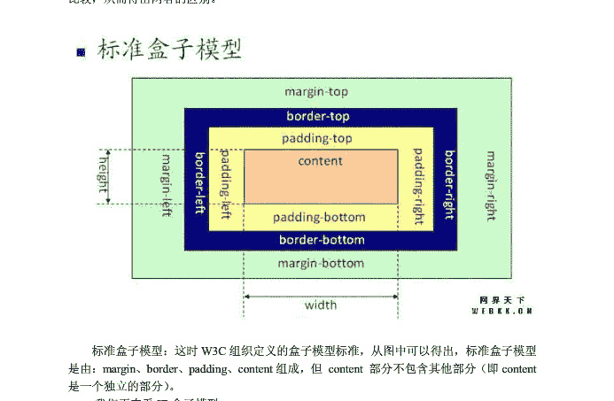
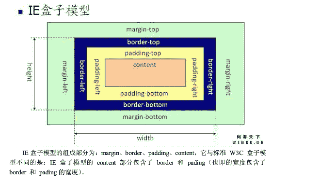
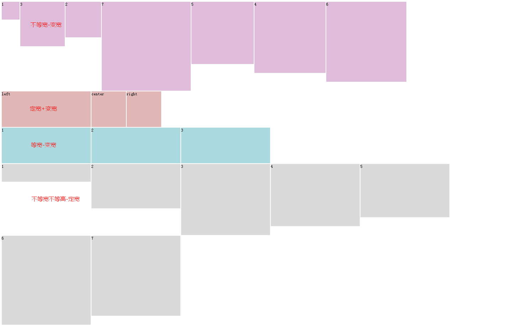
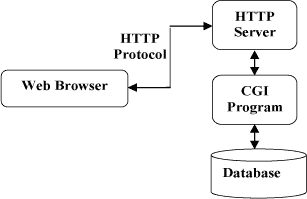
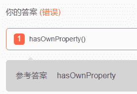
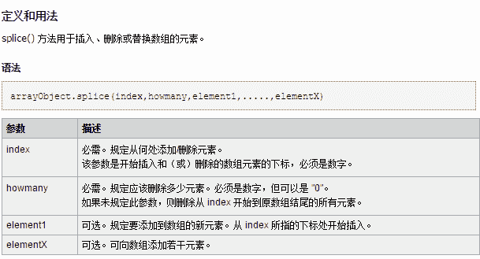

# 阿里巴巴 2016 前端开发工程师笔试(二)

## 1

下列哪个操作是 W3C 标准定义的阻止事件向父容器传递：

正确答案: C   你的答案: 空 (错误)

```cpp
e.preventDefault()
```

```cpp
e.cancelBubble=true
```

```cpp
e.stopPropagation()
```

```cpp
e.stopImmediatePropagation()
```

本题知识点

HTML 安卓工程师 阿里巴巴 2016 前端工程师

讨论

[醒醒鱼](https://www.nowcoder.com/profile/793318)

DOM 中的事件对象：（符合 W3C 标准）   preventDefault()        取消事件默认行为   stopImmediatePropagation() 取消事件冒泡同时阻止当前节点上的事件处理程序被调用。   stopPropagation()      取消事件冒泡对当前节点无影响。IE 中的事件对象：   cancelBubble()          取消事件冒泡   returnValue()             取消事件默认行为

发表于 2015-08-29 11:42:09

* * *

[唱歌去旅行 8](https://www.nowcoder.com/profile/697839)

event.preventDefault();// 取消事件的默认行为  

event.stopPropagation(); // 阻止事件冒泡行为 , 符合 W3C 标准，适用于 FireFox 等

cancelBubble  // 阻止事件冒泡行为，不符合 W3C 标准，适用于 IE

stopImmediatePropagation 防止对事件流中当前节点中和所有后续节点中的事件侦听器进行处理。此方***立即生效，并且会影响当前节点中的事件侦听器。

stopPropagation 防止对事件流中当前节点的后续节点中的所有事件侦听器进行处理。此方法不会影响当前节点 (currentTarget) 中的任何事件侦听器。

发表于 2015-08-27 11:29:24

* * *

[生命的力量](https://www.nowcoder.com/profile/595448)

[`www.360doc.com/content/11/0322/11/2923250_103458975.shtml`](http://www.360doc.com/content/11/0322/11/2923250_103458975.shtml)

发表于 2015-08-21 17:08:40

* * *

## 2

以下关于盒子模型描述正确的是：

正确答案: A   你的答案: 空 (错误)

```cpp
标准盒子模型中：盒子的总宽度 ＝ 左右 margin + 左右 border + 左右 padding + width
```

```cpp
IE 盒子模型中：盒子总宽度 ＝ 左右 margin + 左右 border + width
```

```cpp
标准盒子模型中：盒子的总宽度 ＝ 左右 margin + 左右 border + width
```

```cpp
IE 盒子模型中：盒子总宽度 ＝ width
```

本题知识点

HTML 安卓工程师 阿里巴巴 2016 前端工程师 阿里巴巴 2016

讨论

[kcoyy](https://www.nowcoder.com/profile/851850)




编辑于 2015-08-24 16:14:05

* * *

[Amour1018](https://www.nowcoder.com/profile/306342)

IE 盒子模型和标准盒子模型都是由四个部分组成的：margin,border,padding,content 这四个部分！！！不同的是在标准盒子模型中 content 是一个独立的部分不包含其他部分！！但是在 IE 盒子模型中 content 包含了 border,padding,是一个总体的概念！！

发表于 2015-09-20 11:18:47

* * *

[醒醒鱼](https://www.nowcoder.com/profile/793318)

标准 W3C 模型：宽度 = margin*2 + border*2 + padding*2 + widthIE 模型： 宽度 = margin*2 + width

发表于 2015-08-29 11:51:02

* * *

## 3

使用 CSS 的 flexbox 布局，不能实现以下哪一个效果：

正确答案: D   你的答案: 空 (错误)

```cpp
三列布局，随容器宽度等宽弹性伸缩
```

```cpp
多列布局，每列的高度按内容最高的一列等高
```

```cpp
三列布局，左列宽度像素数确定，中、右列随容器宽度等宽弹性伸缩
```

```cpp
多个宽高不等的元素，实现无缝瀑布流布局
```

本题知识点

安卓工程师 阿里巴巴 2016 前端工程师 CSS

讨论

[Mr.Apple](https://www.nowcoder.com/profile/213669)

**HTML**<h1>不等宽不等高（定宽） </h1><div class="box box1">    <div class="flex-box" style="width:100px;height:100px;">1</div>    <div class="flex-box" style="width:250px;height:250px;">3</div>    <div class="flex-box" style="width:200px;height:200px;">2</div>    <div class="flex-box" style="width:350px;height:350px;">5</div>    <div class="flex-box" style="width:400px;height:400px;">4</div>    <div class="flex-box" style="width:500px;height:500px;">7</div>    <div class="flex-box" style="width:450px;height:450px;">6</div></div><h1>不 等宽 等高（ 定宽+变宽）</h1><div class="box box2">    <div class="left flex-box">left</div>    <div class="center flex-box">center</div>    <div class="right flex-box">right</div></div><h1>等宽 等高（变宽） </h1><div class="box box3">    <div class="flex-box">1</div>    <div class="flex-box">2</div>    <div class="flex-box">3</div></div><h1>等宽不等高 （定宽） </h1><div class="box box4">    <div class="flex-box" style="height:100px;">1</div>    <div class="flex-box" style="height:250px;">2</div>    <div class="flex-box" style="height:400px;">3</div>    <div class="flex-box" style="height:350px;">4</div>    <div class="flex-box" style="height:300px;">5</div>    <div class="flex-box" style="height:500px;">6</div>    <div class="flex-box" style="height:450px;">7</div></div>**CSS**.box {    display: -webkit-flex;    display: flex;    flex-direction: row;    flex-wrap:nowrap;    justify-content: flex-start;    align-items: stretch;    align-content: flex-start;}.flex-box{    height:200px;    width:500px;    background-color:#ddd;    border:1px solid #fff;}.box1 .flex-box{    background-color:#E0BCDB;}.box2 .flex-box{    background-color:#E0B6B6;    **width:800px;**
}.left{**    flex-shrink:0;//空间不足时不允许左侧缩小**}.box3 .flex-box{    background-color:#ABD9E0;    **width:900px;**}.box4{**    flex-wrap: wrap;//空间不足换行**}.box4 .flex-box{    background-color:#dadada;}

发表于 2016-07-27 17:57:19

* * *

[南音](https://www.nowcoder.com/profile/690576)

Flexbox 可以简单快速的创建一个具有弹性功能的布局，当在一个小屏幕上显示的时候，Flexbox 可以让元素在容器(伸缩容器)中进行自由扩展和收缩，从而容易调整整个布局。它的目的是使用常见的布局模式，比如说三列布局，可以非常简单的实现。一个 Flexbox 布局是由一个伸缩容器(flex containers)和在这个容器里的伸缩项目(flex items)组成。 伸缩容器(flex  containers)是一个 HTML 标签元素，并且“display”属性显式的设置了“flex”属性值。在伸缩容器中的所有子元素都会自动变成伸缩项目(flex  items)。

发表于 2015-08-21 16:05:41

* * *

[方泉水很甜](https://www.nowcoder.com/profile/695496)

align-items :  stretch 可以实现多列布局，每列的高度按内容最高的一列等高

发表于 2016-03-17 22:09:05

* * *

## 4

关于 HTML 语义化，以下哪个说法是正确的？

正确答案: D   你的答案: 空 (错误)

```cpp
语义化的 HTML 有利于机器的阅读，如 PDA 手持设备、搜索引擎爬虫，但不利于人的阅读
```

```cpp
Table 属于过时的标签，遇到数据列表时，需尽量使用 div 来模拟表格
```

```cpp
语义化是 HTML5 带来的新概念，此前版本的 HTML 无法做到语义化
```

```cpp
header、article 都属于语义化明确的标签
```

本题知识点

HTML 安卓工程师 阿里巴巴 2016 前端工程师

讨论

[生命的力量](https://www.nowcoder.com/profile/595448)

关于 html 语义化的一些参考[`www.cnblogs.com/freeyiyi1993/p/3615179.html`](http://www.cnblogs.com/freeyiyi1993/p/3615179.html)

发表于 2015-08-21 17:16:48

* * *

[cquptli](https://www.nowcoder.com/profile/913077)

**1、什么是 HTML 语义化？**

<基本上都是围绕着几个主要的标签，像标题（H1~H6）、列表（li）、强调（strong em）等等>

根据内容的结构化（内容语义化），选择合适的标签（代码语义化）便于开发者阅读和写出更优雅的代码的同时让浏览器的爬虫和机器很好地解析。

**2、为什么要语义化？**

*   为了在没有 CSS 的情况下，页面也能呈现出很好地内容结构、代码结构:为了裸奔时好看；
*   用户体验：例如 title、alt 用于解释名词或解释图片信息、label 标签的活用；
*   有利于[SEO](http://baike.baidu.com/view/1047.htm) ：和搜索引擎建立良好沟通，有助于爬虫抓取更多的有效信息： [爬虫](http://baike.baidu.com/view/998403.htm)依赖于标签来确定上下文和各个关键字的权重；
*   方便其他设备解析（如屏幕阅读器、盲人阅读器、移动设备）以意义的方式来渲染网页；
*   便于团队开发和维护，语义化更具可读性，是下一步吧网页的重要动向，遵循 W3C 标准的团队都遵循这个标准，可以减少差异化。

**3、写 HTML 代码时应注意什么？**

*   尽可能少的使用无语义的标签 div 和 span；
*   在语义不明显时，既可以使用 div 或者 p 时，尽量用 p, 因为 p 在默认情况下有上下间距，对兼容特殊终端有利；
*   不要使用纯样式标签，如：b、font、u 等，改用 css 设置。
*   需要强调的文本，可以包含在 strong 或者 em 标签中（浏览器预设样式，能用 CSS 指定就不用他们），strong 默认样式是加粗（不要用 b），em 是斜体（不用 i）；
*   使用表格时，标题要用 caption，表头用 thead，主体部分用 tbody 包围，尾部用 tfoot 包围。表头和一般单元格要区分开，表头用 th，单元格用 td；
*   表单域要用 fieldset 标签包起来，并用 legend 标签说明表单的用途；
*   每个 input 标签对应的说明文本都需要使用 label 标签，并且通过为 input 设置 id 属性，在 lable 标签中设置 for=someld 来让说明文本和相对应的 input 关联起来。

[`www.cnblogs.com/freeyiyi1993/p/3615179.html`](http://www.cnblogs.com/freeyiyi1993/p/3615179.html)

发表于 2017-03-25 09:56:11

* * *

[俩啊呜](https://www.nowcoder.com/profile/7887553)

1、什么是 HTML 语义化？ 根据内容的结构化（内容语义化），选择合适的标签（代码语义化）便于开发者阅读和写出更优雅的代码的同时让浏览器的爬虫和机器很好地解析。 2、为什么要语义化？ 为了在没有 CSS 的情况下，页面也能呈现出很好地内容结构、代码结构:为了裸奔时好看； 用户体验：例如 title、alt 用于解释名词或解释图片信息、label 标签的活用； 有利于 SEO ：和搜索引擎建立良好沟通，有助于爬虫抓取更多的有效信息： 爬虫依赖于标签来确定上下文和各个关键字的权重； 方便其他设备解析（如屏幕阅读器、盲人阅读器、移动设备）以意义的方式来渲染网页； 便于团队开发和维护，语义化更具可读性，是下一步吧网页的重要动向，遵循 W3C 标准的团队都遵循这个标准，可以减少差异化。 3、写 HTML 代码时应注意什么？ 尽可能少的使用无语义的标签 div 和 span； 在语义不明显时，既可以使用 div 或者 p 时，尽量用 p, 因为 p 在默认情况下有上下间距，对兼容特殊终端有利； 不要使用纯样式标签，如：b、font、u 等，改用 css 设置。 需要强调的文本，可以包含在 strong 或者 em 标签中（浏览器预设样式，能用 CSS 指定就不用他们），strong 默认样式是加粗（不要用 b），em 是斜体（不用 i）； 使用表格时，标题要用 caption，表头用 thead，主体部分用 tbody 包围，尾部用 tfoot 包围。表头和一般单元格要区分开，表头用 th，单元格用 td； 表单域要用 fieldset 标签包起来，并用 legend 标签说明表单的用途； 每个 input 标签对应的说明文本都需要使用 label 标签，并且通过为 input 设置 id 属性，在 lable 标签中设置 for=someld 来让说明文本和相对应的 input 关联起来。 http://www.cnblogs.com/freeyiyi1993/p/3615179.html

发表于 2017-03-27 18:27:59

* * *

## 5

关于 HTTP 协议，下面哪个说法是正确的？

正确答案: C   你的答案: 空 (错误)

```cpp
HTTP 协议是有状态协议。
```

```cpp
以下是一个 Http 链接的 response 的响应头： GET /xxx/xxx/js/lib/test.js HTTP/1.1 Host: 127.0.0.1 Connection: keep-alive Pragma: no-cache Cache-Control: no-cache Accept: */*
```

```cpp
RESTful 接口中，利用 HTTP 协议的 method 字段来描述要对资源操作的方式，比如 GET 表示获取资源，POST 表示新增一个资源，PUT 表示更新资源,DELETE 表示删除资源等等。
```

```cpp
一个 HTTP 请求返回的 HTTP 状态码中，304 表示临时重定向。
```

本题知识点

HTML 安卓工程师 阿里巴巴 2016 前端工程师 阿里巴巴 2016

讨论

[Amour1018](https://www.nowcoder.com/profile/306342)

A 错误，http 是无状态的  查看全部)

编辑于 2016-05-28 14:58:42

* * *

[Mr.Apple](https://www.nowcoder.com/profile/213669)

HTTP 协议

1.简介 HTTP 协议（Hyper Text Transfer Protocol，超文本传输协议）,是用于从万维网（WWW:World Wide Web ）服务器传输超文本到本地浏览器的传送协议。HTTP 基于 TCP/IP 通信协议来传递数据。HTTP 基于客户端/服务端（C/S）架构模型，通过一个可靠的链接来交换信息，是一个无状态的请求/响应协议。2.特点（1）HTTP 是无连接：无连接的含义是限制每次连接只处理一个请求。服务器处理完客户的请求，并收到客户的应答后，即断开连接。采用这种方式可以节省传输时间。（2）HTTP 是媒体独立的：只要客户端和服务器知道如何处理的数据内容，任何类型的数据都可以通过 HTTP 发送。客户端以及服务器指定使用适合的 MIME-type 内容类型。（3）HTTP 是无状态：无状态是指协议对于事务处理没有记忆能力。缺少状态意味着如果后续处理需要前面的信息，则它必须重传，这样可能导致每次连接传送的数据量增大。另一方面，在服务器不需要先前信息时它的应答就较快。2.通信流程 
4.消息结构

HTTP 使用统一资源标识符（Uniform Resource Identifiers, URI）来传输数据和建立连接。一旦建立连接后，数据消息就通过类似 Internet 邮件所使用的格式[RFC5322]和多用途 Internet 邮件扩展（MIME）[RFC2045]来传送。

客户端请求消息：请求行、请求头部、空行和请求数据。

| 1234 | GET /hello.txt HTTP/1.1 User-Agent: curl/7.16.3 libcurl/7.16.3 OpenSSL/0.9.7l zlib/1.2.3 Host: www.example.com Accept-Language: en, mi |

服务端响应消息：状态行、消息报头、空行和响应正文。

| 123456789 | HTTP/1.1 200 OKDate: Mon, 27 Jul 2009 12:28:53 GMTServer: ApacheLast-Modified: Wed, 22 Jul 2009 19:15:56 GMTETag: "34aa387-d-1568eb00"Accept-Ranges: bytesContent-Length: 51Vary: Accept-EncodingContent-Type: text/plain |

5.请求方法 GET 请求指定的页面信息，并返回实体主体。HEAD    类似于 get 请求，只不过返回的响应中没有具体的内容，用于获取报头 POST  向指定资源提交数据进行处理请求（例如提交表单或者上传文件）。数据被包含在请求体中。POST 请求可能会导致新的资源的建立和/或已有资源的修改。PUT 从客户端向服务器传送的数据取代指定的文档的内容。DELETE  请求服务器删除指定的页面。CONNECT HTTP/1.1 协议中预留给能够将连接改为管道方式的***服务器。OPTIONS 允许客户端查看服务器的性能。TRACE   回显服务器收到的请求，主要用于测试或诊断。6.状态码 HTTP 状态码分类 
1** 信息，服务器收到请求，需要请求者继续执行操作 2** 成功，操作被成功接收并处理 3** 重定向，需要进一步的操作以完成请求 4** 客户端错误，请求包含语法错误或无法完成请求 5** 服务器错误，服务器在处理请求的过程中发生了错 HTTP 状态码列表 100 Continue    继续。客户端应继续其请求 101 Switching Protocols 切换协议。服务器根据客户端的请求切换协议。只能切换到更高级的协议，例如，切换到 HTTP 的新版本协议 200 OK  请求成功。一般用于 GET 与 POST 请求 201 Created 已创建。成功请求并创建了新的资源 202 Accepted    已接受。已经接受请求，但未处理完成 203 Non-Authoritative Information   非授权信息。请求成功。但返回的 meta 信息不在原始的服务器，而是一个副本 204 No Content  无内容。服务器成功处理，但未返回内容。在未更新网页的情况下，可确保浏览器继续显示当前文档 205 Reset Content   重置内容。服务器处理成功，用户终端（例如：浏览器）应重置文档视图。可通过此返回码清除浏览器的表单域 206 Partial Content 部分内容。服务器成功处理了部分 GET 请求 300 Multiple Choices    多种选择。请求的资源可包括多个位置，相应可返回一个资源特征与地址的列表用于用户终端（例如：浏览器）选择 301 Moved Permanently   永久移动。请求的资源已被永久的移动到新 URI，返回信息会包括新的 URI，浏览器会自动定向到新 URI。今后任何新的请求都应使用新的 URI 代替 302 Found   临时移动。与 301 类似。但资源只是临时被移动。客户端应继续使用原有 URI303 See Other   查看其它地址。与 301 类似。使用 GET 和 POST 请求查看 304 Not Modified    未修改。所请求的资源未修改，服务器返回此状态码时，不会返回任何资源。客户端通常会缓存访问过的资源，通过提供一个头信息指出客户端希望只返回在指定日期之后修改的资源 305 Use Proxy   使用***。所请求的资源必须通过***访问 306 Unused  已经被废弃的 HTTP 状态码 307 Temporary Redirect  临时重定向。与 302 类似。使用 GET 请求重定向 400 Bad Request 客户端请求的语法错误，服务器无法理解 401 Unauthorized    请求要求用户的身份认证 402 Payment Required    保留，将来使用 403 Forbidden   服务器理解请求客户端的请求，但是拒绝执行此请求 404 Not Found   服务器无法根据客户端的请求找到资源（网页）。通过此代码，网站设计人员可设置"您所请求的资源无法找到"的个性页面 405 Method Not Allowed  客户端请求中的方法被禁止 406 Not Acceptable  服务器无法根据客户端请求的内容特性完成请求 407 Proxy Authentication Required   请求要求***的身份认证，与 401 类似，但请求者应当使用***进行授权 408 Request Time-out    服务器等待客户端发送的请求时间过长，超时 409 Conflict    服务器完成客户端的 PUT 请求是可能返回此代码，服务器处理请求时发生了冲突 410 Gone    客户端请求的资源已经不存在。410 不同于 404，如果资源以前有现在被永久删除了可使用 410 代码，网站设计人员可通过 301 代码指定资源的新位置 411 Length Required 服务器无法处理客户端发送的不带 Content-Length 的请求信息 412 Precondition Failed 客户端请求信息的先决条件错误 413 Request Entity Too Large    由于请求的实体过大，服务器无法处理，因此拒绝请求。为防止客户端的连续请求，服务器可能会关闭连接。如果只是服务器暂时无法处理，则会包含一个 Retry-After 的响应信息 414 Request-URI Too Large   请求的 URI 过长（URI 通常为网址），服务器无法处理 415 Unsupported Media Type  服务器无法处理请求附带的媒体格式 416 Requested range not satisfiable 客户端请求的范围无效 417 Expectation Failed  服务器无法满足 Expect 的请求头信息 500 Internal Server Error   服务器内部错误，无法完成请求 501 Not Implemented 服务器不支持请求的功能，无法完成请求 502 Bad Gateway 充当网关或***的服务器，从远端服务器接收到了一个无效的请求 503 Service Unavailable 由于超载或系统维护，服务器暂时的无法处理客户端的请求。延时的长度可包含在服务器的 Retry-After 头信息中 504 Gateway Time-out    充当网关或***的服务器，未及时从远端服务器获取请求 505 HTTP Version not supported  服务器不支持请求的 HTTP 协议的版本，无法完成处理

发表于 2016-07-27 15:52:06

* * *

[Ling。](https://www.nowcoder.com/profile/150942)

A 错误，http 是无状态的 B 错误，后面的是 request 头 C 正确，GET 表示获取资源，POST 表示新增一个资源，PUT 表示更新资源,DELETE 表示删除资源等等 D 错误，状态码 304 表示：如果客户端发送了一个带条件的 GET 请求且该请求已被允许，而文档的内容（自上次访问以来或者根据请求的条件）并没有改变，则服务器应当返回这个状态码。

发表于 2015-08-21 09:02:48

* * *

## 6

使用 for in 循环数组中的元素会枚举原型链上的所有属性，过滤这些属性的方式是使用 1 函数

你的答案 (错误)

1 参考答案 (1) hasOwnProperty

本题知识点

Javascript 安卓工程师 阿里巴巴 2016 前端工程师

讨论

[sally127](https://www.nowcoder.com/profile/364472)

醉了

发表于 2015-08-21 15:05:55

* * *

[windybaby](https://www.nowcoder.com/profile/947782)

```cpp
for in 可以获取 object 的所有属性,包括自定义属性以及原型链属性。
for(var attr in object){
　　console.log(attr+":"object[attr]);
}  hasOwnProperty()只能获取自定义属性，无法获取原型链属性。 “str”.hasOwnProperty("split");//false
String.property.hasOwnProperty("split");//true
```

发表于 2015-08-26 21:14:31

* * *

[阿琛 Bonnie](https://www.nowcoder.com/profile/737314)

```cpp
function Person() {
}

Person.prototype.name="Nicholas";
Person.prototype.age=29;
Person.prototype.sayName=function(){
    alert(this.name);
}

var person1=new Person();
person1.name="Greg";

var person2=new Person();

console.log(person1.hasOwnProperty("name"));//true
console.log(person2.hasOwnProperty("name"));//false

console.log("name" in person1);//true
console.log("name" in person2);//true

for (var prop in person1) {
    console.log(prop);//name   age   sayName
}

function hasPrototypeProperty(object,pro) {//如此可判断存在于原型中的属性
    return (!object.hasOwnProperty(pro))&&(pro in object);
}
console.log(hasPrototypeProperty(person1,"name"));//false
console.log(hasPrototypeProperty(person2,"name"));//true

```

发表于 2016-03-09 17:23:39

* * *

## 7

在空白处填入适当的代码使输出结果成立：function showMoney( ) {1};var personA = new Object;var personB = new Object;personA.money= "100";personB.money= "150";personA.showMoney= showMoney;personB.showMoney= showMoney;输出结果：console.log(personA.showMoney( )); //"100"console.log(personB.showMoney( )); //"150"

你的答案 (错误)

1 参考答案 (1) return this.money;

本题知识点

Javascript 安卓工程师 阿里巴巴 2016 前端工程师

讨论

[我不再叫阿脞](https://www.nowcoder.com/profile/596982)

[图]不注意看原代码，没有  查看全部)

编辑于 2018-05-03 09:40:58

* * *

[D 小七](https://www.nowcoder.com/profile/719530)

```cpp
//题目写的是输出结果，而 return 是不会输出，只会返回，我的答案让人哭笑不得
console.log(this.money);
//如果把题干改成这样也许会比较没有歧义
console.log(personA.showMoney());//"100"
console.log(personB.showMoney());//"150"
```

发表于 2015-08-22 14:43:07

* * *

[一位有礼貌的先生](https://www.nowcoder.com/profile/313111)

没带分号、、也算错。。好吧。。

发表于 2015-09-08 18:19:11

* * *

## 8

删除给定数组中的第二项和第三项，并且在得到的新的数组中第一项后面添加一个新的值 var arr1 = ['a','b','c','d','e'];var arr2 = arr1.1(2,3,'newvalue')

你的答案 (错误)

123 参考答案 (1) splice
(2) 1
(3) 2

本题知识点

Javascript 安卓工程师 阿里巴巴 2016 前端工程师

讨论

[玉之散打](https://www.nowcoder.com/profile/807665)



发表于 2015-09-06 14:01:08

* * *

[craftsman](https://www.nowcoder.com/profile/362973)

这个问题主要是在考查 js 中 Array 对象的 splice 方法，但是问题描述的是不是有点问题啊，

> 删除给定数组中的第二项和第三项，并且在得到的新的数组中第二项后面添加一个新的值

我感觉按问题描述来做，应该是这样的吧：从 var arr1 = ['a','b','c','d','e']; 到 arr1 = ['a','d','e']; 到 arr1 = ['a','d','newvalue','e'];可是按答案代码来执行得到的是 arr1 = ['a','newvalue','d','e']吧。不知道是不是我小学语文没学好？

发表于 2016-01-11 22:05:11

* * *

[D 小七](https://www.nowcoder.com/profile/719530)

```cpp
//下面返回的是删除的部分
console.log(arr2)；
//下面返回的才是更改后的结果
console.log(arr1);
```

发表于 2015-08-22 14:36:46

* * *

## 9

写一个求和的函数 sum，达到下面的效果

```cpp
// Should equal 15
sum(1, 2, 3, 4, 5);
// Should equal 0
sum(5, null, -5);
// Should equal 10
sum('1.0', false, 1, true, 1, 'A', 1, 'B', 1, 'C', 1, 'D', 1,
  'E', 1, 'F', 1, 'G', 1);
// Should equal 0.3, not 0.30000000000000004
sum(0.1, 0.2);
```

你的答案

本题知识点

Javascript 安卓工程师 阿里巴巴 2016 前端工程师

讨论

[小小](https://www.nowcoder.com/profile/59)

```cpp
function sum() 
```

  查看全部)

编辑于 2016-11-02 08:55:18

* * *

[方泉水很甜](https://www.nowcoder.com/profile/695496)

window.parseFloat(arguments[i]) || 0   parseFloat 的结果要么为一个小数，要么为 NaN，||运算如果前一个为真则不计算后一个，直接返回前一个表达式的值，如果是 NaN 则返回后一个表达式的值；nResult.toFixed(3) * 1000 / 1000 这个是在做：保留三位小数，并且去掉末尾的 0，最后一位会进行四舍五入。

发表于 2016-03-17 22:22:32

* * *

[星陨无痕](https://www.nowcoder.com/profile/436939)

```cpp
function sum(){
var sum=0;
	if(arguments.length>0){//判定是否传入参数
	var arglength = arguments.length;//获得传入参数个数
	var n=0;//定义一个变量，用于存放各个参数
		for(var i=0;i<arglength;i++){
			n =arguments[i];//将参数赋值个变量
			if(!isNaN(n)){//判定是否是数字，不能过滤 boolean
				if(typeof n!='boolean'){//判定不是 boolean
					if(sum.toString().indexOf(".")>=0||n.toString().indexOf(".")>=0){//判定数字是否含有小数点
					var r1,r2,m; //定义变量
					try{r1=sum.toString().split(".")[1].length}catch(e){r1=0} //获取小数点后的位数
					try{r2=n.toString().split(".")[1].length}catch(e){r2=0} //获取小数点后的位数
					m=Math.pow(10,Math.max(r1,r2)); //获取最多的小数点后位数
						sum=(sum*m+parseFloat(n)*m)/m;//进行数学计算
					}else{
						sum+=parseInt(n);//进行数学计算
					}
				}
			}
		}
	}
	return sum;
}
```

发表于 2015-08-26 07:48:21

* * *

## 10

请写一个表格以及对应的 CSS，使表格奇数行为白色背景，偶数行为灰色背景，鼠标移上去时为黄色背景。

你的答案

本题知识点

HTML Javascript 安卓工程师 阿里巴巴 2016 前端工程师

讨论

[希希 01](https://www.nowcoder.com/profile/5178679)

伪类选择器**“:nth-child()”** 。

**语法：**

```cpp
:nth-child(*an+b*)
```

为什么选择她，因为我认为，这个选择器是最多学问的一个了。很可惜，据我所测，目前能较好地支持她的只有 Opera9+和 Safari3+。

**描述：**

伪类**:nth-child()**的参数是*an+b*，如果按照 w3.org 上的描述，写成中文，很可能会让人头晕，再加上笔者的文笔水平有限，所以我决定避开 an+b 的说法，把它拆分成 5 种写法共 5 部分来说明。

**第一种：简单数字序号写法**

**:nth-child(*number*)**

直接匹配第 number 个元素。参数*number*必须为大于 0 的整数。

例子：

```cpp
li:nth-child(3){background:orange;}/*把第 3 个 LI 的背景设为橙色*/
```

**第二种：倍数写法**

**:nth-child(*an*)**

匹配所有倍数为 a 的元素。其中参数*an*中的字母*n*不可缺省，它是倍数写法的标志，如 3n、5n。

例子：

li:nth-child(3n){background:orange;}/*把第 3、第 6、第 9、…、所有 3 的倍数的 LI 的背景设为橙色*/

**第三种：倍数分组匹配**

**:nth-child(*an+b*) 与 :nth-child(*an-b*)**

先对元素进行分组，每组有*a*个，*b*为组内成员的序号，其中字母*n*和加号*+*不可缺省，位置不可调换，这是该写法的标志，其中*a*,*b*均为正整数或 0。如 3n+1、5n+1。但加号可以变为负号，此时匹配组内的第 a-b 个。（其实*an*前面也可以是负号，但留给下一部分讲。）

例子：

li:nth-child(3n+1){background:orange;}/*匹配第 1、第 4、第 7、…、每 3 个为一组的第 1 个 LI*/

li:nth-child(3n+5){background:orange;}/*匹配第 5、第 8、第 11、…、从第 5 个开始每 3 个为一组的第 1 个 LI*/

li:nth-child(5n-1){background:orange;}/*匹配第 5-1=4、第 10-1=9、…、第 5 的倍数减 1 个 LI*/

li:nth-child(3n±0){background:orange;}/*相当于(3n)*/

li:nth-child(±0n+3){background:orange;}/*相当于(3)*/

**第四种：反向倍数分组匹配**

**:nth-child(*-an+b*)**

此处一负一正，均不可缺省，否则无意义。这时与**:nth-child(*an+1*)**相似，都是匹配第 1 个，但不同的是它是倒着算的，从第*b*个开始往回算，所以它所匹配的最多也不会超过*b*个。

例子：

li:nth-child(-3n+8){background:orange;}/*匹配第 8、第 5 和第 2 个 LI*/

li:nth-child(-1n+8){background:orange;}/*或(*-n+8*)，匹配前 8 个（包括第 8 个）LI，这个较为实用点，用来限定前面 N 个匹配常会用到*/

**第五种：奇偶匹配**

**:nth-child(*odd*) 与 :nth-child(*even*)**

分别匹配序号为奇数与偶数的元素。奇数(odd)与(2n+1)结果一样；偶数(even)与(2n+0)及(2n)结果一样。

作者观点：表格奇偶数行定义样式就可以写成
.table > tr:nth-child(even) > td {background-color: #ccc;}  （偶数行）
.table > tr:nth-child( ***odd*** ) > td {background-color: #ccc;}  （奇数行）
参考：http://blog.csdn.net/wangjia200913/article/details/49615325

发表于 2016-12-08 15:04:15

* * *

[Sumo](https://www.nowcoder.com/profile/853330)

```cpp
<table class="table">
  <tr><td>第一行</td></tr>
  <tr><td>第二行</td></tr>
  <tr><td>第三行</td></tr>
  <tr><td>第四行</td></tr>
</table>

<style>
  .table tr:nth-child(odd){
      background-color:white;
  }
  .table tr:nth-child(even){
      background-color:gray;
  }
  .table tr:hover{
      background-color:yellow;
  }
</style>
```

编辑于 2015-09-25 22:39:47

* * *

[昔堇](https://www.nowcoder.com/profile/193113)

<style>   tr>td {       width: 100px;       border: 1px solid;   }    tr:nth-child(2n){        background-color: white;    }   tr:nth-child(2n+1){        background-color: gray;    }    tr:hover{        background-color: yellow;    }</style>

发表于 2015-08-30 22:08:25

* * *

## 11

写一个 traverse 函数，输出所有页面宽度和高度大于 50 像素的节点。

你的答案

本题知识点

Javascript 安卓工程师 阿里巴巴 2016 前端工程师

讨论

[风落](https://www.nowcoder.com/profile/370324)

```cpp
function traverse(){
    return Array.prototype.filter.call(document.querySelectorAll('body *'), function(node){
        return node.offsetWidth > 50 && node.offsetHeight > 50;
    });
}

```

编辑于 2015-10-27 16:33:33

* * *

[Jocelyn](https://www.nowcoder.com/profile/694426)

function traverse(){var arr =[];var res =[];arr = document.getElementsByTagName("*");console.log(arr);for(var i =0;i<arr.length;i++){if(arr[i].offsetHeight>50 &&arr[i].offsetWidth >50){res.push(arr[i]);}}return res;}

发表于 2015-10-28 19:40:07

* * *

[东方败败](https://www.nowcoder.com/profile/939965)

```cpp

```
function getCurrentStyle(node,attr){
```cpp

	    if(node.currentStyle){

	        return node.currentStyle.attr;

	    }else{

	        return getComputedStyle(node,nill)["attr"];

	    }

	}

	function traverse(nodes){

	    var arr=[];

	    for(var i=0,len=nodes.length;i<len;i++){

	        var node_width=paseInt(getCurrentStyle(nodes[i],width));

	        var node_height=paseInt(getCurrentStyle(nodes[i],height));

	        if(node_width<=50&&node_height<=50){

	            arr.push(nodes[i]);

	        }

	        if(nodes[i].hasChildNodes()){

	            arr=arr.concat(traverse(nodes[i].children));

	        }

	    }

	    return arr;

	}

	traverse(document.body.children);

```

发表于 2015-09-14 11:31:28

* * *