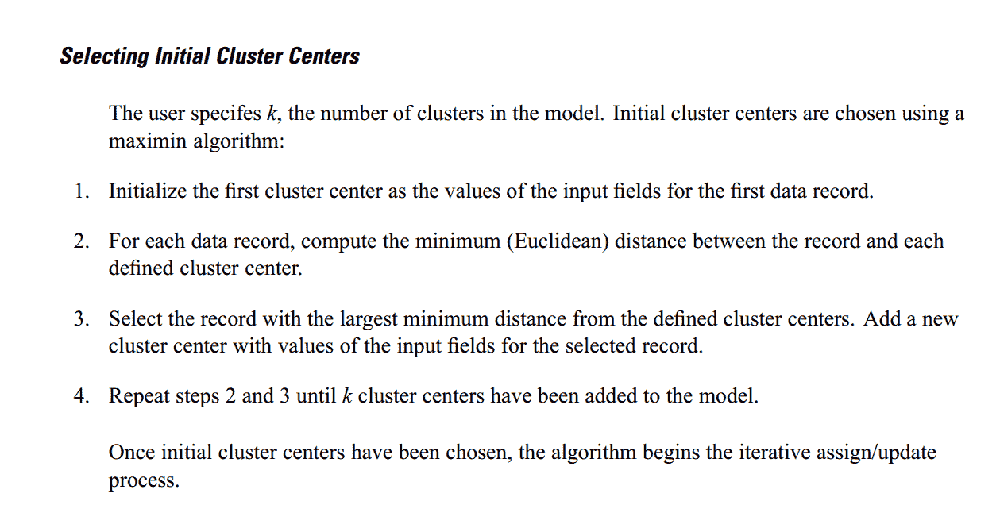
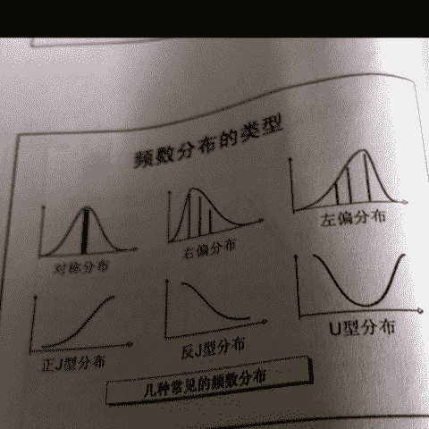
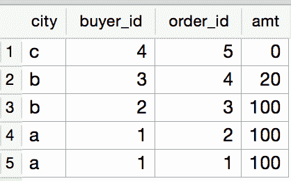
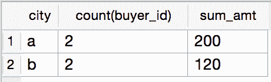
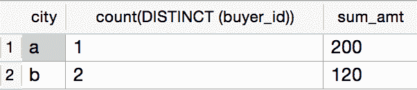

# 阿里巴巴 2016 数据挖掘工程师笔试

## 1

想要了解上海市小学生的身高,需要抽取 500 个样本,这项调查中的样本是?

正确答案: A   你的答案: 空 (错误)

```cpp
从中抽取的 500 名学生的身高
```

```cpp
上海市全部小学生的身高
```

```cpp
从中抽取的 500 名小学生
```

```cpp
上海市全部小学生
```

本题知识点

数理统计

讨论

[風待-睡郷鈴慕](https://www.nowcoder.com/profile/423321)

总体是指考察的对象的全体,
个体是总体中的每一个考察的对象,
样本是总体中所抽取的一部分个体, 而样本容量则是指样本中个体的数目.
首先我们要了解的是身高，所以 CD 排除
而 B 是考察对象的全体，所以 B 是总体
所以答案 A 正确 

发表于 2015-08-21 10:12:14

* * *

[蕊蕤瑞](https://www.nowcoder.com/profile/3213742)

这道题答案是错的吧。。按照统计学书上的说法答案是 C

发表于 2018-07-29 10:26:30

* * *

[谁说工作了就不要刷题](https://www.nowcoder.com/profile/138454)

从中抽取的 500 名小学生怎么了，不应该是小学生吗？

发表于 2018-01-20 11:07:27

* * *

## 2

以下对 k-means 聚类算法解释正确的是

正确答案: C   你的答案: 空 (错误)

```cpp
能自动识别类的个数,随即挑选初始点为中心点计算
```

```cpp
能自动识别类的个数,不是随即挑选初始点为中心点计算
```

```cpp
不能自动识别类的个数,随即挑选初始点为中心点计算
```

```cpp
不能自动识别类的个数,不是随即挑选初始点为中心点计算
```

本题知识点

数理统计 自然语言处理 概率论与数理统计

讨论

[風待-睡郷鈴慕](https://www.nowcoder.com/profile/423321)

（1）适当选择 c 个类的初始中心；（2）在第 k 次迭代中，对任意一个样本，求其到 c 个中心的距离，将该样本归到距离最短的中心所在的类；（3）利用均值等方法更新该类的中心值；（4）对于所有的 c 个聚类中心，如果利用（2）（3）的迭代法更新后，值保持不变，则迭代结束，否则继续迭代。
以上是 KMeans（C 均值）算法的具体步骤，可以看出需要选择类别数量，但初次选择是随机的，最终的聚类中心是不断迭代稳定以后的聚类中心。所以答案选 C。

发表于 2015-08-21 10:15:38

* * *

[zhangxiangjor](https://www.nowcoder.com/profile/131957)

1、Kmeans 算法需要输入的参数是 k，即为 k 个类。2、然后算法随机找 k 个点作为初始中心：c1, c2, c3, ... ck。3、重复一下直到收敛：        (a)、对每个点 xi：找到距离 xi 最近的中心 cj，把这个点 xi 归到 j 类。
        (b)、对每一个类 j：找到类的新中心点 cj, 等于这个类的点的平均（在每个维度上），然后把这个新中心点 cj 在(a)步中更新。
4、当没有类更新的时候停止

发表于 2015-09-04 22:27:02

* * *

[灵印](https://www.nowcoder.com/profile/224613)

这个是 Clementine 中 K-Means 算法的中心的初始化，如果按照这样理解，初始中心就不是随机，当然也不是认为指定的，而是通过某种算法确定。不过 K-Means 的“随即挑选”，应该是指不能认为输入的意思，所以只能随机或者按照某种策略进行选择初始中心。

发表于 2016-04-18 22:21:20

* * *

## 3

以下哪个是常见的时间序列算法模型

正确答案: C   你的答案: 空 (错误)

```cpp
RSI
```

```cpp
MACD
```

```cpp
ARMA
```

```cpp
KDJ
```

本题知识点

机器学习 数理统计

讨论

[嘻嘻兔](https://www.nowcoder.com/profile/294910)

时间序列中常用预测技术  一个时间序列是一组对于某一变量连续时间点或连续时段上的观测值。**1\.  移动平均法 (MA)****1.1\. 简单移动平均法**设有一时间序列 y1,y2,..., 则按数据点的顺序逐点推移求出 N 个数的平均数，即可得到一次移动平均数.** 1.2 趋势移动平均法  **当时间序列没有明显的趋势变动时，使用一次移动平均就能够准确地反映实际情况，直接用第 t 周期的一次移动平均数就可预测第 1t+周期之值。时间序列出现线性变动趋势时，用一次移动平均数来预测就会出现滞后偏差。修正的方法是在一次移动平均的基础上再做二次移动平均，利用移动平均滞后偏差的规律找出曲线的发展方向和发展趋势，然后才建立直线趋势的预测模型。故称为趋势移动平均法。**2\.  自回归模型(AR)**AR 模型是一种线性预测，即已知 N 个数据，可由模型推出第 N 点前面或后面的数据（设推出 P 点）.本质类似于插值，其目的都是为了增加有效数据，只是 AR 模型是由 N 点递推，而插值是由两点（或少数几点）去推导多点，所以 AR 模型要比插值方法效果更好。**3\. 自回归滑动平均模型(ARMA)**其建模思想可概括为：逐渐增加模型的阶数，拟合较高阶模型，直到再增加模型的阶数而剩余残差方差不再显著减小为止。**4\. GARCH 模型**回归模型。除去和普通回归模型相同的之处，GARCH 对误差的方差进行了进一步的建模。特别适用于波动性的分析和预测。**5\. 指数平滑法**移动平均法的预测值实质上是以前观测值的加权和，且对不同时期的数据给予相同的加权。这往往不符合实际情况。指数平滑法则对移动平均法进行了改进和发展，其应用较为广泛。基本思想都是：预测值是以前观测值的加权和，且对不同的数据给予不同的权，新数据给较大的权，旧数据给较小的权。根据平滑次数不同，指数平滑法分为：一次指数平滑法、二次指数平滑法和三次指数平滑法等。地址：http://blog.csdn.net/ztf312/article/details/50890267

编辑于 2016-03-15 16:12:03

* * *

[伊利殺白](https://www.nowcoder.com/profile/910143)

相对强弱指数 (RSI, Relative Strength Index) 是通过比较一段时期内的平均收盘涨数

和平均收盘跌数来分析市场买沽盘的意向和实力 , 从而作出未来市场的走势 .

移动平均聚散指标 (MACD, Moving Average Convergence Divergence), 是根据均

线的构造原理 , 对股票价格的收盘价进行平滑处理 , 求出算术平均值以后再进行计算 , 是

一种趋向类指标 .

随机指标 (KDJ) 一般是根据统计学的原理 , 通过一个特定的周期 ( 常为 9 日 ,9 周等 ) 内出

现过的最高价 , 最低价及最后一个计算周期的收盘价及这三者之间的比例关系 , 来计算最

后一个计算周期的未成熟随机值 RSV, 然后根据平滑移动平均线的方法来计算 K 值 , D 值

与 J 值 , 并绘成曲线图来研判股票走势 .

参考自 wiki.mbalib

编辑于 2016-09-04 11:05:20

* * *

[活力雪涵](https://www.nowcoder.com/profile/821649)

时间序列算法模型是指采用某种算法（可以是[神经网络](https://www.baidu.com/s?wd=%E7%A5%9E%E7%BB%8F%E7%BD%91%E7%BB%9C&tn=44039180_cpr&fenlei=mv6quAkxTZn0IZRqIHckPjm4nH00T1dBrjF9nAnznW-hrHnkuWKW0ZwV5Hcvrjm3rH6sPfKWUMw85HfYnjn4nH6sgvPsT6K1TL0qnfK1TL0z5HD0IgF_5y9YIZ0lQzqlpA-bmyt8mh7GuZR8mvqVQL7dugPYpyq8Q1DzrHRvPWfsPf) 、[ARMA](https://www.baidu.com/s?wd=ARMA&tn=44039180_cpr&fenlei=mv6quAkxTZn0IZRqIHckPjm4nH00T1dBrjF9nAnznW-hrHnkuWKW0ZwV5Hcvrjm3rH6sPfKWUMw85HfYnjn4nH6sgvPsT6K1TL0qnfK1TL0z5HD0IgF_5y9YIZ0lQzqlpA-bmyt8mh7GuZR8mvqVQL7dugPYpyq8Q1DzrHRvPWfsPf) 等）模拟历史数据，找出其中的变化规律，回归滑动平均模型（ARMA 模型，Auto-Regressive and Moving Average Model）是研究时间序列的重要方法，由自回归模型（AR 模型）与滑动平均模型（MA 模型）为基础混合构成。

发表于 2015-09-10 20:48:24

* * *

## 4

有个袋子装有 2 个红球,2 个蓝球,1 个黄球,取出球以后不再放回,请问取两次出来的球是相同颜色的概率是多少

正确答案: C   你的答案: 空 (错误)

```cpp
0.3333
```

```cpp
0.25
```

```cpp
0.2
```

```cpp
0.1667
```

本题知识点

概率统计 *讨论

[风中草儿](https://www.nowcoder.com/profile/515726)

有序，所以{ C（2,1）C（1,1）+C（2,1）C（1,1）}/{C（5,1）C(4,1)}

编辑于 2015-08-22 20:37:50

* * *

[Scheaven](https://www.nowcoder.com/profile/2065035)

满足要求的情况一共两种，总共可能出现的情况为 C(5,2)则 概率 p = 2/C(5,2) = 4/ 5*4 = 0.2

发表于 2016-08-02 15:41:38

* * *

[麻同学在纠结](https://www.nowcoder.com/profile/189546)

很简单的概率题： 概率= 2/5 *1/4 +2/5 *1/4=1/5 就是两次都是红的概率+两次都是蓝的概率

发表于 2015-08-22 21:46:42

* * *

## 5

65,8,50,15,37,24,()。括号中的数字是() 

正确答案: B   你的答案: 空 (错误)

```cpp
25
```

```cpp
26
```

```cpp
22
```

```cpp
27
```

本题知识点

数学运算

讨论

[木东 2015](https://www.nowcoder.com/profile/828181)

奇数项是按照 15,13,11 的递减差递减数列；偶数项是按照 7,9,11,的递增差增序列。那么答案就是第七项，奇数列就按照减 11 吧，37-11=26

编辑于 2015-08-21 16:27:11

* * *

[codetang](https://www.nowcoder.com/profile/191103)

65=8²+1 这里将 8 作为 65 的特征 8=3²-1    这里得到 350=7²+1  这里得到 715=4²-1  这里得到 437=6²+1 这里得到 624=5²-1  这里得到 5 我们发现 8,3,7,4,6,5 这组数的特点，以奇数项开始 奇数项加偶数项的和为 11，以偶数项开始的话 偶数项+奇数项的和为 10 8+3=7+4=6+5 3+7=4+6=5+x 这里得到 x 为 5 特征为 5 转换为 5²+1 得到 26

发表于 2015-08-20 15:22:08

* * *

[牛客 336139 号](https://www.nowcoder.com/profile/336139)

65,8,50,15,37,24,()65 = **8**² **+** 1           8   = 3²  **-** 150 = **7**²   **+** 1          15  = 4²   ** -** 137 = **6**²   **+** 1           24 = 5²    **-** 1()   = **5**² +1           ()  = 6²  **-** 1

发表于 2015-08-22 20:33:14

* * *

## 6

一组数据,均值>中位数>众数,问这组数据

正确答案: B   你的答案: 空 (错误)

```cpp
左偏
```

```cpp
右偏
```

```cpp
钟型
```

```cpp
对称
```

本题知识点

数理统计

讨论

[啥](https://www.nowcoder.com/profile/811262)

答案为右偏首先是左偏、右偏是什么情况的的问题：   这都是建立的频率分布图上的如下图，“偏”可以理解为哪边的数据比较少，左偏就是左边的数据偏少
其次，这三个数的关系。咱们看看中位数和众数的关系众数，频率最高的那个数，图上就是最高峰对应的 x 值中位数，中间位置的那个数，在图上就是面积对半分的那条线对应的 x 值（因为频率图的总面积可认为是数据总个数，想想如果连续的情况）当右偏时，可直观得出   中位数 > 众数当然三个数的数据关系需要严格的数学推导，上面的方法只是辅助记忆所以对应选 B。

发表于 2015-08-22 18:10:00

* * *

[sjd](https://www.nowcoder.com/profile/381322)

选 B。众数：是一组数据中出现次数最多的数值； 众数、中位数与算术平均数之间有着一定的关系,这种关系决定于总体次数分布的状况.当次数分布呈对称的钟型分布时,算术平均数位于次数分布曲线的对称点上,而该点又是曲线的最高点和中心点,因此,众数、中位数和算术平均数三者相等.当次数分布呈非对称的钟型分布,由于这三种平均数受极端数值影响程度的不同,因而它们的数值就存在一定的差别,但三者之间仍有一定的关系.当次数分布右偏时,算术平均数受偏高数值影响较大,其位置必然在众数之右,中位数在众数与算术平均数之间.反之.当次数分布左偏时,算术平均数受偏小数值的影响较大,其位置在众数之左,中位数仍在两者之间

编辑于 2015-08-20 15:33:24

* * *

[Bekyii](https://www.nowcoder.com/profile/206941)

当数据关于均值对称分布时，偏度为 0；当右边的数据更分散时，为右偏，反之左偏。若众数小于中位数，左边更集中右边更分散，故为右偏。

发表于 2015-09-09 14:46:35

* * *

## 7

SQL 语言允许使用通配符进行字符串匹配的操作,其中‘%’可以表示

正确答案: D   你的答案: 空 (错误)

```cpp
零个字符
```

```cpp
1 个字符
```

```cpp
多个字符
```

```cpp
其他 3 个选项都可以
```

本题知识点

数据库

讨论

[ベ●＇..＇●ベ](https://www.nowcoder.com/profile/1307102)

为在搜索子句中使用通配符，必须使用 LIKE 操作符：1、百分号（%）通配符：可匹配 0 个、1 个或多个字符 2、下划线（_）通配符：只可匹配单个字符

发表于 2017-08-24 11:55:07

* * *

[琼华](https://www.nowcoder.com/profile/188677)

SQL 通配符必须与 LIKE 运算符一起使用。

在 SQL 中，可使用以下通配符：

| 通配符 | 描述 |
| % | 替代一个或多个字符 |
| _ | 仅替代一个字符 |
| [charlist] | 字符列中的任何单一字符 |
| [^charlist]或者[!charlist] | 不在字符列中的任何单一字符 |

% 可以是零个

编辑于 2015-08-22 20:13:44

* * *

[Amour1018](https://www.nowcoder.com/profile/306342)

SQL 通配符必须与 LIKE 运算符一起使用。%可以表示任意个字符

发表于 2015-09-19 16:00:26

* * *

## 8

关于正态分布,下列说法错误的是:

正确答案: C   你的答案: 空 (错误)

```cpp
正态分布具有集中性和对称性
```

```cpp
正态分布的均值和方差能够决定正态分布的位置和形态
```

```cpp
正态分布的偏度为 0，峰度为 1
```

```cpp
标准正态分布的均值为 0，方差为 1
```

本题知识点

数理统计 概率论与数理统计

讨论

[悟](https://www.nowcoder.com/profile/559239)

Kurtosis(峰度): 是对 Sample 构成的分布的峰值是否突兀或是平坦的描述。          
计算时间序列 x 的峰度，峰度用于度量 x 偏离某分布的情况，正态分布的峰度为 3。当时间序列的曲线峰值比正态分布的高时，峰度大于 3;当比正态分布的低时，峰度小于 3。 
Skewness(偏度)： 是对 Sample 构成的分布的对称性状况的描述。
计算时间序列 x 的偏度，偏度用于衡量 x 的对称性。若偏度为负，则 x 均值左侧的离散度比右侧强;若偏度为正，则 x 均值左侧的离散度比右侧弱。对于正态分布(或严格对称分布)偏度等于 0

发表于 2015-08-20 16:36:45

* * *

[YuZhiBoBan](https://www.nowcoder.com/profile/631996)

| 偏度（Skewness）是描述某变量取值分布对称性的统计量。 如果是正太分布的话.偏度是 三阶中心距,值为 0.
,Skewness=0     分布形态与正态分布偏度相同
Skewness>0     正偏差数值较大，为正偏或右偏。长尾巴拖在右边。
Skewness<0     负偏差数值较大，为负偏或左偏。长尾巴拖在左边。
计算公式：
Skewness=E[((x-E(x))/(\sqrt{D(x)}))³] 
&#124; Skewness&#124; 越大，分布形态偏移程度越大。
峰度（Kurtosis）是描述某变量所有取值分布形态陡缓程度的统计量。它是和正态分布相比较的。
Kurtosis=0       与正态分布的陡缓程度相同。
Kurtosis>0       比正态分布的高峰更加陡峭——尖顶峰
Kurtosis<0       比正态分布的高峰来得平台——平顶峰
计算公式：
Kurtosis=E[ ( (x-E(x))/ (\sqrt(D(x)))   )⁴ ]-3   四阶中心距-3\.如果是正态分布,那么偏度,峰度均为 0.
 |

编辑于 2015-12-15 16:18:03

* * *

[s1162276945](https://www.nowcoder.com/profile/8128627)

正态分布的偏度和峰度均为 0.

发表于 2018-04-07 16:26:17

* * *

## 9

在以下不同的场景中,使用的分析方法不正确的有

正确答案: B   你的答案: 空 (错误)

```cpp
根据商家最近一年的经营及服务数据,用聚类算法判断出天猫商家在各自主营类目下所属的商
  家层级
```

```cpp
根据商家近几年的成交数据,用聚类算法拟合出用户未来一个月可能的消费金额公式
```

```cpp
用关联规则算法分析出购买了汽车坐垫的买家,是否适合推荐汽车脚垫
```

```cpp
根据用户最近购买的商品信息,用决策树算法识别出淘宝买家可能是男还是女
```

本题知识点

数理统计

讨论

[willys](https://www.nowcoder.com/profile/467888)

B 选项，预测消费需要用回归模型来做。而不是聚类算法。

发表于 2015-08-20 18:49:11

* * *

[厅一](https://www.nowcoder.com/profile/8083909)

预测消费金额用时间序列比较合适

发表于 2016-09-16 12:13:13

* * *

[喜刷刷哈哈哈](https://www.nowcoder.com/profile/231080665)

聚类是判别模型吧

发表于 2020-05-06 21:30:53

* * *

## 10

下列时间序列模型中,哪一个模型可以较好地拟合波动性的分析和预测

正确答案: D   你的答案: 空 (错误)

```cpp
AR 模型
```

```cpp
MA 模型
```

```cpp
ARMA 模型
```

```cpp
GARCH 模型
```

本题知识点

机器学习 数理统计 概率论与数理统计

讨论

[Jacky003](https://www.nowcoder.com/profile/9332107)

AR 模型：自回归模型，是一种线性模型 MA 模型：移动平均法模型，其中使用趋势移动平均法建立直线趋势的预测模型 ARMA 模型：自回归滑动平均模型，拟合较高阶模型 GARCH 模型：广义回归模型，对误差的方差建模，适用于波动性的分析和预测

发表于 2016-09-09 11:24:38

* * *

[刘小二](https://www.nowcoder.com/profile/515734)

AR 模型是一种线性预测，即已知 N 个数据，可由模型推出第 N 点前面或后面的数据（设推出 P 点），所以其本质类似于插值。MA 模型(moving average model)滑动平均模型，模型参量法谱分析方法之一。ARMA 模型(auto regressive moving average model)自回归滑动平均模型，模型参量法高分辨率谱分析方法之一。这种方法是研究平稳随机过程有理谱的典型方法。它比 AR 模型法与 MA 模型法有较精确的谱估计及较优良的谱分辨率性能，但其参数估算比较繁琐。GARCH 模型称为广义 ARCH 模型，是 ARCH 模型的拓展， GARCH 对误差的 方差进行了进一步的建模，特别适用于波动性的分析和 预测。

发表于 2015-09-02 21:09:09

* * *

[悟](https://www.nowcoder.com/profile/559239)

GARCH 模型称为广义 ARCH 模型，是 ARCH 模型的拓展，由 Bollerslev(1986)发展起来的。它是 ARCH 模型的推广。GARCH(p,0)模型，相当于 ARCH(p)模型。GARCH 模型是一个专门针对金融数据所量体订做的回归模型，除去和普通回归模型相同的之处，GARCH 对误差的方差进行了进一步的建模。特别适用于**波动性的分析和预测**，这样的分析对投资者的[决策](http://baike.baidu.com/view/57813.htm)能起到非常重要的指导性作用，其意义很多时候超过了对数值本身的分析和预测。

发表于 2015-08-20 16:38:56

* * *

## 11

excel 工作簿 a 中有两列 id、age,工作簿 b 中有一列 id,需要找到工作薄 b 中 id 对应的 age,可用的函数包括

正确答案: A B   你的答案: 空 (错误)

```cpp
index+match
```

```cpp
vlookup
```

```cpp
hlookup
```

```cpp
find
```

```cpp
if
```

```cpp
like
```

本题知识点

数理统计 概率论与数理统计

讨论

[Herry](https://www.nowcoder.com/profile/258713)

***在 Excel 中 MATCH 函***  查看全部)

编辑于 2016-04-22 18:07:36

* * *

[桂桂](https://www.nowcoder.com/profile/4546604)

所以这题是怎么混入机器学习的

发表于 2017-07-26 00:10:10

* * *

[伊利殺白](https://www.nowcoder.com/profile/910143)

INDEX: 函数返回表格或区域中的值或值的引用 .MATCH: 在范围单元格中搜索特定的项 , 然后返回该项在此区域中的相对位置 .VLOOKUP&HLOOKUP: 在表格的首行或数值数组中搜索值 , 然后返回表格或数组中指定 行的所在列中的值 . 当比较值位于数据表格的首行时 , 如果要向下查看指定的行数 , 则可 使用 HLOOKUP; 当比较值位于所需查找的数据的左边一列时 , 则可使用 VLOOKUP.FIND: 返回一个字符串在另一个字符串中出现的起始位置 ( 区分大小写 ).IF: 可以对值和期待值进行逻辑比较 .LIKE: 可用 Like 运算符自定义字符比较函数之类的, 应该是 VBA 的函数.

编辑于 2016-09-04 18:50:52

* * *

## 12

现在有 M 个桶,每桶都有 N 个乒乓球,乒乓球的颜色有 K 种,并且假设第 i 个桶第 j 种颜色的球个数为 Cij, 比例为 Rij=Cij/N,现在要评估哪个桶的乒乓球颜色纯度最高,下列哪种算法和描述是合理的?

正确答案: B C F   你的答案: 空 (错误)

```cpp
∑(N/K-Cij)(N/K-Cij)越小越纯
```

```cpp
-∑Cij*LOG(Rij)越小越纯
```

```cpp
∑(1-Rij*Rij)越小越纯
```

```cpp
∑(1-Rij)*(1-Rij)越小越纯
```

```cpp
∑(1-Rij)² 越小越纯
```

```cpp
-∑Rij*LOG(Rij)越小越纯
```

本题知识点

数理统计 概率论与数理统计

讨论

[伊利殺白](https://www.nowcoder.com/profile/910143)

信息熵 Ent=- ∑ R_{ij}log R_{ij}, Ent 的值越小 , 则纯度越高 .

基尼系数 Gini=1- ∑ R_{ij}², Gini 越小 , 则纯度越高 .

见《机器学习》(周志华) P75 4.2 决策树划分选择

基尼系数 1- ∑ R_{ij}² 越小即∑ R_{ij}² 越大越纯,

则 DE 选项 ∑ (1-R_{ij})² = ∑ (1-2R_{ij}+R_{ij}²) = ∑ 1-2 ∑ R_{ij}+ ∑ R_{ij}² = K-2+ ∑ R_{ij}² 越大越纯.所以应该选 BCF 吧, 各位看下有没有错?

编辑于 2016-09-05 13:10:43

* * *

[Scheaven](https://www.nowcoder.com/profile/2065035)

个人觉得这道题肯定具有争议，有人从熵计算和基尼指数来解释答案的合理性。但单纯看到这道题来说根本没有提到相关的内容，根据数学分析，很明显得到答案是 BCDEF

发表于 2016-08-02 16:11:30

* * *

[程序远](https://www.nowcoder.com/profile/480868)

有疑问：B 和 F 应该是一样的吧，N 每一项除以一个常数 N 就是 F 了，求解~

发表于 2015-09-30 17:04:08

* * *

## 13

关于相关系数,下列描述中正确的有:

正确答案: A C E   你的答案: 空 (错误)

```cpp
相关系数为 0.8 时,说明两个变量之间呈正相关关系
```

```cpp
相关系数等于 1 相较于相关系数等于-1,前者的相关性更强
```

```cpp
相关性等于 1 相较于相关系数等于 0,前者的相关性更强
```

```cpp
Pearson 相关系数衡量了两个定序变量之间的相关程度
```

```cpp
Spearman 相关系数可以衡量两个定序变量之间的相关程度
```

```cpp
相关系数为 0.2 相较于-0.8,前者的相关性更强
```

本题知识点

数理统计 概率论与数理统计

讨论

[sjd](https://www.nowcoder.com/profile/381322)

1.连续数据，正态分布，线性关系，用 pearson 相关系数是最恰当，当然用 spearman 相关系数也可以，
  就是效率没有 pearson 相关系数高。

2.上述任一条件不满足，就用 spearman 相关系数，不能用 pearson 相关系数。

3.两个定序测量数据之间也用 spearman 相关系数，不能用 pearson 相关系数。

发表于 2015-08-20 15:43:31

* * *

[nailperry](https://www.nowcoder.com/profile/587889)

相关系数ρXY 取值在-1 到 1 之间，ρXY = 0 时，称 X,Y 不相关;| ρXY | = 1 时，称 X,Y[完全相关](http://baike.haosou.com/doc/8808063-9132718.html)，此时，X,Y 之间具有线性函数关系; | ρXY | < 1 时，X 的变动引起 Y 的部分变动，ρXY 的绝对值越大，X 的变动引起 Y 的变动就越大， | ρXY | > 0.8 时称为高度相关，当 | ρXY | < 0.3 时称为低度相关，其它时候为中度相关。

发表于 2015-09-04 22:04:02

* * *

[niuke20124212](https://www.nowcoder.com/profile/495607)

Pearson 要求连续线性；Spearman 只要求单调就可以了，不一定要连续线性。

发表于 2016-09-09 15:44:59

* * *

## 14

关于线性回归的描述,以下正确的有:

正确答案: B C E   你的答案: 空 (错误)

```cpp
基本假设包括随机干扰项是均值为 0,方差为 1 的标准正态分布
```

```cpp
基本假设包括随机干扰项是均值为 0 的同方差正态分布
```

```cpp
在违背基本假设时,普通最小二乘法估计量不再是最佳线性无偏估计量
```

```cpp
在违背基本假设时,模型不再可以估计
```

```cpp
可以用 DW 检验残差是否存在序列相关性
```

```cpp
多重共线性会使得参数估计值方差减小
```

本题知识点

机器学习 数理统计 概率论与数理统计

讨论

[悟](https://www.nowcoder.com/profile/559239)

一元线性回归的基本假设有
1、**随机误差项是一个期望值或平均值为 0 的随机变量；**
2、对于解释变量的所有观测值，**随机误差项有相同的方差；**
3、随机误差项彼此不相关；
4、解释变量是确定性变量，不是随机变量，与随机误差项彼此之间相互独立；
5、解释变量之间不存在精确的（完全的）线性关系，即解释变量的样本观测值矩阵是满秩矩阵；
6、**随机误差项服从正态分布** 违背基本假设的计量经济学模型还是可以估计的，只是不能使用普通最小二乘法进行估计。 **当存在异方差时，普通最小二乘法估计存在以下问题： 参数估计值虽然是无偏的，但不是最小方差线性无偏估计。** 
**杜宾-瓦特森（DW）检验，计量经济，统计分析中常用的一种检验序列一阶** [**自相关**](http://baike.baidu.com/view/1302974.htm) **最常用的方法。**

所谓多重共线性（Multicollinearity）是指线性回归模型中的解释变量之间由于存在精确[相关关系](http://baike.baidu.com/view/510626.htm)或高度相关关系而使模型估计失真或难以估计准确。影响
（1）完全共线性下[参数估计](http://baike.baidu.com/view/123231.htm)量不存在（2）近似共线性下 OLS 估计量非有效**多重共线性使参数估计值的方差增大**，1/(1-r2)为[方差膨胀因子](http://baike.baidu.com/view/4502677.htm)(Variance Inflation Factor, VIF)（3）参数估计量经济含义不合理（4）变量的显著性检验失去意义，可能将重要的解释变量排除在模型之外（5）模型的预测功能失效。变大的[方差](http://baike.baidu.com/view/172036.htm)容易使[区间](http://baike.baidu.com/view/70334.htm)预测的“区间”变大，使预测失去意义。

发表于 2015-08-20 16:54:04

* * *

[kiss90](https://www.nowcoder.com/profile/590177)

```cpp
/*对于线性回归模型,当响应变量服从正态分布,误差项满足高斯--马尔科夫条件（零均值、等方差、不相关）时,
回归参数的最小二乘估计是一致最小方差无偏估计。
当然，该条件只是理想化的假定，为的是数学上有相应的较为成熟的结论。其实大多数实际问题都不完全满足这些理想化的假定。
线性回归模型理论的发展正是在不断克服理想化条件不被满足时得到许多新方法。如加权 LSE、岭估计、压缩估计、BOX_COX 变换等一系列手段。
做实际工作时一定是要超越书本上的理想化条件的。 （这是在小木虫上看到的网友@chenlp211 的解释。与大家分享）*/
```

发表于 2016-03-04 22:12:55

* * *

[YCYCY](https://www.nowcoder.com/profile/9725992)

多重共线性会使方差增大

发表于 2018-09-05 19:39:23

* * *

## 15

下列哪些方法可以用来对高维数据进行降维:

正确答案: A B C D E F   你的答案: 空 (错误)

```cpp
LASSO
```

```cpp
主成分分析法
```

```cpp
聚类分析
```

```cpp
小波分析法
```

```cpp
线性判别法
```

```cpp
拉普拉斯特征映射
```

本题知识点

机器学习 数理统计 统计学 概率论与数理统计

讨论

[朱彼特之鹰](https://www.nowcoder.com/profile/357748)

lasso 通过参数缩减达到降维的目的；pca 就不用说了线性鉴别法即 LDA 通过找到一个空间使得类内距离最小类间距离最大所以可以看做是降维；小波分析有一些变换的操作降低其***扰可以看做是降维拉普拉斯请看这个 http://f.dataguru.cn/thread-287243-1-1.html

发表于 2015-08-22 12:41:45

* * *

[活力雪涵](https://www.nowcoder.com/profile/821649)

Lasso(Least absolute shrinkage and selection operator, Tibshirani(1996)) 方法是一种压缩估计，它通过构造一个罚函数得到一个较为精炼的模型，使得它压缩一些系数，同时设定一些系数为零。因此保留了子集收缩的优点，是一种处理具有复共线性数据的有偏估计。Lasso 的基本思想是在回归系数的绝对值之和小于一个常数的约束条件下，使残差平方和最小化，从而能够产生某些严格等于 0 的回归系数，得到可以解释的模型。**lasso 通过参数缩减达到降维的目的；**

发表于 2015-09-10 21:24:07

* * *

[于建民](https://www.nowcoder.com/profile/239226)

http://blog.csdn.net/yujianmin1990/article/details/48223001 聚类在降维中也是有应用的，希望牛客网后台再仔细一些~

发表于 2015-09-15 17:49:03

* * *

## 16

查询成交表 a 中的城市 city 的成交金额大于 0 的购买人数(buyer_id)和成交金额(amt)city buyer_id order_id    amta           1           1           100a           1           2           100b           2           3           100b           3           4           20c           4           5           0

你的答案

本题知识点

数据库

讨论

[听见下雨的声音](https://www.nowcoder.com/profile/488409)

select city,cnt ,amt FROM ( select city,sum(buyer_id)/*or count*/ as cnt,sum(amt) as amt from a group by city ) as t  where t.amt>0 group by city;1.感觉这里的 buyer_id 应该是购买者的 id,应该计算的 count 而不是 sum.楼上的 buyerid 感觉有点问题,不管是人数还是 id.......2.个人觉得最后计算时使用 groupby 将 city 分开,楼上没有分开.改成一条语句 select city,count(buyer_id),sum(amt) from a group by city having sum(amt)>0 ;近三年没怎么写 sql 了 having 都忘了

编辑于 2015-08-20 15:34:27

* * *

[Leonardo_ljd](https://www.nowcoder.com/profile/198145)

SELECT city, COUNT(UNIQUE(buyer_id)), SUM(amt)      //我的理解是如果 buyer_id                                                                   // 重复多次也只能算一个用户 FROM a  GROUP BY city HAVING SUM(amt) > 0;

编辑于 2015-08-21 11:39:01

* * *

[NoNoNoNo](https://www.nowcoder.com/profile/241409)


如果是人次：select city,count(buyer_id),sum(amt) as sum_amt from JiaoYi group by city having sum_amt>0
如果是用户数：select city,count( distinct( buyer_id) ),sum(amt) as sum_amt from JiaoYi group by city having sum_amt>0
你怕不怕...

编辑于 2015-09-06 09:10:05

* * *

## 17

公司要构建淘宝商家健康指数,所以要对最近 1 年内有交易的淘宝商家进行问卷调研。为不过于打搅商 家,问卷调研采取抽样的方式进行确定商家名单。怎么抽样比较好?

你的答案

本题知识点

数理统计

讨论

[小小](https://www.nowcoder.com/profile/59)

  查看全部)

编辑于 2016-02-25 23:23:59

* * *

[红豆和绿豆](https://www.nowcoder.com/profile/575111)

1、首先使用聚类算法，将销售不同商品的商家进行聚类。2、对 1 中的每一个聚类，使用层次聚类算法，将商家按照销售的业绩进行分层。3、对 2 中的每一层进行简单的随机抽样，保证销售同一个商品的不同销售业绩的商家都会被抽到。

发表于 2016-04-01 20:14:38

* * *

[steal](https://www.nowcoder.com/profile/854555)

以销售量、卖家信誉以及评价指数对淘宝卖家按三个维度划分等级，统计不同等级下的卖家概率分布，然后以该概率分布分别从上述三个样本中选择一些卖家进行问卷调研

发表于 2016-04-17 20:20:50

* * **