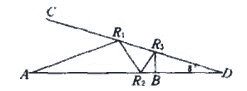
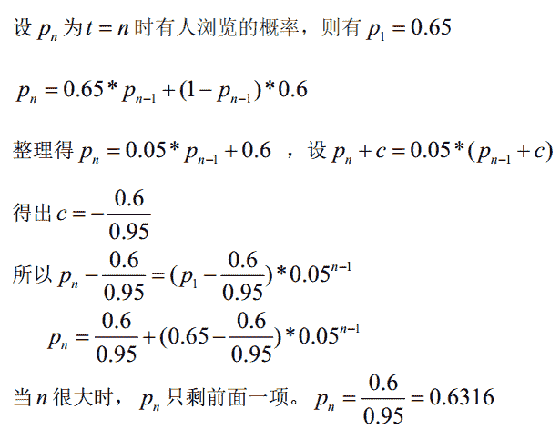
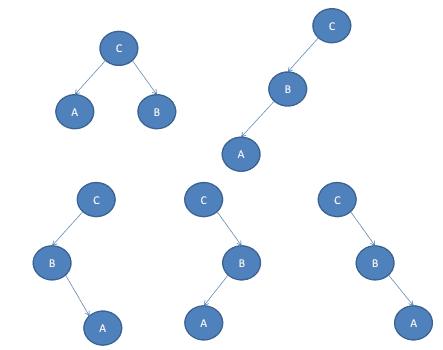
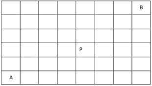
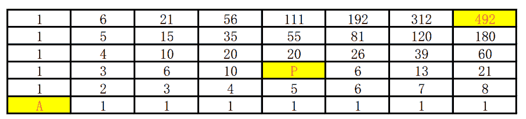
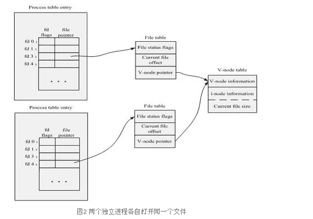
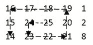

# 阿里巴巴 2016 研发工程师笔试题（一）

## 1

如图所示，从 A 点发出一束激光，于 AD 直线和 CD 直线反射多次后，垂直达到了 B 点（B 点可能在 AD 上也可能在 CD 上，入射角等于反射角），如角 CDA=8°，那么最多反射次数是 ____。（从 B 点原路反射回点 A 次数不纳入计算，图中给出 3 次反射的例子）

正确答案: B   你的答案: 空 (错误)

```cpp
6
```

```cpp
10
```

```cpp
12
```

```cpp
38
```

```cpp
40
```

```cpp
不存在
```

本题知识点

数学运算

讨论

[佳佳](https://www.nowcoder.com/profile/750854)

[图]如上图所示，以最后一  查看全部)

编辑于 2016-05-20 10:27:19

* * *

[honmue](https://www.nowcoder.com/profile/776520)

光学物理，几何及数列，从 B 原路返回计算，B 的入射角记为 a0 = 0 度，R3 的入射角记为 a1=8 度，R2 的入射角 a2 记为 a2，第 n 个入射角记为 an。则有 a0=0; a1=8; a(n+1)=2an-a(n-1)。可得 an=8n。入射角 an<90，则 n 最大为 11，而入射点 A 点在边缘上，所以只有 10 次。望斧正。

编辑于 2015-08-24 14:47:02

* * *

[时间妖](https://www.nowcoder.com/profile/464952)

（1）入射角∠R1AD=β<82°。若β>82°，则不会往右边反射；若β= 82°，则直接垂直打在 CD 上（2）β + α = ∠CR1A = ∠R2R1D，所以∠AR1R2 = 180°-2(α+β)所以∠AR2R1 = ∠DR2R3 = 2α+β这里的α+β，2α+β都相当于另一种入射角，也就是说每一次反射都会减少α。那么，到了最后只要 kα+β=90°（k 为整数）即可又由于（1）可知，β<82°，所以 k 最多只能取到 10，同时β=10°##################################################注意：不是每一种β都能在最后垂直射到两条线上。所以，在这道题中，β只有在取 10°、18°、26°、……时，才会在最后垂直射到某条线上

发表于 2016-04-14 16:29:13

* * *

## 2

假定 CSomething 是一个类，执行下面这些语句之后，内存里创建了 ____ 个 CSomething 对象。

```cpp
CSomething a();
CSomething b(2);
CSomething c[3];
CSomething &ra = b;
CSomething d = b;
CSomething *pA = c;
CSomething *p = new CSomething(4);
```

正确答案: E   你的答案: 空 (错误)

```cpp
10
```

```cpp
9
```

```cpp
8
```

```cpp
7
```

```cpp
6
```

```cpp
5
```

本题知识点

C++ C 语言

讨论

[xpj](https://www.nowcoder.com/profile/955945)

//个人觉得应该是 6 个。  查看全部)

编辑于 2015-08-24 10:40:32

* * *

[啥](https://www.nowcoder.com/profile/811262)

答案应该为 E  6 个在编译器上测试过 CSomething a();                                            只是个函数声明 CSomething b(2);                                            +1CSomething c[3];                                            +3，对象数组 CSomething &ra = b;                                       引用，没有新构造 CSomething d=b;                                            +1，调用拷贝构造函数 CSomething *pA = c;                                        只是给指针赋值 CSomething *p = new CSomething(4);            +1，构造并给指针赋值总共 6 个

发表于 2015-08-24 10:12:30

* * *

[walker_man](https://www.nowcoder.com/profile/9965742)

注意区别:CSomething a();CSomething a;前者是一个函数的声明，与默认构造函数区分；//返回类型为 CSomething,形参表为空后者是一个对象的定义；

发表于 2017-02-19 15:28:42

* * *

## 3

假设淘宝网上某商品 A 在任一时刻 t 内若有人浏览，则该商品在下一时刻 t+1 内无人浏览的概率为 0.35（即下一时刻的浏览情况仅与当前时段相关），定义此条件概率为 P(O_{t+1}=0|O_t=1)=0.35(即用“1”代表有人浏览的事件，用“0”代表无人浏览的事件），类似得定义 P(O_{t+1}=1|O_t=1)=0.65，P(O_{t+1}=0|O_t=0)=0.4，P(O_{t+1}=1|O_t=0)=0.6。若此商品 A 在 t=0 时有人浏览，它在 t=100000 时有人浏览的概率是 ____。

正确答案: C   你的答案: 空 (错误)

```cpp
0.5371
```

```cpp
0.4582
```

```cpp
0.6316
```

```cpp
0.1435
```

```cpp
0.3276
```

```cpp
0.7132
```

本题知识点

概率统计 *概率论与数理统计* *讨论

[SunburstRun](https://www.nowcoder.com/profile/557336)

0.6316, 高中数学题  查看全部)

编辑于 2015-08-24 08:00:57

* * *

[啥](https://www.nowcoder.com/profile/811262)

答案是 C。  0.6316 昨天做得特别不爽，早上特意推导了一下：

发表于 2015-08-24 10:12:50

* * *

[沐诩](https://www.nowcoder.com/profile/266145)

既然是它在 t=100000 时有人浏览，根据 P(O_{t+1}=1|O_t=1)=0.65 和 P(O_{t+1}=1|O_t=0)=0.6，可以得出有人浏览的概率在 0.6 和 0.65 之间，选择题嘛，这样做也是可以的吧。。。。

发表于 2016-02-23 18:57:35

* * *

## 4

猜数字游戏的过程是你输入一个 4 位数（数字选取 0~9，不会重复），电脑会告诉你两个信息：A 个数字和位置均正确，B 个数字正确但位置错误。例如正确答案是 7890 你输入 0789，电脑会告诉你 0A4B，表示有 0 个数字和位置完全正确，但有 4 个数字正确但位置错误。现在牛妹猜了三次的结果分别是：1234=>0A4B，2341=>1A3B，3412=>2A2B，那么牛妹最少还要猜 ____ 次才能保证一定得到 4A0B 的结果。

正确答案: D   你的答案: 空 (错误)

```cpp
0
```

```cpp
1
```

```cpp
2
```

```cpp
3
```

```cpp
4
```

```cpp
5
```

本题知识点

数学运算

讨论

[SunburstRun](https://www.nowcoder.com/profile/557336)

3 次经过分析，只有可能  查看全部)

编辑于 2015-08-24 08:01:16

* * *

[小梦](https://www.nowcoder.com/profile/112920)

上面的分析都比较复杂，有个简单点的想法。经过分析，结果只有可能是以下四种情况：2413、4312、3142、3421 那么不管结果是多少，我们只要判断第一位数是几。比如先输入 3567，出现 1A0B 的话，那么结果就在 3142,3421 中，保证正确的话，需要共 3 次。如果出现 0A0B，那么结果就在 2413,4312.为保证正确，也是需要 3 次。

发表于 2016-03-24 20:38:49

* * *

[DQ_DM](https://www.nowcoder.com/profile/891937)

分析后的结果只可能是 2413、4312、3142、3421，那么我们接下来肯定要从这几个数里面猜。假设最后的结果是 3421。(1) 我们先猜 2413，会提示 1A，那么就可以排除结果是 3142 的可能（如果是，2413 会提示 0A），只可能是 4312 和 3412，那么我们猜 2 次或者 3 次就可以得到正确结果；(2) 如果我们先猜 4312，会提示 0A，那么就可以排除 2413 和 3142，只剩下 3421，这样我们只需猜 2 次就可以确定。(3) 如果我们先猜 3142，会提示 1A，那么就可以排除 2413，这样我们只需猜 2 次或 3 次就可以确定。(4) 如果我们先猜 3421，会提示 4A，这样我们只需猜 1 次就可以确定。综上，我们要猜结果是 3421，至少要猜 3 次就一定能保证。同理，猜结果是 2413、4312、3142 也一样。

发表于 2015-08-26 11:04:39

* * *

## 5

对一棵二叉树进行后续遍历，其输出结果为 A，B，C，这样的二叉树有 ____ 棵。

正确答案: D   你的答案: 空 (错误)

```cpp
1
```

```cpp
2
```

```cpp
3
```

```cpp
5
```

```cpp
7
```

```cpp
9
```

本题知识点

树

讨论

[琴声悠扬](https://www.nowcoder.com/profile/421196)

h(n)=C(2n,n)/(n+1) (n=0,1,2,...)

发表于 2016-04-19 08:00:46

* * *

[chinasanshi](https://www.nowcoder.com/profile/313490)

其实就是三个结点的二叉树共有多少种形态,没必要关心那个结点的值是多少(因为总可以根据形态来赋值,达到后序遍历是 A,B,C 的效果).答案为 5-卡特兰数的第三项

发表于 2015-08-24 15:16:42

* * *

[啥](https://www.nowcoder.com/profile/811262)

个数比较少，就直接画出来了有点像 AVL 树的各种不平衡情况

发表于 2015-08-24 11:27:29

* * *

## 6

下面数据结构能够支持随机的插入和删除操作、并具有较好的性能的是 ____。

正确答案: B   你的答案: 空 (错误)

```cpp
数组和链表
```

```cpp
链表和哈希表
```

```cpp
哈希表和队列
```

```cpp
队列和堆栈
```

```cpp
堆栈和双向队列
```

```cpp
双向队列和数组
```

本题知识点

数组 链表 *栈 *队列** ***讨论

[SunburstRun](https://www.nowcoder.com/profile/557336)

  查看全部)

编辑于 2015-08-24 08:01:32

* * *

[努力奋斗的摩羯座女孩](https://www.nowcoder.com/profile/197921)

1，数组是在定义的时候申请一块连续的内存空间，访问某个元素只需要通过下标就可以，但是随机插入和删除都要移动后面所有的元素，所以，数组肯定不行；2，链表，是非连续的空间，通过指针访问，所以随机插入和删除通过指针之间的操作很方便，但是如果要查询一个数的时候还是得依次便利，但是题目问的是随机插入和删除，所以，链表可以；3，栈，所有的操作都是在栈顶，如果要随机插入或者删除某个数也必须依次对其他数就行操作，所以，栈也排除；4，队列，通过队头和队尾指针进行读入数据和删除数据，如果直接在队尾添加数据很方便，但是，题目中是随机，所以，队列排序；5，哈希表通过键值对操作，只要知道相关的 key 很容易就行读取和删除，插入某个元素也通过 key 很方便，所以，哈希表肯定可以；

发表于 2016-08-03 17:25:35

* * *

[DQ_DM](https://www.nowcoder.com/profile/891937)

数组和队列都可以排除，数组的好处是随机存取，如果要是随机插入和删除的话要移动大量元素；队列的好处是在头删除、尾插入，不适于随机插入和删除。(1)链表为什么可以呢？链表只需要把插入和删除位置附近的指针修改一下就 OK 了(2)哈希表为什么可以呢？插入的话，直接通过哈希函数找到对应的位置，如果冲突的话，稍作处理就可以了；同样删除的话，也是找到指定元素的位置，看当前位置是否是该元素（有可能冲突），如果是，直接删除，如果不是，根据选择的解决冲突的策略很容易找到该元素。

发表于 2015-08-26 11:17:25

* * *

## 7

有一个类 A，其数据成员如下：

```cpp
class A {
...
private:
     int a;
public:
     const int b;
     float* &c;
     static const char* d;
     static double* e;
};
```

则构造函数中，成员变量一定要通过初始化列表来初始化的是：______。

正确答案: B   你的答案: 空 (错误)

```cpp
a b c
```

```cpp
b c
```

```cpp
b c d e
```

```cpp
b c d
```

```cpp
b
```

```cpp
c
```

本题知识点

C++

讨论

[夏雨天](https://www.nowcoder.com/profile/710633)

选择 B：构造函数初始化  查看全部)

编辑于 2016-05-08 17:10:28

* * *

[AndyJee](https://www.nowcoder.com/profile/350358)

B 构造函数中，成员变量一定要通过初始化列表来初始化的有以下几种情况：1、const 常量成员，因为常量只能在初始化，不能赋值，所以必须放在初始化列表中；2、引用类型，引用必须在定义的时候初始化，并且不能重新赋值，所以也要写在初始化列表中；3、没有默认构造函数的类类型，因为使用初始化列表可以不必调用默认构造函数来初始化，而是直接调用拷贝构造函数；

编辑于 2015-08-24 10:43:48

* * *

[MSean](https://www.nowcoder.com/profile/231467)

**初始化**：**从无到有，创建了新对象**；如：string foo = "Hello World!"**赋值**：**没有创建新对象，而是对已有对象赋值**。 如：string bar; bar = "Hello World!"有时我们可以忽略数据成员初始化和赋值之间的差异,但并非总能这样。如果成员是**const**或者是**引用**的话，必须将其初始化。类似的，当**成员属于某种类类型且该类没有定义默认构造函数时**，也必须将这个成员初始化。(比如：类 A 中有一成员是 B b，但类 B 中没有定义默认构造函数时，就必须对 A 中 b 成员进行初始化)随着构造函数体一开始执行（即大括号里面部分），初始化就完成了（构造函数体内只是赋值操作）。因此，上面三种情况，比如初始化 const 或者引用类型的数据成员的唯一机会就是通过构造函数初始值，形如：ConstRef::ConstRef(int n) : i(n), j(n) { }参考：C++ Primer（第五版）7.5.1 P258； http://www.cnblogs.com/kaituorensheng/p/3477630.html

编辑于 2016-12-20 14:51:24

* * *

## 8

在如下 8*6 的矩阵中，请计算从 A 移动到 B 一共有 ____ 种走法。要求每次只能向上或向右移动一格，并且不能经过 P。

正确答案: B   你的答案: 空 (错误)

```cpp
456
```

```cpp
492
```

```cpp
568
```

```cpp
626
```

```cpp
680
```

```cpp
702
```

本题知识点

组合数学 *讨论

[AndyJee](https://www.nowcoder.com/profile/350358)

B 分析：8*6 的  查看全部)

编辑于 2015-08-24 10:32:53

* * *

[啥](https://www.nowcoder.com/profile/811262)

答案为 B  492 动态规划 f(x,y) = f(x,y-1) + f(x-1, y)，  这题要注意不能经过点 P 笔试的时候时间有限，一个一个填还容易出错，建议打开 Excel 输入公式，直接拖，效果如下：

编辑于 2015-08-24 10:28:09

* * *

[lock-free](https://www.nowcoder.com/profile/113156)

choose（12，5）- choose(6,2)choose(6,3)

发表于 2015-08-24 09:17:09

* * *

## 9

一个英雄基础攻击力为 100，携带了三件暴击武器，武器 A 有 40%的概率打出 2 倍攻击，武器 B 有 20%的概率打出 4 倍攻击，武器 C 有 10%概率打出 6 倍攻击，各暴击效果触发是独立事件，但是多个暴击效果在一次攻击中同时触发时只有后面武器的暴击真正生效，例如一次攻击中武器 A 判定不暴击，武器 B 和武器 C 都判定触发暴击，那么这次攻击实际是 600 攻击力。那么这个英雄攻击力的数学期望是 ____。

正确答案: C   你的答案: 空 (错误)

```cpp
186.6
```

```cpp
200
```

```cpp
232.8
```

```cpp
256.8
```

```cpp
320
```

```cpp
332.6
```

本题知识点

概率统计 *概率论与数理统计* *讨论

[TaskMachine](https://www.nowcoder.com/profile/634296)

正确答案应该这么算（6  查看全部)

编辑于 2015-08-24 10:35:31

* * *

[yayamma](https://www.nowcoder.com/profile/270051)

（600 * 10%） // 使用武器 C
+（400* 90% * 20% ） // 使用武器 B，需要保证没有使用武器 C，否则因为多个暴击效果在一次攻击中同时触发时只有后面武器的暴击真正生效，武器 B 不生效
+（200 * 90% * 80% * 40%）  // 同理，使用武器 A，需要保证武器 B 和 C 都没有使用
+（100*60%*80%*90%）// 没有使用任何武器
= 232.8

发表于 2015-08-24 13:35:19

* * *

[NoNoNoNo](https://www.nowcoder.com/profile/241409)

需要 将一个武器 都不触发的 情况算进去！！！！！

发表于 2015-09-01 11:15:12

* * *

## 10

以下函数中，和其他函数不属于一类的是 ____。

正确答案: C   你的答案: 空 (错误)

```cpp
fwrite
```

```cpp
putc
```

```cpp
pwrite
```

```cpp
putchar
```

```cpp
getline
```

```cpp
scanf
```

本题知识点

Linux C++

讨论

[SunburstRun](https://www.nowcoder.com/profile/557336)

C,pwrite 是系统调用，  查看全部)

编辑于 2015-08-24 17:07:34

* * *

[SadOnMyOwn](https://www.nowcoder.com/profile/8207485)

Linux 下对文件操作有两种方式：系统调用(system call)和库函数调用(Library functions)。系统调用实际上就是指最底层的一个调用，在 linux 程序设计里面就是底层调用的意思。面向的是硬件。而库函数调用则面向的是应用开发的，相当于应用程序的 api。**简明的回答是：函数库调用是语言或应用程序的一部分，而系统调用是操作系统的一部分。**

发表于 2017-01-04 09:02:13

* * *

[NewObject](https://www.nowcoder.com/profile/738831)

常见文件系统 系统函数

1.  fcntl 文件控制  
2.  open  打开文件 
3.  creat  创建新文件  
4.  close  关闭文件描述字  
5.  read  读文件  
6.  write  写文件  
7.  readv  从文件读入数据到缓冲数组中  
8.  writev  将缓冲数组里的数据写入文件  
9.  pread 对文件随机读  
10.  pwrite  对文件随机写 

发表于 2015-09-15 17:26:15

* * *

## 11

某操作系统采用分页存储管理方式，下图给出了进程 A 和进程 B 的页表结构。如果物理页的大小为 512 字节，那么进程 A 与进程 B 的物理内存总共使用了 ____ 字节。进程 A 页表：                         进程 B 页表：逻辑页    物理页                     逻辑页    物理页 0            9                       0            11            2                       1            32            4                       2            43            6                       3            74                                    4            25                                    5

正确答案: B   你的答案: 空 (错误)

```cpp
4608
```

```cpp
3584
```

```cpp
4096
```

```cpp
5120
```

```cpp
2560
```

```cpp
2048
```

本题知识点

操作系统

讨论

[you_are_u](https://www.nowcoder.com/profile/289599)

物理页可以在进程间共享，两个进程共使用了 1,2,3,4,6,7,9，共 7 个物理页。故：7*512=3584

发表于 2015-08-25 10:12:16

* * *

[huixieqingchun](https://www.nowcoder.com/profile/551201)

**物理页可以进程敏感词享，两个进程共使用了 7 个物理页。**

发表于 2016-07-12 14:55:09

* * *

[牛客 585634785 号](https://www.nowcoder.com/profile/585634785)

物理页可以在进程间共享，2、4 重复，所以一共有 7 个物理页

发表于 2020-04-24 16:11:21

* * *

## 12

现有 1G 数据需要排序，计算资源只有 1G 内存可用，下列排序方法中最可能出现性能问题的是 ____。

正确答案: C   你的答案: 空 (错误)

```cpp
堆排序
```

```cpp
插入排序
```

```cpp
归并排序
```

```cpp
快速排序
```

```cpp
选择排序
```

```cpp
冒泡排序
```

本题知识点

排序 *讨论

[我是谁谁谁呢](https://www.nowcoder.com/profile/538759)

| 排序法 | 平均时间 | 最差情形 | 稳定度 | 额外空间 |
| 冒泡 | O(n2) |     O(n2) | 稳定 | O(1) |
| 交换 |     O(n2) |     O(n2) | 不稳定 | O(1) |
| 选择 | O(n2) | O(n2) | 不稳定 | O(1) |
| 插入 | O(n2) | O(n2) | 稳定 | O(1) |
| 基数 | O(logRB) | O(logRB) | 稳定 | O(n) |
| Shell | O(nlogn) | O(ns) 1<s<2 | 不稳定 | O(1) |
| 快速 | O(nlogn) | O(n2) | 不稳定 | O(logn) |
| 归并 | O(nlogn) | O(nlogn) | 稳定 | O(n) |

发表于 2015-09-08 13:42:16

* * *

[***HW](https://www.nowcoder.com/profile/554002)

归并是外排序啊，快排而且需要额外栈调用，所用空间是 1G+Log（1G），归并可以避免空间问题啊

发表于 2016-07-08 16:34:33

* * *

[河湖之恋](https://www.nowcoder.com/profile/220047)

正确答案选 C。这道题主要是考察各种排序方法的空间复杂度快速排序的空间复杂度为 O(logn);归并排序的空间复杂度为 O(n)；其他选项的空间复杂度均为 O(1)。

发表于 2015-08-24 10:50:05

* * *

## 13

凯撒（Caesar)密码是一种基于字符替换的对称式加密方法，它是通过对 26 个英文字母循环移位和替换来进行编码的。设待加密的消息为"Alibaba Group"，加密后的密文是"RCzsrsr XIFLG"，则采用的密匙 k 是 ____。

正确答案: E   你的答案: 空 (错误)

```cpp
10
```

```cpp
11
```

```cpp
13
```

```cpp
15
```

```cpp
17
```

本题知识点

加密和安全

讨论

[DQ_DM](https://www.nowcoder.com/profile/891937)

本题的突破口是子串“baba“对应子串”srsr”，b 和 s、a 和 r 之间相差 17，我们就可以猜测 k=17。然后对剩下的对应元素一一进行验证，验证的结果发现是正确的，其实就相当于我们对 a~z,A~Z 依次编号为 1~26,27~52

发表于 2015-08-26 10:02:53

* * *

[tecton](https://www.nowcoder.com/profile/989856)

```cpp
int k = 'R' - 'A'; // 17
```

发表于 2015-08-24 12:38:11

* * *

[zhisheng_blog](https://www.nowcoder.com/profile/616717)

首先，根据题意---------凯撒（Caesar)密码是一种基于字符替换的对称式加密方法，它是通过**对 26 个英文字母循环移位**和**替换**来进行编码的。所以大概就可以猜得到就是对字母进行移位或者替换。然后就是要证明我们的猜想是否正确。待加密的消息为"Alibaba Group"，加密后的密文是"RCzsrsr XIFLG"，根据 26 个字母进行编号：可知两个编号的差是 17，  而且都完全符合这个 17 的移位差。**则采用的密匙 k 是 17**

发表于 2016-08-15 21:06:10

* * *

## 14

有 1,2,3,......无穷个格子，你从 1 号格子出发，每次 1/2 概率向前跳一格，1/2 概率向前跳两格，走到格子编号为 4 的倍数时结束，结束时期望走的步数为 ____。

正确答案: F   你的答案: 空 (错误)

```cpp
2
```

```cpp
2.4
```

```cpp
2.8
```

```cpp
3
```

```cpp
3.2
```

```cpp
3.6
```

```cpp
4
```

本题知识点

概率统计 *概率论与数理统计* *讨论

[AndyJee](https://www.nowcoder.com/profile/350358)

E 跳一格跳两格都  查看全部)

编辑于 2015-08-25 09:55:44

* * *

[鸭嘴兽](https://www.nowcoder.com/profile/576840)

@[sunburstRun    ](http://www.nowcoder.com/profile/557336)的解析很明白了，我再写的详细一些还是设 f(i)表示在第 i 号格子上时，期望再走多少步结束。则从 1 号开始走，我们的目标是求 f(1)f(1) = 0.5 * ( 1 + f(2) ) + 0.5 * ( 1 + f(3) )                即有 0.5 概率走一步到 2 号，0.5 概率走两步到 3 号 f(2) = 0.5 * ( 1 + f(3) ) + 0.5 * ( 1 + f(4) )                即有 0.5 概率走一步到 3 号，0.5 概率走两步到 4 号(结束)f(3) = 0.5 * ( 1 + f(4) ) + 0.5 * ( 1 + f(1) )                即有 0.5 概率走一步到 4 号，0.5 概率走两步到 5 号(5 号即可看做 1 号)f(4) = 0                走到 4 号就结束了，故为 0 可以解上述方程，得 f(1) = 18/5\.

发表于 2015-09-04 15:56:27

* * *

[SunburstRun](https://www.nowcoder.com/profile/557336)

 4, 概率题 f[i]: 目前在点 i，期望再走多少步结束 f[0] = 0.5 f[1] + 0.5 f[2] + 1f[1] = 0.5 f[2] + 0.5 f[3] + 1f[2] = 0.5 f[3] + 1f[3] = 0.5 f[1] + 1+0.5f[0]解的 f[0] =18/5;

编辑于 2015-08-25 09:55:27

* * *

## 15

从 1,2,3,......,49,50 里选择一个集合 S，使得若 x 属于 S，则 2x 不属于 S，则 S 最多能有 ____ 个元素。

正确答案: D   你的答案: 空 (错误)

```cpp
25
```

```cpp
27
```

```cpp
30
```

```cpp
33
```

```cpp
36
```

```cpp
37
```

本题知识点

数学运算

讨论

[chinasanshi](https://www.nowcoder.com/profile/313490)

首先选出 26-50 共 25 个数,肯定不会有他们的二倍的数在集合中.同时可以去掉 13-25,因为他们的二倍全在 26-50 中.
剩下 1-12.此时类似原问题,选择 7-12 共 6 个数(他们的二倍已经被去掉了).同时去掉 4-6,也因为他们的二倍都在 7-12 中.
最后可以选择 1,3 两个数.
这样总共有 25+6+2=33 个

发表于 2015-08-24 15:43:12

* * *

[沐楠](https://www.nowcoder.com/profile/696953)

所以奇数+部分偶数（4，12，16，20，28，36，44，48）25+8=33

编辑于 2015-08-24 10:22:04

* * *

[飞翔 zhi 梦](https://www.nowcoder.com/profile/138555)

1 3 4 5 7 9 11 12 26~50 共 33 个

发表于 2015-08-26 21:30:37

* * *

## 16

Linux 下两个进程可以同时打开同一个文件，这时如下描述错误的是：

正确答案: D F   你的答案: 空 (错误)

```cpp
两个进程中分别产生生成两个独立的 fd
```

```cpp
两个进程可以任意对文件进行读写操作，操作系统并不保证写的原子性
```

```cpp
进程可以通过系统调用对文件加锁，从而实现对文件内容的保护
```

```cpp
任何一个进程删除该文件时，另外一个进程会立即出现读写失败
```

```cpp
两个进程可以分别读取文件的不同部分而不会相互影响
```

```cpp
有缓冲的情况下，一个进程对文件长度和内容的修改另外一个进程可以立即感知
```

本题知识点

Linux

讨论

[w3s0n2](https://www.nowcoder.com/profile/995808)

应该选 D, 一般删除都是文件索引，如果两个文件同时打开同一个文件，一个线程执行删除操作，只要另一个线程不退出，就可以继续对该文件进行操作，一旦退出才找不到该文件的索引节点而报错。

发表于 2015-09-01 09:10:27

* * *

[一个人的天空](https://www.nowcoder.com/profile/174801)



发表于 2015-10-30 10:32:40

* * *

[灯火](https://www.nowcoder.com/profile/169779)

立即感知好假

发表于 2015-08-24 15:42:18

* * *

## 17

考虑以下二分查找的代码：

```cpp
#include <stdio.h>
int bsearch(int array[], int n, int v)
{
    int left, right, middle;
    left = 0, right = n - 1;
    while (left <= right) {
        middle = left + (right - left) / 2;
        if (array[middle] > v ) {
            right = middle;
        } else if (array[middle] < v) {
            left = middle;
        } else {
            return middle;
        }
  } 
    return -1;
}
```

对于输入 array 为：{2, 6, 8, 10, 13, 25, 36, 45, 53, 76, 88, 100, 127}， n = 13, v = 127 时,运行 bsearch 函数，while 循环调用的次数为 ____。

正确答案: F   你的答案: 空 (错误)

```cpp
1
```

```cpp
3
```

```cpp
4
```

```cpp
5
```

```cpp
6
```

```cpp
无数次
```

本题知识点

查找 *讨论

[codermanFans](https://www.nowcoder.com/profile/971995)

F 本题是一个坑，这是不  查看全部)

编辑于 2015-12-16 15:13:19

* * *

[waterbinbin](https://www.nowcoder.com/profile/635598)

第一次 middle=6，第二次 middle=9，第三次 middle=10，第四次 middle=11，之后由于 middle=11+（12-11）/2=11,一直没有变化所以为无数次

发表于 2015-08-24 23:15:20

* * *

[JonnyTang](https://www.nowcoder.com/profile/1651955)

要注意：中间有个坑，right = middle - 1; left = middle + 1 时才是真正的二分搜索法。

发表于 2016-12-25 18:10:07

* * *

## 18

在一个 axb 的整数矩阵中，寻找最长的严格递减数字序列。数列可以沿着横或竖的方向，但不能重叠，该问题的最优复杂度是 ____。举例来说，以下是一个 3x5 的矩阵，其结果如下：

正确答案: A   你的答案: 空 (错误)

```cpp
O(M*N)
```

```cpp
O(M+N)
```

```cpp
O(Mlogn)
```

```cpp
O(N*logM)
```

```cpp
O(M²*N²)
```

```cpp
O(max(M,N))
```

本题知识点

复杂度

讨论

[NoNoNoNo](https://www.nowcoder.com/profile/241409)

最有复杂度 并不是看 最简单  查看全部)

编辑于 2016-02-26 14:51:36

* * *

[mopodao](https://www.nowcoder.com/profile/217433)

动态规划+记忆化可以 O(MN)int dfs(x, y) { //从(x，y) 开始递减最长长度    if (f[x][y] != 0) return f[x][y]; //已经计算过的直接 return 答案 O(1)
    f[x][y]=1;    for (4 个方向) {
        if (a[x][y] > a[xx][yy]) f[x][y]=max(f[x][y], dfs(xx, yy) + 1);    }    return f[x][y];
}void main() {    memset(f, 0, sizeof(f));
    for (int i = 1; i <= n; ++i) for (int j = 1; j <= m; ++j) {
        ans = max(ans, dfs(i, j));
    }
}虽然有两层 for 循环，但有些 dfs(i,j)是 O(1)的。每个点只被遍历一次后就记录下 f[x][y]。所以是 O(M*N) + O(M*N) //dfs()总的复杂度+两层 for 的复杂度

发表于 2015-08-29 14:24:07

* * *

[穆晨](https://www.nowcoder.com/profile/367937)

此题只看结果，最优情况就是至少要把这 m*n 个数每个读一遍，所以最优就是 O（m*n）

发表于 2015-08-24 12:26:40

* * *

## 19

设一棵二叉树有 3 个叶子节点，有 8 个度为 1 的节点，则该二叉树中总的节点数为 ______。

正确答案: B   你的答案: 空 (错误)

```cpp
12
```

```cpp
13
```

```cpp
14
```

```cpp
15
```

```cpp
16
```

```cpp
17
```

本题知识点

树

讨论

[SunburstRun](https://www.nowcoder.com/profile/557336)

  查看全部)

编辑于 2015-08-24 08:03:51

* * *

[新手 _ 新手](https://www.nowcoder.com/profile/660646)

这个题我会做，列一个等式即可。设度为 0，为 1，为 2 的节点分别有 N0，N1，N2.则有以下等式 N0+N1+N2=1*N1+2*N2+1 解方程，得 N0=N2+1,题中说 N0=3，则 N2=2；故 N0+N1+N2=2+3+8=13

发表于 2015-09-05 19:47:09

* * *

[河湖之恋](https://www.nowcoder.com/profile/220047)

正确答案选 B。牢记二叉树中，n0=n2+1 即可。

发表于 2015-08-24 10:33:14

* * *

## 20

一台机器对 200 个单词进行排序花了 200 秒(使用冒泡排序)，那么花费 800 秒，大概可以对多少个单词进行排序

正确答案: A   你的答案: 空 (错误)

```cpp
400
```

```cpp
500
```

```cpp
600
```

```cpp
700
```

```cpp
800
```

```cpp
900
```

本题知识点

排序 *讨论

[TaskMachine](https://www.nowcoder.com/profile/634296)

n 的数据量，时间复杂度是 O（  查看全部)

编辑于 2015-08-24 10:37:31

* * *

[AndyJee](https://www.nowcoder.com/profile/350358)

400 冒泡排序的时间复杂度为 O(N²)，如果 N²=200，当 M²=800 时，可以得到 M/N=2,因此当 N==200，M=400

发表于 2015-08-24 10:42:36

* * *

[revivedSuN](https://www.nowcoder.com/profile/141075)

200 个单词进行排序花了 200 秒，那么 200 秒进行了 40000 次基本操作。800 秒可以进行 160000 次基本操作。

√ 160000 = 400 即长度为 400 的序列。

发表于 2015-09-01 10:21:45

* * ***********