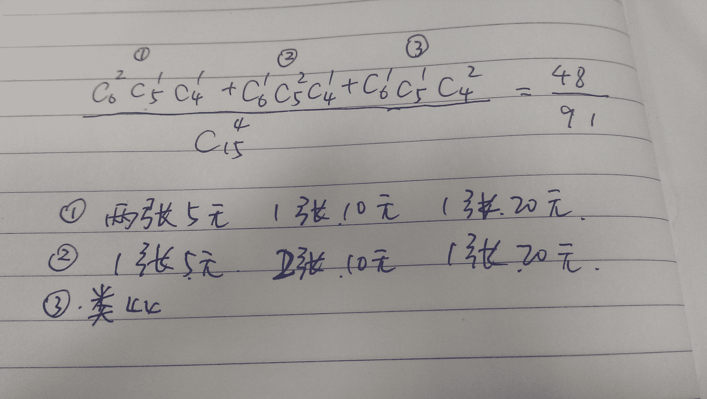

# 阿里巴巴 2016 研发工程师笔试题（二）

## 1

如果下列的公式成立：78+78=123，则采用的是 _______ 进制表示的。

正确答案: C   你的答案: 空 (错误)

```cpp
11
```

```cpp
12
```

```cpp
13
```

```cpp
14
```

```cpp
15
```

```cpp
以上都不对
```

本题知识点

编译和体系结构

讨论

[听风吹的声音](https://www.nowcoder.com/profile/706826)

看个位，因为下列选项都是大于 8 的，8+8=16，而等式右边个位为 3，所以 13 进制，即进了 1 后剩下 3

发表于 2015-08-25 11:00:18

* * *

[小杨 vita](https://www.nowcoder.com/profile/576504)

列方程解即可
78+78=123 为 7x+8+7x+8=x²+2x+3

编辑于 2016-09-23 16:00:06

* * *

[Radar](https://www.nowcoder.com/profile/312842)

解方程，7x+8 + 7x + 8 = x² +2x + 3 得 x=13 ,故答案 **C**

发表于 2015-09-03 15:15:51

* * *

## 2

在 jdk1.5 之后，下列 java 程序输出结果为 ______。

```cpp
int i=0;
Integer j = new Integer(0);
System.out.println(i==j);
System.out.println(j.equals(i));
```

正确答案: B   你的答案: 空 (错误)

```cpp
true,false
```

```cpp
true,true
```

```cpp
false,true
```

```cpp
false,false
```

```cpp
对于不同的环境结果不同
```

```cpp
程序无法执行
```

本题知识点

Java

讨论

[mcq](https://www.nowcoder.com/profile/961991)

本题是一个自动拆装箱的考题(自动拆装箱 JDK 需在 1.5 上），下面的讨论都不针对新开辟对象的情况：
1、基本型和基本型封装型进行“==”运算符的比较，基本型封装型将会自动拆箱变为基本型后再进行比较，因此 Integer(0)会自动拆箱为 int 类型再进行比较，显然返回 true；
2、两个 Integer 类型进行“==”比较，如果其值在-128 至 127，那么返回 true，否则返回 false, 这跟 Integer.valueOf()的缓冲对象有关，这里不进行赘述。
3、两个基本型的封装型进行 equals()比较，首先 equals()会比较类型，如果类型相同，则继续比较值，如果值也相同，返回 true
4、基本型封装类型调用 equals(),但是参数是基本类型，这时候，先会进行自动装箱，基本型转换为其封装类型，再进行 3 中的比较。

> int a=257;
> Integer b=257;
> Integer c=257;
> Integer b2=57;
> Integer c2=57;
> System.out.println(a==b);
> //System.out.println(a.equals(b));  编译出错，基本型不能调用 equals()
> System.out.println(b.equals(257.0));
> System.out.println(b==c);
> System.out.println(b2==c2);

因此上面的代码的结果因此为 true, false, false, true

编辑于 2018-08-24 17:42:59

* * *

[LanCho](https://www.nowcoder.com/profile/9287973)

**总体主要分为两个方面**
***①比较的是值***
一、基本数据类型与引用数据类型进行比较时，引用数据类型会进行拆箱，然后与基本数据类型进行值的比较
举例：
int i = 12;
Integer j = new Integer(12);
i == j 返回的是 true
二、引用数据类型与基本数据类型进行比较（equals 方法），基本数据类型会进行自动装箱，与引用数据类型进行比较，Object 中的 equals 方法比较的是地址，但是 Integer 类已经重写了 equals 方法，只要两个对象的值相同，则可视为同一对象，具体看 API 文档，所以这归根到底也是值的比较！
举例：
int i = 12;
Integer j = new Integer(12);
j.equals(i) 返回的是 true
***②比较的是地址***
一、如果引用数据类型是这样 Integer i = 12;直接从常量池取对象，这是如果数值是在-128 与 127 之间，则视为同一对象，否则视为不同对象
举例：
Integer i = 12; Integer j = 12; i == j 返回的是 true
Integer i = 128; Integer j = 128; i == j 返回的是 false
二、如果引用数据类型是直接 new 的话，不管值是否相同，这时两个对象都是不相同的，因为都会各自在堆内存中开辟一块空间
举例：
Integer i =new Integer(12);
Integer j = new Integer(12);
i == j 这时返回的是 false
三、从常量池取对象跟 new 出来的对象也是不同的
举例：
Integer i = 12;
Integer j = new Integer(12)
i == j 这时返回的是 false，因为第二个语句其实已经是 new 了两个对象了！！！

发表于 2016-09-20 21:09:04

* * *

[StrongYoung](https://www.nowcoder.com/profile/649626)

i==j ，这个是基本类型与 Integer 的比较， j 会自动拆箱成 int 类型，然后比较的是值。因此返回真。

j.equals(i) ，调用 equals 方法后，这个 i 会自动装箱成 Integer 类型，然后再比较值，所以也返回真。

发表于 2015-10-08 16:01:23

* * *

## 3

下列 java 程序的输出结果为 ____。

```cpp
public class Example{
    String str=new String("hello");
    char[]ch={'a','b'};
    public static void main(String args[]){
        Example ex=new Example();
        ex.change(ex.str,ex.ch);
        System.out.print(ex.str+" and ");
        System.out.print(ex.ch);
    }
    public void change(String str,char ch[]){
        str="test ok";
        ch[0]='c';
    }
}
```

正确答案: B   你的答案: 空 (错误)

```cpp
hello and ab
```

```cpp
hello and cb
```

```cpp
hello and a
```

```cpp
test ok and ab
```

```cpp
test ok and cb
```

```cpp
test ok and c
```

本题知识点

Java

讨论

[请叫我猿叔叔](https://www.nowcoder.com/profile/6316247)


编辑于 2016-09-07 23:19:56

* * *

[~Just@Joke~](https://www.nowcoder.com/profile/130959)

String 类是 final 类型的，不能继承和修改这个类。str=“tesk ok”，其实是隐含的让 Java 生成一个新的 String 对象，那么就与原来的“Hello”没有任何关系，当函数结束，str 作用结束，所以输出的还是“Hello”。 char ch[] 是传递引用，修改了原内容。

发表于 2015-08-27 22:09:11

* * *

[淡若清风过](https://www.nowcoder.com/profile/6147433)

经多方面查找，String 很奇特，虽然是引用数据类型，但是采用的却是值传递！！！基本数据类型采用的都是值传递,数组和对象都是引用传递(数组可以按照对象来算),值传递不会改变本身,只是传递拷贝,而引用传动却会改变本身！！！str 属于值传递,不会改变！char[] 属于引用传递，所以改变本身值！

发表于 2016-06-28 20:59:17

* * *

## 4

有关下述 Java 代码描述正确的选项是 ____。

```cpp
public class TestClass {
   private static void testMethod(){
        System.out.println("testMethod");
   }
   public static void main(String[] args) {
        ((TestClass)null).testMethod();
   }
}
```

正确答案: F   你的答案: 空 (错误)

```cpp
编译不通过
```

```cpp
编译通过，运行异常，报 NullPointerException
```

```cpp
编译通过，运行异常，报 IllegalArgumentException
```

```cpp
编译通过，运行异常，报 NoSuchMethodException
```

```cpp
编译通过，运行异常，报 Exception
```

```cpp
运行正常，输出 testMethod
```

本题知识点

Java

讨论

[paddy](https://www.nowcoder.com/profile/797342)

我来总结下大家的分析。1）此处是类对方法的调用，不是对象对方法的调用。2）方法是 static 静态方法，直接使用"类.方法"即可，因为静态方法使用不依赖对象是否被创建。null 可以被强制类型转换成任意类型（不是任意类型对象），于是可以通过它来执行静态方法。3）非静态的方法用"对象.方法"的方式，必须依赖对象被创建后才能使用，若将 testMethod()方法前的 static 去掉，则会报 空指针异常 。此处也验证了 2）的观点当然，不管是否静态方法，都是已经存在的，只是访问方式不同。

编辑于 2016-04-20 15:17:15

* * *

[hanking](https://www.nowcoder.com/profile/3849729)

**一、null 是代表不确定的对象**Java 中，null 是一个关键字，用来标识一个不确定的对象。因此可以将 null 赋给引用类型变量，但不可以将 null 赋给基本类型变量。比如：int a = null;是错误的。Ojbect o = null 是正确的。Java 中，变量的适用都遵循一个原则，先定义，并且初始化后，才可以使用。我们不能 int a 后，不给 a 指定值，就去打印 a 的值。这条对对于引用类型变量也是适用的。有时候，我们定义一个引用类型变量，在刚开始的时候，无法给出一个确定的值，但是不指定值，程序可能会在 try 语句块中初始化值。这时候，我们下面使用变量的时候就会报错。这时候，可以先给变量指定一个 null 值，问题就解决了。例如：Connection conn = null;try {conn = DriverManager.getConnection("url", "user", "password");} catch (SQLException e) {e.printStackTrace();}String catalog = conn.getCatalog();如果刚开始的时候不指定 conn = null，则最后一句就会报错。**二、null 本身不是对象，也不是 Objcet 的实例**null 本身虽然能代表一个不确定的对象，但就 null 本身来说，它不是对象，也不知道什么类型，也不是 java.lang.Object 的实例。可以做一个简单的例子：//null 是对象吗? 属于 Object 类型吗?if (null instanceof java.lang.Object) {System.out.println("null 属于 java.lang.Object 类型");} else {System.out.println("null 不属于 java.lang.Object 类型");}结果会输出：null 不属于 java.lang.Object 类型**三、Java 默认给变量赋值**在定义变量的时候，如果定义后没有给变量赋值，则 Java 在运行时会自动给变量赋值。赋值原则是整数类型 int、byte、short、long 的自动赋值为 0，带小数点的 float、double 自动赋值为 0.0，boolean 的自动赋值为 false，其他各供引用类型变量自动赋值为 null。这个具体可以通过调试来看。**四、容器类型与 null**List：允许重复元素，可以加入任意多个 null。Set：不允许重复元素，最多可以加入一个 null。Map：Map 的 key 最多可以加入一个 null，value 字段没有限制。数组：基本类型数组，定义后，如果不给定初始值，则 java 运行时会自动给定值。引用类型数组，不给定初始值，则所有的元素值为 null。**五、null 的其他作用**1、判断一个引用类型数据是否 null。 用==来判断。2、释放内存，让一个非 null 的引用类型变量指向 null。这样这个对象就不再被任何对象应用了。等待 JVM 垃圾回收机制去回收。csdn：[`blog.csdn.net/u013309870`](https://blog.csdn.net/u013309870)

编辑于 2019-01-15 22:13:24

* * *

[攻城狮小白](https://www.nowcoder.com/profile/1034775)

答案 F：运行正常，输出 testMethod 结论：虽然我们能用对象来调用静态方法，但是对于 java 来说，即使我们用对象去调用，java 自己也会在将源文件编译成 class 文件时将其转化为用类名去调用静态方法。由于空指针异常是运行时异常，所以 eclipse 编译检查也不会报错，而实际运行的是 class 文件，java 已经将 class 文件里的调用修改为类名去调用了，所以也就不会在运行时出现空指针异常。解析和验证过程如下图所示：

发表于 2017-10-12 00:58:55

* * *

## 5

袋子中分别一叠纸币，其中 5 元面值的纸币 6 张，10 元面值的纸币 5 张，20 元面值的纸币 4 张，从袋子中任意取 4 张纸币，则每种面值至少取到一张的概率为 ____。

正确答案: C   你的答案: 空 (错误)

```cpp
8/91
```

```cpp
25/91
```

```cpp
48/91
```

```cpp
53/91
```

```cpp
60/91
```

```cpp
63/91
```

本题知识点

概率统计 *概率论与数理统计* *讨论

[SunburstRun](https://www.nowcoder.com/profile/557336)

  查看全部)

编辑于 2015-08-24 21:30:25

* * *

[加油呀哥们](https://www.nowcoder.com/profile/271004)



发表于 2015-09-05 15:31:33

* * *

[ThyBoox](https://www.nowcoder.com/profile/393740)

C(6,1)*C(5,1)*C(4,1)*C(12,1)/C(15,4)=96/91 为什么有重复（除以 2）？题目中纸币是不相互区分的，这里为了解释给 5 元纸币编号 1,2,3,4,5,6\.假设第一次从 6 个 5 元纸币中取到了 1 号，取完 10 元，20 元后，从剩下的 12 张中取到了 2 号 5 元纸币，则第二次有可能从 6 个 5 元纸币中取到了 2 号，取完 10 元，20 元后，从剩下的 12 张中取到了 1 号 5 元纸币，这样两次都有 1,2 号纸币，所以要除以 2\.

发表于 2015-08-25 16:32:11

* * *

## 6

有一个扔骰子得返现的游戏：你扔一个骰子，扔到多少就可以得到和点数相同的返现。例如你扔到 3，可以得到 3 元返现；扔到 1，可以得到 1 元返现。当你扔完第一次骰子，看到点数后，你需要做出如下选择：1、拿这个点数对应的返现，放弃扔第二次骰子；2、再扔一次骰子，但此时你只能拿第二次扔的点数对应的返现。那么，玩一轮这个游戏的期望收益是 ____ 元。

正确答案: D   你的答案: 空 (错误)

```cpp
3.5
```

```cpp
3.75
```

```cpp
4
```

```cpp
4.25
```

```cpp
4.5
```

```cpp
4.75
```

本题知识点

数学运算

讨论

[SunburstRun](https://www.nowcoder.com/profile/557336)

  查看全部)

编辑于 2015-08-25 00:07:23

* * *

[思翊](https://www.nowcoder.com/profile/791379)

如果第一次扔的是 1 ，那应该重新扔，因为重新扔大于 1 的概率为 5/6>1/2 。同理如果是 2,3 都应该重新扔。如果第一次扔的是 4 ，则不再扔，因为重新扔大于 4 的概率为 2/6<1/2 。同理如果是 5,6 都不再重新扔。因此可以得到概率分布如下：

| X=1 | X=2 | X=3 | X=4 | X=5 | X=6 |
| P1=1/2*1/6 | P2=1/2*1/6 | P3=1/2*1/6 | P4=1/6+1/2*1/6 | P5=1/6+1/2*1/6 | P=1/6+1/2*1/6 |

解释一下 p1=1/2*1/6 。

1/2 表示第一次扔到 1,2,3 的概率， 1/6 表示第二次扔到 1 的概率， x=2,3 同理

p4=1/6+1/2*1/6

1/6 表示第一次扔到 4 的概率， 1/2*1/6 表示第一次扔到 1,2,3 第二次扔到 4 的概率， x=5,6 同理

因此期望为 1*p1+2*p2+3*p3+4*p4+5*p5+6*p6 = 4.25

发表于 2015-08-29 14:23:27

* * *

[灯火](https://www.nowcoder.com/profile/169779)

题目没有明确说明什么时候进行第二次投掷，什么时候放弃第二次投掷，所以我们向着最大期望进行投掷，即第一次为 4，5，6，时，不进行第二次投掷，期望为（4+5+6）*（1/6） ；第一次为 1，2，3 时，可能性为 1/2，并进行第二次投掷，期望为（1/2）*（1+2+3+4+5+6）*（1/6）；所以最后期望为 4.25。

发表于 2015-08-26 14:18:55

* * *

## 7

一个长度为 100 的循环链表，指针 A 和指针 B 都指向了链表中的同一个节点，A 以步长为 1 向前移动，B 以步长为 3 向前移动，一共需要同时移动多少步 A 和 B 才能再次指向同一个节点 ____。

正确答案: E   你的答案: 空 (错误)

```cpp
99
```

```cpp
100
```

```cpp
101
```

```cpp
49
```

```cpp
50
```

```cpp
51
```

本题知识点

链表 *Java 工程师 C++工程师 PHP 工程师 golang 工程师 前端工程师 安卓工程师 iOS 工程师 算法工程师 大数据开发工程师 运维工程师 安全工程师 数据库工程师 游戏研发工程师 测试开发工程师 测试工程师 2021 远景能源有限公司* *讨论

[SunburstRun](https://www.nowcoder.com/profile/557336)

  查看全部)

编辑于 2015-08-25 00:17:20

* * *

[Miss_Wendy](https://www.nowcoder.com/profile/822078)

A B 一快一慢，当二者差一圈时，刚好指向同一节点，3*x-1*x=100   x=50

发表于 2015-08-25 10:39:00

* * *

[shellshell](https://www.nowcoder.com/profile/199809)

这个题从物理角度分析一下就好理解了。A 向前移动 1 步，B 向前移动 3 步。假设 A，B 都在起点，那么把 A 看做静止，B 相对于 A 就是以 2 两步移动了。所以这个题可以这么说：在长度为 100 的循环链表中，A,B 均在起点，A 不移动，B 每次移动 2 步，问啥时候能回到起点？

发表于 2016-03-22 08:55:39

* * *

## 8

某操作系统采用分页存储管理方式，下图给出了进程 A 的页表结构。如果物理页的大小为 512 字节，那么进程 A 逻辑地址为 0x0457（十六 进制）的变量存放在 ____ 号物理内存页中。进程 A 页表：逻辑页    物理页 0            91            22            43            64            55            8

正确答案: C   你的答案: 空 (错误)

```cpp
9
```

```cpp
2
```

```cpp
4
```

```cpp
6
```

```cpp
8
```

```cpp
5
```

本题知识点

操作系统

讨论

[小杨 vita](https://www.nowcoder.com/profile/576504)

  查看全部)

编辑于 2015-08-29 21:11:45

* * *

[三江小渡](https://www.nowcoder.com/profile/579554)

逻辑页=逻辑地址/页面大小；0x0457 化为 10 进制为 1111，所以逻辑页号= 1111/512 = 2（取整舍去余数）；逻辑页 = 2，对应的物理页号为 4；

发表于 2016-01-30 04:43:00

* * *

[illx1220](https://www.nowcoder.com/profile/6743536)

分页系统中的地址结构由两部分组成，页号和页内偏移量。0x0457 即：0000 0100 0101 0111 页内偏移量即为页面大小，由题知为 512 字节，占 9 位所以前 7 位（0000 010）为页号，也就是第 2 页，对应物理页是 4

发表于 2018-08-09 21:54:57

* * *

## 9

在一个 100 人的团队活动中，主持人小猿亮出了一幅裙子的照片，大喊：”看出蓝黑色的举手！“，团队中有 45 人举手，然后小猿又喊：”看出白金色的举手！“，团队中有 40 人举手。机灵的小猿发现，有人从未举过手，有人举手了两次，两轮举手分出的四类人的数目恰好构成一个等差数列。请问有 ____ 人既能看出蓝黑色又能看出白金色。

正确答案: D   你的答案: 空 (错误)

```cpp
0
```

```cpp
15
```

```cpp
30
```

```cpp
35
```

```cpp
50
```

```cpp
55
```

本题知识点

组合数学 *讨论

[钜子墨苍离](https://www.nowcoder.com/profile/584917)

分析：举手为 1，不举手为 0.总共有四种状态，00 01 10 11.依题意，10+11=45,01+11=40.00 +01+10+11=100.题目说的四个状态指的是 00  10+11 01+11 11，而不是 00 01 10 11。求解：设状态 11=x。可得状态 00 为 100-（45+40）+x=15+x。四个状态分别为 x，15+x，40，45.显然 x<40.等差 d=5，等比数列显然是 x 40 45 x+15 得 x=35

编辑于 2015-08-26 11:25:30

* * *

[gendlee](https://www.nowcoder.com/profile/617149)


发表于 2016-03-20 14:18:14

* * *

[厚德载物](https://www.nowcoder.com/profile/478120)

**解析：**

**x** **仅蓝黑色 y** **蓝黑色和白色 z** **仅白色 k** **均没看到**

**x+y = 40**

**y+z =45**

**x+y+z+k =100**

**(x+y+z+k) – (x+y)-(y+z) = k-y=15=nd,** **其中 d** **表示等差数列的前后项的差，由于等差数列只有 4** **向，因此 n<=3,15=3*5** **，因此 n=3** **， d=5** **，并且等差数列必然为 k 45 40 y** **，因此 y=35**

发表于 2015-08-25 00:05:01

* * *

## 10

将 1,2,3,......,99,100 任意排列成一个圈，相邻两数的差的绝对值求和最多为 ____。

正确答案: F   你的答案: 空 (错误)

```cpp
100
```

```cpp
198
```

```cpp
200
```

```cpp
500
```

```cpp
2500
```

```cpp
5000
```

本题知识点

数学运算

讨论

[SunburstRun](https://www.nowcoder.com/profile/557336)

  查看全部)

编辑于 2015-08-25 00:22:49

* * *

[Phoenixcwx](https://www.nowcoder.com/profile/261416)

关键不在于排列是（100 1 99 2 98 3 。。。。 52 49 51 50）还是（1,51,2,52,3,53...49,99,50,100）  而在于这个两数之差是要和前后都对比，这样就相当于算了两遍，所以就是 2500*2=5000

发表于 2015-10-06 11:09:56

* * *

[一朵氤氲 201807111457727](https://www.nowcoder.com/profile/478416653)

1,51,2,52,3,53...49,99,50,100 举例：1 和 51 差 50 51 和 2 差 49 同理：2 和 52 差 50 52 和 3 差 49 以此类推：则有 50 个 50 和 50 个 49 除此之外还有最后收尾的 50 和 100 差 50.所以：50x50+49x50+50=5000

发表于 2018-07-11 15:59:35

* * *

## 11

已知二叉树中有 45 个叶节点，有 25 个度为 1 的节点，则二叉树的总结点数为 ____。

正确答案: C   你的答案: 空 (错误)

```cpp
112
```

```cpp
113
```

```cpp
114
```

```cpp
115
```

```cpp
116
```

```cpp
117
```

本题知识点

树

讨论

[SunburstRun](https://www.nowcoder.com/profile/557336)

有公式 n0=n2+1,所以 n  查看全部)

编辑于 2015-08-24 21:23:36

* * *

[牛客 Shawn](https://www.nowcoder.com/profile/933772)

二叉树的性质 n0=n2+1 的推导：所有节点=n0+n1+n2（即度为 0+1+2 的节点）=2*n2+n1+1（即分支总数+1）.

发表于 2016-04-23 00:00:45

* * *

[灯火](https://www.nowcoder.com/profile/169779)

**度为 2 的节点数为叶子节点数减一，度为 1** **的节点数就是一条一直向上的路径** ，不明白的可以考虑一下 3 个叶子节点，八个度为 1 的节点的二叉树（总结点数为 13 = 3 + 2 + 8），**自己画** **明白了比看十遍答案好用多了，** 这个题的答案就是 44 + 45 + 25 = 114。

发表于 2015-08-26 14:24:24

* * *

## 12

以下函数中，和其他函数不属于一类的是 ____。

正确答案: C   你的答案: 空 (错误)

```cpp
strcpy
```

```cpp
strncpy
```

```cpp
snprintf
```

```cpp
strcat
```

```cpp
strtok
```

```cpp
strncat
```

本题知识点

Linux C 语言

讨论

[活力雪涵](https://www.nowcoder.com/profile/821649)

snprintf 在 stdio.h 头文件中，其他的在 string.h 头文件中

发表于 2015-09-11 15:55:53

* * *

[MonsieurWilson](https://www.nowcoder.com/profile/275180)

首先，使用场景不同。除了 snprintf 之外，其他的都是用于两个字符串之间进行比较、拷贝、拼接等操作的，而 snprintf 最主要是，要把一个用户变量按照一个 format 打印到字符串中。其次，函数参数类型不同。除了 snprintf 之外，其他的都是定长参数，而 snprintf 是接受变长参数的。最后，定义位置也不同，除了 snprintf 位于 stdio.h 之外，其他的都是 string.h 中的。因此，snprintf 和其他的一定不是一类的，单从头文件的划分就能看出来。P.S. glibc 的头文件划分绝大多数都很有讲究。

编辑于 2015-10-25 14:06:23

* * *

[DIYdreamer](https://www.nowcoder.com/profile/404425)

```cpp
 char * strtok(char *str, const char *ch) 将字符串 S 按照字符 ch 分解
```

发表于 2015-09-04 22:43:56

* * *

## 13

某单链表有 5 个元素，设单链表的节点结构为(data,next)，5 个元素的 data 依次为（1、2、3、4、5），已知指针 q 指向节点 3，指针 p 指向节点 4，那么下面操作能将链表变为 data 依次为（1、2、3、5）的是 ____。（其中 temp 为节点类型指针，默认指向 NULL）

正确答案: F   你的答案: 空 (错误)

```cpp
q=p->next;
```

```cpp
p=q->next;
```

```cpp
p->next=q->next;
```

```cpp
q->next=p->next; delete q;
```

```cpp
p->data=p->next->data; p->next=p->next->next; delete p->next;
```

```cpp
temp = p->next; p->next=temp->next; p->data=temp->data; delete temp;temp=NULL;
```

本题知识点

链表 *讨论

[SunburstRun](https://www.nowcoder.com/profile/557336)

  查看全部)

编辑于 2015-08-25 10:28:27

* * *

[data_poper](https://www.nowcoder.com/profile/340257)

这个问题一般会先考虑删除节点 p 但答案中没有合适的删除节点 p 的操作，最接近的选项 D 应该改为 q->next=p->next，且删除 p 才正确因此我们考虑第二种思路把 p 节点数据域的内容改成下一个节点的内容，由 4 改成 5，再删除 p 后面那个节点 5 选项 E 和 F 符合我们的思路考虑 E 选项，我们发现前面指针变换都是对的，但是删除节点时发生了错误因为 p->next 已经在前面改过了，这样造成的后果就是删除的是节点 6 而不是节点 5

发表于 2015-09-09 11:14:36

* * *

[Ze](https://www.nowcoder.com/profile/937369)

二种方案 一种是直接连接数据域为 5 结点，另一种是将数据域为 4 结点的值进行更新第一种的代码 q->next = p->next; p->next = null; delete p; (所以 D 答案错误， 应删除 p)第二种代码 p->data = p->next->data; delete(p->next);p->next = null; 这样既可 F 答案只是将 p->next 用 temp 代替 所以即为 temp = p->next; p->next = temp->next;(其实直接指为空就好) p->data = temp->data; delete(temp); temp = NULL;

发表于 2015-08-31 20:27:52

* * *

## 14

在 1,2,3,.....1000 中，有 ____ 个数各位乘积为 0。

正确答案: D   你的答案: 空 (错误)

```cpp
100
```

```cpp
101
```

```cpp
172
```

```cpp
181
```

```cpp
190
```

```cpp
191
```

本题知识点

数学运算

讨论

[牛客 503715 号](https://www.nowcoder.com/profile/503715)

先求乘积不为 0 的。分一位数 A：1-9 9 个；两位数 AB：9*9=81 个，三位数 ABC：9*9*9=729 总共 9+81+729=819 乘积为 0 的个数：1000-819=181

发表于 2015-08-26 11:42:01

* * *

[牛客 283543 号](https://www.nowcoder.com/profile/283543)

分两种情况考虑，10,20,30，。。。1000，成等差数列，100 个        101,102，。。。109,201,202，。。。209，。。。901，。。。909，共 9*9=81 个一共 181 个

发表于 2015-08-24 22:34:44

* * *

[灯火](https://www.nowcoder.com/profile/169779)

考虑个位为 0 的数，形如 10，20，30...110，120...20，210，220...1000 等，也就是为 1 到 100 每一个数加上一个零，共 100 个数，再考虑十位为 0 的数，101 到 109，共有 9 个，101 到 909 共 81 个数（九个区间，每个区间九个数，即 9 * 9 = 81）；共 100 + 81 = 181。

发表于 2015-08-26 14:30:21

* * *

## 15

 A、B、C、D 四人应聘一个程序员职位，此职务的要求条件是：Java 熟练；懂数据库开发；会 Web 开发；有Ｃ++经验。谁满足的条件最多，谁就被雇用。（1）把上面四个要求条件两两组合，每个组合都恰有一人满足。同时已知（2）A 和 Bjava 熟练（3）B 和 C 会 Web（4）C 和 D 懂数据库（5）D 有 C++经验那么，被雇用的是 ____。

正确答案: B   你的答案: 空 (错误)

```cpp
A
```

```cpp
B
```

```cpp
C
```

```cpp
D
```

```cpp
四人机会均等
```

```cpp
以上均错
```

本题知识点

判断推理

讨论

[SunburstRun](https://www.nowcoder.com/profile/557336)

经过推测为(s 为数据库)  查看全部)

编辑于 2015-08-24 21:12:27

* * *

[人傻就要多读书](https://www.nowcoder.com/profile/692176)

根据已知条件，列出当前了解的技能掌握情况
Java:A 和 B
WEB:B 和 C
数据库:C 和 D
c++:D 和 B
再写出六种技能组合，结合已知条件进行推测。Java Web：B 会，**所以 A 肯定不会 Web** **(因为 A 会 Java)**
Java 数据库：
Java c++：
web 数据库：C 会，所以 B 不会数据库（因为 B 会 WEB），**D 不会 WEB(D 会数据库)**。
数据库 c++：D 会，**所以 C 不会** **C++(因为 C 会 WEB)**
WEB c++：排除了 ACD，只能是 B 会。
所以能推断出 B 会三项技能，java web 和 c++。且只能有一个人会三项技能及以上，否则就不满足"每个组合都恰有一人满足"的条件,故 B 是会的技能最多的。  

编辑于 2015-10-29 16:49:55

* * *

[静水云深](https://www.nowcoder.com/profile/2842161)

先写出结果（其中 “ ⊙ ”表示已经掌握相关经验，“ ⊗ ”表示未掌握相关经验 ）可知，B 满足的条件最多 !

|  | Java | 数据库 | Web | C++ |
| A | ⊙ | ⊙ | ⊗ | ⊗ |
| B | ⊙ | ⊗ | ⊙ | ⊙ |
| C | ⊗ | ⊙ | ⊙ | ⊗ |
| D | ⊗ | ⊙ | ⊗ | ⊙ |

由（2）A 和 B java 熟练（3）B 和 C 会 Web（4）C 和 D 懂数据库（5）D 有 C++经验可知：

|  | Java | 数据库 | Web | C++ |
| A | ⊙ |  |  |   |
| B | ⊙ |  | ⊙ |  |
| C |  | ⊙ | ⊙ |  |
| D |  | ⊙ |  | ⊙ |

分析条件（1）把上面四个要求条件两两组合，每个组合都恰有一人满足：首先（数据库—Web）组合，其中有 C 满足条件，其它人都不能满足了，能确定 B 不会数据库(已经会 Web 了)，D 不会 Web(已经会数据库了)；考虑（Java—Web）组合，其中有 B 满足条件，其他人不能满足了，能确定 C 不会 Java（已经会 Web 了），A 不会 Web（已经会 Java 了）；观察（Web—C++）组合，还没有任何一组能满足条件，A、C、D 都不可能满足条件了，只有 B 获得 C++经验即可满足条件；观察（Java—C++）组合，已经有 B 满足条件了，A 不能获得 C++经验（已经获得 Java 了），D 也不能获得 Java 了（已经获得 C++了）最后（Java—数据库）组合还没有满足条件（1），则 A 获得数据库经验：

|  | Java | 数据库 | Web | C++ |
| A | ⊙ | ⊙ | ⊗ | ⊗ |
| B | ⊙ | ⊗ | ⊙ | ⊙ |
| C | ⊗ | ⊙ | ⊙ | ⊗ |
| D | ⊗ | ⊙ | ⊗ | ⊙ |

编辑于 2017-04-19 08:41:36

* * *

## 16

一个单向链表队列中有一个指针 p，现要将指针 r 插入到 p 之后，该进行的操作是 ____。

正确答案: C   你的答案: 空 (错误)

```cpp
p->next=p->next->next
```

```cpp
r->next=p;p->next=r->next
```

```cpp
r->next=p->next;p->next=r
```

```cpp
r=p->next;p->next=r->next
```

```cpp
r->next=p;p->next=r
```

```cpp
p=p->next->next
```

本题知识点

链表 *讨论

[木三](https://www.nowcoder.com/profile/488933)

C 啊，先将 r 指向 p 后边节点，再将 p 指向 r

发表于 2015-08-25 09:59:06

* * *

[星陨无痕](https://www.nowcoder.com/profile/436939)

答案选择 C1.单向链表队列中有 A、B 两个相邻元素 2.有一个指针 p 指向元素 A 由 1，2 得到 3：p->next=B 现在要把 r 指针指向的 S 插入到 A 和 B 中间，就要把 B 放到 S 后面也就是 r->next=B 然后把 S 放到 A 的后面也就是 p->next=S 由上述得到 r->next=p->nextp->next=r 答案选择 C

发表于 2015-09-29 22:10:22

* * *

[LaGuZai](https://www.nowcoder.com/profile/6324848)

题目说的是链表队列，既然是队列，怎么可以随意插入元素？难道不是只有在队尾才能插入么？

发表于 2016-09-25 14:02:15

* * *

## 17

使用 KMP 算法在文本串 S 中找模式串 P 是一种常见的方法。假设 S=P={xyxyyxxyx}，亦即将 S 对自己进行匹配，匹配过程中正确的 next 数组是 ____。

正确答案: C   你的答案: 空 (错误)

```cpp
0,1,1,2,2,1,2,2,3
```

```cpp
0,1,2,2,3,1,2,2,3
```

```cpp
0,1,1,2,3,1,2,2,3
```

```cpp
0,1,1,2,3,1,1,2,3
```

```cpp
0,1,2,2,3,1,1,2,3
```

```cpp
0,1,2,2,2,1,1,2,3
```

本题知识点

查找 *讨论

[时态的空白&trade;](https://www.nowcoder.com/profile/162175)

1、首先求最大相同前缀后缀长  查看全部)

编辑于 2016-02-25 23:07:38

* * *

[StrongYoung](https://www.nowcoder.com/profile/649626)

严版数据结构求 next 的公式：


我们主要观察第二项，存在两种情况：

（ 1 ）集合为空，若集合为空，则属于公式中的第一或第三种情况（其他情况）， j=1 的时候， next[1]=0 ，当 j>1 的时候， next[j]=1 。

（ 2 ）集合不为空，则我们要取的 k ，是集合中 k 的最大值。

K 需要满足两个条件，一是 1<k<j ，二是后面那个。--------------------------------------------------------对于前面这个，不用多说，对于后面这个，如果只看形式化的公式，估计比较难理解其意义。通过阮老师的博文（http://www.ruanyifeng.com/blog/2013/05/Knuth%E2%80%93Morris%E2%80%93Pratt_algorithm.html），不难理解，后面这个表达式的意义就是所有前缀与所有后缀中，前缀与后缀相同的情况，那么，这个 k 的取值就是前缀与后缀相等时，字符串的长度加上 1 。-------------------------------------------------------

先以严老师书上的例子：

求模式串 abaabcac 的 next 数组

当 j=1 时， next[1]=0 ，直接是公式的第一种情况

当 j=2 时，因为第二种情况要保证集合不为空且 1<k<j ，那么， j=2 时，集合为空，所以不符合第二种情况，因此，属于其他情况，即 next[2]=1

当 j=3 时， k 要小于 j ，所以，我们要在模式串找长度小于 j 的前面全部串的前缀与后缀相同时的最大长度，也就是在模式串中找到前两位 ab ，来找他们最长的前缀与后缀及长度，可以发现，他们没有相同的前缀与后缀，因此，长度为 0 ，而 k 等于长度加 1 ，所以 next[3]=1

当 j=4 时，在 aba 中找前缀与后缀的相同时的最大长度，可以求出最大长度 Max 为 1 ，所以 next[4]=2

当 j=5 时，在 abaa 中找，Max 为 1 ，所以 next[5]=2

当 j=6 时，在 abaab 中找，Max 为 2 ，所以 next[6]=3

当 j=7 时，在 abaabc 中找，Max 为 0 ，所以 next[7]=1

当 j=8 时，在 abaabca 中找，Max 为 1 ，所以 next[8]=2

之所以要找前缀与后缀，是因为我们在比较的时候，避免做多余的工作，即每次遇到主串和模式串不等时，都把模式串直接从头开始比。-------------------------------------------------------------------

以模式串为 xyxyyxxyx 为例，求 next

当 j=1 ， next[1]=0

当 j=2 ， next[2]=1

当 j=3 ，在 xy 中找前缀与后缀，最大长度 max 为 0 ， next[3]=1

当 j=4 ，在 xyx 中找， Max 为 1 ， next[4]=2

当 j=5 ，在 xyxy 中找， Max 为 2 ， next[5]=3

当 j=6 ，在 xyxyy 中找， Max 为 0 ， next[6]=1

当 j=7 ，在 xyxyyx 中找， Max 为 1 ， next[7]=2

当 j=8 ，在 xyxyyxx 中找， Max 为 1 ， next[8]=2

当 j=9 ，在 xyxyyxxy 中找， Max 为 2 ， next[9]=3

编辑于 2015-09-14 11:04:36

* * *

[厚德载物](https://www.nowcoder.com/profile/478120)

**解析：**

**首先求出最长公共元素长度 0 0 1 2 0 1 1 2 3**

**求出 next** **数组 -1 0 0 1 2 0 1 1 2 KMP** **应用 next** **数组时，当第 j** **个元素不匹配时，模式串右移 j-next[j]** **个字符**

**当求出的 next** **数组为 0 1 1 2 3 1 2 2 3** **时， KMP** **应用 next** **数组时，当第 j** **个元素不匹配时，模式串右移 j-1-next[j]** **个字符**

发表于 2015-08-25 00:38:25

* * *

## 18

A 为整数数组， N 为 A 的数组长度，请问执行以下代码，最坏情况下的时间复杂度为 ____。

```cpp
void fun(int A[], int n) {                                                                        
    for (int i = n - 1; i >= 1; i--) {                                                           
        for (int j = 0; j < i; j++) {                                                             
            if (A[j] > A[j+1]) {                                                                 
                int tmp = A[j + 1];                                                               
                A[j + 1] = A[j];
                A[j] = tmp;
         }
      }
   }
}
```

正确答案: B   你的答案: 空 (错误)

```cpp
O(N)
```

```cpp
O(N²)
```

```cpp
O(Nlog(N))
```

```cpp
O(log(N))
```

```cpp
O(N³)
```

```cpp
无法确定
```

本题知识点

数组

讨论

[能发光的黛 _Funny](https://www.nowcoder.com/profile/955330)

冒泡排序法，最坏情况为(n-1)+(n-2)+……+1=n(n-1)/2   所以复杂度是 N²

发表于 2015-09-07 16:50:22

* * *

[((.))...](https://www.nowcoder.com/profile/974598)

冒泡排序法，在最坏的情况下需要进行 n(n-1)次运算，其时间复杂度为 n²

发表于 2015-08-25 10:06:10

* * *

[江左梅郎 3](https://www.nowcoder.com/profile/7306669)

冒泡排序法，最坏情况为(n-1)+(n-2)+……+1=n(n-1)/2   所以复杂度是 N²

发表于 2017-03-27 09:02:11

* * *

## 19

牛客某程序猿小杨每天接老婆下班回家。小杨在 6 点准时下班从公司开车出发，由于路上可能存在的堵车情况，小杨到老婆公司门口的时间点均匀的分布在 6 点 20 到 6 点 30 之间。老婆根据小杨的下班时间做了估计，到公司门口的时间点均匀的分布在 6 点 25 到 6 点 30 之间，如果小杨比老婆晚到公司门口将会挨骂，那么小杨被骂的概率是 ____。

正确答案: A   你的答案: 空 (错误)

```cpp
1/4
```

```cpp
1/3
```

```cpp
1/2
```

```cpp
2/3
```

```cpp
3/4
```

```cpp
以上都不对
```

本题知识点

概率统计 *概率论与数理统计* *讨论

[新手 _ 新手](https://www.nowcoder.com/profile/660646)


编辑于 2016-03-23 10:50:22

* * *

[P-ShineBeam](https://www.nowcoder.com/profile/945440246)

y 的值域在[20,30],x 的值域在[25,30],求 x>y 的概率应该是这么回事吧

编辑于 2019-08-06 20:04:09

* * *

[沐楠](https://www.nowcoder.com/profile/696953)

6.20-6.25 到达的概率为 1/2 不会挨骂 6.25-6.30 小杨先到概率为 1/2，不挨骂 1/2*1/2 剩下 1/4 挨骂

发表于 2015-09-04 16:27:37

* * *

## 20

将整数数组（7-6-3-5-4-1-2）按照堆排序的方式原地进行升序排列，请问在整个排序过程中，元素 3 的数组下标发生过 ____ 次改变。

正确答案: C   你的答案: 空 (错误)

```cpp
0
```

```cpp
1
```

```cpp
2
```

```cpp
3
```

```cpp
4
```

```cpp
5
```

本题知识点

排序 *讨论

[sunlight_run](https://www.nowcoder.com/profile/6428287)

注：粉红色代表已经排好序的，绿色代表交换的节点，砖红色代表没做改动的店从图中可以看出来，3 在交换 4 和交换 5 这两步中，位置都有变化，所以一共是 2 次注意交换 4 这一步，本来交换之后，就是有序的，但是程序还会继续调整，直到所有节点调整完毕

发表于 2017-07-04 08:54:40

* * *

[Ze](https://www.nowcoder.com/profile/937369)

按整数数组的最大堆定义，每次调整完后根结点的元素与最后个元素交换，继续下次调整，直到所有的结点调整完毕。原数组为 7 6 3 5 4 1 2 满足最大堆定义，直接交换根节点元素               2 6 3 5 4 1 7，交换完毕
               6 5 3 2 4 1 7，调整完毕
               1 5 3 2 4 6 7，交换完毕               5 4 3 2 1 6 7，调整完毕               1 4 3 2 5 6 7，交换完毕               4 2 3 1 5 6 7，调整完毕               1 2 3 4 5 6 7，交换完毕，此时虽然已有序，但仍需进行最大堆调整，因为最大堆算法时间复杂度为 nlog2n，会进行继续搜索调整               3 2 1 4 5 6 7，调整完毕，移动一次               1 2 3 4 5 6 7，交换完毕，移动两次               2 1 3 4 5 6 7，调整完毕               1 2 3 4 5 6 7，交换完毕

发表于 2015-08-31 16:59:40

* * *

[TaskMachine](https://www.nowcoder.com/profile/634296)

我一开始看错题，以为是一趟排序，所以选的 0，如果是整个排序过程，3 应该只移动了 2 次，就是最后 3 放入堆顶 1 次（下标从 2 变为 0），然后跟当前堆的最后一个元素交换 1 次（下标从 0 变为 2），一共 2 次。

发表于 2015-08-25 11:03:47

* * *********