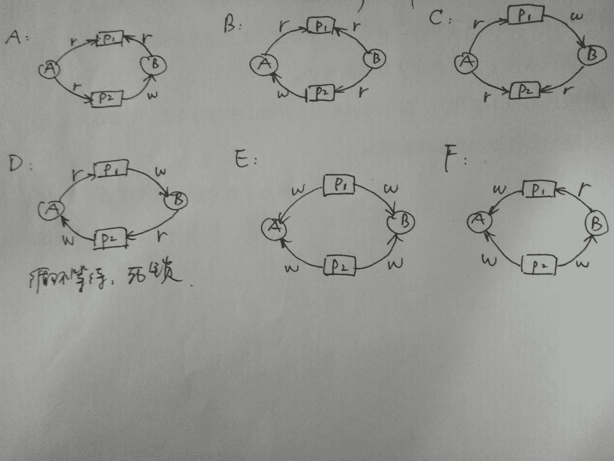
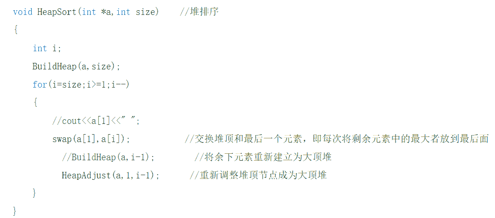
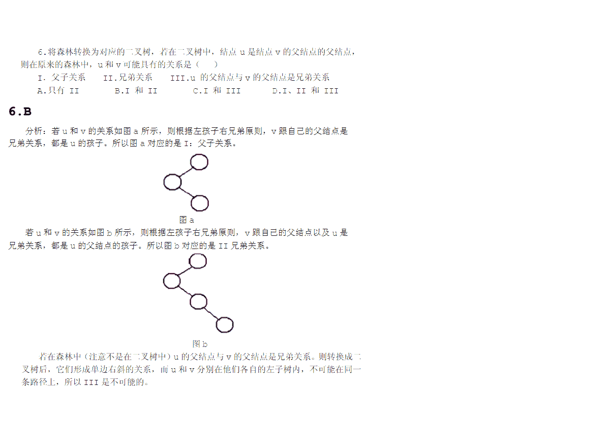
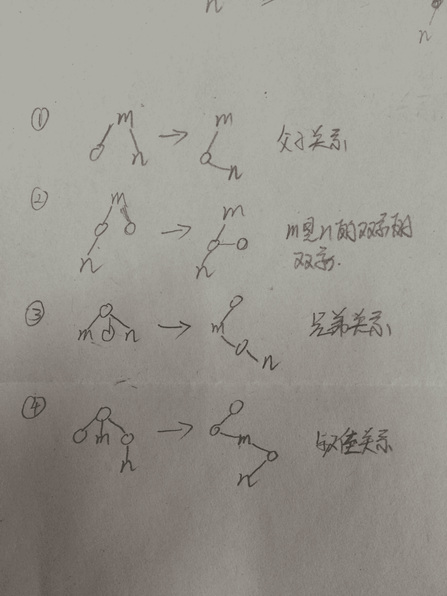
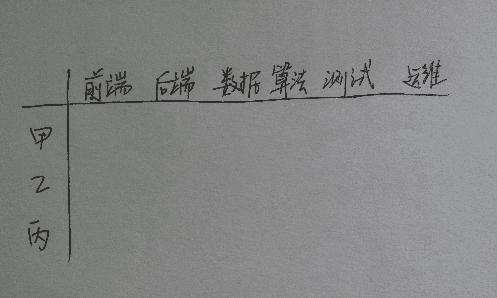
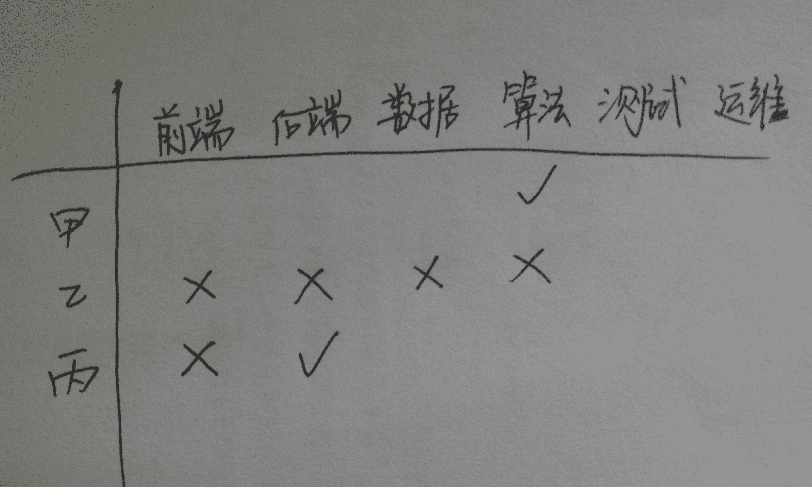
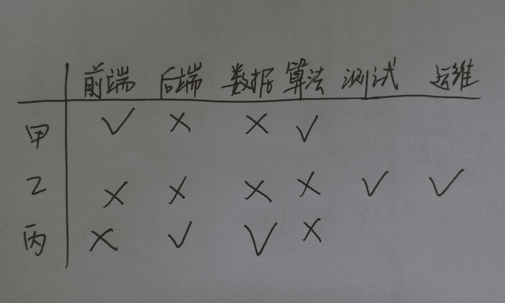
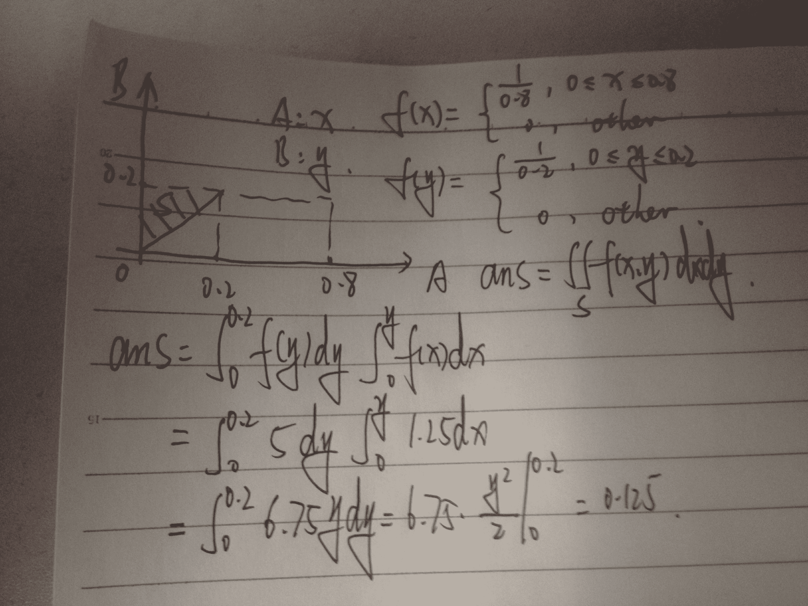

# 阿里巴巴 2016 研发工程师笔试题（三）

## 1

下面线程间的通讯机制中，关键路径上不会产生系统调用从而减少用户态到内核态的上下文切换的是 ____。

正确答案: A   你的答案: 空 (错误)

```cpp
pthread_spin_lock
```

```cpp
pthread_mutex
```

```cpp
信号量
```

```cpp
pthread_rwlock
```

```cpp
管道
```

```cpp
消息队列
```

本题知识点

操作系统

讨论

[渊鸿](https://www.nowcoder.com/profile/414689)

**1， ** **spinlock** **介绍**

spinlock 又称自旋锁，线程通过 busy-wait-loop 的方式来获取锁，任时刻只有一个线程能够获得锁，其他线程忙等待直到获得锁。spinlock 在多处理器多线程环境的场景中有很广泛的使用，一般要求使用 spinlock 的临界区尽量简短，这样获取的锁可以尽快释放，以满足其他忙等的线程。Spinlock 和 mutex 不同，spinlock 不会导致线程的状态切换(用户态->内核态)，但是 spinlock 使用不当(如临界区执行时间过长)会导致 cpu busy 飙高。

**2** **，使用准则**

Spinlock 使用准则：临界区尽量简短，控制在 100 行代码以内，不要有显式或者隐式的系统调用，调用的函数也尽量简短。例如，不要在临界区中调用 read,write,open 等会产生系统调用的函数，也不要去 sleep；strcpy，memcpy 等函数慎用，依赖于数据的大小。

发表于 2015-09-04 14:18:51

* * *

[小杨 vita](https://www.nowcoder.com/profile/576504)

pthread_spin_lock 自旋锁，在进入阻塞队列之前先跑几个循环，然后再去尝试获取锁，直到自旋的次数超过阈值，才进入阻塞队列，此时才切换状态

编辑于 2015-08-27 03:08:44

* * *

[米兰的小铁匠 114](https://www.nowcoder.com/profile/5108687)

**优缺点比较** **spinlock 不会使线程状态发生切换，mutex 在获取不到锁的时候会选择 sleep。

mutex 获取锁分为两阶段，第一阶段在用户态采用 spinlock 锁总线的方式获取一次锁，如果成功立即返回；否则进入第二阶段，调用系统的 futex 锁去 sleep，当锁可用后被唤醒，继续竞争锁。

Spinlock 优点：没有昂贵的系统调用，一直处于用户态，执行速度快。

Spinlock 缺点：一直占用 cpu，而且在执行过程中还会锁 bus 总线，锁总线时其他处理器不能使用总线。

Mutex 优点：不会忙等，得不到锁会 sleep。

Mutex 缺点：sleep 时会陷入到内核态，需要昂贵的系统调用。

发表于 2016-07-29 14:56:32

* * *

## 2

有一个类 B 继承自类 A，他们数据成员如下：

```cpp
class A {
...
private：
   int &a;
};
class B : public A {
...
private:
     int a;
public:
     const int b;
     A c;
     static const char* d;
     A* e;
};
```

则构造函数中，成员变量一定要通过初始化列表来初始化的是 ____。

正确答案: A   你的答案: 空 (错误)

```cpp
b c
```

```cpp
b c e
```

```cpp
b c d e
```

```cpp
c e
```

```cpp
b d
```

```cpp
b e
```

本题知识点

C++

讨论

[＆Builder](https://www.nowcoder.com/profile/659077)

常量成员和引用成员自然是要初  查看全部)

编辑于 2016-03-24 15:29:10

* * *

[风走了，雨停了](https://www.nowcoder.com/profile/620747)

```cpp
前面几位已经说得很好了，我亲自试了试，并总结了一下。
在构造函数中需要初始化列表初始化的有如下三种情况 1.带有 const 修饰的类成员 ，如 const int a ；
2.引用成员数据，如 int& p;
3.带有引用的类变量，如： class A {
private:
       int &a;
};
class B{
private:
  A c;
}
这里的 c 需要用初始化列表进行初始化。 class A {
```

private:int &a;int b;public:A():a(b){}};class B : public A {public:B(A ac):b(10),A(c){}private:int a;public:const int b;A c;static const char* d;A* e;};

发表于 2015-08-30 21:40:17

* * *

[等待。。。。](https://www.nowcoder.com/profile/244306)

static 修饰的变量在类外初始化，const 修饰的在参数列表初始化在构造函数中需要初始化列表初始化的有如下三种情况 1.带有 const 修饰的类成员 ，如 constinta ；2.引用成员数据，如 int& p;3.带有引用的类变量（如题目的对象 c）

发表于 2016-03-26 11:54:52

* * *

## 3

一人以 d 元在淘宝买入 n 套《三体》，d 为正整数，其中两套他以成本一半送给朋友，余下的每套高于原价 8 元卖出，加上送给朋友的两套，如果全部利润是 72 元，那么 n 最小可能是 ____。

正确答案: E   你的答案: 空 (错误)

```cpp
18
```

```cpp
17
```

```cpp
15
```

```cpp
13
```

```cpp
12
```

```cpp
10
```

本题知识点

数学运算

讨论

[兮岽](https://www.nowcoder.com/profile/855646)

E
d+(n-2)(d+8)  查看全部)

编辑于 2015-08-29 22:34:20

* * *

[，？](https://www.nowcoder.com/profile/687269)

假设每本 a 元，送朋友 2 本赔了 a 元，剩下 n-2 本，赚了(n-2)*8 元。净利 (n-2)*8-a = 72.即 8n-a = 88。a 大于 0，所以 n 大于 11，最小为 12.

发表于 2015-08-28 15:19:25

* * *

[guanjian](https://www.nowcoder.com/profile/564796)

(n-2)*8-2*d/n*0.5 = 72,所以 8n（n-11）=d，显然 n=12

发表于 2015-09-02 20:01:53

* * *

## 4

进程 P1 和 P2，资源 A 和 B，进程对资源的操作定义如下：读取资源 A：rA；读取资源 B：rB；写入资源 A：wA；写入资源 B：wB。同时规定，进程读取某一资源前，必须加上共享锁，写入某一资源前必须加上排他锁；资源在被进程加共享锁时，可以被其他进程继续加共享锁，但不能加排他锁；资源在被进程加排他锁时，其他进程无法加锁。进程完成全部操作后释放锁。进程 P1 和进程 P2 并发执行，如下哪种运行序列可能会出现死锁 _____。

正确答案: D   你的答案: 空 (错误)

```cpp
P1(rA->rB), P2(rA->wB)
```

```cpp
P1(rA->rB), P2(wA->rB)
```

```cpp
P1(wB->rA), P2(rA->rB)
```

```cpp
P1(wB->rA), P2(wA->rB)
```

```cpp
P1(wA->wB), P2(wA->wB)
```

```cpp
P1(wA->rB), P2(wA->wB)
```

本题知识点

操作系统

讨论

[wentguo](https://www.nowcoder.com/profile/803846)

D 选项满足死锁的四个必要条件，符合题意。

编辑于 2016-06-28 15:56:00

* * *

[XQ](https://www.nowcoder.com/profile/554854)

DP1 得到 B 想要 A，p2 得到 A 想要 B 保持与请求，循环等待，非剥夺式，互斥事件不能同时访问

发表于 2015-08-31 17:46:39

* * *

[future_yang](https://www.nowcoder.com/profile/758244)

顺便复习下产生死锁的四个必要条件：资源独占不可剥夺请求和保持循环等待

发表于 2015-08-31 09:11:26

* * *

## 5

假设基准值为数组首元素的快速排序，要使得数组满足非降序排列，下列数据分布导致快排算法效率最低的是 ____。

正确答案: E   你的答案: 空 (错误)

```cpp
2-6-3-7-5-1-4
```

```cpp
6-2-3-5-4-1-7
```

```cpp
7-5-3-2-4-1-6
```

```cpp
1-5-7-2-4-6-3
```

```cpp
1-2-3-4-5-6-7
```

```cpp
4-1-3-7-5-6-2
```

本题知识点

排序 *讨论

[/*起一个响亮的名字吧*/](https://www.nowcoder.com/profile/679250)

快排每一趟就是 O（n），在一般情况下递归深度是 log（n），所以总的复杂度是 O(nlogn)。在有序的情况下，递归深度变成了 n，所以总复杂度会退化到 O(n*n)

编辑于 2015-09-04 16:34:33

* * *

[霖淼书生](https://www.nowcoder.com/profile/959464)

基本有序的情况下：快排最慢，堆排最快。

发表于 2015-08-29 16:56:55

* * *

[╰微笑感染嘴角的苦涩](https://www.nowcoder.com/profile/458882)

初始序列有序时，快速排序效率最低

发表于 2015-08-27 16:45:16

* * *

## 6

二进制值 0.00110011001100110011001100110011 转换成 10 进制后最接近 ____。

正确答案: C   你的答案: 空 (错误)

```cpp
0.1
```

```cpp
0.15
```

```cpp
0.2
```

```cpp
0.22
```

```cpp
0.25
```

```cpp
0.3
```

本题知识点

编译和体系结构

讨论

[夏雨天](https://www.nowcoder.com/profile/710633)

选择 C 在计算机中二进制  查看全部)

编辑于 2015-08-29 22:35:11

* * *

[飘雪的长夜](https://www.nowcoder.com/profile/597665)

根据题目中的规律，可以把其转换成十六进制为 0.33333333（16）根据等比数列的求和公式可以很快的求出结果近似为 0.2；其中 1/16 的 8 次方很小忽略掉

发表于 2015-08-27 22:59:58

* * *

[wanxiaonan](https://www.nowcoder.com/profile/300590)

0.001101b=1/8 + 1/16 + 1/64= 0.203125 > x0.0011001b = 1/8 + 1/16 + 1/128 = 0.1953125 < x 所以约为 0.2

发表于 2015-12-11 15:53:38

* * *

## 7

将整数数组（7-6-3-5-4-1-2）按照堆排序的方式原地进行升序排列，请问在第一轮排序结束之后，数组的顺序是 _____。

正确答案: C   你的答案: 空 (错误)

```cpp
2-6-3-5-4-1-7
```

```cpp
6-2-3-5-4-1-7
```

```cpp
6-5-3-2-4-1-7
```

```cpp
1-5-3-2-4-6-7
```

```cpp
5-4-3-2-1-6-7
```

```cpp
5-1-3-2-4-6-7
```

本题知识点

排序 *讨论

[林乔夕](https://www.nowcoder.com/profile/995732)

原数组已经是一个大顶堆，可直接开始排序。
（大顶堆：每个节点的值都不小于自己两个左右子节的完全二叉树）
每轮输出堆顶元素后，以堆中最后一个元素代替之（由于此题要求原地排序，即不产生额外的空间，堆顶元素与最后一个元素交换）。再将新的顶点元素不断与其子节点中大于该元素的较大者交换，直到该元素大于其左右两个子节点，或成为叶子节点。此时将剩余元素调整成一个新的大顶推。
           **7                        2** 6                       6
          /  \                      /  \                      /  \                     /  \
        6     3     ==>      6     3     ==>      **2**     3    ==>      5    3
       /  \    /  \              /  \    /                /  \    /               /  \    / 
     5   4  1   **2**          5   4  1     7        5   4  1     7      **2**   4  1      7

由此得出，第一轮结束后的顺序是：6,5,3,2,4,1,7。

发表于 2016-06-24 11:41:19

* * *

[姜太公](https://www.nowcoder.com/profile/119607)

问题是“一轮排序”都做了什么：肯定是先构建堆，再把堆顶和最后的元素交换；如果交换后再一次构建堆，那就已经进入“第二轮排序”的步骤了吧

发表于 2015-08-29 09:29:37

* * *

[牛客 7309617 号](https://www.nowcoder.com/profile/7309617)

```cpp
可以看堆排序的源代码，主要是理解“一轮排序”具体做了，不仅仅交换，还要调整堆。

```



发表于 2017-07-19 08:51:58

* * *

## 8

函数 func 的定义如下：

```cpp
void func(const int& v1, const int& v2){
    std::cout << v1 << ' ';
    std::cout << v2 << ' ';
}
```

在上下文及头文件均正常的情况下，以下代码在 vs 中输出结果为 ____。

```cpp
int main (int argc, char* argv[]){
    int i = 0;
    func(++i, i++);
    return 0;
}
```

正确答案: D   你的答案: 空 (错误)

```cpp
0 1
```

```cpp
1 2
```

```cpp
2 1
```

```cpp
2 0
```

```cpp
程序强制终止并报错
```

```cpp
结果与编译器有关
```

本题知识点

C++ C 语言

讨论

[Ze](https://www.nowcoder.com/profile/937369)

C 语言函数参数入栈顺序为由右向左,func(++i, i++)可以分解为参数 i 先入栈 输出 0 然后执行 i++ 此时 i 为 1 接着参数 i 先执行++i   i 此时为 2  后入栈进行输出 2

编辑于 2017-06-07 11:08:45

* * *

[tangbongbong](https://www.nowcoder.com/profile/291587)

未定义行为 C++ Standard, section 5.2.2/8:The order of evaluation of arguments is **unspecified**. All side effects of argument expression evaluations take effect before the function is entered. **The order of evaluation of the postfix expression and the argument expression list is unspecified**.ref : http://www.open-std.org/jtc1/sc22/open/n2356/expr.html 具体也可以见 Effective C++ 条款 17 调用顺序可能引发的问题。你们出题的人能负点责么？

编辑于 2015-08-28 11:29:28

* * *

[mmerry](https://www.nowcoder.com/profile/7666462)

c 语言函数参数的入栈顺序为由右向左。切记 mark 下。

发表于 2017-06-05 20:42:43

* * *

## 9

将森林转换为对应的二叉树，若在二叉树结点中，结点 m 是结点 n 的双亲结点的双亲结点，则在原来的森林中，m 和 n 可能具有的关系是 ____。1.父子关系 2.m 的双亲结点与 n 的双亲结点是兄弟关系 3.兄弟关系

正确答案: B   你的答案: 空 (错误)

```cpp
只有 3
```

```cpp
1 和 3
```

```cpp
1 和 2
```

```cpp
1、2 和 3
```

```cpp
只有 1
```

```cpp
只有 2
```

本题知识点

树

讨论

[风 _N++](https://www.nowcoder.com/profile/412270)

只能是 1、3，2 是不可能的，这道题在 2009 年计算机专业统考题中出现过：

编辑于 2016-08-30 10:41:59

* * *

[Zsea](https://www.nowcoder.com/profile/9399356)



编辑于 2017-03-31 18:26:35

* * *

[萱萱是个好姑娘](https://www.nowcoder.com/profile/890398)

我觉得选项 2 也是正确的诶

发表于 2016-07-20 16:20:28

* * *

## 10

在 1,2,3,......,999,1000 中，有 ____ 个数各位数之和模 10 等于 0。

正确答案: A   你的答案: 空 (错误)

```cpp
99
```

```cpp
100
```

```cpp
101
```

```cpp
150
```

```cpp
200
```

```cpp
201
```

本题知识点

数学运算

讨论

[mopodao](https://www.nowcoder.com/profile/217433)

3*9=27 所以只可能和为 1  查看全部)

编辑于 2015-08-29 22:37:47

* * *

[丘山](https://www.nowcoder.com/profile/149382)

0~99 一共 9 个数符合条件。100~999  如果百位和十位确定了，那各位就确定了。百位可以去 1~9，十位可以取 0~9，所以 100~999 满足条件的为 9*10=90\.总和就是 99。

发表于 2015-08-28 15:47:17

* * *

[guanjian](https://www.nowcoder.com/profile/564796)

1~99  如果十位确定了,那么个位就确定了,十位 1~9，一共 9 个数符合条件。100~999  如果百位和十位确定了，那么各位就确定了。百位 1~9，十位 0~9，所以 100~999 满足条件的为 9*10=90\.总和就是 99

发表于 2015-09-02 20:34:59

* * *

## 11

两人在一个 n 个点的无向完全图上进行游戏，每次可以选择当前图中某条两个端点度数奇偶性相同的边删除，谁不能操作谁输，则在 n=1,2,3,......,9,10 中，有 ____ 个图先手有必胜策略。

正确答案: D   你的答案: 空 (错误)

```cpp
2
```

```cpp
3
```

```cpp
4
```

```cpp
5
```

```cpp
6
```

```cpp
7
```

本题知识点

图

讨论

[渊鸿](https://www.nowcoder.com/profile/414689)

N 个点的无向完全图边数为：N  查看全部)

编辑于 2016-02-25 10:29:13

* * *

[牛客 940318](https://www.nowcoder.com/profile/532181)

我靠，你们的这解释也太牵强了吧。

发表于 2015-10-18 17:17:55

* * *

[老空楼](https://www.nowcoder.com/profile/444748)

首先，2k+1 个结点与 2k 个结点的情况是一样的，因为其多出了个不能对其操作的结点，最简单的例子是 1 个结点和 0 个结点，次简单点的可以自己画个 2、3 个结点或 4、5 个结点的来分析。所以只用讨论 2k 个结点的情况。2k 个结点有 k * ( 2k - 1 ) 条边，当有奇数条边时，就能保证先手必胜。所以 k = 1，3，5，7…换成对应的 2k 以及 2k+1，即 2，3，6，7，10，11，14，15…都可以满足情况。又因为题目限制 2k <= 10 及 2k + 1 <= 10，所以 2，3，6，7，10 满足，共 5 个。

发表于 2016-09-17 11:23:30

* * *

## 12

以下程序输出结果是 ____。

```cpp
class A
{
public:
    virtual void func(int val = 1)
    { std::cout<<"A->"<<val <<std::endl;}
    virtual void test()
    { func();}
};
class B : public A
{
public:
    void func(int val=0)
{std::cout<<"B->"<<val <<std::endl;}
};
int main(int argc ,char* argv[])
{
    B*p = new B;
    p->test();
return 0;
}
```

正确答案: B   你的答案: 空 (错误)

```cpp
A->0
```

```cpp
B->1
```

```cpp
A->1
```

```cpp
B->0
```

```cpp
编译出错
```

```cpp
以上都不对
```

本题知识点

C++

讨论

[haierdy](https://www.nowcoder.com/profile/711096)

B 缺省参数是静态绑定的  查看全部)

编辑于 2015-12-12 11:28:46

* * *

[MSean](https://www.nowcoder.com/profile/231467)

正确答案：**B**记住：**virtual 函数是动态绑定，而缺省参数值却是静态绑定。** 意思是你可能会 **在“调用一个定义于派生类内的 virtual 函数”的同时，却使用基类为它所指定的缺省参数值。**结论：**绝不重新定义继承而来的缺省参数值！**（可参考《Effective C++》**条款 37**）对于本例：

```cpp

	B*p = newB;

	p->test();

```

**p->test()执行过程理解**：       (1) 由于 B 类中没有覆盖（重写）基类中的虚函数 test()，因此会**调用基类 A 中的 test()**；       (2) A 中 test()函数中继续调用虚函数 fun()，因为虚函数执行动态绑定，p 此时的动态类型（即目前所指对象的类型）为 B*，因此此时调用虚函数 fun()时，**执行的是 B 类中的 fun()**；所以先输出“**B->**”；       (3) **缺省参数值是静态绑定**，即此时**val 的值**使用的是基类**A 中的缺省参数值**，其值在编译阶段已经绑定，值为 1，所以输出“**1**”；       最终输出“**B->1**”。所以大家还是记住上述结论：**绝不重新定义继承而来的缺省参数值！**

发表于 2016-08-26 11:43:49

* * *

[josan](https://www.nowcoder.com/profile/1505899)

如果你真的懂这题的话，你应该知道这些

```cpp
#include <iostream>
using namespace std;
class A
{
public:
    virtual void func(int val = 1)
    {
        std::cout " << val << std::endl;
    }
    virtual void test()
    {
        func();
    }
};
class B : public A
{
public:
    void func(int val = 0)
    {
        std::cout " << val << std::endl;
    }
};
int main(int argc, char* argv[])
{
    A*p1 = new A;
    A*p2 = new B;
    //B*p3 = new A;    //error
    B*p3 =  reinterpret_cast<B*> (new A);
    B*p4 = new B;
    //测试 test()
    p1->test();    //A->1
    p2->test();    //B->1
    p3->test();    //A->1
    p4->test();    //B->1
    //测试 func()
    p1->func();    //A->1
    p2->func();    //B->1
    p3->func();    //A->0
    p4->func();    //B->0
    return 0;
} 
```

当然还有其他的玩法：
去掉 virtual 版

```cpp
#include <iostream>
using namespace std;
class A
{
public:
    void func(int val = 1)
    {
        std::cout " << val << std::endl;
    }
    //这个 test()的 virtual 可有可无
    virtual void test()
    {
        func();
    }
};
class B : public A
{
public:
    void func(int val = 0)
    {
        std::cout " << val << std::endl;
    }
};
int main(int argc, char* argv[])
{
    A*p1 = new A;
    A*p2 = new B;
    //B*p3 = new A;    //error
    B*p3 = reinterpret_cast<B*> (new A);
    B*p4 = new B;
    //test()
    p1->test();    //A->1
    p2->test();    //A->1
    p3->test();    //A->1
    p4->test();    //A->1
                   //func()
    p1->func();    //A->1
    p2->func();    //A->1
    p3->func();    //B->0
    p4->func();    //B->0
    return 0;
} 
```

现在你应该对 effect c++条款 37 了解了吧
以及 virtual 函数动态联编，缺省参数静态联编，有个全面的认识。

如果这个对你有帮助，请帮忙点赞，让更多牛油看见。

编辑于 2017-09-18 10:31:07

* * *

## 13

关于线程和进程，不正确的描述是 ____。

正确答案: D   你的答案: 空 (错误)

```cpp
进程的隔离性要好于线程
```

```cpp
线程在资源消耗上通常要比进程轻量
```

```cpp
不同进程间不会共享逻辑地址空间
```

```cpp
同一个进程的线程之间共享内存，包括堆和栈
```

```cpp
进程间有途径共享大量内存中的数据
```

```cpp
线程间通讯可以通过直接访问全局变量，或者使用进程间通讯的机制(IPC)
```

本题知识点

操作系统

讨论

[guanjian](https://www.nowcoder.com/profile/564796)

D1.定义【进程  查看全部)

编辑于 2015-12-12 11:20:32

* * *

[狼渍](https://www.nowcoder.com/profile/578609)

在一个进程的线程共享堆区，而进程中的线程各自维持自己堆栈。 

发表于 2015-08-27 09:50:04

* * *

[W.sl](https://www.nowcoder.com/profile/428368)

堆和程序计数器是公有的，堆栈是私有的

发表于 2017-01-11 15:23:33

* * *

## 14

如果我国希望在３０年后实现经济翻翻，并且假设我国经济增长速度每年都保持相同，那么至少需要每年保持 ____ 增长速度才可实现目标。

正确答案: D   你的答案: 空 (错误)

```cpp
1.5%
```

```cpp
1.8%
```

```cpp
2.0%
```

```cpp
2.4%
```

```cpp
3.3%
```

```cpp
7.0%
```

本题知识点

数学运算

讨论

[易继松](https://www.nowcoder.com/profile/597961)

DA(1+X%)³⁰  查看全部)

编辑于 2015-08-29 22:38:24

* * *

[牛客 932527 号](https://www.nowcoder.com/profile/932527)

72 法则，复利为 1%的时候，需要 72 年会翻倍(估算)。那么估算时，如果利息为 x%时，翻倍的时间即为 72/x 年 

发表于 2015-10-05 23:54:38

* * *

[纽克 NO1.](https://www.nowcoder.com/profile/379889)

72 定理：计算所需时间时，把与所应用的法则的相应数字，除以预料增长率即可。假设最初投资金额为 100 元，[复息](http://baike.baidu.com/view/194040.htm)年利率 9%，利用“72 法则”，将 72 除以 9（[增长率](http://baike.baidu.com/view/1368314.htm)），得 8，即需约 8 年时间，投资金额滚存至 200 元（两倍于 100 元），而准确需时为 8.0432 年。

发表于 2015-09-05 20:21:47

* * *

## 15

下面是折半查找的实现，data 是按升序排列的数据，x 是查找下标，y 是查找的上标，v 是查找的数值，返回 v 在 data 的索引，若没找到返回-1。代码不正确是 ____。

```cpp
public int bsearch(int[] data, int x, int y, int v) {
    int m;
    while(x<y){ //1
        m = x + (y-x)/2; //2
        if(data[m] == v) return m; //3
        else if(data[m] > v) y = m; //4
        else x = m; //5
    }
    return -1; //6
}
```

正确答案: A D E   你的答案: 空 (错误)

```cpp
1
```

```cpp
2
```

```cpp
3
```

```cpp
4
```

```cpp
5
```

```cpp
6
```

本题知识点

查找 *讨论

[lxs](https://www.nowcoder.com/profile/323170)

上下标没有写清楚，题目所指的应该是[x,y),这样 5 应该是 m-1 而在下标为[x,y]的情况下，1,4,5 都是有问题的。。。。正确版本应该是这样吧 while(x<=y) {        m = x + (y-x)/2; //2        if(data[m] == v) return m; //3        else if(data[m] > v) y = m-1; //4        else x = m+1; //5    }补充：这里下标是个坑，记住上限有没有包含就可以对付 1,4,5 处的问题（熟记理解两个版本的代码区别），然后是 2，写成 x+(y-x)/2 是防止 xy 都很大的情况下 x+y 越界。这样的话应对二分查找应该够了

编辑于 2015-09-04 15:59:20

* * *

[张元亮](https://www.nowcoder.com/profile/591313)

y = x + 1 && data[x] < v 的时候，x = m 会导致死循环

发表于 2015-08-26 21:59:42

* * *

[七。小 H](https://www.nowcoder.com/profile/374941)

我认为这道题有很多错误！首先 4 处和 5 处的应该是 y=m-1 和 x=m+1,如果不这样写的话，必定会造成一些序列出现死循环。如：{2, 6, 8, 10, 13, 25, 36, 45, 53, 76, 88, 100, 127}。如果四处已经更改。如果 1 处保持不变，则 6 处是错误的。6 处这时不能直接返回-1，还要进行一次比较。如果 6 处保持不变，则 1 处应该是 x<=y。你们怎么认为啊？

发表于 2015-11-18 14:18:23

* * *

## 16

如果下列的公式成立：84*148=B6A8。则采用的是 ____ 进制表示的

正确答案: C   你的答案: 空 (错误)

```cpp
15
```

```cpp
11
```

```cpp
12
```

```cpp
14
```

```cpp
16
```

```cpp
以上都不对
```

本题知识点

编译和体系结构

讨论

[data_poper](https://www.nowcoder.com/profile/340257)

尾数 4 乘以 8 等于 3232 除以 X 余 8X 代表多少进制发现 ABCDE 只有 C 符合答案为了排除 F，把 12 带进去验证即可

发表于 2015-08-26 20:58:46

* * *

[gendlee](https://www.nowcoder.com/profile/617149)

解此类题的**快捷方法**主要关注表达式的以下两个特征：1）**表达式中出现的最大数字是多少**，本题中出现了 B（11），所以进制肯定大于 11，可以排除一些选项，有时候直接可以得到选项；2）**左表达式的尾数乘积减去右边表达式的尾数，如果值为 M，则观看选项中 M 是其整数倍的项即为答案**。本题中左边尾数乘积为 4*8=32，减去右表达式的尾数 8，得 M=24,24 是选项 12 的倍数，所以结果就是 12\.当然，如果式子简单，直接假设进制为 X，计算。

编辑于 2015-11-02 16:11:40

* * *

[小杨 vita](https://www.nowcoder.com/profile/576504)

在十进制体系下，左侧个位乘积 4*8=32;右侧个位为 8，差 32-8=24，从而进制必然是 24 的约数。只有 C 选项 12 是 24 的约数。

发表于 2015-09-06 16:14:57

* * *

## 17

有一个程序中有 A,B,C 三个线程同时对一个文件进行读写操作，其中的 A,B 是写进程只负责往里面写数据，C 是读线程，同时把读取的数据从文件中删除，A 线程单独写满文件需要 10 个小时，B 单独写程序需要 6 小时，C 线程需要 15 小时才能读取完整个文件，不考虑三个线程之间的相互影响的情况下现在 ____ 小时才能写满文件

正确答案: A   你的答案: 空 (错误)

```cpp
5
```

```cpp
6
```

```cpp
5.5
```

```cpp
4.5
```

```cpp
4.8
```

```cpp
5.3
```

本题知识点

操作系统

讨论

[ljminseu](https://www.nowcoder.com/profile/871566)

不考虑三个线程之间的相互影响，突然回到了小学数学题：“两个水龙头注水，一个放水，问何时注满水池”的感觉。这样问题就简单了：总任务是单位 1，A 的写工作效率是 1/10，B 的写工作效率是 1/6，C 的读工作效率是 1/15，那么总工作效率是 1/10 + 1/6 - 1/15 结果是 1/5。于是,写满的总时间是：用单位 1 除以总工作效率五分之一，就是 5 小时。

编辑于 2015-09-04 10:25:58

* * *

[一张白纸而已](https://www.nowcoder.com/profile/2593918)

刚一看到这题，脑袋里想了好多东西。后来发现，想到的问题都因信息不足而无法解决。走投无路，只能假定这是道小学算术题。结果让人蛋疼的是：这竟然真是道小学算术题。。。。

编辑于 2016-08-29 20:48:38

* * *

[MiniMongol](https://www.nowcoder.com/profile/886042)

（a/6+a/10-a/15)*h=ah=5

发表于 2015-08-26 20:44:44

* * *

## 18

有甲、乙、丙三位员工分别负责前端、后端、数据、算法、测试、运维。每人负责两项。已知：数据和前端住在一起 甲是三人中最年轻的 前端和丙有空一起下棋 后端比算法年长，又比乙年轻 三人中最年长的住得最远 那么，三人分别负责 ____。

正确答案: F   你的答案: 空 (错误)

```cpp
甲-前端&测试；乙-算法&运维；丙-后端&数据
```

```cpp
甲-后端&算法；乙-前端&运维；丙-测试&数据
```

```cpp
甲-前端&运维；乙-测试&算法；丙-后端&数据
```

```cpp
甲-算法&数据；乙-测试&前端；丙-后端&运维
```

```cpp
甲-前端&算法；乙-后端&运维；丙-测试&数据
```

```cpp
甲-前端&算法；乙-测试&运维；丙-后端&数据
```

本题知识点

判断推理

讨论

[shhdgl](https://www.nowcoder.com/profile/635706)

这种配对题，一般可使用**表格**来做。画好表格后，然后**打勾、或打叉**。 看起来多，其实打勾、打叉很快，只是我把它分解了。**保证每一行只有两个 勾， 每一列只有一个勾。因为每人只有两个身份，每个身份只能一个人。**先画表如下： **过程：**为了详细，展开推理过程，实际上推理过程只需要反映到表格上的 勾 或 叉。前端和丙有空一起下棋---->丙不是前端，于是对应位置打叉，下同。甲是三人中最年轻的、 后端比算法年长，又比乙年轻----->乙最老，丙中间。且乙不是后端，也不是算法。甲为：算法。丙为：后端。数据和前端住在一起、 三人中最年长的住得最远--->乙不是数据，也不是前端。于是图变成这样：
于是甲为前端，所以丙为数据。进而：

发表于 2016-04-21 13:16:20

* * *

[guanjian](https://www.nowcoder.com/profile/564796)

1.年龄制约： 甲是三人中最年轻的+ 后端比算法年长+又比乙年轻 => 年龄判断: 甲( 算法 )< 丙( 后端 )< 乙 2.空间制约：数据和前端住在一起  +前端和丙有空一起下棋+ 最年长的住得最远 => 乙独处，甲 丙住一起=> 甲( 前端), 丙( 数据)3. 甲( 前端, 算法 )< 丙( 数据, 后端 )< 乙,选 F

发表于 2015-09-03 09:41:50

* * *

[云谷子](https://www.nowcoder.com/profile/828061)

不需要懂这题，明显出题人的语文水平有问题，前面一句说他们每人负责一项技术，后面技术都变成了人。。。。建议回家重修。

发表于 2016-01-14 11:17:21

* * *

## 19

商品推荐场景中过于聚焦的商品推荐往往会损害用户的购物体验，在有些场景中，系统会通过一定程度的随机性给用户带来发现的惊喜感。假设在某推荐场景中，经计算 A 和 B 两个商品与当前访问用户的匹配度分别为 0.8 和 0.2 分，系统将随机为 A 生成一个均匀分布于 0 到 0.8 的最终得分，为 B 生成一个均匀分布于 0 到 0.2 的最终得分，那么最终 B 的分数大于 A 的分数的概率为 _____。

正确答案: B   你的答案: 空 (错误)

```cpp
1/16
```

```cpp
1/8
```

```cpp
3/16
```

```cpp
3/8
```

```cpp
1/4
```

```cpp
1/3
```

本题知识点

概率统计 *讨论

[小贝也沉默](https://www.nowcoder.com/profile/599974)



编辑于 2016-06-03 18:47:51

* * *

[了了](https://www.nowcoder.com/profile/271154)

为了让 B 大于 A，A 必须位于 0~0.2 之间，这个概率是 1/4，当 AB 都在 0~0.2 之间时，要么 A 大，要么 B 大，各占 1/2，所以 1/4*1/2=1/8

发表于 2015-09-04 17:56:36

* * *

[littlefuture](https://www.nowcoder.com/profile/197827)

为什么不是 1/8 ? 线性规划一画图算 1/8 呀！ Y>X (0<=Y<=2 , 0<=X<=8)

发表于 2015-08-26 21:35:40

* * *

## 20

从 1,2,3,4...8,9 里任意选择一部分数(至少 1 个),能得到多少种不同的乘积

正确答案: C   你的答案: 空 (错误)

```cpp
144
```

```cpp
148.
```

```cpp
152
```

```cpp
156
```

```cpp
160
```

```cpp
164
```

本题知识点

组合数学 *讨论

[mopodao](https://www.nowcoder.com/profile/217433)

分解因子: 1*2*...*  查看全部)

编辑于 2015-08-29 22:39:54

* * *

[了了](https://www.nowcoder.com/profile/271154)

把所有数分解为质数再作乘法，可以避免考虑重复的情况，其中 4,6,8,9 需要用 2，3 分别做质因数分解，问题转化为从 7 个 2 ，4 个 3，一个 5，一个 7 里任意选择一部分数(至少 1 个),能得到多少种不同的乘积，7 个 2 与 4 个 3 相乘本来有 8*5=40 种结果，但因为 2⁷ * 3⁰ 和 2⁰ * 3⁴ 这两种情况不存在（2⁷ 要求 6 被选中，3⁰ 要求 6 不被选中，另一种同理）再考虑 5 和 7 是否被选中，则有（40-2）*4=152 种。

发表于 2015-09-04 18:11:25

* * *

[风又飘飘，雨又萧萧](https://www.nowcoder.com/profile/532504)

分解因子: 1*2*...*9=2⁷  * 3⁴  * 5  * 7 每个质数都有存在或不存在，存在的话有几个，总=（7+1）*（4+1）*（1+1）*（1+1）=160 但 2⁷ * 3⁰ 和 2⁰ * 3⁴ 这两种情况不存在（因为有个 2 和 3 是 6 提供的。也就是所有的 2 都存在必须存在一个 3 所有的 3 都存在 必须存在一个 2），5 和 7 的组合是 4 种所以答案=160- 2*4 = 152

发表于 2016-08-09 14:41:18

* * ********