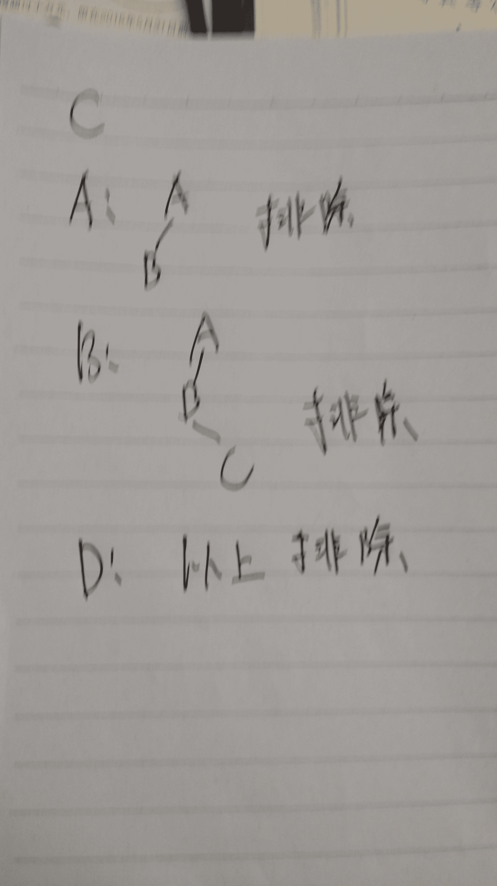
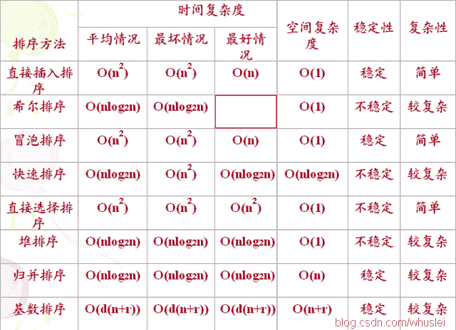

# 英特尔 2016 软件类研发在线测评

## 1

有定义语句：

```cpp
int b;
char c[10];
```

则正确的输入语句是 ______。

正确答案: A B   你的答案: 空 (错误)

```cpp
scanf("%d%s",&b,&c);
```

```cpp
scanf("%d%s",&b,c);
```

```cpp
scanf("%d%s",b,c);
```

```cpp
scanf("%d%s",b,&c);
```

本题知识点

C 语言

讨论

[wzqt](https://www.nowcoder.com/profile/506596)

A, B 均正确 首先这是 C 的一个误区 对于一个在栈上分配的数组，且在创建的代码块中进行访问的话 "c" 实际上有两种含义 : 1\. 一个指向十个 char 类型元素的数组 2\. 一个 char* 类型的指针 对于 1 而言 ，在同代码块中 sizeof(c) 输出 10，而不是 4 或者 8 那么何时会是 1 何时 会是 2 呢？ 实际上 2 是 1 的一种语法糖，是语言设计者为了方便而放下的一个空子，大家可以尝试一下二维数组，这个语法糖就不成立了，因为作者没有留下这种语法糖给程序员。 这就是所谓的上下文语义(编译器读的语义): scanf("%s", c); //这里 c 是一个 char* 类型的指针，编译器相信程序员将它指向了一块内存块 scanf("%s", &c); //这里 c 是一个指向十个 char 元素的数组的指针，这种才是最正统的用法

发表于 2015-11-05 18:09:41

* * *

[云台](https://www.nowcoder.com/profile/709885)

选 Bscanf 需要传入的是变量地址 int b 的地址是&bchar c[10]这是一个数组，变量名即为地址 c

发表于 2015-08-28 08:46:11

* * *

[will201806011326564](https://www.nowcoder.com/profile/5999635)

scanf 传入的是地址，printf 传入的是数值对于数组，变量名就是地址。c 是 c[0]的地址，&c 是整个 c[0]的首地址，二者虽然值相同但是所占内存空间不一样

编辑于 2018-09-14 15:08:04

* * *

## 2

在嵌套使用 if 语句时，C 语言规定 else 总是 ______。

正确答案: C   你的答案: 空 (错误)

```cpp
和之前与其具有相同缩进位置的 if 配对
```

```cpp
和之前与其最近的 if 配对
```

```cpp
和之前与其最近的且不带 else 的 if 配对
```

```cpp
和之前的第一个 if 配对
```

本题知识点

C++

讨论

[CrazyHSF](https://www.nowcoder.com/profile/122997)

举个例子:

```cpp
int test()
{
	int a,b,c;
	a=2;
	b=3;
	c=1;
	if(a>b)
	{
		if(a>c)
		{
			return a;
		}
	}
	else
	{
		if(b>c)
		{
			return b;
		}
	}
	return c;
}
```

这个使用{ }将 if else 单独的写开是这样的.然后把{ }去掉是这样的:

```cpp
int test()
{
	int a,b,c;
	a=2;
	b=3;
	c=1;
	if(a>b)
		if(a>c)
			return a;
		else
			if(b>c)
				return b;
	return c;
}
```

没有了{ }的约束他就是会自动匹配到前一个不完整的 if 上.选 c 比较合适.

发表于 2015-08-27 21:51:09

* * *

[啥](https://www.nowcoder.com/profile/811262)

怎么感觉是选 B 呢 C 的 else 难道不是说多个条件的 else if 么 if()...else if()...else

发表于 2015-09-02 16:19:34

* * *

[zt_xcyk](https://www.nowcoder.com/profile/839070)

C 就近配对原则

发表于 2015-08-29 10:11:51

* * *

## 3

以下程序的输出结果是 ______。

```cpp
#include <stdio.h>
int main()
{   
    int i,a[10];
    for(i=9;i>=0;i--)  a[i]=10-i;
    printf("%d%d%d",a[2],a[5],a[8]);
    return 0;
}
```

正确答案: C   你的答案: 空 (错误)

```cpp
258
```

```cpp
741
```

```cpp
852
```

```cpp
369
```

本题知识点

C++

讨论

[zt_xcyk](https://www.nowcoder.com/profile/839070)

C 不用看其他地方 就这里直接看答案嘛 a[i]=10-i; 带入 i 后 就是答案

发表于 2015-08-29 10:14:49

* * *

[姬长动](https://www.nowcoder.com/profile/607940)

c

发表于 2015-08-29 16:34:36

* * *

[夏雨天](https://www.nowcoder.com/profile/710633)

选择 C：a[]={10,9,8,7,6,5,4,3,2,1};852

发表于 2015-08-29 09:46:38

* * *

## 4

若要求在 if 后一对圆括号中表示 a 不等于 0 的关系，则能正确表示这一关系的表达式为 ______。

正确答案: D   你的答案: 空 (错误)

```cpp
a<>0
```

```cpp
!a
```

```cpp
a=0
```

```cpp
a
```

本题知识点

C++ C 语言

讨论

[zt_xcyk](https://www.nowcoder.com/profile/839070)

D if() 括号里面是 0 则为 FALSE 非 0 为 TRUE

发表于 2015-08-29 10:17:52

* * *

[恒生电子招聘](https://www.nowcoder.com/profile/538393370)

两种方式表达：a!=0 （1）if (a!=0); 常规的从正面理解，如果 a 不等于 0 为真成立
                                   (2)  if (a); 反向思维理解的，如果 a 为真成立，既 a!=0 成立

发表于 2019-04-20 19:09:01

* * *

[代码王子](https://www.nowcoder.com/profile/592556)

个人认为选 B 原因：bool 型变量，判断是否为 0 时用 if（！flag），！flag 为真则代表 flag=0；

发表于 2015-09-03 17:41:02

* * *

## 5

以下不能正确定义二维数组的选项是 ______。

正确答案: D   你的答案: 空 (错误)

```cpp
int a[2][2]={{1},{2}};
```

```cpp
int a[][2]={1,2,3,4};
```

```cpp
int a[2][2]={{1},2,3};
```

```cpp
int a[2][]={{1,2},{3,4}};
```

本题知识点

C++

讨论

[anicy](https://www.nowcoder.com/profile/487161)

定义二维数组，一定要确定列数

编辑于 2016-03-27 14:59:47

* * *

[代码王子](https://www.nowcoder.com/profile/592556)

对于二维数组，行数可以省略，但列数一定要指定，因为编译器根据列数来进行寻址

发表于 2015-09-03 17:42:08

* * *

[夏雨天](https://www.nowcoder.com/profile/710633)

选择 D：声明***数组只有最靠近数组名的那一维的大小可以省略。

发表于 2015-08-29 08:57:23

* * *

## 6

在 32 位系统环境，编译选项为 4 字节对齐，那么 sizeof(A)和 sizeof(B)是： 

```cpp
struct A
{
 int a;
 short b;
 int c;
 char d;
};
struct B
{
 int a;
 short b;
 char c;
 int d;
};
```

正确答案: C   你的答案: 空 (错误)

```cpp
16,16
```

```cpp
13,12
```

```cpp
16,12
```

```cpp
11,16
```

本题知识点

C++

讨论

[yahito](https://www.nowcoder.com/profile/470982)

// 对齐原则：每一成员需对  查看全部)

编辑于 2016-08-18 08:58:07

* * *

[夏雨天](https://www.nowcoder.com/profile/710633)

选择 C：这类题目考察的是内存对齐：结构体(struct)(或联合体(union))的数据成员，每个数据成员的对齐按照编译选项指定的数据成员自身长度中，最长的那个。A：4（int）+4（short 不够 4，补 2）+4(int)+4(char 不够 4，补 3) = 16B：4（int）+4(char 为 1，short 为 2 ，补 1)+4（int） = 12

编辑于 2015-09-03 15:14:59

* * *

[DOREEN](https://www.nowcoder.com/profile/999287)

内存对齐原则：
一、结构体变量的首地址能够被其最宽基本类型成员大小与对齐基数中的较小者所整除；
二、结构体每个成员相对于结构体首地址的偏移量(offset)都是该成员大小与对齐基数中的较小者的整数倍，如有需要编译器会在成员之间加上填充字节(internal adding)； 

三、结构体的总大小为结构体最宽基本类型成员大小与对齐基数中的较小者的整数倍，如有需要编译器会在最末一个成员之后加上填充字节(trailing padding)。

发表于 2015-08-30 09:51:07

* * *

## 7

下面程序的输出是什么？

```cpp
#include<stdio.h>
#include<string.h>
#include <pthread.h>

void* print1(void* data){
    printf("1 ");
}

void* print2(void* data){
    printf("2 ");
}

void* print3(void* data){
    printf("3 ");
}

int main(void){
    pthread_t t,t1,t2;

    pthread_create(&t,0,print1,NULL);
    pthread_create(&t1,0,print2,NULL);
    pthread_create(&t2,0,print3,NULL);

    pthread_join(t,NULL);
    pthread_join(t1,NULL);
    pthread_join(t2,NULL);
    printf("\n");
}
```

正确答案: D   你的答案: 空 (错误)

```cpp
1 2 3
```

```cpp
1 3 2
```

```cpp
3 2 1
```

```cpp
不确定
```

本题知识点

C++

讨论

[Myworld](https://www.nowcoder.com/profile/853456)

pthread_join(t,NULL)意思是等待线程 t 执行结束了再执行下面的代码。但在这之前，3 个线程都已提交，它们可能都已经顺序随机地执行了，也可能没有，所以结果也是不可预测的。不懂 Linux 下的 C 的线程，不过 Java 中的 thread.join 也是这个意思。

发表于 2015-08-27 16:32:58

* * *

[指上弹兵赵小括](https://www.nowcoder.com/profile/940062)

```cpp
pthread_create(&t, 0, print1, NULL);
pthread_join(t, NULL);
pthread_create(&t1, 0, print2, NULL);
pthread_join(t1, NULL);
pthread_create(&t2, 0, print3, NULL);
pthread_join(t2, NULL);
这样才是按顺序的。
```

发表于 2015-09-02 14:07:01

* * *

[石头 jjj](https://www.nowcoder.com/profile/186034)

要使 join 函数生效，必须在线程启动前设置才行。

发表于 2015-08-28 19:33:54

* * *

## 8

下列代码试图打印数字 1-9 的全排列组合。

```cpp
#include "stdio.h"
#define N 9
int x[N];
int count = 0;

void dump() {
  int i = 0;
  for (i = 0; i < N; i++) {
    printf("%d", x[i]);
  }
  printf("\n");
}

void swap(int a, int b) {
  int t = x[a];
  x[a] = x[b];
  x[b] = t;
}

void run(int n) {
  int i;
  if (N - 1 == n) {
    dump();
    count ++;
    return;
  }
  for (i = ___; i < N; i++) {
    swap(___, i);
    run(n + 1);
    swap(___, i);
  }
}

int main() {
  int i;
  for (i = 0; i < N; i++) {
    x[i] = i + 1;
  }
  run(0);
  printf("* Total: %d\n", count);
}
```

其中 run 函数中缺失的部分应该依次为：

正确答案: C   你的答案: 空 (错误)

```cpp
n+1, n, n+1
```

```cpp
n+1, n, n
```

```cpp
n, n, n
```

```cpp
n, n+1, n+1
```

```cpp
n+1, n+1, n+1
```

```cpp
n, n, n+1
```

本题知识点

C 语言

讨论

[zcj5918](https://www.nowcoder.com/profile/590442)

这是一道分治算法题。这种循环

  查看全部)

编辑于 2016-03-24 15:24:05

* * *

[cd 小鬼哥](https://www.nowcoder.com/profile/722093)

先看代码 for(i = ___; i < N; i++) {    swap(___, i);    run(n + 1);    swap(___, i);  }为了防止内存溢出，我直接排除法选择了 c。只是个做题技巧，程序没多看

发表于 2015-08-27 16:38:06

* * *

[guanjian](https://www.nowcoder.com/profile/564796)

voidrun(intn) {//处理[n,N-1]的元素排列  inti;  if(N - 1 == n) {    打印结果;    return;  }  for(i = n; i < N; i++) {    swap(n, i);// 从第 n 个元素依次和后面的元素进行交换.，i=n,表示不交换，原序打印    run(n + 1);//处理[n+1,N-1]的元素排列    swap(n, i);//交换回原样，以便再递归处理后面的元素  }}

发表于 2015-09-12 14:50:29

* * *

## 9

判断有向图是否存在回路，利用( )方法最佳 。

正确答案: A   你的答案: 空 (错误)

```cpp
拓扑排序
```

```cpp
求最短路径
```

```cpp
求关键路径
```

```cpp
广度优先遍历
```

本题知识点

图

讨论

[牛客 er](https://www.nowcoder.com/profile/758147)

1.拓扑排序: 还有顶点未输出,但已经不存在没有前驱的顶点了。2.深度优先:从一个顶点出发存在搜回到自己的路径。

发表于 2015-08-27 14:48:16

* * *

[monkee](https://www.nowcoder.com/profile/443818)

A

> 拓扑排序，是对有向无回路图进行排序，以期找到一个线性序列，这个线性序列在生活正可以表示某些事情完成的相应顺序。如果说所求的图有回路的话，则不可能找到这个序列。

发表于 2015-09-01 20:07:53

* * *

[EricZeng](https://www.nowcoder.com/profile/827560)

**不存在环路则可以输出拓扑序列，存在环路则无拓扑序列。**

发表于 2016-08-21 21:43:44

* * *

## 10

初始序列为 1 8 6 2 5 4 7 3 的一组数采用堆排序，当建堆(小根堆)完毕时，堆所对应的二叉树中序遍历序列为：( )

正确答案: A   你的答案: 空 (错误)

```cpp
8 3 2 5 1 6 4 7
```

```cpp
3 2 8 5 1 4 6 7
```

```cpp
3 8 2 5 1 6 7 4
```

```cpp
8 2 3 5 1 4 7 6
```

本题知识点

树

讨论

[陋室](https://www.nowcoder.com/profile/716156)

很简单的堆排序，过程如下图

具体过程看一下这个：[`blog.csdn.net/morewindows/article/details/6709644/`](http://blog.csdn.net/morewindows/article/details/6709644/)
自己编程推一下，以后就没问题了

发表于 2015-08-28 10:01:45

* * *

[MohnSnow](https://www.nowcoder.com/profile/905867)

考察点：堆排序的建堆以及调整堆的操作 1.堆在内存中的表现形式是以数组的形式存储 2.堆是一个完全二叉树建堆：建堆的过程就是一个反复筛选的过程 1.每次都插到数组的末端，形成一个完全二叉树；2.从最后一个非终端节点开始，直到第一个节点为止（只和子节点比较）；删除堆：1.每次都是删除第一个；2.然后最后一个数字补进来；3.然后调整堆调整堆：1.每次都是与最小的儿子进行交换；2.每次都是从倒数第一个非终端节点开始调整；

编辑于 2015-08-31 09:14:09

* * *

[披萨大叔](https://www.nowcoder.com/profile/841505)


发表于 2016-07-05 20:56:29

* * *

## 11

在一个以 h 为头指针的单循环链中，p 指针指向链尾结点的条件是( )。

正确答案: B   你的答案: 空 (错误)

```cpp
p->next==NULL
```

```cpp
p->next==h
```

```cpp
p->next->next==h
```

```cpp
p->data==-1
```

本题知识点

链表 *C++工程师 牛客* *讨论

[世纪精灵](https://www.nowcoder.com/profile/7945372)

p 指针指向的节点就是 p 节点

发表于 2018-03-25 14:36:55

* * *

[小范](https://www.nowcoder.com/profile/791584)

选择 B，单循环链表，p 指针指向链尾结点，则 p->next 为头指针 h 

编辑于 2015-08-30 21:06:53

* * *

[不做人了](https://www.nowcoder.com/profile/250145)

尾节点 为空 但是尾节点的 next 等于头结点

发表于 2020-07-14 11:36:26

* * *

## 12

请阅读该程序：

```cpp
PROCEDURE bubblesort(r,n)
BEGIN
  i:=1; m:=n-1; flag:=1;
  WHILE (i<=m) AND (flag=1) DO
   BEGIN
     flag:=0;
     FOR j:=1 TO m DO
       IF r[j].key>r[j+1].key THEN
       BEGIN
         flag:=1; t:=r[j]; r[j]:=r[j+1]; r[j+1]:=t
       END;
       i:=i+1;m:=m-1
   END;
END.
```

该分类算法稳定吗？(  )

正确答案: A   你的答案: 空 (错误)

```cpp
稳定
```

```cpp
不稳定
```

```cpp
不确定
```

本题知识点

复杂度

讨论

[zzkgo](https://www.nowcoder.com/profile/838326)

其实我看了比较多的算法排序，  查看全部)

编辑于 2016-03-05 16:37:15

* * *

[Anonymous101](https://www.nowcoder.com/profile/447785)

这个是添加了一个交换与否标志的冒泡排序算法，冒泡排序本来就是稳定的，添加交换标志只是能够在已经有序时提前退出排序过程，所以还是稳定的。

发表于 2015-08-28 17:18:29

* * *

[指上弹兵赵小括](https://www.nowcoder.com/profile/940062)

可以直接想一下相邻两个相等的数根据上面的 r[j].key>r[j+1].key 条件，是不是会交换，就可以判断出来是不是稳定的了。

发表于 2015-09-02 13:58:19

* * *

## 13

n 从 1 开始，每个操作可以选择对 n 加 1 或者对 n 加倍。若想获得整数 2013，最少需要多少个操作：( )

正确答案: A   你的答案: 空 (错误)

```cpp
18
```

```cpp
24
```

```cpp
21
```

```cpp
不可能
```

本题知识点

智力题

讨论

[風待-睡郷鈴慕](https://www.nowcoder.com/profile/423321)

最好用位运算的方法
乘 2 代表左移一位，加 1 是最低位加 1，例如：
从 1 到 5 可以先将 5 转化为二进制 101,1 可以通过以下几个步骤到 101：
1→10→100→101
即变化 3 次可以从 1 到 5，观察规律，5 的二进制表示中除最高位时每个 1 次数加 2，每个 0 次数加 1
2013 可以表示为 11111011101，总共有 8 个 1 和 2 个 0
所以需要 8*2+2 次，即为 18 次

发表于 2015-08-27 15:34:23

* * *

[corny813](https://www.nowcoder.com/profile/242131)

A 是对的。逆向推导： 由 2013-1=2012，2012/2=1006（由于只允许+1 和乘 2 的操作，逆向即为-1 和除以 2）1006/2=503 ，503-1=502 ……一直下去，遇到偶数除以 2，遇到奇数-1 最后得到结果操作序列为：1*2=2，2+1=3  （以下只用结果数表示）2，3，6，7，14，15，30，31，62，124，125，250，251，502，503，1006，2012，2013

发表于 2015-08-26 22:04:40

* * *

[牛客 837763 号](https://www.nowcoder.com/profile/837763)

[風待-睡郷鈴慕](http://www.nowcoder.com/profile/423321)提示用位移算法，思路非常好，解释稍微不太详细，我补充下：把 n 表示成二进制数时，首位的 1 当做是数字初始值 1；例如 10，是有 1 左移 1 位，需要一次操作；11 是由 1 左移一位，然后加 1，需要两次操作。因此，二进制 n 中，除首位以外，“1”需要两次操作，“0”需要一次操作。若 n 由 a 为 1,b 位 0，则需要操作数为（a-1）*2+b;

发表于 2015-08-28 19:33:50

* * *

## 14

2¹⁰⁰ mod 7 =____

正确答案: A   你的答案: 空 (错误)

```cpp
2
```

```cpp
3
```

```cpp
4
```

```cpp
5
```

本题知识点

智力题

讨论

[lizo](https://www.nowcoder.com/profile/248554)

2¹⁰⁰ = (2³)³³ * 2 = 8³³ * 2   因为乘积的模等于模的乘积   8 % 7 = 1   所以 （8³³ * 2）    %  7  =   （8 % 7 ) ³³ * ( 2 % 7)  =  2   

发表于 2015-08-27 17:30:21

* * *

[陋室](https://www.nowcoder.com/profile/716156)

说个土办法，仅供参考：
这种题（计算量要求非常大）一定有一个内在的规律的，关键就是找到这个规律利用就好了，本人愚钝，一般原理看不出来（时间可能也来不及看），但一般能做出来。
只要按要求写一下就能找到规律了。
例如：
系数      2 的次方     %7 余数
0           1                1
1           2                2
2           4                4
3           8                1
4           16              2
5           32              4
。。。
也就是说大概 3 个一组循环，所以结果为（1+100）%3 = 2，对应每组的第二个，所以结果是 2。
以上做题技巧，不是原理，谢谢大家参考。

发表于 2015-08-28 10:12:34

* * *

[corny813](https://www.nowcoder.com/profile/242131)

A 不难看出 2 的次方模 7 的余数只有 1，2，4 三个并且一直循环。而且遇到指数为 3 的倍数时余数回到 1。所以，2¹⁰⁰mod7=2

发表于 2015-08-26 22:13:21

* * *

## 15

若一棵具有 n(n>0)个结点的二叉树的先序序列与后序序列正好相反，则该二叉树一定？

正确答案: C   你的答案: 空 (错误)

```cpp
结点均无左孩子的二叉树
```

```cpp
结点均无右孩子的二叉树
```

```cpp
高度为 n 的二叉树
```

```cpp
存在度为 2 的结点的二叉树
```

本题知识点

树

讨论

[陋室](https://www.nowcoder.com/profile/716156)

原理如下：
先序遍历顺序是：M-L-R;
后序遍历顺序是：L-R-M;
可以看到，只有中间的结点（M）顺序变化了，左右结点相对位置是不变的。那可以推断出，要满足题意的话“二叉树的先序序列与后序序列正好相反”，说明整个二叉树左子树或者右子树有一个没有（遍历就成了，先：M-L ；后：L-M 或者  先：M-R ；后：R-M ）也就是必然是一条链。

编辑于 2015-08-29 11:30:04

* * *

[Geniuspyh](https://www.nowcoder.com/profile/568391336)

首先 AB 选项都是符合题意的，但不一定就是 A 或 B，先序序列和后序序列正好相反，则说明他一定是单支树，已知一共有 n 个节点，且所以 C 选项说其高度为 n，则 C 描述的就是单支树，故选 C

发表于 2020-03-08 22:47:05

* * *

[讨鬼](https://www.nowcoder.com/profile/761977)



发表于 2015-08-27 08:35:42

* * *

## 16

以下排序算法中是稳定的且时间复杂度最小的是：

正确答案: C   你的答案: 空 (错误)

```cpp
bubble sort
```

```cpp
heap sort
```

```cpp
merge sort
```

```cpp
quick sort
```

```cpp
shell sort
```

本题知识点

排序 *讨论

[牛客 er](https://www.nowcoder.com/profile/758147)



发表于 2015-08-27 15:35:03

* * *

[邓胜涛 1](https://www.nowcoder.com/profile/4657059)

快些选队 快速排序，希尔排序，选择排序，堆排序都不稳定 归并才稳定

发表于 2018-12-25 23:06:48

* * *

[木三](https://www.nowcoder.com/profile/488933)

A 冒泡 稳定复杂度高为 O(n^n)B 堆排序 不稳定复杂度低 O(lgn)C 归并排序  稳定复杂度低 O(lgn)D 快排   不稳定复杂度低 O(lgn)E 希尔排序 不稳定复杂度依据步长

发表于 2015-08-27 15:26:11

* * *

## 17

交换机工作在 OSI 七层的哪一层？（ ）

正确答案: B   你的答案: 空 (错误)

```cpp
一层
```

```cpp
二层
```

```cpp
三层
```

```cpp
三层以上
```

本题知识点

网络基础 Java 工程师 C++工程师 PHP 工程师 golang 工程师 前端工程师 安卓工程师 iOS 工程师 算法工程师 大数据开发工程师 运维工程师 安全工程师 数据库工程师 游戏研发工程师 测试开发工程师 测试工程师 2021 远景能源有限公司

讨论

[lock-free](https://www.nowcoder.com/profile/113156)

物理层：中继器，集线器，双绞线数据链路层：网桥，以太网交换机，网卡（一半物理层，一半数据链路层）网络层：路由器，三层交换机传输层：四层交换机（常用作负载均衡），网关：对高层协议（包括传输层及更高层次）进行转换的网间连接器参考：http://www.yacer.cn/jishu/doc-147.html

编辑于 2015-10-05 13:59:14

* * *

[夏雨天](https://www.nowcoder.com/profile/710633)

选择 B：各网络设备工作的层：网络设备有中继器、网桥、路由器和网关等。中继器（Repeater)  中继器是局域网互连的最简单设备，它工作在 OSI 体系结构的物理层，它接收并识别网络信号，然后再生信号并将其发送到网络的其他分支上。网桥（Birdge)  网桥工作于 OSI 体系的数据链路层。所以 OSI 模型数据链路层以上各层的信息对网桥来说是毫无作用的。路由器（Router)  路由器工作在 OSI 体系结构中的网络层，这意味着它可以在多个网络上交换和路由数据数据包。桥由器（Brouter)  Brouter 是网桥和路由器的合并。网关（Gatway)  网关把信息重新包装的目的是适应目标环境的要求。 网关能互连异类的网络，  网关从一个环境中读取数据，剥去数据的老协议，然后用目标网络的协议进行重新包装。 网关的典型应用是网络专用服务器。交换机（switch） 2 层和 3 层都有，但多为链路层设备（二层交换机），采用存储转发的形式来交换报文。

发表于 2015-08-29 09:44:07

* * *

[chenchenchen](https://www.nowcoder.com/profile/894679)

B,交换机多为链路层设备（二层交换机），采用存储转发的形式来交换报文。

发表于 2015-08-28 10:56:52

* * *

## 18

各个路由协议衡量路由的好坏标准是（ ）。

正确答案: C   你的答案: 空 (错误)

```cpp
路由
```

```cpp
路由器优先级
```

```cpp
路由权
```

```cpp
包转发率
```

本题知识点

网络基础

讨论

[guanjian](https://www.nowcoder.com/profile/564796)

路由权：用于选择最佳路由的信息。

路由算法修改路由表的基本目的是将最好路由信息添加到路由表中，路由的好坏是由路由算法根据自己获得的路由信息计算出来的。对于每一条路由，路由算法产生一种权值来表示路由的好坏。通常情况下，这种权值越小，该路径越好。

路由权的计算可能基于路径某单一特性计算，也可能基于路径多种属性进行计算。有几种路径特性经常被用于权值计算，如下：

1) 带宽 -- 链路的数据容量。例如，通常情况下 10M 以太网链路比 64K 出租线路要更好。

2) 时延 -- 报文从到达目标网络所需要的时间。

3) 负载 -- 处于活跃状态的网络资源数量。

4) 可靠性 -- 每条数据链路的出错率。

5) 跳数 -- 报文到目的地需要经过的网络数。

6) 开销 -- 一种人为设定的值，通常由网络管理员根据带宽、线路价格或其他一些因素综合得出。

发表于 2015-09-12 15:03:50

* * *

[指上弹兵赵小括](https://www.nowcoder.com/profile/940062)

各个路由协议衡量路由的好坏！而不是衡量路由协议的好坏，看错题，很心痛。

发表于 2015-09-02 13:43:47

* * *

[牛客 er](https://www.nowcoder.com/profile/758147)

路由权：用于选择最佳路由的信息。

发表于 2015-08-27 15:06:56

* * *

## 19

不属于冯诺依曼体系结构必要组成部分是：( )

正确答案: B   你的答案: 空 (错误)

```cpp
CPU
```

```cpp
Cache
```

```cpp
RAM
```

```cpp
键盘
```

本题知识点

编译和体系结构

讨论

[Radar](https://www.nowcoder.com/profile/312842)

```cpp
冯.诺依曼理论体系下的计算机五大逻辑部件分别是: 控制器、运算器、存储器、输入/输出设备
```

发表于 2015-08-27 11:02:28

* * *

[玄学求 offer~](https://www.nowcoder.com/profile/259973278)

键盘是冯诺依曼体系结构必要组成部分？

发表于 2019-03-10 21:46:25

* * *

[拉风小伙](https://www.nowcoder.com/profile/407743)

冯·诺依曼结构处理器具有以下几个特点： 　必须有一个存储器； 　必须有一个控制器； 　必须有一个运算器，用于完成算术运算和逻辑运算； 　必须有输入和输出设备，用于进行人机通信。 arm7 系列的 CPU 有很多款，其中部分 CPU 没有内部***的，比如 arm7TDMI，就是纯粹的冯·诺依曼结构，其他有内部***且数据和指令的***分离的 cpu 则使用了哈弗结构。

发表于 2015-08-28 07:32:44

* * *

## 20

有一台 4 核 CPU 的服务器，上面运行着 1 种在线服务。如果该在线服务处理一个请求在非独占 IO 上的等待时间和 CPU 计算上消耗的时间比为 2:1，假定 IO 带宽充足，那么至少开（）个线程能最大化性能地使用该服务器？

正确答案: C   你的答案: 空 (错误)

```cpp
4
```

```cpp
8
```

```cpp
12
```

```cpp
线程越多越好
```

本题知识点

编译和体系结构

讨论

[牛客 er](https://www.nowcoder.com/profile/758147)

IO 带宽充足,一个核的话，由于 IO 与 CPU 消耗的时间比为 2:1，因此可以开三个进程，其中一个进程占 IO，另外两个进程占 CPU，刚好达到最大化性能。 4 核的话就开 12 个线程！

编辑于 2015-08-29 15:56:46

* * *

[littlefuture](https://www.nowcoder.com/profile/197827)

**这个答案：**IO 带宽充足,一个核的话，由于 IO 与 CPU 消耗的时间比为 2:1，因此可以开三个进程，其中一个进程占 IO，另外两个进程占 CPU，刚好达到 最大化性能。   4 核的话就开 12 个线程！**和这个答案：**题目中说了 io 是非独占的，所以应该是 2 个线程处理 io，1 个线程使用 cpu 计算，这样 3 个线程可以在一单位时间内完成原来 1 个线程在 3 个时间内的一个请求。4*3=12.大家没发现什么问题么？？一个说两个占用 cpu，一个说一个占用 cpu

编辑于 2015-09-22 14:15:38

* * *

[shenyu](https://www.nowcoder.com/profile/989768)

  题目中说了 io 是非独占的，所以应该是 2 个线程处理 io，1 个线程使用 cpu 计算，这样 3 个线程可以在一单位时间内完成原来 1 个线程在 3 个时间内的一个请求。4*3=12.

编辑于 2015-09-03 17:50:13

* * ***