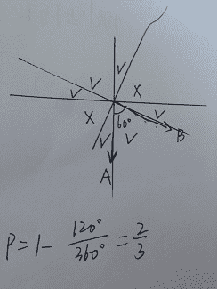

# 阿里巴巴 2016 研发工程师笔试题（四）

## 1

以下程序输出结果是 ____

```cpp
#include <iostream>
using namespace std;

class A{
  public:
    A ():m_iVal(0){test();}
    virtual void func() { std::cout<<m_iVal<<' ';}
    void test(){func();}
  public:
      int m_iVal;
};
class B : public A{
  public:
    B(){test();}
    virtual void func(){
      ++m_iVal;
      std::cout << m_iVal << ' ';
      }
};
int main(int argc ,char* argv[]){
  A*p = new B;
  p->test();
  return 0;
}
```

正确答案: C   你的答案: 空 (错误)

```cpp
1 0
```

```cpp
0 1
```

```cpp
0 1 2
```

```cpp
2 1 0
```

```cpp
不可预期
```

```cpp
以上都不对
```

本题知识点

C++ C 语言

讨论

[左小右](https://www.nowcoder.com/profile/625489)

本问题涉及到两个方面：  查看全部)

编辑于 2015-12-11 11:21:00

* * *

[lingexe](https://www.nowcoder.com/profile/932498)

B 继承自 A, 先 A 构造函数，输出 0 ，然后 B 构造函数， B 的 test 继承自 A ，然后找 func 函数找到 B 自己的，所以输出 1 ，然后 p->test() 再执行一次，输出 2

发表于 2015-08-30 20:50:22

* * *

[tuuzhang](https://www.nowcoder.com/profile/940752)

在《C++ Primer》556 页中讨论了构造函数和析构函数中调用虚函数的效应，得出的结果是：在构造或析构函数中调用虚函数会执行与之所属类型相对应的虚函数版本。

发表于 2015-09-18 20:20:54

* * *

## 2

2015 年年初，某公司部门举行年会，期间有个游戏，规则是通过猜拳的方法决出每一局的胜负(一人赢其他所有人才算赢得本局，出现平局就继续猜拳)，如果谁先赢满 7 局，则获胜，并赢得全部奖金。现在有 3 名员工甲、乙、丙参与了这个游戏，游戏进行了一会，分数为甲 6，乙 5，丙 4，但时间已晚，大家要吃饭了。最公平的奖金分配方案是 ____。

正确答案: D   你的答案: 空 (错误)

```cpp
甲得到 19/27,乙得到 7/27,丙得到 1/27
```

```cpp
甲得到 18/27,乙得到 8/27,丙得到 1/27
```

```cpp
甲得到 17/27,乙得到 1/3,丙得到 1/27
```

```cpp
甲得到 19/27,乙得到 6/27,丙得到 2/27
```

```cpp
甲得到 18/27,乙得到 7/27,丙得到 2/27
```

```cpp
甲得到 17/27,乙得到 8/27,丙得到 2/27
```

本题知识点

数学运算

讨论

[marsforwill](https://www.nowcoder.com/profile/284235)

简单枚举答案结果的话，接下来比赛赢的序列中，乙赢的可能有{乙乙，丙乙乙，乙丙乙，乙丙丙乙，丙乙丙乙，丙丙乙乙}=1/9+1/27*2+1/81*3=6/27,丙赢的可能有{丙丙丙，乙丙丙丙，丙乙丙丙，丙丙乙丙}=1/27+1/81*3=2/27，甲的概率也就是 19/27 了；正常标准的计算步骤差不多也就是枚举某人赢的可能的场次，遇到比较大的数字时用组合数的公式去算

发表于 2015-08-30 20:42:59

* * *

[guanjian](https://www.nowcoder.com/profile/564796)

简化一下问题:甲、乙、丙 3 人参与游戏，每轮每人获胜概率为 1/3, 甲只要累计赢得 1 次就结束游戏，乙 只要累计赢得 2 次就结束游戏， 丙 只要累计赢得 3 次就结束游戏，求 甲、乙、丙各自的获胜概率。回答:甲 赢 ： 需要 1 轮才能结束游戏: 甲；          需要 2 轮才能结束游戏 （ 丙 1 次，否则 乙 1 次 ） : 乙 甲、 丙 甲；          需要 3 轮才能结束游戏（ 丙 1 次且 乙 1 次 ）: 丙 乙 甲、 乙 丙 甲；          需要 4 轮才能结束游戏（ 丙 2 次 且 乙 1 次 ）:乙 赢 ：6/27          需要 2 轮才能结束游戏 : 1/3* 1/3          需要 3 轮才能结束游戏（ 丙在前两轮任意赢得 1 次, 乙 1 次 ）:2* 1/3* 1/3 * 1/3          需要 4 轮才能结束游戏（ 丙在前三轮任意赢 2 次， 乙 1 次 ）: 3* 1/3* 1/3 * 1/3 * 1/3 丙 赢 ：2/27          需要 3 轮才能结束游戏 : 1/3* 1/3* 1/3          需要 4 轮才能结束游戏（ 丙在前三轮任意赢 2 次， 乙 1 次 ）:3*1/3* 1/3* 1/3 * 1/3

发表于 2015-09-01 11:29:39

* * *

[森森特](https://www.nowcoder.com/profile/126234)

这道题要想后面要再比赛多少局，枚举所用的 4 局是由当所有人都只需一局获胜时的最极端情况而来的。以甲为例子：一局： 甲    概率 1/3 两局： X 甲  概率 2/9    X 不包括甲三局： XX 甲 - 乙乙甲 概率  2/3 X 2/3 X 1/3 - 1/27 = 3/27  X 不包括甲四局 ： 一乙两丙（组合有 3 种） + 甲 概率  3 X 1/27 X 1/3 = 1/27 总共 = 19/27 同理 乙：两局 ： 乙乙    1/9 三局 ： 丙乙乙、 乙丙乙  2/27 四局 ： 一乙两丙 + 乙  3 X 1/27 X 1/3 = 1/27 总共 = 6/27 同理 丙 ：三局 ：丙丙丙 1/27 四局 ：一乙两丙 + 丙   = 1/27 总共 = 2/27

发表于 2015-09-02 16:44:36

* * *

## 3

四维空间中有两个夹角 60 度的向量 A 和 B，随机生成一个向量 C 分别与 A 和 B 计算内积，那么两个内积符号相同的概率为 ____。

正确答案: D   你的答案: 空 (错误)

```cpp
1/4
```

```cpp
1/3
```

```cpp
1/2
```

```cpp
2/3
```

```cpp
3/4
```

```cpp
以上都不对
```

本题知识点

概率统计 *概率论与数理统计* *讨论

[牛客 113771 号](https://www.nowcoder.com/profile/113771)

向量 C 在 √ 区域的表示可以， 在 × 表示不可以。四维空间投影再投影，就是二维空间啊

发表于 2016-02-17 12:11:34

* * *

[guanjian](https://www.nowcoder.com/profile/564796)

解析：内积 A · B=|A| · |B| · cos<A,B> ， 内积的正负由 A,B 夹角余弦决定，夹角的取值范围为[0， Π]

设 A 向量方向为 X 轴正方向，B 向量为 60 度(当然也可能为 120 度，只考虑第 1 和第 2 象限，其他象限概率相同，特值为 60 度是合理的)则 C 与 A 的夹角为 [ 0, Π /2 ]为正 ，[ Π /2， Π ]； 则 C 与 B 的夹角为 [  Π /3 , Π /2+ Π /3 ]为正 ，[ Π /2+ Π /3 ， Π ]为负因此:    2 Π / 3  /    Π   =2/3

发表于 2015-09-01 11:50:07

* * *

[codermanFans](https://www.nowcoder.com/profile/971995)

首先我们假设 A，B 在平面上，A 在 X 轴上，B 在第一象限与 A 成 60 度角，分别，做 A，B 的垂线，此时，A 的垂线就是 y 轴，而 B 的垂线在第二象限与 y 轴正方向成 60 度角，此时这两条垂线的比较小的角就是内积符合不同的区域，是 120 度，而整个平面是 360 度，所以符号为正的情况下的概率为 2/3,而题目中说的四维空间应该是唬人的，假如放到三维空间的话，平面假设依然成立，因为三维空间也是由平面构成的，即使对空间进行体积积分的话也不会影响概率的结果,然而，我做错了，并没有什么卵用。

编辑于 2015-09-04 15:35:17

* * *

## 4

假设淘宝用户上的用户看到一个商品后购买的概率是 5%，收藏的概率是 20%，而用户收藏一个商品之后购买的概率是 20%，那么已知某用户看到某商品之后完成了购买，那么该用户收藏过该商品的概率是 ____。

正确答案: E   你的答案: 空 (错误)

```cpp
40%
```

```cpp
50%
```

```cpp
60%
```

```cpp
70%
```

```cpp
80%
```

```cpp
90%
```

本题知识点

概率统计 *概率论与数理统计* *讨论

[明天的故事](https://www.nowcoder.com/profile/584567)

设 A 为买，B 为收藏。 已知 P(A)=5%, P(B)=20%, P(A|B) = 20%。所以 P（B|A）=P(AB)/P(A) = P(A|B)P(B)/P(A) = 80%.

发表于 2015-08-30 20:09:13

* * *

[yql](https://www.nowcoder.com/profile/566442)

1、购买概率=5%。   2、购买有两种情况，收藏购买，不收藏购买 。3、收藏购买概率=0.2*0.2=0.04，那么不收藏购买的概论是 0.014、在已知用户购买的情况下：收藏的概率是 0.04/（0.01+0.04）=80%

编辑于 2015-09-09 21:59:56

* * *

[鹤嘴锄](https://www.nowcoder.com/profile/516622)

题目有一定的歧义，“淘宝用户上的用户看到一个商品后购买的概率是 5%，收藏的概率是 20%”前半句的意思，看到直接买的 概率是 5% ，还是说直接买和收藏后再买的总概率是 5%？

发表于 2015-08-30 22:13:41

* * *

## 5

以下函数中，和其他函数不属于一类的是 _____。

正确答案: D   你的答案: 空 (错误)

```cpp
fread
```

```cpp
gets
```

```cpp
getchar
```

```cpp
pread
```

```cpp
getline
```

```cpp
scanf
```

本题知识点

C 语言

讨论

[包子·陳 V](https://www.nowcoder.com/profile/8683893)

在 Linux 和 UNIX 中有很多的输入输出函数，有时真是让想跟它攀点关系的菜鸟们束手无策。先来看看都有哪些函数，通过解析与总结，看看能不能让大家能这些函数有个理性的认识。内核文件 I/O－＞标准库 I/O－＞高级 I/O－＞IPC 中 1\. read()/write();2\. pread()/pwrite();3\. getc()/putc();4\. fgetc()/fputc();5\. getchar()/putchar();6\. ferror()/feof();7\. fgets()/fputs();8\. gets()/puts();9\. fread()/fwrite();10\. scanf()/fscanf()/sscanf()/vscanf()/vfscanf()/vsscanf()11. printf()/fprintf()/sprintf()/snprintf()/vprintf()/vfprintf()/vsprintf()/vsanprintf()12\. readv()/writev()13\. read()/written()14\. msgrcv()/msgsnd()15\. revc()/recvfrom()/recvmsg()16\. send()/sendto()/sendmsg()17\. recv_fd()/send_fd()/send_err()粗略总结了下，有如上边所示的 17 个大类，咋一看，的确让人头有点小晕。但是大师们都说存在的就是合理的，下边让我们看看，是怎么样的深入浅出，让这些函数有了存在的理由。要理解这些，先要知道系统在输入输出时所要经过的逻辑处理模块是怎样。如下图示以上的用户空间的应用程序利用系统调用完成文件的读写过程，说明如下：（1） 用户空间与内核空间；这一组关系不用说明了。（2） 读与写：都将 cpu 或是内存或是用户程序看成主体，则读，内存＜－文件；写，内存－＞文件；因为主体是用户程序，所以在读或是写是，对读，要确定从什么读，对写，向什么写。（3） 应用程序利用系统服务有三条路：通过 shell 命令等直接实现；利用库函数实现；直接调用系统调用的函数，如 read,write 等命令。在这里可以将库函数与系统调用的关系看清楚了。系统调用是最基本的了，任何想要获得系统服务的都要经过它，这是个关卡。（4）  文件 I/O 与标准 I/O：前者是指在用户空间中不需要其实进程明确提供一个缓冲（如图中的 bf2），其实就是进程在用户空间直接调用 read/write 等函数，但是，在内核空间中都是要有缓冲的。这一般称为文件 I/O。标准 I/O：提供了一种对不用缓冲 I/O 的函数（这些函数即可以用于不用缓冲的 I/O 函数，也可以有于带有缓冲的 I/O 函数）的带缓冲的接口。这一般是库函数在用户空间建立的（这些缓冲由库函数完成，不需用户自己管理，是封装在库函数中的），如 BUF2，可能是库函数想将对从上层接收过来的数据做个预处理，如格式变换等。使用标准 I/O 函数可以无需担心如何选取最佳的缓冲区大小（由库函数为你完成），还有一个是简化了对输入行的处理。标准 I/O 函数库提供了使我们能够控制该库使用的缓冲风格的函数。（5） BUF1/BUF2/BUF3：BUF1，其实是用户空间的一些字符串，变量等，理解为数据即可。有时也定义为名称 BUF 的形式，如 char buf[MAXLINE]；，但此时 BUF 只是名称叫 BUF 而矣，区别于真正的缓冲区的概念。BUF2，这是库函数为您老在用户空间建立的，不用您亲自管理，您只要一声令下，如调用个库函数中某个函数，自有人为你服务，这个 BUF2，我们称之为真正的缓冲区。BUF3，不论您是选择文件 I/O 的形式还是标准 I/O 的形式，不论是哪一种，在内核中的都要用到缓冲区 BUF3（这是怎么样都免不了的），但是这个也不要用户来亲力亲为，由内核代为管理。（6） 流（stream）：这是标准为 I/O 中用到的，流是文件的逻辑代表，将文件 I/O 的：进程－＞fd－＞文件，改变为：进程－＞fp（FILE 对象）－＞流/缓冲－＞文件。原来对文件的操作，现在用户只用处理：进程－＞流之间的操作，而流－＞文件之间的操作将由库函数为你完成。流的逻辑表示就是 FILE 对象，而流的实体就是流使用的缓冲区，这些缓冲区相对于应用进程来说就是文件的代表。流＝FILE　+　缓冲。标准 I/O 库提供缓冲的的是尽可能减少使用 read 和 write 的次数好，暂此做以上四点说明吧，待有想法时再添加。下边进入正题，看看上边的这些函数，是什么形式的，为什么要有这些函数的存在，都为系统做些什么，怎么做的。1\. 文件 I/O 相关（进程－＞fd－＞文件）（文件 fd,　buf）：（1） read()形式：#include<unistd.h>ssize_t  read (int filedes,  void *buf,  size_t  nbytes );成功：返回读到的字节数；出错：返回-1；文件尾：返回 0；原因：基本系统调用功能；实现：文件（由 filedes 所指）－读 nbytes 字节－＞内存 buf 中。补充：有多种情况可使实际读到的字节数少于要求读的字节数：当从普通文件读时，在读到要求字节数之前已到达了文件尾端。当从终端设备读时，通常一次最多读一行。当从网络读时，网络中缓冲机构可能造成返回值小于所要求读的字节数。当从管道或 FIFO 读时，如若管道包含的字节少于所需的数量，那么只返回实际用的字节数。当从某些面向记录的设备读时，一次最多返回一个记录。当某一信号造成中断，而已经读了部分数据量时。读操作从文件的当前偏移量处开始，在成功返回之前，该偏移量将增加实际读到的字节数。常用的 unix 系统 shell 都提供一种方法，它在标准输入上打开一个文件，在标准输出上追寻或重写一个文件，这使得程序不必自行打开输入和输出文件。（2） write()形式：#include<unistd.h>ssize_t  write (int filedes,  const void *buf,  size_t  nbytes );成功：返回已写的字节数；出错：返回-1；原因：基本系统调用功能；实现：文件（由 filedes 所指）＜－写 nbytes 字节－内存 buf 中。补充：write 出错的一个常见的原因是：磁盘已写满，或者超过了一个给定进程的文件长度限制。对于普通文件，写操作从文件的当前偏移量处开始。如果在打开该文件时，指定了 O＿APPEND 选项，则在每次写操作之前，将文件偏移量设置在文件的当前结尾处。在一次成功写之后，该文件偏移量增加实际写的字节数。（3） pread()形式：#include<unistd.h>ssize_t  pread (int filedes,   void *buf,  size_t  nbytes,  off_t  offset );成功：返回读到的字节数；出错：返回-1；到文件结尾：返回 0 原因：由于 lseek 和 read 调用之间，内核可能会临时挂起进程，所以对同步问题造成了问题，调用 pread 相当于顺序调用了 lseek 和　read，这两个操作相当于一个捆绑的原子操作。实现：文件（由 filedes 所指）－读 nbytes 字节－＞内存 buf 中。补充：调用 pread 时，无法中断其定位和读操作，另外不更新文件指针。（4） pwrite()形式：#include<unistd.h>ssize_t  pwrite (int filedes,   const void *buf,  size_t  nbytes,  off_t  offset );成功：返回已写的字节数；出错：返回-1；原因：由于 lseek 和 write 调用之间，内核可能会临时挂起进程，所以对同步问题造成了问题，调用 pwrite 相当于顺序调用了 lseek 和　write，这两个操作相当于一个捆绑的原子操作。实现：文件（由 filedes 所指）＜－写 nbytes 字节－内存 buf 中。补充：调用 pwrite 时，无法中断其定位和读操作，另外不更新文件指针。2\. 流（stream）或标准 I/O（　进程－＞fp－＞流（FILE+缓冲）－＞文件）（内存 buf, 流 fp）:每次输入一个字符：（1） getc();格式：#include <stdio.h>int getc(FILE *fp);成功：返回下一个字符；出错：返回 EOF；文件尾：EOF；实现：内存　＜－读一个字符 c－　流（由 fp 所指的流，是文件的逻辑代表）原因：在标准 I/O 中用，将流看成文件的逻辑代表，将对进程－＞文件的操作，现转换为进程－＞流（也就是相当于文件）的操作。补充：函数在返回下一个字符时，会将其 unsigned char 类型转换为 int 类型。为不带符号的理由是，如果最高位是 1 也不会使返回值为负。要求整形返回值的理由是，这样就可以返回所有可能的字符值再加上一个已出错或已到达文件尾端的指示值。即字符值变为正的 int 值，负的值就是出错或是到达文件尾端。（负值表特殊意义），同时不论是出错还是到达文件尾端，这三个函数都返回同样的值即都是-1。由于每个流在 FILE 对象中维持了两个标志，即出错标志和文件结束标志，为了区分其不同，必须调用 ferror 或 feof。（2） fgetc();格式：#include <stdio.h>int fgetc(FILE *fp);成功：返回下一个字符；出错：返回 EOF；文件尾：EOF；实现：同 getc 原因：同 getc 补充：同 getc（3） getchar();格式：#include <stdio.h>int getchar(void);成功：返回下一个字符；出错：返回 EOF；文件尾：EOF;实现：内存　＜－读一个字符 c－　流（由 stdin 所指的流，是标准输入文件的逻辑代表），所以 getchar=getc(stdin);原因：同 getc 补充：同 getc 每次输入一行：（4）fgets();格式：#include <stdio.h>char *fgets(char *restrict buf,  Int n,  FILE *restrict  fp);成功：返回 buf；出错：返回 NULL; 文件结尾：NULL；实现：内存 buf　＜－从 fp 所指的流中取一行字符－　流（由 fp 所指）原因：在标准 I/O 中用，将流看成文件的逻辑代表，将对进程－＞文件的操作，现转换为进程－＞流（也就是相当于文件）的操作。补充：必须指定用户进程缓冲区的长度 n，即 buf 的大小，此函数从流中一直读到下一个换行符为止，但是不超过 n-1 个字符，读入的字符被送入用户缓冲区 buf 中。该缓冲区以 null 字符结尾。如若该行包括最后换行符的字数大于 n-1，则其只返回一个不完整的行，但是缓冲区 buf 总是以 null 字符结尾，对此函数的调用会继续读该行。缓冲区 buf 中的内容为：（字符+换行符）+null。所以字符+换行符＜＝n-1，因为一定要留一个 NULL 字符来标识缓冲区的结束；5） gets();格式：#include <stdio.h>char *gets(char * buf);成功：返回 buf；出错：返回 NULL; 文件结尾：NULL；实现：内存 buf　＜－从 stdin 所指的流中取 1 行字符－标准输入流（由 fp=stdin 所指）原因：同上；补充：不推荐使用，问题是调用者在使用 gets 时，不能指定缓冲区 buf（用户进程）的长度，这样可能造成缓冲区溢出。每次输出一个字符：（6） putc();格式：#include <stdio.h>int putc(int c ,FILE *fp);成功：返回 c；出错：返回 EOF;实现：内存中整形变量 c－写字符 C－＞流（由 fp 所指）。至于流什么时候将 C 写入文件中，这个由库函数来实现，不用用户操心；（7） fputc();格式：#include <stdio.h>int fputc(int c ,FILE *fp);成功：返回 c；出错：返回 EOF;实现：内存中整形变量 c－写字符 C－＞流（由 fp 所指）。至于流什么时候将 C 写入文件中，这个由库函数来实现，不用用户操心；（8） putchar();格式：#include <stdio.h>int putchar(int c);成功：返回 c；出错：返回 EOF;实现：内存中整形变量 c－写字符 C－＞流（由 fp=stdout 所指）。至于流什么时候将 C 写入标准输出文件中，这个由库函数来实现，不用用户操心；补充：putchar(c)=putc(c,stdout);每次输出一行：（9） fputs();格式：#include <stdio.h>int fputs(const char *restrict  str, FILE  *restrict  fp);成功：返回非负值；出错：返回 EOF；实现：内存中字符数组 str－写字符数组 str－＞流（由 fp 所指）。补充：将一个以 null 符终止的字符串（相当于用户空间 buf，肯定有 null，对应于 fgets 的 buf 中一定要有个 null 来标识缓冲区 buf 的结束。）写到指定的流，尾端的终止符 null 不写进流中。注意，这并不一定是每次输出一行，因为它并不要求在 null 之前一定是换行符，buf 中有就有，没有就没有，通常，在空字符之前是一个换行符，但并不要求总是如此。用户空间 buf：字符（+换行符）+null；流中的 buf：字符+换行符。（10） puts()；格式：#include <stdio.h>int puts(const char * str);成功：返回非负值；出错：返回 EOF；实现：内存中字符数组 str－写字符数组 str－＞标准输出流（由 fp＝stdout 所指）。补充：将一个以 null 结尾的字符串写到标准输出上，相当于进程－＞流－＞标准输出文件。终止符不写出，但是 puts 然后又将一个换行符写到标准输出。应当少用，以免需要记住它在最后是否添加了一个换行符。而 fgets 和 fputs 在处理换行符，本着实事求是的态度，有就有，没有就没有，不会在用户 buf 和流缓冲以及文件中自己添加，只是在数据经过流缓冲时，增加或是过滤到 null 字符。当 fgets 时会在用户 buf 中增加一个 null 以标识用户 buf 的结束，而 fputs 时，以 null 为终止字符，但是尾端的 null 并不写在流中。二进制 I/O：（11） fread()格式：#include <stdio.h>ssize_t  fread(void *restrict ptr, size_t size, size_t nobj, FILE *restrict  fp);成功：读到的对象数。实现：内存始址 ptr＜－读 N 个对象－　流（由 fp 所指）原因：以上有一次一个字符或是一次一行的方式进行 I/O 操作，当我们读或写一个结构时，对于一次一个字符的方式，必须循环通过整个结构，每次循环处理一个字节，一次读或写一个字节，这会很烦。而对于一次一行的方式，当每次结构体中有 null 字符时，fputs 就会停止，所以也不能用它实现读结构，同时 fgets 中包含有 null 字节或换行符，其也不能正常工作。所以要并实现结构体作为一个整体的读或写。补充：使用二进制的基本问题是：它只能用于读在同一系统上已写的数据。其原因是：在结构中，同一成员偏移量可能因为编译器和系统而异，另外，用来存储多字节整数和浮点值的二进制格式在不同的机器体系结构之间也可能不同。（12） fwrite()格式：#include <stdio.h>ssize_t  fwrite(const void *restrict ptr, size_t size, size_t nobj, FILE *restrict  fp);成功：写的对象数。实现：内存始址 ptr－写 N 个对象－＞　流（由 fp 所指）格式化输入：文件－流－＞格式转换－＞内存变量中（13） scanf();格式：#include <stdio.h>int scanf(const char *restrict format,…)成功：指定的输入项数；出错：返回 EOF；输入出错或在任意变换前已到达文件结尾：EOF；实现：标准输入流－＞格式转换－＞内存变量中。用于分析输入字符串，并将字符序列转换成指定类型的变量。格式之后的各个参数包含了变量的地址，以用转换结果初始化这些变量。原因：要在流中做格式转换，再将结果放到内存变量中（14） fscanf();格式：#include <stdio.h>int fscanf(FILE *restrict fp, const char *restrict format,…)成功：指定的输入项数；出错：返回 EOF；输入出错或在任意变换前已到达文件结尾：EOF；实现：输入流－＞格式转换－＞内存变量中（15） sscanf();格式：#include <stdio.h>int sscanf(const char *restrict buf, const char *restrict format,…)成功：指定的输入项数；出错：返回 EOF；输入出错或在任意变换前已到达文件结尾：EOF；实现：内存 buf－＞格式转换－＞内存变量中。补充：对于 scanf(), 从标准输入流中输入；fscanf,从流中输入； sscanf，这个比较特殊，不是从流中输入，而是内存的一个 buf 相当于 string 中输入。（16） vscanf();格式：#include <stdio.h>int vscanf(const char *restrict format, va_list  arg);成功：指定的输入项数；出错：返回 EOF；输入出错或在任意变换前已到达文件结尾：EOF 实现：标准输入流－＞格式转换－＞内存变量中。用于分析输入字符串，并将字符序列转换成指定类型的变量。格式之后的各个参数包含了变量的地址，以用转换结果初始化这些变量。同于 scanf,只是将原来的可变参数…换成了 arg;原因：要在流中做格式转换，再将结果放到内存变量中（17） vfscanf();格式：#include <stdio.h>int vfscanf(FILE *restrict fp, const char *restrict format, va_list  arg)成功：指定的输入项数；出错：返回 EOF；输入出错或在任意变换前已到达文件结尾：EOF；实现：输入流－＞格式转换－＞内存变量中, 同于 fscanf,只是将原来的可变参数…,换成了 arg;（18） vsscanf();格式：#include <stdio.h>int vsscanf(const char *restrict buf, const char *restrict format, va_list  arg)成功：指定的输入项数；出错：返回 EOF；输入出错或在任意变换前已到达文件结尾：EOF；实现：内存 buf－＞格式转换－＞内存变量中。同于 sscanf,只是将原来的可变参数…,换成了 arg;补充：对于 scanf(), 从标准输入流中输入；fscanf,从流中输入； sscanf，这个比较特殊，不是从流中输入，而是内存的一个 buf 相当于 string 中输入。格式化输出：文件－流＜－格式字符串＜－内存变量（19） printf()；格式：#include <stdio.h>int  printf(const char *restrict format, …);成功：返回输出字符数；出错：返回负值；实现：标准输出流＜－格式字符串＜－内存变量原因：要将内存变量的数据做格式变换，再将变换的结果放入流中（20） fprintf();格式：#include <stdio.h>int  fprintf(FILE *restrict fp,const char *restrict format, …);成功：返回输出字符数；出错：返回负值；实现：文件－输出流＜－格式字符串＜－内存变量（21） sprint();格式：#include <stdio.h>int  sprintf(char *restrict buf, const char *restrict format, …);成功：返回输出字符数；出错：返回负值；实现：内存字符串 buf＜－格式字符串＜－内存变量,就是将格式化的字符串送入数组 buf 而不是指定的流中。在数组的尾端自动加一个 null 字节，但该字节不包括在返回值中。（22） snprintf();格式：#include <stdio.h> int  snprintf(char *restrict buf, size_t n , const char *restrict format, …);成功：返回输出字符数；出错：返回负值；实现：内存字符串 buf＜－格式字符串＜－内存变量,就是将格式化的字符串送入数组 buf 而不是指定的流中。在数组的尾端自动加一个 null 字节，但该字节不包括在返回值中。只能输入 n-1 个字符，超过的任何字条都会被丢弃。（23） vprintf();格式：#include <stdarg.h>#include <stdio.h>int  vprintf(const char *restrict format, va_list  arg);成功：返回输出字符数；出错：返回负值；实现：标准输出流＜－格式字符串＜－内存变量,同于 printf,只是将原来的可变参数…换成了 arg;原因：要将内存变量的数据做格式变换，再将变换的结果放入流中（24） vfprintf();格式：#include <stdarg.h>#include <stdio.h>int  vfprintf(FILE *restrict fp,const char *restrict format, va_list  arg);成功：返回输出字符数；出错：返回负值；实现：输出流＜－格式字符串＜－内存变量,同于 fprintf,只是将原来的可变参数…换成了 arg;原因：要将内存变量的数据做格式变换，再将变换的结果放入流中（25） vsprintf();格式：#include <stdarg.h>#include <stdio.h>int  vsprintf(char *restrict buf, const char *restrict format, va_list  arg);成功：返回输出字符数；出错：返回负值；实现：内存数组 buf＜－格式字符串＜－内存变量,同于 sprintf,只是将原来的可变参数…换成了 arg; 就是将格式化的字符串送入数组 buf 而不是指定的流中。在数组的尾端自动加一个 null 字节，但该字节不包括在返回值中。原因：要将内存变量的数据做格式变换，再将变换的结果放入流中（26） vsnprintf();格式：#include <stdio.h>int  vsnprintf(char *restrict buf, size_t n , const char *restrict format, va_list arg);成功：返回输出字符数；出错：返回负值；实现：内存字符串 buf＜－格式字符串＜－内存变量, 同于 snprintf,只是将原来的可变参数…换成了 arg; 就是将格式化的字符串送入数组 buf 而不是指定的流中。在数组的尾端自动加一个 null 字节，但该字节不包括在返回值中。只能输入 n-1 个字符，超过的任何字条都会被丢弃。3\. 高级 I/O：(文件（fd）, 内存 buf　)（1） readv()格式：#include <sys/uio.h>ssize_t  readv(int filedes, const  struct iovec *iov, int iovcnt);成功：返回已读的字节数；出错：返回-1；实现：文件（fd）－＞内存向量中原因：在一次函数调用中读、写多个非连续缓冲区，但是这些缓冲区已经用 iovec 表示好了。减少了系统调用的次数。（2） writev()格式：#include <sys/uio.h>ssize_t  writev(int filedes, const  struct iovec *iov, int iovcnt);成功：返回已读的字节数；出错：返回-1；实现：文件（fd）<－内存向量原因：在一次函数调用中读、写多个非连续缓冲区，但是这些缓冲区已经用 iovec 表示好了。减少了系统调用的次数。（3） readn()格式：#include <sys/uio.h>ssize_t  readn(int filedes, void *bug, size_t  nbytes);成功：返回已读的字节数；出错：返回-1；实现：文件（fd）－＞内存 buf 中原因：管道、FIFO 以及某些设备，特别是终端、网络和 STREAMS 设备有下列两种性质：一是，一次 read 操作所返回的数据可能少于所要求的数据，即使还没达到文件尾端也可能是这样的。这不是一个错误，应当继续读该设备。二是，一次 write 操作所返回的值也可能少于所指定输出的字节数，这可能是由若干因素造成的。这些也不是错误，也应当继续写余下的数据至该设备。通常只对非阻塞描述符，或捕捉到一个信号时，才发生这种 write 的中途返回。但是在读写磁盘时，很少遇到这样的情况。所以这个函数其实是按需要多次调用 read 和 write 直至读、写了 N 个字节数据，即我们称之为：直到集齐了再返回。（4） written()格式：#include <sys/uio.h>ssize_t  writen(int filedes, void *bug, size_t  nbytes);成功：返回已读的字节数；出错：返回-1；实现：文件（fd）<－内存 buf 中原因：管道、FIFO 以及某些设备，特别是终端、网络和 STREAMS 设备有下列两种性质：一是，一次 read 操作所返回的数据可能少于所要求的数据，即使还没达到文件尾端也可能是这样的。这不是一个错误，应当继续读该设备。二是，一次 write 操作所返回的值也可能少于所指定输出的字节数，这可能是由若干因素造成的。这些也不是错误，也应当继续写余下的数据至该设备。通常只对非阻塞描述符，或捕捉到一个信号时，才发生这种 write 的中途返回。但是在读写磁盘时，很少遇到这样的情况。所以这个函数其实是按需要多次调用 read 和 write 直至读、写了 N 个字节数据，即我们称之为：直到集齐了再返回。4\.  IPC 中：消息队列中：（1） msgrcv()格式：#include <sys/msg.h>ssize_t  msgrcv(int  msqid, void *ptr, size_t nbytes, long type, int flag);成功：返回消息的数据部分长度；出错：-1；实现：消息队列－＞内存消息结构体（由 ptr 指向）补充：nbytes 说明数据缓冲区的长度。用来构造 mymesg。若返回的消息大于 nbytes，而且在 flag 中设置了 MSG＿NOERROR，则该消息被截短。如果没有设置这一标志，而消息又太长，则出错返回 E2BIG(消息仍留在队列中。参数 type 我们可以指定想要哪一种消息。可以指定 flag 值为 IPC_NOWAIT,使操作不阻塞。这使得如果没有所指定类型的消息，则 msgrcv 返回-1，errno 设置为 ENOMSG。（2） msgsnd()格式：#include <sys/msg.h>int  msgsnd(int  msqid, const void *ptr, size_t nbytes, long type, int flag);成功：返回 0；出错：-1；实现：消息队列<－内存消息结构体（由 ptr 指向）补充：每个消息都由三部分组成，它们是：正长整型类型字段、实际数据字节(这两个对就 myseq 结构体)、非负长度（nbytes）。消息总是放在队列尾端。ptr 参数指向一个长整型数，它包含了正的整型消息类型，在其后紧跟着消息数据。可以定义如下结构：struct myseq{ long mtype; char mtex[512];}  于是 ptr 就是一个指向 mymesg 结构的指针。接收者可以用消息类型以非先进先出的次序取消息。SOCKET 中：（1） revc()格式：#include <sys/socket.h>ssize_t  recv(int sockfd, void *buf, size_t  nbytes, int flags);成功：以字节计数的消息长度；出错：-1；无可用消息或对方已经按序结束：0；实现：网络 sockfd－取消息 msg－＞内存 buf 中。（2） recvfrom()格式：#include <sys/socket.h>ssize_t  recvfrom( int sockfd, void *restrict  buf, size_t  len, int flags, struct sockaddr *restrict addr, socklen_t *restrict  addrlen);成功：以字节计数的消息长度；出错：-1；无可用消息或对方已经按序结束：0；实现：网络 sockfd－取消息 msg－＞内存 buf 中。补充：如果 addr 非空，它将包含数据发送者的套接字端点地址，当调用 recvfrom 时，需要设置 addrlen 参数指向一个包含 addr 所指的套接字缓冲区字节大小的整数。返回时，该整数设为该地址的实际字节大小。因为可以获得发送者的地址，recvfrom 通常用于无连接套接字。（3） recvmsg()格式：#include <sys/socket.h>ssize_t  recvmsg( int sockfd, struct msghdr *msg, int flags);成功：以字节计数的消息长度；出错：-1；无可用消息或对方已经按序结束：0；实现：网络 sockfd－取消息 msg－＞内存 buf 中。补充：结构 msghdr 被 recvmsg 用于指定接收数据的输入缓冲区。（4） send()格式：#include <sys/socket.h>ssize_t  send(int sockfd, const  void *buf, size_t  nbytes, int flags);成功：返回发送的字节数；出错：-1；实现：网络 sockfd＜－取消息 msg－内存 buf 中。补充：如果 send 成功，并不必然表示连接另一端的进程接收数据。所保证的仅是当 send 成功返回时，数据已经无错误的发送到网络上。（5） sendto()格式：#include <sys/socket.h>ssize_t  sendto( int sockfd, const void *restrict  buf, size_t nbytes, int flags,  const struct sockaddr *dest addr, socklen_t * addrlen);成功：返回发送的字节数；出错：-1；实现：网络 sockfd＜－取消息 msg－内存 buf 中。补充：适用于无连接的套接字，不能使用 send,除非调用 connect 时预先设定了目标地址，或者采用了 sendto 来提供另外一种报文发送方式。（6） sendmsg()格式：#include <sys/socket.h>ssize_t  sendmsg( int sockfd,  const struct msghdr *msg, int flags);成功：返回发送的字节数；出错：-1；实现：网络 sockfd＜－取消息 msg－内存 buf 中。补充：可以调用带有 msghdr 结构的 sendmsg 来指定多重缓冲区传输数据，和 writev 很像。传送文件描述符(略，自行实现)（1） recv_fd()（2） send_fd()（3） send_err()总算整差不多了，虽然花了点时间，但是希望能对大家有帮助，最后谢谢阅读！

发表于 2016-09-09 14:34:49

* * *

[宁静致远 green](https://www.nowcoder.com/profile/544222)

pread 是系统调用，其他事 IO 函数

发表于 2015-08-31 23:12:54

* * *

[guanjian](https://www.nowcoder.com/profile/564796)

1.size_t  fread (  void  * *buffer* ,  size_t  *size* ,  size_t  *count* ,  FILE  * *stream* ) ; 从一个文件流 *stream* 中读数据到 *buffer（* *buffer* *）* ，最多读取 count 个元素，每个元素 size 字节，如果调用成功返回实际读取到的元素个数，如果不成功或读到文件末尾返回 0。2. gets(char * *buffer* ): 从 stdin 流中读取 [字符串](http://baike.baidu.com/view/56072.htm) ，直至接受到换行符或 EOF 时停止，并将读取的结果存放在 buffer [指针](http://baike.baidu.com/view/159417.htm) 所指向的字符 [数组](http://baike.baidu.com/view/209670.htm) 中。换行符不作为读取串的内容，读取的换行符被转换为‘\0’空字符，并由此来结束字符串。3.int  getchar(): #define getchar() getc(stdin）, 返回类型为 int 型，返回值为用户输入的 ASCⅡ码，出错返回-1。4. ssize_t pread(int  *fd* , void * *buf* , size_t *count* , off_t *offset* ); 从 [文件描述符](http://baike.baidu.com/view/1303430.htm)  fd 读数据到 *buffer，从* 读取地址（=文件开始+offset） 最多读取 count 个元素， 执行后， [文件偏移](http://baike.baidu.com/view/654369.htm) 指针不变。返回成功读取数据的字节数；失败，返回-1；**5.** **ssize_t getline**(char **lineptr, size_t *n, FILE *stream);  lineptr： ; 从 文件流 *stream* 读数据到 lineptr（ 如果是 NULL，则有系统帮助 malloc，请在使用完成后 free 释放， 如果是由系统 malloc 的指针，n 请填 0 ） *，* 直到以下情况发生会导致生成的此字符串结束。1）到文件结束，2）遇到函数的定界符，3）输入达到最大限度。 ， 执行后， [文件偏移](http://baike.baidu.com/view/654369.htm) 指针不变。返回成功读取数据的字节数；失败，返回-1；6.scanf 显然 pread 的文件描述符不一样

发表于 2015-09-01 13:26:46

* * *

## 6

当前国内 A 股市场的新股发行采取的是抽签申购的方式。假设最多可以申购某新股 X 1 万股，以 1 千股为单位分配一个号码进行抽签，每个号码抽中与否是相互独立的且概率为 0.5%，X 的发行价是 10 元,涨至 15 元和 20 元的概率均为 50%，那么在最大申购的情况下盈利的期望是 ____。

正确答案: D   你的答案: 空 (错误)

```cpp
250
```

```cpp
300
```

```cpp
325
```

```cpp
375
```

```cpp
425
```

```cpp
500
```

本题知识点

概率统计 *概率论与数理统计* *讨论

[frank_song](https://www.nowcoder.com/profile/731152)

最多申购 10000 股，1000 股分配一个号，则顶格申购就会产生 10 个号，每个号码是否中签独立，就是说中签号为伯努利事件，服从 B(10，0.005),中签的期望为 E=n*p=10*0.005=0.05\.  发行价是 10 元,涨至 15 元和 20 元的概率均为 50%,则如果中签后每股收益的期望为 （15-10）*0.5+（20-10）*0.5=7.5。因此总的收益为 中签的概率期望* 中签后每股收益的期望*股数=0.05*7.5*1000=375.

发表于 2015-08-31 12:03:43

* * *

[ixiaomo](https://www.nowcoder.com/profile/854180)

抽中的概率：（10000/1000）*0.5%=5%股票数：1000*5%=50 盈利=（（15-10）*50%+（20-10）*50%）*50=375

发表于 2016-04-18 10:18:41

* * *

[沐楠](https://www.nowcoder.com/profile/696953)

10*0.5%*(50%*5+50%*10)*1000=375 最大申购 10 支，在乘以中奖概率 0.5%（相互独立的）求出中签几支股；题目求的为盈利的期望，所以中签的股中 50%的涨 5 块，50%的涨 10 块最后乘以总每支的股份数 1000

编辑于 2015-08-31 21:20:36

* * *

## 7

现在有一个程序由 A，B 两个同学结对编程完成，在整个程序中的代码比例是 3:5，据往常的统计 A 同学的千行代码缺陷率为 10‰ ，B 同学的千行代码缺陷率为 15‰ ，现在在改程序中发现了一个缺陷，那么是由 A 同学的代码引起的缺陷的概率为 ____。

正确答案: A   你的答案: 空 (错误)

```cpp
28.6%
```

```cpp
37.5%
```

```cpp
40.0%
```

```cpp
47.4%
```

```cpp
52.6%
```

```cpp
71.4%
```

本题知识点

概率统计 *概率论与数理统计* *讨论

[奋斗吧少年](https://www.nowcoder.com/profile/554880)

记发现 BUG 为事件 BUG，A 编写代码为事件 A，B 编写代码为事件 B，则
A 编写的代码中发现 BUG 的概率为 P(BUG|A)=0.01%
B 编写的代码中发现 BUG 的概率为 P(BUG|B)=0.015%
对于已经编好的一个程序，P(A)=3/8，P(B)=5/8
根据贝叶斯公式得：
P(A|BUG)=P(A)P(BUG|A)/{P(A)P(BUG|A)+P(B)P(BUG|B)}=3/8*0.01%/(3/8*0.01%+5/8*0.015%)

发表于 2016-04-17 16:26:24

* * *

[ゆなちゃん](https://www.nowcoder.com/profile/6864359)

假设 A 写了 3000 行，B 写了 5000 行，那么 A 写了 30 个 bug，B 写了 75 个发现 1 个 bug，是 A 写的概率是 30/(30+75)=28.6%

发表于 2018-09-05 00:13:44

* * *

[核桃人](https://www.nowcoder.com/profile/225303)

C    (3/8 * 0.01%) / (3/8 * 0.01% + 5/8 * 0.015%) ~ 28.57%

编辑于 2015-08-31 11:09:57

* * *

## 8

如下描述中，错误的是 ____。

正确答案: C   你的答案: 空 (错误)

```cpp
SATA 硬盘因为有机械部件，随机读写时会发生磁头的物理运动。主流硬盘的平均寻道时间在几毫秒到几十毫秒
```

```cpp
SATA 硬盘读写的最小单位是扇区,扇区的大小是 512 字节或者 4k
```

```cpp
文件系统读写硬盘的最小单位也是扇区
```

```cpp
SSD 支持随机读写.但是一般读性能要好于写性能
```

```cpp
SSD 的随机读写延时要比 SATA 低两个数量级
```

```cpp
SSD 根据使用技术的不同，写的寿命是有限的，需要软件进行写优化，确保存储单元的写次数基本同步增长
```

本题知识点

编译和体系结构

讨论

[SpringWar](https://www.nowcoder.com/profile/990698)

文件读写的最小单位是簇，C 错，直接选 C

发表于 2015-09-04 22:36:16

* * *

[guanjian](https://www.nowcoder.com/profile/564796)

1.sata 硬盘:SATA（Serial ATA）口的硬盘又叫 [串口硬盘](http://baike.baidu.com/view/48072.htm) ，全称是 Serial Advanced Technology Attachment2.ssd 硬盘：固态硬盘（Solid State Drives）， 适合于个人用户使用。 一般它擦写次数普遍为 3000 次左右，以常用的 64G 为例，在 SSD 的平衡写入机理下，可擦写的总数据量为 64G X 3000 = 192000G3.文件系统：是抽象与操作系统之上的，   文件系统一般按照     Cluster    大小，有时候也称为     Block    大小来读写数据，这个     Cluster    一般最小的     4K    ，大的定为     32K    、     64K    等都可以，主要根据应用的不同。比如     Oracle    的应用一般就用     4K    或     8K    的     Block    大小，大文件读写就用     128K    甚至     256K    都可以

发表于 2015-09-01 13:39:53

* * *

[w3s0n2](https://www.nowcoder.com/profile/995808)

**文件系统是抽象与操作系统之上的，** **文件系统一般按照**  **Cluster** **大小，有时候也称为**  **Block** **大小来读写数据，这个**  **Cluster** **一般最小的**  **4K** **，大的定为**  **32K** **、**  **64K** **等都可以，主要根据应用的不同。比如**  **Oracle** **的应用一般就用**  **4K** **或**  **8K** **的**  **Block** **大小，大文件读写就用**  **128K** **甚至**  **256K** **都可以。**

发表于 2015-08-30 22:24:26

* * *

## 9

有一个类 B 继承自类 A，他们数据成员如下：

```cpp
class A {
...
private：
     int a;
};
class B  : public A {
...
private:
     int a;
public:
     const int b;
     A &c;
     static const char* d;
     B* e;
}
```

则构造函数中，成员变量一定要通过初始化列表来初始化的是 ____。

正确答案: F   你的答案: 空 (错误)

```cpp
a b c
```

```cpp
b c e
```

```cpp
b c d e
```

```cpp
c e
```

```cpp
b d
```

```cpp
b c
```

本题知识点

C++

讨论

[明天的故事](https://www.nowcoder.com/profile/584567)

F 引用，const 成员  查看全部)

编辑于 2015-12-05 11:18:05

* * *

[粉蒸肉](https://www.nowcoder.com/profile/119978)

构造函数初始化时必须采用初始化列表一共有三种情况，
1.需要初始化的数据成员是对象(继承时调用基类构造函数)
2.需要初始化 const 修饰的类成员
3.需要初始化引用成员数据

发表于 2015-10-07 10:16:13

* * *

[BrownLincoln](https://www.nowcoder.com/profile/7533277)

1）const 修饰的变量定义后就不能更改了，因此，需要使用初始化列表来初始化。2）引用在进行初始化后就不会再改变，因此，也需要使用初始化列表来初始化。3）static 与类有关，不需要使用初始化列表。4）指针的值在初始化后可以改变，即指向其它的存储单元，因此，也不要使用初始化列表。

发表于 2017-09-28 17:12:38

* * *

## 10

以下函数中，和其他函数不属于一类的是 ____。

正确答案: E   你的答案: 空 (错误)

```cpp
read
```

```cpp
pread
```

```cpp
write
```

```cpp
pwrite
```

```cpp
fseek
```

```cpp
lseek
```

本题知识点

Linux C 语言

讨论

[jimmy 郑迪](https://www.nowcoder.com/profile/157054)

fseek 是函数，其他都是系统  查看全部)

编辑于 2015-09-05 14:54:05

* * *

[蘅芜君](https://www.nowcoder.com/profile/6377410)

lseek()函数：移动文件的读写位置 read() write()读写文件 pread() pwrite()带偏移量的读写文件都属于系统调用 feek() 库函数

发表于 2017-04-25 11:07:44

* * *

[Recollect](https://www.nowcoder.com/profile/265540)

只有 fseek 是库函数，其他都是系统调用

发表于 2015-08-31 16:21:00

* * *

## 11

一个长度为 99 的循环链表，指针 A 和指针 B 都指向了链表中的同一个节点，A 以步长为 1 向前移动，B 以步长为 3 向前移动，一共需要同时移动多少步 A 和 B 才能再次指向同一个节点 ____。

正确答案: A   你的答案: 空 (错误)

```cpp
99
```

```cpp
100
```

```cpp
101
```

```cpp
49
```

```cpp
50
```

```cpp
51
```

本题知识点

链表 *讨论

[tity](https://www.nowcoder.com/profile/699640)

并不是 50 仔细看题  首先是个循环链表 再来就是只有 99 个元素 以前有个老题 那个是 100 个 别弄错了  设 A 走 x 步  那么 B 久走 3x 步  两个要碰到  所以有(3x-x)%99=0    x 取 99 才可以

发表于 2015-08-31 11:09:58

* * *

[shellshell](https://www.nowcoder.com/profile/199809)

以后这样的题，记住一个公式，前段时间是 100 的题目，就可以为 3x-x=100n，n=1 时可以整除，x=50.这个题目呢就是 3x-x=99n，恩等于 2 时可以整除，x=99

发表于 2016-03-23 20:19:48

* * *

[wenyuan](https://www.nowcoder.com/profile/797299)

设需要走 x 步 A、B 才能重新相遇，那么 x%99 = (3x)%99;令 x%99 = r,则可得 x = 99k[1 ]+ r, 3x = 99k[2] + r，整理两个式子可得 x = 99 * (k[2] - k[1])/2，因为均为正整数，所以 x 最小为 99

发表于 2015-09-08 12:21:23

* * ******