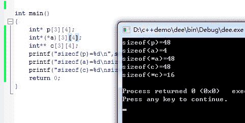

# 腾讯 2016 研发工程师在线模拟笔试题

## 1

32 位系统中，定义**a[3][4],则变量占用内存空间为()。

正确答案: B   你的答案: 空 (错误)

```cpp
4
```

```cpp
48
```

```cpp
192
```

```cpp
12
```

本题知识点

C++

讨论

[Double_k](https://www.nowcoder.com/profile/122986)

a 是一个数组，数组大小 3*4，数组中存放着指针的指针，在 32 为系统下，指针大小 4B，所以结果为 4*3*4=48

发表于 2015-09-01 13:48:15

* * *

[江山如画君](https://www.nowcoder.com/profile/408769)



发表于 2016-03-25 11:00:50

* * *

[NINI1018](https://www.nowcoder.com/profile/663843)

**a[3][4]，这是一个 3 行 4 列的指向指针的指针数组，也就是说 3 行 4 列中存储的都是指针，那么所占内存空间是：3*4*4 = 48

发表于 2015-09-01 13:32:53

* * *

## 2

二维数组 X 按行顺序存储，其中每个元素占 1 个存储单元。若 X[4][4]的存储地址为 Oxf8b82140,X[9][9]的存储地址为 Oxf8b8221c,则 X[7][7]的存储地址为()。

正确答案: A   你的答案: 空 (错误)

```cpp
Oxf8b821c4
```

```cpp
Oxf8b821a6
```

```cpp
Oxf8b82198
```

```cpp
Oxf8b821c0
```

本题知识点

C 语言

讨论

[guanjian](https://www.nowcoder.com/profile/564796)

假设每行有 n 个元素：  [查看全部)

编辑于 2015-09-04 09:57:49

* * *

[一冰](https://www.nowcoder.com/profile/637084)

x[4][4]这个元素的地址是 Oxf8b82140，则 x[4][9]的地址是 Oxf8b82140+5= Oxf8b82145，它与 x[9][9 这个元素刚好差 5 行，所以每行的元素个数为{ Oxf8b8221c- Oxf8b82145）/5=d7(十进制 245)/5=43,所以 x[]7[9]的地址是 x[4][9]+3*43(十六进制 81)= Oxf8b821c6,x[7][7]的地址=x[7][9-2]= Oxf8b821c4

发表于 2015-09-01 17:02:52

* * *

[菩提旭光](https://www.nowcoder.com/profile/837579)

**智商秀逗了。沦落到了小学智商题的水平：****[9][9] - [4][4] = 21c-140=5n+5****[7][7] - [4][4]=x-**  **140**  **=3n+3****[7][7] =**  **140+3/5*（**  **21c-140**  **）=**  **1c4**

发表于 2015-09-04 21:00:35

* * *

## 3

线性表的长度为 10，在最坏情况下，冒泡排序需要比较次数为（）。

正确答案: D   你的答案: 空 (错误)

```cpp
40
```

```cpp
42
```

```cpp
44
```

```cpp
45
```

本题知识点

排序 *讨论

[tianyunzqs](https://www.nowcoder.com/profile/953004)

冒泡的算法就是 for(int i=0; i<n; ++i){    for(int j=1; j<n-i; ++j)
    {        if(a[j-1]>a[j])
        {交换。。。}
    }}当 i=0 时，进行比较 n-1 次；当 i=1 时，进行比较 n-2 次；。。。当 i=n-1 时，进行比较 0 次；所以总的比较次数就是(n-1) + (n-2) + ... + 1 + 0 = n*(n-1)/2

发表于 2015-09-02 10:06:41

* * *

[河湖之恋](https://www.nowcoder.com/profile/220047)

最坏的情况即是每个元素两两都要相比较。故用排列组合的思想即为 C(10,9)=45

发表于 2015-09-01 20:34:05

* * *

[zt_xcyk](https://www.nowcoder.com/profile/839070)

n(n+1)/2=10*9/2=45

发表于 2015-09-03 19:32:07

* * *

## 4

下面函数的时间复杂度是

```cpp
long foo(long x){
    if(x < 2) return 1;
        return x * x * foo(x - 1);
}
```

正确答案: A   你的答案: 空 (错误)

```cpp
O(N)
```

```cpp
O(N²)
```

```cpp
O(N³)
```

```cpp
o(N!)
```

本题知识点

C++ C 语言

讨论

[IreanLau](https://www.nowcoder.com/profile/681025)

递归    时间复杂度：递归次数    空 间复杂度：递归深度（调用栈帧）

发表于 2016-04-09 19:08:56

* * *

[牛客 183660 号](https://www.nowcoder.com/profile/183660)

可以配合自己画的流程图看 x=1    O(1)x=2    O(1+O(foo(1)))=O(2)x=3    O(1+O(foo(2)))=O(3)。。。依次类推 x=N    O(1+O(foo(N-1)))=N

发表于 2015-09-04 17:01:20

* * *

[牛客 474535 号](https://www.nowcoder.com/profile/474535)

这里要从 foo(1)一直计算到 foo(n)，因此时间复杂度为 O(N)

发表于 2015-09-02 10:05:17

* * *

## 5

22 个顶点的连通图中边的条数至少为（）

正确答案: C   你的答案: 空 (错误)

```cpp
18
```

```cpp
20
```

```cpp
21
```

```cpp
23
```

本题知识点

图

讨论

[NINI1018](https://www.nowcoder.com/profile/663843)

n 个顶点的连通图至少有 n-1 条边（树）；n 个顶点的简单图（完全图）至少有 n*(n-1)/2 条边。所以选 C

编辑于 2015-09-01 13:55:13

* * *

[菩提旭光](https://www.nowcoder.com/profile/837579)

**n 个顶点的连通图至少有 n-1 条边（树）；****n 个顶点的简单图（完全图）至少有 n*(n-1)/2 条边。这个就是 c(n 2** **)嘛。**

发表于 2015-09-04 21:04:32

* * *

[wtzheng](https://www.nowcoder.com/profile/6614262)

这要分有向或无向吧。无向的话最少可以参考树，即是 N-1 有向的话，最少是可以构成一个环，那就是 N

发表于 2017-02-18 19:58:20

* * *

## 6

写出下列代码的输出内容（）

```cpp
#include <stdio.h>
int inc(int a) { return (++a); }
int multi(int *a, int *b, int *c) { return (*c = *a * *b); }
typedef int (*FUNC1)(int in);
typedef int (*FUNC2)(int *, int *, int *);
void show(FUNC2 fun, int arg1, int *arg2) {
    FUNC1 p = &inc;
    int temp = p(arg1);
    fun(&temp, &arg1, arg2);
    printf("%d\n", *arg2);
}
int main() {
    int a;
    show(multi, 10, &a);
    return 0;
}

```

正确答案: B   你的答案: 空 (错误)

```cpp
100
```

```cpp
110
```

```cpp
120
```

```cpp
0
```

本题知识点

C 语言

讨论

[啥](https://www.nowcoder.com/profile/811262)

函数指针用法错了 typedefint(FUNC1)(intin);typedefint(FUNC2)(int*,int*,int*);这两句应该改成 typedefint(*FUNC1)(intin);typedefint(*FUNC2)(int*,int*,int*);

发表于 2015-09-05 10:57:31

* * *

[Ze](https://www.nowcoder.com/profile/937369)

typedefint(FUNC1)(intin); 是函数指针定义 show(multi,10,&a); FUNC2 类型函数指针 fun 指向函数 multi 的首地址 FUNC1 p=&inc;  FUNC1 类型 函数指针 p 指向函数 inc 的首地址 int temp=p(arg1); 此时调用函数 inc，参数为 10，返回值为 11fun(&temp,&arg1,arg2); 调用函数 multi，参数为（11,10，arg2） arg2 为指针变量负责带回返回值 printf("%d\n",*arg2); 输出 110

编辑于 2015-09-03 16:33:46

* * *

[cocxx](https://www.nowcoder.com/profile/194612)

在 visual studio 下运行该程序有个编译错误：FUNC1 p=&inc;显然这里想把 p 定义为指向函数的指针，但是这里把 p 定义为一个函数了；应该把 typedefint(FUNC1)(intin); 改为 typedefint(*FUNC1)(intin);或者 FUNC1 p=&inc;改为 FUNC1 *p=&inc;各位同学可以试一下！
我用的是 C++编译器，不知道 C 下是否能按题目说的那样定义函数指针。

编辑于 2015-09-04 17:57:44

* * *

## 7

有 36 辆自动赛车和 6 条跑道，没有计时器的前提下，最少用几次比赛可以筛选出最快的三辆赛车？

正确答案: B   你的答案: 空 (错误)

```cpp
7
```

```cpp
8
```

```cpp
9
```

```cpp
10
```

本题知识点

数学运算

讨论

[luoluofeixia](https://www.nowcoder.com/profile/281282)

36 分成 6 组赛跑，每次取前三  查看全部)

编辑于 2015-09-04 09:59:03

* * *

[Ze](https://www.nowcoder.com/profile/937369)

首先分为 6 组跑一次，6 次 A1  A2  A3  A4  A5  A6B1  B2  B3  B4  B5  B6.........每组的第一都跑一次， 一共为 7 次，取前三名，暂定为（A1 B1 C1），此时第一名已经定了 为 A1D 组 E 组 F 组肯定直接被淘汰，他们的第一名都跑不进前三接着 ABC 组缩小范围 A 组 A2  A3 参加比赛，因为只有 A1 作为参照物，而 A1 是冠军 所有它俩都机会,A1>A2>A3B 组 B1  B2 参加比赛，B3 跑输 B1 B2 ，B1 跑输 A1,因此 B2 之后的拿不到前三，A1>B1>B2C 组 C1 参加比赛，同理，A1>B1>C1 最后 A2 A3 B1 B2 C1 可以决出前三  A1 陪跑哈，总共为 8 次

发表于 2015-09-01 14:43:07

* * *

[Nothingbut](https://www.nowcoder.com/profile/285061)

我的思路如下：首先这应该是多轮问题。

（1）初筛

36 辆车分 6 组，每组 6 辆。这样，比下来，共需要 6 次。

（2）再筛

在初筛中，最坏情况下，有一组的前三名就是 36 辆车的前三名。因此，每个组都需要保留前三名（后三名就可以踢出去了。）

第一名的 6 辆车放在一起，跑一遍。取前三名。这样，第四五六组都可以被排除了。

这样共需要比赛 1 次。可以筛选出第一组的 1-3 名，第二组的 1-2 名，第三组的 1 名。

（3）总决赛

把再筛得到的 6 辆车放在一起，比一次，即可取出前三名。

因此，共需 6+1+1=8 次。

发表于 2015-09-03 11:26:33

* * *

## 8

下面程序运行的结果是（）。

```cpp
#include<stdio.h>
void add(int *p){
	(*p)++;
	printf("%d", *p);
	if (*p > 5){
		return;
	}
	add(p);
}
int main(){
	int i = 0;
	add(&i);
	return 0;
}
```

正确答案: B   你的答案: 空 (错误)

```cpp
12345
```

```cpp
123456
```

```cpp
111111
```

```cpp
未知
```

本题知识点

C++ C 语言

讨论

[牛客 1602968 号](https://www.nowcoder.com/profile/1602968)

123456 &i=p，所以*p 就是 i，就是一个简单的 x++循环

发表于 2016-09-09 11:26:38

* * *

[停停走走 _123](https://www.nowcoder.com/profile/424739)

做错了~~

  *p++ ：表示先访问*p,然后 p++；

  (*p)++: 表示先访问*p，然后将*p 的值++；p 指针不变。

发表于 2015-09-04 20:48:06

* * *

[NINI1018](https://www.nowcoder.com/profile/663843)

**123456****选 B****当*p = 5 时，会再调用 add(p)，然后先输出*p = 6，然后进行判断，直接跳出程序。所以从 1 一直到 6**

发表于 2015-09-01 14:24:09

* * *

## 9

下列哪些 http 方法对于服务端和用户端一定是安全的？（）

正确答案: C   你的答案: 空 (错误)

```cpp
GET
```

```cpp
HEAD
```

```cpp
TRACE
```

```cpp
OPTIONS
```

```cpp
POST
```

本题知识点

网络基础

讨论

[nizi450821](https://www.nowcoder.com/profile/755709)

```cpp
GET:通过请求 URI 得
```

  查看全部)

编辑于 2016-04-09 17:14:03

* * *

[好人 Zakilo](https://www.nowcoder.com/profile/562856)

坑点应该是加了客户端安全。似乎除了 TRACE 其他方法都可能会涉及到发送或请求信息和资源，所以被列为不安全。而 TRACE 方法只是记录路径信息，不会引起不安全行为。（以上纯个人观点）

发表于 2015-09-04 22:17:03

* * *

[大星星和小猩猩](https://www.nowcoder.com/profile/9374535)

[`www.runoob.com/http/http-methods.html`](http://www.runoob.com/http/http-methods.html)

| 1 | GET | 请求指定的页面信息，并返回实体主体。 |
| 2 | HEAD | 类似于 get 请求，只不过返回的响应中没有具体的内容，用于获取报头 |
| 3 | POST | 向指定资源提交数据进行处理请求（例如提交表单或者上传文件）。数据被包含在请求体中。POST 请求可能会导致新的资源的建立和/或已有资源的修改。 |
| 4 | PUT | 从客户端向服务器传送的数据取代指定的文档的内容。 |
| 5 | DELETE | 请求服务器删除指定的页面。 |
| 6 | CONNECT | HTTP/1.1 协议中预留给能够将连接改为管道方式的***服务器。 |
| 7 | OPTIONS | 允许客户端查看服务器的性能。 |
| 8 | TRACE | 回显服务器收到的请求，主要用于测试或诊断。 |

对于服务端而言，HEAD,GET,OPTIONS 和 TRACE 视为安全的方法，因为它们只是从服务器获得资源而不对服务器做任何修改，但是 HEAD,GET,OPTIONS 在用户端不安全，因为信息很容易被他人窃取。所以只有 TRACE 是服务端和客户端都安全的。

发表于 2018-04-19 10:46:22

* * *

## 10

一个系统，提供多个 http 协议的接口，返回的结果 Y 有 json 格式和 jsonp 格式。Json 的格式为{"code":100,"msg":"aaa"},为了保证该协议变更之后更好的应用到多个接口，为了保证修改协议不影响到原先逻辑的代码，以下哪些设计模式是需要的?协议的变更指的是日后可能返回 xml 格式，或者是根据需求统一对返回的消息进行过滤。()

正确答案: A B D   你的答案: 空 (错误)

```cpp
Aadapter
```

```cpp
factory method
```

```cpp
proxy
```

```cpp
decorator
```

```cpp
composite
```

本题知识点

软件工程

讨论

[guanjian](https://www.nowcoder.com/profile/564796)

1.Aadapter：新增功能但不能修改原来代码，原来代码实现思路——标准接口 Target 定义 interface， ConcreteTarget 就是当前解析 json 的类（实现 Target 接口 ）； 新增功能这样实现—— Adaptee 是新增功能的所属类，Adapter 实现 Target 接口并集成 Adaptee，这样的 Adapter 就有了新的功能了，因此需要适配器模式。调用实例如下：public static void main(String[] args) {// 使用普通功能类 Target concreteTarget = new ConcreteTarget();concreteTarget.request();// 使用特殊功能类，即适配类 Target adapter = new Adapter();adapter.request();}2. 工厂模式： 为多个 http 协议的接口，在客户端代码中，告诉要请求的接口名称，会调用不同的类来处理，显然是工厂方法 4. 装饰者模式，是用来动态添加功能的，就是过滤 消息，比如非法字符&&&之类的，消息过长之类

发表于 2015-09-02 17:24:37

* * *

[渊鸿](https://www.nowcoder.com/profile/414689)

为了保证该协议变更之后更好的应用到多个接口    适配器模式；为了保证修改协议不影响到原先逻辑的代码    协议的变更指的是日后可能返回 xml 格式     工厂模式；或者是根据需求统一对返回的消息进行过滤   装饰模式

发表于 2015-09-02 21:26:01

* * *

[晓宇大美女~](https://www.nowcoder.com/profile/790486)

**1\. 使用适配器模式可以应对协议日后的变更****2\. 不同类型的返回信息调用不同的类来处理，工厂方法模式****3\. 消息过滤，装饰者模式。****涨知识了~**

发表于 2016-06-18 20:07:57

* * *

## 11

对于定义"int *p",下列哪些说明可能是正确的?()

正确答案: A   你的答案: 空 (错误)

```cpp
p 是一个指向 int 型值的指针
```

```cpp
p 是一个指向一维数组的指针
```

```cpp
p 是一个指向二维数组的指针
```

```cpp
p 是一个动态数组
```

本题知识点

C++ C 语言

讨论

[R0b1n](https://www.nowcoder.com/profile/9885630)

```cpp

	int arr[10];
int *p1 = arr;
int *p2 = (int*)&arr;
int (*p3)[10] = &arr;

	printf("%p %p %p", p1, p2, p3);

```

输出：0x7fffaeaff340 0x7fffaeaff340 0x7fffaeaff340 我们知道 数组名可以理解为指向一维数组首元素的指针常量然而由于数组是一种类型，所以并不能单纯的作为指针常量去判断所有问题那么&arr 是什么？如果 arr 是指针常量，那么&arr 应当是 arr 的地址但是 事实上 arr 与&arr 是相等的这是与指针没有直接关系的，而是数组本身内部的属性亦即 arr 存储首元素地址，&arr 存储数组地址，并且两个地址相同基于以上前提，结合我的实验数据，咱们回归本题 B 选项

```cpp
int *p1 = arr;
```

[易水](http://www.nowcoder.com/profile/523514) 认为是指向一维数组的指针而[cocxx](http://www.nowcoder.com/profile/194612) 认为是指向一维数组首元素的指针造成这种分歧的原因正是因为两个指针存储的地址值是一样的缘故而指针是由地址值+数据类型来决定的所以不能单纯以地址值来谈论，还要基于其指向的数据类型因为毕竟数据类型决定了指针移动的步长所以我们写 int *p=&arr;这样的语句是编译不通过的编译器告诉我们:

> error: cannot convert 'int (*)[10]' to 'int*' in initialization

那么由此可知，编译器认为 int *指向数组元素，而'int (*)[10]'指向数组这正是类型对指针的决定性影响所以综上愚以为此处的 int *p 只能指向一维数组首元素但是鉴于 arr 与 &arr 地址值的相等性所以试验中我使用了强制类型转换 int *p2 = (int*)&arr;这样编译就通过了但无法改变 int *只能指向单个元素的事实类似的情况还有函数名

```cpp
    void foo() {}
    printf("%p %p\n", foo, &foo);
```

这里打印出

**0x100000f40 0x100000f40**

与数组名的区别在于
此处 foo 和&foo 是相同的函数指针 void(*)()类型而 arr 与&arr 的指针类型不同前者指向元素 后者指向数组综合上述，A 选项对；B 选项错至于有的朋友问动态一维数组算不算一维数组

```cpp
int *p = new int[10];
```

这个可以查看 C11 文档关于 new 表达式的说明

> The new expression allocates a memory area, initializes either single object, or an array of objects there and returns a pointer to the first constructed object.

由此可知 new 关键字创建动态数组时，返回首元素的指针援引<C++ Primer(Fifth Edition)> 12.2.1 的内容：

> Although it is common to refer to memory allocated by new T[] as a “dynamic array,” this usage is somewhat misleading. When we use new to allocate an array, we do not get an object with an array type. Instead, we get a pointer to the element type of the array. Even if we use a type alias to define an array type, new does not allocate an object of array type. In this case, the fact that we’re allocating an array is not even visible; there is no [num]. Even so, new returns a pointer to the element type.

大意如下：虽然我们常把 new 分配的 T[]对象称为“动态数组”，但是这种说法有点误导人。因为当使用 new 来分配一个数组，我们并未得到一个数组类型的对象。相反地，我们得到的是一个指向数组元素的指针。即使我们使用一个类型别名来定义某种数组类型，new 也不会分配一个数组类型的对象。在这种情况下，你看不出我们是在分配一个数组，因为数组长度[num]压根没有体现出来。所以，new 返回的是一个指向数组元素的指针。D 选项事实上是值得商榷的，因为它与上文所引用的 C++文档和 C++ Primer 的论述不符。如果 A 选项精确表达了数组名的语义（semantics），那么 new 的语义应该和 A 选项具有一致性。也就是说，没有什么指针能指向所谓的“动态数组”（dynamic array）。我们 new T[num]时，只是分配了 sizeof(T)*num 大小的堆区内存而已，并没有什么数组类型被创建。返回的只是一个 T 类型的指针，让你可以方便通过这个指针获得这块堆内存的首地址。以后你想要访问这块地址上的元素，就可以通过这个指针迭代器，以相同的 sizeof(T)步长迭代访问这块内存上的元素。所以，new 的返回值和数组名 arr 一样，视为 int *类型综合上述，D 选项错我的最终结论是 int *p**只能**

```cpp
是一个指向 int 型值的指针
```

-----2017.9.28 回访官方已改正答案-------------------
附加福利：我们用汇编来看看 new 方法的内部实现考虑如下示例代码：

```cpp
    int *p = new int[3]();
    *p = 1;
    *(p+1) = 2;
    *(p+2) = 3;
```

编译为如下汇编码：
（芯片架构为 X86_64，汇编语法格式为 AT&T）

```cpp
# eax 寄存器存入 12，即我们的动态数组所需空间总大小
movl    $12, %eax
# edi 寄存器存入 12，作为下面调用的 __Znam 函数的第一个参数(也是唯一一个)
movl    %eax, %edi
# 系统调用 libkern 中的 __Znam 函数，用于申请 12 字节的堆内存，返回内存首地址到 rax 寄存器
callq    __Znam
# ecx 寄存器清零
xorl    %ecx, %ecx
# edx 寄存器存入 12，即我们的动态数组所需空间总大小，作为 _memset 函数的第三个参数
movl    $12, %edx
# 将 __Znam 函数返回的堆内存首地址存入 rdi 寄存器，作为 _memset 函数的第一个参数
movq    %rax, %rdi
# 将 ecx 寄存器中的值，即 0，存入 esi 寄存器，作为 _memset 函数的第二个参数
movl    %ecx, %esi
# 由于下面调用 memset 函数后会使用 rax 存储返回值，所以需要在栈里保存一下 rax 中的动态数组首地址
movq    %rax, -16(%rbp)         ## 8-byte Spill
# 保存一下 ecx 中的动态数组元素默认值
movl    %ecx, -20(%rbp)         ## 4-byte Spill
# 调用 memset 函数初始化动态数组元素，每个字节清零
callq    _memset
# 动态数组首地址出栈，最终存入 rdx 寄存器
movq    -16(%rbp), %rax         ## 8-byte Reload
movq    %rax, -8(%rbp)
movq    -8(%rbp), %rdx
# 实现代码中的逻辑，在动态数组第一个元素中存入立即数 1
movl    $1, (%rdx)
movq    -8(%rbp), %rdx
# 在动态数组第二个元素中存入立即数 2
movl    $2, 4(%rdx)
movq    -8(%rbp), %rdx
# 在动态数组第三个元素中存入立即数 3
movl    $3, 8(%rdx)
# 最终返回值寄存器 rax 中存储的是动态数组内存首地址
```

其中用到的 memset 函数原型为

```cpp
void *memset(void *__b, int __c, size_t __len);
```

由汇编代码可以清晰地看到 new 函数的实现过程事实上就是两步：1\. 调用 __Znam 函数分配内存空间 2\. 调用 _memset 函数初始化内存第二步是可选的，因为示例代码中定义动态数组的语句为 ```cpp
int *p = new int[3]();
```

所以会有第二步假如按照如下方式声明则不会有第二步 ```cpp
int *p = new int[3];
```

一个括号引发的血案，区别在于前者会使用值初始化后者使用默认初始化回到正题最终函数返回值为 __Znam 函数返回的动态内存空间首地址也就是说就是个 void *大家最终对其进行任何强制转换都可以当然在代码中我们定义为什么类型，返回的就是什么类型只是大家知道 到了底层其实没所谓类型的只有数据宽度而指针这种东西 在 X86_64 架构就是 8 字节无所谓类型

编辑于 2017-10-25 10:45:09

* * *

[cocxx](https://www.nowcoder.com/profile/194612)

我觉得选项 B 表述的有点问题，分析如下：intarr[10];int*p=arr;这里 p 指向的是一维数组中的第一个元素，所以指向的是 int 类型的数据。intarr[10][10];int(*p)[10]=arr;这里 p 也是指向二维数组中的第一个元素，且元素是 int [10]类型的数据，综述所述，int(*p)[10] 才表示一个指向一维数组的指针。

发表于 2015-09-04 20:08:26

* * *

[易水](https://www.nowcoder.com/profile/523514)

A.这个很明显是对的。B.有如下程序，此时 P 为指向一维数组的指针

```cpp
int arr[10];
int *p=arr;

```

C.指向二维数组

```cpp
int arr[10][10];
int (*p)[10];
p=arr;
```

D.在函数中声明动态数组，因为在编译阶段并不知道 len 大小，所以只能如下面一样声明动态数组

```cpp
int func(int len){
    int *p=new int[len];
}
```

编辑于 2016-06-07 23:12:41

* * *

## 12

关于操作系统 heap 与 stack 说法中，正确的是（）。

正确答案: B C   你的答案: 空 (错误)

```cpp
stack 由编译器自动分配和释放,存放函数的参数值，局部变量，全局变量的值
```

```cpp
heap 一般由程序员分配和释放，若程序员不释放，可能会造成操作系统的内存泄露
```

```cpp
stack 由系统自动分配，无需程序员干涉，heap 需要手动申请
```

```cpp
heap 与 stack 都会在初始大小空间用满时，系统自动增加其大小
```

本题知识点

C 语言

讨论

[zgljl2012](https://www.nowcoder.com/profile/865787)

A 错在了全局变量，全局变量放在 static 静态区

发表于 2015-09-01 11:07:23

* * *

[敬爱的勇哥](https://www.nowcoder.com/profile/539687)

**关于选项 B：****在堆上分配内存**可能许多人对内存分配上的“栈  stack ”和“堆  heap ”还不是很明白。包括一些科班出身的人也不明白这两个概念。简单的来讲， stack 上分配的内存系统自动释放，  heap 上分配的内存，系统不释放，哪怕程序退出，那一块内存还是在那里。 stack 一般是静态分配内存， heap 上一般是动态分配内存。  由 malloc 系统函数分配的内存就是从堆上分配内存。从堆上分配的内存一定要自己释放。用 free 释放，不然就是术语——“内存泄露”（或是“内存漏洞”）——  Memory Leak 。于是，系统的可分配内存会随 malloc 越来越少，直到系统崩溃。还是来看看“栈内存”和“堆内存”的差别吧。参看： http://www.360doc.com/content/05/0929/14/1894_15840.shtml

发表于 2015-09-01 16:48:34

* * *

[steal](https://www.nowcoder.com/profile/854555)

B 选项有歧义，不释放的话，会造成“操作系统”内存泄漏。。。在进程运行期间，可用堆空间会越来越少的，但当进程结束后，操作系统会回收该进程的一切资源/proc/pid/中的东西会清空。

发表于 2016-04-02 17:37:25

* * **