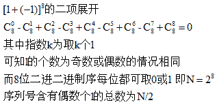
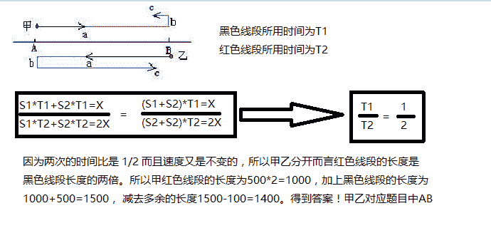

# 搜狐 2017 校招研发工程师模拟笔试题(一)

## 1

从以下四个选项中选出不同的一个？

正确答案: D   你的答案: 空 (错误)

```cpp
CVS
```

```cpp
SVN
```

```cpp
GIT
```

```cpp
SSH
```

本题知识点

开发工具 搜狐

讨论

[董小五](https://www.nowcoder.com/profile/424255)

  查看全部)

编辑于 2015-02-03 20:32:52

* * *

[细雨湿身](https://www.nowcoder.com/profile/736416)

SSH（Struts，Spring，Hibernate） Struts 进行流程控制，Spring 进行业务流转，Hibernate 进行数据库操作的封装！

发表于 2016-09-08 21:57:27

* * *

[牛客 er](https://www.nowcoder.com/profile/758147)

SSH（Struts，Spring，Hibernate） Struts 进行流程控制，Spring 进行业务流转，Hibernate 进行数据库操作的封装！SSH 为 Secure Shell 的缩写，由 IETF 的网络工作小组（Network Working Group）所制定；SSH 为建立在应用层和传输层基础上的安全协议。SSH 是目前较可靠，专为远程登录会话和其他网络服务提供安全性的协议

发表于 2015-09-06 09:38:57

* * *

## 2

从以下四个选项选出不同的一个。

正确答案: A   你的答案: 空 (错误)

```cpp
LVS
```

```cpp
Nginx
```

```cpp
Lighttpd
```

```cpp
Apache
```

本题知识点

Java

讨论

[月下莱茵](https://www.nowcoder.com/profile/110470)

答案：aLVS 是 Lin  查看全部)

编辑于 2015-02-03 20:31:50

* * *

[data_poper](https://www.nowcoder.com/profile/340257)

这个题目我感觉是只有 A 选项是全大写的，嘿嘿

发表于 2015-08-25 16:55:53

* * *

[Antipyrine](https://www.nowcoder.com/profile/481195)

*其他三个都是 web 服务器 LVS 是* Linux Virtual Server 的简写，意即 Linux 虚拟服务器，是一个虚拟的服务器集群系统

发表于 2016-03-21 16:33:52

* * *

## 3

从四个选项选出不同的一个。

正确答案: D   你的答案: 空 (错误)

```cpp
JQuery
```

```cpp
Node.js
```

```cpp
Prototype
```

```cpp
CommonJS
```

本题知识点

Javascript 搜狐

讨论

[Sam 树 2799](https://www.nowcoder.com/profile/509367)

答案：dJquery 是  查看全部)

编辑于 2015-02-03 20:30:02

* * *

[Rubyist](https://www.nowcoder.com/profile/690575)

CommonJS 规范是为了解决 JavaScript 的作用域问题而定义的模块形式，可以使每个模块它自身的命名空间中执行。该规范的主要内容是，模块必须通过  module.exports 导出对外的变量或接口，通过 require() 来导入其他模块的输出到当前模块作用域中。

发表于 2016-07-24 09:28:37

* * *

[Showo^^e](https://www.nowcoder.com/profile/917606)

CommonJS 是一种规范。

发表于 2016-04-03 11:45:18

* * *

## 4

以基本类型划分来看,从四个选项选出不同的一个。

正确答案: A   你的答案: 空 (错误)

```cpp
enum
```

```cpp
char
```

```cpp
float
```

```cpp
int
```

本题知识点

C++ 搜狐 C 语言

讨论

[yayo](https://www.nowcoder.com/profile/403986)

enum 不是基本类型。

编辑于 2015-02-03 20:11:31

* * *

[sunkuan934](https://www.nowcoder.com/profile/9012839)

这题有问题，枚举类型在 C 语言中不是基本数据类型，但在 C++中是基本数据类型。从另一方面看，选 float 似乎更合适，枚举，char，int 都是整型数据，只有 float 是浮点型数据。

发表于 2019-11-03 08:30:33

* * *

[地图一样地方](https://www.nowcoder.com/profile/439332927)

enum 不是基本类型。是自定义的。

发表于 2020-08-06 11:14:25

* * *

## 5

从四个选项选出不同的一个。

正确答案: C   你的答案: 空 (错误)

```cpp
XML
```

```cpp
JSon
```

```cpp
Base64
```

```cpp
YAML
```

本题知识点

小众语言 搜狐

讨论

[MyGoodHelper](https://www.nowcoder.com/profile/644326)

CBase64：是一种  查看全部)

编辑于 2015-02-03 20:12:31

* * *

[小小嘉洛](https://www.nowcoder.com/profile/801073)

可扩展标记语言 (Extensible Markup Language, XML) ，用于标记电子文件使其具有结构性的标记语言，可以用来标记数据、定义数据类型，是一种允许用户对自己的标记语言进行定义的源语言。
JSON(JavaScript Object Notation) 是一种轻量级的数据交换格式。它基于 JavaScript（Standard ECMA-262 3rd Edition - December 1999）的一个子集。 JSON 采用完全独立于语言的文本格式，但是也使用了类似于 C 语言家族的习惯。
Base64 是网络上最常见的用于传输 8Bit 字节代码的编码方式之一。
YAML 是一种很简单的类似于 XML 的数据描述语言，语法比 XML 简单很多。

发表于 2014-11-14 14:42:43

* * *

## 6

下面有关虚函数和非虚函数的区别说法错误的是？

正确答案: C   你的答案: 空 (错误)

```cpp
子类的指针访问虚函数访问的是子类的方法
```

```cpp
子类的指针访问非虚函数访问的是子类的方法
```

```cpp
父类的指针访问虚函数访问的是父类的方法
```

```cpp
父类的指针访问非虚函数访问的是父类的方法
```

本题知识点

C++ 搜狐

讨论

[墨儿](https://www.nowcoder.com/profile/717983)

答案 C 应该是： 父类的  查看全部)

编辑于 2015-01-12 08:42:10

* * *

[之行](https://www.nowcoder.com/profile/139843)

C 选项考察的是动态绑定，父类指针访问虚函数时，可能是访问父类的方法，也可能访问的是子类的方法，在运行时才能决定。-----这就是动态绑定。

发表于 2015-07-05 15:33:29

* * *

[卐当之用](https://www.nowcoder.com/profile/586611)

首先明确一点，不存在从基类到子类的隐士转换。当我们使用基类的引用或者指针调用一个虚函数的时候将发生动态绑定，如果指向父类那么将调用父类的函数（无论虚函数还是非虚函数），如果指向子类，基类中是虚函数将调用子类的函数，基类中不是虚函数那么将调用父类的。

发表于 2015-06-17 18:48:21

* * *

## 7

说明一下++p 与 p++ 的区别。

正确答案: B   你的答案: 空 (错误)

```cpp
没有区别
```

```cpp
++p 更好一些
```

```cpp
p++更好一些
```

```cpp
和编译器有关
```

本题知识点

C++ 搜狐 C 语言

讨论

[Aesthetic92](https://www.nowcoder.com/profile/940702)

假设这样的一个例子：

```cpp
in
```

  查看全部)

编辑于 2015-02-03 14:41:11

* * *

[天真的德鲁伊](https://www.nowcoder.com/profile/787744)

没人觉着这题很无聊么？

发表于 2016-05-11 22:12:25

* * *

[huixieqingchun](https://www.nowcoder.com/profile/551201)

**指针++和 i++是类似的。****因为 i++在计算时，会用到中间变量存储，会占用更多的内存和时间。所以++i 更好。**

发表于 2016-05-19 12:58:58

* * *

## 8

下面两段代码中 for 循环分别执行了多少次？

```cpp
1.
unsigned short i,j;
for(i=0, j=2; i!=j; i+=5, j+=7)
{}

2.
unsigned short i,j;
for(i=3,j=7;i!=j;i+=3,j+=7)
{}

```

正确答案: A   你的答案: 空 (错误)

```cpp
32767 16383
```

```cpp
32767 16363
```

```cpp
33787 16363
```

```cpp
33787 16383
```

本题知识点

C++ 搜狐

讨论

[Aesthetic92](https://www.nowcoder.com/profile/940702)

答案：选 A 答案分析：u  查看全部)

编辑于 2015-02-03 14:38:21

* * *

[啥](https://www.nowcoder.com/profile/811262)

跑圈追赶问题：unsigned short 2 个字节，2……16 = 65536 看成一个圈 1\.可认为 j 比 i 落后 65536-2=65534 距离，j 比 i 每次多跑 2 距离所以赶上需要 65534/2=32767 次 2\.j 比 i 落后 65536-4=65532 距离，j 比 i 每次多跑 4 距离所以赶上需要 65532/4=16383 次

发表于 2016-03-03 13:07:44

* * *

[dirty-life](https://www.nowcoder.com/profile/554890)

选 A 两段代码公式分别为：(5*n1) mod 65536 = (7*n1+2) mod 65536 和(3*n2 + 3) mod 65536 = (7*n2 + 7) mod 65536 得到结果为 32767 和 16383

发表于 2015-08-16 11:32:39

* * *

## 9

下面有关 CSS 选择器的说法错误的是（）？

正确答案: C   你的答案: 空 (错误)

```cpp
.intro --- 选择 class="intro" 的所有元素。
```

```cpp
#firstname --- 选择 id="firstname"的元素。
```

```cpp
div>p --- 选择所有 <div> 元素和所有 <p> 元素
```

```cpp
p --- 选择所有 <p> 元素
```

本题知识点

搜狐 CSS

讨论

[牛客 986708 号](https://www.nowcoder.com/profile/986708)

  查看全部)

编辑于 2015-01-04 21:48:12

* * *

[Amour1018](https://www.nowcoder.com/profile/306342)

div>p 的意思是说：选择所有父元素为 div 的 p 元素，如果一个 p 元素的父元素不是 div，那么这个 p 元素是不会被选择的！！！

发表于 2015-08-31 21:10:09

* * *

[Abners](https://www.nowcoder.com/profile/8130952)

div > p 表示的是 div 下面的  直接  子元素（他的孙子节点的 P 元素，是不会选择到的）div p 表示的是 div 面的所有 P 元素，不管是子节点还是孙子...都会选择到！

发表于 2017-10-19 11:22:55

* * *

## 10

ArrayList 和 LinkList 的描述，下面说法错误的是？

正确答案: D   你的答案: 空 (错误)

```cpp
LinkedeList 和 ArrayList 都实现了 List 接口
```

```cpp
ArrayList 是可改变大小的数组，而 LinkedList 是双向链接串列
```

```cpp
LinkedList 不支持高效的随机元素访问
```

```cpp
在 LinkedList 的中间插入或删除一个元素意味着这个列表中剩余的元素都会被移动；而在 ArrayList 的中间插入或删除一个元素的开销是固定的
```

本题知识点

链表 *Java 搜狐* *讨论

[牛客-007](https://www.nowcoder.com/profile/394118)

答案：D 这个说法说反了  查看全部)

编辑于 2015-01-10 21:34:39

* * *

[StrongYoung](https://www.nowcoder.com/profile/649626)

解析：

```cpp
//ArrayList 源码
public class ArrayList<E> extends AbstractList<E>
        implements List<E>, RandomAccess, Cloneable, java.io.Serializable

//LinkedList 源码
public class LinkedList<E>
    extends AbstractSequentialList<E>
    implements List<E>, Deque<E>, Cloneable, java.io.Serializable

```

所以，A 正确。---------------------------------------------------------------------------------------------------------------------------------ArrayList 的大小是可以改变的，通过源码可以发现，它是基于数组实现的，往 ArrayList 里添加数据时，它首先会判断数组大小，是否已满（这个与 HashMap 不同，那个有装载因子），如果满了，则扩充数组，其实就是新建一个数组，然后把数据拷贝过去，新数组的大小与旧数组的大小关系如下。相信大伙都看得懂。

```cpp
int newCapacity = oldCapacity + (oldCapacity >> 1);

```

LinkedList 是节点结构如下，可以看出，item 是存储数据的，next 是指向下一个 Node，prev 是指向前一个 Node 的，所以说，LinkedList 是双向的

```cpp
        Node(Node<E> prev, E element, Node<E> next) {
            this.item = element;
            this.next = next;
            this.prev = prev;
        }
```

因此，B 正确。---------------------------------------------------------------------------------------------------------------------------------ArrayList 是基于数组的，所以，具备随机访问特点，但 LinkedList 就不一样了，虽然，也可以通过也支持随机访问，但却付出了一定的代价。在 LInkedLIst 中，如果想返回某个位置的元素，就是从前往后遍历。如下。很明显，LinkedLIst 不支持高效的随机访问。因此，C 错误。

```cpp
    Node<E> node(int index) {
        // assert isElementIndex(index);

        if (index < (size >> 1)) {
            Node<E> x = first;
            for (int i = 0; i < index; i++)
                x = x.next;
            return x;
        } else {
            Node<E> x = last;
            for (int i = size - 1; i > index; i--)
                x = x.prev;
            return x;
        }
    }
```

---------------------------------------------------------------------------------------------------------------------------------LinkedList 是基于双链表的，增加是在尾部增加，增加和删除都只需要修改指针，不需要移动元素。ArrayList 插入或删除一个元素的开销不是固定的。在插入时，如果索引正确，容量够，则直接插入，插入位置之后的都需要移动，如果容易不够，还得扩充容量，开销当然不一样。删除操作同理。所以，D 错误，相当于说反了。

发表于 2015-08-17 12:49:27

* * *

[智者不惑](https://www.nowcoder.com/profile/4951515)

D 肯定不对，B 就是对的了？重新分配数组不能说是大小可变吧

发表于 2018-07-06 15:30:38

* * *

## 11

```cpp
void swap(int &a, int &b)
{
     int temp = a;
     a = b;
     b = temp;
     cout<<a<<' '<<b<<' ';
}

int main()
{
    int x=1;
    int y=2;
    swap(x, y);
    cout<<x<<' '<<y<<'\n';
    return 0;
}
```

在头文件及上下文均正常的情况下，上面程序输出的是？

正确答案: B   你的答案: 空 (错误)

```cpp
2 1 1 2
```

```cpp
2 1 2 1
```

```cpp
1 2 2 1
```

```cpp
1 2 1 2
```

本题知识点

C++ 搜狐 C 语言

讨论

[Aesthetic92](https://www.nowcoder.com/profile/940702)

答案：选 B 调用函数 sw  查看全部)

编辑于 2014-12-30 20:24:02

* * *

[牛客 230850 号](https://www.nowcoder.com/profile/230850)

这里的 swap()函数传的是引用，所以可以实现 a,b 数值的交换。传指针也可以实现交换，但是直接传值是不能实现交换的。

发表于 2016-08-15 15:17:43

* * *

[hestyle](https://www.nowcoder.com/profile/126329220)

引用相当于别名，对引用进行操作相当于直接修改其本身

发表于 2018-06-19 23:04:26

* * *

## 12

```cpp
union Test {
    char a[4];
    short b;
 };
 Test test;
 test.a[0] = 256;
 test.a[1] = 255;
 test.a[2] = 254;
 test.a[3] = 253;
 printf("%d\n", test.b);
```

问题：在 80X86 架构下，输出什么值？

正确答案: B   你的答案: 空 (错误)

```cpp
-128
```

```cpp
-256
```

```cpp
128
```

```cpp
256
```

本题知识点

C++ 搜狐 C 语言

讨论

[Aesthetic92](https://www.nowcoder.com/profile/940702)

答案：选 B 答案解析：首  查看全部)

编辑于 2015-02-03 12:09:26

* * *

[水牛丙](https://www.nowcoder.com/profile/308595)

char 为 8 位，赋值时直接取低 8 位即可。a[0] = 0000 0000a[1] = 1111 1111a[2] = 1111 1110a[3] = 1111 1101short 为 16 位，从 a 的首地址开始前 16 位为 b。80X86 架构 小端寻址（低位低地址，高位高地址），故 b = 1111 1111 0000 0000 。符号位为 1，因此 b 为负数。负数原码 = 取反(补码-1)=~（ 111 1111 0000 0000 - 1 ）= 000 0001 0000 0000=256。故 b=-256。

发表于 2015-09-07 21:38:40

* * *

[苏妄言](https://www.nowcoder.com/profile/498343)

char 类型的取值范围是-128～127，unsigned char 的取值范围是 0～255 这里 a[0]=256,出现了正溢出，将其转换到取值范围内就是 0，即 a[0]=0;同理，a[1]=-1, a[2]=-2, a[3]=-3,在 C 语言标准里面，用补码表示有符号数，故其在计算机中的表示形式如下：a[0]=0,     0000 0000a[1]=-1,    1111 1111a[2]=-2,    1111 1110a[3]=-3,    1111 1101short 是 2 字节（a[0]和 a[1]），由于 80X86 是小端模式，即数据的低位保存在内存的低地址中，而数据的高位保存在内存的高地址中，在本例中，a[0]中存放的是 b 的低位，a[1]中存放的是 b 的高位，即 b 的二进制表示是：1111 1111 0000 0000，表示-256，故选 B。

编辑于 2019-03-24 13:38:59

* * *

## 13

以下程序的输出是

```cpp
class Base {
    public:
    Base(int j): i(j)  {}
    virtual~Base() {}
    void func1() {
        i *= 10;
        func2();
    }
    int getValue() {
        return  i;
    }
    protected:
    virtual void func2() {
        i++;
    }
    protected:
    int i;
};
class Child: public Base {
    public:
    Child(int j): Base(j) {}
    void func1() {
        i *= 100;
        func2();
    }
    protected:
    void func2() {
        i += 2;
    }
};
int main() {
    Base * pb = new Child(1);
    pb->func1();
    cout << pb->getValue() << endl; delete pb; } 
```

正确答案: C   你的答案: 空 (错误)

```cpp
11
```

```cpp
101
```

```cpp
12
```

```cpp
102
```

本题知识点

C++ 搜狐

讨论

[Aesthetic92](https://www.nowcoder.com/profile/940702)

Base * pb = ne  查看全部)

编辑于 2015-02-03 14:55:51

* * *

[酒酒](https://www.nowcoder.com/profile/173190)

可以让成员函数操作一般化，用基类的指针指向不同的派生类的对象时，  基类指针调用其虚成员函数，则会调用其真正指向对象的成员函数，  而不是基类中定义的成员函数（只要派生类改写了该成员函数）。  若不是虚函数，则不管基类指针指向的哪个派生类对象，调用时都 会调用基类中定义的那个函数。

发表于 2015-04-01 21:06:48

* * *

[吼哈哈](https://www.nowcoder.com/profile/241374)

基类的指针指向派生类的对象基类指针调用其虚成员函数，则会调用其真正指向对象的成员函数，而不是基类中定义的成员函数，若不是虚函数，则不管基类指针指向的是哪个派生对象，调用的都是基类中定义的那个函数   大神解释的真好，谢啦

发表于 2015-12-18 20:33:15

* * *

## 14

写出一下程序的输出

```cpp
int main(){
    char num;
    for(num = 1; num < 255; )
        num += num;
    printf("%d\n", num);
    return 0;
}
```

正确答案: D   你的答案: 空 (错误)

```cpp
254
```

```cpp
255
```

```cpp
256
```

```cpp
死循环
```

本题知识点

C++ 搜狐 C 语言

讨论

[Aesthetic92](https://www.nowcoder.com/profile/940702)

选 D 这里 num 值一直是  查看全部)

编辑于 2015-02-03 14:54:39

* * *

[＆Builder](https://www.nowcoder.com/profile/659077)

这个题目的考察初衷不是这样让 num 一直为 0，应该是 char 类型的范围：下面这段程序任然是死循环。signed char 用于到不了 255；除非明确给出 unsigned char。intmain(void){ charnum; for(num = 1; num < 255; ) num += num; printf("%d\n",num); return0;}

发表于 2015-08-11 22:22:16

* * *

[gendlee](https://www.nowcoder.com/profile/617149)

其实这道题想要考察的是 char 型的表示范围：-128~127。num 永远都到不了 255。但是题中 num 的初值设为 0，怎么自加都是 0，题目变得更简单了。如果初值 num=1，这道题还是死循环。

发表于 2016-04-04 23:04:34

* * *

## 15

每份考卷都有一个 8 位二进制序列号。当且仅当一个序列号含有偶数个 1 时，它才是有效的。例如，00000000、01010011 都是有效的序列号，而 11111110 不是。那么，有效的序列号共有（） 个

正确答案: B   你的答案: 空 (错误)

```cpp
127
```

```cpp
128
```

```cpp
255
```

```cpp
256
```

本题知识点

组合数学 *搜狐* *讨论

[azuredragon_y](https://www.nowcoder.com/profile/528259)

B。C(8,0)+C(  查看全部)

编辑于 2015-01-02 20:51:06

* * *

[编号 2015](https://www.nowcoder.com/profile/408620)

B 总共有 2⁸=256 个序列，其中要么含有偶数个 1，要么奇数个，所以对半分为 128 个。

发表于 2015-01-26 16:43:24

* * *

[meatbunrst](https://www.nowcoder.com/profile/897847)



发表于 2015-05-02 21:49:43

* * *

## 16

两艘轮船在同一时刻驶离河的两岸，一艘从 A 驶往 B，另一艘从 B 开往 A，其中一艘开得比另一艘快些，因此它们在距离较近的岸 500 公里处相遇。到达预定地点后，每艘船要停留 15 分钟，以便让乘客上下船，然后它们又返航。这两艘渡轮在距另一岸 100 公里处重新相遇。试问河有多宽？

正确答案: B   你的答案: 空 (错误)

```cpp
1000
```

```cpp
1400
```

```cpp
1500
```

```cpp
1600
```

本题知识点

数学运算

讨论

[AndrewZJ](https://www.nowcoder.com/profile/953175)

B 当两艘渡轮在 x 点  查看全部)

编辑于 2015-02-03 14:51:05

* * *

[牛客网 17 届学员](https://www.nowcoder.com/profile/641070)

分析题目可知（画图比较直观，假设从 A 出发的船为 a，从 B 出发的传为 b，河的宽度为 w）1.第一次相遇的时候，a 走了 w-500 的距离，b 走了 500 的距离（在相同的时间内）2.第二次相遇的时候，a 走了 w+(w-100)的距离，b 走了 w+100 的距离（在相同的时间内，因为 a,b 各自等待的时间都是 15 分钟）因此，由上面的分析可知，(w-500)/500 = (2w-100)/(w+100)，=》w = 1400\.

发表于 2016-04-23 20:02:34

* * *

[蕾蕾的二叔](https://www.nowcoder.com/profile/734849)

设河宽度为 X，第一次相遇时间为 t1，第二次相遇时间为 t2，船 A 速度为 S1，船 B 的速度为 S2 则有

发表于 2015-08-19 23:42:26

* * *

## 17

下面名词解释错误的是： 

正确答案: C   你的答案: 空 (错误)

```cpp
SQL 结构化查询语言，是一种数据库查询和程序设计语言，用于存取数据以及查询、更新和管理关系数据库系统
```

```cpp
TCP 传输控制协议 TCP 是一种面向连接（连接导向）的、可靠的、基于字节流的运输层（Transport layer）通信协议
```

```cpp
QoS 服务质量，是网络的一种安全机制。QoS 是局域网的一个重要的需求。
```

```cpp
STL 标准模板库
```

本题知识点

网络基础 数据库 搜狐

讨论

[三角牛](https://www.nowcoder.com/profile/597620)

  查看全部)

编辑于 2015-01-09 10:06:00

* * *

[王俊超](https://www.nowcoder.com/profile/317978)

**C，QoS 应用于广域网，不是局域网。**

发表于 2015-07-28 20:34:41

* * *

[MyGoodHelper](https://www.nowcoder.com/profile/644326)

CQoS(Quality of Service)，中文名为"服务质量"。它是指网络提供更高优先服务的一种能力，包括专用带宽、抖动控制和延迟（用于实时和交互式流量情形）、丢包率的改进以及不同 WAN、LAN 和 MAN 技术下的指定网络流量等，同时确保为每种流量提供的优先权不会阻碍其它流量的进程
只要涉及到带宽分配和对业务服务质量有要求的地方，就会有 QoS 设计。**QoS 技术多应用于广域网络和语音、视频等媒体业务系统。**

发表于 2015-01-09 09:37:39

* * *

## 18

有关 cookie 和 session 的描述，下面错误的是？ 

正确答案: D   你的答案: 空 (错误)

```cpp
cookie 数据存放在客户的浏览器上，session 数据放在服务器上。
```

```cpp
session 是针对每一个用户的，变量的值保存在服务器上，用一个 sessionID 来区分是哪个用户 session 变量
```

```cpp
保存这个 session id 的方式可以采用 cookie
```

```cpp
只要关闭浏览器，session 就消失了
```

本题知识点

网络基础 搜狐

讨论

[MyGoodHelper](https://www.nowcoder.com/profile/644326)

D**1.**如果不设置过期时  查看全部)

编辑于 2015-01-19 21:30:21

* * *

[hellobabylol](https://www.nowcoder.com/profile/959232)

Session 是由应用服务器维持的一个服务器端的存储空间，用户在连接服务器时，会由服务器生成一个唯一的 SessionID,用该 SessionID 为标识符来存取服务器端的 Session 存储空间。而 SessionID 这一数据则是保存到客户端，用 Cookie 保存的，用户提交页面时，会将这一 SessionID 提交到服务器端，来存取 Session 数据。这一过程，是不用开发人员干预的。所以一旦客户端禁用 Cookie，那么 Session 也会失效。
服务器也可以通过 URL 重写的方式来传递 SessionID 的值，因此不是完全依赖 Cookie。如果客户端 Cookie 禁用，则服务器可以自动通过重写 URL 的方式来保存 Session 的值，并且这个过程对程序员透明。
可以试一下，即使不写 Cookie，在使用 request.getCookies();取出的 Cookie 数组的长度也是 1，而这个 Cookie 的名字就是 JSESSIONID，还有一个很长的二进制的字符串，是 SessionID 的值。
Cookie 是客户端的存储空间，由浏览器来维持。

发表于 2014-11-14 14:53:17

* * *

[牛客-007](https://www.nowcoder.com/profile/394118)

答案：DSession 保存在服务器端，cookie 保存在客户端关闭浏览器会自动删除回话级别的 cookie，但是 Session 存储在服务器端，不会被删除。

发表于 2015-01-17 19:34:01

* * *

## 19

关于测试驱动开发，描述错误的是

正确答案: C   你的答案: 空 (错误)

```cpp
测试驱动开发式是一种敏捷开发方法
```

```cpp
TDD 需求开发人员学习测试相关知识
```

```cpp
测试驱动开发不适合使用 CMM/CMMI 方法
```

```cpp
测试驱动开发可以和结对编程结合使用
```

本题知识点

软件测试 搜狐

讨论

[MyGoodHelper](https://www.nowcoder.com/profile/644326)

CCMM 是指“ 能力成熟  查看全部)

编辑于 2015-02-02 14:12:49

* * *

[你岸 0417](https://www.nowcoder.com/profile/373612)

CMM 是指“[能力成熟度模型](http://baike.baidu.com/view/2983754.htm)”，其英文全称为 Capability Maturity Model for Software，英文缩写为 SW-CMM，简称 CMM。它是对于[软件](http://baike.baidu.com/view/37.htm)组织在定义、实施、[度量](http://baike.baidu.com/view/707359.htm)、控制和改善其[软件过程](http://baike.baidu.com/view/2207.htm)的实践中各个发展阶段的描述。CMM 的核心是把软件开发视为一个过程，并根据这一原则对软件开发和维护进行过程监控和研究，以使其更加科学化、[标准化](http://baike.baidu.com/view/8087.htm)、使企业能够更好地实现商业目标。此外还是化妆品的名字。CMMI（Capability Maturity Model Integration，[能力成熟度模型集成](http://baike.baidu.com/view/1124412.htm)）将各种能力成熟度模型（即：Software CMM、Systems Eng-CMM、People CMM 和 Acquisition CMM）整合到同一架构中去，由此建立起包括软件工程、系统工程和软件采购等在内的诸模型的集成，以解决除软件开发以外的软件系统工程和软件采购工作中的迫切需求。这两种方法属于测试驱动开发的方式。举个比较生动的例子，这个例子你一定已经在很多关于 TDD 的文献资料上都看到过，但它确实是一个不错的比喻。在此我进行了一些加工和扩展。盖房子的时候，工人师傅砌墙，会先用桩子拉上线，以使砖能够垒的笔直，因为垒砖的时候都是以这根线为基准的。TDD 就像这样，先写测试代码，就像工人师傅先用桩子拉上线，然后编码的时候以此为基准，只编写符合这个测试的功能代码。而一个新手或菜鸟级的小师傅，却可能不知道拉线，而是直接把砖往上垒，垒了一些之后再看是否笔直，这时候可能会用一根线，量一下砌好的墙是否笔直，如果不直再进行校正，敲敲打打。使用传统的[软件开发过程](http://baike.baidu.com/view/5764154.htm)就像这样，我们先编码，编码完成之后才写测试程序，以此检验已写的代码是否正确，如果有错误再一点点修改。你是希望先砌墙再拉线，还是希望先拉线再砌墙呢？如果你喜欢前者，那就算了，而如果你喜欢后者，那就转入 TDD 阵营吧结对编程技术是指两位程序员坐在同一工作台前开发软件。与两位程序员各自独立工作相比，结对编程能编写出质量更高的代码。兵乓结对编程是结对编程的一种变体， 在乒乓结对编程中，观察者编写失败的测试用例，驾驶者修改代码以通过该用例，观察者编写新的单元测试用例，等等。这个循环持续到观察者不能写出失败的测试用例。但是这种方法比估计的计划要花更多的时间。

发表于 2016-04-01 23:02:39

* * *

[小牛牛牛牛牛](https://www.nowcoder.com/profile/236377)

举个比较生动的例子，这个例子你一定已经在很多关于 TDD 的文献资料上都看到过，但它确实是一个不错的比喻。在此我进行了一些加工和扩展。盖房子的时候，工人师傅砌墙，会先用桩子拉上线，以使砖能够垒的笔直，因为垒砖的时候都是以这根线为基准的。TDD 就像这样，先写测试代码，就像工人师傅先用桩子拉上线，然后编码的时候以此为基准，只编写符合这个测试的功能代码。而一个新手或菜鸟级的小师傅，却可能不知道拉线，而是直接把砖往上垒，垒了一些之后再看是否笔直，这时候可能会用一根线，量一下砌好的墙是否笔直，如果不直再进行校正，敲敲打打。使用传统的[软件开发过程](http://baike.baidu.com/view/5764154.htm)就像这样，我们先编码，编码完成之后才写测试程序，以此检验已写的代码是否正确，如果有错误再一点点修改。你是希望先砌墙再拉线，还是希望先拉线再砌墙呢？如果你喜欢前者，那就算了，而如果你喜欢后者，那就转入 TDD 阵营吧

发表于 2015-10-09 20:50:05

* * *

## 20

C++类体系中，不能被派生类继承的有?

正确答案: A B D   你的答案: 空 (错误)

```cpp
构造函数
```

```cpp
静态成员函数
```

```cpp
非静态成员函数
```

```cpp
赋值操作函数
```

本题知识点

C++ 搜狐 C++工程师 牛客

讨论

[赖聪林](https://www.nowcoder.com/profile/412445)

答案选 A。编译器总是根据类型来调用类成员函数。但是一个派生类的指针可以安全地转化为一个基类的指针。这样删除一个基类的指针的时候，C++不管这个指针指向一个基类对象还是一个派生类的对象，调用的都是基类的析构函数而不是派生类的。如果你依赖于派生类的析构函数的代码来释放资源，而没有重载析构函数，那么会有资源泄漏。所以建议的方式是将析构函数声明为虚函数。也就是 delete a 的时候，也会执行派生类的析构函数。一个函数一旦声明为虚函数，那么不管你是否加上 virtual 修饰符，它在所有派生类中都成为虚函数。但是由于理解明确起见，建议的方式还是加上 virtual 修饰符。构造方法用来初始化类的对象，与父类的其它成员不同，它不能被子类继承（子类可以继承父类所有的成员变量和成员方法，但不继承父类的构造方法）。因此，在创建子类对象时，为了初始化从父类继承来的数据成员，系统需要调用其父类的构造方法。如果没有显式的构造函数，编译器会给一个默认的构造函数，并且该默认的构造函数仅仅在没有显式地声明构造函数情况下创建。构造原则如下：    1. 如果子类没有定义构造方法，则调用父类的无参数的构造方法。    2. 如果子类定义了构造方法，不论是无参数还是带参数，在创建子类的对象的时候,首先执行父类无参数的构造方法，然后执行自己的构造方法。    3. 在创建子类对象时候，如果子类的构造函数没有显示调用父类的构造函数，则会调用父类的默认无参构造函数。    4. 在创建子类对象时候，如果子类的构造函数没有显示调用父类的构造函数且父类自己提供了无参构造函数，则会调用父类自己的无参构造函数。    5. 在创建子类对象时候，如果子类的构造函数没有显示调用父类的构造函数且父类只定义了自己的有参构造函数，则会出错（如果父类只有有参数的构造方法，则子类必须显示调用此带参构造方法）。    6. 如果子类调用父类带参数的构造方法，需要用初始化父类成员对象的方式，比如：

```cpp
#include <iostream.h>
class animal
{
public:
    animal(int height, int weight)
    {
        cout<<"animal construct"<<endl;
    }
};
class fish:public animal
{
public:
    int a;
    fish():animal(400,300), a(1)
    {
        cout<<"fish construct"<<endl;
    }
};
void main()
{
    fish fh;
}

```

编辑于 2015-01-22 16:57:02

* * *

[BillyLaw](https://www.nowcoder.com/profile/326815)

**赋值运算符重载函数 ” 不是不能被派生类继承，而是被派生类的默认 “ 赋值运算符重载函数 ” 给覆盖了。  这就是 C++ 赋值运算符重载函数不能被派生类继承的真实原因！** **“**

发表于 2016-07-23 19:05:19

* * *

[风风火火恍恍惚惚改个名](https://www.nowcoder.com/profile/193955)

[`blog.csdn.net/chengonghao/article/details/51944979`](http://blog.csdn.net/chengonghao/article/details/51944979)  简而言之，缺省构造函数，拷贝构造函数，拷贝赋值函数，以及析构函数这四种成员函数被称作特殊的成员函数。这 4 种成员函数不能被继承

发表于 2016-08-26 22:39:49

* * ***