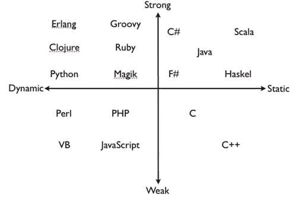
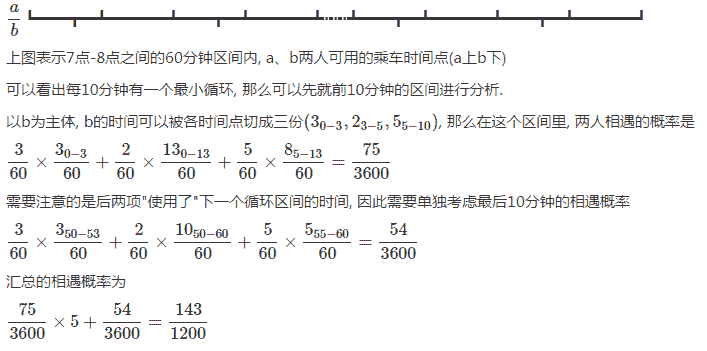

# 搜狐 2017 校招研发工程师模拟笔试题(二)

## 1

从运行层面上来看，从四个选项选出不同的一个。

正确答案: B   你的答案: 空 (错误)

```cpp
JAVA
```

```cpp
Python
```

```cpp
objectC
```

```cpp
C#
```

本题知识点

Python Java 搜狐

讨论

[牛客-007](https://www.nowcoder.com/profile/394118)

答案：BA，C，D 都是  查看全部)

编辑于 2015-01-10 21:12:50

* * *

[Laughing_Lz](https://www.nowcoder.com/profile/442458)

***Python  只有它是动态语言***动态语言的定义：动态编程语言   是   [高级程序设计语言](http://zh.wikipedia.org/wiki/%E9%AB%98%E7%BA%A7%E7%A8%8B%E5%BA%8F%E8%AE%BE%E8%AE%A1%E8%AF%AD%E8%A8%80)   的一个类别，在计算机科学领域已被广泛应用。它是一类   在 ***运行时可以改变其结构的语言*** ：例如新的函数、对象、甚至代码可以被引进，已有的函数可以被删除或是其他结构上的变化。动态语言目前非常具有活力。众所周知的   [ECMAScript](http://zh.wikipedia.org/wiki/ECMAScript)   （   [JavaScript](http://zh.wikipedia.org/wiki/JavaScript)   ）便是一个动态语言，除此之外如   [PHP](http://zh.wikipedia.org/wiki/PHP)   、   [Ruby](http://zh.wikipedia.org/wiki/Ruby)   、   [Python](http://zh.wikipedia.org/wiki/Python)   等也都属于动态语言，而   [C](http://zh.wikipedia.org/wiki/C%E8%AF%AD%E8%A8%80)   、   [C++](http://zh.wikipedia.org/wiki/C%2B%2B)   等语言则不属于动态语言。----来自 [维基百科](http://zh.wikipedia.org/wiki/%E5%8A%A8%E6%80%81%E8%AF%AD%E8%A8%80)http://www.tuicool.com/articles/mQfAz2

编辑于 2016-08-17 12:27:29

* * *

[oniOn-er](https://www.nowcoder.com/profile/3990182)

作者：rainoftime
链接：[`www.zhihu.com/question/19918532/answer/21647195`](https://www.zhihu.com/question/19918532/answer/21647195)
来源：知乎
著作权归作者所有。商业转载请联系作者获得授权，非商业转载请注明出处。

类型系统的一些概念，众说纷纭，使用上也比较乱。有些东西，甚至不好严格定义。以下算学术界的一种相对“严格”的说法。

**1\. 先定义一些基础概念**

Program Errors

*   *trapped errors*。导致程序终止执行，如除 0，Java 中数组越界访问
*   *untrapped errors*。 出错后继续执行，但可能出现任意行为。如 C 里的缓冲区溢出、Jump 到错误地址

Forbidden Behaviours

语言设计时，可以定义一组*forbidden behaviors*. 它必须包括所有 untrapped errors, 但可能包含 trapped errors.

Well behaved、ill behaved

*   *well behaved*: 如果程序执行不可能出现 forbidden behaviors, 则为*well behaved*。
*   *ill behaved: 否则为 ill behaved...*

**2\. 有了上面的概念，再讨论强、弱类型，静态、动态类型**

强、弱类型

*   *强类型 strongly typed*: 如果一种语言的所有程序都是 well behaved——即不可能出现 forbidden behaviors，则该语言为 strongly typed。
*   *弱类型 weakly typed*: 否则为 weakly typed。比如 C 语言的缓冲区溢出，属于 trapped errors，即属于 forbidden behaviors..故 C 是弱类型

前面的人也说了，弱类型语言，类型检查更不严格，如偏向于容忍隐式类型转换。譬如说 C 语言的 int 可以变成 double。 这样的结果是：容易产生 forbidden behaviours，所以是弱类型的

动态、静态类型

*   *静态类型 statically*: 如果在编译时拒绝 ill behaved 程序，则是 statically typed;
*   *动态类型 dynamiclly*: 如果在运行时拒绝 ill behaviors, 则是 dynamiclly typed。

**3\. 误区**
大家觉得 C 语言要写 int a, int b 之类的，Python 不用写(可以直接写 a, b)，所以 C 是静态，Python 是动态。这么理解是不够准确的。譬如 Ocaml 是静态类型的，但是也可以不用明确地写出来。。
Ocaml 是**静态隐式类型**
静态类型可以分为两种：

*   如果类型是语言语法的一部分，在是**explicitly typed 显式类型；**
*   如果类型通过编译时推导，是**implicity typed****隐式类型**, 比如 ML 和 Haskell

**4.下面是些例子**
无类型： 汇编
弱类型、静态类型 ： C/C++
弱类型、动态类型检查： Perl/PHP
强类型、静态类型检查 ：Java/C#
强类型、动态类型检查 ：Python, Scheme
静态**显式**类型 ：Java/C
静态隐式类型 ：Ocaml, Haskell

编辑于 2017-11-02 16:01:12

* * *

## 2

从四个选项选出不同的一个。

正确答案: D   你的答案: 空 (错误)

```cpp
Eclipse
```

```cpp
VS2012
```

```cpp
Aptana
```

```cpp
Emacs
```

本题知识点

开发工具 搜狐

讨论

[月•微凉](https://www.nowcoder.com/profile/515578)

Emacs 是文本编辑器。

编辑于 2015-02-03 18:20:48

* * *

[sgt-nkw-2021](https://www.nowcoder.com/profile/179325)

Eclipse 是一个开放[源代码](http://baike.baidu.com/subview/60376/5122159.htm) 的、基于[Java](http://baike.baidu.com/subview/29/12654100.htm) 的可扩展开发平台。[Visual Studio](http://baike.baidu.com/view/28727.htm) 是微软公司推出的开发环境。是最流行的[Windows](http://baike.baidu.com/view/4821.htm) 平台应用程序开发环境。Aptana 是一个基于[Eclipse](http://baike.haosou.com/doc/2137168-7016145.html) 的[集成开发环境](http://baike.haosou.com/doc/5602996-5815603.html) ，其最广为人知的是 JavaScript[编辑器](http://baike.haosou.com/doc/6781941-6998356.html) 和调试器。2011 年 Aptana 吸收了 Radrails 项目，添加了 Ruby on Rails 支持。Emacs 是一种强大的文本[编辑器](http://baike.haosou.com/doc/6781941-6998356.html) ，在程序员和其他以技术工作为主的计算机用户中广受欢迎。EMACS，即 Editor MACroS(编辑器宏)的缩写，最初由 Richard Stallman([理查德·马修·斯托曼](http://baike.haosou.com/doc/5931244-6144172.html) )于 1975 年在 MIT 协同 Guy Steele 共同完成。这一创意的灵感来源于 TECMAC 和 TMACS，它们是由 Guy Steele、Dave Moon、Richard Greenblatt、Charles Frankston 等人编写的宏[文本编辑器](http://baike.haosou.com/doc/5643895-5856529.html) 。

发表于 2015-09-05 10:55:22

* * *

[DOREEN](https://www.nowcoder.com/profile/999287)

mark  Emacs

发表于 2015-09-04 16:10:09

* * *

## 3

从四个选项选出不同的一个。

正确答案: B   你的答案: 空 (错误)

```cpp
Mysql
```

```cpp
MongoDB
```

```cpp
DB2
```

```cpp
PostgreSQL
```

本题知识点

数据库 搜狐

讨论

[大贱贱！](https://www.nowcoder.com/profile/267816)

  查看全部)

编辑于 2015-02-03 18:14:59

* * *

[sgt-nkw-2021](https://www.nowcoder.com/profile/179325)

**MySQL^([1])**  **是一个** [**关系型数据库管理系统**](http://baike.baidu.com/view/1450387.htm) **，**由瑞典 MySQL AB 公司开发，目前属于 [Oracle](http://baike.baidu.com/view/15020.htm) 旗下公司。MySQL 最流行的[关系型数据库管理系统](http://baike.baidu.com/view/1450387.htm) ，在 WEB 应用方面 MySQL 是最好的 RDBMS (Relational Database Management System，关系数据库管理系统) 应用软件之一。MySQL 是一种关联[数据库管理系统](http://baike.baidu.com/view/68446.htm) ，关联数据库将数据保存在不同的表中，而不是将所有数据放在一个大仓库内，这样就增加了速度并提高了灵活性。MySQL 所使用的 SQL 语言是用于访问数据库的最常用标准化语言。MySQL 软件采用了双授权政策（本词条“授权政策”），它分为社区版和商业版，由于其体积小、速度快、总体拥有成本低，尤其是[开放源码](http://baike.baidu.com/view/394804.htm) 这一特点，一般中小型网站的开发都选择 MySQL 作为网站数据库。由于其社区版的性能卓越，搭配 [PHP](http://baike.baidu.com/view/99.htm) 和 [Apache](http://baike.baidu.com/view/28283.htm) 可组成良好的开发环境。Mongo DB 是目前在 IT 行业非常流行的一种非关系型数据库(NoSql),其灵活的数据存储方式备受当前 IT 从业人员的青睐。Mongo DB 很好的实现了面向对象的思想(OO 思想),在 Mongo DB 中 每一条记录都是一个 Document 对象。Mongo DB 最大的优势在于所有的数据持久操作都无需开发人员手动编写 SQL 语句,直接调用方法就可以轻松的实现 CRUD 操作。**IBM DB2** 是[美国](http://baike.baidu.com/view/2398.htm) [IBM](http://baike.baidu.com/view/1937.htm) 公司开发的一套[关系型数据库管理系统](http://baike.baidu.com/view/1450387.htm) ，它主要的运行环境为[UNIX](http://baike.baidu.com/view/8095.htm) （包括 IBM 自家的[AIX](http://baike.baidu.com/view/349664.htm) ）、[Linux](http://baike.baidu.com/view/1634.htm) 、IBM i（旧称 OS/400）、[z/OS](http://baike.baidu.com/view/1245216.htm) ，以及[Windows](http://baike.baidu.com/view/4821.htm) 服务器版本。DB2 主要应用于大型应用系统，具有较好的可伸缩性，可支持从大型机到单用户环境，应用于所有常见的服务器操作系统平台下。 DB2 提供了高层次的数据利用性、完整性、安全性、可恢复性，以及小规模到大规模应用程序的执行能力，具有与平台无关的基本功能和 SQL 命令。DB2 采用了数据分级技术，能够使大型机数据很方便地下载到 LAN 数据库服务器，使得客户机/服务器用户和基于 LAN 的应用程序可以访问大型机数据，并使数据库本地化及远程连接透明化。 DB2 以拥有一个非常完备的查询优化器而著称，其外部连接改善了查询性能，并支持多任务并行查询。 DB2 具有很好的网络支持能力，每个子系统可以连接十几万个分布式用户，可同时激活上千个活动线程，对大型分布式应用系统尤为适用。PostgreSQL 是以[加州大学](http://baike.baidu.com/view/182408.htm) 伯克利分校计算机系开发的 POSTGRES，现在已经更名为 PostgreSQL，版本 4.2 为基础的对象[关系型数据库管理系统](http://baike.baidu.com/view/1450387.htm) （ORDBMS）。PostgreSQL 支持大部分 SQL 标准并且提供了许多其他现代特性：复杂查询、[外键](http://baike.baidu.com/view/68073.htm) 、[触发器](http://baike.baidu.com/view/71792.htm) 、视图、[事务](http://baike.baidu.com/view/121511.htm) 完整性、[MVCC](http://baike.baidu.com/view/1887040.htm) 。同样，PostgreSQL 可以用许多方法扩展，比如， 通过增加新的数据类型、函数、操作符、[聚集函数](http://baike.baidu.com/view/2537411.htm) 、索引。免费使用、修改、和分发 PostgreSQL，不管是私用、商用、还是学术研究使用。

发表于 2015-09-05 10:58:21

* * *

[stupidjoey](https://www.nowcoder.com/profile/908234)

MongoDB 是非关系型数据库

发表于 2015-09-04 20:59:20

* * *

## 4

从四个选项选出不同的一个。

正确答案: A   你的答案: 空 (错误)

```cpp
fiddler
```

```cpp
firebug
```

```cpp
httpwatch
```

```cpp
IETester
```

本题知识点

开发工具 搜狐

讨论

[佩星琴](https://www.nowcoder.com/profile/128130)

答案：AFiddler  查看全部)

编辑于 2015-02-03 18:20:24

* * *

[小杨 vita](https://www.nowcoder.com/profile/576504)

D 前面三个都具有抓取并查看 HTTP 包的功能

发表于 2015-09-28 23:21:43

* * *

## 5

从四个选项选出不同的一个。

正确答案: C   你的答案: 空 (错误)

```cpp
<nav>
```

```cpp
<footer>
```

```cpp
<meta>
```

```cpp
<canvas>
```

本题知识点

HTML 搜狐

讨论

[胡原](https://www.nowcoder.com/profile/80)

C。A 选项<nav><  查看全部)

编辑于 2015-02-03 18:20:37

* * *

[方泉水很甜](https://www.nowcoder.com/profile/695496)

meta 是不闭合的，其他都需要用</>标签表示结束。done。

发表于 2016-03-30 19:32:12

* * *

[愤怒的小果汁](https://www.nowcoder.com/profile/2037801)

这是考察 HTML5 新加标签吧

发表于 2017-04-01 09:53:56

* * *

## 6

a 和 b 两个人每天都会在 7 点-8 点之间到同一个车站乘坐公交车，a 坐 101 路公交车，每 5 分钟一班【7:00,7:05……】，b 坐 102 路公交车，每 10 分钟一班【7:03,7:13…】，问 a 和 b 碰面的概率是多少？（ ）

正确答案: C   你的答案: 空 (错误)

```cpp
1/8
```

```cpp
41/400
```

```cpp
143/1200
```

```cpp
199/1800
```

```cpp
431/3600
```

本题知识点

概率统计 *搜狐 概率论与数理统计* *讨论

[酒鬼丸](https://www.nowcoder.com/profile/652535)

C【解析】 

编辑于 2015-08-20 07:59:33

* * *

[Siukwanlee](https://www.nowcoder.com/profile/321608)

以 b 的前 10 分钟来分析：b 在 0 到 3 分钟与 a 相遇的概率是：3/60 ＊3／60，即 a 也要在前 3 分钟到达，才可能与 b 相遇。到第 3 分钟的时候，b 肯定上车了。b 在第 3 分钟到第 5 分钟与 a 相遇的概率是：a 在 3 到 5 分钟这个时间段到，相遇；a 在 5 到 10 分钟这个时间段到，相遇；a 在 10 到 13 分钟到，也相遇，所以是 2/60 ＊ 13/60；b 在第 5 分钟到 10 分钟：a 在 5 分钟到 10 分钟之间到，相遇；a 在 10 分钟到 13 分钟之间到，仍相遇，所以 5/60 ＊ 8/60；最后一个 10 分钟，因为没有 60 到 63 分钟，所以需要特殊处理。可参考酒鬼丸的答案。

发表于 2016-03-03 00:22:53

* * *

[左神](https://www.nowcoder.com/profile/787407)

从【0,60】分成好几个小区间，然后讨论当 a 落在一个小区间的时候，b 落在那个区间上肯定相遇，找出其中的最小循环，简化计算。

发表于 2016-05-31 13:23:30

* * *

## 7

模块 A 给部署在多台机器上的模块 B 采用轮询的方式发起查询请求，请问这样做优势是什么？
1.减少请求模块 B 的频率 2.减少系统的故障率 3.减少模块 A 所在机器的网络 IO 4.减少模块 A 等待结果的时间

正确答案: C   你的答案: 空 (错误)

```cpp
（1、2、3、4）
```

```cpp
（2、3）
```

```cpp
（2、4）
```

```cpp
（3、4）
```

本题知识点

网络基础 系统设计 搜狐

讨论

[JoeHsu](https://www.nowcoder.com/profile/263579)

C.（2、4）1.模块  查看全部)

编辑于 2015-02-06 11:03:29

* * *

[南山北](https://www.nowcoder.com/profile/948516)

轮询（Polling）是一种 CPU 决策如何提供周边设备服务的方式，又称“程控输出入”（Programmed I/O）。轮询法的概念是，由 CPU 定时发出询问，依序询问每一个周边设备是否需要其服务，有即给予服务，服务结束后再问下一个周边，接着不断周而复始。轮询法实作容易，但效率偏低。

发表于 2016-09-05 09:28:14

* * *

[粉红猫](https://www.nowcoder.com/profile/774406)

发的消息没少，网络 IO 不会减少。排除 3

发表于 2015-10-09 16:06:42

* * *

## 8

小红和小蓝都是李老师的学生，李老师的生日是 M 月 D 日，是下列 10 组中的一天，李老师把 M 值告诉了小红，把 D 值告诉了小蓝，通过小红和小蓝的对话你能知道李老师的生日是哪一天吗?请根据以下对话推断出李老师的生日是哪一天（ ）
小红说：如果我不知道的话，小蓝肯定也不知道。
小蓝说：本来我也不知道，但是现在我知道了。
小红说：哦，那我也知道了。

正确答案: F   你的答案: 空 (错误)

```cpp
3 月 4 日
```

```cpp
3 月 5 日
```

```cpp
3 月 8 日
```

```cpp
6 月 4 日
```

```cpp
6 月 7 日
```

```cpp
9 月 1 日
```

```cpp
9 月 5 日
```

```cpp
12 月 1 日
```

```cpp
12 月 2 日
```

```cpp
12 月 8 日
```

本题知识点

判断推理

讨论

[凌普意](https://www.nowcoder.com/profile/659017)

```cpp
小明说：如果我不知道的话，小红
```

  查看全部)

编辑于 2015-02-06 10:43:03

* * *

[HanaGo](https://www.nowcoder.com/profile/493754)

3 月：4,5,86 月：4,79 月：1,512 月：1,2,8 小红知道月份，小蓝知道哪一日**1\.** 根据小红说“如果我不知道的话，小蓝肯定也不知道”：排除 6 月和 12 月。如果是 6 月和 12 月小红不能肯定小蓝不知道，因为 7 日和 2 日只出现一次。3 月：4,5,89 月：1,5**2\.** 根据 小蓝说“本来我也不知道，但是现在我知道了”：没有 1 的推断之前，小蓝是不知道哪一月的，现在知道了，由此可将 5 日排除 3 月：4,89 月：1**3\.** 根据小红说“哦，那我也知道了”：排除 3 月。3 月有 4 日和 8 日，如果是 3 月小红不能确定。

发表于 2016-05-16 16:08:41

* * *

[牛客 9343060 号](https://www.nowcoder.com/profile/9343060)

第一句话：假如小蓝拿到 7 日和 2 日就能猜出日期，但是小红确定他不知道是因为她拿的不是 6 和 12 月故排除。第二句话：小蓝拿到肯定不是 5 号，不然不知道是哪个月第三句话：3 月还有 4 和 8 日，小红不确定是哪天所以只要 9.1**这俩人对话都是神人吗。。。

发表于 2018-03-23 02:51:28

* * *

## 9

下面 <span> 标签中 Hello World 字体的颜色是：（）

```cpp
<style type="text/css">
span {
    color: green;
}
.red {
    color: red;
}
#blue {
    color: blue;
}
</style>

<span id="blue" class="red" style="color:black;">Hello World</span>

```

正确答案: D   你的答案: 空 (错误)

```cpp
green
```

```cpp
red
```

```cpp
blue
```

```cpp
black
```

本题知识点

搜狐 CSS

讨论

[Vincy 是产品经理](https://www.nowcoder.com/profile/572317)

  查看全部)

编辑于 2021-08-18 15:47:22

* * *

[∫∫∫ summer℃](https://www.nowcoder.com/profile/2790689)

第一等：代表内联样式，如: style=””，权值为 1000。 第二等：代表 ID 选择器，如：#content，权值为 0100。 第三等：代表类，伪类和属性选择器，如.content，权值为 0010。 第四等：代表类型选择器和伪元素选择器，如 div p，权值为 0001。 通配符、子选择器、相邻选择器等的。如*、>、+,权值为 0000。 继承的样式没有权值。

发表于 2016-10-27 08:59:36

* * *

[月璇之音](https://www.nowcoder.com/profile/589660)

优先级:行内样式 > 内部样式 > 外部样式 行内样式:代码直接写在标签的后面 如

内部样式是写在*