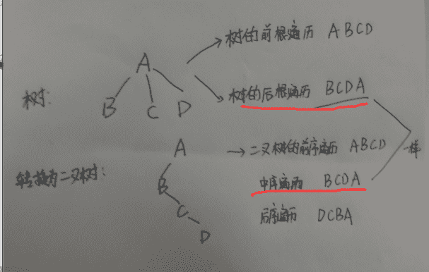
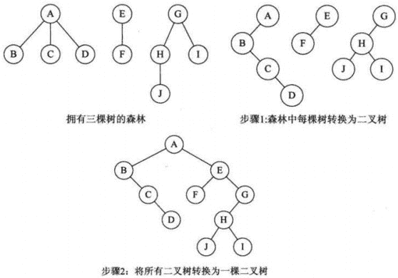
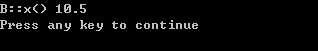

# C++入门级笔试题合集（一）

## 1

线性表中每一个元素都有一个前驱和一个后继

正确答案: A   你的答案: 空 (错误)

```cpp
错
```

```cpp
对
```

本题知识点

数组 链表 *讨论

[夏雨天](https://www.nowcoder.com/profile/710633)

选择 A：第一个元素没有前驱，最后一个元素没有后驱。

发表于 2015-09-06 15:41:57

* * *

[牛客 870053 号](https://www.nowcoder.com/profile/870053)

单链表只有后继没前驱啊 双向链表才有前驱和后继 数组有前驱和后继因为可以用数组存储链表 下标标识

发表于 2015-09-11 12:52:56

* * *

[BrainerGao](https://www.nowcoder.com/profile/516342)

第一个和最后一个例外

发表于 2016-06-27 14:29:28

* * *

## 2

设无向图的顶点个数为 n，则该图最多有（ ）条边。

正确答案: B   你的答案: 空 (错误)

```cpp
n-1
```

```cpp
n(n-1)/2
```

```cpp
n2
```

```cpp
n(n+1)/2
```

本题知识点

图

讨论

[manhua](https://www.nowcoder.com/profile/683760)

连通图，最少有 N-1 条边，最多有 N(N-1)/2 条边。

发表于 2015-10-08 10:50:20

* * *

[go_changing](https://www.nowcoder.com/profile/990318)

应该有前提条件无重边

发表于 2016-04-27 19:17:21

* * *

[Iwzebin](https://www.nowcoder.com/profile/977689)

C[n] ²

发表于 2015-09-05 14:11:03

* * *

## 3

旅行商问题是 NP 问题吗？

正确答案: B   你的答案: 空 (错误)

```cpp
否
```

```cpp
是
```

```cpp
至今尚无定论
```

本题知识点

复杂度

讨论

[zhisheng_blog](https://www.nowcoder.com/profile/616717)

旅行商问题

旅行商问题（Traveling Saleman Problem，TSP）

什么是旅行商问题

旅行商问题（Traveling Saleman Problem，TSP）是 VRP 的特例，由于[Gaery](http://wiki.mbalib.com/w/index.php?title=Gaery&action=edit) ^([[1]](http://wiki.mbalib.com/wiki/%E6%97%85%E8%A1%8C%E5%95%86%E9%97%AE%E9%A2%98#_note-0))已证明 TSP 问题是[NP 难题](http://wiki.mbalib.com/w/index.php?title=NP%E9%9A%BE%E9%A2%98&action=edit)，因此，VRP 也属于 NP 难题。

旅行商问题（TSP）又译为旅行推销员问题、货郎担问题，简称为 TSP 问题，是最基本的路线问题，该问题是在寻求单一旅行者由起点出发，通过所有给定的需求点之后，最后再回到原点的最小路径成本。最早的旅行商问题的[数学规划](http://wiki.mbalib.com/wiki/%E6%95%B0%E5%AD%A6%E8%A7%84%E5%88%92)是由[Dantzig](http://wiki.mbalib.com/w/index.php?title=Dantzig&action=edit)（1959）等人提出 ^([[2]](http://wiki.mbalib.com/wiki/%E6%97%85%E8%A1%8C%E5%95%86%E9%97%AE%E9%A2%98#_note-a))。

TSP 问题在[物流](http://wiki.mbalib.com/wiki/%E7%89%A9%E6%B5%81)中的描述是对应一个物流配送公司，欲将 n 个客户的订货沿最短路线全部送到。如何确定最短路线。

TSP 问题最简单的求解方法是枚举法。它的解是***的、多局部极值的、趋于无穷大的复杂解的空间，搜索空间是 n 个点的所有排列的集合，大小为（n-1）。可以形象地把解空间看成是一个无穷大的丘陵地带，各山峰或山谷的高度即是问题的极值。求解 TSP，则是在此不能穷尽的丘陵地带中攀登以达到山顶或谷底的过程。

旅行商问题的历史

旅行商问题字面上的理解是：有一个[推销员](http://wiki.mbalib.com/wiki/%E6%8E%A8%E9%94%80%E5%91%98)，要到 n 个[城市](http://wiki.mbalib.com/wiki/%E5%9F%8E%E5%B8%82)推销商品，他要找出一个包含所有 n 个城市的具有最短路程的环路。

TSP 的历史很久，最早的描述是 1759 年欧拉研究的骑士周游问题，即对于国际象棋棋盘中的 64 个方格，走访 64 个方格一次且仅一次，并且最终返回到起始点。

TSP 由[美国 RAND 公司](http://wiki.mbalib.com/wiki/%E7%BE%8E%E5%9B%BDRAND%E5%85%AC%E5%8F%B8)于 1948 年引入，该公司的声誉以及[线性规划](http://wiki.mbalib.com/wiki/%E7%BA%BF%E6%80%A7%E8%A7%84%E5%88%92)这一新方法的出现使得 TSP 成为一个知名且流行的问题。

旅行商问题的解法

旅行推销员的问题，我们称之为巡行（Tour），此种问题属于 NP-Complete 的问题，所以旅行商问题大多集中在启发式解法。[Bodin](http://wiki.mbalib.com/w/index.php?title=Bodin&action=edit)（1983）等人将旅行推销员问题的启发式解法分成三种：1、[途程建构法](http://wiki.mbalib.com/w/index.php?title=%E9%80%94%E7%A8%8B%E5%BB%BA%E6%9E%84%E6%B3%95&action=edit)（[Tour Construction Procedures](http://wiki.mbalib.com/w/index.php?title=Tour_Construction_Procedures&action=edit)）

从距离矩阵中产生一个近似最佳解的途径，有以下几种解法：

1）[最近邻点法](http://wiki.mbalib.com/w/index.php?title=%E6%9C%80%E8%BF%91%E9%82%BB%E7%82%B9%E6%B3%95&action=edit)（Nearest Neighbor Procedure）：一开始以寻找离场站最近的需求点为起始路线的第一个[顾客](http://wiki.mbalib.com/wiki/%E9%A1%BE%E5%AE%A2)，此后寻找离最后加入路线的顾客最近的需求点，直到最后。2）[节省法](http://wiki.mbalib.com/wiki/%E8%8A%82%E7%9C%81%E6%B3%95)（Clark and Wright Saving）：以服务每一个节点为起始解，根据三角不等式两边之和大于第三边之性质，其起始状况为每服务一个顾客后便回[场站](http://wiki.mbalib.com/wiki/%E5%9C%BA%E7%AB%99)，而后计算路线间合并节省量，将节省量以降序排序而依次合并路线，直到最后。3）[插入法](http://wiki.mbalib.com/wiki/%E6%8F%92%E5%85%A5%E6%B3%95)（Insertion procedures）：如最近插入法、最省插入法、随意插入法、最远插入法、最大角度插入法等。2、[途程改善法](http://wiki.mbalib.com/w/index.php?title=%E9%80%94%E7%A8%8B%E6%94%B9%E5%96%84%E6%B3%95&action=edit)（[Tour Improvement Procedure](http://wiki.mbalib.com/w/index.php?title=Tour_Improvement_Procedure&action=edit)）

先给定一个可行途程，然后进行改善，一直到不能改善为止。有以下几种解法：

1）K-Opt(2/3 Opt)：把尚未加入路径的 K 条节线暂时取代目前路径中 K 条节线，并计算其成本（或距离），如果成本降低（距离减少），则取代之，直到无法改善为止，K 通常为 2 或 3。2）Or-Opt：在相同路径上相邻的需求点，将之和本身或其它路径交换且仍保持路径方向性，并计算其成本（或距离），如果成本降低（距离减少），则取代之，直到无法改善为止。3、[合成启发法](http://wiki.mbalib.com/w/index.php?title=%E5%90%88%E6%88%90%E5%90%AF%E5%8F%91%E6%B3%95&action=edit)（[Composite Procedure](http://wiki.mbalib.com/w/index.php?title=Composite_Procedure&action=edit)）

先由途程建构法产生起始途程，然后再使用途程改善法去寻求最佳解，又称为两段解法（two phase method）。有以下几种解法：

1）起始解求解+2-Opt：以途程建构法建立一个起始的解，再用 2-Opt 的方式改善途程，直到不能改善为止。

2）起始解求解+3-Opt：以途程建构法建立一个起始的解，再用 3-Opt 的方式改善途程，直到不能改善为止。

编辑于 2016-08-03 09:41:37

* * *

[wanlanwalan](https://www.nowcoder.com/profile/7952866)

旅行商问题(TravelingSalesmanProblem，TSP)是一个经典的组合优化问题。经典的 TSP 可以描述为：一个商品推销员要去若干个城市推销商品，该推销员从一个城市出发，需要经过所有城市后，回到出发地。应如何选择行进路线，以使总的行程最短。从[图论](http://baike.baidu.com/item/%E5%9B%BE%E8%AE%BA) 的角度来看，该问题实质是在一个带权完全[无向图](http://baike.baidu.com/item/%E6%97%A0%E5%90%91%E5%9B%BE) 中，找一个权值最小的[Hamilton](http://baike.baidu.com/item/Hamilton) 回路。由于该问题的可行解是所有顶点的[全排列](http://baike.baidu.com/item/%E5%85%A8%E6%8E%92%E5%88%97) ，随着顶点数的增加，会产生组合爆炸，它是一个[NP 完全问题](http://baike.baidu.com/item/NP%E5%AE%8C%E5%85%A8%E9%97%AE%E9%A2%98) 。由于其在交通运输、电路板线路设计以及物流配送等领域内有着广泛的应用，国内外学者对其进行了大量的研究。早期的研究者使用精确算法求解该问题，常用的方法包括：[分枝定界](http://baike.baidu.com/item/%E5%88%86%E6%9E%9D%E5%AE%9A%E7%95%8C) 法、[线性规划](http://baike.baidu.com/item/%E7%BA%BF%E6%80%A7%E8%A7%84%E5%88%92) 法、[动态规划](http://baike.baidu.com/item/%E5%8A%A8%E6%80%81%E8%A7%84%E5%88%92) 法等。但是，随着问题规模的增大，精确算法将变得无能为力，因此，在后来的研究中，国内外学者重点使用近似算法或[启发式算法](http://baike.baidu.com/item/%E5%90%AF%E5%8F%91%E5%BC%8F%E7%AE%97%E6%B3%95) ，主要有[遗传算法](http://baike.baidu.com/item/%E9%81%97%E4%BC%A0%E7%AE%97%E6%B3%95) 、[模拟退火法](http://baike.baidu.com/item/%E6%A8%A1%E6%8B%9F%E9%80%80%E7%81%AB%E6%B3%95) 、[蚁群算法](http://baike.baidu.com/item/%E8%9A%81%E7%BE%A4%E7%AE%97%E6%B3%95) 、[禁忌搜索](http://baike.baidu.com/item/%E7%A6%81%E5%BF%8C%E6%90%9C%E7%B4%A2) 算法、[贪婪算法](http://baike.baidu.com/item/%E8%B4%AA%E5%A9%AA%E7%AE%97%E6%B3%95) 和[神经网络](http://baike.baidu.com/item/%E7%A5%9E%E7%BB%8F%E7%BD%91%E7%BB%9C/16600562) 等

发表于 2017-04-21 10:33:14

* * *

[OurWorld](https://www.nowcoder.com/profile/485883)

首先搞清楚两个概念：旅行商问题是什么？  [`baike.baidu.com/link?url=OzacYZVlGuloLeqOIC00j0lBCA4-fFlovk596oulQfxXOaJVGyANGp2tAqHwfy0MsT1v8fW3ZwEZ-XbY-EiK7K`](http://baike.baidu.com/link?url=OzacYZVlGuloLeqOIC00j0lBCA4-fFlovk596oulQfxXOaJVGyANGp2tAqHwfy0MsT1v8fW3ZwEZ-XbY-EiK7K)大概就是说：找到到达许多点（一次）的最小路径。但是，最好的解决方法，至今没有人给出来。但是，蜜蜂却办到了。NP 问题？ Non deterministic problem（非确定性问题）。http://baike.baidu.com/link?url=I_DOhhZwNvo0goT9XxguZhwPsvvAJt-DpMgXPc125KfZS5IIeSSg7KQyBXEk7iWbWt6H2jy5OzfFxOps0C1gaK 大概就是说：问题可以在多项式时间内求解，但是这个问题的多项式解还不知道。所以，旅行商问题，就是 NP 问题。知道该怎么求解，但是，最优的方法却不知道

发表于 2016-05-28 10:23:16

* * *

## 4

对任何一棵二叉树 T，如果其终端结点的个数为 n0，度为 2 的结点个数为 n2，则（）

正确答案: A   你的答案: 空 (错误)

```cpp
n0=n2+1
```

```cpp
没有规律
```

```cpp
n0=n2
```

```cpp
n0=n2-1
```

本题知识点

树

讨论

[魔茧虫](https://www.nowcoder.com/profile/136782)

证明过程如下：
假设二叉树的 0  查看全部)

编辑于 2016-09-01 21:44:23

* * *

[灵魂画师。](https://www.nowcoder.com/profile/102574)

 A  二叉树的性质 叶子节点 n0 2 度节点 n2  no=n2+1

发表于 2016-09-04 16:21:43

* * *

[tutuqie](https://www.nowcoder.com/profile/169145)

特殊值代入，自己画一个就知道了

发表于 2015-09-09 12:13:05

* * *

## 5

将一棵树 t 转换为孩子—兄弟链表表示的二叉树 h，则 t 的后根序遍历是 h 的（）

正确答案: B   你的答案: 空 (错误)

```cpp
前序遍历
```

```cpp
中序遍历
```

```cpp
按层次遍历
```

```cpp
后序遍历
```

本题知识点

树

讨论

[NII](https://www.nowcoder.com/profile/710976)

**我在纸上举了了例子，如下：**

编辑于 2015-09-05 21:18:47

* * *

[波儿胖](https://www.nowcoder.com/profile/124777)

树转化为二叉树 先序遍历对应二叉树的先序遍历 后序遍历对应二叉树的中序遍历

发表于 2015-09-05 17:09:57

* * *

[Ｍe 怤畢炜 eＭ](https://www.nowcoder.com/profile/215299)

树转换成二叉链表遵循左孩子有兄弟的规则

发表于 2016-08-13 07:45:13

* * *

## 6

单循环链表的主要优点是（）。

正确答案: A   你的答案: 空 (错误)

```cpp
从表中任一结点出发都能扫描到整个链表
```

```cpp
不再需要头指针了
```

```cpp
在进行插入、删除操作时，能更好地保证链表不断开
```

```cpp
已知某个结点的位置后，能够容易找到它的直接前趋
```

本题知识点

链表 *讨论

[大星星和小猩猩](https://www.nowcoder.com/profile/9374535)

我来说说我的见解~A.该链表是单循环链表，我们知道（非循环的）单链表只能找到它之后的结点，而**循环链表因为是循环的，即使不是双向的，也能通过绕一圈的方式找到它前面的结点。**所以 A 对。B.对于（非循环的）链表而言，头结点可以不存在，但是存在头结点作用会更好~**而对于循环链表，必须需要头结点**，不然的话，循环链表最大的作用——循环 就不好使了~所以 B 错。
C.不断开原本的连接，那怎么进行插入、删除呢？所以 C 错。
D.**错在“容易”两字**，对于双向链表来说比较容易，单向循环链表需要（绕一圈）才行~。所以 D 错

发表于 2018-05-06 16:31:58

* * *

[李冰](https://www.nowcoder.com/profile/642631)

A，因为双循环链表有前驱和后继，所以可以从任一节点遍历整个链表 B，头指针是链表的必要元素，不管链表是否为空，头指针都不为空，B 错误 C，链表在内存中都是独立的存储单元，通过地址进行指向链接，不论是否是单循环还是双循环链表，在进行插入操作时都会断开，C 错 D，已知某个节点的位置后，对于线性表而言更容易找到直接前驱和直接后继

发表于 2015-09-07 23:15:32

* * *

[Mabio_ 霄](https://www.nowcoder.com/profile/289039)

对于 D，单链表怎么会可以容易找到直接前驱呢，如果直接能找到要双向链表干嘛。对于 A，”循环“链表当然能从任意一个节点遍历咯

发表于 2016-08-28 22:25:31

* * *

## 7

假设以行序为主序存储二维数组 A=array[100][100]，设每个数据元素占 2 个存储单元，基地址 A[0][0]为 10，则 A[5][5]的地址为（）。

正确答案: A   你的答案: 空 (错误)

```cpp
1,020
```

```cpp
818
```

```cpp
808
```

```cpp
1,010
```

本题知识点

数组

讨论

[HXBCJF](https://www.nowcoder.com/profile/682200)

  查看全部)

编辑于 2015-12-22 10:04:28

* * *

[执着的征程](https://www.nowcoder.com/profile/819804)

根据公式 基地址+（n（i-1）+j-1）b=10+（100*5+5）*2=1020

发表于 2015-12-21 21:37:21

* * *

[余生 201808051537987](https://www.nowcoder.com/profile/199155454)

A=array[100][100]的行列的下标应该都是 0 到 99 A[5，5]是从 A[0，0]开始 A[5][5]的难道不是位于第 6 行第 6 个元素吗，所以第一眼 觉得 A[5][5]的地址为：5*100*2+6*2+10=1022 仔细想了一下，发现不对基地址：10 第一行末尾元素地址：99*2+10...第五行末尾元素地址：400*2+99*2+10 第六行第六个元素地址：400*2+99*2+10+6*2=1020

编辑于 2018-10-18 16:52:24

* * *

## 8

用相邻矩阵 A 表示图，A[i][j] = 1 表示 Vi 和 Vj 之间有边相连，A[i][j] = 0 表示无边相连。要判定任意两个顶点 Vi 和 Vj 之间是否有长度为 m 的路径相连，则只要检查（ ）的第 i 行第 j 列的元素是否为零即可。

正确答案: B   你的答案: 空 (错误)

```cpp
A
```

```cpp
A^m
```

```cpp
Am-1
```

```cpp
mA
```

本题知识点

图

讨论

[啥](https://www.nowcoder.com/profile/811262)

顺着 clocean 的思路接着  查看全部)

编辑于 2016-03-06 12:47:02

* * *

[clocean](https://www.nowcoder.com/profile/328760)

开始可能理解错了，”长度为 m 的路径“应该是从 Vi 起经过 m 个点到达 Vj。那么问题就明确了，相邻矩阵就是表示两个点之间是否有边。相邻矩阵相乘就是表示经过 2 次可达的点集合。m 次可达就 A^m 次了。写的有点简单，还请有耐心大神细致分析。

发表于 2015-09-06 11:22:42

* * *

[小西行飞](https://www.nowcoder.com/profile/6017976)

我还以为 m 是权

发表于 2016-10-13 15:43:30

* * *

## 9

用深度优先遍历方法遍历一个有向无环图，并在深度优先遍历算法中按退栈次序打印出相应的顶点，则输出的顶点序列是（）。

正确答案: A   你的答案: 空 (错误)

```cpp
逆拓扑有序
```

```cpp
无序
```

```cpp
拓扑有序
```

```cpp
深度优先遍历序列
```

本题知识点

图

讨论

[陋室](https://www.nowcoder.com/profile/716156)

  查看全部)

编辑于 2016-04-03 16:41:27

* * *

[YkekeY](https://www.nowcoder.com/profile/709604258)

深度遍历算法虽然采用的是栈结构，但输出时是每调用一次递归函数，就直接输出顶点，而不是先存起来再按栈的先进后出依次输出

发表于 2021-04-13 16:13:42

* * *

[XMXMA](https://www.nowcoder.com/profile/1860871)

DFS 递归内部，输出代码写在内部 DFS 下一行，就是逆拓扑，写在 DFS 前面一行就是拓扑，不过拓扑一般都用 BFS 写的吧。。没用 DFS 写过

发表于 2018-09-10 07:19:16

* * *

## 10

设森林 F 中有三棵树，第一，第二，第三棵树的结点个数分别为 M1，M2 和 M3。与森林 F 对应的二叉树根结点的右子树上的结点个数是（ ）。

正确答案: C   你的答案: 空 (错误)

```cpp
M1+M2
```

```cpp
M3
```

```cpp
M2+M3
```

```cpp
M1
```

本题知识点

树

讨论

[波儿胖](https://www.nowcoder.com/profile/124777)

选 C M2+M3。森林转化为二叉树的步骤：（1）把每棵树转换为二叉树。（2）第一棵二叉树不动，从第二棵二叉树开始，依次把后一棵二叉树的根结点作为前一棵二叉树的根结点的右孩子，用线连接起来。

发表于 2015-09-05 18:22:12

* * *

[Ｍe 怤畢炜 eＭ](https://www.nowcoder.com/profile/215299)

左孩子右兄弟

发表于 2016-08-13 07:47:39

* * *

[Erya_ 尔雅](https://www.nowcoder.com/profile/412110)

要是 M1=1，那右子树只有 M2 啦。 

发表于 2015-12-15 09:44:05

* * *

## 11

关于以下代码，哪个说法是正确的？

```cpp
myClass::foo(){
    delete this;
}
..
void func(){
    myClass *a = new myClass();
    a->foo();
}
```

正确答案: B   你的答案: 空 (错误)

```cpp
它会引起栈溢出
```

```cpp
都不正确
```

```cpp
它不能编译
```

```cpp
它会引起段错误
```

本题知识点

C++ C 语言

讨论

[比尔教授](https://www.nowcoder.com/profile/864495)

> 出处：http://blog.sina.com.cn/s/blog_4b4cf2af0100ywgv.html

在类的成员函数中能不能调用 delete this？答案是肯定的，能调用，而且很多老一点的库都有这种代码。假设这个成员函数名字叫 release，而 delete this 就在这个 release 方法中被调用，那么这个对象在调用 release 方法后，还能进行其他操作，如调用该对象的其他方法么？答案仍然是肯定 的，调用 release 之后还能调用其他的方法，但是有个前提：被调用的方法不涉及这个对象的数据成员和虚函数。说到这里，相信大家都能明白为什么会这样 了。

根本原因在于 delete 操作符的功能和类对象的内存模型。当一个类对象声明时，系统会为其分配内存空间。在类对象的内存空间中，只有数据成员和虚函数表指针，并不包含代码内容，类的成员函数单独放在代码段中。在调用成员函数时，隐含传递一个 this 指针，让成员函数知道当前是哪个对象在调用它。当 调用 delete this 时，类对象的内存空间被释放。在 delete this 之后进行的其他任何函数调用，只要不涉及到 this 指针的内容，都能够正常运行。一旦涉及到 this 指针，如操作数据成员，调用虚函数等，就会出现**不可预期**的问题。

为什么是不可预期的问题？delete this 之后不是释放了类对象的内存空间了么，那么这段内存应该已经还给系统，不再属于这个进程。照这个逻辑来看，应该发生指针错误，无访问权限之类的令系统崩溃的问题才对啊？这个问题牵涉到操作系统的内存管理策略。delete this 释放了类对象的内存空间，但是内存空间却并不是马上被回收到系统中，可能是缓冲或者其他什么原因，导致这段内存空间暂时并没有被系统收回。此时这段内存是可以访问的，你可以加上 100，加上 200，但是其中的值却是不确定的。当你获取数据成员，可能得到的是一串很长的未初始化的随机数；访问虚函数表，指针无效的可能性非常高，造成系统崩溃。

大致明白在成员函数中调用 delete this 会发生什么之后，再来看看另一个问题，如果在类的析构函数中调用 delete this，会发生什么？实验告诉我们，会导致堆栈溢出。原因很简单，delete 的本质是“为将被释放的内存调用一个或多个析构函数，然后，释放内存” (来自 effective c++)。显然，delete this 会去调用本对象的析构函数，而析构函数中又调用 delete this，形成无限递归，造成堆栈溢出，系统崩溃。

发表于 2015-09-11 11:20:25

* * *

[汪文魁](https://www.nowcoder.com/profile/3306830)

总结一下 一，在 foo()中调用 delete this;没有问题，但是在析构函数中调用则会由于 delete this 会自动调用析构函数的原因造成无限递归，导致栈溢出。二，调用完 delete this 之后，对象的内存空间被释放了，导致不能再访问数据成员和虚函数

发表于 2016-11-16 14:04:04

* * *

[cocxx](https://www.nowcoder.com/profile/194612)

这段代码应该没有问题：a 是一个类指针，指向一个动态分配的类；foo 是该类的成员函数，而成员函数具有一个隐含形参：一个指向调用该函数的类对象的指针，即 this 指针；当通过指针 a 调用函数 foo 时，this 指针就是 a 指针了，所以 delete this 就等于 delete a，也就是释放掉动态分配的内存。

发表于 2015-09-05 19:26:46

* * *

## 12

以下代码编译有错误，哪个选项能解决编译错误？

```cpp
class A {
    public:
        int GetValue() const {
            vv = 1;
            return vv;
         }
    private:
        int vv;
};
```

正确答案: D   你的答案: 空 (错误)

```cpp
改变成员变量"vv"为"mutable int vv"
```

```cpp
改变成员函数"GetValue"的声明，以使其不是 const 的
```

```cpp
都不能修复编译错误
```

```cpp
都可以修复编译错误
```

本题知识点

C++ C 语言

讨论

[牛客职导官方账号](https://www.nowcoder.com/profile/897353)

【正确答案】D
【解析】普通成  查看全部)

编辑于 2021-11-17 15:54:09

* * *

[静若寒剑](https://www.nowcoder.com/profile/519450)

mutalbe 的中文意思是“可变的，易变的”，跟 constant（既 [C](http://product.yesky.com/product/225/225032/) ++中的 const）是反义词。

在 C++中，mutable 也是为了突破 const 的限制而设置的。被 mutable 修饰的变量，将永远处于可变的状态，即使在一个 const 函数中。

我们知道，如果类的成员函数不会改变对象的状态，那么这个成员函数一般会声明成 const 的。但是，有些时候，我们需要在 const 的函数里面修改一些跟类状态无关的数据成员，那么这个数据成员就应该被 mutalbe 来修饰。

编辑于 2021-11-17 15:54:09

* * *

[牛客 5970420 号](https://www.nowcoder.com/profile/5970420)

```cpp
在 C++中，由 const 修饰的成员函数的函数体内部，是不能够对成员变量进行修改的
```

```cpp
两个办法：指针或加 mutalbe
```

发表于 2017-10-24 15:08:00

* * *

## 13

下列程序的输出结果是

```cpp
#include <iostream>
using namespace std;
void f() {
    static int i = 15;
    i++;
    cout << "i=" << i << endl;
}
int main(void){
    for(int k = 0;k < 2;k++) 
        f();
}
```

正确答案: C   你的答案: 空 (错误)

```cpp
i=16     i=15
```

```cpp
i=15     i=17
```

```cpp
i=16     i=17
```

```cpp
i=15     i=16
```

```cpp
i=15     i=18
```

本题知识点

C++ C 语言

讨论

[单行线 ckw](https://www.nowcoder.com/profile/397906)

Cstatic 修饰的  查看全部)

编辑于 2016-01-03 18:50:28

* * *

[魂 X 寧](https://www.nowcoder.com/profile/6815066)

静态变量只在编译时执行一次初始化。

发表于 2017-05-24 00:00:04

* * *

[梵高的向小葵](https://www.nowcoder.com/profile/462940)

static 存放在.data 段，函数经调用后这块内存不会被销毁，所以 i 的值逐渐增大

发表于 2016-03-01 21:59:34

* * *

## 14

若有

```cpp
char st1[12]= "Yes", st2[5] = "No", st3[7] = "Or";
```

, 则执行下列语句，输出结果是 _________。

```cpp
cout<< strcat(strcat(st1, st3), st2);
```

正确答案: A   你的答案: 空 (错误)

```cpp
YesOrNo
```

```cpp
Or No
```

```cpp
No
```

```cpp
Or
```

本题知识点

C++ C 语言

讨论

[huixieqingchun](https://www.nowcoder.com/profile/551201)

**strcat（）是字符串连接函数。**

发表于 2016-05-19 13:47:00

* * *

[cocxx](https://www.nowcoder.com/profile/194612)

st1，st2，st3 存储的都是 C 风格的字符串，都以 null 字符结束。strcat 函数将后面的字符串连接到前面的字符串，且会覆盖 null 字符，所以就是选 A。

发表于 2015-09-05 18:55:59

* * *

[D 嘉奥特曼](https://www.nowcoder.com/profile/6173567)

直接看答案  英语流畅程度来说就是选 yes or no

发表于 2016-09-24 15:54:15

* * *

## 15

下列代码运行后变量 a 的值是多少？

```cpp
a = 5;
b = 2;
a = a + 1;
result = a + b;
```

正确答案: E   你的答案: 空 (错误)

```cpp
7
```

```cpp
1
```

```cpp
8
```

```cpp
5
```

```cpp
6
```

本题知识点

C++ C 语言

讨论

[dronsure](https://www.nowcoder.com/profile/876518)

怎么这么多***题我靠

发表于 2016-08-04 16:52:00

* * *

[流光促转瞬度](https://www.nowcoder.com/profile/1279380)

题目求得是 a 的值，而不是 result 的值

发表于 2017-06-15 16:04:57

* * *

[抱歉，我吃毒了](https://www.nowcoder.com/profile/5535727)

我**，还不如分号有意思

发表于 2018-08-22 17:07:31

* * *

## 16

关于子类型的描述中，（ ）是错误的？

正确答案: C   你的答案: 空 (错误)

```cpp
在公有继承下,派生类是基类的子类型
```

```cpp
子类型关系是不可逆的
```

```cpp
子类型就是指派生类是基类的子类型
```

```cpp
一种类型当它至少提供了另一种类型的行为,则这种类型是另一种类型的子类型
```

本题知识点

C++

讨论

[李冰](https://www.nowcoder.com/profile/642631)

  查看全部)

编辑于 2016-02-23 23:23:28

* * *

[Anna_annA](https://www.nowcoder.com/profile/9780242)

“子类”和“子类型”是不同的，替换原则只适合于"子类型"关系，而一般编程语言只是考虑了"子类"关系，子类 : 说明了新类是继承自父类子类型 : 强调的是新类具有父类一样的行为（未必是继承）。那么，什么时候才应该使用继承？  那就是符合子类型关系的时候，或者一般所说的”is a"关系， 你必须保证新类的行为与父类完全一致！！！在任何使用父类的场合，新类应该表现一样的行为。

发表于 2017-03-23 20:46:53

* * *

[生生不息志存千里](https://www.nowcoder.com/profile/765961)

我怎么没听说子类型概念

发表于 2017-07-11 14:30:12

* * *

## 17

假设 A 为抽象类，下列声明（ ）是正确的。

正确答案: D   你的答案: 空 (错误)

```cpp
int fun(A);
```

```cpp
A Obj;
```

```cpp
A fun(int);
```

```cpp
A *p;
```

本题知识点

C++

讨论

[单行线 ckw](https://www.nowcoder.com/profile/397906)

抽象类不能初始化，不能当做返回值，不能当做参数，可以作为指针变量，因为此时还没有初始化

发表于 2015-09-05 17:10:31

* * *

[牛客 318527 号](https://www.nowcoder.com/profile/318527)

纯虚函数是在基类声明的虚函数，它在**基类中没有定义，**但是要求派生类都要定义自己的实现方法。在基类中实现纯虚函数的方法是在函数原型后面添加“=0” 比如 virtual void f()=0;而 c++中包含纯虚函数的类称为抽象类，由于抽象类中包含了没有定义的纯虚函数，所以不能定义抽象类的对象。总结：1.抽象类只能用作其他类的基类，**不能定义抽象类的对象**。2.抽象类**不能用于参数类型、函数返回值或显示转换的类型**3.抽象类**可以定义抽象类的指针和引用**，此指针可以指向它的派生类，进而实现多态性。

发表于 2016-07-27 20:17:15

* * *

[smilepoint](https://www.nowcoder.com/profile/522620)

在 C++中，含有纯虚函数 的类称为抽象类，它不能生成对象

发表于 2015-09-15 11:53:28

* * *

## 18

下列关于多态性说法不正确的是（ ）。

正确答案: B   你的答案: 空 (错误)

```cpp
多态性是指同名函数对应多种不同的实现
```

```cpp
重载方式仅有函数重载
```

```cpp
重载方式包含函数重载和运算符重载
```

```cpp
多态性表现为静态和动态两种方式
```

本题知识点

C++ C 语言

讨论

[Claire0119](https://www.nowcoder.com/profile/7543223)

多态性：1\. （编译时）静态：函数重载、运算符重载、模板实现 2\. （运行时）动态：虚函数实现

发表于 2016-11-02 14:34:32

* * *

[莫离丶相伴♂](https://www.nowcoder.com/profile/805961)

多态性包括两种：第一种是静态多态， 通过函数重载和类模板实现；第二种是动态多态，通过继承中的多态实现。

发表于 2015-09-05 17:37:55

* * *

[牛客 1465584 号](https://www.nowcoder.com/profile/1465584)

运算符重载实质上是函数重载。这题出的有问题

发表于 2018-08-22 16:45:36

* * *

## 19

如果类 B 继承类 A，A::x()被声明为虚函数，B::x()重载了 A::x()方法，在下述语句中哪个 x()方法会被调用：

```cpp
B b;
b.x();
```

正确答案: B   你的答案: 空 (错误)

```cpp
A::x()
```

```cpp
B::x()
```

```cpp
A::x() B::x()
```

```cpp
B::x() A::x()
```

本题知识点

C++

讨论

[大菜鸟大菜狗](https://www.nowcoder.com/profile/905766)

答案 B：B::x()
题目中没有说明 A,B 的关系，这里按题目的意思应该理解为 B 继承 A。
因为在主函数中定义的是 B 的实例化对象，则，无论在 B 中是覆盖还是重载 A 的虚函数 x 都将调用类 B 中的函数。

```cpp
#include<iostream>
using namespace std;
class A{
public:
 virtual void x(int x)
 {
  cout<<"A::x() "<<x<<endl;
 }
};
class B{
public:
 virtual void x(int x)
 {
  cout<<"B::x() "<<x<<endl;
 }
 virtual void x(int x, float y)
 {
  cout<<"B::x() "<<x<<y<<endl;
 }
};
int main()
{
 B b;
 b.x(1,0.5);
 return 0;
} 
```



发表于 2015-09-05 13:20:58

* * *

[至于终老](https://www.nowcoder.com/profile/8560423)

基类中，一旦某一个成员方法被定义为虚函数，同时，如果派生类中重载了这个函数，那么再通过派生类对象进行调用时，调用的是派生类中的成员函数，而不是基类中的成员函数

发表于 2016-09-06 09:49:57

* * *

[ziyunmuxu](https://www.nowcoder.com/profile/648857)

个人这么理解：多态只发生在指针和引用，如果对于对象调用虚函数，在编译期间已经确定该函数了

发表于 2016-06-16 16:43:43

* * *

## 20

在上下文及头文件均正常的情况下，执行下面语句后的输出为

```cpp
int I = 1;
if(I <= 0) 
    printf("****\n");
else 
    printf("%%%%\n");
```

正确答案: A   你的答案: 空 (错误)

```cpp
%%
```

```cpp
****
```

```cpp
有语法错，不能正确执行
```

```cpp
%%%%
```

本题知识点

C++ C 语言

讨论

[HelloOffer](https://www.nowcoder.com/profile/927910)

全是套路

发表于 2016-08-21 00:51:41

* * *

[随便发挥](https://www.nowcoder.com/profile/328865)

 在 printf 中的%作为转义符，两个%才相当于 1 个%

发表于 2015-09-05 15:59:26

* * *

[SKCXY](https://www.nowcoder.com/profile/584779)

为什么 printf("%%%%")输出的为%%，而 cout << "%%%%" << endl;输出却为%%%%，是因为，printf()需要用%d、%c 等转义字符串，这里的%与要输出的%冲突，所以才有"%%"是一个%一说，而 cout 则没有这些转义字符串，所以，一个%就输出一个么？？望各路大神不吝指点！

编辑于 2016-08-26 15:58:25

* * *

## 21

哪个操作符不能作为类成员函数被重载？

正确答案: A   你的答案: 空 (错误)

```cpp
?：
```

```cpp
++
```

```cpp
[]
```

```cpp
==
```

```cpp
*
```

本题知识点

C++ C 语言

讨论

[revivedSuN](https://www.nowcoder.com/profile/141075)

A.应该说的是 三目运算符  查看全部)

编辑于 2015-12-18 09:40:37

* * *

[流浪诗人](https://www.nowcoder.com/profile/843918)

先纠正下，题目选项中，A 的本意肯定是  **?: **，后面会更正过来的，下面具体探讨下 C++中不能重载的运算符：“ **?:** ”、 “ **.** ”、“ **::** ” 、“ **sizeof** ”和**“.*”**，原因如下：        在具体讲解各个运算符不能重载之前，先来说明下【重载】： **重载的本意是让操作符可以有新的语义，而不是更改语法——否则会引起混乱。****        【注】重载的部分规则：** **运算符函数的参数至少有一个必须是类的对象或者类的对象的引用。**        (1). “ **?:** ”运算符，假如能够重载，那么问题来了，看下面的语句：

```cpp
        exp1?exp2:exp3
```

        该运算符的本意是执行 exp2 和 exp3 中的一个，可是重载后，你能保证只执行了一个吗？还是说两个都能执行？亦或两条都不能执行？  “ **?:** ”运算符的跳转性质就不复存在了， 这就是 “ **?:** ” 运算符不能够被重载的最主要原因。          (2). “ **.** ”运算符，假如能够重载，那么，问题来了，看下面的例子：

```cpp
class Y {
    public:
        void fun();
        // ...
};
class X { // 假设可以重载"."运算符
    public:
        Y* p;
        Y& operator.() 
        { 
            return *p;
         }
        void fun();
        // ...
};
void g(X& x){
        x.fun(); //请告诉我，这里的函数 fun()到底是 X 的，还是 Y 的？
}  
```

        "**.**"运算符的本意是引用对象成员的，然而被重载后就不能保证本意，从而带来运算符意义的混淆，如果每个人都这么重载，那更不容易学习 C++语言了。
        (3).“ **::** ”运算符，M::a，该运算符只是在编译的时候域解析，而没有运算的参与进来，由前面【注】重规则可知，如果重载之后，::运算符有了新的语义，那是不是会引起混淆呢？        (4). “ **sizeof** ”运算符，该运算符不能被重载的主要原因是内部许多指针都依赖它，举例说明重载的后果：

```cpp
A b[10];//A 是类
A* p = &a[3];
A* q = &a[3];
p++;//执行后，p 指向 a[4]，记住是指向 a[4]！根据 C++规定，该操作等同于 p+sizeof(A)，此时
    //p 应该比 q 大 A 类所占字节的大小，事实上，p 并不一定会比 q 大这么多，因为你把 sizeof()运算
    //符重载了啊！这时的 sizeof(A)并不一定是该类占用的字节大小！

```

（5） **".*"**引用成员指针运算符，具体原因后面查明白了补充~【注】如果有哪里解释不当的地方，欢迎一起探讨~

编辑于 2016-01-11 11:00:51

* * *

[夏雨天](https://www.nowcoder.com/profile/710633)

选择 A：此外 C++中不可以重载的运算符有：?:   ::   .   .*

发表于 2015-09-05 17:39:48

* * *

## 22

下列对重载函数的描述中，____________ 是错误的。

正确答案: A   你的答案: 空 (错误)

```cpp
重载函数中不允许使用默认参数
```

```cpp
重载函数中编译时根据参数表进行选择
```

```cpp
构造函数重载将会给初始化带来多种方式
```

```cpp
不要使用重载函数来描述毫无相干的函数
```

本题知识点

C++ C 语言

讨论

[易水](https://www.nowcoder.com/profile/523514)

答案 A。重载函数中使用  查看全部)

编辑于 2015-12-05 11:13:14

* * *

[rs 勿忘初心](https://www.nowcoder.com/profile/7491640)

     A 是错误的。     一般情况下，在函数调用时形参从实参那里取得值，因此实参的个数应于形参相同。有时多次调用同样的实参，c++提供简单的处理办法，给实参一个默认值，这样实参就不必从实参取值了。如有一函数申明     float area (float r=6.5)；     指定 r 的默认值为 6.5，如果在调用此函数时，确认 r 的值为 6.5，则可以不必给出实参的值，如： area( )；  //相当于 area（6.5）；     如果不想使形参取默认值，则通过实参另行给出。如：area(7.5)。

编辑于 2017-04-10 21:22:52

* * *

[听见 _ 下雨的声音](https://www.nowcoder.com/profile/249731987)

重载函数可以 有默认参数，但使用时  注意二义性

发表于 2019-08-29 23:08:09

* * *

## 23

```cpp
class foo {
public:
    foo()
    {
    };
};

class boo : public foo {
    boo() : foo()
    {
    };
};
```

以上代码编译时需要什么标准？

正确答案: E   你的答案: 空 (错误)

```cpp
c++03
```

```cpp
c++0x
```

```cpp
c++11
```

```cpp
c++98
```

```cpp
都不正确
```

本题知识点

C++ C 语言

讨论

[波儿胖](https://www.nowcoder.com/profile/124777)

C++真正正式公布的标准就三个：
C++98、C++03、C++11。
其中 C++98 是第一个正式 C++标准，C++03 是在 C++98 上面进行了小幅度的修订，C++11 则是一次全面的大进化（ C++0x 是 C++11 标准成为正式标准之前的草案临时名字 ）。但是答案怎么选.....不会

发表于 2015-09-05 17:22:47

* * *

[Ctrlturtle](https://www.nowcoder.com/profile/7141476)

我觉得说委托构造函数的真的是极其不负责任，只要有一个人说，其他人大致查查也就跟着信了。委托构造是对同一类而言，参数类型不同的构造函数可以调用自己的其他构造函数，这个地方就是派生类调用基类的构造，所以并不是委托构造。但是，这个题出了点小插曲，就是 foo()在 foo 类里默认是 private 的，所以编译时不通过，可能是题目的疏忽。亲测结果，实践出真知。

发表于 2017-01-16 12:11:40

* * *

[echoxiaolee](https://www.nowcoder.com/profile/464579)

foo()是私有函数，在 boo 中不能调用吧？

发表于 2015-09-05 15:16:15

* * *

## 24

下面程序的输出结果是 __________。

```cpp
#include <iostream>
using namespace std;
#define SQR(A) A*A
int main() { 
    int x = 6, y = 3, z = 2; 
    x /= SQR(y + z) / SQR(y + z); 
    cout << x << endl; 
}
```

正确答案: D   你的答案: 空 (错误)

```cpp
5
```

```cpp
6
```

```cpp
1
```

```cpp
0
```

本题知识点

C++ C 语言

讨论

[我是谁谁谁呢](https://www.nowcoder.com/profile/538759)

D 宏定义是一个很看重括  查看全部)

编辑于 2016-01-11 11:35:25

* * *

[大星星和小猩猩](https://www.nowcoder.com/profile/9374535)

y+z*y+z/y+z*y+z＝3+6+2/3+6+2＝17+2/3， 6/（17+2/3）=6/(17+0)＝0

编辑于 2018-04-24 19:35:25

* * *

[穿裙子的小花猪](https://www.nowcoder.com/profile/279156)

宏替换是直接替换。 x/=SQR(y+z)/SQR(y+z); 相当于：x/=y+z*y+z/y+z*y+z;而除等（/=）的优先级低于+、-、*、\。所以先计算/=右边的.而 x 为 int 型，结果保留整数位，所以为 0，选择 D。

发表于 2015-09-05 17:52:43

* * *

## 25

通用多态是指

正确答案: D   你的答案: 空 (错误)

```cpp
强制多态和包含多态
```

```cpp
重载多态和强制多态
```

```cpp
参数多态和重载多态
```

```cpp
包含多态和参数多态
```

本题知识点

C++ C 语言

讨论

[小小小 _ 柚子](https://www.nowcoder.com/profile/494799)

重载多态和强制多态是 指**特定多态。**参数多态和包含多态是指**通用多态。**

发表于 2015-09-24 21:58:37

* * *

[ckelsel](https://www.nowcoder.com/profile/793470)

```cpp

	**//1.参数多态**

	//包括函数模板和类模板

	**//2.包含多态  virtual**

	class A{

	    virtual void foo() {printf("A virtual void foo()");        }

	};

	class B : public A {

	    void foo() {printf("B void foo()");        }

	};

	void test() {

	    A *a = new B();

	    a->foo(); // B void foo()

	}

	**//3.重载多态**

	//重载多态是指函数名相同，但函数的参数个数或者类型不同的函数构成多态

	void foo(int);

	void foo(int, int);

	**//4.强制多态**

	//强制类型转换

```

发表于 2016-01-03 14:04:09

* * *

[hityangzhen](https://www.nowcoder.com/profile/152194)

在 c++语言中，这种多态性可以通过强制多态、重载多态、类型参数化多态、包含多态 4 种形式来实现。类型参数化多态和包含多态统称为一般多态性，用来系统地刻画语义上相关的一组类型。重载多态和强制多态统称为特殊多态性，用来刻画语义上无关联的类型间的关系

发表于 2015-09-05 23:06:58

* * *

## 26

C++是否支持嵌套函数定义，如下代码所示？

```cpp
fun1() { 
    fun2() { 
        fun3() { 
        } 
    }
}
```

正确答案: B   你的答案: 空 (错误)

```cpp
允许
```

```cpp
不允许
```

本题知识点

C++ C 语言

讨论

[Funny29](https://www.nowcoder.com/profile/981479)

函数可以嵌套调用，但不可以嵌套定义。

发表于 2015-09-05 15:32:03

* * *

[huixieqingchun](https://www.nowcoder.com/profile/551201)

**C++中函数可以嵌套调用，但是不可以嵌套定义。**

发表于 2016-05-20 17:10:49

* * *

[JansonDong](https://www.nowcoder.com/profile/5236492)

嵌套定义是什么？

发表于 2017-12-24 17:59:37

* * *

## 27

哪个操作符不能被重载?

正确答案: C   你的答案: 空 (错误)

```cpp
, (逗号)
```

```cpp
()
```

```cpp
. (点)
```

```cpp
[]
```

```cpp
->
```

本题知识点

C++

讨论

[金城](https://www.nowcoder.com/profile/278828)

c++不能重载的运算符有.（点号），::（域解析符），?:（条件语句运算符），sizeof（求字节运算符），typeid，static_cast，dynamic_cast，interpret_cast（三类类型转换符）。---出自 C++ primer plus

编辑于 2015-09-05 17:24:33

* * *

[rs 勿忘初心](https://www.nowcoder.com/profile/7491640)

C++中绝大部分的运算符允许重载，具体规定见表 1。
 表 1 C++**允许重载**的运算符

| 双目算术运算符 | + (加)，-(减)，*(乘)，/(除)，% (取模) |
| 关系运算符 | ==(等于)，!= (不等于)，< (小于)，> (大于>，<=(小于等于)，>=(大于等于) |
| 逻辑运算符 | &#124;&#124;(逻辑或)，&&(逻辑与)，!(逻辑非) |
| 单目运算符 | + (正)，-(负)，*(指针)，&(取地址) |
| 自增自减运算符 | ++(自增)，--(自减) |
| 位运算符 | &#124; (按位或)，& (按位与)，~(按位取反)，^(按位异或),，<< (左移)，>>(右移) |
| 赋值运算符 | =, +=, -=, *=, /= , % = , &=, &#124;=, ^=, <<=, >>= |
| 空间申请与释放 | new, delete, new[ ] , delete[] |
| 其他运算符 | ()(函数调用)，->(成员访问)，->*(成员指针访问)，,(逗号)，[](下标) |

**不能重载**的运算符只有 5 个：
.  (成员访问运算符)
.*  (成员指针访问运算符)
::  (域运算符)
sizeof  (长度运算符)
?:  (条件运算符）
前两个运算符不能重载是为了保证访问成员的功能不能被改变，域运算符和 sizeof 运算符的运算对象是类型而不是变量或一般表达式，不具备重载的特征。

编辑于 2017-06-11 21:44:21

* * *

[Tjian](https://www.nowcoder.com/profile/188044)

一个关于重载逗号运算符的博文，http://blog.csdn.net/shanno/article/details/7387973

发表于 2015-09-06 15:10:01

* * *

## 28

32 位编译器下，sizeof(void)的值是多少?

正确答案: E   你的答案: 空 (错误)

```cpp
0
```

```cpp
4
```

```cpp
这取决于主机的字的大小。
```

```cpp
8
```

```cpp
编译错误或者为 1
```

本题知识点

C++ C 语言

讨论

[pengfeituan](https://www.nowcoder.com/profile/807993)

此题不对吧？我在 g++上测试，变异 warning，运行结果是 1。而且这样的题目没意义吧，肯定不会这么写。

发表于 2015-09-05 13:12:45

* * *

[Pandora](https://www.nowcoder.com/profile/266279)

32 位 win7，vs2010sizeof(void)提示“不允许使用不完整的类型”，报错。sizeof(void*)成功，就是指针大小，4 字节。

发表于 2015-10-05 18:41:22

* * *

[phoenixlx](https://www.nowcoder.com/profile/5649016)

The type void has no size; that would be a compilation error. For the same reason you can't do something like:

```cpp
void n;
```

EDIT. To my surprise, doing sizeof(void) actually *does* compile in GNU C:

```cpp
$ echo 'int main() { printf("%d", sizeof(void)); }'  | gcc -xc -w -  &&  ./a.out  1
```

However, in C++ it does not:

```cpp
$ echo 'int main() { printf("%d", sizeof(void)); }'  | gcc -xc++  -w -  &&  ./a.out  <stdin>:  In  function  'int main()':  <stdin>:1: error: invalid application of 'sizeof' to a void type <stdin>:1: error:  'printf' was not declared in  this scope
```

> 原答案来源于 Stack Overflow  [`stackoverflow.com/questions/1666224/what-is-the-size-of-void`](https://stackoverflow.com/questions/1666224/what-is-the-size-of-void)

编辑于 2018-02-18 16:06:02

* * *

## 29

请声明一个指针，其所指向的内存地址不能改变，但内存中的值可以被改变。

正确答案: B   你的答案: 空 (错误)

```cpp
const int const *x = &y;
```

```cpp
int * const x = &y;
```

```cpp
const int *x = &y;
```

```cpp
int const *x = &y;
```

```cpp
const int * const x = &y;
```

本题知识点

C++ C 语言

讨论

[二 K](https://www.nowcoder.com/profile/713464)

我选 B（注：如果答案不是 B，请忽略下面的分析）若 const 限定符在*之前，则 const 限定的是*ptr 而不限定 ptr。也就是说，ptr 可以改变其所指向的对象，但不能通过该指针修改其所指向对象的值。

若 const 限定符在*之后，则 const 限定的是 ptr 而不限定*ptr。也就是说，ptr 不可以改变其所指向的对象，但能通过该指针修改其所指向对象的值。

若在*之前有 const 限定符且在*之后也有 const 限定符，则 ptr 与*ptr 都被限定。也就是说，ptr 既不可以改变其所指向的对象，也不能通过该指针修改其所指向对象的值。另外：**只要** **在*之后有** **const 限定符**，则该指针在声明时**必须**初始化。

编辑于 2015-11-10 11:24:17

* * *

[yelin](https://www.nowcoder.com/profile/4962194)

const 的含义是“只读的”，可以采用记录口诀，“左定值， 右定向”（const 位于*左 指向的值不变，const 位于*右侧，指针指向不可改变）。

发表于 2017-06-18 18:00:06

* * *

[Linary](https://www.nowcoder.com/profile/417367)

A，指针所指向的内存不可变，内存中的值也不能通过指针改变，错误；B，指针所指向的内存不可变，内存中的值可以改变，正确；C，指针所指向的内存可变，但内存中的值不能通过指针改变，错误；D，指针所指向的内存可变，但内存中的值不能通过指针改变，错误；E，指针所指向的内存不可变，内存中的值也不能通过指针改变，错误；

发表于 2015-09-05 16:58:00

* * ***