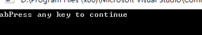
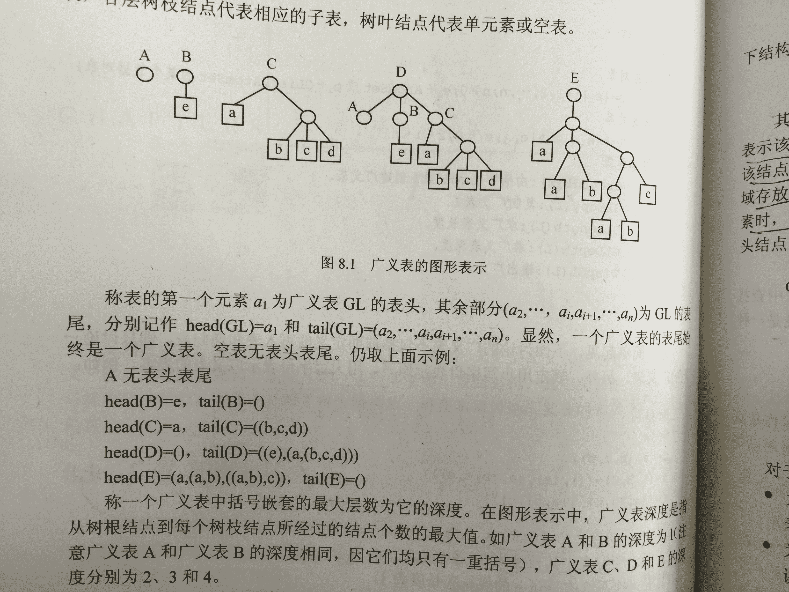
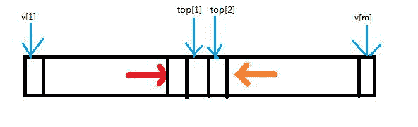
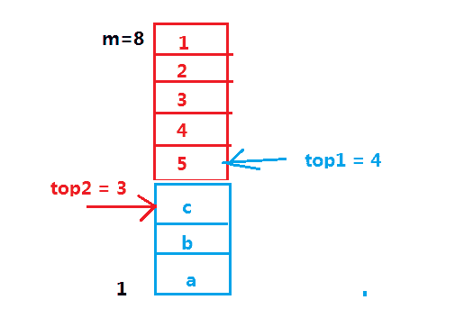

# C++入门级笔试题合集（二）

## 1

在 c++中的结构体是否可以有构造函数？

正确答案: B   你的答案: 空 (错误)

```cpp
不可以，结构类型不支持成员函数
```

```cpp
可以有
```

```cpp
不可以，只有类允许有构造函数
```

本题知识点

C++ C 语言

讨论

[湾仔秋秋糖](https://www.nowcoder.com/profile/797549)

C 中的结构体没有函数 但是 C++的结构体可以有函数；这是 C 与 C++结构体的区别。C++的结构体可以被类取代，因为类相对于结构体 具有封装性等优势。C++中结构体与类的区别：结构体中的成员访问权限不声明时候默认是 公开的；而类 是私有的

发表于 2015-09-05 16:50:39

* * *

[不学有术](https://www.nowcoder.com/profile/9502553)

可以存在。for example: // Definition for singly-linked list.  struct ListNode {      int val;      ListNode *next;      ListNode(int x) : val(x), next(NULL) {}  };

发表于 2016-10-19 14:37:44

* * *

[vector<>](https://www.nowcoder.com/profile/255171944)

*   在 c++中类和结构体的唯一区别是
    *   默认状态下，类中的成员默认是私有的，结构体中的成员默认是公有的。
*   c++中的结构体和 c 中的结构体的区别
    *   c++中的结构体引入了成员函数，继承，访问控制等面向对象的特性
    *   c 中的空结构体的大小为 0，c++中的空结构体和空类一样，大小是 1
*   c++中空类的大小是 1 的原因
    *   空类可以实例化成不同的对象，不同的对象在内存中的地址不同，所以隐含地加入一个字节来标识不同的对象。

编辑于 2020-03-07 20:36:38

* * *

## 2

以下程序的输出结果是：

```cpp
#include <iostream>
using namespace std;
void func(char **m){
    ++m;
    cout<<*m<<endl;
}
int main(){
    static char *a[]={"morning", "afternoon", "evening"};
    char **p;
    p=a;
    func(p);
    return 0;
}

```

正确答案: A   你的答案: 空 (错误)

```cpp
afternoon
```

```cpp
字符 o 的起始地址
```

```cpp
字符 o
```

```cpp
字符 a 的起始地址
```

本题知识点

C++

讨论

[阿尔曼](https://www.nowcoder.com/profile/935698)

p 二级指针，双指针就是二维数组，始终指向每行的首元素，p+1 就是二维数组加一行，*p+1 指向 p 所指向行数的下一个元素。本题 p 指向二维字符数组 a，二维数组的每行分别是三个字符串一维字符数组，起初 p 指向第一行 morning， p++指向 afternoon 所在行，由于打印字符串的首地址等于打印字符串，所以打印完整的 afternoon，而不是 a 的首地址。

发表于 2016-06-21 10:07:33

* * *

[guansdu](https://www.nowcoder.com/profile/7275268)

二级指针的问题，m=p，那么 m 指向第一个字符串，++m 指向第二个字符串。。。

表示 Delia 同学和 josan 同学的解析都是有问题的。

并没有这样的用法（Delia 同学错误的地方）：

```cpp
char a[3][10] = { "abc", "def", "ghi" };
// char **p = a; // 错了！！
```

表示高票很迷。。。要用也是

```cpp
char (*p1)[10] = &a[0]; // 现在 p1 指向 a 的第一行
cout << *(p1+1) << endl; // 输出 def
```

好了，现在我非要用二级指针可以吗？可以：

```cpp
char (**p2)[10] = &p1;
cout << *(*(p2) + 2) << endl; // 输出 ghi
```

下面说一下不对的用法：

```cpp
char (*p3)[10] = a; // 对的
char **p4 = p3; // 错了
++p4; // 错了
```

错在 p3 是 char (*)[10]类型，而 p4 是 char **类型，并不可以直接赋值。

个人理解，请多多指教，Thanks。

编辑于 2017-08-09 22:39:39

* * *

[Delia](https://www.nowcoder.com/profile/518496)

```cpp
这是一个关于二维数组指针的问题。
假设定义一个 int 型的二维数组指针。
int Sec[2][3]={4,6,3,7,2,7};
int **P = Sec; 
**p 等价 Sec[0][0]  *p 等价 Sec[0]  *(p+n) 等价 Sec[n] *(*(p+n)+m) 等价 Sec[n][m]
所以++m，为行数增加为 afternoon 一行，而*m 输出整行。
```

发表于 2015-09-05 15:51:02

* * *

## 3

若 PAT 是一个类，则程序运行时，语句“PAT(*ad)[3];”调用 PAT 的构造函数的次数是（ ）。

正确答案: C   你的答案: 空 (错误)

```cpp
2
```

```cpp
3
```

```cpp
0
```

```cpp
1
```

本题知识点

C++

讨论

[小喜菜鸟](https://www.nowcoder.com/profile/385259)

PAT(*ad)[3];  查看全部)

编辑于 2016-11-23 23:37:45

* * *

[大星星和小猩猩](https://www.nowcoder.com/profile/9374535)

PAT  (*ad)[3]：声明一个指向 3 个 PAT 类型的对象的指针，声明的是指针，并没有新的对象生成，所以构造函数调用的次数为 0；PAT * ad[3]：声明 3 个指针，每个指针都是指向一个 PAT 类型的对象，也是没有的新的对象产生，所以构造函数的调用次数为 0。

发表于 2018-03-20 15:51:27

* * *

[Delia](https://www.nowcoder.com/profile/518496)

考察构造函数的调用次数.pat (*obj)[3]; 定义三个指向 pat 类型 object 的指针，所以构造函数调用次数为 0 假如改为 pat obj[3],则调用 3 次。

```cpp
验证程序
```

```cpp
#include<iostream>
using namespace std;
class pat
{
	public:
	pat(){ cout << "instruct the pat object" << endl; };
};
int main(){

	pat (*obj)[3];
	system("pause");
}
```

发表于 2015-09-05 16:02:56

* * *

## 4

下列哪项不属于 C++的基本数据类型？

正确答案: A   你的答案: 空 (错误)

```cpp
wide
```

```cpp
char
```

```cpp
bool
```

本题知识点

C++

讨论

[bug 制造者~+~挖坑小能手](https://www.nowcoder.com/profile/9752054)

C 的基本数据类型：实型，整型，char 型 C++基本数据类型：实型，整型，char 型，bool 型

发表于 2018-05-05 12:40:12

* * *

[牛客 230850 号](https://www.nowcoder.com/profile/230850)

用的排除法。因为 char 和 bool 都属于 C++的基本数据类型，所以选的 A。

发表于 2016-08-10 17:14:53

* * *

[牛客 71457097 号](https://www.nowcoder.com/profile/71457097)

排除法，只有 wide 没有见过，所以选 A

发表于 2021-09-16 21:41:49

* * *

## 5

T 是一个数据类型，关于 std::vector::at 和 std::vector::operator[] 描述正确的是：

正确答案: A   你的答案: 空 (错误)

```cpp
at 总是做边界检查， operator[] 不做边界检查.
```

```cpp
at 不做边界检查， operator[] 做边界检查.
```

```cpp
at 和 operator[] 是一样的
```

本题知识点

C++ C 语言

讨论

[Delia](https://www.nowcoder.com/profile/518496)

访问 vector 中的数据
使用两种方法来访问 vector。
1、   vector::at()
2、   vector::operator[]
operator[]主要是为了与 C 语言进行兼容。它可以像 C 语言数组一样操作。但 at()是我们的首选，因为 at()进行了边界检查，如果访问超过了 vector 的范围，将抛出一个例外。由于 operator[]容易造成一些错误，所有我们很少用它，下面进行验证一下：
分析下面的代码：

```cpp
vector<int> v;
v.reserve(10);

for(int i=0; i<7; i++)
    v.push_back(i);

try
{
 int iVal1 = v[7]; // not bounds checked - will not throw
 int iVal2 = v.at(7); // bounds checked - will throw if out of range
}
catch(const exception& e)
{
 cout << e.what();
}
```

参考网址 http://www.cnblogs.com/yxnchinahlj/archive/2011/03/06/1972435.html

发表于 2015-09-05 16:07:26

* * *

[MSean](https://www.nowcoder.com/profile/231467)

答案：**选 A**；**结论**：**at()总是做边界检查，下标运算符（operator[] ）不做边界检查。****解析**（详情参看 《C++ Primer》(第 5 版) P310 ”**下标操作和安全的随机访问**“）**：**       提供快速随机访问的容器（如：**string、vector、deque 和 array**）也都提供下标运算符（operator [ ]）。       一、下标运算符接受一个下标参数，返回容器中该位置的元素的引用。给定下标必须保证”**在范围内**“（即，**大于等于 0，且小于容器的大小**）。保证下标有效是**程序员的责任**，下标运算符并不检查下标是否在合法范围内。使用越界的下标是一种严重的程序设计错误，而且编译器并不检查这种错误。       **c[n]     :  返回 c 中下标为 n 的元素的引用，n 是一个无符号整数。若 n>=c.size()，则函数行为未定义。**       二、如果希望确保下标是合法的，可以使用**at 成员函数**。at 成员函数类似下标运算符，但如果下标越界，at 会抛出一个 out_of_range 异常。      ** c.at(n)： 返回下标为 n 的元素的引用。如果下标越界，则抛出一个 out_of_range 异常。**如：

```cpp
vector<string> sVec; // 空 vector
cout << sVec[0];     // 运行时错误：sVec 中没有元素！
cout << sVec.at(0);  // 抛出一个 out_of_range 异常
```

发表于 2016-12-11 14:56:35

* * *

[Felix_Jessica](https://www.nowcoder.com/profile/861361)

```cpp

	见《C++Primer》P310：c[n]操作若 n>=c.size(),则函数行为未定义；
c.at(n)操作，如果下标越界，则抛出 out_of_range 异常

```

发表于 2016-04-28 14:22:09

* * *

## 6

使用操作符 setw() 对数据进行格式输出时，应包含（ ）文件。

正确答案: D   你的答案: 空 (错误)

```cpp
fstream.h
```

```cpp
stdlib.h
```

```cpp
iostream.h
```

```cpp
iomanip.h
```

本题知识点

C++ C 语言

讨论

[MSean](https://www.nowcoder.com/profile/231467)

关于**格式化输入与输出**，标准库定义了一组**操纵符**（**manip**ulator）来修改流的格式状态。（可参见《C++ Primer》 P666 ”格式化输入与输出“）**这些操纵符（如 setprecision 以及其他接受参数的操纵符）都定义在头文件 iomanip 中**。（《C++ Primer》 P669）（可根据**IO**库中操纵符的英文书写**manipulator**来记住该头文件名称：**iomanip.h**）

发表于 2016-12-11 17:08:55

* * *

[Delia](https://www.nowcoder.com/profile/518496)

使用操作符对数据进行格式输出时，必须包含 iomanip.h 头文件

发表于 2015-09-05 16:13:44

* * *

[huixieqingchun](https://www.nowcoder.com/profile/551201)

**使用运算符对数据进行格式输出时，必须要包含 iomanip.h 头文件。**

发表于 2016-05-22 16:47:33

* * *

## 7

如果函数不需要任何返回值，使用什么形式的函数声明？

正确答案: B   你的答案: 空 (错误)

```cpp
myfunction()
```

```cpp
void myfunction()
```

```cpp
myfunction(void)
```

本题知识点

C++ C 语言

讨论

[如风。](https://www.nowcoder.com/profile/805229704)

void myFunction()//前面的 void 就是说,这个函数返回一个类型,这个类型就是没有类型的空类型...

另外 void 也用于声明一些万能指针. 比如你要用一个指针,但是还不确定这个指针会指向什么类型的变量,那就申请一个 void 类型的指针,它就叫做万能指针,因为它可以指向任何类型的变量.

发表于 2019-08-29 09:26:14

* * *

[华中第一狠人程德彪](https://www.nowcoder.com/profile/616662)

送分题，过

发表于 2016-12-31 16:09:04

* * *

[xy898989](https://www.nowcoder.com/profile/559320673)

不考虑构造函数的吗？？

发表于 2018-08-10 11:05:10

* * *

## 8

以下程序的输出结果是：

```cpp
#include <iostream.h>
int main()
{
    int x=3,y=3;
    switch(x%2)
    {
    case 1:
        switch (y)
        {
        case 0:
            cout<<"first";
        case 1:
            cout<<"second";
            break;
        default:
            cout<<"hello";
        }
    case 2:
        cout<<"third";
    }
    return 0;
}
```

正确答案: D   你的答案: 空 (错误)

```cpp
second third
```

```cpp
hello
```

```cpp
first second
```

```cpp
hellothird
```

本题知识点

C++

讨论

[牛客职导官方账号](https://www.nowcoder.com/profile/897353)

【正确答案】D
【解析】第一个  查看全部)

编辑于 2021-11-18 08:35:49

* * *

[牛客 625477 号](https://www.nowcoder.com/profile/625477)

不仅第一个满足 switch 的那个 case 里面的东西会被执行，而且只要没有遇到 break，这个 case 下面的所有 case 都会被执行 case1 的最后面没有 break，所以没有跳出最外面的 switch，输出了 third。case1 里面的 switch，满足条件时恰好是最后一个 case，输出了 hello，因此没 break 也只输出了一个

发表于 2016-02-19 14:21:30

* * *

[西新](https://www.nowcoder.com/profile/2133277)

swich 语句从哪进直到 break 退出 x=3.swich(x%2)语句，x%2 取余是 1，逻辑语句为真，进入 case1:swich(y)语句，此时 y=3，进入 default 语句，输出 hello,但此没有 break 程序没结束，再次进入 swich(x%2)语句中的 case 2： 输出 third 程序才结束

发表于 2017-08-20 18:36:12

* * *

## 9

下列字符串可以用作 C++标识符的是：

正确答案: A   你的答案: 空 (错误)

```cpp
_123
```

```cpp
2009var
```

```cpp
goto
```

```cpp
test - 2009
```

本题知识点

C++

讨论

[上善若水，道法自然](https://www.nowcoder.com/profile/5814012)

标识符标识符用来表示函数、类型及变量的名称，是字母、下划线和数字的排列。1、必须用字母或下划线开头。2、只能是字母、下划线、数字的组合，不能出现其他符号。2、大小写的含义是不同的。3、标识符的名称不能是 C 语言中的关键字，关键字是具有特定含义的标识符

发表于 2016-09-01 13:18:32

* * *

[Delia](https://www.nowcoder.com/profile/518496)

```cpp
第一个字符必须是字母或者是下划线。
除了第一个字符外，由字符、数字、下划线组成。
另外 C99 的标准中除第一个字符外可以使用$ 即美元符。
```

编辑于 2015-09-05 16:21:11

* * *

[良人轻薄年未归](https://www.nowcoder.com/profile/127862757)

只能是字母数字下划线的组合，开头不能为数字，区分大小写，不能是关键字

编辑于 2022-03-06 14:26:12

* * *

## 10

以下说法中正确的是（ ）。

正确答案: B   你的答案: 空 (错误)

```cpp
C++程序中的 main()函数必须放在程序的开始部分
```

```cpp
C++程序的入口函数是 main 函数
```

```cpp
在 C++程序中，要调用的函数必须在 main()函数中
```

本题知识点

C++

讨论

[saif](https://www.nowcoder.com/profile/204170)

我觉得此题没答案定义全局的类实例时，该类的构造函数比 main 先执行

发表于 2015-09-05 20:20:35

* * *

[玩 pubg 大佬请带我](https://www.nowcoder.com/profile/8104236)

有的程序不一定需要 main

发表于 2019-04-30 15:05:06

* * *

[Chr1sGardn3r](https://www.nowcoder.com/profile/3493719)

是的，这题不好，并不是所有的程序都是从 main 函数开始的

发表于 2016-11-19 19:10:49

* * *

## 11

STL 中的一级容器有:

正确答案: D   你的答案: 空 (错误)

```cpp
vector, deque, list, set, multiset, map, multimap.
```

```cpp
序列容器，关联容器，容器适配器
```

```cpp
set, multiset, map, multimap.
```

```cpp
vector, deque, list.
```

本题知识点

C++

讨论

[For-Happy](https://www.nowcoder.com/profile/205070)

STL 中一级容器是指, 容器元素本身是基本类型, 非组合类型。set, multiset 中元素类型是 pair<key_type, key_type>;map, multimap 中元素类型是 pair<key_type, value_type>;

发表于 2015-09-14 10:38:54

* * *

[Delia](https://www.nowcoder.com/profile/518496)

STL 中的常用容器包括：顺序性容器（vector、deque、list）、关联容器（map、set）、容器适配器（queue、stac）。

发表于 2015-09-05 16:25:25

* * *

[huixieqingchun](https://www.nowcoder.com/profile/551201)

**STL 中一级容器是容器元素本身是基本类型，非组合类型。**

发表于 2016-05-24 19:25:57

* * *

## 12

如果有一个类是 myClass , 关于下面代码正确描述的是:

```cpp
myClass::~myClass(){
delete this;
this = NULL;
}
```

正确答案: C   你的答案: 空 (错误)

```cpp
正确，我们避免了内存泄漏
```

```cpp
它会导致栈溢出
```

```cpp
无法编译通过
```

```cpp
这是不正确的，它没有释放任何成员变量。
```

本题知识点

C++ C 语言

讨论

[jason1990](https://www.nowcoder.com/profile/155028)

[图]此处代码可以看  查看全部)

编辑于 2016-05-19 12:04:00

* * *

[huixieqingchun](https://www.nowcoder.com/profile/551201)

**编译不通过主要是语句 this=NULL; ****因为类的构造函数中，this 指针的形式为 Myclass *const this; 它是一个常量指针，指针的指向不能修改。**

发表于 2016-05-23 14:33:03

* * *

[weicon](https://www.nowcoder.com/profile/737593)

delete 的过程实际是先调用析构函数，然后释放内存在析构函数内调用 delete 会造成递归调用，

发表于 2015-10-03 20:07:27

* * *

## 13

上下文及头文件均正常的情况下，以下程序的输出结果是 ________。

```cpp
void fut(int**s,int p[2][3]) {
    **s=p[1][1];
}
void main( ) {
    int a[2][3]={1,3,5,7,9,11},*p;
    p=(int*)malloc(sizeof(int));
    fut(&p,a);
    cout<< *p;
}
```

正确答案: B   你的答案: 空 (错误)

```cpp
7
```

```cpp
9
```

```cpp
1
```

```cpp
11
```

本题知识点

C++ C 语言

讨论

[Echo001](https://www.nowcoder.com/profile/363046)

 **s=a[1][1]; ————> *s=p; *(*s)=a[1][1]; 就是 a[1][1]的值.

发表于 2016-08-01 22:58:02

* * *

[ZeeCoder](https://www.nowcoder.com/profile/236024)

好吧  被自己蠢到了。a[1][1]。。。当成 a[1][0]了。

发表于 2016-04-21 15:02:00

* * *

[天真的德鲁伊](https://www.nowcoder.com/profile/787744)

这题的重点不应该是引用以及二级指针么？为什么都拉着 a[1][1]不放。

发表于 2016-06-04 15:56:26

* * *

## 14

在下列排序算法中，哪几个算法的时间复杂度与初始排序无关()

正确答案: B D E   你的答案: 空 (错误)

```cpp
插入排序
```

```cpp
堆排序
```

```cpp
冒泡排序
```

```cpp
归并排序
```

```cpp
选择排序
```

None

讨论

[小虎牙](https://www.nowcoder.com/profile/512935)

自己总结的口诀：选快希堆不稳（是不稳定的排序），                            堆归选基均不变（运行时间不发生变化，与初始状态无关）

发表于 2015-12-08 09:42:24

* * *

[行走的瓜牛](https://www.nowcoder.com/profile/506979)

选堆快希不稳 选堆归基不变 感觉这样更好记。

发表于 2016-09-20 18:56:24

* * *

[天行健 _ 地势坤](https://www.nowcoder.com/profile/5233216)

直接插入排序：

算法思想：将第 i 个记录插入到前面已经排好序的 i - 1 个记录中去。
算法要点：

*   使用监视哨 r[0]临时保存带插入记录
*   从后往前查找应插入的位置
*   查找与移动用同一循环完成

算法时间复杂度：o(n²)

折半插入排序：

算法思想：利用折半查找的思想找到需要插入的位置
算法时间复杂度：o(n²)，虽然减少了查找插入位置的次数，但是移动元素的时间仍未改变

希尔排序：

算法思想：将待排序的关键字序列分成若干个较小的子序列，对子序列进行直接插入排序，使整个待排序序列排好序。
算法时间复杂度：o(n¹.5)

快速排序：

算法思想：从待排序记录中选择一个记录为枢纽，设为 K，将其余大于 K 的记录移动至 K 的后面，小于 K 的移动至前面，此过程称为一趟快速排序。当然就是对接下来的两个字表进行相同的操作，直到子表的长度不超过 1
算法时间复杂度：o(Knlog2n),K 为常数因子，且在所有 O(nlogn)复杂度中,快排的 K 值最小

简单选择排序：

算法思想：
第一趟：从第一个记录开始，通过 n-1 次关键字比较，从 n 个记录中选出最小的并和第一个记录交换；
第二趟：从第二个记录开始，通过 n-2 次关键字比较，从 n -1 个记录中选出最小的并和第二个记录交换；
...
算法时间复杂度：o(n²)

堆排序：

算法思想：将向量中存储的数据看成一棵完全二叉树，利用完全二叉树中双亲节点和孩子节点之间的内在关系选择关键字最小的记录。
大根堆：各节点关键字满足：a[i] >= a[2*i]并且 a[i] >= a[2*i + 1]
小根堆：各节点关键字满足：a[i] <= a[2*i]并且 a[i] <= a[2*i+1]
算法时间复杂度：o(nlogn)

归并排序：

算法思想：设初始序列长度为 n,将这 n 个序列看成 n 个有序的子序列，然后辆辆合并，得到一个 ceil(n/2)长度为 2 的有序子序列。
在此基础上再对长度为 2 的有序子序列进行归并排序，得到若干长度为 4 的子序列，如此重复直到得到一个长度为 n 的有序子序列为止

时间复杂度：o(nlogn)

选堆快希不稳（稳定性） 选堆归基不变（时间复杂度的变化特性）

发表于 2017-09-12 23:28:55

* * *

## 15

下面的程序输出可能是什么?

```cpp
class Printer{
    public:
        Printer(std::string name) {std::cout << name;}
};
class Container{
    public:
        Container() : b("b"), a("a") {}
    Printer a;
    Printer b;
};
int main(){
    Container c;
    return 0;
}
```

正确答案: C   你的答案: 空 (错误)

```cpp
可能是 "ab" 或 "ba"。 依赖于具体的实现
```

```cpp
一直都是 "ba"
```

```cpp
一直都是 "ab"
```

本题知识点

C++

讨论

[风清扬](https://www.nowcoder.com/profile/202969)

初始化列表要注意，这道题故意写成 b("b"), a("a") ，其实还是按类中声明变量的先后顺序来初始化，与初始化列表的顺序无关。

发表于 2015-09-13 10:28:13

* * *

[大菜鸟大菜狗](https://www.nowcoder.com/profile/905766)

答案 C:一直都是 ab。
派生类实例化时，先调用基类的构造函数，然后是派生类的类成员变量构造函数（构造的顺序是按照成员变量的定义先后顺序，而不是按照初始化列表的顺序），最后是派生类的构造函数。
程序中，先定义了 Printer a;后定义了 Printer b;所以输出一定是 ab。

```cpp
#include<iostream>
#include<string>
using namespace std;
class Printer{
    public:
        Printer(std::string name) {std::cout << name;}
};
class Container{
    public:
        Container() : b("b"), a("a") {}
    Printer a;
    Printer b;
};
int main(){
    Container c;
    return 0;
} 
```



发表于 2015-09-05 12:38:53

* * *

[不再做蜡笔小熊啦~](https://www.nowcoder.com/profile/262375)

初始化列表的初始化顺序  ***与在列表中的顺序无关，由变量在类中定义的先后顺序决定***

发表于 2016-06-20 10:08:34

* * *

## 16

在重载一个运算符为成员函数时，其参数表中没有任何参数，这说明该运算符是 （ ）。

正确答案: C   你的答案: 空 (错误)

```cpp
无操作数的运算符
```

```cpp
二元运算符
```

```cpp
前缀一元运算符
```

```cpp
后缀一元运算符
```

本题知识点

C++

讨论

[Delia](https://www.nowcoder.com/profile/518496)

首先可以判断是一元操作符。

```cpp
因为++和--有前缀和后缀两种形式，为了区分，要求在后缀形式加一个 int 参数。  const Fraction operator ++(int)   中 int 不过是个哑元（dummy）,是永远用不上的，它只是用来判断＋＋是 prefix  还是  postfix  。如果有哑元，则是 postfix,否则，就是 prefix 。 
```

发表于 2015-09-05 16:46:36

* * *

[北城北](https://www.nowcoder.com/profile/5090344)

如果重载函数是  A operator++(int)  表示重载后缀++ 即是 a++如果重载函数是  A operator++()  表示重载前缀++ 即是 ++a

发表于 2017-08-18 12:57:58

* * *

[sun_guanghui](https://www.nowcoder.com/profile/846603)

(1) 双目运算符重载为类的成员函数时，函数只显式说明一个参数，该形参是运算符的右操作数。(2) 前置单目运算符重载为类的成员函数时，不需要显式说明参数，即函数没有形参。(3) 后置单目运算符重载为类的成员函数时，函数要带有一个整型形参。

发表于 2016-09-03 18:13:31

* * *

## 17

在 C++中，下列不正确的转义字符是（ ）

正确答案: B   你的答案: 空 (错误)

```cpp
'\\'
```

```cpp
'074'
```

```cpp
'\t'
```

```cpp
'\0'
```

本题知识点

C++

讨论

[夏雨天](https://www.nowcoder.com/profile/710633)

选择 B：A 转义字符，就是反斜线字符\B 错误，内容是 3 个字符，如果是'\074'则是正确的 8 进制转义 '\074'才是转义字符 C 跳到下一制表区 D 字符串的末尾

编辑于 2015-09-07 16:08:29

* * *

[牛客 887073 号](https://www.nowcoder.com/profile/887073)

074 表示八进制整数，不是转义字符。转义字符的定义为：所有的 [ASCII 码](http://baike.baidu.com/view/812.htm) 都可以用“\”加数字（一般是 8 进制数字）来表示。而 C 中定义了一些字母前加"\"来表示常见的那些不能显示的 ASCII 字符，如\0,\t,\n 等，就称为转义字符，因为后面的字符，都不是它本来的 ASCII 字符意思了。

发表于 2015-09-06 00:14:02

* * *

[_Micheal_](https://www.nowcoder.com/profile/7982054)

‘\o’表示跳到字符串的末尾，‘\074’是正确的 8 进制转义字符

发表于 2017-08-10 20:06:34

* * *

## 18

已知 fun(int)是类 Test 的公有成员函数，p 是指向成员函数 fun()的指针，采用（ ）是正确的。

正确答案: D   你的答案: 空 (错误)

```cpp
p=fun
```

```cpp
p=Test::fun()
```

```cpp
p=fun()
```

```cpp
p=&Test::fun
```

本题知识点

C++ C 语言

讨论

[rppp](https://www.nowcoder.com/profile/9542322)

所有的函数若加上()，则表示调用，不加()表示该函数本身

发表于 2017-07-25 22:46:10

* * *

[revivedSuN](https://www.nowcoder.com/profile/141075)

对成员函数指针的调用    指向公有非静态的成员函数，调用时必须创建一个对象。
class Container{    public:    void print(){        printf("printf()");    }};int main(){    void (**Container::***p)();             //指明是指向成员函数的指针    p = **&Container::print;**    Container c;    **(c.*p)();**    return 0;}指向静态函数 class Container{    public:    static void print(){        printf("printf()");    }};int main(){    void (*p)();    p = &Container::print;    p();    return 0;}

发表于 2015-09-06 15:22:01

* * *

[放牛郎与天仙女](https://www.nowcoder.com/profile/782521)

p = &Test::fun;这个答案才对吧。

发表于 2015-09-22 13:13:30

* * *

## 19

类模板的使用实际上是类模板实例化成一个具体的 __________。

正确答案: A   你的答案: 空 (错误)

```cpp
类
```

```cpp
函数
```

```cpp
模板类
```

```cpp
对象
```

本题知识点

C++

讨论

[阳光下的时光](https://www.nowcoder.com/profile/9372137)

类模板的使用实际上是先将类模板实例化为模板类，再实例化成一个具体的类。

发表于 2017-04-05 15:46:06

* * *

[champagnelee](https://www.nowcoder.com/profile/750004)

模板类是类模板实例化的产物，这道题 A、C 应该都是正确的。

发表于 2016-05-30 08:47:14

* * *

[Puyo](https://www.nowcoder.com/profile/841020205)

类模板：            template<class T>            class A {};类模板的使用实际上是给定 T 之后确定一个新类。虽然不同 T 的类执行的功能一样，但是给定 T 的不同使得这些类里参数类型不同。模板类是针对与类模板来说的。例如 vector<int> vec；这是一个模板类实例化出一个对象 vec 所以类模板的使用实际上是类模板实例化成一个具体的类

发表于 2019-05-29 08:12:32

* * *

## 20

全局变量是在所有函数外部的源代码内声明的变量，而局部变量是？

正确答案: B   你的答案: 空 (错误)

```cpp
都是
```

```cpp
在函数内部或代码块内部声明的变量
```

```cpp
在函数主体代码的外部声明的变量
```

本题知识点

C++

讨论

[rs 勿忘初心](https://www.nowcoder.com/profile/7491640)

      局部变量可以与全局变量重名，但是局部变量会屏蔽全局变量。要使用全局变量，需要使用::。在函数体内引用变量会用到同名的局部变量而不是全局变量，对于一些编译器来说，在同一个函数体内可以定义多个同名的局部变量。例如我们可以在一个函数内部，在两个循环中都定义同名的局部变量 i，而局部变量 i 的作用域在那个循环体内

       具体来说，全局变量和局部变量的区别如下：

1\. 作用域不同：全局变量的作用域为整个程序，而局部变量的作用域为当前函数或循环等

2\. 内存存储方式不同：全局变量存储在全局数据区中，局部变量存储在栈区

3\. 生命期不同：全局变量的生命期和主程序一样，随程序的销毁而销毁，局部变量在函数内部或循环内部，随函数的退出或循环退出就不存在了

4\. 使用方式不同：全局变量在声明后程序的各个部分都可以用到，但是局部变量只能在局部使用。函数内部会优先使用局部变量再使用全局变量

编辑于 2017-06-11 21:47:14

* * *

[R0b1n](https://www.nowcoder.com/profile/9885630)

c 说的是不是形参？ 形参到底怎么算？

发表于 2016-07-10 10:08:22

* * *

[潇湘之恋](https://www.nowcoder.com/profile/913188)

b

发表于 2015-09-29 11:06:15

* * *

## 21

在上下文及头文件均正常的情况下，下面代码的输出是什么?

```cpp
auto fn = [](unsigned char a){ 
    cout << std::hex << (int)a << endl; 
};
fn(-1);
```

正确答案: A   你的答案: 空 (错误)

```cpp
ff
```

```cpp
256
```

```cpp
-1
```

```cpp
Undefined
```

```cpp
0
```

本题知识点

C++ C 语言

讨论

[笑斗涯](https://www.nowcoder.com/profile/505884)

int 型-1 的存储方式为补码（32 位，4 字节），1111 1111 1111 1111 1111 1111 1111 1111 转换为 unsigned char（8 位，1 字节）发生字节截断，取最后八位为 1111 1111 再转换为 int 后为 0000 0000 0000 0000 0000 0000 1111 1111 即为 ff

发表于 2015-09-08 22:26:58

* * *

[MSean](https://www.nowcoder.com/profile/231467)

题干中形式为 C++11 标准里引入的 lambda 表达式；一个**lambda**表达式**表示一个可调用的代码单元，也可将其理解为一个未命名的内联函数**。（引入它的便利之处大家可自行 search）其基本形式如下：**[capture list** **] ( parameter list ) -> return type { function body }  **即：**[捕获列表] ( 参数列表 ) -> 返回类型 { 函数体 }****1、capture list （捕获列表）**是一个 lambda 所在函数中定义的局部变量的列表（通常为空，写为 [] )，空捕获列表即表明此 lambda 不使用它所在函数中的任何局部变量；**2、" -> "** 表明 lambda 使用了尾置返回类型；**3、可以忽略参数列表和返回类型，但必须永远包含捕获列表和函数体**；比如：       auto f = [ ] { return 42; }; // 定义了一个可调用对象 f，它不接受参数，返回 42。
       即常见形式如： [ ] { 函数体 }    或     [ ] ( int n ) { 函数体 }  ...关于本题的实际解答其他朋友已解释的很详细，不再细表。

编辑于 2016-08-29 23:37:34

* * *

[杨小千](https://www.nowcoder.com/profile/445100)

-1 = 1000 0001 存储的是补码形式①反码是 1111 1110【符号位不变，其他位取反】②补码是 1111 1111【反码加 1】然后 std::hex 以十六进制显示【1111 1111】

发表于 2015-09-11 20:46:10

* * *

## 22

在下列语句中会执行什么操作？x == y;

正确答案: A   你的答案: 空 (错误)

```cpp
检查 x 和 y 是否相等
```

```cpp
将 y 的值赋值给 x
```

```cpp
表示 x 除以 y
```

```cpp
x 和 y 互相排斥
```

本题知识点

C 语言

讨论

[钉子](https://www.nowcoder.com/profile/506749)

这道题出的，单单这个语句怎么检测 X 与 Y 是否相等，应该把该语句作为一个表达式的右值或者直接判断该语句的值，然后结果为 1 则 相等，为 0 则不等·····

发表于 2015-11-10 14:34:01

* * *

[龙小弟呀](https://www.nowcoder.com/profile/433784541)

这是啥子垃圾题目？单单一个 x==y 语句它就是错的呀

发表于 2020-02-20 17:22:08

* * *

## 23

下列选项中，能正确定义数组的语句是：

正确答案: A   你的答案: 空 (错误)

```cpp
#define N 2008 

int num[N];
```

```cpp
int N=2008;
```

```cpp
int num[0..2008];
```

```cpp
int num[];
```

本题知识点

C++

讨论

[Delia](https://www.nowcoder.com/profile/518496)

int num[]  错误，因为不能定义即没有数组大小，又没有初始化的数组。应改为 int num[]={5,8,5}或者 int num[4].

发表于 2015-09-05 16:35:42

* * *

[华中第一狠人程德彪](https://www.nowcoder.com/profile/616662)

嗯，对于二维数组，一定要记住列数不能省，行数可以省

发表于 2017-01-02 10:15:11

* * *

[考研驸马](https://www.nowcoder.com/profile/425243305)

#define 定义预编译处理时的宏（只进行简单的字符替换无类型检测），typedef 定义类型别名，用于处理复杂类型 inline 内联函数，对编译器提出建议是否进行宏替换，编译器有权拒绝。参见：[`www.cnblogs.com/iloveyoucc/archive/2012/03/18/2404658.html`](https://www.cnblogs.com/iloveyoucc/archive/2012/03/18/2404658.html)

发表于 2019-07-21 14:17:42

* * *

## 24

有如下程序：

```cpp
#include<iostream>
using namespace std;
class MyClass{
    public:
        MyClass(int i=0){cout<<1;}
        MyClass(const MyClass&x){cout<<2;}
        MyClass& operator=(const MyClass&x){cout<<3; return*this;}
        ~MyClass(){cout<<4;}
};
int main(){
    MyClass obj1(1),obj2(2),obj3(obj1);
    return 0;
}
```

运行时的输出结果是

正确答案: B   你的答案: 空 (错误)

```cpp
121,444
```

```cpp
112,444
```

```cpp
11,114,444
```

```cpp
11,314,445
```

```cpp
11,314,444
```

本题知识点

C++

讨论

[杨松宝](https://www.nowcoder.com/profile/155159)

MyClass obj1(1),obj2(2),obj3(obj1);
obj1(1)，obj2(2)会调用构造函数 MyClass(int i=0){cout<<1;}输出 11；
obj3(obj1)，这是一个拷贝构造，会调用拷贝构造函数 MyClass(const MyClass&x){cout<<2;}输出 2；

程序返回会调用析构函数~MyClass(){cout<<4;}，析构的顺序与构造的顺序相反，都输出 4
所以答案是 112444

编辑于 2015-09-07 12:10:38

* * *

[牛客 515501 号](https://www.nowcoder.com/profile/515501)

obj(1),obj(2)会调用相应的构造函数 MyClass(int i=0){cout<<1;}输出 11； ，obj3(obj1)这是一个浅拷贝操作，因此调用的是拷贝构造函数 MyClass(const MyClass&x){cout<<2;}输出 2；如果写为 MyClass  obj3； obj3= obj1，则会深拷贝，这样就会调用 MyClass& operator=(constMyClass&x){cout<<3; return*this;}。执行完拷贝函数后，再执行析构函数，注意析构函数的执行顺序和构造函数相反。

发表于 2016-07-29 16:34:48

* * *

[666 的佩奇爸爸](https://www.nowcoder.com/profile/7670357)

```cpp
class MyClass  
{  
    public:      
        MyClass(int i=0){cout<<1;}      //定义带一个默认参数的构造函数  
        MyClass(const MyClass&x){cout<<2;}  //这是复制构造函数，当使用复制初始化对象的时候，会  
    调用这个构造函数来初始化对象  
        MyClass&operator=(const MyClass&x){cout<<3;return*this;} //这是重载的赋值操作符，当程序中  
    出现对象赋值(就是使用=)的时候，会调用这个函数  
        ～MyClass(){cout<<4;}        //这是析构函数，当对象消失时会调用这个函数  
};  
int main()  
{  
        //把下面的三个语句分开写，方便解释  
        MyClass obj1(1);    //调用构造函数 MyClass(int i=0)初始化对象 obj1，这个函数输出的是 1，因此，程序输出 1  
        MyClass obj2(2);    //同上，调用 MyClass(int i=0)初始化对象，输出 1  
        MyClass obj3(obj1);     //使用 obj1 对象来初始化 obj3 对象，这里是属于复制初始化的情形，会调用复制构造函数 MyClass(const MyClass&x)，因此，在这里会输出 2  
        return 0;  
}//因为创建了 3 个对象：obj1、obj2、obj3，在这里 3 个对象都会消失，因此，会调用三次析构函数，因此，会输出 3 次 4 

```

发表于 2018-07-12 17:23:24

* * *

## 25

广义表 L=（a，（b，c）），进行 Tail（L）操作后的结果为（ ）。

正确答案: B   你的答案: 空 (错误)

```cpp
c
```

```cpp
（（b，c））
```

```cpp
b，c
```

```cpp
（b，c）
```

本题知识点

高级结构

讨论

[龙之语](https://www.nowcoder.com/profile/105951)



发表于 2015-09-08 10:57:07

* * *

[Nebulaliu](https://www.nowcoder.com/profile/209746)

选 B

1.  取表头：取出的表头为非空广义表的第一个元素，它可以是一个单原子，也可以是一个子表。
2.  取表尾：取出的表尾为除去表头之外，由其它元素构成的表。**重点是表尾一点是一个广义表。**

发表于 2015-09-20 20:01:01

* * *

[pengfeituan](https://www.nowcoder.com/profile/807993)

答案真的对么？感觉广义表这几题都不对吧，tail 是取除了第一个元素外的子表的吧。。。

发表于 2015-09-05 14:08:25

* * *

## 26

已知广义表 LS＝((a,b,c),(d,e,f)),运用 head 和 tail 函数取出 LS 中原子 e 的运算是( )。

正确答案: A   你的答案: 空 (错误)

```cpp
head(tail(head(tail(LS))))
```

```cpp
head(tail(LS))
```

```cpp
head(tail(tail(head(LS))))
```

```cpp
tail(head(LS))
```

本题知识点

链表 *讨论

[Erya_ 尔雅](https://www.nowcoder.com/profile/412110)

**根据表头、表尾的定义可知：任何一个非空广义表的表头是表中第一个元素，它可以是原子，也可以是子表，而其表尾必定是子表。****也就是说，广义表的 head 操作，取出的元素是什么，那么结果就是什么。但是 tail 操作取出的元素外必须加一个表——“** **（）“**已知广义表 LS＝((a,b,c),(d,e,f))故: tail(LS)＝((d,e,f))      head(tail(LS))=(d,e,f)      tail(head(tail(LS)))=(e,f)      head(tail(head(tail(LS))))=e 综上：A 比较接近，但是少了个反括号”）“

发表于 2015-11-18 13:23:10

* * *

[牛牛 12315](https://www.nowcoder.com/profile/309704)

选 ALS＝((a,b,c),(d,e,f)) 注意外层的括号 tail(LS) = （（d,e,f））head(tail(LS) = （d,e,f）tail(head(tail(LS)))= e,fhead(tail(head(tail(LS))))  = e

发表于 2015-09-06 15:13:43

* * *

[玄学求 offer~](https://www.nowcoder.com/profile/259973278)

***head 是取广义表的第一个元素（外层的括号去除），tail 是取去掉第一个元素******以后******的所有尾部元素（注意外层的括号不能去除）***广义表 LS=((a,b,c),(d,e,f))tail(LS)=((d,e,f))   这里有两层括号，所以下面要用到 head 去掉外层的括号 head(tail(LS))=(d,e,f)tail(head(tail(LS) )) = (e,f)head(tail( head(tail(LS) ) )) = e

发表于 2019-03-02 12:15:28

* * *

## 27

已知一个有序表为（12，18，24，35，47，50，62，83，90，115，134），当折半查找值为 90 的元素时，经过（）次比较后查找成功。

正确答案: B   你的答案: 空 (错误)

```cpp
5
```

```cpp
2
```

```cpp
3
```

```cpp
4
```

本题知识点

查找 *讨论

[牛客 107952 号](https://www.nowcoder.com/profile/107952)

```cpp
//折半查找代码
		public int findvalue1(int[] arr,int key){
			int low = 1;
			int high = arr.length-1;
			while(low<=high){
					int mid = (high+low)/2;
					if(arr[mid]<key){
						low=mid+1;
					}else{
						if(arr[mid]>key){
							high=mid-1;
						}else{
							return mid;
						}
					}
				}
			return -1;
		} 
```

     0      1     2     3     4      5      6      7     8      9       10（12，18，24，35，47，50，62，83，90，115，134）      key=90;第一次查找，mid=（0+10）/2=5, arr[mid]=50; 此时 arr[mid]<key      这是第一次比较，然后 low=mid+1=6。第二次查找，mid=(6+10)/2=8, arr[mid]=90;  此时 arr[mid]=key      这是第二次比较，找到 key 值，返回 mid

发表于 2016-08-03 21:46:31

* * *

[嗵畵搧篨中](https://www.nowcoder.com/profile/193533)

问的是比较次数，不是查找次数啊，为什么大家都选 2 呢。。

发表于 2016-04-10 12:07:36

* * *

[牛客 7046798 号](https://www.nowcoder.com/profile/7046798)

第一次折半查找 a[0，10]：mid=a[5]=50<keyvalue>发表于 2018-03-11 22:23:53

* * *

## 28

含 n 个顶点的连通图中的任意一条简单路径，其长度不可能超过（）

正确答案: D   你的答案: 空 (错误)

```cpp
n/3
```

```cpp
n/2
```

```cpp
1
```

```cpp
n-1
```

本题知识点

图

讨论

[codersong](https://www.nowcoder.com/profile/365974)

简单路劲就是指路径中不含有重复的节点，节点只经过一次，最长的路径肯定就说所有节点都走一次，也就是边的条数，就是 n-1

发表于 2015-10-09 10:30:13

* * *

[起名可真的是太难了](https://www.nowcoder.com/profile/8457649)

举具体的实例，如对于无向图 1-2-3，显然是连通图，节点数 n=3.针对路径 1-3 来比较题目给出的选项，已知路径 1-3 的长度为 2\.对于 A 选项，n/3=1 对于 B 选项，n/2=1
对于 C 选项，为 1 对于 D 选项，n-1=2 显然选 D

发表于 2018-04-24 21:58:26

* * *

[huixieqingchun](https://www.nowcoder.com/profile/551201)

简单路径就是一条路径中无重复结点。

发表于 2016-05-08 16:21:38

* * *

## 29

若栈采用顺序存储方式存储，现两栈共享空间 V[1..m]，top[i]代表第 i 个栈( i =1,2)栈顶，栈 1 的底在 v[1]，栈 2 的底在 V[m]，则栈满的条件是（ ）。

正确答案: B   你的答案: 空 (错误)

```cpp
top[1]+top[2]=m
```

```cpp
top[1]+1=top[2]
```

```cpp
top[2]-top[1]|=0
```

```cpp
top[1]=top[2]
```

本题知识点

栈 *讨论

[墨裳花开](https://www.nowcoder.com/profile/994851)

两栈相对压栈，如图所示，由于空间为 1~m，所以 B 就出来了，D 呢，我觉得如果 top[1]=top[2]的时候，这是不成立的，这样必有一个栈已经是满的，无法实现

发表于 2015-10-13 00:17:19

* * *

[wenyuan](https://www.nowcoder.com/profile/797299)

栈 1 向上增长，栈 2 向下增长，显然当 top[1]和 top[2]相邻时，栈满

发表于 2015-09-06 15:12:07

* * *

[请叫我猿叔叔](https://www.nowcoder.com/profile/6316247)

top[1]和 top[2]答案反了把 应该是 top[2] + 1 = top[1]

发表于 2017-08-16 21:18:25

* * **</keyvalue>**