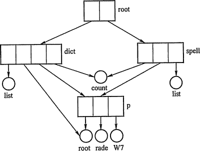
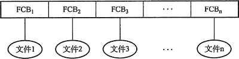
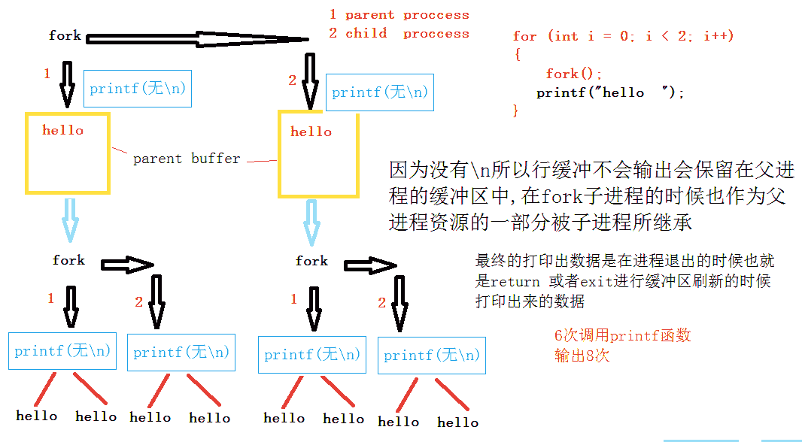
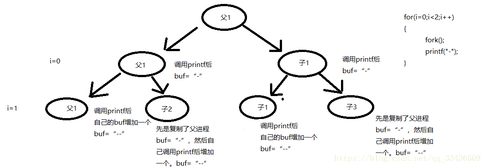
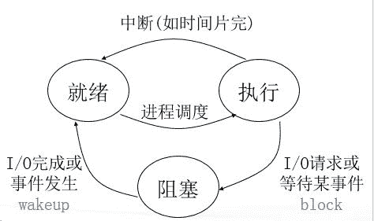
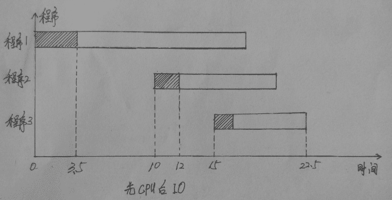
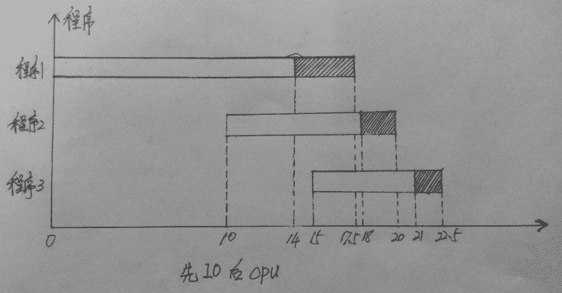
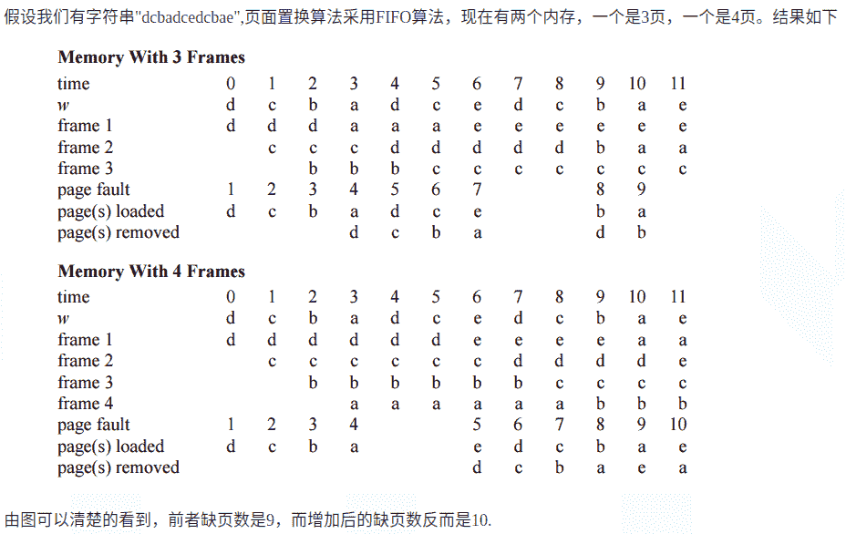
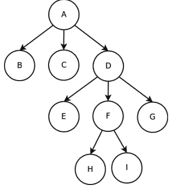

# 腾讯 2013 研发工程师笔试题

## 1

以下表的设计，最合理的是（ ）

正确答案: A   你的答案: 空 (错误)

```cpp
学生{id,name,age} ,学科{id,name} 分数{学生 id,学科 id,分数}
```

```cpp
学生{id,name,age} ,分数{学生 id,学科名称,分数}
```

```cpp
分数{学生姓名,学科名称,分数}
```

```cpp
学科{id,name},分数{学生姓名,学科 id,分数}
```

本题知识点

腾讯

讨论

[小小](https://www.nowcoder.com/profile/59)

  查看全部)

编辑于 2015-09-05 13:18:24

* * *

[陋室](https://www.nowcoder.com/profile/716156)

基本的数据库设计，难道大家项目里都没遇到过吗？
这显然是个多对多的映射（一个学生能选多门课，一门课能被多个学生选择），所以最好的做法是把多对多映射转化为两个 1 对多的映射，也就是一个学生表，一个课程表，一个他们的映射表——分数表，表中的主键是“学生 id”和“学科 id”，同时关联的表中作为外键保持参照完整性。

发表于 2015-09-05 22:28:28

* * *

[LingtaoKong](https://www.nowcoder.com/profile/223998)

A 选项满足 数据库设计中的范式要求：1NF 每个关系的属性列都是不可分割的原子数据项 2NF 每个关系中都需要一个唯一的主键来标识这个关系 3NF 一个关系不依赖其他关系中的非主键项，从而避免冗余

发表于 2015-09-05 16:08:42

* * *

## 2

下面选项中，在数据库系统中，产生不一致的最重要原因是（ ）

正确答案: D   你的答案: 空 (错误)

```cpp
数据存储量太大
```

```cpp
没有严格保护数据
```

```cpp
未对数据进行完整性控制
```

```cpp
数据冗余
```

本题知识点

数据库 腾讯

讨论

[gxynikita](https://www.nowcoder.com/profile/910946)

选 D

数据库中有可能会

  查看全部)

编辑于 2015-09-05 13:17:46

* * *

[huixieqingchun](https://www.nowcoder.com/profile/551201)

**数据库中可能存在不一致的数据，主要有以下三个方面：****A.数据冗余；****B.并发控制不当；****C.故障或者错误**

发表于 2016-06-02 20:09:59

* * *

[星痕 sky](https://www.nowcoder.com/profile/625230)

数据冗余、并发控制不当、故障和错误 不是完整性约束条件的问题。

发表于 2016-01-20 17:55:15

* * *

## 3

用容积分别为 15 升和 27 升的两个杯子向一个水桶中装水，可以精确向水桶中注入（ ）升水？

正确答案: C   你的答案: 空 (错误)

```cpp
53
```

```cpp
25
```

```cpp
33
```

```cpp
52
```

本题知识点

数学运算

讨论

[azuredragon_y](https://www.nowcoder.com/profile/528259)

C。15 装满倒入 27，  查看全部)

编辑于 2015-01-02 20:22:57

* * *

[跟谁学招聘总监](https://www.nowcoder.com/profile/470815)

自己算错了 现在忽然想通了  简单方法是 15 27 都是 3 的倍数 无论怎么做差加和都一样还是 3 的倍数 所以选择 33

发表于 2015-09-05 16:12:13

* * *

[Double_k](https://www.nowcoder.com/profile/122986)

整个过程中，杯子水满才能保证精确，设用了 x 杯 15l，y 杯 27l，其中正数表示加上，负数表示扣除，则 15x+27y=答案

发表于 2015-09-05 17:54:00

* * *

## 4

考虑左递归文法 S->Aa|b A->Ac|Sd|e，消除左递归后应该为（ ）？

正确答案: A   你的答案: 空 (错误)

```cpp
S->Aa|b			
 A->bdA’|A’			  
 A'->cA’|adA’|e
```

```cpp
S->Ab|a
A->bdA’|A’
A’->cA’|adA’|e
```

```cpp
S->Aa|b			
A->cdA’|A’			  
 A’->bA’|adA’|e
```

```cpp
S->Aa|b
A->bdA’|A’
A’->caA’|dA’|e
```

本题知识点

编译和体系结构 腾讯

讨论

[小小](https://www.nowcoder.com/profile/59)

e 为空集,消除左递归,即消  查看全部)

编辑于 2015-09-05 13:20:12

* * *

[justalittlenoob](https://www.nowcoder.com/profile/544580)

S->Aa | bA->Ac | Sd | e 将 S 带入 A：A->Ac | Aad | bd | e 直接消除左递归：A->bdA' | A'A'->cA' | adA'|e 结果等于上面俩，再算上 S,其实 e 应该是希腊字母ε，这出题的人也够糊弄的

发表于 2015-09-05 19:56:54

* * *

[何文婷](https://www.nowcoder.com/profile/218579)

http://www.cnblogs.com/nano94/p/4020775.html 很详细的解析

发表于 2015-09-06 00:41:26

* * *

## 5

下面的排序算法中，初始数据集的排列顺序对算法的性能无影响的是

正确答案: B   你的答案: 空 (错误)

```cpp
插入排序
```

```cpp
堆排序
```

```cpp
冒泡排序
```

```cpp
快速排序
```

本题知识点

排序 *腾讯 人人网* *讨论

[香蕉牛奶](https://www.nowcoder.com/profile/217925)

B，堆排序有影响就是这  查看全部)

编辑于 2015-02-04 21:56:16

* * *

[FFF 乔碧罗](https://www.nowcoder.com/profile/562077)

下面一张图解决所有的问题。

发表于 2015-09-05 15:29:02

* * *

[得得小泽](https://www.nowcoder.com/profile/703416)

对算法 无影响的有  堆 直接选择 归并 基数 即最好 和最坏的时间复杂度都是一样的

发表于 2015-07-23 14:02:25

* * *

## 6

使用二分查找算法在一个有序序列中查找一个元素的时间复杂度为（ ）

正确答案: B   你的答案: 空 (错误)

```cpp
O(N)
```

```cpp
O(logN)
```

```cpp
O(N*N)
```

```cpp
O(N*logN)
```

本题知识点

查找 *讨论

[牛客-007](https://www.nowcoder.com/profile/394118)

答案：B 二分查找又称折  查看全部)

编辑于 2015-09-05 13:21:12

* * *

[心系蝶相印](https://www.nowcoder.com/profile/7198367)

1.     顺序查找，时间复杂度为 O(n)

2.     二分查找，时间复杂度为 O(log2n)

3.     插值查找，关键字分布又比较均匀, 时间复杂度为 O(log2(log2n))

4.     斐波那契查找，时间复杂度为 O(log2n)

5.     树表查找

a)     二叉树查找算法，插入和查找的时间复杂度均为 O(logn)

b)     红黑树，logn

c)     B 树和 B+树，O(log n)

6.     分块查找，关键字构成一个索引表

7.      哈希查找，以空间换时间的算法

发表于 2018-04-01 19:20:35

* * *

[manhua](https://www.nowcoder.com/profile/683760)

折半查找，每次都是 1/2,设寻找 t 次，等式为 2^t =n,n 为数据的总数，倒过来就答案 B。

发表于 2015-09-05 16:58:34

* * *

## 7

路由器工作在网络模型中的哪一层（ ）？

正确答案: C   你的答案: 空 (错误)

```cpp
数据链路层
```

```cpp
物理层
```

```cpp
网络层
```

```cpp
应用层
```

本题知识点

网络基础 腾讯

讨论

[MyGoodHelper](https://www.nowcoder.com/profile/644326)

C 路由器（ Router  查看全部)

编辑于 2015-02-05 18:04:22

* * *

[醒醒鱼](https://www.nowcoder.com/profile/793318)

1.网络层：路由器、防火墙
2.数据链路层：网卡、网桥、交换机
3.物理层：中继器、集线器

发表于 2015-09-06 09:22:16

* * *

[高处也有寒](https://www.nowcoder.com/profile/323340)

网桥工作在数据链路层，路由器工作在网络层。 《计算机网络（第 2 版）》吴功宜 P244

发表于 2015-08-29 21:29:53

* * *

## 8

对于满足 SQL92 标准的 SQL 语句：SELECT foo,count(foo) FROM pokes WHERE foo>10 GROUP BY foo HAVING ORDER BY foo，其执行的顺序应该为（ ）

正确答案: A   你的答案: 空 (错误)

```cpp
FROM->WHERE->GROUP BY->HAVING->SELECT->ORDER BY
```

```cpp
FROM->GROUP BY->WHERE->HAVING->SELECT->ORDER BY
```

```cpp
FROM->WHERE->GROUP BY->HAVING->ORDER BY->SELECT
```

```cpp
FROM->WHERE->ORDER BY->GROUP BY->HAVING->SELECT
```

本题知识点

数据库 腾讯

讨论

[菜鸟葫芦娃](https://www.nowcoder.com/profile/415611)

A 看图说话就知道选择什  查看全部)

编辑于 2015-09-05 13:22:10

* * *

[joyken](https://www.nowcoder.com/profile/280755)

标准的 SQL 的解析顺序为: (1).FROM 子句, 组装来自不同数据源的数据 (2).WHERE 子句, 基于指定的条件对记录进行筛选 (3).GROUP BY 子句, 将数据划分为多个分组 (4).使用聚合函数进行计算 (5).使用 HAVING 子句筛选分组 (6).计算 Select 所有的表达式 (7).使用 ORDER BY 对结果集进行排序

发表于 2015-09-05 17:06:06

* * *

[河湖之恋](https://www.nowcoder.com/profile/220047)

可以按照基本逻辑思路来理解：一步步缩减范围，再在所选范围中计算结果，处理计算出的结果。1，先确定大范围，选择表，也即是 from；2，再一步步缩减范围，从表中确定符合条件的范围，用 where，再 group by，再 having；3，确定最终范围后，在范围中进行计算题目要求计算的数，用 select；4，计算之后，对计算结果进行排序，用 order by。

发表于 2015-09-06 09:07:12

* * *

## 9

在 UNIX 系统中，目录结构采用（ ）

正确答案: D   你的答案: 空 (错误)

```cpp
单级目录结构
```

```cpp
二级目录结构
```

```cpp
单纯树形目录结构
```

```cpp
带链接树形目录结构
```

本题知识点

编译和体系结构 Linux 腾讯

讨论

[牛客 444334 号](https://www.nowcoder.com/profile/444334)

D

带链接树形目录结构又  查看全部)

编辑于 2015-01-12 21:22:10

* * *

[沉沦的罚](https://www.nowcoder.com/profile/8186629)

带链接树形目录结构

```cpp
单级目录结构  二级目录结构  多级目录结构（树形目录结构）
```

发表于 2017-09-10 18:22:13

* * *

[牛客 1772775 号](https://www.nowcoder.com/profile/1772775)

补充：带连接树形结构是指目录呈现树形，树的叶子节点则是指向文件的指针。
分为两种：
硬链接：每一条路径下存放文件的指针，该指针指向了一个记录节点结构（该结点还有文件指针指向了文件 A，并且有 A 被链接的次数 n），当删除某目录下的该文件（之指针）时，n--，当 n=0 时，该文件彻底删除。
软链接：某条路径下存放真实文件，该路径称为该文件的 owner，其它路径链向它时则被视为快捷方式，若 owner 路径下的该真实文件被删除，则所有的快捷方式失效，提示是否清楚掉此快捷方式。

发表于 2017-04-03 13:39:03

* * *

## 10

请问下面的程序一共输出多少个 “-”（）

```cpp
int main(void)
{
    int i;
    for (i = 0; i < 2; i++) { 
        fork(); 
        printf("-"); 
    } 
    return 0; 
} 
```

正确答案: D   你的答案: 空 (错误)

```cpp
2
```

```cpp
4
```

```cpp
6
```

```cpp
8
```

本题知识点

C++ 腾讯 C 语言

讨论

[weikai](https://www.nowcoder.com/profile/658104)



编辑于 2015-12-09 00:17:13

* * *

[ATlaS](https://www.nowcoder.com/profile/812029)

fork()系统调用的特性，

*   fork()系统调用是 Unix 下以自身进程创建子进程的系统调用，一次调用，两次返回，如果返回是 0，则是子进程，如果返回值>0，则是父进程（返回值是子进程的 pid），这是众为周知的。

*   还有一个很重要的东西是，在 fork()的调用处，整个父进程空间会原模原样地复制到子进程中，包括指令，变量值，程序调用栈，环境变量，缓冲区，等等。

可以参考陈皓对这道题的解析：http://coolshell.cn/articles/7965.html

发表于 2015-05-24 18:35:11

* * *

[牛客 7334267 号](https://www.nowcoder.com/profile/7334267)



发表于 2018-09-04 16:44:44

* * *

## 11

// 请问下面的程序一共输出多少个“-”？为什么？

```cpp
#include <stdio.h>
#include <sys/types.h>
#include <unistd.h>

int main(void) {
    int i;
    for (i = 0; i < 2; i++) {
        fork();
        printf("-\n");
    }
    return (0);
}
```

正确答案: C   你的答案: 空 (错误)

```cpp
4
```

```cpp
5
```

```cpp
6
```

```cpp
8
```

本题知识点

腾讯 C 语言

讨论

[Regin](https://www.nowcoder.com/profile/594239)

1.printf("-\n");对于行输出/n 有清除缓存的作用；2.fork（）可以复制父进程的缓存，变量值等信息；3.i＝0 时，父进程 A 产生一个子进程 A1，此时输出两行“－”；4.i＝1 时，fork 使父进程 A 产生子进程 A2，A1 产生子进程 A3，此时 A－A3***生 4 行“－”（因为现在 A，A1 的输出行缓冲均为空）；总数为 6：2（A）＋2（A1）＋1（A2）＋1（A3）＝6；对比 http://www.nowcoder.com/profile/594239/test/1146384/7254#summary 由于 A2，A3 会继承 A 和 A1 的输出行缓冲区，所以会分别输出两个“－”，加起来为：2（A）+2（A1）＋2（A2）+2（A3）=8；

发表于 2015-09-05 17:53:11

* * *

[jo_ryan](https://www.nowcoder.com/profile/212457)

```cpp
  int i;
   for(i=0; i<2; i++){
      fork();
      printf("-");
   }
```

1.fork()系统调用是 Unix 下以自身进程创建子进程的系统调用，一次调用，两次返回，如果返回是 0，则是子进程，如果返回值>0，则是父进程（返回值是子进程的 pid），这是众为周知的。2.还有一个很重要的东西是，在 fork()的调用处，整个父进程空间会原模原样地复制到子进程中，包括指令，变量值，程序调用栈，环境变量，缓冲区，等等。所以，上面的那个程序为什么会输入 8 个“-”，这是因为 printf(“-“);语句有 buffer，所以，对于上述程序，printf(“-“);把“-”放到了缓存中，并没有真正的输出，在 fork 的时候，缓存被复制到了子进程空间，所以，就多了两个，就成了 8 个，而不是 6 个。而本题 printf("-\n");程序遇到“\n”，或是 EOF，或是缓中区满，或是文件描述符关闭，或是主动 flush，或是程序退出，就会把数据刷出缓冲区。需要注意的是，标准输出是行缓冲，所以遇到“\n”的时候会刷出缓冲区，但对于磁盘这个块设备来说，“\n”并不会引起缓冲区刷出的动作，那是全缓冲，你可以使用 setvbuf 来设置缓冲区大小，或是用 fflush 刷缓存。

发表于 2015-09-05 18:21:38

* * *

[yql](https://www.nowcoder.com/profile/566442)

我叫搬运工！http://coolshell.cn/articles/7965.html

发表于 2015-09-20 13:38:30

* * *

## 12

避免死锁的一个著名的算法是（ ）

正确答案: B   你的答案: 空 (错误)

```cpp
先入先出法
```

```cpp
银行家算法
```

```cpp
优秀级算法
```

```cpp
资源按序分配法
```

本题知识点

并发 腾讯

讨论

[MyGoodHelper](https://www.nowcoder.com/profile/644326)

B 银行家算法是一种最有  查看全部)

编辑于 2015-01-29 11:48:02

* * *

[牛客 242927 号](https://www.nowcoder.com/profile/242927)

预防死锁和避免死锁的区别？？？

发表于 2016-09-03 15:31:46

* * *

[guanjian](https://www.nowcoder.com/profile/564796)

[银行家算法](http://baike.baidu.com/view/93075.htm) （Banker's Algorithm）是一个避免死锁（Deadlock）的著名算法

```cpp
资源按序分配法是操作系统中预防死锁的一种算法
```

发表于 2015-09-11 15:54:09

* * *

## 13

你怎么理解的分配延迟（dispatch lantency）

正确答案: A   你的答案: 空 (错误)

```cpp
分配器停止一个进程到开启另一个进程的时间
```

```cpp
处理器将一个文件写入磁盘的时间
```

```cpp
所有处理器占用的时间
```

```cpp
以上都不对
```

本题知识点

编译和体系结构 腾讯

讨论

[牛客 444334 号](https://www.nowcoder.com/profile/444334)

A
分派延迟指分派程序停止一  查看全部)

编辑于 2015-02-05 17:58:37

* * *

[MyGoodHelper](https://www.nowcoder.com/profile/644326)

A 分配延迟 一般指进程切换时间

发表于 2015-01-18 19:24:45

* * *

[何文婷](https://www.nowcoder.com/profile/218579)

The term dispatch latency describes the amount of time it takes for a system to respond to a request for a process to begin operation. 怎么看着像是响应请求的时间，A 不太准确呀

发表于 2015-09-06 00:35:02

* * *

## 14

以下那一个不是进程的基本状态 ()

正确答案: D   你的答案: 空 (错误)

```cpp
阻塞态
```

```cpp
执行态
```

```cpp
就绪态
```

```cpp
完成态
```

本题知识点

操作系统 编译和体系结构 腾讯

讨论

[MyGoodHelper](https://www.nowcoder.com/profile/644326)

D 进程的三种基本状态  查看全部)

编辑于 2015-02-05 17:58:05

* * *

[天尊墨宇](https://www.nowcoder.com/profile/667959477)

选 D
进程的三种基本状态

进程在运行中不断地改变其运行状态。通常，一个运行进程必须具有以下三种基本状态。

  **就绪(Ready)状态**

当进程已分配到除 CPU 以外的所有必要的资源，只要获得处理机便可立即执行，这时的进程状态称为就绪状态。

  **执行（Running）状态**
当进程已获得处理机，其程序正在处理机上执行，此时的进程状态称为执行状态。

  **阻塞(Blocked)状态**
正在执行的进程，由于等待某个事件发生而无法执行时，便放弃处理机而处于阻塞状态。引起进程阻塞的事件可有多种，例如，等待 I/O 完成、申请缓冲区不能满足、等待信件(信号)等。

发表于 2020-07-25 07:01:39

* * *

[老罗先生](https://www.nowcoder.com/profile/8845518)



发表于 2017-04-02 11:03:06

* * *

## 15

假定我们有 3 个程序，每个程序花费 80%的时间进行 I/O，20%的时间使用 CPU。每个程序启动时间和其需要使用进行计算的分钟数如下，不考虑进程切换时间：
程序编号 启动时间 需要 CPU 时间（分钟）
1                00：00      3.5
2                00：10      2
3                00：15     1.5
请问，在多线程/进程环境下，系统的总响应时间为（ ）

正确答案: B   你的答案: 空 (错误)

```cpp
22.5
```

```cpp
23.5
```

```cpp
24.5
```

```cpp
25.5
```

本题知识点

编译和体系结构 腾讯

讨论

[牛客 444334 号](https://www.nowcoder.com/profile/444334)

B

0~10 分钟内，只有一  查看全部)

编辑于 2015-02-05 17:57:44

* * *

[TaskMachine](https://www.nowcoder.com/profile/634296)

我的算法不太一样，我考虑的是 I/O 本身不占用 CPU，1,2,3 程序的时间如下，假设每个进程都是先进行 I/O 的，那么每个进程的 CPU 计算时间并不冲突：1、14s + 3.5s        17.5s2、10s + 8s（进程 1 已经计算完毕） + 2s        20s3、15s + 7.5s（进程 2 已经计算完） + 1.5s     22.5s 所以一共的响应时间是 22.5s

发表于 2015-09-05 19:56:43

* * *

[好学上进](https://www.nowcoder.com/profile/708096)

        题目问系统的总响应时间，而系统的调度目标是使总响应时间尽可能地小。那么，怎么使总响应时间最小呢？        注意到，CPU 是共享（竞争）的，而 IO 是各自的，所以，系统的调度只要满足“**在使用 CPU 上不引起冲突（发生竞争** **）**”这一条件，就不会有时间上的耽搁，就能使总响应时间最小。       由题意易知程序 1、2、3 的 IO 时间分别为 14、8、6，在这一条件下，不引起 CPU 使用冲突是可以做到的，而且调度方法有无数多种（因为题目并没有规定是先 IO 还是先使用 CPU，或者两者交替，这些都没有说，那我们就可以认为是任何形式）。       下面两幅图分别给出了“先使用 CPU 后进行 IO”和“先进行 IO 后使用 CPU”两种情况的图解，一目了然。

        图中阴影部分表示使用 CPU 时间，空白部分表示进行 IO 时间。        可见，只要不引起 CPU 冲突，每个程序都能从一开始一口气执行完，总响应时间由最后执行完的程序决定。        对于本题，只要不引起 CPU 冲突，总响应时间都是       15（程序 3 开始时间）+1.5（程序 3 使用 CPU 时间）+6（程序 3 进行 IO 时间）=22.5

发表于 2016-09-06 10:10:43

* * *

## 16

在所有非抢占 CPU 调度算法中，系统平均响应时间最优的是（ ）

正确答案: B   你的答案: 空 (错误)

```cpp
实时调度算法
```

```cpp
短任务优先算法
```

```cpp
时间片轮转算法
```

```cpp
先来先服务算法
```

本题知识点

编译和体系结构 腾讯

讨论

[分形叶](https://www.nowcoder.com/profile/436850)

B 短任务优先系统平均响应时间最短，但是往往不能确定所有任务的运行时间先来先服务平均响应时间最长，不适用于分时系统时间片轮转，适用于分时系统，但是增加了抢占以切换进程，算法性能依赖于时间片大小

发表于 2015-04-08 21:35:53

* * *

[guanjian](https://www.nowcoder.com/profile/564796)

短任务优先系统平均响应时间最短，但是往往不能确定所有任务的运行时间先来先服务平均响应时间最长，不适用于分时系统时间片轮转，适用于分时系统，但是增加了抢占以切换进程，算法性能依赖于时间片大小 1,1,10000000

发表于 2015-09-11 15:58:23

* * *

[牛客 225444978 号](https://www.nowcoder.com/profile/225444978)

选 B 非抢占式调度算法有:先来先服务短任务优先抢占式调度算法有:时间片轮转实时调度排除 A C 短任务优先系统平均响应时间最短，往往不能确定任务的总运行时间。先来先服务平均响应时间最长。

发表于 2022-02-10 13:23:19

* * *

## 17

什么是内存抖动（Thrashing）（ ）

正确答案: A   你的答案: 空 (错误)

```cpp
非常频繁的换页活动
```

```cpp
非常高的 CPU 执行活动
```

```cpp
一个极长的执行进程
```

```cpp
一个极大的虚拟内存
```

本题知识点

编译和体系结构 腾讯

讨论

[牛客 444334 号](https://www.nowcoder.com/profile/444334)

A

页面的频繁更换，导致整  查看全部)

编辑于 2015-01-07 22:43:30

* * *

## 18

Belady’s Anomaly 出现在哪里（ ）

正确答案: B   你的答案: 空 (错误)

```cpp
内存管理算法
```

```cpp
内存换页算法
```

```cpp
预防锁死算法
```

```cpp
磁盘调度算法
```

本题知识点

编译和体系结构 腾讯

讨论

[eagle](https://www.nowcoder.com/profile/603476)

BBelady’  查看全部)

编辑于 2015-02-05 17:42:10

* * *

[在水一方 _2015](https://www.nowcoder.com/profile/726501)

Belady’s Anomaly： 所谓 Belady 现象是指：采用 FIFO 算法时，如果对—个进程未分配它所要求的全部页面，有时就会出现分配的页面数增多但缺页率反而提高的异常现象。因此根据定义，可知 Belady’s Anomaly 是内存换页算法。

发表于 2015-09-06 16:11:04

* * *

[哟，我喜欢](https://www.nowcoder.com/profile/8095403)



发表于 2019-08-05 17:52:34

* * *

## 19

以下的生产者消费者程序中，那个不会出现锁死，并且开销最少？
注：
down()
1 判断信号量的取值是否大于等于 1
2 如果是，将信号量的值减去一，继续向下执行
3 否则，在该信号量上等待（进城被挂起）
up()
1 将信号量的值增加 1（此操作将叫醒一个在信号量上面等待的进程）
2 线程继续往下执行
down()和 up()是一组原子操作

正确答案: D   你的答案: 空 (错误)

```cpp

```
#define N 100 //定义缓冲区的大小
typedef int semaphore; //定义信号量类型
semaphore mutex = 1; //互斥信号量
semaphore empty = N; //缓冲区计数信号量
semaphore full = 0; //缓冲区计数信号量，用来计数缓冲区里的商品数量
void producer(void)
{
    int item;
    while(TRUE){
        item = produce_item();
        down(&empty);
        down(&empty);
        insert_item(item);
        up(&mutex);
        up(&full);
    }
}
void consumer(void)
{
    int item;
    while(TRUE){
        down(&full);
        down(&mutex);
        item = remove_item();
        up(&mutex);
        up(&empty);
        consume_item(item);
    }
}

```cpp

```

```cpp

```
#define N 100
typedef int semaphore;
semaphore empty = N;
semaphore full = 0;
void producer(void)
{
    int item;
    while(TRUE){
        item = produce_item();
        down(&empty);
        insert_item(item);
        up(&full);
    }
}
void consumer(void)
{
    int item;
    while(TRUE){
        down(&full);
        item = remove_item();
        up(&empty);
        consume_item(item);
    }
}

```cpp

```

```cpp

```
#define N 100
typedef int semaphore;
semaphore mutex = 1;
semaphore empty = N;
semaphore full = 0;
void producer(void)
{
    int item;
    while(TRUE){
        item = produce_item();
        down(&empty);
        down(&empty);
        insert_item(item);
        up(&mutex);
        up(&full);
    }
}
void consumer(void)
{
    int item;
    while(TRUE){
        down(&mutex);
        down(&full);
        item = remove_item();
        up(&mutex);
        up(&empty);
        consume_item(item);
    }
}

```cpp

```

```cpp

```
#define N 100
typedef int semaphore;
semaphore mutex = 1;
semaphore empty = N;
semaphore full = 0;
void producer(void)
{
    int item;
    while(TRUE){
        item = produce_item();
        down(&empty);
        down(&mutex);
        insert_item(item);
        up(&full);
        up(&mutex);
    }
}
void consumer(void)
{
    int item;
    while(TRUE){
        down(&full);
        down(&mutex);
        item = remove_item();
        up(&empty);
        up(&mutex);
        consume_item(item);
    }
}

```cpp

```

本题知识点

操作系统 编译和体系结构 腾讯

讨论

[mr_cris](https://www.nowcoder.com/profile/116807)

这题为何这么长

发表于 2015-10-22 09:30:12

* * *

[manhua](https://www.nowcoder.com/profile/683760)

首先互斥变量是相互对称的，第二没有互斥量会造成死锁。根据这两个条件就可以排除 ABC。一个产品只能被一个消费者或一个生产者使用，必须要用互斥量，否则会进入两个角色会进入请求等待状态。

发表于 2015-09-05 17:11:52

* * *

[Francis123](https://www.nowcoder.com/profile/902326)

单生产者单消费者是 B，多生产者多消费者是 D

发表于 2015-09-02 17:02:38

* * *

## 20

使用深度优先算法遍历下面的图,遍历的顺序为()

正确答案: C   你的答案: 空 (错误)

```cpp
ABCDEFGHI
```

```cpp
BCEHIFGDA
```

```cpp
ABCDEFHIG
```

```cpp
HIFEGBCDA
```

本题知识点

图

讨论

[特种兵&&小屁孩](https://www.nowcoder.com/profile/473109)

C 不就是 ABCDEFHIG 吗，都瞎了吗？

发表于 2015-09-06 11:24:26

* * *

[Niccccccco](https://www.nowcoder.com/profile/5292821)

b,c 都对。B 是后序遍历，C 是前序遍历

发表于 2018-07-08 12:19:54

* * *

[呐我去给你煮碗面](https://www.nowcoder.com/profile/553416)

B 和 C 都对。树的深度优先遍历分为先根次序和后根次序，先根就是 C，后根就是 B。先根次序和讲该树装换为对应的二叉树，再对该二叉树进行先序遍历得到的结果一致。后根次序和讲该树装换为对应的二叉树，再对该二叉树进行中序遍历得到的结果一致。

发表于 2016-04-23 20:32:20

* * ***