# 滴滴快的 2016 校招在线测评

## 1

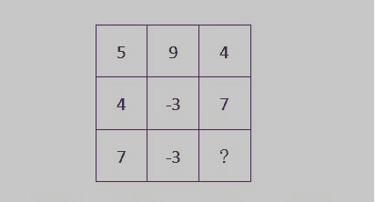

从所给的四个选项中，选择最合适的一个填入“？”处，使图中的数字呈现一定的规律性。

正确答案: B   你的答案: 空 (错误)

```cpp
5
```

```cpp
10
```

```cpp
-2
```

```cpp
-8
```

本题知识点

判断推理

讨论

[Miner_Sty](https://www.nowcoder.com/profile/512761)

这一题其实是求前两个数的差的  查看全部)

编辑于 2016-10-18 16:51:58

* * *

[Malcolm](https://www.nowcoder.com/profile/882596)

前面两列相减取绝对值

发表于 2016-03-21 20:18:59

* * *

[牛客 399937 号](https://www.nowcoder.com/profile/399937)

每一行求和：5+9+4=18=2*3²  4-3+7=8=2*2²  7-3+?=2=2*1²由上面的规律：？=-2 所以碰到这种题，也只能呵呵啦

发表于 2015-09-06 19:08:43

* * *

## 2

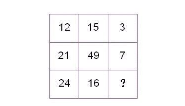

从所给的四个选项中，选择最合适的一个填入“？”处，使图中的数字呈现一定的规律性。

正确答案: A   你的答案: 空 (错误)

```cpp
8
```

```cpp
12
```

```cpp
9
```

```cpp
4
```

本题知识点

判断推理

讨论

[格子灰](https://www.nowcoder.com/profile/822665)

日了狗了，最大公约数也出来了

发表于 2016-10-02 18:32:08

* * *

[Miner_Sty](https://www.nowcoder.com/profile/512761)

这一题求的是：第三个数是前两个数的最大公约数。即：    gcd(12,15) = 3           gcd(21,49) = 7
因此    gcd(24,16) = 8

发表于 2015-09-06 08:21:24

* * *

[leozam](https://www.nowcoder.com/profile/320048)

8 个数的个位分别为 2，5，3，1，9，7，4，6。所以剩下那个数的个位数为 8。当然，还是最大公约数那个思路更靠谱一点。

发表于 2017-07-24 17:04:40

* * *

## 3

**某件商品，甲店的进货价是乙店的 90%。该商品在甲店的利润率为 20%，在乙店的利润率为 10%。若乙店进货价为 200 元，则该商品在甲店的售价比乙店低多少元？**

正确答案: C   你的答案: 空 (错误)

```cpp
2
```

```cpp
3
```

```cpp
4
```

```cpp
5
```

本题知识点

数学运算

讨论

[Miner_Sty](https://www.nowcoder.com/profile/512761)

已知乙店进价 200，因此甲店进价 180，又已知利润比，因此乙店售价 200*1.1 = 220，甲店售价 180*1.2 = 216 因此两家售价差 220-216 = 4

发表于 2015-09-06 08:24:23

* * *

[jo_ryan](https://www.nowcoder.com/profile/212457)

利润是售价减去进价，利润率是（售价-进价）/售价*100%200/0.9=222180/0.8=225 差额应该为-3 元啊，为毛利润是（售价-进价）/进价*100%？？题目不对吧！

发表于 2015-09-07 19:00:42

* * *

[zhisheng_blog](https://www.nowcoder.com/profile/616717)

甲进价等于 200*0.9=180 售价 180*1.2=216 乙进价 200 售价 200*1.1=220 甲售价比乙低 4 元

发表于 2016-09-06 16:14:37

* * *

## 4

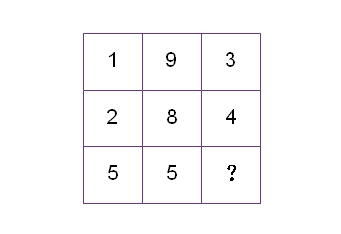

从所给的四个选项中，选择最合适的一个填入“？”处，使图中的数字呈现一定的规律性：

正确答案: A   你的答案: 空 (错误)

```cpp
5
```

```cpp
7
```

```cpp
9
```

```cpp
3
```

本题知识点

判断推理

讨论

[亦行](https://www.nowcoder.com/profile/58)

（列 A*列 B）开方后得列 C。  查看全部)

编辑于 2015-09-07 16:43:56

* * *

[zhisheng_blog](https://www.nowcoder.com/profile/616717)

楼上有位和我一样想法的。（握手啊）第一行 和 13 第二行 和 14 第三行 和 15

发表于 2016-08-27 18:16:08

* * *

[沐楠](https://www.nowcoder.com/profile/696953)

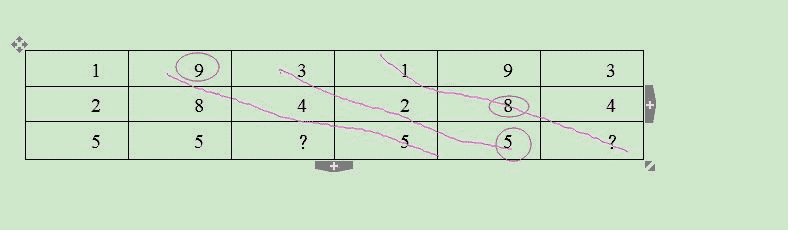如上图，感觉答案 7 也是对的

发表于 2015-09-09 11:09:06

* * *

## 5

小张读一本书，如果每天分别读 2 页、3 页、4 页和 5 页时，最后一天都只能读 1 页；当每天读 7 页时，则最后一天刚好读 7 页。已知此书不足 400 页，那么此书共有多少页？

正确答案: D   你的答案: 空 (错误)

```cpp
121
```

```cpp
181
```

```cpp
241
```

```cpp
301
```

本题知识点

数学运算

讨论

[亦行](https://www.nowcoder.com/profile/58)

即求 2、3、4、5 最小公倍数+1 可以被 7 整除的数，60120180240300 仅最后可以被 7 整除。选 300+1=301

发表于 2015-09-05 23:03:54

* * *

[TeamWE](https://www.nowcoder.com/profile/705306)

只有 301 能被 7 整除

发表于 2015-09-05 22:50:33

* * *

[牛客 776587029 号](https://www.nowcoder.com/profile/776587029)

因为最后一天刚好读 7 页，这个数字肯定能被 7 整除，只有 301

发表于 2021-09-17 20:32:42

* * *

## 6

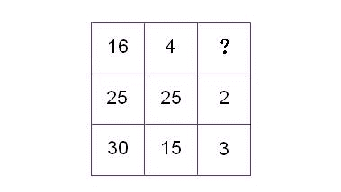

从所给的四个选项中，选择最合适的一个填入“？”处，使图中的数字呈现一定的规律性。

正确答案: A   你的答案: 空 (错误)

```cpp
5
```

```cpp
2
```

```cpp
3
```

```cpp
6
```

本题知识点

判断推理

讨论

[TeamWE](https://www.nowcoder.com/profile/705306)

16/4+1=5；25/25+1=2；30/15+1=3

编辑于 2021-09-17 18:42:16

* * *

[orzOrzorzOrz](https://www.nowcoder.com/profile/374725)

（16+4）/4（25+25）/25（30+15）/15

发表于 2015-09-06 01:10:10

* * *

[ypf11](https://www.nowcoder.com/profile/478109)

我选的 B 第二行：25 25 的公约数（不包括 1） 25，5 ，故不包括 1 的公约数个数为 2 第三行：30 15 的公约数（不包括 1）3,5,15，故不包括 1 的公约数个数为 3 第一行：16 4 的公约数（不包括 1）2，4，故不包括 1 的公约数个数为 2

发表于 2015-09-10 16:29:59

* * *

## 7

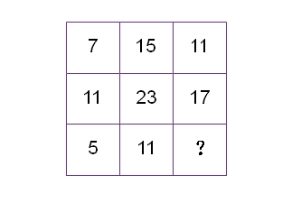

从所给的四个选项中，选择最合适的一个填入“？”处，使图中的数字呈现一定的规律性。

正确答案: B   你的答案: 空 (错误)

```cpp
6
```

```cpp
8
```

```cpp
12
```

```cpp
16
```

本题知识点

判断推理

讨论

[亦行](https://www.nowcoder.com/profile/58)

（列 A+列 B）/2=列 C 故：（5+11）/2=8

发表于 2015-09-05 23:05:19

* * *

[Xaut_Yolanda](https://www.nowcoder.com/profile/705402)

每一行前两个元素相加 再除以 2 得到第三个元素；(7 + 15) / 2 = 11;(11 + 23) / 2 = 17;(5 + 11) / 2 = 8;

发表于 2015-09-08 16:58:06

* * *

[WolffyChen](https://www.nowcoder.com/profile/561647)

7+8=15    15-4=11
11+12=23    23-6=17
5+6=11    11-3=8

发表于 2015-09-05 23:00:54

* * *

## 8

已知每个城市的用水需求相同，每月水库的进水速率恒定不变。现有一座水库供水，如果供应 10 个城市的话，一个月水库就会枯竭；如果供应 8 个城市的话，一个半月水库就会枯竭。当前城市化进程不断加快，新的城市不断产生，为了能够持续满足 12 个城市的供水，还至少需要建设几个这样的水库？

正确答案: A   你的答案: 空 (错误)

```cpp
2
```

```cpp
3
```

```cpp
4
```

```cpp
5
```

本题知识点

数学运算

讨论

[LEarBB](https://www.nowcoder.com/profile/708350)

按照下面的思路：  查看全部)

编辑于 2016-06-26 13:52:37

* * *

[牛客 944732 号](https://www.nowcoder.com/profile/944732)

只算进水率，如果供应 10 个城市的话，一个月水库就会枯竭 ，如果供应 8 个城市的话，一个半月水库就会枯竭，所以两个城市需要半个月的供水，也就是一个水库一个月的供水可以供应四个城市水不间断，那么 12 个城市则需要三个这样的水库，所以还需要至少两个这样的水库。

发表于 2015-09-09 17:21:44

* * *

[WolffyChen](https://www.nowcoder.com/profile/561647)

x 为每月进水量，y 为一个城市每月需水量，则
x + 1 = 10y
1.5x + 1 = 1.5*8y
得到 x = 4y，则 12 城市需要 3 个水库保证不断水！

发表于 2015-09-05 23:06:53

* * *

## 9

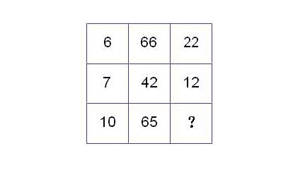

从所给的四个选项中，选择最合适的一个填入“？”处，使图中的数字呈现一定的规律性：

正确答案: D   你的答案: 空 (错误)

```cpp
55
```

```cpp
48
```

```cpp
34
```

```cpp
13
```

本题知识点

判断推理

讨论

[亦行](https://www.nowcoder.com/profile/58)

列 B/列 A*2=列 C（65/10）*2=13

发表于 2015-09-05 23:06:17

* * *

[NoNoNoNo](https://www.nowcoder.com/profile/241409)

6*22/2 = 667*12/2 = 4210*13/2 = 65

发表于 2015-09-06 08:36:50

* * *

[雨田](https://www.nowcoder.com/profile/318910)

每一列都有一组连续的数，可以通过排除得到答案

编辑于 2015-09-06 17:09:48

* * *

## 10

轮滑障碍赛中，共 8 个障碍物，选手需绕过障碍物滑行抵达终点。若比赛规定每次可以绕过一个或两个障碍物，选手从障碍物的右侧出发，共有多少种不同滑法？

正确答案: B   你的答案: 空 (错误)

```cpp
25
```

```cpp
34
```

```cpp
89
```

```cpp
144
```

本题知识点

数学运算

讨论

[Badrain](https://www.nowcoder.com/profile/998897)

发现所有答案都只着重给出了结果，我还是浅显易懂地说一下核心思想吧。其实这是一道数据结构算法题，可以类比爬楼梯问题，有两种通用的解法：**<1> 递归解法**从终点开始反向考虑：不断重复对每一种状态都考虑滑 1 个障碍物和滑 2 个障碍物两种滑行方法......直到最后剩 1 个障碍物时只有一种滑法，剩 2 个障碍物时有 2 种滑法。图解如下：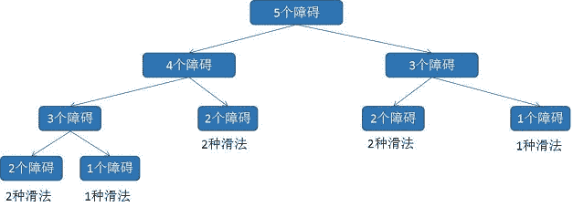最后相加。可以看成算式：f(5) = f(4) + f(3)      = f(3) + f(2) + f(2) + f(1)
      = f(2) + f(1) + f(2) + f(2) + f(1)
      = 2 + 1 + 2 + 2 + 1
      = 8
**<2> 动态规划**从起点开始正向考虑：每次往前推进一个障碍物，考虑到当前障碍物共有多少种滑行方法。（初始情况：到第一个障碍物有一种，到第二个障碍物有两种）。到当前障碍物有“滑一个障碍物”和“滑两个障碍物”两种滑法：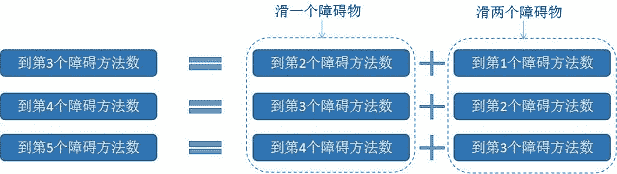 即用算式表示：f(1) = 1, f(2) = 2f(3) = f(2) + f(1) = 3f(4) = f(3) + f(2) = 5f(5) = f(4) + f(3) = 8

发表于 2016-08-06 12:12:03

* * *

[臭布矶](https://www.nowcoder.com/profile/916980)

经分析，有 1,2,3,4,5,...个障碍物的时候，分别有 1,2,3,5,8,...种滑法。斐波那契数列，f(n)=f(n-1)+f(n-2)，f(8)=34

发表于 2015-09-06 14:19:18

* * *

[虾皮内推+VX:265156](https://www.nowcoder.com/profile/812749)

按照绕过两个障碍物的次数分类：0 次有 1 种情况；1 次有 7 种情况；2 次有 6*5/2=15 种情况；3 次有 5*4/2=10 种情况；4 次有 1 种情况。所以总共的滑法为 1+7+15+10+1=34 种。

发表于 2015-09-05 23:54:35

* * *

## 11

甲、乙和丙，一位是福建人，一位是河北人，一位是湖南人。现在只知道：丙比湖南人的年龄大，甲和河北人不同岁，河北人比乙年龄小。由此可以推出：

正确答案: D   你的答案: 空 (错误)

```cpp
甲不是湖南人
```

```cpp
河北人比甲年龄小
```

```cpp
河北人比福建人年龄大
```

```cpp
湖南人年龄最小
```

本题知识点

智力题

讨论

[yshshadow](https://www.nowcoder.com/profile/143948)

由条件可知甲和乙都不是河北人，所以丙是河北人丙比湖南人大，而乙比河北人（丙）大，所以乙只能是福建人，甲是湖南人所以年龄甲<丙<乙，湖南人<河北人<福建人

发表于 2015-09-05 23:03:18

* * *

[guanjian](https://www.nowcoder.com/profile/564796)

这种题要画图的： |   | 甲 | 乙 | 丙 |
| 福建 |   | V | X |
| 河北 | X | X | V |
| 湖南 | V |   | X |

1.丙比湖南人的年龄大，甲和 丙 人不同岁， 丙 比乙年龄小。

发表于 2015-09-11 09:00:25

* * *

[红芋头](https://www.nowcoder.com/profile/907544437)

这种题先尽量确定各自的身份

发表于 2018-06-29 16:59:26

* * *

## 12

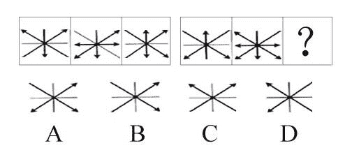

从所给的四个选项中，选择最合适的一个填入“？”处，使之呈现一定的规律性。

正确答案: A   你的答案: 空 (错误)

```cpp
A
```

```cpp
B
```

```cpp
C
```

```cpp
D
```

本题知识点

判断推理

讨论

[Foreverlove_9999](https://www.nowcoder.com/profile/689443)

每个象限区分开来看      查看全部)

编辑于 2016-08-18 17:36:45

* * *

[Benevolence](https://www.nowcoder.com/profile/922708)

求同存异——》两图相叠，相同形状得箭头，不同形状非箭头

发表于 2015-09-16 11:41:16

* * *

[DCBA](https://www.nowcoder.com/profile/467946)

四个象限分别计算，箭头看成 0，线看成 1，进行**异或**计算。0⁰=0(箭头^箭头=箭头)1¹=0(线^线=箭头)0¹=1(箭头^线=线)1⁰=1(线^箭头=线)

编辑于 2016-08-30 21:17:56

* * *

## 13

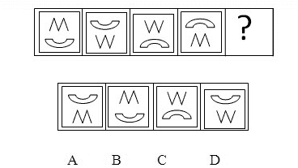从所给的四个选项中，选择最合适的一个填入“？”处，使之呈现一定的规律性。

正确答案: B   你的答案: 空 (错误)

```cpp
A
```

```cpp
B
```

```cpp
C
```

```cpp
D
```

本题知识点

判断推理

讨论

[敬爱的勇哥](https://www.nowcoder.com/profile/539687)

两个交换位置，并且把原来上面那个翻转过来

发表于 2015-09-05 23:49:49

* * *

[lock-free](https://www.nowcoder.com/profile/113156)

交换位置，但图案上行时不翻转，下行时翻转

发表于 2015-09-06 08:59:05

* * *

[为了 offer 要加油呀](https://www.nowcoder.com/profile/698012156)

上行平移，下行翻转

发表于 2019-04-03 16:24:26

* * *

## 14

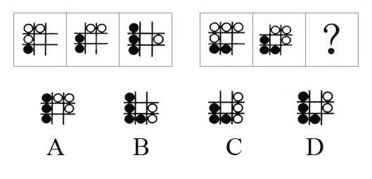

从所给的四个选项中，选择最合适的一个填入“？”处，使之呈现一定的规律性。

正确答案: B   你的答案: 空 (错误)

```cpp
A
```

```cpp
B
```

```cpp
C
```

```cpp
D
```

本题知识点

判断推理

讨论

[yshshadow](https://www.nowcoder.com/profile/143948)

选 B 黑色保持原位不动每次向上增加一个，白色每次减少一个顺时针方向后退个一位置

发表于 2015-09-05 23:00:21

* * *

[雄起的小巨人](https://www.nowcoder.com/profile/735833)

白色球顺时针转，并且每次减少一个球，黑色球顺时针不动，但顺时针方向每次都加一个球

发表于 2015-09-08 17:31:21

* * *

[雪未成型](https://www.nowcoder.com/profile/406937)

原来的黑色保持不动，依次增加一个向上，白色球向右向下移动，每次递减一个。

发表于 2016-09-16 09:52:28

* * *

## 15

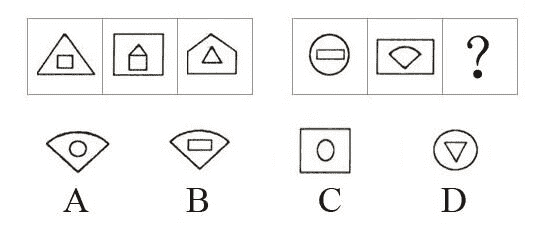

从所给的四个选项中，选择最合适的一个填入“？”处，使之呈现一定的规律性。

正确答案: A   你的答案: 空 (错误)

```cpp
A
```

```cpp
B
```

```cpp
C
```

```cpp
D
```

本题知识点

判断推理

讨论

[鹤唳](https://www.nowcoder.com/profile/935885)

第一个的内里是第二个的外框，第二个的内里是第三个的外框，第三个的内里是第一个的外框，互相错开，答案是 a

发表于 2016-07-24 19:39:59

* * *

[夏日星 2016](https://www.nowcoder.com/profile/830477)

我觉得是顶点个数规律：前三个：1、外 3 内 42、外 4 内 53、外 5 内 3 后三个：1、外 0 内 42、外 4 内 33、外 3 内 0（得出）

发表于 2015-09-21 23:47:48

* * *

[yshshadow](https://www.nowcoder.com/profile/143948)

选 A 第三个图是第二个图内部图形套在第一个图外部图形的外面

发表于 2015-09-05 22:58:27

* * *