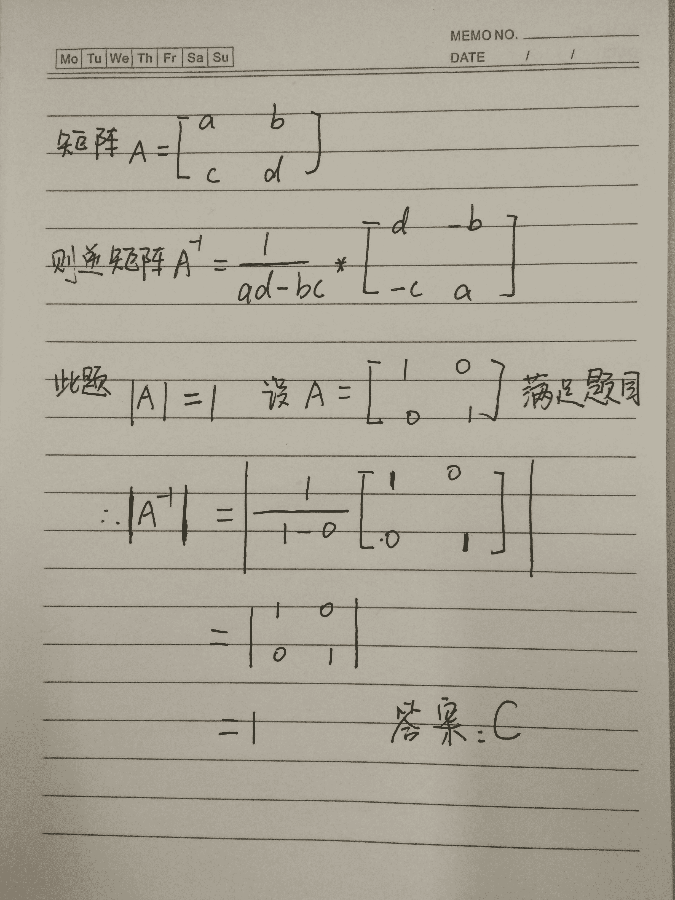
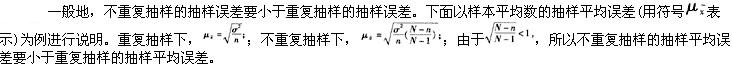

# 腾讯 2016 研发工程师笔试题（二）

## 1

已知 n 阶矩阵 A 的行列式满足|A|=1,求|A^(-1)|(A^(-1)表示 A 的逆矩阵）=？

正确答案: C   你的答案: 空 (错误)

```cpp
正无穷
```

```cpp
0
```

```cpp
1
```

```cpp
-1
```

None

讨论

[SunburstRun](https://www.nowcoder.com/profile/557336)

答案是 C，线性代数基础概念：  查看全部)

编辑于 2015-09-06 16:03:14

* * *

[Radar](https://www.nowcoder.com/profile/312842)

求解过程如图：

发表于 2015-09-06 16:38:11

* * *

[毛毛有个百合梦 Fighting](https://www.nowcoder.com/profile/554794)

AA^(-1) = E，取模得结果

发表于 2015-09-06 16:43:26

* * *

## 2

某函数申明如下：

```cpp
void Func(int &nVal1);
```

有 int a,下面使用正确的为：

正确答案: A   你的答案: 空 (错误)

```cpp
Func(a)
```

```cpp
Func(&a)
```

```cpp
Func(*a)
```

```cpp
Func(&(*a))
```

本题知识点

C++

讨论

[大漠孤狼](https://www.nowcoder.com/profile/527123)

C++中&有另外一个含义，用来声明引用，&不是地址运算符，而是类型标识符的一部分。就像声明 char*指的是指向 char 的指针一样，int &指的是指向 int 的引用，变量和变量的引用指向相同的值和内存单元，引用相当于变量的别名。因此在参数传递时也只需要传递变量名即可，即 Func(a)。它的形式上看起来与值传递相同，但它传递参数时不复制副本，与指针一样可以修改主调函数的参数值，且使用起来更方便。

发表于 2015-09-07 10:47:16

* * *

[代码王子](https://www.nowcoder.com/profile/592556)

答案：AvoidFunc(int&nVal1);参数&，表示引用，也就是变量的另一个别名。&(引用)==>出现在变量声明语句中位于变量左边时,表示声明的是引用.
&(取地址运算符)==>在给变量赋初值时出现在等号右边或在执行语句中作为一元运算符出现时
                  表示取对象的地址.

发表于 2015-09-07 17:05:45

* * *

[yayamma](https://www.nowcoder.com/profile/270051)

第一， fun（int a）， 你调用 fun（b）时 ， 传的是 b 的值的副本，当函数里面改变参数 a 时，只是改变了 b 的副本，**对 b 没影响** ；
第二， fun（int &a）， 你调用 fun(b)时， 传的是 b 的内存地址啊， 说白了就是 b， 函数中改变参数 a 就是改变 b。

值传递：一个是 b 的 copy，
地址传递：一个是 b 的内存地址

fun（int *a）是传地址

编辑于 2015-09-06 16:17:59

* * *

## 3

甲乙两个人比试射箭，两人射术水平一样，即每次射中的概率都是 0.5。如果甲射了 101 箭，而乙射了 100 箭，求甲射中次数比乙射中次数多的概率是？

正确答案: B   你的答案: 空 (错误)

```cpp
1/4
```

```cpp
1/2
```

```cpp
3/4
```

```cpp
1/3
```

本题知识点

概率统计 *概率论与数理统计* *讨论

[呵](https://www.nowcoder.com/profile/348148)

这道题出的不严谨，应该再加一句：二人射中的概率均为 0.5 然后前一百次可以分为三种情况：甲多、乙多、一样多；因为水平一样，所以甲多、乙多的概率相等；因为射中概率为 0.5，所以前一百次一样多并且最后一次甲射中的概率就是前一百次一样多的概率/2；最后甲多的概率=前一百次甲多的概率 + 前一百次一样多并且最后一次甲射中的概率                        =前一百次（甲多+乙多）的概率/2 + 前一百次一样多的概率/2                        =前一百次（甲多+乙多+一样多）的概率/2
                        =1/2

编辑于 2015-09-08 11:33:05

* * *

[姜太公](https://www.nowcoder.com/profile/119607)

我也觉得没答案，举个极端的例子，两个人命中率都是 100%，那甲比乙多的概率就是 1 了

发表于 2015-09-07 19:27:16

* * *

[白 _ 白](https://www.nowcoder.com/profile/929801)

因为 2 人水平一样，则前 100 次 2 人平手，第 101 次是关键，甲只有两种情况，射中和不射中(概率都是 1/2)，射中的话甲比乙多，不射中的话相等

发表于 2015-09-06 16:55:00

* * *

## 4

已知一对夫妇有两个孩子，如果知道有一个是男孩，那么两个都是男孩的概率？（假设生男生女的概率是 1/2）

正确答案: B   你的答案: 空 (错误)

```cpp
0.25
```

```cpp
0.33
```

```cpp
0.50
```

```cpp
0.40
```

本题知识点

概率统计 *概率论与数理统计* *讨论

[大漠孤狼](https://www.nowcoder.com/profile/527123)

注意题目说法：有一个男孩和第一个为男孩不一样一对夫妇有两个孩子，有大有小，孩子可能性有   A 男 B 女、A 女 B 男、A 男 B 男、A 女 B 女已知其中有一个男孩，所以只有  A 男 B 女、A 女 B 男、A 男 B 男 三种情况两个都是男的概率 1/3 若改为第一个小孩是男的，则只有  A 男 B 女、A 男 B 男两个都是男的概率 1/2

编辑于 2015-09-14 15:01:36

* * *

[hey_ 鹏](https://www.nowcoder.com/profile/637976)

A：都是男孩 B：一个男孩 P(A | B) = P（B | A）*P（A）  / P (B)             = 1*  (1/4)    /   (3/4)
            =1/3

发表于 2015-09-06 18:16:32

* * *

[guanjian](https://www.nowcoder.com/profile/564796)

答案 B 两男：1/4 一男一女:2/4 所以:1/4  / ( 1/4+ 2/4 ) = 1/3

发表于 2015-09-10 00:03:50

* * *

## 5

人工批量种植盆景虎皮兰，已知它们植株高度平均 70cm，标准差 5cm。现在从中随机输出 100 盆景到市场销售，则下面说法错误的是（）：

正确答案: C   你的答案: 空 (错误)

```cpp
估计 100 盆中至少有 75 盆高度在 60 到 80cm 之间
```

```cpp
有较高把握估测这 100 盆的平均高度在 69 到 72cm 之间
```

```cpp
估计 100 盘中至少有 70 盆高度在 65 到 75cm 之间
```

本题知识点

概率统计 *概率论与数理统计* *讨论

[CaiYa](https://www.nowcoder.com/profile/458802)

正态分布曲线性质中有 ：P（μ  查看全部)

编辑于 2016-03-16 11:57:53

* * *

[朱俊杰 201904190930388](https://www.nowcoder.com/profile/445031364)

一般来说，生物资料都呈现出正态分布。A 选项，考察的是切比雪夫不等式：**至少 75%的数据位于均值 2 个标准差的范围内，****至少 89%的数据位于均值 3 个标准差的范围内，至少 94%的数据位于均值 4 个标准差的范围内。**需要注意的是，切比雪夫不等式在任何分布条件下都成立。B 选项，考察的是样本均值分布。样本大小 n=100，已知总体满足 N(70, 5²)的正态分布，则样本均值满足 N(70, 5²/100)的正态分布，69 = 70 - 2 * 0.5，72 = 70 + 4 * 0.5，即(69, 72)的高度区间占据了比 2σ还多的面积，有大于 95%的概率高度均值在这个范围里面。C 选项，考察的是 3σ分布，(65, 75)刚好是 1σ区间，应该有约 68%的样本位于这个高度区间，而不是 70 个。

发表于 2019-08-16 14:41:18

* * *

[勇往直前勇拼搏](https://www.nowcoder.com/profile/812212)

原则上概率分布情况 P（μ-σ<x>发表于 2016-03-21 20:21:23

* * *

## 6

给定初始点 x0=(1,1)，用最速下降法求函数 f(x)=4*x1+6*x2-2*x1²-2*x1*x2-2*x2² 的极大值，则迭代一次后 x1=？

正确答案: B   你的答案: 空 (错误)

```cpp
(-1/2,1)
```

```cpp
(1/2,1)
```

```cpp
(-1,1)
```

```cpp
(2,1)
```

本题知识点

数理统计 概率论与数理统计

讨论

[Marico](https://www.nowcoder.com/profile/992930)

f(**x**)对 x1 求偏导, f'(**x**)(对 x1) = 4 -4x1-2x2,    对 x2 求偏导, f'(**x**)(对 x2) = 6-2x1-4x2,     在(1,1)点, x1 方向上的梯度为 f'(1,1)(对 x1) = 4 - 4 - 2 = -2    在(1,1)点, x2 方向上的梯度为 f'(1,1)(对 x2) = 6 - 2 - 4 = 0    然后就是要计算此步的最优步长, 设置步长为 y, 则下一次迭代的函数值为:     f(**x** + y*f'(**x**)) = f((1,1) + y*(-2,0)) = f(1-2y, 1) = 4*(1-2y) + 6*1 -2(1-2y)² - 2(1-2y) -2 = -2(1-2y)² + 2(1-2y) + 4 = -2(1-2y)² - 4y + 6
    把这个函数看成一个关于 y 的函数 g(y), 对 y 求导 g'(y) = 8(1-2y)  -4,     令 g'(y) = 0, 求得 y = 1/4 = 0.25    即 0.25 为最优步长,     带入(1-2y, 1) 得到, (1/2, 1)为迭代一次的结果. 

发表于 2015-09-09 22:25:06

* * *

[Monika-蕊](https://www.nowcoder.com/profile/882933)

感觉题目都完全没有看懂~

发表于 2015-09-06 17:32:51

* * *

[牛客 617612 号](https://www.nowcoder.com/profile/617612)

对 x1 求偏导 4-4x1-2x2 代入（1,1）结果为-2 对 x2 求偏导 6-2x1-4x2 代入（1,1）结果为 0 所以 x1 为 【1+2a，1】代入原来的方程 4（1+2a）+6-2(1+2a)²-2(1+2a)-2=4-8a²-4a 求导 -16a-4=0 a=-1/4；迭代一次之后 x1 为（1-1/2,1）=（1/2,1）；答案为 B 正确

发表于 2015-09-06 17:26:01

* * *

## 7

一个盒子装有 6 只乒乓球，其中 4 只是新球（即：未使用过的球）。第一次比赛时随机从盒子中取出 2 只乒乓球，使用后放回盒子。第二次比赛时又随机地从盒子中取出 2 只乒乓球。求：第二次取出的球全是新球的概率

正确答案: B   你的答案: 空 (错误)

```cpp
13%
```

```cpp
16%
```

```cpp
11%
```

```cpp
5%
```

本题知识点

概率统计 *讨论

[Soar.G](https://www.nowcoder.com/profile/870177)

第一次取球有三种结果：1、2 个旧的，其概率 P1 = (2*1)/(6*5) = 1/15;    2、2 个新的，其概率 P2 = (4*3)/(6*5) = 2/5;3、一旧一新,其概率 P3 = (4*2+2*4)/(6*5) = 8/15;(第一次取旧第二次取新+第一次取新第二次取旧)第二次取球与第一次取球结果有关 1、若第一次为 2 个旧的， 此时新球仍为 4 个， 则 P11 =  (4*3)/( 6*5) = 2/5;2、若第一次为 2 个新的，此时新球变为 2 个，P21 =  (2*1)/(6*5) = 1/15;    3、若第一次一旧一新，此时新球变为 3 个，P31 = (3*2)/(6*5) = 1/5;所以，P = P1*P11+P2*P21+P3*P31 = 4/25 =0.16

发表于 2015-09-06 16:35:25

* * *

[董洪信](https://www.nowcoder.com/profile/732494)

分类别判断：第一次全是新球，6/15,此时还有两个新球,第二次全是新球的概率为 1/15， 6/15*1/15                     第一次一个新球，8/15，此时还有三个新球，第二次全是新球的概率为 3/15,  8/15*3/15                      第一次没新球，1/15,此时还有四个新球，第二次全是新球的概率为 6/15,  1/15*6/15 所以结果是加起来，36/225 = 16%

发表于 2015-09-06 16:06:19

* * *

[aim](https://www.nowcoder.com/profile/247389)

C(2,2)*C(4,2)=6C(2,1)*C(4,1)*C(3,2)=24C(4,2)=6 总共 C(6，2)*C(6，2)=15*15result=36/(15*15)=0.16

发表于 2015-09-06 17:01:18

* * *

## 8

在相同样本量下，重复抽样与不重复抽样的抽样平均误差大小关系是（）

正确答案: A   你的答案: 空 (错误)

```cpp
重复抽样误差大
```

```cpp
不重复抽样误差大
```

```cpp
二者相同
```

```cpp
不确定
```

本题知识点

数理统计 概率论与数理统计

讨论

[SunburstRun](https://www.nowcoder.com/profile/557336)


编辑于 2015-09-06 16:26:13

* * *

[安然](https://www.nowcoder.com/profile/855358)

解析： 

发表于 2015-09-06 16:42:23

* * *

[从客入室](https://www.nowcoder.com/profile/7347127)

不重复抽样的误差要小于重复抽样的抽样误差。

发表于 2018-04-08 08:56:44

* * *

## 9

在三项全能运动比赛中，Keith 获得第 4 名。Adrian 年龄不是最老的，但是比 Duncan 老，而 Duncan 的名次不是第 2 名。年龄第二小的人获得第 2 名。第 3 名比第 1 名的年龄大。Billy 比第 3 名年轻。请按名次从第 1 名到第 4 名排出 4 个人的顺序。

正确答案: D   你的答案: 空 (错误)

```cpp
1.Adrian 2.Duncan 3.Billy 4.Keith
```

```cpp
1.Billy 2.Duncan 3.Adrian 4.Keith
```

```cpp
1.Adrian 2.Billy 3.Duncan 4.Keith
```

```cpp
1.Duncan 2.Billy 3.Adrian 4.Keith
```

本题知识点

判断推理

讨论

[陋室](https://www.nowcoder.com/profile/716156)

快速找结果：
首先，已经说了“而 Duncan 的名次不是第 2 名”，排除 A,B
再次，“Adrian 年龄不是最老的，但是比 Duncan 老” & "第 3 名比第 1 名的年龄大"排除 C
结果 D

发表于 2015-09-06 16:13:51

* * *

[austgh](https://www.nowcoder.com/profile/999941)

Duncan 的名次不是第 2 名。年龄第二小的人获得第 2 名， Duncan 年龄不是第二小，要么 第一小，要么第三小，若为第三小， Adria 比 Duncan 大，故 Adria 年龄第四大(年龄最大),与( Adrian 年龄不是最老的)矛盾，故 Duncan 年龄 第一小, 。第 3 名比第 1 名的年龄大。Billy 比第 3 名年轻,故 Billy 第二小(只需 Billy， Adria， Duncan 三者比较即可 )， Adria 年龄第三小.故第一名 Duncan ，第二名 Billy  第三名 Adria 第四名 keith

发表于 2015-09-12 12:29:12

* * *

[oweson](https://www.nowcoder.com/profile/6192577)

啥玩意

发表于 2019-02-19 15:36:40

* * *

## 10

mysql 数据库有选课表 learn(student_id int,course_id int),字段分别表示学号和课程编号，现在想获取每个学生所选课程的个数信息，请问如下的 sql 语句正确的是

正确答案: B   你的答案: 空 (错误)

```cpp
select student_id,sum(course_id)from learn
```

```cpp
select student_id,count(course_id)from learn group by student_id
```

```cpp
select student_id,count(course_id)from learn
```

```cpp
select student_id,sum(course_id)from learn group by student_id
```

本题知识点

数据库 大数据开发工程师 数据分析师 数据库工程师 哔哩哔哩 2021

讨论

[JKisme](https://www.nowcoder.com/profile/208120)

count 是对元组个数进行计数，sum 是对属性数值进行求和

发表于 2016-03-31 17:38:42

* * *

[zhuomuniao](https://www.nowcoder.com/profile/327643)

```cpp
group by student_id 是按学生号分组，每个编号的学生可能有多门课程，但不可能课程编号会重复，所以直接使用 count(course_id)，否则就要使用 count(disctinct(course_id))
```

发表于 2015-09-11 10:11:13

* * *

[yayamma](https://www.nowcoder.com/profile/270051)

sum 是求和
group by student_id  是根据 student_id 进行分组，然后对没有学生的 course_id 进行统计计数。
选 B

发表于 2015-09-06 16:38:45

* * *

## 11

u 检验的应用条件是

正确答案: A   你的答案: 空 (错误)

```cpp
样本例数 n 较大或样本例数数量虽小但总体标准差已知
```

```cpp
两样本来自得总体符合正态分布
```

```cpp
两样本来自得总体符合正态分布，且两样本来子的总体方差齐性
```

```cpp
两样本方差相等
```

本题知识点

概率统计 *概率论与数理统计* *讨论

[一凡](https://www.nowcoder.com/profile/892256)

这道题考察的是各种检验方法：Z 检验的条件：样本来自正态分布且方差已知的情况 T 检验的条件：样本来自正态分布且方差未知的情况，两独立样本 T 检验主要用于检验两个样本的平均数差异。U 检验的条件：应用条件和 t 检验应用条件基本一致，  只是大样本时用 u 检验  ，小样本时用 t 检验，t 检验可以代替 U 检验。（这一条同楼上）http://wenku.baidu.com/link?url=mhf1tvhqtUt9vN0W1dNAJdoFOB6Xta5Lyo-71srpkqVQOKWDvEaGLBFAmJaC_juF6JM-FPvfxH3326oaaOXrqkXdid8BV1OlA24WqRpWWjC

编辑于 2015-09-06 19:31:40

* * *

[海明。](https://www.nowcoder.com/profile/4340536)

答案 Au 检验和 t 检验可用于样本均数与总体均数的比较以及两样本均数的比较。理论上要求样本来自正态分布总体。但在实用时，只要样本例数 n 较大（样本标准差 s 作为总体标准差σ的估计值），或 n 小但总体标准差σ已知时，就可应用 u 检验；n 小且总体标准差σ未知时，可应用 t 检验，但要求样本来自正态分布总体。两样本均数比较时还要求两总体方差相等。

发表于 2017-04-02 10:43:41

* * *

[yayamma](https://www.nowcoder.com/profile/270051)

**t 检验**，主要运用于样本含量较少（一般 n<30），总体标准差σ未知的正态分布资料。
适用条件：
(1) 已知一个总体均数；
(2) 可得到一个样本均数及该样本标准差； (3) 样本来自正态或近似正态总体。

**U 检验**应用条件和 t 检验应用条件基本一致， **只是大样本时用 u 检验** ，小样本时用 t 检验，t 检验可以代替 U 检验。 

发表于 2015-09-06 16:43:12

* * *

## 12

客户端 C 和服务器 S 之间建立了一个 TCP 连接，TCP 最大段长度为 1KB，客户端 C 当前的拥塞窗口是 16KB，向服务器 S 连续发送 2 个最大段之后，成功收到服务器 S 发送的第一段的确认段，确认段中通告的接受窗口大小是 4KB，那么此时客户端 C 还可以向服务器 S 发送的最大字节数是：

正确答案: A   你的答案: 空 (错误)

```cpp
3KB
```

```cpp
4KB
```

```cpp
15KB
```

```cpp
16KB
```

本题知识点

网络基础

讨论

[陋室](https://www.nowcoder.com/profile/716156)

这题不是 A 吗？拥塞窗口和接受窗口取最小值，所以目前客户端还能发送 4kb，但是由于已经发送了第二个段，且第二段没超时，4-1=3 啊？

编辑于 2015-09-06 16:19:41

* * *

[牛客 375102 号](https://www.nowcoder.com/profile/375102)

接收方回复可接受 4k，那么发送方还没有收到第二段确认的时候，认为接收方也是在没有收到第二段数据的时候回复的确认，但是发送方知道自己已经发送了第二个 1k，所以还能再发送 3k。

发表于 2015-10-12 15:19:08

* * *

[牛涛涛 12121](https://www.nowcoder.com/profile/1967629)

可以，唯一作对的题。。

发表于 2016-07-21 11:28:22

* * *

## 13

假设某商品需求函数为 y1=B0+B1x1+u, 为了考虑包装外观因素(黑,蓝,白,金四种不同的颜色），引入 4 个虚拟变量形式形成截距变动模型，则模型的参数估计量（）

正确答案: D   你的答案: 空 (错误)

```cpp
是有偏估计量
```

```cpp
是非有效估计量
```

```cpp
是非一致估计量
```

```cpp
无法估计
```

本题知识点

数理统计 概率论与数理统计

讨论

[╰微笑感染嘴角的苦涩](https://www.nowcoder.com/profile/458882)

当定性变量含有 m 个类别时，模型不能引入 m 个虚拟变量。最多只能引入 m-1 个虚拟变量，否则当模型中存在截距项时就会产生完全多重共线性，无法估计回归参数。商品包装外观因素有 4 种颜色，所以这是一个含有 4 个类别的定性变量，应该向模型引入 3 个虚拟变量，如果引入 4 个，则无法估计回归参数。

编辑于 2015-09-06 22:15:46

* * *

[先秦苍狼](https://www.nowcoder.com/profile/122942)

没看懂

发表于 2016-09-10 12:05:45

* * *

[NII](https://www.nowcoder.com/profile/710976)

我的理解是，颜色和这个需求函数没有一点关系，所以选 D

发表于 2015-09-06 16:24:20

* * *

## 14

对文件名为 Test.java 的 java 代码描述正确的是()

```cpp
class Person {
	String name = "No name";
	public Person(String nm) {
		name = nm;
	}
}
class Employee extends Person {
	String empID = "0000";
	public Employee(String id) {
		empID = id;
	}
}
public class Test {
	public static void main(String args[]) {
		Employee e = new Employee("123");
		System.out.println(e.empID);
	}
}
```

正确答案: C   你的答案: 空 (错误)

```cpp
输出：0000
```

```cpp
输出：123
```

```cpp
编译报错
```

```cpp
输出：No name
```

本题知识点

Java

讨论

[我伸出中指推了推镜框](https://www.nowcoder.com/profile/964173)

    子类的构造方法总是先调用父类的构造方法，如果子类的构造方法没有明显地指明使用父类的哪个构造方法，子类就调用父类不带参数的构造方法。
而父类没有无参的构造函数，所以子类需要在自己的构造函数中显示的调用父类的构造函数。

发表于 2015-10-11 10:00:00

* * *

[yayamma](https://www.nowcoder.com/profile/270051)

选 C
父类没有**无参**的构造函数，所以子类需要在自己的构造函数中显式调用父类的构造函数，
添加
super("nm");
否则报错：
Implicit super constructor Person() is undefined. Must explicitly invoke another constructor

```cpp
class Person {
    String name = "No name";
    public Person(String nm) {
        name = nm;
    }

}
class Employee extends Person {
    public Employee(String nm) {
		super(nm);
		// TODO Auto-generated constructor stub
	}

	String empID = "0000";
}
public class Test {
    public static void main(String args[]) {
        Employee e = new Employee("123");
        System.out.println(e.empID);
    }
}
```

编辑于 2015-09-06 16:45:03

* * *

[找我拿剧本](https://www.nowcoder.com/profile/223635)

        如果子类构造器没有显示地调用超类的构造器，则将自动地调用超类默认（没有参数）的构造器。如果超类没有不带参数的构造器，并且在子类的构造器中有没有显示地调用超类的其他构造器，则 Java 编译器将报告错误。使用 super 调用构造器的语句必须是子类构造器的第一条语句。                                                                                             ——p153《Java 核心技术卷 I》

编辑于 2016-01-13 21:08:00

* * *

## 15

数据库设计里，视图（View)可以使得我们为一个或多个数据表定义一个特殊的表现形式，视图在行为上与数据表没啥特别区别，可以使用基本的 select,insert,update 等命令修改数据，但对于 update 操作，也有一些限制，下面那些是受限的原因（）

正确答案: A B   你的答案: 空 (错误)

```cpp
初始 View 定义的 Select 语句里如果包含了 GROUP BY,DISTINCT,LIMIT 或 HAVING 等命令时
```

```cpp
如果视图里数据来自多张字表时
```

```cpp
如果视图里缺少主键索引，唯一索引，外键约束条件锁涉及的全部数据列时
```

```cpp
当 Creat View 之后又使用 Replace View 对已存在视图做了更名操作后
```

本题知识点

数据库

讨论

[yayamma](https://www.nowcoder.com/profile/270051)

视图包含下列结构是不可以更新的
1：集合运算符 union，union all, intersect，minus
2：distinct 关键字
3：group by,order by,connect by,或者 start with
4：子查询
5：分组函数
6：需要更新的列不是视图定义的
7：具有连接查询(可以更新键值保存表的数据)
8：违反基表的约束条件；连接视图是指基于多表连接查询创建的视图（一般不容易修改，但通用 instead of 触发器可以实现修改的功能）

编辑于 2015-09-06 16:52:34

* * *

[╰微笑感染嘴角的苦涩](https://www.nowcoder.com/profile/458882)

如果视图是从多个基本表使用联接操作导出的，则不允许更新。如果导出的视图使用了分组和聚合操作，也不允许更新。如果视图是从单个基本表使用选择和投影操作导出的，并且包括了基本表的主键或某个候选键，则可以执行操作。

发表于 2015-09-06 21:47:57

* * *

[AC_LI](https://www.nowcoder.com/profile/572551)

视图的可更新性和**视图中查询的定义**有关，以下类型的视图是不可更新的

1.  包含以下关键字的 SQL 语句：  聚合函数(SUM, MIN. MAX, COUNT 等)  DISTINCT,     GROUP BY, HAVING, UNION 或者 UNION ALL
2.  常量视图
3.  SELECT 中包含*子查询*
4.  FROM 一个不能更新的视图
5.  WHERE 的子查询引用了 FROM 中的表

发表于 2016-05-17 09:45:19

* * ***</x>***