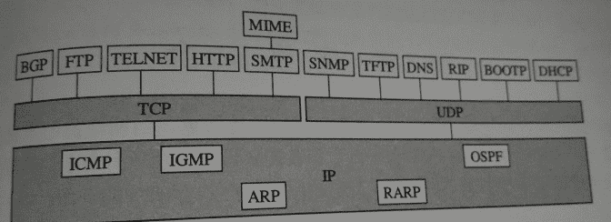

# 美团 2016 研发工程师模拟笔试题

## 1

在网站推荐区域内，会循环播出五个商家出售的五种商品，五种商品的代号为（A,B,C,D,E）一.B 比它前一个商品贵 12 元二.E 比它后一个商品贵 5 元三.C 比它前一个商品贵 14 元四.D 比它前一个商品便宜 5 元五.其中 D 的价格是 16 元，B 的价格是 40 元六.5 个商品的价格按照价格从低到高是 D,E,A,C,B 七.5 个商品之和是 135 元请问 E 的下一个是：

正确答案: D   你的答案: 空 (错误)

```cpp
A
```

```cpp
B
```

```cpp
C
```

```cpp
D
```

本题知识点

判断推理

讨论

[陋室](https://www.nowcoder.com/profile/716156)

这题很搞笑，只要注意两句就行了“5 个商品的价格按照价格从低到高是 D,E,A,C,D ”&“E 比它后一个商品贵 5 元”，所以 E 后必然是 D

发表于 2015-09-07 21:54:05

* * *

[wenyuan](https://www.nowcoder.com/profile/797299)

另一种求解步骤：1.根据 D、B 分为 16、40，以及条件一和条件四，可以得出有两件商品为 21、282.加上条件五，可以得出还有一件商品为 303.D、E、A、C、B 分别为 16,21,28,30,404.根据条件二，可知只有 D 的值比 E 小 5，因此选 D 其实还可以推断出整个排列为 EDCAB

编辑于 2015-09-08 09:16:06

* * *

[拼了命，微笑](https://www.nowcoder.com/profile/351616)

只看第二条 和第四条就可以了。

发表于 2015-09-12 08:58:58

* * *

## 2

同一进程的各个线程可以共享哪个内容？

正确答案: B   你的答案: 空 (错误)

```cpp
寄存器内容
```

```cpp
堆
```

```cpp
栈
```

```cpp
线程私有数据
```

本题知识点

操作系统

讨论

[小鱼也要飞](https://www.nowcoder.com/profile/898983)

线程和进程资源比较

| 进程占有的资源 | 线程占有的资源 |
| 地址空间   全局变量   打开的文件   子进程   信号量   账户信息 | 栈   寄存器   状态   程序计数器 |

发表于 2015-09-07 22:04:09

* * *

[NorainsLee](https://www.nowcoder.com/profile/395264)

线程占有的都是不共享的：栈   、 寄存器、 状态、 程序计数器

发表于 2015-09-07 22:09:23

* * *

[牛客 943974 号](https://www.nowcoder.com/profile/943974)

**堆：　是大家共有的空间，分全局堆和局部堆。全局堆就是所有没有分配的空间，局部堆就是用户分配的空间。堆在操作系统对进程初始化的时候分配，运行过程中也可以向系统要额外的堆，但是记得用完了要还给操作系统，要不然就是内存泄漏。****栈：是个线程独有的，保存其运行状态和局部自动变量的。栈在线程开始的时候初始化，每个线程的栈互相独立，因此，栈是　thread safe 的。操作系统在切换线程的时候会自动的切换栈，就是切换　ＳＳ／ＥＳＰ寄存器。栈空间不需要在高级语言里面显式的分配和释放。**

发表于 2016-01-04 22:55:15

* * *

## 3

单链表实现的栈，栈顶指针为 Top(仅仅是一个指针)，入栈一个 P 节点时，其操作步骤为：

正确答案: B   你的答案: 空 (错误)

```cpp
Top->next=p;
```

```cpp
p->next=Top->next;Top->next=p;
```

```cpp
p->next=Top;Top=p->next;
```

```cpp
p->next=Top;Top=Top->next;
```

本题知识点

栈 *Java 工程师 C++工程师 运维工程师 算法工程师 PHP 工程师 美团 2016* *讨论

[webary](https://www.nowcoder.com/profile/581261)

栈的表示在不同的书上一般有两  查看全部)

编辑于 2015-11-26 00:49:13

* * *

[Myworld](https://www.nowcoder.com/profile/853456)

单链表的栈，栈顶就是第一个节点，这里可以有两种实现：1、top 节点表示真实的栈顶节点；2、top 节点只是一个标识，其 next 才是栈顶节点。对于 1，入栈操作是在 top 前插入节点：p->next = top; top = p;对于 2，入栈操作是在 top 后插入节点：p->next = top->next; top->next = p;所以，选 B。

发表于 2015-09-09 11:04:26

* * *

[istar](https://www.nowcoder.com/profile/485469)

应该是 top->next = p;top = p;吧，怎么也得把 top 指向 p 啊

发表于 2015-09-08 10:53:33

* * *

## 4

下面哪一个选项是应用层的协议

正确答案: B   你的答案: 空 (错误)

```cpp
TCP
```

```cpp
FTP
```

```cpp
UDP
```

```cpp
ARP
```

本题知识点

网络基础 Java 工程师 C++工程师 运维工程师 算法工程师 PHP 工程师 美团 Java 工程师 C++工程师 运维工程师 算法工程师 PHP 工程师 美团 2016

讨论

[SunburstRun](https://www.nowcoder.com/profile/557336)

答案是 B   TCP 和  查看全部)

编辑于 2015-09-07 21:34:22

* * *

[河湖之恋](https://www.nowcoder.com/profile/220047)

看下面图就一切了然了。最下面的一层是网络层，包括 IP，ICMP，ARP 等等。第二层是传输层，包括 TCP，UDP 第三层是应用层，包括 BGP，FTP，TELNET 等等（MTME 是通用因特网邮件扩充，是在电子邮件协议 SMTP 的基础上提出的。也是应用层协议）。

发表于 2015-09-08 10:27:25

* * *

[duanhua](https://www.nowcoder.com/profile/722776)

常见的网络层协议：IP 协议、ICMP、IGMP、MPLS、ARP 常见的传输层协议：TCP、UDP 常见的应用层协议：TELNET、SMTP、HTTP、FTP、DHCP、SNMP

发表于 2015-09-08 09:28:21

* * *

## 5

有以下程序：

```cpp
#include<stdio.h>
int main(){
     int a = 1;
     int b = 3;
     int c = 5;
     int *p1 = &a;
     int *p2 = &b;
     int *p = &c;
     *p = *p1*(*p2);
     printf("%d\n", c);
}
```

执行后的输出结果是（）

正确答案: C   你的答案: 空 (错误)

```cpp
1
```

```cpp
2
```

```cpp
3
```

```cpp
4
```

本题知识点

Java 工程师 C++工程师 运维工程师 算法工程师 PHP 工程师 美团 C 语言 2016

讨论

[河湖之恋](https://www.nowcoder.com/profile/220047)

要是选项中有 5 这个答案，可能迷惑性更大一点。  *p=*p1*(*p2); //（*p1）的值为 1，（*p2）的值为 3，两者相乘的值赋给*p  。而 p 是指向 c 的地址的，所以*p 改变后，c 的值也相应的改变了。答案选 3

发表于 2015-09-08 10:18:32

* * *

[杉杉来啦](https://www.nowcoder.com/profile/243827773)

*p=*p1*(*p2); //（*p1）的值为 1，（*p2）的值为 3，两者相乘的值赋给*p 。 …………………………………… 而 p 是指向 c 的地址的，所以*p 改变后，c 的值也相应的改变了。

编辑于 2020-03-01 19:20:15

* * *

[雨花梦](https://www.nowcoder.com/profile/729279)

*p 表示去取地址对应的内容。

发表于 2015-09-07 21:59:30

* * *

## 6

java 关于异常处理机制的叙述哪些正确

正确答案: B C   你的答案: 空 (错误)

```cpp
catch 部分捕捉到异常情况时，才会执行 finally 部分
```

```cpp
当 try 区段的程序发生异常时，才会执行 catch 区段的程序
```

```cpp
在 try 区段不论程序是否发生异常及捕获到异常，都会执行 finally 部分
```

```cpp
以上都是
```

本题知识点

Java Java 工程师 C++工程师 运维工程师 算法工程师 PHP 工程师 美团 2016

讨论

[へ°飄渺尐孩](https://www.nowcoder.com/profile/884269)

1.try 和 catch 语句
●将要处理的代码放入 try 块中，然后创建相应的 catch 块的列表。如果生成都异常与 catch 中提到的相匹配，那么 catch 条件中的块语句就被执行。try 块后可能有许多 catch 块，每个都处理不同的异常。每个 catch 中的参数都是 Exception 的子类。
2.finally 语句
●finally 语句定义一个总是执行的代码，而不考虑异常是否被捕获。
3.throw 引起一个异常
‍●‍‍调用申明抛出异常●‍throw 语句强制抛出异常

发表于 2015-09-07 22:01:39

* * *

[粉色曼陀罗的花语](https://www.nowcoder.com/profile/867728)

这道题目有问题，我觉得 B 是错误的，唯有当 try 发生的异常与 catch 中所捕捉到的异常呈属于关系才能够执行 catch 区段的程序！

发表于 2015-09-10 21:11:20

* * *

[叫我老狐狸](https://www.nowcoder.com/profile/1603532)

finally 表示总是执行。但是 1\. 在 try 中调用 System.exit(0)，强制退出了程序，finally 块不执行。     -- 
2\. 在进入 try 块前，出现了异常，finally 块不执行。

发表于 2019-04-26 16:52:18

* * *

## 7

下面哪些不是链表的特征（）

正确答案: A C D   你的答案: 空 (错误)

```cpp
数据在内存中一定是连续的
```

```cpp
插入或删除时，无需移动其它元素
```

```cpp
可以随机访问表内的元素
```

```cpp
需要事先估计存储空间
```

本题知识点

链表 *讨论

[河湖之恋](https://www.nowcoder.com/profile/220047)

这道题是考察链表的最基本特性：链表是用指针来指向元素的值，所有的操作都是通过移动指针来进行的，本身的元素不需要移动。A 中，数据在内存中的地址（即物理地址）不一定连续，但是他们的逻辑地址是连续的。B 中，插入或者删除时，改变的是指向数据的指针，其元素都是不变的。C 中，对于单链表来说，只有指向链表头的头指针，所以不能随机访问表内元素，只能通过指针的移动。D 中，链表的存储空间是不需要事先估计的，他不是线性的，所以可以随着结点的增加而随时增加存储空间。

发表于 2015-09-08 10:04:53

* * *

[kmust_XiaQing](https://www.nowcoder.com/profile/439185)

ACDA 错误。答案没说清楚，它的逻辑地址是连续的，但是它的物理地址不一定连续 B 正确。它是通过指针来完成操作，数据不用移动，所以增加和删除的效率高。C 错误，只能通过指针顺序访问 D 错误，不需要预先估计存储空间，增加一个节点时，才增加空间

发表于 2015-09-09 16:19:34

* * *

[lostcode](https://www.nowcoder.com/profile/485274)

选 A、C、DA. 数据在内存中连续的是顺序表 B. 链表在插入或删除时，只需要修改指针，不需要移动元素 C. 顺序表可以随机存取，链表是顺序存取 D. 链表的大小可以动态扩展的

编辑于 2015-09-08 19:02:48

* * *

## 8

浏览器和服务器在基于 https 进行请求链接到数据传输过程中，用到了如下哪些技术：

正确答案: A B C D   你的答案: 空 (错误)

```cpp
非对称加密技术
```

```cpp
对称加密技术
```

```cpp
散列（哈希）算法
```

```cpp
数字证书
```

本题知识点

网络基础 Java 工程师 C++工程师 运维工程师 算法工程师 PHP 工程师 美团 2016

讨论

[牛妹](https://www.nowcoder.com/profile/826546)

难度：3

答案：AB

  查看全部)

编辑于 2021-08-30 19:51:19

* * *

[へ°飄渺尐孩](https://www.nowcoder.com/profile/884269)

HTTPS 在传输数据之前需要客户端（浏览器）与服务端（网站）之间进行一次握手，在握手过程中将确立双方加密传输数据的密码信息。TLS/SSL 协议不仅仅是一套加密传输的协议，更是一件经过艺术家精心设计的艺术品，TLS/SSL 中使用了非对称加密，对称加密以及 HASH 算法。握手过程的简单描述如下：
1.浏览器将自己支持的一套加密规则发送给网站。
2.网站从中选出一组加密算法与 HASH 算法，并将自己的身份信息以证书的形式发回给浏览器。证书里面包含了网站地址，加密公钥，以及证书的颁发机构等信息。
3.获得网站**证书**之后浏览器要做以下工作：
a) 验证证书的合法性（颁发证书的机构是否合法，证书中包含的网站地址是否与正在访问的地址一致等），如果证书受信任，则浏览器栏里面会显示一个小锁头，否则会给出证书不受信的提示。
b) 如果证书受信任，或者是用户接受了不受信的证书，浏览器会生成一串随机数的密码，并用证书中提供的公钥加密。
c) 使用约定好的 HASH 计算握手消息，并使用生成的随机数对消息进行加密，最后将之前生成的所有信息发送给网站。
4.网站接收浏览器发来的数据之后要做以下的操作：
a) 使用自己的私钥将信息解密取出密码，使用密码解密浏览器发来的握手消息，并验证 HASH 是否与浏览器发来的一致。
b) 使用密码加密一段握手消息，发送给浏览器。
5.浏览器解密并计算握手消息的 HASH，如果与服务端发来的 HASH 一致，此时握手过程结束，之后所有的通信数据将由之前浏览器生成的随机密码并利用对称加密算法进行加密。
这里浏览器与网站互相发送加密的握手消息并验证，目的是为了保证双方都获得了一致的密码，并且可以正常的加密解密数据，为后续真正数据的传输做一次测试。另外，HTTPS 一般使用的加密与 HASH 算法如下：
**非对称加密算法**：RSA，DSA/DSS
**对称加密算法**：AES，RC4，3DES
**HASH 算法**：MD5，SHA1，SHA256 转自**：** http://www.guokr.com/post/114121/  

编辑于 2021-08-30 19:51:19

* * *

[Noiz](https://www.nowcoder.com/profile/1129900)

非对称加密算法用于在握手过程中加密生成的密码对称加密算法用于对真正传输的数据进行加密 HASH 算法用于验证数据的完整性。数字证书肯定要选。。

发表于 2017-05-22 17:32:14

* * ***