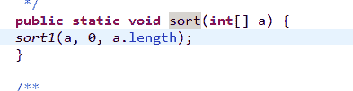
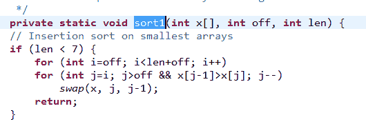

# 经典算法题精讲（六）-排序有关的面试题、动态规划的空间压缩原理

## 1

现定义数组单调和为所有元素 i 的 f(i)值之和。这里的 f(i)函数定义为元素 i 左边(不包括其自身)小于等于它的数字之和。请设计一个高效算法，计算数组的单调和。

给定一个数组**A**同时给定数组的大小**n**，请返回数组的单调和。保证数组大小小于等于 500，同时保证单调和不会超过 int 范围。

测试样例：

```cpp
[1,3,5,2,4,6],6
```

```cpp
返回：27
```

本题知识点

查找 *动态规划* *讨论

[牛客 135210 号](https://www.nowcoder.com/profile/135210)

```cpp
这题利用归并排序的特点：在归并阶段，比如左边{2, 5} 右边{3, 6}。左边的 2 肯定在 3 和 6 的前面，5 也肯定在 6 前面，所以此次归并可以算一个单调和 2 * 2 + 5 * 1=9。每次归并都计算就可得到总的和
class MonoSum {
public:
    int count = 0;
    void merge(vector<int> &arr, int start, int mid, int end) {
        vector<int> res;
        int left_index = start;
        int right_index = mid + 1;
        while(left_index <= mid && right_index <= end) {
            if(arr[left_index] <= arr[right_index]) {//合并时左边的更小
                count += (end - right_index + 1) * arr[left_index];

                res.push_back(arr[left_index]);
                left_index++;
            }
            else {
                res.push_back(arr[right_index]);
                right_index++;
            }
        }
        for(int i = left_index; i <= mid; i++) {
            res.push_back(arr[i]);
        }
        for(int i = right_index; i <= end; i++) {
            res.push_back(arr[i]);
        }
        for(int i = start; i <= end; i++) {
            arr[i] = res[i - start];
        }
    }
    void mergeSort(vector<int> &arr, int start, int end) {

        int mid = start + (end - start) / 2;
        if(mid > start) {
            mergeSort(arr, start, mid);
        }
        if(end > mid + 1) {
            mergeSort(arr, mid + 1, end);
        }
        merge(arr, start, mid, end);
    }
    int calcMonoSum(vector<int> A, int n) {
        // write code here
        if(n < 2) {
            return 0;
        }
        mergeSort(A, 0, n - 1);
        return count;
    }
};
```

发表于 2016-03-10 21:42:10

* * *

[南山北](https://www.nowcoder.com/profile/948516)

//虽然我不知道我这种方法是不是最优的，但是我感觉我这个思路绝对是最简单的

```cpp
 public int calcMonoSum(int[] A, int n) {
        int  count = 0;
        for(int i = 1 ; i < n ;i++){
            for(int j = i-1 ; j >= 0 ; j--){
                if(A[j]<=A[i]){
                    count += A[j];
                }
            }
        }
        return count;
    }
```

编辑于 2016-08-12 22:11:33

* * *

[小学作业多](https://www.nowcoder.com/profile/264534)

利用归并排序，在对有序子数组进行 merge 的同时，累加数组小和，时间复杂度 O(nlogn)，

```cpp
import java.util.*;

public class MonoSum {
    public int calcMonoSum(int[] A, int n) {
        // write code here
        if (A == null || n == 0) {
            return 0;
        }
        return mergeSortRecursion(A, 0, n - 1);
    }

    /**
     * 递归实现归并排序
     *
     * @param arr
     * @param l
     * @param r
     * @return 返回数组小和
     */
    public static int mergeSortRecursion(int[] arr, int l, int r) {
        if (l == r) {   // 当待排序数组长度为 1 时，递归开始回溯，进行 merge 操作
            return 0;
        }
        int mid = (l + r) / 2;
        return mergeSortRecursion(arr, l, mid) + mergeSortRecursion(arr, mid + 1, r) + merge(arr, l, mid, r);
    }

    /**
     * 合并两个已排好序的数组 s[left...mid]和 s[mid+1...right]
     *
     * @param arr
     * @param left
     * @param mid
     * @param right
     * @return 返回合并过程中累加的数组小和
     */
    public static int merge(int[] arr, int left, int mid, int right) {
        int[] temp = new int[right - left + 1];    // 辅助存储空间 O(n)
        int index = 0;
        int i = left;
        int j = mid + 1;
        int smallSum = 0;       // 新增，用来累加数组小和
        while (i <= mid && j <= right) {
            if (arr[i] <= arr[j]) {
                // 当前一个数组元素小于或等于后一个数组元素时，累加小和
                // s[i] <= s[j] -> s[i] <= s[j]...s[right]
                smallSum += arr[i] * (right - j + 1);
                temp[index++] = arr[i++];
            } else {
                temp[index++] = arr[j++];
            }
        }
        while (i <= mid) {
            temp[index++] = arr[i++];
        }
        while (j <= right) {
            temp[index++] = arr[j++];
        }
        for (int k = 0; k < temp.length; k++) {
            arr[left++] = temp[k];
        }
        return smallSum;
    }
}
```

发表于 2017-07-28 10:42:57

* * *

## 2

请设计一个高效算法，查找数组中未出现的最小正整数。

给定一个整数数组**A**和数组的大小**n**，请返回数组中未出现的最小正整数。保证数组大小小于等于 500。

测试样例：

```cpp
[-1,2,3,4],4
```

```cpp
返回：1
```

本题知识点

查找 *讨论

[XQ](https://www.nowcoder.com/profile/554854)

/*分析：

* 最小的没有出现的正整数

* 如果 1 没有出现 那么最小结果为 1

* 如果 1 到 n 都出现那么最下的结果为 n+1

* 因此结果的范围 1～n+1

* 数据范围最大 500 数据不是很大 可以考虑以空间换时间的做法

* 定义一个数组 res[n] 遍历数组 A 如果 A[i]>n 抛弃 不会是结果 如果 A[i]<n res[A[i]]=1;

* 遍历 res 为 0 的输出下标 即为结果*/

    public int findArrayMex(int[] A, int n) {

        int[] res = new int[n];

        for (int i = 0; i < n; i++) {

            if (A[i]>0&&A[i]<=n){

                res[A[i]-1]=1;

            }

        }

        for (int i = 0; i < n; i++) {

            if (res[i]==0){

                return i+1;

            }

        }

        return n+1;

    }

发表于 2016-03-29 10:23:52

* * *

[0pandas0](https://www.nowcoder.com/profile/773225)

搬运一个代码过来：https://leetcode.com/discuss/24013/my-short-c-solution-o-1-space-and-o-n-time

```cpp
class ArrayMex {
public:
    int findArrayMex(vector<int> A, int n) {
        // write code here
       for(int i = 0; i < n; ++ i)
            while(A[i] > 0 && A[i] <= n && A[A[i] - 1] != A[i])
                swap(A[i], A[A[i] - 1]);

        for(int i = 0; i < n; ++ i)
            if(A[i] != i + 1)
                return i + 1;

        return n + 1; 
    }
};
```

发表于 2016-05-02 14:28:46

* * *

[kakaan](https://www.nowcoder.com/profile/999066)

使用了简单的排序，遍历，

```cpp
    int findArrayMex(vector<int> A, int n) {
        sort(A.begin(),A.end());
        if(A[0]>1)return 1;
        for(int i=1;i<n;i++)
            if(A[i]-A[i-1] > 1)
                return A[i-1]+1;
        return A[n-1]+1;
    }
```

发表于 2016-09-05 11:43:38

* * *

## 3

请设计一个复杂度为 O(n)的算法，计算一个未排序数组中排序后相邻元素的最大差值。

给定一个整数数组**A**和数组的大小**n**，请返回最大差值。保证数组元素个数大于等于 2 小于等于 500。

测试样例：

```cpp
[9,3,1,10],4
```

```cpp
返回：6
```

本题知识点

查找 *编程基础 *数组** **讨论

[一枚水货](https://www.nowcoder.com/profile/641855)

参照前面一位同学的思路 本题不应该直接使用 Arrays 的 sort 方法 我们先看一下 Arrays.sort 的底层实现 是一个双重循环，这样的话复杂度是达不到题目所要求的 O(n)，故不能直接调用 sort 这个 API 方法最适合的方法是桶排序：1.找出最大值和最小值。2.生成一个最大值-最小值的区间 比如最大值 9，最小值 3，那就需要 7 个桶 3.往里面填 4.查找空桶，最多的即为最大差值。

```cpp
public static int findMaxDivision(int[] A, int n) {
	int maxnum = A[0];
	int minnum = A[0];
	for (int i = 0; i < A.length; i++) {
		if (maxnum < A[i])
			maxnum = A[i];
		if (minnum > A[i])
			minnum = A[i];
	}
	int[] arr = new int[maxnum - minnum + 1]; // 生成桶
	for (int i = 0; i < A.length; i++) {
		arr[A[i] - minnum]++; // 填桶
	}
	int count = 0;
	int max = 0;
	for (int i = 0; i < arr.length; i++) {
		if (arr[i] == 0) { // 桶为空
			count++;   //记录连续空桶数
		} else {
			if (max < count)
				max = count;
			count = 0;
		}
	}
	return max+1;  //如最大值为 9，最小值为 3，中间有 5 个空桶，但差值应为 6
}
```

编辑于 2016-06-23 20:28:23

* * *

[小学作业多](https://www.nowcoder.com/profile/264534)

利用桶排序的思想，

```cpp
import java.util.*;

public class MaxDivision {
    public int findMaxDivision(int[] A, int n) {
        // write code here
        if (A == null || A.length < 2) {
            return 0;
        }
        int min = Integer.MAX_VALUE;
        int max = Integer.MIN_VALUE;
        for (int i = 0; i < n; i++) { // 找到数组的最小值和最大值
            if (A[i] < min) {
                min = A[i];
            }
            if (A[i] > max) {
                max = A[i];
            }
        }
        if (min == max) {
            return 0;
        }
        boolean[] hasNum = new boolean[n + 1]; // 标识桶中是否有数
        int[] bMins = new int[n + 1];          // 桶中最小值
        int[] bMaxs = new int[n + 1];          // 桶中最大值
        for (int i = 0; i < n; i++) {          // 统计每个桶中的最小值和最大值
            int b = mapToBucket(A[i], n, min, max);  // 当前元素所在的桶
            if (hasNum[b]) {
                if (A[i] < bMins[b]) {
                    bMins[b] = A[i];
                }
                if (A[i] > bMaxs[b]) {
                    bMaxs[b] = A[i];
                }
            } else {
                bMins[b] = bMaxs[b] = A[i];
                hasNum[b] = true;
            }
        }
        int maxGap = 0;
        int lastbMax = bMaxs[0];    // 前一个非空桶的最大值，第一个非空桶必是 0 号桶
        int b = 1;
        while (b <= n) {
            if (hasNum[b]) {
                if (bMins[b] - lastbMax > maxGap) { // 当前非空桶的最小值与上一个非空桶的最大值做差，取最大差值
                    maxGap = bMins[b] - lastbMax;
                }
                lastbMax = bMaxs[b];
            }
            b++;
        }
        return maxGap;
    }

    /**
     * 映射函数，将数组元素映射到桶中，使用 long 类型防止相乘时溢出
     *
     * @param num
     * @param n
     * @param min
     * @param max
     * @return
     */
    public int mapToBucket(long num, long n, long min, long max) {
        return (int) ((num - min) * n / (max - min));
    }
}
```

发表于 2017-08-06 11:57:54

* * *

[华科平凡](https://www.nowcoder.com/profile/4939096)

python solution, easy to understand:

```cpp
 class MaxDivision:
    def findMaxDivision(self, A, n):
        res, A = 0, sorted(A)
        for i, v in enumerate(A):
            if i != n - 1:
                res = max(res, A[i + 1] - v)
        return res 
```

发表于 2017-09-12 12:02:42

* * *****