# 腾讯 2016 研发工程师笔试题（三）

## 1

我们常说的 mvc 框架是指的什么的?

正确答案: D   你的答案: 空 (错误)

```cpp
模块(module)-视图(view)-组件(component)
```

```cpp
模型(model)-视图(view)-组件(component)
```

```cpp
模块(module)-视图(view)-控制器(controller)
```

```cpp
模型(model)-视图(view)-控制器(controller)
```

本题知识点

软件工程

讨论

[大漠孤狼](https://www.nowcoder.com/profile/527123)

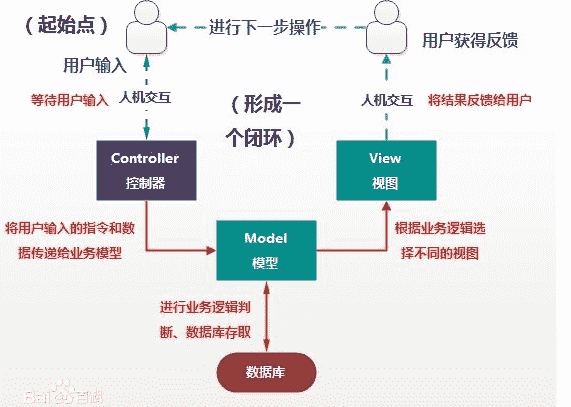

发表于 2015-09-08 17:00:59

* * *

[菩提旭光](https://www.nowcoder.com/profile/837579)

**Java web 开发中经典的三层模型：MVC**

发表于 2015-09-08 16:22:18

* * *

[銮彧](https://www.nowcoder.com/profile/3468703)

mvc 是 web 层框架的经典设计模式，比如 struts2 和 springmvc，model 代表数据，view 是渲染之后的视图，controller 一般是 servlet

发表于 2016-11-09 14:20:11

* * *

## 2

对某二叉树进行先序遍历的结果是 ABDEFC，中序遍历的结果是 DBFEAC，则后序遍历的结果是（）

正确答案: B   你的答案: 空 (错误)

```cpp
DBFEAC
```

```cpp
DFEBCA
```

```cpp
BDFECA
```

```cpp
BDEFAC
```

本题知识点

树

讨论

[guanjian](https://www.nowcoder.com/profile/564796)

这种题不要去画图啦，太慢~~~1.先序 是 ABDEFC=>根为 A=》 *****A，答案在 BD 间 2.( 中序是 DBFEAC 过滤后） 先序 是 BDEF ，中序是 DBFE=> 根为 B= 》 ***BCA ,答案为 B 附:先序遍历：根 -> 左子树 -> 右子树中序遍历：左子树 -> 根 -> 右子树后序遍历：左子树 -> 右子树 -> 根

发表于 2015-09-09 11:46:20

* * *

[大漠孤狼](https://www.nowcoder.com/profile/527123)

先序遍历：根 -> 左子树 -> 右子树中序遍历：左子树 -> 根 -> 右子树后序遍历：左子树 -> 右子树 -> 根 1、根据先序遍历，根节点为 A2、根据后序遍历，A 左子树是 DBFE，右子树是 C3、根据先序遍历，A 左子树中，B 是 A 的左孩子 4、根据后序遍历，D 是 B 的左孩子，EF 是 B 的右子树 5、同上得树结构如图，后序遍历 DFEBCA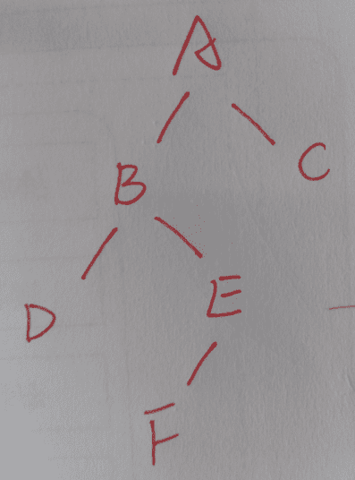 

编辑于 2015-09-08 17:18:14

* * *

[菩提旭光](https://www.nowcoder.com/profile/837579)

****模拟** **操作，即可知道结果：**** **画出树，A 的左孩子为 B，A 的右孩子为 C；B 的左右孩子分别为 D、E；E 的左孩子为 F。后序遍历是先左孩子，再右孩子，最后根。**

发表于 2015-09-08 16:22:56

* * *

## 3

有一个如下的结构体：

```cpp
struct A{
 long a1;
 short a2;
 int a3;
 int *a4;
};
```

请问在 64 位编译器下用 sizeof(struct A)计算出的大小是多少？

正确答案: A   你的答案: 空 (错误)

```cpp
24
```

```cpp
28
```

```cpp
16
```

```cpp
18
```

本题知识点

C++ C 语言

讨论

[guanjian](https://www.nowcoder.com/profile/564796)

**A1.什么是内存对**  查看全部)

编辑于 2016-01-13 12:34:28

* * *

[anothercoderfromgit](https://www.nowcoder.com/profile/170365)

```cpp
第一个，8 字节
第二个，2 字节，加起来是 10，对齐到 12
第三个，4 字节，加起来是 16
第四个，8 字节，加起来是 24
 所以一共是 24 字节
多看看就背住了：
32 位编译器：32 位系统下指针占用 4 字节
      char ：1 个字节
      char*（即指针变量）: 4 个字节（32 位的寻址空间是 2³², 即 32 个 bit，也就是 4 个字节。同理 64 位编译器）
      short int : 2 个字节
      int：  4 个字节
      unsigned int : 4 个字节
      float:  4 个字节
      double:   8 个字节
      long:   4 个字节
      long long:  8 个字节
      unsigned long:  4 个字节
64 位编译器：64 位系统下指针占用 8 字节
      char ：1 个字节
      char*(即指针变量): 8 个字节
      short int : 2 个字节
      int：  4 个字节
      unsigned int : 4 个字节
      float:  4 个字节
      double:   8 个字节
      long:   8 个字节
      long long:  8 个字节
      unsigned long:  8 个字节
```

编辑于 2017-05-09 15:23:33

* * *

[牛客 223996 号](https://www.nowcoder.com/profile/223996)

预备知识：基本类型占用字节在 32 位操作系统和 64 位操作系统上，基本数据类型分别占多少字节呢？32 位操作系统：char : 1    int ：4    short : 2    unsigned int : 4    long : 4    unsigned long : 4    long long : 8     float : 4    double : 8    指针 : 464 位操作系统 char : 1    int ：4    short : 2    unsigned int : 4    long : 8    unsigned long : 8    long long : 8     float : 4    double : 8    指针 : 8 内存对齐：成员对齐有一个重要的条件，即每个成员按自己的方式对齐。其对齐的规则是：每个成员按其类型的对齐参数(通常是这个类型的大小)和指定对齐参数(这里默认是 8 字节)中较小的一个对齐。并且结构的长度必须为所用过的所有对齐参数的整数倍。不够就补空字节。举例：复制代码 struct t{    long a;    short b;    int c;    int *d;     char e;}复制代码在 64 位操作系统中的大小。分析：按照声明的顺序一个一个分配内存空间。首先 long 型变量 a，在 64 位地址空间中，long 型占 8 个字节，所以按照上面的对齐条件，这个成员应该按照对其参数 min(sizeof(long), 8) = 8 字节来对齐，所以把这个成员存放在 0~7 内存单元中。然后 short 型变量 b，在 64 位地址空间中，short 型占 2 个字节，所以按照上面的对齐条件，这个成员应该按照对其参数 min(sizeof(short), 8) = 2 字节来对齐，所以把这个成员存放在 8~9 内存单元中。然后 int 型变量 c，在 64 位地址空间中，int 型占 4 个字节，所以按照上面的对齐条件，这个成员应该按照对其参数 min(sizeof(int), 8) = 4 字节来对齐，所以把这个成员存放在 12~15 内存单元中（10，11 单元都不能被 4 整除）。然后 int*型变量 d，在 64 位地址空间中，指针型占 8 个字节，所以按照上面的对齐条件，这个成员应该按照对其参数 min(sizeof(int*), 8) = 8 字节来对齐，所以把这个成员存放在 16~23 内存单元中。然后 char 型变量 e，在 64 位地址空间中，char 型占 1 个字节，所以按照上面的对齐条件，这个成员应该按照对其参数 min(sizeof(char), 8) = 1 字节来对齐，所以把这个成员存放在 24 内存单元中。然后整个结构体的长度必须为所有对齐参数的整数倍，当前长度为 25，不是所有对齐参数整数倍，必须调整为 32，才是所有参数整数倍。所以这个结构体的长度为 32。如果结构体中出现子结构体怎么办？我们在确定子结构体的对齐参数时，应该就是它的所有成员使用的对齐参数中最大的一个。举例：复制代码 struct t{    char a;    int b;};struct s{   char c;   struct t d;   char e;};复制代码在 32 位操作系统下的长度。首先确定 t 的大小为 8，它的所有成员使用的对齐参数最大为 4。再考察 s：首先 char 型变量 c，在 32 位地址空间中，char 型占 1 个字节，所以按照上面的对齐条件，这个成员应该按照对其参数 min(sizeof(char), 8) = 1 字节来对齐，所以把这个成员存放在 0 内存单元中。然后 struct t 型变量 d，在 32 位地址空间中，struct t 占 8 个字节，所以按照上面的对齐条件，这个成员应该按照对其参数 4 字节来对齐，所以把这个成员存放在 4~11 内存单元中。然后 char 型变量 e，在 32 位地址空间中，char 型占 1 个字节，所以按照上面的对齐条件，这个成员应该按照对其参数 min(sizeof(char), 8) = 1 字节来对齐，所以把这个成员存放在 12 内存单元中。然后整个结构体的长度必须为所有对齐参数的整数倍，当前长度为 13，不是所有对齐参数整数倍，必须调整为 16，才是所有参数整数倍。所以此结构体大小为 16\.

发表于 2016-03-20 15:15:42

* * *

## 4

以下不属于 tcp 连接断开的状态是？

正确答案: C   你的答案: 空 (错误)

```cpp
TIME_WAIT
```

```cpp
FIN_WAIT_1
```

```cpp
SYNC_SENT
```

```cpp
FIN_WAIT_2
```

本题知识点

网络基础

讨论

[好学上进](https://www.nowcoder.com/profile/708096)

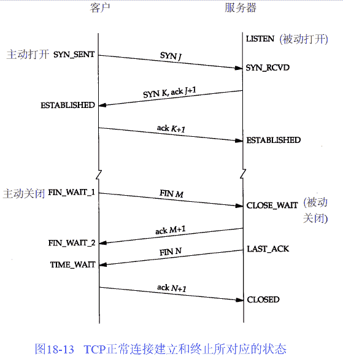

编辑于 2016-04-27 10:44:33

* * *

[把记忆留在昨天](https://www.nowcoder.com/profile/824780)

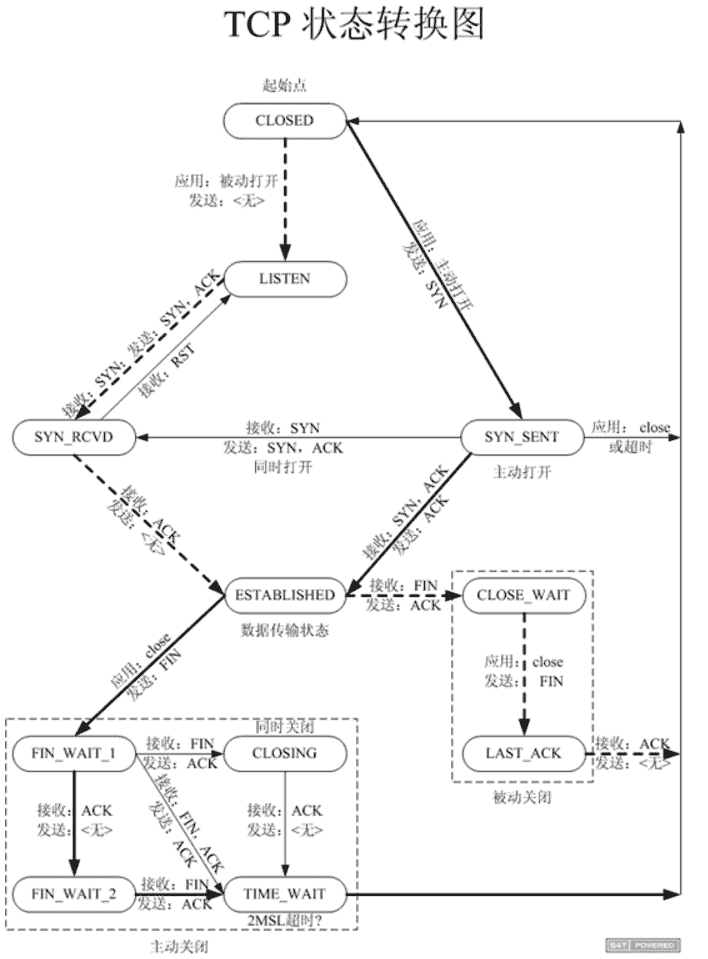

发表于 2016-04-03 10:45:04

* * *

[菩提旭光](https://www.nowcoder.com/profile/837579)

**当某个连接的一端处于 TIME_WAIT 状态时，该连接将不能再被使用。fin_wait1 状态是在 server 端主动要求关闭 tcp 连接，并且主动发送 fin 以后，等待 client 端回复 ack 时候的状态。Server 端强制断开 Socket 时向客户端发送了 FIN 请求，客户端已经没有能力继续回复 ACK，造成了服务器端大量的端口处在 FIN_WAIT_2 状态，**

发表于 2015-09-08 16:26:53

* * *

## 5

下面关于 ICMP 协议的描述中，正确的是（）

正确答案: C   你的答案: 空 (错误)

```cpp
ICMP 协议根据 MAC 地址查找对应的 IP 地址
```

```cpp
ICMP 协议把公网的 IP 地址转换为私网的 IP 地址
```

```cpp
ICMP 协议用于控制数据报传送中的差错情况
```

```cpp
ICMP 协议集中管理网络中的 IP 地址分配
```

本题知识点

网络基础

讨论

[陋室](https://www.nowcoder.com/profile/716156)

A 是 RARP 协议完成的
B 是 NAT 协议完成的
D 是 DHCP 协议完成的

编辑于 2015-09-09 20:40:00

* * *

[guanjian](https://www.nowcoder.com/profile/564796)

ICMP 是（Internet Control Message Protocol）Internet 控制 [报文](http://baike.baidu.com/view/175122.htm) 协议。它是 [TCP/IP 协议族](http://baike.baidu.com/view/2221037.htm) 的一个子协议，用于在 IP [主机](http://baike.baidu.com/view/23880.htm) 、 [路由](http://baike.baidu.com/view/18655.htm) 器之间传递控制消息。控制消息是指 [网络通](http://baike.baidu.com/view/8079702.htm) 不通、 [主机](http://baike.baidu.com/view/23880.htm) 是否可达、 [路由](http://baike.baidu.com/view/18655.htm) 是否可用等网络本身的消息

在 IPv4 协议中最常用的 ICMP 消息类型有以下几种:

•   回显应答(类型 0)和回显请求(类型 8):这是 Ping 程序发送的信息。

•目标不可达(类型 3)

•源抑制(类型 4):这是一种用于通知发送者路由器或者主机出现阻塞现象的 ICMP 消息，发送者需要降低发送速度。

•重定向(类型 5):这个消息用来向可以访问两台路由器的主机说“请使用另一台路由器”。

•路由器信息应答(类型 9)和路由器信息请求(类型 10)

•超时(类型 11):这个消息有两种用途。第一，当超过 IP 生存期时向发送系统发出错误信息。第二，如果分段的 IP 数据报没有在某种时限内重新组合，这个消息将通知发送系统。

发表于 2015-09-09 17:35:51

* * *

[菩提旭光](https://www.nowcoder.com/profile/837579)

A 是 ARP 协议完成的
**B 是 NAT 协议完成的**
D 是 DHCP 协议完成的

发表于 2015-09-08 16:27:22

* * *

## 6

有如下一个类似跳表的数据结构：每层都是已经排好序的链表，level1 层的链表有所有元素，levelN 层的链表只有 levelN-1 的 1 半的元素，levelN 层的结点指向 levelN-1 层中相同的结点。请问查找一个元素的时间复杂度是：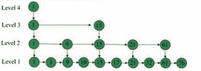

正确答案: A   你的答案: 空 (错误)

```cpp
O(logn)
```

```cpp
O(n)
```

```cpp
O(nlogn)
```

```cpp
O(n²)
```

本题知识点

高级结构

讨论

[可笑痴狂](https://www.nowcoder.com/profile/264671)

二分查找时间复杂度计算：

总共有 n 个元素，

渐渐跟下去就是 n,n/2,n/4,....n/2^k，其中 k 就是循环的次数

由于你 n/2^k 取整后>=1

即令 n/2^k=1

可得 k=log2n,（是以 2 为底，n 的对数）

所以时间复杂度可以表示 O()=O(logn)

发表于 2015-12-30 15:00:10

* * *

[小乌](https://www.nowcoder.com/profile/477630)

链表也可以二分查找吗

发表于 2016-09-17 19:08:20

* * *

[陋室](https://www.nowcoder.com/profile/716156)

基本的二分查找时间复杂度 O(logn)

发表于 2015-09-08 15:51:54

* * *

## 7

22.在一个单 CPU 的处理机中，有 P1，P3，P5 三个作业，有两个 IO 设备 IO1，IO2，并且能够实现抢先式多任务并行工作的多道程序环境中，投入运行优先级由高到低 P5，P1，P3 三个作业，他们使用设备的先后顺序和占用设备的时间分别为：P1:IO2(10ms) CPU(10ms) IO1(30ms）CPU(10ms)P3:IO1(30ms) CPU(10ms) IO2(30ms）CPU(10ms)P5:CPU(20ms) IO1(30ms) CPU(10ms) IO2(15ms）忽略其他的时间损耗，3 个作业投入到全部完成的情况下。请问下列哪些选项为 IO2 的设备利用率？

正确答案: E   你的答案: 空 (错误)

```cpp
0.55
```

```cpp
0.26
```

```cpp
0.48
```

```cpp
0.5
```

```cpp
0.39
```

本题知识点

操作系统

讨论

[L0L](https://www.nowcoder.com/profile/685628)

因为是抢占式的，所以优先级最  查看全部)

编辑于 2016-03-25 10:31:32

* * *

[陋室](https://www.nowcoder.com/profile/716156)

执行过程如下，注意是可以抢占的，所以只要先画 p5 再画 p1 最后画 p3 就可以了。字不太好看，大家见谅啊。
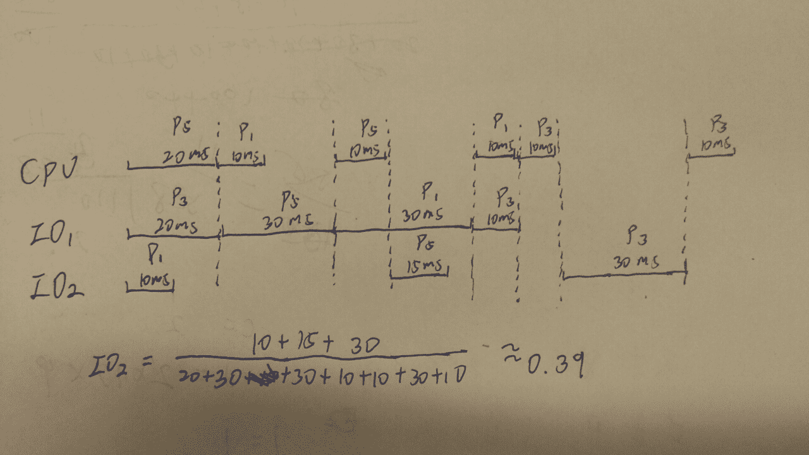

编辑于 2015-09-08 16:04:28

* * *

[牛客 769662 号](https://www.nowcoder.com/profile/769662)

个人觉得这个题有问题，io 设备，比如打印机，是不能被抢占的。只能等进程主动释放

发表于 2015-11-15 00:03:26

* * *

## 8

C 语言里 i=5,j=7,请问 i|j 等于多少？

正确答案: D   你的答案: 空 (错误)

```cpp
1
```

```cpp
3
```

```cpp
5
```

```cpp
7
```

本题知识点

C 语言

讨论

[以奔跑以吟哦以笙箫以离歌](https://www.nowcoder.com/profile/147791)

| 是位操作符 或 的意思先把 5 和 7 转化为二进制 101 和 111 按位或就是 111 ，所以答案是 7

发表于 2015-09-14 15:05:36

* * *

[天真的德鲁伊](https://www.nowcoder.com/profile/787744)

注意区分 | 按位或|| 逻辑或如果是 i || j 那么结果为 1

发表于 2016-08-25 11:34:21

* * *

[Rachy](https://www.nowcoder.com/profile/9395030)

注意是按位或：|

发表于 2016-09-30 21:34:55

* * *

## 9

请选择下面代码的输出结果

```cpp
#include <iostream>
using namespace std;
int main(int argc, char*argv[])
{
    int a = 10;
    int b = 4;
    int c = a / b;
    int d = c * a * b++;
    std::cout << d << std::endl;
    return 0;
}
```

正确答案: B   你的答案: 空 (错误)

```cpp
60
```

```cpp
80
```

```cpp
100
```

```cpp
125
```

本题知识点

C++ C 语言

讨论

[依梦&潇湘](https://www.nowcoder.com/profile/754177)

int d=c*a*b++;后缀自加运算符非优先级高于算术运算符*，所以先执行 b++，此时 b 的值为 5，但 b++的值仍然为 4；接着按自左向右的顺序执行 c*a*b++,等价于 c*a*(b++),即 2*10*4，所以结果为 80\.

发表于 2016-08-15 16:56:57

* * *

[icebreaker](https://www.nowcoder.com/profile/658689)

```cpp
int a = 10;
int b = 4;
int c = a / b; // c = 2
int d = c * a * b++; // d = 2 * 10 * 4++，b 在运算之后自增为 b = 5
printf("%d\n", d); // 80
```

编辑于 2015-09-09 10:01:14

* * *

[WHUTdq](https://www.nowcoder.com/profile/9172499)

a=10;b=4;c=a/b=2;//注意 c 为 int 型，舍去后缀 d=2*10*4=80

发表于 2016-09-04 15:19:11

* * *

## 10

请问下列代码的输出结果有可能是哪些（）？

```cpp
#include <stdint.h>
#include <stdio.h>
union X {
    int32_t a;
    struct {
        int16_t b;
        int16_t c;
    };
};
int main() {
    X x;
    x.a = 0x20150810;
    printf("%x,%x\n", x.b, x.c);
    return 0;
}

```

正确答案: A C   你的答案: 空 (错误)

```cpp
2015,810
```

```cpp
50810,201
```

```cpp
810,2015
```

```cpp
20150,810
```

本题知识点

C 语言

讨论

[啊哈啊哈啊哈](https://www.nowcoder.com/profile/173599)

0x20150810 如果按照大端模式存储：从低地址到高地址：20 15 08 10 输出从低地址到高地址：20 15 08 10 如果按照小端模式存储：从低地址到高地址：10 08 15 20                                   输出从高地址到低地址：08 10 20 15

发表于 2016-04-03 00:21:12

* * *

[NewObject](https://www.nowcoder.com/profile/738831)

32bit 宽的数 0x12345678
在 Little-endian 模式 CPU 内存中的存放方式（假设从地址 0x4000 开始存放）为：                                           内存地址     0x4000     0x4001     0x4002     0x4003
                                          存放内容     0x78        0x56        0x34         0x12
而在 Big- endian 模式 CPU 内存中的存放方式则为：
                                          内存地址     0x4000     0x4001     0x4002     0x4003
                                          存放内容     0x12         0x34        0x56         0x78

发表于 2015-09-16 10:21:15

* * *

[牛客 908875 号](https://www.nowcoder.com/profile/908875)

0x20150810 如果按照大端模式存储:从低地址到高地址：20 15 08 10 ，so 结果就是 2015  810 如果按照小端模式存储:从低地址到高地址：10 08 15 20  ，so 结果就是 810 2015 不知道 我错在哪里，求指教

编辑于 2016-02-26 20:38:22

* * *

## 11

如下代码，result 变量的输出结果是多少？

```cpp
#include<iostream>
using namespace std;
int i=1;
class MyCls{
public:
	MyCls():m_nFor(m_nThd),m_nSec(i++),m_nFir(i++),m_nThd(i++){
		m_nThd=i;
	}
	void echo(){
		cout<<"result:"<<m_nFir+m_nSec+m_nThd+m_nFor<<endl;
	}
private:
	int m_nFir;
	int m_nSec;
	int m_nThd;
	int &m_nFor;
};
int main()
{
	MyCls oCls;
	oCls.echo();
	return 0;
}
```

正确答案: B   你的答案: 空 (错误)

```cpp
10
```

```cpp
11
```

```cpp
9
```

```cpp
12
```

```cpp
8
```

本题知识点

C++

讨论

[chinasanshi](https://www.nowcoder.com/profile/313490)

首先要明白变量初始化的顺序是  查看全部)

编辑于 2016-03-25 10:35:47

* * *

[Levin](https://www.nowcoder.com/profile/229467)

我是这么理解的：程序初始化的时候是根据在类中声明的顺序进行初始化。所以先给 m_nFir 赋值……一直到 m_nThd = 3。然后执行 m_nFor = m_nThd。此时 m_nFor 和 m_nThd 都是 3。但是 i = 4。然后执行构造函数，m_nThd = 4。因为 m_nFor 是引用类型，所以 m_nFor 此时也变为 4。所以答案是 1+2+4+4=11\.

发表于 2015-09-08 17:02:18

* * *

[huixieqingchun](https://www.nowcoder.com/profile/551201)

**构造函数中变量的初始化顺序是按其定义的顺序，与初始化列表中的顺序无关。所以一定要注意。**

发表于 2016-05-19 16:06:31

* * *

## 12

在动态分区分配方案中，某一作业完成后，系统收回其主存空间，并与相邻空闲区合并，为此需要修改空闲区表，造成空闲区数减 1 的情况是()

正确答案: D   你的答案: 空 (错误)

```cpp
无上邻空闲区，也无下邻空闲区
```

```cpp
有上邻空闲区，但无下邻空闲区
```

```cpp
有下邻空闲区，但无下邻空闲区
```

```cpp
有上邻空闲区，也有下邻空闲区
```

本题知识点

操作系统

讨论

[Superbo](https://www.nowcoder.com/profile/641718)

作业归还分区，要调整空闲区表  查看全部)

编辑于 2016-05-19 12:29:52

* * *

[orzOrzorzOrz](https://www.nowcoder.com/profile/374725)

进来一个，消除两个，总数减一

发表于 2015-09-08 16:29:04

* * *

[Pandora](https://www.nowcoder.com/profile/266279)

假设原本的空闲区表空闲区数目为 n，**注意系统收回的主存空间（已空闲）并没有被加入到空闲区表** ，所以空闲区数目仍为 n。现在要进行空闲区与回收主存空间合并，只有将原本的空闲区中的 2 块合成 1 块，才会有数目减 1 的效果。

发表于 2015-09-08 17:33:45

* * *

## 13

对于移动平均算法，是计算某变量之前 n 个数值的算术平均，正确的说法是：

正确答案: A   你的答案: 空 (错误)

```cpp
空间复杂度是 O(l)
```

```cpp
空间复杂度是 O(n)
```

```cpp
空间复杂度是 O(logn)
```

```cpp
空间复杂度是 O(nlogn)
```

本题知识点

复杂度

讨论

[我想去跳海](https://www.nowcoder.com/profile/808724)

注意这道题是空间复杂度，不是时间复杂度。空间复杂度是 O（1）。时间复杂度是 O（n）。

发表于 2015-09-08 17:06:51

* * *

[chinasanshi](https://www.nowcoder.com/profile/313490)

算法应该只需要保存一个“和”（int 或者其他类型），所以空间复杂度为 1

发表于 2015-09-08 17:04:47

* * *

[webary](https://www.nowcoder.com/profile/581261)

 任何一个算法不同情况下可能有多种解法，一般我们以时间复杂度为评判的话，就会用牺牲空间换时间。
这个算法最明显的有两种解法，
1.每次进来一个变量 n，就遍历前面 n 个数，然后求和，再取平均，这样的话时间复杂度为 O（n），空间为 O(1)；
2.以空间换时间：从前往后没计算一次保留一次求和值到一个辅助空间，这样计算下一个的时候直接取得前一个和值加上当前数，再取平均得到当前平均，这样的话时间复杂度为 O(1),空间为 O(n) 

发表于 2015-09-08 17:28:00

* * *

## 14

某一速率为 100M 的交换机有 20 个端口，其一个端口上连着一台笔记本电脑，此电脑从迅雷上下载一部 1G 的电影需要的时间可能是多久？

正确答案: D E   你的答案: 空 (错误)

```cpp
10S
```

```cpp
20S
```

```cpp
40S
```

```cpp
100S
```

```cpp
200S
```

本题知识点

网络基础

讨论

[Pandora](https://www.nowcoder.com/profile/266279)

DE 交换机为独占带宽，  查看全部)

编辑于 2015-12-21 09:29:13

* * *

[watermaker](https://www.nowcoder.com/profile/359326)

网速为 100Mbps，电影 1G 为 1GByte，先应该变为相同的单位。1*1024MByte/(100/8) =81.92s.这是最大速度了，所以大于这个时间都是合理的。

发表于 2015-09-09 22:46:04

* * *

[kellan](https://www.nowcoder.com/profile/137104)

1G 电影大小为:1GB=1024MB
带宽 100M 为 100Mb=12.5MB

发表于 2015-09-08 16:44:24

* * *

## 15

在 linux 编程中，以下哪个 TCP 的套接字选项与 nagle 算法的开启和关闭有关？

正确答案: B   你的答案: 空 (错误)

```cpp
TCP_MAXSEG
```

```cpp
TCP_NODELAY
```

```cpp
TCP_SYNCNT
```

```cpp
TCP_KEEPALIVE
```

本题知识点

Linux 大数据开发工程师 数据分析师 数据库工程师 哔哩哔哩 2021

讨论

[guanjian](https://www.nowcoder.com/profile/564796)

当有一个 TCP 数据段不足 MS  查看全部)

编辑于 2016-05-06 10:53:32

* * *

[youloveme](https://www.nowcoder.com/profile/706834)

Nagle 算法的规则：（1）如果包长度达到 MSS，则允许发送；（2）如果该包含有 FIN，则允许发送；（3）设置了 TCP_NODELAY 选项，则允许发送；（4）未设置 TCP_CORK 选项时，若所有发出去的小数据包（包长度小于 MSS）均被确认，则允许发送；（5）上述条件都未满足，但发生了超时（一般为 200ms），则立即发送。
Nagle 算法只允许一个未被 ACK 的包存在于网络，它并不管包的大小，因此它事实上就是一个扩展的停-等协议，只不过它是基于包停-等的，而不是基于字节停-等的。Nagle 算法完全由 TCP 协议的 ACK 机制决定，这会带来一些问题，比如如果对端 ACK 回复很快的话，Nagle 事实上不会拼接太多的数据包，虽然避免了网络拥塞，网络总体的利用率依然很低。Nagle 算法是 silly window syndrome(SWS)预防算法的一个半集。SWS 算法预防发送少量的数据，Nagle 算法是其在发送方的实现，而接收方要做的是不要通告缓冲空间的很小增长，不通知小窗口，除非缓冲区空间有显著的增长。这里显著的增长定义为完全大小的段（MSS）或增长到大于最大窗口的一半。
注意：BSD 的实现是允许在空闲链接上发送大的写操作剩下的最后的小段，也就是说，当超过 1 个 MSS 数据发送时，内核先依次发送完 n 个 MSS 的数据包，然后再发送尾部的小数据包，其间不再延时等待。（假设网络不阻塞且接收窗口足够大）举个例子，比如之前的 blog 中的实验，一开始 client 端调用 socket 的 write 操作将一个 int 型数据（称为 A 块）写入到网络中，由于此时连接是空闲的（也就是说还没有未被确认的小段），因此这个 int 型数据会被马上发送到 server 端，接着，client 端又调用 write 操作写入‘\r\n’（简称 B 块），这个时候，A 块的 ACK 没有返回，所以可以认为已经存在了一个未被确认的小段，所以 B 块没有立即被发送，一直等待 A 块的 ACK 收到（大概 40ms 之后），B 块才被发送。整个过程如图所示：这里还隐藏了一个问题，就是 A 块数据的 ACK 为什么 40ms 之后才收到？这是因为 TCP/IP 中不仅仅有 nagle 算法，还有一个 TCP 确认延迟机制 。当 Server 端收到数据之后，它并不会马上向 client 端发送 ACK，而是会将 ACK 的发送延迟一段时间（假设为 t），它希望在 t 时间内 server 端会向 client 端发送应答数据，这样 ACK 就能够和应答数据一起发送，就像是应答数据捎带着 ACK 过去。在我之前的时间中，t 大概就是 40ms。这就解释了为什么'\r\n'（B 块）总是在 A 块之后 40ms 才发出。
当然，TCP 确认延迟 40ms 并不是一直不变的，TCP 连接的延迟确认时间一般初始化为最小值 40ms，随后根据连接的重传超时时间（RTO）、上次收到数据包与本次接收数据包的时间间隔等参数进行不断调整。另外可以通过设置 TCP_QUICKACK 选项来取消确认延迟。

发表于 2016-01-21 14:57:38

* * *

[噼里啪啦酱](https://www.nowcoder.com/profile/486089)

答案 B，这个主要是为了解决大量的小报文对通信造成的影响，提高传输效率

发表于 2015-09-10 11:06:03

* * *

## 16

某二叉树的先根遍历序列和后根遍历序列正好相反，则该二叉树具有的特征是()

正确答案: A   你的答案: 空 (错误)

```cpp
高度等于其结点数
```

```cpp
任一结点无左孩子
```

```cpp
任一结点无右孩子
```

```cpp
空或只有一个结点
```

本题知识点

树

讨论

[陋室](https://www.nowcoder.com/profile/716156)

  查看全部)

编辑于 2016-04-16 16:09:03

* * *

[momosmile](https://www.nowcoder.com/profile/925249)

只要是链，不一定非要无左孩子或无右孩子。即高度和结点数相等。

发表于 2016-03-29 19:11:14

* * *

[yayamma](https://www.nowcoder.com/profile/270051)

失误选了 AD，现在想想 D 对的话，若只有一个结点 a，则遍历结果均为 a，先序和后序遍历结果是一样的

发表于 2015-09-09 09:27:17

* * *

## 17

已知关系 R（F,G,H,I,J）及其上的函数相关性集合，F=(F->G,J->F,HJ->I),该关系的候选关键字是：

正确答案: B   你的答案: 空 (错误)

```cpp
FJ
```

```cpp
HJ
```

```cpp
HI
```

```cpp
IJ
```

本题知识点

数据库

讨论

[炫](https://www.nowcoder.com/profile/376795)

由依赖关系可以得出：J 可以推导出 F，F 推导出 G，H 和 J 联合可以推导出 I，即利用 H 和 J 可以推导出所有的字段

发表于 2016-03-04 13:17:23

* * *

[好学上进](https://www.nowcoder.com/profile/708096)

看箭头右边，箭头右边是 G、F、I，没有 H、J，这说明 H 和 J 不能由其它字母推出，所以，候选关键字中必然包括Ｈ和Ｊ，又，利用 HJ，通过函数相关性集合，可以推出全部字母，所以，HJ 就是候选关键字。

发表于 2016-03-28 19:06:08

* * *

[stevenniu](https://www.nowcoder.com/profile/595432)

如果一个 [超关键字](http://baike.baidu.com/subview/703582/703582.htm) 去掉其中任何一个字段后不再能唯一地确定记录，则称它为“候选关键字”（Candidate Key）。候选关键字既能唯一地确定记录，它包含的字段又是最精炼的。也就是说候选关键字是最简单的超关键字。排除掉含有 g f i 的

发表于 2015-09-08 16:49:47

* * *

## 18

win32 系统里，下面几个 sizeof 的运行结果是（）

```cpp
int intValue=1024;
char str[]="Tencent";
const char* ch=str;
sizeof(intValue)=__a___;
sizeof(str)=__b____;
sizeof(ch)=____c___;
```

正确答案: D   你的答案: 空 (错误)

```cpp
a=1,b=1,c=1
```

```cpp
a=4,b=4,c=4
```

```cpp
a=4,b=7,c=4
```

```cpp
a=4,b=8,c=4
```

本题知识点

C++

讨论

[莫笑☁️輕狂](https://www.nowcoder.com/profile/152216)

首先 int 肯定是 4 不用说了，a＝4 第二个 str［］代表 char 型数据，整个数组存‘Tencent\0’，所以长度为 8，b＝8 第三个，32 位机跟 64 位机的变量的差别主要在指针大小上，32 位机指针长度为 4，64 位机指针长度为 8，c＝4

发表于 2015-09-08 17:52:07

* * *

[逆向飞翔](https://www.nowcoder.com/profile/645372)

**无论是整型数组还是字符数组，数组名作为右值的时候都代表数组首元素的首地址。**数组发生降级:：  数组名作为参数传参，数组名参与运算数组名不发生降级：sizeof（数组名），&数组名             

发表于 2016-05-03 00:27:54

* * *

[光头仔](https://www.nowcoder.com/profile/8353353)

首先得明确 char 类型占一个字节，int 类型占 4 个字节，所以，sizeof（char）=1，sizeof（int）=4,另外，ch 是一个指针，只是指向了字符串"str"而已。所以 sizeof（ch）不是 字符串 占的空间也不是字符 占的空间，而是一个字符型指针占的空间。所以 sizeof(str1)=sizeof(char*)=4，在 [C/C++](http://www.so.com/s?q=C%2FC%2B%2B&ie=utf-8&src=wenda_link) 中一个指针占 4 个字节 str 是一个字符型数组。C/C++规定，对于一个数组，返回这个数组占的总空间，所以 sizeof(str)取得的是字符串" Tencent "占的总空间。"Tencent"敏感词有 T e n c e n t \0 八个字符，所以 str 数组的长度是 8，所以 sizeof(str)=8*sizeof(char)=8 总之， 对于指针而言，sizeof 操作符返回这个指针占的空间，一般是 4 个字节；而对于一个数组，sizeof 返回这个数组所有元素占的总空间。同时要知道 strlen 不区分是数组还是指针，就读到\0 为止返回长度。并且 strlen 是不把\0 计入字符串的长度的。

发表于 2017-03-21 11:20:55

* * *

## 19

若系统中有五台打印机，有多个进程均需要使用两台，规定每个进程一次仅允许申请一台，则在不发生死锁的情况下至多允许 ______ 个进程参与竞争

正确答案: B   你的答案: 空 (错误)

```cpp
5
```

```cpp
4
```

```cpp
3
```

```cpp
2
```

本题知识点

操作系统

讨论

[yayamma](https://www.nowcoder.com/profile/270051)

b 哲学家就餐问题：当 5  查看全部)

编辑于 2016-01-12 11:24:25

* * *

[赵响亮](https://www.nowcoder.com/profile/538101)

虽然进程在运行过程中，可能发生死锁，但死锁的发生也必须具备一定的条件，死锁的发生必须具备以下四个[必要条件](http://baike.baidu.com/view/543416.htm)。1 ）互斥条件：指进程对所分配到的资源进行排它性使用，即在一段时间内某资源只由一个进程占用。如果此时还有其它进程请求资源，则请求者只能等待，直至占有资源的进程用毕释放。2 ）请求和保持条件：指进程已经保持至少一个资源，但又提出了新的资源请求，而该资源已被其它进程占有，此时请求进程阻塞，但又对自己已获得的其它资源保持不放。3 ）不剥夺条件：指进程已获得的资源，在未使用完之前，不能被剥夺，只能在使用完时由自己释放。4 ）环路等待条件：指在发生死锁时，必然存在一个进程——资源的环形链，即进程集合{P0，P1，P2，···，Pn}中的 P0 正在等待一个 P1 占用的资源；P1 正在等待 P2 占用的资源，……，Pn 正在等待已被 P0 占用的资源。因此为了避免发生死锁，则不能生成此资源的环形链，则 4 个进程是极限了。

发表于 2015-09-09 17:39:04

* * *

[滔ヽ。](https://www.nowcoder.com/profile/323353)

假设每个进程需要 n 台打印机，一共 k 个进程在竞争，那么最坏情况下已经有(n-1)k 台打印机在用且没有进程结束，这时还需要至少 1 台空闲打印机，那么总打印机至少要有(n-1)k+1 台，带进题目，n=2，k+1<=5，所以 k<=4

发表于 2017-06-22 11:25:48

* * *

## 20

在正方体上任取三个顶点连成三角形，则所得的三角形是直角非等腰三角形的概率为？

正确答案: D   你的答案: 空 (错误)

```cpp
1/14
```

```cpp
4/7
```

```cpp
2/7
```

```cpp
3/7
```

本题知识点

概率统计 *讨论

[成长路上狂奔的一只](https://www.nowcoder.com/profile/666812)

共有 8 个顶点，总的有 C（8,3）种选择。直角非等腰：任取某一条边上的两点，取其以对角线为对面的那一条边上两个顶点的任意一个。一共有 12 条边 x2 种顶点=2424/C(8,3)=24/56=3/7。我是这么理解的，可是原题里没有 3/7 这个选项啊，好像是 5/14 的选项。

编辑于 2015-09-08 20:34:19

* * *

[沐楠](https://www.nowcoder.com/profile/696953)

共有 8 个顶点，总有 C(8,3);任取一顶点，过该顶点取其中一个面的对角线，仅有一条过该顶点并且垂直于该面的边，每个顶点共有 3 个面，故共有 3 个三角形，总数为，8*3 如下图 A 点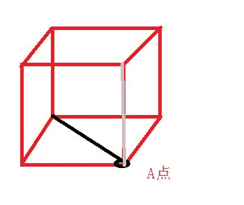

编辑于 2015-09-08 21:57:27

* * *

[guanjian](https://www.nowcoder.com/profile/564796)

共有 8 个顶点，总的有 C（8,3）种选择。直角非等腰：找对角面，前后有 2 个，上下有 2 个，左右有 2 个，每个对角面的 4 个点任意选择 3 个，C（4,3）答案 = 6*C（4,3）/C(8,3)=24/56=3/7。

编辑于 2015-09-09 19:45:14

* * *

## 21

以下哪个是由权值集合(16,8,4,2)构造的哈夫曼树(最优二叉树):

正确答案: A   你的答案: 空 (错误)

本题知识点

树

讨论

[绝地反击](https://www.nowcoder.com/profile/963994)

利用 huffmanTree 的性质，离树根近的，必定权值大，远的权值小，不用计算。

发表于 2016-03-26 21:04:02

* * *

[FightingTo](https://www.nowcoder.com/profile/550319)

最优二叉树，是指 WPL（带权路径长度之和）最小
WPL(A)：16*1+8*2+2*3+3*4=50
WPL(B)：2*1+4*2+8*3+16*3=82
WPL(C)：16*1+4*2+8*3+2*3=54
WPL(D)：16*2+8*2+4*2+2*2=60
所以选 A

发表于 2015-09-09 20:18:52

* * *

[而安](https://www.nowcoder.com/profile/857258)

A 最优二叉树：将所给权集合（称为森林）按照从小到大顺序列举出来，如本题 2,4,8,16；第一步：将其中最小的两个数（2,4）作为同一父亲下的孩子，也就是叶，形成值为 6 的一个父结点；第二步：此时剩下 6,8,16 三个数，重复步骤一，将 6,8 结合成又一个值为 14 的父结点；第三步：将剩下的两个数连接到同一父节点下；

发表于 2015-09-08 20:05:17

* * *

## 22

关于红黑树和 AVL 树，以下哪种说法不正确？

正确答案: D   你的答案: 空 (错误)

```cpp
两者都属于自平衡二叉树
```

```cpp
两者查找,插入，删除的时间复杂度相同
```

```cpp
包含 n 个内部节点的红黑树的高度是 O(log(n))
```

```cpp
JDK 的 TreeMap 是一个 AVL 的实现
```

本题知识点

高级结构 查找 *讨论

[yayamma](https://www.nowcoder.com/profile/270051)

关于红黑树和 AVL 树，来自网络：

***1 好处 及 用途***

        红黑树 **并不追求“完全平衡** ”——它只要求部分地达到平衡要求，降低了对旋转的要求，从而提高了性能。

红黑树能够以 **O(*log[2]*  n)**  的时间复杂度进行搜索、插入、删除操作。此外，由于它的设计，任何不平衡都会在三次旋转之内解决。当然，还有一些更好的，但实现起来更复杂的数据结构 能够做到一步旋转之内达到平衡，但红黑树能够给我们一个比较“便宜”的解决方案。红黑树的算法时间复杂度和 AVL 相同，但统计性能比 AVL 树更高。

        当然，红黑树并不适应所有应用树的领域。如果数据基本上是静态的，那么让他们待在他们能够插入，并且不影响平衡的地方会具有更好的性能。如果数据完全是静态的，例如，做一个哈希表，性能可能会更好一些。

在实际的系统中，例如，需要使用动态规则的防火墙系统，使用红黑树而不是散列表被实践证明具有更好的伸缩性。

*典型的用途是实现关联数组*

***2 *** AVL 树是最先发明的自平衡二叉查 找树。在 AVL 树中任何节点的两个儿子子树的高度最大差别为一，所以它也被称为高度平衡树。查找、插入和删除在平均和最坏情况下都是 O(log n)。增加和删除可能需要通过一次或多次树旋转来重新平衡这个树。AVL 树得名于它的发明者 G.M. Adelson-Velsky 和 E.M. Landis，他们在 1962 年的论文 "An algorithm for the organization of information" 中发表了它。

引入二叉树的目的是为了提高二叉树的搜索的效率,减少树的平均搜索长度.为此,就必须每向二叉树插入一个结点时调整树的结构,使得二叉树搜索保持平衡,从而可能降低树的高度,减少的平均树的搜索长度. 

AVL 树的定义: 
一棵 AVL 树满足以下的条件: 
1>它的左子树和右子树都是 AVL 树 
2>左子树和右子树的高度差不能超过 1 
从条件 1 可能看出是个递归定义,如 GNU 一样. 

性质: 
1>一棵 n 个结点的 AVL 树的其高度保持在 0(log2(n)),不会超过 3/2log2(n+1) 
2>一棵 n 个结点的 AVL 树的平均搜索长度保持在 0(log2(n)). 
3>一棵 n 个结点的 AVL 树删除一个结点做平衡化旋转所需要的时间为 0(log2(n)). 

从 1 这点来看 ***红黑树是牺牲了严格的高度平衡的优越条件*** 为 代价红黑树能够以 O(log2 n)的时间复杂度进行搜索、插入、删除操作。此外，由于它的设计，任何不平衡都会在三次旋转之内解决。当然，还有一些更好的，但实现起来更复杂的数据结构 能够做到一步旋转之内达到平衡，但红黑树能够给我们一个比较“便宜”的解决方案。红黑树的算法时间复杂度和 AVL 相同，但统计性能比 AVL 树更高.

发表于 2015-09-09 15:11:16

* * *

[Amour1018](https://www.nowcoder.com/profile/306342)

红黑树和 avl 树都属于自平衡二叉树；两者查找、插入、删除的时间复杂度相同；包含 n 个内部结点的红黑树的高度是 o(logn);TreeMap 是一个红黑树的实现，能保证插入的值保证排序

发表于 2015-10-03 11:12:14

* * *

[Huzi 在路上](https://www.nowcoder.com/profile/755469)

C:包含 n 个内部结点的红黑树树高应为**至少** O(log(n))。C 答案的描述并不准确。

发表于 2016-05-24 16:18:41

* * *

## 23

客户端 C 和服务器 S 之间建立一个 TCP 连接，该连接总是以 1KB 的最大段长发送 TCP 段，客户端 C 有足够的数据要发送。当拥塞窗口为 16KB 的时候发生超时，如果接下来的 4 个 RTT 往返时间内的 TCP 段的传输是成功的，那么当第 4 个 RTT 时间内发送的所有 TCP 段都得到了 ACK 时，拥塞窗口大小是：

正确答案: C   你的答案: 空 (错误)

```cpp
7KB
```

```cpp
8KB
```

```cpp
9KB
```

```cpp
16KB
```

本题知识点

网络基础

讨论

[陋室](https://www.nowcoder.com/profile/716156)

16KB 超时，阈值变为 8KB，客户端从 1KB 开始穿（执行快开始算法）
1RTT 结束，1KB->2KB
2RTT 结束，2KB->4KB
3RTT 结束，4KB->8KB（到达阈值，执行拥塞避免算法）
4RTT 结束，8KB->9KB
结果 C

编辑于 2016-02-26 21:21:41

* * *

[Pandora](https://www.nowcoder.com/profile/266279)

**拥塞避免和慢启动**当拥塞发生时（超时或收到重复确认），慢启动门限 ssthresh 被设置为当前拥塞窗口 cwnd 大小（题目为 16）的一半，即 8。同时 cwnd 重置为 1。新的数据被接收，则 cwnd 增加，规则为 ssthresh 之前，**慢启动，即 cwnd 指数增长**；到达 ssthresh 之后，**拥塞避免，即 cwnd 加 1**。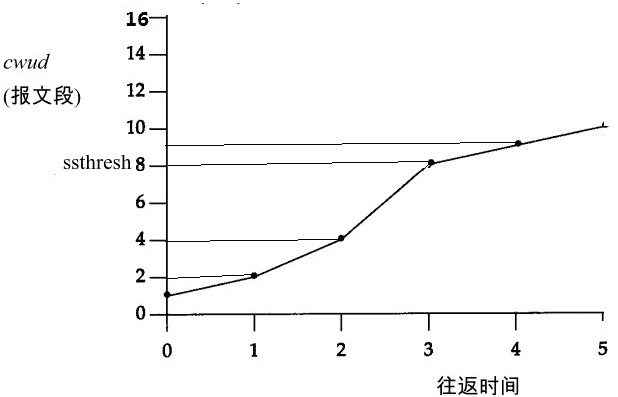
详参：[`www.cnblogs.com/ggjucheng/archive/2012/02/03/2337420.html`](http://www.cnblogs.com/ggjucheng/archive/2012/02/03/2337420.html)

发表于 2015-09-09 10:02:47

* * *

[ellie2dina](https://www.nowcoder.com/profile/984423)

16kb 开始拥塞那么阈值调整为 8kb，1-2-4-8（快开始），8-9（拥塞避免），选 c

发表于 2015-09-09 10:52:58

* * *

## 24

关于 epoll 和 select 的区别，哪些说法是正确的？

正确答案: A B C   你的答案: 空 (错误)

```cpp
epoll 和 select 都是 I/O 多路复用的技术，都可以实现同时监听多个 I/O 事件的状态
```

```cpp
epoll 相比 select 效率更高，主要是基于其操作系统支持的 I/O 事件通知机制，而 select 是基于轮询机制
```

```cpp
epoll 支持水平触发和边沿触发两种模式
```

```cpp
select 能并行支持 I/O 比较小，且无法修改
```

本题知识点

操作系统

讨论

[牛客 er](https://www.nowcoder.com/profile/758147)

select 和 epoll 这两  查看全部)

编辑于 2016-05-18 09:45:17

* * *

[weikai](https://www.nowcoder.com/profile/658104)

select，poll，epoll 都是 IO 多路复用的机制。I/O 多路复用就通过一种机制，可以监视多个描述符，一旦某个描述符就绪（一般是读就绪或者写就绪），能够通知程序进行相应的读写操作。 **但 select，poll，epoll 本质上都是同步 I/O，因为他们都需要在读写事件就绪后自己负责进行读写，也就是说这个读写过程是阻塞的** ，而异步 I/O 则无需自己负责进行读写，异步 I/O 的实现会负责把数据从内核拷贝到用户空间。关于这三种 IO 多路复用的用法，前面三篇总结写的很清楚，并用服务器回射 echo 程序进行了测试。连接如下所示：

select：[`www.cnblogs.com/Anker/archive/2013/08/14/3258674.html`](http://www.cnblogs.com/Anker/archive/2013/08/14/3258674.html)

poll：[`www.cnblogs.com/Anker/archive/2013/08/15/3261006.html`](http://www.cnblogs.com/Anker/archive/2013/08/15/3261006.html)

epoll：[`www.cnblogs.com/Anker/archive/2013/08/17/3263780.html`](http://www.cnblogs.com/Anker/archive/2013/08/17/3263780.html)

今天对这三种 IO 多路复用进行对比，参考网上和书上面的资料，整理如下：

**1、select 实现**

**select 的调用过程如下所示：**

**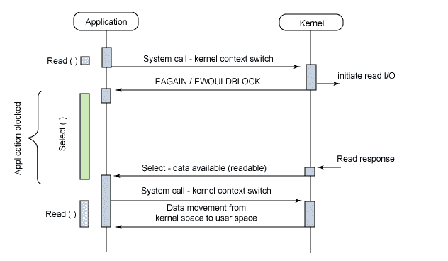** 

（1）使用 copy_from_user 从用户空间拷贝 fd_set 到内核空间

（2）注册回调函数 __pollwait

（3）遍历所有 fd，调用其对应的 poll 方法（对于 socket，这个 poll 方法是 sock_poll，sock_poll 根据情况会调用到 tcp_poll,udp_poll 或者 datagram_poll）

（4）以 tcp_poll 为例，其核心实现就是 __pollwait，也就是上面注册的回调函数。

（5）__pollwait 的主要工作就是把 current（当前进程）挂到设备的等待队列中，不同的设备有不同的等待队列，对于 tcp_poll 来说，其等待队列是 sk->sk_sleep（注意把进程挂到等待队列中并不代表进程已经睡眠了）。在设备收到一条消息（网络设备）或填写完文件数据（磁盘设备）后，会唤醒设备等待队列上睡眠的进程，这时 current 便被唤醒了。

（6）poll 方法返回时会返回一个描述读写操作是否就绪的 mask 掩码，根据这个 mask 掩码给 fd_set 赋值。

（7）如果遍历完所有的 fd，还没有返回一个可读写的 mask 掩码，则会调用 schedule_timeout 是调用 select 的进程（也就是 current）进入睡眠。当设备驱动发生自身资源可读写后，会唤醒其等待队列上睡眠的进程。如果超过一定的超时时间（schedule_timeout 指定），还是没人唤醒，则调用 select 的进程会重新被唤醒获得 CPU，进而重新遍历 fd，判断有没有就绪的 fd。

（8）把 fd_set 从内核空间拷贝到用户空间。

**总结：**

**select 的几大缺点：**

**（1）每次调用 select，都需要把 fd 集合从用户态拷贝到内核态，这个开销在 fd 很多时会很大**

**（2）同时每次调用 select 都需要在内核遍历传递进来的所有 fd，这个开销在 fd 很多时也很大**

**（3）select 支持的文件描述符数量太小了，默认是 1024 (但是是可以进行修改的，可以修改内核的 FDSET 宏，但是要重新编译内核)

这种不停的修改内核以及查找时间是 O（n）使得人们逐渐在探索新的方式替代它.............** 

**2 poll 实现**

poll 的实现和 select 非常相似，只是描述 fd 集合的方式不同，poll 使用 pollfd 结构而不是 select 的 fd_set 结构，其他的都差不多。

关于 select 和 poll 的实现分析，可以参考下面几篇博文：

[`blog.csdn.net/lizhiguo0532/article/details/656***#comments`](http://blog.csdn.net/lizhiguo0532/article/details/656***#comments)

[`blog.csdn.net/lizhiguo0532/article/details/6568968`](http://blog.csdn.net/lizhiguo0532/article/details/6568968)

[`blog.csdn.net/lizhiguo0532/article/details/6568969`](http://blog.csdn.net/lizhiguo0532/article/details/6568969)

[`www.ibm.com/developerworks/cn/linux/l-cn-edntwk/index.html?ca=drs-`](http://www.ibm.com/developerworks/cn/linux/l-cn-edntwk/index.html?ca=drs-)

[`linux.chinaunix.net/techdoc/net/2009/05/03/1109887.shtml`](http://linux.chinaunix.net/techdoc/net/2009/05/03/1109887.shtml)

**3、epoll**

epoll 既然是对 select 和 poll 的改进，就应该能避免上述的三个缺点。那 epoll 都是怎么解决的呢？在此之前，我们先看一下 epoll 和 select 和 poll 的调用接口上的不同，select 和 poll 都只提供了一个函数——select 或者 poll 函数。而 epoll 提供了三个函数，epoll_create,epoll_ctl 和 epoll_wait，epoll_create 是创建一个 epoll 句柄；epoll_ctl 是注册要监听的事件类型；epoll_wait 则是等待事件的产生。

对于第一个缺点，epoll 的解决方案在 epoll_ctl 函数中。每次注册新的事件到 epoll 句柄中时（在 epoll_ctl 中指定 EPOLL_CTL_ADD），会把所有的 fd 拷贝进内核，而不是在 epoll_wait 的时候重复拷贝。epoll 保证了每个 fd 在整个过程中只会拷贝一次。

对于第二个缺点，epoll 的解决方案不像 select 或 poll 一样每次都把 current 轮流加入 fd 对应的设备等待队列中，而只在 epoll_ctl 时把 current 挂一遍（这一遍必不可少）并为每个 fd 指定一个回调函数，当设备就绪，唤醒等待队列上的等待者时，就会调用这个回调函数，而这个回调函数会把就绪的 fd 加入一个就绪链表）。epoll_wait 的工作实际上就是在这个就绪链表中查看有没有就绪的 fd（利用 schedule_timeout()实现睡一会，判断一会的效果，和 select 实现中的第 7 步是类似的）。 （Linux 2.6 内核之后这个链表就使用红黑树来实现达到插入和查找速度快的目的）

对于第三个缺点，epoll 没有这个限制，它所支持的 FD 上限是最大可以打开文件的数目，这个数字一般远大于 2048,举个例子,在 1GB 内存的机器上大约是 10 万左右，具体数目可以 cat /proc/sys/fs/file-max 察看,一般来说这个数目和系统内存关系很大。

**总结：**

（1）select，poll 实现需要自己不断轮询所有 fd 集合，直到设备就绪，期间可能要睡眠和唤醒多次交替。而 epoll 其实也需要调用 epoll_wait 不断轮询就绪链表，期间也可能多次睡眠和唤醒交替，但是它是设备就绪时，调用回调函数，把就绪 fd 放入就绪链表中，并唤醒在 epoll_wait 中进入睡眠的进程。虽然都要睡眠和交替，但是 select 和 poll 在“醒着”的时候要遍历整个 fd 集合，而 epoll 在“醒着”的时候只要判断一下就绪链表是否为空就行了，这节省了大量的 CPU 时间。这就是回调机制带来的性能提升。

（2）select，poll 每次调用都要把 fd 集合从用户态往内核态拷贝一次，并且要把 current 往设备等待队列中挂一次，而 epoll 只要一次拷贝，而且把 current 往等待队列上挂也只挂一次（在 epoll_wait 的开始，注意这里的等待队列并不是设备等待队列，只是一个 epoll 内部定义的等待队列）。这也能节省不少的开销。

**参考资料：**

[`www.cnblogs.com/apprentice89/archive/2013/05/09/3070051.html`](http://www.cnblogs.com/apprentice89/archive/2013/05/09/3070051.html)

[`www.linuxidc.com/Linux/2012-05/59873p3.htm`](http://www.linuxidc.com/Linux/2012-05/59873p3.htm)

[`xingyunbaijunwei.blog.163.com/blog/static/76538067201241685556302/`](http://xingyunbaijunwei.blog.163.com/blog/static/76538067201241685556302/)

[`blog.csdn.net/kkxgx/article/details/7717125`](http://blog.csdn.net/kkxgx/article/details/7717125)

[`banu.com/blog/2/how-to-use-epoll-a-complete-example-in-c/epoll-example.c`](https://banu.com/blog/2/how-to-use-epoll-a-complete-example-in-c/epoll-example.c)

发表于 2016-04-02 12:00:38

* * *

[莫笑☁️輕狂](https://www.nowcoder.com/profile/152216)

epoll,select,poll 是 io 复用技术中常见的，具体可 google 解释，a 正确 select 查询速度较慢，因为他每次产生 fd 时候会有整体 fdset 的拷贝，而且每次有回送，select 要查询整个 fdsetepoll 查询速度较快，因为他为每个 fd 都 regist 了一个单独的回调函数，b 正确 c 选项不是很清楚 select 支持 io 较少，这个是根据操作系统支持的数量定的，不过记得那个数值可以用 sysctl 修改，所以觉得 d 不对。

发表于 2015-09-08 18:04:34

* * *

## 25

Internet 的网络层含有的协议是？

正确答案: A B C D   你的答案: 空 (错误)

```cpp
IP
```

```cpp
ICMP
```

```cpp
ARP
```

```cpp
RARP
```

本题知识点

网络基础

讨论

[莫笑☁️輕狂](https://www.nowcoder.com/profile/152216)

ip 不用说了肯定是网络层协议  查看全部)

编辑于 2016-05-07 15:49:51

* * *

[WHUTdq](https://www.nowcoder.com/profile/9172499)

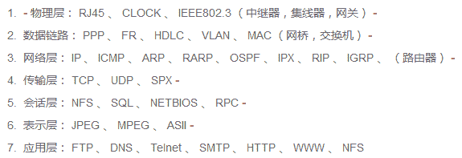

发表于 2016-08-28 16:27:18

* * *

[youyouhuo](https://www.nowcoder.com/profile/468667)

arp 和 rarp 应该是数据链路层吧

发表于 2015-09-10 14:17:38

* * *

## 26

以下是 C++的不同数据类型值的比较语句，请问这些判断语句中作为条件部分的语句编写有问题的有:

正确答案: C   你的答案: 空 (错误)

```cpp
如果变量 bVar 是布尔类型：if(false==bVar){doSomeThing();}
```

```cpp
如果变量 nVar 是 int 型：if(0==nVar){doSomeThing();}
```

```cpp
如果变量 fVar 为浮点型:if(0.02==fVar){doSomeThing();}
```

```cpp
如果变量 sVar 为字符串型：if（""==sVar){doSomeThing();}
```

本题知识点

C++

讨论

[陋室](https://www.nowcoder.com/profile/716156)

D 估计大家都知道字符串用==比较没有意义
说说 C 吧，也是基本的，浮点型（double,flout）由于是用于科学计算的，尾数一定会不精确的，所以不能用==比较，Java 可以用 Math.abs(fVar-0.02) < 0.0000001 表示等于，或者直接用 Double.compare(d1, d2)比较，C 也一样。

发表于 2015-09-08 16:21:21

* * *

[你一抹微笑如茉莉](https://www.nowcoder.com/profile/438806)

D 项不对，当 sVar=“\0”以及 sVar=“”时均能通过，不是作者本意；C 项就更不对了，大家看清楚那是赋值号“=”不是等号“==”啊，将变量赋值给常数，肯定不对！

发表于 2015-12-09 16:02:43

* * *

[追梦 _ 吹吹风](https://www.nowcoder.com/profile/279124)

c 选项，float 有精度问题，尾数不精确，比较会出问题 d 选项，字符串比较，一般用 strcmp（str1，str2），直接用==比较两个字符串，应该比较的是字符串的首地址是否相等，那就不是真正的字符串比较了

发表于 2015-09-09 11:40:45

* * *

## 27

TCP 链接中主动断开链接 netstat 观察可能出现的状态流转是：

正确答案: C D   你的答案: 空 (错误)

```cpp
ESTABLISHED->CLOSE_WAIT->TIME_WAIT->CLOSED
```

```cpp
ESTABLISHED->TIME_WAIT->CLOSE_WAIT->CLOSED
```

```cpp
ESTABLISHED->FIN_WAIT_1->FIN_WAIT_2->TIME_WAIT->CLOSED
```

```cpp
ESTABLISHED->FIN_WAIT_1->TIME_WAIT->CLOSED
```

本题知识点

网络基础

讨论

[不吃葡萄皮](https://www.nowcoder.com/profile/179155)

跳过 FIN_WAIT_2,证明被动方也完成了数据传输任务，直接把 ACK 和 FIN 一起发给了主动方，因此主动方从 FIN_WAIT_1 直接跳过 FIN_WAIT_2 进入 TIME_WAIT

发表于 2016-03-09 19:01:43

* * *

[农民揣的二狗](https://www.nowcoder.com/profile/260179)

C 是正常的关闭过程：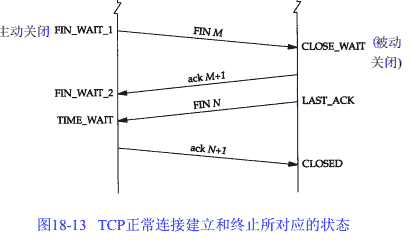
D 是同时关闭可能出现的过程：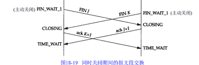

发表于 2016-08-17 23:05:00

* * *

[Pandora](https://www.nowcoder.com/profile/266279)

中断连接端可以是 client，也可以是 server。下图为 client 发起主动断开连接时，client 和 server 的状态图。 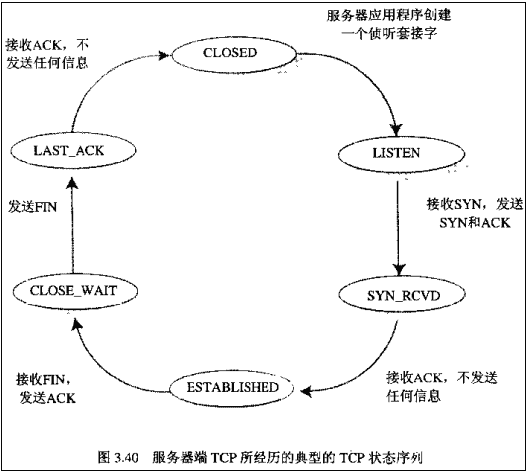详参：[`blog.csdn.net/whuslei/article/details/6667471`](http://blog.csdn.net/whuslei/article/details/6667471)

发表于 2015-09-09 10:09:24

* * *

## 28

以下涉及到内存管理的代码段中，有错误的是：

正确答案: A B D   你的答案: 空 (错误)

```cpp

```
int *a=new int(12);
//..... 
free(a);

```cpp

```

```cpp

```
int *ip=static_cast<int*>(malloc(sizeof(int)));
*ip=10;
//.....
delete ip;
```cpp

```

```cpp

```
double *a=new double[1];
//.... 
delete a;
```cpp

```

```cpp

```
int *ip=new int(12);
for(int i=0;i<12;++i){
ip[i]=i;
}
delete []ip;
```cpp

```

本题知识点

C++ C 语言

讨论

[threadx](https://www.nowcoder.com/profile/335591)

new 和 delete 搭配，m  查看全部)

编辑于 2016-04-04 21:13:20

* * *

[scut_huajian](https://www.nowcoder.com/profile/234048)

new 和 delete 配套使用  free 和 malloc 配套使用 AB 错误
D 是因为申请的是一个元素，后面跟的 12 是初始化值，而不是数组，所以错误。
new 和 delete 与 free 和 malloc 的差别是前面 2 个会分别调用构造函数和析构函数

发表于 2015-09-08 16:00:00

* * *

[爱西瓜西瓜爱夏天](https://www.nowcoder.com/profile/492537)

D 选项是错在访问越界了，只申请了一个 int。另外，对于基本数据类型,delete 和 delete[]时无所谓的，两者的区别体现在对于对象类型的处理上，因为 delete[]要为对象数组的每个对象调用析构，所以他要对对象的个数做一个记录，这个记录保存在申请空间的前四个字节，也就是你 new[]出来的空间，它返回给你使用的地址实际上偏移了 4 个字节，那四个字节它自己用了。所以，如果 new[]出来一个对象数组，你用 delete 去释放就会崩溃，因为它不知道前面还有四个字节。比如有个类 A，A* pA = new A[10];你如果想用 delete 而不崩溃也是可以实现的，你只需要自己把释放的地址往前面移动四个字节。delete (A*)((int*)pA-1)，这样写，还是有问题的，但是至少不会像 delete pA 一样直接崩溃了。

发表于 2016-08-13 22:21:21

* * *

## 29

下面哪些特性可能导致代码体积膨胀:

正确答案: A B C   你的答案: 空 (错误)

```cpp
宏定义
```

```cpp
模板
```

```cpp
内联函数
```

```cpp
递归
```

本题知识点

C++

讨论

[leobuzhi](https://www.nowcoder.com/profile/932073)

A 选项宏定义本质是文本替换，肯定是可能导致代码体积膨胀的 B 选项模板在编译时生成对应的类/函数，所以也是可能的。C 选项重点解释，内联也是在编译时替换，所以也 可能导致代码体积膨胀。但是注意了：**若这个函数被调用了一次，那么** **内联** **直接被插入到函数调用出，就直接没有了这个函数符号了，若加上优化，这一句代码可能会被优化没有，所以，也可能使** **代码体积减小** **。****D 选项是容易爆栈，不是代码区。**

发表于 2016-02-13 10:25:20

* * *

[马小李](https://www.nowcoder.com/profile/898794)

A 宏定义会单纯的替换，也就是如果宏定义替换的内容会成倍复制，所以会导致代码膨胀 B 模板的调用，会根据调用的参数，生成模板对应的实际调用的函数体，如果调用的参数不同，会生成不同的代码，所以会导致代码膨胀 C 内联函数会拷贝至调用的位置，如果调用多次回导致代码膨胀

发表于 2015-09-08 20:41:59

* * *

[程序员鱼皮](https://www.nowcoder.com/profile/5077378)

这里的膨胀是指代码编译时较编辑时体积大。 宏定义，模板，内联函数都能在编辑时精简我们的代码。但在编译时宏定义会文本替换，模板会加上类型（类似 java 泛型），内联函数也会替换成函数代码。

发表于 2018-09-08 11:44:04

* * *

## 30

小明设计了如下的学籍管理系统：(PK 为主键，FK 为外键)已知关系：学籍(学号，学生姓名) PK=学号成绩（科目号，成绩，学号） PK=科目代码，FK=学号已有表记录如下，请给出能够插入的成绩记录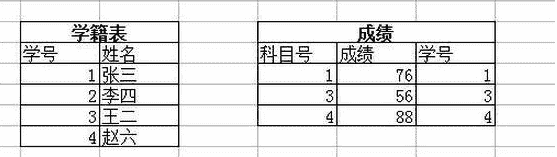

正确答案: B D   你的答案: 空 (错误)

```cpp
(1，99，2)
```

```cpp
(5，68，1)
```

```cpp
(3，70，3)
```

```cpp
(7，45，null)
```

本题知识点

数据库

讨论

[webary](https://www.nowcoder.com/profile/581261)

PK=科目代码  查看全部)

编辑于 2016-03-28 14:16:26

* * *

[andydoo](https://www.nowcoder.com/profile/179825)

  定义：

  主键 -- 唯一标识一条记录，不能有重复的，不允许为空

  外键 -- 表的外键是另一表的主键 ,  外键可以有重复的 ,  可以是空值

  索引 -- 该字段没有重复值，但可以有一个空值

作用：

  主键 -- 用来保证数据完整性

  外键 -- 用来和其他表建立联系用的

  索引 -- 是提高查询排序的速度  

个数：

  主键 -- 主键只能有一个

  外键 -- 一个表可以有多个外键

  索引 -- 一个表可以有多个唯一索引

发表于 2016-04-03 17:04:17

* * *

[coco 酱是个程序媛哟](https://www.nowcoder.com/profile/728345)

主键不可重复不可为空，外键可以，并且可以为空。

发表于 2015-09-18 12:24:19

* * ***