# 2016CVTE 校招在线笔试题

## 1

以下说法正确的有()

正确答案: A B   你的答案: 空 (错误)

```cpp
多个进程操作同一个文件时，应该要考虑到文件的一致性问题
```

```cpp
可通过文件在不同进程间进行数据传递和共享
```

```cpp
可以通过全局变量在不同进程间传递数据
```

```cpp
一个进程可以访问到所有物理内存空间
```

本题知识点

操作系统

讨论

[大海无垠](https://www.nowcoder.com/profile/294414)

进程之间地址空间独立好不好。全局变量也就只有在同一个进程内的线程之间可以共享，怎么可能在不同进程之间共享实现通讯呢

发表于 2015-09-13 20:34:09

* * *

[小李 8](https://www.nowcoder.com/profile/8260064)

进程间在内存里是相互独立的，全局变量在每个进程中都是独立的，所以是不能传递数据的

发表于 2017-09-07 11:33:47

* * *

[guanjian](https://www.nowcoder.com/profile/564796)

 进程间是相互独立的，其实完全可以看成 A、B 两个进程各自有一份单独的 liba.so 和 libb.so，相应的动态库的代码段和数据段都是各个进程各自有一份的。然后在这个基础上，由于代码段是不会被修改的，所以操作系统可以采用 copy on write 的优化技术，让两个进程共享同一份物理内存。这是属于在不改变系统行为的基础上，为了节省内存，的优化技术。

【举例】
#pragma data_seg()
1，#pragma data_seg()一般用于 DLL 中。也就是说，在 DLL 中定义一个共享的，有名字的数据段。最关键的是：这个数据段中的全局变量可以被多个进程共享。

否则多个进程之间无法共享 DLL 中的全局变量。

2，共享数据必须初始化，否则微软编译器会把没有初始化的数据放到.BSS 段中，从而导致多个进程之间的共享行为失败。

3，你所谓的结果正确是一种错觉。如果你在一个 DLL 中这么写：

#pragma data_seg("MyData")

int g_Value; // Note that the global is not initialized.

#pragma data_seg()

DLL 提供两个接口函数：

int GetValue()
{
     return g_Value;
}

void SetValue(int n)
{
     g_Value = n;
}

然后启动两个进程 A 和 B，A 和 B 都调用了这个 DLL，假如 A 调用了 SetValue(5); B 接着调用 int m = GetValue(); 那么 m 的值不一定是 5，而是一个未定义的值。因为 DLL 中的全局数据对于每一个调用它的进程而言，是私有的，不能共享的。

假如你对 g_Value 进行了初始化，那么 g_Value 就一定会被放进 MyData 段中。换句话说，如果 A 调用了 SetValue(5); B 接着调用 int m = GetValue(); 那么 m 的值就一定是 5！

这就实现了跨进程之间的数据通信！

发表于 2015-09-11 11:22:12

* * *

## 2

IP 数据报分片的重组通常发生在()

正确答案: D   你的答案: 空 (错误)

```cpp
源主机和数据报经过的路由器上
```

```cpp
源主机上
```

```cpp
数据报经过的路由器上
```

```cpp
目的主机上
```

本题知识点

网络基础

讨论

[yql](https://www.nowcoder.com/profile/566442)

          当一个 I  查看全部)

编辑于 2016-10-29 00:41:29

* * *

[觉解 scu](https://www.nowcoder.com/profile/321178)

重组发生在目的主机，分片发生在路由器上

发表于 2015-09-10 23:34:36

* * *

[鹅是散修](https://www.nowcoder.com/profile/469075)

1.IP 数据报分片的原因：在 TCP/IP 分层中，数据链路层用 **MTU** (Maximum Transmission Unit，最大传输单元)来限制所能传输的数据包大小，MTU 是指一次传送的数据最大长度，不包括数据链路层数据帧的帧头，如以太网的 MTU 为 1500 字节，实际上数据帧的最大长度为 1512 字节，其中以太网数据帧的帧头为 12 字节。2.分片的思想：当发送的 IP 数据报的大小超过了 MTU 时，IP 层就需要对数据进行分片，否则数据将无法发送成功。IP 分片发生在 **IP 层** ，不仅 **源端主机** 会进行分片，中间的 **路由器** 也有可能分片，因为不同的网络的 MTU 是不一样的，如果传输路径上的某个网络的 MTU 比源端网络的 MTU 要小，路由器就可能对 IP 数据报再次进行分片。而分片数据的 **重组** 只会发生在 **目的** **端** 的 IP 层。

发表于 2016-09-04 13:07:31

* * *

## 3

引入多道程序技术以后，处理器的利用率()

正确答案: C   你的答案: 空 (错误)

```cpp
降低了
```

```cpp
没有变化，只是程序的执行方便了
```

```cpp
大大提高
```

```cpp
没有影响
```

本题知识点

编译和体系结构

讨论

[SunburstRun](https://www.nowcoder.com/profile/557336)

  查看全部)

编辑于 2015-09-10 22:36:11

* * *

[guanjian](https://www.nowcoder.com/profile/564796)

```cpp
多道程序设计是指在主存中同时存放多道用户作业，使它们都处于执行的开始点和开始点之间，这些程序共享计算机系统资源。
多道程序设计的主要优点有：
(1)提高 CPU 的利用率。在多道程序环境下，多个程序共享计算机资源当某个程序等待 I/O 操作时，CPU 可以执行其他程序，大大提高 CPU 的利用率。
(2)提高设备的利用率。在多道程序环境下，多个程序共享系统的设备，大大提高系统设备的利用率。
(3)提高系统的吞吐量。在多道程序环境下，减少了程序的等待时间，提高了系统的吞吐量。
```

发表于 2015-09-11 11:25:25

* * *

[阳光下的时光](https://www.nowcoder.com/profile/9372137)

特征:
1）多道：即计算机内存中同时存放几道相互独立的程序。
2）宏观上并行：同时进入系统的几道程序都处于运行过程中，即它们先后开始了各自的运行，但都未运行完毕。

3）微观上串行：从微观上看，内存中的多道程序轮流地或分时地占有 CPU。

优点:
提高 CPU 的利用率。在多道程序环境下，多个程序共享计算机资源当某个程序等待 I/O 操作时，CPU 可以执行其他程序，大大提高 CPU 的利用率。
提高设备的利用率。在多道程序环境下，多个程序共享系统的设备，大大提高系统设备的利用率。
提高系统的吞吐量。在多道程序环境下，减少了程序的等待时间，提高了系统的吞吐量。

编辑于 2017-09-07 14:02:06

* * *

## 4

关于 TCP 协议以下说法正确的是：（）

正确答案: B D   你的答案: 空 (错误)

```cpp
通讯双方被动关闭的一方进入 TIME_WAIT 状态
```

```cpp
TIME_WAIT 状态会持续 2 个 MSL
```

```cpp
TIME_WAIT 状态会持续 1 个 MSL
```

```cpp
通讯双方主动关闭的一方进入 TIME_WAIT 状态
```

本题知识点

网络基础

讨论

[LC 凑热闹](https://www.nowcoder.com/profile/279302)

TCP 建立连接和断开连接过程  查看全部)

编辑于 2016-08-14 20:31:29

* * *

[yayamma](https://www.nowcoder.com/profile/270051)

**中断连接端可以是 Client 端，也可以是 Server 端。
   **
    假设客户端发起中断请求，则整个过程 Client 端所经历的状态如下：
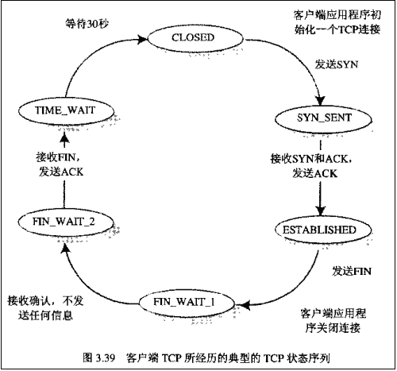
而 Server 端所经历的过程如下： 转载请注明:[blog.csdn.net/whuslei](http://blog.csdn.net/whuslei/article/details/blog.csdn.net/whuslei)
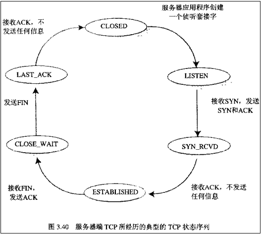 

发表于 2015-09-11 21:10:37

* * *

[觉解 scu](https://www.nowcoder.com/profile/321178)

持续 2MSL 的目的是为了可以重传 ACK，让被动关闭方收到。被动方进入的是 LAST_ACK 状态，主动方进入的是 TIME_WAIT 状态。

发表于 2015-09-10 23:35:44

* * *

## 5

以下说法正确的是()

正确答案: A   你的答案: 空 (错误)

```cpp
在计算机中，运算器访问寄存器的速度是最快的
```

```cpp
在等待中断的过程中，CPU 不可以处理其他任务
```

```cpp
同一段代码每次运行的时间一定是一样的
```

```cpp
软中断是由软件触发的一种中断
```

本题知识点

编译和体系结构

讨论

[zhisheng_blog](https://www.nowcoder.com/profile/616717)

**对于选项** **A** **的说法** ，猜测题目是想**对指令执行过程中各步骤完成时间进行比较**，指出所有步骤中读/写寄存器的速度最快。如果是这种理解的话，那么，选项 A 是正确的。

通常，把取出指令并执行所用的时间称为一个指令周期。不同指令的功能不同，因此所包含的执行步骤不一样。不考虑指令译码这个步骤，不管是简单指令还是复杂指令，其包含的执行步骤总是可以分解成以下 4 种基本操作，也即每条指令的功能总是由以下 4 种基本操作功能组合而成。

（1）读取某存储单元内容装入给定寄存器。

（2）把一个数据从某个寄存器存入给定的存储单元中。

（3）把一个数据从某个寄存器送到另一个寄存器或者 ALU 输入端。

（4）进行某种算术运算或逻辑运算，将结果送入某个寄存器。

因此，若比较每个步骤的执行时间，则只要比较上述 4 种操作的时间即可，显然第（3）种操作的执行时间最短，速度最快。

选项 A 中“**运算器访问寄存器**”这个说法有点问题。通常我们会说 CPU 访问存储器，是因为 CPU 在执行指令过程中，需要从存储器中取指令，或者，CPU 根据对指令的译码得知操作数在存储器，需要访存来取数或存结果。这时，CPU 通过控制器送出相应的控制信号来提出访存请求。但是，在运算器和寄存器之间就没有这种关系，运算器本身是一个执行算术和逻辑运算的组合逻辑部件，它不可能产生访问寄存器的请求，读写寄存器与读写存储器、ALU 运算等操作一样，都是由 CPU 中的控制器进行控制的，因而说“运算器访问寄存器”有点不妥。

**选项** **B** **的描述是错误的** 。选项 B 的描述中，“中断”一词比较含糊，可以有两种不同的理解，一种是“中断请求”，一种是“中断处理结束”。

如果理解成前者，选项 B 的含义就是“CPU 在等待中断请求的过程中，不可以处理其他任务”，这显然是错误的。CPU 在执行程序的过程中，总是在执行完一条指令、取下条指令之前，去主动检测“中断请求信号”，若发现有中断请求，则执行一条“中断隐指令”，以响应中断请求。

如果理解成后者，选项 B 的含义就是“CPU 在等待中断处理结束的过程中，不可以处理其他任务”，这也是错误的。

CPU 响应中断请求后，就会跳转到一个中断服务程序去执行，以进行中断处理。不同的中断类型具有不同的中断服务程序，进行不同的中断处理。有些中断处理非常简单，例如“打印机缺纸”，其中断服务程序只要在屏幕上显示一个消息即可；有些中断处理则比较复杂，例如，对于采用中断方式进行打印输出的情况，中断服务程序中需要启动外设进行 I/O，通常在发出启动外设的命令后进行中断返回，以回到原先被中止的另一个进程代码去执行。

例如，对于请求打印字符串的用户进程 P1 的例子，如果采用中断控制 I/O 方式，则操作系统处理 I/O 的过程如图所示。

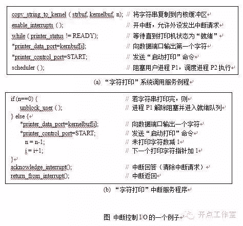
从图 (a) 可以看出，在“字符打印”系统调用服务例程中启动打印机后，它就调用处理器调度程序 scheduler 来调出进程 P2 执行，而将用户进程 P1 阻塞。在 CPU 执行进程 P2 的同时，打印机在进行打印操作， CPU 和打印机并行工作。一旦打印机完成一个字符的打印后，就会给 CPU 发中断请求，然后 CPU 暂停正在执行的进程 P2 ，调出“字符打印”中断服务程序来执行。如图 (b) 所示，中断服务程序首先判断是否已完成字符串中所有字符的打印，若是，则将用户进程 P1 解除阻塞，使其进入就绪队列；否则，就向数据端口送出下一个欲打印字符，并启动打印，将未打印字符数减 1 和下一个打印字符指针加 1 后，执行中断返回，回到被打断的进程 P2 继续执行。

从上述例子可以看出，在某个进程使用中断方式进行 I/O 过程中（相当于等待中断处理结束的过程中），CPU 可以执行其他进程的工作。因此，选项 B 在这种情况下也是错的。

**对于选项** **C** **，** 因为提到“一定”两个字，所以很快可以判断是错误的。不过，对于选项 C 中提到的知识点的理解，还有许多内容值得详细讨论。

首先是对“程序代码的运行时间”和“同一段代码”如何理解的问题。

操作系统在对处理器进行调度时，一段时间内往往会让多个程序（更准确地说是进程）轮流使用处理器，因此在某个用户程序执行过程中，可能同时还会有其他用户程序和操作系统程序在执行，所以，用户感觉到的某个程序的执行时间并不是其真正的执行时间。通常把用户感觉到的执行时间分成以下两部分：CPU 时间和其他时间。CPU 时间指 CPU 用于程序执行的时间，它又包括以下两部分：

（1）用户 CPU 时间，指真正用于运行用户程序代码的时间；

（2）系统 CPU 时间，指为了执行用户程序而需要 CPU 运行操作系统程序的时间。

其他时间指等待 I/O 操作完成的时间或 CPU 用于执行其他用户程序的时间。

计算机系统的性能评价主要考虑的是 CPU 性能。系统性能和 CPU 性能不等价，两者有一些区别。系统性能是指系统的响应时间，它与 CPU 外的其他部分也有关系；而 CPU 性能是指用户 CPU 时间，它只包含 CPU 运行用户程序代码的时间。

因此，对“程序代码的运行时间”可以理解为程序代码中每条指令执行时间总和，也可以理解为程序代码运行过程中用户感觉到的执行总时间（包括操作系统代码和穿插在其中的其他程序代码运行时间）。如果理解为后者，那么很可能因为每次运行环境的不同，使得用户感觉到的执行总时间可能不一样。因此，选项 C 是错误的。

如果理解为前者，那么，还要看选项中的“同一段代码”指的是什么含义，才能确定选项 C 是否正确。如果“同一段代码”中代码指的可执行文件中一段静态的指令序列（例如一段循环执行的指令序列），那么可能会因为每次执行这段代码时变量的值的不同（例如循环终止条件变量的值不同），导致程序在执行时所执行的指令条数不同（循环执行次数不同），因而使得每次运行该段代码过程中指令执行的总时间不同。所以，选项 C 是错误的

显然，只有将“程序代码的运行时间”理解为程序代码中每条指令执行时间总和，并且，将“同一段代码”理解成每次运行程序代码过程中在 CPU 上所执行的指令序列完全相同，那么，选项 C 才是正确的。显然，对选项 C 的描述作这种解读有点牵强。

**选项** **D** **中** 的“软中断”应该特指 Intel 架构中的“int n”指令，执行该指令后，CPU 会根据中断类型号 n，到中断向量表（实地址模式）或中断描述符表（保护模式）中，取出相应的中断服务程序执行，执行结束后再回到“int n”指令后面一条指令执行。因此，“int n”指令的执行相当于引起了一次对现行程序的“中断”事件，这里“int n”指令显然是事先安排在软件中的，属于软件触发的事件。因而选项 D 的描述是正确的。

不同的计算机体系结构和教科书对“异常”和“中断”定义的内涵不同。例如，PowerPC 体系结构用异常表示各种意外事件，而用中断表示程序正常执行的控制流被改变；Intel 早期的 8086/8088 架构不区分异常和中断，把两者统称为中断，由 CPU 内部产生的异常称为内中断，通过中断请求线 INTR 和 NMI 从 CPU 外部发出的中断请求为外中断，但 Intel 后来的处理器架构中又将内中断称为“异常”，而把外中断特指为“中断”。

**如果将选项** **D** **的描述中所提的“中断”理解为特指的外中断的话，选项** **D** **就是错误的，因为“** **int n** **”指令的执行不会通过中断请求线向** **CPU** **发中断请求，这种软中断不属于外中断，而是一种内部的“异常”。不过，笔者猜测这里的“中断”应该不是特指外部中断。**

发表于 2016-04-05 23:06:46

* * *

[彭泽](https://www.nowcoder.com/profile/119770)

A 中访问寄存器最快，依据：  寄存器>***>RAM>ROM  

发表于 2015-09-11 09:05:32

* * *

[Snoopy2016](https://www.nowcoder.com/profile/121863)

**补充一下：****硬中断：**

1. 硬中断是由硬件产生的，比如，像磁盘，网卡，键盘，时钟等。每个设备或设备集都有它自己的 IRQ（中断请求）。基于 IRQ，CPU 可以将相应的请求分发到对应的硬件驱动上（注：硬件驱动通常是内核中的一个子程序，而不是一个独立的进程）。

2. 处理中断的驱动是需要运行在 CPU 上的，因此，当中断产生的时候，CPU 会中断当前正在运行的任务，来处理中断。在有多核心的系统上，一个中断通常只能中断一颗 CPU（也有一种特殊的情况，就是在大型主机上是有硬件通道的，它可以在没有主 CPU 的支持下，可以同时处理多个中断。）。

**软中断：**

软中断的处理非常像硬中断。然而，它们仅仅是由当前正在运行的进程所产生的。软中断并不会直接中断 CPU。也只有当前正在运行的代码（或进程）才会产生软中断。这种中断是一种需要内核为正在运行的进程去做一些事情（通常为 I/O）的请求。摘自：http://www.linuxidc.com/Linux/2014-03/98013.htm

发表于 2016-03-14 12:55:50

* * *

## 6

一个栈的入栈序列为 ABCDE,则不可能的出栈序列为（）

正确答案: A B   你的答案: 空 (错误)

```cpp
ECDBA
```

```cpp
DCEAB
```

```cpp
DECBA
```

```cpp
ABCDE
```

本题知识点

栈 *讨论

[Codess](https://www.nowcoder.com/profile/173585)

  查看全部)

编辑于 2016-03-24 14:33:59

* * *

[风萧萧兮](https://www.nowcoder.com/profile/178811)

A 选项：E 首先出栈，说明 E 之后只能是 D,所以 A 错误；B 选项：ABCD 进栈，然后 D 出栈，C 出栈，然后 E 进栈，此时中元素是 B 和 A，只能是 B 先出栈，A 后出栈，所以 B 出错；C 选项：ABCD 进栈，然后 D 出栈，然后 E 进栈，E 出栈，CBA 接着相继出栈；答案正确；D 选项：A 进栈，A 出栈；B 进栈，B 出栈； C 进栈，C 出栈； D 进栈，D 出栈； E 进栈，E 出栈；答案正确。

发表于 2016-03-27 10:46:00

* * *

[xuetuyic](https://www.nowcoder.com/profile/948719)

相邻的两个字符的顺序不能跟进栈时相同

发表于 2015-09-12 16:33:01

* * *

## 7

TCP 首部报文信息中跟建立链接有关的是（）

正确答案: B D   你的答案: 空 (错误)

```cpp
PSH
```

```cpp
SYN
```

```cpp
FIN
```

```cpp
ACK
```

本题知识点

网络基础

讨论

[monkee](https://www.nowcoder.com/profile/443818)

URG:Urget pointer is valid (紧急指针字段值有效)

**SYN: 表示建立连接**

**FIN: 表示关闭连接**

**ACK: 表示响应**

**PSH: 表示有 DATA 数据传输**

**RST: 表示连接重置。**

发表于 2015-09-11 21:38:46

* * *

[Snoopy2016](https://www.nowcoder.com/profile/121863)

**TCP：状态控制码（Code，Control Flag）**标志位字段（U、A、P、R、S、F）：**占 6 比特**。各 比特的含义如下:

*   URG：紧急比特（urgent）,当 URG＝1 时，表明紧急指针字段有效,代表该封包为紧急封包。它告诉系统此报文段中有紧急数据，应尽快传送(相当于高优先级的数据)， 且上图中的 Urgent Pointer 字段也会被启用。
*   ACK：确认比特（Acknowledge）。只有当 ACK＝1 时确认号字段才有效,代表这个封包为确认封包。当 ACK＝0 时，确认号无效。
*   PSH：（Push function）若为 1 时，代表要求对方立即传送缓冲区内的其他对应封包，而无需等缓冲满了才送。
*   RST：复位比特(Reset) ,当 RST＝1 时，表明 TCP 连接中出现严重差错（如由于主机崩溃或其他原因），必须释放连接，然后再重新建立运输连接。
*   SYN：同步比特(Synchronous)，SYN 置为 1，就表示这是一个连接请求或连接接受报文,通常带有 SYN 标志的封包表示『主动』要连接到对方的意思。。
*   FIN：终止比特(Final)，用来释放一个连接。当 FIN＝1 时，表明此报文段的发送端的数据已发送完毕，并要求释放运输连接。
*   摘自：http://blog.chinaunix.net/uid-26413668-id-3408115.html

发表于 2016-03-14 13:02:37

* * *

[周星星 _](https://www.nowcoder.com/profile/537870)

一个正常的 TCP 连接，都会有三个阶段:1、TCP 三次握手 ; 2、数据传送; 3、TCP 四次挥手和 TCP 建立连接相关的首部报文信息：SYN、ACK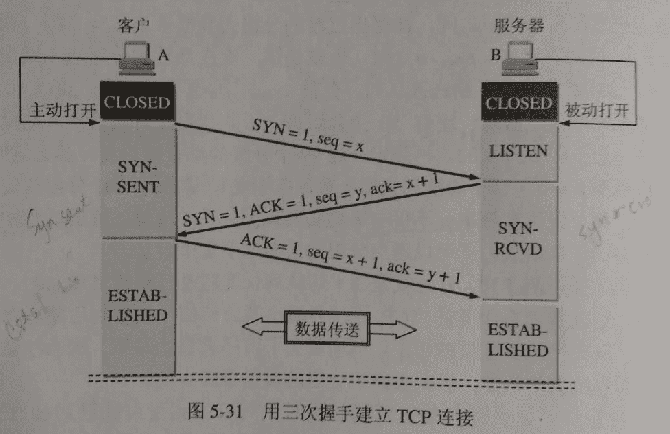
和连接释放相关的报文信息：FIN、ACK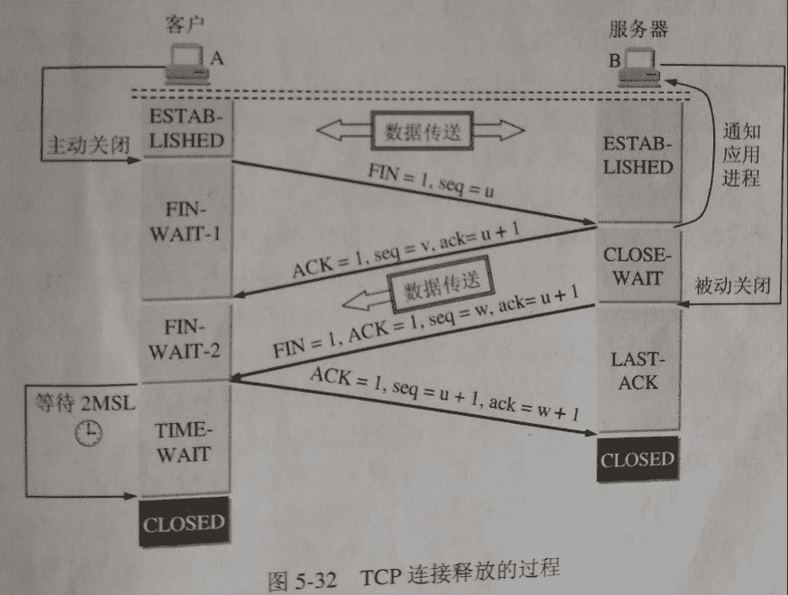

编辑于 2016-08-25 15:17:23

* * *

## 8

已知图的邻接表如下所示，根据算法，则从节点 0 出发按广度优先遍历的节点序列是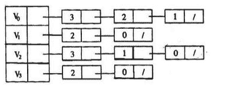

正确答案: C   你的答案: 空 (错误)

```cpp
0 1 2 3
```

```cpp
0 1 3 2
```

```cpp
0 3 2 1
```

```cpp
0 3 1 2
```

本题知识点

图

讨论

[TK-Xiong](https://www.nowcoder.com/profile/924351)

根据邻接表来看...广度遍历有一个队列：首先 0 入队...然后 取出 0 访问  然后把和 0 相邻的入队...（根据链表顺序，入队顺序为 3 2 1）然后 访问队列首元素，即 3 ... 然后 3 相邻的入队 即（2 0） 此时队列内容为（ 2 1 2 0）然后 访问队列首元素 即 2  然后 2 相邻的入队... 此时内容为（1 2 0 3 1 0）然后 访问队列首元素 即 1 然后 1 相邻的入队... 此时内容为 （2 0 3 1 0 2 0）接下来，访问队列首元素 即 2 ，但是 2 已经访问过了...所以返回.然后再继续访问...发现后面的都访问过了 所以都会直接返回.所以根据访问的顺序就是   0  3  2  1

发表于 2016-02-24 10:23:50

* * *

[阳光下的时光](https://www.nowcoder.com/profile/9372137)

广度优先遍历：

1） 从节点 V0 出发，V0 入队，访问 V0 并将 V0 出队，V0 的邻接点有 V3、V2、V1，将它们入队；

队列：V3 V2 V1

2） 访问 V3 并将 V3 出队，V3 的邻接点有 V2、V0（已访问，不入队），将 V2 入队；

队列：V2 V1 V2

3） 访问 V2 并将 V2 出队，V2 的邻接点有 V3（已访问，不入队）、V1、V0（已访问，不入队），将 V1 入队；

队列：V1 V2 V1

4） 访问 V1 并将 V1 出队，V1 的邻接点有 V2、V0，但都已访问，不入队；

队列：V2 V1

5） 继续访问 V2，由于 V2 已访问，所以忽略；继续访问 V1，由于 V1 也已访问，所以也忽略；此时遍历结束；

所以从节点 0 出发按广度优先遍历的节点序列是：V0 V3 V2 V1

发表于 2017-09-07 15:41:25

* * *

[aaronyoung](https://www.nowcoder.com/profile/422150)

广度优先遍历思想：从 V0 出发，访问 V0 的各个未曾访问的邻接点 W1，W2，…,Wk;然后,依次从 W1,W2,…,Wk 出发访问各自未被访问的邻接点，邻接表 有顺序的，3-2-1，3 在 2 前面，2 在 1 前面

发表于 2015-09-11 10:13:11

* * *

## 9

以下说法正确的有()

正确答案: D   你的答案: 空 (错误)

```cpp
在时间片轮询调度算法中，时间片越短则 CPU 利用率越高
```

```cpp
优先级越高的进程占用 CPU 的运行时间就一定越多
```

```cpp
在遍历大型二维数组 int a[x][y]时，先遍历 x 或先遍历 y 的处理时间都是一样的
```

```cpp
使用 cache 可以提高 CPU 的利用率
```

本题知识点

编译和体系结构

讨论

[zhuomuniao](https://www.nowcoder.com/profile/327643)

   时间片轮询调度是一种古老而又简单的算法，广泛运用于无操作系统的微处理器中。在系统中，每个进程被分配一个时间段，称作时间片， 即该进程允许运行的时间。如果在时间片结束时进程还在运行，则 CPU 将被剥夺并分配给另一个进程。如果进程在时间片结束前阻塞或结束 ，则 CPU 当即进行切换。调度程序所要做的就是维护一张就绪进程列表，当进程用完它的时间片后，它被移到队列的末尾。   时间片轮询调度中有趣的一点是如何确定时间片的长度。从一个进程切换到另一个进程是需要一定时间的，因为要保存和装入寄存器值及内存映像等保护现场的工作，更新各种表格和队列等。假如进程切换，有时称为上下文切换，需要的时间为 5 毫秒，再假设时间片长度设定为 20 毫秒，则在做完 20 毫秒有用的工作之后， CPU 将花费 5 毫秒来进行进程切换。 CPU 时间的 20% 被浪费在了管理开销上。进程切换时间一定的情 况下，如果时间片长度设定的越小时，这种浪费更明显。所以，时间片长度与 CPU 利用率是一对不可调和的矛盾，必须处理好它们之间的关系。

**为了提高**  **CPU**  **效率，我们可以将时间片长度设得大一些**，这时浪费的时间只有就会相对减小。但在一个分时系统中，各个任务对时间片长度的要求是不一致的。例如在一个系统中，可能要求每秒钟更新一下显示内容，每几十毫秒要扫描一下按键，每几毫秒要检测一下串口缓冲区等……可见，各个任务对时间的依赖程度是不一样的。如果时间片设得太长，某些对实时性要求高的任务可能得不到执行，使得系统的实时

性变差。   总之，时间片的设定应满足对实时性要求最高的那个任务，这样才能确保每个任务都可以及时得到执行而不被错过。

发表于 2015-09-11 10:57:18

* * *

[觉解 scu](https://www.nowcoder.com/profile/321178)

A 选项，时间片越短，说明其它进程或线程获得 CPU，此时需要进行中断，CPU 不能处理其它任务。B 选项，优先级越高，说明它获得 CPU 的可能性越大，但本身该作业所需占用 CPU 的时间就很少。C 选项，因为是按行顺序进行存储的，所以先遍历 x，再遍历 y 相对要快一点，这涉及到预取操作。

发表于 2015-09-10 23:40:48

* * *

[shadow20180908010821](https://www.nowcoder.com/profile/581253920)

想问 D 这个表述正确吗？***可以提高 CPU 访问速度，但是可以提高它的 CPU 利用率？？？？

发表于 2019-09-05 10:42:37

* * *

## 10

设一组初始关键字记录关键字为（19,15,12,18,21,36,45,10),则以 19 位基准记录的一趟快速排序结束后的结果为()

正确答案: A   你的答案: 空 (错误)

```cpp
10,15,12,18,19,36,45,21
```

```cpp
10,15,12,18,19,45,36,21
```

```cpp
15,10,12,18,19,36,45,21
```

```cpp
10,15,12,19,18,45,36,21
```

本题知识点

排序 *讨论

[passi0n](https://www.nowcoder.com/profile/387721)

一个不断挖坑填坑的过程。  查看全部)

编辑于 2015-12-29 09:46:41

* * *

[全三三](https://www.nowcoder.com/profile/563548)

先从后往前扫描，比 19 小的与 19 交换，再从前往后扫描，比是 19 大的与 19 交换依次为：

*   19 ， 15 ，12 ，18 ，21， 36 ， 45 ，10   //  从后往前扫描 10 比 19 小，交换
*   10 ， 15，  12,，18，21，36，45，19，  从前往后扫描，21 比 19 大，交换
*   10 ， 15 ， 12 ，18 ， 19 ，36， 45， 21  // 19 前边都比 19 小，后边都比 19 大，一趟比较结束

发表于 2015-09-11 12:18:29

* * *

[jranzjm](https://www.nowcoder.com/profile/9624625)

牛客的快排序列都是用的**挖坑法**，用交换法的同志们**注意**了。。。

发表于 2017-12-13 13:14:46

* * *

## 11

具有 1000 个节点的二叉树的最小深度为（）(第一层深度为 1）

正确答案: D   你的答案: 空 (错误)

```cpp
11
```

```cpp
12
```

```cpp
9
```

```cpp
10
```

本题知识点

树

讨论

[SunburstRun](https://www.nowcoder.com/profile/557336)

答案是 D  查看全部)

编辑于 2015-09-10 22:38:44

* * *

[啥](https://www.nowcoder.com/profile/811262)

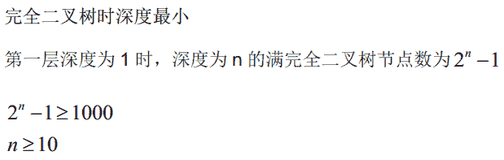

发表于 2015-09-13 10:54:24

* * *

[zhisheng_blog](https://www.nowcoder.com/profile/616717)

**第一个和第二个答案解释竟然一模一样，醉了**

发表于 2016-04-05 23:10:13

* * *

## 12

若进栈序列为 1,2,3.4 假定进栈和出栈可以穿插进行，则可能的出栈序列是()

正确答案: D   你的答案: 空 (错误)

```cpp
2,4,1,3
```

```cpp
3,1,4,2
```

```cpp
3,4,1,2
```

```cpp
1,2,3,4
```

本题知识点

栈 *讨论

[笑斗涯](https://www.nowcoder.com/profile/505884)

个人分析的，如果有错请指正：       原则：如果想要后面的先出栈，那么按照 1234 的入栈顺序，前面的必须已经入栈，比如要让 3 第一个出栈，那么入栈顺序为：1 入栈，2 入栈，3 入栈，之后 3 出栈，这样 3 就是第一个出栈的，如果想让 4 接着出栈，那么就 4 入栈，然后再出栈，然后 2 出栈，1 出栈最后出栈顺序为：3421 以此规则分别分析 ABCDA 表示：1 入栈，2 入栈，2 出栈，3 入栈，4 入栈，4 出栈，后面 3 必须先出栈，1 才能出栈，所以 A 错 B 表示：1 入栈，2 入栈，3 入栈，3 出栈，后面 2 必须先出栈，1 才能出栈，所以 B 错 C 表示：1 入栈，2 入栈，3 入栈，3 出栈， 4 入栈，4 出栈， 后面 2 必须先出栈，1 才能出栈，所以 C 错 D 表示：1 入栈，1 出栈， 2 入栈，2 出栈， 3 入栈，3 出栈， 4 入栈，4 出栈，正确

发表于 2015-09-11 19:41:47

* * *

[zhisheng_blog](https://www.nowcoder.com/profile/616717)

**我觉得这种入栈和出栈顺序的问题是很简单的了，反正记住“后进先出”原则就可以了**

发表于 2016-04-05 23:12:40

* * *

[zio](https://www.nowcoder.com/profile/3203661)

对于每一个数字， 其后比他小的数字均为降序排列

发表于 2017-09-01 16:51:28

* * *

## 13

以下程序统计给定输入中每个大写字母的出现次数(不需要检查输入合法性)

```cpp
void AlphabetCounting(char a[],int n){
  int count[26] = {}, i, kind = 10;
  for(i = 0;i < n;++i) (1);
  for(i = 0;i < 26;++i){
    if(++kind > 1) putchar(';');
    printf("%c=%d", (2));
   }
}
```

以下能补全程序，正确功能的选项是()

正确答案: D   你的答案: 空 (错误)

```cpp
++count[a[i]-'Z'];'Z'-i,count['Z'-i]
```

```cpp
++count['A'-a[i]];'A'+i,count[i]
```

```cpp
++count[i];i,count[i]
```

```cpp
++count['Z'-a[i]];'Z'-i,count[i]
```

```cpp
++count[a[i]];'A'+i,count[a[i]]
```

本题知识点

C++ C 语言

讨论

[Pandora](https://www.nowcoder.com/profile/266279)

题意为输入设定全部是大写（A  查看全部)

编辑于 2016-04-16 15:46:58

* * *

[牛逼（牛客的哥哥）](https://www.nowcoder.com/profile/648054780)

int count[26] 初始化 26 个 0 元素的数组，对应着每个大写字母的个数++count['Z'-a[i]]  'Z'-a[i] 计算 ascii 码差，即数组中的位置，然后找到对应字母的个数加一最后从 Z-A 输出个数实现从 A-Z 输出的代码

```cpp
void AlphabetCounting(char a[], int n) {
	int count[26] = {}, i, kind = 0;
	for (i = 0; i < n; ++i) {  
		++count[a[i] - 'A'];
	}
	for (i = 0; i < 26; ++i) {
		if (++kind > 1) putchar(';');
		printf("%c=%d", 'A' + i, count[i]);
	}
}
```

发表于 2020-11-23 18:01:41

* * *

[MaXboy](https://www.nowcoder.com/profile/578339)

B 中的第一空改为++count[a[i]- 'A' ];那么 B 也正确

发表于 2016-05-27 21:35:32

* * *

## 14

设非空二叉树中度数为 0 的结点数为 n0，度数为 1 的结点数为 n1,度数为 2 的结点数为 n2,则下列等式成立的是（）

正确答案: C   你的答案: 空 (错误)

```cpp
n0=n1+n2
```

```cpp
n0=2n1+1
```

```cpp
n0=n2+1
```

```cpp
n0=n1+1
```

本题知识点

树

讨论

[听我 ViVi 道来](https://www.nowcoder.com/profile/426198)

  查看全部)

编辑于 2016-04-17 17:32:24

* * *

[啥](https://www.nowcoder.com/profile/811262)

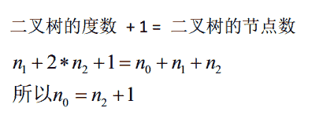

发表于 2015-09-13 11:00:40

* * *

[日月星辰](https://www.nowcoder.com/profile/148410)

总节点数 n=n0+n1+n2,总的链接数为 n-1，n-1=n1+2n2，所以 n-1    +1=n1+2n2    +1= n =n0+n1+n2,即 n0 =n2+1;

发表于 2015-09-11 14:38:48

* * *

## 15

IP 地址 205.140.36.68 的哪一部分表示网络号()

正确答案: D   你的答案: 空 (错误)

```cpp
205
```

```cpp
205.140
```

```cpp
68
```

```cpp
205.140.36
```

本题知识点

网络基础

讨论

[yayamma](https://www.nowcoder.com/profile/270051)

|  | 网络号 | 网络范围 | 主机号 | IP 地址范围 |
| A  类 | 8bit 第一位固定为  0 | 0  ——  127 | 24bit | 1.0.0.0 -- 127.255.255.255 |
| B  类 | 16bit 前两位固定为  10 | 128.0  ——  191.255 | 16bit | 128.0.0.0 -- 191.255.255.255 |
| C  类 | 24bit 前三位固定为  110 | 192.0.0  ——  223.255.255 | 8bit | 192.0.0.0 -- 223.255.255.255 |
| D  类 | 前四位固定为  1110 ，后面为多播地址   **所以  D** **类地址为多播地址** |
| E  类 | 前五位固定为  11110 ，后面保留为今后所用 |

发表于 2015-09-11 21:56:20

* * *

[牛客 192546 号](https://www.nowcoder.com/profile/192546)

D   题目看到，IP 地址第一段为 205 大于 191，为 C 类，所以网络号占三段即 24 位，故前三段为网络号，最后一段为主机号

发表于 2015-09-17 13:58:10

* * *

[拉风小伙](https://www.nowcoder.com/profile/407743)

1． A 类 IP 地址   
**一个 A 类 IP 地址由 1 字节的网络地址和 3 字节主机地址组成** ，网络地址的最高位必须是“0”， 地址范围从 1.0.0.0 到 126.0.0.0。
2． B 类 IP 地址   
**一个 B 类 IP 地址由 2 个字节的网络地址和 2 个字节的主机地址组成** ，网络地址的最高位必须是“10”，地址范围从 **128** .0.0.0 到 191.255.255.255。
3． C 类 IP 地址   
**一个 C 类 IP 地址由 3 字节的网络地址和 1 字节的主机地址组成** ，网络地址的最高位必须是“110”。范围从 **192** .0.0.0 到 223.255.255.255。

发表于 2015-09-11 11:46:19

* * *

## 16

一棵深度为 4 的三叉树，最多有多少个节点（）

正确答案: B   你的答案: 空 (错误)

```cpp
24
```

```cpp
40
```

```cpp
36
```

```cpp
54
```

本题知识点

树

讨论

[SunburstRun](https://www.nowcoder.com/profile/557336)

答案为 B   层数从 1  查看全部)

编辑于 2015-09-10 22:39:55

* * *

[啥](https://www.nowcoder.com/profile/811262)

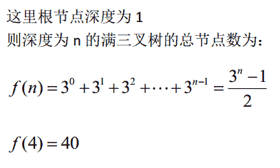

发表于 2015-09-13 11:07:47

* * *

[zhisheng_blog](https://www.nowcoder.com/profile/616717)

**就跟完全二叉树一样，都是满的节点才会最多，即 1+3+9+27=40**

发表于 2016-04-05 23:16:13

* * *

## 17

有两个袋子，白色袋子里有 7 个红球和 3 个蓝球，黑色袋子里有 3 个红球和 7 个蓝球。每次取一个球，取完立刻放回，所有球都从某一个袋子里取，袋子的选择是随机的。共取出 6 个红球和 4 个蓝球。问所有球是从黑色袋子里取出的概率是（）

正确答案: D   你的答案: 空 (错误)

```cpp
0.1
```

```cpp
0.48
```

```cpp
0.66
```

```cpp
0.16
```

本题知识点

概率统计 *概率论与数理统计* *讨论

[webary](https://www.nowcoder.com/profile/581261)

正确答案 D.白色袋子中  查看全部)

编辑于 2015-11-26 00:45:21

* * *

[lastdawn](https://www.nowcoder.com/profile/257732)

不知道对不对。我选的 D。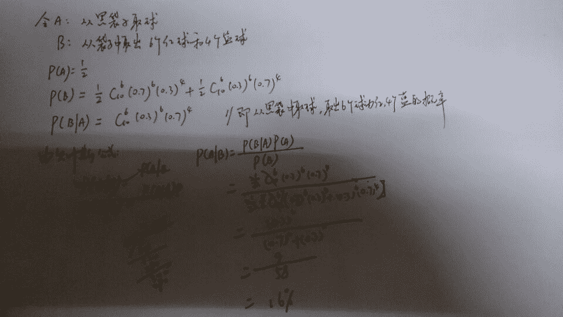

发表于 2015-09-11 00:24:10

* * *

[guanjian](https://www.nowcoder.com/profile/564796)

0.3⁶ * 0.7⁴  / ( 0.7⁶ * 0.3⁴ + 0.3⁶ * 0.7⁴)   ;//分子分母同时除以 0.3⁴ * 0.7⁴⁰.3² * / ( 0.7²+ 0.3²) = 9/(49+9) =     0.16 完毕

发表于 2015-09-13 23:34:35

* * *

## 18

关于二叉树，下面说法正确的是（）

正确答案: B D   你的答案: 空 (错误)

```cpp
二叉树中至少有一个节点的度为 2
```

```cpp
一个具有 1025 个节点的二叉树，其高度范围在 11 到 1025 之间
```

```cpp
对于 n 个节点的二叉树，其高度为 n*log(n)
```

```cpp
二叉树的先序遍历是 EFHIGJK,中序遍历为 HFIEJKG,该二叉树的右子树的根为 G
```

本题知识点

树

讨论

[SunburstRun](https://www.nowcoder.com/profile/557336)

答案是 BD    B：  查看全部)

编辑于 2015-09-10 22:46:08

* * *

[Circle&Z](https://www.nowcoder.com/profile/476805)

基本概念二叉树是[递归](http://baike.baidu.com/view/96473.htm)定义的，其结点有左右子树之分，逻辑上二叉树有五种基本形态：(1)空二叉树——如图(a)； (2)只有一个根结点的二叉树——如图(b)；(3)只有左子树——如图(c)；(4)只有右子树——如图(d)；(5)[完全二叉树](http://baike.baidu.com/view/427107.htm)——如图(e)。注意：尽管二叉树与树有许多相似之处，但二叉树不是树的特殊情形二叉树性质(1) 在非空二叉树中，第 i 层的结点总数不超过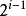, i>=1；(2) 深度为 h 的二叉树最多有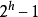个结点(h>=1)，最少有 h 个结点；(3) 对于任意一棵二叉树，如果其叶结点数为 N0，而度数为 2 的结点总数为 N2，则 N0=N2+1；(4) 具有 n 个结点的[完全二叉树](http://baike.baidu.com/view/427107.htm)的深度为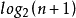(5)有 N 个结点的[完全二叉树](http://baike.baidu.com/view/427107.htm)各结点如果用顺序方式存储，则结点之间有如下关系：若 I 为结点编号则 如果 I>1，则其父结点的编号为 I/2；如果 2*I<=N，则其左儿子（即左子树的根结点）的编号为 2*I；若 2*I>N，则无左儿子；如果 2*I+1<=N，则其右儿子的结点编号为 2*I+1；若 2*I+1>N，则无右儿子。(6)给定 N 个节点，能构成 h(N)种不同的二叉树。h(N)为[卡特兰数](http://baike.baidu.com/view/2499752.htm)的第 N 项。h(n)=C(2*n，n)/(n+1)。(7)设有 i 个枝点，I 为所有枝点的道路长度总和，J 为叶的道路长度总和 J=I+2i 题目分析
对于 A 选项，由二叉树的基本概念可知，二叉树中节点的最大度数不超过 2，而并一定非要有度为 2 的节点，如上述（a）（b）（c）（d）所示
对于 B 选项，数的高度最大为 1025，即每一层都只有一个节点，最小是当每一层的节点数最大时， =1025，h=10,又显然 2 的 10 次方减一等于 1023，所以最小层数为 11，正确对于 C 选项， **具有 n 个结点的** [**完全二叉树**](http://baike.baidu.com/view/427107.htm) **的深度为** **，而选项未标明二叉树种类，显然不对；****对于 D 选项，由先序遍历可知，根节点是 E,所以由中序遍历可知 JKG 是 E 的右子树，再观察先序遍历顺序，为 GJK，所以显然 G 是右子树的根节点，再观察中序遍历，可以知 JK 是 G 的左子树，正确****综上所述，答案选 BD**

我的 Github ^_^ (欢迎 follow): [`github.com/CircleZ3791117`](https://github.com/CircleZ3791117)

编辑于 2018-02-09 15:46:09

* * *

[allensimon](https://www.nowcoder.com/profile/608790)

二叉树可以是空树，所以可以没有节点的度为 2

发表于 2017-05-07 19:18:36

* * *

## 19

以下选项中采用分治方法的算法有（）

正确答案: C D E   你的答案: 空 (错误)

```cpp
堆排序算法
```

```cpp
插入排序算法
```

```cpp
归并排序算法
```

```cpp
二分查找算法
```

```cpp
快速排序算法
```

本题知识点

分治

讨论

[牛逼哄哄 2](https://www.nowcoder.com/profile/632490)

是不是少选了一个 A，在各种排序方法中，如归 [1]    并排序、堆排序、快速排序等，都存在有分治的思想 [1]    。

发表于 2015-09-11 09:55:15

* * *

[_ddddtt](https://www.nowcoder.com/profile/566969)

堆排序只是一个个删除然后重建，并没有分治的思想

发表于 2017-03-23 17:01:22

* * *

[高高的围墙](https://www.nowcoder.com/profile/573620)

还有二分查找也是分治算法，所以我认为答案应该是 ACDE

发表于 2016-09-03 22:34:42

* * *

## 20

已知有向图 G=（V，E）其中 V={V1，V2,V3，V4，V5，V6,V7}E={<V1,V2>,<V1,V3>,<V1,V4>,<V2,V5>,<V2,V6>,<V3,V5>,<V3,V6>,<V4,V6>,<V5,V7>,<V6,V7>},则 G 的拓扑序列是：（）

正确答案: B C   你的答案: 空 (错误)

```cpp
V1, V4，V2，V6, V3，V5，V7
```

```cpp
V1，V2，V3，V4, V5，V6，V7
```

```cpp
V1，V3, V4，V2，V6，V5，V7
```

```cpp
V1，V3，V4, V6，V2, V5，V7
```

本题知识点

图

讨论

[Miner_Sty](https://www.nowcoder.com/profile/512761)

[图]不断选取入度为 0 的节  查看全部)

编辑于 2016-04-28 09:13:26

* * *

[RockMan](https://www.nowcoder.com/profile/220906)

         http://baike.baidu.com/link?url=1nDvMOujJ-coWDfJFRSqO68bBgKMaDeu3btcnjLwD6WSAZ5dQFC4Bq-ZQOMuXJo8-SRDmnq3GPmkLzMKOK_Z9a**解题要点：****1.明白何为拓扑排序，其特点为什么？  以及排序结果是否唯一？**     对一个 [有向无环图](http://baike.baidu.com/view/6204968.htm) (Directed Acyclic Graph 简称 DAG)G 进行拓扑排序，是将 G 中所有顶点排成一个线性序列，使得图中任意一对顶点 u 和 v，若边(u,v)∈E(G)，则 u 在线性序列中出现在 v 之前。排序结果不唯一。**2.如何完成拓扑排序。** 由 AOV 网构造拓扑序列的拓扑排序算法主要是循环执行以下两步，直到不存在入度为 0 的顶点为止。(1) 选择一个入度为 0 的顶点并输出之；(2) 从网中删除此顶点及所有[出边](http://baike.baidu.com/view/1156963.htm)。循环结束后，若输出的顶点数小于网中的顶点数，则输出“有[回路](http://baike.baidu.com/subview/727107/8362768.htm)”信息，否则输出的顶点序列就是一种拓扑[序列](http://baike.baidu.com/subview/71968/12546268.htm)**3.拓扑排序及应用。**   拓扑排序常用来确定一个依赖关系集中，事物发生的顺序。例如，在日常工作中，可能会将项目拆分成 A、B、C、D 四个子部分来完成，但 A 依赖于 B 和 D，C 依赖于 D。为了计算这个项目进行的顺序，可对这个关系集进行拓扑排序，得出一个线性的序列，则排在前面的任务就是需要先完成的任务。**再进行多线程程序中可能会用到，将多线程单线程化。.....**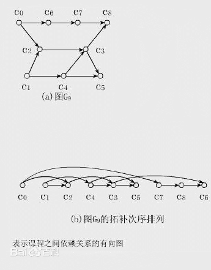

发表于 2015-09-11 15:34:48

* * *

[未来的搬运工](https://www.nowcoder.com/profile/2668196)

有个简单的方法，根据拓扑排序概念（对于从顶点**u**到顶点**v**的每个有向边**uv**，**u**在排序中都在**v**之前）**由****<V2,V6>,****<V3,V6>****可知 V6 在 V3 和 V2 后面**，然后答案就出来了=w=，BC

编辑于 2017-12-14 09:50:51

* * *

## 21

下面算法中可以判断出一个有向图是否有环的是：（）

正确答案: B D   你的答案: 空 (错误)

```cpp
求最短路径
```

```cpp
深度优先遍历
```

```cpp
广度优先遍历
```

```cpp
拓扑排序
```

本题知识点

图 Java 工程师 C++工程师 PHP 工程师 golang 工程师 前端工程师 安卓工程师 iOS 工程师 算法工程师 大数据开发工程师 运维工程师 安全工程师 数据库工程师 游戏研发工程师 测试开发工程师 测试工程师 2021 远景能源有限公司

讨论

[codersong](https://www.nowcoder.com/profile/365974)

深度优先搜索和拓扑排序就不说了，广度优先搜索过程中如果访问到一个已经访问过的节点，可能是多个节点指向这个节点，不一定是存在环

发表于 2015-10-08 21:26:31

* * *

[webary](https://www.nowcoder.com/profile/581261)

判断 **无向图** 中是否存在回路（环）的算法描述

如果存在回路，则必存在一个子图，是一个环路。环路中所有顶点的度>=2。

算法：

     第一步：删除所有度<=1 的顶点及相关的边，并将另外与这些边相关的其它顶点的度减一。

     第二步：将度数变为 1 的顶点排入队列，并从该队列中取出一个顶点重复步骤一。

     如果最后还有未删除顶点，则存在环，否则没有环。

**有向图**是否有环的判定算法，主要有**深度优先和拓扑排序**两种方法。所以答案选 **BD**

编辑于 2016-08-30 18:25:13

* * *

[不负时光](https://www.nowcoder.com/profile/317111)

```cpp
其实你画个图比划一下就很清楚了。通常处理图结构的时候是转换成树结构，通常也就是按照深度遍历的方式转换，
转换的时候是从起始节点开始，找节点的孩子，找到了就保存下来，然后找孩子的孩子，每次找到之后都保存下来，
这就是深度遍历，如果有向图中存在圈圈，那么就必然会出现这种情况“某个节点的孩子已经存在于你保存的节点里了”，
一旦出现就表示有圈圈。
 广度遍历就不行了，因为有向图与树最大的区别之一是两个图的节点可能会有公共的孩子，所以用广度遍历的方式，即使出现了重复，
也不能证明有圈圈。
```

发表于 2016-03-22 22:07:06

* * *****