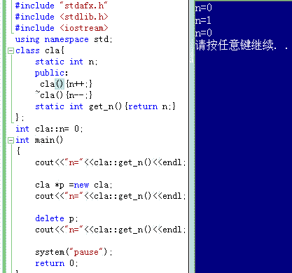

# 乐视 2013 校招研发工程师笔试题

## 1

栈和队列的共同点是

正确答案: D   你的答案: 空 (错误)

```cpp
都是先进后出
```

```cpp
都是先进先出
```

```cpp
没有共同点
```

```cpp
只允许在端点处插入和删除元素
```

本题知识点

栈 *讨论

[李冰](https://www.nowcoder.com/profile/642631)

栈是先进后出，后进先出，只在栈尾部进行插入和删除队列是先进先出，只在队头删除元素，队尾插入元素所以 D 对，栈和队列都是在端点出插入和删除元素

发表于 2015-09-13 23:00:35

* * *

[墨裳花开](https://www.nowcoder.com/profile/994851)

栈，正是因为只能在一端操作，所以有了后进先出的特性；队列正是因为也只能是在两个端点处进行操作，一端入队列，一端出队列，所以有了先进先出的特性；综上所述，可发现，共同点就在于：**都只允许在端点处操作**

发表于 2015-10-13 00:21:29

* * *

## 2

对长度为 N 的线性表进行顺序查找，在最坏情况下所需要的比较次数为 ___？

正确答案: B   你的答案: 空 (错误)

```cpp
N+1
```

```cpp
N
```

```cpp
N/2
```

```cpp
(N+1)/2
```

本题知识点

查找 *讨论

[Pandora](https://www.nowcoder.com/profile/266279)

最坏情况就是所查找元素【不在】线性表内，所以要比较 N 个结点。

发表于 2015-10-05 13:57:17

* * *

[BrainerGao](https://www.nowcoder.com/profile/516342)

最坏情况是要查找的元素不在线性表内或在线性表尾部，需要比较 N 次

发表于 2017-04-17 17:29:09

* * *

[麦田的守望者 lj123](https://www.nowcoder.com/profile/509021)

比如我们所查找的元素位于线性表尾部，那么比较次数就为 N 

发表于 2015-09-13 15:16:37

* * *

## 3

一个栈的输入序列为 1 2 3 4 5，则下列序列中不可能是栈的输出序列的是

正确答案: D   你的答案: 空 (错误)

```cpp
1 5 4 3 2
```

```cpp
2 3 1 4 5
```

```cpp
2 3 4 1 5
```

```cpp
5 4 1 3 2
```

本题知识点

栈 *讨论

[J_kiwi](https://www.nowcoder.com/profile/142811)

对于出栈这类题目，为了尽快选出答案，我们可以先看第一个出栈的元素是后进栈的选项，这些选项的特点是在在第一个进栈元素之前进栈的元素必须是逆序的。

发表于 2015-12-03 08:06:34

* * *

[渊虹](https://www.nowcoder.com/profile/590142)

A:PUSH POP PUSH PUSH PUSH PUSH POP POP POP POPB:PUSH PUSH POP POSH POP POP PUSH POP PUSH POPC:PUSH PUSH POP PUSH POP PUSH POP POP PUSH POPD:5 最先出栈说明入栈顺序是 12345，出栈只能是 54321\.

发表于 2015-09-16 16:41:33

* * *

[cpppppp](https://www.nowcoder.com/profile/4062248)

**先给出结论：**对于任意栈：1, 2, 3, 4,..., n-1, n，经过任意顺序的进栈和出栈，也就是栈混洗，都不能出现   （...,c,...,a,....,b,....）的顺序，其中(a < b < c) ，...代表夹在中间的其他元素。也就是不能出现 （...大...小...中...） 的顺序。**证明过程如下：**当输出存在顺序 c a b 时，
因为 a < b < c，所以当 c 出栈的时候，一定有 a，b 已 c 在之前压入栈中，且没有出栈，存在栈中。又因为 a < b，所以一定是 a 先进栈，b 后进栈。那么 b 先出栈，a 后出栈。所以不可能出现 c a b 的顺序。**补充：**可能出现 ：...小...中...大......小...大...中......中...小...大......中...大...小......大...中...小...不可能出现：...大...小...中...上面只证明了不可能出现的情况，可能出现的情况证明过程略。

发表于 2019-01-16 16:57:32

* * *

## 4

输入序列为 ABC，可以变成 CBA 时，经过的栈操作为

正确答案: B   你的答案: 空 (错误)

```cpp
push,pop,push,pop,push,pop
```

```cpp
push,push,push,pop,pop,pop
```

```cpp
push,push,pop,pop,push,pop
```

```cpp
posh,pop,push,push,pop,pop
```

本题知识点

栈 *讨论

[皮卡皮卡-皮卡丘](https://www.nowcoder.com/profile/752282540)

ABC 经过 push，push，push 操作后，从栈顶到栈低元素为 CBA，经过 pop，pop，pop 出栈操作后，输出为 CBA。

发表于 2020-01-05 21:56:24

* * *

[浪子福多](https://www.nowcoder.com/profile/288496261)

应该是考察“后进先出，先进后出”

发表于 2018-10-23 23:10:31

* * *

[huixieqingchun](https://www.nowcoder.com/profile/551201)

```cpp
要注意顺序，ABC 为入栈顺序，CBA 为出栈顺序，C 先出来
```

发表于 2016-04-27 14:04:02

* * *

## 5

希尔排序法属于哪一种类型的排序法

正确答案: A   你的答案: 空 (错误)

```cpp
插入类排序法
```

```cpp
交换类排序法
```

```cpp
选择类排序法
```

```cpp
建堆排序法
```

本题知识点

排序 *讨论

[飞翔 zhi 梦](https://www.nowcoder.com/profile/138555)

希尔排序法(缩小增量法) 属于插入类排序，是将整个无序列分割成若干小的子序列分别进行 [插入排序](http://baike.baidu.com/view/396887.htm) 的方法。

发表于 2015-09-12 22:46:47

* * *

[阳光下的米雪](https://www.nowcoder.com/profile/916856937)

希尔是缩小增量的插入排序，直接插入排序增量为 1

发表于 2019-04-27 19:41:30

* * *

[Elevenzou](https://www.nowcoder.com/profile/980835037)

```cpp
void ShellSort(int *nums, int n){
    int t = 1;
    // 将区间分成三部分
    while(t < n / 3){
        t = 3 * t + 1;
    }
    while(t >= 1){
        for(int i = t; i < n; i++){
            for(int j = i; j >= t && nums[j] < nums[j - t]; j -= t){
                swap(nums[j], nums[j - t]);
            }
        }
        t = t / 3;
    }
}
```

发表于 2019-08-15 20:04:05

* * *

## 6

假定有类 AB，有相应的构造函数定义，能正确执行

```cpp
AB a(4), b(5), c[3], *p[2] = {&a, &b};
```

语句，请问执行完此语句后共调用该类的构造函数次数为 ___

正确答案: A   你的答案: 空 (错误)

```cpp
5
```

```cpp
4
```

```cpp
3
```

```cpp
9
```

本题知识点

C++ C 语言

讨论

[低调~前行](https://www.nowcoder.com/profile/317817)

```cpp
A 只有给对象分配内存才调用构
```

  查看全部)

编辑于 2015-12-31 10:14:45

* * *

[Pandora](https://www.nowcoder.com/profile/266279)

a(4)，一个对象 a，调用 1 次构造函数；b(5)，一个对象 b，调用 1 次构造函数；c[3]，三个对象 c[0]，c[1]，c[2]，调用 3 次构造函数；*p[2]，指针数组，其元素分别指向 a 和 b，所以没有调用构造函数。总共 5 次。

发表于 2015-10-05 14:08:00

* * *

[期待最好的自己](https://www.nowcoder.com/profile/7696607)

```cpp
只有给对象分配内存才调用构造函数 指针没有 new 一个对象，所以不会分配内存，不构造。
只是给指针指向某地值的话，没有开辟空间，不构造。
```

发表于 2017-07-27 17:47:51

* * *

## 7

一个 n 个顶点的连通无向图，其边的个数至少为 ___。

正确答案: B   你的答案: 空 (错误)

```cpp
n+1
```

```cpp
n-1
```

```cpp
n
```

```cpp
nlogn
```

本题知识点

图

讨论

[江左梅郎 3](https://www.nowcoder.com/profile/7306669)

直接 n=2,两个顶点一条边，代入就是只有 n-1 符合。故选 B

发表于 2017-03-24 09:17:17

* * *

[牛客 823870 号](https://www.nowcoder.com/profile/823870)

n 个顶点的连通图至少有 n-1 条边，再少就不连通了，连通是指任意两个顶点之间都有路径，而不要求都有边相连．有路径是指从一个顶点沿着某些边可以到达另一个顶点．

发表于 2015-09-15 17:28:19

* * *

[VagrantYang](https://www.nowcoder.com/profile/6863719)

最小生成树就是最小的连通图

发表于 2018-01-05 17:21:22

* * *

## 8

有如下程序，执行后输出的结果是(      )

```cpp
#include <iostream>
using namespace std;
class cla {
    static int n;

  public:
    cla() { n++; }
    ~cla() { n--; }
    static int get_n() { return n; }
};
int cla::n = 0;
int main() {
    cla *p = new cla;
    delete p;
    cout << "n=" << cla::get_n() << endl;
    return 0;
}
```

正确答案: D   你的答案: 空 (错误)

```cpp
n=3
```

```cpp
n=4
```

```cpp
n=1
```

```cpp
n=0
```

本题知识点

C++ C 语言

讨论

[Pandora](https://www.nowcoder.com/profile/266279)

类的实例化：cla *p = new cla，p 分配在栈上，p 指向的对象分配在堆上。n 为静态成员变量，没有 this 指针，属于类域，所有对象共享。实例化——调用构造函数，所以 n++；delete——调用析构函数，所以 n--。最后输仍旧为 0。如图：

编辑于 2016-10-17 13:13:07

* * *

[lock-free](https://www.nowcoder.com/profile/113156)

类的静态数据成员的生命期与程序生命期相同，只是在该类内可见。

发表于 2015-09-12 13:50:27

* * *

[宛冬晴](https://www.nowcoder.com/profile/516426)

 cla *p =newcla;会调用构造函数 deletep;会调用析构函数

发表于 2017-06-05 10:08:28

* * *

## 9

当一个类的某个函数被说明为 virtual，则在该类的所有派生类中的同原型函数 _____?

正确答案: D   你的答案: 空 (错误)

```cpp
只有 被重新说明时才识虚函数
```

```cpp
只有被重新说明为 virtual 时才是虚函数
```

```cpp
都不是虚函数
```

```cpp
都是虚函数
```

本题知识点

C++

讨论

[已注销](https://www.nowcoder.com/profile/2862122)

其实吧，这题可以联想到重载，覆盖，隐藏的区别。

**a.成员函数被重载的特征：**

（1）相同的范围（在同一个类中）；

（2）函数名字相同；

（3）参数不同；

（4）virtual 关键字可有可无。

**b.覆盖是指派生类函数覆盖基类函数，特征是：**

（1）不同的范围（分别位于派生类与基类）；

（2）函数名字相同；

（3）参数相同；

（4）基类函数必须有 virtual 关键字。

**c.“隐藏”是指派生类的函数屏蔽了与其同名的基类函数，规则如下：**

（1）如果派生类的函数与基类的函数同名，但是参数不同。此时，不论有无 virtual 关键字，基类的函数将被隐藏（注意别与重载混淆）。

（2）如果派生类的函数与基类的函数同名，并且参数也相同，但是基类函数没有 virtual 关键字。此时，基类的函数被隐藏（注意别与覆盖混淆）

发表于 2016-09-23 17:16:51

* * *

[songlj](https://www.nowcoder.com/profile/188949)

基[类的成员函数](http://baike.baidu.com/view/2345889.htm) 设为 virtual，其[派生类](http://baike.baidu.com/view/535532.htm) 的相应的函数也会自动变为虚函数

发表于 2015-09-14 18:52:39

* * *

[善良超锅锅](https://www.nowcoder.com/profile/6803621)

《C++ Primer》第五版，P537 页：“当我面在派生类中覆盖某个虚函数时，可以再一次使用 virtual 关键字指出该函数的性质。然而这么做并非必须，因为一旦某个函数被声明为虚函数，则在所有派生类中它都是虚函数”

发表于 2017-04-22 12:26:31

* * *

## 10

关于函数的描述正确的是 ___。

正确答案: D   你的答案: 空 (错误)

```cpp
虚函数是一个 static 型的函数
```

```cpp
派生类的虚函数与基类的虚函数具有不同的参数个数和类型
```

```cpp
虚函数是一个非成员函数
```

```cpp
基类中说明了虚函数后，派生类中起对应的函数可以不必说明为虚函数​
```

本题知识点

C++

讨论

[奇异果好补](https://www.nowcoder.com/profile/757501)

以关键字 virtual 的成员函数称为虚函数，主要是用于运行时多态，也就是动态绑定。虚函数必须是类的成员函数，不能使友元函数、也不能是构造函数【原因：因为建立一个派生类对象时，必须从类层次的根开始，沿着继承路径逐个调用基类的构造函数，直到自己的构造函数，不能选择性的调用构造函数】不能将虚函数说明为全局函数，也不能说明为 static 静态成员函数。因为虚函数的动态绑定必须在类的层次依靠 this 指针实现。再添加一点：虚函数的重载特性：一个派生类中定义基类的虚函数是函数重载的一种特殊形式。重载一般的函数：函数的返回类型和参数的个数、类型可以不同，仅要求函数名相同；而重载虚函数：要求函数名、返回类型、参数个数、参数类型和顺序都完全相同。纯虚函数：是在基类中说明的虚函数，它在基类中没有是在定义，要求所有派生类都必须定义自己的版本。纯虚函数的定义形式：virtual 类型 函数名(参数表)=0，该函数赋值为 0，表示没有实现定义。在基类中定义为 0，在派生类中实现各自的版本。纯虚函数与抽象类的关系：抽象类中至少有一个纯虚函数。如果抽象类中的派生类没有为基类的纯虚函数定义实现版本，那么它仍然是抽象类，相反，定义了纯虚函数的实现版本的派生类称为具体类。抽象类在 C++中有以下特点：

1.  抽象类只能作为其他类的基类；
2.  抽象类不能建立对象；
3.  抽象类不能用作参数类型、参数返回类型或显示类型转换。

发表于 2016-09-13 18:07:38

* * *

[Aping](https://www.nowcoder.com/profile/330117)

```cpp
在派生类中重新定义该虚函数时，关键字 virtual 可以写也可以不写。
一个虚函数无论被公有继承多少次，它仍然保持其虚函数的特性。
虚函数必须是其所在类的成员函数，而不能是友元函数，也不能是静态成员函数（static）
```

发表于 2015-09-14 08:42:50

* * *

[追寻梦之碎片](https://www.nowcoder.com/profile/428161)

(1) 与基类的虚函数有相同的参数个数；  (2) 其参数的类型与基类的虚函数的对应参数类型相同；  (3) 其返回值或者与基类虚函数的相同，或者都返回指针或引用，并且派生类虚函数所返回的指针或引用 的基类型， 是基类中被替换的虚函数所返回的指针或引用的基类型的子类型

发表于 2016-10-12 00:43:26

* * ******