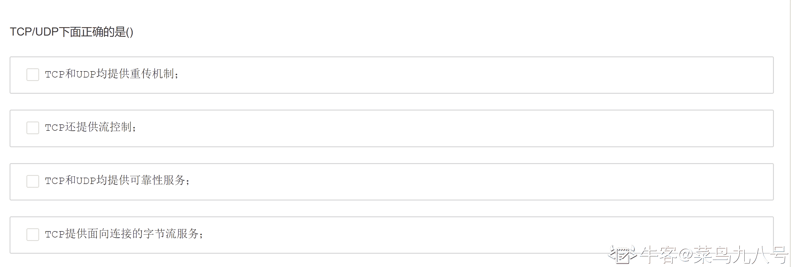

# 搜狐 2013 校招研发工程师笔试题

## 1

假设二叉排序树的定义是：1、若它的左子树不为空，则左子树所有节点均小于它的根节点的值；2、若右子树不为空，则右子树所有节点的值均大于根节点的值；3、它的左右子树也分别为二叉排序树。下列哪种遍历之后得到一个递增有序数列 （）

正确答案: B   你的答案: 空 (错误)

```cpp
前序遍历
```

```cpp
中序遍历
```

```cpp
后序遍历
```

```cpp
广度遍历
```

本题知识点

树 搜狐

讨论

[--sgf--](https://www.nowcoder.com/profile/8882859)

二叉排序树中序遍历为从小到大的有序数列

发表于 2022-02-19 14:46:26

* * *

[星陨无痕](https://www.nowcoder.com/profile/436939)

首先答案选择 B 中序具体思考过程如下 1、若它的左子树不为空，则左子树所有节点均小于它的根节点的值；左子树<根节点 2、若右子树不为空，则右子树所有节点的值均大于根节点的值；右子树>根节点 3、它的左右子树也分别为二叉排序树；所有子树都符合上面的条件得到一个递增有序数列，题目中写成了“有个”。递增意味着开始的值小于后面的值由条件 1,2 可知，左子树最小，右子树最大，节点处于二者之间，递增排列也就是，左根右，也就是中序遍历答案选择 B

发表于 2015-09-15 22:29:00

* * *

[牛客 698907 号](https://www.nowcoder.com/profile/698907)

二叉排序树中序遍历为从小到大的有序数列

发表于 2016-03-26 20:16:57

* * *

## 2

87 的 100 次幂除以 7 的余数是多少（）

正确答案: D   你的答案: 空 (错误)

```cpp
1
```

```cpp
2
```

```cpp
3
```

```cpp
4
```

本题知识点

数学运算

讨论

[JetChars](https://www.nowcoder.com/profile/692475)

正解：D 原理：1\. (A*B)%C = (A%C)*(B%C)%C 2. A^n %C=((A-A%C)+A%C)^n%C=( A%C) ^n %C 解：1. 将 87¹⁰⁰简化成 3¹⁰⁰：87 % 7=3 2. 找到 mod7 为 1 的部分：3⁶(=729) % 7 =1 3. 所以 87¹⁰⁰-->3¹⁰⁰-->(3⁶)¹⁶*3⁴-->1*81-->4 (mod 7)

编辑于 2015-08-22 11:10:04

* * *

[美团校招内推直达](https://www.nowcoder.com/profile/458054)

D 由同余定理性质：对于同一个除数，如果两个整数同余，那么他们的乘方仍然同余。所以：87 除以 7 的余数等于 3，3 除以 7 的余数也是 3，可以说 87¹⁰⁰ 与 3 ¹⁰⁰ 对于除数 7 同余。但是 3 ¹⁰⁰ 仍然是一个很大的数字，求余数仍然比较困难。这时的关键找出 3 的几次方对于 7 与 1 同余，经过试验知道 3 ⁶ ≡1（mod7),而 100＝6*16+4，所以 3 ¹⁰⁰ ≡3 ⁴ （mod7).根据同余的性质(3 ⁶ ) ¹⁶ ×3 ⁴ ≡1×81＝4（mod7),所以余数等于 4。

编辑于 2015-09-19 11:07:10

* * *

[azuredragon_y](https://www.nowcoder.com/profile/528259)

D。87=3(mod 7)3⁶=729=1(mod 7)所以 87¹⁰⁰=3¹⁰⁰=(3⁶)¹⁶*3⁴=1*81=4(mod 7)

发表于 2015-01-04 21:50:57

* * *

## 3

往一个栈顺序 push 下列元素：ABCDE，其 pop 可能的顺序，下列不正确的是（）

正确答案: C   你的答案: 空 (错误)

```cpp
BACDE
```

```cpp
ACDBE
```

```cpp
AEBCD
```

```cpp
AEDCB
```

本题知识点

栈 *搜狐* *讨论

[挥着牛鞭的男孩](https://www.nowcoder.com/profile/825762)

可能很多人遇到此类题都是一个一个选项试，这样会浪费较多时间。
在这里我教大家一个方法：
任意三个元素能否按某相对次序出现于混洗中，与其他元素无关，推而广之，如果对于 i,j,k 的序列，k,i,j 则必然不能过栈混洗来得到。此为*充分必要*条件。对于 CDE 必然不会有 ECD，c 错误。

发表于 2016-08-02 15:51:02

* * *

[幻想家](https://www.nowcoder.com/profile/237216)

(A):push(a)->push(b)->pop(b)->pop(a)->push(c)->pop(c)->push(d)->pop(d)->push(e)->pop(e);(B):push(a)-> pop(a) ->push(b) ->push(c)- >pop(c) -> push(d)->pop(d)-> pop(b)-> push(e)->pop(e);(D): push(a)-> pop(a) -> push(b) ->push(c)- > push(d) -> push(e) ->pop(e) - > pop(d)-> pop(c) ->pop(b);

编辑于 2015-09-23 18:57:45

* * *

[catro](https://www.nowcoder.com/profile/590738)

C

发表于 2015-03-11 18:11:45

* * *

## 4

int A[2][3]={1,2,3,4,5,6};,则 A[1][0]和*(*(A+1)+1)的值分别是（）

正确答案: A   你的答案: 空 (错误)

```cpp
4 5
```

```cpp
4 3
```

```cpp
3 5
```

```cpp
3 4
```

本题知识点

数组 C++ 搜狐

讨论

[Aesthetic92](https://www.nowcoder.com/profile/940702)

答案：选 A 答案解析：  查看全部)

编辑于 2015-02-06 10:08:31

* * *

[小胡同学 ccnu](https://www.nowcoder.com/profile/767514)

回答一下*(*(A+1)+1)为什么等于 5\.     A+1 中的 A 可以看做一个二级指针**A，这里+1,相当于将 A 指针向后移动一个一维数组大小的内存空间，即 A+1 指向的是 A[1]，也是 A[1][0]。*(A+1)+1，这里+1，相当于将指针向后移动一个数组元素的内存空间，即指向 A[1][1];所以输出 5。

发表于 2015-09-18 21:15:49

* * *

[雷军](https://www.nowcoder.com/profile/8674905)

A 是第一行的首地址，A+1 就是第二行的首地址，*(A+1)就是 A[1]，即第二行第一个元素的地址，再+1，就是第二行第二个元素的地址，*号表示取这个地址的值，所以...

发表于 2017-03-18 19:56:38

* * *

## 5

1100|1010,1001¹⁰⁰¹,1001&1100 分别为（）

正确答案: A   你的答案: 空 (错误)

```cpp
1110 0000 1000
```

```cpp
1000 1001 1000
```

```cpp
1110 1001 0101
```

```cpp
1000 1001 1000
```

本题知识点

编译和体系结构

讨论

[luozijian](https://www.nowcoder.com/profile/2174686)

| 例子 | 名称 | 结果 |
| $a & $b | And（按位与） | 将把 $a 和 $b 中都为 1 的位设为 1。 |
| $a &#124; $b | Or（按位或） | 将把 $a 和 $b 中任何一个为 1 的位设为 1。 |
| $a ^ $b | Xor（按位异或） | 将把 $a 和 $b 中一个为 1 另一个为 0 的位设为 1。 |
| ~ $a | Not（按位取反） | 将 $a 中为 0 的位设为 1，反之亦然。 |
| $a << $b | Shift left（左移） | 将 $a 中的位向左移动 $b 次（每一次移动都表示“乘以 2”）。 |
| $a >> $b | Shift right（右移） | 将 $a 中的位向右移动 $b 次（每一次移动都表示“除以 2”）。 |

发表于 2017-04-22 15:53:19

* * *

[幕清萧](https://www.nowcoder.com/profile/342803403)

0 假 1 真| 按位或：运算规则一真必真&按位与：运算规则一假必假~按位取反：运算规则真假相对^按位异或：运算规则相异为真

发表于 2019-01-23 17:07:59

* * *

[cindy_H](https://www.nowcoder.com/profile/694610797)

^是异或，不是与

发表于 2020-08-31 18:55:02

* * *

## 6

系统中的"颠簸"是由（）引起的

正确答案: B   你的答案: 空 (错误)

```cpp
内存容量不足
```

```cpp
缺页率高
```

```cpp
交换信息量大
```

```cpp
缺页率反馈模型不正确
```

本题知识点

编译和体系结构 搜狐

讨论

[牛客 444334 号](https://www.nowcoder.com/profile/444334)

B
颠簸（thrashing  查看全部)

编辑于 2015-01-07 22:46:34

* * *

[MyGoodHelper](https://www.nowcoder.com/profile/644326)

B 操作系统抖动,又叫颠簸。 颠簸(thrashing)是不作处理的计算机活动,通常是因为内存或其他资源耗尽或有限而无法完成所要执行的操作。

发表于 2015-01-18 19:30:39

* * *

[炫](https://www.nowcoder.com/profile/376795)

在请求分页存储管理中，从主存（DRAM）中刚刚换出（Swap Out）某一页面后（换出到 Disk），根据请求马上又换入（Swap In）该页，这种反复换出换入的现象，称为**系统颠簸**，也叫**系统抖动**。产生该现象的主要原因是置换算法选择不当。--摘自百度百科

编辑于 2016-08-30 22:17:23

* * *

## 7

以下程序打印的两个字符分别是？

```cpp
#include<stdio.h>
#include<iostream>
using namespace std;
typedef struct object object;
struct object {
    char data[3];
};

int main(void) {
    object obj_array[3] = {{'a', 'b', 'c'}, {'d', 'e', 'f'}, {'g', 'h', 'i'}};

    object *cur = obj_array;
    printf("%c %c\n", *(char *)((char *)(cur) + 2), *(char *)(cur + 2));
    return 0;
}
```

正确答案: A   你的答案: 空 (错误)

```cpp
c g
```

```cpp
b d
```

```cpp
g g
```

```cpp
g c
```

本题知识点

C++ 搜狐 C 语言

讨论

[gca](https://www.nowcoder.com/profile/950543)

A. c gcur 本为  查看全部)

编辑于 2016-01-12 13:38:58

* * *

[PioneerYi](https://www.nowcoder.com/profile/3363744)

本题 typedef 与 return 0 后面没有分号，但是本题重点不是这，只是提一下。首先明白，cur 是数组首地址，这毋庸置疑，其次要知道它的偏移量是和它的类型有关的。*(char*)((char *)(cur)+2)，cur 被强制转化为 char*类型，然后+2，那么就是加两个字节，就是 c。外面那个(char*)是为了转换为字符型指针与%c 对应，本题可以不要，因为本来就是字符。*(char*)(cur+2)),cur 的类型是 object*,那么 cur+2 就是加两个 obect 的大小，就是 6，因此是 g。同样，外面那个(char*)是为了转换为字符型指针与%c 对应，本题可以不要，因为本来就是字符。

发表于 2016-12-17 13:35:40

* * *

[雪未成型](https://www.nowcoder.com/profile/406937)

**此题主要是考察指针的步长，指针加 1 是和指针所指向的类型相关的** ，如果 cur 强制被转化成字符类型的指针，那么加 2，就是加 2 个字符的大小，即为 c，如果 cur 是对象指针，那么加 2 的话，就指向第 3 个 object 类型的对象。

发表于 2016-07-20 22:00:25

* * *

## 8

同一进程下的线程可以共享以下？

正确答案: B D   你的答案: 空 (错误)

```cpp
stack
```

```cpp
data section
```

```cpp
register set
```

```cpp
file fd
```

本题知识点

操作系统 腾讯

讨论

[逸影](https://www.nowcoder.com/profile/535305)

解析： 线程共享的内容包括：

  查看全部)

编辑于 2015-02-04 21:25:13

* * *

[麦田的守望者 lj123](https://www.nowcoder.com/profile/509021)

| 进程占有的资源 | 线程占有的资源 |
| 地址空间     全局变量     打开的文件     子进程     信号量     账户信息 | 栈     寄存器     状态     程序计数器 |

发表于 2015-09-13 16:08:03

* * *

[牛客 474535 号](https://www.nowcoder.com/profile/474535)

线程共享的内容包括：

1.代码段（code segment）

2.数据段（data section）

3.进程打开的文件描述符、

4.信号的处理器、

5.进程的当前目录和

6.进程用户 ID 与进程组 ID

发表于 2015-09-02 22:23:23

* * *

## 9

10 个不同的球，放入 3 个不同的桶内，共有（）种方法。

正确答案: C   你的答案: 空 (错误)

```cpp
1000
```

```cpp
720
```

```cpp
59049
```

```cpp
360
```

本题知识点

组合数学 *搜狐* *讨论

[azuredragon_y](https://www.nowcoder.com/profile/528259)

C。3¹⁰

编辑于 2015-01-02 20:27:33

* * *

[霖淼书生](https://www.nowcoder.com/profile/959464)

每个球 3 种选择，共 10 个球，即 3¹⁰ 结果肯定不带 0，直接选 C

发表于 2015-09-05 12:00:07

* * *

[酱油妹要努力要进步](https://www.nowcoder.com/profile/211726)

每个球都有 3 种放法，10 个球有 3¹⁰ =59049 种方法

发表于 2015-06-22 17:36:24

* * *

## 10

8 瓶酒一瓶有毒，用人测试。每次测试结果 8 小时后才会得出，而你只有 8 个小时的时间。问最少需要（）人测试？

正确答案: B   你的答案: 空 (错误)

```cpp
2
```

```cpp
3
```

```cpp
4
```

```cpp
6
```

本题知识点

数学运算

讨论

[二货磁铁](https://www.nowcoder.com/profile/800454)

本题的解题思路是二进制：将毒酒编号为 0~7，有三个人 ABC 根据每一个值转化的二进制：

```cpp
十进制：  0   1   2   3   4   5   6   7
二进制：000 001 010 011 100 101 110 111
```

A 和对应二进制从左往右数第一位为 1 的，B 喝所有第二位为 1 的，C 喝所有第三位为 1 的根据 ABC 中毒情况还原二进制，此题得解。

发表于 2015-09-07 03:04:09

* * *

[七夜魔君](https://www.nowcoder.com/profile/136282)

将酒编号 0,1,2,3,4,5,6,7       二进制为 000 001 010 011 100 101 110 111A（4,5,6,7）-----三位二进制中第一位为 1B（2,3,6,7）----三位二进制中第二位为 1C（1,3,5，7）----三位二进制中第三位为 1 若 A 中毒，BC 没有中毒，4 号有毒；若 B 中毒，AC 没有中毒，2 号有毒；若 C 中毒，AB 没有中毒，1 号有毒若 AB 中毒，C 没有中毒，6 号有毒；若 BC 中毒，A 没有中毒，3 号有毒；若 AC 中毒，B 没有中毒，5 号有毒若 ABC 都中毒，7 号有毒；若 ABC 都没有中毒，0 号有毒

发表于 2016-03-03 16:45:51

* * *

[贝叶斯](https://www.nowcoder.com/profile/860374)

以后再碰到类似的题.都是至少需要 log2(n)取整的人数

发表于 2016-03-26 20:34:50

* * *

## 11

关于序列(16, 14, 10, 8, 7, 9, 3, 2, 4, 1)的说法下面哪一个正确（）

正确答案: A   你的答案: 空 (错误)

```cpp
大顶堆
```

```cpp
小顶堆
```

```cpp
不是堆
```

```cpp
二叉排序树
```

本题知识点

树 堆 搜狐

讨论

[孙伟斌](https://www.nowcoder.com/profile/296789)

直白地讲小顶堆：父节点上的值比左右孩子上的值小，且所有子树都满足，如：                                             12
                                    36                 24                            85           47  30            53                      91 大顶堆：父节点上的值比左右孩子上的值大，且所有子树都满足，如：                                        91                              47                    85                     24             36    53                30              16 二叉排序树：若左孩子不为 null，则其值比父节点小；若右孩子不为 null。则其值比父节点大。且所有子树都满足。也就是说根节点值比左子树上的都大，比右子树上的都小。所有子树都满足。如：                                        30                                25                 35                          17        26          33      39                    13     （1）（2）   注意：（1）为 26 的左孩子节点，要比 26 小，但要比 26 的父节点 25 大，所以此处不能填。（2）处为 26 右孩子节点，比 26 大，但作为 30 的左子树，不能大于 30.若大于 30 的值插入，则在右子树上开始查找，如插入 31.则 31 比 35 小，在 35 左子树，与 33 比，小，则继续往 33 的左子树上比较，若左子树为 null，则插入。所以插入的情况肯定是作为叶子节点插入。

发表于 2016-07-11 23:04:34

* * *

[luffyy](https://www.nowcoder.com/profile/546430)

题目也没说这个序列是怎样的一个序列，但感觉大家的回答都是默认按照层次遍历序列来看的，并且默认这是个完全二叉树。搞不懂。。。

发表于 2016-09-13 16:31:38

* * *

[不悔梦归处](https://www.nowcoder.com/profile/118010)

大顶堆，在 n 位置上的数要比在 2n+1 和 2n+2 位置上的数大

发表于 2015-09-02 10:45:31

* * *

## 12

一种既有利于短作业又兼顾长期作业的调度方式是（）

正确答案: D   你的答案: 空 (错误)

```cpp
先来先服务
```

```cpp
均衡调度
```

```cpp
最短作业优先
```

```cpp
最高响应比优先
```

本题知识点

编译和体系结构 搜狐

讨论

[MyGoodHelper](https://www.nowcoder.com/profile/644326)

D 响应比最高者优先算法  查看全部)

编辑于 2015-02-06 10:03:00

* * *

## 13

输入若已经是排好序的（递增），下列排序算法（同样递增）最快的是（）

正确答案: A   你的答案: 空 (错误)

```cpp
插入排序
```

```cpp
Shell 排序
```

```cpp
合并排序
```

```cpp
快速排序
```

本题知识点

复杂度 排序 *搜狐* *讨论

[free 斩](https://www.nowcoder.com/profile/909995)

选 A 插入排序最快，遍历一遍即  查看全部)

编辑于 2015-02-06 10:06:33

* * *

[美团到店招聘](https://www.nowcoder.com/profile/3472441)

此题选 C。有序分为正序和逆序。请告诉我，如果是逆序，插入排序如何能胜过归并排序？！

编辑于 2017-02-27 10:48:55

* * *

[阿诺 41](https://www.nowcoder.com/profile/8089149)

在输入数据近乎有序的情况下，插入排序时间复杂度 O(n)，表现最好

发表于 2017-10-01 23:25:07

* * *

## 14

请问在 64 位平台机器下 sizeof(string_a)，sizeof(string_b) 大小分别是（）

```cpp
char *string_a = (char *)malloc(100*sizeof(char));
char string_b[100];  
```

正确答案: A   你的答案: 空 (错误)

```cpp
8 100
```

```cpp
100 8
```

```cpp
100 100
```

```cpp
8 8
```

本题知识点

字符串 *C++ 搜狐 C 语言* *讨论

[Baby 陈小妞](https://www.nowcoder.com/profile/267703)

string_a 是一个 cha  查看全部)

编辑于 2016-10-21 11:14:36

* * *

[流浪诗人](https://www.nowcoder.com/profile/843918)

数组名不等价于指针，只有数组名作为函数参数时，才退化为指针，此时数组名的 sizeof()就是指针大小，除了这种情况外，均是整个指整个数组的大小

发表于 2016-01-08 15:00:57

* * *

[rs 勿忘初心](https://www.nowcoder.com/profile/7491640)

     64 位系统中，指针占 8 个字节，32 位系统中，指针占 4 个字节。

发表于 2017-05-09 19:44:22

* * *

## 15

以下程序的打印结果是（）：

```cpp
#include<iostream>
using namespace std;

void swap_int(int a , int b)
{
    int temp = a;
    a = b;
    b = temp;
}

void swap_str(char*a , char*b)
{
    char*temp = a;
    a = b;
    b = temp;
}

int main(void)
{
    int a = 10;
    int b = 5;
    char*str_a = "hello world";
    char*str_b = "world hello";
    swap_int(a , b);.
    swap_str(str_a , str_b);
    printf("%d %d %s %s\n",a,b,str_a,str_b);

    return 0;
}
```

正确答案: A   你的答案: 空 (错误)

```cpp
10 5 hello world world hello
```

```cpp
10 5 world hello hello world
```

```cpp
5 10 hello world world hello
```

```cpp
5 10 world hello hello world
```

本题知识点

C++ 搜狐

讨论

[Aesthetic92](https://www.nowcoder.com/profile/940702)

答案：选 A 答案解析：  查看全部)

编辑于 2015-02-06 10:12:15

* * *

[Malcolm](https://www.nowcoder.com/profile/882596)

```cpp
实现交换的代码

#include<iostream>
using namespace std;

void swap_int(int &a , int &b)
{
    int temp = a;
    a = b;
    b = temp;
}

void swap_str(char **a , char **b)
{
    char *temp = *a;
    *a = *b;
    *b = temp;
}

int main(void)
{
    int a = 10;
    int b = 5;
    char *str_a = "hello world";
    char *str_b = "world hello";
    swap_int(a , b);
    swap_str(&str_a , &str_b);
    printf("%d %d %s %s\n",a,b,str_a,str_b);
	system("pause");
    return 0;
}
```

发表于 2015-10-15 09:46:31

* * *

[猫和鱼爪](https://www.nowcoder.com/profile/669535)

wap_str(&str_a,&str_b)，把指针的地址传进去，把该地址里的内容（即指针，也就是两个字符串的地址）互相交换才行。题目上只是把字符串的地址传进去了，在函数中形成了局部变量而已。

发表于 2015-04-07 09:45:18

* * *

## 16

下列关于网络编程错误的是（）

正确答案: A D   你的答案: 空 (错误)

```cpp
TCP 建立和关闭连接都只需要三次握手
```

```cpp
主动关闭的一端会出现 TIME_WAIT 状态
```

```cpp
服务端编程会调用 listen()，客户端也可以调用 bind()
```

```cpp
UDP 是可靠服务
```

本题知识点

搜狐 网络基础

讨论

[盛小朋](https://www.nowcoder.com/profile/985356)

对于 C 选项** 有连接的 socket 客户端**通过调用**Connect 函数**在 socket 数据结构中保存本地和远端信息，无须调用 bind()，因为这种情况下只需知道目的机器的 IP 地址，而客户通过哪个端口与服务器建立连接并不需要关心，socket 执行体为你的程序自动选择一个未被占用的端口，并通知你的程序数据什么时候打开端口。（当然也有特殊情况，linux 系统中 rlogin 命令应当调用 bind 函数绑定一个未用的保留端口号，还有当客户端需要用指定的网络设备接口和端口号进行通信等等）总之：
1.需要在建连前就知道端口的话，需要 bind 
2.需要通过指定的端口来通讯的话，需要 bind

发表于 2015-09-11 21:11:30

* * *

[卅一](https://www.nowcoder.com/profile/751472)

三次握手，四次挥手：
3 次握手的特点：
1.客户端向服务端发送连接请求，SYN=x，客户端进入 SYN_SEND 状态，等待服务器确认；2.服务器收到 SYN 消息后给出请求应答 SYN=x+1,ACK=y，服务器进入 SYN_RECV 状态；
3.客户端收到 ACK+SYN 包后，向服务器发送确认消息（SYN+1）。此包发送完毕，客户端和服务器进入 ESTABLISHED 状态，完成三次握手。4 次断开
1 当主机 A 完成数据传输后,将控制位 FIN 置 1,提出停止 TCP 连接的请求
2 主机 B 收到 FIN 后对其作出响应,确认这一方向上的 TCP 连接将关闭,将 ACK 置 1
3 由 B 端再提出反方向的关闭请求,将 FIN 置 1
4 主机 A 对主机 B 的请求进行确认,将 ACK 置 1,双方向的关闭结束.

发表于 2015-09-11 19:48:48

* * *

[牛客 304032 号](https://www.nowcoder.com/profile/304032)

A.tcp 建立连接需要三次握手，断开连接需要四次握手；因为服务端的 LISTEN 状态下 socket 当收到 syn 报文请求连接后，可以把 syn 和 ack 放进同一个报文里发送。但关闭连接时，当收到对方发来的 FIN 报文通知时，仅仅表示对方没有数据发送给自己了，不代表自己没有数据要发送给对方，此时仍可以发送一些数据给对方后，再发送 FIN 报文关闭连接。B.被动端关闭时仅有两个状态，close_wait 和 last_ack 状态。C.bind()把一个本地协议地址，赋予一个套接字，两端均可以使用 D.UDP 是不可靠的服务。

发表于 2016-07-18 11:25:03

* * *

## 17

二叉树是一种树形结构，每个节点至多有两颗子树，下列一定是二叉树的是（）

正确答案: A C   你的答案: 空 (错误)

```cpp
红黑树
```

```cpp
B 树
```

```cpp
AVL 树
```

```cpp
B+树
```

本题知识点

树 搜狐

讨论

[香樵子](https://www.nowcoder.com/profile/840715)

红黑树是一种优化了的二叉搜索树，在牺牲严格限制平衡的条件下达到较高的搜索效率。每次往树中插入或者删除元素后都会调整树高。B 树和 B+树每个节点可以有多个子树（多度），B+数中所有关键字排在叶子节点，非叶子节点为关键字的索引。B-树关键之排列在树的所有节点上。AVL 树是平衡二叉树。

发表于 2015-09-16 18:04:03

* * *

[粉蒸肉](https://www.nowcoder.com/profile/119978)

B 树是一种平衡的多叉树
B+是一种多路搜索树
AVL 是平衡二叉树
红黑树也是一种二叉树

发表于 2015-09-13 15:53:15

* * *

[你今天学到了啥](https://www.nowcoder.com/profile/969193193)

我看成了不一定是二叉树的....

发表于 2022-03-18 11:03:53

* * *

## 18

分布式系统设计包括()

正确答案: A B C D E   你的答案: 空 (错误)

```cpp
容错，design for fault
```

```cpp
多数据中心的数据一致性
```

```cpp
数据/服务可靠性
```

```cpp
可扩展性
```

```cpp
要满足 ACID 特性
```

本题知识点

分布式 系统设计 搜狐

讨论

[Tonytfj](https://www.nowcoder.com/profile/347292)

答案是错的，分布式系统是无法满足 ACID 的，分布式领域有个著名的 CAP 理论，任何分布式只能满足两点，无法全部满足；除此之外，还有个 BASE 模型，是反 ACID 的。综上，此题选 ABCD

发表于 2015-09-16 09:46:19

* * *

[Jack-Zhou](https://www.nowcoder.com/profile/1951379)

选 A,B,C,D。前三个选项分别对应分布式 CAP 理论中的 P, C, A，而 D 选项是系统设计方面的要求。

发表于 2017-06-05 22:22:19

* * *

## 19

进程间通讯有哪几种形式()

正确答案: A B C D   你的答案: 空 (错误)

```cpp
Socket
```

```cpp
Pipe
```

```cpp
Shared memory
```

```cpp
Signal
```

本题知识点

操作系统 搜狐

讨论

[真-阿里内推](https://www.nowcoder.com/profile/136)

ABCD 进程间的通信形  查看全部)

编辑于 2015-02-06 10:01:50

* * *

[牛客 471589 号](https://www.nowcoder.com/profile/471589)

进程间通信： 1,管道(Pipe)及命名管道(Named pipe) 2,信号(Signal) 3,消息队列(Message queue) 4,共享内存(Shared memory) 5,套接字(Socket) 6,信号量(Semaphore)

发表于 2015-12-08 12:01:07

* * *

[噼里啪啦酱](https://www.nowcoder.com/profile/486089)

socket 通信也算是进程间通信吗

发表于 2015-09-12 16:39:33

* * *

## 20

TCP/UDP 下面正确的是()

正确答案: B D   你的答案: 空 (错误)

```cpp
Both TCP and UDP provide retransmission mechanism;
```

```cpp
TCP also provides flow control;
```

```cpp
Both TCP and UDP provide reliability service;
```

```cpp
TCP provide connection-oriented,byte-stream service;
```

本题知识点

搜狐 网络基础

讨论

[香樵子](https://www.nowcoder.com/profile/840715)

A：UDP 不提供重传 B：TCP 有流控 C:UDP 提供的是不可靠服务 D：TCP 提供的是面向连接的字节流服务

发表于 2015-09-16 18:07:24

* * *

[牛客是我的好帮手](https://www.nowcoder.com/profile/230425)

  TCP 和 UDP 提供重传机制; x  TCP 还提供流量控制;√  TCP 和 UDP 提供可靠的服务;x  TCP 提供面向连接的，字节流服务;√

发表于 2016-03-18 21:58:27

* * *

[菜鸟九八号](https://www.nowcoder.com/profile/612444337)



发表于 2020-04-02 11:17:37

* * *****