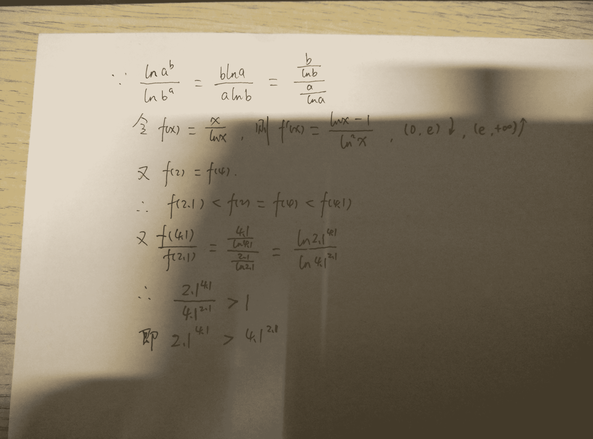
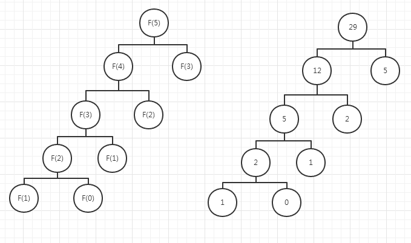
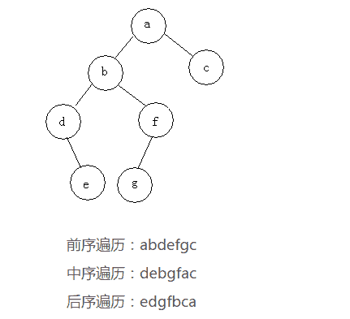
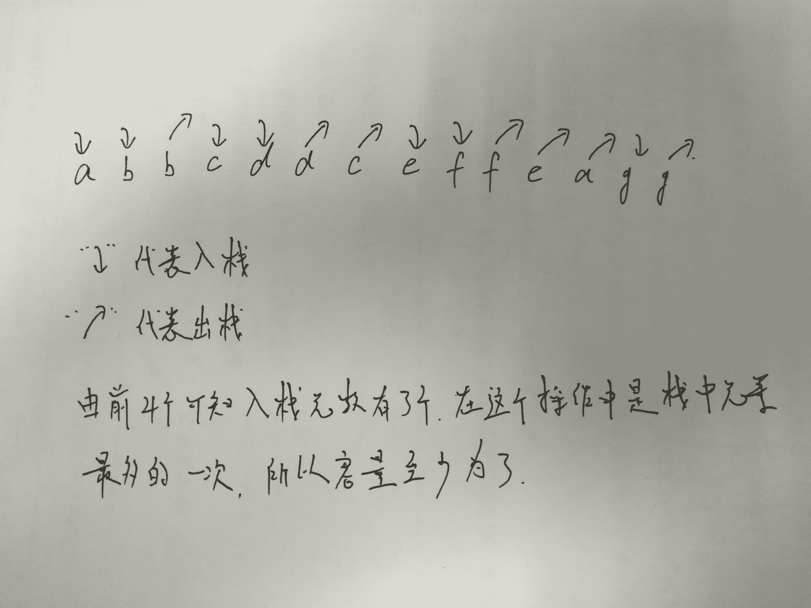
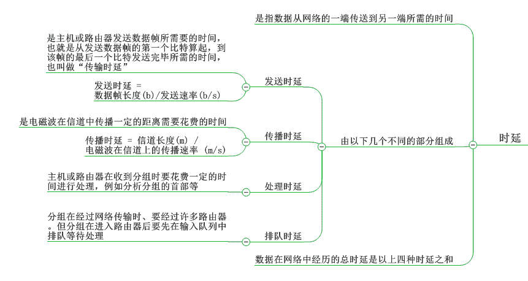
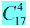
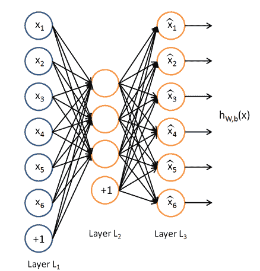

# 美团 2016 研发工程师笔试题（一）

## 1

下面哪些机制可以用于进程间通信？

正确答案: A B E   你的答案: 空 (错误)

```cpp
Socket
```

```cpp
Named pipe
```

```cpp
Named event
```

```cpp
Critical Section
```

```cpp
Shared memory
```

```cpp
Virtual memory
```

本题知识点

操作系统 Java 工程师 C++工程师 运维工程师 算法工程师 美团 2016

讨论

[拉风小伙](https://www.nowcoder.com/profile/407743)

Linux 进程间通信：管道、  查看全部)

编辑于 2016-03-26 12:54:48

* * *

[炫](https://www.nowcoder.com/profile/376795)

# 管道( pipe )：管道是一种半双工的通信方式，数据只能单向流动，而且只能在具有亲缘关系的进程间使用。进程的亲缘关系通常是指父子进程关系。
# 有名管道 (named pipe) ： 有名管道也是半双工的通信方式，但是它允许无亲缘关系进程间的通信。
# 信号量( semophore ) ： 信号量是一个计数器，可以用来控制多个进程对共享资源的访问。它常作为一种锁机制，防止某进程正在访问共享资源时，其他进程也访问该资源。因此，主要作为进程间以及同一进程内不同线程之间的同步手段。
# 消息队列( message queue ) ： 消息队列是由消息的链表，存放在内核中并由消息队列标识符标识。消息队列克服了信号传递信息少、管道只能承载无格式字节流以及缓冲区大小受限等缺点。
# 信号 ( signal ) ： 信号是一种比较复杂的通信方式，用于通知接收进程某个事件已经发生。
# 共享内存( shared memory ) ：共享内存就是映射一段能被其他进程所访问的内存，这段共享内存由一个进程创建，但多个进程都可以访问。共享内存是最快的 IPC 方式，它是针对其他进程间通信方式运行效率低而专门设计的。它往往与其他通信机制，如信号两，配合使用，来实现进程间的同步和通信。
# 套接字( socket ) ： 套解口也是一种进程间通信机制，与其他通信机制不同的是，它可用于不同及其间的进程通信。

发表于 2015-12-22 13:13:30

* * *

[美团校招内推直达](https://www.nowcoder.com/profile/458054)

**答案 ABE：****进程间通信：**     **1.管道（pipe）及有名管道（named pipe）**   2.信号（signal）    3.消息队列（message queue）     **4.共享内存（shared memory）**  5.信号量（semaphore） **6.套接字（socket）****参考：** [`cqgw2.blog.163.com/blog/static/2352470201032210542930/`](http://cqgw2.blog.163.com/blog/static/2352470201032210542930/)

发表于 2015-10-11 19:55:47

* * *

## 2

下面的程序执行输出几个 hello？

```cpp
#include<stdio.h>
#include <unistd.h>
int main( ) {
    fork( );
    fork( );
    fork( );
    printf("hello\n");
    return 0;
}
```

正确答案: D   你的答案: 空 (错误)

```cpp
3
```

```cpp
4
```

```cpp
6
```

```cpp
8
```

本题知识点

操作系统 Java 工程师 C++工程师 运维工程师 算法工程师 美团 C 语言 2016

讨论

[手机用户 1893160007](https://www.nowcoder.com/profile/118237)

Dfork(); //2 个进程 fork(); //4 个进程 fork(); //8 个进程 printf(“hello\n”);

发表于 2015-09-14 11:01:08

* * *

[yayamma](https://www.nowcoder.com/profile/270051)

fork（）函数通过系统调用创建一个与原来进程几乎完全相同的进程，也就是两个进程可以做完全相同的事，但如果初始参数或者传入的变量不同，两个进程也可以做不同的事。
**fork 调用的一个奇妙之处就是它仅仅被调用一次，却能够返回两次，它可能有三种不同的返回值：**
    1）在父进程中，fork 返回新创建子进程的进程 ID；
    2）在子进程中，fork 返回 0；
    3）如果出现错误，fork 返回一个负值； 类似题目：[`www.nowcoder.com/questionTerminal/1f6cc9c0ef354f86b1727c6c030a1a19`](http://www.nowcoder.com/questionTerminal/1f6cc9c0ef354f86b1727c6c030a1a19)
[`www.nowcoder.com/questionTerminal/5451cf6a4652466***61c8f03613a77`](http://www.nowcoder.com/questionTerminal/5451cf6a4652466***61c8f03613a77)

编辑于 2015-09-14 11:20:04

* * *

[peng.tan](https://www.nowcoder.com/profile/3111850)

这个题目是这样的：
fork( );fork( );fork( );
三条创建子进程的语句，第一句 fork()之后，就存在两个进程了，
两个进程继续往下执行，同理 第二个 fork()之后，就存在 2*2=4 个进程了，
再继续往下，到第三个 fork()之后，程序当中就已经存在 2*4=8 个进程了，每个进程输出一句 hello
所以答案是**D**

发表于 2016-10-18 20:26:25

* * *

## 3

进行数据库提交操作时使用事务（Transaction）是为了?

正确答案: B   你的答案: 空 (错误)

```cpp
提高效率
```

```cpp
保证数据一致性
```

```cpp
网络安全
```

```cpp
归档数据文件
```

本题知识点

数据库 Java 工程师 C++工程师 运维工程师 算法工程师 美团 2016

讨论

[就叫我八默哥吧](https://www.nowcoder.com/profile/256682)

B 数据库事务(Data  查看全部)

编辑于 2016-01-21 13:01:16

* * *

[ζ過眼／雲烟](https://www.nowcoder.com/profile/325496)

数据库事物就是为了保证数据的一致性，比如说你处理银行的存取，在两个窗口同时登陆，必须保证你在一台上取完之后，在另一台上显示已经取完之后的余额。（只是举个例子，银行是不能同时登陆的）

发表于 2015-09-20 09:23:53

* * *

[星痕 sky](https://www.nowcoder.com/profile/625230)

事务(Transaction)是访问并可能更新数据库中各种数据项的一个程序执行单元(unit)。

发表于 2016-01-20 15:03:58

* * *

## 4

我们用 a^b 来表示 a 的 b 次幂，那么下列算是判断正确的是？

正确答案: B C   你的答案: 空 (错误)

```cpp
2.1³.1>3.1².1
```

```cpp
2.1³.1<3.1².1
```

```cpp
2.1⁴.1>4.1².1
```

```cpp
2.1⁴.1<4.1².1
```

本题知识点

编译和体系结构

讨论

[sweetsmile](https://www.nowcoder.com/profile/570283)



发表于 2015-10-16 22:19:18

* * *

[Double_k](https://www.nowcoder.com/profile/122986)

比较 a^b 与 b^a 的大小，可变为比较 ln(a^b) = blna 与 ln(b^a)=alnb 的大小，则 blna/alnb = (lna/a)/(lnb/b) 设有 f(x) = lnx/x    f'(x) = (1-lnx)/x² 令 f'(x)=0，求出 x=e 则，当 x<e 时，递增，x>e 时，递减。对称轴为 x=e 故有，a=2.1 b=3.1 时，a 距离对称轴>b 距离对称轴  f(a)<f(b) 则 b^a>a^b  ==> 3.1².1 >2.1³.1 当 a=2.1 b=4.1 时，a 距离对称轴<b 距离对称轴 f(a)>f(b) 则 a^b >b^a ==>2.1⁴.1 > 4.1².1

编辑于 2015-09-14 12:57:37

* * *

[牛客 627193 号](https://www.nowcoder.com/profile/627193)

1：2.1³.1 < 3.1².1   只需证 ln2.1 / 2.1 < ln3.1 / 3.1  只需证 ln2.1 / 2.1 < ln3.15 / 3.15  (f = lnx/ x  当 x > e 时为严格减函数，因此已有 ln3.15/3.15 < ln3.1/3.1)只需证 3*ln2.1 < 2*ln3.15 只需证 2.1³ < 3.15² 实际上，2.1³ = 9.261 < 9.925 = 3.15² 故原式成立 2：2.1⁴.1 > 4.1².1 只需证 ln2.1/ 2.1 > ln4.1 / 4.1 只需 ln2.05/2.05 > ln4.1 / 4.1(类似 1，f=lnx/ x 当 x < e 时为增函数，因此必有 ln2.1 / 2.1 > ln2.05 / 2.05)只需 2*ln2.05 > ln4.1，即 2.05² > 4.1。实际上，2.05² = 4.2025 > 4.1 上式成立

发表于 2015-09-14 19:36:28

* * *

## 5

下面哪个是版本控制工具？

正确答案: B C   你的答案: 空 (错误)

```cpp
safari
```

```cpp
svn
```

```cpp
git
```

```cpp
xcode
```

本题知识点

开发工具 Java 工程师 C++工程师 运维工程师 算法工程师 美团 2016

讨论

[莫离丶相伴♂](https://www.nowcoder.com/profile/805961)

版本控制工具主要有三个：CVS、SVN,Git.

发表于 2015-09-14 11:06:09

* * *

[what_?](https://www.nowcoder.com/profile/1044358)

1.Visual Source Safe(简称 VSS）2.Concurrent Version System(简称 CVS）3.StarTeam4.ClearCase5.SVN6.SourceAnywhere7.Git

发表于 2017-03-21 08:47:16

* * *

[扛竹子的伙夫](https://www.nowcoder.com/profile/3127145)

```cpp
xcode 是 IDE，safari 是浏览器
```

发表于 2017-08-29 11:33:50

* * *

## 6

当 n=5 时，下列函数的返回值是：

```cpp
int foo(int n){
 if(n<2){
   return n;
}
 else
   return 2*foo(n-1)+foo(n-2);
}
```

正确答案: C   你的答案: 空 (错误)

```cpp
5
```

```cpp
11
```

```cpp
29
```

```cpp
10
```

本题知识点

C++ Java 工程师 C++工程师 运维工程师 算法工程师 美团 Java 工程师 C++工程师 运维工程师 算法工程师 美团 2016

讨论

[YuuCh](https://www.nowcoder.com/profile/4751344)



发表于 2017-10-10 20:31:59

* * *

[Soar.G](https://www.nowcoder.com/profile/870177)

n = 0,f(0) = 0; n = 1,f(1) = 1; n = 2,f(2) = 2*f(1)+f(0) = 2; n = 3,f(3) = 2*f(2)+f(1) = 5; n = 4,f(4) = 2*f(3)+f(2) = 12; n = 4, f (5) = 2*f(4)+f(3) = 29; ... ... f(n) = 2*f(n-1)+f(n-2); ... ...

编辑于 2015-09-14 17:43:02

* * *

[yayamma](https://www.nowcoder.com/profile/270051)

类似于斐波那契数列

发表于 2015-09-14 11:21:42

* * *

## 7

假设一段公路上，1 小时内有汽车经过的概率为 96%，那么，30 分钟内有汽车经过的概率为?

正确答案: C   你的答案: 空 (错误)

```cpp
48%
```

```cpp
52%
```

```cpp
80%
```

```cpp
96%
```

本题知识点

概率统计 *Java 工程师 C++工程师 运维工程师 算法工程师 美团 2016 概率论与数理统计* *讨论

[Aping](https://www.nowcoder.com/profile/330117)

一小时有车的概率 = 1 - 一小时没车的概率 = 1 - 两个半小时都没车的概率 = 1 - （1 - 半小时有车的概率）²
1-(1-x)²=0.96
x = 0.8

发表于 2015-09-14 10:49:52

* * *

[clearlove7](https://www.nowcoder.com/profile/941380)

我做错了，看了大家的评论才知道的。评论是为了让自己思考一遍。1 个小时内有车通过的概率是 0.96，也就是说这个一个小时内没有车通过的概率是 0.04。题目，故意给出 1 个小时的单位来迷惑我们。其实，我们可以把单位分解为 30 分钟。我是这么分解的：如果一个小时都没出现任何车辆，就相当于在连续的两个 30 分钟里面都没有出现任何车辆，这里每半个小时是否有车出现绝对是独立，那么我们可以设 30 分钟内没有车出现的概率为 p，可以列出如下公式：x² ＝ 0.04 解得 x＝0.2 就表示 30 分钟内出现车辆和不出现车辆是对立事件，那么出现车辆的概率就是 0.8\.

发表于 2016-09-07 16:12:19

* * *

[pai](https://www.nowcoder.com/profile/226112)

关键在于 96% 是见到一辆或多辆汽车的概率，而不是仅见到一辆汽车的概率。在 1 小时内，见不到任何车辆的概率为 0.04 。因此在 30 分钟内见不到任何车辆的概率是这个值的平方根，而在 30 分钟内见到一辆车的概率则为 1 减去此平方根，也就是 80% 。

发表于 2015-09-14 10:53:28

* * *

## 8

一副扑克（52 张，不含大小王），抽出两张牌，一红一黑（不考虑先后顺序）的概率是多少？

正确答案: B   你的答案: 空 (错误)

```cpp
1/2
```

```cpp
26/51
```

```cpp
1/3
```

```cpp
25/51
```

本题知识点

概率统计 *Java 工程师 C++工程师 运维工程师 算法工程师 美团 2016 概率论与数理统计* *讨论

[素锦流年╮许我一世安好](https://www.nowcoder.com/profile/147049)

第一次抽到的肯定是红的或黑的，则第二次抽到另一种颜色的可能性就是 26/51，第一次抽了一张，剩下 51 张，若第一张抽到的是红牌，则黑牌有 26 张，故答案为 26/51

发表于 2015-09-19 22:25:02

* * *

[pai](https://www.nowcoder.com/profile/226112)

p=C(26,1)*C(26,1)/C(52,2)=26/51

发表于 2015-09-14 10:53:52

* * *

[央风遣玉人](https://www.nowcoder.com/profile/4305141)

有没有人跟我一样以为一副牌四种花色。。。色。

发表于 2016-09-18 15:18:50

* * *

## 9

以下设计模式中，哪一项不属于结构性模式？

正确答案: C   你的答案: 空 (错误)

```cpp
适配器模式
```

```cpp
代理模式
```

```cpp
命令模式
```

```cpp
装饰模式
```

本题知识点

软件工程 Java 工程师 C++工程师 运维工程师 算法工程师 美团 2016

讨论

[就叫我八默哥吧](https://www.nowcoder.com/profile/256682)

1．创建型模式前面讲过，社会化的分工越来越细，自然在软件设计方面也是如此，因此对象的创建和对象的使用分开也就成为了必然趋势。因为对象的创建会消耗掉系统的很多资源，所以单独对对象的创建进行研究，从而能够高效地创建对象就是创建型模式要探讨的问题。这里有 6 个具体的创建型模式可供研究，它们分别是：简单工厂模式（Simple Factory）；工厂方法模式（Factory Method）；抽象工厂模式（Abstract Factory）；创建者模式（Builder）；原型模式（Prototype）；单例模式（Singleton）。说明：严格来说，简单工厂模式不是 GoF 总结出来的 23 种设计模式之一。2．结构型模式在解决了对象的创建问题之后，对象的组成以及对象之间的依赖关系就成了开发人员关注的焦点，因为如何设计对象的结构、继承和依赖关系会影响到后续程序的维护性、代码的健壮性、耦合性等。对象结构的设计很容易体现出设计人员水平的高低，这里有 7 个具体的结构型模式可供研究，它们分别是：外观模式（Facade）；适配器模式（Adapter）；***模式（Proxy）；装饰模式（Decorator）；桥模式（Bridge）；组合模式（Composite）；享元模式（Flyweight）。3．行为型模式在对象的结构和对象的创建问题都解决了之后，就剩下对象的行为问题了，如果对象的行为设计的好，那么对象的行为就会更清晰，它们之间的协作效率就会提高，这里有 11 个具体的行为型模式可供研究，它们分别是：模板方法模式（Template Method）；观察者模式（Observer）；状态模式（State）；策略模式（Strategy）；职责链模式（Chain of Responsibility）；命令模式（Command）；访问者模式（Visitor）；调停者模式（Mediator）；备忘录模式（Memento）；迭代器模式（Iterator）；解释器模式（Interpreter）。

发表于 2015-09-17 20:56:05

* * *

[牛里格村](https://www.nowcoder.com/profile/662760)

1）想组合适配的桥结构，那么找个***来装饰外观吧！享元模式、组合模式、适配器模式、桥模式、***模式，装饰模式、外观模式----〉结构型模式 2）创建工厂的愿型只是一个单例    ---〉创建型模式其他---〉行为型模式。 

发表于 2015-09-30 11:25:37

* * *

[what_?](https://www.nowcoder.com/profile/1044358)

```cpp
设计模式主要分三个类型:创建型、结构型和行为型。 
其中创建型有： 
    一、Singleton，单例模式：保证一个类只有一个实例，并提供一个访问它的全局访问点 
    二、Abstract Factory，抽象工厂：提供一个创建一系列相关或相互依赖对象的接口，而无须指定它们的具体类。 
    三、Factory Method，工厂方法：定义一个用于创建对象的接口，让子类决定实例化哪一个类，Factory Method 使一个类的实例化延迟到了子类。 
    四、Builder，建造模式：将一个复杂对象的构建与他的表示相分离，使得同样的构建过程可以创建不同的表示。 
    五、Prototype，原型模式：用原型实例指定创建对象的种类，并且通过拷贝这些原型来创建新的对象。 
行为型有： 
    六、Iterator，迭代器模式：提供一个方法顺序访问一个聚合对象的各个元素，而又不需要暴露该对象的内部表示。 
    七、Observer，观察者模式：定义对象间一对多的依赖关系，当一个对象的状态发生改变时，所有依赖于它的对象都得到通知自动更新。 
    八、Template Method，模板方法：定义一个操作中的算法的骨架，而将一些步骤延迟到子类中，TemplateMethod 使得子类可以不改变一个算法的结构即可以重定义该算法得某些特定步骤。 
    九、Command，命令模式：将一个请求封装为一个对象，从而使你可以用不同的请求对客户进行参数化，对请求排队和记录请求日志，以及支持可撤销的操作。 
    十、State，状态模式：允许对象在其内部状态改变时改变他的行为。对象看起来似乎改变了他的类。 
    十一、Strategy，策略模式：定义一系列的算法，把他们一个个封装起来，并使他们可以互相替换，本模式使得算法可以独立于使用它们的客户。 
    十二、China of Responsibility，职责链模式：使多个对象都有机会处理请求，从而避免请求的送发者和接收者之间的耦合关系 
    十三、Mediator，中介者模式：用一个中介对象封装一些列的对象交互。 
    十四、Visitor，访问者模式：表示一个作用于某对象结构中的各元素的操作，它使你可以在不改变各元素类的前提下定义作用于这个元素的新操作。 
    十五、Interpreter，解释器模式：给定一个语言，定义他的文法的一个表示，并定义一个解释器，这个解释器使用该表示来解释语言中的句子。 
    十六、Memento，备忘录模式：在不破坏对象的前提下，捕获一个对象的内部状态，并在该对象之外保存这个状态。 
结构型有： 
    十七、Composite，组合模式：将对象组合成树形结构以表示部分整体的关系，Composite 使得用户对单个对象和组合对象的使用具有一致性。 
    十八、Facade，外观模式：为子系统中的一组接口提供一致的界面，fa?ade 提供了一高层接口，这个接口使得子系统更容易使用。 
    十九、Proxy，***模式：为其他对象提供一种***以控制对这个对象的访问 
    二十、Adapter,适配器模式：将一类的接口转换成客户希望的另外一个接口，Adapter 模式使得原本由于接口不兼容而不能一起工作那些类可以一起工作。 
    二十一、Decrator，装饰模式：动态地给一个对象增加一些额外的职责，就增加的功能来说，Decorator 模式相比生成子类更加灵活。 
    二十二、Bridge，桥模式：将抽象部分与它的实现部分相分离，使他们可以独立的变化。 
    二十三、Flyweight，享元模式
```

发表于 2017-03-21 08:53:11

* * *

## 10

下列能实现一个正整数 N 对 256 求余运算的代码是：

正确答案: A D   你的答案: 空 (错误)

```cpp
N%256
```

```cpp
N<<8
```

```cpp
N>>8
```

```cpp
N & 0xFF
```

本题知识点

编译和体系结构

讨论

[kepon](https://www.nowcoder.com/profile/190209)

对 256 取余，255 表示为 0xFF（11111111），只需取出 N 低 8 位部分，其他位置为 0，故使用运算符&。>>8 和<<8 是移位处理，会将 N 缩小或放大 2 的 8 次方倍，缩小时会失去低 8 位即余数。

编辑于 2015-09-19 10:32:56

* * *

[huixieqingchun](https://www.nowcoder.com/profile/551201)

**对数进行 256 取模时，只要取出低八位的数即可求得最后的模值。做题一定要注意灵活变通 。**

发表于 2016-06-03 20:39:38

* * *

[Atin](https://www.nowcoder.com/profile/9085255)

其实 D 选项仅仅是在于取模的数为 2 的 n 次幂才成立。理由很简单，在 2 进制表示的时候，满足 2 的 n 次幂的二进制数只需一位来表示。从低位开始算，这个位是第 n+1 位。任意正整数 N 对它求余，就只需要保留从低位起到第 n 位的数字即可，也就是上述很多答案所说的。但是如果取模的数不是只有一位表示的话，就不能这么做了.

发表于 2017-02-10 20:26:11

* * *

## 11

11.现有二叉搜索树（BST）前序遍历结果序列为 abdefgc，中序遍历结果序列为 debgfac，请问后序遍历结果序列?

正确答案: B   你的答案: 空 (错误)

```cpp
debgfac
```

```cpp
edgfbca
```

```cpp
edgbfca
```

```cpp
degbfac
```

本题知识点

树 Java 工程师 C++工程师 运维工程师 算法工程师 美团 2016

讨论

[雷明顿](https://www.nowcoder.com/profile/855992)

      B  由先序序列  查看全部)

编辑于 2015-12-09 10:18:54

* * *

[scanf～～～～](https://www.nowcoder.com/profile/488307)

选Ｂ

发表于 2016-03-26 15:07:51

* * *

[牛客 369806 号](https://www.nowcoder.com/profile/369806)

根据先序遍历知道 a 是根节点，那么根据中序遍历 a 的位置，知道 debgf 在左枝，c 在右枝；
再对根据 bdefg 的先序遍历可知 b 为左枝的根节点……以此类推，得到

发表于 2015-09-14 14:53:34

* * *

## 12

如果某系统 15*4=112 成立，则系统采用的是几进制？

正确答案: A   你的答案: 空 (错误)

```cpp
6
```

```cpp
7
```

```cpp
8
```

```cpp
9
```

本题知识点

编译和体系结构

讨论

[SSL](https://www.nowcoder.com/profile/330477)

设使用的是 p 进制，则 15*4=112 等价于：

```cpp
(p + 5) * 4 = p² + p + 2

```

解出来 p=-3（舍去）和 p=6

发表于 2015-09-14 11:33:50

* * *

[就叫我八默哥吧](https://www.nowcoder.com/profile/256682)

假设采用的是 x 进制，根据等式有：
（1*x¹+5*x⁰）*4*x⁰= 1*x²+1*x¹+2*x⁰解得 x=-3 或 x=6

发表于 2015-09-17 21:01:36

* * *

[OnePiece12138](https://www.nowcoder.com/profile/319557)

此题转化为 10 进制，在进行运算，注意 题中出现的数进制都是 p 进制，不是 10 进制

发表于 2015-09-14 16:31:54

* * *

## 13

操作系统中关于竞争和死锁的关系下面描述正确的是？

正确答案: C   你的答案: 空 (错误)

```cpp
竞争一定会导致死锁
```

```cpp
死锁一定由竞争引起
```

```cpp
竞争可能引起死锁
```

```cpp
预防死锁可以防止竞争
```

本题知识点

操作系统 Java 工程师 C++工程师 运维工程师 算法工程师 美团 2016

讨论

[Caramel2Macchiato](https://www.nowcoder.com/profile/915006)

产生死锁的原因主要是：
（1） 因为系统资源不足。
（2） 进程运行推进的顺序不合适。
（3） 资源分配不当等。
如果系统资源充足，进程的资源请求都能够得到满足，死锁出现的可能性就很低，否则
就会因争夺有限的资源而陷入死锁。其次，进程运行推进顺序与速度不同，也可能产生死锁。
产生死锁的四个必要条件：
（1） 互斥条件：一个资源每次只能被一个进程使用。
（2） 请求与保持条件：一个进程因请求资源而阻塞时，对已获得的资源保持不放。
（3） 不剥夺条件:进程已获得的资源，在末使用完之前，不能强行剥夺。
（4） 循环等待条件:若干进程之间形成一种头尾相接的循环等待资源关系。
这四个条件是**死锁的必要条件**，只要系统发生死锁，这些条件必然成立，而只要上述条件之
一不满足，就不会发生死锁。
死锁的解除与预防：
理解了死锁的原因，尤其是产生死锁的四个必要条件，就可以最大可能地避免、预防和
解除死锁。所以，在系统设计、进程调度等方面注意如何不让这四个必要条件成立，如何确
定资源的合理分配算法，避免进程永久占据系统资源。此外，也要防止进程在处于等待状态
的情况下占用资源。因此，对资源的分配要给予合理的规划。

发表于 2015-09-14 11:11:55

* * *

[舒意意 123](https://www.nowcoder.com/profile/1973064)

产生死锁的原因主要是：
（1） 因为系统资源不足。
（2） 进程运行推进的顺序不合适。
（3） 资源分配不当等。

发表于 2017-04-14 10:27:08

* * *

## 14

对于一个分布式计算系统来说，以下哪三个指标不能同时完成？

正确答案: A B D   你的答案: 空 (错误)

```cpp
一致性
```

```cpp
可用性
```

```cpp
安全性
```

```cpp
分区容错性
```

本题知识点

分布式 Java 工程师 C++工程师 运维工程师 算法工程师 美团 2016

讨论

[Nebulaliu](https://www.nowcoder.com/profile/209746)

分布式领域 CAP 理论，
Consistency(一致性), 数据一致更新，所有数据变动都是同步的
Availability(可用性), 好的响应性能
Partition tolerance(分区容错性) 可靠性

定理：任何[**分布式**](http://www.jdon.com/DistributedSystems.html) 系统只可同时满足二点，没法三者兼顾。
忠告：架构师不要将精力浪费在如何设计能满足三者的完美[**分布式**](http://www.jdon.com/DistributedSystems.html) 系统，而是应该进行取舍

发表于 2015-09-14 22:31:23

* * *

[仙剑奇侠](https://www.nowcoder.com/profile/767767)

分布式中，一般要求的是 CAP，分别为一致性，可用性，可分区性因为要在分布式系统中，所以我们优先保障可分区性，即 P，此时 C 和 A 只能保证一个：如果保证了一致性，则我们的每次操作，都要求完全一致后才成功，这会严重影响可用性，如果保证了可用性，则无法保证一致性。好像分布式系统中最常用的是最终一致性。可以参考百度百科的 CAP 原则定义：四川省成都市西南航空港经济开发区学府路一段 24 号四川省 四川省成都市西南航空港经济开发区学府路一段 24 号 成都市西南航空港经济开发区学府路一段 24 号

发表于 2015-09-14 10:51:56

* * *

## 15

设栈 S 和队列 Q 的初始状态均为空，元素 a,b,c,d,e,f,g 依次进入栈 S。若每个元素出栈后立即进入推列 Q，且 7 个元素出队的顺序是 b,d,,c,f,e,a,g，则栈 S 的容量至少是？

正确答案: C   你的答案: 空 (错误)

```cpp
1
```

```cpp
2
```

```cpp
3
```

```cpp
4
```

本题知识点

栈 *Java 工程师 C++工程师 运维工程师 算法工程师 美团 Java 工程师 C++工程师 运维工程师 算法工程师 美团 2016* *讨论

[SunburstRun](https://www.nowcoder.com/profile/557336)

答案是 C   这个题目  查看全部)

编辑于 2015-09-14 18:22:28

* * *

[Rjun](https://www.nowcoder.com/profile/234472)



发表于 2017-03-20 16:59:49

* * *

[ly3too](https://www.nowcoder.com/profile/8296007)

对于每一个出栈的元素找它右边有几个在它之前入栈，最后最大的数+1\. f 右边有 a,e, 所以 3 个

发表于 2017-09-13 20:51:30

* * *

## 16

0， 6， 24，60， 120， ？

正确答案: C   你的答案: 空 (错误)

```cpp
186
```

```cpp
200
```

```cpp
210
```

```cpp
220
```

本题知识点

数学运算

讨论

[牛客 369806 号](https://www.nowcoder.com/profile/369806)

0=0*1*2
6=1*2*3
24=2*3*4
60=3*4*5
120=4*5*6
210=5*6*7

发表于 2015-09-14 14:59:00

* * *

[莫离丶相伴♂](https://www.nowcoder.com/profile/805961)

1=1³-1,6=2³-2,24=3³-3，60=4³-4,120=5³-5，那么下一个就是 6³-6=210.

编辑于 2015-09-14 11:16:54

* * *

[BlackMammba](https://www.nowcoder.com/profile/314508)

首先，都是 6 的倍数，可选 186 或 210；其次，增的越来越猛，选 210\.

发表于 2015-09-14 11:43:01

* * *

## 17

一个栈的入栈序列是 a,b,c,d,e,f,则不可能的出栈序列是（）

正确答案: B   你的答案: 空 (错误)

```cpp
fedcba
```

```cpp
defbca
```

```cpp
defcba
```

```cpp
abcdef
```

本题知识点

栈 *Java 工程师 C++工程师 运维工程师 算法工程师 美团 2016* *讨论

[牛牛客](https://www.nowcoder.com/profile/756700)

d 最先出栈说明下面压着 abc,他们出来的顺序必然是 cba

发表于 2015-09-14 20:42:43

* * *

[bluuueq](https://www.nowcoder.com/profile/353703)

选项 a：abcdef 依次入栈，再依次出栈，符合桟的先进后出原则；选项 b：d 出桟，e 入栈再马上出桟，f 入栈再马上出桟，             但是 b 不可能在 c 的前面出桟；选项 c：abc 依次入栈，接着 d 入栈，出桟，e 入栈出桟，f 入栈，出桟，最后 cba 出桟；选项 d：a 入栈，出桟，b 入栈，b 出桟，c 入栈，c 出桟。。。

编辑于 2016-09-04 10:07:01

* * *

[@小伟 Code](https://www.nowcoder.com/profile/252752)

你好！通常我们记住栈的特点，即后进先出即可以推导出来！但前提是我们做题要细心！！！

发表于 2016-01-10 10:39:47

* * *

## 18

在网络应用测试中，网络延迟是一个重要指标。以下关于网络延迟的理解，正确的是？

正确答案: D   你的答案: 空 (错误)

```cpp
指响应时间
```

```cpp
指报文从客户端发出到客户端接收到服务器响应的间隔时间
```

```cpp
指报文在网络上的传输时间
```

```cpp
指从报文开始进入网络到它开始离开网络之间的时间
```

本题知识点

网络基础 Java 工程师 C++工程师 运维工程师 算法工程师 美团 2016

讨论

[薛定谔之喵](https://www.nowcoder.com/profile/519263)

**B 选项应该是往返时延。RTT(Round-Trip Time): 往返时延：在计算机网络中它是一个重要的性能指标，表示从发送端发送数据开始，到发送端收到来自接收端的确认（接收端收到数据后便立即发送确认），总共经历的时延。****网络延迟是指各式各样的数据在** [**网络介质**](http://baike.baidu.com/view/1935149.htm) **中通过** [**网络协议**](http://baike.baidu.com/view/16603.htm) **(如 TCP/IP)进行传输，** **在** **[传输](http://baike.baidu.com/view/305337.htm)介质** **中传输所用的时间，即从** [**报文**](http://baike.baidu.com/view/175122.htm) **开始进入网络到它开始离开网络之间的时间。**

编辑于 2016-04-21 14:58:44

* * *

[莫离丶相伴♂](https://www.nowcoder.com/profile/805961)

定义:在[传输介质](http://baike.haosou.com/doc/3092507-3259649.html)中传输所用的时间，即从[报文](http://baike.haosou.com/doc/6200132-6413395.html)开始进入网络到它开始离开网络之间的时间。

如何定义网络延迟程度:

(网络延迟 PING 值越低速度越快)

1~30ms:极快，几乎察觉不出有延迟，玩任何游戏速度都特别顺畅

31~50ms:良好，可以正常游戏，没有明显的延迟情况

51~100ms:普通，对抗类游戏能感觉出明显延迟，稍有停顿

>100ms:差，无法正常游戏，有卡顿，丢包并掉线现象

计算方法:1 秒=1000 毫秒(例:30ms 为 0.03 秒)

发表于 2015-09-14 11:18:34

* * *

[线上幽灵 007](https://www.nowcoder.com/profile/4039680)



发表于 2018-06-06 20:13:42

* * *

## 19

书架一排有 5 个格子。现在有 20 本书，编号从 1 到 20。要求 20 本书要摆放在同一排里，并且从左到右编号依次递减；每个格子至少有一本书；并且编号 7，8，9 的书籍必须在同一个格子里面。问，一共有多少种可能的摆放方法？

正确答案: B   你的答案: 空 (错误)

```cpp
1820
```

```cpp
2380
```

```cpp
3640
```

```cpp
8568
```

本题知识点

组合数学 *Java 工程师 C++工程师 运维工程师 算法工程师 美团 2016* *讨论

[SevenYears](https://www.nowcoder.com/profile/776245)

```cpp
把 7，8,9 看成一本书因此共有 18 本书，要保证每个格子中都有书，因此可以在 1 到 18 之间的空隙中选择四个位置
组合数

```

 =2380

编辑于 2015-09-14 16:31:53

* * *

[Escape~](https://www.nowcoder.com/profile/146243)

两点：一 把 7,8,9 看成整体一本书二 反向思维，把书放到格子想成 5 个格子的 4 个挡板在 18 书之间移动即可故 C(17,4)

发表于 2016-08-07 21:29:08

* * *

[幸运安琪](https://www.nowcoder.com/profile/161117)

直接不好理解，我是这样用笨方法理解的：
7,8,9 看成一本书，共有 18 本书，17 个空隙，放入 4 个隔板(a,b,c,d)即分成了 5 份。共有 17*16*15*14=57120 种放法。题目又要求 20 本书从左到右编号依次递减，所以需保证隔板的顺序从左到右依次是 a-b-c-d，而实际上隔板的排列共有 4*3*2=24 种，a-b-c-d 是其中的一种，所以需要 57120/24=2380 。

发表于 2016-08-03 17:34:41

* * *

## 20

下列方法中，可以用于特征降维的方法包括（）

正确答案: A B C D   你的答案: 空 (错误)

```cpp
主成分分析 PCA
```

```cpp
线性判别分析 LDA
```

```cpp
深度学习 SparseAutoEncoder
```

```cpp
矩阵奇异值分解 SVD
```

```cpp
最小二乘法 LeastSquares
```

本题知识点

机器学习 Java 工程师 C++工程师 运维工程师 算法工程师 美团 2016

讨论

[JasonTian](https://www.nowcoder.com/profile/846843)

稀疏自编码就是用少于输入层神经元数量的隐含层神经元去学习表征输入层的特征，相当于把输入层的特征压缩了，所以是特征降维。

发表于 2016-08-23 12:29:40

* * *

[DirtyYes](https://www.nowcoder.com/profile/2577424)

LDA 用于降维，和 PCA 有很多相同，也有很多不同的地方，因此值得好好的比较一下两者的降维异同点。

首先我们看看相同点：

1）两者均可以对数据进行降维。

2）两者在降维时均使用了矩阵特征分解的思想。

3）两者都假设数据符合高斯分布。

我们接着看看不同点：

1）LDA 是有监督的降维方法，而 PCA 是无监督的降维方法

2）LDA 降维最多降到类别数 k-1 的维数，而 PCA 没有这个限制。

3）LDA 除了可以用于降维，还可以用于分类。

4）LDA 选择分类性能最好的投影方向，而 PCA 选择样本点投影具有最大方差的方向

发表于 2018-08-02 10:01:25

* * *

[哦洗海带哟洗海带哟](https://www.nowcoder.com/profile/5452233)

AutoEncoder 的结构与神经网络的隐含层相同，由输入 L1,输出 L2 组成，中间则是权重连接。Autoencoder 通过 L2 得到输入的重构 L3，最小化 L3 与 L1 的差别 进行训练得到权重。在这样的权重参数下，得到的 L2 可以尽可能的保存 L1 的信息。Autoencoder 的输出 L2 的维度由输出的神经元个数决定。当输出维度大于 L1 时，则需要在训练目标函数中加入 sparse 惩罚项，避免 L2 直接复制 L1（权重全为 1）。所以称为 sparseAutoencoder( Andrew Ng 提出的)。结论：SparseAutoencoder 大多数情况下都是升维的，所以称之为特征降维的方法不准确。

发表于 2017-04-02 17:17:47

* * ******