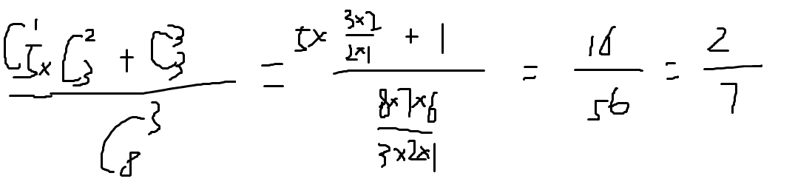
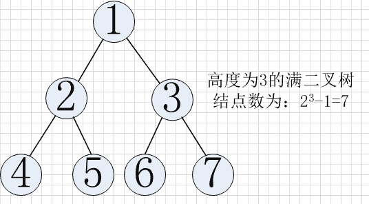

# PPTV2015 研发工程师笔试题

## 1

在一个口袋中装有 5 个白球和 3 个黑球，这些球除颜色外完全相同，从中摸出 3 个球，至少摸到 2 个黑球的概率等于 __

正确答案: A   你的答案: 空 (错误)

```cpp
2/7
```

```cpp
3/8
```

```cpp
3/7
```

```cpp
9/28
```

本题知识点

概率统计 *概率论与数理统计* *讨论

[reakingf](https://www.nowcoder.com/profile/151746)

至少摸两个黑球，即两黑一白或三个全黑。两黑一白：C(3,2)* C(5,1)/ C(8,3) = 15/56，三个全黑：C(3,3)/C(8,3) = 1/56，所以总概率为 16/56 = 2/7.

发表于 2016-09-12 08:09:35

* * *

[兔子的救兵](https://www.nowcoder.com/profile/176987)

[C(5,1)*C(3,2)+C(3,3)]/C(8,3)

发表于 2015-09-14 13:27:02

* * *

[LauZyHou](https://www.nowcoder.com/profile/8203811)



发表于 2019-03-30 18:15:51

* * *

## 2

一个长度为 32 的有序表，若采用二分查找一个不存在的元素，则比较次数最多是 __？

正确答案: C   你的答案: 空 (错误)

```cpp
4
```

```cpp
5
```

```cpp
6
```

```cpp
7
```

本题知识点

查找 *讨论

[峰风](https://www.nowcoder.com/profile/241402)

这题其实是考察完全二叉树的深度问题，比较次数也就是深度，只含有一个节点的时候深度为 1，假设深度为 k，则有 2^k-1>=n>2^(k-1)-1,其中 2^k-1 对应深度为 k 的满二叉树对应节点数，那么等价于 2^k>=（n+1）>2^(k-1)，不等式两边同时取 log，k>=log(n+1)>(k-1),此时 k 等于 log(n+1)向上取整数，因此 log（32+1）向上取整为 6

发表于 2015-09-17 10:15:42

* * *

[Bruteforce](https://www.nowcoder.com/profile/580937)

查找不存在的比存在的多比较一次，存在的次数是树的深度 5 因此不存在的是 6。

发表于 2016-02-29 23:34:35

* * *

[水煮鱼](https://www.nowcoder.com/profile/795707)

最方面的方法是建立一个判定树。

现在有 11 个数：（第 1 行是索引，第 2 行是数）

| 0 | 1 | 2 | 3 | 4 | 5 | 6 | 7 | 8 | 9 | 10 |
| 7 | 10 | 13 | 16 | 19 | 29 | 32 | 33 | 37 | 41 | 43 |

判定树：


圆形节点表示查找成功的节点，方形的是查找不成功的节点。

判定树展示了二叉查找的过程。

有：

查找成功的最少次数：1
查找成功的最多次数：4

查找成功的平均次数：(1*1+2*2+3*4+4*4) / (1+2+4+4) = 3

查找不成功的最少次数：3
查找不成功的最多次数：4
查找不成功的平均次数：（3*4+4*8）/(4+8) = 11/3

发表于 2017-09-29 15:44:23

* * *

## 3

已知一算术表达式的中缀表达式为 a-(b+c/d)*e,则后缀形式为？

正确答案: D   你的答案: 空 (错误)

```cpp
-a+b*c/d
```

```cpp
-a+b*cd/e
```

```cpp
-+*abc/de
```

```cpp
abcd/+e*-
```

本题知识点

模拟

讨论

[岁月神偷之 9527](https://www.nowcoder.com/profile/734122)

**摘自百度：**人工实现转换，这里我给出一个中缀表达式：a+b*c-(d+e)第一步：按照运算符的优先级对所有的运算单位加括号：式子变成了：((a+(b*c))-(d+e))第二步：转换前缀与后缀表达式前缀：把运算符号移动到对应的括号前面则变成了：-( +(a *(bc)) +(de))把括号去掉：-+a*bc+de 前缀式子出现后缀：把运算符号移动到对应的括号后面则变成了：((a(bc)* )+ (de)+ )-把括号去掉：abc*+de+- 后缀式子出现这道题，先加括号，是(a-((b+(c/d))*e)),把运算符移动到对应括号后面，则为(a((b((cd)/)+)e)*)-,去掉括号则为 D

发表于 2015-10-20 21:11:15

* * *

[kepon](https://www.nowcoder.com/profile/190209)

中缀表达式转后缀表达式的方法：
1.遇到操作数：直接输出（添加到后缀表达式中）
2.栈为空时，遇到运算符，直接入栈
3.遇到左括号：将其入栈
4.遇到右括号：执行出栈操作，并将出栈的元素输出，直到弹出栈的是左括号，左括号不输出。
5.遇到其他运算符：加减乘除：弹出所有优先级大于或者等于该运算符的栈顶元素，然后将该运算符入栈
6.最终将栈中的元素依次出栈，输出。对于 a-(b+c/d)*e：    [ 输出,入栈][a,  ] [a,-] [a,(-]  [ab,(-]  [ab,+(-]  [abc,+(-]  [abcd,/+(-]   [abcd/+,-]    [abcd/+e,-]     [abcd/+e*-]

发表于 2015-10-06 21:29:01

* * *

[炫](https://www.nowcoder.com/profile/376795)

**前缀，中缀，后缀表达式的相关知识可以参考以下链接，介绍的比较详细且易懂**http://blog.csdn.net/antineutrino/article/details/6763722

发表于 2016-03-04 13:10:50

* * *

## 4

设某棵二叉树中有 2000 个结点，则该二叉树的最小高度为 ______。

正确答案: C   你的答案: 空 (错误)

```cpp
9
```

```cpp
10
```

```cpp
11
```

```cpp
12
```

本题知识点

树

讨论

[星陨无痕](https://www.nowcoder.com/profile/436939)

二叉树中有 2000 个结点，如果要想高度最小，那么就需要是满二叉树了。满二叉树高度与节点个数的关系是 num = 2^n-12000>2¹⁰²⁰⁰⁰<2¹¹ 最小高度为 11 层

编辑于 2015-09-17 22:01:26

* * *

[Forrestcloud](https://www.nowcoder.com/profile/3410196)

层数就是高度，一般来说，层数也是深度

发表于 2017-09-05 09:11:46

* * *

[InGodWeTrust](https://www.nowcoder.com/profile/2178882)

选 C：满二叉树为极限情况，由于 2000>2¹⁰， 2000<2¹¹。因此为 11 层。推到可见下图：

发表于 2017-04-06 15:18:15

* * *

## 5

一个栈的入栈序列是 a,b,c,d,e,则栈的输出序列不可能是 ______。

正确答案: A   你的答案: 空 (错误)

```cpp
dceab
```

```cpp
decba
```

```cpp
edcba
```

```cpp
abcde
```

本题知识点

栈 *讨论

[goolong](https://www.nowcoder.com/profile/921327)

堆栈讲究先进后出，后进先出选项 B，abcd 先入栈，d 出栈，e 入栈，e 出栈，cba 出栈选项 C，abcde 入栈，edcba 依次出栈选项 D，a 入栈，a 出栈，b 入栈，b 出栈，，，选项 A，abcd 先入栈，d 出栈，c 出栈，e 入栈，e 出栈，b 出栈，a 出栈，所以出栈顺序应该为 dceba

发表于 2015-09-15 00:25:43

* * *

[鼡杺悢楛](https://www.nowcoder.com/profile/410105628)

*   当序列递增时，ok
*   当序列递减时，且相差为 1 ，ok
*   当序列递减时，且相差大于 1，但后续序列都递减时，ok
*   当序列递减时，且相差大于 1，但后续序列非严格递减时，no

发表于 2019-09-07 10:34:02

* * *

[汪星人阁下](https://www.nowcoder.com/profile/5542787)

[`blog.csdn.net/u014613043/article/details/50865090`](http://blog.csdn.net/u014613043/article/details/50865090)这是一个更普遍的解释适用于任意长度，任意顺序的入栈序列 Tips：**若入栈序列为非数字****则依次进行转换（如：a = 1， b = 2， ...）****依照数字序列进行判断，最后再转换回字母序列即可**

编辑于 2017-08-26 14:08:08

* * *

## 6

下列选项中，能缩短程序执行时间的措施是 __I 提高 CPU 时钟频率；II.优化数据通路结构；III.对程序进行编译优化

正确答案: D   你的答案: 空 (错误)

```cpp
I 和 II
```

```cpp
II 和 III
```

```cpp
I 和 III
```

```cpp
I/II 和 III
```

本题知识点

编译和体系结构

讨论

[MR.Ting](https://www.nowcoder.com/profile/676101)

提高 CPU 时钟频率会使机器执行指令的运行速度更快，对程序进行编译优化可以有效地减少指令条数，优化数据通路结构可以改进某些指令的运行效率，3 者都有利于缩短程序的执行时间。

发表于 2016-03-21 20:54:42

* * *

[zt_xcyk](https://www.nowcoder.com/profile/839070)

D.1.频率越高，CUP 执行速度越快。2.大家平时就是这样优化的吧，优化时间空间复杂度什么的。3.减少生成的无效指令。

发表于 2016-03-23 19:17:58

* * *

[细雨湿身](https://www.nowcoder.com/profile/736416)

提高 CPU 时钟频率会使机器执行指令的运行速度更快，对程序进行编译优化可以有效地减少指令条数，优化数据通路结构可以改进某些指令的运行效率，3 者都有利于缩短程序的执行时间。

发表于 2016-10-08 12:42:29

* * *

## 7

描述 ARP 协议的作用及其工作原理，什么是 ARP 欺骗攻击？

你的答案

本题知识点

网络基础

讨论

[luck](https://www.nowcoder.com/profile/816707)

ARP = Address resolution protocol，是将主机的逻辑地址解释为物理地址的协议，逻辑地址即为 IP 地址，物理地址为主机的 MAC 地址，同一局域网中的主机 A 要与另一主机 B 通信时，A 在形成其 ARP 表之前，需要广播一份 ARP 请求，请求信息包含 IP 地址，对应 IP 地址的主机 B 将以自己的 MAC 地址回复这份请求，主机 A 得到后将 B 对应的 MAC 地址写进自己的 ARP 中，这就是数据链路层的通信原理。ARP 欺骗就是在 ARP 请求阶段，解析到这份 ARP 请求，然后将自己伪装成主机 B，填写一个不存在的 MAC 地址回复给 A，A 再将这个假的 MAC 地址与主机 B 的 IP 地址成对写进 ARP 表中。所以在 A 的 ARP 表中 B 这个条目过期前，A 会一直往这个假的 MAC 地址发送数据，一直不会成功传输。

发表于 2015-09-14 19:47:27

* * *

[Top0NE](https://www.nowcoder.com/profile/570966)

ARP：地址解析协议。作用：建立局域网内主机间的 MAC 地址与 IP 地址的映射。工作原理：假设主机 A 向主机 B 第一次发送信息，主机 A 只知道主机 B 的 IP 地址但却不知道 MAC 地址。主机 A 先以广播形式发送携带“主机 A 的 MAC 地址，主机 A 的 IP 地址，请求主机 B 的 IP 地址”信息的 ARP 请求，在同一局域网上的所有主机都可以收到这个请求，但只有主机 B 的 IP 地址和请求匹配，所以主机 B 收下这个请求，主机 B 先记下主机 A 的 MAC 和 IP 地址，写入 ARP 缓存。最后主机 B 以单播的形式发送携带“主机 B 的 MAC 地址，主机 B 的 IP 地址”信息的 ARP 响应，主机 A 收到后记下主机 B 的 MAC 和 IP 地址，写入 ARP 缓存。

发表于 2015-09-20 20:04:24

* * *

[小小](https://www.nowcoder.com/profile/59)

ARP 是地址解析协议，根据 IP 地址获得 MAC 地址。

原理：当两台主机 A 和 B 通信的时候，如果 A 要向 B 发送信息，会先查询本地主机 ARP 缓存表，将 B 的 ip 解析为 B 的 MAC 地址，然后进行数据传输。如果没有找到，则 A 主机广播一个 ARP 请求，请求 IP 地址为 B 主机 IP 的物理地址。主机 B 识别自己的 IP 地址，向 A 主机发回一个 ARP 响应报文。其中就包含有 B 的 MAC 地址，A 接收到 B 的应答后，就会更新本地的 ARP 缓存，接着使用这个 MAC 地址发送数据。

ARP 欺骗：局域网中的机器 B 向 A 发送一个自己伪造的 ARP 应答，如果这个应答是 B 冒充 C 伪造来的，即 IP 地址为 C 的 IP，而 MAC 地址是伪造的，则当 A 接收到 B 伪造的 ARP 应答后，就会更新本地的 ARP 缓存，这样在 A 看来 C 的 IP 地址没有变，而它的 MAC 地址已经不是原来那个了。当 A 再要向 C 发送信息的时候，就会发送到 B，而不是再发向 C。

发表于 2015-09-14 10:40:52

* * *

## 8

编写一个函数，输入为一个矩阵，打印这个矩阵转置后的结果。例：输入矩阵是

> 1,2,3,45,6,7,89,10,11,1213,14,15,16

打印结果应该是

> 13,9,5,114,10,6,215,11,7,316,12,8,4

你的答案

本题知识点

编程基础 *讨论

[肉嘟嘟的小丸子](https://www.nowcoder.com/profile/9848644)

```cpp
#include<stdio.h>
#include<stdlib.h>
int main()
{   
    int N;   
    while (~scanf("%d",&N))    
    {       
        int M[105][105] = { 0 };        
        for (int i = 0; i < N; ++i)       

            for (int j = 0; j < N; ++j)          
            {              
                scanf("%d", &M[j][i]);           
            }                         
        for (int i = 0; i < N; ++i)          
            for (int j = 0; j < N; ++j)           
            {              
                if (j < N - 1)                 
                    printf("%d ", M[i][j]);               
                else                  
                    printf("%d\n", M[i][j]);           
            }   
    }    
    return 0;
}

```

发表于 2017-04-02 15:07:34

* * *

[DQ_DM](https://www.nowcoder.com/profile/891937)

```cpp
#include <iostream>

using namespace std;

int main()
{
    int m,n;
    cin>>m>>n; // m 行 n 列
    int **p=new int *[m]; // p 为输入矩阵
    for(int i=0;i<m;i++)
    {
        p[i]=new int[n];
    }

    int **q=new int *[n]; // q 为输出矩阵
    for(int t=0;t<n;t++)
    {
        q[t]=new int[m];
    }

    for(int j=0;j<m;j++) // 输入 p 中的元素并给 q 中的元素赋值
    {
        for(int k=0;k<n;k++)
        {
            cin>>p[j][k];
            q[k][m-j-1]=p[j][k];
        }
    }
    for(int r=0;r<n;r++) // 输出 q 中的元素
    {
        for(int s=0;s<m;s++)
        {
            cout<<q[r][s]<<" ";
        }
        cout<<endl;
    }

    return 0;
}

```

发表于 2015-10-05 21:35:47

* * *

[Besideme](https://www.nowcoder.com/profile/128664)

class MatrixRoll:     def matrixRoll(self, E):           matrix1 = [[row[i] for row in E] for i in range(len(E[0]))]           for j in range(len(matrix1)):                   matrix1[j].reverse()                  print matrix1 测试用例 x = MatrixRoll() x.matrixRoll(([1,2,3,4],[65,7,8,9]))  输出为 [[65,1],[7,2],[8,3],[9,4]]

编辑于 2015-09-15 10:41:16

* * *

## 9

给定一个字符串，设计一个算法消除其中承兑的括号，如果括号不成对，提示异常（error）如（1，（2,3），（4，（5,6），7））转化为 1,2,3,4,5,6,7 如（1，）2,3），（4，（5,6（，7））提示 error。

你的答案

本题知识点

C++

讨论

[觉解 scu](https://www.nowcoder.com/profile/321178)

#include <iostream>#include <string>#include <stack>#include <vector>using namespace std;int main(void){string s;while(getline(cin,s)){stack<char> khStack;vector<char> fkhVector;bool flag = true;for(int i=0;i<s.length();i++){if(s[i] == '(')khStack.push(s[i]);else if(s[i] == ')'){//读到一个')'，则从括号栈中弹出，进行匹配 if(!khStack.empty()){khStack.pop();}else{flag = false;break;}}elsefkhVector.push_back(s[i]);}if(flag == false || !khStack.empty())cout<<"error"<<endl;else{for(int i=0;i<fkhVector.size();i++)cout<<fkhVector[i];}}return 0;}

发表于 2015-09-14 17:16:23

* * *

[Robot_luo](https://www.nowcoder.com/profile/691439)

思路有很多种，定义一个变量 temp，初始化为 0，从左到右扫一遍，遇到数字存到一个 char 数组中，遇到"（"，temp++，遇到"）"temp--，当 temp 小于 0 时，直接弹出，输出 error。最后判断如果 temp==0，输出序列数字。当 temp 大于 0，输出也 error。

发表于 2015-09-14 21:33:11

* * *

[Besideme](https://www.nowcoder.com/profile/128664)

class RemoveBrackets:    """docstring for RemoveBrackets"""    def removeBrackets(self, mystr):        mystr1 = []        for m in xrange(len(mystr)):             mystr1.append(mystr[m])             mystr2 = []        for i in xrange(len(mystr1)):             mystr2.append(mystr1[i])             a = mystr2.count('(')             b = mystr2.count(')')             if a < b:                  print 'error'                  break       else:            c = mystr1.count('(')            d = mystr1.count(')')            if c != d:                 print 'error'           else:                 for j in xrange(c):                        mystr1.remove('(')                        mystr1.remove(')')                str1 = ''                str1 = str1.join(mystr1)                return str1 测试用例：x = RemoveBrackets()                 x.removeBrackets('(1,((34,5))')('(1,((34,5))')  error'(1,3,(4,5))'  1,3,4,5 '(1,3,)4,5)   error

编辑于 2015-09-15 09:25:42

* * *

## 10

假设你只有一台内存 2G 的笔记本，I5 的四核 CPU 以及 4T 的硬盘，请设计一个程序，实现对 1T 英文数据进行词频分析，完成以下两个小题：（1）求所有词的词频，把相应的值存入文件；（2）找出这些词里卖弄出现频次最高的 100 个词，并用代码实现名词解释：1T=1024G，为硬盘空间单位，词频，每个单词出现的次数

你的答案

本题知识点

高级算法 哈希 *讨论

[小小](https://www.nowcoder.com/profile/59)

(1).

将 1T 的数据使用哈希函数映射到 10000 个文件当中去，这样做可以将所有一样的数据映射到同一个文件当中。依次将 10000 个文本文件读入内存，使用 hashmap 对每一个文本中每一个单词进行词频统计，将单词作为 key，单词出现次数作为 value，每读入一个单词，都查看其在 hashmap 中是否存在，存在则将 value 值加 1，不存在就将其加入 hashmap，并将 value 值置为 1，然后将结果写入一个文件即可。文件的每一行只存储一个单词以及这个单词出现的次数，并且二者之间用空格隔开.

(2).

要求出现次数最高的 100 个单词。可以建立只有 100 个元素的小根堆来实现目的。首先取出 100 个元素建立小根堆，继续从文件中取出元素与小根堆的堆顶元素进行比较，如果比堆顶元素大，就替换掉堆顶元素，并且重建为小根堆，依次做下去，最后堆中保留的 100 个元素就是 top100. 使用 hashmap 进行词频统计的时候，先用小根堆统计出每个文件中

Top100，然后 10000 个文件的 top100 汇总到一起后在使用上述同样的方法得到最终的 top100.

发表于 2015-09-14 10:44:12

* * *

[loveCoding](https://www.nowcoder.com/profile/649408)

方法一：每个英文单词存储成硬盘上面的一个文件，文件内容为该单词出现的频次。遍历完一遍单词后，通过读取每个文件会得到每个单词的词频。然后根据快速排序对这些词频进行排序，找出频次最高的前 100 个单词。快速排序的时间复杂度是 O(N)。方法二：可以通过建立字典树，除了树根之外，树中的每个节点包含字母和对应的路径上该单词出现的频次信息，这样查找每个单词的频次直接遍历树即可。找出频次最高的 100 个单词可以用快速排序或者最大堆。

发表于 2015-09-14 14:51:12

* * *

## 11

输入字符串中对称的子字符串的最大长度。比如输入字符串“roorle”，由于该字符串里最长的对称子字符串是“roor”，因此输出 4\.（1）用代码实现方法；（2）设计并写出测试用例，测试自己所实现的方法；（3）请给出编程时容易出现的 bug 现象，原因;（4）有无其他实现方法（说明思路即可），比较这两种实现方法优劣，以及各自容易产生的 bug 有什么不同？

你的答案

本题知识点

C++

讨论

[牛客 614308 号](https://www.nowcoder.com/profile/614308)

```cpp
思路：
(1)将字符串 str1="roorle"反序为 str2 = "elroor"
(2)求 str1 和 str2 的最大公共子串

//求两个字符串的最大子串长度
int findMaxSubstr(const char* str1, const char* str2)
{
	if (str1 == NULL || str2 == NULL)
	{
		return 0;
	}

	int max = 0;
	int len1 = strlen(str1);
	int len2 = strlen(str2);
	int** dp = new int*[len2];
	for (int i=0; i<len2; i++)
	{
		dp[i] = new int[len1];
	}

	for (int i=0; i<len2; i++)
	{
		if (str1[0] == str2[i])
		{
			dp[i][0] = 1;
		}
		else
			dp[i][0] = 0;
	}
	for (int i=0; i<len1; i++)
	{
		if (str1[i] == str2[0])
		{
			dp[0][i] = 1;
		}
		else
			dp[0][i] = 0;
	}
	for (int i=1; i<len2; i++)
	{
		for (int j=1; j<len1; j++)
		{
			if (str2[i] == str1[j])
			{
				dp[i][j] = dp[i-1][j-1] + 1;
			}
			else
			{
				dp[i][j] = 0;
			}

			if (dp[i][j] > max)
			{
				max = dp[i][j];
			}
		}
	}

	return max;
}

int maxSubstrLength(const char* str)
{
	if (str == NULL)
	{
		return 0;
	}

	int len = strlen(str);
	char* str1 = new char[len+1];
	char* pstr1 = str1;
	while(len)
	{
		*pstr1++ = str[len-1];
		len--;
	}

	return findMaxSubstr(str, str1);
}
```

编辑于 2015-09-14 19:01:56

* * *

[小小](https://www.nowcoder.com/profile/59)

(1).

最长对称子串可能是偶数个字符，也可能是奇数个字符，分别进行判断。当判断的时候，以单个字符或者两个字符为中心，向左右两侧延伸，判断其左右两侧的字符是否相同,时间复杂度 O（n²）.

```cpp
int getMaxSubstring(char* pstr)
{
    if(pstr==NULL)
    {
        return -1;
    }
    if(pstr==""||pstr[1]=='\0')
    {
        return 1;
    }
    int maxlen = 1;
    char* pchar = pstr + 1;
    while(*pchar != '\0')
    {
        //子串为奇数个字符         
        char *pleft = pchar - 1;
        char *pright = pchar + 1;
        while(pleft >= pstr && pright <= &pstr[strlen(pstr) - 1] && *pleft == *pright)
        {
            pleft--;
            pright++;
        }
        int templen = pright - pleft - 1;
        if(templen > maxlen)
        {
            maxlen = templen;
        }
        //子串为偶数个字符         
        pleft = pchar - 1;
        pright = pchar;
        while(pleft >= pstr && pright <= &pstr[strlen(pstr) - 1] && *pleft == *pright)
        {
            pleft--;
            pright++;
        }
        templen = pright - pleft - 1;
        if(templen > maxlen)
        {
            maxlen = templen;
        }
        pchar++;
    }
    return maxlen;
}
```

(2).测试用例：

> NULL
> 
>     ""
> 
>     a
> 
>     google
> 
>     121
> 
>     aabbaa
> 
>     111222aabbaa

 测试结果正确

(3).

编程时可能出现的 bug 有：

a. 没有对字符串为 NULL 的情况进行判断

b. 最长对称子串可能是偶数个字符也可能是奇数个字符，编程的时候可能考虑不全面

c. pleft >= pstr 和  pright <= &pstr[strlen(pstr) - 1] 没有添加等号，没有判断边界情况

(4).

上述算法的时间复杂度为 O(n²),也可以对字符串的每一个子串进行判断，遍历字符串的每一个字符，然后从该字符开始依次向后取以该字符开始的每一个子串，判断该子串是否为对称子串，然后取最长的对称子串即可，这种方法时间复杂度高，为 O(n³)。

发表于 2015-09-14 10:45:08

* * *

[OnePiece12138](https://www.nowcoder.com/profile/319557)

最长回文子序列 public String getpa(String str1){         char[] s = str1.toCharArray();         //dp[i][j]表示当以 i 和 j 结尾时的最长回文子串的长度         int dp[][] = new int[s.length][s.length];         int max = 0;         int start = -1;         //对长度为 1 和 2 的子串进行初始化         for(int i = 0;i<s.length;i++){        dp[i][i] = 1;        if(i<s.length-1 && s[i]==s[i+1]){        dp[i][i+1] = 2;        start = i;        max = 2;        }         }         for(int len = 3;len<=s.length;len++)        for(int i = 0;i<=s.length-len;i++){        int j = i+len-1;        //第 i 个字符串和第 j 个字符串相等，并且第 i+1 到 j-1 的字符串是公共子串            if(s[i]==s[j]&&dp[i+1][j-1]>0){                dp[i][j]= 2+dp[i+1][j-1];                max = len;                start = i;            }         }         return str1.substring(start,start+max);}

发表于 2015-09-14 21:31:36

* * ******