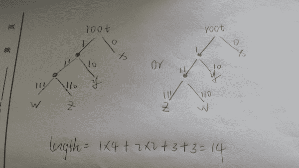
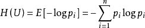
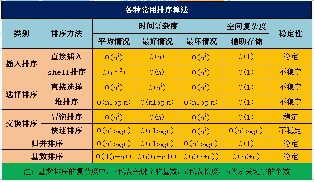
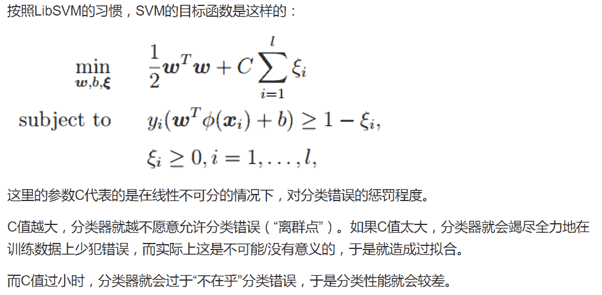
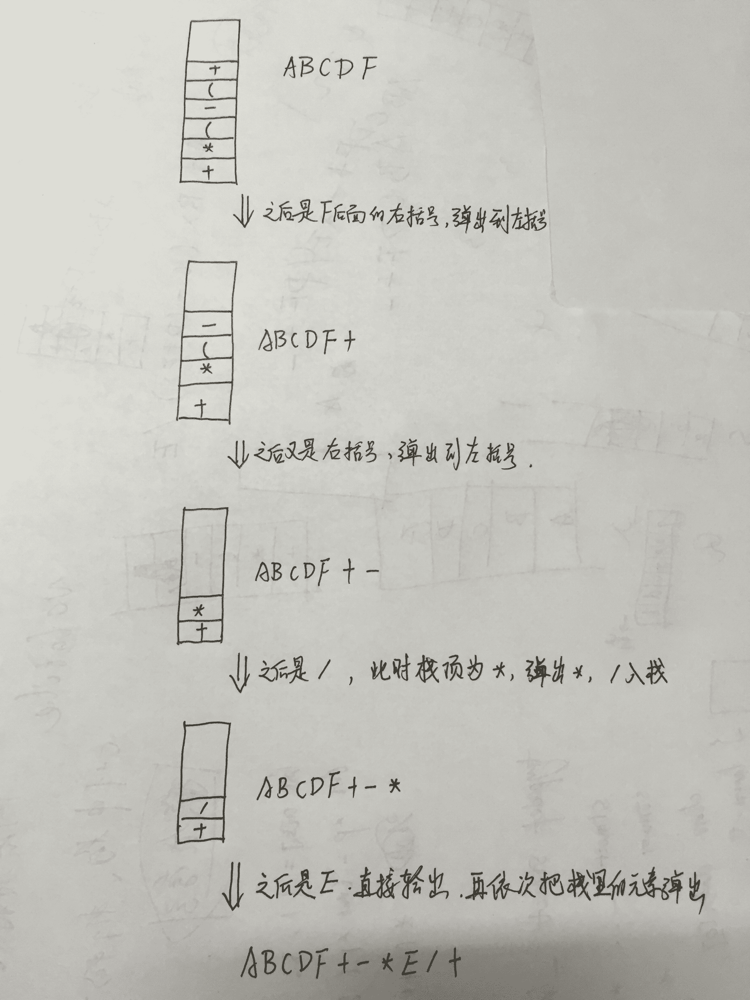
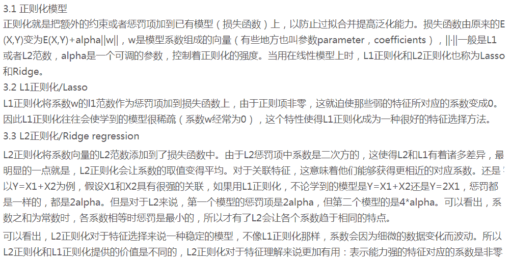
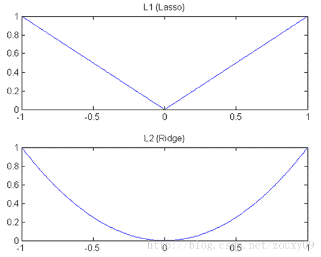
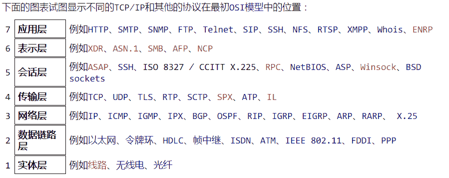
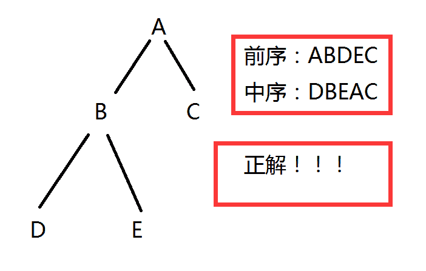

# 美团 2016 研发工程师笔试题（二）

## 1

已知一个线性表（38，25，74，63，52，48），假定采用散列函数 h（key) = key%7 计算散列地址，并散列存储在散列表 A【0....6】中，若采用线性探测方法解决冲突，则在该散列表上进行等概率成功查找的平均查找长度为？

正确答案: C   你的答案: 空 (错误)

```cpp
1.5
```

```cpp
1.7
```

```cpp
2.0
```

```cpp
2.3
```

本题知识点

哈希 *腾讯 Java 工程师 C++工程师 运维工程师 算法工程师 美团 2016 查找* **讨论

[Chaos 的 Elaine](https://www.nowcoder.com/profile/504500)

  查看全部)

编辑于 2015-02-04 21:46:03

* * *

[菜小豆](https://www.nowcoder.com/profile/134784)

38%7=3 （第 1 次出现 3，无冲突，放在位置 3，查找次数为 1）25%7=4（第 1 次出现 4，无冲突，放在位置 4，查找次数为 1）74%7=4（第 2 次出现 4，有冲突，放在位置 5，查找次数为 2）63%7=0（第 1 次出现 0，无冲突，放在位置 0，查找次数为 1）52%7=3（第 2 次出现 3，有冲突，发现冲突 3,4,5，故只能放到 6，查找次数为 4）48%7=6 （第 1 次出现 6，有冲突，发现冲突 6,1，故只能放到 1，查找次数为 3）结果：（1+1+2+1+4+3）÷6=2

编辑于 2015-09-19 22:07:16

* * *

[美团校招内推直达](https://www.nowcoder.com/profile/458054)

**答案 C：****平均查找长度=总的查找次数/元素数****总的查找次数：** 38%7=3 （第 1 次出现 3，无冲突，放在位置 3，**查找次数为 1**）25%7=4（第 1 次出现 4，无冲突，放在位置 4，**查找次数为 1**）74%7=4（第 2 次出现 4，有冲突，放在位置 5，**查找次数为 2**）63%7=0（第 1 次出现 0，无冲突，放在位置 0，**查找次数为 1**）52%7=3（第 2 次出现 3，有冲突，发现冲突 3,4,5，故只能放到 6，**查找次数为 4**）48%7=6 （第 1 次出现 6，有冲突，发现冲突 6,0，故只能放到 1，**查找次数为 3**）**1+1+2+1+4+3=12****元素数=6****所以：平均查找长度=12/6=2**

编辑于 2016-04-18 09:41:11

* * *

## 2

用二进制来编码字符串“xyzwxyxx”，需要能够根据编码解码回原来的字符串，则我们最少需要多长的二进制字符串

正确答案: B   你的答案: 空 (错误)

```cpp
12
```

```cpp
14
```

```cpp
15
```

```cpp
18
```

```cpp
24
```

本题知识点

字符串 *讨论

[美团校招内推直达](https://www.nowcoder.com/profile/458054)

**答案：B**xyzwxyxx：x：4 位、y：2 位、z：1 位、w：1 位用 4、2、1、1 构造哈夫曼树 

编辑于 2015-10-11 08:37:45

* * *

[SynchronizedHe](https://www.nowcoder.com/profile/546967)

哈夫曼编码的问题 x 出现 4 次 y2 次 w1 次 z1 次
x 用 0
y 用 10
w 用 110
z 用 111
w 和 z 的编码方案可以互换
length=1*4+2*2+1*3+1*3=14

发表于 2015-09-15 16:21:41

* * *

[0xEFBFBD](https://www.nowcoder.com/profile/1641824)

这道题应该是使用信息论中信息熵来解决**信息熵**表示一个字符串中每个字符的平均编码长度的理论极限值根据信息熵计算的公式： 所以这个题中  x,y,z,w 出现的概率为 1/2, 1/4, 1/8, 1/8 所以信息熵为 1/2 * log(1/2) + 1/4 * log(1/4) +  1/8 * log(1/8) +  1/8 * log(1/8) = 1.75 bit/symbol 即  每个字符最少占用 1.75 个 bit 题目中字符串中含有 8 个字符，所以理论编码长度的极限为  1.75 * 8 = 14

发表于 2017-02-09 18:02:41

* * *

## 3

由多个源文件组成的 C 程序，经过编辑、预处理、编译，链接等阶段会生成最终的可执行程序。下面哪个阶段可以发现被调用的函数未定义？

正确答案: C   你的答案: 空 (错误)

```cpp
预处理
```

```cpp
编译
```

```cpp
链接
```

```cpp
执行
```

本题知识点

C++ Java 工程师 C++工程师 运维工程师 算法工程师 美团 Java 工程师 C++工程师 运维工程师 算法工程师 美团 2016

讨论

[美团校招内推直达](https://www.nowcoder.com/profile/458054)

**答案：C****A：** **预处理**  查看全部)

编辑于 2016-03-15 11:37:52

* * *

[Present](https://www.nowcoder.com/profile/516247)

编译时只是把函数的符号地址记录下来，链接时该函数符号有定义才会变成具体的地址。如果链接过程中所有符号都有定义，链接成功，生成可执行文件；否则链接失败。

发表于 2015-10-03 10:17:18

* * *

[放牛郎与天仙女](https://www.nowcoder.com/profile/782521)

```cpp
//预处理：处理#include、宏替换和条件编译
//编译：生成目标文件（.cpp->.o）
//链接：链接多个目标文件
//例子：
//main.cpp
int main(){
    fun();
}
//编译不可通过，提示函数 fun()未声明
void fun();
int main(){
    fun();
}
//编译可通过，链接不可通过，提示函数 fun(）未定义

```

发表于 2015-10-29 13:13:59

* * *

## 4

常见的网络嗅探器，以下哪个不是？

正确答案: C   你的答案: 空 (错误)

```cpp
tcpdump
```

```cpp
wireshark
```

```cpp
wvs
```

```cpp
sniffit
```

本题知识点

网络基础 Java 工程师 C++工程师 运维工程师 算法工程师 美团 2016

讨论

[张瑞泽](https://www.nowcoder.com/profile/9276849)

刷题刷累了吧？

发表于 2017-04-08 17:30:33

* * *

[我是谁谁谁呢](https://www.nowcoder.com/profile/538759)

wvs 是一个自动化的 web 应用程序安全测试工具，可以扫描任何可以通过 web 访问和遵循 http/https 访问的站点和应用程序。snifft 是一个网络监听软件，主要针对 tcp/ip 协议的不安全对运行该协议的机器进行监听 wireshark 是一个网络封包分析软件，功能抓取网络封包，然后尽可能详尽的分析网络封包 tcpdumptak 他可以将网络中所有传送的数据包抓取下来，进行详尽的分析，主要针对的是网络层，端口，主机，协议，并且提供 and，or，not 等命令来进行处理，从而剔除没有用的信息

发表于 2015-09-15 18:38:07

* * *

[舒意意 123](https://www.nowcoder.com/profile/1973064)

wvs 是一个自动化的 web 应用程序安全测试工具，可以扫描任何可以通过 web 访问和遵循 http/https 访问的站点和应用程序。snifft 是一个网络监听软件，主要针对 tcp/ip 协议的不安全对运行该协议的机器进行监听 wireshark 是一个网络封包分析软件，功能抓取网络封包，然后尽可能详尽的分析网络封包 tcpdumptak 他可以将网络中所有传送的数据包抓取下来，进行详尽的分析，主要针对的是网络层，端口，主机，协议，并且提供 and，or，not 等命令来进行处理，从而剔除没有用的信息

发表于 2017-04-06 09:38:38

* * *

## 5

下列哪种排序算法是不稳定算法

正确答案: B C D   你的答案: 空 (错误)

```cpp
归并排序
```

```cpp
希尔排序
```

```cpp
堆排序
```

```cpp
快速排序
```

本题知识点

排序 *Java 工程师 C++工程师 运维工程师 算法工程师 美团 2016* *讨论

[xuangev5](https://www.nowcoder.com/profile/574024)

不稳定的排序算法有：快、希、选、堆。（记忆：找到工作就可以“快些选一堆”美女来玩了（并不能））

发表于 2015-09-15 13:53:49

* * *

[美团校招内推直达](https://www.nowcoder.com/profile/458054)

**答案 CD：**

发表于 2015-10-11 08:55:46

* * *

[LuLu1990](https://www.nowcoder.com/profile/990182)

稳定的排序算法：归并，插入排序
不稳定的排序算法：选择排序 （5,7,5,3）3 和 5 交换之后，两个 5 的相对顺序发
                                                生了变化）
                                shell 排序  （1, 5, 5, 2,3, 7） 间隔序列为(3, 1), 3 的时候
                                                （1,5,7）（5,2,3））, 在间隔>1 的时候会出现不
                                                   稳定
                                快速排序    (3, 5, 5, 4 ,2, 1)
                                堆排序       构造堆的时候时稳定的，但是在根节点与尾节点交
                                                 换之后，根节点成为了序列中最后一个，如果字
                                                 节点之一与根节点相同，则其不稳定

编辑于 2015-09-16 19:02:05

* * *

## 6

已知有 30 匹马，5 个跑道，每个跑道只能容一匹马，没有计时器，至少需要比赛多少次，可以找出最快的前三匹马。

正确答案: B   你的答案: 空 (错误)

```cpp
8
```

```cpp
9
```

```cpp
12
```

```cpp
14
```

本题知识点

数学运算

讨论

[SunburstRun](https://www.nowcoder.com/profile/557336)

答案是 B      因  查看全部)

编辑于 2015-09-15 17:21:08

* * *

[Pandora](https://www.nowcoder.com/profile/266279)

1、首先 30/5 分为 6 组：组一，组二，...，组六，决出每组的第一名。比了 6 次。2、组一第 1~组五第 1，决出目前 1~4 名；再将目前 1~4 名与组六第 1 一起，决出目前 1~3 名。比了 2 次。3、因为有可能某一组的速度比其他组的第一名快，所以继续比较。有 5 个赛道：第一名组的 2,3（因为第一名已经完全确定，不会有谁比他快，而且，**我们只需要前 3 名，所以即使是第一组的全部快，也只需要三个就好了。**）；第二名组的 1,2 名（因为第二名还是待定的，万一第一名组的 2,3 名比他快呢），第三名组的 1（还是有希望的，比比吧 o(╯□╰)o）。比了 1 次。所以，9 次。不知道解释清楚了没，好累(～￣▽￣)～

发表于 2015-09-19 10:45:10

* * *

[fade-away](https://www.nowcoder.com/profile/900737)

1、选出六个组各组的排名    6 次 2、六组的第一比选出 123 名   2 次 3、第一名的那组的 23 名和第二名那组的 12 名和第三名那组的第 1 名比较 选出一二名  1 次

```cpp
6+2+1 = 9
```

发表于 2015-09-15 15:11:40

* * *

## 7

当前目录下有 a 和 b 两个文件，执行命令“ls>c”，请问文件 c 里面的内容是什么？

正确答案: D   你的答案: 空 (错误)

```cpp
a
```

```cpp
b
```

```cpp
ab
```

```cpp
abc
```

本题知识点

Linux Java 工程师 C++工程师 运维工程师 算法工程师 美团 2016

讨论

[===+](https://www.nowcoder.com/profile/452050)

使用 ls 命令产生的输出为当前路径下的所有文件名。>c 即代表将结果输出至 c 中，若没有 c 则先产生 c 文件，即内容里含有 abc

发表于 2016-03-29 22:23:32

* * *

[nwhasd](https://www.nowcoder.com/profile/181639)

ls>c 会先生成 c 文件,然后 ls 的结果就是 abc,重定向到 c 中,所以 c 中是 abc.

发表于 2015-09-15 19:32:05

* * *

[lchb](https://www.nowcoder.com/profile/967359)

亲自试验过，我是先 mkdir test
在 test 下 touch a b
然后 ls>c
cat c 后看到的是
a
b
c

发表于 2015-09-25 17:27:39

* * *

## 8

设无向图的顶点个数为 n，则该图最多有多少条边？

正确答案: C   你的答案: 空 (错误)

```cpp
n-1
```

```cpp
n（n+1）/2
```

```cpp
n（n-1）/2
```

```cpp
n
```

```cpp
不同于以上答案
```

本题知识点

图 Java 工程师 C++工程师 运维工程师 算法工程师 美团 Java 工程师 C++工程师 运维工程师 算法工程师 美团 2016

讨论

[SunburstRun](https://www.nowcoder.com/profile/557336)

答案是 C  查看全部)

编辑于 2015-09-15 12:34:56

* * *

[springlmn](https://www.nowcoder.com/profile/852140)

n 个顶点，最多的情况是每两个点有一条边，所以用 Cn2，结果是 n(n-1)/2

发表于 2015-09-19 09:38:02

* * *

[jxc666](https://www.nowcoder.com/profile/712961)

c(2,n)=n*(n-1)/(2*1)

发表于 2016-10-28 09:58:41

* * *

## 9

下午 2：10 分的时候，在指针型时钟上的时针和分针的夹角是多少度？

正确答案: B   你的答案: 空 (错误)

```cpp
0
```

```cpp
5
```

```cpp
12
```

```cpp
15
```

```cpp
20
```

本题知识点

数学运算

讨论

[星陨无痕](https://www.nowcoder.com/profile/436939)

答案为 B 5 度钟表一圈是 360 度十分的位置是（2/12）*360 度一小时是 1/12*360 度也就是一个格子是 30 度在分针走 1/6 时，时针也应该向前走一个格子的 1/6 也就是 30 度的 1/6 也就是 5 度

发表于 2015-09-16 15:24:37

* * *

[牛客 lucky](https://www.nowcoder.com/profile/570832)

2 点到三点之间是 30 度（相邻时刻之间都是 30 度），分针走 360 度时，时针走 30 度。**现在**分针走 60 度，时针应该走了 5 度

发表于 2016-09-06 10:08:37

* * *

[无务](https://www.nowcoder.com/profile/445410)

分针与时针走过的角度比是 12：1

发表于 2016-12-03 09:24:54

* * *

## 10

在 Unix 系统中，若一个进程退出时，其子进程还在运行（没有被杀死），则这些子进程会变成孤儿进程（Orphan Process），请问孤儿进程会被以下哪一个系统进程接管？

正确答案: B   你的答案: 空 (错误)

```cpp
syslogd
```

```cpp
init
```

```cpp
sshd
```

```cpp
vhand
```

本题知识点

Linux Java 工程师 C++工程师 运维工程师 算法工程师 美团 Java 工程师 C++工程师 运维工程师 算法工程师 美团 2016

讨论

[weicon](https://www.nowcoder.com/profile/737593)

 正常情况下， 当一个 进程完成它的工作终止之后，它的父进程需要调用 wait()或者 waitpid()系统调用取得子进程的终止状态。孤儿进程的存在 是因为 父进程先于子进程退出，那么子进程会变成孤儿进程僵尸进程的存在 是因为 子进程退出后，父进程并没有调用 wait（）或者 waitpid（），子进程的描述符还保留在系统中孤儿进程最后会被 init 接管，而僵尸进程会继续占用资源

发表于 2015-09-17 13:07:41

* * *

[Nebulaliu](https://www.nowcoder.com/profile/209746)

僵尸进程：一个子进程在其父进程还没有调用 wait()或 waitpid()的情况下退出。这个子进程就是僵尸进程。

孤儿进程：一个父进程退出，而它的一个或多个子进程还在运行，那么那些子进程将成为孤儿进程。孤儿进程将被 init 进程(进程号为 1)所收养，并由 init 进程对它们完成状态收集工作。

僵尸进程将会导致资源浪费，而孤儿则不会。

发表于 2015-09-16 16:50:08

* * *

[hellowww](https://www.nowcoder.com/profile/924580)

syslogd 是系统日志服务的进程；init 是所有进程的发起者和控制者，是终极父进程；sshd 是 ssh 服务的进程；vhand 是做什么的，求解答

发表于 2015-10-14 21:54:00

* * *

## 11

以下哪些不是链表的特征（）？

正确答案: A C D   你的答案: 空 (错误)

```cpp
数据在内存中一定是连续的
```

```cpp
插入或删除时，无需移动其他元素
```

```cpp
可以随机访问表内的元素
```

```cpp
需要事先估计存储空间
```

本题知识点

链表 *美团* *讨论

[本人太懒懒得起](https://www.nowcoder.com/profile/7172376)

链表的存储空间可以动态的申请

发表于 2017-04-14 11:11:28

* * *

[weicon](https://www.nowcoder.com/profile/737593)

线性表分为顺序表(数组等)和链表 ACD 为顺序表的特征只有 B 是链表的特征

发表于 2015-09-17 13:14:06

* * *

[LuLu1990](https://www.nowcoder.com/profile/990182)

应该是 ACD，链表明显不能随机访问表内的元素

编辑于 2015-10-11 22:21:59

* * *

## 12

求函数返回值，输入 x=9999

```cpp
int func(int x){
	int count = 0;
	while (x){
		count++;
		x = x&(x - 1);//与运算
	}
	return count;
}
```

正确答案: A   你的答案: 空 (错误)

```cpp
8
```

```cpp
9
```

```cpp
10
```

```cpp
12
```

本题知识点

Java 工程师 C++工程师 运维工程师 算法工程师 美团 C 语言 2016

讨论

[NWU](https://www.nowcoder.com/profile/184691)

一个数与这个数减 1 的结果进行'&'按位与运算，结果为：**这个数二进制数最右边的 1 变为 0；**举例说明如下：X=5；  5&（5-1） = 010 ***1*** & （0100） = 010 ***0***经过上述计算，5 的二进制最右边的 1 变为了 0，由此可知，题目中 count 是用以统计 x 的二进制中 1 的个数的
9999 的二进制表示为：10011100001111 共有 8 个 1，显然，答案为 A。

发表于 2016-01-09 21:39:37

* * *

[夏雨天](https://www.nowcoder.com/profile/710633)

选择 A：考察输入数据二进制中一的个数。9999 = 8192+1024+512+256+8+4+2+1；所以 8 个 1\.

发表于 2015-09-23 21:37:15

* * *

[yql](https://www.nowcoder.com/profile/566442)

9999 的二进制 10011100001111，**8 个 1**

发表于 2015-09-15 16:10:25

* * *

## 13

关于支持向量机 SVM,下列说法错误的是（）

正确答案: C   你的答案: 空 (错误)

```cpp
L2 正则项，作用是最大化分类间隔，使得分类器拥有更强的泛化能力
```

```cpp
Hinge 损失函数，作用是最小化经验分类错误
```

```cpp
分类间隔为 1/||w||，||w||代表向量的模
```

```cpp
L1 正则化对所有参数的惩罚力度都一样，可以让一部分权重变为零，因此产生稀疏模型，能够去除某些特征
```

本题知识点

机器学习 Java 工程师 C++工程师 运维工程师 算法工程师 美团 2016

讨论

[牛客 405669 号](https://www.nowcoder.com/profile/405669)



发表于 2017-09-03 10:38:16

* * *

[英国老鼠](https://www.nowcoder.com/profile/3789283)

A 正确。考虑加入正则化项的原因：想象一个完美的数据集，y>1 是正类，y 发表于 2017-03-19 09:35:26

* * *

[牛客 905167 号](https://www.nowcoder.com/profile/905167)

为什么我觉得分类间隔是 2/||w||呢？？？有木有解答的

发表于 2015-09-18 20:28:55

* * *

## 14

中缀表达式 X=A+B*(C-(D+F))/E 转后缀表达式之后是什么？

正确答案: A   你的答案: 空 (错误)

```cpp
ABCDF+-*E/+
```

```cpp
ABDF+C-*E/+
```

```cpp
ABDF+C*-E/+
```

```cpp
ABDF+C*-E+/
```

本题知识点

模拟

讨论

[起个什么名字呢](https://www.nowcoder.com/profile/620249)

三步求后缀（前缀）表达式：（1）将 A+B*(C-(D+F))/E 按优先级加括号 ( A+((B*(C-(D+F))/E)))（2）从最内层括号将符号提到括号后（前缀提到括号前） （A（（B（C（DF）+）-）*E）/）+（3）去掉括号的即所得 ABCDF+-*E/+

发表于 2015-10-08 15:34:54

* * *

[李冰](https://www.nowcoder.com/profile/642631)

A+B*(C-(D+F))/E1，读到 A，直接输出 A2，读到+，放入栈中 3，读到 B，直接输出，此时栈中有+ ，输出 AB
4，读到*，因为*的优先级高于+，入栈，栈中有+ *（右边为栈顶）5，读到（，优先级最高，遇到）才出，入栈，栈中有+ * （6，读到 C，输出 ABC7，读到-，入栈，栈中有+ *  （ —8，读到（，入栈，栈中有+  *  （  —（9，读到 D，输出 ABCD10，读到+，入栈，栈中有+  *  （  —（ +11，读到 F，输出 ABCDF12，读到），出栈+，输出 ABCDF+，栈中有+  *  （ —13，读到），出栈—。输出 ABCDF+-，栈中有+  *14，读到/，出栈*，入栈/，输出 ABCDF+-*，栈中有+ /15，读到 E，输出 ABCDF+-*E15，出栈/，输出 ABCDF+-*E/16，出栈+，输出 ABCDF+-*E/+所以后缀表达式为 ABCDF+-*E/+

发表于 2015-09-29 23:06:43

* * *

[xpj](https://www.nowcoder.com/profile/955945)

中缀表达式转后缀表达式的方法：
1.遇到操作数：直接输出（添加到后缀表达式中）
2.栈为空时，遇到运算符，直接入栈
3.遇到左括号：将其入栈
4.遇到右括号：执行出栈操作，并将出栈的元素输出，直到弹出栈的是左括号，左括号不输出。
5.遇到其他运算符：加减乘除：弹出所有优先级大于或者等于该运算符的栈顶元素，然后将该运算符入栈
6.最终将栈中的元素依次出栈，输出。 

发表于 2015-09-19 20:01:42

* * *

## 15

某次买可乐集瓶盖活动中有 5 种不同的瓶盖以等概率出现，每买一瓶汽水可得到一个瓶盖，集齐所有瓶盖所买汽水瓶数的期望，与以下哪个结果最为接近？

正确答案: B   你的答案: 空 (错误)

```cpp
9
```

```cpp
11
```

```cpp
13
```

```cpp
15
```

本题知识点

概率统计 *Java 工程师 C++工程师 运维工程师 算法工程师 美团 2016 概率论与数理统计* *讨论

[知否](https://www.nowcoder.com/profile/455863)

选 11。 取到一种不同瓶盖的期望次数为 1； 在已经取到一种瓶盖的情况下，再取到一种不同的瓶盖的期望次数是 1/（4/5）=5/4； 在已经取到两种瓶盖的情况下，再取到一种不同的瓶盖的期望次数是 1/（3/5）=5/3； 。。。 因此，取到五种瓶盖的期望次数为 1+5/4+5/3+5/2+5/1=11+5/12。

发表于 2015-09-16 12:13:54

* * *

[vvickey111](https://www.nowcoder.com/profile/570195)

几何分布，在第 k 次成功的期望是 1/p，p 为第 k 次成功的概率。所以第一次五次取到瓶盖都不一样就说明了对每一次都是一次实验 k 次的实验，也就每次成功的概率倒数的相加，第一次是概率为 1 因为一定不一和前面的一样，第二次就是 1/（4/5），第三次就是 1/（3/5），第四次就是 1/（2/5），第五次就是 1/（1/5）。所以它们的和就是 1+5/4+5/3+5/2+5/1。

发表于 2017-06-17 15:53:13

* * *

[lowbee](https://www.nowcoder.com/profile/806971)

答案是 11+5/12.  设 E(i) 表示 目前已有 i 个不同瓶盖集齐五个不同瓶盖所需的瓶子个数期望。

*   E(0) = E(1)+1  ,  需要一个瓶盖跳到 E(1)

*   E(1) = (E(2)+1)*4/5+(E(1)+1)*1/5
*   E(2) = (E(3)+1)*3/5+(E(2)+1)*2/5
*   E(3) = (E(4)+1)*2/5+(E(3)+1)*3/5
*   E(4) = (E(5)+1)*1/5+(E(4)+1)*4/5
*   E(5) = 0

解得 E(4) = 5, E(3)=15/2, E(2)=55/6, E(1)= 125/12, E(0) = 11+5/12
E(0)是我们的所求。

编辑于 2016-09-02 18:53:19

* * *

## 16

JAVA 语言的下面几种数组复制方法中，哪个效率最高？

正确答案: B   你的答案: 空 (错误)

```cpp
for 循环逐一复制
```

```cpp
System.arraycopy
```

```cpp
Arrays.copyOf
```

```cpp
使用 clone 方法
```

本题知识点

Java Java 工程师 C++工程师 运维工程师 算法工程师 美团 Java 工程师 C++工程师 运维工程师 算法工程师 美团 2016

讨论

[yql](https://www.nowcoder.com/profile/566442)

     A、for 循环的话，很灵活，但是代码不够简洁.    B、System.arraycopy()源码。可以看到是 native 方法：native 关键字说明其修饰的方法是一**个原生态方法**，方法对应的实现不是在当前文件，而是在用其他语言（**如 C 和 C++**）实现的文件中。 可以将 native 方法比作 Java 程序同Ｃ程序的接口。

```cpp
public static native void arraycopy(Object src,  int  srcPos,
           Object dest, int destPos,int length); 
```

    C、选项有误，copyOf 不是 System 的方法，而是 Arrays 的方法，下面是源码，可以**看到本质上是调用的 arraycopy 方法。**，那么其效率必然是比不上 arraycopy 的

```cpp
public static int[] copyOf(int[] original, int newLength) {
   int[] copy = new int[newLength];
   System.arraycopy(original, 0, copy, 0,
   Math.min(original.length, newLength));
   return copy;
}
```

 D。clone 的话，**返回的是 Object【】，需要强制转换**。 一般用 clone 效率是最差的，
        CD 可以排除。那么 AB 怎么比较呢？        给出一下参考的：            http://bbs.csdn.net/topics/370151185。               [`xuyuanshuaaa.iteye.com/blog/1046621`](http://xuyuanshuaaa.iteye.com/blog/1046621)  [java 的 system.arraycopy（）方法](http://xuyuanshuaaa.iteye.com/blog/1046621)具体的理由不好说。不过一致的说法和实验证明是 arraycopy（)效率高！！！T...T

编辑于 2015-09-15 22:19:16

* * *

[小牛快跑 233](https://www.nowcoder.com/profile/414929)

首先:Sytem.copyOf 有这个？我只知道是 Arrays.copyOf 结论：**效率：System.arraycopy > clone > Arrays.copyOf > for 循环**理由：A：for 循环，效率最低，随便写个程序验证一下，效率慢的不是一点.....我测试的时候比 clone 和 System.arraycopy 差了 100 多倍 B：System.arraycopy：原型是 public static native void arraycopy(Object src,  int  srcPos , Object dest, int destPos, int length);C：Arrays.copyOf 底层调用了上面的 System.copyOf 效率比上面两个低。D：clone()的完整定义：protected native Object clone() throws CloneNotSupportedException;**高票答案说的 clone()返回的是 Object 类型，其实是错误的，只有 Object[]数组的 clone()方法才返回 Object 类型，子类重写了父类的方法。**其实，一般情况下，前三个的效率差别几乎忽略不计，但是从 Arrays.copyOf 底层调用的是 System.arraycopy，自然 System.arrayCopy 效率自然要低一些。而 clone()和 System.arraycopy 只是从实验的结果来看是 System.arraycopy 的效率高。

编辑于 2016-11-21 22:07:14

* * *

[azurewer](https://www.nowcoder.com/profile/8711033)

只知道 for 循环，但是我做对了因为一看效率最高的肯定是 system 最底层的方法嘛

发表于 2017-06-26 16:13:44

* * *

## 17

0，1，2，3，⋯，499，500 共 501 个数按升序排列，每次取奇数序位的数丢掉，然后取剩下的数的奇数序位的数丢掉，重复这个过程，那么最后剩下的数是多少？

正确答案: C   你的答案: 空 (错误)

```cpp
249
```

```cpp
253
```

```cpp
255
```

```cpp
257
```

```cpp
499
```

```cpp
不同于以上答案
```

本题知识点

数学运算

讨论

[SunburstRun](https://www.nowcoder.com/profile/557336)

答案是 C  查看全部)

编辑于 2015-09-15 12:39:16

* * *

[yql](https://www.nowcoder.com/profile/566442)

     简单例举下：0   1    2    3    4  5    6    7    8    9   10    11    第一次剩下的    1    3    5    7  9    11       规律： 2i-1                                 （ i 为整数   1<=i<= n/2 （n 表示给出序列的元素个数，例子中是 12，而题目中是 501））
    第二次剩下的    3     7    11                               4i- 1                    1<=i<= n/4    第 3 次剩下的        7                                           8i- 1                     1<=i<= n/8    相信已经差不多了。每次剩下的元素为   2^x-1 满足条件的只有 255=2⁸-1.当然这是选择题可以直接选答案。    正确做法是： 最后剩下一个元素，那么进行了几次筛选过程呢？   i 取值只能是 1，      那么 501/（2^x）<2    取 x=8;    那么剩下的元素是 2⁸-1=255

编辑于 2015-09-19 14:44:35

* * *

[品品](https://www.nowcoder.com/profile/235790)

都是一的二进制数最后出列。每次出的都是末尾是 0 的二进制序列。

发表于 2015-09-18 18:43:03

* * *

## 18

一个不透明的箱子里共有红，黄，蓝，绿，白五种颜色的小球，各个小球的数量非常多而且接近相等，每种颜色的小球大小相同，质量相等，每个人从篮子里抽出两个小球，请问至少需要多少个人抽，才能保证有两个人抽到的小球颜色全部相同？

正确答案: D   你的答案: 空 (错误)

```cpp
6
```

```cpp
11
```

```cpp
13
```

```cpp
16
```

```cpp
21
```

```cpp
26
```

本题知识点

数学运算

讨论

[Pandora](https://www.nowcoder.com/profile/266279)

题意就是球量充足，近似相等，所以不用担心放回不放回的概率问题。五种颜色的球组合：（5 颜色选 2 颜色）10+（同颜色）5=15。而且这 15 种组合是等概率出现。所以重复的话，就是发生在第 16 个人身上。

发表于 2015-09-19 11:11:36

* * *

[牛客 706287 号](https://www.nowcoder.com/profile/706287)

 应该是 16 吧一共可以红红 红黄 之类的 有 15 种方案但是到第 16 种无论如何都会和之前的重复

编辑于 2015-09-18 20:39:26

* * *

[LauZyHou](https://www.nowcoder.com/profile/8203811)


其中，选出不同颜色的球即是从 5 个中选 2 个；选出同颜色的球只有 5 种情况。

编辑于 2018-12-01 18:35:02

* * *

## 19

机器学习中 L1 正则化和 L2 正则化的区别是？

正确答案: A D   你的答案: 空 (错误)

```cpp
使用 L1 可以得到稀疏的权值
```

```cpp
使用 L1 可以得到平滑的权值
```

```cpp
使用 L2 可以得到稀疏的权值
```

```cpp
使用 L2 可以得到平滑的权值
```

本题知识点

机器学习 Java 工程师 C++工程师 运维工程师 算法工程师 美团 2016

讨论

[Adoring](https://www.nowcoder.com/profile/443052)



发表于 2017-03-07 12:40:50

* * *

[牛客 4292093 号](https://www.nowcoder.com/profile/4292093)

使用 L1 正则后的权值更新规则多了一项 η * λ * sgn(w)/n，这一项 当 w 为正时，更新后的 w 变小。当 w 为负时，更新后的 w 变大——因此它的效果就是让 w 往 0 靠，使网络中的权重尽可能为 0，也就相当于减小了网络复杂度，防止过拟合。所以说 L1 可以得到更稀疏的权值。

发表于 2016-08-03 20:57:20

* * *

[薛定谔的熊](https://www.nowcoder.com/profile/769741)

 我们知道，L1 和 L2 都是规则化的方式，我们将权值参数以 L1 或者 L2 的方式放到代价函数里面去。然后模型就会尝试去最小化这些权值参数。而这个最小化就像一个下坡的过程，L1 和 L2 的差别就在于这个“坡”不同，如下图：L1 就是按绝对值函数的“坡”下降的，而 L2 是按二次函数的“坡”下降。所以实际上在 0 附近，L1 的下降速度比 L2 的下降速度要快。所以会非常快得降到 0。不过我觉得这里解释的不太中肯，当然了也不知道是不是自己理解的问题。



       L1 在江湖上人称 Lasso，L2 人称 Ridge。不过这两个名字还挺让人迷糊的，看上面的图片，Lasso 的图看起来就像 ridge，而 ridge 的图看起来就像 lasso。因此，一句话总结就是：L1 会趋向于产生少量的特征，而其他的特征都是 0，而 L2 会选择更多的特征，这些特征都会接近于 0。Lasso 在特征选择时候非常有用，而 Ridge 就只是一种规则化而已。参考： http://blog.csdn.net/zouxy09/article/details/24971995/

发表于 2016-09-06 18:40:05

* * *

## 20

浏览器和服务器在基于 https 进行请求链接到数据传输过程中，用到了如下哪些技术？

正确答案: A B C D   你的答案: 空 (错误)

```cpp
非对称加密技术
```

```cpp
对称加密技术
```

```cpp
散列（哈希）算法
```

```cpp
数字证书
```

本题知识点

网络基础 Java 工程师 C++工程师 运维工程师 算法工程师 美团 2016

讨论

[丷柠檬](https://www.nowcoder.com/profile/649311)

**非对称加密算法用于在握手过程中加密生成的密码****对称加密算法用于对真正传输的数据进行加密****而 HASH 算法用于验证数据的完整性。**非对称加密算***生成公钥和私钥，公钥只能用于加密数据，因此可以随意传输，而网站的私钥用于对数据进行解密，所以网站都会非常小心的保管自己的私钥，防止泄漏。

发表于 2016-07-01 10:17:25

* * *

[yql](https://www.nowcoder.com/profile/566442)

http://kingj.iteye.com/blog/2103662    HTTPS 的工作原理

发表于 2015-09-15 17:37:35

* * *

[丹贵飘香](https://www.nowcoder.com/profile/6193205)

```cpp
HTTPS 在传输数据之前需要客户端（浏览器）与服务端（网站）之间进行一次握手，在握手过程中将确立双方加密传输数据的密码信息。TLS/SSL 协议是一套加密传输的协议，使用了非对称加密，对称加密以及 HASH 算法。
握手过程的简单描述如下： 
1.浏览器将自己支持的一套加密规则发送给网站。 
2.网站从中选出一组加密算法与 HASH 算法，并将自己的身份信息以证书的形式发回给浏览器。证书里面包含了网站地址，加密公钥，以及证书的颁发机构等信息。 
3.获得网站证书之后浏览器要做以下工作： 
a) 验证证书的合法性（颁发证书的机构是否合法，证书中包含的网站地址是否与正在访问的地址一致等），如果证书受信任，则浏览器栏里面会显示一个小锁头，否则会给出证书不受信的提示。 
b) 如果证书受信任，或者是用户接受了不受信的证书，浏览器会生成一串随机数的密码，并用证书中提供的公钥加密。 
c) 使用约定好的 HASH 计算握手消息，并使用生成的随机数对消息进行加密，最后将之前生成的所有信息发送给网站。 
4.网站接收浏览器发来的数据之后要做以下的操作： 
a) 使用自己的私钥将信息解密取出密码，使用密码解密浏览器发来的握手消息，并验证 HASH 是否与浏览器发来的一致。 
b) 使用密码加密一段握手消息，发送给浏览器。 
5.浏览器解密并计算握手消息的 HASH，如果与服务端发来的 HASH 一致，此时握手过程结束，之后所有的通信数据将由之前浏览器生成的随机密码并利用对称加密算法进行加密。 
这里浏览器与网站互相发送加密的握手消息并验证，目的是为了保证双方都获得了一致的密码，并且可以正常的加密解密数据，为后续真正数据的传输做一次测试。另外，HTTPS 一般使用的加密与 HASH 算法如下： 
非对称加密算法：RSA，DSA/DSS 
对称加密算法：AES，RC4，3DES 
```

HASH 算法：MD5，SHA1，SHA256

发表于 2017-08-07 20:02:09

* * *

## 21

有订单表 orders，包含字段用户信息 userid，字段产品信息 productid，以下语句能够返回至少被订购过两次的 productid？

正确答案: D   你的答案: 空 (错误)

```cpp
select productid from orders where count（productid）>1
```

```cpp
select productid from orders where max（productid）>1
```

```cpp
select productid from orders where having count（productid）>1 group by productid
```

```cpp
select productid from orders group by productid having count（productid）>1
```

本题知识点

数据库 Java 工程师 C++工程师 运维工程师 算法工程师 美团 2016

讨论

[小丫小丫](https://www.nowcoder.com/profile/784862)

顺序为：select, from, where, group by, having, order by, limit

发表于 2015-09-16 21:43:35

* * *

[hellowww](https://www.nowcoder.com/profile/924580)

where 增加分组前的限定，having 增加分组后的限定

发表于 2015-09-22 20:19:29

* * *

[龙虾姐夫](https://www.nowcoder.com/profile/6974930)

group by 通常和集合函数 SUM(),AVG().MAX(),MIN(),COUNT()等结合在一起，后接限制条件语句 having,不可用 where 语句！

发表于 2016-08-17 16:46:52

* * *

## 22

使用堆排序方法排序（45，78，57，25，41，89），初始堆为（？）

正确答案: B   你的答案: 空 (错误)

```cpp
78,45,57,25,41,89
```

```cpp
89,78,57,25,41,45
```

```cpp
89,78,25,45,41,57
```

```cpp
89,45,78,41,57,25
```

本题知识点

排序 *Java 工程师 C++工程师 运维工程师 算法工程师 美团 2016* *讨论

[weicon](https://www.nowcoder.com/profile/737593)

第一层：        45 第二层：   78      57 第三层：25 41  89 按照选项应该是递减的排序，从 89 开始上移，完成 max heap 则第一次移动之后第一层：        89 第二层：   78      57 第三层：25 41  45

发表于 2015-09-17 13:19:27

* * *

[夕一啊](https://www.nowcoder.com/profile/3913740)

[`blog.csdn.net/jinyongqing/article/details/12651349`](http://blog.csdn.net/jinyongqing/article/details/12651349)建堆的过程，放进完全二叉树之后，从**最后一个非叶子节点**开始调整，所以第一个调整 57，和 89 交换，然后是它前一个，78，不变，然后再前一个，就是堆顶了 45，和 89 交换，再下沉

发表于 2017-05-16 17:02:38

* * *

[mingshan](https://www.nowcoder.com/profile/7189365)

i 从 n/2 到 1 进行调整，每次调整都将编号的节点调整到对应位置。题目中 n=6，则经过 3 次调整。45 78 89 25 41 5745 78 89 25 41 5789 78 57 25 41 45

发表于 2017-03-04 15:29:34

* * *

## 23

对 n 个元素的数组进行（），其平均时间复杂度和最坏情况下的时间复杂度都是 O（nlogn）.

正确答案: C   你的答案: 空 (错误)

```cpp
希尔排序
```

```cpp
快速排序
```

```cpp
堆排序
```

```cpp
选择排序
```

本题知识点

排序 *Java 工程师 C++工程师 运维工程师 算法工程师 美团 2016* *讨论

[程序猿 Go 师傅](https://www.nowcoder.com/profile/242025553)


编辑于 2019-10-21 21:32:24

* * *

[李冰](https://www.nowcoder.com/profile/642631)

排序方法中，最好情况和最坏情况都一样的是选择排序和堆排序，不管初始序列是否有序选择排序时间复杂度是 O(N2)堆排序时间复杂度是 O(NlogN）

发表于 2015-09-29 23:11:41

* * *

[扛竹子的伙夫](https://www.nowcoder.com/profile/3127145)

时间复杂度都一样的应该有：1、归并；2、两种选择排序：       （1）直接选择（普通的选择排序）；       （2）堆排序

发表于 2017-08-28 17:12:58

* * *

## 24

一架飞机在满油的情况下可绕地球飞 0.5 圈，假设飞机与飞机之间可以互相加油，且地球只有一个基地。请问在确保所有飞机够油飞回起点的情况下，最少需要几架飞机才可以让其中一架飞机成功绕地球飞行一圈？（提示 1：地球是圆的！提升 2：飞机可以重复使用！）

正确答案: A   你的答案: 空 (错误)

```cpp
3
```

```cpp
4
```

```cpp
5
```

```cpp
6
```

```cpp
7
```

本题知识点

智力题 Java 工程师 C++工程师 运维工程师 算法工程师 美团 Java 工程师 C++工程师 运维工程师 算法工程师 美团 2016

讨论

[SunburstRun](https://www.nowcoder.com/profile/557336)

答案是 A  查看全部)

编辑于 2015-09-15 12:43:57

* * *

[这是小楠的微博](https://www.nowcoder.com/profile/555220)

推荐的答案 A 起飞了三次，B 起飞 2 次，C 起飞了一次，A 第二次和第三次反向起飞后再回去时都还剩 1/8 圈油，没做到用尽刚好空油，所以其实 A 飞两次有点浪费了，从最省起飞次数的角度，还有压缩空间，也就是说 A 可以也只飞两次：假设一圈分成 8 段，每一架飞机最多 4 段油。飞机 A、飞机 B、飞机 C 都加满 4 段油，同时起点出发。飞完第一段时：A、B、C 都剩 3 段油。【加油】A 给 B、C 各 1 段。【加油后】B、C 满到 4 段，A 剩 1 段掉头还够回去。飞完第二段时：B、C 都剩 3 段油，【加油】B 送 C 1 段。【加油后】C 满到 4 段，B 剩 2 段掉头还够回去（此时 A 已回到基地）。（接下去 C 要独自飞三、四、五、六段）////飞完第四段时让加满 4 段油的 A 反向起飞（此时 B 刚回到基地，如果加油时间可以忽略，你这时候让 B 上也可以，哈哈）。飞完第六段：C 剩 0 段油，此时 A 刚好反向飞了二段遇到 C，剩 2 段油，【加油】A 送 C 1 段。【加油后】C 有 1 段油，A 剩 1 段油。接着 A、C 一块飞。////此时让满 4 段油的 B 反相起飞。飞完第七段：A、C 都剩 0 段油，此时 B 刚好飞了一段遇到他们，剩 3 段。【加油】B 给 A、C 各一段。【加油后】A、C 有 1 段，B 剩 1 段。A、B、C 终于可以愉快地一起飞最后一段了^_^。飞完第八段：A、B、C 均用完所有的油，物尽其用，结束愉快的旅程，回到温馨的基地~

发表于 2015-10-04 03:31:38

* * *

[牛客 8030261 号](https://www.nowcoder.com/profile/8030261)

1.  由题可知，每个飞机可以飞打一个 0.25=1/4 圈的来回，和一个 0.5=1/2 圈。所以设置在每个 1/8 的位置飞机互相加油。
2.  路程 0-1/8，A,B,C 同时起飞，每个均消耗 1/4 的油，C 将剩下的 3/4 油分三份，分别分给 A,B,C,1/4 的油则，C 可飞回起点。 此时 A,B 又回到满油状态
3.  路程 1/4 时，A,B 又消耗了 1/4 油，B 将剩的 3/4，B 一份 2/4 给自己分回起点，A 又满油独自飞行。
4.  路程 3/4 时，与路程 1/4 时位置对称，因此，街机方式相同，最后三个飞机均能飞回起点。

编辑于 2016-11-14 14:39:13

* * *

## 25

关于 volatile 关键字，下列描述不正确的是？

正确答案: B D   你的答案: 空 (错误)

```cpp
用 volatile 修饰的变量，每次更新对其他线程都是立即可见的。
```

```cpp
对 volatile 变量的操作是原子性的。
```

```cpp
对 volatile 变量的操作不会造成阻塞。
```

```cpp
不依赖其他锁机制，多线程环境下的计数器可用 volatile 实现。
```

本题知识点

Java Java 工程师 C++工程师 运维工程师 算法工程师 美团 2016

讨论

[masterKLB](https://www.nowcoder.com/profile/790040)

一旦一个共享变量（类的成员变

  查看全部)

编辑于 2016-04-25 14:55:04

* * *

[海天一色是黑色](https://www.nowcoder.com/profile/3071203)

转载于：http://www.ibm.com/developerworks/cn/[Java](http://lib.csdn.net/base/javaee)/j-jtp06197.html

Java 语言中的 volatile 变量可以被看作是一种 “程度较轻的 synchronized”；与 synchronized 块相比，volatile 变量所需的编码较少，并且运行时开销也较少，但是它所能实现的功能也仅是 synchronized 的一部分。本文介绍了几种有效使用 volatile 变量的模式，并强调了几种不适合使用 volatile 变量的情形。

锁提供了两种主要特性：*互斥（mutual exclusion）* 和*可见性（visibility）*。互斥即一次只允许一个线程持有某个特定的锁，因此可使用该特性实现对共享数据的协调访问协议，这样，一次就只有一个线程能够使用该共享数据。可见性要更加复杂一些，它必须确保释放锁之前对共享数据做出的更改对于随后获得该锁的另一个线程是可见的 —— 如果没有同步机制提供的这种可见性保证，线程看到的共享变量可能是修改前的值或不一致的值，这将引发许多严重问题。

Volatile 变量

Volatile 变量具有 synchronized 的可见性特性，但是不具备原子特性。这就是说线程能够自动发现 volatile 变量的最新值。Volatile 变量可用于提供线程安全，但是只能应用于非常有限的一组用例：多个变量之间或者某个变量的当前值与修改后值之间没有约束。因此，单独使用 volatile 还不足以实现计数器、互斥锁或任何具有与多个变量相关的不变式（Invariants）的类（例如 “start <=end”）。

出于简易性或可伸缩性的考虑，您可能倾向于使用 volatile 变量而不是锁。当使用 volatile 变量而非锁时，某些习惯用法（idiom）更加易于编码和阅读。此外，volatile 变量不会像锁那样造成线程阻塞，因此也很少造成可伸缩性问题。在某些情况下，如果读操作远远大于写操作，volatile 变量还可以提供优于锁的性能优势。

正确使用 volatile 变量的条件

您只能在有限的一些情形下使用 volatile 变量替代锁。要使 volatile 变量提供理想的线程安全，必须同时满足下面两个条件：

*   对变量的写操作不依赖于当前值。
*   该变量没有包含在具有其他变量的不变式中。

实际上，这些条件表明，可以被写入 volatile 变量的这些有效值独立于任何程序的状态，包括变量的当前状态。

第一个条件的限制使 volatile 变量不能用作线程安全计数器。虽然增量操作（x++）看上去类似一个单独操作，实际上它是一个由读取－修改－写入操作序列组成的组合操作，必须以原子方式执行，而 volatile 不能提供必须的原子特性。实现正确的操作需要使 x 的值在操作期间保持不变，而 volatile 变量无法实现这点。（然而，如果将值调整为只从单个线程写入，那么可以忽略第一个条件。）

大多数编程情形都会与这两个条件的其中之一冲突，使得 volatile 变量不能像 synchronized 那样普遍适用于实现线程安全。

发表于 2016-10-24 16:21:44

* * *

[菩提旭光](https://www.nowcoder.com/profile/837579)

**所谓** **volatile 的措施，就是****1\. 每次从内存中取值，不从缓存中什么的拿值。这就保证了用** **volatile 修饰的共享变量，每次的更新对于其他线程都是可见的。****2.** **volatile 保证了其他线程的立即可见性，就没有保证原子性。****3.由于有些时候对** **volatile 的操作，不会被保存，说明不会造成阻塞。不可用与多线程环境下的计数器。**

发表于 2016-03-21 16:03:23

* * *

## 26

SNMP 所采用的传输层协议是什么？

正确答案: A   你的答案: 空 (错误)

```cpp
UDP
```

```cpp
ICMP
```

```cpp
TCP
```

```cpp
IP
```

本题知识点

网络基础 Java 工程师 C++工程师 运维工程师 算法工程师 美团 2016

讨论

[牛客 56746918](https://www.nowcoder.com/profile/7005827)

使用 tcp 协议的应用层协议主要有：smtp,ftp,http,telnet;其他大部分使用 udp

发表于 2017-09-19 12:20:46

* * *

[肖恩李](https://www.nowcoder.com/profile/661965)

```cpp
SMTP：简单邮件传输协议，使用 TCP 连接，端口号为 25，
SNMP：简单网络管理协议，使用 UDP 161 端口，
```

发表于 2016-01-19 10:05:16

* * *

[bugfree:）](https://www.nowcoder.com/profile/881380)

SMTP：简单邮件传输协议，使用 TCP 连接，端口号为 25， SNMP：简单网络管理协议，使用 UDP 161 端口，

发表于 2017-04-07 15:27:39

* * *

## 27

机器学习中做特征选择时，可能用到的方法有？

正确答案: A B C D   你的答案: 空 (错误)

```cpp
卡方
```

```cpp
信息增益
```

```cpp
平均互信息
```

```cpp
期望交叉熵
```

本题知识点

机器学习 Java 工程师 C++工程师 运维工程师 算法工程师 美团 2016

讨论

[chen 尾巴](https://www.nowcoder.com/profile/969479)

特征提取算法

特征提取算法分为特征选择和特征抽取两大类

特征选择

常采用特征选择方法。常见的六种特征选择方法：

1.  DF(Document Frequency) 文档频率
    DF:统计特征词出现的文档数量，用来衡量某个特征词的重要性

2.  MI(Mutual Information) 互信息法
    互信息法用于衡量特征词与文档类别直接的信息量。
    如果某个特征词的频率很低，那么互信息得分就会很大，因此互信息法倾向”低频”的特征词。
    相对的词频很高的词，得分就会变低，如果这词携带了很高的信息量，互信息法就会变得低效。

3.  (Information Gain) 信息增益法
    通过某个特征词的缺失与存在的两种情况下，语料中前后信息的增加，衡量某个特征词的重要性。

4.  CHI(Chi-square) 卡方检验法
    利用了统计学中的”假设检验”的基本思想：首先假设特征词与类别直接是不相关的
    如果利用 CHI 分布计算出的检验值偏离阈值越大，那么更有信心否定原假设，接受原假设的备则假设：特征词与类别有着很高的关联度。

5.  WLLR(Weighted Log Likelihood Ration)加权对数似然

6.  WFO（Weighted Frequency and Odds）加权频率和可能性

特征抽取（降维）

PCA 等

发表于 2018-01-27 17:35:55

* * *

[AU REBORN](https://www.nowcoder.com/profile/2901322)

在文本分类中，首先要对数据进行特征提取，特征提取中又分为特征选择和特征抽取两大类，在特征选择算法中有互信息，文档频率，信息增益，卡方检验以及期望交叉熵。期望交叉熵，以文本分类为例子，期望交叉熵用来度量一个词对于整体的重要程度。在 ID3 决策树中，也使用信息增益作为特征选择的方法，在 C4.5 决策树中，使用信息增益比作为特征选择的方法，在 CART 中，使用基尼指数作为特征选择的方法

发表于 2017-03-19 17:30:14

* * *

[Jeary_zg](https://www.nowcoder.com/profile/6696766)

卡方检验（χ2 test），是一种常用的特征选择方法，尤其是在生物和金融领域。χ2 用来描述两个事件的独立性或者说描述实际观察值与期望值的偏离程度。χ2 值越大，则表明实际观察值与期望值偏离越大，也说明两个事件的相互独立性越弱。

发表于 2017-09-14 14:19:53

* * *

## 28

如果第一组 2 个数字之和为 9825，那么第二组的 2 个数字之和为多少？第一组：6128+9091；第二组：8159+1912

正确答案: D   你的答案: 空 (错误)

```cpp
10071
```

```cpp
4677
```

```cpp
4678
```

```cpp
8679
```

本题知识点

数学运算

讨论

[莫云心](https://www.nowcoder.com/profile/142614)

把数字给倒过来：6128+9091-->>8219+1606=9825 所以 8159+1912-->>6518+2161=8679 话说谁是自己做对的麻烦传授一下技巧

发表于 2015-09-15 16:36:17

* * *

[Rachy](https://www.nowcoder.com/profile/9395030)

将每个数字都写成原始的方块“火柴字”，如古老的计算器或者电子表上的数字，然后旋转 180°后计算。

发表于 2016-10-18 12:32:21

* * *

[躁](https://www.nowcoder.com/profile/796411)

反正我是蒙对的！

发表于 2015-09-21 22:44:28

* * *

## 29

以下属于网络层协议的是？

正确答案: B   你的答案: 空 (错误)

```cpp
SSH
```

```cpp
RIP
```

```cpp
RTP
```

```cpp
UDP
```

本题知识点

网络基础 Java 工程师 C++工程师 运维工程师 算法工程师 美团 2016

讨论

[菜小豆](https://www.nowcoder.com/profile/134784)

物理层：RJ45、CLOCK、IEEE802.3 数据链路：PPP、FR、HDLC、VLAN、MAC 网络层：IP、ICMP、ARP、RARP、OSPF、IPX、RIP、IGRP 传输层：TCP、UDP、SPX 会话层：NFS、SQL、NETBIOS、RPC 表示层：JPEG、MPEG、ASII 应用层：FTP、DNS、Telnet、SMTP、HTTP、WWW、NFS

发表于 2015-09-19 22:30:37

* * *

[我是谁谁谁呢](https://www.nowcoder.com/profile/538759)

RTH：实时传输协议，传输层 SSH：建立在应用层和传输层的基础上。UDP：用户数据报协议，传输层，不可靠的无连接协议 RIP：内部网关协议，一种动态路由协议 OSPF：开放式最短路径优先协议。网络层，作用域一个自治系统 BGP：边界网关协议，基于 TCP 的动态路由协议，用来连接好几个自治系统

发表于 2015-09-16 09:36:34

* * *

[周星星 _](https://www.nowcoder.com/profile/537870)

首先排除 D，udp 和 tcp 都是传输层的。A，SSH 协议工作在应用层和回话层 B，**RIP（Routing Information Protocol）**协议，是内部网关协议 IGP 中最先得到广泛使用的协议。C，RTP（Real Time Protocol）实时传输协议属于传输层
ref：[`blog.csdn.net/wileyoung/article/details/9627555`](http://blog.csdn.net/wileyoung/article/details/9627555)

编辑于 2016-08-25 14:28:05

* * *

## 30

对于以下用数组存储的二叉树 A B C D E 采用中序和前序遍历的结果是（）

正确答案: A C   你的答案: 空 (错误)

```cpp
A B D E C
```

```cpp
D E B C A
```

```cpp
D B E A C
```

```cpp
C E D B A
```

本题知识点

树 Java 工程师 C++工程师 运维工程师 算法工程师 美团 2016

讨论

[百度高级测试开发工程师](https://www.nowcoder.com/profile/921406)



编辑于 2016-11-14 13:44:46

* * *

[司坤天南](https://www.nowcoder.com/profile/6482721)

以数组存储，是按照层次序来保存的。所以 A 在第一层 BC 在第二层 DE 在第三层。

发表于 2016-07-19 19:38:43

* * *

[codersong](https://www.nowcoder.com/profile/365974)

用数组存储就说明它是一个完全二叉树？

发表于 2015-10-08 16:05:01

* * *

## 31

以下选项中哪些是 SQL 的 DML 语句？

正确答案: B D   你的答案: 空 (错误)

```cpp
drop
```

```cpp
insert
```

```cpp
alter
```

```cpp
delete
```

```cpp
create
```

本题知识点

数据库 Java 工程师 C++工程师 运维工程师 算法工程师 美团 2016

讨论

[牛姐儿](https://www.nowcoder.com/profile/830401)

```cpp
BD
DML（data manipulation language）是数据操纵语言：它们是 UPDATE、INSERT、DELETE，就象它的名字一样，这 4 条命令是用来对数据库里的数据进行操作的语言，增删查改。 
```

```cpp
DDL（data definition language）是数据定义语言：DDL 比 DML 要多，主要的命令有 CREATE、ALTER、DROP 等，DDL 主要是用在定义或改变表（TABLE）的结构，数据类型，表之间的链接和约束等初始化工作上，他们大多在建立表时使用。
```

```cpp
*DCL*（DataControlLanguage）是数据库控制语言：是用来设置或更改数据库用户或角色权限的语句，包括（grant,deny,revoke 等）语句。
```

编辑于 2016-06-17 16:44:23

* * *

[zhisheng_blog](https://www.nowcoder.com/profile/616717)

ANSI SQL 语句分成以下六类（按使用频率排列）：

数据查询语言（DQL）：其语句，也称为“数据检索语句”，用以从表中获得数据，确定数据怎样在应用程序给出。保留字 SELECT 是 DQL（也是所有 SQL）用得最多的动词，其他 DQL 常用的保留字有 WHERE，ORDER BY，GROUP BY 和 HAVING。这些 DQL 保留字常与其他类型的 SQL 语句一起使用。 

数据操作语言（DML）:其语句包括动词 INSERT，UPDATE 和 DELETE。它们分别用于添加，修改和删除表中的行。也称为动作查询语言。 

事务处理语言（TPL）：它的语句能确保被 DML 语句影响的表的所有行及时得以更新。TPL 语句包括 BEGIN TRANSACTION，COMMIT 和 ROLLBACK。 

数据控制语言（DCL）：它的语句通过 GRANT 或 REVOKE 获得许可，确定单个用户和用户组对数据库对象的访问。某些 RDBMS 可用 GRANT 或 REVOKE 控制对表单个列的访问。 

数据定义语言（DDL）:其语句可在数据库中创建新表（CREAT TABLE）；为表加入索引等。DDL 包括许多与人数据库目录中获得数据有关的保留字。它也是动作查询的一部分。 

指针控制语言（CCL）：它的语句，像 DECLARE CURSOR，FETCH INTO 和 UPDATE WHERE CURRENT 用于对一个或多个表单独行的操作。 

目前还没有一个商用的 RDBMS 支持全部的 ANSI SQL－92 中的所有保留字。例如 Jet 3.5 数据库引擎不支持任何 DCL 保留字，而是用 Data Accesss Object 的计划性安全对象和 Visual Basic 的保留字及关键字取代。同时 Jet 3.5 引擎不需支持 CCL 语句，因为 Jet 不处理 SQL 语句中的指针。

发表于 2015-12-11 10:00:36

* * *

[Lust](https://www.nowcoder.com/profile/890363)

  应该 BD 把  A 是ＤＱＬ

发表于 2015-09-15 21:32:31

* * *

## 32

从 2 到 5 中选两个数，第一个数较大，将两数之和告诉甲，两数之差告诉乙，两个人根据自己手上的数都算不出来答案，求这两个数分别是多少？

正确答案: A   你的答案: 空 (错误)

```cpp
4，3
```

```cpp
5，3
```

```cpp
5，2
```

```cpp
4，2
```

本题知识点

智力题 Java 工程师 C++工程师 运维工程师 算法工程师 美团 Java 工程师 C++工程师 运维工程师 算法工程师 美团 2016

讨论

[南极山](https://www.nowcoder.com/profile/949864)

5,3: 和为 8,只有 5+3=8,排除；5,2: 差为 3,只有 5-2=3,排除;4,2: 和为 6,只有 4+2=6,排除;只剩下 4,3 

发表于 2015-09-23 16:37:47

* * *

[honmue](https://www.nowcoder.com/profile/776520)

A 甲知道和为 7，可推得是：2 与 5、3 与 4。乙知道差为 1，可推得是：2 与 3、3 与 4、4 与 5。都不能单独确定。

发表于 2015-09-19 15:55:41

* * *

[saif](https://www.nowcoder.com/profile/204170)

没有答案吧假设是 4 3 那么乙得到 1，有 3 2 ， 4 3 ，5 4，三种可能，但是甲并不知道（如果和为 5（3+2） 或者 9（5+4） 那么甲肯定知道答案），所以乙可以得出答案 4 3

编辑于 2015-09-18 22:05:32

* * *

## 33

在以下协议中，那个协议与其他协议是不属于同一类的()

正确答案: B   你的答案: 空 (错误)

```cpp
FTP
```

```cpp
ICMP
```

```cpp
TELNET
```

```cpp
SMTP
```

```cpp
DNS
```

本题知识点

网络基础 Java 工程师 C++工程师 运维工程师 算法工程师 美团 2016

讨论

[weicon](https://www.nowcoder.com/profile/737593)

**网络层**：IP 协议、ICMP 协议、ARP 协议、RARP 协议。

**传输层**：UDP 协议、TCP 协议。

**应用层**：FTP（文件传送协议）、Telenet（远程登录协议）、DNS（域名解析协议）、SMTP（邮件传送协议），POP3 协议（邮局协议），HTTP 协议， SNMP 协议， TFTP。

编辑于 2015-09-17 13:24:00

* * *

[我是谁谁谁呢](https://www.nowcoder.com/profile/538759)

SMTP：简单邮件传输协议，基于 TCP/IP 协议族的应用层协议 FTP：文件传输协议，应用层协议 TELNET：用于远程登录网络计算机的一种协议，应用层 DNS：域名服务系统，在 Internet 上将域名和 ip 地址对应起来的一种协议，可以使用户更加方便的访问互联网，而不用记住很多很长的 ip 地址 ICMP:是一种基于无连接的网络层报文，internet 控制报文协议，作用回传网络是否通畅，主机是否可达，路由是否可用等报文信息

发表于 2015-09-16 09:57:57

* * *

[牛客 452770 号](https://www.nowcoder.com/profile/452770)

网络层：IP 协议、ICMP 协议、ARP 协议、RARP 协议。

传输层：UDP 协议、TCP 协议。

应用层：FTP（文件传送协议）、Telenet（远程登录协议）、DNS（域名解析协议）、SMTP（邮件传送协议），POP3 协议（邮局协议），HTTP 协议， SNMP 协议， TFTP。

发表于 2017-05-12 10:10:03

* * *

## 34

在 C++STL 中常用的容器和类型，下面哪些支持下标"[]"运算？

正确答案: A C D F I   你的答案: 空 (错误)

```cpp
vector
```

```cpp
list
```

```cpp
deque
```

```cpp
map
```

```cpp
set
```

```cpp
unordered_map
```

```cpp
unordered_set
```

```cpp
stack
```

```cpp
string
```

本题知识点

C++ Java 工程师 C++工程师 运维工程师 算法工程师 美团 2016

讨论

[牛客 108022 号](https://www.nowcoder.com/profile/108022)

ACDFIvector  查看全部)

编辑于 2015-12-08 19:06:27

* * *

[IreanLau](https://www.nowcoder.com/profile/681025)

支持随机访问就支持[]

发表于 2015-09-19 14:21:19

* * *

[LuLu1990](https://www.nowcoder.com/profile/990182)

“deque 为双向队列，支持快速随机访问，在头尾位置插入或删除速度很快;” —— 《C++ Primer 第 5 版》
因此 deque 支持索引[]运算

发表于 2015-09-15 17:32:49

* * *

## 35

在 OSI 参考模型中，物理层的作用是？

正确答案: B   你的答案: 空 (错误)

```cpp
建立和释放连接
```

```cpp
透明地传输比特流
```

```cpp
在物理实体之间传送数据帧
```

```cpp
发送和接受用户数据
```

本题知识点

网络基础 Java 工程师 C++工程师 运维工程师 算法工程师 美团 2016

讨论

[yayamma](https://www.nowcoder.com/profile/270051)

**    物理层：**通过媒介传输比特,确定机械及电气规范（比特 Bit）

**    数据链路层**：将比特组装成帧和点到点的传递（帧 Frame）

**    网络层**：负责数据包从源到宿的传递和网际互连（包 PackeT）

**    传输层**：提供端到端的可靠报文传递和错误恢复（段 Segment）

**    会话层**：建立、管理和终止会话（会话协议数据单元 SPDU）

**    表示层**：对数据进行翻译、加密和压缩（表示协议数据单元 PPDU）

**    应用层**：允许访问 OSI 环境的手段（应用协议数据单元 APDU）

发表于 2015-09-15 16:46:44

* * *

[下辈子做鱼](https://www.nowcoder.com/profile/651765)

 物理层： *透明地传输比特流*

 数据链路层： *建立逻辑连接、进行硬件地址寻址、差错效验等功能。*

 网络层： *进行逻辑地址寻址，实现不同网络之间的路径选择。*

 传输层： *定义传输数据的协议端口号，以及流控和差错效验。*

 会话层： *建立、管理、终止会话。（在五层模型里面已经合并到了应用层）* *对应主机进程，指本地主机与远程主机正在进行的会话*

 表示层： *数据的表示、安全、压缩。（在五层模型里面已经合并到了应用层）*

 应用层： *网络服务与最终用户的一个接口。***参考网址** ***：七层模型******http://baike.baidu.com/link?url=wZ4plxhOve-4xNdS2CQ_PNIZ-Kxr1ATAnjwxRm1pEFV4nO1uZ42vnKc4S7JTu67bT6zev2Xbs7RsbRXiIgOnD_***

发表于 2015-09-17 15:17:16

* * *

[牛客 859223 号](https://www.nowcoder.com/profile/859223)

透明性（transparency）
定义：在通信网中，不改变信号形式和信息内容的端到端传输。

发表于 2015-10-02 16:37:08

* * *********