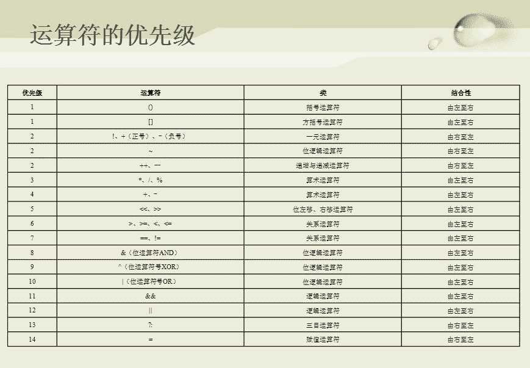

# 京东 2014 研发工程师校招笔试题

## 1

链表不具备的特点是

正确答案: A   你的答案: 空 (错误)

```cpp
可随机访问任何一个元素
```

```cpp
插入，删除操作不需要移动元素
```

```cpp
无需事先估计存储空间大小
```

```cpp
所欲存储空间可以是不连续的
```

本题知识点

链表 *讨论

[放开我](https://www.nowcoder.com/profile/470355)

链表不 可随机访问任何一个元素，数组可以直接通过下边访问，链表只能通过遍历形式。所以不能随机访问。

发表于 2016-05-10 11:10:12

* * *

[小田向前冲](https://www.nowcoder.com/profile/614243)

A 链表缺点就是无法随机访问。

发表于 2016-05-10 19:33:30

* * *

[小丫小丫](https://www.nowcoder.com/profile/784862)

```cpp
单链表采用链式存储结构，用一组任意的存储单元来存放线性表的元素，存储空间可以连续也可以不连续。单链表的读取需要从第一个节点开始进行遍历，时间复杂度为 O(n),其删除与插入动作不需要移动元素，仅需要指针间的赋值即可。
```

发表于 2015-09-16 15:47:10

* * *

## 2

在一个单链表中，若删除 P 所指结点的后续结点，则执行?

正确答案: C   你的答案: 空 (错误)

```cpp
p = p->next；p->next = p->next->next;
```

```cpp
p->next = p->next;
```

```cpp
p->next = p->next->next;
```

```cpp
p = p->next->next
```

本题知识点

链表 *讨论

[Sailfishc](https://www.nowcoder.com/profile/777602)

p->next 相当于指向了下一个元素，p->next->next 就是指指向了第二个元素，将其赋值给 p->next，说明删除了 p 的后续节点。

发表于 2015-10-05 20:40:41

* * *

[小丫小丫](https://www.nowcoder.com/profile/784862)

Cp->next=p->next->next;或者假设 p 节点的后续节点为 q，则 q=p->next, p->next=q->next;

发表于 2015-09-16 15:51:15

* * *

[幼儿源](https://www.nowcoder.com/profile/9055878)

恍恍惚惚以为 P 是 P 节点

发表于 2017-07-03 15:38:36

* * *

## 3

将一棵二叉树的根节点放入队列，然后将队头元素出队，将出队结点所有子节点入队，递归执行上述操作。以上操作可以实现哪种遍历

正确答案: D   你的答案: 空 (错误)

```cpp
前序遍历
```

```cpp
中序遍历
```

```cpp
后序遍历
```

```cpp
层序遍历
```

本题知识点

树

讨论

[接下来的路才真正的开始](https://www.nowcoder.com/profile/581074)

前序，中序，后序遍历的非递归遍历利用栈。深度优先搜索通过栈来实现，而广度优先（层序遍历）搜索通过队列来实现。

发表于 2016-04-04 21:13:33

* * *

[追！](https://www.nowcoder.com/profile/223974)

d 以满二叉树为例先是根节点出队     根节点的两个孩子入队        两个孩子出队 每个孩子的两个孩子入队        四个孩子入队  每个孩子的两个孩子入队一层一层的加入队列

发表于 2016-01-28 02:27:36

* * *

[InGodWeTrust](https://www.nowcoder.com/profile/2178882)

题目用到队列了说明是广度优先遍历，即选层次遍历。

发表于 2017-04-07 10:52:18

* * *

## 4

设一课完全二叉树共有 999 个结点，则在该二叉树中的叶节点个数是？

正确答案: B   你的答案: 空 (错误)

```cpp
499
```

```cpp
500
```

```cpp
501
```

```cpp
不唯一
```

本题知识点

树 哔哩哔哩 2021

讨论

[七分熟](https://www.nowcoder.com/profile/131985)

n0+n1+n2=999,n2=n0-1,2*n0-1+n1=999,因为为完全二叉树 n1 只可能为 1 或者 0，若为 1，n0 不是整数，则只可能为 0，求得 n0=500

发表于 2015-09-16 09:41:52

* * *

[smilepoint](https://www.nowcoder.com/profile/522620)

选 5002⁹-1<999<2¹⁰-1，所以二叉树有 10 层，其中前 9 层有 2⁹-1 个结点，第十层有 999-（2⁹-1）=488 个结点，所以第 9 层的 244 个结点有孩子结点，12 个结点没孩子结点，所以叶结点有 488+12=500 个

发表于 2015-09-16 21:01:13

* * *

[陋室](https://www.nowcoder.com/profile/716156)

其实完全二叉树有这个性质，最后一个节点/2 就得到他的父节点了，而此时的父节点必然是最后一个父节点，也就是说他之后的结点都是叶子节点了所以叶子节点为，999-999/2 = 500.要懂得运用性质，不然题目的完全二叉树是干啥的。

发表于 2015-09-16 21:44:55

* * *

## 5

以下哪种排序算法对(1,3,2,4,5,6,7,8,9)进行的排序最快？

正确答案: A   你的答案: 空 (错误)

```cpp
冒泡
```

```cpp
快排
```

```cpp
归并
```

```cpp
堆排
```

本题知识点

排序 *讨论

[bairuiworld](https://www.nowcoder.com/profile/137553)

  查看全部)

编辑于 2016-03-23 10:42:20

* * *

[thfeng](https://www.nowcoder.com/profile/970691)

若记录的初始状态已经按关键码基本有序，则选用直接插入排序或冒泡排序发为宜

发表于 2016-07-17 09:59:59

* * *

[木目光](https://www.nowcoder.com/profile/897293)

void Bubble_1 ( int r[], int n) {      int i= n -1;  //初始时,最后位置保持不变      while ( i> 0) {          int pos= 0; //每趟开始时,无记录交换          for (int j= 0; j< i; j++)              if (r[j]> r[j+1]) {                  pos= j; //记录交换的位置                  int tmp = r[j]; r[j]=r[j+1];r[j+1]=tmp;              }          i= pos; //为下一趟排序作准备       }  }    使用改进冒泡算法，速度最快。每趟排序记录下最后一次交换的位置。

发表于 2016-03-25 21:19:06

* * *

## 6

一条 SQL 语句中，group by 子句应位于什么位置

正确答案: B   你的答案: 空 (错误)

```cpp
在 where 子句关键字之前
```

```cpp
在 where 子句之后
```

```cpp
在 from 关键字之前
```

```cpp
在 order by 子句之后
```

本题知识点

数据库 京东

讨论

[reste51](https://www.nowcoder.com/profile/202514)

  查看全部)

编辑于 2015-02-06 11:44:38

* * *

[张佃鹏](https://www.nowcoder.com/profile/851149)

select 的执行顺序为：from where group having order by limit

发表于 2015-09-01 18:18:04

* * *

[zhaoying](https://www.nowcoder.com/profile/316866)

SELECT select_list
[ INTO new_table ]
FROM table_source
[ WHERE search_condition ]
[ GROUP BY group_by_expression ]
[ HAVING search_condition ]
[ ORDER BY order_expression [ ASC | DESC ] ]
SQL Select 语句完整的执行顺序：
1、from 子句组装来自不同数据源的数据；
2、where 子句基于指定的条件对记录行进行筛选；
3、group by 子句将数据划分为多个分组；
4、使用[聚集函数](https://www.baidu.com/s?wd=%E8%81%9A%E9%9B%86%E5%87%BD%E6%95%B0&tn=44039180_cpr&fenlei=mv6quAkxTZn0IZRqIHckPjm4nH00T1Y4nvfvnyFhuW6sm1TdP1b10ZwV5Hcvrjm3rH6sPfKWUMw85HfYnjn4nH6sgvPsT6KdThsqpZwYTjCEQLGCpyw9Uz4Bmy-bIi4WUvYETgN-TLwGUv3EnWR1njmkrHbY)进行计算；
5、使用 having 子句筛选分组；
6、计算所有的表达式；
7、使用 order by 对结果集进行排序。
8、select 集合输出。

发表于 2016-04-12 16:10:03

* * *

## 7

选择合适字母 ： CFI DHL EJ_

正确答案: D   你的答案: 空 (错误)

```cpp
N
```

```cpp
P
```

```cpp
H
```

```cpp
O
```

本题知识点

数学运算

讨论

[能发光的黛 _Funny](https://www.nowcoder.com/profile/955330)

CFIDHLEJ_ 纵向看 ：第一列：C->D->E 第二列：F(G)->H(I)->J 第三列：I(JK)->L(MN)->O

发表于 2015-09-15 23:03:37

* * *

[시간](https://www.nowcoder.com/profile/918719)

D    DFI(在字母表中的次序是 3 6 9）DHL（4 8 12）EJ（5 10）后面应是次序是 15 的字母即 O

发表于 2015-09-16 11:44:28

* * *

[AzureRay](https://www.nowcoder.com/profile/626317)

原来是智力题。。我也是醉了。。以为是不认识的语言呢 哈哈哈 C D EF(G)H(I)JI(JK)L(MN)O

发表于 2015-09-18 15:25:07

* * *

## 8

一个以“.java”为后缀的源文件

正确答案: C   你的答案: 空 (错误)

```cpp
只能包含一个 public 类，类名必须与文件名相同
```

```cpp
只能包含与文件名相同的 public 类以及其中的内部类
```

```cpp
只能有一个与文件名相同的 public 类，可以包含其他非 public 类（不考虑内部类）
```

```cpp
可以包含任意 public 类
```

本题知识点

Java

讨论

[Magic 图](https://www.nowcoder.com/profile/956471)

C    .java 文  查看全部)

编辑于 2015-12-10 18:22:45

* * *

[W 的幻想](https://www.nowcoder.com/profile/6156044)

我选 A 错了，没有考虑内部类，内部类是可以 public 修饰的，所以不只有一个 public 类

发表于 2017-10-02 11:36:13

* * *

[中华小菜鸟](https://www.nowcoder.com/profile/798916)

这题目严重有问题：A“必须”说的太死了，肯定不对；B“只能”说的太死了，肯定不对；C 对倒是对，但是必须这样说只能有一个与文件名相同的 public 修饰的类,...；D 可以包含任意类，貌似也没错呀，关键还是在于 public 修饰。

发表于 2015-12-10 17:00:43

* * *

## 9

在上下文和头文件正常的情况下，代码

```cpp
System.out.println(10%3*2);
```

将打印？

正确答案: B   你的答案: 空 (错误)

```cpp
1
```

```cpp
2
```

```cpp
4
```

```cpp
6
```

本题知识点

Java C 语言

讨论

[十字黑白](https://www.nowcoder.com/profile/269049)

B%和*是同一个优先级  查看全部)

编辑于 2015-12-06 16:51:27

* * *

[柳忆辰](https://www.nowcoder.com/profile/584929)



发表于 2016-05-05 20:59:39

* * *

[我是祖国的花朵](https://www.nowcoder.com/profile/5459305)

有人和我一样不知道 10%3=1 的吗？

发表于 2016-10-12 10:44:36

* * *

## 10

下面函数将返回？

```cpp
public static int func (){
    try{
        return 1;
    }catch (Exception e){
        return 2;
    }finally{
        return 3;
    }
}
```

正确答案: C   你的答案: 空 (错误)

```cpp
1
```

```cpp
2
```

```cpp
3
```

```cpp
编译错误
```

本题知识点

Java

讨论

[一心想飞的笨鸟](https://www.nowcoder.com/profile/5460202)

finally 一定会执行的，有两种情况:    1.finally 中有 return 语句，当 try 执行到 return 时会执行 finally 中的代码，其中有 return 就直接返回了，如题，返回值为 3.
    2.finally 中不含 return 语句，那么当执行到 return 时，它会被保存等待 finally 执行完毕后返回，这个时候无论 finally 内部如何改变这个值，都不会影响返回结果！如:

```cpp
int i = 0 ;
	int test(){
		try {
			return i;
		} catch (Exception e) {
			return -1;
		}finally{
			i++;
		}
	}
//input: 0
```

发表于 2016-08-01 16:48:40

* * *

[梦远方](https://www.nowcoder.com/profile/504034)

记住：无论如何 finally 语句都要执行就会这个题了 finally 语句在 try 或 catch 中的 return 语句执行之后返回之前执行且 finally 里的修改语句不能影响 try 或 catch 中 return 已经确定的返回值，若 finally 里也有 return 语句则覆盖 try 或 catch 中的 return 语句直接返回。（同学们可以踊跃探讨哦）

编辑于 2015-09-19 12:02:27

* * *

[黑，，，？？?](https://www.nowcoder.com/profile/663723)

Try catch finally 获取异常错误的结构，try 中有两种情况： 1.try 中没有异常时，但是有 return 等跳转语句，这样会引发程序控制流离开当前的 try,自动完成 finally 中资源的释放。 2try 中有异常时，catch 在获取到异常之前，进行 finally 执行，接着执行 catch 中的语句。 由于本题中的 finally 中有 return 语句，将 try 中的 return 语句覆盖，程序直接跳出。

发表于 2015-10-06 21:12:36

* * ****