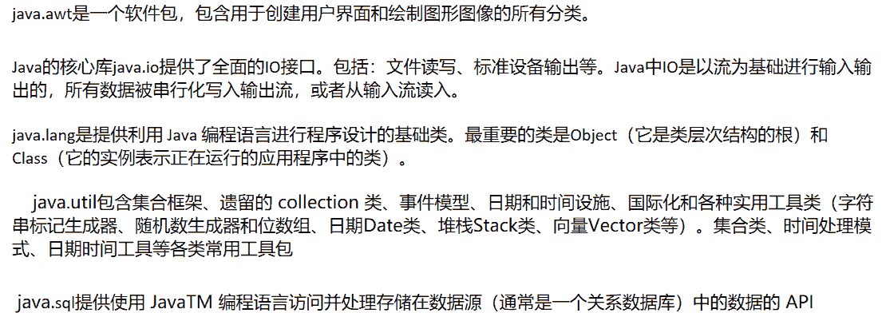
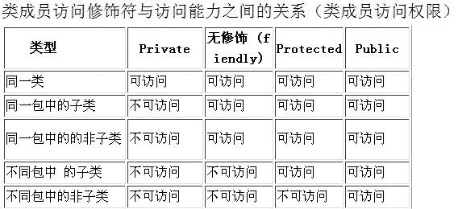
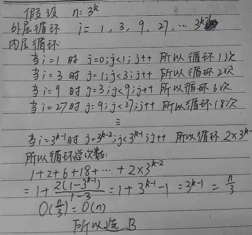

# 新浪微博 2015 校园招聘 java 研发工程师笔试题

## 1

提供 java 存取数据库能力的包是（）

正确答案: A   你的答案: 空 (错误)

```cpp
java.sql
```

```cpp
java.db;
```

```cpp
java.lang
```

```cpp
java.util
```

本题知识点

Java Java 工程师 微博 2015

讨论

[yql](https://www.nowcoder.com/profile/566442)

java.lang   提供利用 Java 编程语言进行程序设计的基础类 java.sql 提供使用 JavaTM 编程语言访问并处理存储在数据源（通常是一个关系数据库）中的数据的 API。 java.util 包含 collection 框架、遗留的 collection 类、事件模型、日期和时间设施、国际化和各种实用工具类（字符串标记生成器、随机数生成器和位数组）。 B 中  没有 java.db 包

发表于 2015-09-17 09:28:39

* * *

[碎碎物语](https://www.nowcoder.com/profile/4293890)

**java.awt****是一个软件包，包含用于创建用户界面和绘制图形图像的所有分类。**

**Java****的核心库****java.io****提供了全面的****IO****接口。包括：文件读写、标准设备输出等。****Java****中****IO****是以流为基础进行输入输出的，所有数据被串行化写入输出流，或者从输入流读入。**

**java.lang****是提供利用** **Java** **编程语言进行程序设计的基础类。最重要的类是****Object****（它是类层次结构的根）和** **Class****（它的实例表示正在运行的应用程序中的类）。**

**java.util 包含集合框架、遗留的 collection 类、事件模型、日期和时间设施、国际化和各种实用工具类（字符串标记生成器、随机数生成器和位数组、日期 Date 类、堆栈 Stack 类、向量 Vector 类等）。集合类、时间处理模式、日期时间工具等各类常用工具包**

**java****.sql****提供使用 JavaTM 编程语言访问并处理存储在数据源（通常是一个关系数据库）中的数据的 API**



发表于 2017-10-26 20:36:24

* * *

[zhisheng_blog](https://www.nowcoder.com/profile/616717)

A    存取数据库能力的

发表于 2016-01-08 09:25:07

* * *

## 2

关于异常处理机制的叙述正确的是（）

正确答案: C   你的答案: 空 (错误)

```cpp
catch 部分捕捉到异常情况时，才会执行 finally 部分
```

```cpp
当 try 区段的程序发生异常时，才会执行 finally 部分
```

```cpp
当 try 区段不论程序是否发生错误及捕捉到异常情况，都会执行 finally 部分
```

```cpp
以上都是
```

本题知识点

Java Java 工程师 微博 2015

讨论

[蜗牛小小影](https://www.nowcoder.com/profile/474521)

**在 Java 语言的异常处理中，finally 块的作用就是为了保证无论出现什么情况，finally 块里的代码一定会执行。****由于程序执行 return 就意味着结束了对当前函数的调用并跳出这个函数体，因此任何语句执行都要放在 return 前执行（除非碰到 exit 函数），因此 finally 块里面的函数也是在 return 前执行的。****如果 try-finally 或者 catch-finally 中都有 return 语句，那么 finally 中的 return 语句会覆盖别处的，最终返回到调用者那里的是 finally 中的 return 值。**

发表于 2015-10-07 17:30:02

* * *

[kkk_123](https://www.nowcoder.com/profile/872256)

finally 中的代码是无论如何都会执行的。另外再说下，如果抛出异常，并且在 catch 中有 return 语句，这个 return 语句会先执行，执行之后将结果保存在缓存中。再去查看是否有 finally，如果有 finally 就先执行 finally 语句，之后再返回缓存中的 return 值。如果 finally 中也有 return，那么 finally 中的 return 会覆盖掉之前缓存的 return，即最终会返回 finally 中的值。

发表于 2017-01-16 11:09:51

* * *

[半纸流年](https://www.nowcoder.com/profile/710504)

try(....){
}catch(....){
}finally(...){
}
t 满足 try 的条件的执行 try 后面花括号的语句
不满足，被 catch 中语句捕获到的执行 catch 花括号的语句
没有被 catch 捕获到或者 catch 执行完毕后和 try 执行完毕后都要执行 finally 中的语句

发表于 2015-10-07 16:50:59

* * *

## 3

在类设计中，类的成员变量要求仅仅能够被同一 package 下的类访问，请问应该使用下列哪个修饰词（）

正确答案: D   你的答案: 空 (错误)

```cpp
protected
```

```cpp
public
```

```cpp
private
```

```cpp
不需要任何修饰词
```

本题知识点

Java Java 工程师 微博 2015

讨论

[陋室](https://www.nowcoder.com/profile/716156)

访问修饰符权限如下所示：


编辑于 2016-10-21 11:08:31

* * *

[yql](https://www.nowcoder.com/profile/566442)

    public  private   不用说。都知道    而 default 和 protected 老有人记不住。           只要记住 protected 一个特点是只要子类都能访问，不管在不在一个包。 

发表于 2015-09-17 09:31:13

* * *

[半纸流年](https://www.nowcoder.com/profile/710504)

private 使用范围仅限本类中
protected 使用范围为含继承关系的类中（子类可以使用父类）
什么都不写叫友好类，默认是本包中
public 特别随意，包内包外，类内类外都可访问

发表于 2015-10-07 16:57:00

* * *

## 4

有如下一段程序：

```cpp
public class Test{ 
    private static int i=1;
    public int getNext(){ 
         return i++;
    } 
    public static void main(String [] args){ 
        Test test=new Test(); 
        Test testObject=new Test(); 
        test.getNext(); 
        testObject.getNext(); 
        System.out.println(testObject.getNext()); 
    } 
}
```

请问最后打印出来的是什么？（）

正确答案: B   你的答案: 空 (错误)

```cpp
2
```

```cpp
3
```

```cpp
4
```

```cpp
5
```

本题知识点

Java Java 工程师 微博 2015

讨论

[小丫小丫](https://www.nowcoder.com/profile/784862)

return i++, 先返  查看全部)

编辑于 2015-12-16 14:30:32

* * *

[牛客 303136 号](https://www.nowcoder.com/profile/303136)

该题主要考察的是 static 属性和 i++操作。因为 i 是 static 的，是类属性，所以不管有多少对象，都共用的一个变量。这里 getNext()方法被调用了三次，所以进行了三次 i++操作。但是由于 getNext()操作的返回是：return i++; i++是先返回，后++，所以在 println 是，已经返回了 i(此时 i 为 3)，再进行自增的，所以这里结果为 3

发表于 2016-04-03 14:51:48

* * *

[kusya](https://www.nowcoder.com/profile/269933)

*   **return i++** 比较特殊，先是 return i；然后 i++。
*   **return i=i+** **1** 则不同，它是先让 i=i+1，再 return。

发表于 2015-12-26 17:20:51

* * *

## 5

有这样一段程序：

```cpp
public class Test{ 
    public static void main(String [] args){ 
        List list=new ArrayList(); 
        list.add("a");
        list.add("b");
        list.add("a");
        Set set=new HashSet(); 
        set.add("a"); 
        set.add("b"); 
        set.add("a"); 
        System.out.println(list.size()+","+set.size()); 
    } 
}
```

请问运行主要的程序会打印出的是什么（）

正确答案: C   你的答案: 空 (错误)

```cpp
2,2
```

```cpp
2,3
```

```cpp
3,2
```

```cpp
3,3
```

本题知识点

Java Java 工程师 微博 2015

讨论

[陋室](https://www.nowcoder.com/profile/716156)

C 题目出错了，可  查看全部)

编辑于 2015-12-06 17:07:03

* * *

[牛客 7635688 号](https://www.nowcoder.com/profile/7635688)

list 有序可重复，set 无序不可重复

发表于 2016-09-27 13:19:11

* * *

[半纸流年](https://www.nowcoder.com/profile/710504)

HashSet 不能添加重复的元素，当调用 add（Object）方法时候，
首先会调用 Object 的 hashCode 方法判 hashCode 是否已经存在，如不存在则直接插入元素；
如果已存在则调用 Object 对象的 equals 方法判断是否返回 true， 如果为 true 则说明元素已经存在，如为 false 则插入元素

发表于 2015-10-07 20:12:28

* * *

## 6

对于一个已经不被任何变量引用的对象，当垃圾回收器准备回收该对象所占用的内存时，将自动调用该对象的哪个方法（）

正确答案: A   你的答案: 空 (错误)

```cpp
finalize
```

```cpp
notify
```

```cpp
notifyAll
```

```cpp
hashCode
```

本题知识点

Java Java 工程师 微博 2015

讨论

[徒步单独 007](https://www.nowcoder.com/profile/828772)

垃圾回收过程中的对象销毁–Finalization

就在移除一个对象并回收它的内存空间之前，Java 垃圾回收器将会调用各个实例的 finalize()方法，这样实例对象就有机会可以释放掉它占用的资源。尽管 finalize()方法是保证在回收内存空间之前执行的，但是对具体的执行时间和执行顺序是没有任何保证的。多个实例之间的 finalize()执行顺序是不能提前预知的，甚至有可能它们是并行执行的。程序不应该预先假设实例执行 finalize()的方法，也不应该使用 finalize()方法来回收资源。

*   在 finalize 过程中抛出的任何异常都默认被忽略掉了，同时对象的销毁过程被取消
*   JVM 规范并没有讨论关于弱引用的垃圾回收，这是明确声明的。具体的细节留给实现者决定。
*   垃圾回收是由守护进程执行的

发表于 2015-09-17 00:56:13

* * *

[Firefly_Lee](https://www.nowcoder.com/profile/8255584)

这个主要考察答题者是否了解 **GC 对不可用对象的判断过程**，大家不要只是去了解 finalize()方法，这样容易感到迷惑，如果这个题答不上来，最好还是去了解一下 GC 对哪些内存进行了回收以及对不可用对象的判断。

下面是 “ GC 对哪些内存进行了回收 ” 的一个简单的回答：

gc 是对不可用的对象进行回收，判断一个对象是否不可用采用的是可达性分析算法，具体的做法就是：从“GC Roots”开始，向下搜索，如果从 GC Roots 到某个对象不可达，那么这个对象就是不可用的，会被判定为是可回收的对象。

不过这些对象也不是立即就会被回收，真正宣告一个对象死亡需要至少经历两次标记过程。

*   在通过可达性分析后发现某个对象没有和 GC Roots 相连接的引用链，那么这个对象会被第一次标记并且进行一次筛选。
    *   筛选的条件是：该对象是否需要执行 finalize()方法
        *   如果该对象没有覆盖 finalize()方法 or finalize()方法已被虚拟机调用过，则无需执行 finalize()方法。
        *   否则，需要执行 finalize()方法
            *   在执行 finalize()方法中该对象可以进行自救，即尝试将自己与引用链上任何一个对象建立关联（比如将自己赋值给某个类变量 or 对象的成员变量）
                *   如果自救成功，在第二次标记时，该对象将从“即将回收”的集合中被移出。
                *   如果自救失败，那么基本上这个对象就会真的被回收。

发表于 2018-04-17 12:29:33

* * *

[七。小 H](https://www.nowcoder.com/profile/374941)

在 Java 虚拟机的垃圾回收器看来，堆区中的每个对象都可能处于以下三个状态之一。
 可触及状态：当一个对象（假定为 Sample 对象）被创建后，只要程序中还有引用变量引用它，那么它就始终处于可触及状态。
 可复活状态：当程序不再有任何引用变量引用 Sample 对象时，它就进入可复活状态。在这个状态中，垃圾回收器会准备释放它占用的内存，在释放之前，会调用它及其他处于可复活状态的对象的 finalize()方法，这些 finalize()方法有可能使 Sample 对象重新转到可触及状态。
 不可触及状态：当 Java 虚拟机执行完所有可复活对象的 finalize()方法后，假如这些方法都没有使 Sample 对象转到可触及状态，那么 Sample 对象就进入不可触及状态。只有当对象处于不可触及状态时，垃圾回收器才会真正回收它占用的内存。

notify 唤醒线程，与 wait()和同步锁 synchronized()方法配合使用

发表于 2015-10-13 22:16:41

* * *

## 7

有这么一段程序：

```cpp
public class Test{ 
    public String name="abc"; 
    public static void main(String[] args){ 
        Test test=new Test(); 
        Test testB=new Test(); 
        System.out.println(test.equals(testB)+","+test.name.equals(testB.name)); 
    } 
}
```

请问以上程序执行的结果是（）

正确答案: C   你的答案: 空 (错误)

```cpp
true,true
```

```cpp
true,false
```

```cpp
false,true
```

```cpp
false,false
```

本题知识点

Java Java 工程师 微博 2015

讨论

[yql](https://www.nowcoder.com/profile/566442)

```cpp
 public boolean equals(Object obj) {
        return (this == obj);
    }

```

Object 中 euqals 的源码如上。没有重写 equals 时，是直接用==判断的，而 String 中重写了 equals 方法。

编辑于 2015-09-17 09:39:34

* * *

[Limbom](https://www.nowcoder.com/profile/773327)

equals 没重写时候和==一样，比较的是对象的地址，题中 new 了两个对象，所以各自地址不一样，使用 equals 比较为 false，但是 string 类型中的 equals 方法 Java 默认重写了，可以比较对象里的值；两个对象指向的同一个 string 成员变量里的值相同，所以 eqauals 比较也相同。

发表于 2016-05-12 08:58:49

* * *

[helloMyJava](https://www.nowcoder.com/profile/3290286)

euqals 和==都比较的是地址。只有 String 的 equals 重写了，比较内容。

发表于 2016-08-10 22:21:17

* * *

## 8

(7<<1)&15 运算后的结果是()

正确答案: B   你的答案: 空 (错误)

```cpp
15
```

```cpp
14
```

```cpp
8
```

```cpp
7
```

本题知识点

编译和体系结构

讨论

[星陨无痕](https://www.nowcoder.com/profile/436939)

答案选择 B 的过程首先计  查看全部)

编辑于 2016-01-12 13:51:05

* * *

[sunshine193](https://www.nowcoder.com/profile/2551444)

7<<1 表示左移动，7 为 111 向左移动一位为 1110，与 15(1111)做与运算，结果为 1110，换成 10 进制数为 14，所以选 14

发表于 2017-04-07 09:08:28

* * *

[炫](https://www.nowcoder.com/profile/376795)

7 的二进制为 111，执行 7<<1 就变成了 1110,15 的二进制为 1111，两者进行按位与运算得 1110，转换成 10 进制就是 14

发表于 2016-01-12 13:16:59

* * *

## 9

如果有 n 个节点用二叉树来存储，那么二叉树的最小深度为()

正确答案: A   你的答案: 空 (错误)

```cpp
Log2(n+1)
```

```cpp
Log2(n)
```

```cpp
Log2(n-1)
```

```cpp
n/2
```

本题知识点

树 Java 工程师 微博 2015

讨论

[啥](https://www.nowcoder.com/profile/811262)

A
完全二叉树满足，深度  查看全部)

编辑于 2016-01-21 11:54:58

* * *

[offer 在哪里啊 offer 在哪里](https://www.nowcoder.com/profile/850019)

严格意义上 A 答案应该加上向上取整符号才对，否则正确的答案应该是 1+log[2] N

发表于 2016-02-22 22:03:36

* * *

[星陨无痕](https://www.nowcoder.com/profile/436939)

答案选择 An 节点的二叉树，既然深度最小，那么就应该是完全二叉树了；完全二叉树的高度计算节点和高度的关系是 2^n-1;反转过来通过节点求高度，那么就是 log2(n+1)了。另外自己用实际数算也可以，三个节点的完全二叉树高度是 2。。遥想当年计算选择题的方法。。答案往里代数。

发表于 2015-09-17 06:46:18

* * *

## 10

下面程序的时间复杂度是

```cpp
for(int i=1;i<n;i*=3)             
   for(int j=i/3;j<i;j++){             
        Foo();                   
}
```

已知 n 是一个正数，Foo()时间复杂度为 0(1),上述代码的时间复杂度是（）

正确答案: B   你的答案: 空 (错误)

```cpp
O(logn)
```

```cpp
O(n)
```

```cpp
O(n*log(n))
```

```cpp
O(n²)
```

本题知识点

复杂度

讨论

[晓宇大美女~](https://www.nowcoder.com/profile/790486)



编辑于 2016-04-13 20:32:01

* * *

[searchcoding](https://www.nowcoder.com/profile/967)

Bi=1 时，j=1/3=0,执行 1 次,j 取 0i=3 时，j=1;j<i;执行 2 次，j 取 1,2i=9 时：j=3，j 取[3,8],执行 6 次总结：从 i 每次乘 3，但 j 是初始化为 i/3，可以理解为 j 是从上一轮循环的 i 开始执行内循环，直到 j 为当前 i-1;内外层合在一起就是 for(i=0;i<n;i++){    foo();
}

发表于 2016-01-25 11:57:47

* * *

[blnik](https://www.nowcoder.com/profile/306846)

外层循环，i 的变化大概是 1 ,3 ,9,27 ,…… n（假设 n=3^k，这个不影响复杂度的分析）内部循环，j 从 i/3 到 i，每次+1，大概需要比较的次数就是 2i/3，那就是 2/3( 1, 3, 9 ,27 ,……,n) sum（内部循环次数）=(3^(k+1)-1)/3 =(3n-1)/3  所以是 O(n)

发表于 2015-10-11 15:54:53

* * *

## 11

下列关于数据库执行 SQL 语句的操作步骤描述正确的是（）

正确答案: D   你的答案: 空 (错误)

```cpp
解析并编译 SQL 语句
```

```cpp
确定并优化数据获取路径
```

```cpp
执行 SQL，获取并返回数据
```

```cpp
以上都正确
```

本题知识点

数据库 Java 工程师 微博 2015

讨论

[Gavin1994](https://www.nowcoder.com/profile/962041)

sql 语句本质上就好比一个 java 文件，都是要经历**先解析编译后，处理优化，最后执行返回结果** 的过程

发表于 2015-09-22 11:42:45

* * *

[牛客 7635688 号](https://www.nowcoder.com/profile/7635688)

分析 SQL 语句，搜索 SGA 池中是否有相同的语句，，，检查语法是否有误，，，分析的过程中给对象加锁，，，生成执行计划，，，，给变量赋值，，，执行语句，，，获取数据并返回

发表于 2016-09-30 12:32:03

* * *

[唐飞 dream](https://www.nowcoder.com/profile/677030)

数据库 sql 语句执行过程解析--绑定--执行--提取

发表于 2016-05-02 18:16:15

* * *

## 12

关于 PreparedStatement 与 Statement 描述错误的是（）

正确答案: D   你的答案: 空 (错误)

```cpp
一般而言，PreparedStatement 比 Statement 执行效率更高
```

```cpp
PreparedStatement 会预编译 SQL 语句
```

```cpp
Statement 每次都会解析/编译 SQL，确立并优化数据获取路径
```

```cpp
Statement 执行扫描的结果集比 PreparedStatement 大
```

本题知识点

Java 数据库 Java 工程师 微博 2015

讨论

[yoghourt](https://www.nowcoder.com/profile/507803)

1:创建时的区别： 
  查看全部)

编辑于 2016-03-24 15:10:59

* * *

[Circle&Z](https://www.nowcoder.com/profile/476805)

1 、 PreparedStatement 接口继承 Statement ， PreparedStatement 实例包含已编译的 SQL 语句，所以其执行速度要快于 Statement 对象。

2 、作为 Statement 的子类， PreparedStatement 继承了 Statement 的所有功能。三种方法

      execute 、 executeQuery 和 executeUpdate 已被更改以使之不再需要参数

3 、在 JDBC 应用中 , 如果你已经是稍有水平开发者 , 你就应该始终以 PreparedStatement 代替

      Statement. 也就是说 , 在任何时候都不要使用 Statement.

基于以下的原因 :

一 . 代码的可读性和可维护性 .

虽然用 PreparedStatement 来代替 Statement 会使代码多出几行 , 但这样的代码无论从可读性还是可维护性上来说 . 都比直接用 Statement 的代码高很多档次 :

stmt.executeUpdate("insert into tb_name (col1,col2,col2,col4) values ('"+var1+"','"+var2+"',"+var3+",'"+var4+"')");//stmt 是 Statement 对象实例

perstmt = con.prepareStatement("insert into tb_name (col1,col2,col2,col4) values (?,?,?,?)");

perstmt.setString(1,var1);

perstmt.setString(2,var2);

perstmt.setString(3,var3);

perstmt.setString(4,var4);

perstmt.executeUpdate(); //prestmt 是 PreparedStatement 对象实例

不用我多说 , 对于第一种方法 . 别说其他人去读你的代码 , 就是你自己过一段时间再去读 , 都会觉得伤心 .

PreparedStatement 尽最大可能提高性能 .

 语句在被 DB 的编译器编译后的执行代码被缓存下来 , 那么下次调用时只要是相同的预编译语句就不需要编译 , 只要将参数直接传入编译过的语句执行代码中 ( 相当于一个涵数 ) 就会得到执行 . 这并不是说只有一个 Connection 中多次执行的预编译语句被缓存 , 而是对于整个 DB 中 , 只要预编译的语句语法和缓存中匹配 . 那么在任何时候就可以不需要再次编译而可以直接执行 . 而 statement 的语句中 , 即使是相同一操作 , 而由于每次操作的数据不同所以使整个语句相匹配的机会极小 , 几乎不太可能匹配 . 比如 :

insert into tb_name (col1,col2) values ('11','22');

insert into tb_name (col1,col2) values ('11','23');

即使是相同操作但因为数据内容不一样 , 所以整个个语句本身不能匹配 , 没有缓存语句的意义 . 事实是没有数据库会对普通语句编译后的执行代码缓存 .

当然并不是所以预编译语句都一定会被缓存 , 数据库本身会用一种策略 , 比如使用频度等因素来决定什么时候不再缓存已有的预编译结果 . 以保存有更多的空间存储新的预编译语句 .

三 . 最重要的一点是极大地提高了安全性 .

即使到目前为止 , 仍有一些人连基本的恶义 SQL 语法都不知道 .

String sql = "select * from tb_name where name= '"+varname+"' and passwd='"+varpasswd+"'";

如果我们把 [' or '1' = '1] 作为 varpasswd 传入进来 . 用户名随意 , 看看会成为什么 ?

select * from tb_name = ' 随意 ' and passwd = '' or '1' = '1';

因为 '1'='1' 肯定成立 , 所以可以任何通过验证 . 更有甚者 :

把 [';drop table tb_name;] 作为 varpasswd 传入进来 , 则 :

select * from tb_name = ' 随意 ' and passwd = '';drop table tb_name; 有些数据库是不会让你成功的 , 但也有很多数据库就可以使这些语句得到执行 .

而如果你使用预编译语句 . 你传入的任何内容就不会和原来的语句发生任何匹配的关系 . 只要全使用预编译语句 , 你就用不着对传入的数据做任何过虑 . 而如果使用普通的 statement, 有可能要对 drop,; 等做费尽心机的判断和过虑 .

发表于 2015-12-21 09:12:22

* * *

[半纸流年](https://www.nowcoder.com/profile/710504)

因为 PreparedStatement 有预编译的过程，所以第一次扫描的集合
PreparedStatement 会大于等于 Statement

发表于 2015-10-07 22:39:11

* * *