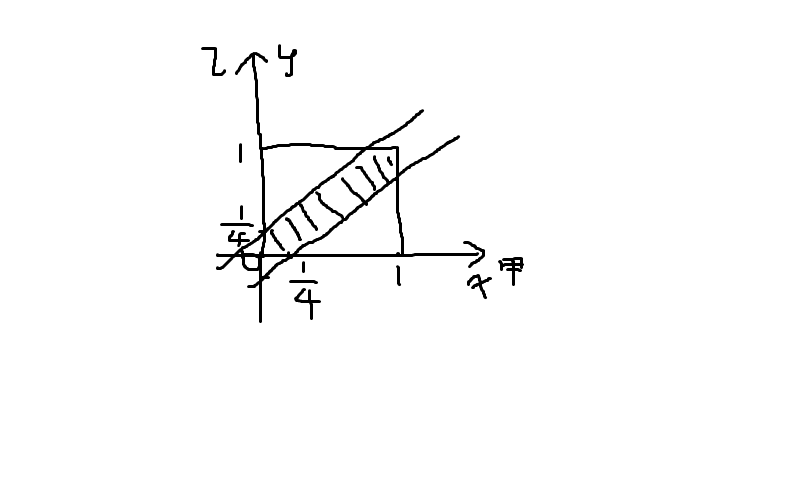
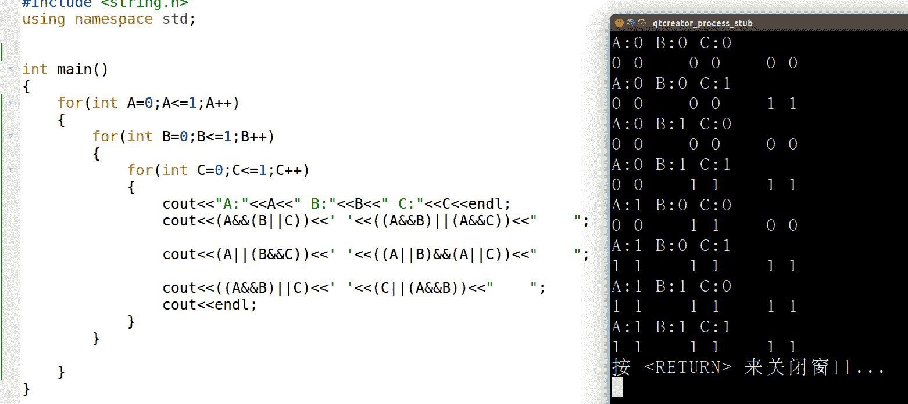
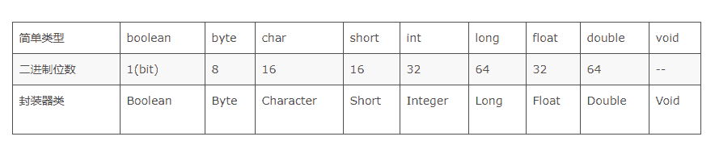
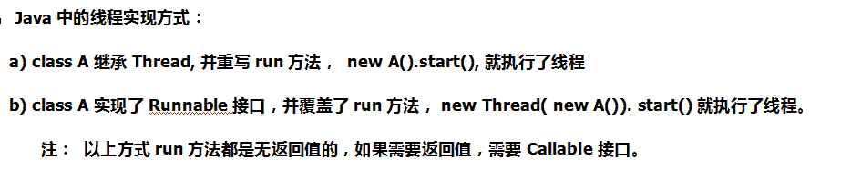
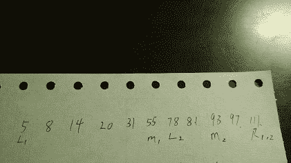
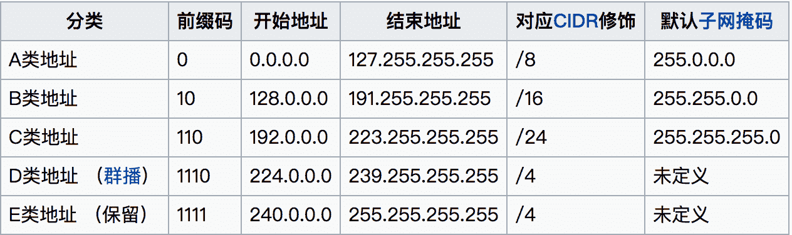
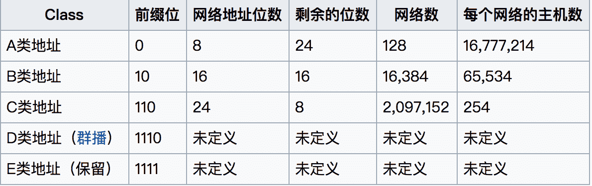
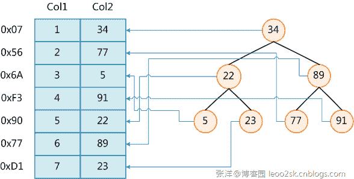
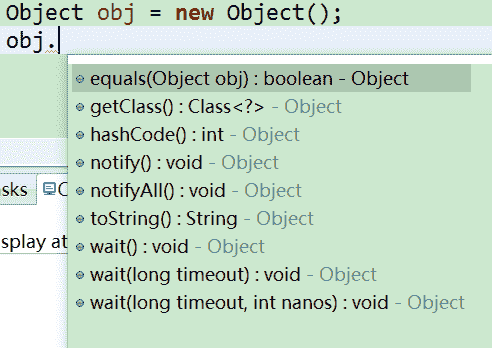
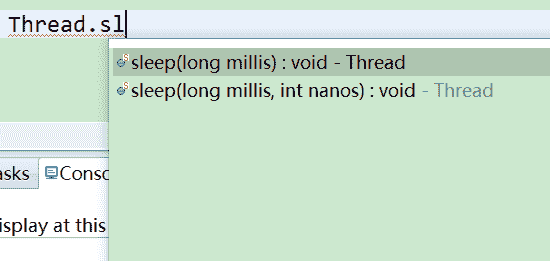

# 凤凰网 2015 校园招聘研发工程师笔试

## 1

观察如下序列：J14，L16，()，P20，R22，......，请选出位于 L16 和 P20 之间的元素（）

正确答案: B   你的答案: 空 (错误)

```cpp
S24;
```

```cpp
N18;
```

```cpp
M18;
```

```cpp
T24;
```

本题知识点

数学运算

讨论

[小月亮](https://www.nowcoder.com/profile/713537)

选 BJ14，L16，()，P20，R22，相邻数字相差 2，所以括号填 18，JKLMNOPQR 由字母排序可知字母选 N 所以最合适的答案是 N18.

发表于 2015-09-17 20:15:15

* * *

[CHEN 嘉豪](https://www.nowcoder.com/profile/945839)

答案是 B，因为字母排序下去是相隔一个然后输出，而数字就是相隔两个数值就输出；

发表于 2015-09-18 23:04:29

* * *

[牛客 960639486 号](https://www.nowcoder.com/profile/960639486)

服了 字母表背错了 我以为 nm

发表于 2022-02-28 21:00:46

* * *

## 2

甲和乙打算一起去某地参加活动，预先越好在某路口汇合，假定两人最终都会在下午两点到三点之间到达该路口（具体何时到达，服从均匀分布），且先到的一方会待在路口等待另一方，但最多不超过十五分钟，那么他们最终能一起出发去参加活动的概率最接近下面哪个数值。

正确答案: B   你的答案: 空 (错误)

```cpp
20%
```

```cpp
45%
```

```cpp
50%
```

```cpp
70%
```

本题知识点

数学运算

讨论

[小丫小丫](https://www.nowcoder.com/profile/784862)

题目可以转化为求阴影面积占正方形面积的百分比，其实是 7/16~45% 

发表于 2015-09-17 11:40:46

* * *

[戁以置信的眷恋](https://www.nowcoder.com/profile/7218846)

甲等不到的几率为 3/4 乙等不到的几率为 3/4 双方都等不到的几率为 9/16 则双方都等到的几率为 7/16 ≈ 45%

发表于 2018-05-14 15:21:01

* * *

[牛客菜鸟](https://www.nowcoder.com/profile/131246)

```cpp
|y-x|<=1/4（0<x<1,0<y<1）即可保证两者能够一起去，画几何图求面积即可
```

发表于 2015-09-20 16:15:51

* * *

## 3

如果 A,B,C 为布尔型变量，“^”和“v”分别代表布尔类型的“与”和“或”，下面那一项是正确的（）

> I.A^(BvC)=(A^B)v(A^C)II.Av(B^C)=(AvB)^(AvC)III.(B^A)vC=Cv(A^B)

正确答案: D   你的答案: 空 (错误)

```cpp
只有 I
```

```cpp
只有 II
```

```cpp
只有 I 和 II
```

```cpp
I,II,III；
```

本题知识点

C++ C 语言

讨论

[hestyle](https://www.nowcoder.com/profile/126329220)

我觉得这道题有点问题，比如 A∧B 在值上会等于 B∧A，但是可能半生的效果确实不同的，假如 A、B 均为操作语句，且 A 真 B 假，在 B∧A 由于 B 为假，此时判断“短路”结束，并不会执行 A。

发表于 2018-07-07 17:57:02

* * *

[ybf](https://www.nowcoder.com/profile/6241441)



发表于 2018-07-20 15:03:54

* * *

[方一鸣](https://www.nowcoder.com/profile/427525)

弱智

发表于 2016-07-12 13:12:04

* * *

## 4

下面哪个指针表达式可以用来引用数组元素 a[i][j][k][l]()

正确答案: B   你的答案: 空 (错误)

```cpp
(((a+i)+j)+k)+l)
```

```cpp
*(*(*(*(a+i)+j)+k)+l)
```

```cpp
(((a+i)+j)+k+l)
```

```cpp
((a+i)+j+k+l)
```

本题知识点

C++ C 语言

讨论

[已注销](https://www.nowcoder.com/profile/2862122)

a:整个四维数组的地址*(a+i) = a[i] *(a+i)+j = a[i] +j*((a+i)+j) = a[i][j]*((a+i)+j)+k =  a[i][j]+k*( *((a+i)+j)+k ) = a[i][j][k]*( *((a+i)+j)+k )+l =  a[i][j][k]+l***(** ***(** ***((a+i)+j)+k** **)+l** **) = a[i][j][k][l], 选项 B 少了*和（）****不管多少维，按照这个思路，不会差**

发表于 2016-08-28 15:40:12

* * *

[Pandora](https://www.nowcoder.com/profile/266279)

**知识点：**1、操作符 * 既可以用来声明一个指针变量，也可以用作**指针的取值**。2、**除了**一维数组，其他高维数组都有 a=*a，表示数组的首地址。而在一维数组 int a[N]中，a 代表数组首地址，*a 代表数组第一个元素的值。维度太高不好理解，以数组 int a[i+1][j+1]二维数组为例。如何取得最后一个元素 a[i][j]的值？a=*a，即该数组的首地址，亦即第 0 行的首地址（如果要取第 0 行的第 0 个元素，即 a[0][0]，可用**a），*(a+i)表示第 i 行首地址，*(a+i)+j 第 i 行第 j 列的地址。而*表示引用地址的存储内容。故*(*(a+i)+j)表示 i 行 j 列的元素取值。所以更高维同理。

发表于 2015-09-17 16:33:40

* * *

[牛壮壮](https://www.nowcoder.com/profile/764544521)

a:整个四维数组的地址*(a+i) = a[i] *(a+i)+j = a[i] +j*((a+i)+j) = a[i][j]*((a+i)+j)+k =  a[i][j]+k*( *((a+i)+j)+k ) = a[i][j][k]*( *((a+i)+j)+k )+l =  a[i][j][k]+l***(** ***(** ***((a+i)+j)+k** **)+l** **) = a[i][j][k][l], 选项 B 少了*和（）****不管多少维，按照这个思路，不会差**

发表于 2021-08-29 19:33:16

* * *

## 5

根据下面递归函数：调用函数 Fun（2），返回值是多少（）

```cpp
int Fun(int n)          
{ 
    if(n==5)     
        return 2;        
    else        
        return 2*Fun(n+1);           
}
```

正确答案: D   你的答案: 空 (错误)

```cpp
2
```

```cpp
4
```

```cpp
8
```

```cpp
16
```

本题知识点

C++

讨论

[小匆](https://www.nowcoder.com/profile/767870)

16 , 这题考函数的递归调用。F(2) = 2*F(3) = 2*2*F(4) = 2*2*2*F(5) = 2*2*2*2 = 16  [ 看加粗部分, F(3)推理出 2*F(4) , 后面同理 , 最后 F(5)为 2 ]。

编辑于 2016-05-30 15:36:18

* * *

[老黑 NO1](https://www.nowcoder.com/profile/730771)

这他妈选 A 吧

发表于 2016-03-18 17:17:19

* * *

[君子可欺以其方](https://www.nowcoder.com/profile/772533691)

赶紧给把 3+1 算成 5 的自己一巴掌。

发表于 2018-11-07 10:29:15

* * *

## 6

对于 java 类型变量 char c,short s,float f,double d,表达式 c*s+f+d 的结果类型为（）

正确答案: D   你的答案: 空 (错误)

```cpp
float
```

```cpp
char
```

```cpp
short
```

```cpp
double
```

本题知识点

Java

讨论

[菜鸟葫芦娃](https://www.nowcoder.com/profile/415611)

自动类型转换遵循下面的规则：  查看全部)

编辑于 2016-11-05 14:21:34

* * *

[bbblemon](https://www.nowcoder.com/profile/3807435)

**选 D（高票的图有问题）****基本数据类型的运算，会自动向上转型。boolean 不可以和其他基本数据类型相互转换。****byte->short,char -> int -> long      ****float -> double****int -> float****long -> double**

编辑于 2018-07-06 09:14:44

* * *

[无杀飞机](https://www.nowcoder.com/profile/3851652)

char 2 字节 short 2 字节 float 4 字节 double 8 字节往精度高的转

发表于 2016-11-08 15:21:16

* * *

## 7

java 中下面哪个能创建并启动线程（）

```cpp
public class MyRunnable implements Runnable { 
     public void run() { 
         //some code here 
     } 
 }
```

正确答案: C   你的答案: 空 (错误)

```cpp
new Runnable(MyRunnable).start()
```

```cpp
new Thread(MyRunnable).run()
```

```cpp
new Thread(new MyRunnable()).start()
```

```cpp
new MyRunnable().start()
```

本题知识点

Java

讨论

[美团校招内推直达](https://www.nowcoder.com/profile/458054)

**C 正确****首先：**创建并启动  查看全部)

编辑于 2016-02-26 13:43:58

* * *

[请叫我猿叔叔](https://www.nowcoder.com/profile/6316247)



发表于 2016-08-10 21:50:14

* * *

[专业码农](https://www.nowcoder.com/profile/704252)

这道题选 Cstart 为线程启动函数，排除 B；MyRunnable 类必须实例化，排除 A；必须新建一个 Thread 类来启动线程。选 C

发表于 2015-09-17 12:49:44

* * *

## 8

栈底至栈顶一次存放 A,B,C,D 四个元素，在第五个元素 E 入栈前，栈中元素可以出栈，则出栈序列可能是（）

正确答案: C   你的答案: 空 (错误)

```cpp
ABCDE
```

```cpp
DECAB
```

```cpp
DCEBA
```

```cpp
CDEAB
```

本题知识点

栈 *讨论

[牛客 592744 号](https://www.nowcoder.com/profile/592744)

A 明显不对啊，都说 ABCD 一次放入栈里面了，A 怎么能先出来呢，除非题目意思是依次放入，在每次放入时前面的元素也可以出栈

编辑于 2015-09-20 20:19:38

* * *

[挥着牛鞭的男孩](https://www.nowcoder.com/profile/825762)

坑爹 QAQ

发表于 2016-08-03 08:30:49

* * *

[棉花汤](https://www.nowcoder.com/profile/438714)

要仔细读题，不然会觉得 AC 都对的

发表于 2016-07-01 11:37:38

* * *

## 9

在深度为 6 的满二叉树中，共有多少个结点（）

正确答案: C   你的答案: 空 (错误)

```cpp
60
```

```cpp
61
```

```cpp
63
```

```cpp
64
```

本题知识点

树

讨论

[JackieLee](https://www.nowcoder.com/profile/509193)

这里没说根节点的深度是多少，我看到有些书写根节点的深度为 0，这样的话这里答案就是 127 了，这里把根节点的深度当 1 了。。。

发表于 2016-05-25 00:51:39

* * *

[Pandora](https://www.nowcoder.com/profile/266279)

深度为 h 的二叉树最多有 2^h-1 个结点(h>=1)，最少有 h 个结点。

发表于 2015-09-17 17:00:12

* * *

[hyhappy](https://www.nowcoder.com/profile/522349)

不该注意一下二叉树最多结点数为 2 的高度次-1 吗，而高度等于深度加一

发表于 2016-05-01 20:10:15

* * *

## 10

设有一组关键字序列{5,8,14,20,31,55,78,81,93,97,111}，使用二分（折半）法查找关键字 93 需要进行多少次比较？

正确答案: A   你的答案: 空 (错误)

```cpp
2
```

```cpp
3
```

```cpp
4
```

```cpp
5
```

本题知识点

查找 *讨论

[菜鸟葫芦娃](https://www.nowcoder.com/profile/415611)

A5,8,14,20,  查看全部)

编辑于 2015-12-10 13:06:37

* * *

[灰色节能 _ 聪](https://www.nowcoder.com/profile/722809)



发表于 2015-12-09 21:00:49

* * *

[SVz](https://www.nowcoder.com/profile/2153071)

难道不加上一次左右判断?

发表于 2017-04-20 11:55:17

* * *

## 11

下面哪种排序的平均比较次数最少（）

正确答案: D   你的答案: 空 (错误)

```cpp
插入排序
```

```cpp
选择排序
```

```cpp
堆排序
```

```cpp
快速排序
```

本题知识点

排序 *讨论

[Pandora](https://www.nowcoder.com/profile/266279)

上图。虽然平均情况下快排和堆  查看全部)

编辑于 2016-03-13 01:13:38

* * *

[细雨湿身](https://www.nowcoder.com/profile/736416)

快排平均：T(n)=2T(n/2)+n  ==>> T(n)=nlog(n)      堆排序平均：每次下滤，两个儿子比较，然后与父亲比较，因为一般下滤 logn 层，每次共比较 2logn，所以 n*2logn

发表于 2016-10-09 15:43:33

* * *

[CodeMan](https://www.nowcoder.com/profile/960273)

肯定是 D 啊！ [`blog.csdn.net/zhangyifei521/article/details/50381728`](http://blog.csdn.net/zhangyifei521/article/details/50381728)因为堆排序需要构建堆，所以比较次数是要多于快速排序的！

发表于 2016-03-17 22:09:50

* * *

## 12

下面哪个协议被用来找到本地设备的硬件地址（）

正确答案: B   你的答案: 空 (错误)

```cpp
RARP
```

```cpp
ARP
```

```cpp
IP
```

```cpp
IMCP
```

本题知识点

网络基础

讨论

[CoffeeT](https://www.nowcoder.com/profile/152348)

地址解析协议， 即 ARP （Address Resolution Protocol） 是根据 IP 地址获取物理地址的一个 TCP/IP 协议。 [主机](http://baike.baidu.com/view/23880.htm) 发送信息时将包含目标 IP 地址的 ARP 请求广播到网络上的所有主机，并接收返回消息，以此确定目标的物理地址；收到返回消息后将该 IP 地址和物理地址存入本机 ARP 缓存中并保留一定时间，下次请求时直接查询 ARP 缓存以节约资源。

发表于 2015-09-17 15:19:49

* * *

[哈哈李](https://www.nowcoder.com/profile/856518)

ARP 地址解析协议。通过广播 arp 协议，来得到自己的硬件地址

发表于 2015-09-17 15:31:16

* * *

[舒意意 123](https://www.nowcoder.com/profile/1973064)

ARP:IP 到 MAC RARP 刚好相反，为逆地址解析协议。

发表于 2017-04-08 09:34:06

* * *

## 13

IP 地址中的哪个类默认有最多可用的主机地址（）

正确答案: A   你的答案: 空 (错误)

```cpp
A
```

```cpp
B
```

```cpp
C
```

```cpp
A 和 B
```

本题知识点

网络基础

讨论

[CoffeeT](https://www.nowcoder.com/profile/152348)

A 类地址 8bit 网络号 + 24bit 主机号 B 类地址 16bit 网络号 + 16bit 主机号 C 类地址 24bit 网络号 + 8bit 主机号 D 类地址 多播地址 E 类地址 保留

发表于 2015-09-17 15:17:31

* * *

[lwenkun](https://www.nowcoder.com/profile/860854)

按道理是根据 **可用网络号 * 每个网络下的可用主机号** 的大小判断，但是 A 占了一半，就不用想了

（维基百科）

编辑于 2017-04-04 12:50:16

* * *

[牛客 192546 号](https://www.nowcoder.com/profile/192546)

A  因为网络号最短

发表于 2015-09-17 13:43:34

* * *

## 14

假设某就绪队列中有 10 个进程，以时间片轮流方式进行进程调度，如果系统时间片为 100ms，CPU 进行进程切换需要 20ms，则系统开销所占的比率约为（）

正确答案: C   你的答案: 空 (错误)

```cpp
2%
```

```cpp
10%
```

```cpp
20%
```

```cpp
50%
```

本题知识点

编译和体系结构

讨论

[t^t999999](https://www.nowcoder.com/profile/995406)

每个进程分得的系统时间片为 100ms，开销所占比率应该是总切换代价/(总切换代价+总时间片) = 10 * 20 / (10 * 20 + 10 * 100)约为 0.2

发表于 2015-09-17 12:56:48

* * *

[Double_k](https://www.nowcoder.com/profile/122986)

这和多少个线程没啥关系吧，20/(100+20) 就得出一个时间片中多少时间被消耗掉

发表于 2015-09-17 15:45:08

* * *

[Siiruo Wong](https://www.nowcoder.com/profile/621767)

20/100=20%

发表于 2016-08-29 16:09:37

* * *

## 15

假设某一虚拟存储系统采用先进先出（FIFO）页面淘汰算法，有一个进程在内存中占 3 页（开始时内存为空），当访问如下页面序列号后 1,2,3,1,2,4,2,3,5,3,4,5 会产生几次缺页

正确答案: B   你的答案: 空 (错误)

```cpp
4
```

```cpp
5
```

```cpp
6
```

```cpp
7
```

本题知识点

编译和体系结构

讨论

[RQ](https://www.nowcoder.com/profile/888763)

| 1 | 2 | 3 | 1 | 2 | 4 | 2 | 3 | 5 | 3 | 4 | 5 |
| 1 | 1 | 1 |   |   | 4 |   |   | 4 |   |   |   |
|   | 2 | 2 |   |   | 2 |   |   | 5 |   |   |   |
|   |   | 3 |   |   | 3 |   |   | 3 |   |   |   |
| 缺页 | 缺页 | 缺页 |   |   | 缺页 |   |   | 缺页 |   |   |   |

发表于 2015-09-17 12:56:00

* * *

[20190716092877](https://www.nowcoder.com/profile/755609122)

缺页就是你访问内存中这个数据,该数据不存在,然后就是报缺页,然后把这个数据存放进来,如果内存已满,那么先进先出,先放进来的先移出去腾出空间
第一次访问 1,内存里什么没有,访问 1 报缺页,把 1 放进来 !
第二次访问 2,内存里有 1,访问 2 报缺页,把 2 放进来 !
第三次访问 3,内存里有 1,2,访问 3 报缺页,把 3 放进来 !
第四次访问 1,内存里有 1,2,3,不报缺页
第五次访问 2,内存里有 1,2,3,不报缺页
第六次访问 4,内存里没有 4,报缺页,把 1 移出,放进 4 !
第七次访问 2.内存里有 2,3,4,不报缺页
第八次访问 3,内存里有 2,3,4,不报缺页
第九次访问 5,内存里没 5 ,报缺页,把 2 移出,把 5 放进来 !
第十次访问 3,内存里有 3,4,5,不报缺页
第十次访问 4,内存里有 3,4,5,不报缺页
第十次访问 5,内存里有 3,4,5,不报缺页

发表于 2019-08-20 18:15:40

* * *

[nwhasd](https://www.nowcoder.com/profile/181639)

| 缺页 | M1 | M2 | M3 |
| Y | 1 |   |   |
| Y | 1 | 2 |   |
| Y | 1 | 2 | 3 |
| N | 1 | 2 | 3 |
| N | 1 | 2 | 3 |
| Y | 2 | 3 | 4 |
| N | 2 | 3 | 4 |
| N | 2 | 3 | 4 |
| Y | 3 | 4 | 5 |
| N | 3 | 4 | 5 |
| N | 3 | 4 | 5 |
| N | 3 | 4 | 5 |

编辑于 2015-09-17 12:53:01

* * *

## 16

在 oracle 中，下面哪个 SQL 命令用来向表中添加列（）

正确答案: D   你的答案: 空 (错误)

```cpp
MODIFY TABLE TableName ADD COLUMN ColumnName
```

```cpp
MODIFY TABLE TableName ADD ColumnName
```

```cpp
ALTER TABLE TableName ADD COLUMN ColumnName
```

```cpp
ALTER TABLE TableName ADD ColumnName Type
```

本题知识点

数据库

讨论

[Pandora](https://www.nowcoder.com/profile/266279)

e.g.,增加列： **al**  查看全部)

编辑于 2016-10-29 23:46:22

* * *

[龙虾姐夫](https://www.nowcoder.com/profile/6974930)

老容易搞混，特地查了一下 modify,alter,update 的区别：

```cpp
modify:修改字段类型和长度的（即修改字段的属性）。
alter:修改表的数据结构（modify 是 alter 的一种用法）。
update：修改数据内容的。
```

发表于 2016-09-07 17:32:56

* * *

[hehehaha](https://www.nowcoder.com/profile/180856)

MODIFY 是用来改变表列性质；ADD 是增加列；用法：ALTER TABLE 表名 MODIFY（列名，列的性质（新））；MODIFY 和 ADD 使用时都要用到修改命令 ALTER.

发表于 2015-10-06 14:56:36

* * *

## 17

下列哪个不是存储过程的好处（）

正确答案: C   你的答案: 空 (错误)

```cpp
更加安全
```

```cpp
SQL 优化
```

```cpp
增加网络流量
```

```cpp
重复使用
```

本题知识点

数据库

讨论

[lyrie](https://www.nowcoder.com/profile/805638)

1、执行速度更快 ，在数据库中保存的存储过程语句都是编译过的 2、允许模块化程序设计，类似方法的复用 3、提高系统的安全性，防止 SQL 注入 4、 减少网络流通量，只需要传输存储过程的名称

发表于 2015-10-10 16:43:02

* * *

[我是一只啥也不会的猪](https://www.nowcoder.com/profile/231467306)

1\. 运行速度：对于很简单的 sql，存储过程没有什么优势。对于复杂的业务逻辑，因为在存储过程创建的时候，数据库已经对其进行了一次解析和优化。存储过程一旦执行，在内存中就会保留一份这个存储过程，这样下次再执行同样的存储过程时，可以从内存中直接调用，所以执行速度会比普通 sql 快。    

2\.  减少网络传输：存储过程直接就在数据库服务器上跑，所有的数据访问都在数据库服务器内部进行，不需要传输数据到其它服务器，所以会减少一定的网络传输。但是在存储过程中没有多次数据交互，那么实际上网络传输量和直接 sql 是一样的。而且我们的应用服务器通常与数据库是在同一内网，大数据的访问的瓶颈会是硬盘的速度，而不是网速。

3\. 可维护性：的存储过程有些时候比程序更容易维护，这是因为可以实时更新 DB 端的存储过程。  有些 bug，直接改存储过程里的业务逻辑，就搞定了。 

4. 增强安全性：提高代码安全，防止 SQL 注入。这一点 sql 语句也可以做到。

5. 可扩展性：应用程序和数据库操作分开，独立进行，而不是相互在一起。方便以后的扩展和 DBA 维护优化。

发表于 2021-08-19 21:38:22

* * *

[TPU-Lee](https://www.nowcoder.com/profile/257118)

        A、 存储过程允许标准组件式编程

        B、 存储过程能够实现较快的执行速度

        C、 存储过程减轻网络流量

        D、 存储过程可被作为一种安全机制来充分利用

发表于 2015-09-17 15:55:43

* * *

## 18

下列对于数据库索引的说法一定是错误的（）

正确答案: B   你的答案: 空 (错误)

```cpp
索引可以提升查询，分组和排序的性能
```

```cpp
索引不会影响表的更新、插入和删除操作的效率
```

```cpp
全表扫描不一定比使用索引的执行效率低
```

```cpp
对于只有很少数据值的列，不应该创建索引
```

本题知识点

数据库

讨论

[砚南](https://www.nowcoder.com/profile/408607)

**说白了，索引问题就是一个查找问题。。。**

**数据库索引** ，是数据库管理系统中 一个排序的数据结构 ，以协助快速查询、更新数据库表中数据。 **索引的实现通常使用 B 树及其变种 B+树** 。

在数据之外，数据库系统还维护着满足特定查找算法的数据结构，这些数据结构以某种方式引用（指向）数据，这样就可以在这些数据结构上实现高级查找算法。这种数据结构，就是索引。

为表设置索引要付出代价的： 一是增加了数据库的存储空间 ， 二是在插入和修改数据时要花费较多的时间(因为索引也要随之变动) 。



上图展示了一种可能的索引方式。左边是数据表，一共有两列七条记录，最左边的是数据记录的物理地址（注意逻辑上相邻的记录在磁盘上也并不是一定物理相邻的）。为了加快 Col2 的查找，可以维护一个右边所示的二叉查找树，每个节点分别包含索引键值和一个指向对应数据记录物理地址的指针，这样就可以运用二叉查找在 O(log [2] n)的复杂度内获取到相应数据。

创建索引可以大大提高系统的性能。

第一，通过创建唯一性索引，可以保证数据库表中每一行数据的唯一性。

第二，可以大大加快数据的检索速度，这也是创建索引的最主要的原因。

第三，可以加速表和表之间的连接，特别是在实现数据的参考完整性方面特别有意义。

第四，在使用分组和排序子句进行数据检索时，同样可以显著减少查询中分组和排序的时间。

第五，通过使用索引，可以在查询的过程中，使用优化隐藏器，提高系统的性能。 

也许会有人要问：增加索引有如此多的优点，为什么不对表中的每一个列创建一个索引呢？因为，增加索引也有许多不利的方面。

第一，创建索引和维护索引要耗费时间，这种时间随着数据量的增加而增加。

第二，索引需要占物理空间，除了数据表占数据空间之外，每一个索引还要占一定的物理空间，如果要建立聚簇索引，那么需要的空间就会更大。

第三，当对表中的数据进行增加、删除和修改的时候，索引也要动态的维护，这样就降低了数据的维护速度。

索引是建立在数据库表中的某些列的上面。在创建索引的时候，应该考虑在哪些列上可以创建索引，在哪些列上不能创建索引。 **一般来说，应该在这些列上创建索引：** 在经常需要搜索的列上，可以加快搜索的速度；在作为主键的列上，强制该列的唯一性和组织表中数据的排列结构；在经常用在连接的列上，这些列主要是一些外键，可以加快连接的速度；在经常需要根据范围进行搜索的列上创建索引，因为索引已经排序，其指定的范围是连续的；在经常需要排序的列上创建索引，因为索引已经排序，这样查询可以利用索引的排序，加快排序查询时间；在经常使用在 WHERE 子句中的列上面创建索引，加快条件的判断速度。

同样，对于有些列不应该创建索引。 **一般来说，不应该创建索引的的这些列具有下列特点：**

第一，对于那些在查询中很少使用或者参考的列不应该创建索引。这是因为，既然这些列很少使用到，因此有索引或者无索引，并不能提高查询速度。相反，由于增加了索引，反而降低了系统的维护速度和增大了空间需求。

第二，对于那些只有很少数据值的列也不应该增加索引。这是因为，由于这些列的取值很少，例如人事表的性别列，在查询的结果中，结果集的数据行占了表中数据行的很大比例，即需要在表中搜索的数据行的比例很大。增加索引，并不能明显加快检索速度。

第三，对于那些定义为 text, image 和 bit 数据类型的列不应该增加索引。这是因为，这些列的数据量要么相当大，要么取值很少。

第四，当修改性能远远大于检索性能时，不应该创建索引。这是因为， **修改性能和检索性能是互相矛盾的** 。当增加索引时，会提高检索性能，但是会降低修改性能。当减少索引时，会提高修改性能，降低检索性能。因此，当修改性能远远大于检索性能时，不应该创建索引。

根据数据库的功能，可以在数据库设计器中创建三种索引： **唯一索引、主键索引和聚集索引** 。

**唯一索引**    

唯一索引是不允许其中任何两行具有相同索引值的索引。

当现有数据中存在重复的键值时，大多数数据库不允许将新创建的唯一索引与表一起保存。数据库还可能防止添加将在表中创建重复键值的新数据。例如，如果在 employee 表中职员的姓(lname)上创建了唯一索引，则任何两个员工都不能同姓。

**主键索引**

数据库表经常有一列或列组合，其值唯一标识表中的每一行。该列称为表的主键。

在数据库关系图中为表定义主键将自动创建主键索引，主键索引是唯一索引的特定类型。该索引要求主键中的每个值都唯一。当在查询中使用主键索引时，它还允许对数据的快速访问。

**聚集索引**

在聚集索引中，表中行的物理顺序与键值的逻辑（索引）顺序相同。一个表只能包含一个聚集索引。

如果某索引不是聚集索引，则表中行的物理顺序与键值的逻辑顺序不匹配。与非聚集索引相比，聚集索引通常提供更快的数据访问速度。

**局部性原理与磁盘预读**

由于存储介质的特性，磁盘本身存取就比主存慢很多，再加上机械运动耗费，磁盘的存取速度往往是主存的几百分分之一，因此为了提高效率，要尽量减少磁盘 I/O。为了达到这个目的，磁盘往往不是严格按需读取，而是每次都会预读，即使只需要一个字节，磁盘也会从这个位置开始，顺序向后读取一定长度的数据放入内存。这样做的理论依据是计算机科学中著名的 **局部性原理** ： **当一个数据被用到时，其附近的数据也通常会马上被使用。程序运行期间所需要的数据通常比较集中。**

由于磁盘顺序读取的效率很高（不需要寻道时间，只需很少的旋转时间），因此对于具有局部性的程序来说，预读可以提高 I/O 效率。

预读的长度一般为页（page）的整倍数。页是计算机管理存储器的逻辑块，硬件及操作系统往往将主存和磁盘存储区分割为连续的大小相等的块，每个存储块称为一页（在许多操作系统中，页得大小通常为 4k），主存和磁盘以页为单位交换数据。当程序要读取的数据不在主存中时，会触发一个缺页异常，此时系统会向磁盘发出读盘信号，磁盘会找到数据的起始位置并向后连续读取一页或几页载入内存中，然后异常返回，程序继续运行。

**B-/+Tree 索引的性能分析**

到这里终于可以分析 B-/+Tree 索引的性能了。

上文说过一般使用磁盘 I/O 次数评价索引结构的优劣。先从 B-Tree 分析，根据 B-Tree 的定义，可知检索一次最多需要访问 h 个节点。数据库系统的设计者巧妙利用了磁盘预读原理，将一个节点的大小设为等于一个页，这样每个节点只需要一次 I/O 就可以完全载入。为了达到这个目的，在实际实现 B-Tree 还需要使用如下技巧：

每次新建节点时，直接申请一个页的空间，这样就保证一个节点物理上也存储在一个页里，加之计算机存储分配都是按页对齐的，就实现了一个 node 只需一次 I/O。

**B-Tree 中一次检索最多需要 h-1 次 I/O（根节点常驻内存），渐进复杂度为 O(h)=O(log** **[d]** **N)。** 一般实际应用中，出度 d 是非常大的数字，通常超过 100，因此 h 非常小（通常不超过 3）。

而红黑树这种结构，h 明显要深的多。由于逻辑上很近的节点（父子）物理上可能很远，无法利用局部性，所以红黑树的 I/O 渐进复杂度也为 O(h)，效率明显比 B-Tree 差很多。

**综上所述，用 B-Tree 作为索引结构效率是非常高的。**

**应该花时间学习 B-树和 B+树数据结构**

=============================================================================================================

1）B 树

B 树中每个节点包含了键值和键值对于的数据对象存放地址指针，所以成功搜索一个对象可以不用到达树的叶节点。

成功搜索包括节点内搜索和沿某一路径的搜索，成功搜索时间取决于关键码所在的层次以及节点内关键码的数量。

在 B 树中查找给定关键字的方法是：首先把根结点取来，在根结点所包含的关键字 K1,…,kj 查找给定的关键字（可用顺序查找或二分查找法），若找到等于给定值的关键字，则查找成功；否则，一定可以确定要查的关键字在某个 Ki 或 Ki+1 之间，于是取 Pi 所指的下一层索引节点块继续查找，直到找到，或指针 Pi 为空时查找失败。

2）B+树

B+树非叶节点中存放的关键码并不指示数据对象的地址指针，非也节点只是索引部分。所有的叶节点在同一层上，包含了全部关键码和相应数据对象的存放地址指针，且叶节点按关键码从小到大顺序链接。如果实际数据对象按加入的顺序存储而不是按关键码次数存储的话，叶节点的索引必须是稠密索引，若实际数据存储按关键码次序存放的话，叶节点索引时稀疏索引。

B+树有 2 个头指针，一个是树的根节点，一个是最小关键码的叶节点。

所以 B+树有两种搜索方法：

一种是按叶节点自己拉起的链表顺序搜索。

一种是从根节点开始搜索，和 B 树类似，不过如果非叶节点的关键码等于给定值，搜索并不停止，而是继续沿右指针，一直查到叶节点上的关键码。所以无论搜索是否成功，都将走完树的所有层。

B+ 树中，数据对象的插入和删除仅在叶节点上进行。

这两种处理索引的数据结构的不同之处：  a，B 树中同一键值不会出现多次，并且它有可能出现在叶结点，也有可能出现在非叶结点中。而 B+树的键一定会出现在叶结点中，并且有可能在非叶结点中也有可能重复出现，以维持 B+树的平衡。  b，因为 B 树键位置不定，且在整个树结构中只出现一次，虽然可以节省存储空间，但使得在插入、删除操作复杂度明显增加。B+树相比来说是一种较好的折中。  c，B 树的查询效率与键在树中的位置有关，最大时间复杂度与 B+树相同(在叶结点的时候)，最小时间复杂度为 1(在根结点的时候)。而 B+树的时候复杂度对某建成的树是固定的。

发表于 2016-11-10 16:04:31

* * *

[TPU-Lee](https://www.nowcoder.com/profile/257118)

当对表中的数据进行增加、删除和修改的时候，索引也要动态的维护，这样就降低了数据的维护速度。

发表于 2015-09-17 15:57:53

* * *

[青山崖野](https://www.nowcoder.com/profile/7614806)

索引属于静态查找，若对表插入删除操作，需要动态维护

发表于 2017-07-06 22:07:32

* * *

## 19

java 中关于继承的描述正确的是（）

正确答案: A C D   你的答案: 空 (错误)

```cpp
一个子类只能继承一个父类
```

```cpp
子类可以继承父类的构造方法
```

```cpp
继承具有传递性
```

```cpp
父类一般具有通用性，子类更具体
```

本题知识点

Java

讨论

[冰封无痕](https://www.nowcoder.com/profile/266593)

子类不可以继承父类的构造方法，只可以调用父类的构造方法。子类中所有的构造函数都会默认访问父类中的空参数构造函数，这是因为子类的构造函数内第一行都有默认的 super（）语句。super（）表示子类在初始化时调用父类的空参数的构造函数来完成初始化。一个类都会有默认的空参数的构造函数，若指定了带参构造函数，那么默认的空参数的构造函数，就不存在了。这时如果子类的构造函数有默认的 super（）语句，那么就会出现错误，因为父类中没有空参数的构造函数。因此，在子类中默认 super（）语句，在父类中无对应的构造函数，必须在子类的构造函数中通过 this 或 super（参数）指定要访问的父类中的构造函数。

编辑于 2016-09-06 00:00:54

* * *

[smartleon](https://www.nowcoder.com/profile/485266)

答案：ACD 在 java 中，子类构造器会默认调用 super()(无论构造器中是否写有 super（）),用于初始化父类成员，同时当父类中存在有参构造器时，必须提供无参构造器，子类构造器中并不会自动继承有参构造器，仍然默认调用 super()，使用无参构造器。因此，一个类想要被继承必须提供无参构造器。**PS：方法没有继承一说，只有重载和重写**

编辑于 2015-11-04 20:39:22

* * *

[Zzzxf](https://www.nowcoder.com/profile/541328)

在 java 中，子类构造器会默认调用 super()(无论构造器中是否写有 super（）),用于初始化父类成员，同时当父类中存在有参构造器时，必须提供无参构造器，子类构造器中并不会自动继承有参构造器，仍然默认调用 super()，使用无参构造器。因此，一个类想要被继承必须提供无参构造器。

发表于 2015-09-17 15:02:33

* * *

## 20

java 中下面哪些是 Object 类的方法（）

正确答案: A B D   你的答案: 空 (错误)

```cpp
notify()
```

```cpp
notifyAll()
```

```cpp
sleep()
```

```cpp
wait()
```

本题知识点

Java

讨论

[专业码农](https://www.nowcoder.com/profile/704252)

A,B,D 在根类 Object 中包含一下方法： 
 1.  clone();
2.  equals();
3.  finalize();
4.  getClass();[align=left][/align]
5.  notify(),notifyAll();
6.  hashCode();
7.  toString();
8.  wait(); 

发表于 2015-09-17 13:11:56

* * *

[小牛快跑 233](https://www.nowcoder.com/profile/414929)

**Object 的方法****Sleep 是 Thread 的类方法**

编辑于 2016-08-04 01:02:10

* * *

[双丝网千千结](https://www.nowcoder.com/profile/999260)

Object 类中方法：protected Object clone()创建并返回此对象的一个副本。 boolean equals(Object obj)指示其他某个对象是否与此对象“相等”。 
protected void finalize()当垃圾回收器确定不存在对该对象的更多引用时，由对象的垃圾回收器调用此方法。 
class  getClass()返回此 Object 的运行时类。 
int hashCode()返回该对象的哈希码值。 
void notify()唤醒在此对象监视器上等待的单个线程。 
void notifyAll()唤醒在此对象监视器上等待的所有线程。 
String toString()返回该对象的字符串表示。 
void wait()在其他线程调用此对象的 notify() 方法或 notifyAll() 方法前，导致当前线程等待。 
void wait(long timeout)在其他线程调用此对象的 notify() 方法或 notifyAll() 方法，或者超过指定的时间量前，导致当前线程等待。 
void wait(long timeout, int nanos)在其他线程调用此对象的 notify() 方法或 notifyAll() 方法，或者其他某个线程中断当前线程，或者已超过某个实际时间量前，导致当前线程等待。

发表于 2016-05-19 15:58:46

* * ****