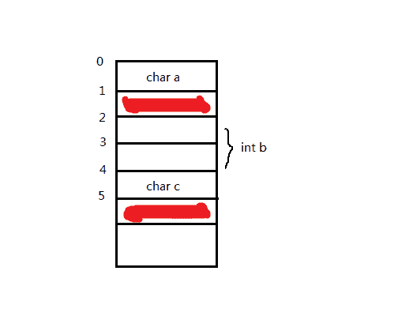
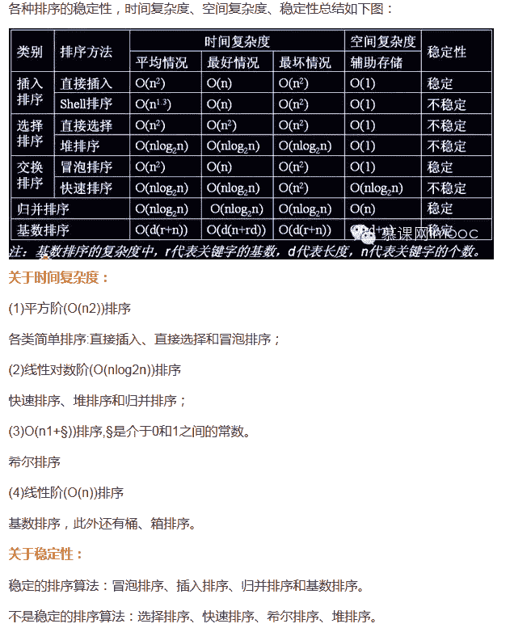
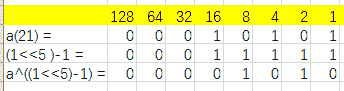
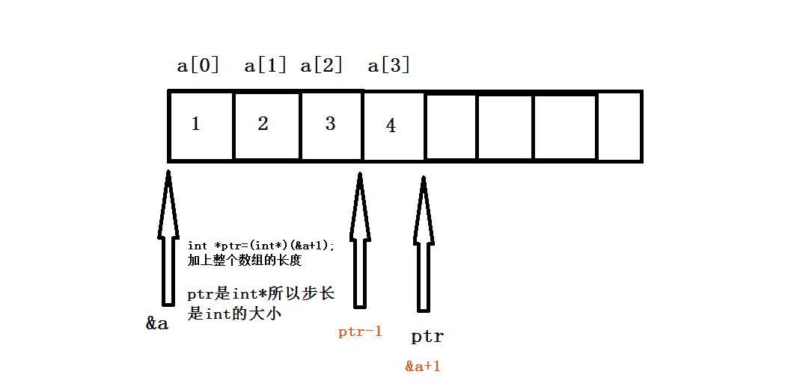

# 三百六十、公司 2016 研发工程师笔试题（一）

## 1

假如你需要找出/etc/my.conf 文件属于哪个包(package),你可以执行:（）

正确答案: D   你的答案: 空 (错误)

```cpp
rpm -requires/etc/my.conf
```

```cpp
rpm -q/etc/my.conf
```

```cpp
rpm -q|grep /etc/my.conf
```

```cpp
rpm -qf /etc/my.conf
```

本题知识点

Linux

讨论

[NowZhou](https://www.nowcoder.com/profile/170632)

－ivh：安装显示安装进度--install--verbose--hash
－Uvh：升级软件包--Update；
－qpl：列出 RPM 软件包内的文件信息[Query Package list]；
－qpi：列出 RPM 软件包的描述信息[Query Package install package(s)]；
－qf：查找指定文件属于哪个 RPM 软件包[Query File]；
－Va：校验所有的 RPM 软件包，查找丢失的文件[View Lost]；
－e：删除包

发表于 2015-09-19 11:14:27

* * *

[LiminWang](https://www.nowcoder.com/profile/412384)

不同 Linux 发行版用的是不同软件包系统，分为 Debian 的.deb 技术（Debian,Ubuntu）和 Red Hat 的.rpm 技术(Fedora,CentOS,redHat).

其中 rpm 是低级的 RedHat 软件包管理工具:

-i      package_name 安装软件包

-U    packagefile           更新软件包

-qa 列出已安装的软件包列表

-q    package-name 判断软件包是否安装

-qf   file_name 判断某个特定文件是由哪个软件包负责安装的

发表于 2016-03-10 22:53:47

* * *

[熊孩子 haha](https://www.nowcoder.com/profile/4413849)

RPM 是 RedHat Package Manager（RedHat 软件包管理工具）类似 Windows 里面的“添加/删除程序” rpm 执行安装包 二进制包（Binary）以及源代码包（Source）两种。二进制包可以直接安装在计算机中，而源代码包将会由 RPM 自动编译、安装。源代码包经常以 src.rpm 作为后缀名。 常用命令组合： －ivh：安装显示安装进度--install--verbose--hash －Uvh：升级软件包--Update； －qpl：列出 RPM 软件包内的文件信息[Query Package list]； －qpi：列出 RPM 软件包的描述信息[Query Package install package(s)]； －qf：查找指定文件属于哪个 RPM 软件包[Query File]； －Va：校验所有的 RPM 软件包，查找丢失的文件[View Lost]； －e：删除包

发表于 2019-01-02 10:22:07

* * *

## 2

下面关于"指针"的描述不正确的是()

正确答案: A   你的答案: 空 (错误)

```cpp
当使用 free 释放掉一个指针内容后,指针变量的值被置为 NULL
```

```cpp
32 位系统下任何类型指针的长度都是 4 个字节
```

```cpp
指针的数据类型声明的是指针实际指向内容的数据类型
```

```cpp
野指针是指向未分配或者已经释放的内存地址
```

本题知识点

C++ C 语言

讨论

[LiminWang](https://www.nowcoder.com/profile/412384)

1.  free 掉一个指针后，指针仍然指向原来的地址。free 的意义在于告诉系统目标地址可以被回收。
2.  32 位系统中 MAR(内存地址寄存器)为 32 位，可寻址范围为 2 的 32 次方 Byte，共大约不足 4G 的内存空间。指针中保存内存地址，所以大小和 MAR 大小相同。
3.  指针的类型用于确定指针所指的对象的类型，因此初始化或赋值时必须保证类型匹配。指针用于间接访问对象，并给予指针的类型提供可执行的操作，例如，int 型指针只能把其指向的对象当作 int 型数据来处理，如果该指针指向了其他类型(如 double 类型)的对象，则在指针上执行的任何操作都有可能出错。
4.  一个有效的指针必然是以下三种状态之一：

1.  保存一个特定的对象的地址；
2.  指向某个对象后面的另一对象；
3.  或者是 0 值。

发表于 2016-03-10 23:25:17

* * *

[努力 javaer](https://www.nowcoder.com/profile/359344)

当 free 释放内存之后，指针还指向原来的那块地址，需要我们设置 p = NULL；如果不手动设置 p = NULL，此时 P 就变成了野指针

发表于 2015-09-19 11:22:12

* * *

[NII](https://www.nowcoder.com/profile/710976)

当 free 释放内存之后，指针还指向原来的那块地址，需要我们设置 p = NULL

发表于 2015-09-19 10:48:31

* * *

## 3

在一个 16 位的机器，以下结构由于边界对齐浪费了多少空间（）

```cpp
struct{
     char a;
     int b;
     char c;
}
```

正确答案: D   你的答案: 空 (错误)

```cpp
8
```

```cpp
4
```

```cpp
6
```

```cpp
2
```

本题知识点

C++ C 语言

讨论

[t^t999999](https://www.nowcoder.com/profile/995406)

本题是 16 位机器，char 型占 1 个字节，int 型占 2 个字节。结构体中字节对齐有两条规则：

1.  数据成员自对齐，即数据成员起始地址为数据类型长度的整数倍，如该题 int 型 b 只能从 0，2，4...等地址处开始放；
2.  结构体总长度是结构体中有效对齐值的整数倍，有效对齐值，如该题没明确指出，则为最长数据成员(int b)长度的整数倍；

根据上面两条规则，画出内存示意图。根据规则 1，int b 从 2 处开始放，此时结构体总长度为(1 + 1 + 2 + 1 = 5)；再根据规则 2，结构体总长度应为 2 的整数倍，故应为 6.描红的两个字节表示被浪费的。

> 参考 http://blog.csdn.net/andy572633/article/details/7213465

发表于 2015-09-20 10:48:29

* * *

[努力 javaer](https://www.nowcoder.com/profile/359344)

注意题目说是 16 位机器 char a [8][浪费]int    b [16]           [16]char c [8][浪费]因此，总共浪费了 16 位，就是 2 个字节

发表于 2015-09-19 11:26:07

* * *

[orzOrzorzOrz](https://www.nowcoder.com/profile/374725)

16 位机器，默认对齐字节偏移量是（16/8）=2 的倍数，故实际分配内存情况为

char a 1 字节

int b （1+2）字节，偏移量取 min{2,2}，取 2，所以补一个字节就够

char c （1+1）字节 总大小为 4 的倍数所以加 1

总共 8 字节，为了对齐用了 2 字节

编辑于 2015-09-22 21:43:39

* * *

## 4

下面算法的功能是:()

```cpp
Method(C) {
    S = {};
    while (not solution(S)) {
        x = select(C);
        if feasible (S, x)
            S = S + {x};
        C = C - {x};
    }
    return S;
}

```

正确答案: C   你的答案: 空 (错误)

```cpp
分支限界法求解问题的一般过程
```

```cpp
动态规划求解最优解的一般过程
```

```cpp
贪心算法求解最优解的一般过程
```

```cpp
回溯算法求解的一般过程
```

本题知识点

C 语言

讨论

[seaway](https://www.nowcoder.com/profile/577801)

本题的正确答案是“贪心算法求解最优解的一般过程 ”分析如下所示：（ 复制粘贴来自： http://blog.csdn.net/winbobob/article/details/38314821 ）1.贪心法的设计思想         贪心算法在解决问题的策略上目光短浅，只根据当前已有的信息就做出选择，而且一旦做出了选择，不管将来有什么结果，这个选择都不会改变。换言之，贪心法并不是从整体最优考虑，它所做出的选择只是在某种意义上的局部最优。贪心算法对于大部分的优化问题都能产生最优解，但不能总获得整体最优解，通常可以获得近似最优解。该算法存在问题：1). 不能保证求得的最后解是最佳的；2). 不能用来求最大或最小解问题；3). 只能求满足某些约束条件的可行解的范围。Dijkstra 算法、Prim 算法和 Kruskal 算法都属于典型的贪心算法引例 [找零钱]一个小孩买了价值少于 1 美元的糖，并将 1 美元的钱交给售货员。售货员希望用数目最少的硬币找给小孩。假设提供了数目不限的面值为 2 5 美分、1 0 美分、5 美分、及 1 美分的硬币。售货员分步骤组成要找的零钱数，每次加入一个硬币。选择硬币时所采用的贪婪准则如下：每一次选择应使零钱数尽量增大。为保证解法的可行性（即：所给的零钱等于要找的零钱数），所选择的硬币不应使零钱总数超过最终所需的数目引例分析为使找回的零钱的硬币数最小，不考虑找零钱的所有各种方案，而是从最大面值的币种开始，按递减的顺序考虑各币种，先尽量用大面值的币种，只当不足大面值币种的金额才会去考虑下一种较小面值的币种。这就是在采用贪婪法。这种方法在这里之所以总是最优，是因为银行对其发行的硬币种类和硬币面值的巧妙安排。如果只有面值分别为 1，5 和 11 单位的硬币，而希望找回总额为 15 单位的硬币，按贪婪算法，应找 1 个 11 单位面值的硬币和 4 个 1 单位面值的硬币，共找回 5 个硬币。但最优的解答应是 3 个 5 单位面值的硬币。贪心法的求解过程            用贪心法求解问题应该考虑如下几个方面：（1）候选集合 C：为了构造问题的解决方案，有一个候选集合 C 作为问题的可能解，即问题的最终解均取自于候选集合 C。例如，在付款问题中，各种            面值的货币构成候选集合。（2）解集合 S：随着贪心选择的进行，解集合 S 不断扩展，直到构成一个满足问题的完整解。例如，在付款问题中，已付出的货币构成解集合。（3）解决函数 solution：检查解集合 S 是否构成问题的完整解。例如，在付款问题中，解决函数是已付出的货币金额恰好等于应付款。（4）选择函数 select：即贪心策略，这是贪心法的关键，它指出哪个候选对象最有希望构成问题的解，选择函数通常和目标函数有关。例如，在付款             问题中，贪心策略就是在候选集合中选择面值最大的货币。（5）可行函数 feasible：检查解集合中加入一个候选对象是否可行，即解集合扩展后是否满足约束条件。例如，在付款问题中，可行函数是每一步选              择的货币和已付出的货币相加不超过应付款。贪心法的一般流程[cpp] view plain copyGreedy(C)  //C 是问题的输入集合即候选集合  {      S={ };  //初始解集合为空集      while (not solution(S))  //集合 S 没有构成问题的一个解      {         x=select(C);    //在候选集合 C 中做贪心选择         if feasible(S, x)  //判断集合 S 中加入 x 后的解是否可行            S=S+{x};            C=C-{x};      }     return S;  2.贪心法的基本要素      对于一个具体的问题，怎么知道是否可用贪心算法解此问题，以及能否得到问题的最优解呢?这个问题很难给予肯定的回答。      但是，从许多可以用贪心算法求解的问题中看到这类问题一般具有 2 个重要的性质：贪心选择性质和最优子结构性质。子问题：假设为了解决某一优化问题，需要依次作出 n 个决策 D1，D2，…，Dn，对于任何一个整数 k，1 < k < n，以 Dk 作为问题的初始状态，来进行以后的决策，这样的问题就成为是原问题的一个子问题。1) 贪心选择性质      所谓贪心选择性质是指所求问题的整体最优解可以通过一系列局部最优的选择，换句话说，当考虑做何种选择的时候，我们只考虑对当前问题最佳的选择而不考虑子问题的结果。这是贪心算法可行的第一个基本要素。贪心算法以迭代的方式作出相继的贪心选择，每作一次贪心选择就将所求问题简化为规模更小的子问题。      对于一个具体问题，要确定它是否具有贪心选择性质，必须证明每一步所作的贪心选择最终导致问题的整体最优解。2) 最优子结构性质       当一个问题的最优解包含其子问题的最优解时，称此问题具有最优子结构性质。问题的最优子结构性质是该问题可用贪心算法求解的关键特征。3.贪心算法与动态规划算法的差异      贪心算法和动态规划算法都要求问题具有最优子结构性质，这是两类算法的一个共同点。大多数时候，能用贪心算法求解的问题，都可以用动态规划算法求解。但是能用动态规划求解的，不一定能用贪心算法进行求解。（因为贪心选择性质比动态规划的两个属性约束更强）

编辑于 2016-02-28 17:09:14

* * *

[helloworld__](https://www.nowcoder.com/profile/9351121)

Greedy(C)  //C 是问题的输入集合即候选集合  {      S={ };  //初始解集合为空集      while (not solution(S))  //集合 S 没有构成问题的一个解      {         x=select(C);    //在候选集合 C 中做贪心选择         if feasible(S, x)  //判断集合 S 中加入 x 后的解是否可行            S=S+{x};            C=C-{x};      }     return S;  }这是从网上找来的有注释的伪代码，看看就好。烂题一道，不用纠结了。

发表于 2016-11-09 13:55:40

* * *

[IreanLau](https://www.nowcoder.com/profile/681025)

分支限界法  是对回溯法做出优化。 feasible(S,x)是剪枝函数。S=S+{x}; C=C-{x};是回溯（分支）过程。

发表于 2015-09-19 14:17:27

* * *

## 5

下列关于 C/C++的宏定义，不正确的是（）

正确答案: B   你的答案: 空 (错误)

```cpp
宏定义不检查参数正确性，会有安全隐患
```

```cpp
宏定义的常量更容易理解，如果可以使用宏定义常量的话，要避免使用 const 常量
```

```cpp
宏的嵌套定义过多会影响程序的可读性，而且很容易出错
```

```cpp
相对于函数调用，宏定义可以提高程序的运行效率
```

本题知识点

C++

讨论

[NII](https://www.nowcoder.com/profile/710976)

使用 const 比使用 define 有一下几种好处：（1）const 会进行数据类型检查，而 define 不会（2）const 效率高，因为 const 定义的常量，没有在内存中存储，而是在符号表中，每次访问这个数据的时候，少了从内存中读取和存储过程，效率高。因此尽量还是使用 const 常量

发表于 2015-09-19 10:52:15

* * *

[放牛郎与天仙女](https://www.nowcoder.com/profile/782521)

```cpp
#define M 3    //宏常量
const int N = 5;//此时并未将 N 放入内存中，保存在符号表中
......
int i=N;//此时为 N 分配内存，以后不再分配！
int I=M;//与编译期间进行宏替换，分配内存
int j=N;//没有分配内存
int J=M;//再进行宏替换，又一次内存分配
const 只读变量（c 语言里是常量）只是给出了对应的内存地址，#define 定义给出的是立即数，每次替换都必须进行拷贝。
```

发表于 2015-10-05 20:58:29

* * *

[HelloKilly](https://www.nowcoder.com/profile/2350751)

```cpp
const 与#define 最大的差别在于：前者在堆栈分配了空间，而后者只是把具体数值直接传递到目标变量罢了。或者说，const 的常量是一个 Run-Time 的概念，他在程序中确确实实的存在可以被调用、传递。而#define 常量则是一个 Compile-Time 概念，它的生命周期止于编译期：在实际程序中他只是一个常数、一个命令中的参数，没有实际的存在。

const 常量存在于程序的数据段.

#define 常量存在于程序的代码段。
```

发表于 2017-09-19 09:42:03

* * *

## 6

已知有限状态自动机 Af=(?，Q，d，q0，F)，?={0，1}；Q={q0，q1}；d：d(q0，0)= q1，d(q0，1)= q1，d(q1，0)=q0，d(q1，1)=q0；q0=q0；F={q0}。现有输入字符串：(a) 00011101011，(b) 1100110011，(c) 101100111000，(d)0010011，试问，用 Af 对上述字符串进行分类的结果为

正确答案: B   你的答案: 空 (错误)

```cpp
ω1:{a,c};ω2:{b,d}
```

```cpp
ω1:{a,d};ω2:{b,c}
```

```cpp
ω1:{b,d};ω2:{a,c}
```

```cpp
ω1:{a,b};ω2:{c,d}
```

本题知识点

编译和体系结构

讨论

[kaiseu](https://www.nowcoder.com/profile/357398)

？：代表输入的序列，这里输入可以是 0 或 1；Q：代表状态集合，这里可以是 q0 或者 q1；d：代表状态转换关系，d：d(q0，0)= q1，d(q0，1)= q1，表示在状态 q0 的时候输入 0 或者 1 都会转到状态 q1；q0：代表初始状态 ，就是说自动机在还未处理输入的时候的状态(明显的 q0∈ Q)；F： 代表终止状态，是 Q 中的状态的集合(就是 F⊆Q)。所以，q0 状态输入 0 或 1 都会转到 q1 状态，q1 状态输入 0 或者 1 都会转到 q0 状态，也就是最终的状态决定与输入序列的长度。

发表于 2015-09-28 10:32:01

* * *

[寒酸的教练](https://www.nowcoder.com/profile/734763)

根据 d 中规则，状态 q0 时，接收输入 0 或者 1 都会转换到状态 q1，而状态 q1 时，接收输入 0 或者 1 又都会转换到状态 q0。
因此该状态机，就是判断输入字符串的长度，长度为偶数，则最终状态等同于初始状态 q0，否则最终状态为 q1。
a 字符串长度为 11，d 字符串长度为 7，两者最终状态都为 q1；
b 字符串长度为 10，c 字符串长度为 12，两者最终状态都为 q0。

发表于 2015-09-19 13:08:11

* * *

## 7

下面的排序方法中，关键字比较次数与记录的初始排列无关的是 ______。

正确答案: D   你的答案: 空 (错误)

```cpp
希尔排序
```

```cpp
冒泡排序
```

```cpp
直接插入排序
```

```cpp
直接选择排序
```

本题知识点

排序 *讨论

[木藕 0213](https://www.nowcoder.com/profile/825050)

这个位置的冒泡排序应该是指，加入了是否有数据进行交换的判断，如果上次循环没有交换数组中的两个值则说明数组已经有序，直接退出冒泡排序过程。

发表于 2015-09-25 16:19:14

* * *

[yayamma](https://www.nowcoder.com/profile/270051)



发表于 2015-09-19 15:11:32

* * *

[李冰](https://www.nowcoder.com/profile/642631)

插入排序，冒泡排序和快速排序的排序趟数与序列的初始状态有关堆排序和选择排序的排序次数与初始状态无关，即最好情况和最坏情况都一样

发表于 2015-09-19 10:53:43

* * *

## 8

```cpp
int fun(int a){
 a^=(1<<5)-1;
 return a;
}
```

fun(21)运行结果是()

正确答案: A   你的答案: 空 (错误)

```cpp
10
```

```cpp
5
```

```cpp
3
```

```cpp
8
```

本题知识点

C++

讨论

[LiminWang](https://www.nowcoder.com/profile/412384)



发表于 2016-03-11 19:24:26

* * *

[codermanFans](https://www.nowcoder.com/profile/971995)

这一题我看叉了，具体思路：a = a^((1<<5) - 1);  //这里添加一个括号，为了说明减号比异或的优先级高 1<<5 = 00 0001 = 10 0000 1<<5 - 1 = 10 0000 - 1 = 1 111121 = 1 0101 1 0101 ^ 1 1111 = 0 1010 

发表于 2015-09-19 10:50:34

* * *

[ms12](https://www.nowcoder.com/profile/3139821)

在数字没有溢出的前提下，对于正数和负数，左移一位都相当于乘以 2 的 1 次方，左移 n 位就相当于乘以 2 的 n 次方。
(1<<5): 左移 5 位相当于乘以 2 的 5 次方,即 32,则,1 左移 5 位得 32

a = a^((1<<5) - 1);  //这里添加一个括号，为了说明减号比异或的优先级高
原式相当于 a = a³¹;此函数就是求取一数与 31 异或后的值

当 a=21 时,化为二进制:10101
32 的二进制:11111
异或后得:01010,即十进制的 10

发表于 2017-03-18 15:38:09

* * *

## 9

下面代码会输出()

```cpp
int main(){
 int a[4]={1,2,3,4};
 int *ptr=(int*)(&a+1);
 printf("%d",*(ptr-1));
}
```

正确答案: A   你的答案: 空 (错误)

```cpp
4
```

```cpp
1
```

```cpp
2
```

```cpp
3
```

本题知识点

C++

讨论

[IreanLau](https://www.nowcoder.com/profile/681025)

 考察对于数组和指针的认识，指针加一的能力由类型决定。int*ptr=(int*)(&a+1);     &a 和 a 都指的是数组首元素的地址。不同的是 a 就是 a+0 ，*（a+0）就是 a[0],而&a+1  相当于 a[]数组类型的指针加 1，此时指针加到数组的末尾。ptr 接受后，由于 Ptr 的类型是 int* 因此 ptr-1  即回退 4 字节。即指到最后一个元素。

发表于 2015-09-19 14:14:56

* * *

[weikai](https://www.nowcoder.com/profile/658104)



发表于 2015-09-19 13:51:10

* * *

[LiminWang](https://www.nowcoder.com/profile/412384)

> C 语言中，对 1 个指针加一的结果是对该指针移动到下一个存储着相同数据元素类型元素的单元。

括号中的（&a+1）,其实际指针类型为  int(*)[4]  ,指针指向的类型为   int()[4] ,

所以对  &a 指针加一的结果是移动到下一个  int()[4] 的单元，即当前数组尾的下一个单元。

在进行了指针类型转换后，指针类型变为 int *，指针指向类型变为 int，此时 ptr-1 的结果就是把指针向前移动一个 int 类型的大小，正好指向数组最后一个元素

发表于 2016-03-11 19:59:46

* * *

## 10

针对以下代码，哪些选项执行后是 true 的：（）

```cpp
class CompareReference{
   public static void main(String [] args){
   float f=42.0f;
   float f1[]=new float[2];
   float f2[]=new float[2];
   float[] f3=f1;
   long x=42;
   f1[0]=42.0f;
  }
}
```

正确答案: B C   你的答案: 空 (错误)

```cpp
f1==f2
```

```cpp
x==f1[0]
```

```cpp
f1==f3
```

```cpp
f2==f1[1]
```

本题知识点

Java

讨论

[PengSC](https://www.nowcoder.com/profile/208439)

BC 正确，选项 B 解释，jav  查看全部)

编辑于 2016-12-16 16:43:04

* * *

[yql](https://www.nowcoder.com/profile/566442)

```cpp
 public static void main(String[] args){
        int i=42;
        double d=42.0000;
        long l=42;
        float f=42.0f;
        float f2=42.00f;
        System.out.println(d==i);
        System.out.println(f==i);
        System.out.println(f==f2);
        System.out.println(l==i);
        System.out.println(d==f);
    }
/*out:
true
true
true
true
true
*/

```

基本类型之间的比较，应该会将低精度类型自动转为高精度类型再比较。

发表于 2015-09-23 10:56:46

* * *

[董大官人](https://www.nowcoder.com/profile/1926520)

B 选项：x == f1[0] ，x 是 long 类型，与 float 类型对比属于低精度，所以 x 要向高精度的 float 类型转型再比较，故相等；C 选项：f1 == f3，f3 没有 new 创建，而是由 f1 赋值，所以 f3 地址是指向 f1 的，f1 值改变，相当于改变 f3 值，所以相等。

发表于 2017-02-15 17:34:19

* * **