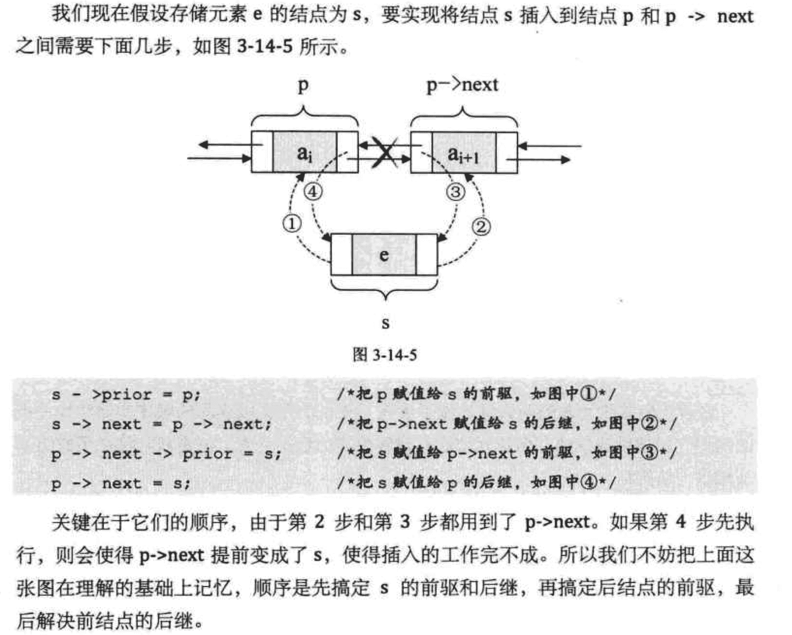
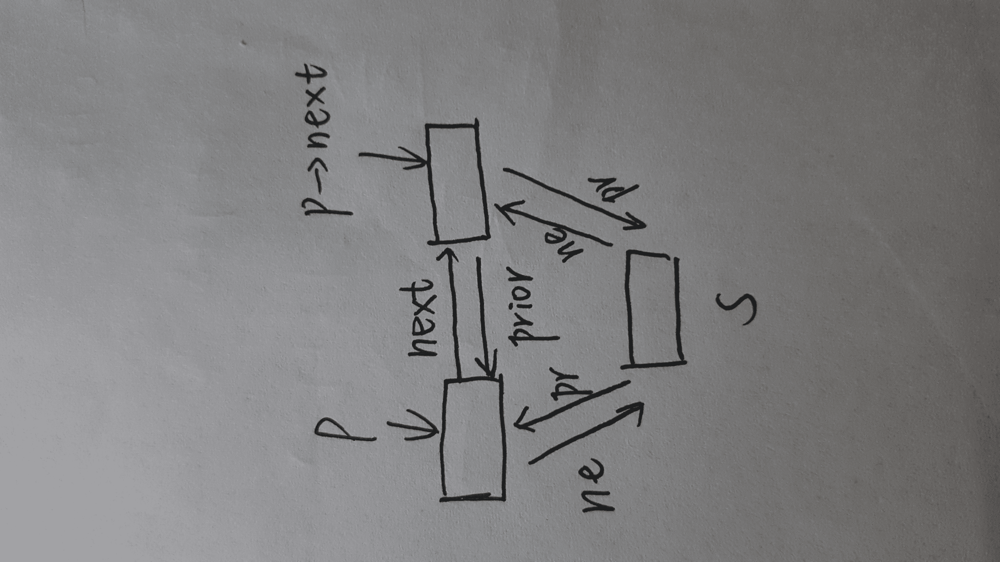

# 百度 2016 研发工程师笔试题（一）

## 1

软件项目存储于/ftproot，允许 apache 用户修改所有程序，设置访问权限的指令？

正确答案: A   你的答案: 空 (错误)

```cpp
chmod  777  /ftproot
```

```cpp
chgrp apache /frproot
```

```cpp
chown apache /ftproot
```

```cpp
chmod apache /ftproot
```

本题知识点

Linux

讨论

[每天进步二点点](https://www.nowcoder.com/profile/759918)

chmod +权限 +文件或目录 chown +属主.属组+文件或目录 chgrp +属组 +目录就本题目而言，设置目录的权限可以这样：chmod  777  /ftproot 或者直接设置目录的属主为 apache：chown apache   /ftproot  加上权限 chmod  7xx  /ftproot

编辑于 2015-10-20 10:30:09

* * *

[王一百](https://www.nowcoder.com/profile/1823027)

把文件夹的属主改成了 apache 也不代表 apache 用户能修改所有程序，因为文件所有者权限有可能不可写

发表于 2017-03-30 21:54:49

* * *

[牛客 878436 号](https://www.nowcoder.com/profile/878436)

根据答案 B。我在自己的 Ubuntu 上实验了一下，这个命令执行有问题。根本无法执行！不知道哪位大牛出的题目，可能他的 Linux 是定制的吧。

发表于 2015-09-21 19:36:50

* * *

## 2

Vsftpd 配置本地用户传输速率的参数？

正确答案: A   你的答案: 空 (错误)

```cpp
Local _max_rate
```

```cpp
anon _max_rate
```

```cpp
user _max_rate
```

```cpp
max_user
```

本题知识点

Linux

讨论

[darren_wang](https://www.nowcoder.com/profile/831888)

我觉得考这种题目也挺没有意思的，世界上那么多软件，这么考知识的广度的话分分钟搞死人。

发表于 2015-09-24 00:01:51

* * *

[美团校招内推直达](https://www.nowcoder.com/profile/458054)

**A。****Vsftpd 配置****local_max_rate=0：** 本地用户使用的最大传输速度，单位为 B/s，0 表示不限制速度。预设值为 0。**anon_max_rate=0** **：** 设置匿名登入者使用的最大传输速度，单位为 B/s，0 表示不限制速度。默认值为 0。**配置信息无 C、D 选项。**

编辑于 2015-09-28 09:11:51

* * *

[后劲好大](https://www.nowcoder.com/profile/4013442)

Vsftpd 配置本地用户传输速率的参数是 local

发表于 2017-06-07 21:29:25

* * *

## 3

若要对 data 类中重载的加法运算符成员函数进行声明，下列选项中正确的是？

正确答案: A   你的答案: 空 (错误)

```cpp
Data operator+(Data);
```

```cpp
Data operator(Data);
```

```cpp
operator+(Data,Data);
```

```cpp
Data+(Data);
```

本题知识点

C++

讨论

[牛客职导官方账号](https://www.nowcoder.com/profile/897353)

【正确答案】A
【解析】运算符  查看全部)

编辑于 2021-11-17 15:56:16

* * *

[进击的软件攻城狮](https://www.nowcoder.com/profile/447205)

类中重载运算符的一般格式是：类名  operator  运算符(参数)如**A**Data operator + (Data);

发表于 2015-09-21 21:14:15

* * *

[大菜鸟大菜狗](https://www.nowcoder.com/profile/905766)

A
声明类的运算符成员函数时可以省略一个参数例如，一个参数时可以不用形参，耳光参数只用一个形参，因为成员函数有 this 指针表示自己。
但是若是类的友元函数声明运算符时，不能省略，因为这种情况下 this 指针并不是该类的类型。

发表于 2015-10-13 00:19:23

* * *

## 4

有以下程序

```cpp
#include <iostream>
using namespace std;
int fun (int x, int y){
    if(x == y)
        return (x);
    else 
        return ((x + y) / 2);
}
int main(){  
    int a = 4, b = 5, c = 6;
    printf("%d\n", fun(2 * a, fun(b, c)));
}
```

下面程序的输出是？

正确答案: B   你的答案: 空 (错误)

```cpp
8
```

```cpp
6
```

```cpp
12
```

```cpp
3
```

本题知识点

C++ C 语言

讨论

[牛客 738324 号](https://www.nowcoder.com/profile/738324)

B  fun(b,c) = (5+6)/2 = 5  fun(2*a,fun(b,c))=(2*4+5)/2=6

发表于 2015-09-21 11:23:21

* * *

[牛客 1465584 号](https://www.nowcoder.com/profile/1465584)

记住一点，int 类型和 int 类型进行计算，结果还是 Int。举个例子来说，int a=7,b=5,c;float d;c=a/b;d=a/b;输出的结果，c 的值为 1，d 的值也为 1\.不同在于 d 为 float 型，为 1.00000000 

发表于 2018-07-17 10:25:53

* * *

[林墨初](https://www.nowcoder.com/profile/612731)

B 两次调用 fun 函数

发表于 2015-09-21 15:34:20

* * *

## 5

如果关系模式 R=(A,B,C,D,E)中的函数依赖集 F={A→B,B→C,CE→D},这是第几范式？

正确答案: D   你的答案: 空 (错误)

```cpp
第三范式
```

```cpp
第二范式
```

```cpp
第四范式
```

```cpp
第一范式
```

本题知识点

编译和体系结构

讨论

[Pandora](https://www.nowcoder.com/profile/266279)

F={A→B,B→C,CE→  查看全部)

编辑于 2016-07-09 15:21:16

* * *

[StrongYoung](https://www.nowcoder.com/profile/649626)

我的理解是：（1）存在传递依赖，所以，不可能是第三范式。（2）第二范式要求，非主属性需要完全依赖于主属性，即非主属性不能部分依赖于主属性。------------------------------------------由{A→B,B→C,CE→D}可知：存在 AE->D，只要知道 AE，就能确定一条记录。即 AE 为联合主键，但是，B 和 C 都只依赖于 A，不依赖 E，即 B 和 C 存在部分依赖，而第二范式不允许存在部分依赖，因此只能是第一范式了。

编辑于 2015-09-21 17:05:37

* * *

[断舍离](https://www.nowcoder.com/profile/143793)

1.确定主键  1.1  A ->B 且 B->C  故 A ->C  1.2  A ->C 且 CE ->D 故 AE->D  1.3 A->B A-C AE-D      故 AE->ABCD 即 AE 联合起来能够确定一条记录，故 AE 是联合主键 2.A ->B 且 B->C ，存在传递一来，排出 3NF3.不存在 E ->B ,但有 A->B,而主键是 AE,故存在  非主属性  部分依赖于  主属性，故排出 1NF       部分函数依赖定义：部分函数依赖(partial functional dependency)设 X,Y 是关系 R 的两个属性集合，存在 X→Y，若 X’是 X 的真子集，存在 X’→Y，则称 Y 部分函数依赖于 X。

发表于 2017-08-21 19:21:53

* * *

## 6

假设有 4 条语句 s1:a＝5x;s2:b=5+y;s3:c=a+b;s4:d=c+y;根据 bernstein 条件，下面说法正确的是？

正确答案: D   你的答案: 空 (错误)

```cpp
s1,s4 可并发执行
```

```cpp
s1,s2 不可并发执行
```

```cpp
s2,s3 可并发执行
```

```cpp
s3,s4 不可并发执行
```

本题知识点

操作系统

讨论

[爱豆儿](https://www.nowcoder.com/profile/3365426)

选 DBernstei  查看全部)

编辑于 2017-08-15 14:29:29

* * *

[manhua](https://www.nowcoder.com/profile/683760)

本题按照题目顺序执行，s1 和 s2 可以并发执行，因为没有各自变量独立；s2 和 s3 不能并发，因为有公共变量 b；同理 s3 和 s4;s1 和 s4 没有公共变量，但中间包含 s2 和 s3，若并发执行，d 和 c 无法最终确定。

发表于 2015-10-11 11:33:47

* * *

[xyf2417](https://www.nowcoder.com/profile/546423)

```cpp

```
此条件是 1966 年 Bernstein 首次提出来，故称为 Bernstein 条件
若两个程序 P1 和 P2 能满足下述条件，它们便能并发执行，否则不能：
 R(P1)∩W(P2)∪R(P2)∩W(P1)∪W(P1)∩W(P2)={}，

P1 的读集与 P2 写集的交集、P2 的读集与 P1 的写集的交集、P1 的写集与 P2 的写集的交集，三者同时为空集。
（以上来自百度知道）  
```cpp

	就是读写锁的原理

```

发表于 2016-07-09 15:35:04

* * *

## 7

设有 6 个结点的无向图，该图至少应有（）条边，才能确保是一个连通图？

正确答案: B   你的答案: 空 (错误)

```cpp
8
```

```cpp
11
```

```cpp
6
```

```cpp
5
```

本题知识点

图

讨论

[天啸](https://www.nowcoder.com/profile/442089)

  查看全部)

编辑于 2016-04-17 17:23:03

* * *

[SunburstRun](https://www.nowcoder.com/profile/557336)

答案是 B   最少是 5 条边，能形成一个连通图。 至少应有 11 条边，才能确保是一个连通图

编辑于 2016-04-17 17:22:56

* * *

[L.K.](https://www.nowcoder.com/profile/217196)

应该是 11 条吧。确保是连通图，假设不是连通图，则最多是 5 个点全部互相连接，C（5，2）=10 条。再多 1 条，则必须与第 6 个点相连，11 条。

发表于 2015-09-21 11:17:47

* * *

## 8

在一个带头结点的单链表 HL 中，若要在第一个元素之前插入一个由指针 p 指向的结点，则执行？

正确答案: C   你的答案: 空 (错误)

```cpp
p->next = HI ;p =HL ;
```

```cpp
p->next = HL ;HL =p ;
```

```cpp
p->next = HL ->next;HL ->next =p;
```

```cpp
HL =p; p->next =HL ;
```

本题知识点

链表 *讨论

[劲越](https://www.nowcoder.com/profile/8038055)

注意头指针不是第一个元素，仅仅是一个标志而已

发表于 2016-09-12 09:37:16

* * *

[CodeMan](https://www.nowcoder.com/profile/960273)

头指针仅仅是一个标志指针！！！

发表于 2016-06-10 08:10:41

* * *

[青山崖野](https://www.nowcoder.com/profile/7614806)

HL 指向第一个元素注意顺序：p->next=HL->next;                 HL->next=p;

发表于 2017-03-30 22:18:59

* * *

## 9

Fisher 线性判别函数的求解过程是将 N 维特征矢量投影在（ ）中进行求解？

正确答案: A   你的答案: 空 (错误)

```cpp
一维空间
```

```cpp
N—1 维空间
```

```cpp
三维空间
```

```cpp
二维空间
```

本题知识点

图像处理

讨论

[美团校招内推直达](https://www.nowcoder.com/profile/458054)

**A：****Fisher 线性判**  查看全部)

编辑于 2016-04-28 10:06:20

* * *

[orzOrzorzOrz](https://www.nowcoder.com/profile/374725)

我看着线性就觉得是一维。。。

发表于 2015-09-21 23:04:37

* * *

[huixieqingchun](https://www.nowcoder.com/profile/551201)

**要注意理解题意，投影成线性判别函数，只有一维上才能说是线性的。**

发表于 2016-06-04 09:47:53

* * *

## 10

影响聚类算法效果的主要原因有：（　）？

正确答案: A B C   你的答案: 空 (错误)

```cpp
特征选取
```

```cpp
模式相似性测度
```

```cpp
分类准则
```

```cpp
已知类别的样本质量
```

本题知识点

机器学习

讨论

[曾国藩](https://www.nowcoder.com/profile/718261)

正确答案为 A B  C。这道题的答案可以从网上找到。http://www.docin.com/p-756247716.htmlD 之所以不正确，是因为聚类是对无类别的数据进行聚类，不使用已经标记好的数据。

发表于 2015-10-03 16:50:50

* * *

[平行线上的交点](https://www.nowcoder.com/profile/578639625)

聚类的目标是使同一类对象的相似度尽可能地大；不同类对象之间的相似度尽可能地 小。聚类分析的算法可以分为划分法（Partitioning Methods）、层次法（Hierarchical Me thods）、基于密度的方法（Density-Based Methods）、基于网格的方法（Grid-Based M ethods）、基于模型的方法（Model-Based Methods）、谱聚类（Spectral Clustering） 等，不用的方法对聚类效果存在差异（C 正确）；特征选取的差异会影响聚类效果（A 正 确）。聚类的目标是使同一类对象的相似度尽可能地大，因此不同的相似度测度方法对聚类结 果有着重要影响（B 正确）。由于聚类算法是无监督方法，不存在带类别标签的样本，因此， D 选项不是聚类算法的输入数据，D 错误。

发表于 2019-03-18 10:41:26

* * *

[薛定谔的熊](https://www.nowcoder.com/profile/769741)

答案 D，已知类别的样本质量，说的是有监督的训练吧，因为只有有监督的训练才要知道样本的类别，然后作为监督训练 的训练集，样本的质量自然是重要的。答案 C，分类准则，大约说的是度量方式，例如 KMeans 可以用欧式距离啊，也可用其他的距离，这也是分类准则。

编辑于 2016-09-06 19:17:25

* * *

## 11

下面说法正确的是？

正确答案: D   你的答案: 空 (错误)

```cpp
梯度下降有时会陷于局部极小值，但ＥＭ算法不会。
```

```cpp
ＳＶＭ对噪声鲁棒。
```

```cpp
当训练数据较多时更容易发生过拟合。
```

```cpp
给定ｎ个数据点，如果其中一半用于训练，另一半用于测试，则训练误差和测试误差之间的差别会随着ｎ的增加而减小。
```

本题知识点

自然语言处理

讨论

[Pandora](https://www.nowcoder.com/profile/266279)

A、EM 是一种迭代算法，用于含有隐变量的概率参数模型的最大似然估计或极大后验概率估计。最大优点是简单和稳定，但**与梯度下降一样，容易陷入局部最优。**B、SVM 对缺失数据敏感，所以噪声鲁棒性不是很好。噪声鲁棒性好要数神经网络。C、过拟合往往是因为训练**数据太少**而导致。D、相应的，训练数据越多，拟合度越好，训练误差和测试误差距离自然越小。

发表于 2015-09-21 17:18:17

* * *

[DEGA](https://www.nowcoder.com/profile/328963)

网友[Pandora](https://www.nowcoder.com/profile/266279) （好像这是第二次盗用人家的解析了）：A、EM 是一种迭代算法，用于含有隐变量的概率参数模型的最大似然估计或极大后验概率估计。最大优点是简单和稳定，但与梯度下降一样，容易陷入局部最优。B、SVM 对缺失数据敏感，所以噪声鲁棒性不是很好。噪声鲁棒性好要数神经网络。C、过拟合往往是因为训练数据太少而导致。D、相应的，训练数据越多，拟合度越好，训练误差和测试误差距离自然越小

发表于 2016-09-04 21:54:46

* * *

[带枪小女孩](https://www.nowcoder.com/profile/493614252)

A、EM 是一种迭代算法，用于含有隐变量的概率参数模型的最大似然估计或极大后验概率估计。最大优点是简单和稳定，但与梯度下降一样，容易陷入局部最优。B、SVM 对缺失数据敏感，所以噪声鲁棒性不是很好。噪声鲁棒性好要数神经网络。C、过拟合往往是因为训练数据太少而导致。D、相应的，训练数据越多，拟合度越好，训练误差和测试误差距离自然越小

发表于 2018-09-13 16:26:07

* * *

## 12

采用开放定址法处理散列表的冲突时，其平均查找长度？

正确答案: A   你的答案: 空 (错误)

```cpp
高于链接法处理冲突
```

```cpp
高于二分查找
```

```cpp
低于链接法处理冲突
```

```cpp
低于二分查找
```

本题知识点

哈希 *讨论

[不是程序员](https://www.nowcoder.com/profile/955157)

开放定址法:一旦发生冲突，就去寻找下一个空的散列地址，只要散列地址够大，空的地址总会找到 链地址法: 一旦发生冲突，在当前位置给单链表增加结点就行。

发表于 2015-09-25 11:25:24

* * *

[Pandora](https://www.nowcoder.com/profile/266279)

参考[willfcareer](http://my.csdn.net/willfcareer)：http://blog.csdn.net/willfcareer/article/details/6687117**与开放定址法相比，拉链法其中优点有：**
1、拉链法处理冲突简单，且无堆积现象，即**非同义词决不会发生冲突，因此平均查找长度较短**；
2、由于拉链法中各链表上的结点空间是动态申请的，故它更适合于造表前无法确定表长的情况。

发表于 2015-09-21 17:24:04

* * *

[摇曳](https://www.nowcoder.com/profile/1485629)

看大家的解释怎么觉得应该选 C 呢？

发表于 2016-09-05 22:22:15

* * *

## 13

考虑两个分类器：1）核函数取二次多项式的 SVM 分类器和 2）没有约束的高斯混合模型（每个类别为一个高斯模型）。我们对 R2 空间的点进行两类分类。假设数据完全可分，SVM 分类器中不加松弛惩罚项，并且假设有足够多的训练数据来训练高斯模型的协方差。下面说法正确的是？

正确答案: B   你的答案: 空 (错误)

```cpp
SVM 的 VC 维大于高斯混合模型的 VC 维
```

```cpp
SVM 的 VC 维小于高斯混合模型的 VC 维
```

```cpp
两个分类器的结构风险值相同
```

```cpp
这两个分类器的 VC 维相同
```

本题知识点

自然语言处理

讨论

[NgShawn](https://www.nowcoder.com/profile/988947)

先讲一下 VC 维是什么，我们可以认为 VC 维就是 w 的假设空间，也就是说可能得到的 w 值约少，VC 维就越低。也就是说参数量越少，VC 维越低。对 w 的约束越多，VC 维越低。第一：关键点在于混合高斯对于每个类别都有一个高斯模型，这样每个类别都要优化一套权重 w，而 SVM 对于二分类只需要一套权重 w 就够了，从参数量来看，SVM 的 VC 维就已经要较低了。第二：要知道 SVM 就算没有软间隔(不加松弛惩罚项)它也还有一个 L2 正则摆在那里，这就又一步减少了 SVM 的 VC 维。

发表于 2017-08-31 13:12:13

* * *

[tangxuan](https://www.nowcoder.com/profile/6831970)

这两个分类器的 VC 维相同，因此两个分类器的决策边界都为二次函数，复杂度相同。假设我们估计两个分类器的结构风险值，该值为预测误差的上界，则 SVM  可能会得到更好的结果。虽然两个分类器的复杂度相同，但 SVM 对训练误差做优化从而得到更低（或相同）的值。

发表于 2016-09-06 18:53:32

* * *

[zh0558](https://www.nowcoder.com/profile/717993)

SVM 的泛化能力比 GMM 更强，根本原因在于其 VC 维比较小。

发表于 2015-09-22 11:09:28

* * *

## 14

设一个系统中有 5 个进程，它们的到达时间和服务时间如下，A 的到达时间为 0，服务时间为 3；B 的到达时间为 2，服务时间为 6；C 的到达时间为 4，服务时间为 4；D 的到达时间为 6，服务时间为 5；E 的 到达时间为 8，服务时间为 2，忽略 I/0 以及其他开销时间，若分别按先来先服务（FCFS）进行 CPU 调度，其平均周转时间为？

正确答案: C   你的答案: 空 (错误)

```cpp
10.2
```

```cpp
6.4
```

```cpp
8.6
```

```cpp
4.5
```

本题知识点

编译和体系结构

讨论

[Besideme](https://www.nowcoder.com/profile/128664)

先来先服务调度算法进程名  到达时间 服务时间  开始执行时间  完成时间  周转时间 A              0              3                 0                 3                3 B              2              6                 3                 9                7 C              4              4                 9                13               9 D              6              5                13               18              12 E              8              2                18               20              12 周转时间 = 完成时间 - 到达时间平均周转时间 = 所有进程周转时间 / 进程数 = （3+7+9+12+12）/ 5 = 8.6

发表于 2015-09-21 16:25:25

* * *

[梦远方](https://www.nowcoder.com/profile/504034)

平均周转时间  =  （所有进程的等待、执行时间的和）/  进程数所有进程的等待、执行时间的和 = 3 + 7 + 9 + 12 + 12 = 43   43 / 5=8.6 所以选 C

发表于 2015-09-21 12:02:19

* * *

[牛客 702456275 号](https://www.nowcoder.com/profile/702456275)

进程名  到达时间 服务时间  开始执行时间  完成时间  周转时间 A              0              3                 0                 3                3 B              2              6                 3                 9                7 C              4              4                 9                13               9 D              6              5                13               18              12 E              8              2                18               20              12 周转时间 = 完成时间 - 到达时间平均周转时间 = 所有进程周转时间 / 进程数 = （3+7+9+12+12）/ 5 = 8.6

发表于 2020-09-25 15:37:48

* * *

## 15

对于双向循环链表，每个结点有两个指针域 next 和 prior，分别指向前驱和后继。在 p 指针所指向的结点之后插入 s 指针所指结点的操作应为？

正确答案: D   你的答案: 空 (错误)

```cpp
p->next = s; p->next ->prior = s;s ->prior = p; s->next = P->next;
```

```cpp
s->prior = p; s->next = p ->next ; p ->next = s; p->next ->prior = s;
```

```cpp
p ->next =  s;s ->prior = p; p->next ->prior =s; s ->next = p ->next;
```

```cpp
s->prior = p; s->next =p->next; p->next ->prior = s; p ->next =  s;
```

本题知识点

链表 *讨论

[江南消夏](https://www.nowcoder.com/profile/8611799)



发表于 2016-12-13 16:01:38

* * *

[Geektimes](https://www.nowcoder.com/profile/335975)

链表类的插入，删除等之类就是修改指针的事：首先明确需要修改指针有哪些？  p 的 next,   s 的 prior,next, 还有就是 s 要插入位置的后一个的 prior;      最重要的是 p->next 它是找到 p 后面的依据，要保证它在被赋值前能得以保存； 因此，s->prior = p;s->next =p->next;s 指针得以修改； 然后改变另外两个 p->next ->prior = s；p ->next = s 这里->就是‘的’的意思。

发表于 2016-04-28 23:30:46

* * *

[bealikeflower](https://www.nowcoder.com/profile/9245118)

先插入再断链，总结来说就是 s->pre=p 一定在 p->next=s 前面;而 s->next=p->next 一定在 p->next->pre=s 的前面，查看选项可以知道选项 D 符合

发表于 2017-06-13 09:54:17

* * ****