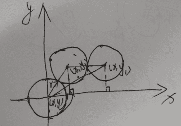

# 美丽联合 2016 研发工程师在线编程题

## 1

现在有一张半径为 r 的圆桌，其中心位于(x,y)，现在他想把圆桌的中心移到(x1,y1)。每次移动一步，都必须在圆桌边缘固定一个点然后将圆桌绕这个点旋转。问最少需要移动几步。

本题知识点

贪心 C++工程师 Java 工程师 蘑菇街 2016

讨论

[ixiaomo](https://www.nowcoder.com/profile/854180)

//思路很简单，千万别想复杂了//无论圆桌如何移动，都必须在圆桌边缘找一个点旋转。这就表明旋转后的圆心与最初的圆心连线肯定是 2r 的倍数（两圆心，向 x 轴或 y 轴做垂线，能得到一个直角三角形），几倍就表示最终移动了几步。import java.util.Scanner;

public class Main {

public static void main(String[] args) {
// TODO Auto-generated method stub
Scanner sc = new Scanner(System.in);
while (sc.hasNextLine()) {
String[] line = sc.nextLine().split(" ");
float r,x,y,x1,y1;
double step;
r=Integer.parseInt(line[0]);
x=Integer.parseInt(line[1]);
y=Integer.parseInt(line[2]);
x1=Integer.parseInt(line[3]);
y1=Integer.parseInt(line[4]);
step=Math.sqrt((x1-x)*(x1-x)+(y1-y)*(y1-y))/(2*r);
System.out.println(String.format("%.0f", step));
}
}

}

编辑于 2016-04-17 19:54:39

* * *

[卷积神经网络哦](https://www.nowcoder.com/profile/8684256)

思路并不复杂 每次移动范围为 R += 2r 只要 x1 y1 在以 xy 为圆心 R 为半径的圆内即完成

```cpp
#include <iostream>
#include <cstdio>
#include <cstring>
#include <algorithm>
#include <cmath>

using namespace std;

int main(){
    int r, x, y, x1, y1;
    while(scanf("%d%d%d%d%d", &r, &x, &y, &x1, &y1) == 5){
        int ans = 1;
        int R = 2*r;
        while(1){
            if(((x1-x)*(x1-x)+(y1-y)*(y1-y)) <= R*R) break;
            else R += 2*r;
            ans += 1;
        }
        printf("%d\n", ans);
    }
    return 0;
} 
```

发表于 2018-09-03 16:39:18

* * *

[会呼吸旳痛](https://www.nowcoder.com/profile/6433012)

```cpp
#include <iostream>
#include <math.h>
using namespace std;

int main()
    {

    int r,x,y,x1,y1;
    while(cin>>r>>x>>y>>x1>>y1)
        {
        float dist = sqrt(float(x-x1)*(x-x1)+float(y-y1)*(y-y1));
        cout<<(int)ceil(dist/2/r)<<endl;

    }

    return 0;
}
```

发表于 2016-08-17 22:21:09

* * *

## 2

给定一个递增序列，a[1] <a[2] <...<a[n] 。定义这个序列的最大间隔为 d=max{a[i+1] - a[i] }(1≤i<n),现在要从 a[2] ,a[3] ..a[n-1] 中删除一个元素。问剩余序列的最大间隔最小是多少？

本题知识点

贪心 C++工程师 Java 工程师 蘑菇街 2016

讨论

[挣扎的 coder](https://www.nowcoder.com/profile/450794)

**O（n）时间复杂度，一趟 for 循环。**算法思想，删除一个数后，这个数的前后两个间隔就会合为一个间隔，最大间隔 d 可能变大。要找最小的 d 值，只要找到连续两个间隔的和最小的值，把它与删除前的最大间隔比较，如果没有超过原先的 d 值，那么最大间隔不变，如果超过了，这个就是新的 d 值。

```cpp
#include<iostream> 
using namespace std;

int main(){
    int arr[100];
	intn;
	while(cin>>n){
		for(inti=0;i<n;i++)
			cin>>arr[i];
		intnum=1000,max=0; //max 是最大间隔， num 是两个数的最大间隔
		for(inti=1;i<n-1;i++){ //注意这里 i 的值是 1 到 n-2
			if(arr[i]-arr[i-1]>max) //寻找最大间隔
				max=arr[i]-arr[i-1];
			if(arr[i+1]-arr[i-1]<num) //寻找两个数之间的最小间隔
				num=arr[i+1]-arr[i-1];
		}
		//因为上面 n 的值只遍历到 n-2，最后一个间隔没算
		max= arr[n-1]-arr[n-2] > max ? arr[n-1]-arr[n-2]:max;
		max=max>num?max:num;  //用 max 保存较大的值
		cout<<max<<endl;
	}
	return0; 
}
```

编辑于 2016-03-31 17:27:25

* * *

[nailperry](https://www.nowcoder.com/profile/587889)

解题思路：1.先计算原始数组相邻间隔，并在计算的过程中记录最大相邻间隔 maxFull。2.删除 ai(1≤i<n)后所得新数组的最大相邻间隔只会在 a[i+1]-a[i-1]与 maxFull 中取值，也就是 Math.max(arr[i+1]-arr[i-1], maxFull)。3.记录每一次删除 ai(1≤i<n)后所得最大相邻间隔的最小值。

```cpp
import java.util.*;
public class Main {
	public static void main(String[] args) {
		Scanner in = new Scanner(System.in);
		while(in.hasNext()){
			int n = in.nextInt(),i;
			int arr[] = new int[n];
			for (i = 0; i < n; i++) {
				arr[i] = in.nextInt();
			}
			int maxFull = Integer.MIN_VALUE,minMaxGap = Integer.MAX_VALUE;
			for (i = 1; i < n; i++) {
				maxFull = Math.max(maxFull, arr[i]-arr[i-1]);
			}
			for (i = 1; i < n-1; i++) {
				minMaxGap = Math.min(minMaxGap, Math.max(arr[i+1]-arr[i-1], maxFull));
			}
			System.out.println(minMaxGap);
		}
		in.close();
	}
}  
```

发表于 2015-09-22 11:34:40

* * *

[卷积神经网络哦](https://www.nowcoder.com/profile/8684256)

第一思路就是 O(n²)的暴力 试了一下居然能过
题目很人性化的设计了不能删掉第一个和最后一个，省去了不少麻烦的判断。
但是此题显然有更好的办法 提供一个 O(n)的解法
删去的数左右差会变成一个更大的差，和最大差比较一下即可 然后在求这个比较后较大值的最小值

```cpp
#include <iostream>
#include <algorithm>
#include <cstring>
using namespace std;
const int maxn = 1e2 + 5;
int arr[maxn];
int main(){
    int n;
    while(scanf("%d", &n) == 1){
        memset(arr, 0, sizeof(arr));
        for(int i=0;i<n;i++) scanf("%d", &arr[i]);
        int max_a = 0, min_a = 1e5;
        for(int i=1; i<n; i++) max_a = max(max_a, arr[i]-arr[i-1]);
        for(int i=1; i<n-1; i++) {
            min_a = min(max(max_a, arr[i+1]-arr[i-1]), min_a);
        }
        printf("%d\n", min_a);
    }
    return 0;
} 
```

发表于 2018-09-03 17:39:33

* * *

## 3

A 和 B 是好友，他们经常在空闲时间聊天，A 的空闲时间为[a[1] ,b[1] ],[a[2] ,b[2] ]..[a[p] ,b[p] ]。B 的空闲时间是[c[1] +t,d[1] +t]..[c[q] +t,d[q] +t],这里 t 为 B 的起床时间。这些时间包括了边界点。B 的起床时间为[l,r]的一个时刻。若一个起床时间能使两人在任一时刻聊天，那么这个时间就是合适的，问有多少个合适的起床时间？

本题知识点

动态规划 C++工程师 Java 工程师 蘑菇街 2016

讨论

[Vassago](https://www.nowcoder.com/profile/6956623)

我真佩服这牛客网的题。。谁给我说说题意

编辑于 2017-01-07 18:20:38

* * *

[幽灵子弹](https://www.nowcoder.com/profile/605521)

这道题目可以查看区间是否有重合，对于 A 的某个区间[a,b]，B 的某个区间[c+t,d+t]，如果 (c+t<=b) && (d+t>=a)成立，就说明区间之间有重合，满足要求

```cpp
#include <iostream>
#include <vector>
#include <utility>
using namespace std;

int p,q,l,r;
vector<pair<int,int>> A;
vector<pair<int,int>> B;
int ans;

bool isOK(int t){
    for(int i=0; i<A.size();i++){
        for(int j=0; j<B.size();j++){
            if(B[j].second+t>=A[i].first && B[j].first+t<=A[i].second){
                return true;
            }
        }
    }
    return false;
}

void solve(){
    for(int t=l; t<=r; t++){
        if(isOK(t)){
            ans++;
        }
    }
}

int main(){
    while(cin>>p>>q>>l>>r){
        ans = 0;
        A = vector<pair<int,int>>(p);
        B = vector<pair<int,int>>(q);
        for(int i=0; i<p; i++){
            cin>>A[i].first>>A[i].second;
        }
        for(int i=0; i<q; i++){
            cin>>B[i].first>>B[i].second;
        }
        solve();
        cout<<ans<<endl;
    }
    return 0;
}
```

发表于 2016-03-21 19:12:19

* * *

[卷积神经网络哦](https://www.nowcoder.com/profile/8684256)

直接暴力了 题目意思就是判断是否有重复区间

```cpp
#include <iostream>
#include <cstdio>
#include <cstring>
#include <algorithm>
#include <cmath> 
using namespace std;
//常量区
const int maxn = 50 + 5, tmax = 1e3 + 5;
int c[maxn], d[maxn], min_x, max_y;
int dp[tmax], tmpdp[tmax];
int p, q, l, r;
//函数区
bool solve(int wake_time){
    memcpy(tmpdp, dp, sizeof(dp));
    for(int i=0;i<q;i++){
        for(int j=c[i]+wake_time; j<=d[i]+wake_time; j++)
            tmpdp[j]++;
    }
    for(int i = min_x; i <= max_y;i++){
        if(tmpdp[i]>1) return true;
    }
    return false;
}
//main 函数
int main(){
    while(scanf("%d%d%d%d", &p, &q, &l, &r) == 4){
        memset(dp, 0, sizeof(dp));
        min_x = 1e3+5, max_y = 0;
        for(int i = 0; i < p; i++){
            int x, y; scanf("%d%d", &x, &y);
            min_x = min(min_x, x); max_y = max(max_y, y);
            for(int j=x;j<=y;j++) dp[j] += 1;
        }
        for(int i = 0; i < q; i++){
            scanf("%d%d", &c[i], &d[i]);
        }
        int ans = 0;
        for(int i=l; i <= r; i++) 
            if(solve(i)) ans++;
        cout<<ans<<endl;
    }
    return 0;
} 
```

发表于 2018-10-08 12:45:46

* * *

## 4

有一个投篮游戏。球场有 p 个篮筐，编号为 0，1...，p-1。每个篮筐下有个袋子，每个袋子最多装一个篮球。有 n 个篮球，每个球编号 x[i] 。规则是将数字为 x[i] 的篮球投到 x[i] 除 p 的余数为编号的袋里。若袋里已有篮球则球弹出游戏结束输出 i，否则重复至所有球都投完。输出-1。问游戏最终的输出是什么？

本题知识点

模拟 C++工程师 Java 工程师 蘑菇街 2016

讨论

[卷积神经网络哦](https://www.nowcoder.com/profile/8684256)

挺简单的 需要注意球的编号从 1 开始 然后 n=0 的情况需要判断一下

```cpp
#include<iostream>
#include<cstring>
using namespace std;
const int maxn = 300 + 5;
int ha[maxn], a[maxn];
int main(){
    int p, n;
    while(scanf("%d%d", &p, &n) == 2){
        memset(ha, 0, sizeof(ha));
        memset(a, 0, sizeof(a));
        if(n == 0) {printf("-1\n"); break;}
        for(int i=0;i<n;i++) scanf("%d", &a[i]);
        for(int i=0;i<n;i++){
            if(ha[a[i] % p] == 0) ha[a[i]%p] = 1;
            else {cout<<i+1<<endl; break;}
            if(i == n - 1) cout<<-1<<endl;
        }
    }
    return 0;
} 
```

发表于 2018-10-08 22:12:29

* * *

[静牛](https://www.nowcoder.com/profile/6124675)

```cpp

	import java.util.*;

	public class Main{

	public static void main(String[] args) {
		Scanner sc = new Scanner(System.in);
		while (sc.hasNext()) {
            boolean success = true;
            int ind = -1;
			int p = sc.nextInt();//篮筐数
            int n = sc.nextInt();//篮球数
            //记录篮袋里是否已有篮球
            int[]book = new int[p];
            //记录篮球上的数字
            int[]x = new int[n];
            for(int i=0;i<n;i++){
                x[i] = sc.nextInt();
            }
            for(int i=0;i<n;i++){
                if(book[x[i]%p]==1){
                    success = false;
                    ind = i+1;
                    break;
                }
                else
                    book[x[i]%p] = 1;
            }
            System.out.println(ind);
        }
    }

	}

```

编辑于 2016-10-25 17:40:11

* * *

[小新没有蜡笔~](https://www.nowcoder.com/profile/959613)

最直观的做法就是使用一个哈希表存储已经投过的篮筐，但是大部分同学都是开辟一个数组来做哈希表此处可以使用一个位图，因为 n<=300，java 中一个 int 占 4 字节，也就是 32 位，所以使用 10 个 int 就足以作为 300 的位置的哈希表。空间复杂度为 O（10），即 O（1）。而普通的用数组来作为哈希表的空间复杂度为 O（n）。不懂的同学们可以了解一下位图

```cpp
import java.util.Scanner;
public class Main{

    public static void main(String[] args){

		Scanner in=new Scanner(System.in);
		while(in.hasNext()){
			int p = in.nextInt();//篮筐数
            int n = in.nextInt();//篮球数
            int[] arr=new int[n];
            for(int i=0;i<n;i++){
				arr[i]=in.nextInt();
			}

			int[] flag=new int[10];//作为哈希表的数组
			int end=-1;
			for(int i=0;i<n;i++){
				int index=arr[i]%p;
				int row=index/32;
				int column=index%32;

				if((flag[row]&(1<<column))!=0){
					end=i+1;
					break;
				}else{
					flag[row]=flag[row]|(1<<column);
				}
			}
			System.out.println(end);
		}

    }
}
```

发表于 2017-08-09 11:41:25

* * *

## 5

给定一个字符串，问是否能通过添加一个字母将其变为回文串。

本题知识点

字符串 *C++工程师 Java 工程师 蘑菇街 2016* *讨论

[Zenas](https://www.nowcoder.com/profile/752537)

在其它地方看到一种思路：既然能通过增加一个字符变成回文串，那一定也可以通过删除一个字符变成回文串。用一个循环，每次循环依次删掉一个字符，然后检查新串是否是回文串，看起来简单方便许多。

```cpp
for (int i = 0; i < strlen(s); i++) {
    strcpy(tmp, s);
    for (int j = i; j < strlen(s); j++)
         tmp[j] = tmp[j+1]; // 删掉 tmp[j]，把后面的向前移动
    if (tmp is 回文串)
         return true;
}
```

发表于 2015-09-28 15:43:16

* * *

[写意 _|domlon~~](https://www.nowcoder.com/profile/995571)

```cpp

	/**

	*判断原字符串和翻转字符串的最长公共子序列长度是否比原字符串长度小 1 或相等

	*/

	importjava.util.*;

	publicclassMain

	{

	    publicstaticintlcs(String s, String s1)

	    {

	        if(s == null|| s1 == null) {

	            return0;

	        }

	        intm = s.length();

	        intn = s1.length();

	        int[][] dp = newint[m + 1][n + 1];

	        dp[0][0] = 0;

	        for(inti = 1; i < m; i++) {

	            dp[0][i] = 0;

	        }

	        for(inti = 1; i < m; i++) {

	            dp[i][0] = 0;

	        }

	        for(inti = 1;i < m + 1; i++) {

	            for(intj = 1; j < n + 1; j++) {

	                if(s.charAt(i - 1) == s1.charAt(j - 1)) {

	                    dp[i][j] = dp[i - 1][j - 1] + 1;

	                } else{

	                    dp[i][j] = Math.max(dp[i - 1][j], dp[i][j - 1]);

	                }

	            }

	        }

	        returndp[m][n];

	    }

	    publicstaticvoidmain(String[] args) {

	        Scanner scanner = newScanner(System.in);

	        while(scanner.hasNext()) {

	            String s= scanner.nextLine();

	            String s1 = newStringBuilder(s).reverse().toString();

	            intlen = lcs(s, s1);

	            if(s.length() - len <= 1) {

	                System.out.println("YES");

	            } else{

	                System.out.println("NO");

	            }

	        }

	    }

	}

```

发表于 2015-09-22 15:38:21

* * *

[华科平凡](https://www.nowcoder.com/profile/4939096)

python 解法

思路：对于字符串 a，如果它的首字母与末字母相同，那么将这两个字母去掉，重复这个过程，直到不相同。

判断此时的字符串是否可以在首位置或末尾位置添加一个字符，得到回文字符串。

```cpp
while True:
    try:
        a = input()
        while a and a[0] == a[-1]:
            a = a[1:len(a) - 1]
        if a + a[0] == (a + a[0])[::-1] or a[-1] + a == (a[-1] + a)[::-1]:
            print("YES")
        else:
            print("NO")
    except:
        break 
```

发表于 2018-04-13 18:10:14

* * **