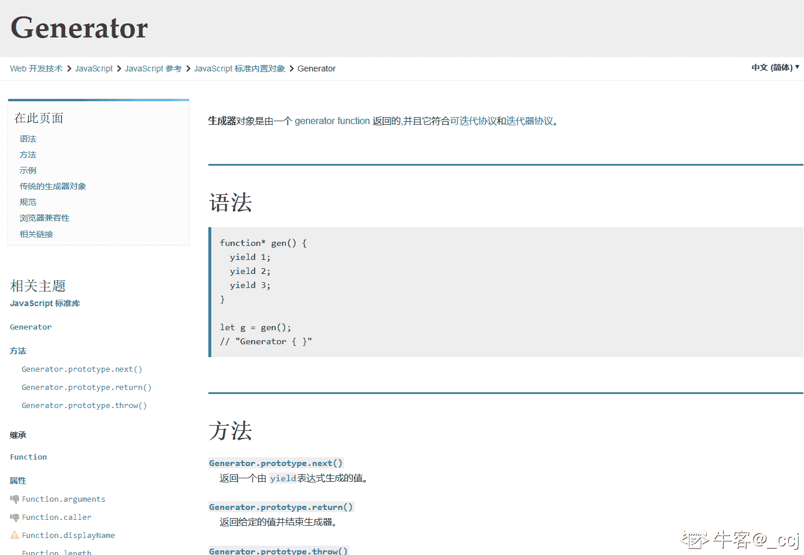
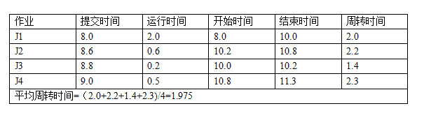

# 百度 2016 研发工程师笔试题（三）

## 1

有如下类模板定义：（）

```cpp
template<class　T> class　BigNumber{ 
    long　n; 
public: 
    BigNumber(T i):n(i){}
    BigNumber　operator+(BigNumber　b)
    { 
        return　BigNumber(n+b.n); 
    } 
};
```

已知 b1,b2 是 BigNumber 的两个对象,则下列表达式中错误的是?

正确答案: D   你的答案: 空 (错误)

```cpp
3+3
```

```cpp
b1+3
```

```cpp
b1+b2
```

```cpp
3+b1
```

本题知识点

C++

讨论

[幻之飞雪](https://www.nowcoder.com/profile/442784)

我的理解是：A.3+3    就是正常的 3+3B.b1+3    是 BigNumber(b1)+BigNumber(3)C.b1+b2    是 BigNumber(b1)+BigNumber(b2)D.3+b1    常数 3 无法匹配到此模版中的+重载函数，编译器无法识别欢迎指正。。。

发表于 2015-09-26 10:43:51

* * *

[cdboy](https://www.nowcoder.com/profile/226237)

运算符重载调用形式其实是：b1.operator+(参数)  简写成 b1+参数 B 会进行类型转换 D 肯定不对啊，3 是 int 类型 肯定无法调用 b1 的加法操作，所以 D 是错的

发表于 2016-01-14 16:56:52

* * *

[cocxx](https://www.nowcoder.com/profile/194612)

D 选项中+ 前面的操作数必须是一个 BigNumber 的对象，3 不是此对象，所以错了！

发表于 2015-09-28 10:38:00

* * *

## 2

下面关于 HTTP/2 的描述错误的是？

正确答案: D   你的答案: 空 (错误)

```cpp
HTTP/2 基于 SPDY 协议,充分解决了 TCP 连接的限制，它允许多个并发 HTTP 请求公用一个 TCP 会话
```

```cpp
针对只能由客户端发起请求的问题，HTTP/2 添加了一种新的交互模式，即服务器推送
```

```cpp
HTTP/2 提供了 HTTP 语义的传输优化，支持 HTTP/1.1 的所有核心特征，并且在其他方面做得更高效
```

```cpp
HTTP/2 是以安全为目标的 HTTP 通道，简单讲是 HTTP 的安全版。即 HTTP 下加入 SSL 层
```

本题知识点

网络基础

讨论

[我是小埋哟](https://www.nowcoder.com/profile/6306378)

**http、2 源自 SPADY/2，**设计目标是降低 50% 的页面加载时间。

相比 HTTP/1.x，HTTP/2 在底层传输做了很大的改动和优化：

1.  HTTP/2 采用**二进制格式**传输数据，而非 HTTP/1.x 的文本格式。二进制格式在协议的解析和优化扩展上带来更多的优势和可能。
2.  HTTP/2 对消息头采用 HPACK 进行压缩传输，能够节省消息头占用的网络的流量。而 HTTP/1.x 每次请求，都会携带大量冗余头信息，浪费了很多带宽资源。头压缩能够很好的解决该问题。
3.  多路复用，直白的说就是所有的请求都是通过 ***一个 TCP*** 连接并发完成。HTTP/1.x 虽然能利用一个连接完成多次请求，但是多个请求之间是有先后顺序的，后面发送的请求必须等待上一个请求返回才能发送响应。这会很容易导致后面的请求被阻塞，而 HTTP/2 做到了真正的并发请求。同时， 流还支持优先级和流量控制。
4.  Server Push：**服务端能够更快的把资源推送给客户端**。例如服务端可以主动把 JS 和 CSS 文件推送给客户端，而不需要客户端解析 HTML 再发送这些请求。当客户端需要的时候，它已经在客户端了。

发表于 2017-03-23 12:03:49

* * *

[JobsLee](https://www.nowcoder.com/profile/210932)

```cpp
HTTP 不是安全的，HTTPS 才是安全的。
1.HTTP（Hypertext Transfer Protocol）超文本传输协议； 2.HTTPS（Secure Hypertext Transfer Protocol）安全超文本传输协议；HTTPS 协议是由 SSL+HTTP 协议构建的可进行加密传输、身份认证的网络协议。
```

发表于 2016-04-28 16:36:13

* * *

[菜小豆](https://www.nowcoder.com/profile/134784)

D 选项描述的应该是 HTTPS；HTTPS（Secure Hypertext Transfer Protocol）安全超文本传输协议；HTTPS 协议是由 SSL+HTTP 协议构建的可进行加密传输、身份认证的网络协议。

发表于 2015-09-25 15:01:56

* * *

## 3

如果系统中就绪队列中进程的个数为 10 个，则系统至少有（）个进程？

正确答案: A   你的答案: 空 (错误)

```cpp
11
```

```cpp
10
```

```cpp
9
```

```cpp
1
```

本题知识点

编译和体系结构

讨论

[TJXUNwu](https://www.nowcoder.com/profile/726739)

进程状态包括就绪，运行，等待；有进程处于就绪状态，则必有进程处于运行状态，不一定有进程处于等待状态。故 10 个进程处于就绪状态，则至少有 1 个进程处于运行状态。

发表于 2015-09-25 14:31:49

* * *

[-尐嘚█](https://www.nowcoder.com/profile/6020229)

有可能是死锁嘛，我这样想然后选了 10

发表于 2017-10-02 13:35:57

* * *

[花开不败](https://www.nowcoder.com/profile/4193109)

会不会出现 cpu 刚开始什么进程也没有运行 ，这十个进程同时进入就绪状态准备进入运行状态？有这种可能嘛，哪个大神解释下，谢谢！

发表于 2016-09-12 22:11:30

* * *

## 4

执行以下代码，下列选项中，说法正确的是（）

```cpp
function * gen() {
    yield 1;
    yield 2;
    yield 3;
}
```

正确答案: C   你的答案: 空 (错误)

```cpp
gen()执行后返回 2
```

```cpp
gen()执行后返回 undefined
```

```cpp
gen()执行后返回一个 Generator 对象
```

```cpp
gen()执行后返回 1
```

本题知识点

Javascript

讨论

[C.C](https://www.nowcoder.com/profile/891159)

这是 ES6 的新 feature， function 后面带  * 的叫做 generator function。函数运行时，返回一个迭代器

编辑于 2016-02-26 20:33:07

* * *

[空空以空空](https://www.nowcoder.com/profile/479441)

**function***声明 (function 关键字后跟一个星号）定义了一个 ***生成器函数* (** *generator function* **)**，它返回一个  [Generator](https://developer.mozilla.org/zh-CN/docs/Web/JavaScript/Reference/Global_Objects/Generator)  对象。

也可以定义  ***生成器函数***使用构造函数  [GeneratorFunction](https://developer.mozilla.org/zh-CN/docs/Web/JavaScript/Reference/GeneratorFunction) 和一个  function* expression

编辑于 2017-03-26 16:57:22

* * *

[_ccj](https://www.nowcoder.com/profile/5396154)

廖雪峰老师将的挺详细，参考链接：[`www.liaoxuefeng.com/wiki/1022910821149312/1023024381818112`](https://www.liaoxuefeng.com/wiki/1022910821149312/1023024381818112)


发表于 2020-07-24 15:47:30

* * *

## 5

单道批处理系统中有 4 个作业，J1 的提交时间 8.0，运行时间为 2.0；J2 的提交时间 8.6，运行时间为 0.6；J3 提交时间 8.8，运行时间为 0.2；J4 的提交时间 9.0，运行时间为 0.5。在采用响应比高者优先调度算法时，其平均周转时间为 T 为（）小时？

正确答案: C   你的答案: 空 (错误)

```cpp
2.5
```

```cpp
1.8
```

```cpp
1.975
```

```cpp
2.675
```

本题知识点

编译和体系结构

讨论

[程序远](https://www.nowcoder.com/profile/480868)

周转时间=作业完成时间-作业  查看全部)

编辑于 2016-09-28 22:22:47

* * *

[小胡同学 ccnu](https://www.nowcoder.com/profile/767514)

选 C 

发表于 2015-10-06 12:58:55

* * *

[牛客 5083195 号](https://www.nowcoder.com/profile/5083195)

作业 J2 的响应比=1+（10.0-8.6）/0.6=3.33 作业 J3 的响应比=1+（10.0-8.8）/0.2=7 作业 J4 的响应比=1+（10.0-9.0）/0.5=3

发表于 2016-08-18 21:20:37

* * *

## 6

设变量已正确定义，以下不能统计出一行中输入字符个数（不包含回车符）的程序段是

正确答案: D   你的答案: 空 (错误)

```cpp
n=0;while(ch=getchar()!='\n')n++;
```

```cpp
n=0;while(getchar()!='\n')n++;
```

```cpp
for(n=0;getchar()!='\n';n++);
```

```cpp
n=0;for(ch=getchar();ch!='\n';n++);
```

本题知识点

C 语言

讨论

[wolfrevoda](https://www.nowcoder.com/profile/414745)

对于 for 循环，其初始条件只执行一次，因此 ch 只从输入流中取一个字符，之后就再不会取字符，因此会死循环

发表于 2016-07-19 11:14:27

* * *

[StrongYoung](https://www.nowcoder.com/profile/649626)

D 只获取了一次字符。

发表于 2015-09-25 17:05:14

* * *

[牛客 819520 号](https://www.nowcoder.com/profile/819520)

D 进入死循环，除非初始值是\n

发表于 2015-09-27 12:08:43

* * *

## 7

iframe 的使用场景有？

正确答案: A B C D   你的答案: 空 (错误)

```cpp
与第三方域名下的页面共享 cookie
```

```cpp
上传图片，避免当前页刷新
```

```cpp
左边固定右边自适应的布局
```

```cpp
资源加载
```

本题知识点

HTML

讨论

[美团校招内推直达](https://www.nowcoder.com/profile/458054)

**iframe 可用在以下几个场景中：**1：典型系统结构，左侧是功能树，右侧就是一些常见的 table 或者表单之类的。为了每一个功能，单独分离出来，采用 iframe。
2：ajax 上传文件。
3：加载别的网站内容，例如 google 广告，网站流量分析。4： 在上传图片时，不用 flash 实现无刷新。5： 跨域访问的时候可以用到 iframe，使用 iframe 请求不同域名下的资源。**也可参考：**[学习 HTML：iframe 用法总结](http://blog.csdn.net/super_marioli/article/details/4437082)[`blog.csdn.net/super_marioli/article/details/4437082`](http://blog.csdn.net/super_marioli/article/details/4437082)

编辑于 2015-09-28 11:21:56

* * *

[牛客 1020300 号](https://www.nowcoder.com/profile/1020300)

现在 iframe 标签常用吗

发表于 2017-05-17 20:41:44

* * *

[Sunshine211](https://www.nowcoder.com/profile/8044822)

Iframe 现在用的地方不太多了

发表于 2017-03-01 11:11:59

* * *

## 8

以下说法正确的是？

正确答案: A B D   你的答案: 空 (错误)

```cpp
在多线程中不加限制的随意访问非 static 局部变量不会导致运算结果出错
```

```cpp
在多线程中不加限制的随意访问非 static 全局变量可能会导致运算结果出错
```

```cpp
在多线程中不加限制的随意访问 static 局部变量不会导致运算结果出错
```

```cpp
在多线程中不加限制的随意访问 static 全局变量可能会导致运算结果出错
```

None

讨论

[雷天琪](https://www.nowcoder.com/profile/112935)

无论是 static 还是非 static 的全局变量，如果不加限制随意访问的话易出现同步问题。无论是 static 还是非 static 的局部变量，每个线程都是私有的，其他线程不会对其进行干扰。

编辑于 2017-04-07 18:53:37

* * *

[搭上最后一班车](https://www.nowcoder.com/profile/993558)

按存储区域分，全局变量、静态全局变量和静态局部变量都存放在内存的静态存储区域，局部变量存放在内存的栈区。按作用域分，全局变量在整个工程文件内都有效；静态全局变量只在定义它的文件内有效；静态局部变量只在定义它的函数内有效，只是程序仅分配一次内存，函数返回后，该变量不会消失；局部变量在定义它的函数内有效，但是函数返回后失效。一组并发线程运行在一个进程的上下文中，每个线程都有它自己独立的线程上下文。例如：栈、程序计数器、线程 ID、条件码等。每个线程和其他的线程一起共享除此之外的进程上下文的剩余部分，包括整个用户的虚拟地址空间，如文件、全局变量、静态数据、堆内存、同步锁变量、组件对象等。每次调用函数时，编译程序将非 static 局部变量放入线程的执行栈中，退出函数时，非 static 局部变量从栈中丢弃。由于每个线程都有专用的运行栈，所以多个线程即使访问同一个函数中的同一个非 static 局部变量，实际上访问的也是不同的内存单元。因此，线程在使用非 static 局部变量时不会与其他线程发生同时访问一个变量的情况。非静态局部变量存在于线程自己独立的空间内，对它的访问可以是随意的，或者说，一个线程内对某非静态局部变量的访问不会影响到另一个线程中该变量的值。题中其他三种类型的变量，编译时都分配到了程序运行空间的数据区，被进程中的所有线程所共享，可能发生多个线程同时访问一个数据的情况。有了共享就要防止在对共享变量进行操作的过程中得到一个不可知的值。使用这些公共资源的线程必须同步。多线程的环境下，线程的执行顺序是不可知的，线程中对变量的访问次序就可能与预想的不一致。并发线程访问一个数据时，可以同时读，但不能同时读和写，也不能同时写，否则会出现错误。即并发线程不加限制的随意访问一个数据会出错。总之，要确保函数线程安全，必须考虑线程之间的共享变量。属于同一进程的不同线程会共享进程内存空间中的全局区和堆，而私有的线程空间则主要包括栈和寄存器。因此，对于同一进程的不同线程来说，每个线程的局部变量都是私有的，而全局变量、局部静态变量、分配于堆的变量都是共享的。在对这些共享变量进行访问时，不能随意，必须通过加锁的方式。

发表于 2016-09-11 17:34:18

* * *

[ZeroCBoy](https://www.nowcoder.com/profile/745102)

我觉得 A 可能应该错在：就是如果线程里面有指针指向其他位置的话，随便访问的话可能会不小心修改到其他线程的某个值。

发表于 2016-06-10 01:01:36

* * *

## 9

数据链路层采用后退 N 帧（GBN）协议，发送方已经发送了编号为 0~7 的帧。当计时器超时时，若发送方只收到 0.2.3 号帧的确认，则发送方需要重发的帧数是？

正确答案: A   你的答案: 空 (错误)

```cpp
4
```

```cpp
2
```

```cpp
3
```

```cpp
5
```

本题知识点

网络基础

讨论

[StrongYoung](https://www.nowcoder.com/profile/649626)

  查看全部)

编辑于 2015-12-24 11:03:18

* * *

[lyric](https://www.nowcoder.com/profile/939710)

收到了 3 号帧的确认，由于是捎带确认，所以说 3 号帧以前的都到了接收端，但是发送方没有收到 1 号帧的确认，只说明 1 号帧的确认丢失了，不需要重传，只传 3 后面的帧就好了。

发表于 2015-10-03 15:52:46

* * *

[不学有术](https://www.nowcoder.com/profile/9502553)

**我觉得这个题目有问题**

基于滑动窗口协议，接收窗口为 1.如若返回 ACK 丢失，则发送方重传该帧。超过重传次数，进行重连。

此题发送方没收到返回的 ACK 信号，必然将 1-7 号帧进行重传。否则，在没有得到确认第一帧是否正确达到接收方的情况下，无法判断误码率为 0。也就不是真正意义上的重传，只是伪重传而已。

发表于 2016-11-21 10:18:39

* * *

## 10

语句 var arr=[a,b,c,d];执行后，数组 arr 中每项都是一个整数，下面得到其中最大整数语句正确的是哪几项？

正确答案: B C D   你的答案: 空 (错误)

```cpp
Math.max(arr)
```

```cpp
Math.max(arr[0], arr[1], arr[2], arr[3])
```

```cpp
Math.max.call(Math, arr[0], arr[1], arr[2], arr[3])
```

```cpp
Math.max.apply(Math,arr)
```

本题知识点

Javascript

讨论

[SuperluminalSnalis](https://www.nowcoder.com/profile/3962359)

Math.max(args...)传入参数是任意数量的值 A  传入数组,所以错误 B  可以 C  Function.call()可以传入任意多个参数,C 正确 D  Function.apply()第二个参数以数组形式传递,D 正确

发表于 2016-09-23 16:04:32

* * *

[水晶之恋](https://www.nowcoder.com/profile/774992)

A 选项错误     因为函数 Math.max(x);的参数是 Number 类型，可以是小数，整数，正数，负数或者是 0.如果不是上面所述类型就会返回 NaN.

编辑于 2016-03-09 18:51:37

* * *

[hellowww](https://www.nowcoder.com/profile/924580)

js 函数调用，如果未指明函数所指的类，即直接调用 functionA（），this 关键字指向当前环境即 window 对象，相当于调用 window.functionA()。call、apply 方法的第一个参数是 this 关键字，即指明 functionA()是哪一个对象的方法。apply 以数组传递参数，call 独立传递。

发表于 2015-10-13 20:44:08

* * *

## 11

下面对于 cookie 的描述中错误的是？

正确答案: C   你的答案: 空 (错误)

```cpp
如果在一台计算机中安装多个浏览器，每个浏览器都会以独立的空间存放 cookie
```

```cpp
Cookie 的大小限制在 4kb 左右，对于复杂的存储需求来说是不够用的
```

```cpp
Cookie 通过 HTTP Headers 从浏览器端发送到服务器端并存储在服务器端
```

```cpp
由于在 HTTP 请求中的 Cookie 是明文传递的，所以安全性成问题
```

本题知识点

网络基础

讨论

[LEarBB](https://www.nowcoder.com/profile/708350)

cookie 是存储在客户端 session 是存储在服务端

发表于 2015-10-03 22:26:56

* * *

[SKY 的幻想 HA](https://www.nowcoder.com/profile/450241)

Cookie，有时也用其复数形式 [Cookies](http://baike.baidu.com/subview/1311/6319629.htm) ，指某些网站为了辨别用户身份、进行 session 跟踪而储存在用户本地终端上的数据（通常经过加密）。 简单来说，Cookies 就是服务器暂时存放在你的电脑里的资料（.txt 格式的文本文件），好让服务器用来辨认你的计算机。

发表于 2015-10-09 12:14:02

* * *

[StrongYoung](https://www.nowcoder.com/profile/649626)

cookie 是存储在客户端的

发表于 2015-09-25 17:00:26

* * *

## 12

在 KMP 算法中，已知模式串为 ADABCADADA,请写出模式串的 next 数组值？

正确答案: A   你的答案: 空 (错误)

```cpp
0，1，1，2，1，1，2，3，4，3
```

```cpp
0，1，1，1，2，1，2，3，4，3
```

```cpp
2，1，1，2，1，1，2，3，3，4
```

```cpp
1，2，3，2，1，1，2，4，4，3
```

本题知识点

高级结构

讨论

[森森特](https://www.nowcoder.com/profile/126234)

KMP 算法：分为模式串和主串  查看全部)

编辑于 2016-04-22 18:27:19

* * *

[程序远](https://www.nowcoder.com/profile/480868)

我算出来的是（参考：http://blog.csdn.net/v_july_v/article/details/7041827）：A D A B C A D A D A-1 0 0 1 0 0 1 2 3 2 但题目的意思好像以 0 开头，算出来的每项加一，不影响结果。0 1 1 2 1 1 2 3 4 3 选 A

发表于 2015-09-26 18:14:02

* * *

[游荡 de 鱼](https://www.nowcoder.com/profile/569077)

在包含 Pj ( 0 <= j <= n - 1)的序列中，求出前缀后缀相同的最大长度 a  d  a  b  c  a  d  a  d  a0  0  1  0  0  1  2  3  2  3 在将该结果向右移动一位，并用-1 填充第 0 位-1 0  0  1   0  0  1  2  3  2 整体加 10  1  1  2  1  1  2  3  4  3 因此选择 A

发表于 2016-08-23 17:21:12

* * *