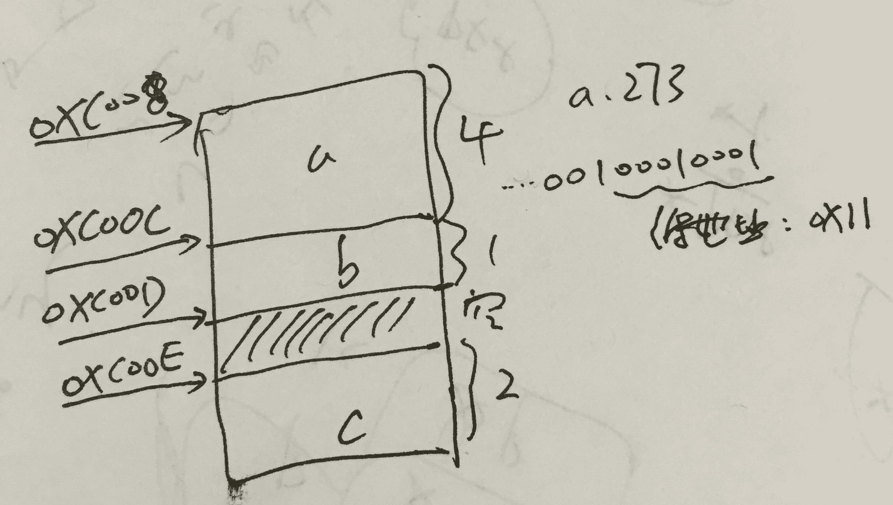
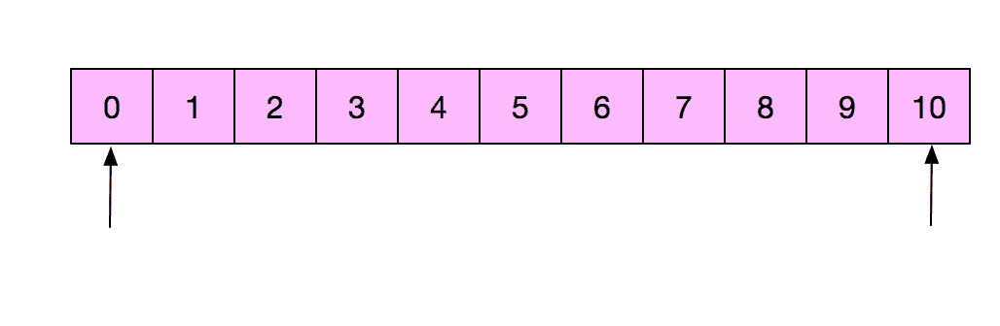
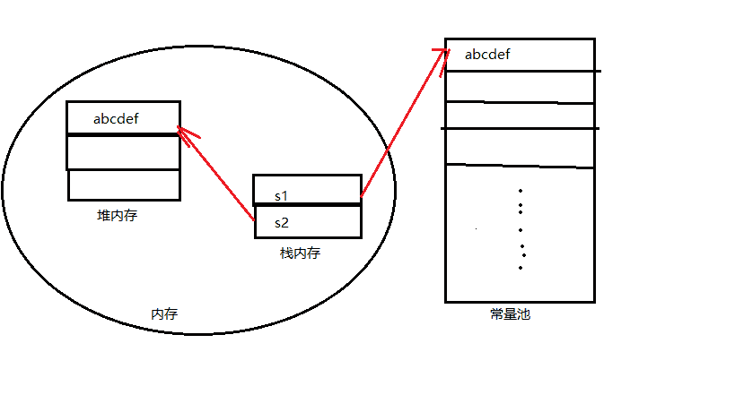
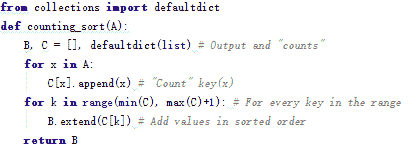
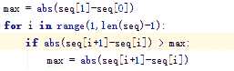

# 美团 2016 研发工程师笔试题(一)

## 1

某计算机存储器按字节编址，采用小端方式存放数据。 假定编译器规定 int 型和 short 型长度分别为 32 位和 16 位并且数据按边界对齐存储。某 C 语言程序段如下：

```cpp
struct{ 
    int a；
    char b；
    short c；
} 
record；
record.a=273；
```

若 record 变量的首地址为 0XC008，则低地址 0XC008 中内容及 record.c 的地址是 （ ）

正确答案: B   你的答案: 空 (错误)

```cpp
0X00、0XC00D
```

```cpp
0X11、0XC00E
```

```cpp
0X11、0XC00D
```

```cpp
0X00、0XC00E
```

本题知识点

编译和体系结构 C++工程师 Java 工程师 美团 2016

讨论

[大菜鸟大菜狗](https://www.nowcoder.com/profile/905766)

B：

编辑于 2015-09-28 13:51:04

* * *

[Alan123](https://www.nowcoder.com/profile/844048)

char b 为啥是 2 字节大小

发表于 2015-09-29 23:58:15

* * *

[大漠孤狼](https://www.nowcoder.com/profile/527123)

答案：B1、按照对齐要求，a  占 4 个字节，b  占 2 个字节，c  占 2 个字节 2、 273 = 0X0000 0111，机器采用小端存放数据（即高字节存放高地址，低字节存放低地址）， 0XC008 处存放 11， 0XC008  存放 01……3、从起始位置到存放 c 位置占用 6 个字节， 0XC008 + 6 指向  0XC00E

发表于 2015-09-29 16:10:39

* * *

## 2

给定一个整数 sum,从有 N 个有序元素的数组中寻找元素 a,b,使得 a+b 的结果最接近 sum,最快的平均时间复杂度是：

正确答案: A   你的答案: 空 (错误)

```cpp
O(n)
```

```cpp
O(nlogn)
```

```cpp
O(n²)
```

```cpp
O(logn)
```

本题知识点

查找 *C++工程师 Java 工程师 美团 2016* *讨论

[大漠孤狼](https://www.nowcoder.com/profile/527123)

答案：O(n)思想类似于两端向中间扫描 1、设定两个指针 P1、P2，分别指向数组开始和结尾，即 P1 指向最小值，P2 指向最大值；2、计算 *P1+*P2 的值为 SUM，与 sum 比较，记录它们的差值 DIF 和 SUM，若 SUM<sum，P1++，若 SUM>sum，P2--;3、重复以上过程直到 DIF 最小

发表于 2015-09-29 16:46:08

* * *

[sunlight_run](https://www.nowcoder.com/profile/6428287)

设置两个指针，指向首、尾两元素。如果和大于 sum 就将后端指针左移，如果和小于 sum，就将前端指针右移！

发表于 2017-06-30 11:12:22

* * *

[DQ_DM](https://www.nowcoder.com/profile/891937)

```cpp
#include <iostream>
#include <cmath>
#include <climits>
using namespace std;

void FindClosestPair(int *a,int n,int sum)
{
    int i=0,j=n-1;
    int dif=INT_MAX;
    int Start=0,End=0; //存储输出的元素
    while(i<n&&j>i)
    {
        if(abs(a[i]+a[j]-sum)<dif)
        {
            Start=a[i];
            End=a[j];
            dif=abs(a[i]+a[j]-sum);
        }
        else if(a[i]+a[j]<sum)
        { //若当前差值依然是最小的，并且两数之和比期望值小，
          //说明应该增大左边的值
            i++;
        }
        else
        {
            j--;
        }
    }
    cout<<Start<<" "<<End<<endl;
}

int main()
{
    int a[]={-5,-1,0,1,4,5,7,9};
    FindClosestPair(a,8,8);
    return 0;
}
```

发表于 2015-10-05 10:52:19

* * *

## 3

给定一个数组，可以从数组中取出下标不连续的任意个数，求可以取出的数的和的最大值，例如：给出数组 A[]={1,2,2,5,3,4,3}可以取出的最大和为 2+5+4=11。现再给定数组{3,9,7,5,1,3,1,2,7}，能取出的数的和的最大值是

正确答案: B   你的答案: 空 (错误)

```cpp
38
```

```cpp
24
```

```cpp
22
```

```cpp
19
```

本题知识点

动态规划 C++工程师 Java 工程师 美团 2016

讨论

[牛客 148381 号](https://www.nowcoder.com/profile/148381)

http://blog.csdn.net/yang20141109/article/details/51169991

发表于 2016-04-16 20:47:51

* * *

[菜小豆](https://www.nowcoder.com/profile/134784)

9 5 3 7；如果严格证明的话，应该需要动态规划的方法。

发表于 2015-09-28 14:30:35

* * *

[xttty](https://www.nowcoder.com/profile/3532824)

f[i]=max{f[i-2]+a[i],f[i-1]} f[i]表示前 i 个数中能取到的最大值

发表于 2017-03-08 17:14:54

* * *

## 4

一个节点数>5 的树，至少删去几个结点才可以使该树不连通？

正确答案: B   你的答案: 空 (错误)

```cpp
0
```

```cpp
1
```

```cpp
2
```

```cpp
3
```

本题知识点

树 C++工程师 Java 工程师 美团 2016

讨论

[大菜鸟大菜狗](https://www.nowcoder.com/profile/905766)

B：树中没有环，所以只有删除的那个节点不是叶节点，都会导致该树不连通

发表于 2015-09-28 19:12:50

* * *

[WRI-蒋](https://www.nowcoder.com/profile/5978810)

没有懂这题的意思？什么叫“树不连通”？

发表于 2017-01-13 19:45:52

* * *

[波儿胖](https://www.nowcoder.com/profile/124777)

删除根就可以了....

发表于 2015-09-28 15:00:29

* * *

## 5

计算 50 的阶乘，结果末尾处有多少个 0？

正确答案: C   你的答案: 空 (错误)

```cpp
10
```

```cpp
11
```

```cpp
12
```

```cpp
13
```

本题知识点

数学运算

讨论

[大漠孤狼](https://www.nowcoder.com/profile/527123)

答案：C50！末尾 0 的个数，即求 50！中 2X5 的因子的个数，有多少个  2X5 的因子，就有多少个 0 由于 2 的因子个数远大于 5 的个数，所以转换为求 5 的因子个数 1~50 中，有 5 10 15 20 **25**(5X5) 30 35 40 45 **50**(5X5X2)，注意黑体的有两个 5，总共 12 个

发表于 2015-09-29 16:53:03

* * *

[StrongYoung](https://www.nowcoder.com/profile/649626)

只要有一个 5，就会有一个 0，例如 25=5*5，即 25 可以产生 2 个 050/5=1010/5=22/5=010+2+0=12 所以，末尾一共有 12 个 0

编辑于 2015-09-28 22:02:25

* * *

[ciphersaw](https://www.nowcoder.com/profile/543695)

选 C**5 与偶数相乘末尾是 0，与奇数相乘末尾是 5**∵5！=5×4！=5×24=120∴保证了后面只要出现因子 5 与之相乘，末尾必多加一个 0 又∵在 1-50 这 50 个数中，只有 5 10 15 20 25 30 35 40 45 50 存在因子 5，且除了 25 与 50 的因子中出现两次 5，其他的因子中仅有一次 5∴总共有 12 个因子 5∴末尾有 12 个 0

发表于 2016-11-13 16:27:40

* * *

## 6

下列哪个整数是否具有以下性质：将该整数每位的数平方后相加，得到一个新的数，如此循环下去，最后能得到 1。例如：整数 7

```cpp
7²=49
4²+9²=97
9²+7²=130
1²+3²+0²=10
1²+0²=1
```

正确答案: D   你的答案: 空 (错误)

```cpp
16
```

```cpp
17
```

```cpp
18
```

```cpp
19
```

本题知识点

数学运算

讨论

[小杨 vita](https://www.nowcoder.com/profile/576504)

这种题目一般都是用来消耗时间的，我的做法就是从最后一个选项开始算

发表于 2015-09-28 18:23:39

* * *

[大漠孤狼](https://www.nowcoder.com/profile/527123)

方法 1：一个一个算方法 2：最后要得到 1，最后一次得到的数必须为 10,100,1000……，且这个数是两个数的平方和，题目中已给出 10，根据数的大小判断下面求的应该是 100。数字的平方和有 1 4 9 16 25 36 49 64 81，36+64=100，即 68 或者 86，其中 86 不是两个数的平方和，68 = 64 +4；所以前一个数为 82 或 28，其中 28 不是两个数的平方和，82 = 1+81，所以上两个数为 19 或 91 如果采用方法 2 可能计算时间更长，这里只是给出了另一种思路参考，具体遇到怎么算看自己选择

发表于 2015-09-29 17:06:33

* * *

[时间信使](https://www.nowcoder.com/profile/6132426)

机智如我，我觉得出题人就是想着让一个一个算的浪费时间，所以把正确答案放在最后，所以我就从最后一个算起，果然一试一个准！当然，找到其中的规律，对应这类题编程才是王道啊~·

发表于 2016-09-08 22:32:44

* * *

## 7

关于以下程序段，正确的说法是：（）

```cpp
String s1="abc"+"def";//1
String s2=new String（s1);//2
if(s1.equals(s2))//3
System.out.println(".equals succeeded");//4
if(s1==s2)//5
System.out.println("==succeeded");//6
```

正确答案: C   你的答案: 空 (错误)

```cpp
行 4，行 6 都不执行
```

```cpp
行 6 执行，行 4 不执行
```

```cpp
行 4 执行，行 6 不执行
```

```cpp
行 4，行 6 都将执行
```

本题知识点

Java C++工程师 Java 工程师 美团 2016

讨论

[CHN_ByteDance](https://www.nowcoder.com/profile/428675)

equal 比较对象的值，==比较地址。

发表于 2016-04-06 21:56:28

* * *

[...蚂蚁...](https://www.nowcoder.com/profile/184257)

c 是对的，equals（）比较的是字符串的内容，==比较的是内存地址值 s1 存放在常量池中 s2 存放在堆区中  内存地址值是不一样的

发表于 2015-10-06 23:47:18

* * *

[文东](https://www.nowcoder.com/profile/358211)

```cpp
问：String s1="abc"; s2="abc"； s3= new String("abc")；为啥 s1 和 s2 的地址值一样而 s1 和 s3 的就不一样呢？也就是，为什么 s1==s2 但 s1!=s3 呢？

答：先是在内存里创建了一个 abc 字符串，然后 s1 指向 abc，s2 要指向 abc，内存中已经有 abc，所以 s1 和 s2 地址相同，s3 指向的是新字符串 abc 的地址，所以 s1 与 s3 不同，s1==s2 但 s1!=s3，因为 s1,s2，s3 是引用，比较的是地址而不是内容，所以有这个结果，比较值是否相同应该用。equal 函数而不能直接用==
```

发表于 2015-09-28 15:15:22

* * *

## 8

有如下一段程序：

```cpp
int f1(float);
int f2(char);
int f3(float);
int f4(float);
int (*pf)(float);
```

则以下不合法的是（）

正确答案: C   你的答案: 空 (错误)

```cpp
int (*p)(float) = &f1;
```

```cpp
pf = &f4;
```

```cpp
pf = &f2;
```

```cpp
pf = f3;
```

本题知识点

C++ C++工程师 美团 2016 C 语言

讨论

[老干呆](https://www.nowcoder.com/profile/263859)

C 知识点：

*   函数指针变量：

函数指针变量的声明方法为：返回值类型 ( * [指针变量](http://baike.baidu.com/view/379211.htm)名) ([[形参](http://baike.baidu.com/view/1158689.htm)列表]);
根据定义，
int(*pf)(float);
int (*p)(float)=&f1;
pf,p 都是函数指针变量。

*   函数地址

C 在编译时，每一个函数都有一个入口地址，该入口地址就是函数指针所指向的地址。
函数地址的获取，可以是函数名，也可以在函数名前加取地址符&

C 错误是因为函数行参类型不匹配。

发表于 2015-09-28 10:54:07

* * *

[风拔萝卜](https://www.nowcoder.com/profile/7023473)

函数指针所指向的函数，返回值类型，形参列表必须完全匹配，对函数指针赋值可以采用以下方式 pf＝&p1 或者 pf＝p1

发表于 2016-09-06 07:17:41

* * *

[媛媛不贪睡](https://www.nowcoder.com/profile/742261)

函数名等价于函数名取地址 C

编辑于 2015-12-06 00:18:46

* * *

## 9

下列关于对象数组的描述中，()是错误的.

正确答案: A   你的答案: 空 (错误)

```cpp
对象数组只能赋初值而不能再赋值
```

```cpp
对象数组的每个元素是同一个类的对象
```

```cpp
对象数组的数组名是一个指针常量
```

```cpp
对象数组的下标是从 0 开始的
```

本题知识点

C++ C++工程师 Java 工程师 美团 2016

讨论

[大菜鸟大菜狗](https://www.nowcoder.com/profile/905766)

A
肯定是可以再赋值的，只不过在赋值的时候一定要为对象的数据成员分别赋值

```cpp
#include<iostream>
using namespace std;
class A{
public:
 int a;
 int b;
};
A arr[2];
int main()
{
 for(int i=0;i<2;++i)
 {
  arr[i].a=2;
  arr[i].b=1;
 }
 arr[0].a=4;
 arr[0].b=3;
 for(i=0;i<2;++i)
  printf("%d,%d\n",arr[i].a,arr[i].b);
 return 0;
}

```

发表于 2015-09-28 18:43:14

* * *

[转基因奔奔](https://www.nowcoder.com/profile/503704)

C：指针常量是指指针本身是个常量，不能更改指代对象常量指针是说这个指针指向的对象是个常量，不可改变。这题是不是没分清楚。不过如果是英文的话就不会这么玩儿文字游戏了。。。A：表述的也不明确，对象数组赋值是整体赋值么？还是逐个元素赋值？前者不可行啊。

发表于 2016-03-23 10:02:24

* * *

[zt_xcyk](https://www.nowcoder.com/profile/839070)

A 给对象数组赋值的时候 应该就像拷贝构造那样 需要给里面的数据成员都赋值

发表于 2015-09-30 20:59:47

* * *

## 10

待测试的大众点评主页打不开（不是 40x，50x）这样的错误，是无法链接，可能原因有哪些？怎么排查？

你的答案

本题知识点

网络基础 C++工程师 Java 工程师 美团 2016

讨论

[美团校招内推直达](https://www.nowcoder.com/profile/458054)

1.由 DNS 错误导致的打不开  查看全部)

编辑于 2016-02-23 23:12:42

* * *

[小小](https://www.nowcoder.com/profile/59)

*   1.自身防火墙拦截。关掉防火墙
*   2.电脑网络问题。尝试别的网站
*   3.DNS 解析问题。确定 DNS 解析地址是服务器地址
*   4.nginx 等负载均衡配置问题。

发表于 2015-09-28 10:53:20

* * *

[幻影迷风](https://www.nowcoder.com/profile/754550)

可能 URL 被劫持，导致无法正确的访问服务器可以访问另一个网站的主页，查看是否有回应

发表于 2015-09-29 16:59:37

* * *

## 11

N 个未排序的整数，在线性时间内，求这 N 个整数在数轴上相邻两个数之间的最大差值(请写出关键算法)

你的答案

本题知识点

查找 *C++工程师 Java 工程师 美团 2016* *讨论

[小杨 vita](https://www.nowcoder.com/profile/576504)

使用改进的桶排序即可，详见
http://ask.julyedu.com/question/751

发表于 2015-09-28 18:29:26

* * *

[傅 sir](https://www.nowcoder.com/profile/147415)

要求在线性时间内完成，可以使用桶排序（计数排序/基数排序）解决。

排序前： [-5, -3, -5, -3, 9, -6, 3, 1, -3, -8]
排序后： [-8, -6, -5, -5, -3, -3, -3, 1, 3, 9]

计算相邻两数之间的差值，得出最大值。


排序前： [-5, -3, -5, -3, 9, -6, 3, 1, -3, -8]
排序后： [-8, -6, -5, -5, -3, -3, -3, 1, 3, 9]
最大值： 6

编辑于 2015-09-29 16:33:15

* * *

[小虎牙](https://www.nowcoder.com/profile/512935)


发表于 2015-10-26 09:21:01

* * *

## 12

假设 A 公司和 B 公司有一些业务上的相关性，AB 两公司员工经常相互访问对方的页面或 APP，请问如何利用 A 公司任何可收集的数据(用户属性,网页端日志，APP 端日志等),来辅助定位 B 公司员工的设备 ID（电脑，收集）？要求给出数据说明，简单的数据分析过程和使用过程。

你的答案

本题知识点

网络基础 C++工程师 Java 工程师 美团 2016

讨论

[啦啦啦队长](https://www.nowcoder.com/profile/4117956)

1\. 对所有用户行为进行聚类，可以获得 B 公司员工的集合，缩小了范围；2\. 收集源 MAC 地址，就可以知道 B 公司的设备 ID 了。

发表于 2017-08-22 10:37:20

* * *

[橙子夏 _6cd](https://www.nowcoder.com/profile/868395)

抛砖引玉。可以根据 B 公司的 IP 获取员工的 UserID 再根据 UserID 获取设备 ID

发表于 2015-09-30 11:24:56

* * ***