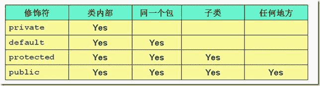
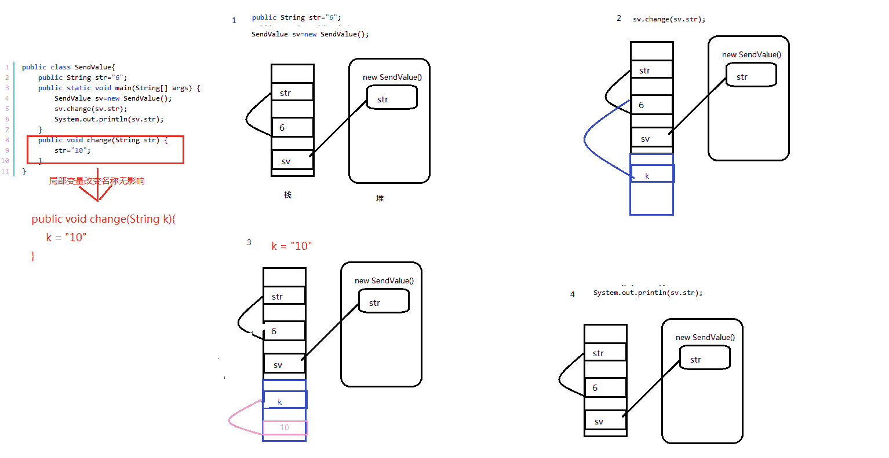
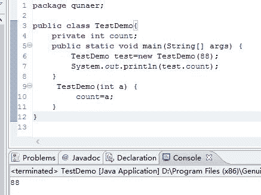

# 爱奇艺 2016 研发工程师笔试题

## 1

类 Test1 定义如下:

```cpp
public class Test1{//1
    public float aMethod(float a,float b){}//2 
    //3
}//4
```

将以下哪种方法插入行 3 是不合法的。

正确答案: C   你的答案: 空 (错误)

```cpp
public int aMethod(int a,int b){}
```

```cpp
private float aMethod(int a,int b,int c){}
```

```cpp
public float aMethod(float a,float b){}
```

```cpp
public float aMethod(float a,float b,float c){}
```

本题知识点

Java

讨论

[美团校招内推直达](https://www.nowcoder.com/profile/458054)

**答案：C****关于方法的重载**  查看全部)

编辑于 2016-05-27 11:51:28

* * *

[VagrantYang](https://www.nowcoder.com/profile/6863719)

重载的概念是：
方法名称相同，参数个数、次序、类型不同
因此重载对返回值没有要求，可以相同，也可以不同
但是如果参数的个数、类型、次序都相同，方法名也相同，仅返回值不同，则无法构成重载。

> 此题出的不是很好，没有考察到返回类型是否起到对重载有作用的考察，建议将 C 选项改为：public int aMethod(float a,float b){}

发表于 2017-07-08 15:21:34

* * *

[szs_life](https://www.nowcoder.com/profile/681837)

重复了。。。。同是 public float aMethod(float a,float b){}

发表于 2015-10-10 10:59:06

* * *

## 2

以下关于 java 封装的描述中，正确的是：

正确答案: A   你的答案: 空 (错误)

```cpp
封装的主要作用在于对外隐藏内部实现细节，增强程序的安全性
```

```cpp
封装的意义不大，因此在编码中尽量不要使用
```

```cpp
如果子类继承父类，对于父类中进行封装的方法，子类仍然可以直接调用
```

```cpp
只能对一个类中的方法进行封装，不能对属性进行封装
```

本题知识点

Java

讨论

[美团校招内推直达](https://www.nowcoder.com/profile/458054)

**答案：A****关于封装：**  查看全部)

编辑于 2015-12-15 10:56:19

* * *

[BrainerGao](https://www.nowcoder.com/profile/516342)

封装主要是隐藏内部代码；继承主要是复用现有代码；多态主要是改写对象行为。

发表于 2017-01-12 15:30:27

* * *

[牛客 692087 号](https://www.nowcoder.com/profile/692087)

对于 C 选项，private 修饰的父类方法，子类没有对父类私有方法的访问权限。

发表于 2015-11-25 12:52:45

* * *

## 3

以下程序执行的结果是：

```cpp
class X{
	Y y=new Y();
	public X(){
		System.out.print("X");
	}
}
class Y{
	public Y(){
		System.out.print("Y");
	}
}
public class Z extends X{
	Y y=new Y();
	public Z(){
		System.out.print("Z");
	}
	public static void main(String[] args) {
		new Z();
	}
}
```

正确答案: C   你的答案: 空 (错误)

```cpp
ZYXX
```

```cpp
ZYXY
```

```cpp
YXYZ
```

```cpp
XYZX
```

本题知识点

Java

讨论

[美团校招内推直达](https://www.nowcoder.com/profile/458054)

**答案 C****初始化过程： ****1.** **初始化父类中的静态成员变量和静态代码块** **； ****2.** **初始化子类中的静态成员变量和静态代码块** **； ****3.初始化父类的普通成员变量和代码块，再执行父类的构造方法；****4.初始化子类的普通成员变量和代码块，再执行子类的构造方法； ****（1）初始化父类的普通成员变量和代码块，执行  Y y=new** **Y();** ** 输出 Y ****（2）再执行父类的构造方法；输出 X****（3）** **初始化子类的普通成员变量和代码块，执行  Y y=new**  **Y();** ** 输出 Y ****（4）再执行子类的构造方法；输出 Z**** 所以输出 YXYZ**

编辑于 2015-10-12 10:57:43

* * *

[菜小豆](https://www.nowcoder.com/profile/134784)

**1.父类静态代码块 （  java 虚拟机加载类时，就会执行该块代码，故只执行一次）****2 .子类静态代码块 （  java 虚拟机加载类时，就会执行该块代码，故只执行一次）****3.** **父类属性对象初始化****4.父类普通代码块（每次 new,每次执行** **）****5.** **父类构造函数（每次 new,每次执行）****6.子** **类** **属性对象初始化**

**7.子类普通代码块（每次 new,每次执行** **）**

**8.子** **类构造函数（每次 new,每次执行）**

发表于 2015-10-10 16:23:44

* * *

[风屿 alter](https://www.nowcoder.com/profile/213475)

```cpp
 /* 
 涉及继承：
 a.初始化父类中的静态成员变量和静态代码块  
 b.初始化子类中的静态成员变量和静态代码块
 c.初始化父类的普通成员变量和构造代码块(按次序)，再执行父类的构造方法
 d.初始化子类的普通成员变量和构造代码块(按次序)，再执行子类的构造方法
 */
class X {
   {System.out.print("1");}

    Y y=new Y();

    public X(){
        System.out.print("X");
    }

    {System.out.print("2");}
}
class Y{
    public Y(){
        System.out.print("Y");
    }
}
public class Z extends X {
    {System.out.print("3");}
    Y y=new Y();
    public Z() {
        System.out.print("Z");
    }
    {System.out.print("4");}
    public static void main(String[] args) {
        new Z();
    }
}
```

result：**1Y2X3Y4Z**

编辑于 2015-12-28 16:22:55

* * *

## 4

instanceof 运算符能够用来判断一个对象是否为:

正确答案: C   你的答案: 空 (错误)

```cpp
一个类的实例
```

```cpp
一个实现指定接口的类的实例
```

```cpp
全部正确
```

```cpp
一个子类的实例
```

本题知识点

Java

讨论

[牛客 370703 号](https://www.nowcoder.com/profile/370703)

**instance 是 java 的二元运算符，用来判断他左边的对象是否为右面类（接口，抽象类，父类）的实例**

发表于 2015-10-28 19:35:05

* * *

[心静](https://www.nowcoder.com/profile/437950)

```cpp
interface A{

}
class B implements A{

}
class C extends B{

}
public class Iinstanceof {

	public static void main(String[] args) {
		A ab=new B();
		A ac=new C();
		B bc=new C();
		B bb=new B();
		C cc=new C();
		//对象实现一个接口，用这个对象和这个接口进行 instanceof 判断，都为 true。
		System.out.println("ab instanceof A="+(ab instanceof A));
		System.out.println("ac instanceof A="+(ac instanceof A));
		System.out.println("bc instanceof A="+(bc instanceof A));
		System.out.println("bb instanceof A="+(bb instanceof A));
		System.out.println("cc instanceof A="+(cc instanceof A));
		//对象和父类进行 instanceof 判断，都为 true
		System.out.println("ab instanceof B="+(ab instanceof B));
		System.out.println("ac instanceof B="+(ac instanceof B));
		System.out.println("bc instanceof B="+(bc instanceof B));
		System.out.println("bb instanceof B="+(bb instanceof B));
		System.out.println("cc instanceof B="+(cc instanceof B));
		//对象和他的子类进行 instanceof 判断为 false
		System.out.println("ab instanceof C="+(ab instanceof C));
		System.out.println("ac instanceof C="+(ac instanceof C));
		System.out.println("bc instanceof C="+(bc instanceof C));
		System.out.println("bb instanceof C="+(bb instanceof C));
		System.out.println("cc instanceof C="+(cc instanceof C));
	}
}
```

程序输出：
ab instanceof A=true
ac instanceof A=true
bc instanceof A=true
bb instanceof A=true
cc instanceof A=true
ab instanceof B=true
ac instanceof B=true
bc instanceof B=true
bb instanceof B=true
cc instanceof B=true
ab instanceof C=false
ac instanceof C=true
bc instanceof C=true
bb instanceof C=false
cc instanceof C=true

编辑于 2015-10-10 16:01:37

* * *

[kungfupandazhs](https://www.nowcoder.com/profile/6730818)

C，instanceof 是 JAVA 中的关键字，用来判断一个对象是不是一个类的实例，是不是一个类的子类，是不是一个接口的实现类

发表于 2016-09-06 22:01:48

* * *

## 5

如果一个方法或变量是"private"访问级别，那么它的访问范围是:

正确答案: D   你的答案: 空 (错误)

```cpp
在当前类，或者子类中
```

```cpp
在当前类或者它的父类中
```

```cpp
在当前类，或者它所有的父类中
```

```cpp
在当前类中
```

本题知识点

Java

讨论

[美团校招内推直达](https://www.nowcoder.com/profile/458054)

**答案 D：**

发表于 2015-10-12 11:01:39

* * *

[花不掉泪](https://www.nowcoder.com/profile/767385)

答案，D。private 修饰的方法和变量只能在当前类中访问                 不带任何修饰符，只能在同一包内的类中，被访问                 protected 只能在子类或者当前类中被访问                public 所有类中可以访问

发表于 2015-10-11 16:37:55

* * *

[村雨遥](https://www.nowcoder.com/profile/806383223)

| 作用域 | 当前类 | 子类 | 同一 `package` 的类 | 其他 `package` 的类 |
| --- | --- | --- | --- | --- |
| `public` | 😀 | 😀 | 😀 | 😀 |
| `protected` | 😀 | 😀 | 😀 | 😡 |
| `private` | 😀 | 😡 | 😡 | 😡 |
| `default` | 😀 | 😡 | 😀 | 😡 |

发表于 2020-08-15 21:18:40

* * *

## 6

init 启动进程需要读取()配置文件

正确答案: D   你的答案: 空 (错误)

```cpp
/sbin/init
```

```cpp
/bin/sh
```

```cpp
/etc/sysvinit
```

```cpp
/etc/inittab
```

本题知识点

Linux

讨论

[心静](https://www.nowcoder.com/profile/437950)

/sbin/init 在核心完整的加载后，开始运行系统的第一支程序，主要的功能就是准备软件运行的环境，包括系统的主机名称、网络配置、语系处理、文件系统格式及其他服务的启动等。 /bin/sh 解释脚本的 shell 命令，开机后运行/etc/sysvinit 就是 system V 风格的 init 系统，顾名思义，它源于 System V 系列 UNIX。sysvinit 中运行模式描述了系统各种预订的运行模式。/etc/inittab 定义了系统引导时的运行级别, 进入或者切换到一个运行级别时做什么。

编辑于 2015-10-10 16:27:37

* * *

[🔍搜索 offer 中](https://www.nowcoder.com/profile/7482002)

Linux 启动流程：1，BIOS 加电自检；2，从硬盘 0 柱面 0 磁道 第一扇区读 512 字节的 MBR 主引导记录；3，运行引导程序 Grub 并根据其配置加载 kernel 镜像后初始化；4，根据/etc/inittab 中系统初始化配置执行/etc/rc.sysinit 脚本；5，根据第 3 步读到的 runlevel 值启动对应服务；6，运行/etc/rc.local;7，生成终端待用户登录。

发表于 2017-04-02 10:16:26

* * *

[每天进步二点点](https://www.nowcoder.com/profile/759918)

1,启动 init 进程的配置文件是/etc/inittab2,/etc/sysvinit 是系统初始化用的

编辑于 2015-10-13 10:09:27

* * *

## 7

有关线程的叙述正确的是()

正确答案: C D   你的答案: 空 (错误)

```cpp
可以获得对任何对象的互斥锁定
```

```cpp
通过继承 Thread 类或实现 Runnable 接口，可以获得对类中方法的互斥锁定
```

```cpp
线程通过使用 synchronized 关键字可获得对象的互斥锁定
```

```cpp
线程调度算法是平台独立的
```

本题知识点

Java

讨论

[宝宝^_^](https://www.nowcoder.com/profile/829341)

A，“任何对象”锁定，太绝对了，你能锁住你没有权限访问的对象吗？B，前半句话讲的是创建线程的方式，后半句讲的是锁定，驴头不对马嘴。C，正确。D，线程调度分为协同式调度和抢占式调度，Java 使用的是抢占式调度，也就是每个线程将由操作系统来分配执行时间，线程的切换不由线程本身来决定（协同式调度）。这就是平***立的原因。以上，选 CD

发表于 2016-07-22 10:35:57

* * *

[Pandora](https://www.nowcoder.com/profile/266279)

线程的互斥锁机制：synchronized，lock，conditionRef：http://blog.csdn.net/vking_wang/article/details/9952063

发表于 2015-10-11 15:46:31

* * *

[一见](https://www.nowcoder.com/profile/1387998)

一般线程调度模式分为两种——抢占式调度和协同式调度。抢占式调度指的是每条线程执行的时间、线程的切换都由系统控制，系统控制指的是在系统某种运行机制下，可能每条线程都分同样的执行时间片，也可能是某些线程执行的时间片较长，甚至某些线程得不到执行的时间片。在这种机制下，一个线程的堵塞不会导致整个进程堵塞。协同式调度指某一线程执行完后主动通知系统切换到另一线程上执行，这种模式就像接力赛一样，一个人跑完自己的路程就把接力棒交接给下一个人，下个人继续往下跑。线程的执行时间由线程本身控制，线程切换可以预知，不存在多线程同步问题，但它有一个致命弱点：如果一个线程编写有问题，运行到一半就一直堵塞，那么可能导致整个系统崩溃。  
java 采用的是抢占式调度方式。

发表于 2018-03-09 16:08:37

* * *

## 8

要求在重新启动 Linux 系统，下面那个命令不可以：

正确答案: B   你的答案: 空 (错误)

```cpp
#shutdown -r now
```

```cpp
#halt
```

```cpp
#reboot
```

```cpp
#init6
```

本题知识点

Linux

讨论

[心静](https://www.nowcoder.com/profile/437950)

在 linux 命令中 reboot 是重新启动，**shutdown -r now 是立即停止然后重新启动，都说他们两个是一样的，其实是有一定的区别的**。

**shutdown**命令可以**安全地关闭**或重启 Linux 系统，它在系统关闭之前给系统上的所有登录用户提示一条警告信息。该命令还允许用户指定一个时间参数，可以是一个精确的时间，也可以是从现在开始的一个时间段。

精确时间的格式是 hh:mm，表示小时和分钟，时间段由+ 和分钟数表示。系统执行该命令后会自动进行数据同步的工作。

该命令的一般格式: shutdown [选项] [时间] [警告信息]

命令中各选项的含义为:

- k 并不真正关机而只是发出警告信息给所有用户

- r 关机后立即重新启动

- h 关机后不重新启动

- f 快速关机重启动时跳过 fsck

- n 快速关机不经过 init 程序

- c 取消一个已经运行的 shutdown

需要特别说明的是该命令只能由超级用户使用。

例 1，系统在十分钟后关机并且马上重新启动: # shutdown –r +10

例 2，系统马上关机并且不重新启动:# shutdown –h now

**halt**是最简单的关机命令，其**实际上是调用 shutdown -h 命令**。halt 执行时，杀死应用进程，文件系统写操作完成后就会停止内核。

halt 命令的部分参数如下：

[-f] 没有调用 shutdown 而强制关机或重启

[-i] 关机或重新启动之前，关掉所有的网络接口

[-p] 关机时调用 poweroff，此选项为缺省选项

**reboot**的工作过程与 halt 类似，其作用是重新启动，而 halt 是关机。其参数也与 halt 类似。reboot 命令重启动系统时是删除所有的进程，而不是平稳地终止它们。因此，**使用 reboot 命令可以快速地关闭系统，但如果还有其它用户在该系统上工作时，就会引起数据的丢失。所以使用 reboot 命令的场合主要是在单用户模式**。

**init**是所有进程的祖先，其进程号始终为 1。init 用于切换系统的运行级别，切换的工作是立即完成的。**init 0 命令用于立即将系统运行级别切换为 0，即关机；init 6 命令用于将系统运行级别切换为 6，即重新启动**

编辑于 2021-09-29 22:19:52

* * *

[俗吻沐伊人](https://www.nowcoder.com/profile/910314533)

shutdown：  这个命令会通知系统内的各个进程，并通知关闭一些服务。
shutdown -h now 立刻关机                      常用
shutdown -h 20:25 指定关机的时间 shutdown -h +10  10 分钟后关机 shutdown -r now 系统立刻重启 shutdown -r +30 'the system will reboot'  显示题是信息给所有在线用户 shutdown -k now 'system will reboot'  仅仅发出要重新启动的信息，而不会关机或者重启--------------reboot ： 删除所有进程，不平稳终止。 ‘sync；sync；sync；reboot’  
------halt： 不理会目前系统状态，执行硬件关机。---init： 用于切换系统的运行级别，切换的工作是立即完成的。
init 0 关机 init 3 命令行模式 Init5 含有图形界面 init 4 重启

编辑于 2018-11-23 16:40:16

* * *

[格子灰](https://www.nowcoder.com/profile/822665)

这题让我涨姿势啊

发表于 2016-08-04 19:46:10

* * *

## 9

实现单例模式的类具有?

正确答案: A   你的答案: 空 (错误)

```cpp
没有公有构造方法，一个公有静态工厂方法，和一个静态实例变量
```

```cpp
没有公有构造方法，有一个私有静态工厂方法，和一个静态实例变量
```

```cpp
有公有构造方法，没有静态工厂方法和静态实例变量
```

```cpp
没有公有构造方法，没有公有静态工厂方法，也没有静态实例变量
```

本题知识点

软件工程

讨论

[心静](https://www.nowcoder.com/profile/437950)

1     单例（Singleton）模式：单例模式确保某一个类只有一个 实例，而且该类只能是自己 实例化自己并向其他类公开 这个实例的对象创建 模式

     采用单例模式的类:根据单例模式知道其要满足以下三点

     1\. 确保某一个类只有一个实例

     2\. 而且自己实例化

     3\. 并向其他类提供这个实例类 。
2    确保以上三点的所采用的编程策略
    * 把构造方法声明为 Private。确保只能由自己创建，避免外部创建实例或者被子类继承从而创造额外实例；
    * 定义一个私有静态的该类的实例作为该类的数据域。确保一个类只能有一个实例；
    *定义一个静态 工厂方法。外部类不能实例化一个该类的对象，所以只能用 Static 的方法，提供给其他类调用，返回此单例类唯一的实例。

发表于 2015-10-10 16:36:50

* * *

[wangchenphoebe](https://www.nowcoder.com/profile/225981)

```cpp
/**
	 //饿汉式  一开始就建立单例对象 需要就直接返回
	private static Single instance=new Single();//静态实例变量
         private Single(){}// 私有构造方法
        public static Single getInstance(){//共有静态工厂方法
	return instance;
	}
	 */
	/**
	//懒汉式 到需要时才创建
	private static Single instance;
	private Single(){}
	public static Single getInstance(){
		if(instance==null){
			instance=new Single();
		}
		return instance;
	}*/

	//双重检查
	private volatile static Single instance;
	private Single(){}
	public static Single getInstance(){
		if(instance==null){
			synchronized(Single.class){
				if(instance==null){
					instance=new Single();
				}
			}
		}
		return instance;
	}
```

发表于 2016-08-30 20:35:25

* * *

[flyflyLJ](https://www.nowcoder.com/profile/299451931)

在双检锁/双重校验锁（DCL--- double-checked locking）模式下符合 A 选项

```cpp
public class Singleton {  
    private volatile static Singleton singleton;  
    private Singleton (){}  
    public static Singleton getSingleton() {  
    if (singleton == null) {  
        synchronized (Singleton.class) {  
        if (singleton == null) {  
            singleton = new Singleton();  
        }  
        }  
    }  
    return singleton;  
    }  
}
```

                                                                                                                                                （代码摘至菜鸟教程）

发表于 2020-04-24 20:09:38

* * *

## 10

哪个变量用来指定一个远程 X 应用程序将输出放到哪个 X server 上

正确答案: B   你的答案: 空 (错误)

```cpp
TERM
```

```cpp
DISPLAY
```

```cpp
ECHO
```

```cpp
OUTPUT
```

本题知识点

Linux

讨论

[zhaoying](https://www.nowcoder.com/profile/316866)

Linux X Window System 中 X 是一个开放的协议规范，当前版本为 11，俗称 X11。X Window System 由客户端和服务端组成，服务端 X Server 负责图形显示，而客户端库 X Client 根据系统设置的 DISPLAY 环境变量，将图形显示请求发送给相应的 X Server。

发表于 2016-09-01 15:27:21

* * *

[MonsieurWilson](https://www.nowcoder.com/profile/275180)

首先排除 CD，应该是没有 ECHO 和 OUTPUT 这两个环境变量。。。然后 A 项也不正确，TERM 是终端类型的环境变量，例如 xterm，vt100 等，和 Xserver 没什么关系，因此选 B

编辑于 2016-02-26 21:22:47

* * *

[牛客 461742 号](https://www.nowcoder.com/profile/461742)

求指导

发表于 2015-10-25 23:21:44

* * *

## 11

接口的作用是;

正确答案: B   你的答案: 空 (错误)

```cpp
减小堆大小
```

```cpp
契约式设计以封装实现
```

```cpp
实现抽象工厂模式
```

```cpp
使抽象类具化
```

本题知识点

软件工程

讨论

[心静](https://www.nowcoder.com/profile/437950)

契约式设计 或者 Design by Contract  ( DbC )是一种设计 [计算机软件](http://baike.baidu.com/view/8318.htm) 的方法。这种方法要求 [软件设计](http://baike.baidu.com/subview/575391/575391.htm) 者为软件组件定义正式的，精确的并且可验证的接口，这样，为传统的 [抽象数据类型](http://baike.baidu.com/view/178593.htm) 又增加了先验条件、后验条件和不变式。

发表于 2015-10-10 16:55:21

* * *

[牛客 906400277 号](https://www.nowcoder.com/profile/906400277)

为什么其它选项错了？

发表于 2021-10-19 14:50:37

* * *

[小杨 vita](https://www.nowcoder.com/profile/576504)

应该是 B 吧，接口应该是使具体类抽象化

发表于 2015-10-10 15:43:25

* * *

## 12

给定代码：

```cpp
public class SwitchTest{//1
	public static void main(String[] args) {//2
		System.out.println("value="+switchit(4));//3
	}//4
	public static int switchit(int x) {
		int j=1;
		switch (x) {
		case 1:j++;
		case 2:j++;
		case 3:j++;
		case 4:j++;
		case 5:j++;
		default:j++;
		}
		return j+x;
	}
}
```

第三行将输出什么？

正确答案: B   你的答案: 空 (错误)

```cpp
value=6
```

```cpp
value=8
```

```cpp
value=3
```

```cpp
value=5
```

```cpp
value=4
```

本题知识点

Java

讨论

[披萨大叔](https://www.nowcoder.com/profile/841505)

不加 break 的话，switch 会从第一次进入 case 语句的地方，一直向下执行完。

发表于 2016-07-10 17:01:32

* * *

[大海无垠](https://www.nowcoder.com/profile/294414)

没有 break，从 case 4 开始一直执行到最后，j 自加 3 次变成了 4,结果返回 8

发表于 2015-10-10 11:10:40

* * *

[郑斌 coder](https://www.nowcoder.com/profile/511012)

break！！！！！！

发表于 2016-07-18 09:30:28

* * *

## 13

有以下类定义：

```cpp
abstract class Animal{
	abstract void say();
}
public class Cat extends Animal{
	public Cat(){
		System.out.printf("I am a cat");
	}
	public static void main(String[] args) {
		Cat cat=new Cat();
	}
}
```

运行后：

正确答案: B   你的答案: 空 (错误)

```cpp
I am a cat
```

```cpp
Animal 能编译，Cat 不能编译
```

```cpp
Animal 不能编译，Cat 能编译
```

```cpp
编译能通过，但是没有输出结果
```

本题知识点

Java

讨论

[LirANRan_](https://www.nowcoder.com/profile/199028)

  查看全部)

编辑于 2015-12-04 19:55:54

* * *

[石头式](https://www.nowcoder.com/profile/649752)

包含抽象方法的类称为抽象类，但并不意味着抽象类中只能有抽象方法，它和普通类一样，同样可以拥有成员变量和普通的成员方法。注意，抽象类和普通类的主要有三点区别：

1）抽象方法必须为 public 或者 protected（因为如果为 private，则不能被子类继承，子类便无法实现该方法），缺省情况下默认为 public。

2）抽象类不能用来创建对象；

3）如果一个类继承于一个抽象类，则子类必须实现父类的抽象方法。如果子类没有实现父类的抽象方法，则必须将子类也定义为为 abstract 类。

在其他方面，抽象类和普通的类并没有区别。

发表于 2015-12-21 22:44:34

* * *

[冰封无痕](https://www.nowcoder.com/profile/266593)

基类是抽象类，子类继承父类，但是没有实现基类的抽象方法，那么子类也是抽象类。抽象类不能创建对象，所以在主函数中创建对象编译不会通过。

发表于 2015-12-04 10:23:50

* * *

## 14

以下代码输出的是：

```cpp
public class SendValue{
	public String str="6";
	public static void main(String[] args) {
		SendValue sv=new SendValue();
		sv.change(sv.str);
		System.out.println(sv.str);
	}
	public void change(String str) {
		str="10";
	}
}
```

正确答案: A   你的答案: 空 (错误)

```cpp
6
```

```cpp
10
```

```cpp
都不对
```

```cpp
16
```

本题知识点

Java

讨论

[PlanckStar](https://www.nowcoder.com/profile/8997379)

补充 Java 内存管理知识：

**1. 内存分配策略**

按照编译原理的观点，程序运行时的内存分配有三种策略，分别是静态的,栈式的,和堆式的。

静态存储分配是指在编译时就能确定每个数据目标在运行时刻的存储空间需求，因而在编译时就可以给他们分配固定的内存空间。这种分配策略要求程序代码中不允许有可变数据结构(比如可变数组)的存在，也不允许有嵌套或者递归的结构出现,因为它们都会导致编译程序无法计算准确的存储空间需求。

栈式存储分配也可称为动态存储分配，是由一个类似于堆栈的运行栈来实现的。和静态存储分配相反，在栈式存储方案中，程序对数据区的需求在编译时是完全未知的，只有到运行的时候才能够知道，但是规定在运行中进入一个程序模块时，必须知道该程序模块所需的数据区大小才能够为其分配内存。和我们在数据结构所熟知的栈一样，栈式存储分配按照先进后出的原则进行分配。

静态存储分配要求在编译时能知道所有变量的存储要求，栈式存储分配要求在过程的入口处必须知道所有的存储要求，而堆式存储分配则专门负责在编译时或运行时模块入口处都无法确定存储要求的数据结构的内存分配，比如可变长度串和对象实例。堆由大片的可利用块或空闲块组成，堆中的内存可以按照任意顺序分配和释放。

**2\. JVM 中的堆和栈**

JVM 是基于堆栈的虚拟机。JVM 为每个新创建的线程都分配一个堆栈，也就是说，对于一个 Java 程序来说，它的运行就是通过对堆栈的操作来完成的。堆栈以帧为单位保存线程的状态。JVM 对堆栈只进行两种操作:以帧为单位的压栈和出栈操作。

java 把内存分两种：一种是栈内存，另一种是堆内存

栈(stack)与堆(heap)都是 Java 用来在 Ram 中存放数据的地方。与 C++不同，Java 自动管理栈和堆，程序员不能直接地设置栈或堆。

栈(stack)：是一个先进后出的数据结构,通常用于保存方法(函数)中的参数，局部变量。

堆(heap)：是一个可动态申请的内存空间(其记录空闲内存空间的链表由操作系统维护)，是一个运行时数据区，C 中的 malloc 语句所产生的内存空间就在堆中。

**3. 堆和栈优缺点比较**

栈的优势是，存取速度比堆要快，仅次于直接位于 CPU 中的寄存器。但缺点是，存在栈中的数据大小与生存期必须是确定的，缺乏灵活性。另外，栈数据可以共享，详见第 3 点。

堆的优势是可以动态地分配内存大小，生存期也不必事先告诉编译器，Java 的垃圾收集器会自动收走这些不再使用的数据。但缺点是，由于要在运行时动态分配内存，存取速度较慢。

**4. Java 中的数据类型有两种**

**一种是基本类型**

共有 8 种，即 int, short, long, byte, float, double, boolean, char(注意，并没有 string 的基本类型)。

这种类型的定义是通过诸如 int a = 3; long b = 255L;的形式来定义的，称为自动变量。值得注意的是，自动变量存的是字面值，不是类的实例，即不是类的引用，这里并没有类的存在。如 int a = 3; 这里的 a 是一个指向 int 类型的引用，指向 3 这个字面值。这些字面值的数据，由于大小可知，生存期可知(这些字面值固定定义在某个程序块里面，程序块退出后，字段值就消失了)，出于追求速度的原因，就存在于栈中。

另外，**栈有一个很重要的特殊性，就是存在栈中的数据可以共享。**假设我们同时定义：

int a = 3;
int b = 3；
编译器先处理 int a = 3；首先它会在栈中创建一个变量为 a 的引用，然后查找有没有字面值为 3 的地址，没找到，就开辟一个存放 3 这个字面值的地址，然后将 a 指向 3 的地址。接着处理 int b = 3；在创建完 b 的引用变量后，由于在栈中已经有 3 这个字面值，便将 b 直接指向 3 的地址。这样，就出现了 a 与 b 同时均指向 3 的情况。

特别注意的是，这种字面值的引用与类对象的引用不同。假定两个类对象的引用同时指向一个对象，如果一个对象引用变量修改了这个对象的内部状态，那么另一个对象引用变量也即刻反映出这个变化。相反，通过字面值的引用来修改其值，不会导致另一个指向此字面值的引用的值也跟着改变的情况。如上例，我们定义完 a 与 b 的值后，再令 a=4；那么，b 不会等于 4，还是等于 3。在编译器内部，遇到 a=4；时，它就会重新搜索栈中是否有 4 的字面值，如果没有，重新开辟地址存放 4 的值；如果已经有了，则直接将 a 指向这个地址。因此 a 值的改变不会影响到 b 的值。

**另一种是包装类数据**

如 Integer, String, Double 等将相应的基本数据类型包装起来的类。这些类数据全部存在于堆中，Java 用 new()语句来显示地告诉编译器，在运行时才根据需要动态创建，因此比较灵活，但缺点是要占用更多的时间。

String 是一个特殊的包装类数据。即可以用 String str = new String(“abc”);的形式来创建，也可以用 String str = “abc”；的形式来创建(作为对比，在 JDK 5.0 之前，你从未见过 Integer i = 3;的表达式，因为类与字面值是不能通用的，除了 String。而在 JDK 5.0 中，这种表达式是可以的！因为编译器在后台进行 Integer i = new Integer(3)的转换)。前者是规范的类的创建过程，即在 Java 中，一切都是对象，而对象是类的实例，全部通过 new()的形式来创建。Java 中的有些类，如 DateFormat 类，可以通过该类的 getInstance()方法来返回一个新创建的类，似乎违反了此原则。其实不然。该类运用了单例模式来返回类的实例，只不过这个实例是在该类内部通过 new()来创建的，而 getInstance()向外部隐藏了此细节。那为什么在 String str = “abc”；中，并没有通过 new()来创建实例，是不是违反了上述原则？其实没有。

** 5．String 在内存中的存放**

**String 是一个特殊的包装类数据，可以用用以下两种方式创建：**

**String str = new String(“abc”)；第一种创建方式是用 new()来新建对象的，它会存放于堆中。每调用一次就会创建一个新的对象。**

**String str = “abc”;  第二种创建方式先在栈中创建一个对 String 类的对象引用变量 str，然后在栈中查找有没有存放值为”abc”的地址，如果没有，则开辟一个存放字面值为”abc”的地址，接着创建一个新的 String 类的对象 o，并将 o 的字符串值指向这个地址，而且在栈中这个地址旁边记下这个引用的对象 o。如果已经有了值为”abc”的地址，则查找对象 o，并返回 o 的地址,最后将 str 指向对象 o 的地址。**

**值得注意的是，一般 String 类中字符串值都是直接存值的。但像 String str = “abc”；这种场合下，其字符串值却是保存了一个指向存在栈中数据的引用！**

**6.数组在内存中的存放**

int x[] 或者 int []x 时，在内存栈空间中创建一个数组引用，通过该数组名来引用数组。

x = new int[5] 将在堆内存中分配 5 个保存 int 型数据的空间，堆内存的首地址放到栈内存中，每个数组元素被初始化为 0。

**7.static 变量在内存中的存放**

用 static 的修饰的变量和方法，实际上是指定了这些变量和方法在内存中的“固定位置”－static storage。既然要有“固定位置”那么他们的 “大小”似乎就是固定的了，有了固定位置和固定大小的特征了，在栈中或堆中开辟空间那就是非常的方便了。如果静态的变量或方法在不出其作用域的情况下，其引用句柄是不会发生改变的。

**8\. java 中变量在内存中的分配**

1、类变量（static 修饰的变量）

在程序加载时系统就为它在堆中开辟了内存，堆中的内存地址存放于栈以便于高速访问。静态变量的生命周期一直持续到整个”系统”关闭

2、实例变量

当你使用 java 关键字 new 的时候，系统在堆中开辟并不一定是连续的空间分配给变量（比如说类实例），然后根据零散的堆内存地址，通过哈希算法换算为一长串数字以表征这个变量在堆中的”物理位置”。 实例变量的生命周期–当实例变量的引用丢失后，将被 GC（垃圾回收器）列入可回收“名单”中，但并不是马上就释放堆中内存

3、局部变量

局部变量，由声明在某方法，或某代码段里（比如 for 循环），执行到它的时候在栈中开辟内存，当局部变量一但脱离作用域，内存立即释放

发表于 2017-10-27 13:45:47

* * *

[请叫我猿叔叔](https://www.nowcoder.com/profile/6316247)



发表于 2016-08-10 22:15:23

* * *

[剑与葛兰达](https://www.nowcoder.com/profile/356769)

Java 中 String 类型变量是**immutable（不可变的）。**尽管 change()方法中的 str 与 sv.str 都是新的对象实例成员变量值"6"的引用， 由于 String 类型的 **不可变** 性，change()方法中的 str="10"语句实际上是将传入的 str**副本引用**指向了一个值为“10”的新的内存地址，但 **原数据引用** sv.str 的引用值（也就是“6”的内存地址） 并没有发生改变，因此 sv.str 指向的值仍旧为 6.参考博客：http://www.cnblogs.com/alexlo/p/3493755.html

编辑于 2016-01-05 20:15:19

* * *

## 15

以下代码在编译和运行过程中会出现什么情况

```cpp
public class TestDemo{
	private int count;
	public static void main(String[] args) {
		TestDemo test=new TestDemo(88);
		System.out.println(test.count);
	}
	 TestDemo(int a) {
		 count=a;
	}
}
```

正确答案: A   你的答案: 空 (错误)

```cpp
编译运行通过，输出结果是 88
```

```cpp
编译时错误，count 变量定义的是私有变量
```

```cpp
编译时错误，System.out.println 方法被调用时 test 没有被初始化
```

```cpp
编译和执行时没有输出结果
```

本题知识点

Java

讨论

[蔚蓝的梦](https://www.nowcoder.com/profile/760845)

private 是私有变量，只能用于当前类中，题目中的 main 方法也位于当前类，所以可以正确输出

发表于 2015-10-10 11:25:55

* * *

[小北 c](https://www.nowcoder.com/profile/448545)

通过实例化可以调用本类的私有属性，但是不能直接调用（system.out.println（conut）），因为主函数为静态函数，而属性为非静态。

发表于 2016-05-17 17:11:17

* * *

[smartleon](https://www.nowcoder.com/profile/485266)

大家一定自己亲自去编译器里跑一边

发表于 2015-10-27 16:26:53

* * *