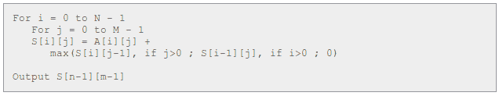

# 京东 2016 研发工程师编程题

## 1

小东所在公司要发年终奖，而小东恰好获得了最高福利，他要在公司年会上参与一个抽奖游戏，游戏在一个 6*6 的棋盘上进行，上面放着 36 个价值不等的礼物，每个小的棋盘上面放置着一个礼物，他需要从左上角开始游戏，每次只能向下或者向右移动一步，到达右下角停止，一路上的格子里的礼物小东都能拿到，请设计一个算法使小东拿到价值最高的礼物。

给定一个 6*6 的矩阵**board**，其中每个元素为对应格子的礼物价值,左上角为[0,0],请返回能获得的最大价值，保证每个礼物价值大于 100 小于 1000。

本题知识点

动态规划

讨论

[该用户已下线](https://www.nowcoder.com/profile/420635)

平面上有 N＊M 个格子，每个格子中放着一定数量的苹果。你从左上角的格子开始， 每一步只能向下走或是向右走，每次走到一个格子上就把格子里的苹果收集起来， 这样下去，你最多能收集到多少个苹果。

解这个问题与解其它的 DP 问题几乎没有什么两样。第一步找到问题的“状态”， 第二步找到“状态转移方程”，然后基本上问题就解决了。

首先，我们要找到这 个问题中的“状态”是什么？我们必须注意到的一点是， 到达一个格子的方式最多只有两种：从左边来的(除了第一列)和从上边来的(除了第一行)。 因此为了求出到达当前格子后最多能收集到多少个苹果， 我们就要先去考察那些能到达当前这个格子的格子，到达它们最多能收集到多少个苹果。 (是不是有点绕，但这句话的本质其实是 DP 的关键：欲求问题的解，先要去求子问题的解)

经过上面的分析，很容易可以得出问题的状态和状态转移方程。 状态 S[i][j]表示我们走到(i, j)这个格子时，最多能收集到多少个苹果。那么， 状态转移方程如下：

```cpp
S[i][j]=A[i][j] + max(S[i-1][j], if i>0 ; S[i][j-1], if j>0)
```

其中 i 代表行，j 代表列，下标均从 0 开始；A[i][j]代表格子(i, j)处的苹果数量。

S[i][j]有两种计算方式：1.对于每一行，从左向右计算，然后从上到下逐行处理；2. 对于每一列，从上到下计算，然后从左向右逐列处理。 这样做的目的是为了在计算 S[i][j]时，S[i-1][j]和 S[i][j-1]都已经计算出来了。


参考网上的。

发表于 2016-08-17 11:20:00

* * *

[南山北](https://www.nowcoder.com/profile/948516)

```cpp
//基于动态规划的思想，不仅仅局限于 6*6 矩阵，适用于所有的 N*M 矩阵以及所有的方阵。
public int getMost(int[][] board) {  
        //两个 for 循环用来遍历二维数组不用多说。
        for(int i = 0 ; i<board.length ; i++){
            for(int j = 0 ; j <board[0].length ; j++){
                if(i==0&&j==0){
                    //如果是起点坐标，不做任何处理。
                }else if(i == 0){
                    //如果走在行的临界边，也就是第一行，那么他只能向右走
                    //向右走的时候该点就要将后面的值加起来。
                    board[i][j] += board[i][j-1];
                }else if(j == 0){
                    //如果走在列的临界边，也就是第一列，那么他只能向下走
                    //向下走的时候该点就要将上面的值加起来。
                    board[i][j] += board[i-1][j];
                }else{
                    //核心点在这，除去两个临界边，剩下的就是既能向右走，也能向下走，
                    //那么这时候就要考虑走到当前点的所有可能得情况，也就是走到当前点
                    //各自路径的和是不是这些所有到达该点路径当中最大的了。
                    //temup 用来存储从该点上面走下来的最大路径和。
                    //templeft 用来存储从该点左边走过来的最大路径的和，
                    int temup = board[i-1][j];
                    int templeft = board[i][j-1];
                  //这两者肯定只能选其一，进行比较，那个大，就把这个值加给当前点，
                  //因为从一开始我们就进行了大小的比较，每一个点存储的都是到达当前点
                  //的最大值。所以直到最后一个点为止，她的值就是当前最大值的和。只要返回
                  //最后一个点的内容就可以了。
                    if(temup>templeft){
                        board[i][j] +=temup ;
                    }else{
                        board[i][j] +=templeft;
                    }
                }
            }
        }
        /*  初始数组的情况。
            564 448 654 186 490 699 
            487 444 563 228 365 261 
            429 505 612 564 715 726 
            464 617 234 647 702 263 
            245 249 231 462 453 646 
            669 510 492 512 622 135  
         */
        /*结束后返回的数组。
        564     1012    1666    1852    2342    3041    
        1051    1495    2229    2457    2822    3302    
        1480    2000    2841    3405    4120    4846    
        1944    2617    3075    4052    4822    5109    
        2189    2866    3306    4514    5275    5921    
        2858    3376    3868    5026    5897    6056
        可以看到，最后一个坐标点的值 6056，他就是当前最优的路径所得出来的值
         */
        return  board[board.length-1][board[0].length-1];
    }

```

编辑于 2016-08-23 15:00:27

* * *

[卷积神经网络哦](https://www.nowcoder.com/profile/8684256)

做烂了的路径 dp 问题 万变不离其宗

当前点的最大总价值 = max(上面点最大总价值，左边点的最大总价值) + 当前点价值(0, 0)点以及第一行和第一列要先初始化一波

```cpp
class Bonus {
public:
    int dp[6][6];
    int getMost(vector<vector<int> > board) {
        memset(dp, 0, sizeof(dp));
        dp[0][0] = board[0][0];
        for(int i = 1; i < 6; i++) dp[0][i] = dp[0][i-1] + board[0][i];
        for(int i = 1; i < 6; i++) dp[i][0] = dp[i-1][0] + board[i][0];
        for(int i = 1; i < 6; i++)
            for(int j = 1; j < 6; j++){
                dp[i][j] = max(dp[i-1][j], dp[i][j-1]) + board[i][j];
            }
        return dp[5][5];
    }
};
```

编辑于 2018-10-12 12:08:11

* * *

## 2

小东和三个朋友一起在楼上抛小球，他们站在楼房的不同层，假设小东站的楼层距离地面 N 米，球从他手里自由落下，每次落地后反跳回上次下落高度的一半，并以此类推直到全部落到地面不跳，求 4 个小球一共经过了多少米？(数字都为整数)

给定四个整数**A**,**B**,**C**,**D**，请返回所求结果。

测试样例：

```cpp
100,90,80,70
```

```cpp
返回：1020
```

本题知识点

数学 基础数学 模拟

讨论

[Fiveplus](https://www.nowcoder.com/profile/936338)

设整数为 x，得到公式：
sn  查看全部)

编辑于 2016-03-26 12:47:34

* * *

[smlnj](https://www.nowcoder.com/profile/124769)

这道题题目说的太过模糊

发表于 2016-12-29 11:17:53

* * *

[carpediem!](https://www.nowcoder.com/profile/861020)

```cpp
import java.util.*;

public class Balls {
    double distance(double n){
        if(n==0)
            return 0;
        return n+n/2+distance(n/2);
    }
    public int calcDistance(int A, int B, int C, int D) {
        return (int)(distance(A)+distance(B)+distance(C)+distance(D));
    }
}
```

这题想要的思路应该是这样的，注意大转小需要强制转化。

发表于 2016-04-08 17:36:13

* * *

## 3

果园里有一堆苹果，一共 n 头(n 大于 1 小于 8)熊来分，第一头为小东，它把苹果均分 n 份后，多出了一个，它扔掉了这一个，拿走了自己的一份苹果，接着第二头熊重复这一过程，即先均分 n 份，扔掉一个然后拿走一份，以此类推直到最后一头熊都是这样(最后一头熊扔掉后可以拿走 0 个，也算是 n 份均分)。问最初这堆苹果最少有多少个？

本题知识点

模拟 数学 动态规划

讨论

[牛客 103647 号](https://www.nowcoder.com/profile/103647)

```cpp
public class Apple {
	 public static int getInitial(int n) {
		 for(int i=n+1;;i++) {
			 int temp=i;
			 int bear=n;
			 while(bear>0) {

				 if(temp%n==1){
					 temp=temp-temp/n-1;
					 bear--;
				 }else {
					 break;
				 }

			 }
			 if(bear==0) {
				 return i; 
			 }
		 }
	 }
	 public static void main(String[] args){
		System.out.println(getInitial(2));
	 }
}

```

无法从后往前推，因为最后一个熊拿到的个数是不确定的，所以就使用遍历，从 n+1 开始，判断在每一次的加减的过程中，该数是否对 n 取余等于 1，如果是则继续减，直到熊的个数等于 0 为止，否则就进入下一个数的判断。

发表于 2015-10-12 10:44:21

* * *

[StudyOfSlagD](https://www.nowcoder.com/profile/313178)

```cpp
import java.util.*;
/**思路：因为每次分 n 堆都会多出来 1 个，所以我们借给熊 n-1 个，以致每次都可以刚好分成 n 堆*/
public class Apples {
    public int getInitial(int n) {
         long a = (long)Math.pow(n, n);
        return (int)a-n+1;
    }
}

```

发表于 2016-09-09 13:26:58

* * *

[Wolsen](https://www.nowcoder.com/profile/381165)

设苹果总数 x, 由题意知（x+n-1） 可被 n 整除，  第一只熊分到 （x+n-1)/n 只苹果（分到的+扔掉的）。  此时还剩下（n-1)(x+n-1)/n 只苹果。 第二只熊分得 （n-1)(x+n-1)/n² 只苹果(分到的+扔掉的），    依次类推   ……    最后一只熊（分到+扔掉）K= (n-1)^(n-1)(x+n-1)/n^n  只苹果。K 为自然数，故分子必须是 n^n 的倍数。  由于(n-1)^(n-1) 与 n^n 互质， 则必有 (x+n-1) = t * n^n 。显然 t 取 1 时 x 最小， x= n^n -n+1。

发表于 2016-03-23 16:25:35

* * *