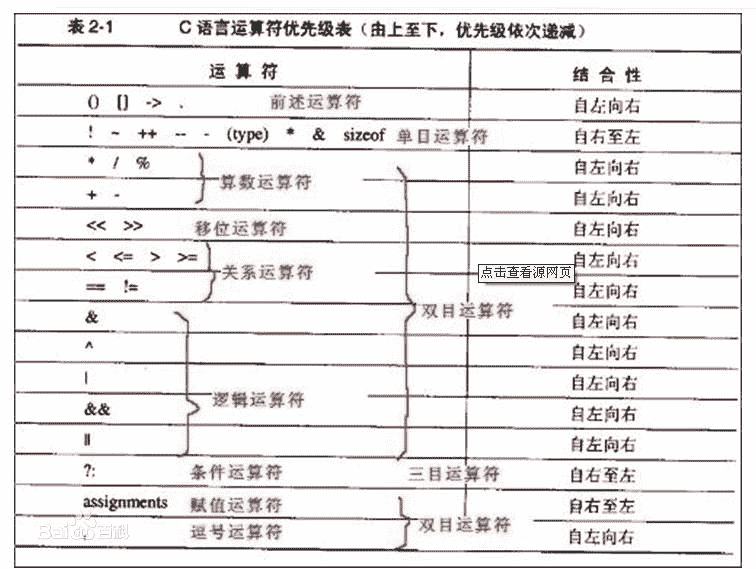

# 滴滴出行 2016 研发工程师笔试题（二）

## 1

关于 ARP 表，以下描述中正确的是（）

正确答案: C   你的答案: 空 (错误)

```cpp
用于在各个子网之间进行路由选择
```

```cpp
提供常用目标地址的快捷方式来减少网络流量
```

```cpp
用于建立 IP 地址到 MAC 地址的映射
```

```cpp
用于进行应用层信息的转换
```

本题知识点

网络基础

讨论

[阿里巴巴宜搭团队招聘](https://www.nowcoder.com/profile/927755)

ARP 是地址解析协议，工作在网络层，简单语言解释一下工作原理。

1：首先，每个主机都会在自己的 ARP 缓冲区中建立一个 ARP 列表，以表示 IP 地址和 MAC 地址之间的对应关系。

2：当源主机要发送数据时，首先检查 ARP 列表中是否有对应 IP 地址的目的主机的 MAC 地址，如果有，则直接发送数据，如果没有，就向本网段的所有主机发送 ARP 数据包，该数据包包括的内容有：源主机 IP 地址，源主机 MAC 地址，目的主机的 IP  地址。

3：当本网络的所有主机收到该 ARP 数据包时，首先检查数据包中的 IP 地址是否是自己的 IP 地址，如果不是，则忽略该数据包，如果是，则首先从数据包中取出源主机的 IP 和 MAC 地址写入到 ARP 列表中，如果已经存在，则覆盖，然后将自己的 MAC 地址写入 ARP 响应包中，告诉源主机自己是它想要找的 MAC 地址。

4：源主机收到 ARP 响应包后。将目的主机的 IP 和 MAC 地址写入 ARP 列表，并利用此信息发送数据。如果源主机一直没有收到 ARP 响应数据包，表示 ARP 查询失败。

广播发送 ARP 请求，单播发送 ARP 响应。所以，答案应该选择 C 选项。

发表于 2015-10-13 13:24:43

* * *

[zt_xcyk](https://www.nowcoder.com/profile/839070)

CARP “地址解析协议”，就是主机在发送帧前将目标 IP 地址转换成目标 MAC 地址的过程。ARP 协议的基本功能就是通过目标设备的 IP 地址，查询目标设备的 MAC 地址，以保证通信的顺利进行。

发表于 2015-10-12 12:30:16

* * *

[牛客 921352209 号](https://www.nowcoder.com/profile/921352209)

：

发表于 2020-07-27 11:25:41

* * *

## 2

下列有关 Socket 的说法，错误的是（）

正确答案: B   你的答案: 空 (错误)

```cpp
Socket 用于描述 IP 地址和端口，是一个通信链的句柄
```

```cpp
Socket 通信必须建立连结
```

```cpp
Socket 客户端的端口是不固定的
```

```cpp
Socket 服务端的端口是固定的
```

本题知识点

网络基础

讨论

[阿里巴巴宜搭团队招聘](https://www.nowcoder.com/profile/927755)

  查看全部)

编辑于 2016-05-11 22:26:06

* * *

[XQ](https://www.nowcoder.com/profile/554854)

B socket 可以基于 TCP 面向连接 也可以基于 UDP 无连接

发表于 2015-10-13 18:48:42

* * *

[心静](https://www.nowcoder.com/profile/437950)

在客户端程序里，实际上客户端用哪个端口发送数据是不固定，是由系统分配的，当然向服务器哪个端口发送是固定的

发表于 2015-10-12 19:57:37

* * *

## 3

下列 PHP 配置项中，哪一个和安全最不相关:() 

正确答案: D   你的答案: 空 (错误)

```cpp
open_basedir
```

```cpp
register_globals
```

```cpp
disable_functions
```

```cpp
file_uploads
```

本题知识点

PHP

讨论

[心静](https://www.nowcoder.com/profile/437950)

**open_basedir**

  查看全部)

编辑于 2016-10-04 00:31:42

* * *

[牛客 5835765 号](https://www.nowcoder.com/profile/5835765)

**open_basedir ****可将用户访问文件的活动范围限制在指定的区域 **，通常是其家目录的路径，也   可用符号 "." 来代表当前目录。注意用 open_basedir 指定的限制实际上是前缀 , 而不是目录名。   举例来说 : 若 "open_basedir = /dir/user", 那么目录 "/dir/user" 和 "/dir/user1"都是   可以访问的。所以如果要将访问限制在仅为指定的目录，请用斜线结束路径名。例如设置成 : "open_basedir = /dir/user/" 

**register_globals ****的意思就是注册为全局变量 **，所以当 On 的时候，传递过来的值会被直接的注册为全局变量直接使用，而 Off 的时候，我们需要到特定的数组里去得到它。 1.PHP  [4.2.0 ](http://www.php.net/releases/4_2_0.php)  版开始配置文件中   ** register_globals ** 的默认值从  on  改为  off  了，虽然你可以设置它为 On ，但是当你无法控制服务器的时候，你的代码的兼容性就成为一个大问题，所以，你最好从现在就开始用 Off 的风格开始编程。 2. **当 ****register_globals ****打开以后，各种变量都被注入代码，例如来自 **** HTML  ****表单的请求变量。再加上 **** PHP  ****在使用变量之前是无需进行初始化的，这就使得更容易写出不安全的代码。 **当打开时，人们使用变量时确实不知道变量是哪里来的，只能想当然。但是 **register_globals ** 的关闭改变了这种代码内部变量和客户端发送的变量混杂在一起的糟糕情况。

**disable_functions ****限制程序使用一些可以直接执行系统命令的函数 **，如 system ， exec ， passthru ， shell_exec ， proc_open 等等。所以如果想保证服务器的安全，请将这个函数加到 disable_functions 里或者将安全模式打开吧

file_uploads ， PHP 文件上传功能记录 file_uploads 指令决定是否启用，默认值： On 。

发表于 2018-03-06 20:22:12

* * *

[晓峰 123](https://www.nowcoder.com/profile/6079486)

*   ```cpp
    open_basedir 将用户可操作的文件限制在某目录下 register_globals 的意思就是注册为全局变量，所以当 On 的时候，传递过来的值会被直接的注册为全局变量直接使用，而 Off 的时候，我们需要到特定的数组里去得到它。

    ```
    disable_functions  禁用函数

    ```cpp
    file_uploads 是否同意上传
    ```

    ```cpp

    ```

发表于 2017-11-17 10:37:13

* * *

## 4

在深度学习中，涉及到大量矩阵相乘，现在需要计算三个稠密矩阵 A,B,C 的乘积 ABC，假设三个矩阵的尺寸分别为 m*n,n*p,p*q,且 m<n<p<q，以下计算顺序效率最高的是：（）

正确答案: B   你的答案: 空 (错误)

```cpp
A(BC)
```

```cpp
(AB)C
```

```cpp
(AC)B
```

```cpp
所有效率都相同
```

本题知识点

机器学习

讨论

[心静](https://www.nowcoder.com/profile/437950)

a*b,b*c 两矩阵相乘效率为 a*c*bABC=(AB)C=A(BC).(AB)C = m*n*p + m*p*q,A(BC)=n*p*q + m*n*q.

m*n*p<m*n*q,m*p*q< n*p*q, 所以 (AB)C 最小

发表于 2015-10-12 20:21:50

* * *

[魅影骑士](https://www.nowcoder.com/profile/841834)

首先，根据简单的矩阵知识，因为 A*B ， A 的列数必须和 B 的行数相等。因此，可以排除 C 选项，

然后，再看 A 、 B 选项。在 A 选项中， m*n 的矩阵 A 和 n*p 的矩阵 B 的乘积，得到 m*p 的矩阵 A*B ，而 A*B 的每个元素需要 n 次乘法和 n-1 次加法，忽略加法，共需要 m*n*p 次乘法运算。同样情况分析 A*B 之后再乘以 C 时的情况，共需要 m*p*q 次乘法运算。因此， A 选项的(AB)C 需要的乘法次数是 m*n*p+m*p*q 。同理分析， B 选项的 A (BC)需要的乘法次数是 n*p*q+m*n*q 。

由于 m*n*p< m*n*q ， m*p*q<n*p*q ，显然 A 运算次数更少，故选 A 。

发表于 2017-01-10 18:34:24

* * *

[Jarwis](https://www.nowcoder.com/profile/561524)

A. m*n*q + n*p*qB. m*n*p + m*p*qC. 错误，因为 n 和 p 不相等。由于 m<n<p<q，所以选 B。

发表于 2016-08-16 15:49:11

* * *

## 5

如果 137+276=435，那么 731+672=（）

正确答案: D   你的答案: 空 (错误)

```cpp
1513
```

```cpp
1403
```

```cpp
534
```

```cpp
1623
```

本题知识点

数学运算

讨论

[MAvin](https://www.nowcoder.com/profile/161216)

  查看全部)

编辑于 2015-12-14 11:02:46

* * *

[奔跑的威威](https://www.nowcoder.com/profile/864907)

我觉得这个题目很牵强吧，只有一个例子，所以什么规律完全可以自己任意定吧，你们说的八进制完全只是一种猜想而已，所以至少应该出两个例子，才能证明结论

发表于 2015-12-13 23:52:20

* * *

[kikoy](https://www.nowcoder.com/profile/2226449)

首先根据表达式推导是几进制，假设是 n 进制：1*n^(2+) 3*n+7+2*n² +7*n+6=4*n² +3*n+5,化简为 n² -7n-8=0，可解出 n=8;所以是 8 进制

发表于 2016-09-04 20:53:54

* * *

## 6

C 语言中 5|7 的结果是（）

正确答案: D   你的答案: 空 (错误)

```cpp
1
```

```cpp
3
```

```cpp
5
```

```cpp
7
```

本题知识点

C++工程师 牛客 C 语言

讨论

[龙小飞的 2016](https://www.nowcoder.com/profile/282013)

C 语言中：||为逻辑或，只要有一个为真，即为逻辑真 1                 |位按位或，化成二进制进行或运算。5|7=0101|0111=0111=7

发表于 2015-10-12 12:00:01

* * *

[牛客 896934 号](https://www.nowcoder.com/profile/896934)

这题考察运算符：按照优先级顺序排列如下：~（按位取反    单目运算符） ~5 == ~0101（二进制形式） == 1010（二进制形式） == 10&（按位与       双目运算符）5&7 == 0101 & 0111（二进制形式）== 0101 == 5^（按位异或    双目运算符）5⁷ == 0101 ^ 0111 (二进制形式) == 0010 == 2|（按位或        双目运算符）5|7 == 0101 | 0111（二进制形式）== 0111 == 7 如有错误，恳请指正！

发表于 2016-06-18 10:06:52

* * *

[zt_xcyk](https://www.nowcoder.com/profile/839070)

D     0101     0111|    0111 也就是 7

发表于 2015-10-12 12:36:20

* * *

## 7

如果计算机内存大小为 32M，按字节编码，则表示该内存地址至少需要()位?

正确答案: A   你的答案: 空 (错误)

```cpp
25
```

```cpp
32
```

```cpp
24
```

```cpp
16
```

本题知识点

编译和体系结构

讨论

[Xuan_Yeah](https://www.nowcoder.com/profile/191867)

32M = 2⁵ MM = 2¹⁰ KK = 2 ¹⁰ 字节则最少需要 25 位才能寻址到 32M

发表于 2015-10-15 08:00:21

* * *

[melon](https://www.nowcoder.com/profile/200602)

就是 2 的多少次方大于 32M 就行了

发表于 2015-10-14 18:44:52

* * *

[从小就犯困](https://www.nowcoder.com/profile/992758)

32M 就是 2^(10+10+5） 所以就是 25 位可以寻址到 32M

发表于 2015-10-12 13:27:30

* * *

## 8

如果我们可以通过覆盖率检测来判断我们是否对所有的路径都进行了测试，但是仍然可能存在未被检测出来的缺陷，原因是（）

正确答案: A   你的答案: 空 (错误)

```cpp
全部选项
```

```cpp
程序可能因为缺某些路径而存在问题
```

```cpp
穷举路径的测试可能不好暴露数据敏感的错误
```

```cpp
就算穷举路径测试也不能保证程序符合需求
```

本题知识点

软件测试

讨论

[Offer 会有的！](https://www.nowcoder.com/profile/7150957)

根据多年的考试经验，有全部都选的一定是全部都选😂😂

发表于 2018-03-26 16:11:37

* * *

[小静 ya](https://www.nowcoder.com/profile/6029815)

我也觉得是 D

发表于 2017-07-23 13:52:24

* * *

[小念宗](https://www.nowcoder.com/profile/967526766)

这种题很坑人的

发表于 2019-02-24 21:36:24

* * *

## 9

我们在将某个订单送给某一司机之前，需要计算一下这个司机选择接受这个订单的概率，现有 A,B 两个订单，对某一司机。已知：1.如果只将订单 A 播送给司机，司机接受的概率是 Pa;2.如果只将订单 B 播送给司机，司机接受的概率是 Pb;现在讲 A，B 同时播送给该司机，司机选择 A 的概率是多少（）

正确答案: C   你的答案: 空 (错误)

```cpp
Pa
```

```cpp
Pa*(1-Pb)
```

```cpp
Pa*(1-Pb)/(1-Pa*Pb)
```

```cpp
[1-(1-Pa)*(1-Pb)]*Pa/(Pa+Pb)
```

本题知识点

概率统计 *讨论

[牛客 2876549 号](https://www.nowcoder.com/profile/2876549)

首先 A、B 肯定是独立事件，否则做不了。则 P(A) = Pa(1-Pb)，P(B)=Pb(1-Pa)，P(AB)=PaPb，P(不接)=(1-Pa)(1-Pb)

1.  *若是两单可以同时接，题目的意思是只要有 A 就行，即 A、AB 都可。 那概率为 P(A)+P(AB) = Pa，选 A。*
2.  *若是两单可以同时接，题目意思只能接 A。那么概率是 P(A) = Pa(1-Pb)*
3.  *若两单只能接一单或不接，即去掉 AB。那么概率为 P(A)/(1-P(AB)) = Pa(1-Pb)/(1-PaPb)，选 C*

编辑于 2017-05-07 13:26:19

* * *

[昊 offer](https://www.nowcoder.com/profile/2067915)

该题有个隐含的条件：当两个订单同时播送给司机的时候，至多能选一个设 A 代表事件：司机选 A 订单；B 代表事件：司机至多选一个订单题目所求 P(A|B) = P(AB) / P(B) = P(A) / P(B) = **Pa(1-Pb) / 1-Pa*Pb**

发表于 2018-03-27 11:07:25

* * *

[牛客 906916 号](https://www.nowcoder.com/profile/906916)

(1-pa)*(1-pb)是两个单都不接的概率，1-(1-pa)*(1-pb)是接单的概率 Pa/(Pa+Pb)是在两者中选择 Pa 的概率

编辑于 2017-05-08 11:50:45

* * *

## 10

下述几种排序方法中，要求内存最大的是（）

正确答案: D   你的答案: 空 (错误)

```cpp
快速排序
```

```cpp
插入排序
```

```cpp
选择排序
```

```cpp
归并排序
```

本题知识点

排序 *讨论

[菜鸟葫芦娃](https://www.nowcoder.com/profile/415611)

这个题要求的是空间复杂度。

冒泡排序,简单选择排序,堆排序,直接插入排序,希尔排序的空间复杂度为 O(1),因为需要一个临时变量来交换元素位置,(另外遍历序列时自然少不了用一个变量来做索引)

快速排序空间复杂度为 logn(因为递归调用了) ,归并排序空间复杂是 O(n),需要一个大小为 n 的临时数组.

基数排序的空间复杂是 O(n),桶排序的空间复杂度不确定

发表于 2015-10-12 13:18:45

* * *

[程序猿 Go 师傅](https://www.nowcoder.com/profile/242025553)


编辑于 2019-10-21 21:27:27

* * *

[xxxxxxxxxxxxxxxa](https://www.nowcoder.com/profile/4397117)

快排 O(1)插排 O(1)选择排序 O(1)归并      O(n)多说一点 堆排 根据实现策略，有 O(1)的方法，也有 O(n)的笨方法

发表于 2018-06-17 17:26:51

* * *

## 11

链表不具有的特点是（）

正确答案: C   你的答案: 空 (错误)

```cpp
不需要事先估计存储空间大小
```

```cpp
所需空间和线性表长度成正比
```

```cpp
可随机访问任一元素
```

```cpp
插入删除不需要移动表内其他元素
```

本题知识点

链表 *讨论

[keyu88888](https://www.nowcoder.com/profile/7050559)

链表是一种物理 [存储单元](http://baike.baidu.com/view/1223079.htm) 上非连续、非顺序的 [存储结构](http://baike.baidu.com/view/2820182.htm) ， [数据元素](http://baike.baidu.com/view/38785.htm) 的逻辑顺序是通过链表中的 [指针](http://baike.baidu.com/view/159417.htm) 链接次序实现的。链表由一系列结点（链表中每一个元素称为结点）组成，结点可以在运行时动态生成。链表结构可以克服 [数组](http://baike.baidu.com/view/209670.htm) 链表需要预先知道数据大小的缺点，链表结构可以充分利用计算机内存空间，实现灵活的内存动态管理。但是链表失去了 [数组](http://baike.baidu.com/view/209670.htm) 随机读取的优点，同时链表由于增加了结点的 [指针](http://baike.baidu.com/view/159417.htm) 域，空间开销比较大。

发表于 2016-11-03 14:26:49

* * *

[冬雪人](https://www.nowcoder.com/profile/285757)

可随机访问任意元素，是顺序表的特点。链表访问其他元素，需要后继节点

发表于 2016-03-03 18:14:21

* * *

[zt_xcyk](https://www.nowcoder.com/profile/839070)

Clist 中的对象是离散存储的，随机访问某个元素需要遍历 list

发表于 2015-10-12 12:33:33

* * *

## 12

表达式"X=A+B*(C-D)/E+F"的后缀表示形式可以为（） 

正确答案: C   你的答案: 空 (错误)

```cpp
XAB+CDEF/-*+=
```

```cpp
XA+BC-DE/*F+=
```

```cpp
XABCD-*E/+F+=
```

```cpp
XABCDEF+*/+=
```

本题知识点

编程基础 *讨论

[Xuan_Yeah](https://www.nowcoder.com/profile/191867)

严格按照从左向右的顺序（运算对象在前，符号在后）计算：1:cd-2:bcd-*3:bcd-*e/4:abcd-*e/+5:abcd-*e/+f+6: XABCD-*E/+F+=

发表于 2015-10-15 08:24:20

* * *

[旭>_](https://www.nowcoder.com/profile/2709654)

这里贴一个简单的方法 来源: http://blog.csdn.net/whatforever/article/details/6738538 具体步骤 1: (X=((A+((B*(C-D))/E))+F))2: (X((A((B(CD)-)*E)/)+)F)+)=3: XABCD-*E/+F+=

发表于 2017-02-18 17:36:33

* * *

[完美有多美](https://www.nowcoder.com/profile/267299)

不包含括号， [运算符](http://baike.baidu.com/view/425996.htm) 放在两个运算对象的后面，所有的计算按运算符出现的顺序，严格从左向右进行（不再考虑运算符的优先规则，如：(2 + 1) * 3 ， 即 2 1 + 3 *

发表于 2015-10-14 11:20:37

* * *

## 13

同源策略是浏览器的安全基石，但互联网业务往往需要实现跨域通信，以下哪一种方案可以实现跨域？（）

正确答案: D   你的答案: 空 (错误)

```cpp
CSP
```

```cpp
AJAX
```

```cpp
Oauth
```

```cpp
CORS
```

本题知识点

网络基础

讨论

[Mr.Huai](https://www.nowcoder.com/profile/117212)

我就是觉得 CORS 长得比较像 cross

发表于 2016-08-04 20:46:40

* * *

[hellowww](https://www.nowcoder.com/profile/924580)

同源策略（Same Origin Policy，SOP）是指浏览器请求的资源必须是同域名、同协议、同端口。不同源的客户端脚本（js，actionscript）在没有明确的授权的情况下不能读取对方的资源。跨源资源（CrossOrigin Resources Sharing，CORS ）是一种允许多种资源在一个 web 页面请求域之外的另一个域的资源的协议，是为了让 AJAX 能够跨域而生的。内容安全策略（Content Security Policy，CSP）是一种白名单机制，限制网站中是否可以包含某来源的内容。Oauth 是一个关于授权的开放网络标准，相当于在客户端与服务器之间添加了一个授权层。

发表于 2015-10-17 20:40:40

* * *

[菜鸟葫芦娃](https://www.nowcoder.com/profile/415611)

跨域可以通过使用 AJAX+JSONP ，AJAX+CROS 等。针对这个题目 可以选择 BD 。可以看看这个链接的讲解：http://zm10.sm-img2.com/?src=http%3A%2F%2Fwww.cnblogs.com%2FDarren_code%2Fp%2Fcors.html&uid=f7a484635001c220714cd1aba65cc84d&hid=40ac30b2ab771e6ad0cd5d89f066dad8&pos=3&cid=9&time=1444627706464&from=click&restype=1&pagetype=0000004000000402&bu=structure_web_info&query=cors&mode=&uc_param_str=dnntnwvepffrgibijbprsvpi

编辑于 2015-10-12 13:44:14

* * *

## 14

采用多路 I/O 复用监听 3 个套接字的数据时，如果套接字描述符分别是：5，17，19，则下面 select 代码中的 maxfd 应取为（）

```cpp
select(int maxfd,struct fd_set* rdset,NULL,NULL)
```

正确答案: B   你的答案: 空 (错误)

```cpp
4
```

```cpp
20
```

```cpp
5
```

```cpp
19
```

本题知识点

Linux

讨论

[牛客 454970 号](https://www.nowcoder.com/profile/454970)

Maxfd 是三个套接字描述符中最大数字加上 1

发表于 2015-10-12 16:54:35

* * *

[1988coding](https://www.nowcoder.com/profile/313317)

Maxfd 要监视的文件描述符的范围，一般取监视的描述符数的最大值+1

发表于 2017-05-29 17:19:18

* * *

[BrainerGao](https://www.nowcoder.com/profile/516342)

最大套接字描述符+1

发表于 2016-08-23 22:06:24

* * *

## 15

对于下面的 C 语言声明描述正确的一项是（）

> char (*p)[16]

正确答案: C   你的答案: 空 (错误)

```cpp
p 是长度为 16 的字符指针数组
```

```cpp
p 是包含 16 个字符的字符串
```

```cpp
p 是指向长度为 16 的字符数组的指针
```

```cpp
p 是长度为 16 的字符数组
```

本题知识点

C++

讨论

[Pandora](https://www.nowcoder.com/profile/266279)

p 和谁先结合，p 就是什么。**[]的运算级别大于***，1、char *p[16]，根据运算优先级，[]优于*，所以 p 和[]先结合，因此 p 是数组；2、char (*p)[16]，p 和*由括号括住，p 和*先结合，因此 p 是 指针 。

发表于 2015-10-15 21:47:48

* * *

[lymeixue](https://www.nowcoder.com/profile/653175)

char *p[16] , p 是一个包含 16 个元素的 Char 型指针数组
char (*p)[16], p 是一个指针，指向一个包含 16 个元素的 Char 数组

编辑于 2015-10-15 16:27:16

* * *

[一个人的天空](https://www.nowcoder.com/profile/174801)

```cpp
#include <stdio.h>
```

```cpp
int main(int argc,char *argv[])
```

```cpp
{
```

```cpp
    int b[5] = {5,6,7,8,9};
```

```cpp
    int a[5] = {1,2,3,4,5};
```

```cpp
    int (*p)[5];
```

```cpp
    int *q[5];
```

```cpp
    q[0] = b;
```

```cpp
p = &a; 
```

```cpp
    int i = 0;
```

```cpp
    for(i = 0;i<5;i++)
```

```cpp
{ 
```

```cpp
         printf("%d ",*(*p+i));
```

```cpp
         printf("%d ",p[0][i]);
```

```cpp
         printf("%d ",q[0][i]);
```

```cpp
} 
```

```cpp
    return 0;
```

} 

发表于 2015-10-30 07:37:22

* * *

## 16

```cpp
int main{
    fork() || fork()
}
```

共创建了（）个进程

正确答案: A   你的答案: 空 (错误)

```cpp
3
```

```cpp
2
```

```cpp
1
```

```cpp
4
```

本题知识点

Linux

讨论

[幻之飞雪](https://www.nowcoder.com/profile/442784)

fork()给子进程返回一个零值，而给父进程返回一个非零值；在 main 这个主进程中，首先执行 fork() || fork(), 左边的 fork()返回一个非零值，根据||的短路原则，前面的表达式为真时，后面的表达式不执行，故包含 main 的这个主进程创建了一个子进程，由于子进程会复制父进程，而且子进程会根据其返回值继续执行，就是说，在子进程中， fork() ||fork()这条语句左边表达式的返回值是 0, 所以||右边的表达式要执行，这时在子进程中又创建了一个进程，即 main 进程->子进程->子进程，一共创建了 3 个进程。参考自 http://www.nowcoder.com/questionTerminal/b8321978323c43c694a561d151e69fd0?orderByHotValue=1&pos=13&mutiTagIds=618

编辑于 2015-10-12 10:27:18

* * *

[xshqhua](https://www.nowcoder.com/profile/938552)

什么时候要算主进程？什么时候不需要算？我也是醉了，之前的题目不需要算，我算进去了，结果多了一个，这个题目需要算，我没有算。结果少了一个。请指点：到底是什么时候要算，什么时候不需要算！！！！！！xshqhua@gmail.com

发表于 2016-08-22 15:10:15

* * *

[llllzzz](https://www.nowcoder.com/profile/3633142)

题目不严谨吧，问的是共创建了几个进程，而不是执行这个程序后一共有几个进程。main()函数进程是系统创建的，然后会 fork 两个子进程出来。所以应该一共创建了 2 个进程，此时系统中一共有 3 个进程。

发表于 2017-09-23 15:49:28

* * *****